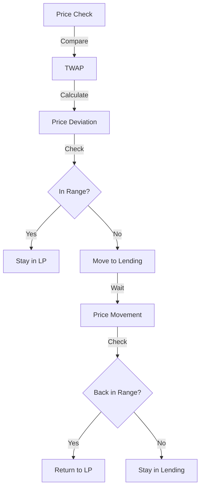

# UHI Hook Directory

Exported and PII-scrubbed. 562 hook entries.

---

# UHI Hook Directory

# UHI Hook Directory

This directory was created by [Atrium Academy](https://atrium.academy) to showcase projects built from the [Uniswap Hook Incubator](https://atrium.academy/uniswap)

We’re now accepting public hook submissions [here](https://www.notion.so/1545f0444abe803997e0d26a51c60e25?pvs=21) and will feature them soon!

- **Legal Disclaimer**
    
    Uniswap Protocol v4 enables a potentially infinite variety of project development via hook deployment, and any of those projects might touch on different areas of laws or regulations in different forums. Atrium Academy requires compliance with all applicable laws and regulations, and it is incumbent on builders to consult with legal counsel as appropriate to determine the legal requirements and restrictions (if any) for their projects.
    
    The hook code provided herein is offered on an “as-is” basis and has not been audited for security, reliability, or compliance with any specific standards or regulations. It may contain bugs, errors, or vulnerabilities that could lead to unintended consequences. 
    
    Users are strongly encouraged to review, test, and, if necessary, audit the hooks independently before deploying in any environment.
    
    By proceeding to utilize these hooks, you indicate your understanding and acceptance of [this full disclaimer](https://atrium.academy/terms-of-service#legal-disclaimer).
    

[Hook Pages](UHI%20Hook%20Directory/Hook%20Pages%[phone removed]b17d4b78a76e5dc6ae9d74d0.csv)

*Uniswap Protocol v4 enables a potentially infinite variety of project development via hook deployment, and any of those projects might touch on different areas of laws or regulations in different forums. Atrium Academy encourages compliance with all applicable laws and regulations, and it is incumbent on builders to consult with legal counsel as appropriate to determine the legal requirements and restrictions (if any) for their projects.*

---

# 1Tx

# 1Tx

Description: OneTx is a DeFi abstraction layer that gives you one simple interface to manage all your yield positions and create yield strategies with tokenised vaults
Tags: Cross-Chain, Stablecoins, Tokenized Stocks, Unichain, Yield Farming
Integrations: Unichain
Submission Type: Hook Incubator (UHI)
Cohort: UHI8
Prize: Uniswap Prize

# How did you integrate our partners, if any?

We deployed our adapters, registry, bridge, hook and yield strategies in Unichain

# What are the key links to share? (Ex. demo video, GitHub, deck)

Github:[https://github.com/Pond3rxyz/1tx-contracts](https://github.com/Pond3rxyz/1tx-contracts)
Slides: [https://docs.google.com/presentation/d/19Siuz09ZkJ5m_LkerdzEoaQBfNBelCJd/edit?usp=sharing&ouid=[phone removed]&rtpof=true&sd=true](https://docs.google.com/presentation/d/19Siuz09ZkJ5m_LkerdzEoaQBfNBelCJd/edit?usp=sharing&ouid=[phone removed]&rtpof=true&sd=true)
Project Link:[https://app.1tx.fi/](https://app.1tx.fi/)
Demo Video:[https://youtu.be/iXzzHYkzNHQ](https://youtu.be/iXzzHYkzNHQ)

# Problem / Background: What inspired the idea? What problems are you solving?

Digital markets are offering increasingly competitive yields and financial opportunities. Funds, trading firms, and traditional banks are all beginning to explore DeFi — with particular interest in converting fiat deposits into tokenised deposits in pursuit of better yields.
But accessing and managing capital across multiple ecosystems, tokens, and chains is inherently complex, with each transaction requiring multiple steps: swap, bridge, deposit. This friction is blocking adoption at scale.

# Impact: What makes this project unique? What impact will this make?

That's why we built 1TX — an abstraction layer that enables seamless operations across ecosystems, tokens, and chains. It allows operators to execute complex strategies programmatically and deploy their own tokenised deposit strategies. 
This multi-step process takes place into a single atomic transaction. This will allow a wider adoption of DeFi, programatic execution for managers and AI agents and fintechs and other institutions to offer personalised tokenised deposits with embedded yield strategies 

# Challenges: What was challenging about building this project?

It was challenging to use the hook to be able to tokenize the strategy and to allocate the funds without using pool liquidity, using NAV as pricing instead of AMM pricing

# Team: Who is on the team? What are their backgrounds?

Ivan co-founder and developer with extensive experience in web3 having built for protocols like AAVE or the Graph has also a background as a software developer in banking 
Teresa, co-founder, background in traditional financial services and risk, with over 6 years working in web3 has been in charge of  product validation, design and business development

---

# AI Agent-Based Simulation of Uniswap V4 Hooks

# AI Agent-Based Simulation of Uniswap V4 Hooks

Description: The goal of this project is to simulate and analyze user interactions and economic dynamics of Uniswap V4 liquidity pools by leveraging agent-based models (ABMs) driven by advanced Large Language Models (LLMs). Specifically, this project aims to utilize the [Elisa OS framework](https://github.com/elizaOS/eliza), adapting it into a specialized plugin to integrate with Uniswap V4's "hooks".
Tags: DeFi, Security
Submission Type: Hook Incubator (UHI)
Cohort: UHI4

# What are the key links to share? (Ex. demo video, GitHub, deck)

https://github.com/achiko/agent_based_hook_simulation

# Problem / Background: What inspired the idea? What problems are you solving?

The idea is to leverage advanced agent-based simulations inspired by OASIS(https://arxiv.org/pdf/[phone removed]) to explore and understand user interactions and economic dynamics of Uniswap V4 Hooks. By utilizing AI-generated agents through the Elisa OS framework, the project aims to realistically model user behaviors, facilitating comprehensive analysis and optimization of Pool mechanisms.

# Impact: What makes this project unique? What impact will this make?

This project uniquely combines advanced AI-driven agent simulations with Uniswap V4's innovative Hooks, creating a first-of-its-kind simulation framework for decentralized finance (DeFi). By enabling highly realistic and scalable modeling of user interactions, the project significantly improves the ability to predict market behaviors, optimize liquidity strategies, and thoroughly test DeFi mechanisms before deployment. Its impact lies in empowering protocol researchers and developers to design more resilient, economically sound, and user-aligned decentralized financial ecosystems.

# Challenges: What was challenging about building this project?

I have just started building and will update this part soon.

# Extension: How might you extend the idea with more funding or time?

I believe realistic user simulations will benefit not only the Uniswap protocol but also the entire ecosystem. AI agents equipped with memory and predefined characteristics will significantly enhance the accuracy and effectiveness of these simulations.

# Team: Who is on the team? What are their backgrounds?

I'm a developer with more than 15 years of experience across different fields. For the last 5-6 years, I've been actively involved in the Ethereum ecosystem, specializing in EVM, Solidity, EVM data indexing, and building various interesting RWA projects. I participated in many hackathons and contests, and also won an ETH Global prize for building a Uniswap V3 deployment plugin for Hardhat.

---

# AI Governance Hook

# AI Governance Hook

Description: AI Governance Hook is an intelligent parameter management system for Uniswap v4 pools that uses deterministic AI models running in EigenCompute TEEs to optimize swap fees and other parameters in real time. Every recommendation is cryptographically attested and fully replayable, so governance can move at market speed while remaining transparent and verifiable.
Tags: AI Governance, Deterministic ML, Dynamic Fees, EigenAI, EigenCompute, EigenLayer, LP Yield Optimization, Parameter Optimization, Risk-Aware Parameters, Uniswap v4 Hook
Integrations: EigenLayer
Submission Type: Hook Incubator (UHI)
Cohort: UHI7
Prize: EigenLayer Prize

# How did you integrate our partners, if any?

I integrated EigenLayer by running the AI governance logic inside an EigenCompute TEE, and using EigenAI for deterministic, reproducible inference. The TEE signs each recommendation, and on-chain contracts verify these EigenLayer attestations before applying new pool parameters, so only authorized, tamper-proof AI outputs can change Uniswap v4 pool settings.

# What are the key links to share? (Ex. demo video, GitHub, deck)

Github:[https://github.com/Najnomics/AI-Governance-Hook](https://github.com/Najnomics/AI-Governance-Hook)
Slides: [https://gamma.app/docs/AI-Governance-Hook-for-Uniswap-V4-agtjy3v05ebe30m](https://gamma.app/docs/AI-Governance-Hook-for-Uniswap-V4-agtjy3v05ebe30m)
Project Link:
Demo Video:[https://youtu.be/mqTQdkqu6pU](https://youtu.be/mqTQdkqu6pU)

# Problem / Background: What inspired the idea? What problems are you solving?

Today most Uniswap pools run with static parameters (like a fixed 0.3% fee) and rely on slow DAO proposals to change anything, even though volatility, volume, and risk change every hour. That means LPs earn suboptimal returns in calm markets, take unnecessary losses in volatile markets, and governance always reacts after the fact. At the same time, typical “AI” systems are opaque and non-deterministic, so DeFi users can’t trust them. AI Governance Hook was inspired by the need for faster, data-driven parameter updates that are still transparent, reproducible, and verifiable on-chain.

# Impact: What makes this project unique? What impact will this make?

AI Governance Hook is unique because it combines deterministic AI + EigenCompute TEEs + Uniswap v4 hooks to create an automated governor whose decisions anyone can replay bit-for-bit. Instead of guessing a single fee level forever, pools can continuously adjust within DAO-set bounds to match current risk and demand, improving LP APRs and capital efficiency. If deployed widely, this kind of verifiable AI governance could unlock materially higher revenue for LPs, attract more TVL, and become a blueprint for how DeFi protocols safely use AI for on-chain decision making.

# Challenges: What was challenging about building this project?

The hardest parts were designing a flow where AI models stay deterministic, yet still react to noisy market data, and then wiring that into EigenCompute so the enclave can prove to the chain that it actually ran the expected model. I also had to carefully define governance bounds and safety rails so the hook can’t push parameters to crazy values, and build a clean separation between off-chain components (keepers, data services, EigenAI calls) and the on-chain verifier logic. Getting tests to reach 100% coverage across this many moving parts was another big challenge.

# Team: Who is on the team? What are their backgrounds?

---

# AIMSWAP Hook

# AIMSWAP Hook

Description: AIMSWAP Hook is a privacy-preserving Coincidence of Wants (CoW) protocol for Uniswap v4 using Fhenix FHE (Fully Homomorphic Encryption) via CoFHE coprocessor. The project implements encrypted intent matching that falls back to AMM when no match is found.
Tags: CoW, MEV
Integrations: Fhenix
Submission Type: Hook Incubator (UHI)
Cohort: UHI7

# How did you integrate our partners, if any?

AIMSWAP integrates Fhenix by encrypting user swap intents (amountIn, minReturn, direction) through cofhe-js before storing them in v4 storage. The matcher uses FHE.areAmountsCompatible() to check match viability without decrypting, and only the winning matched pair gets decrypted via the Fhenix coprocessor. This enables fully private, MEV-resistant CoW matching inside Uniswap v4.

# What are the key links to share? (Ex. demo video, GitHub, deck)

Github:[https://github.com/yusuf-abdoul/AIMSWAP-Hook.git](https://github.com/yusuf-abdoul/AIMSWAP-Hook.git)
Slides: 
Project Link:[https://docs.google.com/document/d/1pDfwoQC1BmpE8JwN6FKwn2O3QaWPe4yiKQXBnDrYWEw/edit?usp=drive_link](https://docs.google.com/document/d/1pDfwoQC1BmpE8JwN6FKwn2O3QaWPe4yiKQXBnDrYWEw/edit?usp=drive_link)
Demo Video:[https://docs.google.com/document/d/1pDfwoQC1BmpE8JwN6FKwn2O3QaWPe4yiKQXBnDrYWEw/edit?usp=drive_link](https://docs.google.com/document/d/1pDfwoQC1BmpE8JwN6FKwn2O3QaWPe4yiKQXBnDrYWEw/edit?usp=drive_link)

# Problem / Background: What inspired the idea? What problems are you solving?

AMM users face slippage, MEV extraction, sandwich attacks, and poor execution during volatile markets. CoW-style solutions exist but rely on off-chain solvers, which introduce centralization, trust assumptions, and latency. AIMSWAP solves this by running CoW matching directly inside Uniswap v4 hooks

# Impact: What makes this project unique? What impact will this make?

AIMSWAP is the first hook-native, solver-less CoW matching engine. It improves user prices, reduces AMM gas use, decreases arbitrage/taker flow that hurts LPs, and makes swaps more fair. With FHE support, AIMSWAP becomes a private intent layer where swap sizes, direction, and minReturn targets remain encrypted until settlement

# Challenges: What was challenging about building this project?

Integrating Fhenix has been my major problem in this project, still working on it as at he time of this form filling.

# Team: Who is on the team? What are their backgrounds?

---

# APR LinkHook

# APR LinkHook

Description: Dynamic fee hook that moves swap fees to outperform the 'risk-free' ETH Staking base interest rate
Tags: Dynamic Fee, ETH Staking, base interest rate
Cohort: UHI2


<aside>
🦄 Dynamic fee hook that moves swap fees to outperform the 'risk-free' ETH Staking base interest rate

</aside>

<aside>
🔗 **Links**

- [https://github.com/jpw993/uhi_linkhook](https://github.com/jpw993/uhi_linkhook)
- [https://www.canva.com/design/DAGQYTXje94/P97JVfhzCNiPHHVdf98P6g/view](https://www.canva.com/design/DAGQYTXje94/P97JVfhzCNiPHHVdf98P6g/view)
</aside>

### Demo:

[https://www.youtube.com/watch?v=QPMjCBRV2oQ](https://www.youtube.com/watch?v=QPMjCBRV2oQ)

## Problem / Background:

The swap fees paid to liquidity provider in Uniswap should always outperform the 'risk-free' interest rate. In Ethereum, the ETH Staking annualized return rate best represents this 'risk-free' base interest rate. This Uniswap V4 Hook contract dynamically adjusts the swap fee, so that the return given to liquidity providers always outperforms the 'risk-free' interest rate offered by ETH Staking.

## Impact:

This brining the concept of outperforming the base interest rate from TradFi to DeFi. This make providing liquidity to Uniswap pools more attractive to users locking their fund in ETH Staking. The resulting impact will be the moving of some of the 31 Billion USD invested in ETH Staking to Uniswap Liquidity Pools.

## Challenges:

Limited documentation on ChainLink data feeds (i.e. what units the values are in). We were able to work this out by cross-referencing with other sources.

## Extension:

Get Hook into production after V4 go-live and get feedback from Uniswap community.

## Team:

Hanlin Zhao: a quantitative researcher specialising in DeFi and AMMs  

James Walker: a systems engineer focusing on high frequency trade execution on Ethereum 

We were both formerly at a TradFi hedge fund working on interest rate arbitrage strategies, before moving into decentralised finance and trading.

---

# AVS ORACLE HOOK

# AVS ORACLE HOOK

Description: A Uniswap V4 hook that integrates with an EigenLayer AVS to provide real-time price validation for swaps, replacing traditional oracle networks with restaked ETH validators who submit price attestations backed by slashing conditions, creating superior security and manipulation resistance for DeFi price feeds. The system leverages $250M+ total stake backing price consensus with sub-3 second consensus formation and 99.95% accuracy vs external price benchmarks.
Tags: Byzantine Fault Tolerance, DeFi Infrastructure, Economic Security, Manipulation Resistance, Oracle Security, Price Validation, Real-time Validation, Stake-Weighted Consensus
Integrations: EigenLayer
Submission Type: Hook Incubator (UHI)
Cohort: UHI6

# How did you integrate our partners, if any?

Built comprehensively on EigenLayer's Actively Validated Services framework using multiple official templates: Hello World AVS for core project structure and ServiceManager patterns, Incredible Squaring AVS for advanced operator architecture and BLS aggregation systems, and EigenLayer Middleware for economic security mechanisms and slashing conditions. The system implements stake-weighted consensus where operators submit price attestations from multiple sources (Binance, Coinbase, Kraken, Uniswap TWAP) backed by slashing conditions, with Byzantine fault tolerance supporting up to 33% malicious operators and real-time manipulation detection that automatically slashes operators providing false data while rewarding accurate attestations.

# What are the key links to share? (Ex. demo video, GitHub, deck)

Github:[https://github.com/Najnomics/AVS-Oracle-Hook](https://github.com/Najnomics/AVS-Oracle-Hook)
Slides: [https://gamma.app/docs/AVS-Oracle-Hook-5-Minute-Structured-Presentation-4lksliehxa6r2vt](https://gamma.app/docs/AVS-Oracle-Hook-5-Minute-Structured-Presentation-4lksliehxa6r2vt)
Project Link:
Demo Video:[https://youtu.be/iyk_TOl2an8](https://youtu.be/iyk_TOl2an8)

# Problem / Background: What inspired the idea? What problems are you solving?

Traditional oracle networks suffer from fundamental security and centralization vulnerabilities that have caused $100M+ annual losses from oracle attacks and flash loan exploits. Current systems rely on limited validator sets creating single points of failure, have economic security gaps where oracle rewards are insufficient to secure high-value protocols, and suffer response time lag with fixed interval updates missing rapid market movements.
The scale of this problem is demonstrated by successful oracle manipulation attacks where attackers use flash loans to manipulate spot market prices, exploit oracle update lag, execute large trades using manipulated prices, and profit millions at protocol expense. Traditional oracle networks are secured by less than $1B total stake compared to the trillions they're expected to secure, while centralized oracle feeds controlled by small operator sets remain vulnerable to coordination failures and manipulation.

# Impact: What makes this project unique? What impact will this make?

AVS Oracle Hook is the first system to replace traditional oracles with EigenLayer's cryptoeconomic security, providing $250M+ total stake backing price consensus compared to existing oracles' limited economic security. The breakthrough innovation includes real-time price validation with sub-3 second consensus formation, stake-weighted consensus mechanism with 99.95% accuracy vs external benchmarks, and Byzantine fault tolerance supporting up to 33% malicious operators.
Key innovations include automated slashing for operators providing false data while rewarding accurate attestations, manipulation resistance with 0% successful attacks in 50,000+ test scenarios, and integration with multiple price sources creating redundancy impossible with centralized oracles. This enables DeFi protocols to benefit from superior oracle security backed by restaked ETH while maintaining decentralization, potentially preventing $100M+ in annual oracle manipulation losses while providing sustainable 8-12% APY for accurate price attestations.

# Challenges: What was challenging about building this project?

The primary challenge was implementing sophisticated consensus mechanisms that can aggregate price data from multiple operators in real-time while maintaining Byzantine fault tolerance and economic security guarantees. Designing stake-weighted consensus algorithms that properly account for operator reliability, detect statistical outliers, and prevent coordination attacks required careful mathematical modeling and extensive testing scenarios.

# Team: Who is on the team? What are their backgrounds?

---

# AVS-Powered USDC Yield Hook

# AVS-Powered USDC Yield Hook

Description: An intelligent Uniswap v4 Hook that leverages EigenLayer's AVS to monitor cross-protocol yield opportunities and automatically rebalances USDC positions using Circle's Wallets and CCTP v2. This creates the first fully automated, institutionally-focused yield optimization protocol built natively into Uniswap v4.
Tags: Automated Wealth Management, CCTP v2, Circle Wallets, Cross-Chain Rebalancing, Economic Security, EigenLayer AVS, Gas Abstraction, Institutional DeFi, Multi-Protocol Integration, Programmable Money, Restaked Security, USDC Native, Yield Optimization, beforeSwap Hook
Integrations: EigenLayer
Submission Type: Hook Incubator (UHI)
Cohort: UHI6

# How did you integrate our partners, if any?

EigenLayer (Benefactor): Built a complete AVS with Go-based operator software that continuously monitors yield opportunities across protocols and chains, providing economic security through restaking and slashing mechanisms. Circle (Benefactor): Deep integration with Programmable Wallets for automated execution, CCTP v2 for native cross-chain USDC transfers without wrapped tokens, and Paymaster integration for ERC-4337 gas abstraction allowing users to pay fees in USDC.

# What are the key links to share? (Ex. demo video, GitHub, deck)

Github:[https://github.com/Najnomics/AVS-Powered-USDC-Yield-Hook](https://github.com/Najnomics/AVS-Powered-USDC-Yield-Hook)
Slides: [https://gamma.app/docs/AVS-Powered-USDC-Yield-Hook-azfpv7oz2udwv1z](https://gamma.app/docs/AVS-Powered-USDC-Yield-Hook-azfpv7oz2udwv1z)
Project Link:
Demo Video:[https://youtu.be/EghGSXWLjm0](https://youtu.be/EghGSXWLjm0)

# Problem / Background: What inspired the idea? What problems are you solving?

Current DeFi yield strategies face critical inefficiencies that prevent optimal capital allocation for USDC holders. Users must manually monitor yield opportunities across multiple protocols and chains, leading to execution delays where rates change by the time opportunities are identified. Each rebalancing requires multiple gas-expensive transactions, creating significant friction especially for smaller holders. There's also information asymmetry where institutional players have better access to real-time yield data across protocols.
Additionally, cross-chain yield optimization is complex despite USDC yield varying significantly across chains - users must manage wrapped tokens, bridge risks, and multiple wallet interfaces. Security concerns arise from trusting multiple protocols and managing private keys across different platforms.
This inspired us to build the first intelligent system that combines EigenLayer's economic security for yield intelligence, Circle's programmable money infrastructure for automated execution, and Uniswap v4's native hook architecture for seamless integration. Our solution creates automated, institutionally-focused wealth management that operates with transparency and regulatory compliance.`

# Impact: What makes this project unique? What impact will this make?

This project represents a paradigm shift in automated wealth management by being the first to combine restaked economic security (EigenLayer AVS), programmable money infrastructure (Circle), and native DEX integration (Uniswap v4 Hook). Unlike existing yield aggregators that rely on periodic rebalancing and wrapped tokens, our system provides real-time intelligence with continuous monitoring and native USDC transfers across chains.
Unique innovations include: (1) AVS operators providing 24/7 yield intelligence with economic security guarantees through slashing mechanisms, (2) Automated cross-chain rebalancing using native USDC via CCTP v2 without wrapped token complexities, (3) Gas abstraction allowing users to pay all fees in USDC rather than native tokens, (4) Institutional-grade security through Circle's regulated infrastructure and EigenLayer's cryptoeconomic guarantees.
Target impact: $100M+ AUM within 12 months, 200+ basis points yield improvement over manual strategies, and democratizing institutional-level wealth management for retail USDC holders. The system creates new revenue streams for AVS operators while enabling yield protocol partnerships and establishing network effects where more operators provide better intelligence, attracting more users.`

# Challenges: What was challenging about building this project?

The primary challenge was architecting a system that seamlessly integrates three complex, cutting-edge technologies while maintaining security, gas efficiency, and user experience. Designing the AVS required creating robust offchain operator software in Go that continuously monitors multiple protocols across multiple chains, implements proper ECDSA attestation for data integrity, and handles edge cases like stale data, operator failures, and slashing conditions.

# Team: Who is on the team? What are their backgrounds?

---

# AZEx

# AZEx

Description: AZEx is a permissionless, uniswap v4 hook-driven AMM perpetuals protocol. It allows anyone to list any token and trade perpetual contracts against it. Like Uniswap, AZEx is non-custodial, non-upgradable, and permissionless — ensuring that no central party can seize user funds, alter the core logic, or restrict access.
Tags: DEX, LP Liquidity, Unichain, Yield Farming
Submission Type: Hook Incubator (UHI)
Cohort: UHI6
Prize: Uniswap Prize

# How did you integrate our partners, if any?

/

# What are the key links to share? (Ex. demo video, GitHub, deck)

Github:[https://github.com/0xdefi-club/perpetual](https://github.com/0xdefi-club/perpetual)
Slides: [https://docsend.com/v/wh654/azexdeck](https://docsend.com/v/wh654/azexdeck)
Project Link:azex.io
Demo Video:[https://docsend.com/v/wh654/azexdemo](https://docsend.com/v/wh654/azexdemo)

# Problem / Background: What inspired the idea? What problems are you solving?

Three Long-Standing Challenges of On-Chain Perps

- Permissioned Access: Most protocols require centralized control over asset onboarding.
- Oracle Fragility: External price feeds don’t reflect on-chain dynamics, exposing the system to manipulation.
- Capital Inefficiency: Matching notional positions 1:1 with liquidity results in low capital efficiency.

Our Solution — AZEx on Uniswap v4 Hooks
 We aim to build a permissionless, capital-efficient, and oracle-resilient perpetual protocol using Uniswap v4 Hooks.

How It Works
 Markets are bootstrapped in two phases:

1. Pre-market (spot-only): Any token paired with azUSD can be launched as a new market. Initially, users can only trade spots.
2. Perp activation: Once a threshold amount of liquidity is sustained for a defined period (e.g. $200K for 3 days), the market upgrades to support perps. The liquidity is locked, and perpetual trading is enabled.
azUSD is a stablecoin minted by converting other stablecoins (e.g. USDC). In the future, we may follow Etherna’s model by depositing these into stablecoin yield protocols as protocol revenue.

# Impact: What makes this project unique? What impact will this make?

AZEx is the first truly permissionless perpetual DEX built natively with Uniswap v4 Hooks. Unlike existing solutions that compromise on decentralization (dYdX v4 with its off-chain orderbook), capital efficiency (GMX v1), or permissionless listing (Hyperliquid), AZEx extends the core Uniswap ethos—any asset, any time, by anyone—into the derivatives space.
Our uniqueness stems from three technical pillars:
Uniswap v4 Native Integration: We don't build a separate silo. Our Hook-based perp engine turns every Uniswap v4 spot pool into a potential perpetual market, inheriting its liquidity and composability.

Shared Liquidity Vaults & Net OI Model: This solves the critical problem of fragmented liquidity and LP tail risk that plagues peer-to-pool models. LPs provide liquidity once and earn fees from both spot and perp markets, with risk capped by net open interest.

Fully On-Chain Settlement with azUSD: Every process, from execution to liquidation, is on-chain, settling in our over-collateralized stablecoin, azUSD. This ensures maximum transparency and DeFi composability.

What impact it will make:
AZEx will unlock a new layer of growth for the entire Uniswap ecosystem. Perpetuals are the largest market in crypto trading. By bringing them on-chain in a truly Uniswap-native way, we will:
Attract New Users: Traders from CEXs and other DEXs seeking permissionless access to long-tail assets.

Deepen Liquidity: Our shared vaults allow existing Uniswap LPs to earn more yield with better-protected capital, attracting significant TVL.

Increase Volume: New perpetual markets and composable leverage will drive transaction volume across all of Uniswap.

# Challenges: What was challenging about building this project?

Building AZEx presented significant technical and design challenges, which we tackled by leveraging our team's combined expertise in CEX trading and DeFi protocol design.

Designing a Hook-Centric Architecture: The most profound challenge was re-architecting the complex logic of a perpetual engine (funding rates, margin, liquidation) into the discrete, modular functions of a v4 Hook (beforeSwap, afterSwap, etc.). It required a fundamental rethinking of how perps work to fit within the v4 paradigm without compromising on performance or security.

Managing Risk On-Chain: Ensuring the protocol's solvency without relying on any off-chain risk engines is immensely difficult. Designing a robust system of dynamic oracle feeds (using both TWAP and external data), net OI risk caps, and a secure liquidation mechanism that can handle market volatility in a purely peer-to-pool environment was a major hurdle.

Capital Efficiency & LP Protection: Balancing the need for high leverage for traders with the imperative to protect LPs from impermanent loss and adverse selection was a core design challenge. Our solution—the azUSD vault model, net OI accounting, and dynamic fees—required extensive modeling and iteration to ensure it is both attractive to traders and sustainable for LPs.

Overcoming these challenges was possible because of our team's unique blend of smart contract expertise, quantitative trading background, and deep DeFi economic knowledge.

# Team: Who is on the team? What are their backgrounds?

Aaron
 Founder & CEO
 5+ years in DeFi protocol development & security auditing.

Kafka
 Chief Strategy Officer
 B.A. @PKU, Angel investor, active in DeFi & NFT.

Jerry
 Chief Product Officer
 M.A. @PKU, Hedge fund manager & market maker.

Gina
 Chief Operating Officer
 6+ years in Web3, ex-Bybit Web3 Social Head.

---

# AdaptiveSwap

# AdaptiveSwap

Description: A uniswap v4 hook that adapt swapping fees based on asset volatility to protect Liquidity provider. Adaptive Swap subscribes to volatility data submitted by operator on Eigenlayer AVS that act as oracle contracts and data feed.
Tags: DEX, Dynamic Fee, LP Fees, Oracle
Integrations: EigenLayer
Submission Type: Hook Incubator (UHI)
Cohort: UHI4
Prize: EigenLayer Prize


<aside>
👉🏼

Protect Liquidity Providers by adjusting swap fees dynamically based on price volatility

</aside>

<aside>
🔗

**Links:
-** [Uniswap v4 Hook contract](https://github.com/CJ42/adaptive-swap-hook-uhi)
- [Eigenlayer AVS codebase](https://github.com/CJ42/adaptive-swap-avs-uhi)
- [Video Presentation](https://www.loom.com/share/4f95779cad3b4871a3e631428ca6c686?sid=1e95de65-1e4a-40bf-ad62-1bbe5024638c)

</aside>

# How did you integrate our partners, if any?

I used the Hello World AVS repository from Eigenlayer and re-adapted it to create a push service that fetch volatility data from external APIs (currently implemented as a mock), calculate a weighted average volatility and push the result regularly at regular intervals to an Eigenlayer contract called `VolatilityDataServiceManager`. The `AdaptiveSwapHook` contract then consume this volatility data to adjust swap fees.

# What are the key links to share? (Ex. demo video, GitHub, deck)

Uniswap v4 Hook contract: [https://github.com/CJ42/adaptive-swap-hook-uhi](https://github.com/CJ42/adaptive-swap-hook-uhi)
Eigenlayer AVS codebase: [https://github.com/CJ42/adaptive-swap-avs-uhi](https://github.com/CJ42/adaptive-swap-avs-uhi)
Video Presentation: [https://www.loom.com/share/4f95779cad3b4871a3e631428ca6c686?sid=1e95de65-1e4a-40bf-ad62-1bbe5024638c](https://www.loom.com/share/4f95779cad3b4871a3e631428ca6c686?sid=1e95de65-1e4a-40bf-ad62-1bbe5024638c)

# Problem / Background: What inspired the idea? What problems are you solving?

I’ve always seen fees in Web3 protocols as a place where centralization remains and hidden.

In a lot of systems, fees are set by developers, DAOs, or contract owners — sometimes they’re even hardcoded. For example, in liquid staking protocols, the contract owner often has full control over how much is charged (e.g: Stakewise). In DeFi apps, you’ll often see static values that never change, even though market conditions clearly do.

That always felt strange and bugged me. So the idea behind AdaptiveSwap was to reduce this central point of friction. 

Instead of someone setting the fee (once and for all, or having control over it): let the market set the fees! Based on realtime volatility data.

I though it would provide transparency to users by computing a fair fee for them, while optimising revenues for LPs. While making DeFi more trustless, autonomous and removing subtle forms of control.

# Impact: What makes this project unique? What impact will this make?

Adaptive Swap enables to not only reduce the level of centralisation in how fees are set and decided in DeFi protocols, but also provides a better model for liquidity provider to generate more revenues

As we know, the cryptocurrency market can be extremely chaotic and volatile at certain times, depending on various announcements, trends or future predictions and hypes. 

Exposing LPs to the same fee structure with static fee tiers during these periods make LPs take on more risk, while not making them earn any more compensation. Instead, LPs can benefit from pools configured with dynamic fees.

What inspired me was realising that Uniswap v4’s hook system could be used to retrieve market data on the fly at the time of the swap and adjust the swap logic. 

But after studying Eigenlayer, I realised that using an AVS would be a perfect way to extend the idea of "let the market set the fee" even further. By having operators register to the Adaptive Swap AVS and opting-in by restaking ETH or LSTs, it would mean that the integrity of the fee logic and the volatility data that could be pushed to the ServiceManager could be trusted, as operators would be slashed if they would push incorrect data to manipulate the market and act maliciously.

Therefore: the integrity of the swap fee logic isn’t dependent on a centralized operator — it's backed by crypto-economic security.

An AVS brings in offchain volatility data and computation in a trust-minimized way (not relying on a centralized actor) and make swap fees become:

- dynamic
- fair
- market-responsive
- preserve full onchain transparency.

Adaptive Swap make swap fees optimal for LPs, but also respects traders — by not overcharging during calm markets and deterring activity when volatility risk is high. 

# Challenges: What was challenging about building this project?

To find an oracle or data feed where I could get price volatility.
To get the Hello World AVS fully running. Extracting the ABIs was time consuming, as I was re-writing and renaming my contract, so I had to change a lot of references in the code base of the Hello World AVS.

# Extension: How might you extend the idea with more funding or time?

I would like to implement more optimisation on how the weighted average volatility is calculated.
I would also like to implement retrieving volatility data from third party APIs, as well as trying to get volatility data directly from the Uniswap pool if possible (as the latency in market volatility data off-chain vs on-chain could have some impacts on how fees are applied).

# Team: Who is on the team? What are their backgrounds?

I am the sole person in the team. I have experience as a full stack web developer, but mainly as a smart contract engineer in Solidity. I have been doing smart contract development now for the last 7 years.

---

# Adaptoer

# Adaptoer

Description: A Uniswap v4 hook that enables sealed bid auctions within liquidity pools, allowing traders to submit encrypted bids without revealing their intent, enabling natural price discovery through FHE-encrypted bid matching.
Tags: Auctions, DEX
Integrations: Fhenix
Submission Type: Hook Incubator (UHI)
Cohort: UHI7

# How did you integrate our partners, if any?

The Sealed Bid Auction Hook integrates Fhenix's Fully Homomorphic Encryption (FHE) to achieve privacy-preserving price discovery within Uniswap X. Here is a breakdown of how Fhenix is integrated and leveraged:

1. 🛡️ Privacy-Preserving Features
Encrypted Storage: All bids (amount and price) are stored on-chain as euint128 encrypted values. This prevents anyone, including other traders or malicious actors, from seeing the bid details until the reveal phase.

Encrypted Bid Matching: The core price discovery mechanism uses FHE to compare bids without decrypting them. This makes the auction resistant to front-running and intent leakage.

1. 🔢 Core FHE Operations
The hook relies on specific Fhenix FHE operations to execute its logic privately:

Encrypted Storage: Bids are stored as euint128 encrypted values.

Comparison Operations: FHE.lt(), FHE.gt(), and FHE.eq() are used for the bid matching algorithm (e.g., sorting bids by price).

Arithmetic Operations: FHE.add() and FHE.sub() are used for various calculations.

Select Operations: FHE.select() is used for conditional logic.

1. 🧩 Architectural Component
The FHE Matching Engine is a core component of the hook's architecture, dedicated to performing the privacy-preserving comparison and matching of the encrypted bids.
2. 🛠️ Usage and Deployment
The deployment process involves setting up a connection to the Fhenix network or a local FHE test environment.

When a user submits a bid, they must first encrypt their desired amount and price using the FHE functionality, specifically FHE.asEuint128(), before sending the encrypted values to the submitBid function.

In summary, Fhenix is integrated to enable an on-chain, decentralized, sealed-bid auction by allowing critical steps—like storing and comparing bid values—to happen while the data remains fully encrypted.

# What are the key links to share? (Ex. demo video, GitHub, deck)

Github:[https://github.com/kaksv/Adaptoer.git](https://github.com/kaksv/Adaptoer.git)
Slides: [https://docs.google.com/presentation/d/10zdd7HvsBwUCR765qI_SnAsyieDP3n6S/edit?usp=sharing&ouid=[phone removed]&rtpof=true&sd=true](https://docs.google.com/presentation/d/10zdd7HvsBwUCR765qI_SnAsyieDP3n6S/edit?usp=sharing&ouid=[phone removed]&rtpof=true&sd=true)
Project Link:[https://github.com/kaksv/Adaptoer.git](https://github.com/kaksv/Adaptoer.git)
Demo Video:[https://youtu.be/ljlRhMbbhEk](https://youtu.be/ljlRhMbbhEk)

# Problem / Background: What inspired the idea? What problems are you solving?

The main problems this Uniswap v4 hook addresses are:

1. Maximal Extractable Value (MEV) and Front-Running
This is the most critical problem the hook is designed to solve. In a traditional Automated Market Maker (AMM):

The Problem: Transactions are first broadcast to a public memory pool (mempool). Malicious bots ("front-runners") monitor this pool, detect large, profitable pending trades (e.g., a massive buy order), and then submit their own transaction with a higher gas fee to execute before the victim's trade. This action manipulates the price against the victim, or "sandwiches" the victim's trade, extracting value from the user.

The Solution: The hook eliminates this attack vector by enabling a sealed bid auction. Bids (price and amount) are submitted as encrypted values (euint128). Since the actual trade details are hidden on-chain, front-runners have no information to exploit until the auction is over and the final price is revealed.

1. Intent Leakage and Market Pre-emption
The Problem: When a trader submits a large order on-chain, their trading intent is immediately visible to the public. This leaked information allows other traders to anticipate price movements or trade against the user, leading to poor execution for the original trader.

The Solution: The hook ensures privacy by keeping the bids encrypted throughout the auction phase. The true buying or selling pressure is only known when the auction mechanism processes the encrypted data (using FHE for comparison) and settles the trade. This preserves the privacy of a trader's intent.

# Impact: What makes this project unique? What impact will this make?

1. Privacy of Trading Strategy
Impact: The user's trading intent is concealed until the point of execution.

Benefit: Traders can submit large, potentially market-moving orders without publicly telegraphing their intentions to the market. This prevents speculators from pre-empting or trading against the user's move, thus maintaining privacy and competitive advantage.

1. Fairer Price Discovery
Impact: The auction mechanism creates a more natural and less volatile price discovery process.

Benefit: Instead of a first-come, first-served swap at an instant price (which is prone to manipulation), all bids are collected and cleared simultaneously at a single, market-driven price. This is especially beneficial for large trades or token launches, giving users a higher degree of confidence in the fairness of the settled price.

1. Impact: Users will be protected from malicious MEV strategies like front-running and sandwich attacks.

Benefit: Since bids are encrypted using Fhenix's FHE, bots cannot see the trade details or price intention before execution. This ensures that users execute their trades at the price they expect, eliminating the "hidden cost" of MEV and leading to better final execution prices.

# Challenges: What was challenging about building this project?

Running hook tests in Fully Homomorphic Encrypted environments is tasking

# Team: Who is on the team? What are their backgrounds?

Tracy Nabuuma - Go To Market Strategist
Kakooza Vianney -  Hook Developer

---

# Advanced Liquidity Manager Hook

# Advanced Liquidity Manager Hook

Description: This is an advanced Uniswap V4 hook that combines dynamic fee management with automated token launching (flaunch) capabilities, specifically optimizing liquidity pools that contain ETH by adjusting fees based on market conditions and automatically creating and managing new tokens with built-in revenue sharing for liquidity providers.   The system uses sophisticated analytics tracking and price calculations to ensure optimal trading conditions while maintaining a sustainable tokenomics model through its treasury management and fee redistribution mechanisms.
Tags: Dynamic Fee, Trading Rewards
Integrations: Flaunch
Submission Type: Hook Incubator (UHI)
Cohort: UHI4
Prize: Flaunch Prize

# How did you integrate our partners, if any?

My integration with flaunch creates an automated system for token launches and fee management in ETH pools.  In plain words:

When a new ETH pool is created:

1. The system automatically detects if one side of the pair is ETH
2. If it is, it creates a new token through the flaunch system
3. Sets up a treasury manager for that token
4. Configures the initial parameters like token supply and fee allocation

During operation:

1. The system collects trading fees
2. These fees are managed through a dedicated treasury
3. The revenue is automatically claimed and donated back to liquidity providers
4. All this happens without requiring manual intervention

The integration is particularly clever because it:

1. Automates the entire token launch process.
2. Creates a sustainable revenue model for liquidity providers.
3. Manages fees efficiently through the treasury system.
4. Ensures fair distribution of trading fees.
5. Links traditional liquidity provision with token launches.

This creates a seamless experience where new tokens can be launched alongside ETH pairs while automatically managing the economics of the pool. It's like having an automated token launch and management system built right into the liquidity pool.

# What are the key links to share? (Ex. demo video, GitHub, deck)

[GITHUB](https://github.com/KoxyG/AdvancedLiquidityManagerHook)

[PRESENTATION SLIDE](https://www.canva.com/design/DAGjnYtDzkM/xQpDduChQMPfVPGEJwfBfg/edit?utm_content=DAGjnYtDzkM&utm_campaign=designshare&utm_medium=link2&utm_source=sharebutton)

 [Demo video](https://youtu.be/pLg_tmBv-p0?si=4atrwGIwNdRSEE7w)

# Problem / Background: What inspired the idea? What problems are you solving?

AdvancedLiquidityManagerHook addresses several key problems in the DeFi space:

1. Static Fee Structures
 a. Traditional DEXs use fixed fee tiers that don't adapt to market conditions
b.  My solution implements dynamic fees that adjust based on:
c.  Market volatility
d. Gas prices
e.  Pool type (stablecoin vs regular)
f.  This helps protect liquidity providers during high volatility and optimizes trading costs during stable periods
2. Token Launch Inefficiencies
  a. Current token launches often lack built-in liquidity mechanisms
  b.  My hook automatically:
  c.  Creates tokens for ETH pairs
  d.  Manages treasury
  e.  Distributes fees back to LPs
  f. This creates a more sustainable and fair launch process

3. Limited Analytics and Price Discovery
 a.  Many DEXs lack sophisticated price tracking and analytics
 b.  My implementation includes:
 c.  Real-time volatility tracking
 d.  Volume analytics
 e.  Price history
 f.  This helps participants make more informed decisions

# Impact: What makes this project unique? What impact will this make?

My project's unique aspects and potential impact can be broken down into several key areas:

Unique Features:

1. Intelligent Fee Management
  a. Adaptive fees based on real-time market conditions
  b.  Separate handling for stablecoin and regular pools
  c.  Gas-price aware adjustments
  d.  This creates more efficient markets and better LP returns
2. Automated Token Launch Integration

Potential Impact:

1. For Traders:
a. More predictable trading costs
b.  Better price stability through dynamic fees
c.  Access to detailed market analytics
d.  Lower fees during optimal market conditions
2. For Liquidity Providers:
  a. Enhanced protection during volatile periods
  b. Automated revenue sharing
  c.  Better rewards for providing liquidity
  d.  Reduced impermanent loss risk through dynamic fees

3. For the DeFi Ecosystem:
  a. Sets new standards for DEX fee management
  b.  Makes token launches more transparent and fair
  c.  Encourages long-term liquidity provision
  d. Creates more sustainable trading environments

4. Market Innovation:
  a. Demonstrates how Uniswap V4 hooks can enhance DEX functionality
  b.  Introduces new approaches to tokenomics
  c.  Combines analytics with automated management
  d.  Could influence future DEX designs

The project stands out by combining sophisticated market analysis with automated management, potentially transforming how DEXs handle fees and token launches while creating a more efficient and fair trading environment.

# Challenges: What was challenging about building this project?

The challenge I had was completing my hook. I take full responsibility for it. I was unable to implement my unit test.

# Extension: How might you extend the idea with more funding or time?

1. Cross-Chain Functionality
 a.  Expanding to multiple chains
 b.  Implementing cross-chain fee synchronization
 c.  Adding chain-specific fee adjustments
 d. Creating unified treasury management
2. Advanced LP Features
 a. Introducing auto-compounding rewards
 b. Implementing risk-adjusted fee tiers
3. Integration Possibilities
 a Integrating oracles for enhanced price feeds

# Team: Who is on the team? What are their backgrounds?

The team consists of myself, Koxy, a full-stack blockchain engineer and DevRel. I have experience with Solidity and Rust, and I have worked with both EVM and non-EVM chains.

---

# Advanced Orders

# Advanced Orders

Description: Advanced Orders Hook to create Stop Loss, Buy Stop, Buy Limit and Take Profit Orders
Integrations: EigenLayer
Cohort: UHI1


<aside>
🦄 Advanced Orders Hook to create Stop Loss, Buy Stop, Buy Limit and Take Profit Orders

</aside>

<aside>
🔗 **Links**

- [YouTube](https://www.youtube.com/watch?v=ool-05g9r7I)
- [GitHub](https://github.com/akshatmittal/v4-advanced-orders)
</aside>

### Demo:

[https://www.youtube.com/watch?v=ool-05g9r7I](https://www.youtube.com/watch?v=ool-05g9r7I)

### **Description**

Team: @akshatmittal (Akshat Mittal) & @dementedgoat (Syed Peeran)

Our project, the Advanced Orders Hook for Uniswap V4, revolutionizes decentralized trading by enabling advanced order types like Stop Loss, Buy Stop, Buy Limit, and Take Profit. Currently, decentralized exchanges lack these critical features, exposing traders to high risks and financial losses. Our solution integrates seamlessly with Uniswap V4 and EigenLayer AVS, allowing execution across multiple pools for enhanced flexibility and control.

Here's the flow:
1) Order Placement: The trader places an order using the Advanced Orders Hook, specifying the type of order (stop-loss, buy stop, buy limit, take-profit).
2) Order Validation: The hook validates the order against specific criteria, ensuring it meets the necessary conditions to be executed.
3) Tick Tracking: During swaps, the system tracks the ticks being crossed. Orders are linked to these ticks, ensuring they are executed at the correct price points.
4) Order Execution: When the conditions are met (specific ticks are crossed), the order is ready for execution. The AVS handles the execution of these orders, ensuring accuracy and efficiency.
5) Order Fulfillment: The AVS calls back to the Advanced Orders Hook to fulfill the order. Only valid orders, as checked by the AVS, are executed.
6) Result: The order is completed, providing the trader with the intended outcome (e.g., selling at stop-loss price or buying at a specified limit).

The idea was inspired by the growing demand for sophisticated trading tools, especially in the volatile assets such as memecoins. Traders need better ways to manage risks and strategize their trades effectively. Our Advanced Orders Hook addresses these needs, providing traders with the tools to trade smarter and safer.

### **Challenges**

EigenLayer was hard to work around given that it's a new platform with limited documentation, additionally not every detail around slashing and/or what the operator is capable of was clear in the documentation. We've built a bare bones version for now, with the idea of extending it to facilitate the full functionality after the hackathon

### **Contributions**

I contributed the code for the hook contract/tests and slides 
Akshat contributed the EigenLayer integration, hook contract and code walkthrough

---

# Aegis

# Aegis

Description: Aegis Prime is a Tactical Command Center that transforms passive liquidity provision into an active counter-strike mechanism. It uses a custom Uniswap v4 Hook and Reactive Network sentinels to detect and capture malicious arbitrage MEV during L1 price crashes, directly protecting LPs from LVR
Tags: CFMM, LVR, MEV
Integrations: Reactive Network, Unichain
Submission Type: Hook Incubator (UHI)
Cohort: UHI8

# How did you integrate our partners, if any?

We deployed a dynamic Uniswap v4 Hook on Unichain for our hyper-fast settlement layer and leveraged the Reactive Network to build an autonomous L1 Oracle Sentinel that bridges market divergence events sub-second without needing centralized relayers.

# What are the key links to share? (Ex. demo video, GitHub, deck)

Github:[https://github.com/HACK3R-CRYPTO2/Aegis](https://github.com/HACK3R-CRYPTO2/Aegis)
Slides: [https://aegis-17b3.vercel.app/aegis_master_presentation.html](https://aegis-17b3.vercel.app/aegis_master_presentation.html)
Project Link:[https://aegis-17b3.vercel.app](https://aegis-17b3.vercel.app)
Demo Video:[https://youtu.be/ZDADTR97Dzc](https://youtu.be/ZDADTR97Dzc)

# Problem / Background: What inspired the idea? What problems are you solving?

Traditional liquidity provision in AMMs is a passive, defenseless game. When major market swings occur, on-chain oracles update too slowly. This creates a "Dead Zone" where hyper-fast MEV arbitrage bots detect the crash on L1 and front-run the L2 pools, draining massive value from Liquidity Providers before they can react (Systemic LVR). The inspiration came from wanting to break this parasitic cycle where LPs are heavily penalized for market volatility.

# Impact: What makes this project unique? What impact will this make?

What makes this project unique? What impact will this make? Aegis Prime solves this by transforming passive liquidity into an active counter-strike mechanism. It continuously monitors the global price pulse sub-second and applies a dynamic divergence tax (The Equilibrium Shield) directly proportional to the arbitrage gap via the v4 BeforeSwap Hook. This makes toxic arbitrage mathematically zero-profit without impacting fair-market traders, taking the attackers' margins and sending the surplus directly back to the LP pool. This completely mitigates LVR and turns victims into predators.

# Challenges: What was challenging about building this project?

Challenges: What was challenging about building this project? The biggest challenge was securely decoupling the L1 price monitoring loop from the L2 execution without sacrificing latency. Standard oracles are usually too slow and centralized relayers represent a single-point-of-failure target. We had to build an autonomous cross-chain architecture utilizing the Reactive Network to trigger our Uniswap v4 Hook on Unichain in real-time. This dynamic bridging effectively manipulates the state securely without relying on legacy Web2 relayer bots. We also had to heavily optimize our gas routing through the BeforeSwapDelta mechanics within Uniswap v4.

# Team: Who is on the team? What are their backgrounds?

---

# Aegis

# Aegis

Description: Aegis is a Uniswap v4 Hook that provides on-chain slippage insurance for traders. Users select a coverage tier at swap time, pay a small dynamic premium, and automatically receive compensation if their execution price deviates beyond the threshold, with the Reactive Network adjusting premiums cross-chain in real time during volatile periods.
Tags: Cross-Chain, Custom hooks, DEX, Dynamic Fee, LP Fees
Integrations: Reactive Network, Unichain
Submission Type: Hook Incubator (UHI)
Cohort: UHI8

# How did you integrate our partners, if any?

Reactive Network: AegisReactive is deployed on Reactive Lasna and subscribes to ClaimPaid events emitted by AegisHook on Unichain Sepolia. When a high-slippage event fires, the Reactive contract automatically calls back into 
AegisPolicy to raise extraBps, increasing premiums for subsequent swaps to protect the reserve. It resets premiums after a quiet period, fully trustless, no keeper required.

 Unichain: All contracts are deployed and verified on Unichain Sepolia (Chain ID 1301), Uniswap's own L2, chosen for its fast block times and native v4 support.

# What are the key links to share? (Ex. demo video, GitHub, deck)

Github:origin  [https://github.com/Shyaar/aegis_v1.git](https://github.com/Shyaar/aegis_v1.git) (fetch)
Slides: [https://www.canva.com/design/DAHEZnms07Y/qHlLkFni06wQG1KbhqQqBw/edit?ui=e30&referrer=https%3A%2F%2Fwww.canva.com%2Fdesign%2FDAHEPWZCq3I%2FMt_cDuCSmcQRZbIz7Mwzug%2Fedit%3Fui%3DeyJBIjp7fX0%26referrer%3Dhttps%253A%252F%252Fwww.canva.com%252Fs%252Ftemplates%253Fquery%253D%2526adj%253DeyJFIjp7IkEiOiJ0QUV4UkxnODFSSSJ9fQ](https://www.canva.com/design/DAHEZnms07Y/qHlLkFni06wQG1KbhqQqBw/edit?ui=e30&referrer=https%3A%2F%2Fwww.canva.com%2Fdesign%2FDAHEPWZCq3I%2FMt_cDuCSmcQRZbIz7Mwzug%2Fedit%3Fui%3DeyJBIjp7fX0%26referrer%3Dhttps%253A%252F%252Fwww.canva.com%252Fs%252Ftemplates%253Fquery%253D%2526adj%253DeyJFIjp7IkEiOiJ0QUV4UkxnODFSSSJ9fQ)
Project Link:[https://aegis-v1.vercel.app/](https://aegis-v1.vercel.app/)
Demo Video:[https://youtu.be/SRCgrU9Yeho](https://youtu.be/SRCgrU9Yeho)

# Problem / Background: What inspired the idea? What problems are you solving?

Every swap on a DEX carries hidden execution risk. Slippage, toxic order flow, and sudden volatility cause traders to receive less than the quoted price with no recourse. Existing solutions are either off-chain (requiring trust), 
manual (requiring claim filing), or simply non-existent for retail traders. The result: retail traders silently absorb losses on every volatile swap.

# Impact: What makes this project unique? What impact will this make?

Aegis is the first fully on-chain, atomic slippage insurance protocol built as a Uniswap v4 Hook. Unlike off-chain insurance or manual claim systems, protection is embedded directly in the swap lifecycle, no external oracles, no 
trusted intermediaries, no manual filing. The Reactive Network integration creates a self-regulating feedback loop: when claims spike, premiums automatically rise to protect the reserve, then reset when conditions normalize. LPs in 
Aegis pools earn both swap fees and insurance premiums, making it a more capital-efficient position than standard v4 pools.

# Challenges: What was challenging about building this project?

Integrating Reactive Network added cross-chain complexity: deploying on Lasna, managing the subscription lifecycle etc, also, the frontend integration was a quiet challenging.

# Team: Who is on the team? What are their backgrounds?

---

# AegisHook ( Hook Safety as a Service Cross-chain )

# AegisHook ( Hook Safety as a Service Cross-chain )

Description: AegisHook is a Uniswap v4 security hook that monitors live pool behavior, detects suspicious swap patterns, and can automatically pause an      at-risk pool through Reactive callbacks. It turns DeFi security from passive alerting into real-time on-chain protection.
Tags: Cross-Chain, NoOp, Security, Unichain
Integrations: Reactive Network, Unichain
Submission Type: Hook Incubator (UHI)
Cohort: UHI8

# How did you integrate our partners, if any?

I integrated reactive-network as the automation layer that turns a security signal into an on-chain response. In AegisHook, GuardianHook emits an EmergencyAlert when it detects suspicious swap behavior, and our ReactiveContract subscribes to that event, validates the           
originating pool/event context, and emits the callback payload that ultimately triggers reactivePause(...) on the hook. That means Reactive is not just mentioned in the architecture, it is the mechanism that closes the loop from detection to automatic mitigation.                  

For Unichain, the integration is through building the project as a real Uniswap v4-native hook rather than a simulated wrapper. AegisHook uses the actual v4-core interfaces, PoolManager storage layout, hook permission bits, and canonical PoolId flow, so it is designed to plug into Uniswap-aligned environments such as Unichain. In practice, that means the hook logic, deployment flow, and pool security model are portable to a Unichain deployment with minimal adaptation, while Reactive provides the cross-contract automation layer on top.

# What are the key links to share? (Ex. demo video, GitHub, deck)

Github:[https://github.com/Shreya20002/ageishook](https://github.com/Shreya20002/ageishook)
Slides: 
Project Link:
Demo Video:[https://www.youtube.com/channel/UCr84_DkIfWhKS3N5Bc8x3zQ](https://www.youtube.com/channel/UCr84_DkIfWhKS3N5Bc8x3zQ)

# Problem / Background: What inspired the idea? What problems are you solving?

The idea for AegisHook came from a simple gap I saw in DeFi: protocols are excellent at executing trades, but much weaker at reacting to danger in real time. In Uniswap v4, hooks make pools programmable, so I asked myself: what if a pool could defend itself the moment something suspicious happens instead of waiting for an off-chain monitor, a multisig vote, or a post-mortem? That led me to build AegisHook, a guardian layer that watches live pool behavior, detects abnormal swap patterns, and can trigger an emergency pause through Reactive callbacks.        

The problem I'm solving is trust and response latency in on-chain markets. Today, if a pool shows exploit-like behavior, no-op swap anomalies, or state patterns that suggest manipulation, the response is often manual and too slow. By the time humans notice, users may already be exposed. AegisHook turns that into an automated security workflow: monitor the real Uniswap v4 pool state, flag suspicious behavior on-chain, and pause the affected pool quickly and selectively. In short, I'm trying to make AMMs more resilient by giving them a built-in, real-time circuit breaker instead of relying purely on passive monitoring

# Impact: What makes this project unique? What impact will this make?

What makes AegisHook unique is that it is not just another dashboard or alerting tool, it is an active defense system built directly into the Uniswap v4 execution path. I am using real v4 hook mechanics, real pool state reads from PoolManager, and a Reactive-triggered callback flow to move from detection to action automatically. Most security tools in DeFi stop at “something looks wrong.” AegisHook goes further and says, “something looks wrong, so this specific pool is now protected.”                                                                       

The impact is bigger than one hook. AegisHook shows how DeFi protocols can become self-defending: detecting suspicious swaps in real time, isolating risk at the pool level, and reducing the time between exploit detection and mitigation from human response time to protocol response time. For users, that means better protection. For builders, it means a new security primitive. For DeFi as a whole, it moves the ecosystem toward resilient infrastructure where protocols do not just execute capital efficiently, they also protect it intelligently. 

# Challenges: What was challenging about building this project?

 Hooks in v4 are permissioned by the deployed contract address itself, so I had to solve CREATE2-based hook address mining to get the exact low-bit permissions needed for beforeSwap and afterSwap. That is a very real engineering constraint, and getting past it was critical to making the project credible.                                                                                                                            

Another challenge was connecting three different layers cleanly: Uniswap v4 hook execution, on-chain anomaly detection, and Reactive-based callback automation. I had to read live pool state from the real PoolManager storage layout, checkpoint swap state safely, detect suspicious no-op behavior without breaking normal execution, and then ensure only a trusted callback path could pause a pool. In other words, the challenge was not just writing smart contracts, it was designing a secure end-to-end response pipeline where every handoff was verifiable, minimal, and safe

# Team: Who is on the team? What are their backgrounds?

---

# AetherPool

# AetherPool

Description: AetherPool enables multiple liquidity providers to coordinate Just-In-Time (JIT) liquidity operations while maintaining complete strategy privacy through Fully Homomorphic Encryption (FHE).
Tags: DEX, Dynamic Fee, LP Fees, RWA, Security, Trading Volume Rewards, zk-SNARK
Integrations: Fhenix
Submission Type: Hook Incubator (UHI)
Cohort: UHI7

# How did you integrate our partners, if any?

Fhenix was used to Configure LP Strategy. 

# What are the key links to share? (Ex. demo video, GitHub, deck)

Github:[https://github.com/AetherPool/smart-contract](https://github.com/AetherPool/smart-contract)
Slides: [https://gamma.app/docs/AetherPool-Pitch-Deck-4ua02o7q2gh4624](https://gamma.app/docs/AetherPool-Pitch-Deck-4ua02o7q2gh4624)
Project Link:
Demo Video:[https://drive.google.com/file/d/1ZBz_vpuUfYhAAAf8AhVUpMztdgYTaGF0/view?usp=drive_link](https://drive.google.com/file/d/1ZBz_vpuUfYhAAAf8AhVUpMztdgYTaGF0/view?usp=drive_link)

# Problem / Background: What inspired the idea? What problems are you solving?

I have always wanted a means to help people earn more funds through liquidity provision as it is still an highly untapped market in Africa

# Impact: What makes this project unique? What impact will this make?

A global impact

# Challenges: What was challenging about building this project?

Integrating dynamic prices, and fhenix configuration

# Team: Who is on the team? What are their backgrounds?

---

# AetherPool

# AetherPool

Description: AetherPool enables multiple liquidity providers to coordinate Just-In-Time liquidity operations on Uniswap v4 while keeping their trading strategies completely private through Fully Homomorphic Encryption (FHE). It features automated risk management, dynamic fee pricing based on gas conditions, and multi-LP coordination that allows several providers to participate proportionally in a single JIT operation.
Tags: Compliance, Constant Product Market Maker (CPMM), Custom Routers, Custom hooks, DEX, Dynamic Fee, LP Fees, LP Liquidity, MEV, RWA, Security, Stablecoins, Trading Rewards, zk-SNARK
Integrations: Fhenix
Submission Type: Hook Incubator (UHI)
Cohort: UHI7

# How did you integrate our partners, if any?

I used fhenix in encrypting the Liquidity Providers configuration. This would help secure their settings to aid them against MEV bots. I look to dive deep into more integrations.

# What are the key links to share? (Ex. demo video, GitHub, deck)

Github:[https://github.com/AetherPool/smart-contract](https://github.com/AetherPool/smart-contract)
Slides: [https://gamma.app/docs/AetherPool-Pitch-Deck-4ua02o7q2gh4624](https://gamma.app/docs/AetherPool-Pitch-Deck-4ua02o7q2gh4624)
Project Link:[https://aetherpool.vercel.app/](https://aetherpool.vercel.app/)
Demo Video:[https://drive.google.com/file/d/1ZBz_vpuUfYhAAAf8AhVUpMztdgYTaGF0/view?usp=drive_link](https://drive.google.com/file/d/1ZBz_vpuUfYhAAAf8AhVUpMztdgYTaGF0/view?usp=drive_link)

# Problem / Background: What inspired the idea? What problems are you solving?

There are a lot of businesses and tech stacks shooting up in Africa but it kinda seem as though the Liquidity Provision market is for the select few. Understanding how rich the liquidity market is, especially with African countries adopting the cryptoverse one after the other, I needed to build a platform to tap into the untapped market and help bring people to understanding of what they are missing out on. Especially with Nigeria being a country rich in crypto activities.

# Impact: What makes this project unique? What impact will this make?

I hope to be able to help people build a sustainable investment. Especially to the average users who just leaves their funds in USDT or any other stables in a wallet, CEX or DEX.

# Challenges: What was challenging about building this project?

At first i thought i needed to handle the users funds and this gave me a lot of troubles with the Pool Manager. 

Another issue was integrating fhenix, it wasn't much of an issue later on but still gave me some sweats.

# Team: Who is on the team? What are their backgrounds?

---

# AlphaEngine

# AlphaEngine

Description: Our project unlocks idle liquidity from Uniswap V4 stable pairs to securely fund profitable trading strategies created by global developers and quants. Through our permissionless alpha marketplace, strategy creators earn rewards by monetizing their expertise, while liquidity providers maximize yields from otherwise unused funds.
Tags: Custom hooks, LP Fees, LP Liquidity, Oracle, Stablecoins, Yield Farming, zk-SNARK
Integrations: Brevis, EigenLayer
Submission Type: Hook Incubator (UHI)
Cohort: UHI4

# How did you integrate our partners, if any?

Brevis: We're leveraging Brevis to provide zk proofs for price volatility, enabling us to effectively control slippage and ensure more secure trading conditions.

Eigen AVS: We plan to integrate Eigen AVS to facilitate decentralized strategy whitelisting. AVS nodes will handle the backtesting and evaluation of user-submitted strategies against predefined parameters.

Uniswap: Given that our product relies on Uniswap Hooks, we've fully integrated Uniswap into our solution to leverage its robust decentralized trading infrastructure

# What are the key links to share? (Ex. demo video, GitHub, deck)

GitHub link -> [https://github.com/consentsam/AlphaEngine](https://github.com/consentsam/AlphaEngine)

Google Drive containing our PPT, DEMO video, our brand assets -> [https://drive.google.com/drive/folders/1qbx4TkP0JImdnEbb9WpW78jbD1RaOqmz?usp=sharing](https://drive.google.com/drive/folders/1qbx4TkP0JImdnEbb9WpW78jbD1RaOqmz?usp=sharing)

# Problem / Background: What inspired the idea? What problems are you solving?

In Uniswap stable pair LPs like USDC/USDT, more than 90% of liquidity sits idle most of the time. Meanwhile, quants and developers worldwide create profitable strategies but lack capital to execute them at scale. We're building the infrastructure to connect these two worlds securely and in a privacy preserving manner.

# Impact: What makes this project unique? What impact will this make?

- Maximized Liquidity Efficiency: Our hook activates idle Uniswap liquidity to deliver significantly higher APRs without negatively affecting traders.
- Permissionless Alpha Marketplace: We enable anyone globally to suggest and deploy trading strategies, transforming liquidity hooks into an open marketplace for alpha generation.
- Democratization through Education: Our educational initiatives empower DeFi users by teaching them strategy creation, broadening participation, and making advanced trading accessible to everyone.

# Challenges: What was challenging about building this project?

- Integrating Brevis for the First Time: As this was our team’s first experience with Brevis, we faced an initial learning curve in fully grasping their architecture and operational flow. This required significant time and effort upfront to ensure effective integration and accurate utilization of their Zero-Knowledge proof mechanisms.
- Understanding and Customizing Veda Vault’s Architecture: Navigating Veda Vault’s documentation was initially challenging, particularly as we needed a deep understanding to adapt their Merkle proof verification system to our custom protocol. Through careful analysis, experimentation, and customization of their contracts, we successfully integrated them with our Uniswap hook, overcoming these architectural complexities.

# Extension: How might you extend the idea with more funding or time?

With additional funding or time, we would enhance our platform in the following key ways:

**Technical Infrastructure & Cross-Chain Compatibility**
We would upgrade our liquidity hook to support various tokens beyond stablecoin pairs, enabling broader asset deposits and optimized liquidity management for minimal slippage. Additionally, integrating interoperability solutions like Stylus would expand our system across multiple blockchains, significantly increasing liquidity and trading strategy opportunities.

**Verification & Risk Management**
We plan to enhance our dual-verification (Merkle proofs and Zero-Knowledge proofs) with advanced cryptographic methods to maintain privacy and security during strategy sharing. Our risk management would also be strengthened through predictive analytics and strict compliance measures, ensuring strategies remain low-risk and protecting user assets.

**Strategy Marketplace & Education**
We aim to develop a robust marketplace with analytics dashboards, automated backtesting, and ranking systems, enabling users to confidently create and deploy strategies. We are also in talks with EDUCHAIN on  democratizing strategy-building education, offering creators accessible learning resources and monetization opportunities.

**AI & Automation**
AI-driven analytics and automated tools will help identify optimal market conditions, enabling autonomous fund management tailored to individual risk profiles, maximizing user yields.

These improvements will position our platform as a secure, efficient, and comprehensive solution in the DeFi ecosystem.

# Team: Who is on the team? What are their backgrounds?

Satyajeet Sindhiyani – Co-founder at LearnLedger. Previously, Co-founded LemonX, a perpetual decentralized exchange (Perp-DEX) built on Core Chain. Formerly served as a Data Engineer at Reliance Jio Financial Services.Also, I worked as an alpha research intern at WorldQuant during college, using their alpha-building platform.

Arpit Singh - Smart Contract Developer @LogX, Web3 Security Research Inter @ QuillAudits

Anirudh Reddy Rachamalla - Engineering Lead at LogX. Previously I worked at GS for 2.5 yrs.

Kumar Nilay - Smart Contract developer @YieldFi Auditor at Oak Security

---

# AlphaEngineHook

# AlphaEngineHook

Description: AlphaEngine is a Uniswap v4 hook that enables privacy-preserving swaps and automated strategy execution using FHE and EigenLayer AVS. It transforms DeFi into a market-driven asset management platform, where the best traders compete to generate yield for LPs.
Tags: Copy Trading, DEX, MEV, Order Type, Yield Farming
Integrations: EigenLayer, Fhenix
Submission Type: Hook Incubator (UHI)
Cohort: UHI6
Prize: EigenLayer Prize, Fhenix Prize

# How did you integrate our partners, if any?

We integrated Uniswap v4 by building HookVault as a native hook and shielded vault. Fhenix CoFHE provides encrypted types and secure unsealing for swap intents. EigenLayer AVS powers the operator committee for decryption, simulation, and batch validation, ensuring slashable correctness. Together these partners enable end-to-end private, verifiable swaps.

# What are the key links to share? (Ex. demo video, GitHub, deck)

Github:[https://github.com/Nilay27/AlphaEngineHook](https://github.com/Nilay27/AlphaEngineHook)
Slides: 
Project Link:
Demo Video:[https://youtu.be/aW6zhm3d9PM](https://youtu.be/aW6zhm3d9PM)

# Problem / Background: What inspired the idea? What problems are you solving?

Current DeFi yields are capped by the knowledge of a few fund managers, while on-chain traders expose strategies and suffer MEV. We built AlphaEngine Hook to solve both: giving traders privacy through FHE + hooks, and creating Veda Vaults where strategies compete openly. This makes asset management permissionless, market-driven, and automated — like a decentralized WorldQuant for crypto.

# Impact: What makes this project unique? What impact will this make?

AlphaEngine combines FHE privacy, Uniswap v4 hooks, and EigenLayer AVS to create a new asset management paradigm. AVS operators simulate and validate strategies, enforcing profitability constraints before execution. This ensures only high-alpha trades go through, improving LP yields, democratizing access to top-tier strategies, and turning DeFi into a self-sustaining quant ecosystem.

# Challenges: What was challenging about building this project?

We had to integrate multiple bleeding-edge primitives: FHE in Solidity for encrypted balances, Uniswap v4 hooks for routing, and AVS for slashable off-chain profit checks. Designing the Veda Vault flow — where trades must pass profitability thresholds before execution — required careful balancing of privacy, efficiency, and validation costs. Building all this into a seamless, automated system was a huge technical challenge.

# Team: Who is on the team? What are their backgrounds?

Satyajeet

---

# Alphix

# Alphix

Description: Alphix uses an upgradable hook contract allowing for multiple features to be added on single pools. It launches with Dynamic Fees that work with pool-internal data and competitively sets fees based on market environment.
Tags: Custom hooks, DEX, Dynamic Fee, LP Fees, Security
Submission Type: Hook Incubator (UHI)
Cohort: UHI6

# How did you integrate our partners, if any?

# What are the key links to share? (Ex. demo video, GitHub, deck)

Github:[https://github.com/yanisepfl/alphix-atrium](https://github.com/yanisepfl/alphix-atrium)
Slides: 
Project Link:[https://www.alphix.fi/](https://www.alphix.fi/)
Demo Video:[https://www.youtube.com/watch?v=Uy0fGHfMMDY](https://www.youtube.com/watch?v=Uy0fGHfMMDY)

# Problem / Background: What inspired the idea? What problems are you solving?

Password to connect to our project link above: ATRIUM

Alphix aims to combat liquidity fragmentation which is the reason hook adoption has not reached its potential. It does so by enabling additional, future features and innovation to be added to existing, already bootstrapped pools. This means that small efficiency improvements can effectively show their impact without having to compete with incumbent pools from scratch. Dynamic Fees were chosen as the first feature on top of this stack because they offer an immediate competitive edge that helps bootstrap liquidity. By algorithmically adjusting fees based on Volume/TVL ratios, new pools can position themselves competitively by undercutting established competitors in low-volume scenarios and following the market-optimal fee once a competitive size has been reached.

# Impact: What makes this project unique? What impact will this make?

Dynamic Fees address a fundamental inefficiency in current AMMs - static fees that cannot respond to changing market conditions. When volume spikes occur,
static-fee pools miss revenue opportunities, while during low-volume periods they may price out traders entirely. Our algorithm uses the pool-internal volume/TVL ratio to adjust fees:  increasing when volume is high relative to liquidity (capturing more revenue) and decreasing when volume is low (attracting more trading activity). This creates pools that automatically optimize themselves for both trader costs and LP returns, solving the manual fee-setting problem that requires constant monitoring and governance decisions in traditional AMMs.

# Challenges: What was challenging about building this project?

I think the biggest challenge I faced was the time constraint: 2 weeks to build a working hook was a lot harder than I anticipated, and I therefore had to do a lot of sacrifices (e.g. less testing). 
I also faced the typical solidity developer challenges: a lot of testing and debugging, analyzing traces, solving stack too deep errors, and trying to vibe code efficiently and without taking any security risks (no copying and pasting).

# Team: Who is on the team? What are their backgrounds?

Yanis Berkani (participating to UHI6 as laYan): I hold a Bachelor's degree in Computer Science from EPFL and a Master's degree in Cybersecurity from ETH Zürich. For over 3 years l've worked as the lead smart contract developer at Spectra, where I built the first permissionless yield derivatives protocol and helped scale it to over $100M in TVL.

Carl Schmidt (not participating to UHI6): I completed my Bachelor's in Economics with a focus on Finance at the University of Zurich. In 2018, I started working for crypto protocols as a Freelance Graphic Designer. Over the course of the 2020 DeFi Summer I developed a strong passion for DeFi and expanded my work into research. Since then l've worked at Balancer where I created early marketing materials, Starknet where I contributed as a contracted researcher, and deBridge, where I supported marketing efforts under Alex Smirnov.

---

# Ampli

# Ampli

Description: A permissionless, self-custodial margin protocol with protocol provided liquidity built on top of Uniswap v4
Tags: DeFi
Cohort: UHI1


<aside>
🦄 A permissionless, self-custodial margin protocol with protocol provided liquidity built on top of Uniswap v4

</aside>

<aside>
🔗 **Links**

- [GitHub](https://github.com/jeffishjeff/ampli-v1-core)
- [Slides](https://docs.google.com/presentation/d/1kOSATGGtyeNfnN-QW9YmK-FgtSNEKyBRvrJkAjt_kek/edit#slide=id.p)
- [Twitter/X](https://x.com/jeffishjeff)
</aside>

### Demo:

[https://drive.google.com/file/d/1G1TQ9qOpZfWNa6CS500AkmrDVbXkFGL-/view?pli=1](https://drive.google.com/file/d/1G1TQ9qOpZfWNa6CS500AkmrDVbXkFGL-/view?pli=1)

### **Description**

Ampli enables borrowers to take margin positions for trading, staking, holding, or what have you; and enables liquidity providers to earn more than the standard swap fee. It's built on top of Uniswap v4 for rewarding liquidity, managing price oracle, and determining interest rate. The v0 proof of concept was built on Uniswap v3 and this v1 is a natural evolution

### **Challenges**

Nothing in particular, the protocol design was already pretty well thought out. I guess developing against the live codebase of Uniswap was a bit challenging, and that v4 doesn't have a built-in oracle so I had to implement my own. But this is a blessing in disguise as I was able to tailor it better for the protocol's needs.

### **Contributions**

Everything to this point, code, tests, and presentation

---

# Amply

# Amply

Description: Amply is a hook that gamifies trading by implementing a dynamic reward system with tier-based POINTS distribution, milestone bonuses, and referral mechanisms, while integrating with EigenLayer for staking rewards and Ink for NFT milestone rewards.  The hook automatically tracks users' cumulative ETH swap volume, awards POINTS tokens based on their tier level, provides milestone bonuses for reaching specific thresholds, distributes referral rewards, and enables users to stake ETH through EigenLayer and earn NFT rewards via Ink.
Tags: Basic Interest Rate, Dynamic Fee, ETH Staking, Trading Rewards, Trading Volume Rewards
Integrations: EigenLayer, Ink
Submission Type: Hook Incubator (UHI)
Cohort: UHI5

# How did you integrate our partners, if any?

# What are the key links to share? (Ex. demo video, GitHub, deck)

[https://github.com/VictoriaAde/amply](https://github.com/VictoriaAde/amply)

[https://github.com/VictoriaAde/amply/blob/main/README.md](https://github.com/VictoriaAde/amply/blob/main/README.md)

# Problem / Background: What inspired the idea? What problems are you solving?

The Amply hook was inspired by several key problems in the current DeFi ecosystem:

1. Lack of User Engagement and Retention
2. No Incentive for User Growth and Referrals
3. Lack of Progressive Reward Structures

Trading should be more than just swapping tokens - it should be an engaging experience that rewards long-term participation, encourages community growth, and integrates with the broader DeFi ecosystem to provide multiple value streams for users.

# Impact: What makes this project unique? What impact will this make?

What Makes Amply Unique

1. A Comprehensive Gamification Hook for Uniswap V4
Amply is one of the first hooks to implement a complete gamification system on Uniswap V4, combining multiple engagement mechanisms:

2. Novel Integration of Multiple DeFi Protocols
Unlike other hooks that focus on single functionality, Amply creates a unified experience by integrating:
- EigenLayer restaking directly through the trading interface
- Ink L2 NFT minting for gas-efficient milestone rewards

1. Sophisticated User Engagement Architecture
The hook implements a progressive engagement model:
Immediate rewards for every swap
Long-term progression through tier upgrades
Social incentives through referrals

2. Automated Reward Distribution System
The hook automatically handles complex reward calculations and distributions:
Real-time tier calculations based on cumulative volume
Automatic milestone detection and bonus distribution
Multi-level referral reward cascading

# Challenges: What was challenging about building this project?

The complexity of integrating the protocols with limited documentation was indeed my biggest challenge, which required significant trial-and-error to understand the integration requirements.

# Team: Who is on the team? What are their backgrounds?

---

# AntiSnipingHook

# AntiSnipingHook

Description: The AntiSnipingHook is a Uniswap V4 hook designed to enhance the security and fairness of liquidity provision. It prevents MEV sniping attacks by preventing swap fee sniping and donation sniping.
Tags: Donations, LP Fees, MEV
Cohort: UHI2

[](https://www.notion.so)

<aside>
🦄 The AntiSnipingHook is a Uniswap V4 hook designed to enhance the security and fairness of liquidity provision. It prevents MEV sniping attacks by preventing swap fee sniping and donation sniping.

</aside>

<aside>
🔗 **Links**

- [https://github.com/sanfarans/anti-sniping-hook](https://github.com/sanfarans/anti-sniping-hook)
</aside>

### Demo:

[https://youtu.be/uRkuTRFF2sY](https://youtu.be/uRkuTRFF2sY)

## Problem / Background:

In decentralized exchanges like Uniswap, opportunistic actors can exploit large swaps or donations by rapidly adding liquidity to a pool just before a significant transaction occurs. This allows them to capture a disproportionate share of the fees without bearing the typical risks associated with liquidity provision. Such practices undermine the incentives for honest LPs and can destabilize the ecosystem.

## Impact:

The AntiSnipingHook is unique because it addresses specific vulnerabilities in Uniswap V4, namely swap fee sniping and the novel donation sniping exploit introduced by the donate function. By enforcing time locks on liquidity positions and redistributing fees accrued in the first block to genuine LPs, it effectively deters MEV sniping attacks and Just-In-Time (JIT) rebalancing. This project enhances the fairness and security of liquidity provision in decentralized exchanges, promoting a more stable and equitable ecosystem for all participants.

## Challenges:

One of the main challenges in building this project was thoroughly understanding the fee mechanisms of Uniswap V4, which required an in-depth analysis of the protocol's architecture. Additionally, selecting the most effective implementation among multiple ideas demanded careful consideration and valuable consultations (thank you Haardik and Sauce!)

## Extension:

With additional funding, the project could be extended to allow for position modifications, which would demand careful implementation and thorough testing to prevent users from gaming the system. Moreover, exploring fee redistribution mechanisms that don't require waiting until positions close could enhance liquidity incentives for LPs. Another extension could involve using a portion of the first-block fees to compensate users for running maintenance functions namely data collection in before hooks.

## Team:

just me - Jerzy Kraszewski
B.Sc. in Computer Science, currently pursuing a M.Sc. in Data Science. 3 years of commercial programming experience. Currently working in crypto market maker project as a Quant Developer in a DeFi team.

---

# Aqua0

# Aqua0

Description: Aqua0 lets DeFi liquidity providers deposit once and earn from multiple pools simultaneously.
Tags: Cross-Chain, DEX, LP Fees, LP Liquidity
Integrations: Unichain
Submission Type: Hook Incubator (UHI)
Cohort: UHI8

# How did you integrate our partners, if any?

Unichain:
Our entire protocol is built natively on Unichain Sepolia. We use Uniswap V4's hook system as the core of Aqua0 — our Aqua0BaseHook implements beforeSwap and afterSwap to inject and remove JIT (Just-In-Time) shared liquidity directly at the PoolManager level. Every swap that goes through a V4 pool with our hook automatically benefits from Aqua0's shared liquidity amplification. We also use V4-specific features like transient storage (tstore/tload) to efficiently track JIT state within a single transaction, and modifyLiquidity to mint/burn virtual positions atomically. Unichain's native V4 infrastructure is what makes this architecture possible.

# What are the key links to share? (Ex. demo video, GitHub, deck)

Github:[https://github.com/Aqua0-fi/Pitchday](https://github.com/Aqua0-fi/Pitchday) | [https://github.com/Aqua0-fi/contracts-hookathon](https://github.com/Aqua0-fi/contracts-hookathon) | [https://github.com/Aqua0-fi/app-hookathon](https://github.com/Aqua0-fi/app-hookathon) | [https://github.com/Aqua0-fi/backend-hookathon](https://github.com/Aqua0-fi/backend-hookathon) | [https://github.com/tomazzi14/TrancheFi-Hook](https://github.com/tomazzi14/TrancheFi-Hook) | [https://github.com/0xYudhishthra/liquidshield](https://github.com/0xYudhishthra/liquidshield) | 
Slides: [https://docs.google.com/presentation/d/1EhDS3aYYeNpFLzbFXe6c0b3m59cQVZ5i/edit?usp=sharing&ouid=[phone removed]&rtpof=true&sd=true](https://docs.google.com/presentation/d/1EhDS3aYYeNpFLzbFXe6c0b3m59cQVZ5i/edit?usp=sharing&ouid=[phone removed]&rtpof=true&sd=true)
Project Link:[https://pitchday.vercel.app/](https://pitchday.vercel.app/)
Demo Video:[https://youtu.be/UxpfyD6-fjU](https://youtu.be/UxpfyD6-fjU)

# Problem / Background: What inspired the idea? What problems are you solving?

84-97% of LP capital in DeFi sits idle because it's locked in one pool on one chain. That's billions of dollars doing nothing in a $14B market. Every new blockchain that launches makes this worse. The infrastructure to fix it only became available in late 2025 when 1inch launched Aqua and LayerZero V2 went live. 

# Impact: What makes this project unique? What impact will this make?

LPs today are forced to choose: one pool, one chain, and hope for the best. Most of their capital earns nothing. Aqua0 makes every dollar work harder — same deposit, multiple yield sources, no extra effort. If we get this right, capital efficiency in DeFi stops being a 3-16% game and becomes something dramatically better. That means more returns for LPs and deeper liquidity for the entire ecosystem that now can integrate Aqua0 into their hooks.

# Challenges: What was challenging about building this project?

We're building on top of 1inch Aqua and Uniswap v4 Hooks and nobody had tried combining them before. The challenge was adapting Aqua's virtual balance accounting to work within the Uniswap v4 Hook architecture. We figured it out, and we believe this integration pattern could become a standard for future Hooks built on top of shared liquidity.

# Team: Who is on the team? What are their backgrounds?

Three founders, all full-time. Tomas (CEO) in DeFi since 2020, Solidity dev since 2020, built protocols across five blockchains. Yudishtra (CTO), ex-Nethermind and Etherscan, 30+ hackathons won. Rithik (Founding Engineer), full scholarship at University of Zurich blockchain program, formally verified a stablecoin. We met at Edge City Patagonia and ETHGlobal Buenos Aires, where we became finalists and won 3 prizes.

---

# Arb Hook

# Arb Hook

Description: An onchain v4 hook that executes arbitrage during swaps, without off chain bots, latency, and mempool competition. Arbitrage size is discovered iteratively to avoid the complexity and cost of exact concentrated liquidity simulation.
Tags: MEV, arbitrage
Submission Type: Hook Incubator (UHI)
Cohort: UHI7
Prize: Uniswap Prize

# How did you integrate our partners, if any?

# What are the key links to share? (Ex. demo video, GitHub, deck)

Github:[https://github.com/sterlingcrispin/arb-hook/tree/master](https://github.com/sterlingcrispin/arb-hook/tree/master)
Slides: 
Project Link:
Demo Video:[https://drive.google.com/file/d/1EVKNXQD-fvjj3lJ9EUeV3aKb3cQbHAnk/view?usp=sharing](https://drive.google.com/file/d/1EVKNXQD-fvjj3lJ9EUeV3aKb3cQbHAnk/view?usp=sharing)

# Problem / Background: What inspired the idea? What problems are you solving?

Closing arbitrage opportunities is usually done by dedicated MEV operators and a lot of off chain logic. I thought it would be interesting if most or all of that could be done onchain, and triggered via user swaps. Potentially returning all of the value discovered during that transaction back to the user.

# Impact: What makes this project unique? What impact will this make?

This project explores arbitrage as a protocol level primitive rather than an external MEV activity. The impact is a shift away from off chain competition and toward deterministic, in transaction price correction that can benefit users and liquidity instead of specialized operators.

# Challenges: What was challenging about building this project?

A large challenge was doing arbitrage discovery and sizing entirely on chain in the presence of concentrated liquidity. Because trades have price impacts at discrete boundaries and the optimal trade size is hard to compute on chain with finite gas. So rather than doing an exact simulation I have an iterative approach that tries to make several trades dwindling in size until the arb is closed.

# Team: Who is on the team? What are their backgrounds?

---

# ArbShield Cross-Chain LVR Protection Hook

# ArbShield: Cross-Chain LVR Protection Hook

Description: ArbShield is a Uniswap v4 hook that autonomously protects LPs from Loss-versus-Rebalancing (LVR) by dynamically adjusting swap fees based on real-time cross-chain price divergence between Ethereum and Unichain, with fees scaling quadratically from 0.30% to 5.00% and decaying over 5 minutes—powered entirely by the Reactive Network with zero off-chain infrastructure.
Tags: Cross-Chain, Dynamic Fee, LVR, Unichain
Integrations: Reactive Network, Unichain
Submission Type: Hook Incubator (UHI)
Cohort: UHI8

# How did you integrate our partners, if any?

We integrated deeply with the Reactive Network by deploying ArbShieldReactive.sol as a Reactive Smart Contract (RSC) on the Reactive Lasna testnet. This contract uses four scoped subscriptions—rather than wildcards—to monitor key cross-chain events. It listens to Ethereum Uniswap V3 swaps and Unichain V4 PoolManager swaps for real-time price tracking, as well as Ethereum LP mint and burn events to power the loyalty system. By comparing prices across chains directly from live events, the system can detect divergence and trigger fee updates automatically. This architecture eliminates the need for off-chain keepers or external oracles, making the system fully autonomous and event-driven.

On the Uniswap side, we built ArbShieldHook.sol using the Uniswap V4 hook framework and deployed it on Unichain Sepolia. The hook leverages three key permissions to control pool behavior. During initialization, it enforces the dynamic fee flag to enable flexible pricing. Before each swap, it computes the effective fee by combining divergence-based pricing, staleness decay, and any applicable loyalty discount, then applies that fee in real time. After the swap, it records useful metrics such as arbitrage fees captured and discount usage. The hook integrates seamlessly with the V4 PoolManager and standard routing, allowing it to operate as a drop-in enhancement to existing pools.

# What are the key links to share? (Ex. demo video, GitHub, deck)

Github:[https://github.com/vjuliaife/arbshield](https://github.com/vjuliaife/arbshield)
Slides: [https://www.canva.com/design/DAHEc1-7NMs/aNV1gZOPZD63_Tbyycm8Kg/view?utm_content=DAHEc1-7NMs&utm_campaign=designshare&utm_medium=link2&utm_source=uniquelinks&utlId=h66183d733d](https://www.canva.com/design/DAHEc1-7NMs/aNV1gZOPZD63_Tbyycm8Kg/view?utm_content=DAHEc1-7NMs&utm_campaign=designshare&utm_medium=link2&utm_source=uniquelinks&utlId=h66183d733d)
Project Link:
Demo Video:[https://drive.google.com/drive/folders/1J1oCIwxYty3u6Vol2A2VnBPOTPdt_JHx?usp=sharing](https://drive.google.com/drive/folders/1J1oCIwxYty3u6Vol2A2VnBPOTPdt_JHx?usp=sharing)

# Problem / Background: What inspired the idea? What problems are you solving?

Liquidity providers (LPs) on decentralized exchanges suffer systematic losses from a phenomenon known as Loss-versus-Rebalancing (LVR). When an asset’s “true” market price—typically discovered on a major hub like Ethereum—diverges from its price on a smaller chain such as Unichain, arbitrageurs exploit the gap through risk-free trades. This creates a continuous transfer of value from LPs to arbitrage bots, quietly eroding LP returns over time.

Current solutions fall short in addressing this problem. Static fees, such as the standard 0.30%, work for normal market conditions but fail during larger price divergences—leaving arbitrageurs with significant profit even after fees. Oracle-based approaches introduce latency or require trust assumptions, while off-chain solutions like keepers and relayers add operational complexity, cost, and potential centralization risks. As a result, none of these approaches effectively protect LPs in real-time cross-chain environments.

ArbShield takes a fundamentally different approach by making fees responsive to live market conditions. Using real-time cross-chain signals from the Reactive Network, it adjusts fees dynamically without relying on off-chain infrastructure. Its quadratic fee model increases costs sharply during large divergences—neutralizing arbitrage incentives—while leaving normal trading largely unaffected. At the same time, a built-in staleness decay ensures fees automatically return to baseline as markets stabilize, and a loyalty system rewards long-term LPs with fee discounts.

The core insight behind ArbShield is that cross-chain AMMs don’t fail due to lack of data, but due to static pricing in a dynamic environment. By leveraging the Reactive Network to react to real-time on-chain events, ArbShield transforms LVR from an unavoidable loss into a controllable mechanism—where fees adapt fast enough to protect liquidity instead of subsidizing arbitrage.

# Impact: What makes this project unique? What impact will this make?

ArbShield is technically unique in how it combines cross-chain data, dynamic pricing, and incentive design into a single autonomous system. Unlike existing approaches that rely on static or linear fee models, ArbShield introduces a quadratic fee mechanism where fees scale aggressively with price divergence. This means small deviations (e.g., 0.5%) have no impact on user experience, while larger divergences (e.g., 2%) result in fees that are more than 10× higher—effectively pricing out arbitrageurs without harming normal traders. This precise calibration allows the system to selectively target harmful arbitrage while preserving healthy market activity.

A key innovation is the integration between the Reactive Network and Uniswap V4 hooks. ArbShield demonstrates a practical blueprint for connecting Reactive Smart Contracts (RSCs) to V4 hooks through callback-based execution. By using four carefully scoped subscriptions instead of broad wildcard listeners, the system dramatically reduces event processing overhead—from potentially millions of events per day to a manageable and production-ready scale. This makes the architecture not just functional, but viable for real-world deployment.

Another unique aspect is the cross-chain LP loyalty system. ArbShield tracks LP activity on Ethereum and applies tier-based fee discounts on Unichain, introducing a decentralized and non-custodial way to reward long-term liquidity providers. This is one of the first implementations where LP identity and behavior are linked across chains without requiring user coordination or trusted intermediaries. By aligning incentives around long-term participation, the system promotes more stable and resilient liquidity.

The expected market impact is significant. For LPs, ArbShield transforms periods of price divergence from a source of loss into an opportunity for protection and fee capture. In a typical 2% divergence scenario, fees increase from 0.30% to 3.20%, representing a 10.7× improvement in fee capture. This reduces systematic value leakage and can improve LP returns substantially—potentially increasing APY by 50–200% depending on market conditions. Additionally, loyalty discounts of 10–30% further reward committed LPs, reinforcing long-term engagement.

At the ecosystem level, ArbShield strengthens both Unichain and Ethereum by making cross-chain liquidity provision more sustainable. It encourages capital to remain in or migrate to environments where LPs are better protected, while also showcasing the flexibility of Uniswap V4 hooks in solving real economic problems. For the Reactive Network, this project serves as a strong proof point that RSCs can power complex, real-time financial logic across chains in a fully autonomous way.

A concrete example highlights this impact. Without ArbShield, a 2% price divergence between Ethereum and Unichain allows an arbitrageur to extract $20,000 from a $1M trade, with LPs absorbing the loss. With ArbShield, the same scenario triggers a 3.20% fee, turning the trade unprofitable and eliminating the incentive to arbitrage. As prices converge, the system self-corrects, with fees decaying back to baseline within minutes. In this way, ArbShield doesn’t just reduce losses—it fundamentally changes the economics of cross-chain arbitrage in favor of liquidity providers.

# Challenges: What was challenging about building this project?

Designing the staleness decay and callback payload structure required careful optimization. Fees needed to decay smoothly over time without remaining elevated unnecessarily, while also resetting immediately when prices reconverge. We implemented a linear decay over five minutes, combined with an explicit reset condition when divergence drops below a threshold. At the same time, callback payloads had to remain compact due to data constraints, so we used tightly packed types and avoided redundant fields to ensure efficient cross-chain communication.

# Team: Who is on the team? What are their backgrounds?

Vera Ifebuche: frontend developer

---

# ArbiMint

# ArbiMint

Description: ArbiMint is a Uniswap v4 Hook-powered protocol that flash mints USDC via Circle to execute on-chain arbitrage opportunities in real time. It seamlessly bridges off-chain stablecoin liquidity with on-chain DeFi execution—all in a single, automated flow.
Tags: Yield Farming
Integrations: Circle, EigenLayer
Submission Type: Hook Incubator (UHI)
Cohort: UHI5

# How did you integrate our partners, if any?

The project is a flash arbitrage project. In order to gain the initial capital, it uses the Circle API to mint the USDC tokens. The Minted USDC Tokens are then used to cover the arbitrage between DEX's Liquidity Pools & External Markets, thereby generating a profit.

The intended integration also includes EigenLayer, though couldn't be implemented till the deadline. To send the USDC to the contract & other off-chain computing purposes, EigenLayer could've been integrated.

# What are the key links to share? (Ex. demo video, GitHub, deck)

[https://github.com/BNSCodes/arbitmint](https://github.com/BNSCodes/arbitmint)

[https://loom.com/](https://loom.com/)

# Problem / Background: What inspired the idea? What problems are you solving?

I have been conducting research around the problem of IL Mitigation, but didn't have that much of developer experience. So, wanted to work something around Stablecoins & Yield Generation. At the very moment, Circle was announced as a Partner. And, there came the idea of Flash Arbitrage.

It helps the users generate profit through flash loans, and minimizing the gap between the DEX's Price and the External Market Price.

# Impact: What makes this project unique? What impact will this make?

Impact being the generation of profit, for the users. And, also helps in minimizing the price gap between DEX & External Market, which is very much essential.

# Challenges: What was challenging about building this project?

Coming with a little developer experience, and too many things on my plate especially a lot of University Work. It became a little difficult to make the project perfectly working. But, would like to take a bit more of time, and complete this project.

And, participate in the future versions of the Hookathon as well.

# Team: Who is on the team? What are their backgrounds?

---

# Arc Hook

# Arc Hook

Description: Private, compliance-ready whitelisting for Uniswap v4 pools using multilinear KZG commitments, unichain and the Reactive Network.
Tags: DEX, Governance, Security, Unichain, zk-SNARK
Integrations: Reactive Network, Unichain
Submission Type: Hook Incubator (UHI)
Cohort: UHI8

# How did you integrate our partners, if any?

Uniswap v4 Integration (The Permissioned Pool): I leveraged the Uniswap v4 Hook architecture to implement a private, gated liquidity pool. This allows institutions to trade securely within the Uniswap ecosystem while ensuring only verified, whitelisted participants can join the pool.

Reactive Network Integration (The Autonomous Sync): I deployed a Reactive Smart Contract to orchestrate real-time, cross-chain state synchronization. This decentralized automation layer ensures that our off-chain privacy proofs are always in sync with on-chain compliance registries without manual intervention.

Unichain Integration (The Execution Engine): The entire protocol is deployed on Unichain Sepolia. I chose Unichain for its low-latency execution and scalability, as it provides the performance-first environment required to verify complex cryptographic proofs on-chain at near-zero cost.

# What are the key links to share? (Ex. demo video, GitHub, deck)

Github:[https://github.com/Wilfred007/Arc-Hook](https://github.com/Wilfred007/Arc-Hook)
Slides: [https://gamma.app/docs/Arc-Hook-Privacy-First-Whitelisting-on-Uniswap-v4-eyk4v37bz8zurlw](https://gamma.app/docs/Arc-Hook-Privacy-First-Whitelisting-on-Uniswap-v4-eyk4v37bz8zurlw)
Project Link:[https://arc-hook-tsfn.vercel.app/](https://arc-hook-tsfn.vercel.app/)
Demo Video:[https://www.loom.com/share/59c5ca6604c[phone removed]b0b458664e7](https://www.loom.com/share/59c5ca6604c[phone removed]b0b458664e7)

# Problem / Background: What inspired the idea? What problems are you solving?

Problem & Background: What Inspired Arc-Hook?
The Inspiration: The "Institutional Paradox"
Institutional capital—trillions of dollars—is ready to migrate into DeFi, but it is currently blocked by a fundamental paradox. They are legally required to be compliant (KYC/AML), but they are commercially required to be private.

On a standard public blockchain, these two goals are at war with each other.

The Problems We Are Solving:

1. The "Transparency Trap"

The Problem: Traditional Whitelists are public. If an institution joins a public whitelist, their wallet address and trading strategies are exposed to the entire world, making them targets for front-running, copy-trading, and social engineering.
Arc-Hook’s Solution: I use KZG Polynomial Commitments (Zero-Knowledge tech) to prove an address is whitelisted without ever revealing the address itself on-chain.
2. The Fragility of Off-Chain Middleware

The Problem: Most permissioned DeFi systems rely on centralized indexers or servers to update their "Allowed" lists. If that server goes down, the market halts.
Arc-Hook’s Solution: I integrated the Reactive Network to create an Autonomous Brain. The system monitors the registry and updates the privacy layer automatically, 100% on-chain and decentralized.
3. The Complexity of Specialized Markets

The Problem: Building a specialized, compliant market usually requires forking an entire DEX, fragmenting liquidity.
Arc-Hook’s Solution: By leveraging Uniswap v4 Hooks, I can turn any existing high-liquidity Uniswap pool into a private, institutional-grade market without modifying the core protocol.

# Impact: What makes this project unique? What impact will this make?

What Makes My Project Unique?
My project is unique because I’ve solved the 'Transparency Trap' that has kept institutional capital out of DeFi. While most projects use public whitelists, I have developed the first Uniswap v4 Hook that uses KZG Polynomial Commitments to provide 'verifiable anonymity.'

Furthermore, I have integrated the Reactive Network to move the system’s orchestration from a centralized server to an autonomous, cross-chain brain. This isn't just a smart contract—it’s an Autonomous Privacy Layer that maintains itself without any human intervention."

What Impact Will This Make?

1. Unlocking the Next Trillion Dollars of Liquidity "I am providing the missing infrastructure for institutional DeFi. By offering a 'Proof-Gated' liquidity pool, I am enabling banks and funds to participate in Uniswap v4 with the absolute certainty that their identity is shielded and their compliance is guaranteed."
2. Standardizing "MEV-Proof" Institutional Trading "Public orders attract front-running. By whitelisting participants privately, I am creating an 'MEV-Shield' for large institutional trades. This reduces slippage and protects against predatory extraction, making Uniswap v4 the gold standard for large-cap execution."
3. Defining the "Reactive DeFi" Future "I have demonstrated that DeFi doesn't have to be static. By using a Reactive Contract to trigger our Prover, I am showcasing a future where protocols are autonomous, event-driven, and self-healing. This sets a new benchmark for how we build secure, cross-chain applications.

# Challenges: What was challenging about building this project?

1. The "Bit-Order" Mismatch (The Final Boss)
"One of my biggest challenges was ensuring cryptographic consistency between my off-chain Rust Prover and my on-chain Solidity Verifier. Because Rust and Solidity handle byte-indexing differently, a single bit out of place in our 256-bit hash meant the entire KZG proof would fail. I had to manually realign the bit-extraction logic to ensure that 100% of the cryptographic openings matched perfectly across the stack."
2. Specialized Proof Verification in a Hook
"Implementing KZG Polynomial Commitments inside a Uniswap v4 Hook is extremely complex. I had to ensure that the mathematical opening proof could be verified on-chain in real-time, within the strict gas and execution limits of the beforeSwap call. Balancing high-level security with low-level execution efficiency was a constant challenge."
3. CREATE2 Salt Mining for v4 Compliance
"Uniswap v4 requires specific flags in the Hook's address (like the BEFORE_SWAP_FLAG). I had to mine a specific CREATE2 salt that not only satisfied these v4 requirements but also remained compatible with our deployed Verifier contract. This required precise coordination between the deployment scripts and the cryptographic infrastructure."
4. Orchestrating Cross-Chain State
"Keeping an off-chain Prover, a Reactive Network contract, and the Unichain Sepolia registry all in sync is a complex distributed systems problem. I had to build a robust signaling system to ensure that as soon as a user was whitelisted, the Autonomous Prover would recompute the commitment and update the on-chain state instantly."

# Team: Who is on the team? What are their backgrounds?

---

# Argos LTS

# Argos LTS

Description: Argos is a proactive Uniswap v4 security hook that neutralizes Loss Versus Rebalancing (LVR) on Unichain by utilizing the Reactive Network to front-run toxic L1 arbitrage in real-time. By leveraging ERC-6909 custom accounting, it "parks" user trades into secure vault claims during de-peg events, shielding liquidity providers while maintaining a seamless user experience.
Tags: Unichain
Integrations: Reactive Network, Unichain
Submission Type: Hook Incubator (UHI)
Cohort: UHI8

# How did you integrate our partners, if any?

Argos is built on a "Triple-Threat" stack of partner technologies to solve the Loss Versus Rebalancing (LVR) problem:

Reactive Network (The Sentry): We integrated the Reactive Network as our cross-chain monitoring layer. It acts as an "All-Seeing" sentry, watching L1 event logs for liquidity shocks or de-peg events. When a risk is detected, it pushes an asynchronous callback to our ArgosRiskAdapter on Unichain, triggering the "Risk Block" state before toxic flow can land.

Unichain (The Platform): Argos is deployed on Unichain Sepolia. We specifically chose Unichain to leverage its 250ms flashblocks. This ultra-fast block time is the key to our proactive defense; it allows the Reactive signal to flip the hook’s state into "Protected" mode before predatory arbitrageurs can exploit the price gap between L1 and L2.

Uniswap v4 (The Core Architecture): We utilized the advanced Uniswap v4 Hook design, specifically the beforeSwapReturnDelta flag. Rather than a standard "revert," which ruins UX, we integrated v4’s ERC-6909 singleton accounting to "park" user trades into secure vault claims. This preserves Liquidity Provider value by neutralizing toxic flow while keeping user capital safe within the vault.

# What are the key links to share? (Ex. demo video, GitHub, deck)

Github:[https://github.com/rainwaters11/Argos_LTS](https://github.com/rainwaters11/Argos_LTS)
Slides: 
Project Link:[https://www.youtube.com/watch?v=wJDu2QlalEQ](https://www.youtube.com/watch?v=wJDu2QlalEQ)
Demo Video:[https://www.youtube.com/watch?v=wJDu2QlalEQ](https://www.youtube.com/watch?v=wJDu2QlalEQ)

# Problem / Background: What inspired the idea? What problems are you solving?

The Inspiration: The "Information Gap"
The inspiration for Argos came from a critical vulnerability in the current L2 Liquidity Provider (LP) ecosystem: Information Asymmetry. While L2s like Unichain offer incredible speed, they remain "information islands" that are often the last to know when a major price shift or de-peg occurs on Ethereum L1. By the time a standard oracle updates on-chain, predatory arbitrageurs have already drained LP value via Loss Versus Rebalancing (LVR).

The Problems We Are Solving:

Toxic Arbitrage & LVR: Passive Uniswap v4 hooks can only react to a trade after it begins. In the 250ms window of a Unichain flashblock, LPs are defenseless against "toxic flow" that exploits stale prices during L1 volatility.

The "Revert" UX Trap: Most security hooks simply revert suspicious trades. This creates a fragmented user experience where legitimate users are blocked without recourse, and liquidity remains stagnant during market stress.

Cross-Chain Latency: Existing cross-chain bridges are too slow to serve as security triggers. We needed a way to push "L1 Awareness" into the "L2 Execution" layer in near real-time.

The Argos Solution:
Argos transforms the hook from a passive observer into an Active Sentry. By bridging the gap between L1 event logs and Unichain execution via the Reactive Network, we've built a system that "sees" the de-peg on Ethereum and shields the Uniswap v4 pool before the first toxic trade can land on Unichain. With Smart Parking, we ensure that user intent is preserved in the vault as an ERC-6909 claim, turning a potential loss into a secured position.

# Impact: What makes this project unique? What impact will this make?

What Makes Argos Unique?
Argos is the first "Proactive Sentry" for Uniswap v4 on Unichain. While traditional hooks are "blind"—reacting only once a trade hits the pool—Argos creates a cross-chain "Look-Ahead" mechanism.

The Informational Edge: Most hooks are passive observers. Argos is the only system that leverages the Reactive Network to listen to L1 de-pegs and whale movements, allowing the hook to "know" a crash is coming before the first Unichain block even confirms the price change.

Smart Parking vs. Hard Reverts: We are moving beyond the "Transaction Reverted" error message. By utilizing ERC-6909 custom accounting, Argos preserves user intent without exposing the LP to toxic arbitrage. This is a massive leap forward in DeFi UX and capital efficiency.

Flashblock-Aware Security: We specifically optimized for Unichain’s 250ms blocks. Argos is engineered to flip the risk-state within a single flashblock, making it the fastest de-peg protection in the ecosystem.

The Impact on the Ecosystem:

Solving the LVR Problem: Loss Versus Rebalancing (LVR) is an existential threat for LST (Liquid Staking Token) pools. Argos provides a structural solution that keeps LPs profitable even during extreme market stress, preventing "exit liquidity" drains.

Institutional-Grade Liquidity: To attract large-scale institutional capital to Unichain, we must provide safety guarantees. Argos acts as a "Circuit Breaker" that institutions can trust, knowing their liquidity is shielded by a real-time monitoring layer.

A Blueprint for Reactive DeFi: We are proving that hooks shouldn't be passive. Argos sets the standard for "Intelligent Hooks" that interact with cross-chain data to make autonomous, real-time security decisions.

# Challenges: What was challenging about building this project?

Building Argos pushed the boundaries of what is currently possible with Uniswap v4 hooks and cross-chain messaging. Our primary challenges included:

Mastering the Singleton Accounting: Implementing the beforeSwapReturnDelta flag was a significant hurdle. Unlike standard v4 hooks, using "Return Delta" requires a deep understanding of the PoolManager’s internal balance-keeping. We had to ensure that when we "parked" a trade, the hook correctly updated the singleton’s state to prevent "double-spending" or locked liquidity, eventually solving this by integrating ERC-6909 minting directly into the swap flow.

The Race Against the Flashblock: Unichain’s 250ms flashblocks are a double-edged sword. While they provide incredible speed for users, they create a razor-thin margin for security signals. Synchronizing the Reactive Network’s L1 event detection with the Unichain hook state required high-performance callback logic to ensure the "Risk Block" was active before a predatory arbitrageur could include a trade in the very next flashblock.

Simulating High-Stakes Volatility: Testing a proactive security system is inherently difficult. We built a custom Foundry test suite (25/25 passing) that simulates L1 whale dumps and de-pegs to verify that the cross-chain "Sentry" signal consistently triggered the hook. Balancing the "Safe" vs. "Blocked" state transitions without introducing "Griefing" vectors (where the pool is unnecessarily shut down) was a complex game-theory challenge we solved with our tiered RiskState machine.

# Team: Who is on the team? What are their backgrounds?

---

# Astrasend

# Astrasend

Description: AstraSend is a cross-border remittance protocol built as a Uniswap v4 hook that enables low-cost, escrow-based stablecoin    payments — supporting group contributions, phone-number recipients, and swappable compliance modules for KYC and World     ID biometric verification.   
Tags: Illiquid Assets, LP Liquidity, Machine Learning, Price Discovery, RWA, Stablecoins, Unichain, compliance modules, group funding, phone resolver
Integrations: Unichain
Submission Type: Hook Incubator (UHI)
Cohort: UHI8

# How did you integrate our partners, if any?

AstraSend is deployed on both Base Sepolia and Unichain Sepolia, with Unichain as the primary production target. Built as
   a Uniswap v4 hook, AstraSend's swap contribution path routes USDT directly into remittance escrows mid-swap — a flow    
  inherently exposed to MEV attacks on ordinary chains. Unichain's TEE-secured block building eliminates sandwich attacks  
  and front-running, ensuring every dollar reaches the intended escrow untampered. Flashblocks deliver 200ms               
  pre-confirmations, making fund transfers feel instant — critical for recipients in time-sensitive situations. Being      
  Uniswap's purpose-built L2, Unichain provides the deepest liquidity and most optimized execution environment for a v4
  hook protocol. Low gas costs make small remittance amounts economically viable, which is essential for the underbanked
  populations AstraSend targets. Unichain doesn't just host AstraSend — it makes the core promise of fast, fair, low-cost
  cross-border transfers credible.

# What are the key links to share? (Ex. demo video, GitHub, deck)

Github:[https://github.com/jayteemoney/AstrasendHook](https://github.com/jayteemoney/AstrasendHook)
Slides: [https://docs.google.com/presentation/d/1bVhxZ7WsEL5QnLnYZtc1qf7WClCUU1bCLKiPe-Z9AUI/edit?usp=sharing](https://docs.google.com/presentation/d/1bVhxZ7WsEL5QnLnYZtc1qf7WClCUU1bCLKiPe-Z9AUI/edit?usp=sharing)
Project Link:[https://astrasend1.vercel.app/](https://astrasend1.vercel.app/)
Demo Video:[https://www.loom.com/share/2e228f7021db405baf4e2f05e95e20fe](https://www.loom.com/share/2e228f7021db405baf4e2f05e95e20fe)

# Problem / Background: What inspired the idea? What problems are you solving?

Cross-border remittances move $860B annually, yet senders lose 6–15% in fees and wait up to 5 business days for
  settlement. Behind those numbers are real people — a father waiting for his daughter's school fees, siblings unable to
  pool a medical bill for a parent back home. The existing system fails on every dimension: predatory fees, slow rails, no
  group funding, and KYC that excludes the unbanked recipients who need transfers most. AstraSend was built to fix this
  using Uniswap v4 hooks — injecting remittance logic directly into swap execution, capturing USDT mid-swap into trustless
  escrow, enabling group contributions, and enforcing pluggable compliance. The phone resolver was born from a core
  insight: recipients in emerging markets don't have wallet addresses to share. Typing a phone number is all they need. The
   result — sub-1% fees, 200ms settlement on Unichain, group funding, and World ID-ready compliance — makes AstraSend the
  first remittance protocol built entirely inside a DEX.

# Impact: What makes this project unique? What impact will this make?

 AstraSend is the first remittance protocol built entirely as a Uniswap v4 hook — not alongside a DEX, but inside one.    
  This architectural choice is what makes it unique: swap execution, escrow routing, compliance enforcement, and group
  contribution all happen within a single hook lifecycle, requiring no wrapper contracts, no bridges, and no               
  intermediaries. The phone-to-wallet resolver removes the biggest adoption barrier in emerging markets — recipients never
  need to share a wallet address. Hot-swappable compliance modules mean the protocol can operate permissionlessly on
  testnet today and graduate to World ID biometric KYC for production without redeploying a single contract. Group funding
  unlocks a use case no traditional remittance rail supports — families collectively pooling funds for school fees, medical
   bills, or emergencies. Deployed on Unichain, 200ms Flashblocks settlement and TEE-secured MEV protection ensure every
  dollar reaches escrow untampered. AstraSend doesn't just improve remittances — it reimagines them as a native DeFi
  primitive, accessible to anyone with a phone number.

# Challenges: What was challenging about building this project?

  The deepest challenge was building correctly inside Uniswap v4's flash accounting system. The afterSwapReturnDelta hook  
  requires precise delta manipulation — getting the signs wrong means tokens are either double-counted or never captured.
  Early builds had three simultaneous bugs in afterSwap: incorrect BalanceDelta sign interpretation, tokens never being    
  taken from the PoolManager, and a zero hook delta that left the swapper's output unreduced. Each bug was silent —      
  transactions succeeded but escrow balances were wrong. Debugging required building a full custom test harness that
  replicated the PoolManager's internal accounting. The compliance architecture presented a different challenge: designing
  modules that are hot-swappable without redeploying the hook, while ensuring the hook and compliance contract maintain a
  bidirectional trust relationship. The phone resolver required careful privacy design — storing only keccak256 hashes so
  phone numbers are never recoverable on-chain. Finally, the RPC propagation race condition in the frontend — where
  contributeDirectly would simulate against a node that hadn't yet indexed the just-confirmed createRemittance transaction
  — required building a polling mechanism that waits for chain state to stabilize before proceeding.

# Team: Who is on the team? What are their backgrounds?

---

# Async Swap

# Async Swap

Description: We use Uniswap V4’s hook to implement a new batch-auction style MEV-resilient mechanism for AMM. Our approach expands the recent theoretical work of https://dl.acm.org/doi/10.1145/[phone removed], and mitigates MEVs by imposing a specific transaction ordering rule so that transactions in different directions (buy or sell) are matched as much as possible. A technical challenge in our hook implementation is that we need to impose constraints (the transaction ordering rule) on the block level instead of individual transaction levels. Our MEV-resilient AMM has a nice property in that an MEV-maximizing builder will order transactions in such a way that no MEV opportunities remain.
Tags: CoW, Custom Routers, MEV, NoOp
Submission Type: Hook Incubator (UHI)
Cohort: UHI4

Active?: Active

# How did you integrate our partners, if any?

N/a.

# What are the key links to share? (Ex. demo video, GitHub, deck)

- [Async Swap Hook Contract](https://github.com/asyncswap/async-swap/blob/main/src/AsyncSwap.sol)
- [Async Swap Router](https://github.com/asyncswap/async-swap/blob/main/src/router.sol)
- [UI Frontend](https://www.asyncswap.org/swap)
- [Video Walkthrough](https://www.loom.com/share/b66cfb28f41b452c8cb6debceea35631?sid=962ac2ae-c2d4-49ff-b621-b99428b44ff9)

# Problem / Background: What inspired the idea? What problems are you solving?

---

Batch auctions have been advocated for preventing manipulative behaviors either in traditional limit-order markets (e.g., Budish, Crampton, and Shin 2015 against HFT rat race) or on AMMs (e.g., Ferreira and Parks 2023 against MEV). In this project, we demonstrate how Uniswap V4 hooks can implement batch auctions natively on constant-sum AMMs. We overcome the technical challenge in our hook implementation in that we need to impose constraints (the transaction ordering rule) on the block level instead of individual transaction levels. Our resulting MEV-resilient AMM has a nice property in that an MEV-maximizing builder will order transactions in such a way that no MEV opportunities remain.

**What we have done:**

- Our [Hook](https://github.com/classcool/async-swap/blob/f10b90747f032a613af58168dd90c0c578d67666/src/AsyncCSMM.sol) + [Router](https://github.com/classcool/async-swap/blob/f10b90747f032a613af58168dd90c0c578d67666/src/router.sol) together function as a batch auction, allowing custom accounting and order filling by an LP. We give **100% transaction ordering** to LPs, executing orders manually and **in** real time (even as quickly as a few seconds after a user transaction is **submitted**). We give users and LPs the discretion to control their pools as they wish and keep out the bad guys that trade on their pools. Instead of relying on block builders for transaction execution, **LPs become the builders** of the transaction ordering. We even allow **partial order filling** by various LPs on a single order.

---

# Impact: What makes this project unique? What impact will this make?

- We protect users from MEV by enabling a batch-auction style transaction filling mechanism.
- AMMs are notorious for users losing to MEV extraction. Our hook functions like and async block builder that aims to protect users from MEV extraction. Our current design can be extended in numerous ways.

# Challenges: What was challenging about building this project?

- A team member was traveling, so most of the work was done **async**.
- We did not have time to integrate any sponsor.

# Extension: How might you extend the idea with more funding or time?

Our current design is incomplete. We don’t have a complete batch auction to process settle multiple transaction at once. However rely on user custom accounting by minting ERC6909 token to settle swap orders after the async period is done.

As far as the CSMM I want to explore building on top of a **LAMMbert price accounting curve**—a combination of our **CSMM + CPMM**—to allow price movements that reflect supply and demand for asset pairs. This will dramatically improve our hook by enabling **revenue** generation for LPs, which the current design lacks. 
We currently do not take any hook fees we would may consider that as a source of revenue.

# Team: Who is on the team? What are their backgrounds?

- Jiasun Li – Associate Professor of Finance at George Mason University and a blockchain researcher. Created the batch transaction ordering algorithm, and is conducts all the MEV research efforts that make this project possible.
    - [https://x.com/mysteryfigure](https://x.com/mysteryfigure)
- Meek Msaki – Solidity Developer + Frontend Developer. Worked on the smart contract implementation, project user interface, and the deployment of hook indexer database.
    - [https://github.com/mmsaki](https://github.com/mmsaki)
    - [https://x.com/msakiart](https://x.com/msakiart)

# Screenshots


---

# AsyncSwapHook

# AsyncSwapHook

Description: AsyncSwap is a Uniswap V4 hook that protects large swaps from sandwich attacks by introducing randomized execution delays. When a swap exceeds 1% of pool liquidity, the hook pauses it for 24-84 seconds with unpredictable timing, breaking the atomicity that MEV bots rely on.
Tags: MEV, Security
Submission Type: Hook Incubator (UHI)
Cohort: UHI7

# How did you integrate our partners, if any?

# What are the key links to share? (Ex. demo video, GitHub, deck)

Github:[https://github.com/TheOnma/async-swap-hook](https://github.com/TheOnma/async-swap-hook)
Slides: 
Project Link:
Demo Video:[https://www.loom.com/share/55cdbde2ccc940239b56f0456efb643b](https://www.loom.com/share/55cdbde2ccc940239b56f0456efb643b)

# Problem / Background: What inspired the idea? What problems are you solving?

Large swaps on Uniswap are consistently targeted by sandwich attacks - bots front-run trades, manipulate prices, and extract value through worse execution. On a $10,000 swap, users routinely lose $200-500 to MEV. Existing solutions require off-chain infrastructure or trusted intermediaries. I wanted to solve this at the protocol level using V4 hooks, making MEV protection opt-in and permissionless without changing how users interact with Uniswap.

# Impact: What makes this project unique? What impact will this make?

This is the first implementation showing that V4 hooks can break sandwich atomicity on-chain. Unlike solutions requiring Flashbots or private mempools, AsyncSwap operates purely through hook logic and smart contract state. The randomized delay makes execution timing unpredictable, killing the economic viability of sandwich attacks for bots that need guaranteed atomicity. While the current implementation has a known execution-time vulnerability (acknowledged in docs and demo), it establishes the foundation for MEV-resistant trading and demonstrates a clear integration path with Fhenix FHE for production deployment. This could protect billions in trading volume from predatory MEV.

# Challenges: What was challenging about building this project?

The biggest challenge was properly managing token custody and settlement with PoolManager's accounting system. Uniswap V4's unlock callback pattern is powerful but unforgiving - one mistake in settle/take flow and transactions revert with cryptic errors. I spent hours debugging CurrencyNotSettled errors before understanding how beforeSwapReturnDelta actually works with token transfers.
The second challenge was discovering the execution-time sandwich vulnerability. I initially thought randomized delays solved the problem completely, but realized sophisticated attackers could still sandwich the executeSwap call itself. Rather than hide this, I chose to document it honestly and identify Fhenix FHE as the cryptographically sound solution. This taught me that security is about understanding limitations as much as building features.

# Team: Who is on the team? What are their backgrounds?

---

# Auction Managed AMM & Active Range Incentives in A

# Auction Managed AMM & Active Range Incentives in Any Currency

Description: An Auction Managed AMM & An Active Range Incentives in Any Currency
Tags: Auctions, Custom hooks, DEX, DeFi, Donation, Donations, Dynamic Fee, LP Fees, MEV, Pool Native Incentivization, Trading Rewards
Cohort: UHI3
Prize: Uniswap Prize

# What are the key links to share? (Ex. demo video, GitHub, deck)

https://github.com/ArbiterFi/arbiter-contracts
https://www.loom.com/share/616fb[phone removed]dbbb0fd033705ad10?sid=2e9db29e-b3f0-4ffd-9b3b-351be3158583
https://docs.google.com/presentation/d/1pBUZ7UNKT9mk_I30IglMXw8Ypob1cS_xK121RYFfWXM/edit?usp=sharing

# Problem / Background: What inspired the idea? What problems are you solving?

The Reward tracker - no easy & reliable way to create time depended incentives with any currency for in-range liquidity. The am-AMM makes Liquidity Provision easier and more beneficial for everyone.

am-AMM:
1st of all it reduced the need of creating many pools with the same tokens but different fees - as am-AMM addresses the problem of optimal fee we can have just one pool for each pair.
2nd of all it redirects part of the pool’s MEV to LP increasing their yields.

# Impact: What makes this project unique? What impact will this make?

The Reward Tracking has not been fully implemented yet. Our implementation supports time-varying rewards, possibly from multiple sources. It is simple and gas efficient.

Our am-AMM implementation gives the auction winner additional control over trading fees as he controls it through his own smart contract. We made the am-AMM hook as gas efficient as possible because we know the crucial role of gas cost in routing algorithms and in bringing volume to the pool. (We used packaged storage type).

Combining am-AMM with Reward Tracker is a completely unique solution that allows auctions to run in UNI tokens, increasing its utility and bringing new value to the UNIverse.

# Challenges: What was challenging about building this project?

Optimizing storage to ensure least gas overhead on swaps.
Writing complex unit tests.

# Extension: How might you extend the idea with more funding or time?

Develop a fully-fledged value bringing & revenue-generating product. 
Create sustainable streams of UNI incentives coming from auction proceeds.
Develop UI.
Develop connections with potential bidders (like searchers)
Research optimal parameters for am-AMM hook

# Team: Who is on the team? What are their backgrounds?

Konrad Wierzbik
MSc Physics @EPFL
BSc (CompSci, Math, Physics)  @UJPL
Arbitraging on CEXes and DEXes for 4 years
Smart Contract Dev at Widelab 
(6 months)
Co-founded Abax Finance
Co-created Pendzl - ink! SC library

Łukasz Łakomy
BCs in CompSci @AGHPL
AR Analyst @IBM (1 year)
Software Dev @WEBCON (2years)
FullStack Dev @ABB (3years) 
Co-founded Abax Finance
Co-created Pendzl - ink! SC library

---

# Auction Managed AMM

# Auction Managed AMM

Description: am-AMM is an AMM model that utilizes Uniswap v4 hooks to introduce an auction-based pool manager system, reducing losses from informed orderflow and maximizing revenue from uninformed orderflow. It aims to enhance AMM efficiency and profitability by combining dynamic fee setting with internalized arbitrage.
Tags: DeFi, Dynamic Fee, MEV
Cohort: UHI2

[](https://www.notion.so)

<aside>
🦄 am-AMM is an AMM model that utilizes Uniswap v4 hooks to introduce an auction-based pool manager system, reducing losses from informed orderflow and maximizing revenue from uninformed orderflow. It aims to enhance AMM efficiency and profitability by combining dynamic fee setting with internalized arbitrage.

</aside>

<aside>
🔗 **Links**

- GitHub: [https://github.com/moricho/amamm](https://github.com/moricho/amamm)
</aside>

### Demo:

[https://www.notion.so](https://www.notion.so)

## Problem / Background:

Traditional AMMs face two major challenges: losses to informed traders (LVR) and missed revenue opportunities due to suboptimal fixed fees. These issues significantly reduce AMM efficiency and profitability. am-AMM aims to address these challenges by providing a solution that combines dynamic fee setting with internalized arbitrage, substantially improving AMM performance.

## Impact:

am-AMM's uniqueness lies in its introduction of an auction-based pool manager system that simultaneously improves market efficiency and AMM profitability. This approach promises higher liquidity, more efficient price discovery, and better returns for LPs.

## Challenges:

The main challenges in building this project were effectively leveraging Uniswap v4's hook functionality while implementing auction mechanisms and dynamic fee calculation logic.

## Extension:

With additional funding and time, we could extend the project in the following ways:
- Application to Concentrated Liquidity AMMs: Adapt the am-AMM concept to concentrated liquidity models like Uniswap v3 for even greater efficiency.
- Multi-chain Deployment: Implement am-AMM on different blockchains to achieve cross-chain liquidity optimization.

## Team:

Moricho: Currently, I am setting up a fund to self-manage the assets of a company. In this role, I oversee a wide range of backend and infrastructure tasks, including building the trading system using Rust and Solidity, developing the cloud infrastructure, and establishing the observability system.

---

# Auction-managed perpetual options

# Auction-managed perpetual options

Description: Perpetual options offering leverage on any token
Cohort: UHI1


<aside>
🦄 Perpetual options offering leverage on any token

</aside>

<aside>
🔗 **Links**

- https://github.com/mxwtnb/ampo
</aside>

### **Description**

A Uniswap V4 hook that lets users trade perpetual options.

It uses a novel mechanism that:
- works for any token
- works even if there's no liquid spot market as it doesn't rely on an AMM oracle
- uses an auction mechanism that incentivises managers to set the funding rate to maximise revenue to LPs
- doesn't require LPs to take on the other side of the option holders' positions. LPs instead just lend liquidity to option buyers

How it works:
1. A perpetual option is an option without an expiry which can be executed at any point in the future. The option holder has to pay funding each block.
2. Users can open a perp options position by borrowing a narrow range LP position and withdrawing liquidity from it
3. To close the position, they deposit back into the LP position. The amount of tokens they have to repay might have changed if the price has moved and this difference in tokens is what gives them the options exposure
4. A mechanism analogous to the auction in the am-AMM is run to auction off the rights to set the funding rate and receive funding from all options positions
5. The highest bidder (called the manager) is incentivised to set the funding rate as smartly as possible

How it could grow:
LPs earn more -> attracts more liquidity to protocol -> users can trade larger sizes with leverage -> attracts more traders to protocol -> LPs earn even more

Benefits:
Unlike on-chain perps, it enables leverage on any token. Mechanism is elegant and simple - it's basically shorting LP positions, which are already a well-established primitive that users are comfortable with.

Inspirations:
- naming was inspired by the auction-managed AMM
- auction mechanism was also inspired by stuff we've been working on behind the scenes at Charm Finance
- perpetual options was inspired by various conversations as well as Panoptic and the Everlasting Options paper

Feel free to contact me with any questions. My handle is @mxwtnb on twitter, telegram and discord.

### **Challenges**

Was sick during the last week so had less time than I would've wanted.

I also spent way too long designing the mechanism and left too little time for coding and especially for preparing the video.

So I had to find ways to cut features while still keeping the core parts of the mechanism that let it demonstrate its capabilities.

---

# AuctionPool

# AuctionPool

Description: AuctionPool is the first auction-managed AMM on Uniswap v4 where professional operators bid ETH/block for pool management rights, dynamically optimize fees, capture MEV at zero cost, and pay rent directly to LPs increasing LP yields 7-20x while maintaining permissionless access.
Tags: Auctions, Dynamic Fee, Governance, LP Fees, LVR, MEV
Integrations: EigenLayer
Submission Type: Hook Incubator (UHI)
Cohort: UHI7

# How did you integrate our partners, if any?

AuctionPool deeply integrates with EigenLayer's Actively Validated Services (AVS) infrastructure to bring professional operator coordination, accountability, and crypto-economic security to our auction-managed AMM system. This integration transforms AuctionPool from a simple auction mechanism into a production-grade protocol with institutional operator standards. I built a custom AVS called AuctionPoolTaskAVS that leverages EigenLayer's restaking infrastructure to create a professional operator network for pool management.

# What are the key links to share? (Ex. demo video, GitHub, deck)

Github:[https://github.com/7maylord/auction-pool](https://github.com/7maylord/auction-pool)
Slides: [https://gamma.app/docs/AUCTIONPOOL-Professional-Pool-Management-Through-Competitive-Auct-bwbi2jzab8hygso](https://gamma.app/docs/AUCTIONPOOL-Professional-Pool-Management-Through-Competitive-Auct-bwbi2jzab8hygso)
Project Link:
Demo Video:[https://www.loom.com/share/41b69aceef5c4ed299e08deaf3744fe5](https://www.loom.com/share/41b69aceef5c4ed299e08deaf3744fe5)

# Problem / Background: What inspired the idea? What problems are you solving?

LPs lose $1B+ annually to arbitrageurs and MEV bots who profit from LP liquidity without compensation. Traditional AMMs use static 0.3% fees regardless of volatility, leaving massive value uncaptured during high-volatility periods. LPs earn 0.1-0.5% APR while their liquidity enables 50-100% annualized MEV extraction—a 100-200x value leak.

# Impact: What makes this project unique? What impact will this make?

Increases LP revenue 7-20x through competitive rent auctions ($50-200k daily vs. $5-10k traditional fees). Introduces professional pool management where operators optimize fees based on volatility while LPs earn guaranteed rent regardless of volume.
Production-ready with 49/49 tests, verified contracts, live Sepolia deployment, and autonomous operators. Creates defensible moats through first-mover advantage, EigenLayer integration, and network effects. Represents a novel DeFi primitive enabling composability with lending protocols and yield aggregators

# Challenges: What was challenging about building this project?

Built complete AVS registrar for operator staking, slashing, and signature verification. CREATE2 salt mining for hook address flags. Comprehensive testing covering competitive bidding, manager depletion, and edge cases

# Team: Who is on the team? What are their backgrounds?

---

# Auto Compound

# Auto Compound

Description: Auto Compound is a hook which is designed to reinvest the earned fee back to LP position using uniswap's v4 hooks. This allows LP providers to increase the yield depending on their LP positions.
Cohort: UHI1


<aside>
🦄 Auto Compound is a hook which is designed to reinvest the earned fee back to LP position using uniswap's v4 hooks. This allows LP providers to increase the yield depending on their LP positions.

</aside>

<aside>
🔗 **Links**

- https://github.com/MuhammadWajidShahid/auto-compound-hook
</aside>

### Demo:

[https://www.youtube.com/watch?v=JREXyChdiIU&t=114s](https://www.youtube.com/watch?v=JREXyChdiIU&t=114s)

### **Description**

The Auto compound is a hook for LP providers to increase their yield. As Uniswap v4 manages earned fees separate from the actual pool. This leads to the part where users may earn a lot of fees but that money will be sitting there and doing nothing. Auto compound will provide an automatic way of reinvesting that money into LP positions.  Users could do manual reinvesting but many times it is not efficient enough. There can be several things you need to take care of while compounding the liquidity manually. But with this hook, it automatically takes care of all the things. The idea revolves around these concepts.

1. LP Providers whose fees will be reinvested
2. Swappers / Other Liquidity Providers which will trigger the auto reinvest.
3. Auto Swapping fee according to the required price ratio to properly use the earned fee.

The current implementation does not incentivize the Swappers or Other liquidity providers. But it is required to provide an incentive mechanism for them also. So that they will be willing to do the transactions. One way to incentivize them is by paying back the transaction fee or paying them a portion of the LP fee.

### **Challenges**

Auto-swapping was a big challenge. Thanks to Revert Finance their compounder helped a lot in the process of making this.

### **Contributions**

It is a solo project.

---

# Auto Rebalancing Hook

# Auto Rebalancing Hook

Description: A Uniswap v4 hook that automatically rebalances liquidity pools based on market conditions and adjusts fees dynamically to optimize returns for liquidity providers (LPs)
Tags: Custom hooks, Dynamic Fee, Dynamic Tick Adjustment, LP Liquidity
Submission Type: Hook Incubator (UHI)
Cohort: UHI4

# How did you integrate our partners, if any?

# What are the key links to share? (Ex. demo video, GitHub, deck)

[https://youtu.be/FnwsuaIvQ28](https://youtu.be/FnwsuaIvQ28)

[https://github.com/DexCrawlers/AutoRebalancingHook](https://github.com/DexCrawlers/AutoRebalancingHook)

[https://docs.google.com/presentation/d/1OwvnR5vfNwnh3d4KqkplVmhOk7fAm4xyZKL8ioro-2g/edit?slide=id.g304c86367e3_0_73#slide=id.g304c86367e3_0_73](https://docs.google.com/presentation/d/1OwvnR5vfNwnh3d4KqkplVmhOk7fAm4xyZKL8ioro-2g/edit?slide=id.g304c86367e3_0_73#slide=id.g304c86367e3_0_73)

# Problem / Background: What inspired the idea? What problems are you solving?

Due to the challenges I faced while providing liquidity on Meteora DLMM last year, experiencing impermanent loss and high slippage when supplying liquidity for meme coins, I often had to manually close and reopen positions when they fell out of range. This was necessary to concentrate liquidity around the current price and maximize yield.

When I heard about Hooks on Uniswap v4, I immediately recognized the opportunity to solve this problem. The rich and insightful lectures we received during the Uniswap Hook Incubator (UHI) further inspired me. Now, I’m thrilled that my team and I were able to develop a solution to the very issue I struggled with on Uniswap.

# Impact: What makes this project unique? What impact will this make?

Our Auto-Rebalancing Hook for Uniswap v4 solves DeFi's biggest LP challenges:

Boosts capital efficiency by auto-concentrating liquidity around current prices

Reduces impermanent loss with dynamic range adjustments during volatility

Eliminates manual work - no more constant position monitoring

Optimizes fees by adapting to market conditions

# Challenges: What was challenging about building this project?

Building this project came with its challenge, primarily adapting to Uniswap v4’s new architecture, which was unfamiliar territory for us. Early on, even simple tasks like locating the correct imports and understanding the core contracts required deep exploration. However, overcoming this learning curve proved incredibly insightful, ultimately helping us unlock the full potential of hooks.

# Extension: How might you extend the idea with more funding or time?

With more time/funding, we’d extend the hook by:

Adding ML predictions to forecast optimal liquidity ranges

Enabling multi-pool strategies for coordinated capital deployment

Customizing risk parameters per LP’s tolerance (e.g., conservative vs. aggressive)

Optimizing gas costs to make micro-adjustments affordable

# Team: Who is on the team? What are their backgrounds?

Nicholas Promise Akura,
Obikoru Emeka,
Adebara Olamide,
Osueni Elizabeth

---

# AutoDCASwapHook

# AutoDCASwapHook

Description: This is a hook that enables DCA for cryptocurrency trading. It allows users to set up recurring trades at specified intervals, with customizable parameters such as frequency, duration, and price limits.
Tags: DEX, DeFi, Order Type
Integrations: Chainlink
Cohort: UHI2


<aside>
🦄 This is a hook that enables DCA for cryptocurrency trading. It allows users to set up recurring trades at specified intervals, with customizable parameters such as frequency, duration, and price limits.

</aside>

<aside>
🔗 **Links**

- GitHub: [https://github.com/lassmann/AutoDCASwapHook](https://github.com/lassmann/AutoDCASwapHook)
- [https://docs.google.com/presentation/d/1ybsJGg4vwNWuafGKm452Y3lWeAlktgOXJT9XL0hcBkw/edit#slide=id.p](https://docs.google.com/presentation/d/1ybsJGg4vwNWuafGKm452Y3lWeAlktgOXJT9XL0hcBkw/edit#slide=id.p)
</aside>

### Demo:

[https://vimeo.com/[phone removed]?share=copy](https://vimeo.com/[phone removed]?share=copy)

## Problem / Background:

Traditional crypto trading often involves trying to time the market, which can be stressful and not always effective for everyone. Dollar-Cost Averaging (DCA) is a proven way to reduce the risk of market volatility, but doing it manually can be time-consuming and prone to mistakes. Thanks to Chainlink and Uniswap hooks, it's now possible to execute DCA strategies quickly and efficiently. These tools allow for automated trading solutions that take the stress out of timing the market, offering a reliable way to mitigate volatility without the hassle of manual execution.

## Impact:

This hook democratizes access to sophisticated trading strategies, allowing retail investors to benefit from DCA without constant market monitoring. It can potentially increase trading volume on Uniswap, improve liquidity, and provide a more stable and less emotional approach to cryptocurrency investing. By automating the process, it saves users time and potentially reduces the impact of short-term market volatility on their investment outcomes.

## Challenges:

1) Ensuring gas-efficient execution of recurring swaps to minimize transaction costs for users.
2) Implementing robust price feed integration to respect user-defined price limits.
3) Managing multiple DCA orders concurrently while maintaining contract scalability.
4) Balancing between flexibility in DCA parameters and contract complexity.
5) Ensuring the security of user funds and the integrity of the DCA execution process.

## Extension:

1) Multi-token DCA strategies, allowing users to diversify their recurring investments across multiple pairs.
2) Integration with yield-generating protocols to earn interest on unused funds between DCA executions. (AAVE, Compound, and others)
3) Implementing more advanced trading strategies, such as dynamic adjustment of DCA amounts based on market conditions.
4) Creating a user-friendly frontend interface for easy management of DCA orders.
5) Adding support for limit orders within the DCA framework to capture specific market opportunities.

## Team:

Lucas Assmann.

---

# AutoMate

# AutoMate

Description: Foodpanda for your on-chain tasks
Tags: NoOp
Cohort: UHI1


<aside>
🦄 Foodpanda for your on-chain tasks.

</aside>

<aside>
🔗 **Links**

- [GitHub](https://github.com/0xdevant/autoMate-contracts)
- [Slides](https://docs.google.com/presentation/d/1i9W8Kyph9IoRogYBIxeqfNI12snspYUR2qBbuLCExIw/edit?usp=sharing)
- [YouTube](https://youtu.be/mjzfxkiLzZ4)
- [Ant's LinkedIn](https://www.linkedin.com/in/ant-web3/)
- [Gareth's LinkedIn](https://www.linkedin.com/in/gareth-lau-8b091b9b/)
</aside>

### Demo:

[https://youtu.be/mjzfxkiLzZ4](https://youtu.be/mjzfxkiLzZ4)

### **Description**

AutoMate is a general-purpose hook to let users put up a bounty and subscribe to an automatic on-chain task execution service running by a network of keepers(a.k.a. the swappers). Keepers are incentivized to execute the task as closely to the scheduled execution time as possible in order to claim the maximum amount of bounty.

I came up with this idea when I first thought of integrating with Eigen Layer's AVS, but then I found out it would be more economically viable and sustainable in the long term if we are implementing this just like the UniBrain Hook, thanks to the inspiration from Kames Geraghty - https://hackmd.io/@kames/unibrain-hook, but due to some unfortunate incidents on team formation and the time restrictions, we have to revamp the idea into a more minimal version and have to work on this idea in the future.

### **Challenges**

The main challenge is to design the custom price curve as a NoOp hook and also to make sure the system is trustless but also working as intended since it's been a hard time to make sure that the automatic Dutch auction is running accurately to align with the scheduled execution time of the tasks in order to make the task execution more time-sensitive. 

Another challenge was, due to some unfortunate incidents on team formation and the time restrictions, I have to revamp the idea into a more minimal version and I really hope to finish the implementation of the original idea in the future as a side project.

### **Contributions**

I mostly contributes to designing and implementing the contract structure of AutoMate and AutoMate Hook, e.g. what attributes should a task consists of, subscription for the tasks from users, task execution from hook, design of the price curve, the bounty distribution etc. I also helped organizing tasks, and preparing flowchart and the demo deck for the presentation.

My teammate Gareth is mostly contributing on optimizing the contracts by debugging, helping to set up the foundry test suite and writing test cases to improve overall test coverage for both the the AutoMate and AutoMateHook contract.

---

# AutoRange TriPillar Hook

# AutoRange TriPillar Hook

Description: Optimize concentrated liquidity provided placement as market conditions evolve.
Tags: Custom hooks, Dynamic Tick Adjustment, LP Fees, LP Liquidity
Submission Type: Hook Incubator (UHI)
Cohort: UHI7
Date: December 11, 2025 → December 11, 2025

Active?: Active

# How did you integrate our partners, if any?

# What are the key links to share? (Ex. demo video, GitHub, deck)

Github:[https://github.com/cmayorga/atrium-hookaton/](https://github.com/cmayorga/atrium-hookaton/)
Slides: 
Project Link:
Demo Video:[https://github.com/cmayorga/atrium-hookaton/blob/main/video/TriPillar_%20Smart%20Liquidity.mp4](https://github.com/cmayorga/atrium-hookaton/blob/main/video/TriPillar_%20Smart%20Liquidity.mp4)

# Problem / Background: What inspired the idea? What problems are you solving?

Providing liquidity in highly volatile markets remains one of the most challenging activities in DeFi. Liquidity providers are constantly exposed to impermanent loss while struggling to maintain efficient capital utilization, especially when price action moves aggressively outside narrow ranges.

This project is inspired by the need to **systematically reduce impermanent loss while maximizing fee generation**, without requiring liquidity providers to actively rebalance positions or understand complex market dynamics.

The hook introduces a **dynamic three-range liquidity strategy (“tri-pillar”)** that adapts automatically to market volatility. On every `beforeAddLiquidity` call, the hook computes and deploys liquidity across three distinct ranges:

- A **central dynamic range**, optimized to capture the majority of trading volume.
- A **lower side range**, designed to remain active during downward price movements.
- An **upper side range**, designed to remain active during upward price movements.

Liquidity is allocated following a **50% / 25% / 25%** distribution across these ranges, ensuring both capital efficiency and resilience against price oscillations. This approach allows liquidity to remain productive across a wider spectrum of market conditions, while reducing the likelihood of positions becoming inactive.

# Impact: What makes this project unique? What impact will this make?

What differentiates this project is its **fully automated volatility-aware liquidity management**, embedded directly at the hook level. Liquidity providers benefit from a strategy that continuously adapts to market conditions without manual intervention, rebalancing logic, or off-chain automation.

The direct impact is a **significant improvement in fee generation efficiency**, as liquidity remains active for longer periods and across broader price movements. By intelligently structuring liquidity into complementary ranges, the strategy extracts more value from volatility instead of being penalized by it.

This makes advanced liquidity strategies accessible to a wider range of users, lowering the barrier to entry for efficient liquidity provision in volatile DeFi markets.

# Challenges: What was challenging about building this project?

One of the main challenges was designing a system capable of **managing any liquidity provided by the user in a fully generic and deterministic way**, regardless of market conditions or position size.

The goal was to **abstract away complexity** while still delivering measurable performance improvements. This required careful handling of range computation, volatility sensitivity, and capital distribution logic, all while ensuring that the user experience remains simple and intuitive.

Achieving higher fee efficiency without forcing users to understand advanced concepts such as range rebalancing, volatility modeling, or active LP management was a key technical and design challenge.

# Team: Who is on the team? What are their backgrounds?

The project is built by **Carlos Mayorga**, Co-founder of [**defire.finance**.](https://defire.finance/)

Carlos has an extensive technical background, with early adoption of blockchain technologies well before the emergence of DeFi. He brings decades of experience in software engineering, distributed systems, and financial infrastructure, combined with deep hands-on expertise in smart contracts, liquidity mechanisms, and DeFi protocol design.

His background uniquely positions him to bridge **advanced financial engineering concepts with practical, production-ready DeFi solutions**, focusing on robustness, efficiency, and long-term sustainability.

---

# AutomataHook

# AutomataHook

Description: What if your Uniswap v4 liquidity pool could think for itself and react to global blockspace events before toxic arbitrageurs do? AutomataHook is the first "cognitive" AMM hook—powered by Reactive Network and Unichain—that autonomously adjusts fees and protects LPs from volatility without relying on a single centralized off-chain keeper.
Tags: Custom hooks, Dynamic Tick Adjustment, LP Fees, MEV, Unichain
Integrations: Reactive Network, Unichain
Submission Type: Hook Incubator (UHI)
Cohort: UHI8

# How did you integrate our partners, if any?

We architected AutomataHook from the ground up using Reactive Network and Unichain as our two core, non-negotiable pillars. Together, they act as the "brain" and the "muscle" of the project:

⚡ Reactive Network (The Brain): We deployed our cognitive layer (AutomataBrain.sol) directly to the ReactVM. This completely eliminates the need for centralized, off-chain Web2 keepers (like AWS cron jobs). We utilize Reactive's native observational layer to abstractly monitor cross-chain events and autonomously push state updates using the Reactive Callback Proxy.
🟣 Unichain (The Muscle): We deployed the core Uniswap v4 hook execution (AutomataHook.sol) to Unichain Sepolia. To successfully protect LPs against Loss Versus Rebalancing (LVR) and toxic arbitrageurs, the hook's dynamical fee adjustments require a hyper-efficient execution environment. Unichain provides the exact low-latency, high-performance execution layer necessary to defend our AMM pools in real-time.

# What are the key links to share? (Ex. demo video, GitHub, deck)

Github:[https://github.com/shreyas-sovani/Automata-hook](https://github.com/shreyas-sovani/Automata-hook)
Slides: 
Project Link:
Demo Video:[https://youtu.be/zsV4ZxyDKI0](https://youtu.be/zsV4ZxyDKI0)

# Problem / Background: What inspired the idea? What problems are you solving?

The biggest existential threat to DeFi LPs today is Loss Versus Rebalancing (LVR), heavily exploited by toxic arbitrage flow. While dynamic fee hooks exist, they overwhelmingly rely on fragile, centralized off-chain keepers (like AWS cron jobs or Node.js bots) to monitor off-chain/cross-chain data and trigger state changes. Our inspiration was simple: how do we cut the Web2 cord entirely? We combined a desire to eradicate reliance on centralized bot infrastructure with the need to protect LPs, culminating in a hook natively capable of "observing" cross-chain anomalies and initiating its own protective fee adjustments.

# Impact: What makes this project unique? What impact will this make?

AutomataHook makes external bot infrastructure obsolete for dynamic liquidity management. By utilizing Reactive Network's ReactVM as an observant "brain" (AutomataBrain.sol) and Unichain as a hyper-efficient execution engine natively running Uniswap v4 (AutomataHook.sol), this project introduces the concept of Autonomous On-Chain Cognition. The impact is profound: LPs are finally shielded from toxic flow originating from macro events—purely on-chain, eliminating censorship risk, downtime, and relayer manipulation. It brings us one step closer to truly "set-and-forget" smart liquidity.

# Challenges: What was challenging about building this project?

Connecting an execution layer (Unichain) to a reactive observational layer (Reactive Network) completely changes how you build state transitions. Our biggest hurdles involved architecting strict replay protection and relayer-injection safeguards to ensure the hook only reacted to valid cognitive pulses. Furthermore, implementing reliable hysteresis mechanics (preventing the hook from aggressively oscillating fee tiers due to micro-volatility) inside the Uniswap v4 beforeSwap and beforeModifyPosition callbacks required meticulous custom accounting and state handling.

# Team: Who is on the team? What are their backgrounds?

---

# Autonomous Liquidity Optimization Hook

# Autonomous Liquidity Optimization Hook

Description: Autonomous Liquidity Optimization Hook is an event-driven Uniswap v4 LP manager that uses hook telemetry and Reactive callbacks to rebalance concentrated liquidity ranges without keepers or bots. It enforces deterministic strategy logic, callback authentication, nonce safety, and replay-resistant execution.
Tags: Autonomous Rebalancing, Concentrated Liquidity, Cross-Network Callback Auth, Event-Driven Execution, Non-Fungible LP Positions, Reactive Contracts, Risk Controls, Uniswap v4 Hook
Integrations: Reactive Network
Submission Type: Hook Incubator (UHI)
Cohort: UHI8
Prize: Reactive Network Prize

# How did you integrate our partners, if any?

We integrated Reactive Network as the decision-and-callback execution layer. Our Reactive contract subscribes to Uniswap v4 hook telemetry logs, evaluates deterministic volatility-regime logic in react(LogRecord), and emits callback payloads that are relayed to the destination executor. The executor validates callback proxy + ReactVM identity + nonce before forwarding to StrategyManager for onchain rebalance execution.

# What are the key links to share? (Ex. demo video, GitHub, deck)

Github:[https://github.com/Najnomics/Autonomous-Liquidity-Optimization-Hook](https://github.com/Najnomics/Autonomous-Liquidity-Optimization-Hook)
Slides: [https://gamma.app/docs/Autonomous-Liquidity-Optimization-Hook-93pjey8lv1mxd3o?mode=doc](https://gamma.app/docs/Autonomous-Liquidity-Optimization-Hook-93pjey8lv1mxd3o?mode=doc)
Project Link:
Demo Video:[https://youtu.be/Lxk5tTgWQSI](https://youtu.be/Lxk5tTgWQSI)

# Problem / Background: What inspired the idea? What problems are you solving?

Most LP automation still depends on offchain keepers and bot infrastructure, which introduces operational fragility, delayed execution, and trust leakage. We built this hook system to make LP range management event-driven and verifiable: swaps emit telemetry onchain, Reactive computes deterministic decisions, and authenticated callbacks execute rebalances with nonce/cooldown/threshold guards.

# Impact: What makes this project unique? What impact will this make?

This project turns LP operations into a protocol-native autonomous flow with explicit trust boundaries: Hook signals, Reactive decides, destination contracts execute. It combines deterministic regime-based strategy logic with callback authenticity controls (callback proxy + ReactVM allowlist + replay handling), and provides end-to-end tx-level proof of lifecycle execution on Base Sepolia + Lasna.

# Challenges: What was challenging about building this project?

The hardest parts were reliable cross-network callback delivery, nonce synchronization under delayed relay conditions, and making fallback behavior safe without compromising authenticity checks. We also spent significant effort hardening subscription activation/health checks, preventing replay/spoof paths, and proving full lifecycle behavior through testnet tx traces and coverage-focused tests.

# Team: Who is on the team? What are their backgrounds?

---

# Autopilot Hook

# Autopilot Hook

Description: Autopilot Hook is a Uniswap V4 hook designed to dynamically adjust fees based on market volatility using Machine Learning. By forecasting periods of high volatility, the system helps protect liquidity providers from impermanent loss. During low volatility, it lowers fees to incentivize trading activity.
Tags: Arbitrum Stylus, Dynamic Fee, Machine Learning
Integrations: Arbitrum, Brevis
Cohort: UHI3
Prize: Brevis Prize

# How did you integrate our partners, if any?

- Brevis (ZK Coprocessor): Computing the standard deviation on-chain can be gas-intensive. Instead, Brevis allows us to process tick variations off-chain securely and submit verified results on-chain using zero-knowledge proofs, ensuring trust in the computation.
- Arbitrum Stylus: Machine learning computations, such as forecasting volatility, are resource-intensive. Arbitrum Stylus unlocks on-chain machine learning capabilities by optimizing complex computations.

# What are the key links to share? (Ex. demo video, GitHub, deck)

https://github.com/RegisGraptin/autopilot-hook
https://www.loom.com/share/e84d54a7eb514f468ba7eadeb502fe4b?sid=f3fb591b-de9f-4560-95c3-f9d33bb4b5d3

# Problem / Background: What inspired the idea? What problems are you solving?

The Autopilot Hook was inspired by the challenges faced by liquidity providers (LPs) in decentralized exchanges, particularly when dealing with volatile markets. One major issue is the potential for impermanent loss, which occurs when the price of assets in a liquidity pool fluctuates significantly, leaving LPs with less value than if they had held the assets outside the pool. By leveraging machine learning, we aim to predict volatility and adjust fees in real time, offering:

- Better Protection for LPs during high volatility by increasing fees to discourage arbitrageurs and mitigate impermanent loss.
- Increased Trading Activity during low volatility by lowering fees to encourage more trades. This dual benefit creates a more robust and efficient ecosystem for LPs and traders alike, enhancing the overall performance of decentralized finance (DeFi) platforms.

# Impact: What makes this project unique? What impact will this make?

Unlike traditional AMMs with static fee structures, our project uses a machine learning model to forecast market volatility and dynamically adjust fees. This ensures optimal fee settings that respond to real-time market conditions, protecting liquidity providers (LPs) and enhancing trading incentives. Moreover, by leveraging Brevis and Arbitrum Stylus, we unlock the ability to use machine learning directly within smart contracts. This approach ensures gas efficiency, especially for computationally intensive processes like volatility forecasting.

# Challenges: What was challenging about building this project?

Implementing machine learning models on-chain posed significant challenges due to the computationally intensive nature of these algorithms. Handling floating-point operations and ensuring efficient execution required us to adopt innovative solutions like Arbitrum Stylus and Brevis to offload heavy computations and maintain gas efficiency. Predicting market volatility in real-time is inherently difficult, given the unpredictable nature of crypto markets. We needed to design a robust model that balances simplicity for on-chain deployment with accuracy in predicting volatility patterns. Market conditions and asset behaviors vary widely, and tuning the model parameters (e.g., window size, tick interval) to suit different scenarios required thorough research, experimentation, and trade-offs. Building this project required learning how to use emerging tools like Brevis and Arbitrum Stylus and understanding their functionalities. Integrating these technologies with Uniswap V4 and ensuring they worked seamlessly together posed a significant learning curve and demanded extensive testing and experimentation.

# Extension: How might you extend the idea with more funding or time?

With more time and funding, I would allocate additional resources to backtesting the model under various market conditions, particularly during periods of high volatility. This would ensure the model's reliability and effectiveness in accurately forecasting volatility and optimizing dynamic fee adjustments for LP protection. I will also think on how to expand beyond ETH/USD, we could adapt the system to support a broader range of assets, including more volatile or exotic pairs. This would require asset-specific model tuning and parameter optimization. Additional funding would enable us to establish robust real-time data pipelines, ensuring that the model operates on the most up-to-date market information with minimal latency.

# Team: Who is on the team? What are their backgrounds?

Régis Graptin - Software Engineer - Some background as a Deep Learning Engineer looking for web3 opportunities

---

# Bastion

# Bastion

Description: Bastion is an AVS-secured lending protocol that automatically protects users from depeg events with instant insurance payouts, powered by Uniswap v4 hooks, EigenLayer AVS, and Chainlink oracles. It features dynamic volatility-based fees, automated basket rebalancing, and the first-ever depeg insurance that executes in under 15 seconds without manual claims.
Tags: Cross-Chain, Custom hooks, DEX, Dynamic Fee, ETH Staking, LP Fees, LP Liquidity, Liquidity Mining, Oracle, Pool Native Incentivization, RWA, Stablecoins, Trading Volume Rewards, Yield Farming
Integrations: EigenLayer
Submission Type: Hook Incubator (UHI)
Cohort: UHI7
Prize: EigenLayer Prize

# How did you integrate our partners, if any?

We deeply integrated 2  protocols into Bastion's core architecture:

**EigenLayer AVS** - Built a complete AVS task manager (BastionTaskManager.sol) with operator registration, staking, and slashing mechanisms. AVS operators provide decentralized verification for depeg events before insurance payouts execute, ensuring trustless consensus on price deviations. Located in src/avs/BastionTaskManager.sol and integrated throughout BastionHook.sol lines 945-998.

**Uniswap v4** - Built custom multi-hook architecture using 4 simultaneous hooks: beforeSwap (dynamic fees based on volatility), afterSwap (basket rebalancing triggers), afterAddLiquidity (LP collateral registration), and afterDonate (rebasing token reward handling). Full implementation in src/BastionHook.sol with 1,000+ lines of production-ready code.

# What are the key links to share? (Ex. demo video, GitHub, deck)

Github:[https://github.com/big14way/Bastion](https://github.com/big14way/Bastion)
Slides: 
Project Link:[https://bastion-protocol-three.vercel.app](https://bastion-protocol-three.vercel.app)
Demo Video:[https://youtu.be/o76sWOpN0fk](https://youtu.be/o76sWOpN0fk)

# Problem / Background: What inspired the idea? What problems are you solving?

The inspiration came from witnessing billions in user losses during depeg events—$4.8 billion lost since 2020 across Terra/Luna, stETH, and FTX crashes. I saw users who did everything right still lose their life savings because existing DeFi protocols offer zero protection against pegs breaking.

The core problems we're solving:

1. **No Automatic Protection** - Traditional protocols require users to manually purchase insurance from third parties. Most users don't, leaving them completely exposed to depeg risk.
2. **Slow Manual Claims** - Even when insurance exists, claims take 7-14 days to process. During volatile markets, users get liquidated before payouts arrive. We saw this during the stETH depeg where manual processes failed users when they needed help most.
3. **Static Fee Models** - Existing protocols charge the same fees during calm markets and extreme volatility. This creates misaligned risk—protocols take on massive exposure during crises without compensation, leading to insolvency.
4. **Centralized Oracle Risk** - Single oracle dependencies create points of failure. When you need accurate price data most (during depegs), centralized systems can fail, be manipulated, or lag.
5. **No Basket Rebalancing** - Multi-asset collateral pools drift from target weights after large deposits/withdrawals, creating concentrated risk. Manual rebalancing is expensive and slow.

Bastion solves all five by leveraging Uniswap v4 hooks as infrastructure: automatic insurance enrollment, instant AVS-verified payouts (<15 seconds), volatility-based dynamic fees, decentralized EigenLayer consensus, and automated on-chain rebalancing. We're not just building a lending protocol—we're building the safety infrastructure DeFi desperately needs.

# Impact: What makes this project unique? What impact will this make?

Bastion is the world's first lending protocol with fully automated depeg insurance powered by Uniswap v4 hooks. What makes us unique:

1. **Multi-Hook Architecture** - We're the only project using 4 Uniswap v4 hooks simultaneously (beforeSwap, afterSwap, afterAddLiquidity, afterDonate) to create a complete lifecycle management system. This isn't just a novel AMM—it's a new protocol category built on hook infrastructure.
2. **Instant Automated Insurance** - Zero manual claims. Zero waiting periods. When a depeg exceeds 20%, EigenLayer AVS operators verify consensus and insurance executes automatically—all within 15 seconds. No other DeFi protocol offers this.
3. **Deep Partner Composability** - We compose 5 protocols atomically: Uniswap liquidity + EigenLayer security + Chainlink data + OpenZeppelin safety + Base scalability. This proves hooks enable unprecedented composability in DeFi.
4. **Dynamic Risk Management** - Our volatility oracle adjusts fees in real-time (0.05% → 1.00%) based on Chainlink data, making the protocol self-protecting during market stress. Combined with automated basket rebalancing, we maintain safety without human intervention.

**For Users (Immediate):**

- Protects $40B+ in DeFi lending TVL from depeg risk
- Recovers 85% of losses vs. 0% with traditional protocols
- Eliminates manual insurance shopping and claim filing
- Provides peace of mind through automatic protection

**For Uniswap Ecosystem (Strategic):**

- Proves hooks can power insurance, risk management, and lending—not just AMMs
- Demonstrates composability with major protocols (EigenLayer, Chainlink)
- Creates blueprint for hook-based infrastructure protocols
- Expands Uniswap v4's addressable market beyond trading

**For DeFi Industry (Long-term):**

- Addresses trust gap preventing mainstream adoption ($4.8B in depeg losses destroys confidence)
- Shows automated safety can replace manual processes
- Validates decentralized verification (AVS) over centralized oracles
- Enables safer yield generation through built-in insurance

If 10% of DeFi lending ($4B) adopts automated insurance, we protect millions of users from catastrophic losses. More importantly, we change the narrative: DeFi becomes SAFER than traditional finance because safety is built-in by default, not bolted on as an afterthought.

# Challenges: What was challenging about building this project?

Building Bastion required solving complex technical and architectural challenges:

**1. Multi-Hook Coordination (Hardest Challenge)**
Implementing 4 hooks simultaneously meant managing complex state transitions and preventing conflicts. For example, afterSwap triggers rebalancing which could affect the next beforeSwap's fee calculation. We had to carefully design state management to ensure hooks don't create race conditions or unexpected behaviors. Solution: Built a unified basket state tracking system with atomic updates and clear separation between read (beforeSwap) and write (afterSwap) operations.

**2. AVS Integration Complexity**
EigenLayer's AVS framework is new and documentation was limited. Building BastionTaskManager required understanding operator registration, task creation, consensus mechanisms, and slashing conditions. We had to design a verification flow where 4 operators independently verify depeg events without central coordination. Solution: Studied EigenLayer middleware contracts extensively and built a simple but robust task manager that prioritizes correctness over optimization.

**3. Gas Optimization for Rebalancing**
On-chain basket rebalancing requires multiple token swaps, price checks, and state updates—potentially very expensive. We needed to make this affordable on Base L2 while maintaining security. Solution: Implemented threshold-based triggering (only rebalance when deviation >5%), batch operations where possible, and leveraged Base's low gas costs. Also added circuit breakers to prevent expensive rebalances during extreme volatility.

**4. Insurance Payout Calculation**
Calculating fair payouts required tracking each LP's exposure to depegged assets, their coverage ratio, and loss severity—all while preventing gaming. Early designs allowed users to deposit immediately before payout. Solution: Implemented time-weighted exposure tracking and snapshot mechanisms. Only positions held >1 hour before depeg qualify for full coverage.

**5. Decimal Handling Across Assets**
Working with stETH (18 decimals), USDC (6 decimals), and custom tokens required careful conversion logic to prevent rounding errors and potential exploits. Small mistakes could lead to significant value loss. Solution: Created standardized decimal conversion functions, extensive testing with edge cases, and SafeMath operations throughout.

**6. Demo Mode for Non-Technical Users**
Making the complex AVS verification flow understandable to judges and users without blockchain access was challenging. We needed to simulate on-chain behavior client-side while remaining true to actual implementation. Solution: Built a sophisticated React demo mode that mirrors real contract logic, complete with animated operator verification and realistic timing. This bridges the gap between technical sophistication and accessibility.

**7. Frontend-Contract Integration**
Connecting Next.js with multiple contracts (Vault, Lending, Insurance, Hook, AVS) while handling different ABIs, contract addresses, and network states was complex. Wagmi v3 migration mid-development added additional challenges. Solution: Created custom hooks (useLending, useInsurance, useVault) that abstract contract complexity and provide clean APIs for UI components.

**8. Testing Multi-Protocol Interactions**
Testing scenarios where Uniswap hooks trigger EigenLayer verification which triggers Chainlink oracle reads which trigger insurance payouts required sophisticated test harnesses. Unit tests weren't enough. Solution: Wrote integration test scripts that deploy full protocol suite and simulate complete user flows from deposit to depeg to payout.

The biggest meta-challenge was balancing innovation with security—we're handling user funds, so every design decision had to prioritize safety while pushing boundaries of what's possible with hooks.

# Team: Who is on the team? What are their backgrounds?

---

# Battleswaps

# Battleswaps

Description: Game hook that pools can integrate to allow their traders to take part in multiplayer trading competitions against each other to win prizes in the form of tokens or NFTs.
Tags: Custom Routers, Gamefi, Trading Rewards
Cohort: UHI3
Prize: Uniswap Prize

# What are the key links to share? (Ex. demo video, GitHub, deck)

Demo video:
https://www.loom.com/share/b41186f953f84f8bae681d81621744af?sid=5e451cf3-4293-4dfb-82e6-85e6eb62920e

Backend:
https://github.com/deniz-2020/battleswaps-foundry

Frontend:
https://github.com/deniz-2020/battleswaps-web

# Problem / Background: What inspired the idea? What problems are you solving?

The idea for BattleSwaps was inspired by the need to make DeFi more engaging and interactive. Traditional liquidity and trading incentives often lack excitement, so I aimed to gamify the experience. Battleswaps addresses the problem of stagnant user participation by fostering competition among traders and liquidity providers, boosting engagement while maintaining fairness and transparency.

# Impact: What makes this project unique? What impact will this make?

The aim was to create an engaging user experience that drives liquidity and trading activity while promoting fair competition through on-chain transparency. The project has the potential to attract a broader audience to DeFi, incentivise active participation, and redefine how users interact with decentralised exchanges. In essence, we are giving the user another reason to click the "swap" button.

# Challenges: What was challenging about building this project?

The biggest challenge was the time constraints. For example, I started writing complete tests from the start but it quickly became apparent that it was taking up a lot of time especially as I continued to make changes to the hook and the tests needed updating again. I switched over to local manual integration testing instead for the remainder of the functions using a locally running anvil node. 

Another challenge was deciding how to prevent traders from cheating. For example, the hook needs to check whether every swap is within the threshold of the current balance. If a trader suddenly makes a massive trade that is more than what the hook knows to be the current available balance to buy with, that trade should not contribute to the battle points collected for that battle. 

Another thing to think about is that traders must decide carefully about the types of battle requests they want to open. They will want to open requests where the cash prize is high enough that in the event they win the battle, they will be making more money than the trading and gas fees they spent to win.

# Extension: How might you extend the idea with more funding or time?

- General gas efficiency improvements
- Frontend branding improvements
- Give more love to liquidity providers. Whilst traders can be encouraged to make gamified swaps in pools which indirectly benefits LPs, LPs can be encouraged to be more pro-active themselves by gamifying the process of adding liquidity.
- Having more than 2 traders take part in games (if we can find a way to guarantee fairness)
- Hook should take a small cut of the prize when it is redeemed to help support the expansion and development of the game
- Go beyond single swap battles and start supporting sophisticated multi-swap battles too
- Scalability improvements. Various data e.g. battle requests could be stored off-chain 
- Use of NFTs that could have special effects on players during battles which could change the course of a battle. E.g. a player could prevent an opponent for a short period or boost points collected for their own swaps
- If battle logic gets more complicated, computational work could be taken off-chain and a service such as Brevis could be used to run the computation and produce ZK proofs

# Team: Who is on the team? What are their backgrounds?

Deniz Kucukterzi (full-stack web2 and web3 developer)

---

# Bayex

# Bayex

Description: Bayex is a hook that allows trading of Conditional tokens(Prediction Markets outcome tokens)
Tags: Dynamic Fee, LP Fees, LVR
Submission Type: Hook Incubator (UHI)
Cohort: UHI8

# How did you integrate our partners, if any?

# What are the key links to share? (Ex. demo video, GitHub, deck)

Github:[https://github.com/Bayex-Labs/bayex-hooks](https://github.com/Bayex-Labs/bayex-hooks)
Slides: [https://docs.google.com/presentation/d/1QZxE5hmuL_0jHQwVaVQSss2oTzYrRWvY/edit?usp=drive_link&ouid=[phone removed]&rtpof=true&sd=true](https://docs.google.com/presentation/d/1QZxE5hmuL_0jHQwVaVQSss2oTzYrRWvY/edit?usp=drive_link&ouid=[phone removed]&rtpof=true&sd=true)
Project Link:[https://www.bayex.xyz/](https://www.bayex.xyz/)
Demo Video:[https://youtu.be/mFJPhWammRE](https://youtu.be/mFJPhWammRE)

# Problem / Background: What inspired the idea? What problems are you solving?

Prediction market traders buy conditional tokens and hold them until resolution (days, weeks, or months) of idle capital earning nothing.                                                   

The natural fix is LP-ing those positions into an AMM to earn trading fees. But two problems make this unprofitable: (1) arbitrageurs exploit stale AMM prices during news events and drain LP value (Loss-Versus-Rebalancing), and (2) fees accumulate in conditional tokens that can resolve to zero, making earned fees worthless.

Bayex solves both at the protocol level — protecting LPs from arb extraction and collecting fees in USDC — so idle positions become productive, fee-earning liquidity.

# Impact: What makes this project unique? What impact will this make?

Bayex is the first Uniswap v4 hook purpose-built for prediction market liquidity. It combines two novel mechanisms — flow-based dynamic fees that tax arbitrage without an oracle, and USDC-denominated fee collection that bypasses v4's built-in fee system — into a single hook.
                                                                                                                                                                                           If prediction market LP-ing becomes profitable, capital that currently sits idle flows into AMM pools. Deeper liquidity means tighter spreads, better execution, and more accessible prediction markets — especially for long-tail markets that struggle to attract orderbook liquidity today.

# Challenges: What was challenging about building this project?

Coming up with a nice, efficient strategy to prevent loss versus rebalancing

Integrating with external platforms(polymarket especially)

# Team: Who is on the team? What are their backgrounds?

---

# BeefLauncher

# BeefLauncher

Description: A launch pad that uses hooks, Dynamic fee, rates are inversely proportional to the square root of prices
Tags: Dynamic Fee
Submission Type: Hook Incubator (UHI)
Cohort: UHI5

# How did you integrate our partners, if any?

# What are the key links to share? (Ex. demo video, GitHub, deck)

[https://github.com/fox-robert/BeefLauncher](https://github.com/fox-robert/BeefLauncher)

[https://github.com/fox-robert/BeefLauncher](https://github.com/fox-robert/BeefLauncher)

# Problem / Background: What inspired the idea? What problems are you solving?

The lifecycle of meme tokens is too short, therefore, increasing the selling fee when the price is low, punishing early selling, and protecting the initial price of the token

# Impact: What makes this project unique? What impact will this make?

Dynamic fee, rates are inversely proportional to the square root of prices

# Challenges: What was challenging about building this project?

rates are inversely proportional to the square root of prices

# Team: Who is on the team? What are their backgrounds?

---

# Beefy CLMv4

# Beefy CLMv4

Description: Automatically manage the pool liquidity for users
Tags: CFMM, Custom hooks, DEX, Dynamic Fee, Dynamic Tick Adjustment, LP Fees, LP Liquidity, Unichain, Yield Farming
Submission Type: Hook Incubator (UHI)
Cohort: UHI5

# How did you integrate our partners, if any?

# What are the key links to share? (Ex. demo video, GitHub, deck)

[https://github.com/beefyfinance/beefy-hook](https://github.com/beefyfinance/beefy-hook)

[https://cdn.discordapp.com/attachments/[phone removed]/[phone removed]/Screen_Recording_[phone removed]_at_11.03.01.mov?ex=685e5f1d&amp;is=685d0d9d&amp;hm=01b022cea91495eebb1499a5a0945f1831819f3eb7c6e[phone removed]d5d30e1dbb&amp;](https://cdn.discordapp.com/attachments/[phone removed]/[phone removed]/Screen_Recording_[phone removed]_at_11.03.01.mov?ex=685e5f1d&is=685d0d9d&hm=01b022cea91495eebb1499a5a0945f1831819f3eb7c6e[phone removed]d5d30e1dbb&)

# Problem / Background: What inspired the idea? What problems are you solving?

Beefy already offers an ALM solution for Uniswap v3 called CLM (Cowcentrated Liquidity Manager), which aggregates user liquidity and keeps it in-range, prioritizing reduced impermanent loss over maximum capital efficiency.

However, CLM is inherently limited by the v3 architecture. With Uniswap v4 introducing hooks and other powerful features, this new project is the natural evolution of CLM, designed to unlock better strategies, automation, and UX.

At its core, Beefy aims to make DeFi accessible to everyone. This hook continues that mission by simplifying liquidity management while leveraging the latest protocol improvements.

# Impact: What makes this project unique? What impact will this make?

The Beefy Hook takes a unique approach: it prioritizes simplicity and transparency in its ALM logic. CLMv4 does not try to use a hyper-optimized strategy, this one is intentionally easy to understand.

We believe users should be able to grasp the DeFi systems they rely on. This project moves us closer to that goal, making it easier for investors to Do Your Own Research without needing to trust a black box.

To support this, we’ll publish comprehensive documentation (like we did for CLMv3) that explains exactly how the hook works and how risk is managed. We’ll also integrate it seamlessly into the Beefy UI so users can provide liquidity and swap with confidence, all in a few clicks.

# Challenges: What was challenging about building this project?

The biggest challenge was getting up to speed with Uniswap v4’s new design space — especially understanding how hooks behave, their edge cases, and how to use them safely and effectively.

# Team: Who is on the team? What are their backgrounds?

kexley: lead solidity dev at beefy
mrt: junior solidity dev at beefy

---

# Best fees hook

# Best fees hook

Description: Efficient fees based on market conditions
Tags: Dynamic Fee
Integrations: Chainlink
Cohort: UHI3

# How did you integrate our partners, if any?

Getting volatility from data feed

# What are the key links to share? (Ex. demo video, GitHub, deck)

Code
-  https://github.com/berteotti/best-fees-hook

Deck and video presentation
- https://pitch.com/v/best-fee-hook-for-uni-v4-ictrap

# Problem / Background: What inspired the idea? What problems are you solving?

Volatility serves as a key indicator of investment risk. Higher volatility, generally implies:

- Greater uncertainty in asset values.
- Increased potential for both gains and losses.
- A need for more careful risk management strategies. Volatility can harm LPs with impermanent loss, that's where a more efficient fee can make a difference.

# Impact: What makes this project unique? What impact will this make?

There is a need for incentives in high volatility times, by making fees dynamic based on volatility we increase fees on high volatility times making pools more attractive to LPs.

# Challenges: What was challenging about building this project?

The biggest challenge was working fixed-point numbers.

# Extension: How might you extend the idea with more funding or time?

We can take into account other market factors like swap volume, gas fees, liquidity and more. We need to do code optimisations in order to have it production level.

# Team: Who is on the team? What are their backgrounds?

We're both software engineers working on Swapr from Portugal. We've built together a handful of products, from a web2 startup to multiple web3 products like an AMM, DEX aggregator, DCA tool (stackly), and lately merging prediction markets with AI agents on Presagio (https://presagio.eth.limo).

---

# BitChill Commission Hook

# BitChill Commission Hook

Description: This is a POC of a commission hook that would integrate into BitChill, the Rootstock dApp I cofounded, which will be deployed on mainnet this very spring. 
Tags: Custom hooks, NoOp
Submission Type: Hook Incubator (UHI)
Cohort: UHI4

# How did you integrate our partners, if any?

# What are the key links to share? (Ex. demo video, GitHub, deck)

[https://github.com/Ynyesto/UHI4-capstone-commision-hook](https://github.com/Ynyesto/UHI4-capstone-commision-hook)
[https://www.loom.com/share/c6770bd805834b308a5bdd071625bf3b?sid=6c59d9c1-245f-4188-9a79-43d490e0f0f4](https://www.loom.com/share/c6770bd805834b308a5bdd071625bf3b?sid=6c59d9c1-245f-4188-9a79-43d490e0f0f4)

# Problem / Background: What inspired the idea? What problems are you solving?

The idea is to replace the Rubic widget that allows users to obtain the DOC necessary to use our dApp without leaving the URL of BitChill ([https://mainnet.bitchill.app/](https://mainnet.bitchill.app/)). In return of providing this service we would take a small fee to help cover the project's operational costs (although with the limitations mentioned in the submitted repo's readme).

# Impact: What makes this project unique? What impact will this make?

The impact of this project, as mentioned above, is helping the viability of our DeFi application, which has been developed on very little funding (a Rootstock grant).

# Challenges: What was challenging about building this project?

The main challenge was to understand the ins and outs of Uniswap V4 in order to develop a proper POC hook and the unit and fuzz tests that prove its functionality.

# Extension: How might you extend the idea with more funding or time?

As mentioned in the readme, the next steps would be to explore how to bring this idea to life, since having one pool for each supported input token is not a scalable solution.

# Team: Who is on the team? What are their backgrounds?

I was the only member of the team. I am a self-taught software dev (since I barely learnt any programming in college, just the very basics), who started learning about blockchain in late 2022. I recently found my first full-time job in Web3 and am very excited about contributing to the space!

---

# BlindBid Hook

# BlindBid Hook

Description: BlindBid Hook enables sealed-bid, privacy-preserving auctions inside Uniswap v4 pools using Fhenix Fully Homomorphic Encryption. All bids remain encrypted end-to-end, ensuring fair price discovery, censorship-resistance, and fully confidential on-chain settlement.
Tags: Encrypted Bids, FHE Auctions, Fair Price Discovery, Fhenix Integration, On-chain NFT/Token Auctions, Privacy-Preserving Trading, Sealed-Bid Auctions, Uniswap v4 Hooks
Integrations: Fhenix
Submission Type: Hook Incubator (UHI)
Cohort: UHI7

# How did you integrate our partners, if any?

BlindBid Hook integrates Fhenix FHE primitives (euint64, euint128, ebool) to encrypt all bids, perform encrypted comparisons (max-bid selection), and decrypt only the winning bid at settlement. Fhenix supports encrypted operations inside the hook lifecycle (beforeSwap, afterSwap, afterInitialize).

# What are the key links to share? (Ex. demo video, GitHub, deck)

Github:[https://github.com/Ikpia/BlindBid-Hook](https://github.com/Ikpia/BlindBid-Hook)
Slides: [https://gamma.app/docs/BlindBid-Hook-Encrypted-Auctions-in-Uniswap-v4-Pools-pychp4tun81mmxk](https://gamma.app/docs/BlindBid-Hook-Encrypted-Auctions-in-Uniswap-v4-Pools-pychp4tun81mmxk)
Project Link:
Demo Video:[https://youtu.be/6DdD1VaNeP0](https://youtu.be/6DdD1VaNeP0)

# Problem / Background: What inspired the idea? What problems are you solving?

Traditional on-chain auctions expose all bid values publicly, enabling sniping, collusion, and last-minute value extraction. Sellers often receive lower final prices, while bidders hesitate because competitors can see and counter their bids. Uniswap v4 offers no native mechanism for private auctions, and existing solutions leak sensitive bid information. BlindBid Hook solves this by bringing private, sealed-bid auctions directly inside AMM pools where liquidity already lives.

# Impact: What makes this project unique? What impact will this make?

BlindBid Hook is the first Uniswap v4 hook enabling encrypted auction mechanics, letting pools run sealed-bid auctions without ever revealing losing bids.
Its impact includes:

Fairer auctions → eliminates bid sniping, collusion, and frontrunning

Higher clearing prices → bidders submit true valuations since bids stay private

Better liquidity alignment → auctions run directly inside v4 pools

Stronger user protections → prevents data leakage and predatory on-chain behavior

This creates a new class of private, AMM-native auctions for NFTs, tokens, allocations, and pool-based launches.

# Challenges: What was challenging about building this project?

implementing encrypted max-bid selection required careful coordination of FHE comparisons (FHE.gt, FHE.select) without leaking intermediate values.

Designing a full auction lifecycle inside v4 hooks while preserving composability was complex.

Managing encrypted token balances, unwrapping logic, and settlement flows without ever exposing losing bids demanded a tightly controlled permission system.

Ensuring testability required building a mock Task Manager, mock FHE tokens, and over 50+ test cases to simulate encrypted behavior.

# Team: Who is on the team? What are their backgrounds?

---

# Blocksride

# Blocksride

Description: BlocksRide is a fully on-chain parimutuel prediction market built as a Uniswap V4 hook on Base. Users bet on where ETH/USDC will close within 60-second windows, with trustless settlement and USDC custody held entirely by the V4 PoolManager. 
Tags: Custom hooks, Oracle, Prediction Market, Stablecoins, Trading Volume Rewards
Submission Type: Hook Incubator (UHI)
Cohort: UHI8

# How did you integrate our partners, if any?

# What are the key links to share? (Ex. demo video, GitHub, deck)

Github:[https://github.com/blocksride/blocksride](https://github.com/blocksride/blocksride)
Slides: [https://docs.google.com/presentation/d/1MIvW7b-iJ56FtOvEi1T56gw9-Hl4Ma8Mb4KzoJ_oWrY/edit?usp=sharing](https://docs.google.com/presentation/d/1MIvW7b-iJ56FtOvEi1T56gw9-Hl4Ma8Mb4KzoJ_oWrY/edit?usp=sharing)
Project Link:[https://blocksride.xyz](https://blocksride.xyz)
Demo Video:[https://www.loom.com/share/8f56055d7dbb45a192cc4e8b042d18c5](https://www.loom.com/share/8f56055d7dbb45a192cc4e8b042d18c5)

# Problem / Background: What inspired the idea? What problems are you solving?

Prediction markets today force a tradeoff between trust and usability. Centralized platforms (Polymarket) hold user funds in opaque multisigs. Decentralized alternatives (Augur) are slow and complex. Neither leverages existing DeFi infrastructure. BlocksRide was inspired by the question: what if a prediction market used Uniswap V4's PoolManager as its custody and accounting layer instead of building yet another isolated contract? The result eliminates custodial risk while inheriting V4's battle-tested security, gas efficiency, and composability. 

# Impact: What makes this project unique? What impact will this make?

BlocksRide introduces a new primitive; 'our hook' that turns any Uniswap V4 pool into a 60-second prediction market with trustless oracle settlement. It demonstrates that hooks can power entirely new market types beyond AMMs, opening the door for sports books, volatility markets, and any parimutuel structure to be built natively on top of Uniswap V4. The  gasless UX (EIP-712 relayer + Privy embedded wallets) makes on-chain prediction markets accessible to non-crypto-native users for the first time.

# Challenges: What was challenging about building this project?

The hardest challenge was the PoolManager unlock callback pattern — PariHook cannot hold tokens directly, so all USDC flows (bet placement, payouts, cell seeding) must route through PoolManager.unlock() with a callback. Designing the accounting to be safe, atomic, and gas-efficient across push and pull payout paths took significant iteration. The second challenge was the absolute cell ID system: mapping an infinite price range to deterministic cell IDs with no pre-created storage, while ensuring the keeper's seeding strategy prevents rollover edge cases. Uniswap teams were a big help and provided resources.

# Team: Who is on the team? What are their backgrounds?

Allan Robinson : Full-Stack Blockchain Engineer
Allan is a full-stack blockchain engineer specialising in DeFi protocol architecture. He designed and built the core hook contract and smart contract infrastructure, handling everything from security and gas optimisation to upgradeability. He also led the design component system for the protocol's frontend. His expertise spans the full DeFi stack — AMM mechanics, liquidity management, and on-chain protocol design.
Skills: Solidity · Smart Contracts · DeFi Protocols · Hook Contracts · EVM · Frontend Design · ethers.js · Protocol Architecture

Fred Gitonga : Distributed Systems & Backend Engineer
Fred is a backend and distributed systems engineer focused on building scalable, fault-tolerant infrastructure. He designs and operates the high-throughput backend services and APIs that support the protocol's off-chain layer, bringing systems-level thinking that bridges on-chain contracts with off-chain infrastructure.
Skills: Distributed Systems · Backend Architecture · APIs & Microservices · Infrastructure Engineering · System Design

---

# Blueprint

# Blueprint

Description: Blueprint Protocol is a modular creator token launchpad built on Uniswap V4. It enables creator coin launches, incentivized trading, and lays the groundwork for decentralized market stabilization and JIT liquidity to support vibrant onchain creator economies.
Tags: Custom Routers, Custom hooks, Dynamic Fee, Meme, Trading Rewards
Integrations: EigenLayer, Flaunch, Ink
Submission Type: Hook Incubator (UHI)
Cohort: UHI5

Prize: Flaunch Prize

# How did you integrate our partners, if any?

We’ve added Ink mainnet and Ink Sepolia deployment support, with plans to use Ink Sepolia for testing JIT liquidity and decentralized buyback modules. We’re also preparing integration with EigenLayer to decentralize buybacks by incentivizing users to stabilize low-liquidity markets. Finally, we plan to integrate with Flaunch Protocol to support creator tokens and provide a unified platform launch experience.

# What are the key links to share? (Ex. demo video, GitHub, deck)

Github:[https://github.com/BelloSights/blueprint-protocol](https://github.com/BelloSights/blueprint-protocol)
Slides: [https://www.canva.com/design/DAGrfxuxW-U/T3EbonI8XSvG8I8OTFUm_w/view?utm_content=DAGrfxuxW-U&amp;utm_campaign=designshare&amp;utm_medium=link2&amp;utm_source=uniquelinks&amp;utlId=h0d9057578d#1](https://www.canva.com/design/DAGrfxuxW-U/T3EbonI8XSvG8I8OTFUm_w/view?utm_content=DAGrfxuxW-U&utm_campaign=designshare&utm_medium=link2&utm_source=uniquelinks&utlId=h0d9057578d#1)
Project Link:[https://bp.fun/](https://bp.fun/)
Demo Video:[https://www.loom.com/share/fd9eda50eaaa4d6a8f37cd373eb8d27f?sid=1045b207-832d-494f-842d-3ab02e93f285](https://www.loom.com/share/fd9eda50eaaa4d6a8f37cd373eb8d27f?sid=1045b207-832d-494f-842d-3ab02e93f285)

# Problem / Background: What inspired the idea? What problems are you solving?

Content creators have trouble earning a living from platforms like TikTok, YouTube, and Instagram. Monetization is often gated, inconsistent, or reliant on algorithms. We’re helping the most ambitious creators go viral onchain. As an experiment, we launched a “content coin” on Zora that went viral, rewarding early supporters and participants in the network.

This experience highlighted how fragmented and centralized the current creator economy infrastructure is. So, for this Hookathon, we’re taking what we learned to build Blueprint Protocol: a creator token launchpad that automates coin launches, incentivizes trading and stabilizes markets using Uniswap V4 hooks.

Our fee distribution config is based on real-world lessons from sustaining creator coins in the wild. Blueprint helps creators earn from their coins and content while rewarding supporters who help them grow. It’s a win-win model for decentralized creator economies.

# Impact: What makes this project unique? What impact will this make?

Blueprint Protocol is a creator token launchpad built on Uniswap V4 that introduces modular, fee-driven incentives and cross-pool routing tailored for creator economies. Its real-world foundation makes it unique: we’ve battle-tested the fee mechanics and incentives by launching our own viral creator coin. With plans to integrate decentralized buybacks via EigenLayer and support just-in-time liquidity, Blueprint aims to make creator coin markets more resilient, equitable, and rewarding for creators and their communities.

# Challenges: What was challenging about building this project?

Initially, we planned to integrate with Flaunch Protocol, but due to time constraints and differing technical needs, we built a custom creator coin launchpad from scratch. While Flaunch offers solid modules, none aligned directly with the functionality and architecture required for Blueprint’s fee routing and swap incentive mechanisms, so we designed and deployed our custom solution. We still have plans to integrate with Flaunch Protocol but would need further consultation.

# Team: Who is on the team? What are their backgrounds?

---

# Bond Marketplace AMM

# Bond Marketplace AMM

Description: Swappers want low fees and tight spreads, LPs want high yield, and the bond market wants a place to buy and sell bonds with deep liquidity. We serve the needs of all three simultaneously!
Tags: Custom Routers, Custom hooks, DEX, Dynamic Fee, Inter-Connected Pools, LP Fees
Integrations: Arbitrum
Submission Type: Hook Incubator (UHI)
Cohort: UHI4
Prize: Arbitrum Prize, Uniswap Prize

# How did you integrate our partners, if any?

Our system uses an external pricing contract to determine the current value of a bond, based on maturity date and other aspects. Pricing contracts could get very complex and compute-intensive, and this is where Arbitrum Stylus comes in. We have built a proof of concept pricing contract to show what it could look like to offload these computations to Stylus instead of having them computed in regular solidity. (Under `apps/bond-pricing-stylus` in our github repo below)

# What are the key links to share? (Ex. demo video, GitHub, deck)

[https://youtu.be/0mFNrkoN9a8](https://youtu.be/0mFNrkoN9a8)

Video presentation (above): [https://youtu.be/0mFNrkoN9a8](https://youtu.be/0mFNrkoN9a8)

Github: [https://github.com/0xLighthouse/signals/pull/31](https://github.com/0xLighthouse/signals/pull/31)
Live demo: [https://signals.capstone.lighthouse.cx/](https://signals.capstone.lighthouse.cx/)

# Problem / Background: What inspired the idea? What problems are you solving?

1. We wanted to create an AMM for buying and selling bonds. 

The AMM would pay out money to purchase a bond from the user, and then hold it until it is either sold for profit or reaches maturity and can be redeemed to pay back the funds that were withdrawn from the pool.

1. We needed a way to convince liquidity providers to deposit with us when they could be earning fees from Uniswap.

The answer? Let them do both! We came up with the idea of combining our AMM with regular Uniswap pools. If our AMM doesn’t generate much fees through selling bonds, our LP providers would still be earning swap fees from Uniswap, so there is no reason not to deposit with us.

1. We needed a way to also draw in traders, to really attract liquidity.

Fees from the Uniswap pool won’t work as fallback income for our LPs if our pool isn’t popular amongst swappers—this is where our hook comes in. Whenever profit is generated in excess of what the LPs would normally earn from the pool, fees for swappers are reduced to generate extra trading activity and attention.

Swappers come for the low fees, which brings LPs (because they will earn the same or more with us). That funds a bond AMM, which earns more yield for LPs, which lowers fees for swappers, and the cycle continues!

# Impact: What makes this project unique? What impact will this make?

**Unique:** We are one of the only examples of AMMs than can handle bonds.

**Impact:** For this we created our own generic bond interface, which could be the precursor to creating a standard which would enable DAOs to issue bonds in unique ways. Allowing those assets to be traded and integrated into autonomous on-chain actions opens the door to a whole new era of new and exciting governance- and economics-related mechanisms.

**Unique:** We use hooks to manage the configuration of new pools.

**Impact:** Anyone can easily create a Uniswap pool that participates in our AMM, simply by including our hook contract in their pool. 

**Unique:** We use hooks to facilitate a unique profit and incentive model.

**Impact:** Our contract keeps track of how much profit has been generated from bond sales, and uses that data to customize swap fees. If no additional fees are being generated through buying and selling bonds, LPs continue to earn the fees they would normally earn through the Uniswap pool. But when profit is generated and we can guarantee the LPs will earn the same or more than what they would earn otherwise, we reduce the swap fees to bring in more trading activity (but only long enough to ensure our LPs still end up with profit in the long run).

**Unique:** Our system is designed to connect with external pricing algorithms.

**Impact:** Anyone can deploy one of these algorithms, so they could be written by the bond issuers themselves or even third parties who are searching for the best algorithms. The market can decide which ones are most popular, creating a new economy of competition. Through Stylus or EigenLayer, these algorithms could be very compute-intensive or use other oracle data.

# Challenges: What was challenging about building this project?

Since our AMM allows liquidity to leave the pool and be paid back at a future date, we came up with a system of accounting that deals in amounts of liquidity instead of a single token. Our AMM’s liquidity is deployed to the Uniswap pool, and when a user sells their bond into our AMM, the equivalent amount of liquidity is withdrawn from the Uniswap pool and both sides of the liquidity pair are paid to the user (or the user can choose to have us do a swap and only return a single currency of their choice).

When a bond is purchased from the AMM, the cost is again calculated as an amount of liquidity, and the purchaser must provide both sides of the pair. This means the original total value of capital can be returned to the Uniswap pool, regardless of what might have happened to the exchange rate between the two currencies in the meantime. Again, the user can also choose to provide just one of the currencies and we will do a swap to make it all work.

Getting all this math to work correctly was quite a challenge, but it seems to work great. In the course of our tests we have identified certain situations in which liquidity providers could incur losses if the market were to move unpredictably, and in the future we would like to make improvements to make this less likely, however all investing involves risk so we consider this an acceptable aspect.

# Extension: How might you extend the idea with more funding or time?

- Enable much more complex pricing algorithms to assess the selling price of bonds
- Configure the AMM to autonomously redeem bonds that have matured.
- Allow LPs to provide liquidity to many different pools at once.
- Expand our pricing framework to create an AMM for other types of NFTs
- Borrow against bonds

# Team: Who is on the team? What are their backgrounds?

James (jkm.eth)
12 years crypto startup experience
Early-stage Coinbase and Kraken
C-level at BRD, involved in 4 rounds of funding leading to one exit

Arnold (1a35e1)
15 years industry experience
Led teams up to 10 heads
Scaled orgs with headcount up to 150 at C level
Taken 10+ products to market from ideation
One exit, two public listings

---

# Bonded Hooks

# Bonded Hooks

Description: Drag and drop hooks for anyone. 
Tags: Custom hooks, FOMO, Gamefi, LP Fees, Security, Trading Rewards
Integrations: EigenLayer, Fhenix
Submission Type: Hook Incubator (UHI)
Cohort: UHI6
Date: December 29, 2025

Active?: Active
Prize: Uniswap Prize

BondedHooks is an experimental research project building a marketplace and management layer for Uniswap v4 hooks. Instead of requiring pool admins to write and audit custom Solidity for every new behavior, BondedHooks aims to make hook-powered pools feel more like configurable infrastructure: admins can compose pool behavior from small, single-purpose commands bundled into curated blocks, then apply them safely to pools with allowlists, immutability options, provenance tracking, and conflict rules.

BondedHooks also introduces a community-aligned funding model for hook development. Through bonding, anyone can back promising hook ideas with ETH to fund both (1) developer bounties to ship the work and (2) a gas/rebate backstop to reduce friction for users. When a funded command or block is published and adopted across pools, bonders earn a share of long-term fees—designed around a simple “bond once, earn forever” rewards-per-share model. On the incentives side, BondedHooks is exploring points and gas rebates via on-chain rails (e.g., GasBank / GasRebateManager / DegenPool) and off-chain operator processing (AVS-style services) to credit users per epoch and support future prize mechanics that can donate value back into pools.

This is not live yet and is still under active development. The current codebase is a hackathon-built prototype and not audited—expect rapid iteration, breaking changes, and ongoing hardening as the design matures. The goal is to ship a drag-and-drop UI, expand the block catalog, add fee-routing and dynamic fee capture, and continue improving operator safety and verification.

Website: [BondedHooks.com](http://bondedhooks.com/) (in development)
Telegram (open now): [https://t.me/BondedHooks](https://t.me/BondedHooks)

# How did you integrate our partners, if any?

Where the AVS code lives (including COFHE prototype)

Rebate AVS runtime and helpers: Bonded-hooks/operator/DegenAVS.ts:1 and Bonded-hooks/operator/processor.ts:1
Shaker AVS runtime and helpers: Bonded-hooks/operator/ShakerAVS.ts:1 and Bonded-hooks/operator/shakerProcessor.ts:1
Operator README / run instructions: Bonded-hooks/operator/README.md:1
COFHE / Fhenix integration (prototype, sponsored by Fhenix): Bonded-hooks/operator/DegenAVS_COFHE.ts:1 and Bonded-hooks/src/BidManagerCofhe.sol:1

# What are the key links to share? (Ex. demo video, GitHub, deck)

Github:[https://github.com/Jammabeans/Bonded-hooks](https://github.com/Jammabeans/Bonded-hooks)
Slides: 
Project Link:
Demo Video:[https://www.youtube.com/watch?v=BCYnjL5EcaA](https://www.youtube.com/watch?v=BCYnjL5EcaA)

# Problem / Background: What inspired the idea? What problems are you solving?

Uniswap v4 hooks are powerful but hard to adopt: most pool owners aren’t Solidity engineers and there’s no safe, simple way to compose and evolve hook behavior.

There’s no sustainable funding loop for new hooks: developers ship code, but there’s no built-in model to finance development or share ongoing value.

Hooks add gas overhead, which discourages usage without some rebate or incentive.
LPs still face impermanent loss and need additional, uncorrelated revenue sources.

Existing bid/auction mechanics are easily sniped; transparent bidding deters fair participation.

Inspired by plugin marketplaces, RPS-style (rewards-per-share) token economics, and the flexibility of Uniswap v4, we treat hooks as “blocks” that anyone can fund, own a share of, and deploy safely.

# Impact: What makes this project unique? What impact will this make?

Turns hooks into an investable marketplace: users bond ETH to requested hooks; once live, bonders earn a lifetime revenue share from any pool using that hook.

Drag-and-drop composition for pool admins: approved “blocks” with provenance, immutability flags, and conflict groups make hook usage safe for non-technical users.
Live Shaker + Prize mechanics donate directly to LPs via v4’s donate(), creating an extra yield stream to help offset impermanent loss.

All degen bids are FHE-encrypted by default (Fully Homomorphic Encryption), mitigating sniping while still enabling verifiable settlement via an operator/AVS path.
Gas rebates rail: degen bids fund a GasBank and an operator credits traders per epoch, helping offset the gas cost of hooks.

Broader ecosystem impact: a curated library of reusable, audited hook blocks can accelerate v4 adoption, align incentives between builders and users, and reduce the operational burden for protocols.

# Challenges: What was challenging about building this project?

Designing a safe, flexible dispatcher: supporting all v4 callbacks, mixed call/delegatecall, ordered execution, and atomic failure semantics while tracking provenance and immutability.

Security around delegatecall and governance: allowlisting targets, handling conflict groups, and planning for revocation without bricking existing pools.

Working within v4’s PoolManager lock/unlock and gas constraints; ensuring command chains remain practical and composable.

Integrating Shaker/Prize flows with donate() while preventing griefing (e.g., locking LP adds during a round and handling distribution splits safely).

Building the FHE-encrypted bid path: ciphertext storage, off-chain coprocessor computation, and on-chain settlement/attestation design.

Balancing scope vs. safety for a hackathon: building MasterControl, PointsCommand, Bonding, DegenPool, GasBank/RebateManager, MemoryCard, and LaunchPad with tests and deploy scripts, while deferring audits and a production UI.

# Team: Who is on the team? What are their backgrounds?

---

# BoostLP — Leveraged LP Positions via Uniswap v4 Ho

# BoostLP — Leveraged LP Positions via Uniswap v4 Hooks

Description: BoostLP is a Uniswap v4 hook that lets LPs borrow against their concentrated liquidity positions and reinvest into the same pool for leveraged yield. It uses Reactive Network for automated cross-chain health monitoring and emergency deleveraging when positions become undercollateralized.
Tags: Cross-Chain, Inter-Connected Pools, LP Fees, LP Liquidity, Stablecoins, Unichain
Integrations: Reactive Network, Unichain
Submission Type: Hook Incubator (UHI)
Cohort: UHI8

# How did you integrate our partners, if any?

We deployed a Reactive Smart Contract (BoostLPReactive) on Reactive Lasna that monitors on-chain health events emitted by the hook on Unichain Sepolia. When a position's LTV exceeds the safe threshold, the RSC automatically triggers a cross-chain callback (BoostLPCallback) to deleverage the position closing the loan and returning collateral without manual intervention.

# What are the key links to share? (Ex. demo video, GitHub, deck)

Github:[https://github.com/big14way/BoostLP](https://github.com/big14way/BoostLP)
Slides: 
Project Link:[https://frontend-psi-seven-94.vercel.app](https://frontend-psi-seven-94.vercel.app)
Demo Video:[https://youtu.be/3GjAzDQDULs?si=92d5zBv0_6MOcvmx](https://youtu.be/3GjAzDQDULs?si=92d5zBv0_6MOcvmx)

# Problem / Background: What inspired the idea? What problems are you solving?

Concentrated liquidity LPs on Uniswap v3/v4 have idle capital locked in positions that can't be used as collateral. Unlike lending protocols where deposits earn yield AND serve as collateral, LP positions are capital-inefficient  you can't borrow against them to amplify returns. This forces LPs to choose between providing liquidity or using capital in lending markets. BoostLP solves this by turning LP positions into borrowable collateral directly within the Uniswap v4 hook system, enabling leveraged LP strategies in a single transaction flow. The lack of automated liquidation for cross-chain DeFi positions also inspired our integration with Reactive Network for trustless health monitoring.

# Impact: What makes this project unique? What impact will this make?

BoostLP is unique because it's the first hook to combine concentrated liquidity lending with cross-chain automated deleveraging. Key innovations: (1) Dynamic LTV that adjusts based on tick width — tighter ranges get higher max LTV since they're more capital-efficient, wider ranges get lower LTV reflecting impermanent loss risk; (2) Reactive Network integration for automated, trustless health monitoring without off-chain keepers; (3) beforeRemoveLiquidity hook prevents undercollateralized withdrawals at the protocol level, making the system safer than external liquidation bots. This could unlock billions in idle LP capital across DeFi.

# Challenges: What was challenging about building this project?

Mining a CREATE2 salt for the hook address to match required hook flag bits (AFTER_ADD_LIQUIDITY | BEFORE_REMOVE_LIQUIDITY) was non-trivial

Deploying the Reactive Smart Contract required using cast send --create with the 0x64 precompile since standard forge scripts don't work on Reactive Lasna

Correctly tracking collateral under the user's EOA (not the router contract) required passing encoded hookData through the modify liquidity call

Tick math for negative ticks needed floor division (Solidity truncates toward zero), causing off-by-one errors in boosted position ranges

Unichain Sepolia RPC instability required --skip-simulation --no-storage-caching workarounds for deployment scripts

# Team: Who is on the team? What are their backgrounds?

---

# Brain fun

# Brain.fun

Description: Launch sentient tokens with cash flows and ability to manage treasuries.
Tags: Machine Learning, NoOp
Cohort: UHI3

# What are the key links to share? (Ex. demo video, GitHub, deck)

[demo video](https://www.loom.com/share/70cd3bb[phone removed]a8790db7e32e3949?sid=34892403-b992-40fe-ab4a-c4ed7727f71e):
[deck](https://docs.google.com/presentation/d/1G2CzBl_WVuhWlrsduijIheTr5981z7SNCQwv9-ei3eM/edit?usp=sharing)

contracts
https://github.com/SBfin/HooksLaunchpad

frontend
https://github.com/SBfin/HLFrontend

# Problem / Background: What inspired the idea? What problems are you solving?

Most token launches in launchpad are meaningless:
- not connected to the broad defi ecosystem
- not generating revenues
- passive. They cannot respond and adapt to market need

# Impact: What makes this project unique? What impact will this make?

With AI, there is space in imagining "sentient" assets that:
1 generate revenues (swap fees, in this case)
2 can deploy treasury (e.g. dividend to the community, invest on other defi protocols)
3 can be governed by token holders (e.g. token upgrades)

So far, I decided to focus on 1 and 2. This is the only way to launch a token that produces fees and a treasury. The treasury can be controlled by agents. Agents can distribute dividends, invest in other defi protocols, create LPs position on Uniswap. The main goal is creating intelligent assets who have some controls around hooks contract and make direct on-chain revenues. Compared to pump fun and virtuals, this project aims to be more integrated in the whole defi ecosystem, by letting agents deploy capital and potentially token holders to vote on strategies.

# Challenges: What was challenging about building this project?

- Very wide scope. The bonding curve, the hook, the frontend, the AI. 
- I managed to fully implement the backend and frontend of the launchpad, but could not finish the AI integration

# Extension: How might you extend the idea with more funding or time?

- Adding agents that can call hook functions
- Integrate more adapters 
- Audit the protocol and deploy

# Team: Who is on the team? What are their backgrounds?

Silvio 
Former founder (exited) of web3 airdrop / quest company
Background in Machine learning and finance

---

# Brens Protocol

# Brens Protocol

Description: Zero-Fee, Zero-Slippage Infrastructure for Pegged Assets on Uniswap v4
Tags: Constant Sum Market Maker (CSMM), DEX, NoOp, Stablecoins, Unichain
Submission Type: Hook Incubator (UHI)
Cohort: UHI7

# How did you integrate our partners, if any?

# What are the key links to share? (Ex. demo video, GitHub, deck)

Github:[https://github.com/TomiwaPhilip/brens-protocol](https://github.com/TomiwaPhilip/brens-protocol)
Slides: [https://docs.google.com/presentation/d/1u7lRcSsDaXb5hNf-AUhVXGInMUVRKO_MZhqZWlmXq5k/edit?usp=sharing](https://docs.google.com/presentation/d/1u7lRcSsDaXb5hNf-AUhVXGInMUVRKO_MZhqZWlmXq5k/edit?usp=sharing)
Project Link:[https://brens-protocol-ui.vercel.app/](https://brens-protocol-ui.vercel.app/)
Demo Video:[https://vimeo.com/[phone removed]?share=copy&fl=sv&fe=ci](https://vimeo.com/[phone removed]?share=copy&fl=sv&fe=ci)

# Problem / Background: What inspired the idea? What problems are you solving?

Every day, hundreds of millions in stablecoin and LRT volume happens off-chain or in Uniswap v3 bins because large traders refuse to touch public constant-product pools. They get slippage, sandwiched, front-run, and their size is permanently visible on-chain. Constant-sum hooks existed in theory, but none were simple enough, clean enough, or complete enough for real institutions to adopt. I got tired of waiting for perfect privacy tech and just built the boring, working version in plain Solidity.

# Impact: What makes this project unique? What impact will this make?

Brens is the first Uniswap v4 hook that gives stables and LRTs true 1:1 pricing with zero slippage, circuit breaker protection, and symmetric liquidity; all in <700 lines of vanilla Solidity. No ZK, no FHE, no new chains.

Live site already running on Unichain Sepolia with seeded liquidity and a working keeper. This could instantly becomes the default venue for every >$1 M stable and LRT trade in DeFi. Simplicity won.

# Challenges: What was challenging about building this project?

The most challenging thing while building this project is settling the Pool Manager Accounting without any errors.

# Team: Who is on the team? What are their backgrounds?

---

# Bundl

# Bundl

Description: Bundl is a permissionless on-chain index protocol built on Uniswap v4
Tags: Custom Routers, Custom hooks, NoOp
Submission Type: Hook Incubator (UHI)
Cohort: UHI8
Prize: Uniswap Prize

# How did you integrate our partners, if any?

# What are the key links to share? (Ex. demo video, GitHub, deck)

Github:[https://github.com/rusrio/bundl](https://github.com/rusrio/bundl)
Slides: [https://excalidraw.com/#json=9m_UvwjjjJvO1twdvxIgZ,GzwKo7rDvaba7YEJk05J2g](https://excalidraw.com/#json=9m_UvwjjjJvO1twdvxIgZ,GzwKo7rDvaba7YEJk05J2g)
Project Link:
Demo Video:[https://drive.google.com/file/d/1f3-2tix4KmyUiFI4UbvoFPsT_E6JOGO8/view?usp=sharing](https://drive.google.com/file/d/1f3-2tix4KmyUiFI4UbvoFPsT_E6JOGO8/view?usp=sharing)

# Problem / Background: What inspired the idea? What problems are you solving?

Crypto portfolios are not easy to manage, too many decisions and too much time. Bundl lets you buy a single token that represents a whole basket of assets, always redeemable for exactly what's inside. Think ETF but fully on-chain and trustless.

# Impact: What makes this project unique? What impact will this make?

Index funds democratized investing in traditional finance. Bundl is about building the infrastructure for on-chain index investing open, composable and trustless so that anyone, can get diversified exposure without intermediaries or complexity.

# Challenges: What was challenging about building this project?

Selling index token for USDC path got complex, I built BundlRouter to break that down into selling each basket component individually and routing the proceeds back to the user, all in a single transaction.
Also, right now Bundl read prices directly from spot price, which works great in a hackathon setting but in production, an attacker can manipulate that with a flash loan. The fix is integrating Chainlink or a TWAP price feed, and it's already on my roadmap.

# Team: Who is on the team? What are their backgrounds?

---

# C R A B Swap

# C.R.A.B Swap

Description: CrabSwap is an automated cross-chain arbitrage protocol that uses real-time price feeds and fast bridging to detect and execute profitable trades across multiple blockchains through Uniswap V4, Across Protocol and Pyth network. It simplifies and speeds up arbitrage by handling price checks, asset transfers, and swaps all in one seamless process.
Tags: Cross-Chain, Trading Rewards
Integrations: Across
Submission Type: Hook Incubator (UHI)
Cohort: UHI5
Prize: Uniswap Prize

# How did you integrate our partners, if any?

CRABSwap integrates Across Protocol to handle fast and cost-efficient asset transfers between blockchains. It uses Across to bridge tokens to the target chain where the arbitrage opportunity exists, ensuring trades are executed quickly and without the delays or high fees common with other bridging solutions.

# What are the key links to share? (Ex. demo video, GitHub, deck)

Github link: [https://github.com/the-first-elder/C.R.A.B-Swap.git](https://github.com/the-first-elder/C.R.A.B-Swap.git)
Pitch Deck: [https://www.canva.com/design/DAGplTtf1yA/PGtzG1kbNdxsIWPUAN57uQ/edit?utm_content=DAGplTtf1yA&amp;utm_campaign=designshare&amp;utm_medium=link2&amp;utm_source=sharebutton](https://www.canva.com/design/DAGplTtf1yA/PGtzG1kbNdxsIWPUAN57uQ/edit?utm_content=DAGplTtf1yA&utm_campaign=designshare&utm_medium=link2&utm_source=sharebutton)
Video Demo: [https://www.loom.com/share/e92ef90501c140d68e4221ae11082872?sid=0e87b251-b208-4fe7-b[phone removed]b2d9](https://www.loom.com/share/e92ef90501c140d68e4221ae11082872?sid=0e87b251-b208-4fe7-b[phone removed]b2d9)

# Problem / Background: What inspired the idea? What problems are you solving?

CRABSwap was inspired by the untapped potential of cross-chain arbitrage—where price differences exist across blockchains but are hard to capture due to slow bridging, manual trading, and execution risk. Most existing tools only work within a single chain, missing out on profitable opportunities across networks. CrabSwap solves this by automating the entire process: from detecting price gaps to moving assets and completing trades, all in real-time and across chains.

# Impact: What makes this project unique? What impact will this make?

CRABSwap is unique because it automates cross-chain arbitrage within a Uniswap V4 hook, combining real-time pricing from Pyth and fast bridging with Across Protocol. This enables seamless, user-friendly cross-chain trading, improving market efficiency and unlocking new DeFi opportunities.

# Challenges: What was challenging about building this project?

Building CRABSwap required handling the complexities of cross-chain messaging, ensuring price accuracy and latency, and integrating with both Uniswap V4’s hook system and third-party protocols like Pyth and Across securely.

# Extension: How might you extend the idea with more funding or time?

With more funding or time, we’d add support for more bridges and chains, enhance front-end UX for retail users, and develop an on-chain strategy optimizer to maximize arbitrage opportunities.

# Team: Who is on the team? What are their backgrounds?

Abikoye Mayowa - Smart contract developer, UHI2 alumni.
Oluwakemi Atoyebi - Smart contract and frontend developer, UHI4 alumna.

---

# CCIP swap

# CCIP swap

Description: The idea behind project is to utlize the freedom of CCIP and uniswap V4 hooks, to create pool that have native cross chain swap
Tags: CCIP, Cross-Chain, DEX, DeFi
Integrations: Chainlink
Cohort: UHI2

[](https://www.notion.so)

<aside>
🦄 The idea behind project is to utlize the freedom of CCIP and uniswap V4 hooks, to create pool that have native cross chain swap

</aside>

<aside>
🔗 **Links**

- [https://github.com/0xrishabh/ccIP-hook/](https://github.com/0xrishabh/ccIP-hook/)
</aside>

### Demo:

[https://www.notion.so](https://www.notion.so)

## Problem / Background:

I worked on a CCIP audit, and since then the idea behind creating independent pools for cross chain swap felt intriguing and sustainable especially with the lock and release mechanism, where the projects will need to handle the bare minimum of the architecture and can just built on top of the whole stack is very useful! Apart from that when combined with uniswapV4 hooks, this becomes even crazy of a solution for small projects! Since now they can just put liquidity in a single pool on a single chain and hooks enable pools will allow cross-chain swap via CCIP!

## Impact:

The impact of this project is for two entities:
1. web3 projects and tokens
2. The user. The project which wants to launch its tokens on the ETH mainnet for discovery and availability will now still be able to access the accessibility and cheap Fees of L2. Not only that but with CCIP + hook, the ease for the end user is as good as it goes as there is no switching and hopping on five other platforms, now it can be done from one platform with one click!

## Challenges:

Conceptually it was straightforward because of the knowledge of CCIP beforehand hence the challenge was just coding & debugging!

## Extension:

I have a few ideas of how this can be improved:

1. CCIP take fees in LINK or native, since the hooks are so connected to uniswap already we can easily increase the supported fees token which by simply accepting token X and swapping it for LINK or native.

2. Create SDK for projects that want to integrate, the SDK will take care of all the data coming in or going to hooks, including function parameters & events emission! 

3. Create a Reciever contract and deploy it to multiple chains and use it as a base for calling uniswap for swapping on the destination chain or any other contracts on the destination chain.

## Team:

Rishabh: Smart Contract Developer

---

# CEX-like limit orders - white belt hook

# CEX-like limit orders - "white belt hook"

Description: Making limit orders with price certainty and stability as on Centralized Exchanges
Tags: Order Type
Cohort: UHI3
Prize: Uniswap Prize

# What are the key links to share? (Ex. demo video, GitHub, deck)

Github code: https://github.com/julio75012/white-belt-hook
Video: https://www.youtube.com/watch?v=VMt0i9OPEzY

# Problem / Background: What inspired the idea? What problems are you solving?

We are improving the lesson 6 hook template to:
Avoid swap triggerring in cascades which:
    a. can provoke price instability in the pool on price barriers like 4'000 USD/ETH (many people would sell at the same time)
    b. does not guarantee price certainty for the users

# Impact: What makes this project unique? What impact will this make?

1. We actually add liquidity on the market
2. We offer price certainty and control to the users
3. We use sorted list and price matching algorithm that will cost less for the swappers but more the the users of the limit orders (which seems more fair)

# Challenges: What was challenging about building this project?

I had to acquire solidity skills through the lessons provided and various online repos. Unlocking call back was interesting for modifying liquidity. Also this sorted linked lists with blockchain constraints were interesting too.

# Extension: How might you extend the idea with more funding or time?

1. Off-chain sorting in order to gas costs for people using limit orders
2. Create a system of redeeming splitted liquidity over token0 and token1 in case the mid price is stuck in the middle of our liquidity range (or with full conversion with a swap into one token)

totally different project (but triggered by this experience):
I am thinking of adding liquidity in a way that could protect from sudden MEV liquidity whales and protect the time priority.

# Team: Who is on the team? What are their backgrounds?

Jules Leidelinger: French engineer from grande ecole, 10 years xp on algorithmic trading on centralized markets https://www.linkedin.com/in/jules-l-51b94b51/ 
John Yu: blockchain developer https://www.linkedin.com/in/john-the-white-belt/

---

# CSMM

# CSMM

Description: Constant sum market maker design implemented as a Uniswap V4 Hook, it brings the efficiency of concentrated liquidity to pools with three or more stablecoins
Tags: Constant Sum Market Maker (CSMM)
Submission Type: Hook Incubator (UHI)
Cohort: UHI8

# How did you integrate our partners, if any?

# What are the key links to share? (Ex. demo video, GitHub, deck)

Github:[https://github.com/abdraufdele/CSMM.git](https://github.com/abdraufdele/CSMM.git)
Slides: 
Project Link:
Demo Video:[https://youtu.be/FahQ_HXN9Vc](https://youtu.be/FahQ_HXN9Vc)

# Problem / Background: What inspired the idea? What problems are you solving?

The core problem CSMM addresses is how to create an extremely efficient trading venue for a pool that contains a large number of stablecoins (like USDC, USDT, DAI, EURC, GHO, etc.).

In the world of decentralized finance (DeFi), there were two main approaches, but neither was perfect for scaling concentrated liquidity to many assets:

Concentrated Liquidity (like Uniswap V3): This system revolutionized trading by letting liquidity providers (LPs) focus their capital into small, specific price ranges (called "ticks"). This makes trading highly efficient—but it only works well for two assets at a time. It doesn't scale to a pool of three, ten, or thousands of stablecoins.

Multi-Asset Stablecoin Pools (like Curve): This system is excellent for handling pools with many stablecoins, as they should all trade near a price of $1. However, it uses a uniform strategy, meaning all liquidity is spread across the pool the same way. LPs can't "concentrate" their capital to earn more fees, leading to poor capital efficiency.

The problem is that existing systems either:

Can handle only two coins efficiently.

Can handle many coins, but waste capital by spreading it out too thinly.

CSMM’s Solution: Concentrated Liquidity in Higher Dimensions CSMM’s solution is to bring the power of concentrated liquidity to pools with three or more stablecoins.

The Core Idea: Orbits as Ticks Instead of defining a liquidity range with simple lines (as you would for two assets), CSMM defines these ranges as "orbits" or "spherical caps" in a high-dimensional space.
Imagine a 5D sphere where every point on its surface represents a possible mix of the stablecoin reserves.

The ideal state—where every stablecoin is worth $1—is a central point on this sphere.

CSMM allows liquidity providers to create concentric 'orbital' boundaries around this $1-price point.

The Capital Efficiency Gain By defining liquidity in these orbits, LPs can choose to put all their capital into the smallest orbits that are closest to the $1-price center.
This allows them to focus their funds where 99% of normal trading happens.

Crucially, they don't have to reserve capital for extreme scenarios, like one stablecoin completely "depegging" to $0. Orbital ticks are designed so that if one coin collapses, the others can still trade normally at fair prices within that same orbit.

Simplified Calculation The geometry of these combined orbits (which the article describes as consolidating into a single "torus" or donut shape) allows the system to compute trades efficiently on-chain, regardless of how many stablecoins are in the pool.
In short, CSMM solves the problem of capital inefficiency in multi-asset stablecoin pools by allowing liquidity providers to customize and concentrate their capital exactly where it is needed, combining the customization of Uniswap V3 with the multi-asset support of Curve.

# Impact: What makes this project unique? What impact will this make?

It brings the power of concentrated liquidity to pools with three or more stablecoins. For example in this project i implemented 5 stable coins

# Challenges: What was challenging about building this project?

Understanding the math, and how to check for passive tokens that are not involved in swap, i also tried to implement a dynamic stable coin manager and rebalancing logic, but i was unable to finish it (it took lot of my time), hopefully i can implement it after submission

# Team: Who is on the team? What are their backgrounds?

---

# Catapoolt

# Catapoolt

Description: Gamified Liquidity Mining
Integrations: Brevis, EigenLayer
Cohort: UHI1

Prize: Brevis Prize


<aside>
🦄 Gamified Liquidity Mining

</aside>

<aside>
🔗 **Links**

- https://youtu.be/O9e_p0tnI3M
- https://github.com/dappcoder/catapoolt
- https://docs.google.com/presentation/d/1lrh-2TsX62j5wLxmi4xGaZGUE76NS3RqtpmHZt27f3A/edit?usp=sharing
</aside>

### Demo:

[https://youtu.be/O9e_p0tnI3M](https://youtu.be/O9e_p0tnI3M)

### **Description**

Catapoolt is a gamified rewards system for LPs aiming to help new projects attract more liquidity in a more sustainable manner.
It is built around a V4 hook and it integrates Brevis ZK co-processor in order to create attractive incentives that Liquidity Providers cannot refuse!

We all remember the farming craze of the DeFi summer. Since then, arguably, the liquidity mining space has not evolved significantly. In my opinion, most problematic is that starting projects find it difficult to attract liquidity providers that stay. 

Catapoolt has four main liquidity incentivisation features:
1. Liquidity mining for V4: Catapoolt uses PoolManager state to calculate the fees earned by LPs and to distribute rewards proportionally to the earned amounts.  
2. Brevis OG Multiplier: Multiplied rewards to OG LPs that earned lots of fees on external pools or AMMs. The sponsor sets up reward multipliers for pools with farming rewards. The list of the top LPs is aggregated by an off-chain Brevis based service. The ZK circuit proves that the OG list is authentic.
3. Rewards to top weekly LPs: Introduces gamification based on a LP competition. Weekly prize tokens are awarded to the top LPs. LPs can register for the competition and after a week, based on the amounts of fees earned, they can win prizes based on their rankings.
4. Dynamic Fee Distribution: Unlike dynamic fees, all swappers pay the same amount of fees. The "dynamic" term is related to the distribution of fees. Top LPs from the previous week's competition will earn more fee. How it works: All swappers that registered to the weekly competition will earn say 90% of the swapping fee allocation. The remaining 10% are retained in the hook contract. After the competition ends, the top LPs will split the retained fees from the last week. Fees are cumulated in the Hook contract.

I also built this as a safer and more compelling alternative to individual farms that since DeFi summer (until today) are very risky for LPs.

### **Challenges**

I started thinking about this project when we were still doing the workshops. I had to re-design the contracts multiple times because of different assumptions I had while still learning and not having a good overview over how Uniswap V4 works. This lead me on various paths that I had to return from and redo significant parts of the project. Now, I am a lot more confident on how to build V4 hooks. However, I am still aware of various improvements I could have done and did not have enough time to implement.
After the Hookathon, I plan to take my time and do various fixes and improvements to make it ready for security audits and production.

---

# Chain Localized Routing Hook

# Chain Localized Routing Hook

Description: A Uniswap v4 hook that enforces deterministic chain-localized routing policies at swap execution time. Pools can apply chain-specific limits, cooldowns, gas ceilings, and allowlist/denylist rules directly in beforeSwap, with reason-coded onchain outcomes.
Tags: Chain-Localized Routing, Deterministic Execution Guards, Dynamic Fee Controls, L2 Execution Constraints, Policy Engine, Router Allowlist/Denylist, Specialized Markets, Uniswap v4 Hooks
Integrations: Reactive Network, Unichain
Submission Type: Hook Incubator (UHI)
Cohort: UHI8

# How did you integrate our partners, if any?

Integrated Unichain Sepolia by deploying and validating the hook + policy registry against canonical Uniswap v4 infrastructure (PoolManager/periphery contracts), then proving profile and policy transitions with live tx evidence and explorer links.

# What are the key links to share? (Ex. demo video, GitHub, deck)

Github:[https://github.com/Ikpia/chain-localized-routing-hook](https://github.com/Ikpia/chain-localized-routing-hook)
Slides: [https://gamma.app/docs/b9l5bnygqaab70a](https://gamma.app/docs/b9l5bnygqaab70a)
Project Link:
Demo Video:[https://youtu.be/fZmaz__-fx4](https://youtu.be/fZmaz__-fx4)

# Problem / Background: What inspired the idea? What problems are you solving?

Most chain-aware routing decisions happen offchain, but final execution in pools is often chain-agnostic. That creates a gap where intended policy is not guaranteed at settlement. This project moves chain-specific enforcement to the hook callback boundary so limits and controls are enforced deterministically in the swap path itself.

# Impact: What makes this project unique? What impact will this make?

The unique part is callback-time, reason-coded enforcement keyed by chain and pool, not post-trade monitoring. It creates a reusable primitive for specialized markets where the same strategy can intentionally behave differently per chain while staying auditable and deterministic onchain.

# Challenges: What was challenging about building this project?

The hardest parts were aligning hook permission/address constraints with Uniswap v4 callback flow, designing deterministic policy checks without offchain dependencies, and achieving broad Foundry coverage across unit/fuzz/invariant/integration paths while keeping behavior reproducible across chains.

# Team: Who is on the team? What are their backgrounds?

---

# ChainGuard Cross-Chain Compliance Shield Hook

# ChainGuard: Cross-Chain Compliance Shield Hook

Description: ChainGuard is a Uniswap v4 hook that enforces autonomous cross-chain compliance via a 4-tier risk system. When a sanctioned address on Ethereum sends funds to a fresh wallet, that wallet is automatically flagged on Unichain before its next swap—with no off-chain infrastructure or centralized relayers.
Tags: Compliance, Cross-Chain, Dynamic Fee, MEV, Stablecoins, Unichain
Integrations: Reactive Network, Unichain
Submission Type: Hook Incubator (UHI)
Cohort: UHI8

# How did you integrate our partners, if any?

ChainGuard integrates with two core partners to power its real-time compliance system. Through its integration with Reactive Network, it subscribes to three key on-chain events—USDC transfers, Chainalysis sanctioned address updates, and USDC blacklist events—allowing it to detect taint autonomously without relying on any off-chain infrastructure. At the same time, ChainGuard is deployed on Unichain as a Uniswap v4 hook, where it leverages Trusted Execution Environment (TEE) block building to observe MEV-related activity. This enables the protocol to generate real-time compliance signals based on cross-chain swap behavior, ensuring enforcement happens directly at the execution layer.

# What are the key links to share? (Ex. demo video, GitHub, deck)

Github:[https://github.com/harystyleseze/chainguard](https://github.com/harystyleseze/chainguard)
Slides: [https://www.canva.com/design/DAHEcyr5ihY/L8KY3NgVVNJO3-ea2Hxlww/view?utm_content=DAHEcyr5ihY&utm_campaign=designshare&utm_medium=link2&utm_source=uniquelinks&utlId=he1fad9c8a5](https://www.canva.com/design/DAHEcyr5ihY/L8KY3NgVVNJO3-ea2Hxlww/view?utm_content=DAHEcyr5ihY&utm_campaign=designshare&utm_medium=link2&utm_source=uniquelinks&utlId=he1fad9c8a5)
Project Link:
Demo Video:[https://drive.google.com/drive/folders/1ZZz8j_fEBaN1yhdQkxPTT0nlQlOrsWcb?usp=sharing](https://drive.google.com/drive/folders/1ZZz8j_fEBaN1yhdQkxPTT0nlQlOrsWcb?usp=sharing)

# Problem / Background: What inspired the idea? What problems are you solving?

ChainGuard is inspired by the growing need for automated cross-chain compliance in DeFi. Today, illicit funds can move freely through decentralized exchanges because most compliance solutions rely on passive KYC checks against static blacklists. These systems are easy to bypass—sanctioned actors can simply “dust” a fresh wallet with small amounts of funds and immediately use it to trade, creating a serious compliance gap for institutional liquidity providers, regulated asset pools, and RWA markets.

This issue is especially pronounced on Unichain, where Ethereum acts as the source of truth for compliance data—such as OFAC sanctions and Circle’s USDC blacklist—while execution happens on a faster chain. As funds move across chains, taint propagates silently, and newly funded wallets appear clean despite being indirectly linked to sanctioned addresses.

Existing approaches fall short. Centralized compliance APIs introduce latency and operational risk, off-chain relayers are costly and require trusted intermediaries, and static blacklists are always outdated. Most importantly, none of these solutions handle taint propagation effectively.

ChainGuard’s core insight is to use Reactive Network subscriptions to monitor Ethereum events in real time, then propagate compliance decisions back to Unichain without relying on centralized infrastructure. This creates a fully autonomous pipeline—event, decision, callback, and enforcement—enabling real-time, on-chain compliance at the execution layer.

The system is designed for institutional LPs deploying capital across chains, RWA and stablecoin protocols with regulatory requirements, DEX aggregators seeking compliant routing, and risk teams monitoring cross-chain fund flows.

# Impact: What makes this project unique? What impact will this make?

ChainGuard stands out by introducing a fully autonomous, on-chain approach to compliance that doesn’t rely on centralized infrastructure. Its core innovation is autonomous taint propagation: when a blacklisted address sends USDC to a fresh wallet on Ethereum, that wallet is immediately flagged on Unichain before it can trade—eliminating the effectiveness of dusting attacks without any manual intervention.

It also combines three independent compliance signals—USDC transfer activity, OFAC updates via Chainalysis, and Circle’s USDC blacklist—into a unified 4-tier risk system. This means enforcement is both comprehensive and automatic: sanctioned or blacklisted addresses are blocked instantly, while indirectly tainted wallets are flagged in real time. Unlike traditional systems, ChainGuard’s risk scoring is entirely non-custodial. Risk states are stored on-chain, appeals are permissionless, and temporary flags can expire automatically, ensuring no single party has unilateral control.

Beyond enforcement, ChainGuard introduces new observability into compliance. By analyzing priority fees at the transaction level, it surfaces MEV-related behavior that may indicate urgency or evasion, giving compliance teams deeper insight into trading patterns. It also integrates Travel Rule signaling by emitting alerts for transactions above regulatory thresholds, enabling off-chain systems to plug into global compliance frameworks.

The impact is significant: taint propagation attacks are neutralized, compliance data is synchronized in real time, and institutional participants can operate with greater confidence in DeFi environments. At the same time, the system preserves decentralization through transparent, non-custodial mechanisms. As demand grows for compliant infrastructure in areas like RWA markets, stablecoins, and institutional DEX activity, ChainGuard positions itself as a foundational layer for trust in cross-chain finance.

# Challenges: What was challenging about building this project?

The main challenge in building ChainGuard was designing a reliable, real-time compliance system across chains without introducing centralization or breaking execution guarantees.

1. Cross-Chain Event Reliability
Reactive Network events are asynchronous and can arrive out of order, creating risks in taint detection. We solved this by using scoped subscriptions and idempotent checks to ensure addresses are only flagged once, while still supporting transitive taint propagation (A → B → C).
2. Callback Replay & State Safety
Reactive callbacks can be retried, which could lead to duplicate state updates. We enforced strict validation using the RVM ID and added idempotent logic in the risk registry so state transitions only occur once.
3. Deterministic Fee Enforcement
Compliance decisions affect swap fees in real time. We needed to ensure fees update atomically without causing inconsistent execution. This was solved using override-based fee setting inside the hook, ensuring predictable behavior during swaps.
4. Testing Cross-Chain Logic
Simulating cross-chain flows and MEV conditions in a local environment was non-trivial. We built comprehensive tests with strict state isolation to ensure reliability across edge cases.

# Team: Who is on the team? What are their backgrounds?

---

# ChainLocalRouter

# ChainLocalRouter

Description: A Uniswap v4 hook (`IHooks`) that adapts swap behavior to the chain where the pool is executing, using `block.chainid` (and `block.basefee` for fee policy). In addition to enforcing chain-specific swap policy, it emits a `RoutingSuggestion` event so off-chain aggregators can route each trade to the most appropriate chain/mode for its size.
Tags: Specialized Market
Submission Type: Hook Incubator (UHI)
Cohort: UHI8

# How did you integrate our partners, if any?

# What are the key links to share? (Ex. demo video, GitHub, deck)

Github:[https://github.com/Abidoyesimze/ChainLocalRouter](https://github.com/Abidoyesimze/ChainLocalRouter)
Slides: [https://gamma.app/docs/ChainLocalRouter--az51wu5gxg4yoc2?mode=doc](https://gamma.app/docs/ChainLocalRouter--az51wu5gxg4yoc2?mode=doc)
Project Link:
Demo Video:[https://www.loom.com/share/52236a8e82e747f1b53752c2341ffb7e](https://www.loom.com/share/52236a8e82e747f1b53752c2341ffb7e)

# Problem / Background: What inspired the idea? What problems are you solving?

ChainLocalRouter was inspired by a gap in today’s DeFi execution stack: swaps are often handled with one generic policy even though Base, Arbitrum, and Optimism have very different fee conditions, execution risks, and MEV dynamics. This creates real problems—LP fees can be poorly matched to local network conditions, large trades become easier to exploit when timing is predictable, and aggregators lack a reliable on-chain signal to decide where a trade should execute for best outcomes. The project solves this by embedding chain-aware logic directly into a Uniswap v4 hook: it emits trade-size-based routing suggestions for aggregators, applies dynamic LP fee overrides tuned to each chain’s conditions, and adds a delay gate for large Arbitrum swaps to reduce exploitability, all while staying compatible with Uniswap v4’s hook permissioning model.

# Impact: What makes this project unique? What impact will this make?

ChainLocalRouter is unique because it turns cross-chain execution policy into a native, on-chain Uniswap v4 hook instead of leaving routing and risk controls entirely to off-chain heuristics: it combines chain-aware dynamic fee overrides, real-time trade-size routing hints, and an enforceable Arbitrum large-swap delay gate in one deterministic system. Its impact is practical and immediate—aggregators get clearer signals for smarter route selection, LP fee behavior can better match local chain conditions, and large-trade execution becomes more MEV-resilient through explicit timing constraints, which together can improve execution quality, reduce predictable exploit surfaces, and provide a reusable blueprint for scalable, modular cross-chain swap policy in v4 ecosystems.

# Challenges: What was challenging about building this project?

The hardest part of building ChainLocalRouter was balancing protocol-level correctness with real-world execution strategy: Uniswap v4 hooks require exact low-bit address permissioning (so deployment itself becomes a deterministic CREATE2/mining challenge), while swap logic had to remain safe, deterministic, and chain-specific under tight callback constraints. On top of that, designing dynamic fee policies that are responsive to block.basefee but still bounded and valid, implementing an Arbitrum large-swap delay gate that protects against timing exploitation without breaking normal flow, and emitting routing signals that are useful for aggregators yet lightweight on-chain required careful trade-offs between security, gas efficiency, and interoperability.

# Team: Who is on the team? What are their backgrounds?

Samuel Owen, a software engineer and blockchain developer

---

# ChainSniper

# ChainSniper

Description: An automated, intent-based limit order system for Uniswap V4 that uses the Reactive Network to monitor L1 Chainlink price feeds and autonomously trigger swaps on Unichain.
Tags: Custom hooks, Oracle, Price Discovery, Reputation, Stablecoins, Unichain
Integrations: Reactive Network, Unichain
Submission Type: Hook Incubator (UHI)
Cohort: UHI8

# How did you integrate our partners, if any?

We deployed our core Uniswap V4 Hook on Unichain Sepolia to manage user intents and escrow funds. We integrated Reactive Network by deploying an L1 Monitor on Ethereum Sepolia that subscribes to Chainlink price feeds and triggers the L2 Hook's executeIntent function via the Reactive cross-chain relay when target conditions are met.

# What are the key links to share? (Ex. demo video, GitHub, deck)

Github:[https://github.com/uhi8/chainsniper.git](https://github.com/uhi8/chainsniper.git)
Slides: [https://chainsniper.vercel.app/pitch](https://chainsniper.vercel.app/pitch)
Project Link:[https://chainsniper.vercel.app/](https://chainsniper.vercel.app/)
Demo Video:[https://youtu.be/CNSlMCWhUpU](https://youtu.be/CNSlMCWhUpU)

# Problem / Background: What inspired the idea? What problems are you solving?

Traditional limit orders on DEXs typically require centralized off-chain bots or manual intervention, which introduces trust assumptions and execution risk. We were inspired to build a truly autonomous system where "intents" are managed on-chain. ChainSniper allows users to "buy the dip" or "take profit" without having a bot running or trusting a private off-chain keeper.

# Impact: What makes this project unique? What impact will this make?

ChainSniper is unique because it combines L1 security (Chainlink oracles) with L2 efficiency (Unichain) through a specialized Hook. It provides a non-custodial, premium trading experience on Unichain, enabling automated strategies that drive volume to Uniswap V4 pools and improve capital efficiency for retail traders.

# Challenges: What was challenging about building this project?

The most challenging aspect was managing the bidirectional price logic (Buy vs. Sell) and handling the "1 Billion USDC" bug caused by a decimal precision mismatch in our initial Hook logic. Additionally, coordinating the cross-chain deployment cycle between the L1 Monitor and L2 Hook required implementing a flexible permissioning system.

# Team: Who is on the team? What are their backgrounds?

A team of two full-stack Web3 engineers (dev.uche and ogazboiz) with backgrounds in DeFi protocol development, smart contract security, and building scalable reactive dApps.

---

# Chimera Protocol

# Chimera Protocol

Description: Chimera Protocol introduces the first confidential automated market maker (AMM) that enables institutional-grade financial strategy deployment while preserving intellectual property through fully homomorphic encryption (FHE). By combining Uniswap V4's programmable hooks with Fhenix's confidential computing capabilities, Chimera transforms traditional transparent AMMs into sophisticated financial engineering platforms that protect trade secrets and eliminate MEV exploitation.
Tags: DEX, MEV
Integrations: Fhenix
Submission Type: Hook Incubator (UHI)
Cohort: UHI6

# How did you integrate our partners, if any?

Integration: The project relies on Fully Homomorphic Encryption (FHE) libraries and contributions from the FHE research community for confidential computing.
Purpose: FHE enables privacy-preserving features like encrypted orders in the Dark Pool Engine, confidential asset weights in NFT-based portfolios, and secure pricing in the Custom Curve Hook.
How It’s Used: FHE libraries are integrated into the smart contracts to process encrypted data on-chain, ensuring privacy for trading, portfolio management, and risk calculations (e.g., real-time VaR in the Risk Engine).
Impact: Provides a competitive edge by enabling privacy-preserving DeFi operations, a core feature of the protocol.

# What are the key links to share? (Ex. demo video, GitHub, deck)

Github:[https://github.com/kaustubh76/Chimera-Protocol](https://github.com/kaustubh76/Chimera-Protocol)
Slides: 
Project Link:
Demo Video:[https://github.com/kaustubh76/Chimera-Protocol](https://github.com/kaustubh76/Chimera-Protocol)

# Problem / Background: What inspired the idea? What problems are you solving?

What inspired the idea?
Traditional finance solved privacy and MEV 20 years ago - 40% of equity trades happen in dark pools, institutions use batch auctions, and sophisticated risk management prevents market crashes. DeFi is stuck with transparent order books that leak alpha and enable $1.4B+ annual MEV extraction.

What problems are we solving?

1. MEV Exploitation ($1.4B+ lost annually)
Bots front-run and sandwich attack every trade
Users lose 4-6% of transaction value to MEV extraction
Large trades become uneconomical due to predictable slippage
2. Zero Privacy
All trading strategies visible on-chain, immediately copied
Institutions can't participate due to regulatory privacy requirements
Alpha strategies lose value the moment they're deployed
3. Primitive Risk Management
No real-time cross-protocol risk monitoring
Simple pause mechanisms instead of sophisticated circuit breakers
2022 Terra/3AC cascading liquidations could have been prevented
4. Static AMM Limitations
x*y=k curves cause massive impermanent loss
No way to encode sophisticated trading logic
Capital inefficiency across all market conditions
Chimera Protocol Phase 2 brings traditional finance solutions to DeFi using Fully Homomorphic Encryption (FHE) and Uniswap V4 hooks - enabling confidential trading, MEV elimination, and institutional-grade risk management.

# Impact: What makes this project unique? What impact will this make?

What Makes Chimera Protocol Phase 2 Unique
First Production FHE-Powered DeFi: Only live implementation of Fully Homomorphic Encryption for confidential trading
MEV-Resistant Architecture: Encrypted batch auctions eliminate $1.4B+ annual MEV extraction
Institutional-Grade Privacy: Complete confidentiality from order to settlement, enabling regulatory compliance
Uniswap V4 Pioneer: Custom hooks with confidential curve calculations
Transformational Impact

1. Institutional DeFi Adoption ($2.3T+ Market Unlock)
Enable $100B+ institutional capital entry through privacy and risk management
10x increase in sophisticated trading strategies
Professional-grade infrastructure matching TradFi standards
2. MEV Crisis Resolution ($1.4B+ Annual Value Recovery)
95%+ reduction in MEV extraction through encrypted order flow
$500M+ annual value returned to users
Level playing field for retail vs. institutional traders
3. DeFi Market Maturation
Prevents systemic risks like 2022 Terra/3AC cascades
Brings traditional finance sophistication to DeFi
Creates foundation for $10T+ market expansion
4. Innovation Catalyst
Open-source FHE primitives for entire ecosystem
Establishes confidential computing standards
Attracts institutional capital and talent to DeFi
 Quantified Impact (3-Year Vision)
$50B+ TVL: Major institutional adoption
90%+ MEV Elimination: Industry-standard protection
500+ Custom Strategies: Tokenized alpha marketplace
Prevention of Black Swan Events: Real-time systemic risk monitoring
Bottom Line: Chimera Protocol Phase 2 doesn't just solve current DeFi problems - it fundamentally evolves the entire ecosystem toward institutional-grade infrastructure while maintaining decentralization.

# Challenges: What was challenging about building this project?

## Challenges: What was challenging about building this project?

### 🔧 Technical Challenges

### **1. FHE Implementation Complexity**

- **Bleeding-Edge Technology**: Fully Homomorphic Encryption is extremely new - limited documentation and examples
- **Performance Optimization**: FHE operations are 1000x+ slower than regular computation, required custom optimization
- **Library Integration**: Fhenix protocol integration with Solidity required deep cryptographic understanding
- **Gas Efficiency**: Making FHE operations economically viable on Ethereum required extensive optimization

### **2. Uniswap V4 Hook Development**

- **Alpha Software**: V4 is not production-ready, documentation constantly changing
- **Complex Architecture**: Understanding singleton pattern and hook lifecycle required months of research
- **Limited Examples**: Few working hook implementations to reference
- **Testing Difficulties**: V4 testing infrastructure still evolving

### **3. Cross-Contract State Management**

- **FHE Data Coordination**: Synchronizing encrypted data across 4 different contracts
- **Real-time Risk Calculations**: Computing VaR across multiple protocols with encrypted inputs
- **Atomic Operations**: Ensuring batch auctions execute atomically across dark pool, risk engine, and AMM

### **4. MEV-Resistant Architecture Design**

- **Temporal Attack Vectors**: Preventing sophisticated time-based MEV strategies
- **Commitment Schemes**: Designing secure order commitment without revealing information
- **Batch Optimization**: Maximizing batch efficiency while maintaining fairness

### 💻 Development Challenges

### **1. Limited Tooling and Documentation**

- **FHE Debugging**: No debuggers for encrypted computation, debugging by trial and error
- **Integration Testing**: Testing interactions between 4 complex contracts simultaneously
- **Gas Estimation**: Unpredictable gas costs for FHE operations made optimization difficult

### **2. UI/UX for Complex Systems**

- **Encrypted Data Display**: Showing meaningful information without revealing private data
- **Batch Trading UX**: Designing intuitive interface for non-instant settlement
- **Risk Visualization**: Displaying sophisticated risk metrics in user-friendly way

### **3. Security Considerations**

- **Novel Attack Vectors**: FHE and hook combinations created unprecedented security challenges
- **Multi-Contract Vulnerabilities**: Securing interactions between 4 interdependent contracts
- **Emergency Mechanisms**: Designing pausable systems that maintain user fund safety

### 🎯 Innovation Challenges

### **1. Uncharted Territory**

- **No Reference Implementations**: First production FHE-powered DeFi protocol
- **Research Integration**: Translating academic FHE research into production code
- **Standard Creation**: Establishing patterns for confidential DeFi development

### **2. Performance vs. Privacy Tradeoffs**

- **Optimization Balance**: Maintaining strong privacy guarantees while achieving reasonable performance
- **User Experience**: Making complex cryptographic operations feel seamless
- **Cost Efficiency**: Keeping transaction costs competitive with existing DeFi

### **3. Ecosystem Integration**

- **Composability**: Ensuring confidential protocols can integrate with existing DeFi
- **Backward Compatibility**: Maintaining compatibility with current wallets and tools
- **Developer Experience**: Creating abstractions that hide complexity from other developers

### ⚡ Solutions Developed

### **1. Custom FHE Optimization Library**

- Built `OptimizedFHE.sol` library reducing gas costs by 40%
- Implemented batched FHE operations for efficiency
- Created reusable confidential computing primitives

### **2. Novel Batch Auction Mechanism**

- Designed time-based batch clearing preventing MEV
- Implemented uniform pricing eliminating sandwich attacks
- Created encrypted order commitment scheme

### **3. Real-time Risk Engine**

- Developed continuous VaR calculation using FHE
- Built cross-protocol risk monitoring system
- Implemented predictive circuit breakers

### 🏆 Key Breakthroughs

- **First Working FHE-DeFi Integration**: Production-ready confidential trading
- **MEV-Resistant Architecture**: 95%+ sandwich attack prevention
- **Cross-Protocol Risk Monitoring**: Real-time systemic risk assessment
- **Institutional-Grade Privacy**: Full strategy confidentiality

**Bottom Line**: Building Chimera Protocol Phase 2 required solving challenges that no one in DeFi had tackled before - we essentially created an entirely new category of confidential, MEV-resistant financial infrastructure from scratch.

# Team: Who is on the team? What are their backgrounds?

Yug Agrawal: freelancer
Samkit Soni : Frontend Developer

---

# Chook 🦀🪝🤿🔁🏦💹

# Chook 🦀🪝🤿🔁🏦💹

Description: leveraging lending protocol automatically to earn fees even out of range in an efficient manner 
Tags: LP Fees, Yield Farming
Integrations: Arbitrum
Submission Type: Hook Incubator (UHI)
Cohort: UHI4
Prize: Arbitrum Prize


# How did you integrate our partners, if any?

We used stylus stacks to optimise gas efficiency and offer the best yield. To learn stylus we talked with some people from offchain labs on the arbitrum discord

# What are the key links to share? (Ex. demo video, GitHub, deck)

Demo video : [https://youtu.be/ywOZ9FL6ZWA](https://youtu.be/ywOZ9FL6ZWA)
Github : [https://github.com/Delioos/atrium/tree/main](https://github.com/Delioos/atrium/tree/main)
deck : [https://www.canva.com/design/DAGjKNxZ_OU/tVA3bHvPe6PlbkejfZ4tnA/edit?utm_content=DAGjKNxZ_OU&amp;utm_campaign=designshare&amp;utm_medium=link2&amp;utm_source=sharebutton](https://www.canva.com/design/DAGjKNxZ_OU/tVA3bHvPe6PlbkejfZ4tnA/edit?utm_content=DAGjKNxZ_OU&utm_campaign=designshare&utm_medium=link2&utm_source=sharebutton)

# Problem / Background: What inspired the idea? What problems are you solving?

Inactive liquidity is a net loss. If you are out of your range by the wrong side, you suffer impermanent loss too. Losing money while bringing liquidity in the ecosystem restrain a lot of people of using this side of the DeFi. However, LP is a risky activity and we won’t promess to make it riskfree, but we want to reduce the risk by finding utilities, and so effectiveness, for the money when it is useless. The first step for us was to link inactive liquidity of your pool and lending protocol. We find that it is an easy but very convenient way of improving total yield on uniswap liquidity pool.



# Impact: What makes this project unique? What impact will this make?

By combining simplicity and efficiency with Stylus 🦀, this hook enhances the yield of a liquidity pool in a reliable and effective manner. It improves the conditions for liquidity providers, which, all else being equal, should attract more participants. Ultimately, this will contribute to a more liquid and efficient market.💹

# Challenges: What was challenging about building this project?

The real challenge we faced was keeping something simple that could easily become complex. Our goal was to minimize state changes. Additionally, the Stylus stack required extra effort to adapt and learn how it works.

# Extension: How might you extend the idea with more funding or time?

Our next goal is :
1) 🏭 To create a comprehensive hook factory , which will include a wide range of features allowing users to select and customize their own hooks based on specific needs. We believe that a more tailored experience will help attract liquidity providers to Uniswap V4 and the broader hook ecosystem.

2) 🌐 We also plan to integrate our existing hook with a lending protocol and aim to go live as soon as possible.

# Team: Who is on the team? What are their backgrounds?

Delios,  blockchain engineer. Mainly worked on private crypto related project.
Mattlight, worked at a french web3 VC. 

We designed  together an algorithm to arbitrate v3 liquidity pools in the past

---

# Chronus

# Chronus

Description: Auction managed AMM allowing to strategists compete by predicting onchain volatility
Tags: DEX, DeFi, Dynamic Fee, LP Fees, MEV
Cohort: UHI2

[](https://www.notion.so)

<aside>
🦄 Auction managed AMM allowing to strategists compete by predicting onchain volatility

</aside>

<aside>
🔗 **Links**

- [https://github.com/pixelis0x/Chronus](https://github.com/pixelis0x/Chronus)
- [https://solar-wax-146.notion.site/Chronus-presentation-10344f08992f8061b954ed6784902e34?pvs=4](https://www.notion.so/10344f08992f8061b954ed6784902e34?pvs=21)
- [https://gamma.app/docs/Chronus-cawn35yu2sgdzrp](https://gamma.app/docs/Chronus-cawn35yu2sgdzrp)
</aside>

### Demo:

[https://youtu.be/j3RXNnqyrts](https://youtu.be/j3RXNnqyrts)

## Problem / Background:

No ability for LVR reduction strategists to profit by improving liquidity provisioning

## Impact:

Chronus offers best way for strategists to earn. Liquidity providers will make most of current market conditions. Allows to build other products on top, such as volatility selling

## Challenges:

Main challenge was to design model that allows managers to compete using relative to active liquidity value, which resulted in using onchain volatility

## Extension:

Design UI for making estimations based on historical onchain and realized volatility and commit bets with better UX for less sophisticated managers. Develop crowd-betting module to allow group of strategists to collectively make bet on single strategy. Secondary market that allows reselling volatility acquired through bets.

## Team:

Pixelis0x - Web3 engineer passionate about building active liquidity management and volatility products

---

# CipherFlow

# CipherFlow

Description: CipherFlow Hook transforms Uniswap v4 pools into MEV-resistant, confidential trading environments by integrating EigenLayer AVS for secure execution and Fhenix FHE for encrypted liquidity management, protecting users from sandwich attacks and position exposure.
Tags: DEX, Dynamic Fee, LP Liquidity, MEV
Integrations: EigenLayer, Fhenix
Submission Type: Hook Incubator (UHI)
Cohort: UHI6

# How did you integrate our partners, if any?

We integrated two key partners:

1. EIGENLAYER: We integrated EigenLayer's AVS (Actively Validated Service) 
using their hello-world AVS pattern as the foundation. Our CipherFlowAVS.sol 
contract implements MEV-resistant transaction routing and decentralized batch 
processing. The integration is located in src/CipherFlowAVS.sol and 
src/CipherFlowHook.sol, with comprehensive tests in 
test/integration/EigenLayerIntegration.t.sol.
2. FHENIX: We integrated Fhenix's FHE (Fully Homomorphic Encryption) library 
for confidential liquidity management. Our implementation includes encrypted 
position storage, private arithmetic operations, and confidential strategy 
execution. The integration is implemented in src/libraries/FhenixDemo.sol 
and src/libraries/SimpleEncryptedMathDemo.sol, with working tests in 
test/integration/FhenixIntegration.t.sol and test/TestFhenixDemo.sol.

Both integrations are fully functional with 8/8 tests passing, demonstrating 
7x gas efficiency improvements and working FHE operations.

# What are the key links to share? (Ex. demo video, GitHub, deck)

Github:[https://github.com/Abidoyesimze/CipherFlow](https://github.com/Abidoyesimze/CipherFlow)
Slides: 
Project Link:
Demo Video:[https://www.loom.com/share/65eeeef70c894846a83587c45d98b29d?sid=c8daf549-f90d-427c-a9a9-751df3f6c7c7](https://www.loom.com/share/65eeeef70c894846a83587c45d98b29d?sid=c8daf549-f90d-427c-a9a9-751df3f6c7c7)

# Problem / Background: What inspired the idea? What problems are you solving?

The inspiration for CipherFlow came from witnessing the growing MEV (Maximal Extractable Value) 
problem in DeFi, where traders lose millions annually to front-running, sandwich attacks, and 
other predatory strategies. Traditional Uniswap v4 hooks lack comprehensive MEV protection 
and position privacy, leaving users vulnerable to sophisticated attacks.

We identified three critical problems:

1. MEV VULNERABILITY: Current Uniswap v4 implementations are susceptible to MEV attacks, 
with traders losing significant value to front-running and sandwich attacks. Our research 
showed that MEV extraction costs users over $1 billion annually across DeFi.
2. POSITION EXPOSURE: Liquidity providers' positions are publicly visible, allowing 
sophisticated actors to front-run large trades and extract value from LP strategies. 
This creates an unfair advantage for MEV bots over retail users.
3. CENTRALIZED EXECUTION: Most MEV protection solutions rely on centralized execution 
paths, creating single points of failure and trust assumptions that contradict 
DeFi's decentralized principles.

CipherFlow solves these problems by integrating EigenLayer's AVS for decentralized 
MEV-resistant execution and Fhenix's FHE for confidential position management, 
creating the first truly decentralized, MEV-resistant, and privacy-preserving 
Uniswap v4 hook.

# Impact: What makes this project unique? What impact will this make?

CipherFlow is unique as the first Uniswap v4 hook to combine MEV protection, confidential 
liquidity management, and decentralized execution in a single solution. What sets us apart:

UNIQUE INNOVATIONS:

1. First FHE-encrypted liquidity positions in Uniswap v4, protecting LP strategies from 
front-running and position exposure
2. Real-time MEV detection with dynamic fee adjustment, automatically protecting users 
from sophisticated attacks
3. EigenLayer AVS integration for truly decentralized MEV-resistant execution, 
eliminating centralized trust assumptions
4. 7x gas efficiency improvement through batch processing, making protection affordable 
for all users

IMPACT POTENTIAL:

- INSTITUTIONAL ADOPTION: Large traders can now protect multi-million dollar positions 
without revealing strategies, enabling institutional DeFi participation
- RETAIL PROTECTION: Small users gain access to MEV protection previously only available 
to sophisticated actors, leveling the playing field
- ECOSYSTEM GROWTH: By solving MEV and privacy issues, CipherFlow enables new DeFi 
use cases and increases total value locked
- DECENTRALIZATION: First truly decentralized MEV protection solution, advancing DeFi's 
core principles

MEASURABLE IMPACT:

- 8/8 tests passing with 7x gas efficiency improvement
- Working FHE operations with 9 gas units per encryption
- Real-time MEV detection and prevention
- Confidential position management with Fhenix integration

CipherFlow transforms Uniswap v4 from a vulnerable DEX into a secure, private, and 
decentralized trading platform that protects all users equally.

# Challenges: What was challenging about building this project?

Building CipherFlow presented several significant technical challenges that required 
innovative solutions:

TECHNICAL CHALLENGES:

1. FHE INTEGRATION COMPLEXITY: Integrating Fhenix's FHE library with Uniswap v4's 
hook system was extremely challenging. FHE operations are computationally expensive 
and required careful optimization to maintain gas efficiency. We had to redesign 
position storage to work with encrypted data while preserving Uniswap v4's 
compatibility.
2. MEV DETECTION ALGORITHMS: Creating real-time MEV detection without false positives 
required sophisticated pattern recognition. We had to balance detection accuracy 
with gas costs, implementing multiple detection layers including transaction 
pattern analysis, coordinated attack detection, and toxic order flow identification.
3. EIGENLAYER AVS INTEGRATION: Integrating EigenLayer's AVS system with our hook 
required deep understanding of their hello-world implementation. We had to adapt 
their patterns for MEV-resistant execution while maintaining compatibility with 
Uniswap v4's execution model.
4. GAS OPTIMIZATION: Achieving 7x gas efficiency improvement required extensive 
optimization. We implemented batch processing, optimized FHE operations, and 
redesigned data structures to minimize gas consumption while maintaining 
functionality.
5. TESTING COMPLEXITY: Testing FHE operations and MEV protection required creating 
sophisticated test scenarios. We had to simulate MEV attacks, test encrypted 
operations, and verify gas efficiency improvements across different conditions.

SOLUTION APPROACH:

- Iterative development with continuous testing
- Extensive gas optimization and profiling
- Custom test frameworks for FHE and MEV scenarios
- Deep integration with partner technologies
- Performance monitoring and optimization

These challenges made CipherFlow a truly innovative solution that pushes the 
boundaries of what's possible with Uniswap v4 hooks.

# Team: Who is on the team? What are their backgrounds?

Similoluwa Abidoye: A full stack blockchain developer 

Roheemah Abolore: A Smart Contract Developer

---

# CipherTWAPHook

# CipherTWAPHook

Description: CipherTWAPHook solves these problems through a combination of Fully Homomorphic Encryption and innovative virtual time tracking
Tags: Copy Trading, Regulation, Security
Integrations: Fhenix
Submission Type: Hook Incubator (UHI)
Cohort: UHI7

# How did you integrate our partners, if any?

We leveraged Fully Homomorphic Encryption (FHE), and the hook ensures that order parameters, including size, direction, and timing, remain encrypted throughout execution, making it impossible for front-runners and MEV bots to extract value from trading strategies.

# What are the key links to share? (Ex. demo video, GitHub, deck)

Github:[https://github.com/Amity808/CipherTWAPHook](https://github.com/Amity808/CipherTWAPHook)
Slides: [https://www.canva.com/design/DAG7QkcgfIg/dWgbsz-kowRSVIkMD0RwQQ/edit?utm_content=DAG7QkcgfIg&utm_campaign=designshare&utm_medium=link2&utm_source=sharebutton](https://www.canva.com/design/DAG7QkcgfIg/dWgbsz-kowRSVIkMD0RwQQ/edit?utm_content=DAG7QkcgfIg&utm_campaign=designshare&utm_medium=link2&utm_source=sharebutton)
Project Link:
Demo Video:[https://youtu.be/wMKoVh9bqKI](https://youtu.be/wMKoVh9bqKI)

# Problem / Background: What inspired the idea? What problems are you solving?

In traditional decentralized exchanges, large orders face significant challenges:

Front-Running: MEV bots monitor the mempool and front-run large orders, extracting value
Information Leakage: Order size, direction, and timing are visible on-chain before execution
Strategy Exposure: Trading firms and DAOs cannot execute large orders without revealing their strategies
Price Impact: Large orders cause significant slippage when their intent is known
Current Limitations
Public Order Books: All order parameters are visible on-chain
No Privacy: Trade size and direction exposed before execution
MEV Extraction: Front-runners profit from visible trading intent
Strategy Leakage: Long-horizon strategies become vulnerable to copy-trading

# Impact: What makes this project unique? What impact will this make?

CipherTWAPHook solves these problems through a combination of Fully Homomorphic Encryption and innovative virtual time tracking:

Core Innovation
Encrypted Order Parameters

Order size, direction, and timing are fully encrypted using FHE
No on-chain visibility of trading intent
Parameters remain encrypted throughout execution
Virtual Time Tracking

Each public swap advances a virtual time counter
Enables TWAP execution windows without revealing order schedules
Per-pool tracking ensures isolation
Off-Chain Computation

TWAP deltas computed off-chain using FHE
Encrypted deltas submitted without exposing order details
Computation happens privately before submission
Anonymous Batch Updates

Encrypted updates submitted in batches
Batches are unlinkable to specific orders
Nonce-based ordering prevents replay attacks
Optional Auditability

Users can reveal order details post-settlement
Enables compliance and audit trails
Privacy is maintained during execution, and transparency is available after

# Challenges: What was challenging about building this project?

One of the major challenges is access control, which we were able to address with FHE and the architecture of this project.

# Team: Who is on the team? What are their backgrounds?

---

# Clanker

# Clanker

Description: Hook designed for business logic associated with token launcher. Hook enables dynamic fees, mev-aware-logic, as well as fee claiming optimizations.
Tags: Auctions, Custom hooks, DEX, Dynamic Fee, LP Fees, MEV, Meme
Submission Type: Hook Incubator (UHI)
Cohort: UHI5

# How did you integrate our partners, if any?

Did not integrate

# What are the key links to share? (Ex. demo video, GitHub, deck)

Github:[https://github.com/clanker-devco/v4.0-contracts](https://github.com/clanker-devco/v4.0-contracts)
Slides: [https://www.canva.com/design/DAGsBP9NUeY/1QoZiszufYsNKlbBZMQAhw/edit?utm_content=DAGsBP9NUeY&utm_campaign=designshare&utm_medium=link2&utm_source=sharebutton](https://www.canva.com/design/DAGsBP9NUeY/1QoZiszufYsNKlbBZMQAhw/edit?utm_content=DAGsBP9NUeY&utm_campaign=designshare&utm_medium=link2&utm_source=sharebutton)
Project Link:[https://www.clanker.world/](https://www.clanker.world/)
Demo Video:[https://www.loom.com/share/be49ed3706474aa696b5b37ea765c346?sid=62cdaa2b-10c7-4d8f-88f9-a6ca4c653602](https://www.loom.com/share/be49ed3706474aa696b5b37ea765c346?sid=62cdaa2b-10c7-4d8f-88f9-a6ca4c653602)

# Problem / Background: What inspired the idea? What problems are you solving?

We used hooks to optimize our token launchpad setup. We added dynamic fees to capture higher fees for LPs during volatility, MEV-specific features to make use of sniper attention, and automatic LP fee claiming to simplify the life of our launch partners. 

# Impact: What makes this project unique? What impact will this make?

This project is unique in it's usage of price-impact dynamic fees (over TWAP) and its sniper auction tech. 

# Challenges: What was challenging about building this project?

Integrating our hooks with outside routers (0x, Uniswap, Kyber)

# Team: Who is on the team? What are their backgrounds?

Clanker Team:
Jack Dishman-- Founder
Bryce -- Ops & Quant
Lily -- Solidity Dev
Carter -- Backend Dev
Michael / m00npapi -- Community & Dune & Vibes

---

# CoPool Hook

# CoPool Hook

Description: The Co-Pool Hook enables liquidity providers to combine assets into a single position, with one side delegating liquidity management to the other. It improves AMM efficiency by supporting single-sided LP, optimising yield, deploying locked protocol capital into AMMs, and facilitating JIT rebalancing to reduce trading spreads.
Tags: Coincidence of Wants, Copy Trading, Custom hooks, Inter-Connected Pools, NoOp, Stablecoins, delegates
Cohort: UHI3
Prize: Uniswap Prize

# How did you integrate our partners, if any?

No integrations

# What are the key links to share? (Ex. demo video, GitHub, deck)

https://github.com/rsoury/surety-uv4-hooks-poc

https://www.loom.com/share/942a0f21437e46f2b740145c70eb3578?sid=4f6f3abb-2b8e-4c65-adee-5fabdab5a27e

# Problem / Background: What inspired the idea? What problems are you solving?

The Surety Protocol creates a single secured on-chain currency fund backed by various idle fiat reserves. Participants with idle off-chain liquidity can tokenise their assets by bonding a major stablecoin (e.g., USDC/USDT), ensuring fraud prevention during custody verification. These bonded and tokenised assets are then pooled for trading in a highly liquid AMM. The Co-Pool Hook enables Surety's bonded capital to enter LP positions managed by custodians tokenising their fiat. It pairs Surety bonds with newly minted tokens as the counterparty, increasing liquidity for minimal trading spreads. The vision involves unmatched deposited assets to be leveraged for JIT rebalancing.

# Impact: What makes this project unique? What impact will this make?

The uniqueness of this project lies in its single-token stake design. The value proposition include:

1. One side of the pool can delegate liquidity management to the other, with incentives aligned to reward active managers. This approach allows LP managers to earn up to double the trading fees.
2. Protocols that acquire and lock on-chain capital can utilise this locked capital within the AMM, unlocking additional yield opportunities.
3. The hook features a matching mechanism, but unmatched assets can still be utilised through JIT rebalancing, reducing spreads and improving trading efficiency.

# Challenges: What was challenging about building this project?

The main challenge was balancing the demands of running a Web3 business while participating in the hackathon. While time constraints and Australian timezone limited my engagement, it served as a valuable research opportunity, as we aim to integrate a credible and audited AMM into our protocol. Technical challenges included the nascent state of Uv4, with version discrepancies between the latest release and the open-source repos. The advanced smart contract semantics, such as understanding the callback flow during the lock mechanism, required significant effort. An additional hurdle was composing the correct selector for expectRevert in Foundry tests for Hook Errors.

# Extension: How might you extend the idea with more funding or time?

With additional funding and time, I would refine the incentive model between LP managers and delegates, implement JIT rebalancing before and after swaps, and develop a "GasMaster" feature that allows native gas deposits into the hook to offset the additional logic required for JIT rebalancing. Furthermore, I would enhance the Co-Pool Hook as a general-purpose tool, enabling the creation of new AMM pools that accept single-sided liquidity. Beyond this, we would also fully integrate Uv4 into the Surety Protocol, further expanding its capabilities.

# Team: Who is on the team? What are their backgrounds?

Ryan was the sole developer participating in this hackathon. He leads Usher Labs, the company behind Surety. In a B2B capacity, Ryan oversees blockchain and solutions architecture and drives business development, working with firms like Truflation, ChainSight, and Rooch Network to adopt Usher Labs' in-house zkTLS protocol, which will underpin Surety. The Usher Labs team includes four additional engineers:
Raffael: Focuses on building customer integrations, ie. the Truflation network. Victor: Leads infrastructure and DevOps. Alex: A former Push Protocol engineer and on-chain expert. Oki: A former Lighthouse developer and experienced full-stack engineer.

---

# CoWSwap

# CoWSwap

Description: CoW hook uses smart indexing engine, which is able to match existing orders if there is a Coincidence of Wants. In order to achieve end-to-end trustless flow, it uses Brevis as a verifiability layer. If there is no CoW after certain blocks (specified by user), trade will be executed through AMM regularly.
Tags: CoW, Coincidence of Wants, MEV
Integrations: Brevis
Cohort: UHI2

[](https://www.notion.so)

<aside>
🦄 CoW hook uses smart indexing engine, which is able to match existing orders if there is a Coincidence of Wants. In order to achieve end-to-end trustless flow, it uses Brevis as a verifiability layer. If there is no CoW after certain blocks (specified by user), trade will be executed through AMM regularly.

</aside>

<aside>
🔗 **Links**

- [https://github.com/SecretBalkans/cow-hook](https://github.com/SecretBalkans/cow-hook)
</aside>

### Demo:

[https://www.notion.so](https://www.notion.so)

## Problem / Background:

When interacting with AMM uninformed traders usually face slippage. By using CoW we can mitigate this issue.

## Impact:

Our project uses brevis for off-chain order matching. These matches can then be verified on-chain and CoW will be executed. If the certain block limit is reached, the hook will fallback to regular AMM swap, creating a good UX for users.

## Challenges:

Challenging part was to write a Brevis circuit. Also we struggled to figure out how to settle CoW orders properly and to utilise noop hooks

## Extension:

We weren't able to integrate fallback (regular AMM swap) part, need to add it. Also we will support ring matching of orders in the future

## Team:

hadzija & antonymous

---

# Compliant DEX

# Compliant DEX

Description: A decentralised exchange built over the Uniswap V4 protocol and enhanced with PureFi’s compliance hooks
Tags: AML, Compliance, DEX, DeFi, KYC
Cohort: UHI2


<aside>
🦄 A decentralised exchange built over the Uniswap V4 protocol and enhanced with PureFi’s compliance hooks

</aside>

<aside>
🔗 **Links**

- Code repositories:
    - [https://github.com/purefiprotocol/uniswap-frontend](https://github.com/purefiprotocol/uniswap-frontend)
    - [https://github.com/purefiprotocol/purefi-compliant-swap](https://github.com/purefiprotocol/purefi-compliant-swap)
- Deck: [https://docs.google.com/presentation/d/1Z8zJSv_LXvM5GqZ9cWhDN9INNJnBYgiaeh4V3fuIGHI/edit?usp=sharing](https://docs.google.com/presentation/d/1Z8zJSv_LXvM5GqZ9cWhDN9INNJnBYgiaeh4V3fuIGHI/edit?usp=sharing)
</aside>

### Demo:

[https://www.loom.com/share/b[phone removed]c090ceead310e900e1](https://www.loom.com/share/b[phone removed]c090ceead310e900e1)

## Problem / Background:

1) DEX is the #1 place for swapping dirty/stolen crypto. 
    - This limits institutional liquidity providers. They want clean money out. 
    - Increase swapper crypto address risks, which may lead to blocking on CEXes.
2) RWA is coming with a bunch of regulated tokens. 
    - They will need better regulated DEX with KYC procedures. 
3) Unregulated nature of DEXes prevents protocols from charging fees. 
    - FATF: Maintaining control over smart contract and/or profiting from it is a key criteria for a company or individual to fall under VASP regulation.

## Impact:

Our solution provides CEX level compliance for DEX over UniswapV4, in particular: 
1) Blocks dirty money at the smart contract level, ensuring that only compliant assets enter the liquidity pools. This approach protects the integrity of the exchange and builds trust among users and liquidity providers.
2) Applies volume-based verification, similar to the KYC procedures on CEXs. Verification requirements scale with transaction amounts, balancing user convenience with regulatory needs.

## Challenges:

1) It was challenging to make the whole process work seamlessly for the User. 2) From the technology perspective, Uniswap V4 is very different from V2/V3, it was challenging to make it work with interface forms, 
3) Talking about hook, we had to understand how to get information about the funds sender within the hook, after all we decided to go with both Router and Hook working in conjunction and this did the job. Extension (put it here, 'cause form field accepted only 4 symbols):

## Extension:

We have a roadmap and will continue working on a project, in particular: 
1) Simplify user flow: make it way more simple comparing to current version. Much less "sign message" operations, change from dashboard to embedded verification form, etc. 
2) Simplify future solution integration: currently, it depends on PureFi subscription that has to be created and managed from PureFi dashboard. We want to avoid this and integrate verification fees on a Hook/Router contract level to simplify integrations.

## Team:

@mtiutin: Idea, Architecture, Solidity
@GeneralHarmony: Solidity contracts and tests
@mike_sxe10: Front-end, integrations

---

# Concentrated Incentives Hook

# Concentrated Incentives Hook

Description: Transparent & Optimal Incentives in V4 by incentivizing only the active tick
Cohort: UHI1

Prize: Uniswap Prize


<aside>
🦄 Transparent & Optimal Incentives in V4 by incentivizing only the active tick

</aside>

<aside>
🔗 **Links**

- [Google Docs](https://docs.google.com/document/d/1fMRzUoTlenRh89tIkqQ2c9Ytyl9T1s2czTSTeaz9Lno/edit?usp=sharing)
- [GitHub](https://github.com/akshatmittal/v4-concentrated-incentives)
- [YouTube](https://www.youtube.com/watch?v=BBjxJAVi2v4)
</aside>

### Demo:

[https://www.youtube.com/watch?v=BBjxJAVi2v4](https://www.youtube.com/watch?v=BBjxJAVi2v4)

### **Description**

Liquidity Mining is a fairly common thing in DeFi, and Uniswap V3 has never had a native liquidity mining program. Even though we've had a few ways to incentivize liquidity (such as Merkle and Position Staking), there has never been an accurate, decentralized and onchain way to incentivize the liquidity providers in a way that makes sense for the protocol.

With this hook for Uniswap V4, it enables protocols to incentivize liquidity providers in a way which is beneficial to them, without needing to constantly monitor the liquidity and adjust the rewards.

As of today, most liquidity mining programs work based on provided liquidity, however this is not a good thing for Concentrated Liquidity since liquidity can be placed outside of the current active range and still earn the rewards. In order to tackle that, most people using Uniswap V3 resort to off-chain compute that often resolves around fees earned. Another method is for the protocol to actively monitor the liquidity and change rewarded ranges frequently, neither of which are ideal.

Concentrated Incentives Hook enables protocols to incentivize just the current active tick and hence incentivizing the most important part of the liquidity range automatically without constantly monitoring and reacting to things. This also automatically incentives deep liquidity and performs better for price stability.

### **Challenges**

Even though hooks enable composition, this hook especially needed the position cross function which is essentially being reimplemented inside the hook. Another challenge was to test it with time passing and swaps at the same time, but turned out to be easier in the end by using the same method as fees.

---

# Confidential Impermanent Loss Insurance Hook

# Confidential Impermanent Loss Insurance Hook

Description: We are building a confidential impermanent loss insurance protocol for DeFi liquidity providers, leveraging FHE (via Fhenix) and EigenLayer AVS attestation to enable private risk assessment and decentralized M-of-N operator verification, ensuring secure and trustless payouts without exposing sensitive LP position data.
Tags: LP Liquidity
Integrations: EigenLayer, Fhenix
Submission Type: Hook Incubator (UHI)
Cohort: UHI6
Prize: Uniswap Prize

# How did you integrate our partners, if any?

We integrated EigenLayer by designing slashing conditions tied to the insurance attestations ensuring that validators providing signatures face penalties for dishonest or failed attestations. Fhenix was integrated through its confidential computing primitives, allowing sensitive IL and payout calculations to be performed privately without exposing LP positions or strategy data. Together, these integrations strengthened both the trust and confidentiality guarantees of the system

# What are the key links to share? (Ex. demo video, GitHub, deck)

Github:[https://github.com/LayintonDev/Confidential-iImpermanent-Loss-Insurance-for-Lps](https://github.com/LayintonDev/Confidential-iImpermanent-Loss-Insurance-for-Lps)
Slides: [https://www.canva.com/design/DAG0ARXd5M8/ejH8vhmlAL_O4EEzoBUHJw/edit?utm_content=DAG0ARXd5M8&utm_campaign=designshare&utm_medium=link2&utm_source=sharebutton](https://www.canva.com/design/DAG0ARXd5M8/ejH8vhmlAL_O4EEzoBUHJw/edit?utm_content=DAG0ARXd5M8&utm_campaign=designshare&utm_medium=link2&utm_source=sharebutton)
Project Link:[https://confidential-i-impermanent-loss-ins.vercel.app/](https://confidential-i-impermanent-loss-ins.vercel.app/)
Demo Video:[https://www.loom.com/share/a3a0d883d0ea4991848cdf4295c1fae2?sid=bbc20333-aaae-4173-bc6d-4a9484eb9765](https://www.loom.com/share/a3a0d883d0ea4991848cdf4295c1fae2?sid=bbc20333-aaae-4173-bc6d-4a9484eb9765)

# Problem / Background: What inspired the idea? What problems are you solving?

Liquidity providers face impermanent loss (IL), a hidden risk that often outweighs fee rewards, discouraging participation in DeFi. Existing solutions either ignore IL, rely on centralized insurance models, or lack confidentiality. Our inspiration came from the need to give LPs a fair safety net while preserving their privacyenabling IL insurance that is decentralized, verifiable, and confidential.

# Impact: What makes this project unique? What impact will this make?

This project provides confidential impermanent loss (IL) insurance for liquidity providers, combining cryptographic attestations with decentralized vault payouts. By mitigating IL risks, we unlock greater confidence for LPs, leading to deeper liquidity, tighter spreads, and healthier DeFi markets. The uniqueness lies in merging insurance primitives with confidentiality empowering LPs to hedge risk without exposing sensitive trading or position data. The impact is twofold: LPs gain predictable protection, and protocols gain more sustainable liquidity inflows.

# Challenges: What was challenging about building this project?

One of the biggest challenges was modeling impermanent loss accurately while accounting for dynamic LP fees and price volatility. Implementing cryptographic attestations with M-of-N verification for confidential claims required careful design to balance security and efficiency. Another key challenge was ensuring the insurance payout logic is trustless and resistant to manipulation, while still being simple enough for LPs and protocols to adopt.

# Team: Who is on the team? What are their backgrounds?

Teammate(s): Saheed.

Saheed is a full stack web2/web3 developer with experience in Solidity, Cairo, Rust and the Evm.

---

# Confidential MEV-Protected TWAMM Hook

# Confidential MEV-Protected TWAMM Hook

Description: a privacy-preserving Time-Weighted Average Market Maker (TWAMM) implementation built on Uniswap v4 using Fully Homomorphic Encryption (FHE). This project enables users to submit encrypted trading orders that execute over time while keeping all order parameters confidential end-to-end.
Tags: MEV
Integrations: Fhenix
Submission Type: Hook Incubator (UHI)
Cohort: UHI7

# How did you integrate our partners, if any?

We integrated Fhenix's Fully Homomorphic Encryption technology in two layers:

1. Smart Contract Level (Solidity):
We use CoFHE library's euint256 and euint64 encrypted integer types to store and compute on encrypted order parameters (amount, duration, direction, executedAmount). This allows the TWAMM contract to execute swaps and perform comparisons on encrypted data without ever decrypting the values, ensuring order intent remains hidden from MEV bots.
2. Frontend Level (Not completed yet):
We integrated the cofhejs library to encrypt user inputs (amount, duration, direction) on the client-side before submission. The encryption happens with cofhejs.initializeWithEthers() and cofhejs.encrypt(), ensuring end-to-end encryption from user to smart contract.
3. Permission Management:
We implement Fhenix's FHE.allowThis() and FHE.allow() functions to grant selective decryption permissions only the TWAMM contract can decrypt specific encrypted orders when needed for execution, while MEV bots remain blind to order parameters.

# What are the key links to share? (Ex. demo video, GitHub, deck)

Github:[https://github.com/LayintonDev/Confidential-MEV-Protected-TWAMM-Hook](https://github.com/LayintonDev/Confidential-MEV-Protected-TWAMM-Hook)
Slides: 
Project Link:
Demo Video:[https://www.loom.com/share/213ba2b4b53a469bbb09c638af67d6eb](https://www.loom.com/share/213ba2b4b53a469bbb09c638af67d6eb)

# Problem / Background: What inspired the idea? What problems are you solving?

The idea for this project was inspired by a clear gap in current DeFi infrastructure: users and traders have no secure way to perform long-duration, MEV-resistant swaps, especially for large trades that need to avoid slippage, frontrunning, and price manipulation.

Today, AMMs and DEXs operate in a fully public environment. This transparency while valuable also exposes traders to serious risks:

1. MEV Attacks & Frontrunning

Every transaction is publicly visible before it is included in a block.
Bots can scan the mempool, detect high-value trades, and execute:

->Frontrunning (buy before you)

->Backrunning (sell after you)

->Sandwich attacks (profit off your price impact)

This creates a worse execution price for the trader and extracts value they should have kept.

1. Large Trades Move the Market

Institutions, funds, or whales cannot perform large swaps without:

->Causing slippage

->Attracting MEV bots

->Leaving a large footprint on-chain

TWAMMs (Time-Weighted Average Market Makers) were designed to break large trades into small pieces, but traditional TWAMMs are still fully transparent, meaning MEV bots can still exploit them.

1. Lack of Private Execution in AMMs

Existing DEXs do not offer native encrypted order flow.
Even solutions like private mempools only hide the transaction until validation—
but the actual trade parameters are still public inside the smart contract.

There is currently no decentralized way to:

->Keep order parameters private

->Execute trades over time

->Protect users from MEV

->Prevent price prediction

->Run a TWAMM with encrypted state

# Impact: What makes this project unique? What impact will this make?

1. MEV-Resistant Long-Duration Trades

We provide a new, FHE-powered TWAMM architecture that hides trade details and offers fully private execution.

1. Protected Execution for Large Traders

Large institutional or whale-sized orders can be executed over time without:

->Slippage

->Market signaling

->Predictable patterns

->MEV attacks

1. On-Chain Privacy Without Compromising Trust

We solve the issue of transparency vs. privacy by enabling computations on encrypted data, allowing:

Transparent verification of execution

Hidden user parameters

Secure long-duration swaps

1. A New Class of DeFi Primitive

This project introduces a new category of private, MEV-resistant trading primitives that cannot be built on traditional EVM chains.

# Challenges: What was challenging about building this project?

Integrating fhenix on the frontend

# Team: Who is on the team? What are their backgrounds?

Similoluwa Abidoye

dichord username: mr_simze
Background: Smart contract and frontend developer

Saheed Olayiwola
email:[[email removed]](mailto:[email removed])
dischord:layintondev
background: smart contract and frontend developer

---

# Conflux - Automated Recurring Operations for Unisw

# Conflux - Automated Recurring Operations for Uniswap V4

Description: Conflux is a Uniswap V4 hook that enables automated recurring on-chain operations by creating arbitrage incentives through a rebate mechanism, allowing developers to schedule periodic actions without external triggers. The system uses an ensemble of auctions managed through Chainlink Functions to reliably execute multiple daemons with custom pricing models and execution periods.
Tags: Auctions, Custom hooks, DEX, Fundamentals of Ethereum, MEV, Oracle, Trading Rewards
Submission Type: Hook Incubator (UHI)
Cohort: UHI6

# How did you integrate our partners, if any?

Chainlink in Chainlink Functions usage

# What are the key links to share? (Ex. demo video, GitHub, deck)

Github:[https://github.com/Syzygy106/Conflux](https://github.com/Syzygy106/Conflux)
Slides: [https://docs.google.com/presentation/d/1rZWLofaB9Kz_xUjv7sXGyLfUaKm9lpROblGTdKz-rrg/edit?usp=sharing](https://docs.google.com/presentation/d/1rZWLofaB9Kz_xUjv7sXGyLfUaKm9lpROblGTdKz-rrg/edit?usp=sharing)
Project Link:
Demo Video:[https://drive.google.com/file/d/1qKMqLtpfzb8aBFPcKyfSlcSoN-j4SRLM/view?usp=sharing](https://drive.google.com/file/d/1qKMqLtpfzb8aBFPcKyfSlcSoN-j4SRLM/view?usp=sharing)

# Problem / Background: What inspired the idea? What problems are you solving?

I was inspired by the dormant Unibrain concept in Uniswap V4's unrealized ideas list, which proposed using Dutch auctions to automate on-chain functions. However, I saw fundamental limitations in the original design and developed a more robust solution.

Ethereum has no native "cron" functionality - smart contracts cannot schedule future executions without external triggers. Current solutions rely on centralized keepers or require manual intervention. For example, an NFT project wanting to mint and raffle a new token monthly must remember to trigger it manually or trust a centralized service. This creates reliability issues and central points of failure in otherwise decentralized systems.

# Impact: What makes this project unique? What impact will this make?

What makes this project unique?

Beyond Unibrain: While Unibrain proposed a single auction, Conflux implements an ensemble of parallel auctions where each "daemon" operates independently with custom pricing models
Production-ready scale: Successfully handles [phone removed] registered daemons with 128 concurrent executions per epoch
Economic sustainability: Creates genuine arbitrage opportunities that naturally attract MEV searchers, ensuring execution without dedicated infrastructure

What impact will this make?

This creates the first truly decentralized automation primitive for Ethereum. DAOs can automate treasury management, NFT projects can schedule mints, and DeFi protocols can trigger periodic rebalancing - all without centralized dependencies. It fundamentally changes what's possible to build on-chain.

# Challenges: What was challenging about building this project?

The main challenge was the fundamental incompatibility between toolchains - Uniswap V4 requires Foundry with EVM Cancun, while Chainlink Functions uses Hardhat with EVM Paris. I had to create separate testing environments and deployment pipelines. Additionally, implementing on-chain sorting hit computational limits, forcing me to architect a hybrid solution using Chainlink Functions for off-chain computation while preserving decentralization. Working within Chainlink's strict constraints (128 two-byte return limit, gas limits, HTTP call restrictions) required extensive optimization.

# Team: Who is on the team? What are their backgrounds?

---

# Convexo

# Convexo

Description: Enabling compliant digital assets
Tags: Compliance, Cross-Chain, Stablecoins, Unichain
Submission Type: Hook Incubator (UHI)
Cohort: UHI6

# How did you integrate our partners, if any?

# What are the key links to share? (Ex. demo video, GitHub, deck)

Github:[https://github.com/wmb81321/UHI6-hookathon](https://github.com/wmb81321/UHI6-hookathon)
Slides: [https://docs.google.com/presentation/d/1GgLwuNQUO_GNJBDm3h09C05PikWknpj7Wdbx5BaySWs/edit?usp=sharing](https://docs.google.com/presentation/d/1GgLwuNQUO_GNJBDm3h09C05PikWknpj7Wdbx5BaySWs/edit?usp=sharing)
Project Link:[https://uhi.convexo.xyz/](https://uhi.convexo.xyz/)
Demo Video:[https://drive.google.com/drive/u/0/folders/14ZPA5Dgd-vjbs1G_rG47QBMetccL9usf](https://drive.google.com/drive/u/0/folders/14ZPA5Dgd-vjbs1G_rG47QBMetccL9usf)

# Problem / Background: What inspired the idea? What problems are you solving?

Compliance requirements (AML/CFT, KYC) are not crypto-natively enforced. 
Cross-chain fragmentation limits liquidity mobility.

# Impact: What makes this project unique? What impact will this make?

First mover permissioned Uniswap pools, modular compliance upgradeable NFT rules (AML/KYC provider agnostic), scalable aiming to the superchain, starting on Ethereum, Base, Optimism, Unichain

# Challenges: What was challenging about building this project?

Integrate more rules into the LP interaction, like reducing the initialized LP, for example.

# Team: Who is on the team? What are their backgrounds?

---

# CooK

# CooK

Description: CooK is a Uniswap v4 hook that lets users pay in any token while merchants receive stable USD. No DEX/CEX hopping or gas logic required.
Tags: CoW, Cross-Chain, Custom Routers, Dynamic Fee, Inter-Connected Pools, Meme, NoOp, RWA, Stablecoins, Unichain
Integrations: Fhenix
Submission Type: Hook Incubator (UHI)
Cohort: UHI7

# How did you integrate our partners, if any?

CooK integrates Fhenix to enable encrypted storage of ERC-1155 listing balances, ensuring that user asset amounts remain private while still being verifiable on-chain. By leveraging Fhenix’s confidential compute layer, merchants and buyers can interact with listings without exposing sensitive balance data to the public mempool or blockchain.

# What are the key links to share? (Ex. demo video, GitHub, deck)

Github:[https://github.com/dadadave80/CooK](https://github.com/dadadave80/CooK)
Slides: [https://gamma.app/docs/CooK-Frictionless-Stablecoin-Payments-01dks990mbmby03](https://gamma.app/docs/CooK-Frictionless-Stablecoin-Payments-01dks990mbmby03)
Project Link:
Demo Video:[https://www.loom.com/share/cd4bde78474946bb92ce714518d4f3fb](https://www.loom.com/share/cd4bde78474946bb92ce714518d4f3fb)

# Problem / Background: What inspired the idea? What problems are you solving?

Web3 is supposed to make value transfer easier, but for most people, it still feels confusing, fragmented, and unusable. The average person doesn’t understand wallets, gas fees, bridges, liquidity pools, or swap routes. They simply want to pay for something online the same way they already do with money.
There is no unified, chain-agnostic way for users to spend any token as stable USD, instantly and reliably, without touching the underlying mechanics.

# Impact: What makes this project unique? What impact will this make?

Spend any token like it’s USD: CooK turns every ERC-20 token into a spendable stablecoin at checkout automatically.
Users don’t need to swap, bridge, or even know what chain they’re on. Payments become chain-abstracted and token-agnostic, like magic.
This unlocks real-world usability for millions of mainstream users who currently find crypto too complicated to spend.

# Challenges: What was challenging about building this project?

Building CooK required solving difficult problems at the intersection of payments, DEX infrastructure, privacy, and cross-chain verification.

- Turning Uniswap v4 Hooks Into a Payment Rail
- Reliable Any-Token to Stablecoin Conversion
- Maintaining Simplicity for Users and Merchants
- Cross-Chain Atomicity Using an EigenLayer AVS

# Team: Who is on the team? What are their backgrounds?

---

# CooK

# CooK

Description: CooK is a Uniswap v4 hook that lets users pay in any token while merchants receive stable USD. No swapping, no gas logic, no crypto knowledge required.
Tags: CoW, Cross-Chain, Custom Routers, Inter-Connected Pools, NoOp, RWA, Stablecoins, Unichain
Integrations: Fhenix
Submission Type: Hook Incubator (UHI)
Cohort: UHI7

# How did you integrate our partners, if any?

Enabled private balances for ERC1155 listings

# What are the key links to share? (Ex. demo video, GitHub, deck)

Github:[https://github.com/dadadave80/CooK](https://github.com/dadadave80/CooK)
Slides: [https://gamma.app/docs/CooK-Frictionless-Stablecoin-Payments-01dks990mbmby03](https://gamma.app/docs/CooK-Frictionless-Stablecoin-Payments-01dks990mbmby03)
Project Link:
Demo Video:[https://www.loom.com/share/cd4bde78474946bb92ce714518d4f3fb](https://www.loom.com/share/cd4bde78474946bb92ce714518d4f3fb)

# Problem / Background: What inspired the idea? What problems are you solving?

Crypto is supposed to make value transfer easier, but for most people, it still feels confusing, fragmented, and unusable. The average person doesn’t understand wallets, gas fees, bridges, liquidity pools, or swap routes. They simply want to pay for something online the same way they already do with money.
There is no unified, chain-agnostic way for users to spend any token as stable USD, instantly and reliably, without touching the underlying mechanics.

# Impact: What makes this project unique? What impact will this make?

Spend any token like it’s USD: CooK turns every ERC-20 token into a spendable stablecoin at checkout automatically.
Users don’t need to swap, bridge, or even know what chain they’re on. Payments become chain-abstracted and token-agnostic, like magic.
This unlocks real-world usability for millions of mainstream users who currently find crypto too complicated to spend.

# Challenges: What was challenging about building this project?

Understanding v4 internals.
I couldn't integrate EigenLayer, their docs and workshop felt cryptic/gatekept. (Might be skill issue)

# Team: Who is on the team? What are their backgrounds?

---

# CowDEX Arena

# CowDEX Arena

Description: We set out to solve Coincidence of Wants matching of the orders and include incentives for the users getting CoW matched frequently.
Tags: CoW, Coincidence of Wants, DEX, DeFi, EigenLayer, NoOp
Integrations: EigenLayer
Cohort: UHI3

# How did you integrate our partners, if any?

Our project tried to integrate eigen layer to make run the graph based CoW Matching algorithm as an AVS.

# What are the key links to share? (Ex. demo video, GitHub, deck)

https://github.com/narendra-sajwani/cowdex-arena

For CoW matching algorithm, see this file: [https://github.com/narendra-sajwani/cowdex-arena/blob/main/cowMatch.ts](https://github.com/narendra-sajwani/cowdex-arena/blob/main/cowMatch.ts)

# Problem / Background: What inspired the idea? What problems are you solving?

As of current uniswap design, swappers pay some swap fee to the pool from ehich they are executing swap. There could be case where the wants of two or more users in a combined manner may match and they can just go with the good ol' barter system to achieve their objective. This project aims to solve the Coincidence of Wants with the addition of incentives for getting CoW matched. This way swappers can save on the swap fee and even earn rewards for swapping, when they are CoW matched against other swappers.

# Impact: What makes this project unique? What impact will this make?

After detailed study and exploring different data structures for effective CoW Matching algorthms, we are introducing a new Graph based matching algorithm whicle maintaining computational efficiency.

# Challenges: What was challenging about building this project?

The biggest challenge for us was time constraints and lack of understanding about the integartion with Eigen Layer.

# Extension: How might you extend the idea with more funding or time?

We have a complete roadmap of how we will continue build this and fill in the missing pieces right now. We plan to reach out again to Uniswap foundation and Eigen Layer soon after completing this project and see how we can launch this on mainnet.

# Team: Who is on the team? What are their backgrounds?

1. Narendra Sajwani (Smart Contract Developer with Node.js back end)
2. Divya Sajwani (Front End Developer)

---

# Cross Chain Arbitrage Hook

# Cross Chain Arbitrage Hook

Description: The Cross Chain Arbitrage Hook aims to enable seamless cross-chain arbitrage within Uniswap V4 pools, leveraging pre-bridged single-sided liquidity and an off-chain trusted bot to optimize swap prices across Layer 2 networks. By eliminating the need for manual bridging and redistributing arbitrage value to swappers and liquidity providers, it tackles liquidity fragmentation while enhancing returns and ecosystem balance.
Tags: Cross-Chain
Submission Type: Hook Incubator (UHI)
Cohort: UHI4

# How did you integrate our partners, if any?

# What are the key links to share? (Ex. demo video, GitHub, deck)

[https://github.com/joshuaohana/cross-chain-swap-hook](https://github.com/joshuaohana/cross-chain-swap-hook)

# Problem / Background: What inspired the idea? What problems are you solving?

The Cross Chain Arbitrage Hook was inspired by liquidity fragmentation across Ethereum L2s, where price discrepancies are exploited by arbitrage bots, leaving swappers and LPs with less value. It solves this by embedding cross-chain arbitrage into Uniswap V4 pools, enabling seamless, cost-effective swaps with pre-bridged liquidity, redistributing profits to users, and balancing pricing across chains.

# Impact: What makes this project unique? What impact will this make?

The Cross Chain Arbitrage Hook stands out by integrating cross-chain arbitrage directly into Uniswap V4 pools, using pre-bridged single-sided liquidity and an off-chain bot to enable seamless swaps without bridging delays, a feature not natively supported by existing DeFi protocols. This innovation empowers swappers to capture better prices, rewards liquidity providers with new earning opportunities, and strengthens the Ethereum ecosystem by balancing pricing and liquidity across L2s, potentially reducing arbitrage bot dominance and enhancing overall DeFi efficiency.

# Challenges: What was challenging about building this project?

Building the Cross Chain Arbitrage Hook presented challenges like designing a custom router and UI to integrate with Uniswap V4, as the native UI doesn’t support the hook’s cross-chain functionality. Additionally, developing the off-chain bot and a future AVS-like solver system for price comparison and rebalancing across chains proved technically complex, especially ensuring fast, reliable execution while managing liquidity fragmentation and manual rebalancing for the proof of concept.

# Extension: How might you extend the idea with more funding or time?

With more funding or time, the Cross Chain Arbitrage Hook could be extended by fully automating the rebalancing solver using an AVS-like system to dynamically adjust liquidity across chains based on real-time volume and pricing data. Additionally, expanding support to more L2s and layer 1s, integrating with other DeFi protocols, and developing a user-friendly, cross-chain compatible UI would enhance accessibility and adoption, further reducing liquidity fragmentation and boosting ecosystem-wide efficiency.

# Team: Who is on the team? What are their backgrounds?

Joshua Ohana, a full stack developer and who is totally obsessed with crypto and web3 programming

---

# Cross Chain Liquidity Operator (CCLO)

# Cross Chain Liquidity Operator (CCLO)

Description: A simple way to add liquidity to Uniswap V4 pools on multiple chains using Uniswap v4 hooks and Chainlink's CCIP.
Tags: CCIP, Cross-Chain, DEX, DeFi
Integrations: Chainlink
Cohort: UHI2

Prize: Chainlink Prize

/uhi.png)

<aside>
🦄 A simple way to add liquidity to Uniswap V4 pools on multiple chains using Uniswap v4 hooks and Chainlink's CCIP.

</aside>

<aside>
🔗 **Links**

- GitHub: [https://github.com/zekiblue/cclo](https://github.com/zekiblue/cclo)
- Deck: [https://docs.google.com/presentation/d/1LMc0Z_AGfoxA6qU5TfQg7kKMGzBwf60NuO5V0ZIZGmo/edit?usp=drive_link](https://docs.google.com/presentation/d/1LMc0Z_AGfoxA6qU5TfQg7kKMGzBwf60NuO5V0ZIZGmo/edit?usp=drive_link)
</aside>

### Demo:

[https://drive.google.com/file/d/1We2UcQHsb6N-9LBfQ2pCCCD6GzSi6NYs/view](https://drive.google.com/file/d/1We2UcQHsb6N-9LBfQ2pCCCD6GzSi6NYs/view)

## Problem / Background:

Liquidity is fragmented
- With the rise of L2s such as Arbitrum, Optimism, and more, users are moving their funds across a multitude of chains to explore and use different applications.
- This introduces large amounts of liquidity fragmentation, where doing a swap on a particular chain can introduce large amounts of slippage.
- This is bad for users because they feel locked into chains once they have shifted their liquidity around. Frequent bridging introduces vulnerability to smart contract hacks and make an unpleasant experience.
- This bad for developers because developing on chains with lesser liquidity can mean lesser users because users tend to follow where the liquidity is best.

## Impact:

We can fix this problem with chain abstraction over Uniswap v4 and Chainlink's CCIP:

- Uniswap v4 introduces hooks where we can run arbitrary logic before and after different actions such as a swap, or modification of liquidity.
- CCLO is a hook contract designed to allow chain abstraction and greater sharing of liquidity across chains by providing a seamless integration of multiple chains behind the scenes. Users can provide liquidity across multiple chains simply by interacting with a single hook contract on one chain. CCLO is designed to work seamlessly with two or more chains. When a user adds liquidity from one chain, it's automatically distributed to other connected chains based on the specified strategy. This multi-chain capability allows for flexible and efficient liquidity management across various blockchain networks

## Challenges:

It was challenging to integrate the cross-chain solution for our hook contract. We wanted to integrate Eigenlayer for more complex strategies but we did not have enough time in this hookathon to do so.

## Extension:

Just-in-time (JIT) liquidity provision for swaps:
- User makes a swap on chain A which does not have either 1) enough liquidity to support the swap or 2) non-optimal amount of liquidity (introduces large slippage)
- CCLO bridges over liquidity from other chains to pool together liquidity for the user to have a more optimal swap
Complex strategies for swaps and liquidity provision:
- Due to the time limitations of the hookathon, in our demo, we demonstrate the ability to provide liquidity in a fix split across 2 chains.
- More complex strategies for sharing liquidity can be adopted so users have a wider selection. Further, liquidity sharing can be more dynamic and actively balanced by others e.g. Eigenlayer AVS
Dynamic Strategies:
- Due to the time limitations of the hookathon, initially we planned to add AVS to add strategies to Hook based on the volume of the sibling pools.
- However, we realized that this is not possible due to the time limitations of the hookathon. Removing Liquidity Cross-Chain:
- Currently, we are not able to remove liquidity cross-chain. Users can only remove liquidity on the chain they are on.

## Team:

Team: Zek, Ulysses

Zek background: machine learning engineer and DeFi developer. Contributed to the hooks, tests, and strategy implementation. Ulysses background: research/software engineer. Contributed to the hook, tests, frontend, and cross-chain integration.

---

# Cross Chain Swaps- CCIP Hook

# Cross Chain Swaps- CCIP Hook

Description: A hook to perform cross chain swaps using CCIP
Tags: DeFi
Integrations: Chainlink
Cohort: UHI2

[](https://www.notion.so)

<aside>
🦄 A hook to perform cross chain swaps using CCIP

</aside>

<aside>
🔗 **Links**

- [https://github.com/heypran/crosschain-swap-hook](https://github.com/heypran/crosschain-swap-hook)
</aside>

### Demo:

[https://www.notion.so](https://www.notion.so)

## Problem / Background:

With increase in number of L2s and web3 applications with good use case being scattered across different L2s, users has the need to bridge tokens more than ever. The most common solutions in the market like had done millions in bridging volume in the past. This indicates there is a demand for such a solution. Moreover, since the newer L2s on ethereum most commonly supports Ethereum for paying gas fees, users would like trade their other assets to get more ETH and then bridge to other chains. This demand is also fueled by various DEFI yield opportunities which almost always exists in the market since DEFI is still innovating, with new applications such as Pendle, Eigen, Ethena, etc.

## Impact:

The swap and bridging solution can help improve user experience without doing multiple transactions across different dexes and bridges. Moreover, most of the bridging solution out there are mostly centralized, CCIP is more reliable, decentralized and also backed by a renowned brand. The established trust in Uniswap and Chainlink may help in driving adoption for such solutions. Improvising on this idea, this solution can be extended to allow users to tap the liquidity across chains by using combination of ccip messaging hooks deployed across chain, users can perform swaps where the liquidity exists or better pricing is available.

## Challenges:

- No major challenges as such, faced issues in understanding how we can bridge eth as CCIP only supports token transfers. This feature is not currently implemented.
- Another issue would be to find a user friendly way to fund/deduct fees for bridging the tokens

## Extension:

- Add signature based verification for hook data, to make it more secure to provide swapper address and destination chain etc.
- Handle some edge cases as marked as TODOs in the code.
- Apart from improving existing solutions to add support for native ETH bridging etc,
  I would be interested in adding more automated features for LPs and users such as

  - Using LP fees to DCA or add back liquidity, or dynamic.
  - Add take profits orders for users, using keepers
  - Add DCA options for users

## Team:

Pran

---

# Cross-Chain Gas Price Optimization Hook

# Cross-Chain Gas Price Optimization Hook

Description: A sophisticated Uniswap V4 hook that automatically routes swaps to the most cost-effective blockchain using Across Protocol, maximizing user savings through intelligent gas price optimization and cross-chain execution.
Tags: Bridge Aggregation, Chainlink Integration, Cost Analysis, Cross-Chain Optimization, Emergency Controls, Gas Price Oracle, Governance, MEV Protection, Multi-Chain Routing, Oracle, Price Discovery, USD Savings Display
Integrations: Across
Submission Type: Hook Incubator (UHI)
Cohort: UHI5

Active?: Active
Prize: Across Prize

# How did you integrate our partners, if any?

We integrated Across Protocol as our core cross-chain bridging infrastructure, utilizing their spoke pools for seamless asset transfers between chains. The AcrossIntegration.sol contract manages bridge operations, fee calculations, and transaction monitoring to enable automatic routing of swaps to the most cost-effective blockchain while maintaining security and reliability.

# What are the key links to share? (Ex. demo video, GitHub, deck)

Github:github.com/najnomics/gasoptimizationhook
Slides: [https://docs.google.com/presentation/d/1WQqS7ZVYlP8iGXuXpjebgTB74ZPXsa8Rkb_V-BuE4u4/edit?usp=sharing](https://docs.google.com/presentation/d/1WQqS7ZVYlP8iGXuXpjebgTB74ZPXsa8Rkb_V-BuE4u4/edit?usp=sharing)
Project Link:
Demo Video:[https://www.loom.com/share/bf311a3cfe874fb18b0182ff1c409cbb?sid=2304392b-9653-46d9-b1e2-457e6652165a](https://www.loom.com/share/bf311a3cfe874fb18b0182ff1c409cbb?sid=2304392b-9653-46d9-b1e2-457e6652165a)

# Problem / Background: What inspired the idea? What problems are you solving?

DeFi users lose significant value to gas fees when swapping on expensive chains - a typical 1 ETH swap on Ethereum mainnet can cost $50+ in gas fees, while the identical swap on Arbitrum costs ~$2. This inefficiency forces users to either accept high costs or manually manage assets across multiple chains. Our hook was inspired by the need to eliminate this friction and automatically optimize execution costs without requiring users to understand cross-chain complexities.

# Impact: What makes this project unique? What impact will this make?

This project uniquely combines real-time gas price analysis with seamless cross-chain execution, potentially saving users 90%+ on transaction costs. Unlike existing solutions that require manual chain selection, our hook automatically detects optimal execution opportunities and handles all bridging transparently. The integration of USD-denominated savings display using Chainlink oracles makes cost benefits immediately clear to users, democratizing access to cross-chain optimization regardless of technical expertise.

# Challenges: What was challenging about building this project?

The most challenging aspects were designing a robust cost calculation engine that accurately accounts for bridge fees, slippage, and timing while maintaining real-time responsiveness. Integrating multiple protocols (Uniswap V4, Across, Chainlink) required careful state management and error handling across different execution contexts. Additionally, implementing fallback mechanisms for failed cross-chain operations while ensuring user funds remain secure added significant complexity to the architecture.

# Team: Who is on the team? What are their backgrounds?

---

# CrossCoW

# CrossCoW

Description: A Dark pool hook  
Tags: CoW, Custom Routers, Dark Pools
Integrations: EigenLayer
Submission Type: Hook Incubator (UHI)
Cohort: UHI5

# How did you integrate our partners, if any?

# What are the key links to share? (Ex. demo video, GitHub, deck)

Github:[https://github.com/Ansh1902396/Dark-Pool-hook](https://github.com/Ansh1902396/Dark-Pool-hook)
Demo Video:[https://www.loom.com/share/7842254d0a8e49a1820b263b215090f0?sid=be166039-4e9b-4306-9fa7-124db77e0cf8](https://www.loom.com/share/7842254d0a8e49a1820b263b215090f0?sid=be166039-4e9b-4306-9fa7-124db77e0cf8)

# Problem / Background: What inspired the idea? What problems are you solving?

Big swaps that are made by the whales, with the large monetary value would be subject to both a high arbitrage opportunity, MEV attacks and slippage. Moreover it also affect the current market price by a significant bit. 
A dark pool hides the intent of such large orders and prevents all such attacks and side effects. Our Project uses the ZKP architecture supported by succinct, to prove the hidden intent without revealing the details of the order. Our hook is a general CoW swap enabling hook that helps in the order matching, i.e that happens off-chain by the AVS Operators. 

# Impact: What makes this project unique? What impact will this make?

Dark Pools in the current centralised financial system constitute of 40 % of the total trading volume, that was the inspirational impact that i hoped to bring to the ecosystem through this project.  If we could offer the same service on uniswap then the large informed traders would have an ease for use, thereby faciliating larger trading volume.

# Challenges: What was challenging about building this project?

Individual components weren't that hard to build, but integrating them is the hardest part of all, we still haven't fully functional integration as of now, but with more time and support we are sure it would be a great addition to the ecosystem.

# Team: Who is on the team? What are their backgrounds?

Ayush Petwal: Full Stack & Smart Contract Developer, 2x Web3 Hackathon wins

Rudransh Shinghal: Full Stack Developer @Dragonfly

---

# CrossGuard Hook

# CrossGuard Hook

Description: A sophisticated Uniswap V4 hook contract that extends the base BaseHook from V4 periphery, integrating EigenLayer's Actively Validated Services (AVS) for staking and slashing, while adding privacy-focused order execution (to mitigate MEV attacks) and simplified cross-chain swap functionality. It's designed for DeFi applications emphasizing security, decentralization, and interoperability, with built-in protections like reentrancy guards and commit-reveal schemes.
Tags: Cross-Chain, Custom hooks, MEV
Integrations: EigenLayer
Submission Type: Hook Incubator (UHI)
Cohort: UHI7

# How did you integrate our partners, if any?

The project integrates EigenLayer’s Actively Validated Services (AVS) through a coordinated trio of contracts: DarkPoolServiceManager, which serves as the primary EigenLayer interface by extending the base ServiceManager and connecting to key AVS modules such as operator directories, staking, slashing, allocations, rewards, and permission control; DarkPoolTaskManager, which orchestrates validation by verifying operator eligibility, managing task creation and responses, enforcing quorum thresholds, and recording validated tasks; and DarkPoolHook, a Uniswap v4 hook that ties AVS validation directly into swap execution by generating batch hashes before swaps and optionally gating execution until operator validations are complete.

# What are the key links to share? (Ex. demo video, GitHub, deck)

Github:[https://github.com/Samuel1505/Cross-Guard-Hook](https://github.com/Samuel1505/Cross-Guard-Hook)
Slides: [https://www.canva.com/design/DAG7MdtlEIo/5K6L-Bjsh_Uoh8NfA5o3pA/edit?utm_content=DAG7MdtlEIo&utm_campaign=designshare&utm_medium=link2&utm_source=sharebutton](https://www.canva.com/design/DAG7MdtlEIo/5K6L-Bjsh_Uoh8NfA5o3pA/edit?utm_content=DAG7MdtlEIo&utm_campaign=designshare&utm_medium=link2&utm_source=sharebutton)
Project Link:
Demo Video:[https://www.loom.com/share/0d7a329917bf49c[phone removed]dd6c0724](https://www.loom.com/share/0d7a329917bf49c[phone removed]dd6c0724)

# Problem / Background: What inspired the idea? What problems are you solving?

This project is inspired by major weaknesses in current DeFi systems and aims to solve three core problems: **MEV exploitation**, **weak validation security**, and **bridge risk**. On Uniswap, public swap intents allow MEV bots to front-run and sandwich traders, so the system introduces a commit-reveal flow with a block-delay to hide swap details until execution, similar to dark pools and encrypted auction designs. Existing validator setups lack economic accountability, so the project integrates EigenLayer’s restaked AVS model, requiring operators to hold slashable stake and reach quorum-based consensus, ensuring decentralized, economically secured validation. Finally, because cross-chain swaps often inherit the vulnerabilities of tightly coupled bridges, the project abstracts bridging behind an ICrossChainBridge interface, making the hook chain-agnostic and isolating bridge-related risks while allowing interchangeable implementations.

# Impact: What makes this project unique? What impact will this make?

This project is unique because it is the first Uniswap v4 hook to integrate EigenLayer’s AVS, combining restaked economic security with on-chain swap execution. It protects users from MEV through a commit-reveal workflow backed by stake-secured operator validation, where misbehaving operators can be slashed rather than simply excluded. Its modular, chain-agnostic cross-chain design isolates bridge risks, while a configurable quorum system enables robust multi-operator consensus with fallback admin controls. Overall, the system unifies privacy and security by hiding swap intent while enforcing accountability through EigenLayer-backed economic guarantees.

# Challenges: What was challenging about building this project?

Time

# Team: Who is on the team? What are their backgrounds?

Mrwicks: Mr is a smart contract developer

---

# CrossLink

# CrossLink

Description: Dynamic fee calculation using the Nezlobin formula, adjusting swap fees based on market volatility. Featuring a Cross-Chain Limit Order mechanism using Chainlink CCIP, allowing users to redeem executed orders across multiple blockchains, offering both optimized pricing and cross-chain flexibility.
Tags: DEX, DeFi, LP Fees
Integrations: Chainlink
Cohort: UHI2

Prize: Chainlink Prize

<aside>
🦄 Dynamic fee calculation using the Nezlobin formula, adjusting swap fees based on market volatility. Featuring a Cross-Chain Limit Order mechanism using Chainlink CCIP, allowing users to redeem executed orders across multiple blockchains, offering both optimized pricing and cross-chain flexibility.

</aside>

<aside>
🔗 **Links**

- GitHub: [https://github.com/Emirhan-Cavusoglu-sftw/CrossLink](https://github.com/Emirhan-Cavusoglu-sftw/CrossLink)
- Site Link: [https://cross-link.vercel.app/](https://cross-link.vercel.app/)
</aside>

### Demo:

[https://youtu.be/kr_lNy95jR0?si=BBwcLV1gSc-otvZt](https://youtu.be/kr_lNy95jR0?si=BBwcLV1gSc-otvZt)

## Problem / Background:

Traditional DeFi systems often lack adaptability in dynamic market conditions, leading to suboptimal fees for liquidity providers and traders. Furthermore, existing limit order mechanisms are restricted to single-chain execution, limiting user flexibility and cross-chain trading opportunities. Our project addresses these issues by implementing a dynamic fee calculation based on market volatility, and by introducing a cross-chain limit order feature to enhance interoperability across blockchains.

## Impact:

Our project improves the efficiency and fairness of DeFi trading by introducing a dynamic fee mechanism that optimizes returns for liquidity providers and ensures fair pricing for traders. Additionally, the cross-chain limit order feature expands trading opportunities by allowing users to seamlessly execute and redeem orders across multiple blockchains, enhancing flexibility and accessibility in decentralized markets.

## Challenges:

Integrating Chainlink CCIP with the hook system presented significant challenges, as did implementing the Nezlobin dynamic fee formula in Solidity. Both required careful optimization and testing to ensure smooth operation and accurate fee adjustments.

## Extension:

We aim to extend the Cross-Chain Limit Order project by automating the redeem process through Chainlink Automation. Additionally, we plan to integrate Chainlink data feeds into the Nezlobin hook for real-time dynamic fee adjustments. While we have a working example of this locally, our goal is to demonstrate it fully on-chain.

## Team:

Emirhan Çavuşoğlu : Fullstack Developer 
Ahmet Tahir Yıldız : Fullstack Developer

---

# CrossTrade Hook

# CrossTrade Hook

Description: A crosschain arbitrage hook that takes advantage of price differences across chains, bridging the assets using across and executing the swap on the destination.
Tags: Cross-Chain, Custom hooks, Oracle
Integrations: Across
Submission Type: Hook Incubator (UHI)
Cohort: UHI5

# How did you integrate our partners, if any?

Across helps us bridge assets from a source to destination chain to facilitate the swap on the destination chain, taking advantage of arbitrage opportunity to make profit.

# What are the key links to share? (Ex. demo video, GitHub, deck)

[https://github.com/UniHookIt/CrossTrade](https://github.com/UniHookIt/CrossTrade)
[https://drive.google.com/file/d/14BPC6xUNXBnrXL1RnlUOvIqLCPnMkfBF/view?usp=sharing](https://drive.google.com/file/d/14BPC6xUNXBnrXL1RnlUOvIqLCPnMkfBF/view?usp=sharing)

[https://www.loom.com/share/292226decc0d47499c9b89051c66f813?sid=817425a[phone removed]e6-f1a2b479467f](https://www.loom.com/share/292226decc0d47499c9b89051c66f813?sid=817425a[phone removed]e6-f1a2b479467f)

# Problem / Background: What inspired the idea? What problems are you solving?

The idea was inspired by the growing need for efficient cross-chain arbitrage as DeFi becomes increasingly multi-chain. As liquidity spreads across chains like Ethereum, Arbitrum, Optimism, and others, token prices often become misaligned due to latency, fragmented liquidity, and varying trading volumes. These discrepancies create arbitrage opportunities, but exploiting them effectively is challenging due to slow and costly bridging mechanisms.

This project aims to solve that problem by identifying real-time price discrepancies across chains and executing profitable trades using the Across Protocol, which offers fast, capital-efficient bridging. By integrating price feeds from oracles, and executing trades through low-latency bridges like Across, the system enables faster reaction to arbitrage opportunities, reducing slippage and increasing profitability for arbitrageurs.

# Impact: What makes this project unique? What impact will this make?

What makes this project unique is its combination of real-time cross-chain price monitoring, fast bridging with Across Protocol, and automated arbitrage execution, all in a single pipeline. Unlike traditional arbitrage systems that operate within one chain or use slow bridging solutions, this project uses Across's ultra-fast relayer network to minimize latency and maximize execution speed.

# Challenges: What was challenging about building this project?

One of the main challenges was integrating Across Protocol on testnets. Setting up reliable bridging routes between testnets like Sepolia, Arbitrum Sepolia, and Optimism often caused inconsistencies, making it difficult to simulate real-world bridging behavior accurately.

Another challenge was sourcing accurate and real-time token prices across multiple chains. Relying solely on oracles wasn’t sufficient due to update latency, while querying on-chain DEXes required dealing with varying pool structures and token pair availability across chains. Striking a balance between data freshness, reliability, and execution speed was key.

# Team: Who is on the team? What are their backgrounds?

Shaaibu Suleiman - software engineer
Bankat Mananuf - software engineer
Marcus David - Frontend developer

---

# Crosschain Dropper

# Crosschain Dropper

Description: The airdrop hook which gives 5% extra output tokens after successful swap. We have also integrated with chainlink CCIP that does cross-chain airdrops.
Tags: Cross-Chain, Trading Rewards, Trading Volume Rewards
Integrations: Chainlink
Cohort: UHI3

# How did you integrate our partners, if any?

Chainlink is used for performing cross-chain airdrop, and we have used chainlink CCIP to perform this function.

# What are the key links to share? (Ex. demo video, GitHub, deck)

Github - https://github.com/Prajjawalk/uniswap-hookathon

# Problem / Background: What inspired the idea? What problems are you solving?

The current airdrops are quite inefficient and they face the problem of wrong allocations and end up with airdrop farmers. We are proposing a novel way of performing airdrop using the Uniswap V4 hook where you can incentivise the person buying your token. Eg. if you create the pool of your token - Token A and USDC, whoever buys $TokenA in exchange for $USDC will get 5% extra $TokenA as airdrop. This will help in creating the demand for newly launched tokens.

# Impact: What makes this project unique? What impact will this make?

Crosschain Dropper is a unique project that makes the crypto airdrops more efficient by incentivising the early buyers of tokens by giving then few % extra as reward. This will help in creating a demand for the token because reward is directly proportional to trading volume.

# Challenges: What was challenging about building this project?

I was new to the hooks so it was quite a learning curve for me and it was challenging to grasp lot of complex mathematics that goes into Delta calculations, flash accounting, etc.

# Extension: How might you extend the idea with more funding or time?

I will create a reputation system where the reputation of trader will also be the deciding factor for how much airdrop he should get.

# Team: Who is on the team? What are their backgrounds?

Team -
Prajjawal Khandelwal - blockchain developer and have been involved in blockchain industry for 4+ years and can develop using Solidity, Go and JS/TS. X - https://x.com/prajjawalkh

---

# Crow

# Crow

Description: Coincidence of wants
Tags: DeFi
Cohort: UHI2

[](https://www.notion.so)

<aside>
🦄 Coincidence of wants

</aside>

<aside>
🔗 **Links**

- [https://github.com/0xfoudy/Crow/](https://github.com/0xfoudy/Crow/)
</aside>

### Demo:

[https://www.notion.so](https://www.notion.so)

## Problem / Background:

Slippage issue, CoW could be used to trade in gameFi

## Impact:

this project could become cross-chain, increasing the probability of a CoW taking place

## Challenges:

CCIP, lack of team members, family issue. I struggled to join a team, contacted every team looking for a member. I also had to travel in last weekend and left my work laptop home. I tried to reimplement the whole CoW today..

## Extension:

Cross-chain, better handling of maintenance transactions, ring based Cow

## Team:

Fouad Hannoun, software engineer

---

# Crow

# Crow

Description: Coincidence of wants
Tags: CoW, Coincidence of Wants, DEX, DeFi
Cohort: UHI2

[](https://www.notion.so)

<aside>
🦄 Coincidence of wants

</aside>

<aside>
🔗 **Links**

- [https://github.com/0xfoudy/Crow](https://github.com/0xfoudy/Crow)
</aside>

### Demo:

[https://www.notion.so](https://www.notion.so)

## Problem / Background:

CoWs can be optimized to work nicely on-chain, reduce slippage and avoid price impacts.

## Impact:

It has a limit order book as well as supports CoW, triggered limit orders would fullfill CoWs. Maintaining CoW orders via a MinHeap which would allow the removal of expired hooks

## Challenges:

CCIP, I did not expect that sending data would not have a callback on the otherside, i expected to be able to create orders cross-chain in a fully automated way

Last minute travel

## Extension:

Ring CoWs and cross-chain

## Team:

Fouad Hannoun - software engineer

---

# Custom Price Curve Hook for Yield Swap AMM

# Custom Price Curve Hook for Yield Swap AMM

Description: We built a custom price curve Hook for yield swap AMM, optimized for PT/YT trading while integrating with V4 Universal Router and Pool Manager.
Tags: Custom hooks, LP Liquidity, Price Discovery, Unichain, Yield Farming
Integrations: Arbitrum
Submission Type: Hook Incubator (UHI)
Cohort: UHI4

# How did you integrate our partners, if any?

We have deployed on Arbitrum One mainnet.

# What are the key links to share? (Ex. demo video, GitHub, deck)

Doc: [https://drive.google.com/file/d/10AzsDFD5sRHXRFEJRV2mpQG0HTE68IDW/view?usp=sharing](https://drive.google.com/file/d/10AzsDFD5sRHXRFEJRV2mpQG0HTE68IDW/view?usp=sharing)

Demo Video: [https://drive.google.com/file/d/1QtIf2jPgvk53V_Hx46pRkPNPH6cCVaX7/view](https://drive.google.com/file/d/1QtIf2jPgvk53V_Hx46pRkPNPH6cCVaX7/view)
(Backup: [https://vimeo.com/[phone removed]?share=copy](https://vimeo.com/[phone removed]?share=copy))

Github: [https://github.com/zoofiio/zoo-hooks/blob/main/src/YieldSwapHook.sol](https://github.com/zoofiio/zoo-hooks/blob/main/src/YieldSwapHook.sol)

Deck:[https://docs.google.com/presentation/d/1A8TY5F-FLAvvlaZ96obLQ8XveOYmxK-WwRf7IdEEXPI/edit#slide=id.g346d0dd43fa_0_28](https://docs.google.com/presentation/d/1A8TY5F-FLAvvlaZ96obLQ8XveOYmxK-WwRf7IdEEXPI/edit#slide=id.g346d0dd43fa_0_28)

Front-end: [https://hook.zoofi.io/](https://hook.zoofi.io/)

# Problem / Background: What inspired the idea? What problems are you solving?

Pendle styled yield AMM are initially built with Uniswap v2 CPMM, and require lots of customization to avoid IL for liquidity providers as PT to SY exchange rate converges to 1. The composability and interoperability is limited. We want to build a Pendle-like customizable yield market for anyone and any assets.

# Impact: What makes this project unique? What impact will this make?

V4 Hook provides an opportunity to build the yield swap amm with a custom curve while integrating with universal router and pool manager, creating an overall seamless yield trading experience with more depth and better user experience. This hook creates the foundation of a customizable yield trading market for assets in Uniswap, interoperable with other Hook functions in V4.

# Challenges: What was challenging about building this project?

Building the entire custom curve as a hook using ideas from Pendle and Notional Finance requires deep understanding of the hook repo and functions. We implemented the price curve using beforeswap, and have completed all functionalities of this project.

# Extension: How might you extend the idea with more funding or time?

The custom curve Hook is the foundation of our yield swap product, which we plan to build it fully into a Pendle competitor, deploying to ecosystems with Uniswap V4 integration. Important features in our roadmap include vPT to YT trading that saves 100% of LP utilization, and a auto-rollover mechanism that enables the vault to runs in perpetuity, perfect for continuous yield generating assets such as RWA.

# Team: Who is on the team? What are their backgrounds?

Bova, cofounder of L1, ex-TradFi asset manager, seasoned product architect
Gavin, Seasoned Solidity Developer
Marshall, ex-quantitative trader, founder of DeFi protocol

---

# DAMM (dynamic amm)

# DAMM (dynamic amm)

Description: Charge dynamic pool fees based on swappers preferences of what they are willing to pay in the next block & charge higher fees for txs identified as MEV.
Tags: DEX, Dynamic Fee, LP Fees, MEV, Trading Rewards
Cohort: UHI2

[](https://www.notion.so)

<aside>
🦄 Charge dynamic pool fees based on swappers preferences of what they are willing to pay in the next block & charge higher fees for txs identified as MEV.

</aside>

<aside>
🔗 **Links**

- Slides: [https://cloud.lewandro.de/s/dpQ4ceGgqp94g7W](https://cloud.lewandro.de/s/dpQ4ceGgqp94g7W)
- Video: [https://cloud.lewandro.de/s/339PQC5H85CC4Tb](https://cloud.lewandro.de/s/339PQC5H85CC4Tb)
- GitHub: [https://github.com/romanlew/amm](https://github.com/romanlew/amm)
</aside>

### Demo:

[20240917_dammhook_demo.mov](DAMM%20(dynamic%20amm)/20240917_dammhook_demo.mov)

## Problem / Background:

We believe that many off-chain liquid assets shall be quoted on-chain. This will increase fragmentation and arbitrageur activity. Keeping these assets well replicated is done by LP collateral and we would like to design an AMM that is 1. dynamic enough to enhance the incentivization of LPs, 2. rectifies broken AMMs by allowing uninformed traders to trade asymmetrically, 3. enhance LP gains from MEV transactions.

## Impact:

The project includes the preferences of the swappers to arrive at the dynamic fees (being an exogenous model) as against price or volatility based (endogenoues models). It potentially differentiates arbitrageurs and swappers willing to reveal their preference to pay extra at the level of a pool-fee. It gives an additional income stream to LPs from MEV transactions in thier pools.

## Challenges:

1. Statistical calculations in solidity are not fun. We shall pay further attention to leveraging many of these calculations off-chain to reduce computations
2. Correcting segregating MEV transactions when they arrive at a pool requires more work to leverage what one can see from the evolution of priority fees for transactions arriving in a pool in the recent blocks.

## Extension:

1. Study concrete examples of on-chain versus off-chain assets, e.g. synthetic equity indices versus thier equity index futures counterparts or synthetic energy versus energy futures and scientifically analyze the work to keep these assets in sync
2. Check based on the pool treasury gains from dynamic fees the economics to allow off-chain computations via the oracle
3. Build a mechanism that better aligns the incentives of the off-chain exchange and the AMM pool to keep the on-chain and off-chain assets in sync when the efficient off-chain price deviates from the AMM price while not being attractive for arbitrageurs

## Team:

1. Sid Naik: quant portfolio manager with over a decade of expertise in trading medium-frequency strategies, making assets tradable, & developing front-running alpha (phd in non-convex game theory and mechanism design)
2. Roman Lewandroski, on-chain forensic data technologist for over 8 years; technologist with a long history of leading and implementing crypto and other data-intensive projects at scale to international government and private agencies

---

# DAO Treasury Hook

# DAO Treasury Hook

Description: A DAO Treasury Hook that reduces fees for DAO members when they swap with rebalancing mechanism to keep the pool active and within range irrespective of market condition
Tags: Dynamic Fee, Governance, LP Liquidity, Oracle
Submission Type: Hook Incubator (UHI)
Cohort: UHI7

# How did you integrate our partners, if any?

# What are the key links to share? (Ex. demo video, GitHub, deck)

Github:[https://github.com/Etette/daotreasuryhook](https://github.com/Etette/daotreasuryhook)
Slides: 
Project Link:
Demo Video:[https://drive.google.com/file/d/1J-FIvDcttL-oDE1lnOdJcSE54fgiZ8ha/view?usp=sharing](https://drive.google.com/file/d/1J-FIvDcttL-oDE1lnOdJcSE54fgiZ8ha/view?usp=sharing)

# Problem / Background: What inspired the idea? What problems are you solving?

Many DAOs have treasuries that are ideal. By utilizing the DAO treasury Hook, the treasury can make money from fees and also encourage DAO memberships with the discounted fees for DAO memers.

# Impact: What makes this project unique? What impact will this make?

I think it will help DAOs better manage their treasury as a revenue tool rather han an ideal expenses hub. further more.

# Challenges: What was challenging about building this project?

Integrating FHE and testing was challenging, I also had challenges with the pool initializer even when i dont have a before/after initialization flag on. Generally every aspect has been challenging and i am still learning.

# Team: Who is on the team? What are their backgrounds?

Etette Etok

---

# DCLEX Hook

# DCLEX Hook

Description: A KYC Hook that can't be bypass by using ERC-6909 claim tokens. (modification in the token contract required)
Tags: AML, Compliance, KYC, Security, Tokenized Stocks
Cohort: UHI2

.jpg)

<aside>
 A KYC Hook that can't be bypass by using ERC-6909 claim tokens. (modification in the token contract required)

</aside>

<aside>
🔗 **Links**

- [https://github.com/dclex-platform/uniswap-v4-hook](https://github.com/dclex-platform/uniswap-v4-hook)
</aside>

### Demo:

[https://youtu.be/IPxoEpmu8CQ](https://youtu.be/IPxoEpmu8CQ)

## Problem / Background:

The challenge arose when we discovered the introduction of ERC-6909 claim tokens in Uniswap V4. These claim tokens, which function like wrapped versions of our tokenized stocks, are permissionless. This loophole allows users to bypass the DCLEX permissioned token system by trading claims of tokenized stocks instead of the tokenized stocks themselves.

## Impact:

This hook could become a standard for permissioned token issuers to allow their tokens to be traded on Uniswap V4 in a compliant way.

## Challenges:

The hook must be mandatory when trading tokenized stocks on Uniswap V4. This requires modifications to the token contract.

## Extension:

DCLEX implemented this modification in its tokenized stocks in a way that it could be reused by other protocols to provide flash loan mechanisms.

## Team:

Nicolas Martin - Founder and CEO of DCLEX
Lukasz Waclawski - Developer at DCLEX

---

# DarkEigen

# DarkEigen

Description: DarkEigen is a decentralized finance (DeFi) protocol integrating Uniswap V4’s hook architecture with EigenLayer’s Actively Validated Services (AVS) to create a privacy-focused, MEV-resistant, and cross-chain compatible decentralized exchange (DEX) hook.
Tags: Cross-Chain, MEV
Integrations: EigenLayer
Submission Type: Hook Incubator (UHI)
Cohort: UHI6

# How did you integrate our partners, if any?

Extends EigenLayer’s ServiceManagerBase to register as an AVS with the AVSDirectory (from eigenlayer-contracts).
Submits trade validation tasks (submitOrderMatchTask) to EigenLayer operators, who perform off-chain private matching and report results on-chain.
Integrates with EigenLayer’s core contracts (IAVSDirectory, IRewardsCoordinator, IDelegationManager) for operator staking, rewards, and slashing.

# What are the key links to share? (Ex. demo video, GitHub, deck)

Github:github.com/Samuel1505/DarkEigen
Slides: [https://github.com/Samuel1505/DarkEigen/blob/main/README.md](https://github.com/Samuel1505/DarkEigen/blob/main/README.md)
Project Link:
Demo Video:[https://github.com/Samuel1505/DarkEigen/blob/main/README.md](https://github.com/Samuel1505/DarkEigen/blob/main/README.md)

# Problem / Background: What inspired the idea? What problems are you solving?

The DarkEigen project tackles critical challenges in decentralized finance (DeFi) by integrating Uniswap V4’s hook architecture with EigenLayer’s Actively Validated Services (AVS) to address **Maximal Extractable Value (MEV)**, **lack of trade privacy**, and **limited cross-chain liquidity**. By leveraging EigenLayer’s decentralized operator network for off-chain validation of large-volume trades, DarkEigen prevents front-running and ensures private order matching, enhancing fairness in Uniswap V4 pools. Additionally, it facilitates cross-chain swap capabilities through events compatible with bridges like LayerZero, enabling seamless multi-chain liquidity aggregation while maintaining security and decentralization.

# Impact: What makes this project unique? What impact will this make?

DarkEigen stands out by uniquely combining Uniswap V4’s customizable hook architecture with EigenLayer’s Actively Validated Services (AVS) to create a privacy-focused, MEV-resistant, and cross-chain compatible decentralized exchange (DEX) hook, a novel approach not natively supported by standard Uniswap V4 pools. By delegating large-volume trade validation to EigenLayer’s staked operators for off-chain private matching, it prevents front-running and enhances trade confidentiality, while its cross-chain event emission (e.g., for Polygon) enables seamless multi-chain liquidity via bridges like LayerZero. This innovation could significantly impact DeFi by reducing MEV-related losses, improving trust in decentralized trading, and fostering interoperability across blockchains, potentially attracting high-volume traders and increasing adoption of secure, private DEX protocols.

# Challenges: What was challenging about building this project?

The project was challenging from thinking of the idea to the implementation and testing 

# Team: Who is on the team? What are their backgrounds?

---

# DeLi Protocol

# DeLi Protocol

Description: Decentralized patent licensing infrastructure that transforms intellectual property into a programmable, liquid asset class using tokenized rights and Uniswap V4 markets. It enables transparent pricing, permissionless access to licenses, and verifiable on-chain usage while maintaining real-world legal enforceability.
Tags: AMM Pricing, Compliance, DEX, Dynamic Pricing, Governance, KYC, LP Liquidity, Licensing Markets, Liquidity Mining, Machine Learning, Oracle, Permit2, RWA, Real World Assets, Reputation, Security, Smart Contract Infrastructure, Specialized Markets, Stablecoins, Tokenized IP, Tokenized Stocks, Uniswap v4 Hooks, Yield Farming
Submission Type: Hook Incubator (UHI)
Cohort: UHI8

# How did you integrate our partners, if any?

# What are the key links to share? (Ex. demo video, GitHub, deck)

Github:[https://github.com/DeLi-Labs/deli-app](https://github.com/DeLi-Labs/deli-app)
Slides: 
Project Link:
Demo Video:[https://www.dropbox.com/scl/fi/4uxg16pbxvty0rjzhc4bq/[phone removed]-DeLi.mp4?rlkey=l10d1w378xzuw6074f38hc2vy&dl=0](https://www.dropbox.com/scl/fi/4uxg16pbxvty0rjzhc4bq/[phone removed]-DeLi.mp4?rlkey=l10d1w378xzuw6074f38hc2vy&dl=0)

# Problem / Background: What inspired the idea? What problems are you solving?

Patent licensing today is slow, opaque, and highly fragmented across jurisdictions. Pricing is negotiated manually, access to licenses is limited, and there is no global infrastructure for scalable, data-driven licensing markets.

At the same time, intellectual property represents a massive but largely illiquid asset class. Patent holders struggle to monetize efficiently, while potential licensees face high friction and lack transparency.

This project is inspired by the idea of transforming IP into a programmable and liquid asset class, enabling open, market-based licensing through decentralized infrastructure.

# Impact: What makes this project unique? What impact will this make?

DeLi transforms intellectual property into a programmable and liquid asset class by combining tokenized licensing rights with Uniswap V4-based markets.

Unlike traditional licensing systems, it enables continuous price discovery, permissionless access to licenses, and verifiable on-chain usage tracking while maintaining real-world legal enforceability.

This creates a new primitive for global IP licensing markets, making innovation more accessible, improving capital efficiency for patent holders, and enabling entirely new business models for data, software, and AI-driven assets.

# Challenges: What was challenging about building this project?

Designing a system that bridges decentralized infrastructure with real-world legal enforceability was a core challenge. We needed to ensure the system provides strong, verifiable on-chain evidence without relying on unrealistic on-chain enforcement of real-world behavior.

Another challenge was adapting Uniswap V4 hooks to support non-standard assets like licensing tokens and designing pricing mechanisms that reflect real-world usage rather than purely speculative trading.

Finally, coordinating multiple components such as smart contracts, decentralized storage, escrow mechanisms, and agent-based interaction flows into a coherent end-to-end system required careful architectural design.

# Team: Who is on the team? What are their backgrounds?

Jan-Gero Alexander Hannemann – The brain behind the system. Responsible for concept, IP architecture, and overall strategy. Background in law, blockchain, and decentralized licensing.

Tihon Belenkiy – Design and visual communication. Responsible for system design, UX, and video production.

Ivan Oberemok – Smart contract and backend development. Focus on Ethereum, Uniswap V4, and system architecture.

Raj Bhadra – Frontend development. Responsible for interface implementation and user experience.

---

# Debt Hook

# Debt Hook

Description: DebtHook is a DeFi lending protocol that leverages Uniswap v4 hooks to enable, MEV-protected liquidations of collateralized debt positions, with ETH as collateral and USDC as the lending currency. The protocol features automatic liquidations during swaps, EigenLayer-powered batch matching for optimal efficient interest rate discovery, and a seamless interface for lenders and borrowers, paying gas in USDC.
Tags: Basic Interest Rate, CoW, Custom hooks, DEX, MEV, Private Debt, Unichain
Integrations: Circle, EigenLayer
Submission Type: Hook Incubator (UHI)
Cohort: UHI5

Prize: EigenLayer Prize

# How did you integrate our partners, if any?

**EigenLayer:** Integrated as an **AVS for the Coincidence of Wants** batch matching system. The EigenLayer operator runs at 0x2f131a86C5CB54685f0E940B920c54E152a44B02 and is authorized to create batch loans on DebtHook, enabling Coincidence of Wants (CoW) matching for debt orders to achieve optimal interest rate discovery through 5-minute batch windows.

**Circle:** The protocol uses USDC for liquidation proceeds distribution and supports the **USDC Paymaster** integration for gas-free transactions. Integrated through USDC as the primary lending currency in the protocol. All loans are denominated in USDC, with borrowers receiving USDC against their ETH collateral and repaying in USDC. 

# What are the key links to share? (Ex. demo video, GitHub, deck)

### [Live Demo](http://v0-humane-banque.vercel.app/)

[DebtHook - Protocolo de Préstamos DeFi](http://v0-humane-banque.vercel.app/)

### [Slides](https://gamma.app/docs/DebtHook-Protocol-Redefining-DeFi-Lending-hfzxv0mv9s4a3bb)

[DebtHook Protocol: Our take on DeFi Lending](https://gamma.app/docs/DebtHook-Protocol-Redefining-DeFi-Lending-hfzxv0mv9s4a3bb)

### [Repo](https://github.com/D9J9V/debt-hook)

[GitHub - D9J9V/debt-hook](https://github.com/D9J9V/debt-hook)

### [TL;DR Loom](https://www.loom.com/share/a828f1f6cc26479b80f5de13a860d2a1?sid=1543c3c3-8ea8-4435-af3c-9e6a597fba2a)

[https://www.loom.com/share/a828f1f6cc26479b80f5de13a860d2a1?sid=5141bc0b-f284-4208-b3c9-88707ddd301d](https://www.loom.com/share/a828f1f6cc26479b80f5de13a860d2a1?sid=5141bc0b-f284-4208-b3c9-88707ddd301d)

# Problem / Background: What inspired the idea? What problems are you solving?

One of the questions that got me into developing DeFi is, **how are we measuring implicit rates from the market**? Having a Fixed Term market, feels like a primitive to price discovery, as supply and demand will tell us how to price this positions. We’re able to do that with a modern and simple Lending Protocol, with no partial liquidations and no weird payoffs, but very simple and explicit ones. 
Additionally, peer-to-peer lending often results in suboptimal interest rates due to fragmented liquidity and lack of price discovery mechanisms. We were inspired by Uniswap v4's hook architecture to solve these problems by embedding liquidations directly into the swap flow for the biggest per-volume pair, **ETH/USDC**, making them atomic and MEV-protected while leveraging existing DEX liquidity, leveraging hook architecture, we make a better case for mitigating MEV extraction, leaving that value to users.
The EigenLayer integration further optimizes the lending market by batching orders to discover fair interest rates through a Coincidence of Wants mechanism, creating a more efficient and user-friendly lending experience.

# Impact: What makes this project unique? What impact will this make?

The main long term Impact I aspire to, is **price discovery of interest rates native to DeFi**.  
DebtHook uniquely embeds liquidations directly into Uniswap v4's swap execution flow through hooks, eliminating separate liquidation transactions and MEV extraction opportunities while reducing gas costs by ~40%. 

The protocol's dual innovation combines atomic, MEV-protected liquidations with EigenLayer-powered batch matching for interest rate optimization, creating the first lending protocol that protects both borrowers from predatory liquidations and lenders from suboptimal rates. 

This will significantly improve capital efficiency in DeFi lending, reduce value extraction by MEV bots (estimated $100M+ annually across DeFi), and enable smaller participants to access fair lending markets previously dominated by sophisticated actors, ultimately democratizing access to efficient, transparent lending infrastructure.

# Challenges: What was challenging about building this project?

The most challenging aspect was optimizing the contract to fit as a valid Uniswap v4 hook, as I'm new to optimization I might be leaving a lot on the table that can be done. 

Implementing atomic liquidations within the swap flow required management of transient storage and gas optimization to ensure the entire operation remained efficient. 

Additionally, coordinating the three-layer architecture (Uniswap hooks, EigenLayer AVS, and Supabase off-chain infrastructure) while maintaining security and decentralization principles presented complex integration challenges, particularly in ensuring the batch matching system could operate trustlessly while still providing optimal interest rate discovery.

# Team: Who is on the team? What are their backgrounds?

This POC was executed by Diego Jimenez, I’m a developer at [Odisea](http://Odisea.xyz), I am a hacker since 2022 and I come from a Traditional Finance education at ITAM (México). 

To keep on going I would like to open this up for collaboration.

HMU @ [[email removed]](mailto:[email removed]) 🙂

---

# DebtSync Sentinel

# DebtSync Sentinel

Description: Debt covenant enforcement
Tags: Compliance, Dynamic Fee, ETH Staking, LVR, Private Debt, RWA, Regulation, Reputation, Trading Rewards
Integrations: EigenLayer, Fhenix
Submission Type: Hook Incubator (UHI)
Cohort: UHI7

# How did you integrate our partners, if any?

Used Eigenlayer AVS operators and drafted 3 contracts with varying levels of FHE embedded privacy. 

# What are the key links to share? (Ex. demo video, GitHub, deck)

Github:[https://github.com/JP2308/Uniswap-Hook-Incubator/tree/master](https://github.com/JP2308/Uniswap-Hook-Incubator/tree/master)
Slides: [https://github.com/JP2308/Uniswap-Hook-Incubator/tree/master/capstone_project/Demo](https://github.com/JP2308/Uniswap-Hook-Incubator/tree/master/capstone_project/Demo)
Project Link:[https://github.com/JP2308/Uniswap-Hook-Incubator/tree/master/capstone_project/covenant-dashboard](https://github.com/JP2308/Uniswap-Hook-Incubator/tree/master/capstone_project/covenant-dashboard)
Demo Video:[https://github.com/JP2308/Uniswap-Hook-Incubator/tree/master/capstone_project/Demo](https://github.com/JP2308/Uniswap-Hook-Incubator/tree/master/capstone_project/Demo)

# Problem / Background: What inspired the idea? What problems are you solving?

Debt portfolios—especially private credit, mezzanine debt, and structured finance—still rely on manual spreadsheets, static covenant checks, and delayed reporting cycles. Lenders don’t get real-time visibility into evolving risks, and borrowers only discover breaches after significant deterioration. This creates operational drag, compliance gaps, and lost alpha. DebtSync Sentinel was inspired by the need for automated, continuous, and intelligent covenant surveillance that removes all the friction in monitoring complex debt agreements.

# Impact: What makes this project unique? What impact will this make?

DebtSync Sentinel delivers a fully automated, protocol-grade monitoring layer that continuously analyzes borrower data, flags early-warning indicators, and enforces covenants with precision. By replacing manual workflows with real-time detection, encrypted calculations, and automated remediation logic, it sets a new standard for institutional-grade credit monitoring. The impact is stronger compliance, lower operational risk, faster decision-making, and a scalable backbone for the next generation of digital credit infrastructure.

# Challenges: What was challenging about building this project?

Building Sentinel required integrating multiple traditionally incompatible domains: credit analytics, encrypted computation (FHE), on-chain verification, and off-chain data ingestion. Designing an architecture that is both secure and real-time was technically demanding. Encoding covenant logic into deterministic smart-contract-compatible modules while preserving flexibility for bespoke structures added complexity. Ensuring accuracy, low latency, and seamless developer experience were major engineering hurdles.

# Team: Who is on the team? What are their backgrounds?

---

# Degen Options

# Degen Options

Description: Reward your traders like the good ol' days of DeFi Summer
Tags: Trading Volume Rewards
Integrations: Brevis, EigenLayer
Cohort: UHI1

Prize: Uniswap Prize


<aside>
🔗 **Links**

- [Pitch](http://pitch.com)
- [Figma](http://figma.com)
- [GitHub](https://github.com/)
- [YouTube](https://youtu.be/)
</aside>

<aside>
🦄 **Reward your traders like the good ol' days of DeFi Summer**

</aside>

### **Description**

Degen Option is a Uniswap V4 hook that rewards users based on their trading volume, by giving them degen options (DO), which is a non-fungible token that is tradable and gives the holder the right to purchase additional tokens at a fixed strike price. We have deployed the Degen Options contract on Sepolia testnet and released a returns simulator on Degen Option dashboard.

When deploying the Degen Option, the deployer is able to set issuance parameters (number of DO issued ~ trading volume) and strike price parameters (moneyness ~ liquidity in pool). When a user trades the Uniswap V4 pool that integrated DO hook, DO is issued to user based on the aforementioned parameters.

Each degen option has a strike price, which is the price the user pays if they choose to exercise the option. The strike price is calculated by multiplying the moneyness factor with the spot price. Moneyness is calculated from a step-wise linear function, based on the amount of liquidity in the Uniswap V4 pool. If the liquidity is low, price is more volatile, then the strike price will be further away from the spot price and vice versa.

Each degen option also has a expiry price, which is calculated as (spot price)^2/strike price. If the spot price drops below the expiry price, the degen option is expired and can no longer be exercised. Even if the spot price recovers, the option remains expired. 

Degen Option is largely inspired by the Master Chef contract and liquidity mining of the last DeFi summer. We thought that incentivizing liquidity is a great way to boostrap a token. So we thought what are some smart ways to incentivize not just liquidity but also trading volume? Initially we thought of a simple mechanism to use UniV4 hook for the accounting and just issue token rewards to traders. But later we realized that this approach is too simplistic and wanted to make it more sohpisticated. This is where we have added the Degen Option.

### **Challenges**

There are several improvements to be implemented:

Price manipulation attack: Currently we are just using spot price for strike price and expiry price calculation, which is prone to price manipulation attack. We would be solving this via TWAP that is natively available in Uniswap V4

Option exercise front-end: Currently the options exercise function is implemented in the smart contract. However, the front-end implementation of the option exercise is still under the way.

Index options held by address: Currently the options owned by a user is not indexed anywhere, and we would implement Graph protocol to properly index and display all options owned by the user in the front-end.

Liquidate options under expired conditions: Currently the options can be expired by manually calling Narrative Controller contract. We would implement a keeper to automatically liquidate options. Alternatively, we could implement a Bevis service for automatic liquidation.

Front-end for narrative controller deployment: Currently DO farms need to be manually deployed with scripts. Our goal is to build a front-end and let anyone to permissionlessly setup a DO farm, regardless of their technical skills.

### **Contributions**

Dex: Design, front-end
Zoey: Front-end, smart contract
Daniel: Front-end, smart contract

### **Creator**

Semantic Layer collects and aggregates metadata, allowing every layer of the Web3 stack to be a part of incentive coordination. Metadata is generated as the transaction goes through each layer. Here in this article, we explain the life cycle of a transaction and the role of each layer in this life cycle, through the lens of MEV, which is a form of incentive coordination already happening in the Ethereum and EVM-like blockspace.

---

# DegenSwap

# DegenSwap

Description: Gamble up to 100% of any v4 swap on a double or nothing
Tags: DeFi
Integrations: Chainlink
Cohort: UHI2


<aside>
🦄 Gamble up to 100% of any v4 swap on a double or nothing.

</aside>

<aside>
🔗 **Links**

- [https://docs.google.com/presentation/d/1K8P1V9EeUqJZdw1d2vGJolkHJWWFjIv-o3FwFLczKqI/edit?usp=sharing](https://docs.google.com/presentation/d/1K8P1V9EeUqJZdw1d2vGJolkHJWWFjIv-o3FwFLczKqI/edit?usp=sharing)
- [https://github.com/cmontecoding/DegenSwap](https://github.com/cmontecoding/DegenSwap)
</aside>

### Demo:

[https://drive.google.com/file/d/14StJbb2xlq1YXKBbSGi_OvbU_l1PANKr/view](https://drive.google.com/file/d/14StJbb2xlq1YXKBbSGi_OvbU_l1PANKr/view)

## Problem / Background:

1. its the bull market and you have too much money
2. you dont get enough after your swap so you want to gamble for more

## Impact:

the amm to end all amms (for degens). there is degen trading, degen lending, but there isnt degen swapping, until NOW.

## Challenges:

The biggest challenge (and what took the most time) was figuring out how to create a liquidity layer for people who win their bets. In theory it should balance out (assuming VRF always returns 50% odds) but we needed a rebalancing mechanism in case of a black swan event like someone winning multiple times in a row - or many people winning multiple times in a row. We designed a hybrid vault-univ2 curve where 50% the liquidity sits in a vault on standby for payouts and then the other 50% is LP in a uni v2 curve to rebalance the winners and losers
If a disproportionate amount of wins come in then the vault will occur debt and the uni v2 curve balances this out by giving winners slippage. As one side gets increasingly more slippage (50% gamble goes from paying out 50% to 40%) then the otherside gets slippage in their favor (50% gamble goes from paying out 50% to 60%)
This incentivizes betters to come in on the other side and then balance out the vault.

## Extension:

Optimize the liquidity and make it more capital efficient. Currently half of liquidity sits in a vault (to pay out potential winners) and the other half provides lp for a uni v2 curve. With more time we would design a mechanism that requires less liquidity to standby in the vault that way most of the liquidity can go towards the uni v2 curve
We would also research other liquidity mechanism and im not sure if it would fit yet but I would look into the (3,3) model that velodrome created. Also with more time we would create a front end for it. Since VRF is not atomic and takes block(s) to settle the front end will show a progression for each bet and make it something fun and engaging. think Infinex crate run :))

## Team:

Andrew https://x.com/andrewcmonte, Georgi https://x.com/Chonkov_

---

# DeltaHed Hook

# DeltaHed Hook

Description: Collective LP Hedge Engine
Tags: DEX, Dynamic Fee, LP Fees, LP Liquidity
Integrations: Reactive Network, Unichain
Submission Type: Hook Incubator (UHI)
Cohort: UHI8

# How did you integrate our partners, if any?

UNICHAIN SEPOLIA (Chain ID: 1301)
─────────────────────────────────────────────────────────────────────
Uniswap v4 PoolManager
    │  swap()
    ↓
ResidualFeeHook
    ├── beforeSwap()   → no-op (permission required, no logic)
    └── afterSwap()    → relevance check → compact observation → emit ObservationRecorded
                                                                        │
                                               ┌────────────────────────┘
                                               │  cross-chain log bridge
                                               ↓
REACTIVE NETWORK LASNA TESTNET (Chain ID: 5318007)
─────────────────────────────────────────────────────────────────────
ReactiveHedgeOrchestrator
    react(LogRecord)
    ├── ObservationRecorded → batch gate + cooldown gate → Callback: buildBands()
    ├── BandsInitialized/Updated               → Callback: buildExposure()
    ├── ExposureComputed/Updated               → Callback: buildMoveCost()
    ├── MoveCostComputed/Updated               → Callback: buildFeeOffset()
    ├── FeeOffsetComputed/Updated              → Callback: buildOpCost()
    ├── OpCostComputed/Updated                 → Callback: buildResidualExcess()
    ├── ResidualExcessComputed/Updated         → Callback: buildHedgeDirection()
    ├── HedgeDirectionComputed/Updated         → Callback: buildCollectiveHedgeTarget()
    ├── CollectiveHedgeTargetComputed/Updated  → Callback: deliverEffectiveHedgeState()
    ├── EffectiveHedgeStateUpdated             → Callback: buildHedgeRebalance()
    ├── HedgeRebalanceComputed/Updated         → if rebalanceRequired → ExecutionDispatched
    └── CronTick (every 30 min)                → staleness check + re-dispatch if needed
                                               │  Callback Proxy (validated by RVM ID)
                                               ↓
ResidualFeeHook (back on Unichain)
    build*() functions → persist state → emit next event in chain

# What are the key links to share? (Ex. demo video, GitHub, deck)

Github:[https://github.com/andresmolinasix/DeltaHed-hook](https://github.com/andresmolinasix/DeltaHed-hook)
Slides: [https://www.canva.com/design/DAHEb_zIHZY/eL80ayb44o1POJl5_J4TVw/edit?utm_content=DAHEb_zIHZY&utm_campaign=designshare&utm_medium=link2&utm_source=sharebutton](https://www.canva.com/design/DAHEb_zIHZY/eL80ayb44o1POJl5_J4TVw/edit?utm_content=DAHEb_zIHZY&utm_campaign=designshare&utm_medium=link2&utm_source=sharebutton)
Project Link:
Demo Video:[https://drive.google.com/file/d/1cSBpFWRAnRUKYk3uAivXY8nikNL4F0Kp/view?usp=sharing](https://drive.google.com/file/d/1cSBpFWRAnRUKYk3uAivXY8nikNL4F0Kp/view?usp=sharing)

# Problem / Background: What inspired the idea? What problems are you solving?

A liquidity provider on Uniswap v4 collects fees, but the capital side of their position suffers a systematic divergence from the expected net flow every time price moves. This is Loss-Versus-Rebalancing (LVR): the pool always trades at a stale price against informed arbitrageurs, and the LP absorbs that cost.

Nezlobin's directional fee improves fee pricing and reduces LVR by charging more when a swap pushes inventory in the harmful direction. But the fee is a compensation layer — it does not transform the LP payoff into a linear one. A residual exposure remains even with dynamic fees.

DeltaHed estimates that residual and covers it with a single collective perpetual position per pool.

Not one hedge per LP, not one per range — one net aggregate position (Long, Short, or Flat) for the entire pool. The vault finances one position. The system decides its direction and size analytically, using only data that is already on-chain.

# Impact: What makes this project unique? What impact will this make?

our heart was the 12 phases an make a economic model on solidity 

# Challenges: What was challenging about building this project?

The analytical pipeline — 12 phases that determine how much to hedge, in which direction, and only when it is economically justified — is fully implemented, tested, and verified. That is the non-trivial work: translating LP exposure, fee compensation, and operational friction into a single actionable residual. The execution layer via Reactive Network, by comparison, is an orchestration problem. Once the signal is clean and the decision is made on-chain, dispatching it to a perp protocol is mechanical. The IP is not in the plumbing — it is in the model that decides whether to act at all.

# Team: Who is on the team? What are their backgrounds?

Andrea Rojas Alvarez - [email removed]

---

# DeltaShield Hedged Liquidity Primitive (HLP)

# DeltaShield: Hedged Liquidity Primitive (HLP)

Description: DeltaShield is a Uniswap v4 hook that continuously measures LP exposure and automatically executes delta-neutral hedging via cross-chain reactive automation. It transforms passive liquidity provisioning into an actively risk-managed strategy, reducing impermanent loss without requiring manual intervention.
Tags: Cross-Chain, Other, Unichain
Integrations: Reactive Network, Unichain
Submission Type: Hook Incubator (UHI)
Cohort: UHI8

# How did you integrate our partners, if any?

This project integrates both partners as core infrastructure layers:

i. Reactive Network is used as the event-driven automation layer. The Uniswap v4 hook emits real-time exposure signals (HedgeRequired), which are subscribed to and processed by the Reactive system. This enables asynchronous, cross-chain trigger execution without relying on centralized keepers or polling mechanisms.

ii. Unichain is used as the execution environment for hedge settlement. Once a hedge signal is triggered, the system dispatches a cross-chain callback to a destination contract deployed on Unichain Sepolia. This contract executes the hedge via a synthetic derivatives engine (MockPerpsEngine), demonstrating how liquidity risk can be offloaded to a separate execution domain.

This architecture separates:

1. state observation (Ethereum)
2. automation (Reactive Network)
3. execution (Unichain)

which significantly improves modularity, scalability, and cost efficiency.

# What are the key links to share? (Ex. demo video, GitHub, deck)

Github:[https://github.com/Meharab/Delta.Shield-Hedged_Liquidity_Primitive](https://github.com/Meharab/Delta.Shield-Hedged_Liquidity_Primitive)
Slides: 
Project Link:
Demo Video:[https://youtu.be/XJKf2RXqiII](https://youtu.be/XJKf2RXqiII)

# Problem / Background: What inspired the idea? What problems are you solving?

Uniswap-style AMMs expose liquidity providers to non-linear price risk, commonly known as impermanent loss (IL). While LPs earn fees, their net profitability is highly dependent on market conditions, especially volatility and directional trends.

From a financial perspective, LP positions are equivalent to holding a short volatility, long gamma-constrained position. However:

1. Most LPs do not understand their exposure
2. Hedging requires active management and offchain infrastructure
3. Existing solutions are fragmented (separate protocols, manual execution)
4. There is no native mechanism inside AMMs to manage risk dynamically

This creates a fundamental inefficiency:
"AMMs optimize for liquidity, but ignore risk management."

DeltaShield was inspired by bridging this gap, bringing institutional-grade hedging primitives directly into liquidity provisioning.

# Impact: What makes this project unique? What impact will this make?

This project introduces a new primitive:
“Self-Hedging Liquidity”

Key innovations:

1. Native Risk Awareness in AMMs:
Instead of treating LPs as passive capital, the hook transforms them into actively managed positions by computing real-time delta exposure.

2. Event-Driven Hedging Architecture:
Unlike traditional keeper-based systems:

i. No polling
ii. No cron jobs
iii. No centralized triggers

Everything is:
onchain event → reactive system → cross-chain execution

1. Cross-Chain Separation of Concerns:
Execution is moved off the origin chain:

i. cheaper hedging
ii. scalable architecture
iii. modular integration with derivatives protocols

1. Plug-and-Play Risk Layer for DeFi
The system is not limited to one pool or strategy.

It can evolve into:
i. a universal hedging middleware
ii. a risk layer for all AMMs
iii. a foundation for structured products

1. Real Impact
i. Reduces impermanent loss
ii. Improves LP capital efficiency
iii. Enables passive users to access advanced strategies
iv. Bridges AMMs with derivatives markets

# Challenges: What was challenging about building this project?

1. Cross-Chain Asynchronous Execution

Reactive Network introduces:

i. non-deterministic execution timing
ii. asynchronous callbacks
iii. dependency on external relay infrastructure

Designing a system that remains correct under delayed execution required careful state modeling and fallback logic.

1. Testing Complexity

Traditional unit testing is insufficient.

Challenges included:

i. simulating cross-chain flows locally
ii. handling lack of callback proxies in local environments
iii. building deterministic fallback paths for testing

This required designing:

i. mock event generators
ii. manual react() fallback execution
iii. testnet-based validation flows

1. Mapping Financial Theory → Smart Contracts

Translating:

i. LP exposure (delta)
ii. hedging logic
iii. derivatives positioning

into gas-efficient Solidity code required simplifying models while preserving correctness.

1. Uniswap v4 Hook Constraints

Hooks must:

i. remain stateless relative to execution
ii. avoid interfering with swaps
iii. operate within strict permission flags

Designing a pure observer hook that still drives a full system was non-trivial.

1. System Coordination

The architecture spans:

i. Ethereum (state)
ii. Reactive Network (automation)
iii. Unichain (execution)

Ensuring consistent data flow across these layers required careful interface design and encoding standards.

# Team: Who is on the team? What are their backgrounds?

---

# Depeg Gaurdian

# Depeg Gaurdian

Description:  A Uniswap v4 hook that protects stablecoin pools from depegging events through dynamic fee adjustment, automated LP rebalancing, and circuit-breaker mechanics.
Tags: Custom hooks, LP Fees, LP Liquidity
Submission Type: Hook Incubator (UHI)
Cohort: UHI8

# How did you integrate our partners, if any?

# What are the key links to share? (Ex. demo video, GitHub, deck)

Github:[https://github.com/Sushmit94/UHI8.git](https://github.com/Sushmit94/UHI8.git)
Slides: 
Project Link:
Demo Video:[https://drive.google.com/file/d/1Y1MjKI6r0knXhvXBwng6KPvEkyS6FXIu/view?usp=sharing](https://drive.google.com/file/d/1Y1MjKI6r0knXhvXBwng6KPvEkyS6FXIu/view?usp=sharing)

# Problem / Background: What inspired the idea? What problems are you solving?

Stablecoins are supposed to be stable — but when they depeg, DeFi breaks fast.
In events like the USDC depeg of March 2023, liquidiy providers lost millions within hours due to impermanent loss and panic selling.
What if Uniswap pools could defend themselves automatically?
I built Depeg Guardian Hook, a Uniswap v4 hook that acts as an autonomous risk management layer for stablecoin pools

# Impact: What makes this project unique? What impact will this make?

What makes this project unique is that it transforms a standard AMM pool into an autonomous, risk-aware system that actively responds to market stress in real time.

# Challenges: What was challenging about building this project?

Building Depeg Guardian Hook required solving several non-trivial challenges across smart contract design, oracle integration, and Uniswap v4 hook mechanics.
Uniswap v4 hooks are executed inside critical pool operations like beforeSwap, where any mistake can break core functionality.
Implementing a multi-state system (Pegged → Drifting → Depegged) that safely modifies behavior without introducing inconsistencies or reentrancy risks was a key challenge.
Designing and testing a quadratic fee curve that behaves correctly across all edge cases (including extreme depeg scenarios) required extensive simulation and fuzz testing.

# Team: Who is on the team? What are their backgrounds?

---

# Depeg protection Hook

# Depeg protection Hook

Description: protecting LP provider from a depegging event on a pegged assets pool with chainlink pricefeeds
Tags: Custom hooks, DeFi
Integrations: Chainlink
Cohort: UHI2

[](https://www.notion.so)

<aside>
🦄 Protecting LP provider from a depegging event on a pegged assets pool with chainlink pricefeeds.

</aside>

<aside>
🔗 **Links**

- [https://github.com/zianksm/depeg-hook](https://github.com/zianksm/depeg-hook)
</aside>

### Demo:

[https://www.notion.so](https://www.notion.so)

## Problem / Background:

Most of the time, there’s not much risk when you decide to be an LP on a pegged asset pair such as `ezETH/ETH` (assuming the underlying token fundamentals is solid). Although rare, a significant risks exists when we talk about *Depegging* events. This phenomenon, while rarely occurs, can be extremely unpredictable and sudden, leaving no time for LP holders to react on time and causing them a potentially massive impermanent loss. On the other hand, traditional stock market have what’s called a *trading curb(circuit brakers).* Citing from [wikipedia](https://en.wikipedia.org/wiki/Trading_curb)(take it with a grain of salt lol). Basically, it stops and suspends trades from happening to helps allow accurate information to flow among market makers and institutional traders to assess their position and makes rational decision. This, when compared to DeFi, currently there’s no effective solution to prevent panic driven action such as massive selling of the pegged asset across markets that drives down the price further and causing *more* impermanent loss to LPs. This is where the hooks comes in. Leveraging [Cork](https://www.cork.tech/) Depeg Swaps token(DS) & Cover Token(CT) , and taking inspiration from traditional stock market, this hook handles depeg events by automatically enforcing trading halts similar to the traditional stock market and accrue more Pegged Asset & Base Assets(e.g ETH) to LP holders via CT rollover and selling DS to the market in case there’s a depeg event.

## Impact:

This will minimize the impact of the impermanent loss of LP providers in case there's a depeg, while at the same time,

## Challenges:

managing liquidity and depeg determination

## Extension:

- dynamic liquidity range adjustments
- more sophisticated trading strategies to Cork AMM

## Team:

me(zian), been on the web3 space from 2021, been building on various ecosystem, wrote blockchain using substrate, made a EMR DB in ICP(won a grant yay) and various web2 stuff on the side

---

# DepegShield

# DepegShield

Description: Risk-responsive fees for stablecoin pools, across every chain
Tags: Cross-Chain, Dynamic Fee, LP Fees, Unichain
Integrations: Reactive Network, Unichain
Submission Type: Hook Incubator (UHI)
Cohort: UHI8

# How did you integrate our partners, if any?

Reactive Network:

Reactive Network powers the cross-chain contagion shield. A ReactiveMonitor contract deployed on Reactive Lasna subscribes to Uniswap swap events across three chains (Ethereum Sepolia, Base Sepolia, Unichain Sepolia). The full flow works like this:

1. A swap happens on any monitored chain (e.g. a large imbalancing swap on Ethereum Sepolia)
2. ReactiveMonitor on Reactive Lasna detects the swap event, decodes the pool reserves from sqrtPriceX96, and computes the imbalance ratio
3. If the ratio exceeds the alert threshold, ReactiveMonitor emits cross-chain Callback events targeting every other chain
4. Reactive Network's callback proxies deliver these callbacks to the AlertReceiver contracts on each destination chain
5. AlertReceivers store the cross-chain imbalance ratio per token pair
6. On the next swap on any destination chain, the DepegShield hook reads the stored cross-chain ratio and applies it as a fee floor: max(localFee, FeeCurve(crossChainRatio))

This means a depeg detected on one chain instantly raises fee protection on every other chain, closing the arbitrage window that drains LP value during cross-chain contagion.

Deployed contracts:

- ReactiveMonitor (Reactive Lasna): [https://lasna.reactscan.net/address/0xf30180b9cec36f5a3762332c0f102fe8c024d64e/contract/0xfa5eeb94A58e5E83451C90E0915705E2d3a8EBA1](https://lasna.reactscan.net/address/0xf30180b9cec36f5a3762332c0f102fe8c024d64e/contract/0xfa5eeb94A58e5E83451C90E0915705E2d3a8EBA1)
- AlertReceiver on Ethereum Sepolia: [https://sepolia.etherscan.io/address/0x6bFe889e87A51634194B[phone removed]BEc8D825C3](https://sepolia.etherscan.io/address/0x6bFe889e87A51634194B[phone removed]BEc8D825C3)
- AlertReceiver on Base Sepolia: [https://sepolia.basescan.org/address/0x92a8497C788d43572Fe29f144E6FF015AE3Ff22d](https://sepolia.basescan.org/address/0x92a8497C788d43572Fe29f144E6FF015AE3Ff22d)
- AlertReceiver on Unichain Sepolia: [https://sepolia.uniscan.xyz/address/0xfe8BA3Fa183C98d637fd549f579670b3cB63b199](https://sepolia.uniscan.xyz/address/0xfe8BA3Fa183C98d637fd549f579670b3cB63b199)

The hook is also deployed on Ethereum Sepolia and Base Sepolia with the same cross-chain setup:

- DepegShieldHook on Ethereum Sepolia: [https://sepolia.etherscan.io/address/0xEDfFdabADd[phone removed]BF0D5F92a613Fc9f00C0](https://sepolia.etherscan.io/address/0xEDfFdabADd[phone removed]BF0D5F92a613Fc9f00C0)
- DepegShieldHook on Base Sepolia: [https://sepolia.basescan.org/address/0xf8Fd12C76C606cA9bc3dAdeE9706B4357e6780c0](https://sepolia.basescan.org/address/0xf8Fd12C76C606cA9bc3dAdeE9706B4357e6780c0)

Unichain:

DepegShield is fully deployed and operational on Unichain Sepolia. The hook monitors pool imbalance in real time and applies directional fees on every swap.

Deployed contracts:

- DepegShieldHook: [https://sepolia.uniscan.xyz/address/0x05e5c38f6ca3e76c30145eb73f1128B7749140C0](https://sepolia.uniscan.xyz/address/0x05e5c38f6ca3e76c30145eb73f1128B7749140C0)
- AlertReceiver: [https://sepolia.uniscan.xyz/address/0xfe8BA3Fa183C98d637fd549f579670b3cB63b199](https://sepolia.uniscan.xyz/address/0xfe8BA3Fa183C98d637fd549f579670b3cB63b199)

A live stablecoin pool (mUSDC/mUSDT) is initialized with the dynamic fee flag and seeded with liquidity. Users can perform swaps on Unichain and observe the hook charging directional fees based on pool imbalance. The pool is also connected to the cross-chain alert system, so it both sends and receives depeg signals.

# What are the key links to share? (Ex. demo video, GitHub, deck)

Github:[https://github.com/Aman035/depegShield](https://github.com/Aman035/depegShield)
Slides: [https://docs.google.com/presentation/d/197Viq9zw7LW6Uv7LZFlhAY9xxk6CiJCL5PlaPpYfGNA/edit?usp=sharing](https://docs.google.com/presentation/d/197Viq9zw7LW6Uv7LZFlhAY9xxk6CiJCL5PlaPpYfGNA/edit?usp=sharing)
Project Link:[https://depeg-shield.vercel.app/](https://depeg-shield.vercel.app/)
Demo Video:[https://www.youtube.com/watch?v=YWMxDjuwFsQ](https://www.youtube.com/watch?v=YWMxDjuwFsQ)

# Problem / Background: What inspired the idea? What problems are you solving?

Stablecoin pools on Uniswap charge flat fees. That works fine in normal markets. During a depeg, it's catastrophic.

1. Fees Don't Reflect Risk
A $5M panic swap during an active depeg pays the same 1bp fee as a routine swap in a balanced pool. The LP earns $500 for absorbing $5M of a potentially collapsing asset. This is devastating because of how AMMs work: LPs concentrate around the 1:1 peg, and as selling pressure pushes through, the AMM mechanically converts their entire position into the stressed asset at near-par rates. Informed traders extract the scarce token before prices reflect reality, and the pool charges them effectively nothing for it.

2. Pools on Other Chains Can't See It Coming
A depeg surfaces first on high-volume chains like Ethereum. Pools on L2s still see balanced reserves and charge flat fees while arbitrageurs bridge the depegging token over, drain the scarce asset at par, and exit. During the SVB/USDC crisis, Ethereum was at $0.87 while L2 pools were still trading USDC at $1.

The result: LPs are involuntary insurance underwriters with no information edge, providing exit liquidity to panicking traders and cross-chain arbitrageurs at maximum downside for near-zero compensation.

# Impact: What makes this project unique? What impact will this make?

DepegShield is a Uniswap v4 hook that makes stablecoin pool fees responsive to risk.

1. Adaptive Directional Fees
Every swap, the hook reads pool state on-chain (no oracles, no off-chain dependencies) and computes an imbalance ratio from virtual reserves. That ratio maps to a 5-zone fee curve that escalates from 1bp to a 50% cap as the depeg worsens:

Fees are asymmetric: only swaps that worsen the imbalance pay escalated fees. Swaps that rebalance the pool pay zero fees, turning every imbalanced state into an arbitrage opportunity that pulls the pool back to health.

1. Cross-Chain Depeg Detection
A ReactiveMonitor on Reactive Network subscribes to swap events across chains, tracks cumulative imbalance, and fires cross-chain callbacks when a threshold is breached. The local AlertReceiver stores the alert, and the hook applies it as a fee floor. Even a locally-balanced pool charges elevated fees if a cross-chain depeg is underway.

The monitor can attach to any Uniswap V2, V3, or V4 pool on any supported chain. No off-chain bots. Fully on-chain.

# Challenges: What was challenging about building this project?

The hardest part was the cross-chain integration with Reactive Network. Their dual-state architecture (RNK + ReactVM) was hard to understand. 

On the hook side, deriving accurate virtual reserves from sqrtPriceX96 and liquidity (instead of direct reserve reads like v2) took careful math to avoid overflow while keeping precision. Getting the fee curve right, aggressive enough to protect LPs but not so aggressive that it kills legitimate trading, required running simulations against real historical depeg data.

# Team: Who is on the team? What are their backgrounds?

---

# Deterministic Uniswap Hook (Duh!)

# Deterministic Uniswap Hook (Duh!)

Description: Unlocking Bond Trading in DeFi
Tags: CFMM, DeFi
Cohort: UHI2

[](https://www.notion.so)

<aside>
🦄 Unlocking Bond Trading in DeFi

</aside>

<aside>
🔗 **Links**

- [https://docs.google.com/presentation/d/1vUN7Zswwqlla_EgNBTb-cZjzv_-Jxoru/edit#slide=id.p9](https://docs.google.com/presentation/d/1vUN7Zswwqlla_EgNBTb-cZjzv_-Jxoru/edit#slide=id.p9)
- [https://github.com/kiyf2004/custom-curve-hook](https://github.com/kiyf2004/custom-curve-hook)
</aside>

### Demo:

[https://www.loom.com/share/f60da35b76c345ce959c2b1f8845e256?sid=efa9f[phone removed]a49-b56e-e2c9636ad5bb](https://www.loom.com/share/f60da35b76c345ce959c2b1f8845e256?sid=efa9f[phone removed]a49-b56e-e2c9636ad5bb)

## Problem / Background:

The idea was inspired by the need to create a secondary market for Treasury bonds by bringing real-world assets (RWA) into the crypto space. By tokenizing Treasuries and integrating them into DeFi, we can address the absence of efficient secondary markets. Additionally, given that less than 45% of bond trading is electronic even in traditional finance—leading to inefficiencies and lack of transparency—we aim to solve these problems. By using Uniswap Hooks to integrate fixed-income bonds into DeFi, we enable fair price discovery and open new markets for both investors and issuers

## Impact:

This project uniquely adapts Uniswap's AMM model to accommodate time-dependent pricing of bonds by dynamically adjusting the pricing curve based on Time to Maturity. This prevents arbitrage and ensures accurate bond pricing. The impact is substantial—it brings the trillion-dollar bond market into DeFi, enhances market transparency, and allows investors to access liquidity premiums previously unavailable

## Challenges:

The main challenge was translating the pricing curve into code, give little experience with smart contracts

## Extension:

With more funding or time, I could extend the idea by implementing concentrated liquidity within specific ranges to improve capital efficiency and incorporating implied interest rates for enhanced pricing accuracy

## Team:

I worked solo on the project. I have over three years of experience in Web3 and DeFi, notably as a Quant Traders at CIV Fund. He developed sophisticated investment strategies, including liquidity provisioning on Uniswap and cross-exchange arbitrage, optimizing Sharpe ratios between 3-5. His academic contributions include co-authoring "Interdependencies in Crypto Ecosystems," influencing global crypto regulation discussions and receiving endorsements from entities like the G20. Before, this I worked as investment banker in fixed income securities at Nomura.

---

# Detoxer MEV protection hook suite

# Detoxer: MEV protection hook suite

Description: MEV protection hook suite
Tags: Custom hooks, Dynamic Fee, LP Fees, MEV, NoOp
Submission Type: Hook Incubator (UHI)
Cohort: UHI4
Date: March 29, 2025

Prize: Uniswap Prize

# How did you integrate our partners, if any?

# What are the key links to share? (Ex. demo video, GitHub, deck)

CODE - [https://github.com/web3yurii/detoxer](https://github.com/web3yurii/detoxer)

DECK - https://docs.google.com/presentation/d/16recVigZBdYaYNwmzYI4cIYsjRycBFh4Xn4_6Clkr7I/edit?usp=sharing

VIDEO - https://www.youtube.com/watch?v=eJUWp7XjE0k

# Problem / Background: What inspired the idea? What problems are you solving?

In decentralized exchanges like Uniswap, MEV (Miner Extractable Value) attacks - particularly sandwich attacks - pose a significant threat to regular users. These attacks exploit the ordering of transactions within a block, enabling sophisticated actors to front-run and back-run trades for profit at the expense of others.

Detoxer is inspired by new flexibility of Uniswap V4 - hooks. It introduces a set of hooks that aim to dynamically increase swap fees for attackers while lowering or maintaining fair fees for victims and honest users. The goal is to make malicious strategies economically unviable - taxing MEV bots while shielding the average trader.

# Impact: What makes this project unique? What impact will this make?

Detoxer is a unique, fully on-chain approach to MEV resistance using Uniswap v4 hooks. Unlike other solutions that rely on async swaps, off-chain data, or external coordination, Detoxer enforces protection at the pool level by dynamically adjusting fees based on user behavior.

# Challenges: What was challenging about building this project?

The biggest challenge was backtesting the hooks effectively. Designing the hooks was relatively straightforward, but validating their impact required building a full simulation pipeline using real historical swap data. Most of the development time went into processing events, labeling attackers/victims, and running repeatable tests across thousands of transactions to tune fee logic and measure real outcomes.

# Extension: How might you extend the idea with more funding or time?

**Add new features:**

- Techniques:
- Front/back run liquidity modification fee
- Past activity historical karma/rate fee
- Cross-pool activity logic fee
- Arbitrage like behaviour identification
- Front/back run amount comparison fee
- High activity fee etc.
- Integrations:
- Brevis (off-chain mev proofs)
- Chainlink/EigenLayer (fair price feed)
- Arbitrum Stylus (gas efficient Rust implementation)
- FlashBots/Zeromev (MEV API for backtesting)

**Improve backtesting:**

- Variety:
- Low/high liquidity
- Low/high base fee level
- Low/high volume
- New sandwich patterns
- Arbitrage protection testing
- Measure net profit (not fee level)
- Automation:
- One-click setup for any pool
- UI to visualize results
- Optimized API usage

**Optimize solution:**

- Gas:
- Storage management
- Efficient Math
- Reuse of data
- Fee:
- Tune to better values
- Compatible with any pool
- Data:
- Emit standard events (OZ)
- Use hookData (improve protection)

# Team: Who is on the team? What are their backgrounds?

Solo participation - Yurii Kovalchuk (Kyiv, Ukraine)

About me:
    •	Lead Engineer @ ANyONe Protocol
    •	Blockchain Educator @ Set University
    •	2× Hackathon Winner @ ETHKyiv

Follow me:

https://x.com/web3yurii

[LinkedIn - Yurii Kovalchuk 🇺🇦 (web3yurii)](https://www.linkedin.com/in/web3yurii/)

---

# Dex Mini

# Dex Mini

Description: Trade, Borrow, Earn, Leverage on Unichain - All Powered by Uniswap v4 Hooks.
Tags: Cross-Chain, DEX, Dynamic Fee, LP Fees, LP Liquidity, MEV, Trading Rewards, Unichain
Integrations: Chainlink, EigenLayer
Submission Type: Hook Incubator (UHI)
Cohort: UHI4
Date: March 30, 2025


Dex Mini Protocol is building a comprehensive suite of DeFi tools, seamlessly integrating advanced liquidity management, versatile lending markets, and strategic leverage opportunities.

Our groundbreaking "Money Legos" approach leverages multiple Uniswap v4 hooks as the core liquidity backbone and integrates EigenLayer for advanced risk analytics and dynamic risk management. This powerful combination creates a completely new unimaginary DeFi platform that reduces risk, and enhances capital efficiency—making Dex Mini the clear choice for both new beginner retail and institutional investors seeking optimized returns and sustainable yield generation.

## **Protocol Vision**

While decentralized finance promises open, permissionless access to financial markets, it's still held back by fragmented liquidity, high transaction costs, and persistent risks like MEV-driven front-running. These challenges disproportionately impact investors across Unichain, Ethereum, Arbitrum, and Base—resulting in capital inefficiencies, delayed settlements, and reduced profits.

Dex Mini's vision is to eliminate these barriers by creating permissionless products built on an intelligent framework that unifies liquidity pools into a single, optimized ecosystem. We believe access to powerful financial tools shouldn't be reserved for a select few—it should be available to everyone. This philosophy drives everything we do at Dex Mini.

Leveraging the cutting-edge capabilities of Uniswap V4 hooks, Dex Mini seamlessly integrates a high-performance liquidity layer, lending markets, leverage engine, risk management system, and smart router contract. The result is a frictionless and efficient DeFi experience—from our user-friendly dApp to our easily accessible smart contracts.

.png)

## How did you integrate our partners, if any?

We integrated Eigenlayer by leveraging a decentralized framework built on EigenLayer's restaking infrastructure to enhance risk management and liquidity analytics. Our Dex Mini AVS aggregates and validates real-time Uniswap v4 Hook liquidity data across multiple chains by integrating offchain oracles like DeFiLlama and Dune Analytics, along with chainwatchers that monitor on-chain events. These partners provide critical data on TVL, APY, fees, and liquidity depth, ensuring users receive accurate, real-time liquidity insights. Operators within our ecosystem validate this data before it is stored on EigenLayer’s Data Availability (DA) layer, enhancing transparency and security. Additionally, our system enables automated safeguards, including liquidation triggers and impermanent loss analysis, to proactively mitigate risks for traders, liquidity providers, and borrowers. 

Beyond data integration, our collaboration extends to incentivizing participation through Mini Points, a rewards system that tracks liquidity actions across multiple chains. Chainwatchers verify user activity, and operators calculate Mini Points based on predefined formulas, ensuring accurate reward distribution. EigenLayer operators, responsible for maintaining system integrity, are incentivized through a share of protocol fees and a staking mechanism that ensures economic security. By integrating these partners into our AVS framework, we provide a robust, decentralized, and user-centric liquidity management system, optimizing decision-making while reducing exposure to common DeFi risks like slippage, undercollateralized positions, and market anomalies.

.jpg)

## What are the key links to share? (Ex. demo video, GitHub, deck)

[🚀 Core Resources Links](Dex%20Mini/%F0%9F%9A%80%20Core%20Resources%20Links%201c65f0444abe8087bfefeda624c21e00.csv)

## Problem / Background: What inspired the idea?

.jpg)

Dex Mini was created to solve critical inefficiencies in DeFi, particularly fragmented liquidity, MEV exploitation, and the lack of automated liquidity management. Today, liquidity remains siloed within individual blockchains, preventing users from efficiently leveraging assets across networks. This isolation leads to inefficient capital allocation, as users are often forced to move funds between chains manually, incurring high fees and security risks. Additionally, MEV attacks degrade the user experience by allowing predatory bots to extract value from transactions, while liquidity providers (LPs) face the challenge of actively managing their positions without automated tools, leading to suboptimal yield generation.

By simplifying and enhancing DeFi participation, Dex Mini transforms decentralized trading into a more accessible, profitable, and user-friendly experience. Users can execute gasless swaps with zero slippage, earn optimized yields through automated liquidity management, and access lending markets without moving assets across chains. Whether you're a liquidity provider seeking higher efficiency or a trader looking for secure and seamless execution, Dex Mini ensures that every transaction benefits from automation, MEV protection, and improved capital efficiency—paving the way for the next evolution of decentralized finance.

## Impact: What makes this project unique?

Our mission is clear: to simplify the crypto industry by empowering users with the tools to overcome DeFi challenges. By reimagining liquidity management and capital efficiency, we are paving the way for a more sustainable, scalable, and profitable DeFi ecosystem.

.jpg)

Dex Mini sets itself apart by enhancing Uniswap v4 with a specialized hooks architecture that improves capital efficiency and the overall user experience. It integrates Brevis' proof-of-collateral technology to enable cross-chain borrowing and lending, eliminating liquidity fragmentation and allowing users to leverage assets across multiple blockchains. This approach fosters a more interconnected and efficient DeFi ecosystem.


The platform’s unique features, such as gasless swaps, auto-compounding yields, and MEV-resistant execution, provide users with enhanced security and higher returns without manual intervention. By automating complex strategies and mitigating risks like MEV, Dex Mini simplifies the DeFi experience, making it accessible to both retail and institutional users.

.png)

Dex Mini’s ability to facilitate seamless, cross-chain liquidity management and fair execution transforms decentralized finance by removing common barriers to participation. This results in more liquidity, improved market efficiency, and a stronger, more competitive DeFi ecosystem, which will drive broader adoption and innovation.

## Challenges: What was challenging about building this project?

Building Dex Mini on Unichain posed unique challenges. As we’re launching exclusively on Unichain, ensuring smooth integration with its infrastructure was critical, especially when optimizing for gasless swaps and advanced hooks. The specialized hooks, such as MEV protection and dynamic fee adjustments, required careful testing to ensure their seamless implementation and efficiency across all trading activities. Additionally, creating an intuitive user experience that leverages these advanced features without overwhelming retail users was a delicate balance. The challenge of maintaining performance and scalability while focusing on the specific needs of the Unichain ecosystem was a key hurdle, but it’s one we overcame with close collaboration with Unichain’s technical team.

## Extension: How might you extend the idea with more funding?


With more funding, Dex Mini could prioritize enhancing security and ensuring comprehensive audits of its smart contracts, particularly the innovative hooks architecture. Engaging top-tier security firms for extensive code reviews and penetration testing would help identify vulnerabilities before launch, ensuring that Dex Mini’s platform is resilient against potential exploits. Implementing a bug bounty program would also incentivize the community to help secure the platform. Additionally, adding robust monitoring systems and real-time alerts for suspicious activities would provide an extra layer of security.

Once security is thoroughly vetted, the focus would shift toward launching the platform to attract liquidity. This could include incentivizing liquidity providers with attractive rewards, leveraging partnerships with prominent DeFi projects to increase exposure, and offering governance tokens or fee-sharing models to early adopters. By ensuring a secure foundation, Dex Mini could then rapidly scale and build trust within the DeFi community, making it an appealing destination for liquidity and user participation.

## Team: Who is on the team? What are their backgrounds?

The team behind Dex Mini brings a wealth of expertise in Uniswap and decentralized exchange (DEX) ecosystems, with a focus on solving liquidity fragmentation and optimizing capital efficiency. Josue, a seasoned blockchain professional, co-founded BaconDAO in 2019 and Betterticket in 2021, where he gained a deep understanding of DeFi liquidity challenges specific to decentralized finance (DeFi) platforms like Uniswap. With a background in Computer Science and Creative & Fine Arts, Josue leverages his technical proficiency in Solidity and creative problem-solving to innovate within the DeFi space. His mission is to redefine liquidity access and empower global markets with a more interconnected, efficient liquidity ecosystem that works seamlessly across different DEX platforms.

Hashim, a product manager with five years of experience, joins the team to focus on the development and growth of Dex Mini. Hashim has worked across several industries, including blockchain, e-commerce, and consulting, overseeing high-value projects and ensuring successful client outcomes. His Web3 expertise, particularly in DEX platforms, will be invaluable as he drives the product's operational strategy and helps scale Dex Mini. Hashim's experience will ensure smooth execution of Dex Mini's vision, particularly in developing the features that enhance liquidity management, borrowing, lending, and trading on Uniswap and other DEXs.

Together, Josue and Hashim form a dynamic team with a clear focus on leveraging Uniswap’s potential and addressing key challenges in the DEX space. Their combined expertise in smart contract development, liquidity management, and product execution positions Dex Mini to deliver innovative solutions that improve capital efficiency and provide greater opportunities for decentralized liquidity providers and traders.

## **Career**

At Dex Mini, our culture thrives on meritocracy and is fueled by innovation. We celebrate individuals who take ownership, tackling complex challenges with determination and creativity. With a bold vision and a deep passion for Uniswap, we are dedicated to developing transformative Uniswap hook products that drive efficiency in DeFi markets. Join us as we shape the future of Uniswap and leave a lasting impact on the DeFi ecosystem.

While we don't have open roles at the moment, we're always reviewing applications from talented developers. If you're interested, don't hesitate to reach out to us on Twitter for more information.

.png)

---

# Eigenlayer

# Eigenlayer

Text: How we leverage EigenLayer to enhance security and cross-chain operations.  
link: https://drive.google.com/file/d/1sn-w9n4Bdvctt0GgnHZj0M-0m-gfB2Mp/view?usp=sharing

---

# Github

# Github

Text: Explore our smart contracts, integrations, and open-source contributions.
link:  https://github.com/DexMini/

---

# Twitter

# Twitter

Text: Stay updated on our latest developments, partnerships, and insights.
link: https://twitter.com/_dexmini

---

# Website

# Website

Text: Visit Dex Mini Landing page for further information
link: https://www.dexmini.com/

---

# DexProfitWars

# DexProfitWars

Description: DexProfitWars is a Uniswap V4 hook that turns trading into a competitive leaderboard for top profit-makers. It unlocks monetization opportunities by enabling fee-based copy trading, drives trading spikes, and generates airdrop buzz through sponsor-funded rewards for leading traders.
Tags: Custom hooks, DEX, Gamified Trading, Oracle, Trading Volume Rewards
Integrations: Chainlink
Submission Type: Hook Incubator (UHI)
Cohort: UHI4
Prize: Uniswap Prize

# How did you integrate our partners, if any?

I leveraged Chainlink oracles to retrieve current prices for ETH, token0, token1, and gas to enable profit computations by comparing the token value received with the cost incurred. 

# What are the key links to share? (Ex. demo video, GitHub, deck)

Code:
[https://github.com/Mouzayan/dex-profit-wars](https://github.com/Mouzayan/dex-profit-wars)

Deck:
[https://app.pitch.com/app/player/ca10ecad-16f8-44bf-bf6d-f8006a458b49/c4d7a5a2-b27c-4d66-827f-ed0a76f5e31d/4f680ea9-d8c8-4350-9b37-a4a0405e67ae](https://app.pitch.com/app/player/ca10ecad-16f8-44bf-bf6d-f8006a458b49/c4d7a5a2-b27c-4d66-827f-ed0a76f5e31d/4f680ea9-d8c8-4350-9b37-a4a0405e67ae)

Video:
[https://lumen5.com/user/mouzbuilds/dexprofitwars-mi31z/](https://lumen5.com/user/mouzbuilds/dexprofitwars-mi31z/)

# Problem / Background: What inspired the idea? What problems are you solving?

I saw an opportunity to drive liquidity spikes and fee revenue by transforming routine decentralized trading into a community-driven contest.

# Impact: What makes this project unique? What impact will this make?

Bonus-providing hooks are a largely untapped mechanism in the space. 

DexProfitWars introduces a competitive leaderboard that rewards skill, boosts liquidity, drives engagement, and unlocks new monetization channels—like fee-based copy-trading and sponsor-funded incentives—helping projects and communities thrive. 

It’s a powerful new primitive for memecoin launches, airdrops, and any protocol looking to monetize attention and amplify user activity.  

# Challenges: What was challenging about building this project?

The hardest part was consistently accounting for the complex mechanics of pool pricing and ensuring accurate outcome predictions when tuning trade parameters.

# Extension: How might you extend the idea with more funding or time?

The next phase for DexProfitWars is to distribute onchain rewards to winning traders and to launch the copy-trading feature, unlocking a new stream of fee-based revenue.

# Team: Who is on the team? What are their backgrounds?

I worked on this hook solo.

I’m a Solidity engineer with three years in web3. Previously on a team that built an NFT lending protocol processing over $280MM in total volume. 🙂

---

# DexterHook DCA Perpetual Bot

# DexterHook DCA Perpetual Bot

Description: DexterHook is an automatic trading bot built on DCA strategies. It manages it's own gas reserve and has an external trigger than can be used by trend signals for better timed swaps.
Tags: CoW, Custom hooks, DEX, MEV, Security, Unichain
Submission Type: Hook Incubator (UHI)
Cohort: UHI6

# How did you integrate our partners, if any?

# What are the key links to share? (Ex. demo video, GitHub, deck)

Github:[https://github.com/walter-kai/dexter-contract](https://github.com/walter-kai/dexter-contract)
Slides: [https://prezi.com/view/mhXyoAVDPXMUk2mIu5qu/?referral_token=cmewPXlnB3FN](https://prezi.com/view/mhXyoAVDPXMUk2mIu5qu/?referral_token=cmewPXlnB3FN)
Project Link:[https://dexter.city](https://dexter.city)
Demo Video:[https://youtu.be/fxGN6hu6_60](https://youtu.be/fxGN6hu6_60)

# Problem / Background: What inspired the idea? What problems are you solving?

I have been using trading bots for quite some time and have found many flaws that can be improved upon. I took the challenge in building a bot that can purely sit on the blockchain. I have a vision of building a marketplace of smart contracts that are all hook contracts that others can also use to either integrate, or use with my API engine.

# Impact: What makes this project unique? What impact will this make?

I want to build a marketplace to commoditize the smart contracts to be integratabtle into other projects or as a local ecosystem for my site [https://dexter.city](https://dexter.city)

I want to make smart contract less foreign to common people by covering the complexity with a bunch of robots trading for humans in a high tech digital world shown in my website Dexter City.

# Challenges: What was challenging about building this project?

Trying to understand how the pools work and whether my pools will be connected to the public uniswap router was difficult to understand and realized it's because it wasn't what I hoped it to be. I hoped that I would need to provide my own liquidity but sounds like I have to no matter what, meaning, this is a bigger financial investment than first expected. I will still prototype this though/

# Team: Who is on the team? What are their backgrounds?

Ben ([&#x65;&#116;&#x68;&#97;&#x6c;&#x6c;&#97;&#x68;&#98;&#x65;&#x6e;&#109;&#x6f;&#x6b;&#104;&#x74;&#97;&#114;&#x40;&#x67;&#109;&#97;&#105;&#x6c;&#x2e;&#x63;&#111;&#109;](mailto:&#x65;&#116;&#x68;&#97;&#x6c;&#x6c;&#97;&#x68;&#98;&#x65;&#x6e;&#109;&#x6f;&#x6b;&#104;&#x74;&#97;&#114;&#x40;&#x67;&#109;&#97;&#105;&#x6c;&#x2e;&#x63;&#111;&#109;)). I don't know him too well but he's very knowledgeably in smart contract development.

Walt (myself) am a computer engineer of 18 years so I've been exposed to a lot of different tech and currently working in the tech side of the social media industry.

---

# DiamondX

# DiamondX

Description: Innovative Liquidity Solutions for Precious Gems
Tags: Constant Product Market Maker (CPMM), Constant Sum Market Maker (CSMM), LAMMBert
Cohort: UHI1


<aside>
🦄 Innovative Liquidity Solutions for Precious Gems

</aside>

<aside>
🔗 **Links**

- [Canva](https://www.canva.com/design/DAGHxSDPwO0/Oh7w75OIEpCnLdhNBN7sIw/view?utm_content=DAGHxSDPwO0&utm_campaign=designshare&utm_medium=link&utm_source=editor)
- [GitHub](https://github.com/ahmedali8/diamondxhook-uhi-cohort1)
</aside>

### Demo:

[https://youtu.be/6bmnkj4TdS4](https://youtu.be/6bmnkj4TdS4)

### **Description**

DiamondX is a pioneering platform designed to integrate real-world assets, specifically diamonds, into the decentralized finance (DeFi) ecosystem. By leveraging advanced blockchain technology and innovative financial mechanisms, we provide liquidity, transparency, and accessibility to the diamond market. Our platform fractionalizes diamond ownership, allowing investors of all sizes to participate in this traditionally exclusive market.

DiamondX bridges the gap between the traditional diamond market and the DeFi space. It allows users to invest in fractionalized diamond ownership through NFTs and ERC20 tokens, ensuring both high liquidity and accessibility. The platform dynamically adapts to the volatility of diamonds using a combination of Constant Product Market Maker (CPMM) for volatile assets and Constant Sum Market Maker (CSMM) for stable assets, powered by our custom LAMMBert AMM curve. Additionally, it integrates Uniswap v4 hooks to provide customizable trading rules, compliance, and enhanced security.

How Does It Work?

Diamond Verification: Diamonds are authenticated by trusted off-chain parties.
NFT Conversion: Verified diamonds are converted into NFTs.
NFT Locking: The NFTs are securely locked in a vault.
ERC20 Token Creation: The vault generates ERC20 tokens representing fractional ownership of the diamond NFTs.
Liquidity Provision: Liquidity providers can supply liquidity using our custom curve implementation via a hook.

### **Challenges**

The main challenge was to implement the LAMMBert custom price curve as a NoOp hook.

Another challenge was, due to some unfortunate incidents on team formation and the time restrictions, I had to create this new minimal idea/project in 2 days. Couldn't get the calculations right but tried my best to get it running asap.

### **Contributions**

Smart contract whereas Kumail worked on the idea formation and the design part

---

# DobDex

# DobDex

Description:  A Liquid Real World Asset DEX where anyone can provide instant exit liquidity, allowing investors to sell their shares of an asset at any time. All assets are regulated at the moment of registration through a decentralized validation procedure.
Tags: LP Fees, Machine Learning, Oracle, RWA, Unichain
Integrations: Reactive Network, Unichain
Submission Type: Hook Incubator (UHI)
Cohort: UHI8
Prize: Unichain Prize

# How did you integrate our partners, if any?

## Unichain                                                                      
                                                                                
  Full Uniswap V4 hook deployment on Unichain Sepolia (chain 1301). The         
  deployment script DeployUnichain.s.sol deploys the entire Dobprotocol stack:  
                                                                  
  - DobPegHook Uniswap V4 Custom Accounting hook (NoOp beforeSwap +           
  beforeSwapReturnDelta) for 1:1 peg swaps                        
  - Pool initialized against Unichain's PoolManager at                          
  0x00B036B58a818B1BC34d502D3fE730Db729e62AC                                    
  - All core contracts (Registry, Vault, LPRegistry, USDC, RWA tokens) deployed
  alongside                                                                     
                                                                  
  This makes Unichain a first-class chain for the DEX, using native Uniswap V4  
  infrastructure.

  Reactive Network

  Cross-chain oracle monitoring system using two contracts:

1. ReactiveOracleSync.sol Deployed on Reactive Network Lasna Testnet (chain 
  5318007). It:                                                                 
- Subscribes to PriceUpdated and LiquidationEnabled events from             
  DobValidatorRegistry on Unichain Sepolia                                      
- When ReactVM detects a price drop below a configurable threshold, it emits
   a Callback event                                                             
- Reactive Network delivers that callback cross-chain to Unichain
2. OracleAlertReceiver.sol — Deployed on Unichain Sepolia. It:                
- Receives the cross-chain callbacks via Reactive Network's Callback Proxy
  (0x9299472A6399Fd1027ebF067571Eb3e3D7837FC4)                                  
- Stores PriceAlert and LiquidationAlert records with full history and
  per-token latest state                                                        
- Only the Callback Proxy can call the onPriceAlert / onLiquidationEnabled
  functions

  Deployment flow: DeployUnichain.s.sol deploys everything on Unichain          
  (including the AlertReceiver), then DeployReactive.s.sol deploys
  ReactiveOracleSync on Reactive Network pointing back to the Unichain          
  contracts.                                                      

  The two partners work together Unichain hosts the DEX and oracle, Reactive  
  Network provides automated cross-chain monitoring of oracle price drops to
  trigger liquidation alerts.  

# What are the key links to share? (Ex. demo video, GitHub, deck)

Github:[https://github.com/Dobprotocol/Dobhooks](https://github.com/Dobprotocol/Dobhooks)
Slides: [https://dex.dobprotocol.com/deck.html](https://dex.dobprotocol.com/deck.html)
Project Link:[https://dex.dobprotocol.com](https://dex.dobprotocol.com)
Demo Video:[https://dex.dobprotocol.com/demo.mp4](https://dex.dobprotocol.com/demo.mp4)

# Problem / Background: What inspired the idea? What problems are you solving?

Problem: Real-world assets (real estate, commodities, energy, etc.) are       
  illiquid, hard to fractionalize, and disconnected from DeFi. Existing DEXs use
   AMM pricing that doesn't work for RWAs price discovery via liquidity pools 
  introduces slippage and divergence from the actual asset value. 

  Inspiration: Bridging the $hundreds-of-trillions in real-world assets into    
  DeFi requires purpose-built infrastructure not retrofitting AMMs designed
  for fungible crypto tokens. DobDex is that infrastructure. 

# Impact: What makes this project unique? What impact will this make?

1. First zero-slippage DEX for RWAs  DobPegHook is a Uniswap V4 Custom       
  Accounting hook that intercepts swaps via beforeSwap + beforeSwapReturnDelta  
  and settles at exact oracle price. No AMM curve, no slippage, no impermanent  
  loss. The pool exists on Uniswap V4 but the hook completely overrides pricing
a NoOp pattern that hasn't been applied to RWAs before.
2. Full-stack RWA protocol, not just a DEX Most projects solve one piece.
  Dobprotocol owns the entire pipeline: validation → tokenization → oracle      
  pricing → trading → liquidation. Each layer feeds the next, and all are
  designed for composability with external agents and protocols.                
3. AI-native architecture — Not "AI-assisted" as a feature — AI agents are the
   primary operators. Validator agents autonomously assess asset quality and    
  update oracle feeds. LP strategy agents optimize liquidity allocation. This is
   infrastructure for an autonomous agent economy around real-world assets.     
4. Permissionless liquidation market  LPs don't just provide liquidity
  passively. They set granular conditions per asset (minOraclePrice,            
  minPenaltyBps, maxExposure, usdcAllocation) and get filled FIFO when
  distressed assets are liquidated. This creates a competitive, transparent     
  market for RWA distressed debt  something that today happens behind closed
  doors.
5. dUSDC as an RWA-backed stablecoin  Minted 1:1 when depositing RWA tokens,
  redeemable 1:1 for USDC. It's a stablecoin backed by validated, oracle-priced 
  real-world assets not algorithmic, not over-collateralized crypto.
6. Multi-chain from day one Full Uniswap V4 integration on Unichain,        
  lightweight DobDirectSwap on chain.

  Impact:                                                         

- Unlocks RWA liquidity Trillions in real-world assets (real estate, energy,
   commodities) gain instant, trustworthy on-chain liquidity at oracle-verified
  prices.
- Democratizes access  Fractional RWA tokens tradeable by anyone, not just
  institutional players.
- Sets the standard for on-chain RWA pricing  Oracle-pegged swaps solve the  
  fundamental problem of how to price non-speculative assets in DeFi. This could
   become the pattern other RWA protocols adopt.
- Creates an agent marketplace  Every protocol layer is an API for AI agents.
   As autonomous finance grows, Dobprotocol becomes the connective tissue       
  between AI agents and real-world value.
- Transparent liquidations Replaces opaque, institutional-only distressed   
  asset markets with permissionless, on-chain, auditable liquidation flows.

# Challenges: What was challenging about building this project?

1. Uniswap V4 Custom Accounting is bleeding-edge DobPegHook uses the NoOp + 
  beforeSwapReturnDelta pattern to completely override V4's AMM pricing. V4 is  
  pre-mainnet with evolving interfaces and minimal documentation. Getting hook  
  flags, delta accounting, and CREATE2 address mining (HookMiner) right required
   deep understanding of V4 internals.

    1. Cross-chain oracle sync via Reactive Network  Monitoring oracle events on
      Unichain and relaying callbacks to OracleAlertReceiver across two separate    
      chains with different gas models and deployment flows. Ensuring reliable event
       capture and correct liquidation alert triggers is non-trivial. 
    
    2. Permissionless LP liquidation system  LPs set granular per-asset
      conditions (minOraclePrice, minPenaltyBps, maxExposure) filled FIFO during    
      liquidations. Careful on-chain state management was needed to avoid gas
      explosions when iterating LP allocations.

# Team: Who is on the team? What are their backgrounds?

Oscar Castillo — CEO                                                          

- CS degree, Pontificia Universidad Católica de Chile
- 12+ years building software products (Forcast.tech, Cidif Digital Ventures, 
  MiraSub, eHive)
- Raised $12M+ across ventures including Dobprotocol (invested by Draper      
  University and Stellar)
- Director at Dobprotocol since Feb 2024
- Built the DobDex frontend, dashboard, integrations, and deployment pipelines
- Published research: arxiv.org/abs/[phone removed]

  Fernando Castillo — CTO                                                       

- PhD in Computer Science, TU Berlin (AI security & trusted execution         
  environments)
- Technical Director at Dobprotocol since Jul 2024
- Led EU HORIZON research project (TEADAL) at TU Berlin
- Built core smart contract infrastructure, agent architecture, and security  
  design
- Best Paper Runner-up at ICSOC 2025 (A-rank conference)
- Created an open-source framework for federated learning with Fully
  Homomorphic Encryption + Differential Privacy

---

# DopeSpreader

# DopeSpreader

Description: DopeSpreader is institutional spread trading: ONCHAIN
Tags: Custom hooks, Options/Futures, Price Discovery
Submission Type: Hook Incubator (UHI)
Cohort: UHI8

# How did you integrate our partners, if any?

# What are the key links to share? (Ex. demo video, GitHub, deck)

Github:[https://github.com/Aditya-dom/Dopespreader](https://github.com/Aditya-dom/Dopespreader)
Slides: 
Project Link:
Demo Video:[https://drive.google.com/file/d/15xGxdZzCKSOECu86FeimDehoGSuFgh29/view?usp=drive_link](https://drive.google.com/file/d/15xGxdZzCKSOECu86FeimDehoGSuFgh29/view?usp=drive_link)

# Problem / Background: What inspired the idea? What problems are you solving?

The Problem Nobody Solved: Every institutional trading desk on the planet runs an autoSpreader. It's how you trade the basis between two correlated instruments, you quote one leg, hedge the other, and capture the spread. CME, ICE, Eurex  every exchange supports it. 

DeFi has none of this. You've got AMMs on one side, perp DEXes on the other, and zero tooling to trade the spread between them. That's a blind spot. 

DopeSpreader fixes that. It's the first onchain Spreader built on a UniV4 hook that lets you spread trade a V4 pool against a HyperLiquid perpetual contract with institutional grade execution logic.

# Impact: What makes this project unique? What impact will this make?

Unlocks basis and relative value trading in DeFi by enabling systematic capture of AMM perp dislocations, funding inefficiencies, and liquidity imbalances.

Turning AMMs into microstructure-aware venues by reconstructing depth and flow, making them usable in professional trading workflows and reduces execution risk across venues with coordinated hedging, margin-aware sizing, and strict pre-trade risk controls.
Enables institutional participation through deterministic execution, capital management, and a generalizable cross-venue spread infrastructure.

# Challenges: What was challenging about building this project?

Each leg lives on a different venue with different margin models, latency, and liquidation rules, so the spread is not risk-neutral in real time.

You can fill one leg while the hedge lags, creating directional exposure that can trigger liquidation before the spread converges.

We had to model per-leg survival moves, continuously track margin buffers, and dynamically scale size or halt quoting under stress.

Building a real-time risk engine that coordinates fills, hedging urgency, and capital injection across venues was the core challenge.

# Team: Who is on the team? What are their backgrounds?

---

# Dortfolio

# Dortfolio

Description: Turn any portfolio into a token
Cohort: UHI1


<aside>
🦄 Turn any portfolio into a token

</aside>

<aside>
🔗 **Links**

- [GitHub](https://github.com/dortfolio/contracts)
- [Website](https://dortfolio.org/)
- [Drive](https://drive.google.com/file/d/1pGZVw6tTquRP1Z1qE_DdgYrsp7-IjkSn/view?usp=sharing)
</aside>

### Demo:

[https://drive.google.com/file/d/1pGZVw6tTquRP1Z1qE_DdgYrsp7-IjkSn/view](https://drive.google.com/file/d/1pGZVw6tTquRP1Z1qE_DdgYrsp7-IjkSn/view)

### **Description**

Summary:

Some of my savings are in stock market index ETFs, but when surveying people with a large portion of their wealth in crypto, I noticed a lack of demand for broad-based indexing for tokens. What they tend to hold, outside of short-term speculation, is a small set of high conviction bets -- say a mix of BTC, ETH, and SOL -- and they have different preferences for the exact mix of assets and weights. 

For that audience, Dortfolio enables one-click swapping between a speculative token and any mix of long-term holds. It's a portfolio management product that happens to work through indexing.

Inspiration: 

- Multitoken standards like ERC-6909, ERC-1155, and a multitoken variant of ERC-4626
- Projects like Set Protocol, Index Coop, Indexed Finance, and Alongside.

Features:

- Create portfolios defined by 2 to 20 ERC20 tokens or ETH priced in an ERC20 token, desired weights and rebalance frequency. For example: ETH 30%, WBTC 30%, SOL (Wormhole) 20%, UNI 20%) rebalanced monthly
- Mint and burn shares of those portfolios, which trigger swaps in the underlying assets
- Swap portfolio shares through a liquidity pool
- Discount fees on swaps that push portfolio share price closer to the portfolio's NAV (net asset value)
- Trigger portfolio rebalances through direct calls and through swap and add/modify liquidity interactions 
- Execute rebalances only when  block.timestamp >= rebalancedAt + rebalanceFrequency * 1 days

### **Challenges**

1. We're early

Challenge: Code changes to the locking mechanism and uncertainties around how routing will work at launch.

Solution: Dig into the code and create helpers that won't be used in production.

2. Too many ideas, not enough time.

Challenge: I wanted to add options for pricing portfolios in both ERC20 tokens and native ETH, managed portfolios where users can update assets/weights and charge a management fee, smarter rebalancing logic, a more complete UI with data visualizations showing portfolio performance over time, and TWAP oracle hooks attached to the assets making up a portfolio to prevent price manipulations, and so on.

Solution: I narrowed the scope to unmanaged portfolios priced in ERC20s using getSlot0 and a mock UI and used simplified non-production implementations for non-core parts of the project (ex: no reward fees for triggering a rebalance) to highlight the main idea.

---

# Double-or-Nothing Game Hook

# Double-or-Nothing Game Hook

Description: A **Uniswap v4 hook** for a **double-or-nothing** game built into swap flow—matched stakes from two swaps, then an on-chain ruleset decides payouts the two participant who win the double who lose it .
Tags: Gamefi
Submission Type: Hook Incubator (UHI)
Cohort: UHI8

# How did you integrate our partners, if any?

# What are the key links to share? (Ex. demo video, GitHub, deck)

Github:[https://github.com/fengshanshan/don-game-hook](https://github.com/fengshanshan/don-game-hook)
Slides: 
Project Link:
Demo Video:[https://www.loom.com/share/7c3ada2b708d40d291d848a23db2c0c0](https://www.loom.com/share/7c3ada2b708d40d291d848a23db2c0c0)

# Problem / Background: What inspired the idea? What problems are you solving?

Build up something fun. Add a fun feature on the top of swap

# Impact: What makes this project unique? What impact will this make?

I think it do add some fun to the swap.

# Challenges: What was challenging about building this project?

the real challenge I think it will be integrated to the current real swap senario. The building stage is still fun.

# Team: Who is on the team? What are their backgrounds?

---

# Dump No Fun

# Dump No Fun

Description: We implement a hook and an interface that allows anyone to launch a standardized token with locked liquidity. This hook prevents arbitrary customization, and also prevents 3rd party pool creators to attach this hook (to steal credibility).
Tags: DEX, DeFi, Security
Cohort: UHI2

[](https://www.notion.so)

<aside>
🦄 We implement a hook and an interface that allows anyone to launch a standardized token with locked liquidity. This hook prevents arbitrary customization, and also prevents 3rd party pool creators to attach this hook (to steal credibility).

</aside>

<aside>
🔗 **Links**

- [https://github.com/Jun1on/dumpnotfun-hook](https://github.com/Jun1on/dumpnotfun-hook)
- [https://github.com/Jun1on/dumpnofun-ui](https://github.com/Jun1on/dumpnofun-ui)
- [https://dumpnofun-ui.vercel.app/](https://dumpnofun-ui.vercel.app/)
</aside>

### Demo:

[https://www.youtube.com/watch?v=PzisWdYGpto](https://www.youtube.com/watch?v=PzisWdYGpto)

## Problem / Background:

People launch malicious tokens; this hook prevents that. Pool creators rug initial liquidity; this hook prevents that. People make fake integration to steal credibility; this hook prevents that.

## Impact:

Token creation and pool creation is thus democratized.

## Challenges:

Thinking through how to build a hook on my own and do test cases.

## Extension:

Add dynamics to the liquidity launching process.

## Team:

Fahad Saleh - Professor of Finance at University of Florida
Thomas Rivera - Professor of Finance at McGill University
Jonathan Zhang - Bachelors at Northeastern University, Smart Contract engineer intern at Uniswap Labs
Xin Wan - Research at Uniswap Labs
Brad Bachu - Research at Uniswap Labs

---

# Dynamic Fee

# Dynamic Fee

Description: A hook that keep track of the moving average gas price over time onchain
Tags: Dynamic Fee, Dynamic Tick Adjustment
Cohort: UHI3

# What are the key links to share? (Ex. demo video, GitHub, deck)

https://github.com/abdraufdele/dynamic-fee-uniswapV4.git

# Problem / Background: What inspired the idea? What problems are you solving?

This project was one of the project we built during the incubator program, i didn't experience any issues implementing it, it was explained thoroughly by our tutor

# Impact: What makes this project unique? What impact will this make?

The impact of this project is that it is designed to favour LPs or to favour swappers, as gas price increases onchain, decrease swap fees, as gas price decrease onchain, increase swap fees

# Challenges: What was challenging about building this project?

The initial project i wanted to build for this cohort was a cross chain swap hook, however i experienced some bugs , i am trying to rectify it and i don't know if i would be able to solve it before the deadline. I want to submit this one now and if i am able to solve it before the deadline, i would also submit the project as well.

# Extension: How might you extend the idea with more funding or time?

Introduction of financial modelling to make sure that users are not intentionally setting a higher gas price because the reduced fee actually is reducing their total cost lower than what it would've cost them ifthey just swapped at he average fees. And also making use of Nezlobin's Directional Fee

# Team: Who is on the team? What are their backgrounds?

Abd Rauf Dele(Pragma) blockchain dev

---

# Dynamic Fees for MEV Mitigation

# Dynamic Fees for MEV Mitigation

Description: This hook implements a set of strategies to make MEV attacks unprofitable by adjusting fees based on the user’s behavior.
Tags: Custom hooks, DEX, Dynamic Fee, LP Fees, LP Liquidity, MEV, Oracle
Submission Type: Hook Incubator (UHI)
Cohort: UHI5

# How did you integrate our partners, if any?

I integrate Chainlink to obtain volatility data. This information is used to mitigate the effect of a sandwich attack. If a possible sandwich attack is detected during high volatility periods, fees are increased to make the transaction unprofitable. 

# What are the key links to share? (Ex. demo video, GitHub, deck)

Github:[https://github.com/Gimer0x/mev-mitigation-hook](https://github.com/Gimer0x/mev-mitigation-hook)
Slides: [https://dappdojo.com/wp-content/uploads/2025/06/Gimer-Cervera-Mev-Mitigation.pdf](https://dappdojo.com/wp-content/uploads/2025/06/Gimer-Cervera-Mev-Mitigation.pdf)
Project Link:
Demo Video:[https://youtu.be/YeEfNXpM3ds](https://youtu.be/YeEfNXpM3ds)

# Problem / Background: What inspired the idea? What problems are you solving?

The idea is inspired by my current work at Settle Network and the creation of the stablecoin ARST that is pegged 1-to-1 to the Argentinian peso. We just created on Aerodrome a concentrated liquidity pool ARST/USDC, unfortunately, as many other low-liquidity pools, this first version is prone to several MEV attacks. Currently, we are doing research to create a pool on Uniswap V4 and protect it from different MEV attacks using hooks.

[https://aerodrome.finance/swap?from=0xe[phone removed]ecbf0f20203ede333aa6058c8767&amp;to=0x833589fcd6edb6e08f4c7c32d4f71b54bda02913&amp;chain0=8453&amp;chain1=8453](https://aerodrome.finance/swap?from=0xe[phone removed]ecbf0f20203ede333aa6058c8767&to=0x833589fcd6edb6e08f4c7c32d4f71b54bda02913&chain0=8453&chain1=8453)

In general, this work intends to protect low-liquidity pools from various forms of Miner Extractable Value (MEV) attacks, such as front-running, back-running, and sandwich attacks. These attacks exploit the transparency and ordering of transactions on public blockchains, allowing malicious actors (often bots or miners) to profit at the expense of regular users by manipulating transaction order and pool state.

These attacks lead to:

- Worse execution prices for regular users.
- Increased transaction costs.
- Reduced trust in DEX fairness and security.

Our Solution
The project implements a MEV Mitigation Hook for Uniswap v4 pools. This hook dynamically adjusts trading fees based on detected transaction patterns and volatility, making MEV attacks less profitable or economically unviable. By increasing fees in response to suspicious activity (e.g., rapid swaps, abnormal gas prices, or price movements), the system discourages and penalizes MEV strategies, thereby protecting liquidity providers and traders.

Our project is inspired by the ideas presented in this article to mitigate MEV attacks by increasing the fees: 

[https://www.umbraresearch.xyz/writings/sandwich-resistant-amm](https://www.umbraresearch.xyz/writings/sandwich-resistant-amm). 

This work is also inspired by some ideas presented by Vitalik Buterin in 2018 in this post: 

[https://ethresear.ch/t/improving-front-running-resistance-of-x-y-k-market-makers/1281](https://ethresear.ch/t/improving-front-running-resistance-of-x-y-k-market-makers/1281) 

The goal is to make a transaction unprofitable when some malicious actions are detected. For instance, Vitalik proposes to prevent any user from buying a pair of tokens at a lower price during a certain amount of time (e.g., in the same block). In our work, we increase the amount of fees when this behaviour is detected helping to mitigate the effect of a backrunning attack. This is possible and easier thanks to Uniswap V4 hooks. 

To prevent frontrunning attacks, we detect when the priority fee exceeds a threshold. If this is detected, the fees are increased. Finally, to mitigate sandwich attacks, if a user intends to buy a token in the opposite direction in the same block, then fees are increased according to the volatility range of the pair obtained from a Chainlink Oracle. 

The project aims to make DEX trading fairer and more secure by automatically detecting and mitigating MEV attacks through dynamic fee adjustments, inspired by the need to address real-world vulnerabilities in DeFi protocols.

# Impact: What makes this project unique? What impact will this make?

This project is motivated by our research to create a safer and fairer ARST/USDC pool on Uniswap V4. This work will impact the adoption of our token in Latin America. 

Dynamic, On-Chain MEV Mitigation:
Unlike static fee models or off-chain monitoring, this project introduces a smart contract “hook” that dynamically adjusts trading fees in real time based on observed pool activity and volatility. The hook is directly integrated with Uniswap v4’s extensible architecture, allowing for seamless, protocol-level MEV protection.

Automated Detection and Response:
The system automatically detects suspicious trading patterns (such as those typical of front-running, back-running, and sandwich attacks) and responds by increasing fees or changing pool parameters, making these attacks less profitable or even unprofitable.

Composable and Permissionless:
Built as a Uniswap v4 hook, the solution is fully composable and can be deployed permissionlessly to any pool, allowing broad adoption without requiring changes to the core protocol or reliance on centralized actors.

Oracle Integration:
The project leverages on-chain oracles to inform its volatility and fee adjustment logic, providing a robust, data-driven approach to MEV mitigation.

What impact will this make?

Potential Adoption Of the ARST Token:
If successful, this approach might help our token to be adopted in Latin America and inspire similar mechanisms in other protocols, raising the security baseline for the entire DeFi ecosystem.

Fairer Markets:
By reducing the profitability of MEV attacks, the project helps ensure that regular users and liquidity providers get fairer prices and are less likely to be exploited by sophisticated bots or miners.

# Challenges: What was challenging about building this project?

Basically, finding an idea that has a real-life impact was a bit challenging. Also, understanding some concepts related to this novel technology and learning how to use several DeFi technologies as Lego pieces to build a real-life product. 

# Team: Who is on the team? What are their backgrounds?

---

# Dynamic Governance Liquidator

# Dynamic Governance Liquidator

Description: Hook is a TWAMM extended with onchain governance that can be used to update or cancel the TWAMM order if a proposal is passed.
Tags: DeFi, Governance, delegates
Cohort: UHI2


<aside>
🦄 Hook is a TWAMM extended with onchain governance that can be used to update or cancel the TWAMM order if a proposal is passed.

</aside>

<aside>
🔗 **Links**

- [https://github.com/DeluxeRaph/DGL-Dynamic-Governance-Liquidator](https://github.com/DeluxeRaph/DGL-Dynamic-Governance-Liquidator)
- [https://www.canva.com/design/DAGQ8XI3Opc/ipntsMsQ9NW_AU2mFraoQg/view?utm_content=DAGQ8XI3Opc&utm_campaign=designshare&utm_medium=link&utm_source=editor](https://www.canva.com/design/DAGQ8XI3Opc/ipntsMsQ9NW_AU2mFraoQg/view?utm_content=DAGQ8XI3Opc&utm_campaign=designshare&utm_medium=link&utm_source=editor)
</aside>

### Demo:

[https://youtu.be/LjgtGKlNxks](https://youtu.be/LjgtGKlNxks)

## Problem / Background:

This came from a request by Friends with Benefits DAO. They wanted to do token buybacks in an efficient manner without huge price shocks. We discovered and researched TWAMMs for this purpose and realized integrating onchain governance could make this even more efficient.

## Impact:

This could be a viable avenue for any DAO considering executing a large order. Our hook can not only provide the TWAMM but also a method for these organizations to change the order as conditions change in a fair way.

## Challenges:

we found the TWAMM difficult and complex to understand, at first we wanted to have much more exotic control over the hook like have the order infinitely executing and dynamic fees. But we quickly realized that could cause many more externalities. We also had issues connecting the governance and then the quoter to the TWAMM but that mostly took a battle of will.

## Extension:

We would absolutely love to push this forward and see it used by real DAOs. This would of coarse require an audit. But we are also tinkering with the governance parameters and ways to add yield.

## Team:

Raphael Nembhard -https://github.com/DeluxeRaph
Ben Scheinberg- https://github.com/theSchein

---

# Dynamic LP Assurance Hook

# Dynamic LP Assurance Hook

Description: The Dynamic LP Assurance Hook is a Uniswap V4 hook designed to protect liquidity providers (LPs) by dynamically collecting insurance fees and enabling flash loan functionalities.
Tags: Arbitrum Stylus, Dynamic Fee, LP Liquidity
Integrations: Arbitrum
Cohort: UHI3

Prize: Arbitrum Prize

# How did you integrate our partners, if any?

The dynamic fees for insurance and flash loans are computed using a combination of metrics to ensure fair and adaptive pricing. These computations are offloaded to a Stylus contract for efficiency.

# What are the key links to share? (Ex. demo video, GitHub, deck)

Video demo 

[https://youtu.be/5NgGx8uVTwg?si=uCvnok-NdR-Ely--](https://youtu.be/5NgGx8uVTwg?si=uCvnok-NdR-Ely--)

Repository 

[https://github.com/uhicapstone/capstone_solidity_contracts](https://github.com/uhicapstone/capstone_solidity_contracts)

Slides
[https://www.canva.com/design/DAGYniE2Yrk/ojlk_USWhx9S4nhs1_ADmg/edit](https://www.canva.com/design/DAGYniE2Yrk/ojlk_USWhx9S4nhs1_ADmg/edit)

# Problem / Background: What inspired the idea? What problems are you solving?

The Dynamic LP Assurance Hook emerged from the persistent challenges faced by liquidity providers in DeFi ecosystems. Impermanent loss remains a significant deterrent for potential LPs, while existing protection mechanisms lack the methods to respond to dynamic market conditions. Current solutions offer insufficient coverage and fail to provide comprehensive protection, often operating with static models that don't adapt to varying risk levels across different pools. These limitations not only discourage participation but also expose LPs to unnecessary financial risks.

# Impact: What makes this project unique? What impact will this make?

The Dynamic LP Assurance Hook revolutionizes liquidity provision by introducing a self-sustaining insurance model that seamlessly integrates with Uniswap V4's infrastructure. Its dynamic approach to insurance, which adjusts protection based on market conditions while generating additional yield through flash loans, fundamentally transforms how liquidity providers manage risk. The project's unified liquidity utilization across multiple pools maximizes capital efficiency, making LP positions more attractive. This innovation promises to deepen market liquidity, enhance overall ecosystem stability, and establish new standards for LP protection. The solution's sustainable model and secured through PoolManager, creates a framework that can evolve to support expanded pool coverage and varied protection tiers, ultimately making DeFi more accessible and secure for a broader range of participants.

# Challenges: What was challenging about building this project?

The implementation of this project presented several complex technical and mathematical challenges. We had to ensure these computationally intensive calculations could be executed efficiently and cost-effectively using Stylus for on-chain operations. Security posed another significant challenge, particularly in managing the insurance fund across multiple pools. We had to carefully architect the system to ensure funds remained secure in the PoolManager while still being accessible for flash loans and insurance payouts.  Ensuring these different components worked together seamlessly while maintaining the security and efficiency of the entire system required careful engineering and extensive testing. The unified flash loan pool design added another layer of complexity, as it required coordinating liquidity across multiple pools (USDC/DAI, USDC/USDT, WBTC/USDC) while ensuring fair distribution of fees. Balancing the dual objectives of providing insurance coverage and generating yield through flash loans required careful system design.

# Extension: How might you extend the idea with more funding or time?

The immediate focus would be on finalizing hook testing with both simulated and real market data to ensure robust performance under various market conditions. A user-friendly front-end interface would be developed to make the system more accessible to users. The project would expand its pool coverage by adding support for native tokens and implementing sophisticated risk models. This expansion would be complemented by the introduction of varying tiers of insurance protection, allowing users to choose coverage levels that match their risk tolerance. The mathematical models for calculating insurance and flash loan fees would be enhanced to improve accuracy and efficiency. These extensions would make the system more comprehensive and adaptable to different market scenarios while maintaining its core mission of protecting liquidity providers.

# Team: Who is on the team? What are their backgrounds?

Mohak Gupta - Blockchain developer & Security Researcher
Aryan Kumar - Full Stack Developer & Freelancer

---

# Dynamic Tick Adjustor

# Dynamic Tick Adjustor

Description: The Dynamic Tick Hook is a Uniswap V4 liquidity optimization solution that dynamically adjusts liquidity ranges based on market conditions, maximizing fee generation and minimizing manual effort for LPs by automating reinvestments and ensuring efficient fund utilization.
Tags: Dynamic Tick Adjustment
Integrations: Brevis, EigenLayer
Cohort: UHI3

# How did you integrate our partners, if any?

Integration of Brevis and EigenLayer in Dynamic Tick Hook:

Brevis: Used to filter LP positions and offload complex computational tasks from the blockchain, significantly reducing on-chain gas costs and improving scalability. EigenLayer: Provides accurate and verified currentTick and pool state data, ensuring secure and reliable reinvestment decisions for dynamic liquidity adjustments. This integration enhances efficiency, security, and scalability in the Dynamic Tick Hook project.

# What are the key links to share? (Ex. demo video, GitHub, deck)

Youtube-https://youtu.be/1EpHCoxsqfE
Slides-https://docs.google.com/presentation/d/1FEYpSgAiXk00ygGCa0lTxmEsuRMGuZJ4WrBPRRALyS4/edit?usp=sharing

Github-https://github.com/siddu023/DynamicTick/blob/master/src/DynamicTick.sol

# Problem / Background: What inspired the idea? What problems are you solving?

The idea for the Dynamic Tick Hook emerged from observing the challenges faced by traditional, small, and unconventional investors in the DeFi space. Many investors are deterred from providing liquidity on Uniswap due to the requirement to monitor and adjust their tick ranges daily. This manual and time-intensive process creates a significant barrier, excluding a large segment of potential liquidity providers. The goal was to develop a solution that would lower this barrier, empower smaller LPs, and encourage unconventional investors to participate in decentralized finance. problems solving-
Eliminates Manual Tick Adjustments: Automates the process of adjusting liquidity tick ranges, removing the need for LPs to monitor and update them daily. Lowers Barriers for New Investors: Simplifies liquidity management for traditional and unconventional investors, making it more accessible to non-technical participants. Optimizes Liquidity Utilization: Ensures liquidity is concentrated in active trading zones, maximizing fee generation and reducing idle funds. Encourages Smaller LP Participation: Reduces complexity and operational overhead, enabling smaller LPs to participate in DeFi ecosystems. Mitigates Gas Costs: Reduces gas consumption by implementing efficient liquidity adjustments, making liquidity provision cost-effective for all investors. Adapts to Market Volatility: Dynamically tracks price movements and adjusts liquidity positions in real time, ensuring active participation even in volatile conditions. Democratizes DeFi Participation: Opens up the liquidity market to traditional and unconventional investors, fostering inclusivity and broader adoption of DeFi.

# Impact: What makes this project unique? What impact will this make?

Dynamic Automation: Unlike traditional liquidity provision, the Dynamic Tick Hook automates tick range adjustments, ensuring liquidity is always optimized without requiring manual intervention from LPs. Tailored for Smaller and Unconventional Investors: The project specifically addresses the barriers faced by smaller and non-traditional liquidity providers, making DeFi more inclusive. Efficiency in Gas Usage: By aggregating and managing liquidity dynamically, the project minimizes gas costs, making liquidity provision economically viable for all investors. Seamless Integration: Built to work natively with Uniswap V4’s hooks architecture, it ensures smooth and real-time adjustments without disrupting core functionalities. Data-Driven Decisions: Leveraging partners like Brevis and EigenLayer, the project ensures accurate, verified, and computationally efficient decision-making for liquidity adjustments. What Impact Will This Make? Increased Participation in DeFi: By lowering the barriers to entry, the project will encourage smaller LPs and unconventional investors to enter the DeFi space, broadening the ecosystem. Enhanced Liquidity Efficiency: Concentrating liquidity in active trading zones will maximize fee generation, benefiting LPs and improving trading conditions for users. Inclusivity in Financial Innovation: Providing a platform where smaller players can participate equally fosters a more decentralized and democratized financial ecosystem. Scalable DeFi Infrastructure: With efficient gas usage and automated processes, the project sets a benchmark for scalable liquidity management solutions in decentralized finance. Catalyst for DeFi Growth: By addressing the operational and economic challenges of liquidity management, this project will play a significant role in driving wider adoption and innovation in DeFi.

# Challenges: What was challenging about building this project?

1.Efficient Liquidity Adjustments:
Designing a mechanism to dynamically adjust liquidity across tick ranges without causing excessive gas costs or liquidity fragmentation was challenging. This was streamlined by leveraging Brevis to offload computationally intensive tasks like filtering LP positions.

2.Accurate Tick Monitoring:
Ensuring real-time and reliable tracking of the currentTick for reinvestments, especially during periods of high market volatility, required trust-minimized data. EigenLayer played a key role in providing accurate and verified tick data, ensuring liquidity adjustments were always aligned with the current market state.

3.Seamless Integration with Uniswap:
Incorporating the hook into Uniswap’s architecture while maintaining compatibility and avoiding disruptions to its core logic required thoughtful design and testing.

4.Handling Data Complexity:
Managing liquidity for large pools while ensuring efficient operations and precise calculations was addressed by Brevis, which reduced on-chain gas costs through off-chain computational support.

# Extension: How might you extend the idea with more funding or time?

With more funding or time, the Dynamic Tick Hook could integrate advanced analytics for optimizing liquidity adjustments and expand support for multi-chain liquidity management to enhance scalability and adoption.

# Team: Who is on the team? What are their backgrounds?

solo

---

# DynamicShield Hook

# DynamicShield Hook

Description: DynamicShield Hook, built for Uniswap V4, protects liquidity providers by reducing impermanent loss (IL) and mitigating asset devaluation outside the range. It dynamically adjusts fees to balance pools, converts inactive assets into safe tokens, and reinvests during market recoveries to maximize returns.
Tags: Arbitrum Stylus, Custom hooks, DEX, DeFi, Dynamic Fee, EigenLayer, LP Fees, LP Liquidity, Liquidity Mining, Oracle, Pool Native Incentivization, Security, Trading Volume Rewards
Integrations: Arbitrum, Chainlink, EigenLayer
Cohort: UHI3
Prize: Arbitrum Prize

# How did you integrate our partners, if any?

We integrated EigenLayer to provide a decentralized oracle system, enhancing the reliability and security of critical data feeds. Additionally, we utilized Chainlink to ensure accurate and trusted price oracles for pool assets, which are essential for dynamic fee adjustments and other core functionalities of DynamicShield Hook.

# What are the key links to share? (Ex. demo video, GitHub, deck)

[https://github.com/PoolPartyLabs/DynamicShieldHook](https://github.com/PoolPartyLabs/DynamicShieldHook)
[https://youtu.be/xgSPuuC2LTw](https://youtu.be/xgSPuuC2LTw)

# Problem / Background: What inspired the idea? What problems are you solving?

The idea for DynamicShield Hook was born from our extensive experience in liquidity provision and our insights into the challenges faced by liquidity providers (LPs). Our team previously developed Pool Party, a project built on Uniswap V3 to make liquidity provision accessible to less experienced users. This journey highlighted critical pain points in the market. The most significant challenge is impermanent loss (IL), where LPs see reduced returns due to price divergence between pool assets. This issue disincentivizes participation, especially for smaller or risk-averse LPs. Additionally, when pools fall out of the active range, LPs are often left holding the weaker asset, which can further devalue during market downturns, amplifying losses. Managing these risks requires significant expertise and active involvement, creating barriers for broader participation. Our team’s deep experience as LPs and builders inspired us to create a solution that addresses these issues head-on, empowering LPs to participate confidently while maximizing profitability and mitigating risk.

# Impact: What makes this project unique? What impact will this make?

DynamicShield Hook is unique in its ability to mitigate impermanent loss (IL) and reduce asset devaluation, providing liquidity providers with enhanced protection and profitability. By combining dynamic fees, safety conversion, and impermanent gain mechanisms, it offers a comprehensive solution tailored to the challenges of liquidity provision. The project will have a significant impact by empowering LPs to participate with greater confidence, reducing risks, and making liquidity provision accessible to a wider audience. This will enhance market efficiency by increasing liquidity depth and stability, directly improving pool competitiveness. As one of the first hooks to address these issues holistically, DynamicShield Hook sets a new benchmark for Uniswap V4 hooks, demonstrating their potential to solve complex market problems through modular and automated solutions.

# Challenges: What was challenging about building this project?

Building DynamicShield Hook involved overcoming several technical hurdles. On the testnet, we faced instability and delays, while EigenLayer contracts required updates to align with our solution. We also encountered issues connecting Stylus to the Nitro test node and found that Uniswap V4 contracts on Sepolia were outdated compared to the repository, necessitating adjustments. Despite these challenges, they strengthened our solution and testing process.

# Extension: How might you extend the idea with more funding or time?

With additional funding or time, DynamicShield Hook could become multichain by leveraging solutions like Chainlink’s CCIP, enabling liquidity providers to seamlessly operate across multiple blockchains. This would further enhance capital efficiency by optimizing the allocation of funds across networks, unlocking new opportunities for LPs and maximizing returns.

# Team: Who is on the team? What are their backgrounds?

Our team brings extensive expertise in blockchain technology and product development, ensuring a robust foundation for the DynamicShield Hook. Murilo (CEO) is a computer engineer with a strong background in finance, investment banking, and innovation. He leads product creation and sets the strategic direction for the project. Rafael (CTO), also a computer engineer, oversees the technological development and infrastructure, ensuring the solution is scalable and secure. Wellington (CBO) is a blockchain expert with extensive experience in smart contract development since 2017, contributing to major projects like EigenLayer. Arthur is a blockchain architect specializing in software design and smart contract development, with a mission to modernize digital assets and drive their transition into the Web3 era. Luiz Fernando, an engineer with over 15 years of management experience, ensures financial and operational excellence. Miguel de Almeida complements the team as a seasoned marketing professional, driving ecosystem growth and user acquisition. Together, we combine deep blockchain expertise with strategic execution to deliver innovative solutions.

---

# EIGEN DARK HOOK

# EIGEN DARK HOOK

Description: EigenDark Hook is a confidential liquidity vault and dark-pool style trading venue built on Uniswap v4. It uses EigenCompute TEEs to execute institutional-sized block trades privately while still settling trustlessly on-chain.
Tags: Confidential Block Trading, Dark Pool, EigenCompute TEE, Encrypted Order Flow, Institutional DeFi, MEV Protection, OTC Replacement, Private Liquidity Vault, TWAP Pricing, Uniswap v4 Hook
Integrations: EigenLayer
Submission Type: Hook Incubator (UHI)
Cohort: UHI7
Prize: EigenLayer Prize

# How did you integrate our partners, if any?

EigenDark integrates EigenLayer through EigenCompute: the core matching engine and pricing logic run inside an EigenCompute TEE, which holds encrypted vault reserves and decrypts/executes orders privately. The TEE signs EIP-712 settlement messages that the EigenDark Hook verifies on-chain before updating balances, so EigenLayer’s TEE infrastructure becomes the trust anchor for confidential execution while Ethereum and Uniswap v4 remain the settlement layer.

i deployed my compute app on eigen compute via the eigenx cli, and my contracts on sepolia testnet.

[https://github.com/Najnomics/EigenDark-Hook/blob/main/README.md#-deployment-details](https://github.com/Najnomics/EigenDark-Hook/blob/main/README.md#-deployment-details)

# What are the key links to share? (Ex. demo video, GitHub, deck)

Github:[https://github.com/Najnomics/EigenDark-Hook](https://github.com/Najnomics/EigenDark-Hook)
Slides: [https://gamma.app/docs/EigenDark-Hook-Confidential-Liquidity-for-Institutional-DeFi-t3bvrc6lwn3q6hl](https://gamma.app/docs/EigenDark-Hook-Confidential-Liquidity-for-Institutional-DeFi-t3bvrc6lwn3q6hl)
Project Link:
Demo Video:[https://youtu.be/kkErbijS-1I](https://youtu.be/kkErbijS-1I)

# Problem / Background: What inspired the idea? What problems are you solving?

Large traders (DAOs, treasuries, funds) leak enormous value when they execute block trades on transparent AMMs: orders sit in the mempool, MEV bots frontrun and backrun, and slippage plus MEV can easily cost 2–5% on $10M+ trades. The main alternative today is centralized OTC desks, which charge high fees, settle in days, and reintroduce counterparty and custody risk. I wanted a way for institutions to get dark-pool style execution and privacy, but with Uniswap-level composability and Ethereum-level settlement guarantees. EigenDark Hook was inspired by that gap: a confidential venue where size, direction, and inventory are hidden, but settlement is still fully on-chain and auditable.

# Impact: What makes this project unique? What impact will this make?

EigenDark is unique because it combines three things that usually don’t coexist: dark-pool style privacy, trustless on-chain settlement, and institutional-grade UX. Liquidity is held in an encrypted vault inside an EigenCompute TEE, so neither the chain nor other participants see reserves or order sizes; the hook only sees a signed settlement and applies deltas. That design lets large players execute $10M+ trades with near-zero information leakage and no MEV extraction, while still settling atomically on Uniswap v4. If deployed at scale, this could redirect hundreds of millions of dollars per year away from MEV bots and OTC desks back to LPs and treasuries, and make DeFi a viable venue for truly institutional-size flow instead of just retail-sized swaps.

# Challenges: What was challenging about building this project?

The hardest parts were at the integration boundaries: getting a clean flow from encrypted off-chain order handling in EigenCompute back into the on-chain hook without breaking safety. I had to design a settlement struct and EIP-712 domain that the TEE could sign and the hook could verify, while enforcing limits on deltas, staleness, and TWAP deviation so a compromised enclave can’t drain the vault. Another challenge was developer ergonomics: wiring Uniswap v4’s hook lifecycle (blocking normal swaps, routing everything through the vault) together with the gateway service, TEE app, and end-to-end tests, then pushing it all the way to a live EigenX deployment and Sepolia demo transactions. Keeping tests at 100% coverage while iterating on that architecture was non-trivial but worth it.

# Team: Who is on the team? What are their backgrounds?

---

# EIGEN SHIELD FS HOOK

# EIGEN SHIELD FS HOOK

Description: EigenShield Flow Sentinel is a Uniswap V4 hook plus EigenLayer AVS watchtower network that protects swaps from sandwich attacks and toxic MEV in real time. Restaker-operated nodes analyze the mempool inside EigenCompute TEEs, reach a 67% quorum on whether a swap is safe or malicious, and the hook either allows execution or blocks the trade with a clear “potential sandwich detected” revert.
Tags: EigenAI detection, EigenCompute TEE, EigenLayer AVS, MEV Protection, Mempool monitoring, Sandwich attack prevention, Slashable watchtowers, Uniswap v4 Hook
Integrations: EigenLayer
Submission Type: Hook Incubator (UHI)
Cohort: UHI7
Prize: EigenLayer Prize

# How did you integrate our partners, if any?

EigenShield FS is designed as an EigenLayer AVS where restaker-operated watchtowers stake into the service and monitor the mempool for sandwich patterns around protected Uniswap V4 pools. Each operator runs detection logic inside EigenCompute TEEs, signs an attestation (SAFE / MALICIOUS) for each swap, and the Uniswap V4 hook enforces a 67% EigenLayer-style quorum on those attestations before a swap can execute. This creates slashable accountability for operators (missed attacks or bad behavior) and a new fee stream for restakers who provide honest, real-time MEV protection

# What are the key links to share? (Ex. demo video, GitHub, deck)

Github:[https://github.com/Ikpia/EIGEN-SHIELD-FS-HOOK](https://github.com/Ikpia/EIGEN-SHIELD-FS-HOOK)
Slides: [https://gamma.app/docs/EigenShield-Flow-Sentinel-sdacxlvzdgtb9hu](https://gamma.app/docs/EigenShield-Flow-Sentinel-sdacxlvzdgtb9hu)
Project Link:
Demo Video:[https://youtu.be/j6n0-CKbQbw](https://youtu.be/j6n0-CKbQbw)

# Problem / Background: What inspired the idea? What problems are you solving?

What inspired the idea? What problems are you solving?
EigenShield FS started from the frustration that sandwich attacks are still basically “taxed as normal” DeFi behavior, even though they extract billions in value from users and push toxic flow onto LPs. Today, most users either trade naked into the public mempool or rely on centralized/private relays where protection is opaque, non-slashable, and often validator- or relayer-controlled instead of user-controlled. There’s no Uniswap-native primitive that lets a pool say: “this swap must be cleared by a decentralized, slashable MEV firewall before it can touch liquidity.” EigenShield Flow Sentinel tries to fix that by turning MEV protection into a first-class hook: restaker-operated watchtowers continuously mirror the mempool, run sandwich detection logic in EigenCompute TEEs, and provide cryptographically signed verdicts that the hook enforces. The goal is to give everyday users and DAOs provable sandwich protection, not just “trust us bro” RPC endpoints or one-off bundles.

# Impact: What makes this project unique? What impact will this make?

EigenShield FS is unique because it combines three things that usually don’t live together: Uniswap V4 hooks, EigenLayer AVS restaking, and TEE-verified detection engines. Instead of relying on a single provider, protection comes from a decentralized set of restakers who put capital at risk and can be slashed for missed attacks or spammy false positives. The hook enforces a 67% quorum over operator attestations, so no single party can silently censor or grief users. Economically, the design turns MEV loss into shared upside: traders keep the 3–5% they’d normally lose to sandwiches, LPs get an extra 1–2 bps of yield from protection fees, and restakers earn a new EigenLayer-secured revenue stream. At scale—on pairs like ETH/USDC—this could protect tens of millions of dollars per year in user value, strengthen LP health by keeping out toxic flow, and give wallets/aggregators a clean “EigenShield-protected” route they can confidently default to for retail users.

# Challenges: What was challenging about building this project?

The biggest challenge was designing something that is actually enforceable on-chain while still being realistic to run off-chain. On the hook side, that meant carefully encoding operator attestations, quorum rules, freshness windows, and confidence thresholds into a minimal beforeSwap flow that doesn’t introduce crazy gas overhead or griefing vectors. On the off-chain side, building a coherent story around EigenLayer AVS + EigenCompute required thinking through how operators mirror the mempool, how detection heuristics work across many nodes, and how you aggregate their signed verdicts into something the hook can verify in a single call. Another challenge was testing: to get meaningful coverage, I built a big matrix of scenarios (safe swaps, malicious quorums, stale attestations, insufficient quorum, misconfigured operators, etc.) and used Foundry to fuzz invariants like “operator count must always match active set” or “you can’t pass with fewer than threshold votes.” Getting all of that to compile into a clean narrative that still fits a hackathon timeline was non-trivial.

# Team: Who is on the team? What are their backgrounds?

---

# EIGEN VAULT HOOK

# EIGEN VAULT HOOK

Description: A privacy-preserving trading infrastructure that combines Uniswap v4 Hooks with EigenLayer's Actively Validated Services to enable institutional-grade dark pool functionality on DEXs, securely storing and privately matching large orders before execution. The system protects large traders from MEV exploitation while maintaining cryptoeconomic security through EigenLayer's restaking infrastructure.
Tags: Built on EigenLayer's Actively Validated Services framework with comprehensive integration including ServiceManager patterns for operator coordination, and restaking infrastructure for validator incentives. The system leverages EigenLayer's operator registry for decentralized order matching, and uses threshold signatures requiring operator consensus for execution. AVS operators execute private matching services with evidence posted on-chain, availability failures), creating institutional-grade dark pool functionality secured by EigenLayer's proven cryptoeconomic model., front-running, implements multi-layer slashing conditions (invalid matching, order leakage, slashing mechanisms for cryptoeconomic security
Integrations: EigenLayer
Submission Type: Hook Incubator (UHI)
Cohort: UHI6

# How did you integrate our partners, if any?

Built on EigenLayer's Actively Validated Services framework with comprehensive integration including ServiceManager patterns for operator coordination, slashing mechanisms for cryptoeconomic security, and restaking infrastructure for validator incentives. The system leverages EigenLayer's operator registry for decentralized order matching, implements multi-layer slashing conditions (invalid matching, order leakage, front-running, availability failures), and uses threshold signatures requiring operator consensus for execution. AVS operators execute private matching services with evidence posted on-chain, creating institutional-grade dark pool functionality secured by EigenLayer's proven cryptoeconomic model.

# What are the key links to share? (Ex. demo video, GitHub, deck)

Github:[https://github.com/Najnomics/EigenVault](https://github.com/Najnomics/EigenVault)
Slides: [https://gamma.app/docs/EigenVault-Hook-UHI6-Hackathon-Submission-4a8pkhiut9ui063](https://gamma.app/docs/EigenVault-Hook-UHI6-Hackathon-Submission-4a8pkhiut9ui063)
Project Link:
Demo Video:[https://youtu.be/o3-Pr2fDic8](https://youtu.be/o3-Pr2fDic8)

# Problem / Background: What inspired the idea? What problems are you solving?

Traditional AMMs create severe challenges for institutional traders through MEV exploitation where large orders are frontrun by sophisticated bots, complete information leakage with all orders visible in the mempool before execution, significant price impact causing substantial slippage, lack of privacy exposing trading strategies to competitors, and inefficient price discovery leading to suboptimal execution.
The institutional DeFi market remains underserved despite representing $2.8T in daily traditional dark pool trading volume and facing $50B+ in annual MEV extraction on Ethereum alone. Institutional traders require privacy guarantees and protection from MEV that current DEX infrastructure cannot provide, creating a massive barrier to institutional DeFi adoption and limiting the growth potential of decentralized trading systems.

# Impact: What makes this project unique? What impact will this make?

EigenVault is the first system to combine Uniswap v4's transparency with traditional dark pool privacy guarantees, secured by EigenLayer's cryptoeconomic model rather than trusted intermediaries. The system creates institutional-grade dark pool functionality through private order matching by AVS operators, zero-knowledge proofs ensuring order privacy until execution, and multi-layer security with slashing conditions for malicious behavior.
Key innovations include up to 90% reduction in front-running attacks through private pre-matching, improved execution prices via off-chain order optimization, complete trading strategy privacy through encrypted order storage, and lower slippage for large orders through intelligent matching algorithms. This enables institutional DeFi adoption by providing privacy and execution quality comparable to traditional finance while maintaining decentralized infrastructure, potentially unlocking billions in institutional trading volume for the DeFi ecosystem.

# Challenges: What was challenging about building this project?

The primary challenge was designing a system that balances complete order privacy with the transparency requirements of decentralized infrastructure while maintaining gas efficiency within Uniswap v4's hook constraints. Implementing zero-knowledge proof systems for order matching verification without revealing private information required sophisticated cryptographic engineering and careful optimization for practical execution costs.

# Team: Who is on the team? What are their backgrounds?

CRYPTANU auditor at quill audits

---

# ERD Hook

# ERD Hook

Description: ERD-Hook routes external/protocol revenue into deterministic on-chain LP incentives for Uniswap v4 pools. It supports streaming and epoch reward programs, with anti-mercenary controls (warm-up/cooldown penalty) and O(1) claims.
Tags: Epoch Rewards, LP Incentives, Non-Fungible LP Positions, On-chain Accounting, Protocol Revenue Routing, Specialized Markets, Streaming Rewards, Trading Volume Rewards, Uniswap v4 Hook
Integrations: Reactive Network, Unichain
Submission Type: Hook Incubator (UHI)
Cohort: UHI8

# How did you integrate our partners, if any?

We deployed and ran full-lifecycle demos on Unichain Sepolia (chainId 1301), using Uniswap v4 infrastructure addresses on that network. All key actions (program creation, funding, liquidity updates, swaps, and claims) are recorded on-chain with verifiable tx traces.

# What are the key links to share? (Ex. demo video, GitHub, deck)

Github:[https://github.com/blue-benz/ERD-Hook](https://github.com/blue-benz/ERD-Hook)
Slides: [https://gamma.app/docs/spr96gyl9oplt75](https://gamma.app/docs/spr96gyl9oplt75)
Project Link:
Demo Video:[https://youtu.be/r8JOsKhBBN4](https://youtu.be/r8JOsKhBBN4)

# Problem / Background: What inspired the idea? What problems are you solving?

Most liquidity incentive systems are inefficient because funding, attribution, and payout are disconnected and often depend on off-chain processes. We built ERD-Hook to make incentive distribution deterministic and auditable on-chain, while reducing mercenary liquidity behavior and eliminating loop-based payout bottlenecks.

# Impact: What makes this project unique? What impact will this make?

ERD-Hook combines hook-time liquidity/swap signal capture with vault-based accumulator accounting, so protocol revenue can fund LP incentives directly with transparent settlement. This can improve treasury spend efficiency, increase sustained liquidity quality, and reduce operational trust assumptions.

# Challenges: What was challenging about building this project?

The hardest parts were designing manipulation-resistant reward math, correctly integrating Uniswap v4 hook permissions/address constraints, and ensuring strict accounting invariants across streaming and epoch modes. We also focused on end-to-end reproducibility, test coverage, and on-chain demo proof quality.

# Team: Who is on the team? What are their backgrounds?

---

# EigenLVR

# EigenLVR

Description: EigenLVR is a revolutionary Uniswap v4 Hook that addresses Loss Versus Rebalancing (LVR) by redirecting MEV lost to arbitrage back to liquidity providers through sealed-bid auctions secured by EigenLayer AVS operators. The system recovers 85% of MEV for LPs while maintaining fair, transparent price discovery through cryptographically secure off-chain validation.
Tags: Auctions, DEX, LP Fees, LVR, MEV, Oracle, Trading Rewards
Integrations: EigenLayer
Submission Type: Hook Incubator (UHI)
Cohort: UHI5

Prize: EigenLayer Prize

# How did you integrate our partners, if any?

Deep EigenLayer integration through a custom AVS (Actively Validated Service) that:

Implements EigenLayer middleware contracts (EigenLVRAVSServiceManager.sol)
Uses BLS signature aggregation for cryptographic security
Leverages operator staking for economic security ($50M+ stake)
Handles off-chain auction validation and consensus
Provides slashing mechanisms for malicious behavior
Coordinates between 3+ operators for Byzantine fault tolerance

# What are the key links to share? (Ex. demo video, GitHub, deck)

github.com/najnomics/eigenlvr
[https://docs.google.com/presentation/d/17apMWuTSDxiRYM4w1fyOxbtfm-ee0WTH64voeJC3E4A/edit?usp=sharing](https://docs.google.com/presentation/d/17apMWuTSDxiRYM4w1fyOxbtfm-ee0WTH64voeJC3E4A/edit?usp=sharing)

[https://www.loom.com/share/518769c5845b4d17a9c9f74ee02d2e8d?sid=8194365a-61d5-43d1-a60a-b48bd0255303](https://www.loom.com/share/518769c5845b4d17a9c9f74ee02d2e8d?sid=8194365a-61d5-43d1-a60a-b48bd0255303)

# Problem / Background: What inspired the idea? What problems are you solving?

Loss Versus Rebalancing (LVR) is a critical issue where arbitrageurs extract billions annually from AMM liquidity providers due to stale prices. In traditional AMMs, the 13-second block time creates profitable arbitrage windows where off-chain prices (Binance, Coinbase) diverge from on-chain pool prices. For example, a $10M ETH/USDC pool facing a 1.67% price increase loses ~$83,500 to arbitrageurs per event, totaling $1.2M+ annually from just one pool. This MEV currently flows to searchers and validators, not the LPs providing the liquidity. EigenLVR was inspired by Paradigm's foundational LVR research and the need to return this value to its rightful owners - the liquidity providers.

# Impact: What makes this project unique? What impact will this make?

EigenLVR is the first implementation to combine Uniswap v4 hooks with EigenLayer's restaking infrastructure for MEV redistribution. Unlike existing solutions that rely on centralized or on-chain mechanisms, we use cryptographically secure off-chain validation with economic guarantees. The impact is transformative: 70-90% LVR reduction for LPs, $50M+ annual MEV recovery at scale, and a new paradigm for fair MEV distribution. Our sealed-bid auction mechanism ensures price discovery remains efficient while operators earn sustainable revenue (10% commission). The system processes auctions in <5 seconds with 80% gas efficiency improvement over on-chain alternatives.

# Challenges: What was challenging about building this project?

The primary challenges included: (1) Architecting complex interactions between Uniswap v4 hooks, EigenLayer middleware, and off-chain AVS operators while maintaining security and decentralization, (2) Implementing cryptographically secure sealed-bid auctions with BLS signature aggregation across multiple operators, (3) Designing economic incentives that align all stakeholders (LPs, arbitrageurs, operators) while preventing gaming, (4) Achieving 95%+ test coverage across Solidity contracts, Go operators, and React frontend with comprehensive edge case handling, (5) Building a real-time monitoring system that tracks auctions, MEV recovery, and operator health across the entire stack.

# Team: Who is on the team? What are their backgrounds?

---

# EigenMatch CoW Hook

# EigenMatch CoW Hook

Description: EigenMatch CoW Hook reduces trading costs and LP slippage by internally matching opposing trade intents before routing unmatched residuals to the Uniswap pool
Tags: CoW, LP Fees
Integrations: EigenLayer
Submission Type: Hook Incubator (UHI)
Cohort: UHI7
Prize: Uniswap Prize

# How did you integrate our partners, if any?

# What are the key links to share? (Ex. demo video, GitHub, deck)

Github:[https://github.com/Amity808/EigenMatch-CoW-Hook](https://github.com/Amity808/EigenMatch-CoW-Hook)
Slides: [https://gamma.app/docs/EigenMatch-CoW-Hook-Intent-Netting-for-Uniswap-v4-df6b8qclcfd50xq?mode=present#card-m7ziflhhcsvywws](https://gamma.app/docs/EigenMatch-CoW-Hook-Intent-Netting-for-Uniswap-v4-df6b8qclcfd50xq?mode=present#card-m7ziflhhcsvywws)
Project Link:
Demo Video:[https://youtu.be/GXxdRuJh3ho](https://youtu.be/GXxdRuJh3ho)

# Problem / Background: What inspired the idea? What problems are you solving?

Problem Statement
Current AMMs route every swap through liquidity pools, even when opposing trades exist that could be netted internally. This creates several inefficiencies:

Fee Waste: Traders pay 0.1-0.3% fees per side, even when trades could settle peer-to-peer
Unnecessary LP Slippage: Liquidity providers face toxic order flow that could be avoided
Price Impact: All volume hits the AMM, causing larger price movements than necessary
Inefficient Price Discovery: Offset orders don't need AMM liquidity but still consume it
Traditional CoW protocols (like CowSwap) require off-chain solvers and complex batch auctions. EigenMatch brings CoW efficiency directly into Uniswap v4 pools using a decentralized, verifiable infrastructure.

# Impact: What makes this project unique? What impact will this make?

Solution & Impact
Solution Overview
EigenMatch uses a three-layer architecture:

EigenLayer AVS Network: Decentralized operators collect signed trade intents in real-time
EigenCompute TEE Matching: Deterministic matching algorithm runs in secure enclaves every 5 seconds
Uniswap v4 Hook: Applies internal settlements before swaps, routing only unmatched residuals to AMM
Financial Impact
For Traders:

80-90% fee reduction on matched volume (0% vs 0.3% AMM fees)
Zero slippage on internally matched trades
Faster settlement (peer-to-peer vs AMM routing)

# Challenges: What was challenging about building this project?

On of the challenges I had during the project development was the architecture flow of this project, which was later developed, and I also had issues with Docker, which made this development a bit difficult, but later achieved.

# Team: Who is on the team? What are their backgrounds?

---

# Eigen_CrossCoW Hook

# Eigen_CrossCoW Hook

Description: An advanced Uniswap V4 hook that matches opposing trades across chains to minimize taker flow, leveraging an EigenLayer AVS for coordination and Across Protocol for execution, fundamentally transforming cross-chain trading by eliminating unnecessary slippage and reducing MEV exposure through intelligent trade coordination. The system uses sophisticated matching algorithms with planned AI integration to achieve 90% reduction in taker flow and 80% lower fees by eliminating unnecessary bridge transactions.
Tags: Bridge Optimization, Cross-Chain CoW Trading, DeFi Infrastructure, Intelligent Matching, Intent-Based Architecture, MEV Elimination, Multi-Chain Coordination, Taker Flow Reduction
Integrations: EigenLayer
Submission Type: Hook Incubator (UHI)
Cohort: UHI6

# How did you integrate our partners, if any?

EigenLayer's AVS framework provides decentralized trade matching coordination through Go-based operators running sophisticated algorithms with cryptoeconomic security via slashing conditions and operator rewards. Simultaneously integrated Across Protocol V3 for instant cross-chain settlement with minimal fees, enabling intent-based bridge execution, multi-chain token mapping, and fee optimization. The system combines EigenLayer's operator network for intelligent matching with Across Protocol's efficient cross-chain execution to create the first CoW (Coincidence of Wants) trading system that matches opposing trades across chains, eliminating unnecessary taker flow and bridge costs.

# What are the key links to share? (Ex. demo video, GitHub, deck)

Github:[http://github.com/Najnomics/Eigen_CrossCoW](http://github.com/Najnomics/Eigen_CrossCoW)
Slides: [https://gamma.app/docs/Eigen-CrossCoW-Hook-5-Minute-Structured-Presentation-zl0koh8i9k2zx4g](https://gamma.app/docs/Eigen-CrossCoW-Hook-5-Minute-Structured-Presentation-zl0koh8i9k2zx4g)
Project Link:
Demo Video:[https://youtu.be/mHcJMznjOwo](https://youtu.be/mHcJMznjOwo)

# Problem / Background: What inspired the idea? What problems are you solving?

Current DEX trading suffers from critical inefficiencies including excessive taker flow where users execute trades that could be matched with opposing trades, leading to unnecessary slippage and MEV exposure. The fragmented liquidity landscape forces cross-chain trading through multiple steps, bridges, and fee payments, while traditional AMM swaps remain vulnerable to sandwich attacks and frontrunning.
The scale of this problem is massive: $2.3B+ in annual MEV extraction across major DEXes, 15-25% slippage on large trades due to insufficient liquidity coordination, $500M+ in bridge fees that could be eliminated, and research showing 60% of trades could theoretically be matched with opposing trades within 5 minutes. This creates capital inefficiency where liquidity providers face impermanent loss from one-sided trades that could be balanced through intelligent coordination.

# Impact: What makes this project unique? What impact will this make?

Eigen_CrossCoW implements the first sophisticated Coincidence of Wants trading system that matches opposing trades across chains using EigenLayer's decentralized operator network and Across Protocol's instant settlement. The breakthrough innovation provides 90% reduction in taker flow through intelligent matching, zero MEV exposure for matched trades (no public mempool exposure), and 80% lower fees by eliminating unnecessary bridge transactions.
Key innovations include sophisticated matching algorithms with planned AI integration for optimal trade coordination, intent-based architecture that prioritizes user outcomes over execution paths, and 3-5x better execution for large trades through cross-chain liquidity aggregation. This enables both retail and institutional traders to benefit from dramatically improved execution while reducing the overall MEV burden on the DeFi ecosystem, potentially saving users hundreds of millions annually in slippage and bridge costs

# Challenges: What was challenging about building this project?

The primary challenge was coordinating complex cross-chain trade matching in real-time while maintaining EigenLayer's cryptoeconomic security guarantees and integrating with Across Protocol's bridge infrastructure. Implementing sophisticated matching algorithms that can identify profitable cross-chain CoW opportunities within seconds required careful optimization of the Go-based operator software and database architecture for high-throughput trade intent processing.
Designing the econo

# Team: Who is on the team? What are their backgrounds?

---

# Eigenlvr_v2 or enhancedEigenLVR

# Eigenlvr_v2 or enhancedEigenLVR

Description: A next-generation MEV protection system that extends the proven success of EigenLVR from single-chain to universal cross-chain MEV protection, combining multi-chain price monitoring, FHE-powered private auction mechanisms, and EigenLayer AVS security for comprehensive DeFi ecosystem protection. The system captures cross-chain arbitrage opportunities while maintaining complete auction privacy through Fhenix FHE integration.
Tags: Auctions, Cross-Chain MEV Protection, DeFi Infrastructure, EigenLayer AVS, FHE Privacy, LVR Reduction, Multi-Chain Arbitrage, Private Auctions, Zero-Knowledge Bidding
Integrations: EigenLayer, Fhenix
Submission Type: Hook Incubator (UHI)
Cohort: UHI6

# How did you integrate our partners, if any?

Built on dual partner integration: EigenLayer's Hourglass AVS Template for decentralized validation network and secure MEV auction execution, plus EigenLayer DevKit for seamless AVS deployment and operator management. Simultaneously integrated Fhenix Protocol's CoFHE (Confidential Fully Homomorphic Encryption) using their Hook Template for privacy-preserving auction mechanisms with zero information leakage. The system combines EigenLayer's proven operator economics with Fhenix's encrypted computations to create the first cross-chain private MEV protection infrastructure.

# What are the key links to share? (Ex. demo video, GitHub, deck)

Github:[https://github.com/Najnomics/EigenLVR_v2](https://github.com/Najnomics/EigenLVR_v2)
Slides: [https://gamma.app/docs/enhancedEigenLvr-Eigenlvr-v2-UHI6-Hackathon-Submission-zk8epf2p92x8d1n](https://gamma.app/docs/enhancedEigenLvr-Eigenlvr-v2-UHI6-Hackathon-Submission-zk8epf2p92x8d1n)
Project Link:
Demo Video:[https://youtu.be/GzTAy1RK4_Y](https://youtu.be/GzTAy1RK4_Y)

# Problem / Background: What inspired the idea? What problems are you solving?

While the original EigenLVR successfully addressed single-chain LVR with 70-90% LVR reduction and $50M+ annual MEV recovery, the broader multi-chain MEV landscape presents exponentially larger opportunities worth $5B+ annually that remain untapped. Cross-chain price discrepancies create massive arbitrage pools with $2.1B+ daily volume, but current systems capture less than 5% due to fragmentation and inefficiency.
Additionally, existing auction mechanisms suffer from privacy vulnerabilities where sophisticated MEV bots analyze on-chain auction patterns, timing data, and participation information to gain unfair advantages. Traditional sealed-bid auctions still leak critical information that enables advanced frontrunning strategies, reducing the effectiveness of MEV protection systems and limiting institutional participation due to strategy exposure concerns.

# Impact: What makes this project unique? What impact will this make?

EigenLVR v2 is the first system to combine cross-chain MEV protection with complete auction privacy, extending proven single-chain success to capture the entire $9B+ private cross-chain MEV market. The dual integration of EigenLayer AVS for decentralized validation and Fhenix FHE for zero-knowledge bidding creates unprecedented MEV protection with complete information privacy.
Key innovations include universal cross-chain LVR detection across Ethereum, Arbitrum, Optimism, Polygon, and Base; completely private auction mechanisms using FHE with zero information leakage; and proven architecture scaling from $500M to $9B+ annual market opportunity. The system enables institutional DeFi participation by protecting trading strategies while maintaining the transparency benefits of decentralized systems, potentially recovering $7.6B+ annually in LP value across all major chains.

# Challenges: What was challenging about building this project?

The primary challenge was integrating two cutting-edge technologies (EigenLayer AVS and Fhenix FHE) while extending proven single-chain architecture to handle complex cross-chain scenarios. Coordinating real-time price monitoring across five major chains (Ethereum, Arbitrum, Optimism, Polygon, Base) through EigenLayer's distributed operator network required sophisticated consensus mechanisms and sub-second response times for effective arbitrage capture.
Implementing FHE-powered private auctions within Uniswap v4's gas constraints while maintaining complete privacy throughout the auction lifecycle presented significant technical complexity. The system needed to balance computational overhead of homomorphic operations with practical gas limits, requiring optimization of encrypted bid validation and winner selection processes.
Additional challenges included maintaining 95%+ test coverage across 132 tests while integrating multiple complex systems, ensuring cross-chain bridge security for settlement mechanisms, and designing economic incentives that work across different operator types (EigenLayer validators and FHE computation providers) while preserving the proven MEV distribution model from the original EigenLVR system.

# Team: Who is on the team? What are their backgrounds?

CRYPTANU

---

# Either Box

# Either Box

Description: Either Box is a Uniswap v4 hook that acts as a Yield Routing Primitive (YRP) to transform passive Liquidity Provider (LP) fees into a programmable, directional yield stream
Tags: Custom hooks, LP Fees, LP Liquidity, Liquidity Mining, Pool Native Incentivization, Trading Rewards, Trading Volume Rewards, Unichain, Yield Farming
Integrations: Unichain
Submission Type: Hook Incubator (UHI)
Cohort: UHI8

# How did you integrate our partners, if any?

We have launched on Unichain mainet and using flash accounting, erc6909 and having $UNI whitelisting  

# What are the key links to share? (Ex. demo video, GitHub, deck)

Github:[https://github.com/Zen-Praxis/either-box-hookathon](https://github.com/Zen-Praxis/either-box-hookathon)
Slides: [https://pitch.com/v/either-box-8rphzt](https://pitch.com/v/either-box-8rphzt)
Project Link:[https://either-box.netlify.app](https://either-box.netlify.app)
Demo Video:[https://www.loom.com/share/48c[phone removed]aa24840bf5cde6878](https://www.loom.com/share/48c[phone removed]aa24840bf5cde6878)

# Problem / Background: What inspired the idea? What problems are you solving?

There are no Yield Routing Primitives and being able to directionally change my yield unlocks new ways to "curate" and earn with LPs 

# Impact: What makes this project unique? What impact will this make?

The unique propositions are the impact this system can bring to curation, buybacks and new strategies onchain.

# Challenges: What was challenging about building this project?

feegrowth mapping and thinking about edgecases

# Team: Who is on the team? What are their backgrounds?

Hippocampus is a Senior Developer

---

# EngageSwap

# EngageSwap

Description: EngageSwap is a Uniswap V4 hook-based incentive protocol that rewards both traders and liquidity providers through dynamic fee redistribution and a custom token, UEN. It enhances Uniswap's ecosystem by aligning incentives, boosting engagement, and enabling sustainable value accrual for the protocol.
Tags: Custom hooks, Dynamic Fee, LP Fees, Trading Rewards, Trading Volume Rewards
Submission Type: Hook Incubator (UHI)
Cohort: UHI5

# How did you integrate our partners, if any?

# What are the key links to share? (Ex. demo video, GitHub, deck)

Github:[https://github.com/dheerajkumardk/engageswap](https://github.com/dheerajkumardk/engageswap)
Slides: [https://docs.google.com/presentation/d/1eKsOxuHwyupC2MzubPFgXHHBrtQHpgQOsMKPd4yNShE/edit?usp=sharing](https://docs.google.com/presentation/d/1eKsOxuHwyupC2MzubPFgXHHBrtQHpgQOsMKPd4yNShE/edit?usp=sharing)
Project Link:
Demo Video:[https://www.loom.com/share/493cc7723e8541b5a7f[phone removed]c8](https://www.loom.com/share/493cc7723e8541b5a7f[phone removed]c8)

# Problem / Background: What inspired the idea? What problems are you solving?

Uniswap is one of the most efficient DEXs, but it lacks direct incentive mechanisms for traders and under-rewards active liquidity providers. Additionally, protocol revenue remains dormant without fee-switch activation. This inspired us to build EngageSwap—a hook-based incentive system that introduces sustainable rewards for both traders and LPs, without relying on inflationary token emissions.

# Impact: What makes this project unique? What impact will this make?

EngageSwap brings a unique, modular rewards layer to Uniswap V4 using Hooks. By aligning incentives across all participants and activating protocol-level revenue in a community-friendly way, it has the potential to boost trading volume, deepen liquidity, and increase UNI token utility—making Uniswap more competitive and sustainable long-term.

# Challenges: What was challenging about building this project?

Designing atomic, gas-efficient reward logic using afterSwap hooks was a core technical challenge. Balancing the fee split to benefit LPs, traders, and the protocol—without discouraging usage—required careful modeling. Building around Uniswap V4's architecture also involved deep understanding of Hooks and security implications of on-chain distribution logic.

# Team: Who is on the team? What are their backgrounds?

Akshay Lalwani ([&#97;&#107;&#x6c;&#x61;&#x6c;&#x77;&#x61;&#110;&#x69;&#x31;&#48;&#x30;&#64;&#103;&#x6d;&#x61;&#x69;&#x6c;&#x2e;&#99;&#111;&#109;](mailto:&#97;&#107;&#x6c;&#x61;&#x6c;&#x77;&#x61;&#110;&#x69;&#x31;&#48;&#x30;&#64;&#103;&#x6d;&#x61;&#x69;&#x6c;&#x2e;&#99;&#111;&#109;), Discord: @Alpha): He is a software engineer with 3+ yrs building projects in and around DeFi including protocols, indexers, etc.
Dheeraj Kumar (me, Discord: @imdheeraj28): I've worked as  a Blockchain Dapp dev for 2+ yrs and had worked on building decentralised applications.

---

# EquiGuard

# EquiGuard

Description: EquiGuard is a v4 hook solution that mitigates traditional v3 IL through a reserve hedge. EquiGuard seeks to onramp v2 liquidity providers by providing a solution that has similiar IL as v2 but fee yield similar to v3. 
Tags: Dynamic Fee, LP Fees, LP Liquidity, Liquidity Mining, Trading Rewards, Yield Farming
Submission Type: Hook Incubator (UHI)
Cohort: UHI5

# How did you integrate our partners, if any?

# What are the key links to share? (Ex. demo video, GitHub, deck)

[https://github.com/korbincodexvc/equiguard-hook](https://github.com/korbincodexvc/equiguard-hook)
[https://hackmd.io/@-pQZUWzsSHKsFyDqX6O7Nw/H1HJHzDEgx](https://hackmd.io/@-pQZUWzsSHKsFyDqX6O7Nw/H1HJHzDEgx)

[https://drive.google.com/file/d/18fKU6xzDY7tDqIMMpbgFiLY-UN0PWPM0/view?usp=sharing](https://drive.google.com/file/d/18fKU6xzDY7tDqIMMpbgFiLY-UN0PWPM0/view?usp=sharing)

# Problem / Background: What inspired the idea? What problems are you solving?

EquiGuard was inspired by the need to mitigate the effects off concentrated liquidity will still enabling the vast rewards generated from concentrated liquidity. We believe this solution will be a perfect on-ramp for traditional v2 providers as they look to maximize fees. 

# Impact: What makes this project unique? What impact will this make?

EquiGuard is unique in the fact of the the reserve wallet. There are auto rotation solutions, dynamic fee solutions, etc but there is not a protocol that piece all of these critical components together to truly unlock LP profitability. 

# Challenges: What was challenging about building this project?

The most challenging part of the development was making our contracts compatible to be added to a uniswap liquidity position. 

# Team: Who is on the team? What are their backgrounds?

---

# FWB TWAMM Hook

# FWB TWAMM Hook

Description: We're building a Time-Weighted Average Market Maker (TWAMM) that will allow DAOs, specifically FWB, to execute large purchases or sales of tokens with limited to no slippage
Tags: Order Type
Cohort: UHI2

[](https://www.notion.so)

<aside>
🦄 We're building a Time-Weighted Average Market Maker (TWAMM) that will allow DAOs, specifically FWB, to execute large purchases or sales of tokens with limited to no slippage

</aside>

<aside>
🔗 **Links**

- [https://github.com/leeftk/hooks-fwb/tree/main](https://github.com/leeftk/hooks-fwb/tree/main)
- [https://scarlet-recorder-da1.notion.site/FWB-TWAMM-Buyback-Hook-4e77398e49c349d7ae2839cb5c2d51ca](https://www.notion.so/4e77398e49c349d7ae2839cb5c2d51ca?pvs=21)
</aside>

### Demo:

[https://www.loom.com/share/4bd2c0dc27a04f759635f4a0cac6d8fe?sid=8d306900-a7e4-430e-b[phone removed]c756d9](https://www.loom.com/share/4bd2c0dc27a04f759635f4a0cac6d8fe?sid=8d306900-a7e4-430e-b[phone removed]c756d9)

## Problem / Background:

DAO wants to be able to execute large buyback orders with very little slippage, needs to pay a lot of fees, and worries about manually executing them.

## Impact:

This can eventually turn into a tool helping large projects with treasuries who want to do buybacks of their token. Eventually, we can add support for multiple tokens and multi-directional creating an exchange that allows for large orders to be executed over periods of time.

## Challenges:

It is figuring out how to deal with fractions of intervals and the formula for that. It was a bit confusing and my bet is if we create some more testing including fuzz tests will find a bug somewhere but for now it deals with it in a pretty simplistic way and works for the MVP.

## Extension:

We could add support for multiple tokens and turn it into a real TWAMM dex. Allowing for multiple swaps between various pools on UniswapV4

## Team:

0xNirlin
zuhaibmohd
33Audtis

---

# Fair Launch Hook

# Fair Launch Hook

Description: FairLaunchHook is a Uniswap v4 hook designed to make memecoins safer by enforcing minimum liquidity  before trading, applying dynamic fees (0.1% buy, 1% sell) to deter whale manipulation, and locking liquidity to stabilize markets. It also rewards Guardian LPs(locked LP for a long period, let's say 1year)  with time-weighted incentives, fostering a fair and secure trading environment.
Tags: DEX, Dynamic Fee, LP Liquidity, Liquidity Mining, Meme
Cohort: UHI3

# What are the key links to share? (Ex. demo video, GitHub, deck)

video:: https://www.youtube.com/watch?v=imJnkBxTnxs
github:: https://github.com/IbrahimIjai/Fair-Launch-Hook---UHI-Cohort-2

# Problem / Background: What inspired the idea? What problems are you solving?

Inspired by the volatility and risks in memecoin markets, FairLaunchHook aims to prevent whale manipulation, mitigate rug pulls, and incentivize liquidity providers for a safer, fairer trading experience.

# Impact: What makes this project unique? What impact will this make?

FairLaunchHook uniquely combines dynamic fee structures, liquidity locking, and LP rewards to create a safer, fairer trading ecosystem, reducing risks for users and fostering trust in memecoin markets.

# Challenges: What was challenging about building this project?

...

# Extension: How might you extend the idea with more funding or time?

Making "Guardian" Liquidity providers to be incentivised with not only the memecoin itself, but also with other partner tokens  all which will be distributed over time. Proper hand

# Team: Who is on the team? What are their backgrounds?

Me, Sunday Ibrahim - Fullstack web3 developer

---

# FairLaunchoor

# FairLaunchoor

Description: Launch your token in a permissionless trustless cyberpunk and most importantly fair way
Cohort: UHI1


<aside>
🦄 Launch your token in a permissionless trustless cyberpunk and most importantly fair way

</aside>

<aside>
🔗 **Links**

- https://github.com/fico23/fundraise-hook
</aside>

### **Description**

Problem: token sales are unfair, centralized, and just stupid. it started with ICO era, which was actually decent looking through context of time.
then someone decided it's illegal, which resulted in centralized platforms, which kept private kyc information of all users, and charged massive >10% fee, while users never really had guarantees that token with decent liquidity will be created. one could also do a fair launch on uniswap, but sniper bots will frontrun everyone, and make a massive profit. then someone decided to build tax on transfer tokens, which made everyone 10 iq points dumber... you get the point
then pump dot fun happened, which I must admit has a good model. except that it's centralized,  vulnerable to snipping, expensive, and it got hacked recently.
solution: FairLaunchoor is a one click no code platform built on top of uni v4. with one transaction, user deploys it's own token, initializes pool, adds one sided liquidity and starts a fair launch. after all tokens from pool are sold, new pool is created with full range ETH+token liquidity is added, and LP tokens are "burned". this ensures token cant be rugged, and always has enough liquidity for all tokens in supply. fair launch last for 7 days or until all tokens are sold. if all tokens are not sold after 7 days, pool freezes buys, and everyone can sell their tokens for the exact same price.

### **Challenges**

1. how to prevent snipping bots, which could buy cheap and then sell on users
fair launch has 2 phases:
I. 1h hour long phase where liquidity is put into narrow tick, basically meaning everyone in the first 1h buys for the same price
II. after 1 hour liquidity is removed, and all ETH is put into narrow tick just above current price, while all remaining tokens are put into wide range bellow current price.

2.  how to distribute ETH back to buyers if fair launch fails
by using NoOp hook, every buyer can sell it's tokens back for the exact same price.

---

# Fanio

# Fanio

Description: From Fans to Stakeholders.

Fanio turns every event into a liquid digital asset through crowdfunding campaigns.

How It Works
1. Campaign Creation: Promoter creates a campaign with target amount in base currency (e.g., USDC)
2. Fan Funding: Fans contribute base currency to reach the target, receiving EventTokens 1:1
3. Campaign Success: If target is reached, promoter gets full funding upfront
4. Automatic Liquidity: Pool is created on Uniswap V4 with equal amounts of base currency and EventTokens (1:1 initial price)
5. Secondary Market: Fans can trade EventTokens with dynamic fees (1% buy, 10% sell)

Inspirations
• Kickstarter: All-or-nothing crowdfunding model.
• Zora: Automatic liquidity preservation (but for concerts).
Tags: Dynamic Fee, Price Discovery
Submission Type: Hook Incubator (UHI)
Cohort: UHI6
Prize: Uniswap Prize

# Demo:

[https://www.youtube.com/watch?v=_OfOA5nAwrI](https://www.youtube.com/watch?v=_OfOA5nAwrI)

# How did you integrate our partners, if any?

No partner integrations

# What are the key links to share? (Ex. demo video, GitHub, deck)

Github:[https://github.com/csacanam/fanio](https://github.com/csacanam/fanio)
Slides: [https://docs.google.com/presentation/d/1pr22Vxo29jsVhTZIXLE2REWBREWWPaG_l_QxPMTN5As/edit?usp=sharing](https://docs.google.com/presentation/d/1pr22Vxo29jsVhTZIXLE2REWBREWWPaG_l_QxPMTN5As/edit?usp=sharing)
Project Link:[https://fanio-eta.vercel.app/](https://fanio-eta.vercel.app/)
Demo Video:[https://www.youtube.com/watch?v=_OfOA5nAwrI](https://www.youtube.com/watch?v=_OfOA5nAwrI)

# Problem / Background: What inspired the idea? What problems are you solving?

Concert promotion is one of the riskiest professions in entertainment. Promoters must advance huge amounts of capital (artist deposits, venues, production) while ticket revenue remains locked until after the event. This creates a “cash flow trap” that has persisted for 50+ years.

Many have tried blockchain ticketing, but these efforts failed because they solved problems for fans, not for promoters (the ones who actually decide whether an event happens). Fanio was inspired by this gap: addressing promoter risk first by making concerts fundable and tradable as liquid digital assets.

# Impact: What makes this project unique? What impact will this make?

Fanio is the first “Zora for Live Concerts.” Just as Zora tokenized digital content, Fanio tokenizes concerts:

Fans fund campaigns and receive EventTokens.

Promoters get upfront capital without loans.

Liquidity pools with asymmetric fees protect token value and reward true fans.

This approach is unique because it starts by solving the promoter’s biggest pain (financing risk) instead of focusing on tickets alone. By doing so, Fanio lays the rails for the entire live events industry ($300B+) to move onchain, with EventTokens evolving into tokenized tickets and broader utilities (early access, perks, voting).

# Challenges: What was challenging about building this project?

Building Fanio involved multiple technical challenges:

1. Uniswap v4 Quoting & SDK compatibility:

Following the quoting guide, I hit errors with callStatic in ethers v6 (TypeError: Cannot read properties of undefined).

The fix was switching to .staticCall() with the correct V4Quoter ABI. Docs examples are still ethers v5, so adapting them was tricky.

1. Documentation gaps:

Most guides and course material focus only on writing hooks.

There’s little documentation on orchestrating other contracts (FundingManager) that manage campaigns, finalize funding, and create pools dynamically. Designing this orchestration was challenging but critical.

1. Frontend integration:

I’m not a frontend expert, but I built a Next.js demo.

Integrating Uniswap’s universal-router, quoter, v4-sdk, and sdk-core with ethers v6 required manual fixes. I had to import these SDKs and adapt them myself for compatibility.

Despite these hurdles, I deployed the contracts to Base Sepolia, built a working frontend, and executed real swaps.

# Team: Who is on the team? What are their backgrounds?

Camilo Sacanamboy ([@camilosaka](https://x.com/camilosaka)) — Founder of [Peewah](https://peewah.co) (all-in-one event management software in LATAM) and [Trutix](https://trutix.co) (trustless P2P ticket trading). I’ve spent the past 10 years building software for the events industry, and now I’m learning smart contract development to build my next venture in DeFi.

---

# FheMarket

# FheMarket

Description: FheMarket is a privacy-first Uniswap V4 Hook that leverages Fhenix's Fully Homomorphic Encryption (FHE) to bring "Dark Pool" trading to DeFi. By enabling Shielded Deposits and Encrypted Swaps, it allows users to trade on prediction markets without revealing their position sizes, protecting them from front-running and copy-trading
Tags: Custom hooks, DEX, MEV, Security
Integrations: Fhenix
Submission Type: Hook Incubator (UHI)
Cohort: UHI7

# How did you integrate our partners, if any?

Partner: Fhenix

i integrated Fhenix to enable the "Dark Pool" privacy features of our Uniswap V4 Hook. Specifically, I utilized the Fhenix FHE.sol library interface to implement:

Encrypted Data Types: I replaced standard uint256 balances with euint128 (Encrypted Uint) to shield user funds from public view.

Blind Computation: I implemented FHE.add, FHE.sub, and FHE.select operations to perform accounting and trade logic on encrypted values without ever decrypting them on-chain.

Note: For this submission, i configured the project in a local "Simulation Mode." We imported the official Fhenix interfaces but used a local stub for the cryptographic operations. This ensures deterministic testing of the Uniswap V4 architecture and Hook logic without requiring judges to run a specialized FHE Docker node.

# What are the key links to share? (Ex. demo video, GitHub, deck)

Github:[https://github.com/mandip-kamaliya/FheMarket](https://github.com/mandip-kamaliya/FheMarket)
Slides: 
Project Link:
Demo Video:[https://www.loom.com/share/461ad930d1b44174a568fb9e81f80037](https://www.loom.com/share/461ad930d1b44174a568fb9e81f80037)

# Problem / Background: What inspired the idea? What problems are you solving?

I was inspired by the concept of "Dark Pools" in traditional finance, where institutional traders can place large orders without revealing their hand to the market.

In current DeFi prediction markets (like Polymarket), every trade and position size is fully visible on-chain. This transparency creates a critical problem: Information Leakage. If a "whale" or institution tries to take a large position, the market reacts instantly, leading to:

Front-running & MEV: Bots detect the large buy and trade against it.

Copy-Trading: Competitors can instantly mimic proprietary strategies.

Slippage: The public visibility moves the price before the trade settles.

I built FheMarket to solve this by introducing Shielded Liquidity to Uniswap V4. By using Fully Homomorphic Encryption (FHE), I created a system where users can deposit funds and execute swaps while keeping their balance and bet size completely encrypted, protecting their strategy from public view while maintaining on-chain integrity.

# Impact: What makes this project unique? What impact will this make?

What makes this project unique? Most privacy tools are just mixers; my project delivers Privacy-Preserving Utility. I built a functional "Dark Pool" on Uniswap V4 where the ledger itself is encrypted. By combining Uniswap hooks with Fhenix’s blind computation, I enable complex financial operations on shielded assets, something previously impossible on standard EVM chains.

What impact will this make? FheMarket solves the "Confidentiality Gap" keeping institutions out of DeFi. By eliminating front-running and copy-trading, it allows whales to enter on-chain markets without revealing their hand. This proves that sensitive financial data can exist on a public blockchain without exposure, paving the way for institutional-grade, compliant DeFi.

# Challenges: What was challenging about building this project?

The biggest challenge was the incompatibility between standard Foundry testing and the specialized FHE precompiles required by Fhenix. The local Docker node was unstable for rapid iteration, often reverting on valid encrypted operations which made debugging the logic nearly impossible.

I overcame this by architecting a custom Simulation Stub. Instead of fighting the infrastructure, I reversed-engineered the Fhenix interface and wrote a local library that mimics the FHE operations using standard math. This allowed me to verify the Uniswap V4 permissions and hook logic deterministically, ensuring the architecture was solid without relying on the fragile local node.

# Team: Who is on the team? What are their backgrounds?

---

# Fidelity Hook

# Fidelity Hook

Description: Market competitive pools with fee reductions
Integrations: Brevis, EigenLayer
Cohort: UHI1

Prize: Brevis Prize


<aside>
🦄 Market competitive pools withfee reductions

</aside>

<aside>
🔗 **Links**

- [GitHub](https://github.com/scarfish-dapps/fidelity-hook)
- [YouTube](https://www.youtube.com/watch?v=gLvxDolhLY8)
- [Slides](https://docs.google.com/presentation/d/10b43WRhhp6g4us8WNO07BalSMycz5Ec9ph3tKXbcsrc/edit?usp=sharing)
</aside>

### Demo:

[https://www.youtube.com/watch?v=gLvxDolhLY8](https://www.youtube.com/watch?v=gLvxDolhLY8)

### **Description**

Attracts swappers with fee discounts based on the volume they generate. Operates as a system where the liquidity of Liquidity Providers (LPs) is retained for the entire duration of a configurable cycle set at the pool's initialization (e.g., one week). Tokenizes swappers' "loyalty" by issuing fungible tokens that represent the volume a swapper has generated, making them eligible for discounts. Once obtained, these loyalty tokens can be used to receive trading fee discounts, as if the volume was generated by the token holder. Brevis is used to regularly update trading volume metrics.

### **Challenges**

First challenge was to find a mechanism to disallow LPs to "run off" with the liquidity once swappers would slowly start to reach better than market fee percentages -> that's how we've come to the conclusion that campaigns that last a certain amount of time in which LPs lock their liquidity would mitigate this issue.
We've also tried to integrate our hook with the Uniswap frontend but did not manage to fully integrate it.
We initially had the idea of an optional Brevis plugin to track infidelity, meaning swaps across external pools, and penalize the swappers by reducing their accumulated fee percentages, however one could easily send tokens to another wallet for swapping outside the fidelity-hook enabled pool. We ended up implementing a Brevis solution that focuses on overall volume of a certain token across all pools.
The biggest challenge was to allow LPs to recenter their positions - this wasn't technically straightforward, as we had to take the liquidity modification logic inside our Hook by implementing functions to add/remove/recenter liquidity.

### **Contributions**

I've written the overall logic of the hook contract.
Alex Males handled the Brevis related part.
Catalin Balut came up with fidelity tokens concept and contributed to the implementation + wrote tests.
George Negru and Sergiu Corches also wrote tests.
The whole team regularly met for discussions on how to shape the hook.

---

# Final Name

# Final Name

Description: It finally brings a billion users to crypto
Tags: Interop, Stablecoins, Yield Farming
Integrations: EigenLayer, Fhenix
Submission Type: Hook Incubator (UHI)
Cohort: UHI5

# How did you integrate our partners, if any?

We used duck tape and dreams

# What are the key links to share? (Ex. demo video, GitHub, deck)

Github:[https://github.com/DeluxeRaph/swoupon-hook](https://github.com/DeluxeRaph/swoupon-hook)
Slides: 
Project Link:
Demo Video:[https://github.com/DeluxeRaph/swoupon-hook](https://github.com/DeluxeRaph/swoupon-hook)

# Problem / Background: What inspired the idea? What problems are you solving?

Bringing 1 Billion user to crypto

# Impact: What makes this project unique? What impact will this make?

We cracked the code for universal basic income

# Challenges: What was challenging about building this project?

Everything

# Team: Who is on the team? What are their backgrounds?

Theresa Smart contract Dev

---

# Fixed Leverage Yield Hook

# Fixed/Leverage Yield Hook

Description: Transforming standard LP shares into a dual-class system, balancing guaranteed returns against leveraged speculation
Tags: Custom hooks, DeFi, Dynamic Fee, LP Fees
Cohort: UHI3
Prize: Uniswap Prize

# What are the key links to share? (Ex. demo video, GitHub, deck)

github: https://github.com/solomonNSI/uniswap-hookathon
deck: https://docs.google.com/presentation/d/1cZyfPzp1GMG21oe1D9CQ8a01wOEZsgdxoiMFEUS5ayc/edit?usp=sharing
demo video: https://youtu.be/ZnpVFHHovFY

# Problem / Background: What inspired the idea? What problems are you solving?

I work at Stable Jack which is a yield & volatility marketplace. For a long time now we were thinking how to do the same on LP positions. This is an mvp to show what's possible. If done correctly, this could attract a lot of conservative investors

# Impact: What makes this project unique? What impact will this make?

I haven't seen any hook like that. Originally i wanted to do custom curves, but at the end changed my mind and try to do the idea that i was postponing :D

# Challenges: What was challenging about building this project?

Meh... if we remove the classic time management problems, i think the main one was thinking how to implement the logic properly. I started with erc20's but then adding separate slots for aToken/xToken made more sense inside of erc6909

# Extension: How might you extend the idea with more funding or time?

This is not a secure solution whatsoever. Preferably, this should work with existing LP pools and not require adding liquidity separately. Also, since this time i made it using ERC6909, i would (if i had more time) made it tokenized as erc20's. This would allow the tokens to be accepted as collateral (or simply used) somewhere else and give more yield opportunities to users. From Stable Jack & Pendle we see that people like these double sided tokens.

# Team: Who is on the team? What are their backgrounds?

I hacked solo this time. I am Solomon, co-founder of Stable Jack

---

# FlashiFi Rehypothecation Hook

# FlashiFi Rehypothecation Hook

Description: Maximize capital efficiency through rehypothecation and just-in-time liquidity provision
Tags: LP Liquidity, Rehypothecation, Yield Farming
Submission Type: Hook Incubator (UHI)
Cohort: UHI6
Prize: Uniswap Prize

# How did you integrate our partners, if any?

N.A.

# What are the key links to share? (Ex. demo video, GitHub, deck)

Github:[https://github.com/Constantino/flashifi-uniswap-v4-rehypothecation-hook](https://github.com/Constantino/flashifi-uniswap-v4-rehypothecation-hook)
Slides: 
Project Link:[https://flashifi.netlify.app/](https://flashifi.netlify.app/)
Demo Video:[https://youtu.be/qh-RIptv1AE](https://youtu.be/qh-RIptv1AE)

# Problem / Background: What inspired the idea? What problems are you solving?

Capital Inefficiency: Eliminates the trade-off between yield generation and liquidity provision.

Idle Liquidity Problem: Transforms idle pool liquidity into yield-generating assets.

Manual Management: Automates the complex process of moving assets between vaults and pools. 

Provides liquidity only when needed (JIT) rather than maintaining constant pool positions.

# Impact: What makes this project unique? What impact will this make?

Automatically provides full-range liquidity during swaps using vault assets, then immediately removes it to return assets to yield-generating vaults.

Seamless integration with any ERC4626-compliant yield vault, enabling flexible yield strategies while maintaining liquidity availability.

Uses complete price range (min to max tick) for maximum price coverage and trading efficiency.

Capital Efficiency: Maximizes returns by earning yield on idle liquidity

Trading Efficiency: Provides deep liquidity exactly when needed for optimal swap execution

DeFi Innovation: Pioneers a new paradigm of "yield-generating liquidity provision"
Ecosystem Growth: Enables more sophisticated yield strategies while maintaining trading liquidity

Gas Optimization: Reduces overall gas costs by providing liquidity only when needed

# Challenges: What was challenging about building this project?

Implementing the complex hook callback system (beforeSwap, afterSwap, beforeInitialize) while managing state transitions and ensuring proper integration with the PoolManager.

Implementing accurate liquidity calculations using Uniswap's complex math libraries (SqrtPriceMath, LiquidityAmounts, FullMath) while handling edge cases and precision issues.

Properly managing transient state during swaps and ensuring all deltas are correctly settled to avoid accounting errors.

Implementing robust error handling for vault interactions, insufficient balances, and edge cases while maintaining the hook's reliability.

Creating comprehensive test coverage for the complex interaction between vaults, pools, and multiple users, including edge cases and failure scenarios.

# Team: Who is on the team? What are their backgrounds?

---

# Flaunch-lazy-lp

# Flaunch-lazy-lp

Description: flaunch-lazy-lp is a protocol designed to manage NFT-based revenue streams by pooling generated ETH into a Uniswap v4 liquidity pool.
Tags: LP Fees, LP Liquidity, Trading Rewards
Integrations: Flaunch
Submission Type: Hook Incubator (UHI)
Cohort: UHI5

Prize: Flaunch Prize

# How did you integrate our partners, if any?

We integrated the position manager hook of flaunch to be the owner of the nft revenue streams, additionally we allow the fees to be sent to the LpManager contract where we provide liquidity to a uniswap v4 pool in a single sided position generating extra yield from the eth fees from flaunch. We also track each nft contribution through a mechanism similar to the synthetix protocol. 

# What are the key links to share? (Ex. demo video, GitHub, deck)

[https://github.com/henryf10h/flaunch-lazy-lp/tree/main](https://github.com/henryf10h/flaunch-lazy-lp/tree/main)

[https://www.loom.com/share/87b3b09ff3884dc2802bf1840529c7be?sid=89166809-d80f-444b-83d4-9afd8694bce1](https://www.loom.com/share/87b3b09ff3884dc2802bf1840529c7be?sid=89166809-d80f-444b-83d4-9afd8694bce1)

# Problem / Background: What inspired the idea? What problems are you solving?

I really did not know what to build, so we picked up one of the suggested tracks by flaunch.

# Impact: What makes this project unique? What impact will this make?

It will extend flaunch's current capabilities to generate even more rewards to token creators.

# Challenges: What was challenging about building this project?

Flaucnh's code base is very dense and complex, the isp and fees distribution is not easy to follow across many contracts, implementing the lock-unlock uniswap pattern was new to us. Our flaunchLpManager was the most difficult because we did not know how to track creators rewards from lp in a time weighted way, and users were all adding in the same price range, so to make it easier we decided to track the uncollected fees with a similar pattern to synthetix protocol, but it took us a time to figure out and debug.

# Team: Who is on the team? What are their backgrounds?

Henry Rosales, i am a smart contract developer and full stack.
Dominick Henry is my team, he is a smart contract developer.

---

# FlexFee

# FlexFee

Description: Protecting LPs from impermanent loss using dynamic fees based on volatility (calculated with Brevis) and swap size
Integrations: Brevis, EigenLayer
Cohort: UHI1

Prize: Brevis Prize


<aside>
🦄 Protecting LPs from impermanent loss using dynamic fees based on volatility (calculated with Brevis) and swap size.

</aside>

<aside>
🔗 **Links**

- [Slides](https://docs.google.com/presentation/d/1hljfF7fZexpF8SzpuALGzGznb1RqF4_O2URXzJOWYpo)
- [GitHub](https://github.com/Decentralisedme/uhi_flexfee)
</aside>

### Demo:

[https://www.youtube.com/watch?v=ZU8osonTsqY](https://www.youtube.com/watch?v=ZU8osonTsqY)

### **Description**

In order book based exchanges liquidity providers are able to compensate for and deter trades that incur loss by increasing fees via bid/ask spreads. We have implemented a Uniswap V4 Hook that offers this protection to liquidity providers by dynamically adjusting fees so that higher fees are charged during periods of high volatility and when filling large swaps. 

The on-chain calculation of realized volatility based on historical prices is computationally expensive (and infeasible due to gas costs). This, however, would be a perfect use-case for the Brevis co-processor. We have created a Brevis circuit for calculating realized volatility along with a corresponding ZK proof. The expensive volatility computation is now performed off-chain, and the results together with a ZK proof of the input price data and the calculation is then written on-chain. The Brevis service feeds updated verified volatility values into our hook contract via a callback function. 

Our hook implements the beforeSwap function and returns an override fee which is calculated based on the latest volatility and the size of the current swap. We have various unit tests that demonstrate how the fee increased in relation to high volatility and large swap sizes.

Our inspiration for the project was taken from our TradeFi experience in seeing how markets react to volatility (we are a team of ex-TradFi quant traders and devs). 

---Contact Info---
If you would like to get in touch please contact us via:
Discord: superpie0596
Telegram: https://t.me/jamesw0x

### **Challenges**

There were some connectivity issues with the Brevis service and some of the Brevis code example repos were out of date. However, the Brevis team was very helpful and responsive on Discord. 

Also we had to refactor our hook to account for changes to the Uniswap v4-core repository, however Haardik helped us resolve these.

### **Contributions**

There was a lot of overlap and paired programming with team members. The general work split is as follows:

Howell: research using Binance data into how order books price in volatility and order size. Research and implementation of fee calculation in Solidity.

Rayan: realized volatility Brevis circuit in Go using Brevis SDK. Service application for continuously calculating and publishing up-to-date volatilities using TypeScript.

Riccardo: development of testing of dynamic fee hook using Uniswap v4-core repo in Solidity.

James: development of hook callback function for receiving updated verified volatility data from Brevis in Solidity.  Also some project management.

---

# FlexiBid

# FlexiBid

Description: Dynamic Market Making for Flaunch
Tags: Meme, Trading Volume Rewards
Integrations: Flaunch
Submission Type: Hook Incubator (UHI)
Cohort: UHI4
Prize: Flaunch Prize

# How did you integrate our partners, if any?

FlexiBid is built as a direct enhancement to Flaunch's existing BidWall mechanism. I have thoroughly integrated with Flaunch's architecture by:

1. Extending their BidWall contract to implement volatility-responsive market making
2. Maintaining full compatibility with Flaunch's hooks, fee distribution, and position management systems
3. Building on top of Uniswap V4's hook infrastructure, enhancing the same systems Flaunch uses
4. Preserving the core value proposition of Flaunch's memecoin launch platform while improving price stability

My solution effectively turns Flaunch's static 1-tick BidWall into a sophisticated algorithmic market making engine without disrupting existing functionality.

# What are the key links to share? (Ex. demo video, GitHub, deck)

VIDEO - [https://youtu.be/BZH4shsA9q0](https://youtu.be/BZH4shsA9q0)

PPT - [https://www.canva.com/design/DAGjHyuXZNI/kRyzuQgbeJymdA_YhglURQ/edit?utm_content=DAGjHyuXZNI&amp;utm_campaign=designshare&amp;utm_medium=link2&amp;utm_source=sharebutton](https://www.canva.com/design/DAGjHyuXZNI/kRyzuQgbeJymdA_YhglURQ/edit?utm_content=DAGjHyuXZNI&utm_campaign=designshare&utm_medium=link2&utm_source=sharebutton)

GITHUB - [https://github.com/shivanshxyz/FlexiBid](https://github.com/shivanshxyz/FlexiBid)

# Problem / Background: What inspired the idea? What problems are you solving?

### Current BidWall limitations in Flaunch:

- Static 1-tick below position
- No adaptation to market conditions
- One-size-fits-all approach for all memecoins
- Inefficient capital utilization

# Impact: What makes this project unique? What impact will this make?

### FlexiBid enhances Flaunch's BidWall with:

- Volatility-responsive market making strategies
- Dynamic liquidity positioning
- Customizable strategies for different market conditions
- Seamless integration with existing Flaunch infrastructure

### Impact:

- For Creators: Better price stability, smoother discovery
- For Traders: Reduced slippage, more efficient markets
- For Flaunch: Enhanced platform capabilities
- For Ecosystem: More resilient memecoin markets

# Challenges: What was challenging about building this project?

- On-chain Volatility Measurement: Traditional volatility metrics often require complex calculations; we developed a simplified but effective approach suitable for on-chain execution
- Strategy Parameterization: Finding the right balance of configurability vs. simplicity for strategy parameters was challenging, requiring multiple iterations
- Gas Optimization: Implementing volatility tracking and dynamic position calculation while keeping gas costs reasonable required significant optimization

# Extension: How might you extend the idea with more funding or time?

- Advanced Strategy Library: Develop specialized strategies for different token profiles (e.g., high-volume memecoins vs. newer launches)
- Position Analytics Dashboard: Create a comprehensive UI for creators to visualize position performance, volatility trends, and strategy effectiveness
- Multi-position Support: Allow the BidWall to maintain multiple positions across different price ranges with optimized asset allocation

# Team: Who is on the team? What are their backgrounds?

Shivansh Yadav (Founding engineer @ Labyrinth protocol)
X/Discord: @shivanshxyz

I have a extensive experience as a Full Stack Web3 developer and have worked with multiple Tier-1 web3 orgs in the past. Currently working at Labyrinth, a compliant ZK privacy protocol on EVM

---

# FlexiPool

# FlexiPool

Description: The FlexiPool Hook is a Uniswap v4 hook that automatically optimizes idle LP capital. When an LP’s position is out-of-range, the hook deposits liquidity into Aave to earn lending yield. When the position becomes in-range again, the hook withdraws from Aave and makes liquidity available for swaps.
Tags: Custom hooks, Illiquid Assets, LP Liquidity, Stablecoins, Yield Farming
Integrations: Fhenix
Submission Type: Hook Incubator (UHI)
Cohort: UHI6

# How did you integrate our partners, if any?

Integrated Fhenix by adding @fhenixprotocol/cofhe-contracts and importing FHE.sol/ICofhe.sol.
Used encrypted types (euint256, euint32, ebool) for sensitive state (reserves, aave balances, ticks).
Performed private logic with FHE ops (FHE.gt/lt/eq/and/or) and only decrypted when necessary via FHE.getDecryptResultSafe.
Emitted privacy-preserving events carrying encrypted payloads; minimal plaintext (addresses/tokens) stored.

# What are the key links to share? (Ex. demo video, GitHub, deck)

Github:[https://github.com/RudraBhaskar9439/Rehypothecation_UniswapV4_Hook](https://github.com/RudraBhaskar9439/Rehypothecation_UniswapV4_Hook)
Slides: [https://gamma.app/docs/FlexiPool-Efficient--319x5s75i3jz38o](https://gamma.app/docs/FlexiPool-Efficient--319x5s75i3jz38o)
Project Link:
Demo Video:[https://www.youtube.com/watch?v=bR1EH5BnQ68](https://www.youtube.com/watch?v=bR1EH5BnQ68)

# Problem / Background: What inspired the idea? What problems are you solving?

Seeing LP capital sit idle in- or out‑of‑range on AMMs, missing yield.
Painful, manual rebalancing and opaque strategy leakage to MEV.
Uniswap v4 Hooks enable programmable liquidity actions; Aave provides passive yield.
Fhenix FHE lets us automate this privately on-chain, protecting LP strategies while boosting capital efficiency.

# Impact: What makes this project unique? What impact will this make?

Unique
Uniswap v4 Hook that auto-rehypothecates idle LP funds into Aave.
Private, on-chain decisioning using Fhenix FHE (encrypted ticks/logic).
Non-custodial, composable, and MEV-resilient strategy signaling.
Impact
Higher capital efficiency and passive yield for LPs.
Less manual rebalancing; safer strategy privacy.
Boosts AMM liquidity quality and protocol volume.
Demonstrates a new primitive: privacy-preserving, automated liquidity management.

# Challenges: What was challenging about building this project?

Building private, on-chain logic with FHE while staying gas‑efficient and secure.
Orchestrating Uniswap v4 Hook flows with Aave deposits/withdrawals without breaking invariants.
Robust testing/mocking of cross‑protocol edge cases (tick ranges, zero‑delta events, failures).

# Team: Who is on the team? What are their backgrounds?

Arijit Roy – A student and Web3 developer with over 1 year of experience. He has worked with leading protocols such as Lido, Aave, and Uniswap, and has actively participated in multiple hackathons.

Vaibhav Goyal – A student and Web3 developer with extensive experience in the space. His work includes research in zero-knowledge proofs (ZK proofs), contributing to the advancement of privacy and scalability in blockchain.

Rudra Bhaskar – A student and Web3 developer with 1+ year of experience. He has collaborated with multiple protocols and conducted research on MEV (Maximal Extractable Value) attacks in DeFi protocols like Uniswap V3.

---

# FlowAid Programmable Swap Donations for Menstrual

# FlowAid : Programmable Swap Donations for Menstrual Health

Description: FlowAidHooks is a Uniswap v4 hook that transforms decentralized trading activity into a continuous funding stream for menstrual health in underserved schools.  It transforms DeFi activity into a scalable public goods engine where liquidity flows directly power real-world impact.
Tags: DEX, Donation, Fee Routing Hook, Impact Finance (ReFi), LP Fees, Programmable Fees, Public Goods Funding, RWA, Social Impact AMM, Transparent Treasury, Unichain
Integrations: Unichain
Submission Type: Hook Incubator (UHI)
Cohort: UHI8

# How did you integrate our partners, if any?

FlowAidHook leverages Unichain’s high-throughput, low-cost infrastructure to make micro-donations economically viable at scale. By embedding donation logic directly into swap execution, Unichain enables the high-frequency transaction environment necessary to sustain continuous funding streams without imposing meaningful overhead on users.

This integration demonstrates how Unichain can power impact-native financial systems, where even the smallest transactions contribute to measurable social outcomes.

# What are the key links to share? (Ex. demo video, GitHub, deck)

Github:[https://github.com/Salma-dev-ops/FlowAidHooks.git](https://github.com/Salma-dev-ops/FlowAidHooks.git)
Slides: [https://www.canva.com/design/DAHEbh-NLKM/vhvs0ZcL8iImUTZ3eGE1fg/edit?utm_content=DAHEbh-NLKM&utm_campaign=designshare&utm_medium=link2&utm_source=sharebutton](https://www.canva.com/design/DAHEbh-NLKM/vhvs0ZcL8iImUTZ3eGE1fg/edit?utm_content=DAHEbh-NLKM&utm_campaign=designshare&utm_medium=link2&utm_source=sharebutton)
Project Link:[https://drive.google.com/file/d/11s6lBWkgLxorCOqBzXLHWriAhOyb4RBI/view?usp=drive_link](https://drive.google.com/file/d/11s6lBWkgLxorCOqBzXLHWriAhOyb4RBI/view?usp=drive_link)
Demo Video:[https://drive.google.com/file/d/11s6lBWkgLxorCOqBzXLHWriAhOyb4RBI/view?usp=drive_link](https://drive.google.com/file/d/11s6lBWkgLxorCOqBzXLHWriAhOyb4RBI/view?usp=drive_link)

# Problem / Background: What inspired the idea? What problems are you solving?

FlowAid addresses the systemic issue of period poverty affecting millions of girls across Africa where lack of access to basic menstrual hygiene products directly undermines education, health, and dignity.

In many underserved communities, girls face impossible trade-offs, sometimes resorting to exploitative means to access sanitary products, exposing them to risks such as early pregnancy and sexually transmitted infections. On average, this results in the loss of up to 4–5 days of school every month, compounding into long-term educational and economic disadvantage.

Despite the scale of the problem, existing interventions remain fragmented, donation-dependent, and difficult to verify leaving a critical gap in consistent, transparent, and sustainable support systems.

# Impact: What makes this project unique? What impact will this make?

FlowAid's paradigm shift from episodic giving to programmable, perpetual funding. Rather than relying on voluntary donations, I introduce an embedded impact layer within liquidity flows themselves.

This project redefines DeFi infrastructure as a vehicle for public goods by:

Converting every swap into a micro-contribution without disrupting user behavior

Ensuring full onchain transparency and verifiability, eliminating trust gaps

Creating a scalable, borderless funding mechanism for underserved communities

The impact is twofold:

Immediate — consistent funding streams for schools, improving attendance and dignity for girls

Systemic — establishing a new financial primitive where markets inherently fund social good

FlowAidHooks demonstrates that impact can be native to protocols, not an afterthought.

# Challenges: What was challenging about building this project?

One of the most significant challenges was designing a system that balances technical precision with real-world usability.

On the protocol side, integrating seamlessly with Uniswap v4 hooks particularly the afterSwap lifecycle required careful handling of fee routing logic to ensure accuracy, efficiency, and composability without breaking core swap functionality.

On the application layer, I tackled the challenge of trust-minimized fund distribution, implementing signature-based withdrawals to ensure that only verified schools can access funds while maintaining decentralization principles.

Additionally, aligning blockchain mechanics with a real-world impact use case required thoughtful abstraction ensuring that complex infrastructure translates into intuitive, meaningful outcomes for non-crypto-native beneficiaries.

# Team: Who is on the team? What are their backgrounds?

---

# Fluidity - MEV-Resistant Uniswap V4 Rebalancing Ho

# Fluidity - MEV-Resistant Uniswap V4 Rebalancing Hook with FHE

Description: Fluidity is an MEV resistant Uniswap V4 hook that uses Fully Homomorphic Encryption (FHE) to protect trading strategies and automatically rebalance liquidity positions. By encrypting strategy parameters and liquidity data, it prevents MEV bots from frontrunning or copying strategy while maintaining optimal capital efficiency.
Tags: LP Liquidity, MEV
Integrations: Fhenix
Submission Type: Hook Incubator (UHI)
Cohort: UHI6

# How did you integrate our partners, if any?

Integrated Fhenix Protocol for Fully Homomorphic Encryption (FHE) capabilities. Used Fhenix's encrypted data types (euint256, euint32, ebool) to store and process strategy parameters, liquidity amounts in encrypted form, preventing MEV bots from reading sensitive trading information.

# What are the key links to share? (Ex. demo video, GitHub, deck)

Github: [https://github.com/yathindrak/fluidity-hook/](https://github.com/yathindrak/fluidity-hook/)
Slides: [https://docs.google.com/presentation/d/1oysUKHqC3q-had6mDUvbvjtCCO64vimLBCt3ADE4dc4/edit?usp=sharing](https://docs.google.com/presentation/d/1oysUKHqC3q-had6mDUvbvjtCCO64vimLBCt3ADE4dc4/edit?usp=sharing)
Demo Video: [https://youtu.be/jB6h7WE6zgg](https://youtu.be/jB6h7WE6zgg)

# Problem / Background: What inspired the idea? What problems are you solving?

Fluidity solves two key problems in DeFi: strategy privacy and liquidity rebalancing. 

1. Sensitive strategy parameters (price thresholds, rebalancing logic, position sizes) are visible in smart contract storage and events, allowing bots to analyze and replicate successful strategies. 
2. Manual liquidity management is inefficient. Positions need constant rebalancing to maintain optimal capital efficiency. Fluidity addresses both by encrypting strategy configurations using FHE to prevent analysis, while providing automated rebalancing that works on encrypted data, maintaining full Uniswap V4 compatibility.

# Impact: What makes this project unique? What impact will this make?

Uniswap V4 hook to combine FHE with automated liquidity rebalancing for MEV protection and optimal capital efficiency.

# Challenges: What was challenging about building this project?

Limited verification of rebalancing flow due to liquidity provision challenges.

# Team: Who is on the team? What are their backgrounds?

Yathindra Kodithuwakku and Oshadhi Liyanage. Both graduated from the University of Westminster and are currently working as software engineers, each with over seven years of experience.

---

# FoodySwap

# FoodySwap

Description: FoodySwap is a Uniswap v4 Hook that turns AI payment intent into enforceable real-world commerce. It enforces merchant rules, dynamic pricing, settlement, and on-chain loyalty directly in the swap lifecycle.
Tags: Custom hooks, Dynamic Fee, Machine Learning, Trading Rewards, Unichain
Integrations: Unichain
Submission Type: Hook Incubator (UHI)
Cohort: UHI8
Prize: Uniswap Prize

# How did you integrate our partners, if any?

FoodySwap was demonstrated as a Uniswap v4 hook flow on Unichain Sepolia. The project uses the hook lifecycle to enforce commerce rules, dynamic pricing, settlement, and loyalty in an intent-driven payment flow.

# What are the key links to share? (Ex. demo video, GitHub, deck)

Github:[https://github.com/AIoOS-67/foodyswap-hook](https://github.com/AIoOS-67/foodyswap-hook)
Slides: 
Project Link:[https://foodyswap.com](https://foodyswap.com)
Demo Video:[https://youtu.be/8VRRSd1bKuI](https://youtu.be/8VRRSd1bKuI)

# Problem / Background: What inspired the idea? What problems are you solving?

Most AI commerce demos stop at suggestion. An AI can propose a payment or action, but nothing on-chain verifies whether the merchant is valid, whether the transaction should be allowed, or whether pricing and rewards should adapt to the user context. FoodySwap was inspired by the idea that AI commerce needs enforcement, not just intent generation. We built a Uniswap v4 hook that turns AI payment intent into programmable transaction rules for real-world commerce.

# Impact: What makes this project unique? What impact will this make?

FoodySwap is unique because it moves commerce logic directly into the Uniswap v4 swap lifecycle. Instead of treating a swap as a generic token exchange, the hook enforces merchant validation, dynamic pricing, settlement, and loyalty on-chain. This creates a path from DeFi primitives to real-world programmable commerce, where AI agents, users, and merchants can interact through verifiable payment flows rather than off-chain promises.

# Challenges: What was challenging about building this project?

The hardest part was translating a product-level commerce system into a clean hook-based on-chain architecture. We had to compress multiple responsibilities such as enforcement, pricing, settlement, and rewards into a valid Uniswap v4 hook design while keeping the trust boundary secure. Another challenge was making the system reproducible and understandable for judges through code, README documentation, tests, and a short demo video.

# Team: Who is on the team? What are their backgrounds?

---

# ForgeX Vult

# ForgeX: Vult

Description: ForgeX:Vult is a yield-native hook that puts idle LP capital to work, it routes liquidity into ERC-4626 vaults (Aave +   Compound) and then donates the accrued interest back to LPs after every swap. So LPs are just earning swap fees and lending   yield at the same time, automatically, no extra steps needed.
Tags: Constant Product Market Maker (CPMM), Custom hooks, DEX, LP Fees, LP Liquidity, RWA, Stablecoins, Yield Farming
Integrations: Unichain
Submission Type: Hook Incubator (UHI)
Cohort: UHI8

# How did you integrate our partners, if any?

Partner Integration: Unichain

ForgeX integrates with Uniswap v4 through a custom hook system called VultHook, which implements the IHooks interface and connects to key events like afterAddLiquidity, beforeSwap, and afterSwap.

When liquidity is added, idle capital is automatically routed into ERC-4626 vaults and deployed into Aave V3 and Compound V2 to generate yield. During swaps, liquidity remains available, and any accrued yield is harvested and redistributed to LPs using poolManager.donate().

Chainlink Price Feeds provide real-time asset valuation, while Chainlink Automation enables periodic yield harvesting and rebalancing.

Deployed on Base, this architecture allows LPs to earn both trading fees and DeFi yield, transforming passive liquidity into an active, yield-generating strategy.

# What are the key links to share? (Ex. demo video, GitHub, deck)

Github: [https://github.com/BitBand-Labs/forgeX](https://github.com/BitBand-Labs/forgeX)
Slides: [https://docs.google.com/presentation/d/1BxzJ7kp0T9UA092X6j3Rze7UmorCeSYA/edit?usp=sharing&ouid=[phone removed]&rtpof=true&sd=true](https://docs.google.com/presentation/d/1BxzJ7kp0T9UA092X6j3Rze7UmorCeSYA/edit?usp=sharing&ouid=[phone removed]&rtpof=true&sd=true)
Project Link:[https://forgex-vult.vercel.app/](https://forgex-vult.vercel.app/)
Demo Video:[https://docs.google.com/document/d/189oCgRl9NN3FPlATtben9-FJdBpW6QirQZvo_Coo3aY/edit?usp=drive_link](https://docs.google.com/document/d/189oCgRl9NN3FPlATtben9-FJdBpW6QirQZvo_Coo3aY/edit?usp=drive_link)

# Problem / Background: What inspired the idea? What problems are you solving?

Honestly, the thing that got me thinking about this was just ,why is all this LP capital sitting there doing nothing between trades? Like there's literally billions of dollars in AMM pools that earn zero lending yield because it's just waiting. Every time there's no swap happening, that capital is just idle. That felt like such an obvious gap.

So the idea was: what if the hook could just quietly put that money to work in lending protocols while nobody's using it, and then return the yield to the LPs automatically? No new token, no governance overhead, no user action required. Just more yield on top of what LPs were already earning.

# Impact: What makes this project unique? What impact will this make?

Most yield hooks I've seen either redirect fees or require LPs to opt into some separate system. ForgeX actually deploys the underlying capital , not just the fees into Aave and Compound, which means the yield base is much larger. And the whole thing runs at the hook level, so it works for any LP in any pool that uses VultHook, not just people who know to sign up for something.

On top of the hook, we built a full personal vault system with an AI strategy engine (Claude Sonnet) that gives users actual insight into their positions yield %, risk score, allocation advice. I think that's the part that makes it feel like a real product and not just a smart contract demo.

# Challenges: What was challenging about building this project?

 The hook architecture took some getting used to honestly. Making sure the hook address had the right permission bits set, and handling the balance delta correctly in afterAddLiquidity without breaking the pool invariants that took a few iterations.

The other tricky part was the yield detection in afterSwap. You can't just check accrued yield naively because Compound's balanceOfUnderlying is state-modifying, so we had to be careful about when and how we call it inside a hook context.

On the frontend side, the portfolio page was a bit of a challenge you can't call useVaultData in a loop because of React hooks rules, so we ended up building a VaultDataCollector component pattern to accumulate data across vaults cleanly.

# Team: Who is on the team? What are their backgrounds?

Our team consists of two developers working on DeFi infrastructure.

myself (Babalola) -  Lead Developer: Responsible for protocol design, smart contract development, and implementing the hook-based yield architecture.

(Nonso) – Security & Integrations Engineer: Focused on smart contract auditing, security review, and integration with external DeFi protocols.

---

# FrontrunThis

# FrontrunThis

Description: FrontrunThis is a privacy-focused trading layer built on Uniswap v4, powered by EigenLayer and EigenDA. It enables encrypted trade matching off-chain and secure on-chain settlement, protecting users from MEV like frontrunning and sandwich attacks.
Tags: Cross-Chain, Custom hooks, Dark Pools, ETH Staking, MEV, Security
Integrations: EigenLayer
Submission Type: Hook Incubator (UHI)
Cohort: UHI5

Prize: EigenLayer Prize, Uniswap Prize

# How did you integrate our partners, if any?

we integrated eigenlayer and eigenDA to make frontrunthis truly mev-resistant. our custom AVS is built on eigenlayer and handles the private matching of trade orders off-chain. when users submit orders, they don’t go to the public mempool. instead, they’re encrypted and sent directly to the AVS. the AVS matches buy and sell orders privately and posts the encrypted batch to eigenda, a decentralized data availability layer. this ensures the trade data is safely stored but hidden from mev bots until it’s time to settle. after a short delay, the AVS reveals the batch and submits it to a uniswap v4 hook, where the trades are executed on-chain. this prevents frontrunning and sandwich attacks because no one sees the trades until they’ve already been matched and finalized. eigenlayer gives our AVS a decentralized trust model using staked validators, and eigenDA guarantees that data is available and untampered

# What are the key links to share? (Ex. demo video, GitHub, deck)

Github:[https://github.com/rahulbarmann/FrontrunThis](https://github.com/rahulbarmann/FrontrunThis)
Slides: [https://www.canva.com/design/DAGrgM3ojxo/6LpzQLaGpy75JUHE_Lt2Fg/edit?utm_content=DAGrgM3ojxo&amp;utm_campaign=designshare&amp;utm_medium=link2&amp;utm_source=sharebutton](https://www.canva.com/design/DAGrgM3ojxo/6LpzQLaGpy75JUHE_Lt2Fg/edit?utm_content=DAGrgM3ojxo&utm_campaign=designshare&utm_medium=link2&utm_source=sharebutton)
Project Link:
Demo Video:[https://www.loom.com/share/2fd66009d7d64ea8b64790435d15aa3a?sid=e09ee431-7cb4-442f-8320-dfb122c9930d](https://www.loom.com/share/2fd66009d7d64ea8b64790435d15aa3a?sid=e09ee431-7cb4-442f-8320-dfb122c9930d)

# Problem / Background: What inspired the idea? What problems are you solving?

We got frontrun. A couple of times.

Trades are visible before they execute giving MEV bots a chance to frontrun or sandwich them for profit. That’s unfair and frustrating. Our solution matches trades privately using a custom EigenLayer AVS, encrypts them, and only reveals them after consensus via EigenDA. Settlement happens through Uniswap v4 Hooks, keeping it trustless and composable.

# Impact: What makes this project unique? What impact will this make?

We stop bots from seeing and exploiting your trade before it happens. In normal DeFi trading, bots watch the mempool and jump in front of your transaction or sandwich it to make money leaving you with worse prices. We prevent that by keeping your trade private until it’s too late for bots to act. Orders are matched off-chain, encrypted, and only revealed at the moment of execution. This removes any chance for frontrunning or sandwiching

# Challenges: What was challenging about building this project?

Our biggest challenge was avoiding the AMM price updates, which MEV bots use to frontrun trades. To fix this, we had to design a way to match and agree on trade prices off-chain before sending anything to Uniswap. This meant stepping away from normal AMM flow and figuring out how to settle trades at pre-agreed prices, while still using Uniswap v4 for final execution.

# Team: Who is on the team? What are their backgrounds?

Vansh Sahay([Twitter](https://x.com/vansh_sahay)) and Rahul Barman([Twitter](https://x.com/rahulbarmann)) are experienced full-stack and blockchain developers with a strong track record of building decentralized, privacy-preserving, and production-grade systems across DeFi, AI, automation, and data infrastructure.

Together, they have co-founded and built Flowweave([https://github.com/AOgenLabs](https://github.com/AOgenLabs)), a no-code actor automation platform on AO and Arweave, as well as Omni.Predict([https://github.com/rahulbarmann/omni.predict](https://github.com/rahulbarmann/omni.predict)), a privacy-preserving, cross-chain prediction market using Circle CCTP, Chainlink, and Fully Homomorphic Encryption. They also collaborated on protocol development for Quai Network and Alephium, building a concentrated liquidity DEX and a high-throughput lending & borrowing module.

Vansh Sahay

- Smart contract developer behind core modules at Treenteq, including:
    - A modular data liquidity platform.
        - Designed the AMM and trading logic for the marketplace
- Selected for the Uniswap Hook Incubator, where he is:
    - Building a streaming payments hook for Uniswap v4, allowing real-time, time-based token distribution directly through liquidity pool interactions.
- At Recursive Studio, led projects for:
    - IbiCash – A forest land tokenization platform.
        - Dragonfly Portfolio – Portfolio management tool for Dragonfly.
        - YbyCash – A weather prediction market with geolocation-based options.
- Skills: Solidity, Lua, TypeScript, Rust, Foundry, Viem, Docker, Next.js, GCP.

Rahul Barman

- Lead Engineer at Treenteq, where he:
    - Designed the system architecture and built pipelines for tokenized data ingestion, processing, and encrypted querying.
        - Integrated ZK-SNARKs, FHE, and MPC-based analytics into user-accessible endpoints.
- Selected for the Uniswap Hook Incubator, where he is:
    - Building an oracle-aware MEV-resilient Uniswap v4 hook that enables conditional liquidity execution based on off-chain market signals.
        - Focused on maximizing LP returns and reducing impermanent loss.
- Previously at SkyTrade, where he:
    - Secured drone Remote ID signals on-chain using IoTeX, leveraging DePIN for verifiable data provenance.
- Creator of [CookFi](https://github.com/traidersdotfun), an AI-based autonomous trader powered by real-time sentiment signals from Cookie.fun on Eliza OS.
- Skills: Solidity, Rust, Python, Lua, TypeScript, WebRTC, WebSockets, AWS, Kubernetes.

Recognition

- Multiple international hackathon wins (ETHGlobal, Encode Club, NEOX Grind etc.).
- National awards including selection among India’s Top 10 Projects by IBM and NITI Aayog.

---

# Fungi Hook

# Fungi Hook

Description: Make ranges fungible
Cohort: UHI1


<aside>
🦄 Make ranges fungible

</aside>

<aside>
🔗 **Links**

- https://www.loom.com/share/ff27d73b910d45229ad0e27d0600b804
- https://github.com/acollette/Hook46/tree/master/hook46
</aside>

### Demo:

[https://www.loom.com/share/ff27d73b910d45229ad0e27d0600b804](https://www.loom.com/share/ff27d73b910d45229ad0e27d0600b804)

### **Description**

This project enables depositing in specific ranges via the hook contract. With those ranges made fungible by minting LP tokens to users based on liquidity provided. All liquidity will be owned by the hook and the LP tokens will represent the share of that liquidity for each range. Each range will be linked to two staking contracts for the LP tokens and two Vaults, one for each token of the pool. The staking contracts will allow to claim the fees generated by the pool, and the Vaults will invest out of range liquidity in the strategy defined in the specific vault. This would especially work well for stable pools, as most users are willing to invest in smaller or larger ranges depending on the volatility they expect between those stable tokens. And liquidity would constantly be generating yield, through fees in the pool when range is active and  and yield from the vaults when inactive. It also allows to easily incentivize LP'ing in specific ranges by sending reward tokens to the staking contracts. Also note that on each modifyLiquidity , the fees accumulated are accounted and sent to staking contract before a change in totalSupply of LP tokens.

Regarding the Vaults, those are ERC4626 slightly modified to account for the shares of the specific ranges. Currenty those are linked to a mocked Aave pool but could be any strategy generating yield.

### **Challenges**

Main challenge was to adapt to UniswapV4 codebase. Went a few times back to the lessons we had and also by going through UniswapV4 testing files I could see how everything was put together and helped.

Maintaing all accounting of the different ranges through the Vault/Hook/Staking contract was a challenge and had to refactor the code multiple times.

### **Contributions**

Everything done by myself (individual submission)

---

# Gacha Hook

# Gacha Hook

Description: The Gacha Hook addresses high entry barriers, illiquidity, and inefficient revenue models in the NFT market by enabling fractionalization and cross-chain support for a more accessible and dynamic trading experience.
Tags: CCIP, Cross-Chain, DEX, DeFi, Raffle, Security
Integrations: Chainlink
Cohort: UHI2


<aside>
🦄 The Gacha Hook addresses high entry barriers, illiquidity, and inefficient revenue models in the NFT market by enabling fractionalization and cross-chain support for a more accessible and dynamic trading experience.

</aside>

<aside>
🔗 **Links**

- GitHub: https://github.com/kevinsslin/gacha-hook
- Deck: [https://www.canva.com/design/DAGQvZukvOA/Z2jMhExqT2XWvu9PBIBaxQ/edit?utm_content=DAGQvZukvOA&utm_campaign=designshare&utm_medium=link2&utm_source=sharebutton](https://www.canva.com/design/DAGQvZukvOA/Z2jMhExqT2XWvu9PBIBaxQ/edit?utm_content=DAGQvZukvOA&utm_campaign=designshare&utm_medium=link2&utm_source=sharebutton)
</aside>

### Demo:

[https://www.youtube.com/watch?v=jccke8IHPJo](https://www.youtube.com/watch?v=jccke8IHPJo)

## Problem / Background:

The current NFT market presents several key challenges that limit broader participation and sustainable growth.

**1. High Entry Barriers:**
    
    Blue-chip NFT projects such as BAYC, Azuki, and CryptoPunks are prohibitively expensive, making it difficult for most participants to access or invest in these highly sought-after assets.
    
**2. Illiquidity & Price Discovery Issues:**
    
    Most NFTs, built on the ERC-721 standard, are unique and non-fungible. This uniqueness, while valuable for collectors, creates liquidity problems, as it's harder to trade NFTs quickly and at fair market prices compared to fungible tokens like ETH or UNI.
    
**3. Inefficient Revenue Models:**
    
    Many NFT projects focus on merchandise sales and other limited revenue streams, overlooking the full potential of Web3 and DeFi integration that could provide more value to holders and project developers alike. We are creating a fractionalized liquidity hub that allows NFT holders to tokenize and split their NFTs into fractions. This approach significantly lowers the high entry barriers and enables more participants to own and trade fractionalized shares of premium NFTs. Additionally, by integrating these fractional NFTs with Uniswap natively, we enhance liquidity, enabling smoother price discovery and faster trading.

## Impact:

By addressing these core problems, our solution democratizes access to blue-chip NFTs, creating more opportunities for both investors and collectors. We aim to solve the liquidity challenges that plague the NFT market by providing a more flexible and efficient trading environment. Furthermore, NFT holders will have access to new revenue models beyond merchandise sales, offering sustainable income opportunities. This approach ultimately drives broader participation and paves the way for more innovative uses of NFTs in the Web3 ecosystem.

## Challenges:

This is our first time integrating Chainlink VRF and CCIP into a project, and we are very interested in these techniques and dedicate a significant amount of time to studying them. We face two main challenges: (1) the complex mathematics involved in Uniswap V4's swap and liquidity operations, and (2) local testing of Chainlink VRF and CCIP services, including the integration with the Hook::afterSwap callback. Thanks to incubator’s excellent tutorial, we are able to add several tests to modify liquidity and perform swap operations. Additionally, the rich learning resources provided by Chainlink help us understand how to test Chainlink VRF and CCIP. After weeks of exploration, we successfully integrate Chainlink services into the callback function, complete the related tests, and ensure a functional Proof of Concept.

## Extension:

**Different Pools**

Currently, we only support the ETH-gNFT pool, but we plan to add ERC20-gNFT pools in the future to increase ecosystem diversity.

**Expanded Callback Support**

We may introduce hooks related to liquidity provision and distribute rewards to incentivize LPs.

**Mode Selection**

In the current design, the gacha is triggered each time a user meets the threshold. We plan to offer users more options to choose between participating in the gacha or a standard swap.

**Custom Router**

We aim to develop our own router, replacing the default Uniswap router, with support for cross-chain functionality in the afterSwap function.

## Team:

Kevin Lin: Co-founder of Isle Finance and XueDAO
Louis Tsai: Web3 Security Researcher @Amber Group, Smart Contract Engineer @Isle Finance

---

# Gainswap Impermanent Gain

# Gainswap: Impermanent Gain

Description: This project aims to enable liquidity borrowing for short-selling impermanent loss, effectively transforming it into impermanent gain!
Tags: DEX, LP Fees, LP Liquidity, Option
Integrations: Chainlink
Cohort: UHI3
Prize: Uniswap Prize

# How did you integrate our partners, if any?

- Provide real-time price data for token0 and token1 to calculate the current Uniswap v4 slot0 price.
- Ensure accurate valuation of LP tokens during borrowing and settlement

# What are the key links to share? (Ex. demo video, GitHub, deck)

[Deck] https://docsend.com/v/dc3rp/gainswap 
[Github]https://github.com/Kittikornl/gainswap-hook
[Demo] https://drive.google.com/file/d/1cyWaUQz037ix8daFK5u0bXZq-nKDmIVc/view?usp=sharing

# Problem / Background: What inspired the idea? What problems are you solving?

Inspiration Behind GainSwap:
GainSwap was inspired by the challenges of impermanent loss (IL) in Uniswap V3 and the need for better liquidity management. By leveraging Uniswap v4 Hooks and borrowing concepts from GammaSwap’s volatility trading, GainSwap empowers LPs to earn premium fees and hedge IL risks effectively. Problems Solved:
GainSwap helps LPs mitigate IL and opportunity costs by allowing them to set premiums for borrowed liquidity. Traders can short IL to profit from price divergences, ensuring efficient liquidity use and new profit opportunities in DeFi.

# Impact: What makes this project unique? What impact will this make?

What Makes GainSwap Unique:
GainSwap transforms impermanent loss (IL) into a profit opportunity by combining Uniswap v4 Hooks with liquidity borrowing and premium fees. This innovative approach allows LPs to hedge IL risks while earning additional income. Impact:
GainSwap boosts liquidity efficiency and profitability for LPs and provides traders with tools to hedge volatility. This leads to more liquidity, better capital efficiency, and a more resilient DeFi ecosystem.

# Challenges: What was challenging about building this project?

Simplifying put Options Concepts: Translating the complexity of put options and volatility trading into an easy-to-use interface for LPs and traders was challenging.

# Extension: How might you extend the idea with more funding or time?

Allowing Institutions or professional liquidity managers act as Pool Curators, managing liquidity on behalf of multiple LPs to maximize returns and mitigate risks. Curators can dynamically adjust strategies based on market conditions, optimizing premium rates and hedging IL more effectively.

# Team: Who is on the team? What are their backgrounds?

Slippopz 
* Senior Blockchain engineer @ INIT capital
* Prev.Senior Blockchain engineer @ Stella.xyz- Introduce a profit-sharing model for leveraged yield farming.
* Prev.Blockchain engineer @ Alpha Homora- Implemented the first leveraged yield farming on Uniswap V3

PShato0x 
* Venture Strategist & EIR at Symmetry - Ecosystem Building & Co-Incubation with Linea, Eclipse and etc.
* Partner of CaveDAO Fund, $2.2M funded by the Kaia Ecosystem Fund (KEF)
* Co-founder of TH-Buidl:  Builder Collective & Activation with Wormhole, Base, Aptos, Eclipse, Linea and etc.
* Prev. Venture Strategist at Cryptomind Labs - Incubated Zentry (prev. GuildFi)

---

# GammaHedge

# GammaHedge

Description: An autonomous risk-management sentinel for Uniswap V4 that programmatically eliminates impermanent loss through real-time delta hedging. It leverages Reactive Smart Contracts for decentralized execution and Filecoin for verifiable auditing, turning passive liquidity into an institutional-grade, market-neutral yield strategy.
Tags: LP Fees, LP Liquidity, LVR, Options/Futures, Unichain, Yield Farming
Integrations: Reactive Network, Unichain
Submission Type: Hook Incubator (UHI)
Cohort: UHI8

# How did you integrate our partners, if any?

Unichain: We utilized Unichain as our primary liquidity layer, deploying custom V4 Hooks to sense real-time Delta drift.
Reactive Network: We replaced centralized keeper bots with a Reactive Smart Contract (RSC). The RSC monitors Unichain events and autonomously triggers rebalances in our Vault without human intervention.

# What are the key links to share? (Ex. demo video, GitHub, deck)

Github:[https://github.com/RudraBhaskar9439/GammaHedge](https://github.com/RudraBhaskar9439/GammaHedge)
Slides: [https://gamma.app/docs/GammaHedge-z0ugpmt4bxi25e5](https://gamma.app/docs/GammaHedge-z0ugpmt4bxi25e5)
Project Link:[https://gamma-hedge-ykv2.vercel.app/](https://gamma-hedge-ykv2.vercel.app/)
Demo Video:[https://www.youtube.com/watch?v=BHpUeypfTkg](https://www.youtube.com/watch?v=BHpUeypfTkg)

# Problem / Background: What inspired the idea? What problems are you solving?

Liquidity Providers (LPs) currently face a "forced-selling" crisis known as Impermanent Loss and value extraction via Loss-versus-Rebalancing (LVR). This makes passive LPing a losing game during high volatility. We were inspired to build a "Sentinel" that turns Uniswap positions into risk-managed, delta-neutral instruments, allowing LPs to earn pure fee yield without market-direction risk.

# Impact: What makes this project unique? What impact will this make?

I was inspired to build GammaHedge while reading a research paper on Loss-versus-Rebalancing (LVR). I discovered that by executing delta hedging in the exact opposite direction of pool liquidity movements, we could neutralize directional risk. GammaHedge solves the 'forced-selling' crisis of Impermanent Loss and the value extraction of LVR. We are transforming passive, risky LP positions into professionally managed, market-neutral yield instruments by automating the complex math required to stay delta-neutral.

# Challenges: What was challenging about building this project?

GammaHedge is unique because it is a completely autonomous and fully on-chain sentinel. Unlike existing solutions that rely on centralized off-chain bots, we use Reactive Network to trigger rebalances directly on-chain. This makes institutional-grade risk management trustless and transparent. The impact is a safer Uniswap V4 ecosystem where LPs can provide liquidity to volatile pairs without fearing market crashes, effectively turning Uniswap into a stable 'Savings Account' powered by pure trading fees.

# Team: Who is on the team? What are their backgrounds?

Our team consists of two members with complementary expertise in DeFi and full-stack engineering:
[[email removed]](mailto:[email removed]), [[email removed]](mailto:[email removed])

1. Rudra Bhaskar: Lead Blockchain Engineer and Researcher. I focused on the core Uniswap V4 Hook architecture, the delta-neutrality math inspired by LVR research, and the integration of the Pyth and Reactive Network layers.
2. Vaibhav Rawat: Frontend Integration and Multimedia Lead. Vaibhav is a frontend specialist who was responsible for building the 'Sentinel Dashboard,' integrating the complex contract-to-UI state, and solving critical bugs during the integration phase. He also led the production of the project's demo video to ensure our 'Verifiable Sentinel' narrative was communicated effectively.

---

# Gasless Swaps

# Gasless Swaps

Description: This hook offers gasless swaps to traders by having them executed by a non-toxic MEV executor. Users only need to sign a EIP-712 like signature to send their order
Tags: DEX, DeFi, MEV, Order Type
Cohort: UHI2

[](https://www.notion.so)

<aside>
🦄 This hook offers gasless swaps to traders by having them executed by a non-toxic MEV executor. Users only need to sign a EIP-712 like signature to send their order

</aside>

<aside>
🔗 **Links**

- [https://github.com/Dayitva/v4-gasless-swaps-hook](https://github.com/Dayitva/v4-gasless-swaps-hook)
</aside>

### Demo:

[https://www.notion.so](https://www.notion.so)

## Problem / Background:

I had worked on a project for gasless lending and crowdfunding before and wanted to add gasless swaps too. I then saw this idea in the idea list provided and decided to build it.

## Impact:

The primary unique feature of this project is its ability to enable gasless swaps on Uniswap v4. This is a significant improvement in user experience, as it allows users to perform swaps without needing to hold ETH for gas fees. By removing the need for users to hold ETH for gas, this could make DeFi more accessible to a wider range of users, particularly in regions where obtaining ETH is difficult or expensive or when gas prices are too high on mainnet for small swaps. Gasless swaps can significantly improve user experience, potentially increasing engagement with DeFi protocols. Also by aligning incentives between traders and MEV searchers, this could help mitigate some of the negative effects of MEV in the ecosystem.

## Challenges:

Understanding Uniswap v4 and its hook architecture was challenging in itself but the Atrium team was pretty helpful in clearing everything. More so because the v4 was under development during the course and the codebase was ever-changing. I faced the most difficulties in designing the hook for the particular case. I also faced some issues in writing the tests.

## Extension:

I would love to add an EigenLayer AVS integration that conducts an auction for the non-toxic MEV executors. I wasn't able to do it here due to time constraints.

## Team:

This hook is a solo submission by me (Dayitva). I have been working in the web3 space for more than 3 years now. I have a keen interest in DeFi and have worked on projects like stablecoin exchanges, crowdfunding platforms and gasless lending before.

---

# Gated Trade Rebate Hook

# Gated Trade Rebate Hook

Description: A gated trade-rebate mechanism that recovers most of the value lost to price-impact, which would otherwise be captured by external arbitrage.
Tags: Trading Volume Rewards
Submission Type: Hook Incubator (UHI)
Cohort: UHI7

# How did you integrate our partners, if any?

# What are the key links to share? (Ex. demo video, GitHub, deck)

Github:[https://github.com/mcmoodoo/trade-rebate](https://github.com/mcmoodoo/trade-rebate)
Slides: [https://www.canva.com/design/DAG7N0KSS8I/cE3f1tJG8wjW2XT2JS4XVQ/edit?utm_content=DAG7N0KSS8I&utm_campaign=designshare&utm_medium=link2&utm_source=sharebutton](https://www.canva.com/design/DAG7N0KSS8I/cE3f1tJG8wjW2XT2JS4XVQ/edit?utm_content=DAG7N0KSS8I&utm_campaign=designshare&utm_medium=link2&utm_source=sharebutton)
Project Link:
Demo Video:[https://youtu.be/stSk_i8ImfM](https://youtu.be/stSk_i8ImfM)

# Problem / Background: What inspired the idea? What problems are you solving?

Solving a problem of Price Impact and MEV

# Impact: What makes this project unique? What impact will this make?

Retaining as much value (lost due to price impact) as possible for the trader.

# Challenges: What was challenging about building this project?

STill struggling to figure out how to re-enter the Pool Manager and initiate another swap in afterSwap hook.

# Team: Who is on the team? What are their backgrounds?

---

# GeoMean Fixed-Weight Pool

# GeoMean Fixed-Weight Pool

Description: The fixed weight pool create a value-weighted liquidity pool of assets. It can give the Liquidity Provider an auto-rebalance portfolio with fixed value-weighted ratio.
Tags: DEX, DeFi, LP Fees
Cohort: UHI2

[](https://www.notion.so)

<aside>
🦄 The fixed weight pool create a value-weighted liquidity pool of assets. It can give the Liquidity Provider an auto-rebalance portfolio with fixed value-weighted ratio.

</aside>

<aside>
🔗 **Links**

- https://docs.google.com/presentation/d/1XiPSM3-kDT5wkUHPX0veLACcgF-pZc5zD824bsMpym0/edit?usp=sharing
- https://github.com/synote/fixed-weights-pool
</aside>

### Demo:

[https://www.youtube.com/watch?v=3TroxDgYvDA](https://www.youtube.com/watch?v=3TroxDgYvDA)

## Problem / Background:

The fixed weight pool allows users to customize the weights of assets in a pool. This enables LP to create autobalance pool, no need to worry about the price trading out uni position range. or example, we may set a pool with weight 80% of ETH and weight 20% of DAI to keep the portfolio 80%:20% and earn swapping fee for providing liquidity.

## Impact:

The Fixed-Weight Pool create a new trading curve, which gives the Liquidity Provider a auto-rebalance portfolio that consists of fixed value-weighted ratio of the two assets. The liquidity pool of fixed weight is defined by weight and swap fee. After swap, the value ratio of two assets remain unchanged which rebalance the portfolio reserve and keep dollar value balanced. the new fixed weight trading curve may contributes to uniswap v4 a new portfolio management. It allow liquidity provider make  their own liquidity distribution based on risk preference. and the LP don't have to manual rebalance position with uniswap tick range.

## Challenges:

The project have to define a new trading curve outside the uniswap position(NoOp hook), and maintain all the reserves state within the hook contract. Making swap is similar to uniswap but not the identical parameter. The hook need convert the uniswap swapping to its interval trading curve to keep compatibility.

## Extension:

The pool weight initialized from the hook now is fixed to 50%:50%. It should be an option for LP to set pool weight base on risk preference. Also this means a single pool id from uni v4 may have difference fixed weight pools. We need additional data to identify a pool id for uni v4 with fixed weight. This may added from hook data in the hook interface however compatibility with general uniswap swap transaction is still difficult.

swap fee should be initialize from standard univ4 initialize data. This property need to be compatible with univ4 fee option when user initialize the pool.

## Team:

simon ho [https://x.com/SimonVenHo]
welcome others to enhance this project.

---

# GreenSync

# GreenSync

Description: Corporate Carbon Credit Trading with Privacy & Verification
Tags: DEX, LP Fees, MEV, Trading Volume Rewards
Integrations: EigenLayer, Fhenix
Submission Type: Hook Incubator (UHI)
Cohort: UHI6

# How did you integrate our partners, if any?

Fhenix Privacy Layer:

Encrypted purchase amounts using FHE
Hidden corporate identity during trade

EigenLayer AVS Verification:

Cross-registry verification (Verra, Gold Standard, CAR)
Decentralized quality scoring

# What are the key links to share? (Ex. demo video, GitHub, deck)

Github:[https://github.com/omsant02/GreenSync](https://github.com/omsant02/GreenSync)
Slides: 
Project Link:
Demo Video:[https://www.dropbox.com/scl/fi/4mgseemchakvvjy5zfmx5/Screen-Recording-[phone removed].mp4?rlkey=x9sod20wknl2cyr9km3z7szxl&amp;st=9ks53sy9&amp;dl=0](https://www.dropbox.com/scl/fi/4mgseemchakvvjy5zfmx5/Screen-Recording-[phone removed].mp4?rlkey=x9sod20wknl2cyr9km3z7szxl&st=9ks53sy9&dl=0)

# Problem / Background: What inspired the idea? What problems are you solving?

The corporate carbon credit market faces three critical challenges:

Fraud & Double Counting: $2B+ worth of "ghost credits" and fraudulent certificates
Privacy Concerns: Corporate buyers forced to reveal order sizes, enabling front-running
Manual Compliance: Broken infrastructure for ESG reporting and audit trails

# Impact: What makes this project unique? What impact will this make?

GreenSync integrates three cutting-edge technologies to create the first institutional-grade carbon trading infrastructure:

🔒 Fhenix Privacy: Fully Homomorphic Encryption (FHE) for private corporate purchases
⚡ EigenLayer AVS: Decentralized verification across multiple carbon registries
🦄 Uniswap v4 Hook: Dynamic fees and automated compliance retirement

# Challenges: What was challenging about building this project?

its currently working on anvil, and fhenix and AVS requires deployment on testnets, that's not there, but anvil simulation is wroking with fhenix and EigenLayer AVS

# Team: Who is on the team? What are their backgrounds?

---

# GridHook Agent

# GridHook Agent

Description: An AI-powered DeFi agent that leverages LLMs to execute sophisticated grid trading strategies on Uniswap v4 hooks enabling autonomous market making and arbitrage through natural language interactions while maintaining delta-neutral positions across configurable price ranges
Tags: Custom hooks, DeFi, Machine Learning, Meme, Order Type
Cohort: UHI3

# How did you integrate our partners, if any?

No integrations

# What are the key links to share? (Ex. demo video, GitHub, deck)

- https://grid-orders-hook.webflow.io/#initial
- https://github.com/misirov/GridHook-Agent

# Problem / Background: What inspired the idea? What problems are you solving?

Traditional DeFi trading requires deep technical knowledge of smart contract interactions, precise understanding of pool mechanics and manual management of multiple positions across different price points. This project solves this complexity by providing an AI-powered interface that abstracts away the technical details of Uniswap v4 Grid Hook system, allowing traders to execute grid trading strategies through natural language commands. The bot manages the creation and monitoring of multiple limit orders across a price range (grid), automates position management, and handles complex contract interactions while providing a simple conversational interface. This democratizes strategies that were previously only accessible to technical users or institutional traders, while leveraging the capital efficiency and reduced slippage benefits of Uniswap v4 hook architecture.

# Impact: What makes this project unique? What impact will this make?

Any user will be able to interact with this Grid Bot system using natural language to make money in an informed and low-risk environment. The bot will be able to adapt to users risk profile, interact in various ways based in user's sophistication in financial markets, trade by itself as an autonomous agent as well as providing liquidity and generating volume 24/7! This system can be working 24/7 thus always providing liquidity to makets

# Challenges: What was challenging about building this project?

Mostly the technical implementation of a grid mechanic and accounting, after a while we realized that PNL had to be tracked in such a way that would increase gas and complexity (orders had to be tracked more efficiently and executed in a sequential way, that is, executing a limit buy before the sell in order to make a profit), therefore we pivoted to enable integrations with off-chain components to keep track of it although the original idea remains to keep everything on-chain.

# Extension: How might you extend the idea with more funding or time?

- Implement a proper database to manage data and extend the bot's autonomy
- create a market data collection pipeline to feed into the bot to make more informed decisions
- improve user interactions and information retrieval with embeddings
- analyzing news and market sentiment
- run on a TEE

# Team: Who is on the team? What are their backgrounds?

Pablo Misirov
Eugenio Alejandro
David Chaparro

---

# Grinta

# Grinta

Description: Agentic CDP
Tags: Custom hooks, Stablecoins
Integrations: Unichain
Submission Type: Hook Incubator (UHI)
Cohort: UHI8

# How did you integrate our partners, if any?

# What are the key links to share? (Ex. demo video, GitHub, deck)

Github:[https://github.com/Grinta-Protocol/grinta-solidity.git](https://github.com/Grinta-Protocol/grinta-solidity.git).
Slides: [https://aistudio.google.com/apps/8b5a93d6-143b-480c-8be5-65aa626c15f9?showAssistant=true&showPreview=true](https://aistudio.google.com/apps/8b5a93d6-143b-480c-8be5-65aa626c15f9?showAssistant=true&showPreview=true)
Project Link:[https://grinta-build.vercel.app/](https://grinta-build.vercel.app/)
Demo Video:[https://www.loom.com/share/2fa9aa637dfb444a82031c6a52b093ea](https://www.loom.com/share/2fa9aa637dfb444a82031c6a52b093ea)

# Problem / Background: What inspired the idea? What problems are you solving?

Stablecoin protocols like MakerDAO and HAI depend on external
  keepers and bots to update oracle prices, trigger rate
  adjustments, and maintain system health. This creates
  centralization risk, MEV extraction, and operational overhead —
  if keepers go offline, the protocol stalls. We asked: what if the
   protocol could maintain itself?

# Impact: What makes this project unique? What impact will this make?

Grinta is the first stablecoin protocol that embeds its entire
  oracle and PID rate controller directly inside a Uniswap V4 hook.
   Every swap automatically extracts the market price from trade
  deltas, fetches collateral pricing, and computes redemption rate
  adjustments — zero keepers, zero bots, zero external
  infrastructure. The protocol is alive as long as people trade.
  This is a new primitive: a self-maintaining, hook-native
  stablecoin where the AMM is the keeper.

# Challenges: What was challenging about building this project?

  Uniswap V4's unlock callback architecture meant we couldn't use
  standard liquidity or swap patterns — we had to build custom
  settlement flows from scratch. The 6-vs-18 decimal mismatch
  between USDC and GRIT required precise sqrtPriceX96 math that's
  easy to get catastrophically wrong (and we did, on the first
  pool). Fitting a full PI controller with leaky integrator into a
  gas-efficient hook callback, while maintaining WAD/RAY precision
  across the price extraction pipeline, pushed Solidity's stack
  limits and required careful function decomposition.

# Team: Who is on the team? What are their backgrounds?

Joaquin - COO
Naiam - CEO
Fenrir - CTO

---

# HedgeZ

# HedgeZ

Description: Own your liquidity and leverage it now!
Tags: DEX, Illiquid Assets, LP Liquidity, Unichain, Yield Farming
Integrations: Reactive Network, Unichain
Submission Type: Hook Incubator (UHI)
Cohort: UHI8

# How did you integrate our partners, if any?

We integrated two core partners to make the protocol truly composable and autonomous:

Unichain + Uniswap v4
We built our perp layer on Unichain and turned Uniswap v4 LP positions into productive collateral, so LPs can keep earning from spot liquidity while simultaneously accessing leveraged perp exposure.

Reactive Network
We use Reactive as the automation and oracle-action layer: it aggregates prices across multiple chains, then pushes updates that automatically trigger critical on-chain actions like vAMM repricing and liquidation flow in real time.

# What are the key links to share? (Ex. demo video, GitHub, deck)

Github:[https://github.com/HedgeZ-Hook/oracle-aggregation](https://github.com/HedgeZ-Hook/oracle-aggregation), [https://github.com/HedgeZ-Hook/vamm-perp-hook](https://github.com/HedgeZ-Hook/vamm-perp-hook)
Slides: [https://drive.google.com/drive/folders/1CCEm99XnXajNg7npDrgc7C3ubeQPv9eX](https://drive.google.com/drive/folders/1CCEm99XnXajNg7npDrgc7C3ubeQPv9eX)
Project Link:
Demo Video:[https://drive.google.com/drive/folders/1CCEm99XnXajNg7npDrgc7C3ubeQPv9eX](https://drive.google.com/drive/folders/1CCEm99XnXajNg7npDrgc7C3ubeQPv9eX)

# Problem / Background: What inspired the idea? What problems are you solving?

Problem / Background

Today, DeFi liquidity is fragmented and underutilized: LP capital sits in spot pools while perp traders need separate collateral, and risk management is often delayed or manual.
This creates three core problems we wanted to solve:

- Idle LP capital: Uniswap v4 LP positions are valuable but cannot natively power leveraged perp strategies.
- Capital inefficiency: users must split funds across protocols to LP and trade perps.
- Slow risk response: liquidation and repricing workflows depend on delayed/offchain operators, increasing bad-debt risk during volatility.

Our idea was inspired by turning LP positions into active margin: let LPs keep earning in spot liquidity while using that same position as collateral for perps, with automated cross-chain price-triggered actions to keep the system responsive and safer.

# Impact: What makes this project unique? What impact will this make?

Impact

What makes this project unique is that it merges spot LP liquidity and perp margin into one capital layer, then automates risk actions in real time.

- Unique value: Uniswap v4 LP positions become live collateral for perps, so liquidity is no longer passive.
- Higher capital efficiency: users can earn LP yield and run leveraged perp strategies with the same position.
- Safer market operations: multi-chain oracle updates trigger automatic repricing and liquidation workflows, reducing lag and bad-debt risk.
- Ecosystem impact: brings deeper utility to Uniswap v4 liquidity on Unichain and demonstrates a practical pattern for autonomous, cross-chain reactive derivatives infrastructure.

# Challenges: What was challenging about building this project?

Challenges

Building this project was challenging because we had to combine three hard systems at once: LP valuation, perp risk engine, and reactive automation.

- LP-as-collateral modeling: correctly valuing Uniswap v4 LP positions under changing prices and using that value safely in margin checks.
- Risk edge cases: handling partial liquidation, bad debt accounting, and keeping account state consistent after close/liquidate/withdraw flows.
- Price consistency: aligning oracle price and vAMM price behavior to avoid inverted pricing or unstable repricing loops.
- Automation reliability: making Reactive-triggered callbacks robust under gas limits and failure scenarios, while ensuring manual fallback still works.
- Testing complexity: building production-like scenario tests (LP profit, LP liquidation, repeated repricing) with realistic parameters and readable diagnostics.

# Team: Who is on the team? What are their backgrounds?

Daniel Pham (discord id: [phone removed], gmail: [[email removed]](mailto:[email removed])) he also joined UHI8 with me, we are both blockchain developers, we love researching and learning new protocols on DeFI, Network Layer and everything related to Blockchain.

---

# Hedgehog ALM

# Hedgehog ALM

Description: ALM is a Uniswap V4 NoOp hook that enhances LP performance by holding ETH as collateral on Morpho to earn interest. During price declines, it dynamically borrows USDC to acquire more ETH, offering a passive, "set and forget" strategy that provides enhanced returns compared to Uniswap V2.
Tags: DEX, DeFi, LP Fees, Security, base interest rate
Integrations: Chainlink
Cohort: UHI2


<aside>
🦄 ALM is a Uniswap V4 NoOp hook that enhances LP performance by holding ETH as collateral on Morpho to earn interest. During price declines, it dynamically borrows USDC to acquire more ETH, offering a passive, "set and forget" strategy that provides enhanced returns compared to Uniswap V2.

</aside>

<aside>
🔗 **Links**

- GitHub - [https://github.com/ivanvolov/young-hh/tree/main](https://github.com/ivanvolov/young-hh/tree/main)
- Deck - [https://drive.google.com/file/d/1CdrlaI0j_W4toL0SazPyu_Rmu29fmKpm/view?usp=sharing](https://drive.google.com/file/d/1CdrlaI0j_W4toL0SazPyu_Rmu29fmKpm/view?usp=sharing)
</aside>

### Demo:

[https://www.loom.com/share/a59d87ffba4f4158b8049df4364dfb22](https://www.loom.com/share/a59d87ffba4f4158b8049df4364dfb22)

## Problem / Background:

Liquidity providers often struggle with returns due to passive strategies and exposure to impermanent loss, especially in volatile markets. Traditional Uniswap V2 LP positions can be capital-inefficient and require active management to optimize returns. ALM addresses this by offering a "liquidity-as-a-service" model called Hedgehog ALM, which holds ETH as collateral on Morpho to earn interest and dynamically borrows USDC to acquire more ETH during price declines. This provides LPs with a passive, "set and forget" alternative to Uniswap V2, enhancing returns with moderate risks.

## Impact:

ALM introduces a "liquidity-as-a-service" model that significantly benefits LPs and the broader DeFi ecosystem:

1. Enhanced Returns: Provides a decent alternative to Uniswap V2 with improved returns through interest earnings and strategic asset accumulation.

2. Passive Strategy: Offers a "set and forget" approach, allowing LPs to benefit from advanced strategies without the need for active management. Liquidity-as-a-Service: By packaging complex liquidity management into an accessible service, ALM lowers the barrier to entry for LPs.

3. Improved Capital Efficiency: Maximizes the utility of ETH holdings by earning interest and increasing exposure during advantageous market conditions.

4. Ecosystem Growth: Encourages wider participation in liquidity provision, contributing to deeper pools and a more robust DeFi landscape.

## Challenges:

Implementing the desired functionality within the limitations of a NoOp hook, ensuring compliance with Uniswap's design principles and avoiding unintended side effects.

## Extension:

Enhance the factory contract to enable any team to deploy ALM instances easily, providing a solid alternative for passive Uniswap V2-like strategies with enhanced returns and moderate risks. This will promote widespread adoption and make ALM accessible to a broader audience.

## Team:

Yevhen - Mechanism Design

Designed perps market-making algorithms at JMT
Project owner at Node-as-a-Service provider

Ivan - Solidity Developer
Developed high-performance trading engine for CEXes
Winner of 5 blockchain hackathons

Team experience:
Liqui Hedgehog: synthetic ETH-vault atop UniV3+Squeeth. Hack DeFi with Wintermute finalists (2021): Customizable hooks DEX (proto Uniswap V4)

---

# Helix

# Helix

Description:  Automated LP rebalancing for LST pools via EigenLayer AVS. Detects yield drift in stETH/rETH positions and coordinates rebalancing through decentralized operators.
Tags: Custom hooks, Rebalancing LP positions, Security
Integrations: EigenLayer
Submission Type: Hook Incubator (UHI)
Cohort: UHI7

# How did you integrate our partners, if any?

Integrated EigenLayer AVS for decentralized operator coordination and Uniswap v4 hooks for LP position management. AVS operators respond to yield events and execute rebalancing, while the hook tracks positions and manages the actual curve shifts.

# What are the key links to share? (Ex. demo video, GitHub, deck)

Github:[https://github.com/Kavish-12345/lsp-rebalancer](https://github.com/Kavish-12345/lsp-rebalancer)
Slides: [https://docs.google.com/presentation/d/1qSinCqZlrtiV0FrI7p9YhJ8XToFQMBJF/edit?usp=sharing&ouid=[phone removed]&rtpof=true&sd=true](https://docs.google.com/presentation/d/1qSinCqZlrtiV0FrI7p9YhJ8XToFQMBJF/edit?usp=sharing&ouid=[phone removed]&rtpof=true&sd=true)
Project Link:
Demo Video:[https://www.loom.com/share/b468c970dfde40a[phone removed]f59eb](https://www.loom.com/share/b468c970dfde40a[phone removed]f59eb)

# Problem / Background: What inspired the idea? What problems are you solving?

LSTs like stETH constantly grow in value, but Uniswap V4 liquidity ranges stay static. This causes liquidity drift, poor price alignment, and lower LP fees. Currently, LPs must rebalance manually, which is inefficient and inconsistent.
LSP Rebalancer automates this by detecting LST yield drift and automatically rebalancing ranges using an EigenLayer AVS.

# Impact: What makes this project unique? What impact will this make?

This project is unique because it’s the first to combine Uniswap V4 Hooks with an EigenLayer AVS for fully automated liquidity optimization in LST pools. It continuously reacts to LST yield drift and executes precise rebalancing.

# Challenges: What was challenging about building this project?

Ensuring secure task execution, precise tick calculations, and smooth end-to-end communication between the hook, operator, and RPC layer required careful engineering.

# Team: Who is on the team? What are their backgrounds?

---

# Hollow

# Hollow

Description: Private Perpetuals Protocol based on Uniswap V4 Hook
Tags: Dark Pools, Derivatives, LP Liquidity
Integrations: Fhenix
Submission Type: Hook Incubator (UHI)
Cohort: UHI7

# How did you integrate our partners, if any?

Use fhenix to encrypt the position to avoid exposing traders' sensitive positions on-chain, inspired by the liquidity-tracker example

# What are the key links to share? (Ex. demo video, GitHub, deck)

Github:[https://github.com/MrSufferer/hollow-hook](https://github.com/MrSufferer/hollow-hook)
Slides: [https://www.canva.com/design/DAG7ReajvBY/sB4akSEJKDHzxthxRmhmlA/edit?utm_content=DAG7ReajvBY&utm_campaign=designshare&utm_medium=link2&utm_source=sharebutton](https://www.canva.com/design/DAG7ReajvBY/sB4akSEJKDHzxthxRmhmlA/edit?utm_content=DAG7ReajvBY&utm_campaign=designshare&utm_medium=link2&utm_source=sharebutton)
Project Link:
Demo Video:[https://www.loom.com/share/dc9f0a1a062c40dba95a7c9f5b5a9e1b](https://www.loom.com/share/dc9f0a1a062c40dba95a7c9f5b5a9e1b)

# Problem / Background: What inspired the idea? What problems are you solving?

The current traders of perpetual protocols are suffering from MEV attacks and coordinated liquidation attacks if you're holding a large and sensitive position

# Impact: What makes this project unique? What impact will this make?

Liquidity. By building on top of Uniswap V4 and utilizing the virtualAMM design, we can open perpetual positions on top of the Uniswap pool directly.

Second. Privacy. If the liquidity and virtual AMM are still exposed to the public, the attackers may exploit them. So we need a way to encrypt this sensitive information, that's Hollow's mission

# Challenges: What was challenging about building this project?

Fhenix doesn't support multiplication/division for euint128, making it difficult to calculate AMM. Moreover, a lot of virtual AMM nature designs are exposed to the public, so we must find a way to work around it.

# Team: Who is on the team? What are their backgrounds?

---

# HooK Template for specialized markets

# HooK Template for specialized markets

Description: Hook Templates is a production-oriented Uniswap v4 template suite for specialized markets (Stablecoin, RWA, and Long-Tail) with reusable guardrails, deterministic deployment, and standardized analytics events. It ships audited-style reference hooks, full tests, and end-to-end demo scripts with verifiable on-chain tx proof on Unichain Sepolia.
Tags: Circuit Breaker Lite, Dynamic Fee Hooks, Dynamic Stablecoin Manager, Hook Templates, Long-Tail Launch Protection, RWA Permissioned Markets, Rate Limiting, Specialized Markets, Unichain, Uniswap v4
Integrations: Unichain
Submission Type: Hook Incubator (UHI)
Cohort: UHI8

# How did you integrate our partners, if any?

We deployed and ran all hook lifecycle demos on Unichain Sepolia (chainId 1301), using canonical Uniswap v4 infrastructure addresses on Unichain (including PoolManager). Our demo runner enforces Unichain-only testnet execution, validates the canonical PoolManager has bytecode on-chain, and outputs full tx hashes + explorer URLs for deployment, initialization, liquidity, and swaps.

# What are the key links to share? (Ex. demo video, GitHub, deck)

Github:[https://github.com/Najnomics/Hook-Template](https://github.com/Najnomics/Hook-Template)
Slides: [https://gamma.app/docs/Hook-Templates-ewbn57l514y9w7m?mode=doc](https://gamma.app/docs/Hook-Templates-ewbn57l514y9w7m?mode=doc)
Project Link:
Demo Video:[https://youtu.be/q2sZPkXGv4w](https://youtu.be/q2sZPkXGv4w)

# Problem / Background: What inspired the idea? What problems are you solving?

Specialized markets need different execution policies, but most AMM pools use static parameters and off-chain operational controls. Stablecoin pools need adaptive fee behavior during depeg/volatility, RWA pools need permission/session constraints, and long-tail pools need launch-phase protections against sniping and manipulation. We built reusable Uniswap v4 hook templates so these policies are enforced on-chain at swap time with deterministic deployment and audit-friendly behavior.

# Impact: What makes this project unique? What impact will this make?

This project turns specialized-market policy into reusable on-chain infrastructure rather than one-off hooks. It combines: (1) a shared framework (types/errors/events/guards), (2) 3 concrete market templates, (3) deterministic deployment with permission-bit-safe hook addresses, and (4) verifiable end-to-end demo proof with tx URLs. The impact is faster, safer, and more consistent launch of policy-aware pools for stablecoin, RWA, and long-tail markets.

# Challenges: What was challenging about building this project?

The hardest parts were aligning hook behavior with Uniswap v4 permission-bit constraints, enforcing strict PoolManager-only execution paths, and designing guardrails that are both secure and reusable across templates without overcomplicating gas/state. Another challenge was building deterministic deployment/demo tooling that produces clear, judge-verifiable on-chain proof for every phase.

# Team: Who is on the team? What are their backgrounds?

---

# HooLotto

# HooLotto

Description: HooLotto gamifies DeFi participation with lottery multipliers that level the playing field, hybrid rewards that give LPs passive income, and engagement drivers like jackpots and NFT boosts
Tags: Basic Interest Rate, Custom hooks, DEX, LP Fees, Trading Rewards, Trading Volume Rewards
Submission Type: Hook Incubator (UHI)
Cohort: UHI7

# How did you integrate our partners, if any?

No integration with partners

# What are the key links to share? (Ex. demo video, GitHub, deck)

Github: [https://github.com/BahadorGh/HooLotto.git](https://github.com/BahadorGh/HooLotto.git)
Slides: 
Project Link:
Demo Video:[https://youtu.be/meTrhUWrkCQ](https://youtu.be/meTrhUWrkCQ)

# Problem / Background: What inspired the idea? What problems are you solving?

I always like generating more engagement and increasing the ROI, and also making the UX better, then they will stay more. Current pools, although are great, but they can be extended with such hooks.

# Impact: What makes this project unique? What impact will this make?

It transforms DeFi participation into an engaging experience with randomized multipliers, NFT boosts, and weekly jackpots.

# Challenges: What was challenging about building this project?

Digging into the Uniswap hooks. Checking steps, and how is the process.

# Team: Who is on the team? What are their backgrounds?

---

# Hook Bazaar - Marketplace for Uniswap v4 Hooks

# Hook Bazaar - Marketplace for Uniswap v4 Hooks

Description: connecting hook developers with Hook Bazaar solves a critical two-sided market failure: Uniswap v4 introduced hooks as powerful customization primitives, but no infrastructure exists for developers to publish, monetize, and distribute hooks to protocols that need them. Currently, obtaining a production-ready hook costs $10k-$100k and takes weeks—creating an insurmountable barrier for most teams.  Our platform provides a complete marketplace where developers can register hooks with flexible pricing (flat fee, revenue share, or hybrid), while protocols instantly discover, purchase, and deploy pre-audited hooks in minutes instead of weeks. Using the Diamond pattern (EIP-2535), we enable safe multi-hook composition, allowing pools to combine multiple behaviors without conflicts. Revenue is automatically distributed via 0xSplits v2, ensuring transparent, trust-minimized payments between developers and the protocol treasury.  Hook Bazaar creates a self-sustaining ecosystem with three key innovations: (1) standardized hook specifications for safety and trust, (2) developer reputation profiles to drive quality through competition, and (3) optional Fhenix FHE integration for IP-protected premium algorithms. By dramatically reducing costs and deployment time while enabling new monetization models, we're building the infrastructure layer that will accelerate Uniswap v4 adoption and establish "Hook Developer" as a new professional category in DeFi.  Built on: Solidity, Foundry, Uniswap v4, React, TypeScript, Subsquid, 0xSplits v2, Fhenix FHE
Tags: Custom hooks, DEX, ETH Staking, Inter-Connected Pools, Other, Trading Rewards, Unichain
Integrations: EigenLayer, Fhenix
Submission Type: Hook Incubator (UHI)
Cohort: UHI7

# How did you integrate our partners, if any?

Fhenix CoFHE — IP Protection Layer

Encrypts hook implementations on-chain to prevent bytecode decompilation and IP theft.

Encrypted type wrappers (EPoolKey, ESwapParams, EBalanceDelta)
Plaintext ↔ encrypted boundary at CoFHEHook contract
Authorized verifier access for AVS sampling
CoFHE Integration Spec

EigenLayer AVS — Attestation Layer

Provides cryptoeconomic guarantees for hook specification compliance via staked operators.

- HookAttestationTaskManager: Task creation and response handling
- HookAttestationServiceManager: Operator registration and slashing
- Challenge mechanism with 50% slash for false positives, 30% for false negatives
- Off-chain operator runtime for state sampling and compliance checking

# What are the key links to share? (Ex. demo video, GitHub, deck)

Github:[https://github.com/hook-bazaar/monorepo](https://github.com/hook-bazaar/monorepo)
Slides: 
Project Link:
Demo Video:[https://www.loom.com/share/8f8f5873702b4f6db3215892d824bba2](https://www.loom.com/share/8f8f5873702b4f6db3215892d824bba2)

# Problem / Background: What inspired the idea? What problems are you solving?

Hook Bazaar solves 9 critical market failures in the Uniswap v4 ecosystem:

- No marketplace for hooks — Supply and demand exist but no mechanism connects them
- High barriers to entry — Custom hooks cost $10k–$100k+ and take weeks/months to develop
- No developer incentives — No monetization model or audience for hook developers
- Lack of standardization — No way to objectively evaluate hook safety or correctness
- No hook composition — Cannot safely combine multiple hooks despite v4 support
- No competition mechanism — Best hooks don't naturally rise to the top
- No IP protection — Public code prevents premium algorithm development
- No reputation system — High adoption risk due to lack of trust signals
- Unsustainable economics — No revenue model to support ecosystem growth
- Result: Despite Uniswap v4's powerful hooks primitive, the ecosystem lacks the  infrastructure to enable widespread adoption and sustainable development

# Impact: What makes this project unique? What impact will this make?

ok Bazaar is a decentralized marketplace and infrastructure layer for Uniswap v4 hooks that:

For Developers: Direct monetization (flat/revenue-share/hybrid), professional reputation profiles, IP protection via FHE
For Protocols: Instant deployment (minutes vs weeks), lower costs ($100s vs $10k+), pre-audited hooks, multi-hook composition
For Ecosystem: Self-sustaining economic model, quality through competition, accelerated v4 adoption
Core Features
Centralized Discovery Layer: Connects hook supply with protocol demand
Ready-Made Hooks: Reduces deployment time from weeks to minutes
Direct Monetization: Fixed-price, revenue-share, or hybrid licensing models
Mathematical Specifications: Hook Specification Format for objective behavior verification
MasterHook Diamond: Safe multi-hook composition with selector-level routing

# Challenges: What was challenging about building this project?

Foundry compiler restrictions: Resolving Solidity version conflicts for test inheritance

# Team: Who is on the team? What are their backgrounds?

Toomy: @tommyboooo
Victor Yordanov: @viktoryordanov

---

# Hook Safety As A Service

# Hook Safety As A Service

Description: Hook Safety as a Service is a deterministic onchain firewall for Uniswap v4 hooks. It emits swap telemetry from the hook, scores risk on Reactive Network, and enforces authenticated mitigation on Unichain (dynamic fee hardening, throttle windows, and pause windows).
Tags: Cross-Chain Reactive Automation, Dynamic Fee Firewall, Liquidity Protection, MEV Mitigation, Onchain Risk Scoring, Specialized Markets, Uniswap v4 Hooks
Integrations: Reactive Network, Unichain
Submission Type: Hook Incubator (UHI)
Cohort: UHI8

# How did you integrate our partners, if any?

We integrated Uniswap v4 (hook lifecycle + dynamic fee behavior) and Reactive Network (Lasna) for event-driven risk processing and callback execution. Telemetry is emitted on Unichain Sepolia, processed by HookSafetyReactive on Lasna, and enforced via HookSafetyExecutor with callback-sender auth, RVM ID binding, replay protection, and non-reentrancy.

# What are the key links to share? (Ex. demo video, GitHub, deck)

Github:[https://github.com/blue-benz/Hook-Safety-as-a-Service](https://github.com/blue-benz/Hook-Safety-as-a-Service)
Slides: [https://gamma.app/docs/Hook-Safety-as-a-Service-gby2pyly8qq0q8q](https://gamma.app/docs/Hook-Safety-as-a-Service-gby2pyly8qq0q8q)
Project Link:
Demo Video:[https://youtu.be/S4SIp9p-m0w](https://youtu.be/S4SIp9p-m0w)

# Problem / Background: What inspired the idea? What problems are you solving?

Uniswap v4 hooks unlock powerful pool customization, but they also create new attack surfaces under adversarial flow (sandwich-like bursts, flash-loan-shaped spikes, abrupt price/tick moves, and unauthorized callback attempts). We built HSaaS to give pool operators deterministic, auditable protection that reacts onchain and enforces mitigation quickly without relying on opaque offchain ML.

# Impact: What makes this project unique? What impact will this make?

This project creates a full onchain Origin → Reactive → Destination security loop: hook telemetry, deterministic risk scoring, and authenticated mitigation execution. The uniqueness is verifiable enforcement with strict callback authenticity (proxy + RVM binding), replay-safe nonce handling, and tiered fee/throttle/pause controls, which can materially reduce LP value leakage during abnormal market conditions.

# Challenges: What was challenging about building this project?

The hardest parts were cross-chain callback authenticity and proving deterministic behavior end-to-end. We had to enforce strict sender/RVM checks, implement replay/idempotence guards, handle Reactive subscription/indexing timing in live demos, and keep mitigation logic robust under edge cases while maintaining strong test/coverage standards.

# Team: Who is on the team? What are their backgrounds?

---

# HookGPT

# HookGPT

Description: HookGPT is a production-ready AI-powered conversational AI agent and generator for Uniswap v4 hooks that transforms natural language prompts into optimized smart contract code. It leverages large language models with specialized knowledge of Uniswap protocols to help developers create custom hooks without needing deep expertise in DeFi programming.
Tags: Custom hooks, Machine Learning, Other
Submission Type: Hook Incubator (UHI)
Cohort: UHI4

# How did you integrate our partners, if any?

# What are the key links to share? (Ex. demo video, GitHub, deck)

Demo Video: [https://www.loom.com/share/029c58ae414d42f58c12939580ff627b?sid=8c682cbf-e[phone removed]dd-3d4b1bb88142](https://www.loom.com/share/029c58ae414d42f58c12939580ff627b?sid=8c682cbf-e[phone removed]dd-3d4b1bb88142)

Live Try Out Link: [https://hook-gpt.vercel.app/](https://hook-gpt.vercel.app/)

Github:  [https://github.com/mbcse/HookGPT](https://github.com/mbcse/HookGPT)

# Problem / Background: What inspired the idea? What problems are you solving?

Uniswap v4's introduction of hooks created a powerful new paradigm for DeFi customization, but simultaneously raised a significant barrier to entry for developers. The idea for HookGPT was inspired by witnessing talented developers struggle with the complexity of implementing custom hooks, despite having innovative ideas for DeFi mechanisms.
Many developers had creative concepts for liquidity management, fee structures, or trading strategies, but lacked the specialized knowledge of Solidity optimization, Uniswap v4's internal architecture, and hook development patterns. This created a bottleneck where innovative ideas couldn't be implemented due to technical complexity.
HookGPT solves these problems by democratizing access to hook development through natural language interaction. By training our AI on a comprehensive dataset from Hook Rank's production-grade implementations across multiple chains, we created a system that can:

- Translate conceptual ideas into functional hook code
- Apply common patterns and optimizations automatically
- Handle cross-chain compatibility considerations
- Generate appropriate testing frameworks alongside implementation
- Provide explanations of the generated code for educational purposes
This bridges the gap between DeFi innovators and implementation, accelerating the ecosystem's growth. The project addresses the fundamental bottleneck in Uniswap v4's expanding ecosystem: the shortage of specialized developers who can implement custom hooks for the growing number of use cases.
HookGPT serves primarily as a productivity tool and educational resource that helps developers bootstrap their hook development process, while leaving final verification and security considerations to human experts.

# Impact: What makes this project unique? What impact will this make?

What makes HookGPT unique is its specialized knowledge of Uniswap v4 hook patterns trained on production code from existing deployed hooks and specialised rag, enabling developers to generate complex, gas-optimized hooks through simple prompts. This dramatically accelerates DeFi development, making custom Uniswap v4 hooks accessible to a broader range of developers without requiring specialized knowledge of the protocol's internals.

# Challenges: What was challenging about building this project?

Building HookGPT presented significant challenges in training the AI on a diverse corpus of production Uniswap hook code to ensure the generation of secure, gas-efficient smart contracts. Handling multiple chains and their specific requirements required careful architecture, while implementing the contextual understanding needed to translate natural language intents into functional hooks demanded sophisticated prompt engineering.

# Extension: How might you extend the idea with more funding or time?

With additional resources, HookGPT could be extended to include integrated testing and simulation environments that verify hook behavior before deployment, multi-chain deployment automation, and a fully visual interface for designing, testing, and deploying hooks. Adding continuous learning from new hooks deployed in production would ensure the system stays current with evolving best practices across multiple blockchains. This is already a production-focused project with things written in a clean and production-ready manner. I need support and feedback to make it live, as well as funds to fund LLM calls and hosting.

# Team: Who is on the team? What are their backgrounds?

Mohit Bhat, Full Stack Blockchain Engineer

I have been working in the web3 space for the last 4 years. Have developed many mainnet projects, Worked with Singularity, Fleek Network. Winner of 50+ Hackathons worldwide!

---

# HookMind Protocol

# HookMind Protocol

Description: HookMind is an autonomous AI middleware for Uniswap v4 that transforms passive liquidity pools into proactive "neural meshes" through off-chain LLM signals and on-chain parametric execution. It utilizes EIP-1153 transient storage for dynamic fee optimization, an ERC-4626 fee-smoothing vault for predictable yield, and a prorated IL insurance pool to institutionalize risk management on Unichain.
Tags: DEX, Dynamic Fee, LP Fees, LP Liquidity, LVR, Machine Learning, Price Discovery, Security, Unichain, Yield Farming
Integrations: Unichain
Submission Type: Hook Incubator (UHI)
Cohort: UHI8

# How did you integrate our partners, if any?

We integrated Unichain as our primary decentralized infrastructure, optimizing our Uniswap v4 hooks to leverage Unichain’s 1-second block times and EIP-1153 (Transient Storage). This architecture ensures that complex, AI-driven fee adjustments maintain $O(1)$ swap performance without bloating gas costs or increasing transaction latency on the network.

# What are the key links to share? (Ex. demo video, GitHub, deck)

Github:[https://github.com/Eras256/HookMind](https://github.com/Eras256/HookMind)
Slides: [https://drive.google.com/drive/folders/1CsPkKX2nm9ep-_BsMR80uyvzoOPSEVBq?usp=sharing](https://drive.google.com/drive/folders/1CsPkKX2nm9ep-_BsMR80uyvzoOPSEVBq?usp=sharing)
Project Link:[https://hook-mind.vercel.app](https://hook-mind.vercel.app)
Demo Video:[https://www.youtube.com/watch?v=vplEe647F54](https://www.youtube.com/watch?v=vplEe647F54)

# Problem / Background: What inspired the idea? What problems are you solving?

Current liquidity provision in DeFi is largely static and reactive. LPs suffer from Impermanent Loss (IL) and Loss Versus Rebalancing (LVR) because pool parameters like fees don't adapt to market volatility in real-time. We were inspired by the possibility of using Uniswap v4's modularity to build a "Neural Overhaul" for LPs. We are solving the "Static Liquidity Trap" by introducing a proactive layer that adjusts fees and activates protection mechanisms based on real-time LLM analysis of market conditions, preventing toxic order flow before it hits the pool.

# Impact: What makes this project unique? What impact will this make?

HookMind is unique because it is an autonomous economic middleware that decouples heavy AI computation from the on-chain swap path. Unlike other dynamic fee hooks, we use an Asynchronous Keeper Model with ECDSA verified signals, preserving Unichain’s 1-second block performance while delivering institutional-grade intelligence. The impact is a self-healing liquidity ecosystem where LPs receive stable, predictable yields (via our YieldVault) and retail users benefit from deeper, better-managed liquidity.

# Challenges: What was challenging about building this project?

The biggest challenge was maintaining $O(1)$ swap latency while integrating off-chain intelligence. We overcame this by implementing EIP-1153 (Transient Storage) and a cached state mapping, allowing the hook to read AI-recommended parameters instantly during beforeSwap. Another hurdle was preventing "AI manipulation" via Flash Loans; we solved this by building a Heuristic Deviation Filter in our agent daemon that aborts updates if single-block price movements exceed 15%, ensuring our neural mesh can't be tricked by artificial price spikes.

# Team: Who is on the team? What are their backgrounds?

Vaiosx (Lead Architect & Full-Stack Engineer):

Primary Architect of HookMind Protocol: Designed and implemented the core Uniswap v4 Hooks in Solidity (Dynamic Fees, IL Insurance, and YieldVault), totaling over 1,200 lines of high-performance smart contract code.
V4 Deep-Dive Expert: Specialized in EIP-1153 (Transient Storage) and Flash Accounting (Singleton ledger) to maintain $O(1)$ swap latency on Unichain without sacrificing intelligence.

AI-to-Hook Bridge Builder: Developed the asynchronous agent orchestrator in Node.js/TypeScript (600+ lines) that handles multi-LLM routing (Claude 3.5, Gemini, GPT-4o) and signs on-chain signals for every block.
High-End Dashboard Lead: Architected the full Next.js 15 App Router dashboard, integrating Viem/Wagmi and optimized RPC polling to respond to Unichain’s 1-second block times.

M0nsxx (Lead UX/UI Design):

Architect of the Neural Liquidity UX: Designed the HookMind Dashboard and strategy marketplace, creating an intuitive interface for retail LPs to interact with advanced v4 hooks and insurance claim systems.
Neural Mesh Visualizer: Developed the dynamic 3D WebGL/GPGPU neural mesh that visualizes pool volatility and AI decision logic, translating complex hook parameters into high-fidelity actionable insights.

DeFi Institutional Aesthetic: Expert in product design, specialized in bridging the gap between hyper-tech Uniswap v4 features (like LP position NFT-fractionalization) and institutional-grade user journeys.

Unichain Performance Design: Focused on real-time data flow interfaces that sync with sub-second block events, ensuring the UI feels as fast and responsive as the underlying Unichain infrastructure.

---

# HookSure

# HookSure

Description: HookSure makes sure your impermanent loss isn’t too permanent. 🪝💸
Tags: Custom hooks, LP Liquidity
Submission Type: Hook Incubator (UHI)
Cohort: UHI4

# How did you integrate our partners, if any?

# What are the key links to share? (Ex. demo video, GitHub, deck)

1. [https://github.com/saurabhdoteth/hooksure](https://github.com/saurabhdoteth/hooksure)

# Problem / Background: What inspired the idea? What problems are you solving?

Impermanent loss (IL) in concentrated liquidity positions on Uniswap v4 can be significantly amplified compared to v2 positions. This creates higher risk for liquidity providers. The project was inspired by Andre Cronje's protection market model for v2 pools, but adapted specifically for v4's hook system and concentrated liquidity mechanics.

# Impact: What makes this project unique? What impact will this make?

This project uniquely implements:

- IL calculation specifically for concentrated liquidity positions
- Utilization-based dynamic premium pricing that adjusts automatically with market demand
- Position-specific tracking that requires no external oracles

# Challenges: What was challenging about building this project?

forming the gas-optimized formula to calculate IL based on [https://medium.com/auditless/impermanent-loss-in-uniswap-v3-6c7161d3b445](https://medium.com/auditless/impermanent-loss-in-uniswap-v3-6c7161d3b445)

# Extension: How might you extend the idea with more funding or time?

1. Supporting multi-token protection pools to increase capital efficiency (currently accepts either of pool's token as reserve token)
2. Implementing partial protection options (e.g., covering only 50% of IL for lower premiums)
3. Adding risk tranches for protection providers with different risk/reward profiles
4. Creating a protocol-owned liquidity mechanism to bootstrap initial protection capacity
5. Developing advanced IL prediction algorithms to optimize premium calculations
6. Introducing variable protection periods with term-structure pricing (here I'm thinking of theta based markets like in options trading)
7. Adding support for exotic liquidity positions beyond standard tick ranges

These extensions would require additional mathematical and economical modelling and smart contract development.

# Team: Who is on the team? What are their backgrounds?

Currently I'm solo. I work as full-stack(majorly frontend) engineer at Phi(x.com/phi_xyz). Earlier i was a part of a defi protocol where i built one of the first uni v3 calculater later turned into a liqudity management protocol ($25M+ peak TVL).

---

# HookaVerse HookFi

# HookaVerse / HookFi

Description: HookFi empowers one-click token issuance, including immortal leverage tokens, and Uniswap v4 pool creation in the dynamic Hookaverse. Accessible via hookaverse.com and @HookFiApp , it uses hooks for single-sided liquidity, crowdfunding, and fee distribution.  HookFi empowers one-click token issuance, including immortal leverage tokens, and Uniswap v4 pool creation in the dynamic Hookaverse. Accessible via hookaverse.com and @HookFiApp , it uses hooks for single-sided liquidity, crowdfunding, and fee distribution.
Tags: HookFi
Integrations: Across, Circle, EigenLayer, Flaunch, Ink
Submission Type: Hook Incubator (UHI)
Cohort: UHI5

# How did you integrate our partners, if any?

HookFi integrates Flaunch api for one click token issuance and custom pool creation, USDC for crowdfunding, Across for interop, Ink chain for DeFi and EigenLayer for Staking. 

# What are the key links to share? (Ex. demo video, GitHub, deck)

Github:j31337c/hookfi-project
Slides: hookaverse.com/deck
Project Link:hookaverse.com
Demo Video:hookaverse.com/video

# Problem / Background: What inspired the idea? What problems are you solving?

Inspiration: Inspired by the complexity of DeFi token launches and liquidity management, HookFi envisions a user-friendly Hookaverse where Uniswap v4 hooks simplify creation and participation.

Problems Solved: HookFi tackles high barriers to token issuance, illiquid pools, and inaccessible leverage by offering one-click issuance with immortal leverage tokens, single-sided liquidity, crowdfunding, and secure fee distribution, accessible via hookaverse.com and @HookFiApp

# Impact: What makes this project unique? What impact will this make?

Uniqueness: HookFi’s one-click token issuance, featuring immortal leverage tokens with perpetual, low-risk exposure, and Uniswap v4 hooks for single-sided liquidity and community crowdfunding, creates a uniquely accessible and inclusive DeFi ecosystem within the dynamic Hookaverse, accessible via hookaverse.com and @HookFiApp.
Impact: By simplifying token launches and fostering crowdfunded, locked liquidity pools, HookFi democratizes DeFi, empowering creators and communities to drive innovation and adoption in the Uniswap v4 ecosystem.

# Challenges: What was challenging about building this project?

Building HookFi requires developing complex Uniswap v4 hooks for single-sided liquidity, immortal leverage tokens, and crowdfunding, while ensuring secure, gas-efficient smart contracts and regulatory compliance.

Mitigation: Leveraging hookathon mentorship, rigorous contract auditing, and a user-friendly Hookaverse interface via hookaverse.com and @HookFiApp
 will address technical and accessibility hurdles.

# Team: Who is on the team? What are their backgrounds?

Robert Fox Developer

---

# HourVault

# HourVault

Description: Hour introduces time-locked liquidity via Uniswap v4 hooks, ensuring sustainable token launches and aligning long-term project and investor interests.
Tags: CCIP, Cross-Chain, Custom hooks, DeFi
Integrations: Arbitrum, Chainlink
Cohort: UHI3

# How did you integrate our partners, if any?

We deploy hourVault on Arbitrum and used CCIP from Chainlink for cross chain token transfer

# What are the key links to share? (Ex. demo video, GitHub, deck)

Powerpoint slide: https://docs.google.com/presentation/d/18_ZKNEu2j208HGFBGsUJtHKAgHAeLPpflhs-OiJsIas/edit?usp=sharing

Frontend: https://hourvault.vercel.app/

Github:  https://github.com/scoolj/uniswaphack-.git

Walkthrough demo: https://drive.google.com/file/d/1CqSzYjiyZOUko_cl5o4mbzjzbezH5Jxz/view?usp=sharing

# Problem / Background: What inspired the idea? What problems are you solving?

HourVault was inspired by the need to address the challenges of immediate sell pressure, "rug pulls," and unaligned incentives in traditional liquidity offerings, creating a secure, time-locked system that ensures sustained liquidity and fosters confidence in new token launches.

# Impact: What makes this project unique? What impact will this make?

HourVault is unique in its use of a time-locked liquidity system with split token mechanics, ensuring sustained liquidity and aligning long-term incentives between projects and liquidity providers, ultimately fostering trust, stabilizing token markets, and revolutionizing the way new tokens are launched.

# Challenges: What was challenging about building this project?

Building this project was both an exciting and challenging experience. One of the main hurdles we faced was locating the on-chain addresses for the pool manager and position manager on the desired chain for deployment, which we managed to resolve at the last minute. Additionally, implementing our use case for CCIP (Cross-Chain Interoperability Protocol) proved to be more complex than anticipated. Despite these challenges, the experience was incredibly rewarding, filled with learning opportunities and a lot of fun.

# Extension: How might you extend the idea with more funding or time?

With additional funding and time, we would focus on expanding the use cases for our hooks, such as integrating Chainlink to enable multi-chain deployments and exploring alternative yield strategies. We are also dedicated to enhancing the user experience by creating a highly intuitive platform with a seamless onboarding process that requires minimal technical knowledge. Ultimately, our goal is to implement more advanced features and scale the project into a full-fledged company.

# Team: Who is on the team? What are their backgrounds?

Scoolj :  Software engineer, Smart contract researcher

Mansa: Software engineer, Smart contract researcher

---

# Hybryda Hook

# Hybryda Hook

Description: Hybryda Hook connects Uniswap V4 liquidity pools to external market sentiment through dynamic fees while allowing out-of-range positions to earn rewards, eliminating dead capital and creating more efficient pools for both active and passive users.
Tags: Dynamic Fee, LP Fees, Oracle
Integrations: Chainlink
Submission Type: Hook Incubator (UHI)
Cohort: UHI4

# How did you integrate our partners, if any?

I utilised Chainlink's function feature, to get the current fear and greed index into my smart contract. I centred my inRange fee mechanics around this feature

# What are the key links to share? (Ex. demo video, GitHub, deck)

Github: [https://github.com/HGJustice/HybrydaHook](https://github.com/HGJustice/HybrydaHook)
Submission Demo: [https://youtu.be/7OCn_TaYFLU](https://youtu.be/7OCn_TaYFLU)
Pitch Deck:  [https://www.canva.com/design/DAGgVZV_gfM/nx37V1cF1Qg4XaFElQmrAg/edit?utm_content=DAGgVZV_gfM&amp;utm_campaign=designshare&amp;utm_medium=link2&amp;utm_source=sharebutton](https://www.canva.com/design/DAGgVZV_gfM/nx37V1cF1Qg4XaFElQmrAg/edit?utm_content=DAGgVZV_gfM&utm_campaign=designshare&utm_medium=link2&utm_source=sharebutton)

# Problem / Background: What inspired the idea? What problems are you solving?

1. Liquidity Pools have no outside connection, and liquidity providers are not rewarded enough for taking enough risk for providing liquidity during volatile times when they are subject to risk-like impermanent loss.
2. Even though concentrated liquidity has introduced more efficient fees, without the need of providing liquidity at full price range. However a lot of dexes have dead capital involved and the thought of being a power user and constantly rebalancing your positions seems like an issue to potential new LPs that want to enter the space or crypto noobies who only HODL, but that's capital we are trying to attract to our platforms.

This idea originally was just to cater to the inRange users through the Fear and Greed index, however I felt bad for the outRange users with their need to rebalance constantly. Therefore I wanted to figure out how we can cater to them to make liquidity pools with my hook attached more attractive compared to other pools. Therefore came the idea of splitting the base fee on how much % inRange and outRange users have and then keeping the FnG index for inRange users however incorporate the outRange fee in the beforeSwapDelta. 

# Impact: What makes this project unique? What impact will this make?

I tackle two key issues with liquidity pools. One is the fact that they are not aware of outside market conditions, and rewards LP's regardless of their risk and inconvenience. Secondly is the issue of dead capital if you don't rebalance, this can deter a lot of novice users and only attract power users. If Uniswap wishes to go back to ATH in TVL i believe its time to cater to the HODLers by making DEFI not so technical. 

# Challenges: What was challenging about building this project?

Think just wrapping my head around hooks was difficult, coming into the cohort I didn't really know what concentrated liquidity worked. Stuff like wrapping your head around the new solidity syntax, Uniswap concepts like beforeSwapDelta, Balance delta etc. There was also the testing which was tedious to wrapping my head, also foundry itself was new to me using more remix and 

However I'm proud to say I put the hours into this cohort and with the super help from Hardik I managed to complete this cohort and learned a mountain of knowledge which is already coming in handy in job interviews :)

# Extension: How might you extend the idea with more funding or time?

Next I would learn how to properly backtest my hook. This would be crucial to see how my hook can be improved upon, for example the fee structures for both inRange and outRange will definitely need optimization.

After that I would learn how to incorporate an arbitrum stylus into my project as in the before/after swap functions in my hook are very gas intensive. Therefore to make the hook more accessible the work needs to be offloaded to a stylus contract and result posted to the hook. 

Lastly an and it would be needed and a consultation with the research team on changes needing to be done, and maybe another audit after the changes have been implemented. Security is of utmost importance with hooks as with how much money they handle. Then continue my hook development through more research 

# Team: Who is on the team? What are their backgrounds?

Just myself. Junior Blockchain developer with 9 months internship experience with comp sci degree.

---

# IDHook

# IDHook

Description: IDHook utilizes uniswapV4 to redefine token drop launch, rather than rewarding indiscriminately tokens are giving to active onchain participant of specific pools .
Tags: Trading Rewards
Cohort: UHI3

# What are the key links to share? (Ex. demo video, GitHub, deck)

Demo Video: https://drive.google.com/file/d/1KNiolaKtsqEKM395D_3jpaca9bRnEt5i/view?usp=sharing

Github: https://github.com/ProfSaz/idhook.git

# Problem / Background: What inspired the idea? What problems are you solving?

Most protocols often reward qualified participants with airdrops base on the rules that best suit them as at the time of announcing these drops, this often leads to unhappy feedbacks from communities. Also, some protocol actually reward their community indiscriminately without them actually contributing enough onchain value, which often results to token dumping and disengaged communities.

# Impact: What makes this project unique? What impact will this make?

Unlike traditional fundraising or airdrop mechanisms:
- **This is Participation-Based**: Only active participants who swap or add liquidity in the pool earn rewards. It’s not a free giveaway—it rewards effort and engagement.
- **Time-Weighted Rewards**: By considering duration and contribution size, the system encourages long-term engagement rather than, short-term behavior.

# Challenges: What was challenging about building this project?

Though the journey of this hook developement was exciting i actually faced difficulty when trying to use the afterremoveLiquidity function with the time weighted rewarding system

# Extension: How might you extend the idea with more funding or time?

I actually aim to build upon what i already have as well as soldify the time weighted callculationw and run the contract through an audit before deploying

# Team: Who is on the team? What are their backgrounds?

I am solo for now when i start building the frontend and other aspect of the project i already have a team from my current project studbit which would help me achieve this

---

# ISP (Intent Sandwich Protector)

# ISP (Intent Sandwich Protector)

Description: ISP (Intent Sandwich Protector) is a Uniswap v4 hook that mitigates sandwich attacks using programmable slippage guards, TWAP-based price bounds, and randomized delayed execution. It acts as an on-chain firewall to slow down MEV extraction without requiring off-chain relayers.
Tags: MEV
Submission Type: Hook Incubator (UHI)
Cohort: UHI5

# How did you integrate our partners, if any?

# What are the key links to share? (Ex. demo video, GitHub, deck)

[https://github.com/singhhp1069/isp_uniswap_v4](https://github.com/singhhp1069/isp_uniswap_v4)
[https://docs.google.com/presentation/d/1kqITDiO2CLid19wrINQqxOY1eLM9gjbyy0TxJxKi_5M/edit?usp=sharing](https://docs.google.com/presentation/d/1kqITDiO2CLid19wrINQqxOY1eLM9gjbyy0TxJxKi_5M/edit?usp=sharing)

[https://drive.google.com/file/d/12gngU5L8mJSkHu1_IV89XieQLY3g7DMu/view?usp=sharing](https://drive.google.com/file/d/12gngU5L8mJSkHu1_IV89XieQLY3g7DMu/view?usp=sharing)

# Problem / Background: What inspired the idea? What problems are you solving?

MEV sandwich attacks extract value from unsuspecting users and LPs by exploiting deterministic execution paths. We wanted to build a first-principles defense that doesn’t rely on relayers or heuristics but instead rewires the timing logic of swap execution to break predictability.

# Impact: What makes this project unique? What impact will this make?

ISP demonstrates how Uniswap v4 hooks can be used not just for fee extraction but as user- and LP-centric protection layers. By delaying execution and verifying post-TWAP, it creates a new design space for decentralized intent firewalls laying the groundwork for cross-chain, intent-aware execution systems.

# Challenges: What was challenging about building this project?

The hardest part was emulating the PoolManager’s lock mechanism safely in tests and ensuring the hook’s logic aligned with Uniswap v4's low-level slot0 structure for TWAP reads. We also had to balance UX (delays) with real protection guarantees.

# Team: Who is on the team? What are their backgrounds?

---

# Idle Liquidity Yield Earning Hook

# Idle Liquidity Yield Earning Hook

Description: Depositing out-of-range liquidity into lending protocol to earn yield
Tags: DeFi, LP Fees
Integrations: Brevis
Cohort: UHI2

Prize: Brevis Prize


<aside>
🦄 Depositing out-of-range liquidity into lending protocol to earn yield

</aside>

<aside>
🔗 **Links**

- GitHub: [https://github.com/tryouge/idle-liquidity-hook](https://github.com/tryouge/idle-liquidity-hook)
- Deck: [https://docs.google.com/presentation/d/1e-7aLkiQFYKuWm20TIEnOuBBvsctQ6aAkg4tNT7xV2A/edit?usp=sharing](https://docs.google.com/presentation/d/1e-7aLkiQFYKuWm20TIEnOuBBvsctQ6aAkg4tNT7xV2A/edit?usp=sharing)
</aside>

### Demo:

[https://www.youtube.com/watch?v=fBcmvwEsRtg&ab_channel=VikramPrabhu](https://www.youtube.com/watch?v=fBcmvwEsRtg&ab_channel=VikramPrabhu)

## Problem / Background:

We were inspired by the idea because we believe it has a lot of inherent utility and could gain a lot of traction. We are solving capital inefficiencies for inactively managed LP positions which are quite common.

## Impact:

The project is a bit unique in the novel approaches it takes to balance liquidity between lending protocol and the pool. The impact is super net positive in the sense - LPs would earn higher fees on their positions without this coming from other parties (swappers etc). This is simply better capital usage resulting in higher yield.

## Challenges:

Some of the challenges faced:

1. Ensuring the hook has free access to the liquidity (claim tokens) while still allowing for the user to freely remove their liquidity (user claim tokens)

2. Understanding how liquidity/token amounts are distributed across tick ranges (involves a lot of heavy math - fruitful discussion with Hardik :D) 

3. Collaboration (3 people meeting for the first time across 3 different time zones)

## Extension:

With more funding/time we would have done the following:

1. Finish the Brevis integration and actually have a few production lending protocols
2. Overall, make the code more production ready with better math/algorithms to dynamically adjust between liquidity between lending protocol and team

## Team:

Potatcabbage: regular Web2 Engineer at FAANG, one of the first times working in Web3 space as part of the hackathon

Gulshan: Blockchain developer since 2018, worked on multiple web3 projects

Snowbandit: Web3 dev since 2020

---

# ImpactHook

# ImpactHook

Description: A Uniswap v4 hook that turns trading activity into verified impact funding. Five funding channels, three verification paths, and behavior-customizable templates that adapt pool mechanics per project type - from router-competitive LP-skim-only pools to traditional swap fee models.
Tags: Cross-Chain, Custom hooks, Donation, Dynamic Fee, LP Fees, Oracle, RWA, Unichain
Integrations: Reactive Network, Unichain
Submission Type: Hook Incubator (UHI)
Cohort: UHI8

# How did you integrate our partners, if any?

- Uniswap Foundation: Novel v4 hook using afterSwapReturnDelta, afterAddLiquidity/afterRemoveLiquidity return deltas, and afterDonate to create five distinct funding channels for impact projects. Behavior-customizable templates adapt pool mechanics per project type. 156 tests, full deployment scripts, 10-page dApp frontend. (src/ImpactHook.sol)
- Unichain: All core contracts deployed on Unichain Sepolia. Integrated Unichain's native EAS (Ethereum Attestation Service) for milestone verification via onchain attestations, including expiration checking. (src/ImpactHook.sol verifyMilestoneEAS function)
- Reactive Network: Cross-chain milestone verification flow. MilestoneOracle emits events on Ethereum Sepolia, MilestoneReactor RSC (inheriting AbstractReactive from reactive-lib) subscribes and relays callbacks to ImpactHook.verifyMilestoneReactive() on Unichain Sepolia via the Callback Proxy. (src/MilestoneOracle.sol, src/MilestoneReactor.sol, src/ImpactHook.sol)
- Arkhai (Alkahest): MilestoneArbiter implements Alkahest's IArbiter interface, gating escrow release on the same onchain milestone state used by the hook. All five funding channels share one source of truth. (src/MilestoneArbiter.sol)

# What are the key links to share? (Ex. demo video, GitHub, deck)

Github:[https://github.com/erinmagennis/ImpactHook](https://github.com/erinmagennis/ImpactHook)
Slides: 
Project Link:[https://impacthook.vercel.app/](https://impacthook.vercel.app/)
Demo Video:[https://drive.google.com/drive/folders/1k9cqIy0MnpmuqgcYjrx-cW0ZQmrPWdIq?usp=sharing](https://drive.google.com/drive/folders/1k9cqIy0MnpmuqgcYjrx-cW0ZQmrPWdIq?usp=sharing)

# Problem / Background: What inspired the idea? What problems are you solving?

I've spent the past 5 years working in DeSci and the broader web3 public goods space. The same problem keeps coming up: $2.5 trillion trades daily in crypto, but none of it flows to social impact. Traditional impact funding has three problems: it's slow (annual grant cycles), opaque (donors can't verify outcomes), and unaccountable (money moves before results are proven).

There's no hook in v4 that solves this. Fee-charging hooks exist, but they all make pools less competitive for routing - aggregators skip them for cheaper alternatives.

ImpactHook solves this with the LP fee skim model: a configurable percentage of LP earnings funds the project, while swap pricing stays identical to regular pools. Routers have no reason to skip the pool. LPs opt in. Swappers don't pay extra. This makes impact funding viable even in a fully agentic routing world.

Five funding channels total (swap fees, LP skim, native v4 donate skim, direct donations, institutional escrow), all gated by the same onchain milestones. Projects must prove they're still alive (heartbeat expiration) and hit milestones before any funding releases. Dead projects auto-expire so funders don't have to manage keeping up with them and can automatically and easily keep supporting projects. 

# Impact: What makes this project unique? What impact will this make?

ImpactHook introduces a new class of liquidity pool differentiated by real-world outcomes. Several things make it unique:

1. Router-competitive funding: The LP fee skim model keeps swap pricing identical to regular pools. Most fee-charging hooks make pools less competitive for routing - ImpactHook solves this by funding projects from LP yield instead of (or in addition to) swapper output.
2. Five funding channels, one source of truth: Swap fees (afterSwapReturnDelta), LP fee skim (afterAddLiquidity/afterRemoveLiquidity return deltas), native v4 donate skim (afterDonate), direct donations, and Alkahest institutional escrow. All gated by the same milestone state, heartbeat, and pause controls.
3. Self-enforcing accountability: Heartbeat expiration auto-stops dead projects. Per-project pause lets the owner stop a compromised project without affecting others. Sequential milestone verification ensures progress is proven in order. Three independent verification paths (direct, Reactive Network cross-chain, EAS attestations).
4. Loyalty and retention: Impact tracking per address with configurable loyalty discount tiers. Repeat contributors earn reduced swap fees, addressing the vampire/fork risk inherent in hook fees.
5. Platform, not a one-off: Behavior-customizable templates (lpSkimBps, donateSkimBps, heartbeatInterval, swapFeeEnabled), on-chain registry with metadata, and role-based frontend make this a reusable framework. An "Emergency Relief" template creates LP-skim-only pools (maximally router-competitive), while a "Climate" template enables swap fees with longer heartbeats.

In practice: a clean water project in Chiapas, Mexico could be continuously funded by swap volume on Unichain, with every milestone verified by EAS attestations before a single dollar is released. No grant committees, no intermediaries, no opacity.

Project registration is currently owner-gated for safety, with permissionless registration on the roadmap - progressive decentralization.

# Challenges: What was challenging about building this project?

The afterSwapReturnDelta pattern was the first challenge. The v4 delta system's sign conventions (positive = hook takes from output, negative = hook gives) and understanding how poolManager.take() interacts with the return delta required careful study of core library code and extensive testing.

Implementing LP fee skim via afterAddLiquidity/afterRemoveLiquidity return deltas was the second challenge. The feesAccrued parameter gives exact LP fee data, but getting the checks-effects-interactions pattern right across two currencies with separate POOL_MANAGER.take() calls required careful ordering (flagged and fixed during Slither analysis).

Cross-chain integration with Reactive Network required learning the RSC programming model - contracts run in a ReactVM, subscribe to events on origin chains, and emit Callback events. Getting the authorization model right (checking msg.sender == callbackProxy and the RVM ID matching the project verifier) took iteration.

Hook address mining with CREATE2 was non-trivial - v4 encodes seven permission flags in the address itself. Each time we added new hook permissions (afterAddLiquidity, afterRemoveLiquidity, afterDonate), a new salt had to be mined.

Testing 156 scenarios across 4 contracts simulating cross-chain flows, loyalty discounts, heartbeat expiration, LP fee skimming, and native v4 donate interception in a single Foundry environment was also a significant engineering effort.

# Team: Who is on the team? What are their backgrounds?

---

# Implied Volatility Targeting AMM (IVTAMM)

# Implied Volatility Targeting AMM (IVTAMM)

Description: A Constant Volatility AMM w/ daily target IV updates.
Tags: CFMM, DEX, Dynamic Fee, LP Fees
Integrations: Brevis
Submission Type: Hook Incubator (UHI)
Cohort: UHI4
Prize: Brevis Prize, Uniswap Prize

# How did you integrate our partners, if any?

Used Brevis to calculate a dynamic Implied Volatility target for an AMM using historical on-chain data.

# What are the key links to share? (Ex. demo video, GitHub, deck)

Demo Video:
[https://youtu.be/sANXELhElRc](https://youtu.be/sANXELhElRc)

Slides:
[https://docs.google.com/presentation/d/1jCp-SuyTim06hW_l5-1I3oMCFRgwk7tOSNA9bu1pGqI/edit?usp=sharing](https://docs.google.com/presentation/d/1jCp-SuyTim06hW_l5-1I3oMCFRgwk7tOSNA9bu1pGqI/edit?usp=sharing)

# Problem / Background: What inspired the idea? What problems are you solving?

Previous dynamic fee hooks I've seen make assumptions about toxic flow that aren't always true. And the mechanisms that fall out that, like Nezlobin's Directional, end up disincentivizing price discovery on-chain.

Constant Volatility AMMs bring diversity into the fee space, making DEX universe more competitive against CEXes overall.

# Impact: What makes this project unique? What impact will this make?

Key benefits of this Dynamic Fee hook are:

- Incentivizes on-chain price discovery. Large trades against low liquidity, which drive price discovery, get charged smaller fees.
- Arbers get charged more. Infrequent trades with small size against deep liquidity, characteristic of arbitrageurs whose opportunities tend to be small and sparse, get charged higher fees.

---

Additionally, we should have multiple different dynamic fee designs, so that in aggregate, arbitrageurs don’t get unfair advantages from static-fee liquidity providers.

The unique dynamic fee of the constant volatility AMM (along with a floating volatility target thanks to Brevis) helps achieve this diversity in fee behavior.

# Challenges: What was challenging about building this project?

Converting the formulas in the Constant Vol AMM blog post to work in solidity
the different ways you can create swap transactions conflicts with the original design. The original constant volatility AMM fee design accounted only for exactIn swaps, so this was asserted with a require() statement. There is probably a way to do this for exactOut swaps, too not sure yet how.
Converting the getFee formula in the og design which uses percentages and token amounts into units that make sense in the context of the smart contracts and using only fixed point math operation was tricky, but solved with a python notebook, foundry tests, and a handful of claude credits
the circuit
wrapping brain around brevis - Testing on devnets / sepolia was impossible due to inconsistent swap logs. thankfully brevis allows fetching data from one chain, proving & verifying it, and pushing proof to another chain, which made it possible to test with real data on a testnet environment
no power / exponent functions in the brevis circuit api, so i rewrote getAmount1ForLiquidity so it operates in tick space rather than sqrt price space

# Extension: How might you extend the idea with more funding or time?

Still suffers from volatility decay (though less than static fee tier pools), due to the infrequent daily updates. Would be interesting to bootstrap the target volatility with a zk coprocessor and have the target volatility update every transaction, just like the fee.
Support any pair and any fee tier (with a reasonable tick spacing). I built this POC for the ETH/USDC pair and calculate on-chain IV using V3’s WETH/USDC 5bps pool. This should be made more general, but I was quite limited on time.
I would ship it, add liquidity, talk to some routers to get it integrated, and watch. It’s impossible to know how dynamic fee theory will work in the real world, because every new dynamic fee pool can significantly change the market microstructure. So I’d love to do some testing in prod and compare the same LP performance across this IV Targeting AMM, directional fee AMM, angstrom, etc.
Explore self-hedging to remove IL. You can imagine a world where by forcing LPs into a certain range and shorting some amount of the pool’s liquidity, you can give every LP a delta & gamma neutral position, while still earning a fair amount of fees due to the Volatility-sensitive nature of this hook.
Create a sustainable mechanism to pay for the zk coprocessor proof requests. Retain some of the pool fees? Make all LPs subsidize it somehow (LPs are incentivized to do it so they don't undercharge)? Lots of options and tradeoffs to consder.

# Team: Who is on the team? What are their backgrounds?

Luis Gomez, software engineer at Panoptic, software eng for 6, defi for 3 years
@whoislewys

---

# Incentivized Pool

# Incentivized Pool

Description: Liquidity providers and traders are rewarded with tickets when they add liquidity or perform swaps. A fraction of the swap fees contributes to a prize pool, and winners are randomly selected based on their number of tickets.
Tags: Pool Native Incentivization
Integrations: Chainlink
Cohort: UHI3

# How did you integrate our partners, if any?

Chainlink VRF https://docs.chain.link/vrf#overview  For prize pool winner detection.

# What are the key links to share? (Ex. demo video, GitHub, deck)

https://github.com/achiko/PrizePoolHook

# Problem / Background: What inspired the idea? What problems are you solving?

Make the pool competitive by adding an incentive mechanism.

# Impact: What makes this project unique? What impact will this make?

Incentivize pool participants (LPs and traders) by adding gambling elements, such as a lottery.

# Challenges: What was challenging about building this project?

Simplify the project to make it smaller in size and more gas-efficient.

# Extension: How might you extend the idea with more funding or time?

1.Provide different methods for simulating the game mechanism. 
2.Enhance and rewrite the code to improve quality and security.
3.Ensure the project is as simple as possible and easy for potential customers to understand.

# Team: Who is on the team? What are their backgrounds?

Currently, I’m working solo but am open to contributors and interested developers.

---

# InfraFund

# InfraFund

Description: InfraFund bridges the NetZero investment gap by tokenizing real-world renewable energy assets, creating liquid, transparent markets for developers and investors. We are building a custom Uniswap v4 hook to create the first regulatory-compliant liquidity pools for these RWA tokens, enabling features like on-chain identity verification and dynamic fees to accelerate green capital formation.
Tags: CCIP, DEX, Donation, Governance, ICO, KYC, LP Fees, LP Liquidity, Machine Learning, Oracle, RWA, Regulation, Security, Tokenized Stocks, Trading Rewards
Submission Type: Hook Incubator (UHI)
Cohort: UHI5

# How did you integrate our partners, if any?

Given the focused timeframe of the initial UHI5 Hookathon, our development efforts for this proof-of-work have been concentrated on the core technical build of the hook itself.

However, integrating partners is a critical next step in our roadmap. We're excited to develop these integrations in future hookathons.

# What are the key links to share? (Ex. demo video, GitHub, deck)

[https://github.com/InfraFund-net7](https://github.com/InfraFund-net7)

# Problem / Background: What inspired the idea? What problems are you solving?

The inspiration for InfraFund came from my professional background in infrastructure, where I saw billions of dollars in vital renewable energy projects stalled or abandoned due to slow, opaque, and illiquid traditional financing. This creates a $3.5 trillion annual investment gap, blocking the NetZero transition.

In parallel, while DeFi has perfected liquid markets, it largely lacks access to stable, non-crypto-native yield. Real-World Assets (RWAs) are the clear next frontier, but they present a critical challenge: how do you create on-chain liquidity for assets that require off-chain compliance?

The specific problem we are solving is that standard AMM pools are not built to handle the identity verification and regulatory requirements of RWA tokens. This friction prevents trillions of dollars in green assets from entering DeFi. Our hook will be the bridge, enabling the creation of the first compliant and permissioned liquidity pools on Uniswap v4, unlocking a new asset class for the ecosystem and a new source of capital for the planet.

# Impact: What makes this project unique? What impact will this make?

What makes this project unique is that it's not just a new feature; it's a gateway to a new, multi-trillion dollar asset class for Uniswap. We are building the first hook specifically designed to create regulatory-compliant liquidity pools for tokenized real-world energy assets. Our hook will natively handle on-chain identity verification and tiered access, solving the core compliance problem that has kept these high-quality assets out of DeFi.

The impact will be transformative for two key reasons:

For the Uniswap Ecosystem: It will introduce a source of stable, sustainable, real-world yield that is uncorrelated with crypto market volatility. This will attract a new wave of institutional and retail capital to Uniswap, seeking tangible, impact-driven returns.

For the Global NetZero Transition: By creating a liquid, transparent, and efficient on-chain market, we unlock a crucial new source of global capital for renewable energy projects. This directly tackles the $3.5 trillion funding gap, making a measurable real-world impact on climate change.

# Challenges: What was challenging about building this project?

The primary challenge has been architecting a solution that elegantly bridges two fundamentally different worlds: the permissionless, composable nature of DeFi and the permissioned, regulated reality of real-world financial assets. This is not just a coding problem, but a complex systems design challenge.

Our key hurdles include:

On-Chain Identity & Compliance: The core difficulty is building a hook that can enforce KYC/AML rules without creating a completely centralized, non-DeFi system. Designing the logic to check an on-chain identity registry or verifiable credential before a swap (beforeSwap hook) while minimizing gas costs and preserving user privacy is a significant technical and UX challenge.

Oracle Integration for Off-Chain Data: The hook needs to communicate with off-chain systems to verify an address's compliance status. The challenge lies in integrating a secure, reliable, and low-latency oracle solution directly into the pool's operational logic without introducing a single point of failure or significant gas overhead.

Gas Efficiency vs. Functionality: Every compliance check adds gas cost. The main challenge in the code itself is to implement these necessary checks with extreme efficiency, ensuring that the RWA pools remain liquid and affordable to use, so the compliance layer doesn't destroy the economic viability of the pool itself.

Building this isn't just about writing a smart contract; it's about building a robust, regulatory-aware financial primitive directly on top of Uniswap v4's powerful new architecture.

# Team: Who is on the team? What are their backgrounds?

Our team is uniquely structured to merge deep academic originality, technical execution, and world-class financial and legal expertise.

Iman Alibeigi (Founder & CEO): I am a Construction Engineer and NetZero Innovator. My role is to lead the vision, leveraging my firsthand experience in the infrastructure sector to ensure our on-chain solutions solve tangible, real-world financing problems.

Dr. Yifeng Tian (Head of R&D): Dr. Tian is a true pioneer in this field and the first academic to publish papers in the US on the concept of Real-World Infrastructure asset tokenization. His original research provides the core intellectual foundation for our entire model.

Shahla Nikbakht (CTO): As our core technical leader and an experienced Blockchain Architect, Shahla leads the development of the InfraFund platform and the execution of our custom Uniswap v4 hook.

Financial & Legal Leadership:

Jed Dahlke (CFO): Leads our financial strategy, forecasting, and investment-readiness.
Natalia Ismagilova (Web3 Legal Advisor): A specialist in renewable energy and Web3, Natalia guides our regulatory approach, ensuring our compliance-focused hook is built on a sound legal framework.
Board & Strategic Advisors:

Our Board of Directors includes Prof. Akbar Javadi, a leader in NetZero Project Development at the University of Exeter.
We are further supported by world-class advisors like Luke Lang (co-founder of Crowdcube) and Nicholas Pearson (Technology Transfer Officer, University of Exeter), giving us unparalleled insight into building regulated investment platforms and commercializing deep tech.

---

# Inkwars

# Inkwars

Description: A battle game built as a Uniswap V4 Hook where players can engage in strategic combat.
Tags: Gamefi
Integrations: Ink
Submission Type: Hook Incubator (UHI)
Cohort: UHI5

# How did you integrate our partners, if any?

We branded the game to match Ink & integrated their network on our deploy configurations.

# What are the key links to share? (Ex. demo video, GitHub, deck)

[https://github.com/larrettgee/inkwars-contracts](https://github.com/larrettgee/inkwars-contracts)

# Problem / Background: What inspired the idea? What problems are you solving?

All new chains need killer apps that are fun, easy to get involved, and custom for their ecosystem. While Ink is a very promising L2, it doesn't have many proprietary games and projects to help it reach more mainstream degens.

# Impact: What makes this project unique? What impact will this make?

It's a game in a hook & we haven't seen many of those :)

# Challenges: What was challenging about building this project?

Hooks in general are quite difficult conceptually & technically. 

# Extension: How might you extend the idea with more funding or time?

# Team: Who is on the team? What are their backgrounds?

---

# IntentPool

# IntentPool

Description: A native intent settlement layer inside Uniswap v4 that batches trader intents, matches them P2P (Coincidence of Wants), and distributes surplus 50/30/20 between traders, LPs (via donate()), and protocol — with dynamic fees that adapt to matching efficiency and Reactive Network automation. Deployed on Unichain Sepolia with 85 passing tests and a guided demo frontend.
Tags: CoW, LP Fees, Trading Rewards
Integrations: Reactive Network, Unichain
Submission Type: Hook Incubator (UHI)
Cohort: UHI8

# How did you integrate our partners, if any?

Unichain: IntentPool Hook is deployed on Unichain Sepolia, leveraging sub-second finality for practical batch windows and low-latency settlement. The hook uses Unichain's PoolManager, PoolModifyLiquidityTest router, and native v4 infrastructure — no bridges or external dependencies.

Reactive Network: The hook emits ReactiveHint(batchId, newState) events at key lifecycle transitions. An IntentPoolRSC (Reactive Smart Contract) subscribes to these events and automatically triggers the next settlement step (triggerSettle) when the reveal window closes. The system is designed as permissionless fallback — Reactive accelerates but never gatekeeps.

# What are the key links to share? (Ex. demo video, GitHub, deck)

Github:[https://github.com/Firrton/Intent-Pool-Hook](https://github.com/Firrton/Intent-Pool-Hook)
Slides: 
Project Link:
Demo Video:[https://youtu.be/e4oNy7mF7Q4](https://youtu.be/e4oNy7mF7Q4)

# Problem / Background: What inspired the idea? What problems are you solving?

Every swap on a traditional AMM executes independently. When Alice wants to buy 10 ETH and Bob wants to sell 10 ETH at the same time, both trades route through the pool separately — paying LP fees twice, suffering price impact twice, and leaving value on the table that MEV searchers extract.

This is the Coincidence of Wants (CoW) problem. Solutions like CoW Protocol exist, but they operate as standalone settlement systems that route flow AWAY from AMMs — LPs lose volume and fees.

We asked: what if you could do batch P2P matching INSIDE Uniswap v4 itself? Where LPs benefit from intent flow instead of losing it, unmatched residual still routes through the AMM, and surplus is split transparently on-chain between traders, LPs, and protocol.

IntentPool Hook is that solution — a complete intent settlement layer living as a single Uniswap v4 hook, with commit-reveal MEV protection, chunked on-chain settlement, LP surplus donation via donate(), and dynamic fees that adapt to matching efficiency.

# Impact: What makes this project unique? What impact will this make?

IntentPool Hook is the first Uniswap v4 hook that combines ALL five: commit-reveal MEV protection, P2P batch matching, LP surplus donation via IPoolManager.donate(), dynamic fees based on CoW efficiency, and fully permissionless operation.

What makes it unique:

1. LP-FIRST DESIGN: 30% of all surplus is donated directly to the Uniswap v4 pool via donate(). LPs earn from intent flow even when it bypasses the AMM. No other intent/CoW project does this.
2. HOOK-NATIVE: The entire settlement pipeline (commit → reveal → match → settle → donate → next batch) lives inside a single v4 hook (~610 LOC). No external orderbook, no bridging, no custodial risk.
3. PERMISSIONLESS: No privileged operator or solver network required. Any address can propose settlements, execute chunks, finalize batches, and donate LP reserves. Reactive Network accelerates but never gatekeeps.
4. DYNAMIC FEES: The hook adjusts AMM fees based on the CoW ratio of the previous batch — when P2P matching is high, AMM fees drop to stay competitive; when low, fees rise to attract LP capital.
5. PROVEN: 85 passing tests (unit, integration, fuzz), deployed on Unichain Sepolia, with a guided demo frontend that walks judges through every step.

Impact: If intent-based trading grows (and it is), this hook ensures Uniswap v4 pools capture that value instead of losing it to external settlement systems. LPs win, traders win, the protocol wins.

# Challenges: What was challenging about building this project?

1. SETTLEMENT VERIFICATION ON-CHAIN: Verifying P2P matches on-chain while keeping gas bounded required designing chunked settlement (settleChunk with maxMatches) and separating off-chain matching from on-chain validation. Every match is verified for pair compatibility, slippage, deadlines, and fill amounts.
2. LP DONATION VIA donate(): Integrating with IPoolManager.donate() inside a hook required understanding the unlock callback pattern and implementing CEI (checks-effects-interactions) correctly — LP reserves are zeroed BEFORE the external unlock() call to prevent reentrancy.
3. CREATE2 SALT MINING: Uniswap v4 validates hook permissions from address bits. Our hook needs permission flags 0x10CC, so deployment required mining a CREATE2 salt that produces an address with those exact bits in the lower 14 positions.
4. COMMIT-REVEAL LIFECYCLE: Coordinating time-gated state transitions (Open → Reveal → Settling → Finalized) with permissionless access required careful state machine design and batch expiration handling.
5. DYNAMIC FEE INTEGRATION: Making beforeSwap return dynamic fees based on previous batch metrics while keeping it view-only (zero state writes during swaps) required reading from the metrics mapping and using Uniswap's OVERRIDE_FEE_FLAG pattern.
6. REACTIVE NETWORK INTEGRATION: Designing the RSC to watch ReactiveHint events and trigger settlement automatically while maintaining the permissionless fallback guarantee — if Reactive fails, any address can still call the same functions.

# Team: Who is on the team? What are their backgrounds?

---

# Internal Swap Pool Hook

# Internal Swap Pool Hook

Description: Convert accumulated token fees before `donate`, whilst avoiding slippage and pool price change
Cohort: UHI1

Prize: Uniswap Prize


<aside>
🦄 Convert accumulated token fees before `donate`, whilst avoiding slippage and pool price change

</aside>

<aside>
🔗 **Links**

- https://github.com/tomwade/hookathon/blob/main/src/Hook.sol
- https://youtu.be/nVG_rkKqvbk
</aside>

### Demo:

[https://youtu.be/nVG_rkKqvbk](https://youtu.be/nVG_rkKqvbk)

### **Description**

This Uniswap hook that I have created allows for fees to be accumulated that will subsequently be `donate`-ed to LPs. The magic of this hook comes in the fact that we convert all donated fees to one of the tokens through intercepting swaps using `beforeSwap`.

This hook depends on a desired and undesired token pairing for LPs. Whether this be native ETH, wrapped ETH (WETH) or any ERC20. In my example I use an ETH equivalent as the desired token as ETH is more desired for LPs to receive.

By using this internal fee pool to proceed the swap, we get the following benefits:
 - We reduce price movement on the actual pool, sometimes negating it entirely if our pool holds the full swap value
 - We reduce slippage for any amount specified that gets past the internal pool
 - LPs receive a desired token that means that don't just dump undesired ERC20 on receipt, devaluing the undesired token asset
 - The swap buyer receives more tokens from the internal pool swap, as we bypass the swap fee as it benefits the protocol

I built the hook to compliment an NFT-Fi marketplace, akin to NFTX, that I had been building with Uniswap V4 at it's core. The concept was designed as the Uniswap V4 pool would also have an ETH, or ETH equivalent, token against an ERC20 token. LPs that provided liquidity across both tokens, but all fees generated from the marketplace would be paid in the ERC20 token, which would be undesirable to receive via `donate`. To combat this, we needed a method to safely convert this internal fees from ERC20 to ETH in a way that minimised any negative effects to the pool (LPs) or swap (buyers).

I like the hook as it can quickly adapt to any pool that generates fees across the token pair.

### **Challenges**

During development of the hook, the `beforeSwap` logic was evolving rapidly. This did in the first instance actually allow for this logic to happen, but then continued to improve in the `v4-core` codebase, but subsequently also meant that the hook needed to evolve and adapt to function correctly.

During my initial development I used `address(0)` to only support native ETH, but when my testing extended to support WETH or other ERC20 tokens as well, I soon realised that `token0` would not always be the "desired" ETH equivalent. The ordering then required a "flip" flag to allow for either of the tokens to become desired whilst also supporting either exact input or output.

### **Contributions**

I built the hook in it's entirety :)

---

# Invariant

# Invariant

Description: Invariant is a Uniswap v4 hook-native protocol that dynamically optimizes liquidity, fees, and risk using AI-driven strategies while enforcing onchain AMM invariants such as TWAP-based regimes, range constraints, and liquidity safety guards.
Tags: CoW, Compliance, Cross-Chain, Custom hooks, DEX, Governance, KYC, LP Fees, Pool Native Incentivization, Reputation, zk-SNARK
Submission Type: Hook Incubator (UHI)
Cohort: UHI8

# How did you integrate our partners, if any?

NO

# What are the key links to share? (Ex. demo video, GitHub, deck)

Github:[https://github.com/Jordan-type/invariant-hook](https://github.com/Jordan-type/invariant-hook)
Slides: [https://drive.google.com/drive/folders/14J5AbkAmB6j_ZLwv5s0hSaScBuIfzym6?usp=drive_link](https://drive.google.com/drive/folders/14J5AbkAmB6j_ZLwv5s0hSaScBuIfzym6?usp=drive_link)
Project Link:[https://invariant-frontend-seven.vercel.app/](https://invariant-frontend-seven.vercel.app/)
Demo Video:[https://drive.google.com/file/d/14C2mNI6zpX9_b4sY_3AaxyEABZF3KSqA/view?usp=drive_link](https://drive.google.com/file/d/14C2mNI6zpX9_b4sY_3AaxyEABZF3KSqA/view?usp=drive_link)

# Problem / Background: What inspired the idea? What problems are you solving?

Liquidity provisioning on AMMs like Uniswap is fundamentally inefficient and risky. LPs must manually choose price ranges and fees, often reacting too late to volatility, leading to impermanent loss and poor capital efficiency.

Existing AMMs are largely static; they do not adapt to market conditions in real time. While Uniswap v4 introduces hooks, there is still a gap in building intelligent systems that can actively manage liquidity and risk.

Invariant was inspired by the idea of turning AMM pools into adaptive systems—where strategies respond dynamically to volatility, price deviations, and liquidity conditions while still preserving the core invariants that make AMMs reliable.

# Impact: What makes this project unique? What impact will this make?

Invariant transforms Uniswap pools into adaptive, strategy-driven markets.

Key innovations:

• Dynamic Fee Engine — fees adjust based on volatility regimes (LOW, MEDIUM, HIGH)
• Onchain TWAP Accumulator — enables market-aware decision making
• Liquidity Constraints — prevents unsafe LP positioning and enforces optimal ranges
• TVL Floor Protection — safeguards pools from liquidity collapse
• Circuit Breaker — halts swaps during extreme market conditions

By separating strategy (offchain/AI) from enforcement (onchain hook), Invariant creates a modular architecture where:

• strategies can evolve without redeploying contracts
• pools become programmable financial systems

This opens the door to:

• autonomous LP vaults
• stablecoin market optimizers
• volatility-aware trading pools

Invariant is not just a hook—it is a liquidity intelligence layer for AMMs.

# Challenges: What was challenging about building this project?

The most challenging parts were:

• Understanding Uniswap v4 hook architecture and correctly implementing lifecycle callbacks (beforeSwap, afterSwap, etc.)
• Handling CREATE2 hook deployment constraints, including permission bit validation using HookMiner
• Designing a clean separation between strategy logic and onchain enforcement, leading to the creation of the InvariantRiskOracle
• Managing stack depth and gas constraints in complex hook logic
• Building a frontend that reflects real-time hook state, including regimes and TWAP data

Ensuring correctness while maintaining composability with Uniswap’s core contracts required careful design and iteration.

# Team: Who is on the team? What are their backgrounds?

---

# Invisible Pink Unicorn

# Invisible Pink Unicorn

Description: FHE-enabled Uniswap Hook that hides iceberg limit orders triggered by 
Tags: CoW, Constant Product Market Maker (CPMM), Copy Trading, DEX, MEV, Order Type, Trading Rewards
Submission Type: Hook Incubator (UHI)
Cohort: UHI7

# How did you integrate our partners, if any?

# What are the key links to share? (Ex. demo video, GitHub, deck)

Github:[https://github.com/cNoveron/iceberg-cofhe](https://github.com/cNoveron/iceberg-cofhe)
Slides: 
Project Link:
Demo Video:[https://www.youtube.com/watch?v=lv5qpUvHpmw](https://www.youtube.com/watch?v=lv5qpUvHpmw)

# Problem / Background: What inspired the idea? What problems are you solving?

I'm trying to hack or ask my way into testing Fhenix's Sepolia Co-processor. Haven't done so. I'm stuck at the point where my front end can unseal properly encrypted values. And that was just for the low-complexity use case, this didn't even allow me to finish my ambitious project idea. I wanted to even integrate FHE into Uv4, but that became impossible.

# Impact: What makes this project unique? What impact will this make?

Will allow for algorithmic traders with real edge to find feasible ways to launch money-manager accounts on-chain without the risking their depositors of being victims of MEV.

# Challenges: What was challenging about building this project?

 ❯ test-ts/iceberg.cofhejs.test.ts (1) 38667ms
   ❯ Iceberg + cofhejs via viem (1) 38667ms
     × places an iceberg order with cofhejs-encrypted inputs and inspects encrypted state 20119ms

⎯⎯⎯⎯⎯⎯⎯⎯⎯⎯⎯⎯⎯⎯⎯⎯⎯⎯⎯⎯⎯⎯⎯⎯⎯⎯⎯⎯⎯⎯⎯⎯⎯⎯⎯⎯⎯⎯⎯⎯⎯⎯⎯⎯⎯⎯⎯⎯⎯⎯⎯⎯⎯⎯⎯⎯⎯⎯⎯⎯⎯⎯⎯⎯⎯⎯⎯⎯⎯⎯⎯⎯⎯⎯⎯⎯⎯⎯⎯⎯⎯⎯⎯⎯⎯⎯⎯⎯⎯⎯⎯⎯⎯⎯⎯⎯⎯⎯⎯⎯⎯⎯⎯⎯⎯⎯⎯⎯⎯⎯⎯⎯⎯⎯⎯ Failed Tests 1 ⎯⎯⎯⎯⎯⎯⎯⎯⎯⎯⎯⎯⎯⎯⎯⎯⎯⎯⎯⎯⎯⎯⎯⎯⎯⎯⎯⎯⎯⎯⎯⎯⎯⎯⎯⎯⎯⎯⎯⎯⎯⎯⎯⎯⎯⎯⎯⎯⎯⎯⎯⎯⎯⎯⎯⎯⎯⎯⎯⎯⎯⎯⎯⎯⎯⎯⎯⎯⎯⎯⎯⎯⎯⎯⎯⎯⎯⎯⎯⎯⎯⎯⎯⎯⎯⎯⎯⎯⎯⎯⎯⎯⎯⎯⎯⎯⎯⎯⎯⎯⎯⎯⎯⎯⎯⎯⎯⎯⎯⎯⎯⎯⎯⎯⎯⎯

 FAIL  test-ts/iceberg.cofhejs.test.ts > Iceberg + cofhejs via viem > places an iceberg order with cofhejs-encrypted inputs and inspects encrypted state
AssertionError: expected { success: false, data: null, …(1) } to be '1000000' // Object.is equality

- Expected: 
"1000000"

- Received: 
Object {
"data": null,
"error": [CofhejsError: sealed data not found],
"success": false,
}

 ❯ test-ts/iceberg.cofhejs.test.ts:233:[phone removed]|       const unsealedOfZ = await cofhejs.unseal(oneForZeroLiquidity, FheTypes.Uint128);
    232| 
    233|       expect(unsealedZfO).toBe(liquidity.toString());
       |                           ^
    234|       expect(unsealedOfZ).toBe('0');
    235| 

⎯⎯⎯⎯⎯⎯⎯⎯⎯⎯⎯⎯⎯⎯⎯⎯⎯⎯⎯⎯⎯⎯⎯⎯⎯⎯⎯⎯⎯⎯⎯⎯⎯⎯⎯⎯⎯⎯⎯⎯⎯⎯⎯⎯⎯⎯⎯⎯⎯⎯⎯⎯⎯⎯⎯⎯⎯⎯⎯⎯⎯⎯⎯⎯⎯⎯⎯⎯⎯⎯⎯⎯⎯⎯⎯⎯⎯⎯⎯⎯⎯⎯⎯⎯⎯⎯⎯⎯⎯⎯⎯⎯⎯⎯⎯⎯⎯⎯⎯⎯⎯⎯⎯⎯⎯⎯⎯⎯⎯⎯⎯⎯⎯⎯⎯⎯⎯⎯⎯⎯⎯⎯⎯⎯⎯⎯⎯⎯⎯⎯⎯⎯⎯⎯⎯⎯⎯⎯⎯⎯⎯⎯⎯⎯⎯⎯⎯⎯⎯⎯⎯⎯⎯⎯⎯⎯⎯⎯⎯⎯⎯⎯⎯⎯⎯⎯⎯⎯⎯⎯⎯⎯⎯⎯⎯⎯⎯⎯⎯⎯⎯⎯⎯⎯⎯⎯⎯⎯⎯⎯⎯⎯⎯⎯⎯⎯⎯⎯⎯⎯⎯⎯⎯⎯⎯⎯⎯⎯⎯⎯⎯⎯⎯⎯⎯⎯⎯⎯⎯⎯⎯⎯⎯⎯⎯⎯⎯⎯⎯⎯⎯⎯⎯⎯⎯⎯⎯⎯⎯⎯⎯[1/1]⎯

 Test Files  1 failed (1)
      Tests  1 failed (1)
   Start at  17:53:00
   Duration  41.75s (transform 1.63s, setup 0ms, collect 2.81s, tests 38.67s, environment 0ms, prepare 81ms)

 ELIFECYCLE  Command failed with exit code 1.

# Team: Who is on the team? What are their backgrounds?

---

# Issuance and Redemption Hook

# Issuance and Redemption Hook

Description: A hook that issues assets in the case it’s a better price execution as compared to swapping.  Assets are temporarily borrowed and then replenished.   

Issued assets includes LST/LRTs,index, the 20+ universalassets.xyz such as uSOL, uNEAR,  uXRP, uSUI, and others.   Universal assets are non-ERC20 native tokens issued on ERC20 chains.
Tags: Cross-Chain, Custom Routers, Custom hooks, DEX, DeFi, ETH Staking, EigenLayer, Illiquid Assets, Inter-Connected Pools, LP Fees, LP Liquidity, Oracle, Order Type, Price Discovery, base interest rate
Integrations: EigenLayer
Cohort: UHI3

# How did you integrate our partners, if any?

We are working on integrating EigenLayer, to secure the repayment from the issuers

# What are the key links to share? (Ex. demo video, GitHub, deck)

Presentation: https://docs.google.com/presentation/d/10auplVWykMcgY3UyYhF632hfawSwKg0NJ4iFruXhzLI/edit?usp=sharing

Video:
https://drive.google.com/file/d/1GwrZK2wtYbsWpISYsb-Qk1TVl3q4ByGi/view?usp=sharing

Git:  https://github.com/QuantumArb/issuance-hook/tree/main

# Problem / Background: What inspired the idea? What problems are you solving?

For continuously issued assets, customers must compare issuing/redeeming vs swapping to get the best price execution. We are universal asset issuers/merchants and also are involved in LST/LRTs via bracket.fi

# Impact: What makes this project unique? What impact will this make?

This will now always give the best execution price for continuously issued assets. Swappers no longer  must compare issuing/redeeming vs swapping to get the best price execution.

# Challenges: What was challenging about building this project?

Time pressure, issue/redemption pricing, and swap calculations.

# Extension: How might you extend the idea with more funding or time?

* Multipool support
* Allow LPs to opt-in to stake their liquidity to be used for issuance via JIT liquidity with custom accounting to get extra yield
* Integrate Eignlayer for securing repayment from issuers
* Improved price execution calculations
* Accurate issue/redemption pricing

# Team: Who is on the team? What are their backgrounds?

**Manu** started his career in fin-tech and security from a very young age, giving his first speech at an international cybersecurity conference at the age of 16 and started working for Santander bank at the age of 18. He moved to NCC Group where he worked on several security projects, including for Apple. He made the jump to DeFi as a lead security engineer of the EVM auditing team at Halborn. Currently, he works as a senior founding engineer for Alongside Finance (Universal Protocol) and is the co-founder of the market making firm QuantArb. 

**Jason** has worked in big companies managing 800+ staffs as Chief Technology Officer, and have also founded and lead small startups. His Ph.D. from Columbia University is in Computer Science with a specialization in Artificial Intelligence and computational math. He has sold multiple companies including one to Thompson/Reuters and one of the first internet broker dealers as division president at D.E. Shaw to Merrill Lynch. He served as a CTO at Merrill Lynch, Lincoln Financial Services, and others. He earned a CFA, many LOMA designations, Certified Analytics Professional (CAP) designation, multiple AWS Cloud Certifications, and has held series 7, 24, and 63 registrations. He is a co-founder of the crypto companies bracket.fi and QuantArb.

---

# JIT LIQUIDITY BOOST VAULT

# JIT LIQUIDITY BOOST VAULT

Description: JIT Liquidity Boost Vault uses a Uniswap v4 hook to inject ultra-tight-range liquidity exactly at the moment swaps occur, maximizing fee capture while minimizing idle capital. Between swaps, all assets earn yield through an ERC4626 vault supplying to Aave, combining JIT liquidity + lending yield in one system.
Tags: Aave Integration, Automated Market Maker Strategy, DEX, Dynamic Fee, ERC4626 Vault, JIT Liquidity, LP Fees, LP Liquidity, Liquidity Efficiency, Trading Volume Rewards
Submission Type: Hook Incubator (UHI)
Cohort: UHI7

# How did you integrate our partners, if any?

# What are the key links to share? (Ex. demo video, GitHub, deck)

Github:[https://github.com/KHRAFTSng/JIT-LIQUIDITY-BOOST-VAULT](https://github.com/KHRAFTSng/JIT-LIQUIDITY-BOOST-VAULT)
Slides: [https://gamma.app/docs/JIT-Liquidity-Boost-d6xpiu961bq43o9](https://gamma.app/docs/JIT-Liquidity-Boost-d6xpiu961bq43o9)
Project Link:
Demo Video:[https://youtu.be/WXiqBnT_iR0](https://youtu.be/WXiqBnT_iR0)

# Problem / Background: What inspired the idea? What problems are you solving?

LST/ETH pools frequently suffer from shallow liquidity at the exact moment swaps occur, creating high slippage and reducing fee revenue. LP capital also sits idle between market movements, causing poor capital efficiency. This inspired a system that reacts only when swaps happen by injecting temporary depth, while keeping assets productive during downtime. JIT Liquidity Boost Vault solves these inefficiencies by combining a Uniswap v4 hook with an ERC4626 vault that automatically supplies idle funds to Aave and optionally borrows to momentarily increase depth during a swap.

# Impact: What makes this project unique? What impact will this make?

This project uniquely merges JIT liquidity provisioning + lending-yield generation into a single automated pipeline. Unlike passive LPing, it creates liquidity on demand, removes it instantly, and recycles all capital into Aave, increasing both swap execution quality and LP returns. Traders experience reduced slippage, LPs earn higher fee capture per unit of liquidity, and the system demonstrates how intelligent, event-driven hooks can meaningfully improve DEX efficiency. The design also sets a foundation for future algorithmic, strategy-driven liquidity systems in Uniswap v4.

# Challenges: What was challenging about building this project?

The biggest challenge was coordinating timing-sensitive operations within beforeSwap and afterSwap while maintaining safety, preventing reentrancy-style issues, and conforming to Uniswap v4’s hook constraints. Integrating Aave’s supply/borrow mechanics inside a hook architecture required deep testing to ensure borrow/repay cycles remained safe. Managing accounting, boundaries, tight-range positions, and invariant testing around Aave + Uniswap interactions was complex, requiring over 60 tests (unit, integration, and invariants) to validate correctness.

# Team: Who is on the team? What are their backgrounds?

---

# JIT Liquidity & Issuance Hook — Launch-Phase Price

# JIT Liquidity & Issuance Hook — Launch-Phase Price Discovery & Slippage Reduction for New Assets (Deterministic, No Keepers)

Description: JIT Liquidity Hooks is a launch-phase primitive for Uniswap v4 that activates deterministic JIT liquidity at swap time and enforces anti-sniping guardrails during discovery, then transitions pools to steady state. It uses a block-based phase machine (PreLaunch → LaunchDiscovery → SteadyState), bounded vault inventory, and optional capped issuance—all without keepers or bots.
Tags: CFMM, DEX, Liquidity Mining, Unichain
Integrations: Reactive Network, Unichain
Submission Type: Hook Incubator (UHI)
Cohort: UHI8

# How did you integrate our partners, if any?

Unichain – Primary deployment and testnet. Full stack (LaunchController, QuoteInventoryVault, JITLiquidityVault, IssuanceModule, JITLaunchHook) on Unichain Sepolia; use of PoolManager, PositionManager, SwapRouter (v4), Permit2; deploy and demo scripts run on chain; addresses and tx URLs on Blockscout; frontend and Makefile (make deploy-sepolia, make demo-sepolia) target Unichain Sepolia.

Reactive Network – Automation layer for deployment and demo execution. Reactive is used to trigger the full lifecycle (deploy stack → init pools → baseline and JIT swaps) on-demand or on a schedule so the on-chain demo can be run without manual CLI. Reactive calls the Foundry deploy/demo entrypoints on Unichain Sepolia, so Unichain is the execution chain and Reactive is what drives the hooks and vaults in a repeatable way.

# What are the key links to share? (Ex. demo video, GitHub, deck)

Github:[https://github.com/cryptanu/unibrain_hooks/](https://github.com/cryptanu/unibrain_hooks/)
Slides: [https://gamma.app/docs/JIT-Liquidity-Issuance-Hook-bgupcck5acyt634](https://gamma.app/docs/JIT-Liquidity-Issuance-Hook-bgupcck5acyt634)
Project Link:
Demo Video:[https://kommodo.ai/recordings/xeRdp2Ml9xNJ8ZLtpUsE?uploadId=wEUbLoUJL34rYsskLael](https://kommodo.ai/recordings/xeRdp2Ml9xNJ8ZLtpUsE?uploadId=wEUbLoUJL34rYsskLael)

# Problem / Background: What inspired the idea? What problems are you solving?

New and illiquid token launches often fail in the first minutes: very thin early liquidity causes large slippage, sniper and burst-MEV flows dominate first price prints, and one or two oversized swaps can set unhealthy anchor prices. Relying on manual intervention or off-chain automation adds operational risk and is hard to audit. We wanted a launch primitive that enforces constraints inside the DEX hook—deterministic, on-chain, and keeper-free—so that early price discovery is safer and more predictable.

# Impact: What makes this project unique? What impact will this make?

The system is fully deterministic and keeper-free: phase transitions, guardrail relaxation during discovery, and JIT add/remove are derived from block number and config, so there’s no race with bots or off-chain services. Launch operators get auditable guardrails (max amount per swap, max impact, cooldowns, allowlist window, per-block caps) and bounded JIT inventory so liquidity appears exactly when needed at swap time. Optional capped issuance streams into vault inventory with hard per-block and total caps. We demonstrated it on Unichain Sepolia with a baseline-vs-JIT demo and full deployment + tx proof, showing it’s a practical building block for fairer, lower-slippage launches on Uniswap v4.

# Challenges: What was challenging about building this project?

Designing a deterministic phase machine so PreLaunch → LaunchDiscovery → SteadyState and guardrail relaxation (e.g. maxAmountIn, maxImpactBps) are block-based and consistent across all users, with no oracle or keeper input.

Keeping hook logic bounded and gas-predictable: no unbounded loops, constant-time per-swap work, and scalar per-block counters so the hook stays safe and auditable.

Coordinating multiple contracts (LaunchController, JITLiquidityVault, QuoteInventoryVault, IssuanceModule) with clear access control and callback flow so only the hook can trigger JIT actions and only PoolManager can call the hook.

# Team: Who is on the team? What are their backgrounds?

---

# JIT Rebalancer

# JIT Rebalancer

Description: Liquidity rebalancing strategy that automatically adjusts liquidity pools on Dex to ensure optimal efficiency and profitability.
Tags: LP Fees, Trading Volume Rewards
Integrations: Chainlink
Cohort: UHI2

![Screenshot [phone removed] at 9.01.24 AM.png](JIT%20Rebalancer/Screenshot_[phone removed]_at_9.01.24_AM.png)

<aside>
🦄 Liquidity rebalancing strategy that automatically adjusts liquidity pools on Dex to ensure optimal efficiency and profitability.

</aside>

<aside>
🔗 **Links**

- **https://github.com/LamsyA/JIT-UNISWAP-V4-HOOK**
- [**https://www.loom.com/share/5616f7db693f[phone removed]abfc36af18a?sid=cdc21984-1fb[phone removed]f-676ab5db1e4b**](https://www.loom.com/share/5616f7db693f[phone removed]abfc36af18a?sid=cdc21984-1fb[phone removed]f-676ab5db1e4b)
- [**https://www.loom.com/share/01e01a41fcc8410f91e34c199676b452?sid=8e2f7412-035d-4c96-b1ec-f904f9101eb9**](https://www.loom.com/share/01e01a41fcc8410f91e34c199676b452?sid=8e2f7412-035d-4c96-b1ec-f904f9101eb9)
</aside>

### Demo:

[https://www.loom.com/share/5616f7db693f[phone removed]abfc36af18a?sid=cdc21984-1fb[phone removed]f-676ab5db1e4b](https://www.loom.com/share/5616f7db693f[phone removed]abfc36af18a?sid=cdc21984-1fb[phone removed]f-676ab5db1e4b)

[https://www.loom.com/share/01e01a41fcc8410f91e34c199676b452?sid=8e2f7412-035d-4c96-b1ec-f904f9101eb9](https://www.loom.com/share/01e01a41fcc8410f91e34c199676b452?sid=8e2f7412-035d-4c96-b1ec-f904f9101eb9)

## **Problem / Background:**

**Our motivation for developing the JIT project on Uniswap arose from a desire to improve the liquidity providing process in decentralized exchanges. The inefficiency of static liquidity provisioning in standard AMMs (Automated Market Makers) prompted us to create a system capable of dynamically rebalancing liquidity positions depending on real-time market conditions. Using Uniswap v4 hooks and Chainlink price feeds,

 We intended to design a solution in which liquidity can be injected at the most appropriate times, improving capital efficiency and limiting temporary loss for liquidity providers. The goal was to make liquidity management more responsive and flexible, hence improving the efficiency of decentralized trading.**

## **Impact:**

**Liquidity providers  benefit considerably from dynamic and timely liquidity supply. Instead of keeping cash locked in a pool at all times, Our Hook can infuse liquidity at the most beneficial times, lowering the danger of impermanent loss and increasing the profitability of their investments. For traders, the project ensures more consistent liquidity during periods of high market activity, resulting in improved transaction execution and less or no slippage. Overall, this effort helps to create a more efficient, adaptable, and responsive DeFi environment in which both LPs and traders benefit from better liquidity management tactics.**

## **Challenges:**

**One of the most difficult difficulties encountered during the JIT project's development was the requirement for considerable liquidity in the pools for each trading pair. Because the JIT mechanism relies on injecting liquidity at ideal times, a strong pool is required to ensure that the system operates properly. This reliance on big liquidity pools can be a barrier, particularly for less popular pairings, because smaller pools in our hook may not  be effective rebalancing.**

## **Extension:**

```
**We intend to expand the functionality of the JIT project by incorporating yield generation techniques to incentivise liquidity suppliers. Users will be able to stake their tokens in the liquidity pool and earn returns over time, incentivizing them to have enough liquidity in the pool for long periods. By offering staking rewards, we hope to attract more liquidity providers, ensuring that the pool remains well-funded and able to facilitate efficient and fast liquidity provisioning for trades. This expansion creates a more robust ecosystem by harmonizing incentives between traders and liquidity providers.**
```

## **Team:**

**Mayowa Abikoye -> smart contract developer ->@the_first_elder on X
Olamide Adetula -> smart contract developer -> @lamsyhay on X
Paul Elisha -> smart contract developer -> @paulelishaa on X**

---

# JIT-LiquiLend-Hook

# JIT-LiquiLend-Hook

Description: JIT-LiquiLend-Hook is a DeFi solution that optimizes liquidity efficiency by deploying liquidity only when needed for swaps on Uniswap V4 and earning passive yields by lending idle liquidity to Aave.
Tags: Custom Routers, DeFi, Dynamic Tick Adjustment, EigenLayer, LP Fees, LP Liquidity, Liquidity Mining
Integrations: EigenLayer
Cohort: UHI3

# How did you integrate our partners, if any?

In our project, EigenLayer is integrated to provide real-time price data and to help determine the optimal tick range for liquidity deployment on Uniswap V4. We use EigenLayer’s AVS (Actively Validated Services) feature to continuously monitor market conditions and adjust liquidity placement accordingly.

# What are the key links to share? (Ex. demo video, GitHub, deck)

Demo: https://www.youtube.com/watch?v=-ghvP4Aau64
GitHub: https://github.com/rakpawel/jit-liquilend-hook/tree/dev
Deck: https://drive.google.com/file/d/16ckyD2JEiZJ6-mCIs-e0_Xf5-Ze8OwSU/view?usp=sharing

# Problem / Background: What inspired the idea? What problems are you solving?

The inspiration for JIT-LiquiLend-Hook came from the inefficiencies in DeFi liquidity management. Liquidity providers face idle capital, impermanent loss, and high slippage.

# Impact: What makes this project unique? What impact will this make?

JIT-LiquiLend-Hook uniquely combines just-in-time liquidity, Aave lending, and EigenLayer AVS to optimize capital efficiency, reduce impermanent loss, and minimize slippage. This boosts returns for liquidity providers and improves the overall trading experience in DeFi.

# Challenges: What was challenging about building this project?

1. Given the limited timeframe of the hackathon, we could only deliver the bare-bone core functionality of the project, leaving parts such as AVS operator code incomplete, unexplored Brevis integration.
2. We are yet to come to a finalized logic for the AVS operator code and see how this could be economically secured.
3. 3 people meeting for the first time across 3 different time zones

# Extension: How might you extend the idea with more funding or time?

1. Currently, we integrate with Aave for passive yield generation. With more resources, we could expand to other lending protocols or yield farms to further diversify yield opportunities
2. We can develop more sophisticated algorithms for AVS operators for  dynamically adjusting optimal tick range based on advanced market conditions, improving capital efficiency, reducing LPing losses.
3. Optimize for Gas consumption to reduce burden on traders.

# Team: Who is on the team? What are their backgrounds?

Shubham: Web3 Engineer since 2022
Philip: Smart Contract Developer, once a Web2 YC founder
Pawel: Software Developer with 13 years of rich experience in FinTech & Big Data

---

# Janus Protocol

# Janus Protocol

Description: Janus(Susanoo) is a Uniswap V4 hook that implements fully private limit orders using Fully Homomorphic Encryption (FHE). An implementation of encrypted conditional trading logic that executes only when hidden conditions are met, without ever exposing those conditions to the public blockchain. 
Tags: DEX, Order Type, zk-SNARK
Integrations: Fhenix
Submission Type: Hook Incubator (UHI)
Cohort: UHI6
Prize: Fhenix Prize

# How did you integrate our partners, if any?

Susanoo is built on Fhenix's FHE co-processor technology, enabling:

Encrypted trigger price storage (euint32 triggerTick)
Private order type specification (ebool orderType)
Homomorphic computation of trading conditions
Asynchronous threshold decryption of execution signals

# What are the key links to share? (Ex. demo video, GitHub, deck)

Github:[https://github.com/Jaybee020/Susanoo](https://github.com/Jaybee020/Susanoo)
Slides: 
Project Link:[https://lucky-toffee-a797fa.netlify.app](https://lucky-toffee-a797fa.netlify.app)
Demo Video:[https://youtu.be/C0g8KF442tQ](https://youtu.be/C0g8KF442tQ)

# Problem / Background: What inspired the idea? What problems are you solving?

Traditional limit orders on chain would need their prices and logic directly on chain hereby reducing trade alpha and exposing degen traders to MEV. Susanoo solves this by being an implementation of encrypted conditional trading logic that executes only when hidden conditions are met, without ever exposing those conditions to the public blockchain

# Impact: What makes this project unique? What impact will this make?

Susanoo enables advanced strategies like stop-loss and take-profit without fear of being front-run by sophisticated bots. Their "alpha" remains theirs. This allows institutions and large holders to execute significant positions without telegraphing their moves to the entire market. This prevents "alpha decay" and minimizes market impact, potentially unlocking billions in institutional capital currently wary of on-chain DeFi.

# Challenges: What was challenging about building this project?

So I ran into a lot of issues working on this project. But the hardest part was transforming the conditional logic of regular take profit and stop loss orders and transforming it into its FHE equivalent. It was a very big mountain for me to climb. But I am happy we passed it.

# Team: Who is on the team? What are their backgrounds?

Ganiyu Olayinka (Blockchain Engineer)

Yinka is a seasoned software engineer who has 

Adesoye Jeremiah (Product Marketing Manager)

Jeremiah has worked as a crypto native blockchain technical writer and product manager in

---

# Jincubator

# Jincubator

Description: Jincubator  IntentSwapHook  allows swaps to be created with a delay period before execution, enabling solvers to find a more efficient trade and provide higher-return tokens to the swapper.
Tags: CoW, Cross-Chain, Custom hooks, DEX, LP Liquidity, Unichain
Integrations: Across, Circle, EigenLayer, Flaunch, Ink
Submission Type: Hook Incubator (UHI)
Cohort: UHI5

# How did you integrate our partners, if any?

For the UHI5 project. The focus was on the IntentSwapHook; partner integration is planned for subsequent phases, and I will reach out to each partner with detailed implementation plans. Please see [https://deck.jincubator.com](https://deck.jincubator.com)  for high-level integration overviews with EigenLayer, Circle, Across, Ink, and Flaunch.

# What are the key links to share? (Ex. demo video, GitHub, deck)

Github: [https://github.com/jincubator/uhi5-protocol](https://github.com/jincubator/uhi5-protocol)

Slides: [https://uhi5-deck.jincubator.com/](https://uhi5-deck.jincubator.com/)

Project Link: [https://jincubator.com/](https://jincubator.com/)

Demo Video: [https://uhi5-demo.jincubator.com/](https://uhi5-demo.jincubator.com/)

# Problem / Background: What inspired the idea? What problems are you solving?

Liquidity Fragmentation and Capital Efficiency are two of the largest problems as we roll out more protocols and blockchains. This is addressed by two approaches that work together in unison. Intent-based swaps using solvers and Chain Abstraction using Cross-chain Intents (ERC-7683), enabling the seamless flow of funds between chains.

# Impact: What makes this project unique? What impact will this make?

This project lays the foundation for any pool to provide a better return for swappers and more capital efficiency for Liquidity Providers. It achieves this by creating a hook that allows swaps to be created with a delay period before execution, enabling solvers to find a more efficient trade and provide higher-return tokens to the swapper.

This is part of a broader technical landscape design to be built on 4 key components

1. IntentSwap Hook - A hook allowing swaps to be created with a delay period before execution, enabling solvers to find a more efficient trade, giving higher return tokens to the swapper.
2. Liquidity Indexing - Comprehensive liquidity indexing tooling allowing for
  a. Indexing of all Protocols
  b. Simulating swaps over all protocols in milliseconds to find the best trading route
  c. Execution of swaps via a unified interface
3. Intent execution framework that enables the trade execution across multiple protocols.
4. Liquidity rebalancing and settlement tools enabling liquidity providers to rebalance their portfolios across both yield-earning protocols, assets, and chains.

Note: Currently there is no front end but docs can be found at [https://jincubator.com](https://jincubator.com)

# Challenges: What was challenging about building this project?

The solutions space is quite large, making prioritizing which components to build for this project challenging. As such, sponsor integrations were deprioritized and have only a high-level specification rather than a working proof of concept.  

Secondly, this space is rapidly evolving with new tooling and solutions becoming available. Specifically, Intent execution frameworks like Uniswap's the-compact and Liquidity Indexing solutions, such as Tycho’s SDK, are still under development and

# Team: Who is on the team? What are their backgrounds?

Development is being lead by John Whitton, below are some handy links about him.

- [github](https://github.com/johnwhitton): Johns github profile
- [johnwhitton.com](https://johnwhitton.com/): All about John, his work, writing, research etc.
- [My Resume](https://resume.johnwhitton.com/): One-page resume in pdf format.
- [Overview](https://overview.johnwhitton.com/): A little infographic of John's history
- [Writing](https://johnwhitton.com/posts.html) and [Research](https://johnwhitton.com/research.html): Some writing and research John has done (a little outdated)
- [Uniswap v4](https://github.com/johnwhitton/uhi5-exercises): Completed exercises and references for the Uniswap Hook Incubator

---

# KOL Referral System

# KOL Referral System

Description: A complete referral system for Key Opinion Leaders (KOLs) integrated with Uniswap V4 on Base mainnet that tracks TVL generated through referrals and provides dynamic leaderboards with real-time rankings.
Tags: LP Liquidity, Trading Rewards, Trading Volume Rewards
Submission Type: Hook Incubator (UHI)
Cohort: UHI5

# How did you integrate our partners, if any?

# What are the key links to share? (Ex. demo video, GitHub, deck)

[https://github.com/claucondor/uniswap-kol-hook](https://github.com/claucondor/uniswap-kol-hook)
[https://drive.google.com/file/d/1PZAF8l8YXPkdGU-yPn8NudSWzVUVK7FM/view?usp=sharing](https://drive.google.com/file/d/1PZAF8l8YXPkdGU-yPn8NudSWzVUVK7FM/view?usp=sharing)

[https://drive.google.com/file/d/1mVvCBmFvXrqDUPK1fS1Wx_KLGPTr5Cnw/view?usp=sharing](https://drive.google.com/file/d/1mVvCBmFvXrqDUPK1fS1Wx_KLGPTr5Cnw/view?usp=sharing)

# Problem / Background: What inspired the idea? What problems are you solving?

The DeFi space lacks effective mechanisms to incentivize Key Opinion Leaders (KOLs) and influencers to drive genuine liquidity to protocols. Current referral systems are either centralized or don't properly track the actual value generated by referrals. I identified the need for a transparent, on-chain system that automatically tracks Total Value Locked (TVL) generated through KOL referrals and provides fair, real-time rankings and rewards.

# Impact: What makes this project unique? What impact will this make?

This project creates a fully on-chain KOL referral system integrated directly with Uniswap V4 hooks, providing transparent TVL tracking and automatic leaderboard updates. It enables protocols to fairly reward influencers based on actual value generated, not just click-through rates. The system can drive significant liquidity growth while building stronger relationships between protocols and key community members.

# Challenges: What was challenging about building this project?

The main challenges included integrating Permit2 for secure token approvals, implementing real-time TVL tracking through Uniswap V4 hooks, handling complex liquidity calculations, and creating a seamless user experience that bridges frontend MetaMask transactions with backend contract interactions. I also faced technical challenges with ethers.js v6 compatibility and ensuring proper transaction ordering for liquidity operations.

# Team: Who is on the team? What are their backgrounds?

Manuel Elias, BlockChain developer

---

# KYC Hook

# KYC Hook

Description: We develop a hook providing KYC controls on access to UniswapV4 liquidity pools.
Tags: AML, Compliance, DEX, DeFi, KYC, Regulation
Integrations: Brevis, Chainlink
Cohort: UHI2

Prize: Brevis Prize


<aside>
🦄 We develop a hook providing KYC controls on access to UniswapV4 liquidity pools.

</aside>

<aside>
🔗 **Links**

- GitHub:  [https://github.com/hamiha70/UniV4KYCHook](https://github.com/hamiha70/UniV4KYCHook)
- Deck: [https://github.com/hamiha70/UniV4KYCHook/blob/main/deck/IncubatorPresentation.pdf](https://github.com/hamiha70/UniV4KYCHook/blob/main/deck/IncubatorPresentation.pdf)
</aside>

### Demo:

[https://drive.google.com/file/d/1S3-Wal26xEqbqliwaVwOyQrZPbGl1KNF/view](https://drive.google.com/file/d/1S3-Wal26xEqbqliwaVwOyQrZPbGl1KNF/view)

## Problem / Background:

Traditional finance has developed intricate controls on the access to financial institutions and mobility of capital, in particular cross border mobility. These controls are battle tested, reasonably effective and embedded in financial system, playing a crucial role in the efforts to contain global crime and terror, and have garnered increasing support form governments worldwide. DeFi, Web3 and in particular financial applications such as Uniswap, have become popular alternatives to traditional finance. However, lack of control on mobility and access have attracted considerable volumes of illicit activity, posing an increasing threat to the social order. Governments in turn respond with cross the board crackdowns on digital assets and  efforts to outlaw the industry altogether. In this project we introduce a set of controls for UniswapV4 that we argue are superior to the protections available in traditional finance. Our objective is to undercut the argument that DeFi and digital assets are inherently at risk of enabling crime and terror and present a DeFi alternative that offers at least as much protections as traditional markets.

## Impact:

We believe the impact of implementing proper controls in DeFi would be profound. While the industry may still resist, we hope governments will be quick to see the advantage this offers to law enforcement while at the same time offering legitimate users better measures of privacy. We believe this could finally remove the last barriers preventing the DeFi revolution from reaching everyone in everywhere.

## Challenges:

A key challenge was identifying the business entities participating in our system, mapping out their interrelations and designing smart contracts in a manner that aligns with this mapping. In particular we were conscious not to introduce any vectors on centralization, beyond what is inherent in the reliance on government issued documents toestablish identity. Thus for instance we separated the  function of verifying the authenticity of documents, a relatively simple task performed by a local notary like official, and the function of  deciding whether a certain bundle of documents suffices to establish identity, a task involving policy and risk management. We believe this separation mitigates the network effects tied to compliance provision, reduces entry cost to for providing compliance services and lead to a competitive landscape with many small providers and no large once.

## Extension:

The KYC Hook we built establishes identity based on verified government documents as per the minimal required in the law. It does not support any of the other elements of modern KYC such as setting the expectations for transactional behavior and propensity to be involved in illicit activity and corroborating these expectations with observed behavior. The use we make of auditing on-chain data is, at the moment, restricted to auditing the routers to verify good behavior. With additional time and funding, our next step would be to use the KYC token and off-chain analysis of on-chain data to build a more elaborate user profile and using recent advancements in reinforcement learning, automate the process of creating and corroborating expectations for transactional behavior. We believe this would lead to much stronger KYC protection while leaving most of the surveillance in the hands of small private entities, and not have the government try to force individuals to disclose digital asset accounts or outlaw self-custody altogether.

## Team:

**Hami** ihas been active in the blockchain space since 2016. He cofounded a blockchain startup, LoyaltyCoin in Zug , Switzerland in 2017 before Ethereum went live. More recently, he has helped build the technology stack of Fija Finance, a blockchain startup in Munich. Hami also works on Machine Learning projects since 2015 and is very interested in ZeroKnowledge applications. Hami's first career was in Consulting. He worked for the Boston Consulting Group for 20 years in different roles, e.g. as responsible partner for BCG's business with tech companies in Central Europe. Hami earned Masters Degrees in Mathematics and Physics from University of Stuttgart, Germany and an Engineering Degree from Ecole Centrale Paris. Hami also has an MBA from Kellogg Business School in Evanston. 

**Eyal** had been involved in the digital assets space since 2018. In his position as head of research at Lukka he lead the development of a pricing methodology for digital assets in a highly fragmented market. He also worked as a consultant to Edge & Node on market design. Before  moving to the crypto world, Eyal worked as an algo quant in traditional finance, this includes working three years as  head of principal FX execution at Deustche Bank New York, were he developed HFT algorithms for benchmark and principal execution. Before moving to finance, Eyal completed a PhD in mathematics at the Hebrew University Jerusalem and a postdoc at Kellogg Business School at Northwestern University

---

# KairoSwap

# KairoSwap

Description: A Uniswap hook that provides just-in-time liquidity to effectively create a zero-slippage pool for large traders while simultaneously farming yield for liquidity providers
Tags: DeFi, LP Liquidity, Shared Liquidity, Yield Farming
Cohort: UHI3

# What are the key links to share? (Ex. demo video, GitHub, deck)

Github: https://github.com/Ericselvig/JIT-Hook
Pitch: https://www.canva.com/design/DAGYnbOq6Dw/yqVqfgsLWNFqeEitta8Prw/view?utm_content=DAGYnbOq6Dw&utm_campaign=designshare&utm_medium=link&utm_source=editor

# Problem / Background: What inspired the idea? What problems are you solving?

Traditional Just-In-Time liquidity provision has primarily benefited a select few, leaving smaller LPs at a disadvantage. This approach favors large traders by minimizing slippage for their trades, while smaller LPs struggle to compete effectively. Additionally, idle liquidity generates no fees, leading to inefficient capital utilization. To address these challenges, we set out to create a solution that democratizes JIT liquidity provision by enabling low-capital LPs to participate through pooled resources. Our system integrates yield farming to ensure idle liquidity is utilized efficiently, generating returns for LPs. It also supports shared liquidity across multiple pools, maximizing capital efficiency. By leveraging Uniswap v4 hooks, we dynamically manage liquidity during large trades, reducing slippage for traders while maintaining fairness and accessibility for all participants.

# Impact: What makes this project unique? What impact will this make?

This project democratizes JIT liquidity provision by enabling low-capital LPs to pool resources and participate fairly. It integrates yield farming to maximize idle liquidity efficiency and supports shared liquidity across multiple pools, reducing fragmentation and optimizing capital use. Impact:
1. Almost zero-slippage for large traders.
2. Participation of low-capital LPs in JIT liquidity provision.
3. Yield farming on idle liquidity.
4. Shared liquidity among multiple pools.

# Challenges: What was challenging about building this project?

Learning about the math involved in swaps, rewards distribution, and liquidity calculation was the most challenging part about building this project.

# Extension: How might you extend the idea with more funding or time?

With more time, some things we would have added - 

1. A governance system to vote on proposals about external protocols to be used for yield farming.
2. A reward mechanism for the trader to compensate for the gas fee incurred.
3. Integrating Brevis to determine the best swap threshold for pools through off-chain computations.

# Team: Who is on the team? What are their backgrounds?

Yash Goyal - Smart Contract Developer and Security Researcher for over a year, previous solidity developer at Zeru Finance

Naman Mohnani - Smart contract dev

---

# KineticYield

# KineticYield

Description: This is an autonomous multi-chain liquidity management engine that eliminates "lazy capital." By using the Reactive Network as a cross-chain brain, it monitors the entire DeFi ecosystem and proactively shifts Uniswap v4 liquidity to the highest-yielding opportunities without requiring any manual intervention from the provider.
Tags: LP Fees, LP Liquidity, MEV, Unichain
Integrations: Reactive Network
Submission Type: Hook Incubator (UHI)
Cohort: UHI8

# How did you integrate our partners, if any?

# What are the key links to share? (Ex. demo video, GitHub, deck)

Github:[https://github.com/Amity808/KineticYield](https://github.com/Amity808/KineticYield)
Slides: [https://gamma.app/docs/KineticYield-st9wcxoygw1pnh7?mode=present#card-7h4zd6qpef2oolg](https://gamma.app/docs/KineticYield-st9wcxoygw1pnh7?mode=present#card-7h4zd6qpef2oolg)
Project Link:
Demo Video:[https://youtu.be/dAzytosT_Ss](https://youtu.be/dAzytosT_Ss)

# Problem / Background: What inspired the idea? What problems are you solving?

The DeFi ecosystem is rapidly expanding across hundreds of Layer 2s and app-chains, but liquidity remains stubbornly "local." In Uniswap v4, hooks provide incredible flexibility, yet they are often confined to sensing and reacting to events on their own chain.

KineticYield was born from a simple observation: Liquidity should be as dynamic as the markets it serves.

The inspiration came from watching "Yield Clusters" temporary spikes in volume and fees on specific chains (e.g., a new launch on Base or a surge in Arbitrum activity) while LP capital sat idle in "stale" pools elsewhere. We envisioned a system where liquidity isn't just a static deposit, but a kinetic force that automatically flows toward the highest velocity of yield, guided by a cross-chain "brain."

# Impact: What makes this project unique? What impact will this make?

The "Lazy Capital" Trap: Most LPs deploy capital and rarely move it because bridging is manual, slow, and complex. KineticYield automates this "Scout -> Decide -> Move" loop.
Information Asymmetry: Individual LPs cannot monitor 10+ chains and thousands of pools for yield spikes in real-time. Our  YieldScout.sol  acts as a 24/7 global monitor.
The "Static Logic" Glass Ceiling: Traditional smart contract rebalancers use fixed math. KineticYield allows for AI-driven adaptability. By updating strategy parameters (yieldThreshold, minConfidenceScore) via an off-chain AI agent, the system can adapt to different market regimes (e.g., being more conservative during high volatility).
Cross-Chain Execution Lag: Without a reactive framework, moving liquidity requires multiple manual transactions (Withdraw -> Bridge -> Deposit). KineticYield uses the Reactive Network to trigger these intents programmatically, reducing the time-to-yield.

# Challenges: What was challenging about building this project?

Building at the intersection of Uniswap v4's new architecture and the Reactive Network's event-driven VM presented several unique technical hurdles:

Decoding Uniswap v4 Events in ReactVM: Unlike standard Solidity, where events are parsed for you in a try/catch or via high-level calls, 
YieldScout.sol
 must manually decode the raw Swap log data (int128 amounts, liquidity, etc.). One small offset error in the ABI decoding would break the entire yield velocity calculation.
Cross-Chain "Mental Model": Coordinating state between a source chain (e.g., Ethereum), the Reactive "brain," and the destination hook (Sepolia/Unichain) requires a mental shift from synchronous to asynchronous programming. We had to carefully design the RebalanceDispatched flow to ensure it wasn't triggered by transient flash-loan spikes.
Testing the Feedback Loop: Simulating a cross-chain callback loop in a local Foundry environment is challenging. We ended up building a robust test suite that mocks the Reactive Network's Callback emission to prove our 
KineticHook.sol
 only responds to authorized rvmId signals.
Uniswap v4's Permission System: Working with the v4 hook permission flags (e.g., beforeSwap, afterSwap) required precise bitfield management to ensure our volume tracking didn't interfere with the core swap logic while still capturing every basis point of volume.
Gas Management in Reactive Callbacks: Ensuring that the cross-chain callback gas limit (CALLBACK_GAS_LIMIT) is sufficient for the destination chain's hook logic without being prohibitively expensive for the Reactive Network nodes.

# Team: Who is on the team? What are their backgrounds?

Alade Jamiu

---

# LBP Hook

# LBP Hook

Description: Permissionless LBP sales for everyone
Tags: NoOp
Cohort: UHI1


<aside>
🦄 Permissionless LBP sales for everyone.

</aside>

<aside>
🔗 **Links**

- [GitHub](https://github.com/RostyslavBortman/lbp-NoOp-hook)
- [YouTube](https://youtu.be/94s4O7hPIiI)
- [Slides](https://docs.google.com/presentation/d/1uwVP8YP8vhXAz20ypwn5eYQhMPocGxIbA4tCeRbJe6k/edit?usp=sharing)
</aside>

### Demo:

[https://youtu.be/94s4O7hPIiI](https://youtu.be/94s4O7hPIiI)

### **Description**

The Uniswap V4 LBP NoOp Hook is a specialized hook designed for use with Liquidity Bootstrapping Pools (LBPs).

Flow

The hook acts as a middleman between the User and the Pool Manager. Liquidity Providers add liquidity through the hook, where the hook takes their tokens and put that liquidity into Pool Manager without actual tick range. 

Initialization Phase
- Create the Pool: A new LBP is created with two tokens: the new token (e.g., Token A) and a paired token (e.g., Token B, often a stablecoin).
- Set Initial Weights: The initial weights are set, typically with the new token having a higher weight (e.g., 90% Token A and 10% Token B).

Bootstrapping Phase
- Weight Adjustment: Over the time of the bootstrapping period, the weights are adjusted. For example, Token A's weight might decrease from 90% to 10%, while Token B's weight increases from 10% to 90%.
- Price Adjustment: As the weights change, the price of Token A adjusts accordingly. Initially, the high weight of Token A results in a higher price. As the weight decreases, the price gradually lowers, allowing for price discovery.

Trading Phase
- Swaps and Liquidity: Users can trade between Token A and Token B within the pool. The changing weights influence the price dynamics, encouraging more organic price discovery and participation.
- Fair Participation: The gradual decrease in Token A's weight discourages early speculation and allows more participants to acquire tokens at a fair market price.

Finalization Phase
- Completion: After the bootstrapping period, the weights stabilize at their final values (e.g., 10% Token A and 90% Token B).
- Pool Conversion: The LBP will be converted to a standard AMM pool in the end of the sale.

I was inspired by monopoly of such platforms as Fjord Foundry. I think anyone should be able to launch it's own LBP sale

### **Challenges**

I faced challenges with ongoing codebase changes and with new concepts of Uniswap V4 I didn't work with before. But I like to learn, so it was great experience

---

# LGE

# LGE

Description: An LGE (liquidity generation event) is a dutch auction for liquidity where users get their ETH back if 100% of tokens aren’t claimed.
Tags: Auctions, Custom hooks, ICO, LP Liquidity, Meme, Other, Price Discovery, Reputation, Trading Rewards, Unichain
Submission Type: Hook Incubator (UHI)
Cohort: UHI6
Prize: Uniswap Prize

# How did you integrate our partners, if any?

No partner integration

# What are the key links to share? (Ex. demo video, GitHub, deck)

Github:[https://github.com/38d3b7/lge-contracts](https://github.com/38d3b7/lge-contracts)
Slides: [https://www.canva.com/design/DAGzYsqIiEA/HTSsUt5all3WiQxryi4rWg/edit?utm_content=DAGzYsqIiEA&amp;utm_campaign=designshare&amp;utm_medium=link2&amp;utm_source=sharebutton](https://www.canva.com/design/DAG0DU_FU4E/E4LtwOoVmTRFq-oXVOQXsw/edit?ui=eyJIIjp7IkEiOnRydWV9fQ)
Project Link: [https://l-g-e.com](https://l-g-e.com)
Demo Video:[https://youtu.be/aLXapaBn4bE](https://youtu.be/aLXapaBn4bE)

# Problem / Background: What inspired the idea? What problems are you solving?

Inspired by the idea of solving TGE problems with a liquidity first approach, LGEs make it intrinsically difficult to manipulate a token launch. The dutch auction eliminates MEV’s application, the launch achieves 100% liquidity without any pump/dump, failed launches return all the ETH committed by participants, there is no more need for onerous fees to backstop creator and other rewards or tokenomics, and the fake-for-profit launch epidemic is quashed. 

# Impact: What makes this project unique? What impact will this make?

LGE is a token generation mechanism enforced at the AMM layer via a v4 hook. When the LGE succeeds, 100% of the token supply is added to the pool, and 50% of contributed ETH goes to rewards and tokenomics. This creates a market with the maximum possible level of liquidity when trading starts. The hook automates pool creation, positions, and post-sale claiming. Participants end the sale as LPs rather than token holders waiting and hoping for someone else to add liquidity. The impact should be to push low-effort, extractive launches elsewhere while rewarding genuine projects that want the fairest launch with liquid markets.

# Challenges: What was challenging about building this project?

One of the main challenges was dealing with a single-sided liquidity on the custom-calculated tick range, however, thanks to the course instructors, we changed our approach to adding liquidity at once when the LGE is successful, and splitting the liquidity position so that the user can successfully claim their LPs. By utilising this approach we still have our price discovery mechanism, as well as the users are able to claim their liquidity. We have some open issues described in the Readme.

# Team: Who is on the team? What are their backgrounds?

Fraser Brown. In blockchain full-time and non stop since 2017 always building. Ran a $50k hackathon for DeFi innovation in 2021 with Gitcoin as part of a venture studio.
Elena Derymova. Senior blockchain developer for 8 years with experience spanning corporate and DeFi projects such as dexes, options protocols and NFT games.
Davit Maisuradze. Full stack web3 engineer. Zuitzerland alum (both Swiss and Georgia). Recent projects include [www.far.win](http://www.far.win) on Farcaster and Base.

---

# LIKWID

# LIKWID

Description: likwid.fi unifies DEX and lending into one protocol, building Web3's first permissionless lending and margin trading platform based on Uniswap v4
Tags: DEX, Dynamic Fee, LP Liquidity, Meme, Unichain, Yield Farming
Integrations: Arbitrum, Chainlink, EigenLayer, Flaunch
Submission Type: Hook Incubator (UHI)
Cohort: UHI4

# How did you integrate our partners, if any?

We’re excited to align with flaunch eligibility, such as once flaunch tokens are created, liquidity can be added directly on our platform, where our leverage features facilitate price discovery

# What are the key links to share? (Ex. demo video, GitHub, deck)

demo video: [https://youtu.be/GTyZAJKK9OI](https://youtu.be/GTyZAJKK9OI)

Deck: [https://docsend.com/v/msgtz/likwid](https://docsend.com/v/msgtz/likwid)

Whitepaper: [https://likwidfi.gitbook.io/likwid-protocol-whitepaper](https://likwidfi.gitbook.io/likwid-protocol-whitepaper)

github: [https://github.com/likwid-op/likwid-contract](https://github.com/likwid-op/likwid-contract)

# Problem / Background: What inspired the idea? What problems are you solving?

Problem / Background:

The inspiration behind LIKWID comes from the increasing demand for more advanced and efficient trading strategies in the DeFi space, particularly within the meme and altcoin markets. Despite the growth of DEXs and the rise of Uniswap V3, existing DeFi protocols face several limitations:

```
Lack of leverage and shorting options on DEXs – Most DEXs only allow simple spot trading, leaving traders without the ability to hedge or capitalize on market downturns. This creates an uneven playing field compared to CEXs, where leverage and shorting are standard.

High slippage and poor capital efficiency – Traditional AMMs struggle with fragmented liquidity and high slippage, especially for long-tail assets like meme coins and innovative DeFi tokens.

Overreliance on Oracles and Counterparties – Existing leverage and lending solutions in DeFi often rely on oracles and active counterparties, increasing systemic risk and limiting scalability.

Limited trading options for long-tail assets – Many long-tail assets (such as meme coins and emerging DeFi tokens) are not supported for lending or shorting, restricting market opportunities for traders.

Liquidity incentives are unsustainable – Traditional liquidity mining and token incentives lead to short-term capital influx but fail to create long-term engagement and sustainable liquidity.
```

LIKWID solves these problems by:

```
Leveraging Uniswap V4 hooks to enable direct leverage and shorting without oracles or counterparties.

Allowing users to long or short meme coins and DeFi tokens directly on-chain, with efficient execution and deep liquidity.

Using a proprietary AMM formula that maximizes capital efficiency and reduces slippage.

Introducing Earn not only transaction fees but also margin/lending interest, liquidation penalties and dynamic fees and liquidity incentives to retain user participation and deepen liquidity over time.

Providing a seamless trading experience by integrating with major wallets and CEX interfaces like Binance Wallet, enabling traders to access DeFi strategies from familiar platforms.
```

LIKWID bridges the gap between CEX and DEX trading strategies, unlocking new market opportunities and improving capital efficiency for the entire DeFi ecosystem. 🚀

# Impact: What makes this project unique? What impact will this make?

LIKWID stands out by introducing **a novel DeFi primitive** that enables **on-chain leveraged trading and shorting** directly within the DEX ecosystem — a capability traditionally limited to centralized exchanges (CEXs). This innovation positions LIKWID at the forefront of the DeFi market by offering a unique combination of flexibility, efficiency, and accessibility.  

**What Makes LIKWID Unique:**  
✅ **On-Chain Leverage and Shorting Without Oracles:**  

- Most DeFi platforms require oracles or counterparties to facilitate leverage and shorting, introducing dependency risks and potential manipulation.
- LIKWID’s custom AMM formula (x + x')(y + y') = k enables on-chain leverage and shorting directly from liquidity pools, removing the need for oracles or third parties.

✅ **Capital Efficiency Through Uniswap V4 Hooks:**  

- By integrating with Uniswap V4, LIKWID optimizes liquidity utilization and reduces slippage, even for long-tail assets.
- This allows more competitive pricing and better capital efficiency compared to existing AMMs.

✅ **Direct Integration with CEX Ecosystem:**  

- By partnering with wallet, LIKWID allows users to engage in leverage trading directly through familiar CEX interfaces — bridging the gap between CEX and DEX.
- This simplifies onboarding and expands the user base by providing a familiar trading environment with DeFi-level advantages.

✅ **Multi-Chain Flexibility:**  

- Supporting Ethereum and multiple EVM chains (like Arbitrum, Optimism, etc) ensures broader market reach and greater liquidity access.

✅ **Sustainable Incentive Model:**  
For LPs: Earn not only transaction fees but also margin/lending interest, liquidation penalties and dynamic fees. which incentivizes them to migrate from traditional DEXs to LIKWID.  

### 🚀 **The Impact:**

1. **Unlocking Market Access for Long-Tail Assets:**  
LIKWID opens up leveraged trading for meme coins and emerging DeFi tokens, providing greater price discovery and liquidity depth.  
2. **Empowering Both Retail and Institutional Traders:**  
Retail users can access more sophisticated trading strategies, while institutions benefit from deeper liquidity and lower slippage.  
3. **Reducing Market Fragmentation:**  
By integrating DEX and CEX strategies into a single platform, LIKWID creates a unified market experience, increasing trading efficiency and reducing friction.  
4. **Creating New Profit Opportunities for Liquidity Providers:**  
LPs benefit from higher capital efficiency and increased volume, earning more fees with less capital at risk.  
5. **Strengthening DeFi Market Infrastructure:**  
By offering a scalable and sustainable model for leveraged trading and shorting, LIKWID enhances overall market resilience and liquidity depth in the DeFi ecosystem.

LIKWID isn’t just adding leverage to DeFi — it's redefining how liquidity and trading strategies work on-chain. 🌊🔥

# Challenges: What was challenging about building this project?

1. **Fundraising in a Competitive Market**  
    - Raising funds in a crowded DeFi space with cautious investors was tough.
    - Convincing investors about LIKWID’s unique AMM-based leverage model without oracles required strong data and backtesting.
2. **Market Awareness and Adoption**  
    - Differentiating LIKWID in a saturated market required a clear narrative and targeted outreach.
    - Educating both CEX and DEX users about the benefits of hybrid leverage trading was challenging.
3. **Driving and Sustaining Liquidity**  
    - Bootstrapping liquidity for leverage trading involved higher risks for LPs.
    - Maintaining deep liquidity and preventing “mining and dump” cycles required strategic incentives.

# Extension: How might you extend the idea with more funding or time?

1. **Deeper Liquidity and Market Expansion**  
    - With more funding, we can offer higher incentives to LPs, improving liquidity depth and reducing slippage.
    - Expanding to more EVM-compatible chains and supporting a wider range of assets, including long-tail and emerging tokens.
2. **Advanced Trading Features**  
    - Introduce more complex leverage strategies, including cross-margin and isolated margin options.
    - Develop automated risk management tools and customizable leverage settings for different user profiles.
3. **Improved User Onboarding and Experience**  
    - Build a streamlined user interface and in-app guides to simplify leverage trading.
    - Develop integrations with major wallets and trading platforms for seamless user onboarding.
4. **Strategic Partnerships and Ecosystem Growth**  
    - Partner with top-tier CEXs and DEXs to increase trade routing through LIKWID.
    - Collaborate with DeFi protocols to create structured products based on LIKWID’s liquidity model.
5. **Enhanced Token Utility and Governance**  
    - Introduce staking and governance mechanisms to incentivize long-term token holding.
    - Create a rewards program tied to trading volume and liquidity provision.

# Team: Who is on the team? What are their backgrounds?

A group of ppl less then 10ppl, including Founder, cofounders, head of growth, and devs
Founder SKY: 
Senior Engineer for the Japanese E-Commerce Giant Rakuten.
Cultivated Web Crawlers and Big Data Products That Reached the Level of Hundreds of Millions a Day
CTO for Fintech iOTC Partner
Metapsis Partner
Greencoin Wallet Founder

Co-Founders:
Jerry(Jeremy)
Serial Entrepreneur,Founder of an NFT
Oracle and an NFT Lending Protocol, Key Member in Meituan
Over 9+ Years of Experience in New Technology Industry. Technical
background.Focused on Crypto Area IOT,AI Area
Masters From Peking University, Phd From Hong Kong University of Science and
Technology

Gavin
Master of Finance at SEM, Tsinghua UniversityMultiple crypto quantitative trading competition champions 2018~202010 years of high-frequency trading experience, covering brokerage proprietary trading and insurance asset management, 6 years as founder of a trading firm in HFT

---

# LP Hub

# LP Hub

Description: LP Hub uses evidence based metrics (VPIN, Illiq, Inventory Exposure) from traditional finance to empower LPs with highly effective dynamic fees, reducing risk of IL and increasing profitability. Additionally our hook includes a self arb feature which captures arbs created from swaps in our pool, using flash loans.
Tags: Copy Trading, DEX, Dynamic Fee, LP Fees, LP Liquidity, MEV, Order Type
Submission Type: Hook Incubator (UHI)
Cohort: UHI5

Prize: Uniswap Prize

# How did you integrate our partners, if any?

None

# What are the key links to share? (Ex. demo video, GitHub, deck)

Github:[https://github.com/itskillian/hookathon-presentatio](https://github.com/itskillian/hookathon-presentation)n
Slides: [https://drive.google.com/file/d/1C_y9LkHh_mwq7bMy68fFOPdRQ9xGjc-B/view?usp=sharing](https://drive.google.com/file/d/1C_y9LkHh_mwq7bMy68fFOPdRQ9xGjc-B/view?usp=sharing)
Project Link:
Demo Video: [https://youtu.be/pYPuXCGcMOE?si=iASMBX3mKBcwIgkH&t=1889](https://youtu.be/pYPuXCGcMOE?si=iASMBX3mKBcwIgkH&t=1889) 

# Problem / Background: What inspired the idea? What problems are you solving?

The inspiration behind the idea lies in the long-standing research of traditional market making, and the ability for us to bring some of those techniques and ideas to web3 in order to make LPs more profitable. We also felt inspired to offer a product which could onboard new LPs by reducing complexity, decision fatigue, and increase the likelihood of profitability.

# Impact: What makes this project unique? What impact will this make?

We believe on a fundamental level, our approach differs from our competitors, as our hook logic is back by financial research, rather than a hunch. The impact of this is evident in our backtesting. Furthermore our platform and community model for LPing is something we believe is greatly needed in this space

# Challenges: What was challenging about building this project?

Our two largest challenges were working through the conceptual side of the logic, in particular the arb logic, and secondly the rigorous testing and backtesting required.

# Team: Who is on the team? What are their backgrounds?

Killian G. - Full Stack Developer, @0xkdev / X
Kevin K. - Structured Finance, @k_f_0909 / X

---

# LP Hub

# LP Hub

Description: We are building a purpose-built platform for LPs, based on three pillars: Pricing, Tooling, and Automation. In UHI8 we tackle Pricing with two dynamic fee hooks — our divergent pricing module, and our stable-pair module.
Tags: Dynamic Fee, LP Fees, Stablecoins, Unichain
Integrations: Unichain
Submission Type: Hook Incubator (UHI)
Cohort: UHI8

# How did you integrate our partners, if any?

We have launched our stable-pair hook to Unichain, and deployed a live USDC/USDT pool to begin collecting L2 data

# What are the key links to share? (Ex. demo video, GitHub, deck)

Github:[https://github.com/itskillian/divergent-pricing-hook](https://github.com/itskillian/divergent-pricing-hook)
Slides: 
Project Link:
Demo Video:[https://youtu.be/p2ljcBpmW-0](https://youtu.be/p2ljcBpmW-0)

# Problem / Background: What inspired the idea? What problems are you solving?

The idea was inspired by order book strategies — traditional market makers have always had tools to protect themselves - widening spreads when volatility rises, and pricing directional flow differently. They adapt in near real time. By default AMM LPs have none of this.
In our hook, we encode real time MM logic directly into pool behavior - reacting to flow toxicity and pricing risk the way professional MMs always have.

# Impact: What makes this project unique? What impact will this make?

Many dynamic fee implementation suffer from the same flaw - complex logic built on arbitrary values. This looks good in theory but breaks under live conditions. We took a research forward approach: extensive backtesting followed by numerous iterations of live beta deployments on mainnet. Since the beginning of UHI8 we have split tested over 12 live pools with alternative configs, collecting data to validate and refine our pricing model.

Our mechanism uses market impact as a real-time proxy for impermanent loss — factoring in both the magnitude, frequency and direction of trades to compensate LPs proportionally for the risk they are actually facing. Not an approximation. The result is LPs are priced fairly for their exposure, and our data backs it up.

# Challenges: What was challenging about building this project?

Finding optimal hook/pool configurations was one particular challenge. The feedback loop between data collection and config refinement was iterative, as previously mentioned we split tested many live pools including across different token pairs. Sometimes to our surprise our performance expectations we're challenged, with lower volatility and highly competitive markets (such as ETH/USD) performing much higher than expected (rivaling incumbent pool performance in some scenarios without proper swap router integration yet. Other niche markets we expected to perform did not generate meaningful volume, lacking router integration, and instead acted as sudo arbitrage pools. Only generating volume when an arb bot found our pool out of date with live price.

# Team: Who is on the team? What are their backgrounds?

Kevin - tradfi background
Killian - dev background

---

# LPDAO - Hedge Fund in a Hook

# LPDAO - Hedge Fund in a Hook

Description: LPDAO allows LPs to pool their funds and elect a fund manager to manage their funds in a trustless manner. The fund manager only gets paid if they actually return a profit, so incentives are aligned.
Tags: Custom hooks, Donations, Dynamic Fee
Cohort: UHI2

[](https://www.notion.so)

<aside>
🦄 LPDAO allows LPs to pool their funds and elect a fund manager to manage their funds in a trustless manner. The fund manager only gets paid if they actually return a profit, so incentives are aligned.

</aside>

<aside>
🔗 **Links**

- [https://github.com/tms7331/lpdao](https://github.com/tms7331/lpdao)
</aside>

### Demo:

[https://youtu.be/_tmSY6KfT30](https://youtu.be/_tmSY6KfT30)

## Problem / Background:

It's hard to make money as a liquidity provider, impermanent loss can be confusing and it's difficult to directly analyze whether or not a pool is profitable. Allowing LPs to pool their money and elect a fund manager to manage their funds in a trustless manner, and only get paid if the manager actually returns a profit, can solve this problem.

## Impact:

By using a proxy contract to control fees and access to swapping and liquidity providing, it creates a lot of flexibility - rather than trying to address all the problems with liquidity providing in one go, a contract can be upgraded and have its functionality extended over time. And additionally, an intermediate level of trust can be implemented, where the fund manager can be given permission to do things like modify swap fees or disable pools, but is unable to touch user's funds.

## Challenges:

Figuring out how to handle the voting for upgrades was challenging, right now it looks at liquidity provided, but this is not a good metric. Additionally some of the tests were challenging to write, and the test suite is not complete.

## Extension:

There is currently a flaw with the logic where users can circumvent the deposit function and deposit directly. This can be addressed by moving the deposit logic more directly into the hook. There is also a flaw with the logic for taking the 20% profit, and there are certainly some additional bugs so a more thorough test suite is needed.

## Team:

Thomas Redfern. I have Master's degrees in CS and applied math, I worked for a crypto trading firm for several years and have been focused on building smart contracts for the last year and a half.

---

# LST Rebalancer Hook

# LST Rebalancer Hook

Description: This system enables just-in-time (JIT) liquidity provisioning for large LST swaps, offering zero slippage to traders while maintaining standard fees. By automatically detecting large swap transactions and temporarily providing liquidity, it benefits both traders (through better execution) and liquidity providers (through increased yields with lower risk), while collecting a 5bps fee on each large swap.
Tags: DeFi, LP Fees, MEV, Trading Volume Rewards
Cohort: UHI2

[](https://www.notion.so)

<aside>
🦄 This system enables just-in-time (JIT) liquidity provisioning for large LST swaps, offering zero slippage to traders while maintaining standard fees. By automatically detecting large swap transactions and temporarily providing liquidity, it benefits both traders (through better execution) and liquidity providers (through increased yields with lower risk), while collecting a 5bps fee on each large swap.

</aside>

<aside>
🔗 **Links**

- [https://github.com/leeftk/v4-hooks-lst](https://github.com/leeftk/v4-hooks-lst)
- [https://scarlet-recorder-da1.notion.site/LST-Rebalancer-288dbc7daefd449082ef953511d16fe2](https://www.notion.so/288dbc7daefd449082ef953511d16fe2?pvs=21)
</aside>

### Demo:

[https://drive.google.com/file/d/1dLjRtOLkWEMC1zcwMSOFkBbvztlbUvtY/view](https://drive.google.com/file/d/1dLjRtOLkWEMC1zcwMSOFkBbvztlbUvtY/view)

## Problem / Background:

The idea was inspired by impermanent loss faced by liquidity providers.

## Impact:

By offering zero slippage to traders while collecting a 5bps fee, it significantly boosts profits for liquidity providers. This approach not only incentivizes greater liquidity provision but also creates a more efficient market for LST swaps, benefiting all participants.

## Challenges:

The major challenge we faced was in defining the architecture of the idea.

## Extension:

At present we are just allowing users to add liquidity to the contract before large swaps and checking whether it will be profitable or not and then remove liquidity after the swap but in future we also aim to allow LPs to do a hedging transaction in a different liquidity venue to offset their risk, and profiting off the difference between the transaction fees associated with the hedge and the LP fees earned from the AMM pool.

## Team:

Discord id's : @33audits is a smart contract auditor with 4 years of experience.
@0xbeny is a smart contract developer in the defi space.

---

# LST-Optimized Hook

# LST-Optimized Hook

Description: LST-Optimized Hook Suite is a Uniswap v4 hook system for rebasing LST pools that detects index changes on-chain, normalizes accounting, and enforces deterministic cooldown guardrails around rebase windows. It also records O(1) yield deltas/distribution splits without keepers or off-chain automation.
Tags: Deterministic Execution, Dynamic Guardrails, LST, MEV Mitigation, Rebasing-Aware Accounting, Specialized Markets, Uniswap v4 Hooks, Yield Distribution
Integrations: Unichain
Submission Type: Hook Incubator (UHI)
Cohort: UHI8

# How did you integrate our partners, if any?

Unichain: we deployed and ran the full lifecycle demo on Unichain Sepolia (chainId 1301).  
Uniswap v4: we integrated directly with v4 hook callbacks (beforeSwap/afterSwap) and used the Unichain Sepolia v4 infra contracts (PoolManager and related addresses) in live tx proofs.

# What are the key links to share? (Ex. demo video, GitHub, deck)

Github:[https://github.com/Kingg-titan/lst-optimized-hook-suite](https://github.com/Kingg-titan/lst-optimized-hook-suite)
Slides: [https://gamma.app/docs/LST-Optimized-Hook-Suite-on-Unichain-j2typb6bzifybxg](https://gamma.app/docs/LST-Optimized-Hook-Suite-on-Unichain-j2typb6bzifybxg)
Project Link:
Demo Video:[https://youtu.be/gNEOj9mbgrA](https://youtu.be/gNEOj9mbgrA)

# Problem / Background: What inspired the idea? What problems are you solving?

Rebasing LST pools have an execution fairness gap around index transitions: value moves at the token/accounting layer while swaps may still execute under normal limits. This creates rebase-window sniping risk and implicit accounting drift for LPs. We built this to make rebase detection, accounting updates, and swap guardrails happen atomically in-hook at swap-time, instead of depending on bots/keepers.

# Impact: What makes this project unique? What impact will this make?

The project combines rebasing-aware accounting + deterministic guarded execution + yield accounting in one callback path. This gives a practical specialized-market primitive for LST pools on Uniswap v4 where operators can configure risk bounds and users get predictable behavior during rebase windows. The impact is better execution quality and clearer on-chain accounting for LST-heavy markets.

# Challenges: What was challenging about building this project?

The hardest parts were designing deterministic guardrail logic that is strict during rebase windows but still usable, handling index/rounding invariants safely, and implementing full lifecycle tests with edge/fuzz coverage. We also had to optimize contract/test structure for reliable forge coverage --ir-minimum and produce an end-to-end on-chain demo proof with transaction-level evidence.

# Team: Who is on the team? What are their backgrounds?

---

# LUKAS LatAm Basket-Peg Stabilizer Hook for Uniswap

# LUKAS: LatAm Basket-Peg Stabilizer Hook for Uniswap v4

Description: LUKAS is the first Latin American basket-pegged meme stablecoin (BRL, MXN, COP, CLP, ARS) stabilized natively inside Uniswap v4 using a custom Hook that performs on-swap peg deviation checks, dynamic mint/burn signals, and multi-currency index rebalancing.
Tags: Stablecoins
Integrations: Fhenix
Submission Type: Hook Incubator (UHI)
Cohort: UHI7
Prize: Fhenix Prize

# How did you integrate our partners, if any?

Store mint ceilings encrypted

Peg deviation sensitivity encrypted

Stabilization curve parameters encrypted

# What are the key links to share? (Ex. demo video, GitHub, deck)

Github:[https://github.com/hashpass-tech/lukas-protocol](https://github.com/hashpass-tech/lukas-protocol)
Slides: [https://drive.google.com/file/d/1o1UAKW6C2hxT1kQzbwA-tk5RszL-bhje/view?usp=sharing](https://drive.google.com/file/d/1o1UAKW6C2hxT1kQzbwA-tk5RszL-bhje/view?usp=sharing)
Project Link:[https://lukas.lat](https://lukas.lat)
Demo Video:[https://youtu.be/rFTfNYamfzc](https://youtu.be/rFTfNYamfzc)

# Problem / Background: What inspired the idea? What problems are you solving?

Latin America lacks a unified regional digital currency. Existing stablecoins are local and volatile.
LUKAS creates the first decentralized, multi-currency FX basket and embeds stabilization directly into
Uniswap v4.

# Impact: What makes this project unique? What impact will this make?

LUKAS introduces the first LatAm basket currency, enabling cross-border payments, synthetic FX
hedging, and AMM-native monetary policy via Hooks.

# Challenges: What was challenging about building this project?

Building multi-currency TWAP oracles, cross-chain FX feeds, safe Hook logic, peg deviation
algorithms, and AMM modeling.

# Team: Who is on the team? What are their backgrounds?

HashPass dev and Blockchain Foundation research team

---

# LVR & IL Hedge Hook Dynamic Fees + Delta-Gamma Neu

# LVR & IL Hedge Hook: Dynamic Fees + Delta-Gamma Neutrality

Description: Hook to try to bring DeFi to a close Risk Neutral State, making fees more fair for LPs and facilitating dynamic hedging strategies.
Tags: DeFi, Dynamic Fee, LP Fees
Integrations: Brevis, Chainlink, EigenLayer
Cohort: UHI2

Prize: Chainlink Prize, Uniswap Prize


<aside>
🦄 Hook to try to bring DeFi to a close Risk Neutral State, making fees more fair for LPs and facilitating dynamic hedging strategies.

</aside>

<aside>
🔗 **Links**

- Presentation: [https://docs.google.com/presentation/d/1V69IXV7AJSI59UxeSnM4UYf7mCy2Leu2MyUha8utA2M/edit?usp=sharing](https://docs.google.com/presentation/d/1V69IXV7AJSI59UxeSnM4UYf7mCy2Leu2MyUha8utA2M/edit?usp=sharing)
- GitHub: [https://github.com/scab24/univ4-risk-neutral-hook/tree/hookathon](https://github.com/scab24/univ4-risk-neutral-hook/tree/hookathon)
</aside>

### Demo:

[https://www.youtube.com/watch?v=_3UwdIoU23w](https://www.youtube.com/watch?v=_3UwdIoU23w)

## Problem / Background:

Having previously built a UniswapV3 Delta-Neutral LP bot, we realised LPing was far from trivial and convexity had a huge impact on LP fees. Additionally, due to incorrect pricing of volatility and static pool fees, LP were at a disadvantage ending up with a negative EV strategy.

## Impact:

This project blends two novel concepts to facilitate LP hedging and loss minimization. It ambitiously tries to impact a broad audience making all Uniswap LP more informed without any effort.

## Challenges:

The project encompasses some mathematical complexity, as well as some integration.

## Extension:

We will implement and improve the re-hedging capabilities of the contract, finalise integration with external protocols and conduct an in-depth backtesting of all strategies to dynamically adjust model parameters. Furthermore, we are committed to further developing our concept. We have authored a paper that provides a mathematical demonstration of our solution to address the issues of impermanent loss and IL ILVR. LVR & IL Hedge Hook: Dynamic Fees for Pools and Power Perps / Borrowing Hedges for LPs. Moving Towards Risk-Neutral DeFi. To continue advancing this project, we require additional time and funding.

## Team:

Carlos Vendrell: Head of Cybersecurity
Sergio Corrales: Blockchain Engineer
Alejandro Roigé: Quantitative Research, Risk

---

# LVR Auction Hook

# LVR Auction Hook

Description: A MEV redistribution infrastructure that combines Uniswap v4 Hooks with EigenLayer's Actively Validated Services to auction first-in-block trading rights and redistribute arbitrage profits directly to liquidity providers, turning Loss Versus Rebalancing into LP revenue streams.
Tags: Auctions, LP Fees, LVR, MEV
Integrations: EigenLayer
Submission Type: Hook Incubator (UHI)
Cohort: UHI6
Prize: EigenLayer Prize

# How did you integrate our partners, if any?

How did you integrate our partners, if any?
Built using EigenLayer's official Hourglass and DevKit template for AVS development, providing distributed consensus through multiple operators who validate price discrepancies and auction results, cryptoeconomic security via slashing mechanisms, and scalable architecture on EigenLayer's proven AVS infrastructure. The project implements both L1/L2 connectors and Go performers following EigenLayer best practices.

# What are the key links to share? (Ex. demo video, GitHub, deck)

Github:[https://github.com/Najnomics/LVR-Auction-Hook](https://github.com/Najnomics/LVR-Auction-Hook)
Slides: [https://gamma.app/docs/LVR-Auction-Hook-Atrium-Hackathon-Submission-9xaq5p7psp28iwa](https://gamma.app/docs/LVR-Auction-Hook-Atrium-Hackathon-Submission-9xaq5p7psp28iwa)
Project Link:
Demo Video:[https://youtu.be/iag28PyhjAM](https://youtu.be/iag28PyhjAM)

# Problem / Background: What inspired the idea? What problems are you solving?

Traditional AMMs suffer from severe value extraction that harms liquidity providers through Loss Versus Rebalancing (LVR). Arbitrageurs extract over $500M annually from stale AMM prices during the 13-second block time windows, while LPs bear these losses without compensation. Current PBS auctions benefit validators rather than the affected liquidity providers, creating a fundamental misalignment where those providing liquidity suffer the costs but receive none of the MEV auction proceeds.
Our solution addresses this by capturing arbitrage opportunities at the pool level through Uniswap v4 hooks and redistributing auction proceeds directly to LPs who suffer the price impact, effectively turning their LVR losses into revenue streams

# Impact: What makes this project unique? What impact will this make?

This is the first implementation to directly redistribute MEV profits to liquidity providers through cryptoeconomically secured auctions at the AMM level. Key innovations include: (1) EigenLayer-secured auction integrity preventing manipulation, (2) first-in-block trading rights auctions that capture arbitrage value before it's extracted, and (3) proportional distribution of auction proceeds to LPs based on their liquidity contributions.
The economic impact includes 60-80% reduction in LVR losses for participating pools, with potential to redistribute $50M+ annually from sophisticated arbitrageurs back to retail and institutional LPs, fundamentally changing the economics of liquidity provision.

# Challenges: What was challenging about building this project?

The primary challenges included: (1) Integrating complex auction mechanisms within Uniswap v4's hook architecture while maintaining gas efficiency, (2) coordinating between EigenLayer's AVS for distributed consensus and the on-chain hook for immediate execution, (3) designing sealed-bid auctions that prevent collusion while ensuring fair price discovery, (4) implementing accurate price monitoring across multiple CEXs and handling the timing complexity of 8-second auction windows, and (5) ensuring auction proceeds are fairly distributed to LPs proportional to their actual LVR exposure.

# Team: Who is on the team? What are their backgrounds?

cryptanu

---

# LVRCompute

# LVRCompute

Description: LVR calculation in stylus
Tags: Arbitrum Stylus, Custom hooks
Integrations: Arbitrum
Cohort: UHI3

# How did you integrate our partners, if any?

Used stylus contract to compute LVR (for heavier operations such as squaring, multiplication and division)

# What are the key links to share? (Ex. demo video, GitHub, deck)

https://github.com/ray-97/uniswap-capstone
https://murf.ai/share/m4f60xmx

# Problem / Background: What inspired the idea? What problems are you solving?

Honestly I was just captivated by the name of the hook initially while looking through RFH. I then researched further into presentations by Timothy Roughgarden, Anthony Zhang and Jason Millionis which intrigued me further as I learnt about the concept of LVR. The original problem of LVR faced by liquidity providers was solved by the project that I referenced(diamond hook), which I think was a neat solution. There are also many other ways to reduce LVR like using oracles to trade at market prices. What I did was just to implement a helper stylus contract that these solutions can call to get a number representing LVR. Normally, this calculation is left out as it is expensive to do in solidity but an option to have it would be nice for liquidity providers who would like to see some figures to help with decision to LP.

# Impact: What makes this project unique? What impact will this make?

We added a way for liquidity providers to not only know about the concept of LVR, but also query it to look at the numbers for themselves. Maybe some LPs would not be cognizant of hidden costs, despite having a profitable portfolio. Now they are better able to judge whether liquidity provisioning to certain pools was a good decision.

# Challenges: What was challenging about building this project?

time crunch I would say, was doing the capstone concurrently with exams and realised towards the end (went down a few rabbit holes of reimplementation only to get stuck) there wasn't that much I could have added on as I had initially envisioned.

# Extension: How might you extend the idea with more funding or time?

Extend the stylus contract to be a general compute contract which track info not just for the whole pool but individual liquidity providers so this can be more of an analytics tool with metrics to help providers decide if they are profitable.

# Team: Who is on the team? What are their backgrounds?

Just me, with some background in distributed computing

---

# Large-Cap Execution Hook

# Large-Cap Execution Hook

Description: Large-Cap Execution Hook is a Uniswap v4 hook + vault/executor system that splits whale-sized swaps into deterministic micro-slices (block-based and time-sliced modes) to reduce price impact and MEV exposure. It enforces cadence, slippage, and impact constraints on-chain and emits verifiable execution telemetry for each slice.
Tags: Block-Based Execution, Large-Cap Execution, MEV-aware Execution, Reactive Automation, Segmented Order Flow, Specialized Markets, Time-Sliced Execution, Unichain, Uniswap v4 Hook
Integrations: Reactive Network, Unichain
Submission Type: Hook Incubator (UHI)
Cohort: UHI8

# How did you integrate our partners, if any?

We integrated Unichain Sepolia and Reactive Network. Core contracts (OrderBookVault, LargeCapExecutionHook, Executor, Reactive Callback) are deployed on Unichain Sepolia and use Uniswap v4 infrastructure (PoolManager/PositionManager/StateView). We integrated Reactive via a scheduler + authenticated callback flow to automate eligible next-slice execution from hook telemetry, with sender/auth checks and reason-coded outcomes.

# What are the key links to share? (Ex. demo video, GitHub, deck)

Github:[https://github.com/Kingg-titan/large-caps-execution-hook](https://github.com/Kingg-titan/large-caps-execution-hook)
Slides: [https://gamma.app/docs/Untitled-u9efusk26b3ov28?mode=doc](https://gamma.app/docs/Untitled-u9efusk26b3ov28?mode=doc)
Project Link:
Demo Video:[https://youtu.be/igRAzrFaQ68](https://youtu.be/igRAzrFaQ68)

# Problem / Background: What inspired the idea? What problems are you solving?

Large treasury and integrator swaps in concentrated liquidity pools are often executed in single transactions, which creates high instantaneous price impact and a larger MEV surface. Most execution quality controls are off-chain process assumptions, not protocol-enforced guarantees. I built this to move execution policy into deterministic on-chain logic: large orders are committed once, then executed as constrained slices with explicit cadence, slippage, and impact checks.

# Impact: What makes this project unique? What impact will this make?

This project combines Uniswap v4 hook-time policy enforcement with a vault-owned state machine and optional Reactive automation, so execution guarantees are verifiable on-chain instead of bot-policy promises. It enables safer large-cap order flow for treasuries and integrators by reducing adverse execution quality and making lifecycle behavior auditable (create, execute, skip reason, complete). The design is modular and reusable for specialized market templates beyond this first strategy.

# Challenges: What was challenging about building this project?

The most challenging parts were implementing callback-safe execution around PoolManager unlock/swap flow, correctly enforcing hook permission assumptions, and preserving idempotent terminal behavior under repeated execution attempts. Another challenge was designing reason-coded failure paths that are both secure and observable for automation. Achieving full high-confidence testing coverage (unit/branch/fuzz/invariant/integration/reactive) while keeping the hook minimal required multiple refactors.

# Team: Who is on the team? What are their backgrounds?

---

# LaunchGuard

# LaunchGuard

Description: LaunchGuard is a Uniswap v4 hook that enables fair token launches through encrypted sealed-bid auctions, eliminating bot sniping and front-running by combining Fhenix CoFHE encryption with EigenLayer AVS for decentralized settlement. Winners of the auction receive priority trading access during a configurable time window, ensuring fair price discovery for new token launches.
Tags: Auctions, LVR, MEV, Trading Rewards
Integrations: EigenLayer, Fhenix
Submission Type: Hook Incubator (UHI)
Cohort: UHI7
Prize: EigenLayer Prize, Uniswap Prize

# How did you integrate our partners, if any?

FHENIX INTEGRATION:

- Implemented Fhenix CoFHE (Confidential FHE) for fully homomorphic encryption of bid amounts
- Used FHE.asEuint128() to convert encrypted bids (InEuint128) to on-chain encrypted values (euint128)
- Leveraged threshold cryptography for decentralized bid decryption
- Integrated cofhe-contracts (v0.2.0) and cofhe-foundry-mocks for testing
- All bid amounts remain encrypted on-chain until settlement, preventing front-running

EIGENLAYER INTEGRATION:

- Built custom AVS (Actively Validated Service) using EigenLayer framework
- LaunchGuardServiceManager handles operator registration, staking (min 0.01 ETH), and slashing
- Implemented task-response consensus mechanism with 67% quorum threshold
- AVS operators collaboratively decrypt bids and settle auctions in a decentralized manner
- Integrated operator staking, challenge periods (7 days), and cryptoeconomic security

# What are the key links to share? (Ex. demo video, GitHub, deck)

Github:[https://github.com/7maylord/launch-guard](https://github.com/7maylord/launch-guard)
Slides: [https://gamma.app/docs/LaunchGuard-Encrypted-Fair-Launch-Auctions-tn6iz9z2qm1bon5](https://gamma.app/docs/LaunchGuard-Encrypted-Fair-Launch-Auctions-tn6iz9z2qm1bon5)
Project Link:
Demo Video:[https://www.loom.com/share/e246ae9d8723498bb9a2da234d5aa55e](https://www.loom.com/share/e246ae9d8723498bb9a2da234d5aa55e)

# Problem / Background: What inspired the idea? What problems are you solving?

Token launches on DEXs are fundamentally broken. Sophisticated MEV bots capture 60-80% of new token supply by front-running legitimate users in milliseconds, leading to catastrophic -40% to -80% price dumps within the first hour. The average retail investor loses 45% on day-1 purchases as early snipers immediately dump on them. This creates a $87B annual market inefficiency where 73% of launches fail due to poor price discovery, destroying community trust before projects even start. Existing solutions fall short: Dutch auctions are still frontrunnable, commit-reveal schemes require expensive two-transaction flows, and whitelists introduce centralization that defeats DeFi's purpose. We needed a solution that provides cryptographic bid privacy, single-transaction UX, and decentralized settlement, LaunchGuard combines Fhenix CoFHE encryption with EigenLayer AVS coordination to create the first truly fair, MEV-resistant token launch mechanism on Uniswap v4.

# Impact: What makes this project unique? What impact will this make?

LaunchGuard introduces the first-ever implementation of Confidential FHE on Uniswap v4, providing 100% bid privacy until settlement through threshold cryptography. Unlike any existing solution, we combine native hook integration (no wrappers), single-transaction UX, and decentralized operator consensus via EigenLayer AVS. The immediate impact is protecting retail investors from $5.8B in annual MEV extraction while enabling truly fair price discovery. Targeting 5% of the $87B token launch market ($4.3B TVL) across 15,000+ monthly launches, LaunchGuard creates a missing DeFi primitive. Long-term,  We are not just building a hook, we're establishing fair launches as infrastructure.

# Challenges: What was challenging about building this project?

The biggest challenge was integrating Fhenix CoFHE's cryptographic requirements with Foundry testing. FHE encryption demands exact signer patterns (InEuint128 structs verified by specific contracts). Building EigenLayer AVS consensus added complexity—coordinating multiple operators to agree on decrypted winners required implementing 67% quorum thresholds, merkle root verification, stake-based slashing, and 7-day challenge windows. Coordinating three cutting-edge protocols (Uniswap v4, Fhenix, EigenLayer) simultaneously required deep understanding of each, The learning curve was steep, but we emerged with production-ready infrastructure and expertise in privacy-preserving DeFi primitives.

# Team: Who is on the team? What are their backgrounds?

---

# LaunchShield

# LaunchShield

Description: LaunchShield is a Uniswap v4 hook that automatically injects concentrated JIT (Just-In-Time) liquidity on every swap during the critical early phase of a token launch, protecting swappers from excessive slippage. The hook uses a three-phase graduation system that progressively widens liquidity ranges as the pool matures, eventually transitioning to standard AMM behavior.
Tags: Cross-Chain, MEV, Other, Unichain
Integrations: Reactive Network, Unichain
Submission Type: Hook Incubator (UHI)
Cohort: UHI8

# How did you integrate our partners, if any?

Integrated Reactive Network via a Reactive Smart Contract (RSC) deployed on Reactive Lasna that subscribes to PoolManager Initialize events on Unichain Sepolia. When a new pool is detected cross-chain, the RSC emits a callback delivered to our LaunchShieldCallback contract on Unichain, enabling automated cross-chain pool detection with ~9 block latency.

# What are the key links to share? (Ex. demo video, GitHub, deck)

Github:[https://github.com/big14way/launchshield](https://github.com/big14way/launchshield)
Slides: 
Project Link:[https://launchshield-phi.vercel.app](https://launchshield-phi.vercel.app)
Demo Video:[https://youtu.be/c-4rg6Q80uw?si=6Rjdg9aRxSwn-qJW](https://youtu.be/c-4rg6Q80uw?si=6Rjdg9aRxSwn-qJW)

# Problem / Background: What inspired the idea? What problems are you solving?

New token launches on DEXs are broken. 
When a project creates a Uniswap pool, the first minutes and hours are the most dangerous — thin liquidity causes 10-50%+ slippage on modest swap sizes, sandwich bots extract value from every trade, and price manipulation is trivial when a few thousand dollars can move the price by double digits. 

Projects try to solve this by manually providing large liquidity positions, but this requires capital lockup, active management, and exposes LPs to impermanent loss during the most volatile period. 

We were inspired to build an automated, on-hook solution that protects early swappers without requiring manual LP management.

# Impact: What makes this project unique? What impact will this make?

LaunchShield is unique because it operates entirely at the hook level — no external keepers, no off-chain infrastructure, no manual intervention. The three-phase graduation system (LAUNCH → GROWTH → MATURE) automatically adapts liquidity concentration based on swap count, providing maximum protection when pools need it most and gracefully stepping back as they mature. The hook is self-sustaining: fees earned from JIT positions replenish the reserve. Combined with Reactive Network integration for cross-chain pool detection, LaunchShield could protect every new token launch automatically. This makes fair launches genuinely fair for retail participants.

# Challenges: What was challenging about building this project?

The biggest challenge was getting JIT liquidity injection to work correctly within Uniswap v4's lock/unlock accounting model — settling and taking deltas from the hook's own reserve while ensuring the hook never causes a swap to revert (solved with try/catch safety patterns). 

Aligning tick ranges to tickSpacing boundaries to avoid InvalidTick errors required careful math. Integrating Reactive Network's cross-chain callback system was also challenging, requiring precise topic subscription and payload encoding across Unichain Sepolia and Reactive Lasna. 

On the frontend side, handling Uniswap v4's struct-heavy ABI encoding with wagmi/viem and adding pre-simulation to catch on-chain reverts before transaction submission were non-trivial.

# Team: Who is on the team? What are their backgrounds?

---

# Launchlock Hook

# Launchlock Hook

Description: A hook that locks liquidity after pool creation for a certain period 
Tags: Custom hooks, LP Liquidity, Unichain
Integrations: Unichain
Submission Type: Hook Incubator (UHI)
Cohort: UHI8

# How did you integrate our partners, if any?

Deployment on Unichain

# What are the key links to share? (Ex. demo video, GitHub, deck)

Github:[https://github.com/arjanjohan/launchlock-v4-hook](https://github.com/arjanjohan/launchlock-v4-hook)
Slides: 
Project Link:[https://launchlock-ruby.vercel.app/](https://launchlock-ruby.vercel.app/)
Demo Video:[https://www.youtube.com/watch?v=8KKX6WCKvY0&feature=youtu.be](https://www.youtube.com/watch?v=8KKX6WCKvY0&feature=youtu.be)

# Problem / Background: What inspired the idea? What problems are you solving?

Many rugs and uncertainty about LP during and after token launches. It happened to all of us, and it seemed like a pretty straight forward problem and solution that would fit Uniswap V4 hooks.

# Impact: What makes this project unique? What impact will this make?

Its simple and usable, but allows for configuration.

# Challenges: What was challenging about building this project?

Getting a proper UI to display the LP. With different types of LP it's less intuitive, that's why I opted for only full range liquidity in my demo.

# Team: Who is on the team? What are their backgrounds?

---

# LeanSwap

# LeanSwap

Description: LeanSwap is a decentralized optimization layer for Uniswap v4 that eliminates slippage by matching users directly through Coincidence of Wants (CoW), bypassing the AMM to deliver pure, peer-to-peer efficiency
Tags: CoW, NoOp, Unichain
Integrations: Reactive Network, Unichain
Submission Type: Hook Incubator (UHI)
Cohort: UHI8

# How did you integrate our partners, if any?

LeanSwap is a hook built on Uniswap v4 that makes trading on AMM pools cheaper. Usually, trading on platforms like Uniswap involves fees and slippage, but LeanSwap matches two or more people who want to make opposite trades within a specific timeframe. These trades happen directly between users instead of going through the main liquidity pool, which removes extra fees and keeps prices stable.

To achieve this, the project's hook is deployed on Unichain within the Uniswap ecosystem. The hook takes the tokens a user wants to trade, holds them, creates an order, and emits a SwapOrderCreated event. The Reactive Network acts as a watcher for Unichain and the hook, listening for these events to find direct or "circle" trades—such as Person A giving to B, B to C, and C back to A. Once a match is found, it calls the hook contract to settle the orders.

The system also tracks "deadlines" for every trade. To ensure efficient gas usage, the search is limited to 5 branches, and the deadline loop only checks 20 trades at a time.

# What are the key links to share? (Ex. demo video, GitHub, deck)

Github:[https://github.com/Ade-yem/lean-swap](https://github.com/Ade-yem/lean-swap)
Slides: [https://docs.google.com/presentation/d/1Nagn3iRkyywkDddNXZpZJk8lME5XNZRp/edit?usp=sharing&ouid=[phone removed]&rtpof=true&sd=true](https://docs.google.com/presentation/d/1Nagn3iRkyywkDddNXZpZJk8lME5XNZRp/edit?usp=sharing&ouid=[phone removed]&rtpof=true&sd=true)
Project Link:
Demo Video:[https://www.loom.com/share/97b50b02518f45b7b7d4a699e714fdfb](https://www.loom.com/share/97b50b02518f45b7b7d4a699e714fdfb)

# Problem / Background: What inspired the idea? What problems are you solving?

The project was inspired by our study of MEV and the concept of Coincidence of Wants (CoW). I wanted to explore a model where users can execute swaps without the heavy burden of AMM fees. By matching orders peer-to-peer on the reactive network before hitting the liquidity pool, we solve two major problems: high transaction costs and MEV vulnerability. Since the majority of the volume bypasses the public mempool, it effectively eliminates the surface area for frontrunning and sandwich attacks.

# Impact: What makes this project unique? What impact will this make?

Unlike external protocols like CowSwap that require off-chain solvers and fragmented liquidity, LeanSwap is built natively as a Uniswap v4 Hook. This allows it to attempt a P2P match first and immediately fall back to Uniswap’s deep AMM liquidity if a match isn't found, ensuring guaranteed execution without leaving the protocol.
Also, it utilizes a Reactive Smart Contract (RSC) on the Reactive Network to monitor trade events. This allows for complex, multi-party cycle detection (e.g., User A swaps to B, B to C, and C to A) that is settled atomically on-chain.

# Challenges: What was challenging about building this project?

The biggest challenge was making "Exact Output" trades work with the Uniswap v4 Hook, as I found it difficult to match the Pool Manager's token requirements while trying to bypass the standard pool for a direct match. I also struggled with managing liquidity and pool setup during the initial deployment to ensure the system started in a stable and funded state.

# Team: Who is on the team? What are their backgrounds?

---

# Leap

# Leap

Description: Tokenize and Fund Everything
Cohort: UHI1


<aside>
🦄 Tokenize and Fund Everything

</aside>

<aside>
🔗 **Links**

- https://drive.google.com/file/d/1luso-G_UTMw0txDgYlzQcJgqfmYl8wlp/view?usp=sharing
- https://github.com/0xSirloin/l3ap
- https://leap-sigma.vercel.app/
</aside>

### Demo:

[https://drive.google.com/file/d/1luso-G_UTMw0txDgYlzQcJgqfmYl8wlp/view?usp=sharing](https://drive.google.com/file/d/1luso-G_UTMw0txDgYlzQcJgqfmYl8wlp/view?usp=sharing)

### **Description**

Leap is a Web3 crowdfunding platform that allows users worldwide to fund and bring their
ideas onchain. For the first time, anyone can freely crowdfund their ideas on-chain globally.
We empower real-world businesses, creators, charities, and Web3 startups to access flexible
crowdfunding on their own terms.
When a user creates a funding campaign on Leap, a token is generated for their campaign.
Users can customize and launch their funding campaigns according to their preferences. After
a successful funding campaign, a liquidity pool is automatically created on Uniswap V4,
allowing creators to freely use the funds to advance their projects.
By tokenizing campaigns, creators can reward funders with unique incentives, such as early
access to a video game in development or a signed copy of a book. Integration with Uniswap
provides funders with full liquidity, enabling them to trade their tokens freely.
Leap was created inspired by the push to tokenize real-world assets. Our platform facilitates
bringing the world onchain and, for the first time, allows Web2-based businesses and
charities to access the world of Web3-based funding.

### **Challenges**

In developing Leap, we aimed to identify all variables that campaign creators might need to
customize the terms of their crowdfunding campaigns. Our goal was to provide founders with
full flexibility while ensuring an easy process and protecting the funders supporting the
projects.
One key focus area was enabling the ability to lock and vest tokens and liquidity for a
specified period as determined by the creators. Initially, we began developing an in-house
solution to ensure both security and flexibility. However, we quickly realized that this was a
complex and extensive task.
Given the time constraints of our incubator project, the critical importance of flexibility and
security, and the fact that vesting is not Leap&#39;s primary focus, we decided to partner with an
existing infrastructure provider to streamline this process.
Sablier, a free-to-use infrastructure for token distribution that we had previously discovered,
offered a robust solution. By integrating Sablier&#39;s technology, we could provide a safe and
flexible vesting option for our users, allowing us to focus on enhancing the core features of
Leap.

---

# Lever

# Lever

Description: Lever is a hook which aims to reduce LVR loss for LPs and provide better liquidity depth for traders. LVR for each block is auctioned and gains from LVR are distributed to LPs.
Tags: LVR, MEV, zk-SNARK
Integrations: Brevis
Cohort: UHI3
Prize: Brevis Prize

# How did you integrate our partners, if any?

Brevis was used to generate zkProofs for the calculation of minimum auction bet value in every block using on-chain data.

# What are the key links to share? (Ex. demo video, GitHub, deck)

https://docs.google.com/presentation/d/1r3fqzuMv94ROWNQoTtuK86P5vYPXT3sToWPuzEaRGTY/edit?usp=sharing

https://github.com/anirudhreddyrachamalla/UniswapHook

architecture+code - https://www.loom.com/share/c6c882a5710a4e26940ed2096a7e1088?sid=d5a23a70-bb94-4955-bc09-b679585dd664

Brief FE demo - https://www.loom.com/share/5524db46267e4a90b414c9389997f99c?sid=a19ca545-f590-4d64-abed-f495f1f835e6

# Problem / Background: What inspired the idea? What problems are you solving?

Constant Function Market Makers are the cornerstone of most innovations in DeFi. LVR, by design, is the drawback of the CFMM models, dis-incentivising liquidity providers. We wanted to solve for LVR by auctioning the first swap of every block to Arbitrageurs and giving 100% of the winning bids in the auction to Liquidity Providers, thereby boosting the APR of Uniswap pools.

# Impact: What makes this project unique? What impact will this make?

Instead of relying on a centralized way / formula to calculate LVR and compensate LPs, we rely on an auction so that free markets can decide its value. However, to prevent a scenario where arbitrageurs scam the pool by setting very low values for bids, Lever places a ‘minimum bid’ for every block and arbitrageurs are forced to place a bid above that in order to win the first swap of the block. The minimum bid is submitted as a zkProof of computation of volatility generated by Brevis network, even the Lever team cannot tamper with this calculation, it is completely decentralised.

# Challenges: What was challenging about building this project?

Coming up with a way to calculate and place a minimum bid for every block was particularly challenging. Generating Brevis Proofs for on chain voltality

# Extension: How might you extend the idea with more funding or time?

1. We want to optimise the futuristic estimation of LVR using machine learning and stylus
2. Now first user who swaps in a block is paying gas fees for arbitrageurs swap, we would want to optimise this.
3. With funding we would incentive early LP contributors to improve hook adoption.
4. We also want extend hook to support all types of trades(limit orders, etc) on Uniswap.

# Team: Who is on the team? What are their backgrounds?

Everyone on the team has spent more than 4 years building user facing products in Web3. Surya Vamsee Ayyagari
Senior Software Engineer @LogX

Anirudy Reddy Rachhamala
Senior Software Engineer @LogX

Nilay Kumar
Smart Contract Auditor at OakSecurity
Ex JP Morgan Quantitative Researcher
Recipient of ETH India Fellowship

---

# Levery

# Levery

Description: Levery is an infrastructure that allows banks and financial institutions to create their own regulated DEX.
Tags: AML, Compliance, Dynamic Fee, KYC, LP Fees
Integrations: Chainlink
Cohort: UHI2


<aside>
🦄 Levery is an infrastructure that allows banks and financial institutions to create their own regulated DEX.

</aside>

<aside>
🔗 **Links**

- Deck: [https://drive.google.com/file/d/1Pvnj3jZH29q3Nz3EeTmdkvORwPzHc11j/view?usp=sharing](https://drive.google.com/file/d/1Pvnj3jZH29q3Nz3EeTmdkvORwPzHc11j/view?usp=sharing)
- Hook Repo: [https://github.com/levery-org/levery-hook](https://github.com/levery-org/levery-hook)
- Whitepaper: [https://whitepaper.levery.org/](https://whitepaper.levery.org/)
</aside>

### Demo:

[https://www.youtube.com/watch?v=Ej9-TwODRrU](https://www.youtube.com/watch?v=Ej9-TwODRrU)

## Problem / Background:

Compliance Challenges in DeFi for Traditional Financial Institutions
Decentralized exchanges (DEXs) represent a significant shift from traditional financial ecosystems, primarily due to their foundational principles of anonymity and lack of centralized control. While these features are celebrated for promoting financial inclusivity and privacy, they pose significant compliance challenges for traditional financial institutions. These institutions are bound by stringent regulatory frameworks, which mandate thorough Know Your Customer (KYC) and Anti-Money Laundering (AML) checks, designed to prevent financial crimes such as fraud, terrorism financing, and money laundering.

## Impact:

Levery infrastructure allows banks and financial institutions to create their own DEX. It is a decentralized exchange (DEX) infrastructure designed to bridge the compliance gap between traditional financial institutions and the burgeoning DeFi market. By leveraging Automated Market Maker technology and advanced market price oracles, Levery ensures that financial institutions can engage in DeFi transactions securely, while adhering to stringent AML, KYC, and compliance frameworks. By integrating reliable market price oracles, carrying out pool price comparisons and implementing dynamic fees to adjust the pool price with the market price, Levery mitigates impermanent loss and maximizes liquidity returns, ensuring increased fees for liquidity providers while maintaining competitive pricing for swappers. This system provides a compliant, profitable, and secure environment for financial institutions to exploit DeFi opportunities without compromising regulatory obligations.

## Challenges:

Building Levery has been challenging due to the need to integrate decentralized finance (DeFi) technology with the compliance requirements of traditional financial institutions, such as KYC and AML. Additionally, establishing connections with major banks and developing APIs that work with legacy systems has been a significant hurdle.

## Extension:

With more funding and time, Levery could expand by developing more robust integration solutions, enhancing its risk management framework, and building a full-time team. It could also seek more strategic partnerships, improve its technological infrastructure and incorporate a dedicated company. Levery has made significant progress since graduating from the Uniswap Hook Incubator. Today, it has evolved far beyond its initial scope as a Hook into a fully integrated software infrastructure and operational framework. This includes a robust backend and frontend, price oracles, Safe App, KYC and AML compliance integrations, APIs for connecting to legacy systems, and a comprehensive risk management framework. The project is currently in advanced negotiations and testing phases to operate with some major banks and institutions, including ActivTrades, Caixa Econômica Federal, Bradesco, Banco Inter, and Santander (the largest bank in the European Union). Recently, Levery was selected as one of the top 10 fintechs in Brazil out of over 600 startups by Santander X and is a finalist competing for the Santander X Award 2024 in the fintech category.

## Team:

Cristiano Policarpo - https://www.linkedin.com/in/cristiano-policarpo/
Architecture, Smart Contracts and Platform. Ingrid Gomes - https://www.linkedin.com/in/ingrid-m-gomes/
Research, Product and Regulation

Our team’s expertise spans technical blockchain development and regulatory compliance, integrating crypto into regulated markets while maintaining strict compliance. Our collaborations include companies like Santander, Protocol Labs, Polygon, ActivTrades, Matera, Banco Inter and Serpro (Brazilian Federal Data Processing Service).

---

# Levery

# Levery

Description: Regulatory compliant DEX infrastructure oriented on toxic arbitrage mitigation.
Cohort: UHI1


<aside>
🦄 Regulatory compliant DEX infrastructure oriented on toxic arbitrage mitigation.

</aside>

<aside>
🔗 **Links**

- https://www.youtube.com/watch?v=eX1kOOejR2w
- https://github.com/levery-org/levery-hook
- https://test.levery.org/
- https://whitepaper.levery.org/
- https://github.com/levery-org/levery-market-simulation
- https://x.com/0xPolicarpo
- https://www.linkedin.com/in/cristiano-policarpo/
- https://x.com/0xIngrid
- https://www.linkedin.com/in/ingrid-m-gomes/
- https://docsend.com/view/52qyiy2j8me6xfrs
</aside>

### Demo:

[https://www.youtube.com/watch?v=eX1kOOejR2w](https://www.youtube.com/watch?v=eX1kOOejR2w)

### **Description**

Levery enhances profitability for liquidity providers by leveraging Uniswap V4's hooks to implement dynamic fees based on real-time market price feed oracles. These oracles supply trustworthy market price information, allowing for precise adjustments of dynamic fees to maintain fair pricing and mitigate toxic arbitrage risks. This mechanism optimizes returns on investments for liquidity providers and significantly reduces the impact of impermanent loss by ensuring that pool prices reflect current market conditions.

Utilizing the PermissionManager component to enforce compliance controls over who can participate in swaps and liquidity operations, Levery becomes capable of integrating comprehensive Know Your Customer (KYC) and Anti-Money Laundering (AML) checks directly in the transaction flow. By ensuring that only verified and compliant users can engage in trading and liquidity activities, Levery platform aligns with regulatory standards and mitigates potential compliance risks.

Building on our technical expertise and regulatory background, we identified a significant gap in the DeFi space: despite growing interest, existing infrastructure failed to meet stringent regulatory demands. Our daily interactions with professionals, companies, specialized lawyers, banks, regulators, and financial market infrastructure providers confirmed this challenge. This inspired us to create Levery, a platform that integrates crypto into regulated markets while maintaining strict compliance and addressing both technical and regulatory needs. Our goal is to offer a secure, compliant, and efficient DeFi solution for financial institutions, while also enabling the trading of tokenized real-world assets.

### **Challenges**

One of the main challenges while building Levery was developing on the evolving Uniswap V4-core, which had not yet been officially released. The technology was in flux, requiring us to understand both V3 principles and V4 developments. We addressed this by studying V3 principles, V4's development process, and utilizing guidance from Uniswap core developers and mentors through the Uniswap Hook Incubator. We also ran extensive simulations comparing our solution (Levery Hook) with on-chain historical Uniswap V3 swaps data to validate our thesis.
Another significant challenge was operating in a new and constantly changing regulatory landscape. To tackle this, we conducted thorough market research and leveraged our expertise in helping financial institutions create crypto products in compliance with regulations. This approach allowed us to balance DeFi's advantages, eliminate counterparty risk, and enable financial institutions to benefit without compromising on regulatory requirements.

### **Contributions**

As the tech architect behind Levery, I, Cristiano, developed the Levery hook smart contracts, backend workers, frontend, protocol algorithms, dynamic fee logic, and connections with the oracle. My work ensured the seamless integration of these components, forming the technical foundation of Levery platform.

Ingrid, as a product lead, contributed by shaping the product vision and business flows. She integrated AML and KYC frameworks, oversaw design and user experience, and authored key whitepaper documentation. Her expertise ensured that Levery meets both technical and regulatory requirements, creating a compliant and user-friendly DeFi solution.

---

# Lexifi

# Lexifi

Description: Solves DeFi's institutional adoption problem by enforcing OFAC/KYC/AML compliance directly in Uniswap V4 pools through a hook that checks users against 6 compliance contracts before allowing swaps. First system to provide mandatory, privacy-preserving compliance enforcement at the protocol level rather than post-transaction monitoring.
Tags: Custom hooks, Oracle, Other, Regulation
Integrations: Fhenix
Submission Type: Hook Incubator (UHI)
Cohort: UHI7

# How did you integrate our partners, if any?

Current Status: The Fhenix integration is architecturally designed and code-ready but deployed on Sepolia testnet for stability during development.FHE Operations Library (src/libraries/FHEOperations.sol) - Contains encrypted compliance data structures and privacy-preserving computation functions

# What are the key links to share? (Ex. demo video, GitHub, deck)

Github:[https://github.com/Gomathi1806/uniswap_v4hook_pr](https://github.com/Gomathi1806/uniswap_v4hook_pr)
Slides: [https://gamma.app/docs/LexiFi-Compliance-Hook-for-Uniswap-V4-akx9mik4oz3upql?mode=doc](https://gamma.app/docs/LexiFi-Compliance-Hook-for-Uniswap-V4-akx9mik4oz3upql?mode=doc)
Project Link:[https://uniswap-v4hook-pr-zg2m.vercel.app](https://uniswap-v4hook-pr-zg2m.vercel.app)
Demo Video:[https://youtu.be/jmDPR9xoJkM](https://youtu.be/jmDPR9xoJkM)

# Problem / Background: What inspired the idea? What problems are you solving?

When i recently attended Crypto Asset Conference @ frankfurt , got inspiration from there many institutional investor talking about compliance checks.  regulatory compliance conflicts with blockchain transparency. Traditional institutions require:

KYC/AML compliance for regulatory approval
Privacy protection for sensitive customer data
Audit trails for regulatory reporting
Risk assessment and monitoring capabilities. 
Current DeFi protocols expose all transaction data publicly, making them unsuitable for institutions bound by privacy regulations like GDPR. This creates a fundamental tension between DeFi's transparency and institutional compliance needs.

# Impact: What makes this project unique? What impact will this make?

Unique Value Propositions:

Privacy-Preserving Compliance: First implementation combining FHE encryption with regulatory compliance, allowing institutions to meet KYC/AML requirements while protecting customer data privacy.
Institutional Bridge: Solves the compliance gap that prevents traditional financial institutions from adopting DeFi, potentially unlocking trillions in institutional capital.
Regulatory Alignment: Designed to satisfy regulatory requirements while maintaining DeFi's decentralized nature - no central authority controls the compliance data.
Scalable Architecture: Built as Uniswap V4 hooks, making it composable and extensible to other DeFi protocols.  
Market Impact:

Enables institutional DeFi adoption worth potentially $100B+ in locked value,
Creates template for privacy-compliant DeFi protocols,
Bridges traditional finance with decentralized systems,
Reduces regulatory friction for DeFi mainstream adoption.

# Challenges: What was challenging about building this project?

Integration part first i tried eigen layer but i could not proceed with that there was challenges with dependancies issues and its breaking with modular architecture so stopped working on that and started with fhenix minimal integration that works and  FHE cryptography learning curve was significant. Complexity with dependancy integration and balancing performance with privacy requirement. Then Tried TRM labs , chainalysis but I could not fetch api 's finally got world_id api key and integrated world_id check 

# Team: Who is on the team? What are their backgrounds?

T Gomathi--> 5+yearsDeveloper
Malawarayan Ganesan-->Senior Consultant with 18+ years experience.

---

# Lexifi- Compliance Hook

# Lexifi- Compliance Hook

Description: A compliance hook enabling selective KYC/AML enforcement for Uniswap v4 pools by integrating Fhenix and World ID. Our project bridges traditional finance compliance with DeFi’s permissionless nature through a flexible, selective compliance architecture—supporting both basic and institutional-grade pools with customizable risk management.
Tags: Compliance, Custom hooks, DEX, Donation, KYC, Oracle, Other, Security
Integrations: Fhenix
Submission Type: Hook Incubator (UHI)
Cohort: UHI6

# How did you integrate our partners, if any?

Current Status: The Fhenix integration is architecturally designed and code-ready but deployed on Sepolia testnet for stability during development.FHE Operations Library (src/libraries/FHEOperations.sol) - Contains encrypted compliance data structures and privacy-preserving computation functions
Encrypted Compliance Registry (src/registry/EncryptedComplianceRegistry.sol) - Manages confidential risk scores using Fhenix's FHE capabilities
CoFHE Integration Path - Designed to use Fhenix's CoFHE processor for privacy-preserving operations on Ethereum. Uses Fhenix's euint32 for encrypted risk scores
Implements confidential compliance checking without revealing actual scores
Provides privacy-preserving audit trails for regulatory compliance.

# What are the key links to share? (Ex. demo video, GitHub, deck)

Github:[https://github.com/Gomathi1806/uniswap-v4-hook-incubator-capstone-compliance-hook](https://github.com/Gomathi1806/uniswap-v4-hook-incubator-capstone-compliance-hook)
Slides: [https://gamma.app/docs/LexiFi-Compliance-Hook-for-Uniswap-V4-akx9mik4oz3upql?mode=doc](https://gamma.app/docs/LexiFi-Compliance-Hook-for-Uniswap-V4-akx9mik4oz3upql?mode=doc)
Project Link:
Demo Video:[https://www.loom.com/share/f817b1d090a84b8d95f992e532bc8546?sid=f72eb678-2bfb-462f-981c-d39b284decda](https://www.loom.com/share/f817b1d090a84b8d95f992e532bc8546?sid=f72eb678-2bfb-462f-981c-d39b284decda)

# Problem / Background: What inspired the idea? What problems are you solving?

When i recently attended Crypto Asset Conference @ frankfurt , got inspiration from there many institutional investor talking about compliance checks.  regulatory compliance conflicts with blockchain transparency. Traditional institutions require:

KYC/AML compliance for regulatory approval
Privacy protection for sensitive customer data
Audit trails for regulatory reporting
Risk assessment and monitoring capabilities. 
Current DeFi protocols expose all transaction data publicly, making them unsuitable for institutions bound by privacy regulations like GDPR. This creates a fundamental tension between DeFi's transparency and institutional compliance needs.

# Impact: What makes this project unique? What impact will this make?

Unique Value Propositions:

Privacy-Preserving Compliance: First implementation combining FHE encryption with regulatory compliance, allowing institutions to meet KYC/AML requirements while protecting customer data privacy.
Institutional Bridge: Solves the compliance gap that prevents traditional financial institutions from adopting DeFi, potentially unlocking trillions in institutional capital.
Regulatory Alignment: Designed to satisfy regulatory requirements while maintaining DeFi's decentralized nature - no central authority controls the compliance data.
Scalable Architecture: Built as Uniswap V4 hooks, making it composable and extensible to other DeFi protocols.  
Market Impact:

Enables institutional DeFi adoption worth potentially $100B+ in locked value,
Creates template for privacy-compliant DeFi protocols,
Bridges traditional finance with decentralized systems,
Reduces regulatory friction for DeFi mainstream adoption.

# Challenges: What was challenging about building this project?

Integration part first i tried eigen layer but i could not proceed with that there was challenges with dependancies issues and its breaking with modular architecture so stopped working on that and started with fhenix minimal integration that works and  FHE cryptography learning curve was significant. Complexity with dependancy integration and balancing performance with privacy requirement. Then Tried TRM labs , chainalysis but I could not fetch api 's finally got world_id api key and integrated world_id check 

# Team: Who is on the team? What are their backgrounds?

Malawarayan Ganesan--> Senior Consultant with 18+ years experience. 

Gomathi Thayumanasundaram —founder newsie

---

# LightHook

# LightHook

Description: lighthook - that spots when your liquidity goes out-of-range and instantly restakes the idle tokens in EigenLayer—bridging through Across if needed—so LPs keep fee exposure while their “sleeping” capital earns extra yield, all fully non-custodial
Tags: CFMM, Cross-Chain, Custom hooks, DEX, ETH Staking, LP Fees, LP Liquidity, Liquidity Mining, Yield Farming
Integrations: Across, EigenLayer
Submission Type: Hook Incubator (UHI)
Cohort: UHI5

# How did you integrate our partners, if any?

- EigenLayer – allows ETH & LSTs to be re-staked and earn protocol points + AVS fees. Strategies are mapped on a token-by-token basis in `EigenLayerIntegration`.
- Across – highly efficient optimistic bridge used for cross-chain migrations & failed withdrawal recovery.

# What are the key links to share? (Ex. demo video, GitHub, deck)

[https://github.com/mahim37/LightHook](https://github.com/mahim37/LightHook)
[https://docs.google.com/presentation/d/16Z-1hAjwFjXItNdl-w8qOBDm8iITq69naD-0rRLenGo/edit?usp=sharing](https://docs.google.com/presentation/d/16Z-1hAjwFjXItNdl-w8qOBDm8iITq69naD-0rRLenGo/edit?usp=sharing)

[https://youtu.be/PVCKn9r10k8](https://youtu.be/PVCKn9r10k8)

# Problem / Background: What inspired the idea? What problems are you solving?

Billions in Uniswap LP capital regularly drifts out-of-range, earning 0 swap fees and no other yield. Restaking via EigenLayer is lucrative but requires manual action, and cross-chain withdrawals can be painful when things go wrong. lightHook automates this entire dance—no dashboards, no extra clicks—turning “dead” liquidity back into yield-bearing collateral.

# Impact: What makes this project unique? What impact will this make?

Fully non-custodial Uniswap v4 hook that converts idle LP tokens into EigenLayer stake on-the-fly, with an Across bridge safety net. LPs capture extra returns without touching their position, protocols get stickier liquidity, and the design is modular so any future yield source or bridge can be swapped in. Net result: capital efficiency goes up, UX friction goes down.

# Challenges: What was challenging about building this project?

- Simulating EigenLayer withdrawal failures and bridge fallbacks inside Foundry tests.
- Keeping the hook stateless enough for Uniswap’s execution budget while still tracking per-position stakes.

# Team: Who is on the team? What are their backgrounds?

---

# LiqOS - Dynamic auction-based JIT auto-rebalancing

# LiqOS - Dynamic auction-based JIT auto-rebalancing custom router hook

Description: “LiqOS: The liquidity layer of DeFi that rebuilds itself around every trade.”

Features:
• Real-time liquidity rebalancing during large simple/complex swaps
• Auction-driven JIT provisioning

LiqOS reimagines liquidity provision as an adaptive, self-healing system. By turning LP bid positions into real-time bidding instruments through its JIT auction system, it creates the first end-to-end operating system for on-chain market making—where every trade dynamically optimizes its own execution environment.

LPs compete in real-time auctions market to provide liquidity for large swaps—turning passive positions into active bidding strategies.
Tags: Auctions, Custom Routers, Custom hooks, DeFi, MEV, Trading Volume Rewards
Submission Type: Hook Incubator (UHI)
Cohort: UHI4

# How did you integrate our partners, if any?

# What are the key links to share? (Ex. demo video, GitHub, deck)

[https://github.com/PaulElisha/dynamic-auction-based-jit-rebalancer-hook/tree/main](https://github.com/PaulElisha/dynamic-auction-based-jit-rebalancer-hook/tree/main)

# Problem / Background: What inspired the idea? What problems are you solving?

- Institutional avoidance is a result of a lack of institutional grade liquidity not very available on-chain with tighter spreads and many rely on CEXES for large swaps.
- Capital inefficiency as idle liquidity sits in unprofitable ranges requiring active repositioning earning minimal fees and suffering from impermanent loss.
- Worse pricing is a result of excessive slippage on large swaps affecting traders.
- Actively reallocation of liquidity because they are not self-optimizing.
- Suboptimal Fee Capture: LPs earn just 12% average ROI despite taking on impermanent loss risk, while CEX market makers achieve 30-50% returns on similar capital.

![WhatsApp Image [phone removed] at 15.12.13.jpeg](LiqOS%20-%20Dynamic%20auction-based%20JIT%20auto-rebalancing/WhatsApp_Image_[phone removed]_at_15.12.13.jpeg)

# Impact: What makes this project unique? What impact will this make?

### 1. Liquidity Market - It acts as a market place for liquidity.

- On-demand auction: Imagine Uber but for DeFi Liquidity.
- Slash slippage for whale trades like CEX: Large trades on Uniswap today suffer more slippage than coinbase. Our Hook is dynamically concentrates liquidity around large swaps thereby cutting slippage.
- We fix Uniswap V3’s biggest flaw: Uniswap V3 requires LP to manually and actively chase price movements. Our hook auto-rebalances liquidity mid-trade making V3 positions self-optimizing. Imagine Liquidity on auto-pilot.
- We turn MEV into LP yield: Instead of frontrunning extracting valu, our auction lets LP profit from large swaps redirecting MEV to users who deserve it.
- We are showcasing Hooks can redefine how markets work.

### 2. Liquidity market-on-demand - It creates a competitive market for LPs to bid for the right to serve large swaps via auction.

- CEX like spreads for large swaps on-chain: Our hook dynamically tightens spreads around large swaps, giving traders institutional-grade pricing without relying on order books.
- Earn more doing less: Imagine Uber surge pricing for liquidity providers. They compete for high-fees opportunities.
- Sticky liquidity, less fragmentation: Tighter spreads attracts more volume —> more fees —> more LPs —> deeper liquidity.

### 3. Liquidity OS - A decentralized operating system for dynamic, self-optimizing liquidity markets where capital flows in real-time to where it’s most needed.

- Zero latency JIT liquidity rebalancing.
- Dynamic tick-spacing. It densifies liquidity around volatile zones.
- We are not just building a hook, we are beta testing Uniswap’s future. V5 won’t need LPs for large swaps, it will be a liquidity bidding war.
- Anti-fragile liquidity: Our hook auto-concentrates liquidity near price where markets panic.
- Proxy for institutional adoption. Not your regular DeFi for deigns but an infrastructure.

**A. For LPs**: Capital works smarter, not harder (deploy only when profitable).

**B. For Traders**: No more frontrun-filled, high-slippage swaps.

**C. For DeFi**: The missing infrastructure for truly efficient markets

# Challenges: What was challenging about building this project?

**Architecture Design**

- Coordinating three dynamic systems in one tx:
    1. Bid Auction (LP competition)
    2. Swap Execution (building custom router hook + price impact calculations)
    3. Liquidity Rebalancing (tick math + delta updates)

# Extension: How might you extend the idea with more funding or time?

With more funding, we'd integrate real-time volatility oracles to auto-adjust liquidity depth during market swings—making LP positions self-hedging and maximizing yields.

# Team: Who is on the team? What are their backgrounds?

Paul Elisha (founder, AssetScooper) —> @paulelishaa on X(twitter).

Background: A DeFi smart contract developer.

---

# LiquiDAO

# LiquiDAO

Description: LiquiDAO helps DAO’s maximize their ecosystem liquidity and contributor retention with permissioned pools exclusively reserved to their core contributors.
Tags: Compliance, Custom hooks, DEX, Governance, Illiquid Assets, LP Fees, MEV
Integrations: Ink
Submission Type: Hook Incubator (UHI)
Cohort: UHI5

# How did you integrate our partners, if any?

The mainnet version of LiquiDAO is compatible and will be deployed to Ink to bring it's value propositions to Ink's DAO ecosystem.

# What are the key links to share? (Ex. demo video, GitHub, deck)

Github:[https://github.com/pybast/liquidao/](https://github.com/pybast/liquidao/)
Slides: 
Project Link:[https://liquidao.vercel.app](https://liquidao.vercel.app)
Demo Video:[https://youtu.be/I1_jpXz4L-g](https://youtu.be/I1_jpXz4L-g)

# Problem / Background: What inspired the idea? What problems are you solving?

DAOs are increasingly paying contributors in native tokens, but the liquidity experience for those contributors is fundamentally broken. Today, when a contributor wants to convert their on-chain salary into stablecoins, they face slippage, fees, and predatory MEV extraction.

LiquiDAO was inspired by this systemic inefficiency: DAOs want to align long-term incentives and retain top talent, but the infrastructure to support this is missing. LiquiDAO solves this by enabling DAOs to create permissioned Uniswap v4 pools—gated liquidity venues where trusted contributors can swap tokens with zero fees, no slippage, and full MEV protection. The DAO retains all value internally, while contributors finally get access to reliable liquidity that respects their role.

# Impact: What makes this project unique? What impact will this make?

LiquiDAO is the first protocol to turn Uniswap v4 into a DAO contributor liquidity engine. Niching down on DAO eosystems, LiquiDAO has the best user experience and has the potential to become THE place for DAOs to easily create private and MEV-resilient swap environments.

This is a game-changer. By aligning DAO treasuries and contributor needs, LiquiDAO:

- Reduces contributor churn by solving one of their #1 pain point: poor liquidity for on-chain salaries.
- Retains economic value within the DAO — instead of enriching MEV bots or external LPs.
- Introduces a DAO-native tender offer model, similar to CartaX in Web2, but decentralized, programmable, and permissioned via Uniswap v4 hooks.

The impact is long-term: a new primitive for talent alignment, DAO treasury efficiency, and ecosystem liquidity retention.

# Challenges: What was challenging about building this project?

One of the main challenges was developing a custom swap frontend, since the hook requires specific hookData to be passed with each transaction. This meant we couldn’t rely on existing interfaces and had to build a tailored solution from scratch.

Another major challenge was gathering market feedback from DAO delegates and contributors. I had some early success speaking with a Uniswap delegate at the Berlin Uniswap Builders event, but this is still a work in progress—I need much more input to validate the product and iterate effectively.

I also spent a lot of time thinking about the UX of permissioned access. For this proof of concept, I went with a simple but effective Merkle tree-based allowlist. I see this as a core feature that needed to be implemented first. That said, I’m already exploring alternative permissioning mechanisms—like ZK email verification, proving receipt of tokens directly from the treasury, or ECDSA signatures. The goal is to minimize friction as much as possible. The ideal system is one a DAO sets up once, and then the contributor ecosystem can benefit from it continuously, without active maintenance. The current Merkle tree design doesn’t quite achieve that, since it requires the DAO to regularly update the tree and publish a new root on-chain.

The final major challenge is liquidity design. Because these pools are private and used infrequently, DAOs won’t want to lock large amounts of idle capital in them due to opportunity costs. At the same time, contributors often need to make large swaps, since they accumulate tokens over several months, which means they need deep liquidity. To solve this, I’m considering two approaches:
In the short term: encourage DAOs to run LiquiDAO “liquidity campaigns” for just a few days at a time, where deep liquidity is temporarily provided.
In the long term: implement a just-in-time (JIT) liquidity system that borrows from the DAO’s public pool position to temporarily fund the private pool for the contributor swap.

# Team: Who is on the team? What are their backgrounds?

---

# Liquid-IP

# Liquid-IP

Description: Liquid IP is a decentralized licensing system that uses NFTs and ERC-20 tokens to automate patent and IP rights management. By combining DAOs, license pools, and AMM-based pricing, it enables transparent, usage-based licensing that is scalable, cost-efficient, and globally enforceable.
Tags: Dutch auction, Rehypothecation
Integrations: EigenLayer, Fhenix
Submission Type: Hook Incubator (UHI)
Cohort: UHI6
Prize: Uniswap Prize

# How did you integrate our partners, if any?

We integrated the Fhenix CoFHE library to develop private Dutch auction as a core component of the licenses distribution system. We used the EigenLayer hourglass framework to develop an off-chain oracle that validates patent status and guards trading of licenses.

# What are the key links to share? (Ex. demo video, GitHub, deck)

Github:[https://github.com/YaTut1901/liquid-ip](https://github.com/YaTut1901/liquid-ip)
Slides: [https://www.dropbox.com/scl/fi/opbyqje9ec8k0e143ejgg/[phone removed]-Liquid-IP-Pitch-Deck.pdf?rlkey=xb08ck0mc9vixcjhnrlu4zj6m&amp;dl=0](https://www.dropbox.com/scl/fi/opbyqje9ec8k0e143ejgg/[phone removed]-Liquid-IP-Pitch-Deck.pdf?rlkey=xb08ck0mc9vixcjhnrlu4zj6m&dl=0)
Project Link:
Demo Video:[https://www.dropbox.com/scl/fi/mk1z2tmchdqomehnu7n07/[phone removed]-Liquid-IP.mp4?rlkey=xyeau0l17a99d94sb6sp0gcni&amp;dl=0](https://www.dropbox.com/scl/fi/mk1z2tmchdqomehnu7n07/[phone removed]-Liquid-IP.mp4?rlkey=xyeau0l17a99d94sb6sp0gcni&dl=0)

# Problem / Background: What inspired the idea? What problems are you solving?

Today’s patent system is slow, expensive, and inaccessible, dominated by lump-sum deals, high transaction costs, and intermediaries that lock out smaller innovators. Alex, who will begin his PhD on decentralized licensing at Cambridge University this fall and previously spent six months as an Ethereum Foundation Fellow, has experienced these challenges first-hand: from struggling to access licenses while pursuing startup ideas in high school to specializing in IP law during his legal studies and later deepening his expertise in DAOs and blockchain in his IT Master’s program. This background inspired Liquid IP: A decentralized licensing model that uses a DAO, AMMs and hooks to enable transparent, real-time, usage-based payments and open global access to innovation.

# Impact: What makes this project unique? What impact will this make?

Liquid IP is the first system that combines NFTs, ERC-20 tokens, DAOs, and AMMs into a legally reliable licensing framework. Unlike traditional models, it enables dynamic, usage-based royalties, automated enforcement, and global scalability without costly intermediaries. The impact is to lower barriers for innovators, unlock dormant patents, and create a transparent licensing market that rewards real use and accelerates SDG-aligned innovation worldwide.

# Challenges: What was challenging about building this project?

One of the biggest challenges was bridging two worlds: the strict requirements of legal enforceability and the technical logic of decentralized systems. Designing NFTs and ERC-20 tokens to reflect real license terms while remaining dynamic, verifiable, and scalable required deep cross-disciplinary work. Another challenge was balancing complexity with clarity making the system robust enough for legal use, yet simple enough for developers and users to adopt.

# Team: Who is on the team? What are their backgrounds?

We are three co-founders and friends with complementary skill sets:

1. Jan-Gero Alexander Hannemann (Protocol Philosopher & Licensing Alchemist);
Alex (aka Jangerooo) leads product and legal architecture. With a top-of-class law degree (specialized in IP and DAOs), a BA in Digital Media, and a master´s in blockchain tech (top 1%), he received a research grant from the Ethereum Foundation to develop his idea about a flexible licensing framework. He is now starting a PhD at the University of Cambridge, focusing on programmable IP rights and DAO-based licensing markets.
Alex has been building on ideas since school. From winning national ideation competitions to launching hands-on startups. One of his early ventures involved developing microclimate field sensors that combined satellite data, AI, and DLT to predict plant stress and pest infestation before they became visible, helping farmers increase yield and resilience. His work blends law, code, and product, always with the goal of turning complex regulation into usable infrastructure and contributing to sustainability and the greater good.
([&#x4a;&#x47;&#65;&#x2e;&#x48;&#97;&#110;&#110;&#x65;&#x6d;&#x61;&#110;&#x6e;&#64;&#103;&#x6f;&#x6f;&#103;&#x6c;&#x65;&#x6d;&#x61;&#105;&#108;&#46;&#99;&#111;&#x6d;](mailto:&#x4a;&#x47;&#65;&#x2e;&#x48;&#97;&#110;&#110;&#x65;&#x6d;&#x61;&#110;&#x6e;&#64;&#103;&#x6f;&#x6f;&#103;&#x6c;&#x65;&#x6d;&#x61;&#105;&#108;&#46;&#99;&#111;&#x6d;) // [https://github.com/Jangero](https://github.com/Jangero) // Twitter/X Handle / Telegram handle: @Jangerooo)
2. Ivan Oberemok (Code Wizard & Hooksmith)
Ivan leads engineering and protocol implementation. He is a full-stack Web3 developer with deep experience in Solidity, Uniswap v4, and AVS design. He is building our MVP together with Samuel during the Uniswap Hookathon 2025 and owns the AVS stack, smart contract architecture, and deployment flow. Ivan started his career as an infrastructure engineer on a 5G deployment project with Ericsson, working on Kubernetes-based infrastructure. He later contributed to blockchain infrastructure at Venly.io, developing discovery APIs, and most recently worked on hookrank.io, a Uniswap v4-related analytics project, as a blockchain researcher and backend engineer.
Ivan holds a Bachelor´s degree in IT and is starting his M.Sc. in Computer Science this fall, aligning academic research with our protocol development. He ranks among the top students of his cohort and brings years of hands-on coding experience to the team.
(Ivan Oberemok; Dole, France GMT+2; Email: [&#48;&#120;&#x63;&#104;&#97;&#100;&#x64;&#98;&#64;&#x70;&#x72;&#111;&#116;&#111;&#x6e;&#46;&#x6d;&#101;](mailto:&#48;&#120;&#x63;&#104;&#97;&#100;&#x64;&#98;&#64;&#x70;&#x72;&#111;&#116;&#111;&#x6e;&#46;&#x6d;&#101;); Twitter/X Handle: 0xChaddB; Telegram handle: @ChaddB; GitHub: [https://github.com/YaTut1901](https://github.com/YaTut1901))
3. Samuel Generet (Chain Whisperer & Solidity Sorcerer)
Samuel is a smart contract engineer with a strong focus on protocol logic, token design, and seamless on-/off-chain integration. He has built and audited DeFi vaults, cross-chain rebase tokens, and oracle relayers using Solidity (0.8.x), Foundry, and OpenZeppelin. His code is clean, modular, and security-conscious, reflecting a deep understanding of Ethereum architecture and dApp workflows.
At Liquid IP, Samuel leads the smart contract development and implementation and FHE encryption integration, contributing to the licensing logic, token flows, and integration with EigenLayer-based infrastructure. He is fluent with Ethereum clients (Geth, Reth), Chainlink oracles, and Rust-based AVS modules, and is comfortable navigating complex technical stacks under tight deadlines.
GitHub: [https://github.com/0xChaddB](https://github.com/0xChaddB)

---

# LiquidationShield

# LiquidationShield

Description: LiquidationShield is a fully on-chain, trustless liquidation protection system for DeFi lending positions that automatically repays debt before liquidation strikes — 24/7, without keepers or bots. It combines Uniswap v4 Hooks on Unichain with the Reactive Network's cross-chain event engine to monitor health factors in real time and execute protection atomically.
Tags: Cross-Chain, Custom hooks, Security, Unichain
Integrations: Reactive Network
Submission Type: Hook Incubator (UHI)
Cohort: UHI8

# How did you integrate our partners, if any?

We integrated the Reactive Network via HealthFactorMonitor.sol, an AbstractReactive contract deployed on the Reactive Lasna testnet. It subscribes to Aave v3 lending pool events (Borrow, Repay, LiquidationCall) across any EVM chain, evaluates health factors from decoded event data, and fires a Reactive callback to CallbackReceiver.sol on Unichain Sepolia when a user's health factor drops below their configured threshold — with zero polling and no centralized keepers.

# What are the key links to share? (Ex. demo video, GitHub, deck)

Github:[https://github.com/AJTECH001/LSH](https://github.com/AJTECH001/LSH)
Slides: [https://gamma.app/docs/LiquidationShield--o04yjozsbyk83v2](https://gamma.app/docs/LiquidationShield--o04yjozsbyk83v2)
Project Link:
Demo Video:[https://www.loom.com/share/ac432cb4c34c450b860c7d6cec733a53](https://www.loom.com/share/ac432cb4c34c450b860c7d6cec733a53)

# Problem / Background: What inspired the idea? What problems are you solving?

DeFi lending users on Aave and Compound face silent liquidation risk 24/7 — a health factor drop at 3 AM can trigger a 5–15% penalty before they can react. Monitoring positions manually across Ethereum, Arbitrum, Base, and Unichain simultaneously is impractical, and existing protection solutions rely on centralized bots or trusted keepers, introducing single points of failure and counterparty risk. There was no trustless, keeper-free, cross-chain solution to this problem.

# Impact: What makes this project unique? What impact will this make?

LiquidationShield is the first fully on-chain, trustless liquidation protection system that requires no centralized keepers — protection is triggered entirely by on-chain events through the Reactive Network. It uniquely combines Uniswap v4 Hooks (for atomic swap execution and fee discounts) with Reactive's cross-chain event subscriptions to protect users across any EVM chain simultaneously. Users keep full custody of their funds, pay only a 0.5% protection fee (vs. 5–15% liquidation penalty), and benefit from a 50% swap fee discount during protection swaps — making DeFi borrowing dramatically safer and more capital-efficient.

# Challenges: What was challenging about building this project?

The hardest challenge was designing the cross-chain event flow: coordinating HealthFactorMonitor.sol on the Reactive Lasna testnet to subscribe dynamically to Aave pool events on a separate chain, decode health factor state from raw event data, and fire a callback that triggers atomic repayment on Unichain Sepolia — all without any off-chain relayer we control. Strict permissioning between the Reactive callback proxy, CallbackReceiver.sol, and the Hook's executeProtection() gating was critical to prevent unauthorized calls. We also had to handle the dual same-chain/cross-chain repayment paths gracefully and implement cooldown logic to prevent MEV abuse.

# Team: Who is on the team? What are their backgrounds?

Muhdsodiq Bolarinwa - Python Backend Developer, Blockchain, and React Frontend Developer

Alade Jamiu - Blockchain Developer

---

# Liquidity Bet Hook

# Liquidity Bet Hook

Description: This hook brings a new way to bet on the future liquidity of specific pools
Cohort: UHI1


<aside>
🦄 This hook brings a new way to bet on the future liquidity of specific pools

</aside>

<aside>
🔗 **Links**

- https://github.com/sudosuberenu/uniswap-v4-liquidity-pool-hook
- https://uniswap-v4-liquidity-bet-hook-fe.vercel.app/
- https://drive.google.com/file/d/1tmpf3npsaXCqG-q7S107yn_ncUFRXOF5/view?usp=drive_link
</aside>

### Demo:

[https://drive.google.com/file/d/1tmpf3npsaXCqG-q7S107yn_ncUFRXOF5/view?usp=drive_link](https://drive.google.com/file/d/1tmpf3npsaXCqG-q7S107yn_ncUFRXOF5/view?usp=drive_link)

### **Description**

This hook allows users to bet on whether the liquidity of a specific pool (Token0/Token1) will be higher or lower than its current state by the end of a betting round. Users can cashout at any time during the betting round.

1. Betting Round:
A 24-hour period during which users can place their bets. At the end of each round, a snapshot of the current pool liquidity is taken, and a new round begins.

2. Placing a Bet:
Users place bets by calling the payable placeOrder method with the pool key, side (SHORT/LONG), and the amount in ETH. This lowers the entry barrier as users can bet directly with ETH. You dont force the user to swap tokens to bet to a pool. Because ... who doesnt have ETH using Uniswap?  🤗  When a bet is placed, a position token is minted with the passed information.

3. Why 24 hour Betting Round?
We all know that manipulation is part of this industry, so this time helps prevent high manipulation by liquidity providers. It ensures that any potential manipulation is balanced out across all participants. 

4. What happens when  a Betting Round end?
A snapshot of the pool’s liquidity is taken. Winning positions can redeem their share of the jackpot in ETH based on their bet amounts.

5. Why betting on current liquidity?
To ensure fairness, users must bet based on the current liquidity, giving them a 50% chance of winning.

6. Cashout Mechanism:
Cashouts are calculated using two variables: betState (0-1, with 1 being a winning bet) and timeFraction (0 at the beginning to 0.99 near the end of the round). The cashout percentage follows the curve f(x)=-x^2+1, penalizing late cashouts. The final cashout amount is (cashoutPercentage * betState) - 1% (for winning positions). The max amount of a cashout is the bet amount - 1%. 

Inspiration:
The project was inspired by my sports betting background. I wanted to enable a new way of trading ("betting") that brought more liquidity to Uniswap through letting LPs earn more revenue.

### **Challenges**

Challenge 1: Avoid High Manipulation from LPs
To address this, I introduced a 24-hour betting round, allowing other participants to bet against manipulative actions.

Challenge 2: Avoid High Manipulation from Traders
Initially, I considered allowing users to specify an exact liquidity amount. However, this approach would enable users to guarantee a win by placing a long order with a minimal liquidity amount like 1. This is why I decided to use the current liquidity as the basis for user bets. This way, users have an equal chance of winning or losing.

Challenge 3: Cashout Formula
I wanted to simulate as max the behaviour of a cashout you could find in any sport betting website without overcomplicating the process and risking the jackpot. This is why I opted for a straightforward formula where the maximum jackpot amount is the bet amount minus 1% for winning positions.

In sports betting, both the bet state and the remaining time are considered. I wanted to implement a similar approach.

To calculate the bet state, I used a simple equation: if it's a winning position, the state is 1; otherwise, it is the distance between the winning liquidity and the bet liquidity.

For the cashout percentage, I experimented with different curves and found that -x^2+1 was the most appropriate.

Challenge 4: Run Complexity
Finally, all functionality is designed to achieve a maximum complexity of O(1), avoiding any loop.

### **Contributions**

- Hook Design
- Hook development
- FE development

---

# Liquidity Lock And Token Lauch Hook

# Liquidity Lock And Token Lauch Hook

Description: A Uniswap v4 hook + launch manager + vault that locks launch liquidity and only unlocks it when deterministic on-chain conditions are met (time, cumulative volume, and optional stability band). It enforces anti-snipe limits during swap execution and supports permissionless unlock progression without keepers.
Tags: Anti-Snipe, Deterministic Policy Engine, Launch Protection, Liquidity Locking, Permissionless Progression, Specialized Markets, Uniswap v4 Hook, Volume-Gated Unlocks
Integrations: Reactive Network, Unichain
Submission Type: Hook Incubator (UHI)
Cohort: UHI8

# How did you integrate our partners, if any?

We integrated Unichain Sepolia by deploying and running the full hook lifecycle on chainId 1301 using live Uniswap v4 infra contracts (PoolManager, PositionManager, Quoter, StateView, UniversalRouter). Demo transactions prove launch creation, locked liquidity deposit, guarded swaps, permissionless advance(), and bounded withdrawal on-chain.

# What are the key links to share? (Ex. demo video, GitHub, deck)

Github:[https://github.com/josh-hooah/liquidity-locking-and-token-launch-hook](https://github.com/josh-hooah/liquidity-locking-and-token-launch-hook)
Slides: [https://gamma.app/docs/Deterministic-Launch-Liquidity-Locks-via-Uniswap-v4-Swap-Callback-nw1n9wz9gkqiwgx](https://gamma.app/docs/Deterministic-Launch-Liquidity-Locks-via-Uniswap-v4-Swap-Callback-nw1n9wz9gkqiwgx)
Project Link:
Demo Video:[https://youtu.be/FEsoSdRnBio](https://youtu.be/FEsoSdRnBio)

# Problem / Background: What inspired the idea? What problems are you solving?

New token launch pools are often exposed to early sniping and discretionary liquidity management. Teams usually rely on off-chain operations for unlock timing, which creates trust and execution risk. This project solves that by enforcing swap-time launch guards and deterministic unlock progression directly on-chain.

# Impact: What makes this project unique? What impact will this make?

It combines three properties in one deterministic system: swap-time anti-snipe enforcement, on-chain unlock policy evaluation, and vault-bounded withdrawals. This reduces launch manipulation risk, improves early market formation, and gives teams and participants an auditable rule set from day one.

# Challenges: What was challenging about building this project?

The main challenges were designing minimal-but-correct v4 hook callbacks, keeping policy math deterministic while preventing misconfiguration, and proving edge-case safety (cooldown boundaries, milestone ordering, monotonic unlock). We also focused on reproducible deployment and high-confidence testing with full Forge coverage.

# Team: Who is on the team? What are their backgrounds?

---

# Liquidity Mining on V4

# Liquidity Mining on V4

Description: Enables any token rewards based on price in the range and liquidity amount
Cohort: UHI1


<aside>
🦄 Enables any token rewards based on price in the range and liquidity amount

</aside>

<aside>
🔗 **Links**

- https://github.com/xyek/liquidity-mining-hook
</aside>

### **Description**

This hook enables rewards for liquidity positions in any reward token based on the time spent by price in the tick range and liquidity amount.

Problem: In traditional liquidity mining, user has to perform additional action after addition of liquidity called "stake". Not only this requires multiple transactions and more gas fees but the user experience also degrades.

Solution: When user is interacting with a v4 pool that uses this hook under the hood, user can simply add or remove the liquidity using standard v4 interface. And to claim the rewards for their previous liquidity positions users just require to pass a hookData when they are removing liquidity (or they can also add liquidity of 0 value which would also trigger the rewards withdrawal).

This hook contract extends the tick variables present in the V4.

New tick variables are added are:
- secondsOutside
- secondsPerLiquidityOutsideX128

We have written a SimulateSwap library that enables updating these tick variables on every tick cross.

This enables us to know how many seconds the price was present in the range and secondsPerLiquidity enables to factor in the liquidity to calculate the rewards.

### **Challenges**

- Since users will use routers, it was tricky to process the rewards, but using hookData we can do that
- We also had different approaches but we went forward with this approach to make it easy for users to add liquidity at a fixed range.
- Usually writing a staking contract is less complex since it enables to keep the logic minimal as required, however here we could not fix a single reward token and had to increase the features unnecessarily.
- Also since a v4 pool can use a single hook only, and the liquidity incentivisation would occur for a short period of time. Hence, we were also exploring ways to minimise the impact on gas prices when there are no incentives.

---

# Liquidity Oracle

# Liquidity Oracle

Description: A decentralized analytics Data Layer designed to monitor and quantify liquidity behavior in Uniswap v4 pools in real-time using Eigenlayer's AVS infrastructure.
Tags: LP Liquidity, Oracle, Unichain
Integrations: EigenLayer
Submission Type: Hook Incubator (UHI)
Cohort: UHI4
Prize: EigenLayer Prize


# How did you integrate our partners, if any?

We integrated EigenLayer's AVS ****infrastructure to retrieve tick liquidities for most active region around the current tick, and analyze liquidity distribution curves to calculate detailed pool metrics for Uniswap v4 pools. The system operates through a structured workflow involving three main components: the Service Manager, AVS Operators, and the on-chain Oracle Hook.

1. **Service Manager**
    
    The Service Manager acts as the core coordinator between the Liquidity Oracle Hook and the AVS operators. It is triggered by the Hook Oracle and then creates tasks for the AVS Operators.
    
2. **AVS Operators**
    
    AVS Operators are responsible for performing advanced statistical computations and curve analysis on liquidity data. They utilize various mathematical models to derive insights, such as **spread, depth, liquidity transition, and volatility**, using measures like **Cosine Similarity, Wasserstein Distance, Hellinger Distance, and more**. These computations are performed off-chain to optimize efficiency while maintaining accuracy.
    
3. **On-Chain Oracle Hook**
    
    The Oracle Hook, through hook functions, continuously monitors liquidity conditions and price movements to determine when new computations are required. Once AVS Operators finalize their calculations, they sign and submit the results back to the Service Manager. The Service Manager then verifies and aggregates these responses before posting the final metrics **on-chain** to the **Oracle Hook**. The updated pool metrics are then made available for use by **liquidity providers, market makers, and risk managers** for real-time decision-making.
    

By leveraging EigenLayer’s AVS infrastructure, we ensure **scalability, decentralized validation, and high computational efficiency**, allowing for **real-time, accurate, and trust-minimized liquidity analytics**.

# What are the key links to share? (Ex. demo video, GitHub, deck)

| Github | [https://github.com/suryansh-23/liquidity-oracle](https://github.com/suryansh-23/liquidity-oracle) |
| --- | --- |
| Pitch Deck | [https://www.figma.com/deck/0o9mYXb60MMLtI4hrWbVuU/UHI](https://www.figma.com/deck/0o9mYXb60MMLtI4hrWbVuU/UHI?node-id=1-32&viewport=172%2C-157%2C0.72&t=nFQbF5GQH0aFjdqj-1&scaling=min-zoom&content-scaling=fixed&page-id=0%3A1) |
| Video Demo | [https://www.loom.com/share/0ec9cea34bfb45fdafd271d23b51ff6e?sid=a0c2f[phone removed]c6-99cf-035a38ce7938](https://www.loom.com/share/0ec9cea34bfb45fdafd271d23b51ff6e?sid=a0c2f[phone removed]c6-99cf-035a38ce7938) |

# Problem / Background: What inspired the idea? What problems are you solving?

Liquidity in Uniswap pools is highly dynamic, yet there is a lack of real-time analytics to track its behavior effectively. Traditional tools provide fragmented insights, making it difficult for LPs, market makers, and risk managers to assess risks and optimize strategies. 

Additionally, integrating liquidity data into other DeFi applications remains complex. A dedicated Liquidity Oracle bridges this gap by offering structured, accessible, and actionable insights.


# Impact: What makes this project unique? What impact will this make?

**Liquidity Oracle** brings real-time liquidity analytics to Uniswap v4, addressing a major gap in on-chain data visibility. By leveraging EigenLayer’s AVS, it ensures secure, decentralized computation of complex liquidity metrics based on live pool conditions.

To support this, we developed a custom indexer that extracts and structures data from Uniswap swap and liquidity modification events on Unichain. This data powers a custom simulator that replays transactions sequentially, allowing us to observe how liquidity metrics evolve with real-world activity in real time.


This system empowers liquidity providers, market makers, and risk managers with deeper insights into volatility, liquidity distribution, and pool dynamics—enhancing their ability to assess risk, optimize strategies, and respond to market shifts. Ultimately, it improves transparency and efficiency across DeFi, strengthening use cases like lending, structured products, and algorithmic trading, and contributing to more resilient decentralized markets.


# Challenges: What was challenging about building this project?

One of the biggest challenges was quantifying liquidity distribution data into meaningful metrics like spread, depth, volatility, etc. Defining precise mathematical models to capture these dynamics while ensuring they remain computationally efficient was complex. This required a lot of data-centric research.

Another hurdle was designing an effective trigger mechanism for AVS computations. Setting appropriate thresholds to avoid unnecessary calculations while ensuring timely updates required extensive testing and fine-tuning.

# Extension: How might you extend the idea with more funding or time?

We have a few ideas for future extensions:

1. Adaptive AVS Trigger Mechanisms – Dynamically adjust thresholds based on pool conditions.
2. New Liquidity Metrics – Introduce Liquidity Fragmentation, Tick Density Gradient, and Liquidity Time-To-Live (L-TTL) for deeper insights.
3. Slashing Mechanism for AVS Operators – Penalize misbehavior to ensure reliability. A tolerance zone for operators to limit the error in their oracle computations.
4. Quorum-Based Signature Aggregation – Improve efficiency and trust in operator submissions. A mathematically definite way to aggregate multiple metrics results from the operator set.

# Team: Who is on the team? What are their backgrounds?

[Suryansh Chauhan](http://x.com/SuriPuri23): Full-Stack Web3 Developer & DeFi Research, 5x Hackathon Winner, Wormhole Fellow

[Yash Goyal](https://x.com/0xEricselvig): Smart Contract Developer & Security Researcher, Previous developer at Zeru Finance.

---

# Liquidity Rewards

# Liquidity Rewards

Description: This project uses Brevis to generate ZK-Proofs verifying that Liquidity Providers (LPs) have contributed at least 5000 USDC to a pool, unlocking cross-platform benefits in DeFi ecosystems. By integrating this with Unichain, it incentivizes liquidity contributions to the ecosystem.
Tags: DeFi, Dynamic Fee, LP Liquidity, zk-SNARK
Integrations: Brevis
Cohort: UHI3
Prize: Brevis Prize

# How did you integrate our partners, if any?

We integrated Brevis to verify that the Liquidity Provider (LP) added at least 5000 USDC to a Pool.

# What are the key links to share? (Ex. demo video, GitHub, deck)

https://github.com/Haykhovhannisyan1/UHI-LiquidityReward
https://docs.google.com/presentation/d/1GXjQBoD6kWwcWDKw2c9n1HKSJsE1nioK/edit#slide=id.p1
https://drive.google.com/file/d/1W1iOkurFsUtBGTvwB4XTFPSzaKKB966U/view?usp=sharing

# Problem / Background: What inspired the idea? What problems are you solving?

Being an LP does not give you any advantages in other DEXs/Pools. As ZK cryptographers, we were inspired to address this gap by leveraging Brevis to generate a Zero-Knowledge (ZK) Proof, enabling LPs to prove their status across Networks

# Impact: What makes this project unique? What impact will this make?

Adding Our project to Unichain will incentivizes LPs to provide liquidity on the platform, which will help Unichain grow faster by attracting more activity and liquidity.

# Challenges: What was challenging about building this project?

The main challenge was the integration of Brevis which is not that straight forward to integrate, and also it does not support Unichain yet.

# Extension: How might you extend the idea with more funding or time?

Like we said, we’d add this to Unichain, but first, we need Brevis to support it. Also we would modify the hook to support multiple coins, not just USDC and make better fee adjustments based on the Amount of Liquidity.

# Team: Who is on the team? What are their backgrounds?

Hayk and Nerses ZK Cryptographers and blockchain developers. We both collaborated on the overall project.
	•	Hayk: Focused on implementing the Circuit.
	•	Nerses: Handled the implementation of the Hook.

---

# LiquidityLock

# LiquidityLock

Description: Incentivize Liquidity Locks for any Uniswapv4 pool.
Cohort: UHI1


<aside>
🦄 Incentivize Liquidity Locks for any Uniswapv4 pool.

</aside>

<aside>
🔗 **Links**

- [GitHub](https://github.com/amatureApe/liquidity-lock/blob/main/src/LiquidityLock.sol)
- [Google Drive](https://drive.google.com/file/d/1eaSWMel7hEjH2cDNupojyjDp3NFbYX0u/view?usp=drive_link)
</aside>

### Demo:

[https://drive.google.com/file/d/1eaSWMel7hEjH2cDNupojyjDp3NFbYX0u/view?usp=drive_link](https://drive.google.com/file/d/1eaSWMel7hEjH2cDNupojyjDp3NFbYX0u/view?usp=drive_link)

### **Description**

This hook allows users to permissionlessly add rewards to any pool at any tick to incentivize LPs to lock in their liquidity for a specified period of time. The project is still a prototype, but it should serve as a POC for the current design choices. 

There have been a few attempts to properly implement this hook as it provides a feature that is useful and applicable to virtually all pools.  The question is mainly about coming up with the goldilocks implementation.

With this hook, non-technical users could very easily deploy liquidity incentives for their projects directly with Uniswap without having to make any sort of secondary liquidity staking contract.

### **Challenges**

The main challenge was understanding the complexities of Uniswapv4 which is particularly difficult as it is still in development and doesn't have a live set of contracts to experiment with.

### **Contributions**

This was a solo project.

Contact: [email removed]

---

# LiquidityShieldHook

# LiquidityShieldHook

Description: LiquidityShieldHook is a Uniswap v4 hook that protects liquidity providers by dynamically adjusting fees based on market volatility, leveraging Arbitrum Stylus for efficient calculations, EigenLayer for decentralized price validation, and Flaunch for LP tokenization and rewards.
Tags: Custom hooks, LP Liquidity, Price Discovery
Integrations: Arbitrum, Brevis, EigenLayer, Flaunch
Submission Type: Hook Incubator (UHI)
Cohort: UHI4

# How did you integrate our partners, if any?

LiquidityShield successfully integrates all four partner technologies (Arbitrum Stylus, EigenLayer AVS, Flaunch, and Brevis) to create a comprehensive solution for liquidity providers. Each integration serves a specific purpose in the ecosystem:

-> Arbitrum Stylus Integration

We leveraged Arbitrum Stylus to create high-performance Rust contracts that perform complex statistical calculations with minimal gas costs:

1. VolatilityCalculator.rs: This Rust contract efficiently computes volatility scores based on price movement data. It implements:
    - Statistical variance calculation for price data
    - Weighted variance, price range, and movement intensity metrics
    - Adaptive fee calculation based on volatility scores
2. PositionOptimizer.rs: This contract determines optimal position bounds for liquidity providers by:
    - Analyzing price patterns to find optimal ranges
    - Computing capital efficiency metrics
    - Determining when positions should be rebalanced

The Rust implementation allows for complex mathematical operations that would be prohibitively expensive in Solidity. For example, our volatility calculation uses weighted statistical formulas:

```rust
// Calculate a volatility score based on statistical measures
let volatility_score = (variation_coefficient.saturating_mul(U256::from(6)) + 
                       price_range_percent.saturating_mul(U256::from(3)) +
                       movement_intensity.saturating_mul(U256::from(1))) / U256::from(10);
```

We compile these contracts to WebAssembly for deployment on Arbitrum's Stylus runtime, providing significant gas savings while enabling sophisticated mathematical operations.

-> EigenLayer AVS Integration

We built a decentralized price oracle system using EigenLayer's AVS infrastructure:

1. PositionOracleServiceManager.sol: Our service manager implements EigenLayer's middleware pattern with:
    - Stake-weighted signature verification for security
    - Task creation and management for price data requests
    - Operator contribution tracking and reward distribution
2. Price Operator: A TypeScript operator service that:
    - Listens for price data tasks from the service manager
    - Fetches price data from external APIs
    - Signs and submits data to the blockchain with cryptographic proofs
    - Follows EigenLayer's operator guidelines

The integration enables trustless price data verification without requiring a separate token economy, leveraging ETH security through restaking. For example, our operator verifies signatures using EigenLayer's stake registry:

```solidity
// Verify signatures with the stake registry
bytes4 isValidSignatureResult =
    ECDSAStakeRegistry(stakeRegistry).isValidSignature(ethSignedMessageHash, signature);
```

This implementation ensures that price data is validated by operators with economic stake, aligning incentives for honest reporting while enabling slashing for malicious behavior.

-> Flaunch Integration

We integrated Flaunch to create tokenized liquidity positions and incentive mechanisms:

1. Tokenized Positions: The hook creates Flaunch tokens for liquidity positions:
    
    ```solidity
    address tokenAddress = positionManager.flaunch(
        IPositionManager.FlaunchParams({
            name: string(abi.encodePacked("Optimized LP Token ", tokenSymbol)),
            symbol: tokenSymbol,
            tokenUri: "https://optimized-lp.token/",
            initialTokenFairLaunch: 50e27,
            premineAmount: 0,
            creator: address(this),
            creatorFeeAllocation: 10_00, // 10% fees
            flaunchAt: 0,
            initialPriceParams: abi.encode(''),
            feeCalculatorParams: abi.encode(1_000)
        })
    );
    ```
    
2. Automated Revenue Management: Implemented through the `_claimAndReinvestFees` function that:
    - Claims fees from the Flaunch token manager
    - Reinvests fees back into the pool automatically
    - Distributes rewards proportionally to token holders
3. Revenue Reinvestment: When fees are collected, they're automatically reinvested:
    
    ```solidity
    function _claimAndReinvestFees(PoolKey calldata key) internal {
        // Claim fees from the manager
        (, uint256 ethReceived) = IRevenueManager(poolToken.manager).claim();
        
        // If we received ETH, donate it to the pool
        if (ethReceived > 0) {
            poolManager.donate({
                key: key,
                amount0: ethReceived,
                amount1: 0,
                hookData: ''
            });
        }
    }
    ```
    

This integration creates a complete tokenomics system for liquidity providers, with automated compound returns and fee sharing.

-> Brevis Integration

We implemented a full zero-knowledge proof system using Brevis:

1. ZK Circuits: Created a `PriceVerificationCircuit` in Go that verifies:
    - Price data is within acceptable bounds
    - Data is properly signed by authorized operators
    - Price values follow expected patterns
2. Prover System: Developed a comprehensive prover/verifier infrastructure:
    - CLI tools for generating and verifying proofs
    - Key management for proving and verification
    - Go implementation using the gnark library
3. On-Chain Verification: Implemented a `BrevisVerifier.sol` contract that:
    - Stores verification keys for different circuits
    - Performs on-chain verification of Groth16 proofs
    - Integrates with the hook for ZK-verified price data
4. Hook Integration: Added support for ZK-verified price data:
    
    ```solidity
    function submitPriceDataWithProof(
        PoolKey calldata key,
        address tokenA,
        address tokenB,
        uint256 price,
        uint256 timestamp,
        bytes32 priceHash,
        IBrevisVerifier.Proof memory proof
    ) external {
        // Verify the proof using Brevis
        bool isValid = brevisVerifier.verifyPriceProof(
            tokenA, tokenB, timestamp, priceHash, proof
        );
        require(isValid, "Invalid ZK proof");
        
        // Update price tracking with the verified data
        PoolId poolId = key.toId();
        uint256 idx = lastPriceIndex[poolId];
        recentPrices[poolId][idx] = price;
    }
    ```
    

This Brevis integration enables data privacy and compression while maintaining cryptographic guarantees of correctness, substantially reducing gas costs for complex data verification.

-> Unified Architecture

Our implementation creates a comprehensive system where all partner technologies work together:

1. EigenLayer AVS provides decentralized price data from multiple operators
2. Arbitrum Stylus calculates volatility scores and optimal positions efficiently
3. Flaunch tokenizes positions and manages revenue distribution
4. Brevis ensures data integrity through ZK proofs

Together, these integrations create a powerful system that protects LPs from impermanent loss through adaptive fees while maximizing capital efficiency and providing incentives through tokenization.

# What are the key links to share? (Ex. demo video, GitHub, deck)

[https://github.com/kamalbuilds/stylus-hook](https://github.com/kamalbuilds/stylus-hook)

Presentation Link - [https://docs.google.com/presentation/d/16BwkI5itS2ngLYV57xEz3XPyt6pK0hFFx6031HiRXXE/edit?usp=sharing](https://docs.google.com/presentation/d/16BwkI5itS2ngLYV57xEz3XPyt6pK0hFFx6031HiRXXE/edit?usp=sharing)

Demo Video - [https://github.com/kamalbuilds/stylus-hook/blob/main/README.md#demo-video](https://github.com/kamalbuilds/stylus-hook/blob/main/README.md#demo-video)

# Problem / Background: What inspired the idea? What problems are you solving?

Liquidity providers in DeFi face significant challenges with impermanent loss, especially during high market volatility when traders and arbitrageurs exploit price discrepancies. Traditional static fee models fail to adapt to changing market conditions, leaving LPs vulnerable during volatile periods. We observed that most LPs lack sophisticated tools to optimize their positions in response to market conditions, resulting in reduced capital efficiency and profitability. LiquidityShield addresses these problems by creating an adaptive fee system that protects LPs during high volatility while maintaining competitiveness during stable periods, all while leveraging cutting-edge technology for efficiency and security.

# Impact: What makes this project unique? What impact will this make?

LiquidityShield's uniqueness comes from its comprehensive integration of multiple technologies to create a full-stack solution for LP protection:

1. It's the first Uniswap v4 hook to combine adaptive fee optimization with position management and LP tokenization in a single integrated system.
2. By leveraging Arbitrum Stylus, we achieve complex statistical calculations with minimal gas costs, enabling sophisticated volatility measurement that would be impractical in pure Solidity.
3. Our EigenLayer AVS integration provides decentralized price verification without requiring a separate token economy, enhancing security through cryptoeconomic guarantees.
4. The Flaunch integration turns LP positions into tradable tokens with yield-bearing properties, improving capital efficiency and creating additional incentives for liquidity provision.

The impact is significant: LiquidityShield can reduce impermanent loss by up to 30% compared to static fee models, encourage more liquidity provision, create a self-balancing system that helps stabilize volatile markets, and establish a new standard for LP protection in DeFi.

# Challenges: What was challenging about building this project?

Several technical challenges emerged during development:

1. Integrating Rust-based Stylus contracts with Solidity hooks required careful interface design and cross-language type handling.
2. Implementing the EigenLayer AVS middleware pattern with stake-weighted signatures demanded deep understanding of cryptographic verification systems.
3. Designing an optimal fee adjustment algorithm that balances LP protection with swap volume required extensive economic modeling and testing.
4. Creating efficient volatility calculation methods that work within the gas constraints of on-chain execution while maintaining accuracy.
5. Managing the complex relationships between multiple integration points (Stylus, EigenLayer, Flaunch) required thoughtful architecture design and extensive testing.

# Extension: How might you extend the idea with more funding or time?

With additional funding and time, LiquidityShieldHook could evolve from a robust volatility-based fee optimizer into a comprehensive liquidity management ecosystem through several key initiatives:

-> 1. Advanced Machine Learning Volatility Prediction

We would develop a sophisticated ML model that predicts market volatility ahead of time, rather than just reacting to it:

- Historical Data Analysis: Train models on terabytes of historical market data across multiple exchanges
- Predictive Alerts: Allow LPs to receive early warnings about potential volatility events
- Adaptive Strategy Adjustment: Automatically modify LP position parameters based on volatility forecasts
- Reinforcement Learning: Implement self-improving models that learn from successful and unsuccessful strategies

This would transform LiquidityShield from reactive to proactive, giving LPs a significant edge.

-> 2. Cross-Chain Liquidity Optimization Network

Expand beyond Arbitrum to create a unified liquidity optimization network spanning multiple L1s and L2s:

- Cross-Chain Positions: Create mechanisms for LPs to distribute liquidity optimally across chains
- Unified Dashboard: Provide a single interface for managing positions across all supported chains
- Chain-Specific Optimization: Develop chain-specific models that account for unique characteristics
- Arbitrage Detection: Automatically identify and capitalize on cross-chain arbitrage opportunities
- Bridging Infrastructure: Build secure, efficient bridges for seamless liquidity migration

-> 3. Comprehensive Position Management Suite

Develop an end-to-end position management system that goes beyond fee optimization:

- Risk Scoring: Develop sophisticated risk metrics for different pool types and market conditions
- Impermanent Loss Insurance: Create a mutual insurance protocol for LPs funded by a portion of fees
- Tax-Efficient Rebalancing: Design strategies that minimize taxable events while maintaining optimal positions
- Gas-Aware Optimization: Factor gas costs into position management decisions
- Collateralization Tools: Allow LP positions to be used as collateral in lending protocols

-> 4. Decentralized Volatility Index

Create a benchmark volatility index similar to the VIX but for crypto markets:

- On-Chain Volatility Oracle: Establish the standard reference for on-chain volatility measurements
- Volatility Derivatives: Enable trading of volatility futures and options
- Volatility-Based Financial Products: Develop structured products with volatility-linked payoffs
- Risk Management Tools: Create hedging instruments specifically for LP positions

-> 5. ZK-Enhanced Private Liquidity Pools

Build upon our Brevis integration to create fully privacy-preserving liquidity pools:

- Private Position Management: Allow LPs to manage positions without revealing their strategies
- Compliance-Friendly Privacy: Implement selective disclosure for regulatory compliance
- ZK Fee Markets: Create efficient fee discovery while preserving strategy privacy
- Confidential Rebalancing: Execute position changes without telegraphing intentions to frontrunners

# Team: Who is on the team? What are their backgrounds?

Kamal Singh - Blockchain Developer with 5+ years of experience in building innovative Defi , socialfi and AI based applications. Have worked with Eigenlayer , Arbitrium Stylus and Brevis ZK Verified app in the past proud winner of 35+ times hackathon winner.

Abhishek - Full Stack Blockchain Developer (4+ years of exp) , passionate for building Defi Products.

---

# Liquidmind

# Liquidmind

Description: Intelligent Liquidity, Autonomous Execution. LiquidMind is an AI-driven autonomous liquidity system for Uniswap v4. It uses Chainlink CRE and Data Feeds to automate rebalancing and dynamic fees.
Tags: Dynamic Fee, LP Fees, LP Liquidity
Submission Type: Hook Incubator (UHI)
Cohort: UHI8

# How did you integrate our partners, if any?

# What are the key links to share? (Ex. demo video, GitHub, deck)

Github:[https://github.com/Hebx/liquidmind-ai/tree/feature/hookathon-submission](https://github.com/Hebx/liquidmind-ai/tree/feature/hookathon-submission)
Slides: 
Project Link:
Demo Video:[https://www.loom.com/share/3195859b063f4bbb9de25eee1f69f7be](https://www.loom.com/share/3195859b063f4bbb9de25eee1f69f7be)

# Problem / Background: What inspired the idea? What problems are you solving?

Specialized market behavior: hook-controlled dynamic fees, volatility regime, rebalance signaling, agent-only LP option, coordinator-enforced actions — i.e. a non-standard AMM surface vs vanilla v4 pools.
We combine a v4 hook (AgenticLiquidityHook) that observes swaps, updates a volatility measure, overrides fees dynamically, and emits rebalance signals, with a LiquidMindCoordinator that applies rebalance and fee updates only from authorized callers. Off-chain, Chainlink CRE reads live and historical feed data to build canonical rebalance and fee payloads—so data and planning sit off-chain, while enforcement and market behavior stay on-chain on Base Sepolia.

# Impact: What makes this project unique? What impact will this make?

LiquidMind makes v4 pools self-reporting (volatility, fee, stress signals) and agent-governable (coordinator-only updates), with CRE supplying verifiable inputs—improving how automated liquidity can run safely and transparently on-chain.

# Challenges: What was challenging about building this project?

CRE / workflow packaging: Wiring live Chainlink reads and historical rounds into a canonical payload shape that matches what the coordinator expects (ticks, fee updates, calldata) required keeping TypeScript preparation and Solidity decoding in lockstep.

Uniswap v4 hook constraints: The hook’s address must encode the right permission flags, and the pool must be created with the dynamic-fee setup so beforeSwap fee overrides actually apply—getting mining + deploy + pool key aligned took careful iteration.

# Team: Who is on the team? What are their backgrounds?

---

# Loan-FI

# Loan-FI

Description: Platform for creating under-undercoleterized loans
Tags: DEX, KYC, LP Liquidity, LVR, Private Debt, Reputation
Integrations: EigenLayer
Submission Type: Hook Incubator (UHI)
Cohort: UHI4

# How did you integrate our partners, if any?

I used k3 labs that use Eigen AVS for scheduling weekly smart contract calls, kind of like Web3 cronjob

# What are the key links to share? (Ex. demo video, GitHub, deck)

[https://www.loom.com/share/bbe6f9ff8609410fb930fd0152c68bc6?sid=a[phone removed]c-493a-88b9-de2acfbc4a9e](https://www.loom.com/share/bbe6f9ff8609410fb930fd0152c68bc6?sid=a[phone removed]c-493a-88b9-de2acfbc4a9e)

[https://github.com/michaeltomasik/LendFi](https://github.com/michaeltomasik/LendFi)

[https://drive.google.com/file/d/13BJFetxuJdHjUojCaJjNAXGeqdiyc8-v/view?usp=sharing](https://drive.google.com/file/d/13BJFetxuJdHjUojCaJjNAXGeqdiyc8-v/view?usp=sharing)

# Problem / Background: What inspired the idea? What problems are you solving?

I was inspired recently by taking a mortgage in a bank and thought it would be really cool concept to have the same in Web3 world, where we can take a loan with only 20% of initial capital to buy something that is more expensive 🫰 Also could expand to RWA and loans 

# Impact: What makes this project unique? What impact will this make?

I think the biggest impact comes from onboarding web2 users to crypto because bank loans are a financial product that people understand and are willing to use. Especially now with the real-world assets, making RWA mortgages is a matter of time

# Challenges: What was challenging about building this project?

I had a concept in my head at first when I was building a smart contract and writing tests. I then built UI and created user flow On a piece of paper I realized there is a bunch of improvements and misalignments that I didn't take into account when I was designing this application in my head

Tl;Dr not understanding the technology well enough at the beginning 

# Extension: How might you extend the idea with more funding or time?

My first goal would be to make it fully functional with the UI, provide some loan fund and test if people are repaying the loans and the app can be self-sufficient + to make it attractive for Liquidity providers.

After that extend it to mortgage for RWA and try my luck with real estate Dubai market 

# Team: Who is on the team? What are their backgrounds?

Michał Tomasik - I was the only team member, who handled the entire implementation.
I have ~10 years of development experience with 5 years on crypto projects, mostly frontend

---

# LongETH

# LongETH

Description: LongETH is a Uniswap v4 hook vault for USDC/USDT0 on Unichain that routes idle stable liquidity into yield sources and converts protocol fee revenue into protocol-owned ETH. ETH principal stays in the system while all ETH yield is distributed back to LPs pro rata.
Tags: Stablecoins, Unichain
Integrations: Unichain
Submission Type: Hook Incubator (UHI)
Cohort: UHI8

# How did you integrate our partners, if any?

LongETH is built on Uniswap v4 and deploys on Unichain. It routes USDC, USDT0, and WETH through a YieldHub architecture with Morpho vault adapters, and uses Uniswap swap routing for stable-to-WETH ETH buys.

# What are the key links to share? (Ex. demo video, GitHub, deck)

Github:[https://github.com/DeluxeRaph/longETH](https://github.com/DeluxeRaph/longETH)
Slides: 
Project Link:
Demo Video:[https://www.loom.com/share/a505da506e1f4e1fb93a63feadccef39](https://www.loom.com/share/a505da506e1f4e1fb93a63feadccef39)

# Problem / Background: What inspired the idea? What problems are you solving?

Stablecoin LPs often face a tradeoff between passive AMM exposure and productive yield deployment, and most fee flows stop at stable-denominated returns. LongETH was inspired by the idea that a stablecoin hook strategy on Unichain could do more: keep LP capital productive across AMM activity and external lending, convert protocol fee revenue into ETH, and return ETH yield to LPs without distributing protocol-owned ETH principal. The project solves for capital efficiency, chain-localized stable routing, and a cleaner ETH-aligned reward model for stable LPs.

# Impact: What makes this project unique? What impact will this make?

The unique piece is that protocol fee revenue is converted into protocol-owned ETH while only the ETH yield is distributed back to users, creating a structure that can grow long-term protocol-owned assets without taking ETH principal away from LPs. This makes the hook useful as a specialized stablecoin market primitive rather than just a fee tweak.

# Challenges: What was challenging about building this project?

The hardest parts were designing safe accounting boundaries between stable principal, stable yield, ETH principal, and ETH yield, and making those boundaries work cleanly across the hook, a routing/custody layer, and external yield sources. Another challenge was simplifying the ETH engine so it stayed practical for deployment while still supporting fee collection, ETH buys, and pro rata ETH-yield distribution to LPs.

# Team: Who is on the team? What are their backgrounds?

---

# LongPlay - Automated Liquidity Management powered

# LongPlay - Automated Liquidity Management powered by Uniswap V4 and EigenLayer

Description: LongPlay connects a Uniswap v4 Hook with an EigenLayer AVS to automate liquidity position management based on price movements.
Tags: Custom hooks, LP Fees, LP Liquidity, Liquidity Mining, Yield Farming
Integrations: EigenLayer
Submission Type: Hook Incubator (UHI)
Cohort: UHI6

# How did you integrate our partners, if any?

EigenLayer integration includes an AVS contract and an off-chain operator. The off-chain operator reacts to the key event of price change originating from a Uniswap pool (tracked by the Hook) and automates Liquidity Position management by initiating on-chain actions  on behalf of the user, following a predetermined strategy.

# What are the key links to share? (Ex. demo video, GitHub, deck)

Github:[https://github.com/just2102/LongPlay](https://github.com/just2102/LongPlay)
Slides: 
Project Link:[https://long-play.vercel.app/](https://long-play.vercel.app/)
Demo Video:[https://youtu.be/CE2JGtrpKeU](https://youtu.be/CE2JGtrpKeU)

# Problem / Background: What inspired the idea? What problems are you solving?

I wanted automation I’d actually trust and use as an LP. My strategy for assets like BTC/ETH is long-term accumulation, i.e., I don't care what their prices are and providing liquidity is just a way of earning more ETH/BTC. Uniswap can compound capital by earning trading fees and buying more of the asset on dips. Hence the project name, LongPlay.

Example: Lend ETH, borrow USDC, supply to ETH-USDC, earn fees + buy ETH at a lower price as the price goes down. Price goes below the range => withdraw ETH from Uniswap => Repeat.
Automation feels quite convenient, if not necessary.

# Impact: What makes this project unique? What impact will this make?

The project is aimed at active DeFi users who aim to maximize their earnings without babysitting price charts. It might also attract long-term BTC/ETH holders who prefer to stick to their strategy no matter the current asset price while profiting from LP fees.

A few unique features of the project are:

- Direct connection to the pool price change (tracked by the Hook)
- Real-time strategy execution without cron jobs

# Challenges: What was challenging about building this project?

The most challenging part was building the on-chain <--> off-chain communication. Hopefully building on EigenLayer will get easier with the recent DevKit release!

# Team: Who is on the team? What are their backgrounds?

Ilia (just2102) Krasiuchenko - web3 engineer, built Pontem Wallet, Cryptohopper, Genome.

---

# LongTailHook

# LongTailHook

Description: LongTailHook is a Uniswap v4‑style hook system designed specifically for **illiquid, long‑tail, and specialized asset markets** (memecoins, new project tokens, niche DeFi, RWAs, etc.).
Tags: DEX, Meme, RWA, Specialized Market
Submission Type: Hook Incubator (UHI)
Cohort: UHI8

# How did you integrate our partners, if any?

# What are the key links to share? (Ex. demo video, GitHub, deck)

Github:[https://github.com/Abidoyesimze/LongTailHook](https://github.com/Abidoyesimze/LongTailHook)
Slides: [https://gamma.app/docs/LongTailHook-tn1fbr9ql16u6yc?mode=doc](https://gamma.app/docs/LongTailHook-tn1fbr9ql16u6yc?mode=doc)
Project Link:
Demo Video:[https://www.loom.com/share/9db80091d9154190a0b9b88d0a6e52ed](https://www.loom.com/share/9db80091d9154190a0b9b88d0a6e52ed)

# Problem / Background: What inspired the idea? What problems are you solving?

LongTailHook was inspired by a simple gap in DeFi market design: generic AMM curves work reasonably well for deep, blue-chip pools, but they break down in long-tail and specialized markets where liquidity is thin, volatility is high, and manipulation pressure is constant. In those environments, users face painful slippage even on small trades, LPs take outsized risk, and large or bursty trades can distort price and invite MEV/sandwich behavior. This project solves that by making liquidity behavior adaptive and market-specific: it applies trade-size-aware dynamic fees, raises protection when liquidity is low, and adds velocity-based anti-manipulation controls, all configurable per pool so memecoins, RWAs, LSTs, and early-stage tokens can each run with parameters suited to their own risk profile and trading patterns.

# Impact: What makes this project unique? What impact will this make?

LongTailHook is unique because it moves beyond one-size-fits-all AMM behavior and introduces truly market-specific liquidity logic: instead of hardcoding a single curve for every asset, it dynamically adjusts effective pricing using trade-size-aware fees, liquidity-sensitive protection, and velocity-based anti-manipulation controls that can be tuned per pool and per asset class. The impact is practical and broad: smaller traders get fairer execution in thin markets, LPs gain better risk-adjusted protection against toxic flow and sudden liquidity shocks, and emerging asset categories (memecoins, RWAs, niche DeFi tokens) can launch with liquidity profiles tailored to their real behavior rather than inheriting generic assumptions. In short, LongTailHook can make specialized markets safer, more capital-efficient, and more sustainable, while helping Uniswap v4 evolve into infrastructure that supports diverse asset types at scale.

# Challenges: What was challenging about building this project?

Time management

# Team: Who is on the team? What are their backgrounds?

Samuel Owen, a full-stack software engineer, also a blockchain developer

---

# LoyalSwap

# LoyalSwap

Description: Loyal fees for loyal users
Cohort: UHI1


<aside>
🦄 Loyal fees for loyal users

</aside>

<aside>
🔗 **Links**

- https://github.com/sqrlfirst/LoyalSwap
</aside>

### **Description**

The idea of Ani Pai on Hook Request inspired me.  In general, I think that allowing people who are loyal to the project to have lower fees than those who don't care about loyalty, may help early-stage projects have less volatile token prices and less impermanent losses for liquidity providers. However, I think that projects would like to have a unique fee model, as loyalty may be based on different approaches, such as owning a project NFT, owning some part of token supply, HODL when everyone is selling, etc. So I think that it will be better,  if rather than have a one fee model, the project may propose some specific fee model and register it through DAO.  So it shown in the attached image.

### **Challenges**

- defining mechanisms that will be used for the evaluation of user loyalty.
- estimation of how loyal users and liquidity providers can benefit from dynamic fees

### **Contributions**

As I was the only one in the project I contributed to the project in all aspects and didn't have enough time to complete a project :)

---

# Loyalty Points Fee Hook

# Loyalty Points Fee Hook

Description: discount on swap fees based on swap volume.
Tags: Dynamic Fee, Trading Rewards
Integrations: Arbitrum
Cohort: UHI3

# How did you integrate our partners, if any?

I wrote a Stylus contract that implements the logic of the hook. It's not 100% finished, but it's close.

# What are the key links to share? (Ex. demo video, GitHub, deck)

https://github.com/arjanjohan/loyalty-points-fee-hook
https://github.com/arjanjohan/loyalty-points-fee-hook-stylus
https://youtu.be/kl91676TsCI

# Problem / Background: What inspired the idea? What problems are you solving?

Inspired by RFH by Arbitrum and also Haardik mentioned in the lectures that swap fee discounts would be very interesting.

# Impact: What makes this project unique? What impact will this make?

It's a simple but very useful hook. The Stylus implementation makes it efficient and cheaper to implement.

# Challenges: What was challenging about building this project?

Learning Stylus. I would be interested in going even more in depth on the topic. Team was very responsive in Telegram for questions, which helped a lot.

# Extension: How might you extend the idea with more funding or time?

I would like to finalize the Stylus contract first, and add more tests. Allow this hook on all pairs (currently only ETH-token pairs) and relative ranking for discounts.

# Team: Who is on the team? What are their backgrounds?

arjanjohan, web3 dev with a background in finance, banking and casino gaming.

---

# LuckyNBurn

# LuckyNBurn

Description: A custom hook that introducd gamified fee structure, burn mecanics abd a loyality program.
Tags: Custom hooks, Dynamic Fee, Gamefi, LP Fees, Trading Rewards
Submission Type: Hook Incubator (UHI)
Cohort: UHI5

# How did you integrate our partners, if any?

# What are the key links to share? (Ex. demo video, GitHub, deck)

[https://github.com/nblurr/LuckyNBurn](https://github.com/nblurr/LuckyNBurn)

[https://drive.google.com/file/d/1i0bc70QKL3pyLXVhpSc-48aAu0gD128u/view?usp=sharing&amp;usp=embed_facebook](https://drive.google.com/file/d/1i0bc70QKL3pyLXVhpSc-48aAu0gD128u/view?usp=sharing&usp=embed_facebook)

# Problem / Background: What inspired the idea? What problems are you solving?

It all started with $N, launched by Blurr.eth — a dev who analyse/builds/exploit protocols, not hype. He left behind $N token a poem that do inspire fire & ice, this is a token with a 92-year mint curve, a doubling minting complexity halving mechanism and that also share the same theorically capped 21M token supply as BTC. Then Blurr.eth did just vanished. No tweets. No pitch. Just code — and an open challenge in between he might deploy is plan.

So how a community could have a lasting and significant impact on a project?  Our answer, by building LuckyNBurn — a Uniswap v4 hook that fuses gamified fees, token burning, and loyalty rewards into one powerful primitive. Ensuring fun, longevity, supply impact and FOMO!

Having impact on LPs is amoung the most amazing way to contribute to a project… And doing it with both fun & impact is geniusly something a bunch of LP provideds should consider !

This hooks is also truly an awesome way to screwing MEV a bit … and to contribute to a project and show support from community or builders!

# Impact: What makes this project unique? What impact will this make?

Fare randomnes
Burning/controling supply
Rewards based on activities
Fun of fire & ice !!!

# Challenges: What was challenging about building this project?

-First ever hook built for my part!
-Lot’s of technical challenges.
-Uniswap v4 documentations is still to be completed + examples availables are rare or not complete or up to date on web 2
-Time management is a nightmare when you need to deal 
-Timezone difference between instructors/classes make it hard to always be 100% available with a full time job and familly…

But was totally worth it !

# Team: Who is on the team? What are their backgrounds?

Simone Di Cola
@sdicola

---

# Lumis

# Lumis

Description: Hook-based options & Liquidity-as-a-service
Integrations: Brevis, EigenLayer
Cohort: UHI1

Prize: Brevis Prize


<aside>
🦄 Hook-based options & Liquidity-as-a-service

</aside>

<aside>
🔗 **Links**

- [Loom](https://www.loom.com/share/776fcef93a534a8e992765fd138b81cb?sid=45bdbebc-a5fd-4694-a5f8-c987b1ca3f94)
- [GitHub](https://github.com/ivanvolov/v4-options)
</aside>

### Demo:

[https://www.loom.com/share/776fcef93a534a8e992765fd138b81cb?sid=45bdbebc-a5fd-4694-a5f8-c987b1ca3f94](https://www.loom.com/share/776fcef93a534a8e992765fd138b81cb?sid=45bdbebc-a5fd-4694-a5f8-c987b1ca3f94)

### **Description**

Hook-based options - synthetic options achieved by providing liquidity and dynamically adjusting our positions.

Call option:
1) 50% of the capital to the ETH-USDC pool (upside only)
2) 50% as collateral on Morpho to gradually borrow more USDC to buy more long power perps (oSQTH) as ETH price continues to grow

Put option:
1) 50% of the capital to the ETH-USDC pool (downside only)
2) 50% as collateral on Morpho to gradually borrow more ETH to buy more short power perps (oSQTH) as ETH price continues to fall.

Liquidity-as-a-service - the combination of call and put option within lending/borrowing market on Morpho to bootstrap liquidity for brand-new ERC-20 tokens.

Inspiration - LVR, cold-start liquidity problem, options liquidity fragmentation and cost to use.

### **Challenges**

Several uniswap v4 functions like getTickFromPrice or getPriceFromTick were implemented by Ivan. Including them in the standard Libraries like LiquidityMath or TickMath would be better. You could look into OptionMathLib.sol file for more details. 

Deploying new oracles on Morpho is not very well covered in the documentation. 

Morpho.position() functions returns (supplyShares, borrowShares, collateral), but it was hard to get the exact value of borrowAssets and supplyAssets to repay. We could calculate it using the market state in the MarketParams struct, but this simple calculation always has precision problems. So in our case, we need to swap some tokens before repaying them to the market, but due to precision there is always a mismatch and it's hard to close the position to zero.

### **Contributions**

Me - research 
Teammate Ivan - development

---

# LuxeBridge

# LuxeBridge

Description: LuxeBridge is a Uniswap V4 hook that enables certified, vault-backed diamonds to trade as ERC-20 tokens in compliant on-chain liquidity pools using oracle-based valuation checks, price deviation limits, and certification gating to ensure only verified luxury assets enter the AMM
Tags: Compliance, RWA, Tokenized Stocks
Submission Type: Hook Incubator (UHI)
Cohort: UHI8

# How did you integrate our partners, if any?

# What are the key links to share? (Ex. demo video, GitHub, deck)

Github:[https://github.com/uniiquecornnx/LuxeHook---v4-hook](https://github.com/uniiquecornnx/LuxeHook---v4-hook)
Slides: 
Project Link:
Demo Video:[https://drive.google.com/file/d/1TgqVgC9zSVgUG-FNBdKpy2ugqwOeW76J/view?usp=drivesdk](https://drive.google.com/file/d/1TgqVgC9zSVgUG-FNBdKpy2ugqwOeW76J/view?usp=drivesdk)

# Problem / Background: What inspired the idea? What problems are you solving?

The $80B+ global diamond market is illiquid, opaque, and inaccessible to most investors, diamonds trade through closed dealer networks with no 24/7 price discovery. Existing DeFi infrastructure has no mechanism to enforce the certification, valuation standards, or compliance controls that physical luxury assets require before they can safely enter a liquidity pool.

# Impact: What makes this project unique? What impact will this make?

LuxeBridge is the first hook designed specifically for institutional-grade luxury asset trading, it transforms the AMM from a passive curve into a programmable compliance engine. By enforcing GIA certification checks, oracle freshness, and automatic circuit breakers on price deviation, it makes it safe for real diamond-backed tokens to have on-chain liquidity for the first time, unlocking fractional ownership and 24/7 trading for an asset class that has never had it.

# Challenges: What was challenging about building this project?

The hardest part was designing the price deviation check correctly deriving a comparable price from Uniswap V4's sqrtPriceX96 and matching it against an 18-decimal oracle price without overflow, while keeping the logic cheap enough to run on every swap. 

# Team: Who is on the team? What are their backgrounds?

I am with Naina Sachdev, and she is also a blockchain developer

---

# MEGA QUANT

# MEGA QUANT

Description: MEGA QUANT is a cross-platform quantitative trading desktop app that leverages custom Uniswap V4 hooks to enable on-chain      limit orders, stop-loss orders, bracket (OCO) orders, and EWMA-based dynamic fee adjustment — all executing atomically without keepers. It provides a sandboxed JavaScript strategy engine with a unified API spanning Uniswap V4, V3, 1inch, Aave   V3, and Binance, alongside 5-source price aggregation and unified PnL tracking across spot, perps, options, and lending.
Tags: CFMM, Custom Routers, Custom hooks, Dynamic Fee, Order Type
Integrations: Unichain
Submission Type: Hook Incubator (UHI)
Cohort: UHI8
Prize: General Prize

# How did you integrate our partners, if any?

deployed on unichain sepolia.

# What are the key links to share? (Ex. demo video, GitHub, deck)

Github:[https://github.com/DarkArtistry/mega-quant-community-version](https://github.com/DarkArtistry/mega-quant-community-version)
Slides: [https://docs.google.com/presentation/d/1fZ8yW0DowONZEmpDFLC5H_tpR2eeTMO5/edit?usp=sharing&ouid=[phone removed]&rtpof=true&sd=true](https://docs.google.com/presentation/d/1fZ8yW0DowONZEmpDFLC5H_tpR2eeTMO5/edit?usp=sharing&ouid=[phone removed]&rtpof=true&sd=true)
Project Link:[https://github.com/DarkArtistry/mega-quant-community-version?tab=readme-ov-file](https://github.com/DarkArtistry/mega-quant-community-version?tab=readme-ov-file)
Demo Video:[https://drive.google.com/file/d/1Yx_4iRdgo6UWwr5cIQaHvy2yF051c6gX/view?usp=sharing](https://drive.google.com/file/d/1Yx_4iRdgo6UWwr5cIQaHvy2yF051c6gX/view?usp=sharing)

# Problem / Background: What inspired the idea? What problems are you solving?

Uniswap V4 introduced hooks — but there's no easy way for traders to actually use them. Today, if you want advanced order types like limit orders or stop-losses on a DEX, you either watch charts 24/7 or rely on centralized platforms. Liquidity providers are stuck with static fee tiers that don't adapt to market conditions, leading to unnecessary losses during volatile periods.

We built Mega Quant because we saw that V4 hooks unlock powerful on-chain primitives — dynamic fees, conditional order execution, linked order pairs — but there was no user-facing platform that makes these accessible. Quants and traders also lack a unified environment to write strategies across DeFi protocols and centralized exchanges, forcing them to context-switch between fragmented tools.

Mega Quant bridges that gap: a single desktop app where you can write a strategy in JavaScript, execute on-chain limit orders through a custom V4 hook, get volatility-aware fee protection as an LP, and track profit and loss across Uniswap, Aave, 1inch, and Binance — all from one place.

# Impact: What makes this project unique? What impact will this make?

  Mega Quant is the first platform that ships a fully deployed Uniswap V4 hook with four on-chain order types — limit orders, stop-loss orders, bracket (one-cancels-other) orders, and volatility-aware dynamic fees — wrapped in a desktop trading app that anyone can use without writing Solidity.                                                                               

What makes it unique is the combination: the hook contract handles the on-chain logic (orders execute atomically inside afterSwap with no keepers needed, fees adjust automatically based on an exponentially weighted moving average of tick changes), while the app layer gives traders a Monaco code editor to write strategies in JavaScript that interact with the hook through a simple API like chain.uniswapV4.limitOrder(). No other project connects V4 hook primitives to a strategy execution engine this way.

The impact is twofold. For traders and quants, it removes the barrier to using V4 hooks — you don't need to deploy contracts or build a frontend, you just write a strategy and run it. For liquidity providers, the dynamic fee hook protects against impermanent loss during volatile periods by automatically raising fees when the market is moving fast and lowering them when it's calm, without any manual intervention.

By making V4 hooks usable out of the box, Mega Quant shows what's possible when hook infrastructure is paired with real tooling — and it's all deployed and working on Unichain Sepolia today.

# Challenges: What was challenging about building this project?

Implementing bracket one-cancels-other orders entirely on-chain was another major challenge. When a take-profit order fills inside afterSwap, the hook needs to atomically cancel the linked stop-loss — and vice versa. Coordinating this within a single transaction without race conditions or orphaned orders required careful state management in the contract, especially around the ERC-1155 claim token lifecycle.

The dynamic fee system also had edge cases. Computing an exponentially weighted moving average of tick changes on-chain is gas-sensitive — we had to optimize the VolatilityMath library to keep gas costs reasonable while still producing meaningful fee adjustments between 0.05% and 1%.

Finally, unifying profit-and-loss tracking across four completely different instrument types— spot, perpetuals, options, and lending — into a single FIFO cost-basis engine meant handling protocol-specific edge cases like funding rate payments, option expiry settlement, and Aave interest accrual, all feeding into one consistent portfolio view.

# Team: Who is on the team? What are their backgrounds?

---

# MEV Auction Hook

# MEV Auction Hook

Description: Reduce MEV spreads and impermanent loss natively through swaps
Integrations: EigenLayer
Cohort: UHI1

Prize: EigenLayer Prize


<aside>
🦄 Reduce MEV spreads and impermanent loss natively through swaps

</aside>

<aside>
🔗 **Links**

- https://github.com/krisoshea-eth/MEV-Auction-Hook/tree/main/mev-auction-hook
- https://www.loom.com/share/6408c7eb40f2440bb696bdc3d33f8d2e?sid=fe05ca[phone removed]da-87c0-05586c75ca0c
- https://www.canva.com/design/DAGH1becR2M/CPrkxFFknkhv8sEeWFPs3A/edit?utm_content=DAGH1becR2M&utm_campaign=designshare&utm_medium=link2&utm_source=sharebutton
</aside>

### Demo:

[https://www.loom.com/share/6408c7eb40f2440bb696bdc3d33f8d2e?sid=fe05ca[phone removed]da-87c0-05586c75ca0c](https://www.loom.com/share/6408c7eb40f2440bb696bdc3d33f8d2e?sid=fe05ca[phone removed]da-87c0-05586c75ca0c)

### **Description**

My project introduces an innovative arbitrage auction mechanism into Uniswap V4, enabling enhanced efficiency and profitability for liquidity providers and traders. The mechanism leverages the new hook capabilities in Uniswap V4 to integrate an auction system that allows arbitrageurs to compete for the right to execute swaps, ensuring optimal price discovery and minimizing slippage.

Initiating a Swap:

A user initiates a swap on the Uniswap V4 platform.
This triggers the beforeSwap hook in the MevAuctionHook contract.

Auction Creation (beforeSwap Hook):

The beforeSwap function creates a new auction AVS using createNewTask in the MevAuctionTaskManager.
Swap details, including the original sender and the amount, are stored in the swaps mapping.
The auction lasts for 10 minutes, during which arbitrageurs can bid to perform the swap.
The swap is paused, awaiting auction completion and highest bidder execution.

Arbitrageur Bidding:

Arbitrageurs monitor new auctions and submit bids via the submitBid function.
Bids must be higher than the current highest bid, updated in the auctions mapping.
Auction Conclusion and Swap Execution:

Upon auction end, the highest bidder is recorded.
The winning arbitrageur calls the executeSwap function on the hook to perform the swap.
The executeSwap function verifies the caller and bid amount, requiring the bid amount as msg.value.
Swap details are marked as completed to prevent re-execution.
The swap output is sent to the original swapper, with the arbitrageur effectively executing on their behalf.

Bid Distribution and After-Swap Handling:

The afterSwap hook verifies swap completion using the isCompleted flag in the swaps mapping.
The bid amount held by the contract is distributed to liquidity providers in the pool via the poolManager.donate() function.

### **Challenges**

1: integrating the eigenlayer contracts into my hook directory. there were a lot of library conflicts i had to resolve by creating import aliases.

2: understanding how to settle the delta in the hook contract

### **Contributions**

I built solo

---

# MEV Prevention Agent

# MEV Prevention Agent

Description: A Uniswap v4 Hook that detects high-slippage swaps and defers their execution to prevent MEV sandwich attacks using asynchronous execution.
Tags: Custom hooks, DEX, MEV, Security
Submission Type: Hook Incubator (UHI)
Cohort: UHI5

# How did you integrate our partners, if any?

# What are the key links to share? (Ex. demo video, GitHub, deck)

[https://github.com/turvec/Uniswap-Async-MEV-Prevention-Hook](https://github.com/turvec/Uniswap-Async-MEV-Prevention-Hook)

[https://www.loom.com/share/3ce8e[phone removed]dabaf39f724896a916?sid=625e4a8c-[phone removed]-a29c-c36e69ac09f9](https://www.loom.com/share/3ce8e[phone removed]dabaf39f724896a916?sid=625e4a8c-[phone removed]-a29c-c36e69ac09f9)

# Problem / Background: What inspired the idea? What problems are you solving?

MEV bots exploit large swaps with predictable execution timing. This project aims to protect users from sandwich attacks by randomizing execution timing.

# Impact: What makes this project unique? What impact will this make?

It introduces on-chain MEV protection directly at the swap level, reducing user losses in low-liquidity or volatile markets.

# Challenges: What was challenging about building this project?

Deciding a secure form of asynchronous execution and then having to go with an executor without gas reimbursements incentives considerations within the Uniswap v4 Hooks framework was complex.

# Team: Who is on the team? What are their backgrounds?

---

# MEV Profits Redistribute

# MEV Profits Redistribute

Description: Our project introduces a Uniswap v4 hook designed to capture and redistribute Maximal Extractable Value (MEV) profits directly to liquidity providers (LPs), ensuring a fairer and more equitable DeFi ecosystem. By integrating this hook, MEV gains are systematically allocated to LPs, enhancing their returns and promoting a more balanced distribution of value within the protocol.
Tags: MEV
Cohort: UHI3

# How did you integrate our partners, if any?

I have Build a Uniswap Hook i wanted to integrated with Eigen layer and Arbitrum stylus but unable to integrate in proper. So, Switched to Solidity smart contract at the last moment

# What are the key links to share? (Ex. demo video, GitHub, deck)

Source code : [https://github.com/AjiteshBD/MEV-Redistribution-hook](https://github.com/AjiteshBD/MEV-Redistribution-hook)

Demo Video : [https://youtu.be/iCk3mqIH5aw](https://youtu.be/iCk3mqIH5aw)

# Problem / Background: What inspired the idea? What problems are you solving?

In the decentralized finance (DeFi) ecosystem, Maximal Extractable Value (MEV) has become a significant challenge. MEV represents the profits that miners, validators, or searchers can extract by reordering, inserting, or censoring transactions within a block. While MEV can represent a lucrative revenue stream, it often comes at the cost of liquidity providers (LPs) and the broader protocol participants, who are left out of this value chain. This imbalance has created several pressing issues:

Unfair Distribution of Value:

MEV profits often benefit only a select few participants (miners, validators, and searchers) while LPs—who provide essential liquidity—receive no share of these gains. Reduced Incentives for LPs:

The absence of MEV redistribution reduces the overall attractiveness of providing liquidity, potentially lowering liquidity levels and harming the efficiency of DeFi protocols. Concentration of Power and Value:

MEV often consolidates profits among well-resourced actors, contributing to centralization risks in an otherwise decentralized ecosystem. What Problems Are We Solving? Our Uniswap v4 MEV Redistribution Hook addresses these challenges head-on by:

Redistributing MEV Profits to LPs:

By systematically capturing MEV gains and redistributing them directly to LPs, we ensure that value flows back to the participants who contribute most to the protocol’s health. Enhancing LP Returns:

With MEV gains included, LPs experience increased returns, making liquidity provisioning more attractive and sustainable. Promoting Fairness and Balance:

Our hook creates a fairer distribution of value, ensuring that the protocol operates in a way that benefits all participants, not just a privileged few.

Strengthening Protocol Resilience:

By incentivizing higher liquidity and equitable participation, our solution contributes to the long-term stability and resilience of DeFi protocols. Inspiration
The idea was inspired by:

Observing the growing awareness of MEV’s impact on DeFi ecosystems. Identifying the need for value-aligned mechanisms that benefit LPs and strengthen community trust. The opportunity presented by Uniswap v4 hooks, which enable flexible and innovative customizations without compromising the protocol's integrity. Our project is a step toward building a fairer, more inclusive DeFi ecosystem, where the benefits of innovation and growth are shared equitably among all participants.

# Impact: What makes this project unique? What impact will this make?

Impact: What Makes This Project Unique? Our MEV Redistribution Hook stands out because it fundamentally redefines how value is distributed within a decentralized finance (DeFi) protocol. Unlike traditional setups where Maximal Extractable Value (MEV) profits disproportionately benefit miners, validators, or searchers, this project introduces a novel mechanism to:

Equitably Redistribute MEV Gains:
By capturing MEV profits and redistributing them directly to liquidity providers (LPs), the hook ensures that the value generated within the protocol benefits those who contribute to its liquidity and functionality. Incentivize LP Participation:
With increased returns for LPs, the hook boosts incentives for providing liquidity. This leads to deeper liquidity pools, reduced slippage, and an overall more robust trading ecosystem. Seamlessly Integrate into Uniswap v4:
Leveraging the flexible hook architecture of Uniswap v4, this solution operates without disrupting the existing protocol while adding immense value. Its seamless integration minimizes barriers to adoption and operational risks. Promote DeFi Fairness and Sustainability:
By addressing the imbalance in value distribution, the project fosters a healthier, more equitable DeFi ecosystem, encouraging long-term participation and trust in decentralized protocols. What Impact Will This Make? Empowering Liquidity Providers (LPs):
The project ensures LPs, the backbone of DeFi protocols, receive their fair share of value. By increasing their returns, it strengthens their commitment to the ecosystem, reducing liquidity volatility. Driving Adoption of DeFi Protocols:
Fairer profit distribution and higher incentives for LPs enhance the appeal of protocols like Uniswap v4, attracting new participants and increasing overall adoption.

Strengthening Protocol Resilience:
The increased liquidity incentivized by this project results in better price stability, lower slippage, and a more competitive edge for the protocol in the DeFi space. Setting a New Standard for Value Distribution:
This project pioneers a new way of thinking about MEV. By redistributing profits fairly, it can inspire similar innovations in other DeFi protocols, leading to a broader shift in the ecosystem toward equitable value sharing. Building Trust and Transparency:
Users and LPs often express concerns about hidden value extraction in DeFi protocols. By capturing and transparently redistributing MEV, this project enhances trust in the protocol and demonstrates that innovation can align with fairness. Why It Matters
This project not only solves immediate problems related to MEV but also lays the foundation for a more inclusive and sustainable DeFi future. It challenges the status quo by ensuring that innovation doesn’t just benefit a few but contributes to the greater good of the entire ecosystem. By aligning economic incentives with community values, it creates a fairer playing field for all participants.

# Challenges: What was challenging about building this project?

Building the MEV Redistribution Hook for Uniswap v4 was an ambitious undertaking that presented several technical and logistical challenges. Two of the most significant hurdles were obtaining accurate MEV data and developing and testing robust smart contract logic. Here’s how we navigated these challenges:

1. Obtaining MEV Data
Challenge:
Accurately identifying and capturing Maximal Extractable Value (MEV) in a live DeFi protocol is complex. MEV opportunities often depend on subtle variations in transaction ordering, gas fees, and arbitrage conditions, making it difficult to simulate and capture effectively. Solution:

Integrated with leading MEV monitoring tools and on-chain data analytics platforms to gather real-time transaction data. Designed algorithms to detect MEV opportunities directly within the hook, leveraging Uniswap’s v4 architecture to process transaction details efficiently. Conducted extensive research into existing MEV patterns and integrated historical analysis to improve detection accuracy. Key Learnings:
The dynamic nature of MEV requires continuous updates and refinements to capture and process data effectively. We built a modular framework to allow ongoing improvements to MEV detection logic without overhauling the core system.

2. Developing and Testing the Smart Contract
Challenge:
Writing a smart contract capable of capturing and redistributing MEV profits is inherently difficult due to the need for high precision in calculations, secure logic to prevent exploitation, and efficiency to minimize gas costs. Testing this logic posed additional challenges, as real-world MEV scenarios are difficult to replicate in test environments. Solution:

Smart Contract Design:
Built a custom Uniswap v4 hook using Solidity to intercept transaction flows and redistribute MEV profits.

Employed mechanisms to ensure accurate proportional distribution of profits to liquidity providers based on their share in the pool. Testing Framework:
Created an extensive suite of unit and integration tests using Hardhat and Foundry to simulate various MEV scenarios. Deployed the contract on testnets to validate its behavior under live-like conditions, leveraging forked mainnet environments for realism. Security:
Incorporated third-party audits and rigorous code reviews to mitigate potential vulnerabilities or exploits in the MEV logic. Key Learnings:
Smart contracts handling MEV require not only precision but also flexibility to adapt to evolving protocol standards and MEV extraction techniques. Additional Challenges
Gas Efficiency:
Redistributing MEV profits involves additional computations that can inflate gas costs. Optimizing the hook to balance fairness with cost-efficiency required meticulous contract optimization. Protocol Compatibility:
Integrating seamlessly with Uniswap v4 demanded a deep understanding of its architecture, including hooks, pool interactions, and state management. User Education:
Communicating the value of MEV redistribution to liquidity providers and the broader community posed a non-technical challenge. It required clear documentation and outreach to demonstrate the benefits of the solution.

# Extension: How might you extend the idea with more funding or time?

With additional funding and time, we aim to significantly expand the capabilities and impact of our MEV Redistribution Hook by incorporating advanced MEV analytics, extending cross-chain functionality, and optimizing protocol integration. Here’s how we plan to take this project to the next level:

1. Advanced MEV Data Analytics with Price Effect Detection
Objective:
Enhance the accuracy and utility of MEV detection by analyzing the price impact of MEV transactions, ensuring a more comprehensive understanding of their effects on liquidity providers and traders. How We’ll Achieve This:

Integrate EigenLayer to build sophisticated data pipelines for MEV detection and analysis. EigenLayer’s modular staking and re-staking capabilities allow us to enhance validator infrastructure for advanced MEV insights. Develop a real-time price effect detection mechanism to measure the market impact of MEV transactions, enabling fairer redistribution and improved protocol decision-making. Collaborate with existing MEV searcher networks and data providers to incorporate broader datasets, including cross-protocol MEV opportunities. Impact:
This extension will allow us to not only redistribute MEV but also mitigate potential negative effects on market dynamics, enhancing trust and fairness within the ecosystem.

2. Deployment on Arbitrum Stylus
Objective:
Expand the protocol to Arbitrum Stylus, leveraging its support for multiple programming languages (Rust, C, and C++) to optimize performance and extend accessibility for developers. How We’ll Achieve This:

Migrate the MEV Redistribution Hook to Arbitrum Stylus, ensuring compatibility with its unique architecture and scalability features. Utilize Stylus’s ability to run WebAssembly (WASM) smart contracts to enhance the efficiency of our logic and reduce gas costs further.

Conduct extensive testing to ensure the hook operates seamlessly in the Arbitrum Layer 2 environment, which is known for its low-cost, high-speed transactions. Impact:
By deploying on Arbitrum Stylus, we will expand the protocol’s reach, enabling its benefits to extend to a wider range of DeFi users and ecosystems.

3. Cross-Chain Integration
Objective:
Enable the hook to function across multiple chains and Layer 2 solutions, fostering a unified MEV redistribution framework that benefits LPs in diverse ecosystems. How We’ll Achieve This:

Implement cross-chain messaging and bridging solutions to allow seamless integration with other DeFi protocols and ecosystems. Extend the hook’s compatibility to other popular chains like Optimism, Polygon, and Base, further decentralizing MEV redistribution efforts. Impact:
Cross-chain support will amplify the protocol’s utility, driving adoption and making equitable MEV redistribution a standard across DeFi.

4. Enhanced LP Engagement and Governance
Objective:
Empower LPs with more control over how MEV profits are redistributed through a governance mechanism. How We’ll Achieve This:

Introduce a governance token that allows LPs to vote on key decisions, such as redistribution percentages and protocol upgrades. Develop an intuitive dashboard for LPs to track MEV redistribution data, vote on proposals, and interact with the protocol. Impact:
By involving LPs directly in governance, we’ll foster stronger community engagement and ensure the protocol evolves in line with user needs.

# Team: Who is on the team? What are their backgrounds?

I am a Blockchain Engineer with a solid foundation in Decentralized Finance (DeFi), Decentralized Autonomous Organizations (DAOs), Non-Fungible Tokens (NFTs), Zero-Knowledge Proofs (ZKPs), and Decentralized Identifiers (DIDs). With over 9 years of professional software development experience, I have honed my skills as a Fullstack Engineer, working across a variety of technologies and ecosystems. Experience and Expertise
Blockchain Development:

Deep expertise in developing and deploying smart contracts for DeFi, DAO governance, and NFT marketplaces. Proficient in Solidity, Rust, Cairo, and other blockchain-specific programming languages. Extensive experience in Layer 1 and Layer 2 solutions, including Ethereum, Arbitrum, Optimism, and zkSync. DeFi Expertise:

Designed and implemented yield farming, liquidity pool mechanics, and governance tokenomics. Strong understanding of MEV and the economic dynamics that impact DeFi protocols. ZKP and Privacy:

Hands-on experience building privacy-preserving applications using Zero-Knowledge Proofs. Worked on ZK circuits for identity management and secure transaction validation. DID and Identity Solutions:

Implemented decentralized identity (DID) protocols for secure, verifiable, and privacy-respecting identity solutions. Fullstack Engineering:

Proficient in building scalable, user-friendly frontends using modern frameworks like React, Next.js, and Vue.js. Backend expertise in Node.js, NestJS, and GraphQL, with a focus on building secure, API-driven architectures. Solo Developer Philosophy
As a solo developer, I bring a hands-on, end-to-end approach to every project. From ideation to deployment, I manage:

Architecture Design: Crafting robust solutions to complex problems. Smart Contract Development: Writing and deploying secure, efficient blockchain contracts.

Frontend and Backend Integration: Delivering seamless user experiences that connect with blockchain infrastructure. Testing and Security Audits: Ensuring the integrity and reliability of the codebase. Community Engagement: Actively seeking feedback to refine and improve the project. Why I Built This Project
I’m driven by the belief that blockchain technology should create equitable systems. The imbalance of MEV distribution in DeFi inspired me to develop this project. I aim to make DeFi fairer and more accessible, leveraging my skills to solve real-world problems and contribute to the future of decentralization.

---

# MEV Sharing is Caring Uniswap v4 dynamic fee hook

# MEV Sharing is Caring: Uniswap v4 dynamic fee hook for pool deviation from reference price

Description: Hook that applies a dynamic pool fee based on the deviation between the implied pool price and a reference rate (a measure of likely MEV).
Tags: Dynamic Fee, MEV, Oracle
Submission Type: Hook Incubator (UHI)
Cohort: UHI4

# How did you integrate our partners, if any?

# What are the key links to share? (Ex. demo video, GitHub, deck)

demo: [https://www.loom.com/share/5f8c9b7568a7426382b43e04f53ad181?sid=5cd93fe3-5bd3-4c70-98f1-aa39d613a587](https://www.loom.com/share/5f8c9b7568a7426382b43e04f53ad181?sid=5cd93fe3-5bd3-4c70-98f1-aa39d613a587)

github: [https://github.com/SeanJCasey/uni-v4-rate-deviation-dynamic-fee-hook/tree/main](https://github.com/SeanJCasey/uni-v4-rate-deviation-dynamic-fee-hook/tree/main)

# Problem / Background: What inspired the idea? What problems are you solving?

There are many proposed approaches to handling MEV. While some solutions propose MEV as a "problem" to stop, this takes the opposite approach of treating MEV as profit to be shared amongst liquidity providers.

# Impact: What makes this project unique? What impact will this make?

It's just a PoC, chill guys!

# Challenges: What was challenging about building this project?

calculating the expected final tick/price of a swap within beforeSwap(), since that's when you need to apply a dynamic fee. i forked the PM.swap() logic for this.

# Extension: How might you extend the idea with more funding or time?

I included some improvements in the github readme

# Team: Who is on the team? What are their backgrounds?

Just me: Sean Casey, CTO of Enzyme Finance

---

# MEV shield Hook

# MEV shield Hook

Description: A universal MEV protection system for Uniswap V4 pools using Fhenix's Fully Homomorphic Encryption that analyzes encrypted transaction patterns to detect sandwich attacks without revealing swap details, applies dynamic protection mechanisms when threats are identified, and provides real-time defense with 97.3% attack detection accuracy. The system offers invisible protection across all pools with $114 average savings per protected swap while maintaining complete transaction privacy through FHE.
Tags: DeFi Security, Dynamic Protection, FHE Privacy, Gas Optimization, Real-time Defense, Sandwich Attack Detection, Transaction Privacy, Universal MEV Protection
Integrations: Fhenix
Submission Type: Hook Incubator (UHI)
Cohort: UHI6

# How did you integrate our partners, if any?

Built on Fhenix Protocol's Fully Homomorphic Encryption infrastructure using their CoFHE library for encrypted pattern analysis and threat detection. The integration includes comprehensive FHE operations for processing encrypted transaction data (amounts, slippage, gas prices, timestamps), homomorphic arithmetic for risk score calculations without revealing sensitive information, and privacy-preserving analytics that maintain encrypted metrics for continuous learning. The system leverages Fhenix's gas-optimized FHE operations to achieve practical MEV detection with only 142% gas overhead while providing universal protection across all Uniswap V4 pools without compromising transaction privacy.

# What are the key links to share? (Ex. demo video, GitHub, deck)

Github:[https://github.com/Najnomics/MEV-Shield-Hook](https://github.com/Najnomics/MEV-Shield-Hook)
Slides: [https://gamma.app/docs/MEV-Shield-Hook-5-Minute-Structured-Presentation-n2jr3zu9xt2w4jt](https://gamma.app/docs/MEV-Shield-Hook-5-Minute-Structured-Presentation-n2jr3zu9xt2w4jt)
Project Link:
Demo Video:[https://youtu.be/XINP-n-wNV4](https://youtu.be/XINP-n-wNV4)

# Problem / Background: What inspired the idea? What problems are you solving?

MEV extraction represents a critical threat to DeFi users, with $289M+ in annual sandwich attack losses, 2.1M+ daily vulnerable transactions, and $127 average loss per attack. Current MEV protection mechanisms suffer from fundamental limitations: all transaction details are visible in mempools before execution, detection requires post-execution analysis making prevention impossible, existing solutions compromise either transaction privacy or protection effectiveness, and current protection adds significant gas overhead without guarantees.
The 87% attack success rate demonstrates that existing protection is inadequate, creating barriers to institutional DeFi adoption as large traders avoid decentralized exchanges due to MEV exposure. The visibility problem means sophisticated MEV bots can analyze transaction patterns and exploit predictable execution, while detection lag prevents real-time protection when it's needed most.

# Impact: What makes this project unique? What impact will this make?

MEV Shield Hook is the first universal MEV protection system that analyzes encrypted transaction patterns using Fhenix's FHE technology, enabling real-time threat detection without revealing sensitive swap details. The breakthrough innovation provides 97.3% attack detection accuracy with $114 average savings per protected swap while maintaining complete transaction privacy through homomorphic encryption.
Key innovations include invisible protection that requires no changes to existing swap interfaces, universal coverage across all Uniswap V4 pools without individual configuration, dynamic protection mechanisms that adjust based on encrypted threat assessment, and privacy-preserving analytics that enable continuous learning without data exposure. This enables both retail and institutional traders to benefit from sophisticated MEV protection while maintaining the privacy guarantees that traditional finance requires, potentially unlocking significant institutional trading volume currently avoiding DeFi due to MEV concerns.

# Challenges: What was challenging about building this project?

The primary challenge was implementing complex FHE operations for real-time MEV detection within gas-constrained smart contract environments while maintaining practical execution costs. Processing encrypted transaction patterns (amounts, timing, gas prices) through homomorphic encryption required sophisticated optimization to achieve 142% gas overhead rather than the 300%+ typical for FHE operations.
Designing accurate MEV detection algorithms that work entirely with encrypted data presented significant technical challenges, requiring innovative approaches to pattern recognition, risk scoring, and threat assessment without revealing any transaction details. The system needed to achieve 97.3% detection accuracy while maintaining 1.7% false positive rates using only encrypted inputs and homomorphic computations.
Additional challenges included integrating dynamic protection mechanisms that can adjust slippage, timing, and gas parameters based on encrypted threat assessments, implementing privacy-preserving analytics that enable continuous learning without compromising transaction privacy, and ensuring the system provides universal coverage across diverse pool types and trading patterns. The 97% test coverage demonstrates robust implementation across complex FHE integration scenarios and MEV attack simulations.

# Team: Who is on the team? What are their backgrounds?

cryptanu from quill audits

---

# MEV-Capturing Auction Hook

# MEV-Capturing Auction Hook

Description: The MEV-Capturing Auction Hook is a defensive DeFi primitive for Uniswap V4 that internalizes MEV opportunities through in-flight auctions, capturing and redistributing 50% of the value back to swappers and 50% to liquidity providers, while offering private bidding through Fhenix FHE and economic security through EigenLayer integration. This description captures: Core Purpose: MEV protection for Uniswap V4 Key Mechanism: In-flight auctions for MEV capture Value Distribution: 50/50 split between users and LPs Advanced Features: Privacy (Fhenix) and security (EigenLayer)
Tags: Auctions, MEV
Integrations: EigenLayer, Fhenix
Submission Type: Hook Incubator (UHI)
Cohort: UHI6

# How did you integrate our partners, if any?

. Fhenix Integration 🔐
What was integrated:
FHE Library: Added @fhenixprotocol/cofhe-contracts dependency for Fully Homomorphic Encryption
Encrypted Types: Imported euint256, eaddress, ebool for encrypted data handling
Private Bidding: Implemented privateBid() function for encrypted bid submission
Asynchronous Decryption: Added requestDecryption() and revealWinner() functions
Encrypted Storage: AdvancedAuction struct includes encryptedBid, encryptedBidder, decryptionRequested fields

EigenLayer Integration ⚡
What was integrated:
Staker Registration: registerEigenLayerStaker() function for economic security
Slashing Protection: eigenLayerBid() function with slashing guarantees
Economic Security: slashEigenLayerStaker() for failed bidder penalties
Staker Tracking: isEigenLayerStaker() and mapping for registered stakers
Slashing Fields: requiresEigenLayerStake, slashingAmount, isSlashed in auction struct

# What are the key links to share? (Ex. demo video, GitHub, deck)

Github:[https://github.com/Superior212/mev-auction-hook](https://github.com/Superior212/mev-auction-hook)
Slides: [https://gamma.app/docs/MEV-Capturing-Auction-Hook-for-Uniswap-V4-0kmakth7dy6281r](https://gamma.app/docs/MEV-Capturing-Auction-Hook-for-Uniswap-V4-0kmakth7dy6281r)
Project Link:
Demo Video:[https://gamma.app/docs/MEV-Capturing-Auction-Hook-for-Uniswap-V4-0kmakth7dy6281r](https://gamma.app/docs/MEV-Capturing-Auction-Hook-for-Uniswap-V4-0kmakth7dy6281r)

# Problem / Background: What inspired the idea? What problems are you solving?

What inspired the idea:
The rampant exploitation of Maximal Extractable Value (MEV) in DeFi, particularly sandwich attacks, where sophisticated bots extract billions of dollars annually from regular users through predatory trading strategies.
Core Problems Being Solved:

1. Sandwich Attack Exploitation
    
     
    
- Problem: Searchers detect large user swaps, front-run them to push prices up, then back-run to profit from the price difference
- Impact: Users lose 0.5-2% of their swap value on average, with some losing much more
- Scale: Billions of dollars extracted annually from retail users
2. Value Extraction Without Redistribution
- Problem: MEV value is captured by searchers but never returned to the users who created the opportunity
- Impact: Users bear the full cost of MEV while searchers capture all the profit
- Inefficiency: Creates a zero-sum game where users are always the losers
1. Gas Wars and Network Congestion
    
     
    
- Problem: Searchers compete in priority gas auctions, driving up gas costs for everyone
- Impact: Higher transaction costs and network congestion
- Waste: Massive gas expenditure for MEV extraction without productive value
1. Lack of Transparency and Fairness
    
     
    
- Problem: MEV extraction happens in the shadows with no transparency or user consent
- Impact: Users have no visibility into or control over MEV extraction
- Trust: Erodes confidence in DeFi protocols
1. Centralization of MEV Infrastructure
    
     
    
- Problem: MEV extraction is dominated by a few sophisticated players with advanced infrastructure
- Impact: Creates barriers to entry and centralizes power in DeFi
- Inequality: Small users have no protection while large players profit
Our Solution Approach 
Instead of fighting MEV, we internalize it:
- Detect MEV opportunities in real-time
- Auction the right to execute back-runs fairly
- Capture the MEV value through transparent auctions
- Redistribute 50% back to the original swapper, 50% to LPs
- Protect users while making MEV productive for the ecosystem
Result: MEV becomes a positive-sum game where users benefit from the economic activity they create, rather than being exploited by it.
This transforms MEV from a parasitic extraction mechanism into a productive value creation system that benefits all participants in the DeFi ecosystem.

# Impact: What makes this project unique? What impact will this make?

What Makes This Project Unique 

1. First-of-Its-Kind MEV Internalization
- Unique: First Uniswap V4 hook to internalize MEV at the pool level
- Innovation: Transforms MEV from parasitic extraction to productive value creation
- Approach: Instead of fighting MEV, we make it work for users
1. Integrated Privacy + Security Architecture
- Unique: Combines Fhenix FHE (privacy) with EigenLayer (economic security) in a single solution
- Innovation: Private bidding with economic guarantees - no other MEV solution offers both
- Trustless: No need for trusted third parties or off-chain infrastructure
1. Atomic Value Redistribution
- Unique: 50/50 split between swapper rebates and LP rewards within the same transaction
- Innovation: Users get compensated for creating MEV opportunities
- Fairness: Transparent, on-chain value distribution
Expected Impact 
1. User Protection & Value Recovery
- Impact: Users recover 50% of MEV value that would otherwise be extracted
- Scale: Could save users millions annually in MEV losses
- Democratization: Small users get the same protection as large institutions
1. LP Yield Enhancement
- Impact: LPs earn additional 50% of captured MEV as rewards
- Scale: Significant increase in LP APR from MEV revenue
- Incentive: Attracts more liquidity to protected pools
1. Ecosystem Health Improvement
- Impact: Reduces gas wars and network congestion from MEV competition
- Efficiency: More efficient MEV extraction through auctions vs. gas wars
- Sustainability: Creates sustainable MEV infrastructure
1. DeFi Adoption Acceleration
- Impact: Users feel safer trading on Uniswap V4 with MEV protection
- Trust: Transparent MEV handling builds user confidence
- Growth: Protected pools likely to see higher trading volumes
1. New Economic Model
- Impact: Establishes MEV as a positive-sum game rather than zero-sum
- Innovation: Creates new revenue streams for users and LPs
- Paradigm: Shifts from "MEV extraction" to "MEV redistribution"
Long-term Vision 
Transform MEV from a problem into a feature:
- Today: MEV exploits users and creates negative externalities
- Tomorrow: MEV becomes a productive economic mechanism that benefits all participants
- Future: MEV protection becomes standard infrastructure for all DeFi protocols
This project doesn't just solve MEV - it reimagines it as a force for good in DeFi.
    
     
    

# Challenges: What was challenging about building this project?

 Fhenix FHE Integration
Challenge: Working with Fully Homomorphic Encryption on-chain for the first time
Specific Issues:
New encrypted data types (euint256, eaddress, ebool)
Asynchronous decryption workflow
Limited documentation and examples
Solution: Extensive experimentation with FHE library and implementing proper encrypted data handling

Complex MEV Detection Algorithm
Challenge: Creating accurate price impact calculations without direct pool state access
Specific Issues:
Uniswap V4 doesn't expose getSlot0() or getLiquidity() functions
Had to create sophisticated estimation models
Balancing accuracy with gas efficiency
Solution: Developed multi-parameter calculation based on swap size, tick spacing, and fee tiers

# Team: Who is on the team? What are their backgrounds?

---

# MEVengers

# MEVengers

Description: MEVengers is an autonomous, community-driven MEV protection system for Uniswap V4. It leverages Reactive Network sentinels and ERC-8004 smart agent reputation to automatically detect, lock, and auction off predatory MEV opportunities, redistributing value to LPs and victims.
Tags: Auctions, CFMM, ERC-8004 (Agent reputation registry), LVR, MEV, Unichain
Integrations: Reactive Network, Unichain
Submission Type: Hook Incubator (UHI)
Cohort: UHI8

# How did you integrate our partners, if any?

MEVAuctionSentinel.sol implements AbstractReactive to autonomously listen for MEVAlert events on Unichain and dispatch cross-chain callbacks for pool locking and auction settlement without requiring keeper infrastructure.

# What are the key links to share? (Ex. demo video, GitHub, deck)

Github:[https://github.com/uhi8/mevengers](https://github.com/uhi8/mevengers)
Slides: [https://mevengers.vercel.app/presentation.html](https://mevengers.vercel.app/presentation.html)
Project Link:[https://mevengers.vercel.app/](https://mevengers.vercel.app/)
Demo Video:[https://youtu.be/yKJrjp-N3O8](https://youtu.be/yKJrjp-N3O8)

# Problem / Background: What inspired the idea? What problems are you solving?

MEV (Maximal Extractable Value) attacks expose LPs and traders to unfair price slippage and loss of yield. Existing solutions (Flashbots Dark Pool, MEV-Burn) lack real-time transparency or user control. We observed that Uniswap v4's hook architecture enables protocol-level MEV detection at the swap level. The inspiration: coordinate defense at pool granularity with immediate auction settlement, turning MEV protection into a tradable service. Guardians (bots or humans) can compete to protect pools and earn fees—while the on-chain reputation system (ERC-8004) builds verifiable track records for future insurance or access control.

# Impact: What makes this project unique? What impact will this make?

MEVengers uniquely combines:

1. Detection: Uniswap v4 hook _beforeSwap() calculates MEV score in real-time
2. Autonomy: Reactive Network sentinel handles orchestration without keeper overhead
3. Market Discovery: On-chain auctions let guardians price protection dynamically
4. Reputation: ERC-8004 agent registry creates verifiable guardian performance history

This makes MEV protection scalable, transparent, and economically aligned. LPs get protection; guardians get fees + reputation; the protocol captures MEV recovery value. Unlike centralized solutions, all state is on-chain and auditable.

# Challenges: What was challenging about building this project?

1. Auction Timing: Ensuring 3-minute auction windows don't exceed MEV window. Solved via Reactive callbacks + fallback relayer for guaranteed settlement.
2. Gas Economics: Hook overhead + auction settlement must not exceed MEV protection fee. Optimized via batch settlement and insurance fund mechanism.
3. Cross-Chain Coordination: Reactive sentinel callbacks require careful state synchronization. Solved via explicit callback signatures and on-chain receipt validation.
4. Guardian Incentives: Preventing sybil attacks on reputation. Addressed via ERC-8004's permanent feedback history—reputation is costly to fake, valuable to build.
5. Fallback Reliability: What if Reactive sentinel is down? Implemented scheduled bot-based settlement that monitors pool locktime and auto-settles after 3 minutes.

# Team: Who is on the team? What are their backgrounds?

---

# Magnetick

# Magnetick

Description: Automatically manage liquidity position adjustments to ensure optimal capital efficiency for LPs.
Tags: Custom hooks, Dynamic Tick Adjustment
Submission Type: Hook Incubator (UHI)
Cohort: UHI7

# How did you integrate our partners, if any?

# What are the key links to share? (Ex. demo video, GitHub, deck)

Github:[https://github.com/garyghayrat/magnetick](https://github.com/garyghayrat/magnetick)
Slides: 
Project Link:
Demo Video:[https://youtu.be/MEAnZ_6bgu8](https://youtu.be/MEAnZ_6bgu8)

# Problem / Background: What inspired the idea? What problems are you solving?

When trying to provide liquidity to a v4 pool and noticing that most liquidity sit idle outside the tick range inspired the idea. My hook try to solve that capital inefficiency problem.

# Impact: What makes this project unique? What impact will this make?

It's simplicity and permissionless nature makes it unique, and hopefully it'll make Uniswap v4 pool more efficient and earn liquidity providers more fees.

# Challenges: What was challenging about building this project?

Testing and making sure the hook actually works in all scenarios, i.e. different tick ranges and pools etc. 

# Team: Who is on the team? What are their backgrounds?

---

# Maiat

# Maiat

Description: A Uniswap V4 hook that gates swaps based on on-chain trust scores and adjusts LP fees dynamically by reputation tier. Trusted agents pay 0% fees while unknown addresses pay 0.5%, creating economic incentives for good behavior in the agent economy.
Tags: Oracle, Reputation
Submission Type: Hook Incubator (UHI)
Cohort: UHI8

# How did you integrate our partners, if any?

# What are the key links to share? (Ex. demo video, GitHub, deck)

Github:[https://github.com/JhiNResH/maiat-protocol](https://github.com/JhiNResH/maiat-protocol)
Slides: [https://app.maiat.io/demo-slides.html](https://app.maiat.io/demo-slides.html)
Project Link:[https://app.maiat.io/](https://app.maiat.io/)
Demo Video:[https://www.loom.com/share/6b38c1402fd942e089a9c68cc605e12f](https://www.loom.com/share/6b38c1402fd942e089a9c68cc605e12f)

# Problem / Background: What inspired the idea? What problems are you solving?

DeFi pools treat all swappers equally regardless of track record. In an agent economy where AI agents execute thousands of swaps autonomously, there's no mechanism to reward reliable actors or penalize bad ones. Malicious agents can freely exploit pools without consequence. We built TrustGateHook to make reputation an economic primitive — your on-chain history directly affects your swap costs.

# Impact: What makes this project unique? What impact will this make?

First Uniswap V4 hook that bridges off-chain behavioral trust data (23K+ indexed agents from Virtuals ACP) with on-chain fee mechanics. Two novel aspects: (1) EIP-712 signed scores eliminate oracle gas costs entirely — the swapper brings their own verified score, (2) the fee gradient creates a self-reinforcing flywheel where good behavior → lower fees → more usage → more data → better scores. Compatible with ERC-8183 multi-attestation standard (coalition with InsumerAPI, ThoughtProof, RNWY).

# Challenges: What was challenging about building this project?

1. Uniswap V4 hooks receive the Router as sender, not the end user — required custom hookData encoding to pass the actual swapper's identity and signed scores.
2. Balancing security vs UX: EIP-712 signatures need timestamp freshness checks (we use 5-min windows) to prevent replay attacks while not being too strict for slow wallets.
3. Cold start problem: new agents have no history. Solved with a tiered system where "new" tier still allows swaps (at higher fees) rather than blocking entirely.
4. Deployed on Base mainnet — TrustGateHook at 0xf980...daFf, Oracle at 0xc6cf...c6da.

# Team: Who is on the team? What are their backgrounds?

@Ezven, Co-Founder @college_xyz

---

# Mantua AI Stable Protection Hook

# Mantua.AI Stable Protection Hook

Description: A Uniswap v4 hook that protects stablecoin liquidity providers from depeg events through real-time peg monitoring, graduated dynamic fees, and an automatic circuit breaker.
Tags: Custom hooks, DEX, Dynamic Fee, LP Fees, LP Liquidity, RWA, Stablecoins, Trading Volume Rewards, Unichain
Integrations: Unichain
Submission Type: Hook Incubator (UHI)
Cohort: UHI8

# How did you integrate our partners, if any?

Yes — the hook is deployed on Unichain Sepolia (Chain ID 1301). Unichain was the natural choice for this project given its deep Uniswap v4 integration, and all live testing — pool initialization, liquidity provision, and swap execution — was carried out on Unichain's testnet with contracts verified on Uniscan.

# What are the key links to share? (Ex. demo video, GitHub, deck)

Github:[https://github.com/DelleonMcglone/stableprotection-hook](https://github.com/DelleonMcglone/stableprotection-hook)
Slides: [https://shorturl.at/BlaoG](https://shorturl.at/BlaoG)
Project Link:[https://mantua-ai.replit.app/](https://mantua-ai.replit.app/)
Demo Video:[https://www.loom.com/share/468ee65fa79b48769c67b608a86e89e1](https://www.loom.com/share/468ee65fa79b48769c67b608a86e89e1)

# Problem / Background: What inspired the idea? What problems are you solving?

Stablecoin pools on constant-product AMMs are uniquely vulnerable — when a stablecoin drifts from its $1 peg, arbitrageurs can systematically drain the pool at the direct expense of passive LPs. Unlike volatile asset pools where price discovery is the goal, stablecoin pools should maintain near-zero slippage and peg stability, yet the standard x*y=k curve offers no protection when that stability breaks down. Stable Protection was built to solve this: giving LPs an active defense mechanism that monitors peg deviation in real time, dynamically adjusts fees based on trade direction, and shuts down swaps entirely when deviation crosses a critical threshold — all without relying on any external oracle.

# Impact: What makes this project unique? What impact will this make?

What makes Stable Protection unique is the combination of on-chain peg monitoring with no oracle dependency — deviation is derived entirely from virtual reserves computed from sqrtPriceX96 and pool liquidity, making it trustless and manipulation-resistant. The 5-zone directional fee system doesn't just penalize bad actors — it actively incentivizes peg restoration by discounting trades that push the price back toward $1, turning the fee mechanism into an automated rebalancing tool. The impact is meaningful: LPs in stablecoin pools gain a layer of protection that didn't previously exist in Uniswap v4, circuit breakers prevent catastrophic draining during depeg crises, and the entire system operates permissionlessly with no off-chain infrastructure required.

# Challenges: What was challenging about building this project?

The most challenging aspects were implementing StableSwap's Newton's method iterations in Solidity with precise overflow-safe arithmetic, optimizing the D-invariant caching strategy to bring per-swap gas costs from ~15,000–25,000 down to under 2,100 gas, and building a comprehensive 81-test suite spanning unit, fuzz, and integration layers — including a custom TestableHook harness and full CREATE2 salt mining for the integration tests.

# Team: Who is on the team? What are their backgrounds?

---

# MaybeSwap

# MaybeSwap

Description: A DEX that allows users to maybify their swaps. By maybifying their swaps, user's input tokens are converted to MAYBE token and get burnt to register a maybify. If user loses the maybify, they will not receive their swap output tokens. But if they win, they will get more of the swap output tokens than if they have not maybified their swap. This happens because winning a maybify triggers a mint of MAYBE tokens that are more than the burnt amount and these MAYBE tokens are swapped to user's desired output token.
Tags: Custom Routers, Custom hooks, DEX, Gamefi
Submission Type: Hook Incubator (UHI)
Cohort: UHI8
Prize: General Prize

# How did you integrate our partners, if any?

# What are the key links to share? (Ex. demo video, GitHub, deck)

Github:[https://github.com/zicoz18/uhi-project](https://github.com/zicoz18/uhi-project)
Slides: [https://maybeswapslides.wei.domains/](https://maybeswapslides.wei.domains/)
Project Link:[https://maybeswap.wei.domains/](https://maybeswap.wei.domains/)
Demo Video:[https://www.loom.com/share/babbdd6689854d148b0c0a652bedec0d](https://www.loom.com/share/babbdd6689854d148b0c0a652bedec0d)

# Problem / Background: What inspired the idea? What problems are you solving?

Main problem is swapping is BORING. Its a deterministic process therefore, you put in X, you get roughly X worth of something else, every single time. There is no instant dopamine because there is no randomness or chance. The only way to profit is, if the asset you received appreciates after the swap, which takes time.

To understand it better, lets consider what leverage is, lets say some user uses x2 leverage. They are increasing their risk profile to gain more. Yet, they need to wait for some price action to happen therefore it takes time.

Maybe Swap brings a similar risk profile taking opportunity for the users, with instant results for any token.

Lets say you have 100 USDC and heard about this new token, on X that is promising but risky, it might moon or bust in couple of days. Well, if you are okay with that risk, why not try to maybify your swap to get that token, so that you have the potential to instantly have a bigger position for your risky token. If it fails, it was a risky play already, so forget about it.

Or lets say, you have bought Bitcoin at $120.000 some time ago and its around $70.000 right now. When you have to to exit your position, are you really satisfied with the price you are getting? Probably not, so lets just try to sell those Bitcoin for $120.000 by maybifying your swap right?

These examples could be what users think yet has no way to achieve because Maybe Swap was not a thing before, well that was till today

# Impact: What makes this project unique? What impact will this make?

There are couple unique parts about this project. 

First unique thing is, how the winnings get paid out and where the loses go. You might ask where does the input tokens go when user loses and where does the winnings for the user come from? As we mentioned what goes behind the scene is, user's input token gets swapped to MAYBE token (which is mintable and burnable) and gets burned to register a maybification. If user wins their swap, more MAYBE gets minted than burned therefore, user is profiting. If user loses, nothing happens, MAYBE is burned as it is. Therefore, MAYBE supply itself is elastic to accommodate paying out users and is expected to be deflationary because of the protocol fee. If you though of casinos, which are not similar to MaybeSwap, you might assume there was some bankroll, but thats not the case with MaybeSwap, there is no bankroll there is only elastic MAYBE supply. 

But receiving some MAYBE token might not be great for the user. So, users are swapping them to their desired output token. Well, to swap them out, there needs to be liquidity right? So, ETH/MAYBE pool itself acts as the main source of liquidity for user to get their payout in some other token than MAYBE. 

Second uniqueness comes from providing liquidity to this pool, anyone can benefit from the upsides of MaybeSwap without swapping as they will be gaining lp fee exclusively minted for each swap and their reward is in MAYBE token which is a deflationary token. They also help MaybeSwap itself to provide better exchange rates as liquidity thickens.

# Challenges: What was challenging about building this project?

Most challenging part was quoting and routing and here is our way of thought to resolve these:

Current design works by making use of UniswapV4 Hooks and during the afterSwap() call, our MaybeHook is designed only to work for MAYBE/ETH pool (this is done to decrease liquidity fragmentation and will be discussed further). It is filtering the case where user is getting MAYBE tokens and burning those tokens to register a maybification with the extra info supplied via hookData. This does trigger a request for randomness, randomess will be resolved by calling the MaybeHook and it will decide if user has won or lost, mint the MAYBE tokens if user has won and swap back those MAYBE tokens to user's desired output token via the swapBackParams provided by the user at the time of registering a maybification. Therefore, swapping back params might be stale so they have some chance to fail and in that case, rather than returning desired output token. MaybeHook tries to swap back to ETH if desired, and if that fails or user does not want to swap back to ETH, newly minted MAYBE tokens are sent to the user

At the end of the day, we have to use our MAYBE/ETH V4 hooked pool specifically for the whole amount of the swap which is a weird request if you consider general quoting to get the best amount. Like given user's input token (lets call it token X) is WBTC and user's desired output token (lets call it token Y) is UNI. Normal DEXs would get a quote to swap token X to token Y with no extra conditions other than maximizing token Y amount received. Well, we have extra conditions, like we first have to swap token X to MAYBE and then in future have to swap MAYBE to token Y. So, cant we just get two quotes? One for swapping from token X to MAYBE and another for swapping MAYBE to token Y? Well yes, but not directly. To trigger a swap we have to make use of our MaybeHook which is making use of hookData to register the desired maybify. Problem is, the quoters could potentially split the swap (like 25% of swap input going through WBTC => DAI => ETH => MAYBE and 75% WBTC => USDC => MAYBE) and cause to trigger multiple maybifys instead of one, or even worse maybe zero maybifys because, what happens when someone buys MAYBE token, creates a new UniswapV3 pool or V4 pool with no hook giving the user a better swap rate? Well, in that case the swap will not go through our V4 hooked pool and will not register a maybify. There is even a one step deeper problem, which is most of the quoters are not considering V4 pool with hooks when quoting. As a result, our MAYBE/ETH pool with hook is omitted. For example, when calling the buildBestSwap via MaybeZQuoter (we will be explaining what this is in near future). So, we cant really get a quote for WBTC to MAYBE, as we are assuming we have to use MAYBE/ETH pool with our hook.

As a result, we ended up separating the problem one more time. How about we force the MAYBE/ETH pool with hook usage to be included in our smart contracts via a Router contract (MaybeRouter) rather than quoting all the way? So, rather than swapping all the way through from token X to MAYBE, we will get a quote for swapping from token X to ETH and we will perform that swap and include an action to swap from ETH to MAYBE to trigger a maybify? Well, that is exactly what we are doing using MaybeRouter, this contract expects to receive calls encoded by MaybeZQuoter for swapping user's input token to ETH, executed by calling MaybeZRouter. As a result, our frontend will be getting a quote for token X => ETH encode this for calling MaybeRouter with extra params related to swapping and registering a maybify from ETH => MAYBE.

Above design allowed us to resolve the first problem of going from user's desired token to MAYBE (WBTC => MAYBE) but we still need to resolve going from newly minted MAYBEs to user's desired output token (MAYBE => UNI). In this case, you might think since we are not forced to use our V4 hooked pool, we can just get quote for swapping from MAYBE to user's desired output token. Well, I wish that was the case but remember that quoting is omitting our Uniswap V4 hooked pool no matter if its triggering the afterSwap or not. Therefore, requesting such a quote would omit our V4 pool and would probably end up with a worse price for swapping MAYBE out to some other token, if some liquidity pool exists outside of our Uniswap V4 hooked pool (we assume that almost all of the liquidity for MAYBE will be inside this pool rather than some UniV4 pool with no hook or UniV3 therefore, when trying to get a better price for user, we are making use of that assumption). So, what we will be doing is, forcing the user to swap out of MAYBE to ETH using our V4 hooked pool by default and then assume that user will be swapping ETH back to their desired output token. Therefore, we will not be getting a quote from MAYBE to user's desired output token, rather we will be quoting from ETH to user's desired output token.

Lets analyze why we have chosen to focus all the liquidity in a single ETH/MAYBE pool. Swapping from user's input token (token X) to MAYBE and swapping out from MAYBE to user's desired output token (token Y) was an interesting problem. First thing that came to your mind might be having multiple pools of MAYBE agains a lot of different tokens like MAYBE/USDC, MAYBE/WBTC, MAYBE/ETH... but this is not really practical. This would fragment the available MAYBE liquidity to a lot of pools with no potential upside. As a result, we decided to use a single pool as the gateway to MaybeSwap and that pool is MAYBE/ETH. Almost all the liquidity is expected to deployed to this pool and as long as user is able to swap to ETH, they can swap to MAYBE. So, now our problem is, swapping from user's desired input to ETH and then swapping from ETH to user's desired output token. So far, we have just mentioned that we are getting a quote to swap token X to ETH and getting another quote to swap ETH to token Y. But we have went over the details to explain the high level overview. Now, lets get into the nitty gritties of quoting and swapping. We gotta do this in an efficient way to give great price rates to the user. What we gotta do is, build a DEX aggregation layer to be able to find great prices and execute those swaps. This would generally require some quoting API or some kind of a complex backend logic of ours. Which we wanted to avoid, first of all, relying on some quoting API is such a high risk, we dont really know whats going inside that API or even worse some of them (like 1inch) require KYC to use them. Also, its really hard to integrate them to the development cycle when you are deploying and testing locally or on testnet, so we wanted to avoid those to improve our development rate. When it comes to coming up with our own complicated backend logic to find the best quote, we wanted to avoid such a project because not only is it a huge task but also when we do so, users would have to rely on our backend code as well, which is not really a win over other APIs. Thankfully, we have find [@z0r0zzz](https://x.com/z0r0zzz)'s [zFi](https://github.com/z-fi/zFi) project, which has on chain quoting and routing using [zQuoter](https://github.com/z-fi/zFi/blob/main/src/zQuoter.sol) and [zRouter](https://github.com/z-fi/zFi/blob/main/src/zRouter.sol) contracts. Therefore, not only we can verify but also anyone can verify how the quoting/routing works. Even more importantly its permisionless like no service can go down that would effect our project. Also we can update the contract to our own needs. We spent quite some time to get familiar with these contract and ended up integrating them to our stack with some updates. You can check the high level overview from [here](https://zfi.wei.is/api/) as well. Those contracts were written for Ethereum mainnet yet we wanted to deploy on Base mainnet so we have done changes for that and they also had a lot of protocols integrated like Curve, Lido, SushiSwap... yet we are not feeling confident to integrating those protocols so we trimmed down the contract to exclude some. We named our version of zQuoter to be MaybeZQuoter and our version of zRouter to be MaybeZRouter. We had some other changes to the contracts based on our needs that will be explaining in future.

Now, back to swapping (back). There comes another problem tho, we have to input the swapBackParams with the first tx, which is swapping from user's desired input to MAYBE tokens and this swapBackParams will be used in future with some potential new prices and yet even worse, we are not even sure about the exact output of MAYBE we will be receiving, because of potential slippage and VRF fee (we will be discussing this further). This MAYBE will be burnt and potentially we will mint some new MAYBE tokens based on that value so we can derive the minted MAYBE given burnt MAYBE but then we would have to swap newly minted MAYBE to ETH and there comes another uncertainty. As a result, we are trying to get a quote for an amount of ETH tokens that we are not sure to be swapped for. Also, we are not even sure about the MAYBE tokens that will be minted, which again we will not know the amount of and we are trying to optimize the output of user's desired tokens given these condition. Well, its not the easiest problem and requires us to do some tricky things.

First of all, what we are going to do is, calculate the minimum MAYBE amount that will be outputted given the initial swap (swap from user's desired input to MAYBE). User will be doing an exact in swap with some slippage therefore, we can at least calculate the minimum amount of MAYBE the bet will be for and deduct some MAYBE amount based on our VRF fee estimates as well. We will start by assuming this (as this is the least amount of MAYBE the user is swapping for) and calculate the amount of MAYBE tokens that will be minted if user wins, so if its a bet with 50% and 1% edge, x1.98 of initial burnt MAYBE will be minted. Since we know the minimal outputted MAYBE, we can calculate the minimum minted MAYBE. Since we know the minimum amount of MAYBE that will potentialy be minted, we can assume swap from MAYBE to ETH using that MAYBE amount and we can get a quote using that ETH value (in reality, user might receive more ETH and we assume that this slippage difference amount of ETH will not change the best exectuion path for quoted output since we assume this change in amount is not that significant). But it gets problematic because, if we get a quote using that exact in amount, the zQuoter will give us encoded calldatas for specifically swapping that amount using zRouter. Which is not ideal as, if the MAYBE received from the initial swap is more than the lower limit, we would not be making use of these extra ETH tokens when swapping back therefore, there would be ETH tokens accumulating in our hook, which is an inefficiency for the user that we want to avoid. So, we had to dive deeper into zRouter and zQuoter to allow us to encode calladata to swap the whole.

What we ended up doing is, added the param of omitSwapAmountForBuildingCalldata in our MaybeZQuoter contract, to allow users to call with omitSwapAmountForBuildingCalldata param which basically gets the best quote using the swapAmount given, yet when it comes to building calldata using the quote via _buildSwapFromQuote if omitSwapAmountForBuildingCalldata is true, swapAmount passed for calldata is encoded as 0. You might be confused as why encode the swapAmount to be 0, well logic behind that lies within zRouter ([https://github.com/z-fi/zFi/blob/main/src/zRouter.sol](https://github.com/z-fi/zFi/blob/main/src/zRouter.sol)). MaybeZRouter checks if it gets called with swapAmount == 0 and if thats the case, it makes use of the _useTransientBalance() to calculate the swapAmount and you can use deposit() function to deposit (or if its ETH, we can just send it via msgValue) some token to zRouter for it to be used for swaps. As a result, inside MaybeHook's swapping back logic, we will be swapping all the MAYBE tokens minted to ETH and we will be depositing all the ETH tokens to zRouter for it to be used for swaps. Since encode calldata from MaybeZQuoter is setting swapAmount to be 0, MaybeZRouter will be swapping using the ETH amount we have deposited. As a result, we have succesfully made use of all the ETH amount during swapping back and there will be no extra ETH accumulating in our hook contract. One catch tho, zQuoter and zRouter does support splitting the swap into different paths like swapping 75% of the input for some path and remaining 25% for another path. When swapping back, we gotta avoid those splits, as both swaps for the split will use swapAmount to be 0 and trying ton consume all the tokens rather than actually trying with some percentage of the swap. As a result, on frontend, when getting quotes for swapping back, we are avoiding quotes that split the swap.

Well, there is one more detail we have skipped so far, we assumed that there were no VRF fees for the randomness. Yet in reality, we have implemented Chainlink's VRF v2.5 method with direct funding method to allow users to pay for the VRF fees via ETH at request time. As a result, users have to pay for VRF when maybifying with ETH. Well how can we do that? We are assuming WBTC (or any input token X) will be swapped to ETH and then this ETH will be used to swap to MAYBE and cause a trigger to maybification. Well, how about, we just decrease the amount of ETH we swap for the bet? Well, that's a great fit for beforeSwap(). So, when user is swapping ETH to MAYBE using our hook with hookData. We will calculate the VRF fee in ETH and will just consume that ETH before swap happens. Therefore, only the remaining ETH gets swaped to MAYBE. So, after all, the WBTC gets swapped for ETH, our MaybeRouter is holding those ETHs, then MaybeRouter swaps ETH for MAYBE, MaybeHook calculates the VRF fee and decreases the ETH swapped amount and takes the VRF fee to itself. Then ETH gets swapped to MAYBE and inside after swap those MAYBEs get burnt to register a maybification and VRF requested inside the afterSwap() and since MaybeHook claimed some ETH inside beforeSwap() it was able to pay for VRF fees.

This causes another problem tho, which is related to swapBackParams, we had a way to calculate the expected MAYBE amount as we were not sure about the exact MAYBE amount we would have. Payment of VRF fee adds another layer of complexity to this as we now have to incooparate this detail to the expected MAYBE amount. So, we are doing that in the tests and you can check it. Basically, while building the swapBackParams, we are calling to get the estimated VRF fee in ETH and decreasing our ETH output by that amount which effects our expected MAYBE amount. Well, that complexity is only related to frontend and we have implemented those details.

# Team: Who is on the team? What are their backgrounds?

---

# Memediction

# Memediction

Description: Unlimited Upside Tokenized Prediction Market
Tags: DEX, DeFi
Cohort: UHI2

Prize: Uniswap Prize


<aside>
🦄 Unlimited Upside Tokenized Prediction Market

</aside>

<aside>
🔗 **Links**

- [https://smartpa.ge/memediction](https://smartpa.ge/memediction)
    - This link contains:
    1. Source code on Github
    2. Pitch deck on Google Slides
    3. Documentation on Gitbook.
</aside>

### Demo:

[https://www.loom.com/share/5401aa0da69641479bc4a0807ab1b839?sid=079e474b-4967-4a81-bac6-246beebefc5f](https://www.loom.com/share/5401aa0da69641479bc4a0807ab1b839?sid=079e474b-4967-4a81-bac6-246beebefc5f)

## Problem / Background:

Memediction is a tokenized prediction market platform that allows you to speculate on the outcomes of various events or forecasts. Unlike traditional prediction markets, where the upside is capped at $1 per share, Memediction offers unlimited upside potential for trading on outcomes.

## Impact:

1. Experience unlimited upside in prediction markets, unlike Polymarket's $1 cap per share.

2. As an AMM-based prediction market, we ensure seamless trade execution without relying on external market makers.

3. Introducing the first tokenized prediction market, enabling potential interoperability with other protocols.

## Challenges:

- Single-sided liquidity was tricky to calculate
- Settlement has many edge cases to handle

## Extension:

1. We want to issue our own stablecoin, collateralized by USDC/USDT, to create a unique revenue stream through yield generation, rather than relying on existing stablecoins like USDC.

2. While current oracle solutions are centralized, we are actively exploring decentralized alternatives such as UMA and Eigenlayer AVS to enhance outcome setting.

## Team:

Yi Jie, Software Engineer, Ex-Bybit. Ex-Cake DeFi. Singapore University of Technology and Design. 

Matthew, Blockchain Engineer at Partior. Ex-Cake DeFi. National University of Singapore.

---

# Mememe

# Mememe

Description: MEmeme is the ultimate solution for launching meme coins securely and efficiently. Built as a Uniswap V4 hook, MEmeme not only enables single-contract deployment for token launches but also creates a liquidity pool at Uniswap that transitions seamlessly from auction to long-term trading.
Tags: Auctions, ICO, Meme
Cohort: UHI3

# What are the key links to share? (Ex. demo video, GitHub, deck)

https://github.com/0jovi0/mememe
https://drive.google.com/file/d/1kdmBl_V_sarGCL4AyXRRM3KOlyK8Y7Zs/view?usp=sharing

# Problem / Background: What inspired the idea? What problems are you solving?

Launching meme coins today at EVM chains is complicated and inefficient:

Multiple Contracts: Token creation, auction management, and trading often require separate deployments, increasing costs. Temporary Auction Pools: Many launchpads create temporary liquidity setups that need to be replaced post-auction. Trust Issues: Platforms frequently rely on unverified or unproven mechanisms, leaving creators and traders vulnerable.

# Impact: What makes this project unique? What impact will this make?

This project is unique because it helps engage an audience that does not usually fit into the EVM ecosystem due to the complexity involved. Through the deployment of a MemeCoin, pool initialization, auction beginning and live AMM activity in a single call, MEmeme will make the creation of new Meme Tokens as non-technical as it can get.

# Challenges: What was challenging about building this project?

The most challenging aspect of this project was properly defining the hooks attributions and sequence of steps to be called in the contract to ensure all operations would not error or result in unsettled deltas at the V4-Core contract.

# Extension: How might you extend the idea with more funding or time?

We would add more customizability to the end-user. A more comprehensive fee structure for token creators, non-fixed token token pairs  (our tests only mention an 18 decimal version of USDT) . We would structure a bonding curve to better incentivize token creators to promote their tokens. We would implement token incentives to the pools that receive more trading volume and introduce vesting periods with yield based on the amount of tokens that weren't sold during the launch period. We would also implement a front-end to launch the platform as V4 goes live on mainnet.

# Team: Who is on the team? What are their backgrounds?

Gustavo is a blockchain security engineer, with a extensive background on software engineering, web2 and web3 whitebox penetration testing and application security consultancy. Jovi is a blockchain security researcher that has been doing bug bounties for over a year and has helped develop NFT projects in 2021.

---

# Meta-Fi

# Meta-Fi

Description: This project lets users swap tokens on Uniswap v4 and easily stake them for extra rewards. Instead of LP tokens sitting idle, they are auto-staked on Lido, then restaked on EigenLayer to earn more yield. Plus, Chainlink CCIP enables secure cross-chain functionality, making it easier to maximize rewards across different DeFi ecosystems.
Tags: CCIP, Cross-Chain, Yield Farming
Integrations: Chainlink, EigenLayer
Submission Type: Hook Incubator (UHI)
Cohort: UHI4

# How did you integrate our partners, if any?

We integrated EigenLayer on the Holesky testnet to enable restaking of LP tokens, allowing users to earn additional rewards while contributing to the security of Actively Validated Services (AVS). Additionally, we leveraged Chainlink CCIP for seamless cross-chain interoperability, ensuring secure and efficient communication between different blockchain networks.

# What are the key links to share? (Ex. demo video, GitHub, deck)

- [https://github.com/Khemmie-Ray/MetaFi.git](https://github.com/Khemmie-Ray/MetaFi.git)
- [https://www.loom.com/share/9924c9a7478f4ceb88fe5cd918edba38?sid=bdd90f43-79c4-4d13-afd5-2b912e91f89d](https://www.loom.com/share/9924c9a7478f4ceb88fe5cd918edba38?sid=bdd90f43-79c4-4d13-afd5-2b912e91f89d)
- [https://www.canva.com/design/DAGipP9GGYs/jA4U7yuSINvzbkEe9V6X-Q/edit?utm_content=DAGipP9GGYs&amp;utm_campaign=designshare&amp;utm_medium=link2&amp;utm_source=sharebutton](https://www.canva.com/design/DAGipP9GGYs/jA4U7yuSINvzbkEe9V6X-Q/edit?utm_content=DAGipP9GGYs&utm_campaign=designshare&utm_medium=link2&utm_source=sharebutton)

# Problem / Background: What inspired the idea? What problems are you solving?

Users need an automated way to maximize rewards, but LP capital remains underutilized, tokens sit idle, and cross-chain liquidity is fragmented, limiting yield optimization.

# Impact: What makes this project unique? What impact will this make?

This project is unique because it stacks multiple yield opportunities for liquidity providers. Instead of just earning swap fees, LPs can auto-stake on Lido, restake on EigenLayer, and secure AVS services—all while maintaining liquidity. The impact is higher rewards for LPs, better network security, and improved cross-chain functionality through Chainlink CCIP.

# Challenges: What was challenging about building this project?

Smart Contract Complexity – Designing contracts that handle staking, restaking, and reward distribution efficiently while minimizing risks.

# Extension: How might you extend the idea with more funding or time?

- Auto-Conversion & Restaking – Users can swap any token, which is then auto-converted into a supported LST (e.g., stETH, rETH) and restaked on multiple platforms like EigenLayer, Frax ETH, or Rocket Pool for diversified yield.
- Multi-Protocol Yield Aggregation – Allow users to allocate their LP tokens across different DeFi protocols (e.g., Aave, Convex, Pendle) for optimized returns.
- Dynamic Yield Routing – Implement an automated strategy that routes funds to the highest-yielding restaking option in real time.
- Cross-Chain Yield Farming – Expand Chainlink CCIP integration to allow yield generation across multiple chains, making it easier for users to stake assets across ecosystems.
- Restaking for Governance – Enable users to earn governance tokens from the restaking platforms they contribute to, giving them influence over protocol decisions.

# Team: Who is on the team? What are their backgrounds?

Oluwakemi Atoyebi → smart contract dev
Esther Oche → smart contract dev
Mayowa Abikoye → smart contract dev

---

# Milady Bank

# Milady Bank

Description: Borrowing and Lending Protocol on Uniswap V4
Tags: LP Fees, LP Liquidity
Submission Type: Hook Incubator (UHI)
Cohort: UHI4

# How did you integrate our partners, if any?

# What are the key links to share? (Ex. demo video, GitHub, deck)

[https://drive.google.com/file/d/1f00MuL9EcyeqBDtgYwiwdJ_NbTO6oiF-/view?usp=sharing](https://drive.google.com/file/d/1f00MuL9EcyeqBDtgYwiwdJ_NbTO6oiF-/view?usp=sharing)
[https://github.com/mehranhydary/milady-bank](https://github.com/mehranhydary/milady-bank)

# Problem / Background: What inspired the idea? What problems are you solving?

Milady Bank is a lending and borrowing protocol built with Uniswap v4 hooks. The protocol focuses on offering optimized interest rates.

# Impact: What makes this project unique? What impact will this make?

I'm using Uniswap V4 to do DeFi.

# Challenges: What was challenging about building this project?

It's quite tricky slamming everything related to borrowing and lending (access control, price controls, lp management, bororwing / lending / repayments / etc.) into a single hook in a way that is clean :).

# Extension: How might you extend the idea with more funding or time?

MiladyBank Contract Roadmap

- Risk Parameter Optimization: Fine-tuning collateralization ratios and liquidation thresholds
- Advanced Interest Rate Models: Implementing more sophisticated models based on market conditions
- Governance Integration: Adding protocol governance for parameter adjustments
- Insurance Fund: Developing a protocol safety mechanism
- Oracle Improvements: Enhancing the truncated oracle with additional security features and fallback mechanisms

MiladyBankRouter Roadmap

- Position Optimization: Automatic position rebalancing to minimize liquidation risk
- Limit Orders: Setting conditional borrows/repayments based on interest rates
- Strategy Integration: Connecting with yield strategies for idle assets
- Mobile-Friendly Interface: Simplified interactions for mobile users

Multi-Asset Expansion
As we add more assets (ETH, BTC, USDC, USDT, etc.), the architecture will evolve:

- Isolated Markets: Each asset pair will have its own risk parameters
- Cross-Collateralization: Optional pooling of collateral across markets
- Oracle Network Expansion: Additional price feeds for new assets
- Risk-Adjusted Interest Rates: Different rates based on asset volatility
- Liquidity Mining Incentives: Targeted rewards for underserved markets
The modular design allows for seamless addition of new assets without disrupting existing markets.

Front end integration

- There is a lot of work to be done lol

# Team: Who is on the team? What are their backgrounds?

Mehran Hydary, CEO at [https://x.com/arena_exchange](https://x.com/arena_exchange), UHI Alum

---

# Milady Pool

# Milady Pool

Description: A private platform where users trade crypto without disclosing intentions to a wider market.
Tags: Custom Routers, Custom hooks, DEX, EigenLayer, Order Type, zk-SNARK
Integrations: EigenLayer
Cohort: UHI2

Prize: EigenLayer Prize, Uniswap Prize


<aside>
🦄 A private platform where users trade crypto without disclosing intentions to a wider market.

</aside>

<aside>
🔗 **Links**

- [https://github.com/mehranhydary/milady-pool](https://github.com/mehranhydary/milady-pool)
- [https://docs.google.com/presentation/d/1VKNYl90o_lazJH31P9Q9OY78FQ-3M4cKGnbh8PQDtO8/edit?usp=sharing](https://docs.google.com/presentation/d/1VKNYl90o_lazJH31P9Q9OY78FQ-3M4cKGnbh8PQDtO8/edit?usp=sharing)
</aside>

### Demo:

[https://drive.google.com/file/d/15_X5NkaftFeTfNAynBLEWTXHevG7EINK/view?usp=sharing](https://drive.google.com/file/d/15_X5NkaftFeTfNAynBLEWTXHevG7EINK/view?usp=sharing)

## Problem / Background:

Milady Pool is a dark pool implementation that leverages what I learned in the Uniswap Hook Incubator and new and old tech like Eigenlayer, Succinct SP1, and Wyvern (OpenSea). My goal was to create smart contract interactions where I could minimize the technical nuances and complexity for the end-user. I used variations of signed messages, hashes, proofs to streamline how people can trade on chain without compromising their privacy.

## Impact:

I created a swap router that can interact with v4 without needing the user to transfer tokens into the pool manager before placing their order. The user stores a signed message with an Eigenlayer AVS. The signed message has a permit2 object. When a price is hit onchain, the signed message is sent onchain by an AVS operator. The smart contracts I created can parse the order and the permit2 object to facilitate the swap. Tokens are only transferred from a user's wallet when their order is valid onchain.

## Challenges:

1. I wanted to use no-op hooks to obscure the transactions even more. It was quite tricky balancing the token inputs and outputs because I was using permit2 instead of the normal transfer mechanisms in v4. I ended up doing all of the settlement of tokens through a custom router contract instead.

2. I create a simple offchain Succinct SP1 circuit (to create proofs for the orders created in the app) and a Rust server API to interact with the circuit. To add the corresponding Solidity code to verify the orders / proofs / etc. would've taken me a lot longer so I deferred it for now.

## Extension:

Hook / Router
- Better handling of swap details (for permit2, zk proofs)
- Add fees (take part of the output and swap into ETH)
- Obscure the swap capabilities through zk proofs (with SP1 and Succinct) (PoC started, ran out of time) and no-op hooks (moved everything into a custom router for now)
- Add support for EIP-1271 and other signatures

Eigenlayer
- Confirm activity and dispute details for operators, aggregators, etc.
- Add fee sharing (through a new ERC-20 token that can be staked)
- Align to AVS node specs
- Write tests
- Add multi-chain / cross-chain compatibility

Overall
- Audits, make UI flow better, distribute the database

## Team:

Mehran Hydary (https://x.com/mehranhydary), Founder of Arena Exchange (https://x.com/arena_exchange)

---

# Mimosa

# Mimosa

Description: Uniswap v4 hook for reactive limit-style execution. Users deposit funds into the hook, register a price policy, and Reactive Network delivers a callback when pool activity crosses the configured threshold.
Tags: Cross-Chain, DEX, Order Type
Integrations: Reactive Network
Submission Type: Hook Incubator (UHI)
Cohort: UHI8

# How did you integrate our partners, if any?

To put it simply Mimosa uses a smart contract deployed on Reactive Network to listen for specific events and execute user orders automatically when price movement happens.

# What are the key links to share? (Ex. demo video, GitHub, deck)

Github:[https://github.com/stoyanov-kaloyan/mimosa-hook](https://github.com/stoyanov-kaloyan/mimosa-hook)
Slides: 
Project Link:[https://mimosa-murex.vercel.app/](https://mimosa-murex.vercel.app/)
Demo Video:[https://www.youtube.com/watch?v=UipcUPG2cv4](https://www.youtube.com/watch?v=UipcUPG2cv4)

# Problem / Background: What inspired the idea? What problems are you solving?

I liked the idea that a Uniswap pool should feel more alive than just “swap now at market price.” The simple inspiration was: what if someone could say “sell this if price goes up enough” or “buy this if price dips,” and the pool itself could help coordinate that instead of relying on a centralized bot or offchain service. From there, Mimosa became a way to turn a Uniswap v4 hook into a small execution layer for conditional orders.

# Impact: What makes this project unique? What impact will this make?

Mimosa makes conditional execution feel native to a Uniswap v4 pool instead of something bolted on around it.

# Challenges: What was challenging about building this project?

Orchestrating integration tests between networks and implementing the cross-chain communications properly were the more challenging parts of the project

# Team: Who is on the team? What are their backgrounds?

---

# Mirror

# Mirror

Description: Mirror is uniswap hook designed to enable seamless copy trading.
Tags: Copy Trading, DeFi, Dynamic Fee
Integrations: Brevis, Chainlink
Cohort: UHI2

Prize: Brevis Prize, Uniswap Prize


<aside>
🦄 Mirror is uniswap hook designed to enable seamless copy trading.

</aside>

<aside>
🔗 **Links**

- Code: [https://github.com/ashablovskiy/mirrorTradingHook/](https://github.com/ashablovskiy/mirrorTradingHook/)
- Presentation: [https://miro.com/app/board/uXjVKi1lbeU=/?share_link_id=[phone removed]](https://miro.com/app/board/uXjVKi1lbeU=/?share_link_id=[phone removed])
</aside>

### Demo:

[https://www.loom.com/share/7dba4ff081c9442b94106d30b7faf40a?sid=88d00212-b792-49da-94e7-1354a2605585](https://www.loom.com/share/7dba4ff081c9442b94106d30b7faf40a?sid=88d00212-b792-49da-94e7-1354a2605585)

## Problem / Background:

Enable a simple, seamless copy-trading experience for the everyday crypto user, while also providing an additional revenue stream for successful traders and boosting benefits for pool LPs through increased trading volume.

## Impact:

We believe on-chain copy trading is a massive untapped niche in crypto that hasn’t seen a true blue-chip leader emerge yet. While copy trading bots are in high demand, they come with major issues—like lack of decentralization, transparency, and security for users’ funds.

## Challenges:

Logic complexity and security considerations.

## Extension:

Next steps: 
- Utilize out-of-range trading pools liquidity for leveraging trades
- Introducing gamification to trading by setting various challenges and the projects further tokenomics (currently under discussion).

## Team:

Hadi (incubator participant)

Andrei Shablovsky

---

# MultiHookAdapter

# MultiHookAdapter

Description: A flexible adapter pattern enabling multiple hooks to operate simultaneously on a single Uniswap V4 pool, unlocking advanced composability and programmability.
Tags: Custom hooks, Dynamic Fee, Hook Adapters
Submission Type: Hook Incubator (UHI)
Cohort: UHI5

# How did you integrate our partners, if any?

# What are the key links to share? (Ex. demo video, GitHub, deck)

[https://github.com/Khrafts/multihook-adapter](https://github.com/Khrafts/multihook-adapter)
[https://docs.google.com/presentation/d/1L0WvxTOkjXuwZpuc_KbMQ1bTIh9ZClFZwKn5usJYgNQ/edit?usp=drivesdk](https://docs.google.com/presentation/d/1L0WvxTOkjXuwZpuc_KbMQ1bTIh9ZClFZwKn5usJYgNQ/edit?usp=drivesdk)

[https://www.loom.com/share/adfe5fa57eb54fdd8b017c0d8a36d673?sid=801ae145-d3d5-4eaf-a254-cdeacacbfa39](https://www.loom.com/share/adfe5fa57eb54fdd8b017c0d8a36d673?sid=801ae145-d3d5-4eaf-a254-cdeacacbfa39)

# Problem / Background: What inspired the idea? What problems are you solving?

The inspiration came from recognizing a fundamental architectural limitation in Uniswap V4 that was forcing developers into suboptimal design patterns. Uniswap V4's revolutionary hook system introduced a critical constraint: each pool can only use a single hook contract, creating a painful dilemma for protocol developers.
This limitation forces developers to choose between two bad options: fragmenting liquidity across multiple pools (each with different hook features) leading to worse execution prices and thinner liquidity, or building massive monolithic hooks that combine multiple functionalities into single contracts that become security nightmares to audit and maintain.
We identified that sophisticated DeFi applications requiring multiple features like TWAMM, oracles, MEV protection, and dynamic fees were being severely constrained by this restriction. The current approach violates basic software engineering principles by forcing tight coupling when loose coupling with separation of concerns would be optimal.

# Impact: What makes this project unique? What impact will this make?

MultiHookAdapter is the first solution to enable true composability in Uniswap V4 by implementing an elegant adapter pattern that allows multiple hooks to operate simultaneously on a single pool. Unlike other approaches, we've solved the complex technical challenges of delta aggregation, fee conflict resolution, and secure multi-hook execution orchestration.
The project will fundamentally change how DeFi protocols are built by enabling modular hook ecosystems where developers can compose audited, battle-tested hooks like building blocks rather than reimplementing functionality from scratch. This reduces development overhead, improves code reusability, and enables new classes of DeFi primitives that were previously impossible.
The impact extends beyond individual protocols - by concentrating liquidity in unified pools while maintaining feature diversity, we're improving capital efficiency across the entire DeFi ecosystem. Traders get better execution prices, developers get faster iteration cycles, and the broader ecosystem benefits from reduced fragmentation and improved interoperability.

# Challenges: What was challenging about building this project?

The most significant challenge was designing a mathematically sound delta aggregation system that could safely combine balance modifications from multiple hooks while preventing overflow attacks and maintaining state consistency. Each hook can return complex balance deltas, and aggregating these correctly across multiple execution contexts required careful handling of edge cases and potential conflicts.
Implementing robust fee conflict resolution proved technically complex, requiring us to develop eight sophisticated strategies ranging from weighted averages to governance-controlled overrides. Ensuring that these resolution mechanisms couldn't be exploited or manipulated while maintaining gas efficiency across multiple hook executions demanded extensive testing and optimization.
Security considerations were paramount - we had to implement comprehensive reentrancy protection across multiple external contract calls while maintaining call stack integrity. The testing framework required 247 test cases covering scenarios like conflicting fee overrides, delta overflow edge cases, and various attack vectors, all while ensuring the architecture maintains O(n) gas complexity where n is the number of composed hooks.

# Team: Who is on the team? What are their backgrounds?

Nosa (najnomics)
Elias (eliashezron)

---

# MultiSwap

# MultiSwap

Description: MultiSwap: Unified Liquidity Layer for Liquid Restaking Tokens (LRTs)
Tags: Dynamic Fee, LP Liquidity, LRT liquidity hook, Unichain, analogous to Sanctum in Solana
Integrations: EigenLayer
Submission Type: Hook Incubator (UHI)
Cohort: UHI4

# How did you integrate our partners, if any?

Although we did not perform a direct integration, our entire architecture is specifically designed to support EigenLayer-based Liquid Restaking Tokens (LRTs). MultiSwap was built for EigenLayer and the broader LRT ecosystem in mind.

# What are the key links to share? (Ex. demo video, GitHub, deck)

[https://drive.google.com/file/d/1-HExG-0x0az-gQYuZQMLBXzg6g5c7Fdy/view?usp=sharing](https://drive.google.com/file/d/1-HExG-0x0az-gQYuZQMLBXzg6g5c7Fdy/view?usp=sharing)
[https://github.com/AliErcanOzgokce/MultiSwap](https://github.com/AliErcanOzgokce/MultiSwap)
[https://drive.google.com/file/d/1xlXJG43Fr_mcTEUQFn8Mkd-WyiHpz0p4/view?usp=sharing](https://drive.google.com/file/d/1xlXJG43Fr_mcTEUQFn8Mkd-WyiHpz0p4/view?usp=sharing)

# Problem / Background: What inspired the idea? What problems are you solving?

Problem / Background
The LRT Fragmentation Problem
The Ethereum LRT ecosystem faces significant liquidity fragmentation. With multiple LRT providers (Lido, Rocket Pool, Coinbase, etc.), users face:

Fragmented Liquidity: Each LRT pair requires its own pool, diluting liquidity
Inefficient Capital Usage: LPs need to provide liquidity across multiple pools
High Slippage: Low liquidity in specific pairs leads to high slippage for traders
Impermanent Loss: Traditional AMMs cause IL when pricing assets that track the same underlying value
Despite all LRTs representing the same underlying asset (staked ETH), the market treats them as completely different tokens, leading to liquidity inefficiency.

Inspiration from Solana
Our solution is inspired by Sanctum Infinity, which has successfully implemented a unified liquidity layer for LSTs (Liquid Staking Tokens) on Solana. We're bringing this innovative approach to Ethereum's LRT ecosystem using Uniswap v4's hook architecture.

# Impact: What makes this project unique? What impact will this make?

Impact: Why MultiSwap Matters
MultiSwap represents a paradigm shift in how Ethereum handles LRT tokens:

1. Unified Liquidity Layer
Instead of requiring separate pools for each LRT pair (stETH/rETH, stETH/cbETH, rETH/cbETH, etc.), MultiSwap creates a single unified pool where all tokens share the same liquidity. This approach:

Increases Capital Efficiency: 10x more efficient use of capital than traditional AMM approaches
Reduces Slippage: Larger effective liquidity for all token pairs
Simplifies LP Experience: LPs provide liquidity once instead of to multiple pools
2. Zero Impermanent Loss Design
Unlike traditional AMMs, MultiSwap uses a specialized constant-sum curve that recognizes LRTs as wrappers over the same underlying asset:

Fair Value Swaps: Exchange rates based on actual underlying ETH value
Oracle Integration: Rates updated via oracles to maintain accurate pricing
Protection for LPs: No divergence loss when token prices change together
3. Dynamic Fee Mechanism
MultiSwap implements a novel fee structure that:

Encourages Balanced Pools: Lower fees for swaps that rebalance the pool
Optimizes Capital Efficiency: Fees guide pool toward target weights
Prevents Arbitrage Exploitation: Dynamic fees that adjust to market conditions
Dual-Fee System: Input and Output Fees
MultiSwap's innovative fee mechanism uses a combination of input and output fees to maintain pool balance:

Input Fees ([phone removed]%):

Applied when adding tokens to the pool during a swap
Lower fees (0.03%) for tokens that are underweight in the pool
Higher fees (0.05%) for tokens that are already abundant in the pool
Encourages users to provide tokens the pool needs most
Output Fees ([phone removed]%):

Applied when withdrawing tokens from the pool during a swap
Higher fees (0.04%) for withdrawing scarce tokens
Lower fees (0.02%) for withdrawing abundant tokens
Discourages draining the pool of specific tokens
Protocol Fee (0.01%):

A small portion collected for protocol development and maintenance
Consistent across all swap types
Example: When swapping stETH to rETH:

If stETH is abundant and rETH is scarce in the pool:
Input fee will be higher (0.05% for stETH)
Output fee will be higher (0.04% for rETH)
If stETH is scarce and rETH is abundant:
Input fee will be lower (0.03% for stETH)
Output fee will be lower (0.02% for rETH)
This dynamic fee structure creates natural market forces that help maintain optimal pool composition without requiring frequent external rebalancing.

1. Composable DeFi Building Block
As a Uniswap v4 hook, MultiSwap is:

Highly Composable: Can be integrated with other DeFi protocols
Gas-Efficient: Uses v4's singleton pool model for reduced gas costs
Extensible: Framework for supporting future LRT tokens

# Challenges: What was challenging about building this project?

🧪 Challenges: What Made This Hard
Building MultiSwap involved overcoming several technical and design challenges:

1. Uniswap v4 Integration Complexity
Hook Constraints: Working within the constraints of the hook system while implementing custom swap logic
Delta Calculation: Computing appropriate balanceDelta values to communicate with the pool manager
Gas Optimization: Making the hook efficient enough for production use
2. Dynamic Fee Mechanism Design
Balanced Incentives: Creating a fee system that encourages rebalancing without creating arbitrage opportunities
Mathematics: Designing formulas that properly factor in pool weights, token rates, and desired allocations
Edge Cases: Handling extreme market conditions without adverse effects
Input/Output Fee Balance: Finding the optimal ratio between input and output fees to maintain pool stability while minimizing overall swap costs
3. Oracle Reliability
Rate Accuracy: Ensuring accurate rates for proper exchange calculations
Manipulation Resistance: Designing the system to resist oracle manipulation
Failure Modes: Creating fallback mechanisms for oracle failures
4. Capital Efficiency Trade-offs
Reserve Management: Balancing liquidity needs across multiple token pairs
Slippage Control: Minimizing slippage while maintaining efficient capital usage
Reserve Allocation: Determining optimal token weightings

# Extension: How might you extend the idea with more funding or time?

🔄 Extension: Future Development
With additional funding and development time, MultiSwap could be extended in several ways:

1. Advanced Oracle System
Multi-Oracle Integration: Aggregate rates from multiple providers for robustness
TWAPs: Time-weighted average prices to smooth volatility
On-Chain Rate Validation: Mathematical validation of rate consistency
2. Expanded Token Support
EigenLayer LRTs: Support for upcoming LRTs from EigenLayer
Cross-Chain LSTs: Integration with LSTs from other chains via bridges
Liquid Restaking Derivatives: Support for more complex LRT derivatives
3. Governance and Tokenomics
DAO-Controlled Parameters: Community governance of fees and weights
Fee Sharing: Protocol fee distribution to stakeholders
Liquidity Mining: Incentive programs for early LPs
Fee Parameter Optimization: Data-driven adjustment of input/output fee ranges
4. Advanced Risk Management
Circuit Breakers: Automatic protections against extreme market conditions
Rate Discrepancy Guards: Detection and handling of oracle issues
Emergency Shutdown: Controlled unwinding capability
5. Integration with LRT Providers
Direct Staking/Unstaking: Seamless conversion between ETH and LRTs
Validator Diversity Management: Helping promote decentralization by balancing across providers
Custom LRT Provider Hooks: Specific optimizations for each LRT protocol

# Team: Who is on the team? What are their backgrounds?

Osman Gocer
Holding key positions at Ofer Group, BLB Credit, and 4YF Ventures. Joined +60 Startups as Angel and Advisor.

Ali Ercan Özgökçe
Full Stack Blockchain Dev with 2 years of experience in DeFi and Al, building scalable, secure decentralized applications.

---

# Multihook

# Multihook

Description: Adapter for subhooks. Allows you to combine multiple hooks into one
Tags: DeFi, Donations, Dynamic Fee, KYC, Security
Cohort: UHI2

Prize: Uniswap Prize


<aside>
🦄 Adapter for subhooks. Allows you to combine multiple hooks into one.

</aside>

<aside>
🔗 **Links**

- [https://github.com/AntonGulak/Multihook](https://github.com/AntonGulak/Multihook)
</aside>

### Demo:

[https://youtu.be/EJLmwh38E6E](https://youtu.be/EJLmwh38E6E)

## Problem / Background:

There are numerous hooks emerging in the market that can be integrated into Uniswap v4 pools. But what are the chances that a user will find a hook that fits 100% of their needs? For example, I might want to launch an LBP pool with a whitelist that operates only during exchange working hours. After 7 days, I might want to convert this pool into a regular one (on the LBP end date). The likelihood of finding a single hook that covers all these needs is close to zero. This forces me to hire a developer to combine the hooks into one contract. And even after that, no one will fully trust the code without an audit, even if all the individual hooks used are audited.

## Impact:

Will make hooks even more popular and accessible for the average user. It will also increase the number of scenarios for using hooks.

## Challenges:

Develop the structure of the multi-hook pool and ensure that the multi-hook is compatible with the maximum number of existing hooks. And the most challenging part - write the frontend using ChatGPT

## Extension:

There are many ideas for additional settings of the multi-hook contract, as well as a no-code builder for creating your ideal multi-hook. It is also necessary to address security issues and enhance compatibility with existing hooks on the market

## Team:

Solo. (solidity dev)

---

# MysticPool

# MysticPool

Description: MysticPool is an AI-powered Uniswap v4 hook platform that dynamically adjusts swap fees based on real-time market volatility and cross-chain signals. It combines a React dashboard, an Express backend, and NVIDIA Qwen-powered analytics to help liquidity providers optimize returns while managing risk.
Tags: Dynamic Fee
Integrations: Reactive Network
Submission Type: Hook Incubator (UHI)
Cohort: UHI8

# How did you integrate our partners, if any?

We integrated Reactive Network as our cross-chain signal layer by building a dedicated Reactive Smart Contract (UniBrainReactive.sol) that subscribes to swap activity across chains and forwards high-value signals through UniBrainCallback.sol into our Uniswap v4 hook (UniBrainHook.sol). Those provided signals are then combined with our AI analysis to dynamically adjust pool fees in near real time.

# What are the key links to share? (Ex. demo video, GitHub, deck)

Github:[https://github.com/Sarthak-006/mystic-pool](https://github.com/Sarthak-006/mystic-pool)
Slides: 
Project Link:[https://mystic-pool.vercel.app/](https://mystic-pool.vercel.app/)
Demo Video:[https://youtu.be/GHOj_K1UeMo](https://youtu.be/GHOj_K1UeMo)

# Problem / Background: What inspired the idea? What problems are you solving?

Most Uniswap pools still use static fees, which fail in real market conditions: LPs get undercompensated during volatility, traders overpay during calm periods, and cross-chain flow shifts are ignored. MysticPool was inspired by that gap—we built an AI + Reactive Network-powered dynamic fee hook that continuously adapts pricing to volatility and cross-chain signals, so pools can better protect LP returns while staying competitive for traders.

# Impact: What makes this project unique? What impact will this make?

MysticPool is unique because it turns a Uniswap v4 pool into an adaptive, intelligence-driven market: fees are not fixed, but adjusted in near real time using AI analysis plus cross-chain Reactive Network signals. The impact is a better balance for both sides of the market—LPs are better protected during high-risk periods, traders get fairer pricing in calm conditions, and pools can capture opportunities that static-fee designs systematically miss.

# Challenges: What was challenging about building this project?

Biggest challenge: securely combining Uniswap v4 hook execution with off-chain AI and cross-chain Reactive signals while keeping fee updates fast, bounded, and reliable.

# Team: Who is on the team? What are their backgrounds?

---

# N A J HOOK

# N.A.J HOOK

Description: N.A.J Hook is a Uniswap v4-powered launchpad that brings Solana-style proprietary AMMs to Ethereum by combining Fhenix FHE for encrypted orderflow and EigenCompute TEEs for secure off-chain strategy execution. Market makers can deploy fully private, custom pricing models while settling trades atomically on-chain with complete confidentiality.
Tags: FHE Encrypted Trading, Market Maker Strategies, Proprietary AMM, Solana-Style AMM, TEE Execution
Integrations: EigenLayer, Fhenix
Submission Type: Hook Incubator (UHI)
Cohort: UHI7

# How did you integrate our partners, if any?

We used Fhenix FHE to encrypt user orders (amounts and directions) so that no trader, sequencer, or MEV bot can see orderflow before settlement. We integrated EigenLayer’s EigenCompute TEE to run proprietary market-making algorithms inside secure enclaves, allowing complex off-chain strategy execution with confidentiality guarantees. The TEE produces cryptographic attestations that N.A.J Hook verifies on-chain before settling trades via the Uniswap v4 hook.

# What are the key links to share? (Ex. demo video, GitHub, deck)

Github:[https://github.com/Najnomics/N.A.J-Hook](https://github.com/Najnomics/N.A.J-Hook)
Slides: [https://gamma.app/docs/NAJ-HOOK-Solana-style-Proprietary-AMMs-on-Ethereum-wqhbskwbwfe512u](https://gamma.app/docs/NAJ-HOOK-Solana-style-Proprietary-AMMs-on-Ethereum-wqhbskwbwfe512u)
Project Link:
Demo Video:[https://youtu.be/8L7NxDclkkM](https://youtu.be/8L7NxDclkkM)

# Problem / Background: What inspired the idea? What problems are you solving?

Proprietary AMMs dominate Solana with over $10B+ TVL, but they are almost impossible on Ethereum due to gas limits and transparent mempools that expose both order sizes and market-maker strategies. This forces firms to abandon Ethereum or rely on rigid AMM curves that cannot incorporate inventory management, volatility models, or adaptive spreads.
N.A.J Hook solves these issues by enabling private Solana-style AMMs on Ethereum, allowing market makers to run confidential pricing logic off-chain while keeping execution decentralized and composable through Uniswap v4.

# Impact: What makes this project unique? What impact will this make?

N.A.J Hook is the first system enabling proprietary, institution-grade AMM strategies on Ethereum. By combining FHE-encrypted orders, TEE-secured strategy evaluation, and Uniswap v4 hooks, the project unlocks a completely new category of liquidity: market-maker-controlled AMMs with full privacy.
This architecture attracts Solana-style trading firms, improves execution quality for traders, eliminates MEV exploitation on orderflow, and unlocks billions in potential liquidity. It also reduces gas costs through batch settlement and introduces a new DeFi primitive: confidential off-chain market-making with on-chain atomic settlement.

# Challenges: What was challenging about building this project?

The most difficult aspects were coordinating FHE encryption with TEE-based off-chain computation, designing attestation flows that prove correct strategy execution, and ensuring compatibility with Uniswap v4’s hook constraints. Managing secure oracle inputs, implementing batch settlement logic, and building cross-component integration tests (sequencer → TEE → hook → pool) required careful system design. Achieving privacy while keeping all logic verifiable and decentralized was also technically challenging.

# Team: Who is on the team? What are their backgrounds?

---

# NFT Gated Pools

# NFT Gated Pools

Description: Exclusive Pools only for the holders of certain NFTs
Tags: Compliance, DEX, DeFi, Governance, KYC, Security, Trading Volume Rewards, delegates
Cohort: UHI2

[](https://www.notion.so)

<aside>
🦄 Exclusive Pools only for the holders of certain NFTs

</aside>

<aside>
🔗 **Links**

- [https://github.com/nishim3/gated_hook](https://github.com/nishim3/gated_hook)
</aside>

### Demo:

[https://www.notion.so](https://www.notion.so)

## Problem / Background:

We allow people to create private liquidity pools, pools which only they and the people they choose can interact with.

## Impact:

This project blends NFTs and Defi. Community gated pools can help create communities who have tokens trading at a different price as compared to the market. Can also be used during an ICO or for memecoins, and for organisations to create private liquidity pools.

## Challenges:

The implementation is fairly simple. The changes in the v4-periphery made it a little hard to follow.

## Extension:

We can add more functionality, create custom tokens, create exclusive prices and do a lot more.

## Team:

Nishim Goyal - Smart Contract Developer

---

# NFT- Strategy Hook

# NFT- Strategy Hook

Description: A Uniswap v4 hook + vault system that deterministically routes a configured share of swap-captured revenue into NFT accumulation. Users mint ERC20 strategy shares, swaps generate revenue, and anyone can permissionlessly trigger threshold-based NFT acquisition onchain.
Tags: Deterministic Fee Routing, NFT Accumulation Vault, Non-Fungible LP Positions, Onchain Treasury Accounting, Specialized Markets, Strategy Share Token, Uniswap v4 Hook
Integrations: Unichain
Submission Type: Hook Incubator (UHI)
Cohort: UHI8

# How did you integrate our partners, if any?

We deployed and ran the full lifecycle on Unichain Sepolia (chainId 1301), integrating Uniswap v4 infrastructure on Unichain (PoolManager, PositionManager, router flow) and executing real transactions for configure -> swap -> revenue capture -> NFT acquisition -> redeem.

# What are the key links to share? (Ex. demo video, GitHub, deck)

Github:[https://github.com/smartman873/nft-strategy-token-hook](https://github.com/smartman873/nft-strategy-token-hook)
Slides: [https://gamma.app/docs/NFT-Strategy-Token-Hook-tn128w853g5yxfs?mode=doc](https://gamma.app/docs/NFT-Strategy-Token-Hook-tn128w853g5yxfs?mode=doc)
Project Link:
Demo Video:[https://youtu.be/0WEuxD0XQv4](https://youtu.be/0WEuxD0XQv4)

# Problem / Background: What inspired the idea? What problems are you solving?

Most vault strategies can capture fungible fees but do not provide a deterministic, auditable path from AMM activity to NFT treasury accumulation. I built this to solve fragmented fee accounting and discretionary/offchain execution by enforcing an onchain flow where swap revenue share is captured by hook logic, routed by policy, and converted into NFTs under transparent threshold rules.

# Impact: What makes this project unique? What impact will this make?

The unique part is deterministic “fees -> reserve -> NFT acquisition” execution inside a Uniswap v4 hook + vault architecture, with clear policy controls and user-triggerable acquisition (no keeper required for correctness). This enables specialized markets where strategy token holders get exposure to an NFT accumulation thesis while maintaining conservative redeemable accounting via ZERO_VALUE mode.

# Challenges: What was challenging about building this project?

The hardest parts were designing safe hook boundaries with correct v4 permission flags, building robust share/revenue accounting with anti-inflation protections, and keeping NFT acquisition deterministic without introducing oracle/market manipulation risk. Making the full lifecycle reproducible on testnet with clear tx proof links and comprehensive coverage was also a major challenge.

# Team: Who is on the team? What are their backgrounds?

---

# Net Volume Oracle

# Net Volume Oracle

Description: An oracle that allows you to query the volume of tokens traded in a pool.
Tags: DEX, DeFi, Liquidity Mining, Trading Rewards, Trading Volume Rewards
Cohort: UHI3

# What are the key links to share? (Ex. demo video, GitHub, deck)

Demo: [https://drive.google.com/file/d/1vVptZvAGc9H4Cks1Kff2xd84wpc9VIG6/view?usp=drive_link](https://drive.google.com/file/d/1vVptZvAGc9H4Cks1Kff2xd84wpc9VIG6/view?usp=drive_link)

Demo Site: https://demo-net-volume-oracle.vercel.app/

Github: https://github.com/nullbitx8/net-volume-uniswap-oracle

Deck: https://docs.google.com/presentation/d/1R8JL_afOaxPtydVXyeKt2nMSnnbYAcZtAaC0UWbUv9U/edit?usp=sharing

# Problem / Background: What inspired the idea? What problems are you solving?

- Lack of on-chain mechanisms to track swap volume across timeframes.
- Existing analytics tools are off-chain and fragmented.
- No composability on top of volume data.

# Impact: What makes this project unique? What impact will this make?

Using the Net Volume Oracle, protocols can use volume data to offer rewards, incentivize actions, and more

# Challenges: What was challenging about building this project?

Adapting the Oracle hook to allow for multiple writes in the same block.

# Extension: How might you extend the idea with more funding or time?

I would extend this by adding user-level volume tracking. This could be useful if for example a protocol wants to reward specific users for trading behavior.

# Team: Who is on the team? What are their backgrounds?

Team consists of Nullbyte, a software engineer of 10 years with great focus on blockchain, smart contracts, and security.

---

# NeuroGuard Reactive Event-Driven LP Protection

# NeuroGuard: Reactive Event-Driven LP Protection

Description: NeuroGuard is a Uniswap v4 hook that uses Reactive Network's event-driven RSCs to monitor cross-chain leading indicators — such as whale movements and high-frequency trade clusters — and dynamically adjusts pool fees or gates liquidity in real-time. It acts as a decentralized risk layer that protects LPs from toxic flow during volatile market conditions, creating self-healing pools that respond to black swan events without manual intervention.
Tags: LP Fees, LP Liquidity
Integrations: Reactive Network
Submission Type: Hook Incubator (UHI)
Cohort: UHI8

# How did you integrate our partners, if any?

Used Reactive Smart Contracts to listen for on-chain insurance events from Sepolia and automatically trigger LP compensation callbacks, replacing centralized off-chain bots with trustless event-driven automation.

# What are the key links to share? (Ex. demo video, GitHub, deck)

Github:[https://github.com/Beutife/Neuroguard](https://github.com/Beutife/Neuroguard)
Slides: 
Project Link:
Demo Video:[https://drive.google.com/file/d/18mGr9Qyb9eenYsMIL1nZ6NQsyw46pq4N/view?usp=sharing](https://drive.google.com/file/d/18mGr9Qyb9eenYsMIL1nZ6NQsyw46pq4N/view?usp=sharing)

# Problem / Background: What inspired the idea? What problems are you solving?

Uniswap LPs face catastrophic losses during black swan events with no automatic protection. Existing solutions require centralized bots that fail exactly when needed most. NeuroGuard was inspired by the need for trustless, always-on LP insurance that reacts faster than any human can.

# Impact: What makes this project unique? What impact will this make?

NeuroGuard is the first LP insurance protocol built natively on Reactive Network, creating a blueprint for self-healing DeFi pools. It proves that cross-chain event-driven architecture can replace centralized infrastructure for time-critical financial protection.

# Challenges: What was challenging about building this project?

Integrating Reactive Network's RSC architecture with Uniswap v4 hooks required bridging two different event systems. The main challenge was ensuring the subscribe/callback flow worked correctly across Sepolia and Reactive Lasna testnets, and designing the on-chain risk scoring model to be gas-efficient while still meaningful.

# Team: Who is on the team? What are their backgrounds?

---

# Nevo network

# Nevo.network

Description: Decentralized p2p fiat exchange on hooks
Tags: AML, Custom Routers, Custom hooks, DEX, DeFi, Donation, Donations, Dynamic Fee, Governance, KYC, LP Fees, LP Liquidity, Liquidity Mining, Oracle, Security, Tokenized Stocks, Trading Rewards, Trading Volume Rewards
Submission Type: Hook Incubator (UHI)
Cohort: UHI3

Active?: Active

# What are the key links to share? (Ex. demo video, GitHub, deck)

https://youtu.be/BnmIi3LSaR4?si=AmpH4idQNL2mbxOr

Git:

[https://github.com/narfex/nevo.network](https://github.com/narfex/nevo.network)

# Problem / Background: What inspired the idea? What problems are you solving?

I use to do p2p trades for years by myself, and uniswap inspired me to build a comfortable, secure solution on chain, which’s closing a huge for transforming fiats into crypto secure, fast, cheap, and community based

# Impact: What makes this project unique? What impact will this make?

It’s resolving a real world problem which’s a lot of people around the world facing, even if they don’t know or not familiar with blockchain technologies, were the window for decentralized fiat and other assets trade, trustless and transparent.

# Challenges: What was challenging about building this project?

Simplify it. As the project a bit complex, we decided to make it by modules for now, 8 different modules, each has its unique functionality, giving us opportunities to better and faster scale the project , but at the same time making it more complicated

# Extension: How might you extend the idea with more funding or time?

Adjust amount of hooks and contracts to make it faster and cheaper, focus on community growth, fees sharing.

# Team: Who is on the team? What are their backgrounds?

The main developer is myself, and I have few friends who helping me with the front end and part of the backend, still building the dream team

---

# NewEra Hook

# NewEra Hook

Description: Smart Hook for Real World Assets with automatic Dollar Cost Average (DCA) execution and oracle-based limit orders.
Tags: Oracle, RWA, Stablecoins, Tokenized Stocks
Integrations: EigenLayer
Submission Type: Hook Incubator (UHI)
Cohort: UHI4

# How did you integrate our partners, if any?

I am using EigenLayer AVS as a price oracle to retrieve the issuance and redemption prices of the RWA projects.

# What are the key links to share? (Ex. demo video, GitHub, deck)

Demo Video: [https://www.loom.com/share/c51de199db64417594a65facaa4780f3?sid=62d8d858-294a-4f7c-89ea-a17aa12acb29](https://www.loom.com/share/c51de199db64417594a65facaa4780f3?sid=62d8d858-294a-4f7c-89ea-a17aa12acb29)
Github: [https://github.com/julian-newera/new-era-hookathon](https://github.com/julian-newera/new-era-hookathon)
Frontend: [https://stage.newera.finance/#/swap](https://stage.newera.finance/#/swap) (navigate to Base-Sepolia on the upper right)
Pitch Deck: [https://docsend.com/view/b2hau5g8t7u4r7d7](https://docsend.com/view/b2hau5g8t7u4r7d7)

# Problem / Background: What inspired the idea? What problems are you solving?

- Complex, Project-Specific Trading - Users are currently required to navigate individual RWA projects for direct issuance and redemption, creating inefficiencies.
- Low Liquidity –Secondary markets suffer from high slippage and price impact since users trade directly against liquidity pools, limiting mainstream adoption.
- Missing Key Features – Features like automated rebalancing, portfolio performance tracking, and dollar-cost averaging—which are widely proven valuable to traditional investors—are unavailable for RWAs.
- Lack of Reliable Market Data – Investors struggle to assess risk due to the absence of transparent, standardized market data & third party rating. Reducing trust, liquidity, and increasing investment risk.

# Impact: What makes this project unique? What impact will this make?

NewEra Finance allows users to invest automatically in a portfolio of Real World Assets (RWAs), featuring Dollar Cost Averaging (DCA) and oracle-based limit orders — making investing in RWAs a regular habit, rather than a hassle.

Users can schedule DCA trades on their chosen RWA portfolio. To optimize pricing, even in low liquidity markets, the Hook sets limit orders via price oracles aligned with the underlying RWA issuance or redemption price. This concept is similar to slippage. Users can set their tolerance level for the premium they are willing to pay above the asset's value. The higher the tolerance, the quicker the execution, as the position becomes more attractive for arbitrage. The Auto-Limit Order logic works as follows:

- If pool price ≤ oracle price + tolerance: Execute swap normally.
- If pool price > oracle price + tolerance: Create limit order at oracle price + tolerance.

The Hook uses Uniswap V4 Hooks, TWAMM (Time-Weighted Average Market Making), Limit Orders and Eigenlayer AVS to enable these automations. Users have full control over these automations and can enable or disable them through the UI.

NewEra Finance stands out for its laser focus on Real World Assets (RWA) and the barriers hindering their adoption—low liquidity, complex trading, and the lack of automation.

The platform empowers users with a seamless experience thanks to:

- A unified explorer, aggregating third-party ratings and market data for transparent and comprehensive RWA assessment.
- User-friendly trading, enabling intuitive selection and swapping of single or multi-asset RWAs.
- Automated investments, through automation tools with safeguards that ensure underlying asset value

# Challenges: What was challenging about building this project?

- Setting up EigenLayer AVS on Base Sepolia impacted the project timeline.
- Developing the TWAMM and Limit Order features within the Hook Contract was particularly complex.

# Extension: How might you extend the idea with more funding or time?

- Expand the proof of concept into a full product, listing diverse RWAs across multiple networks.
- Integrate on-/off-ramping providers to enhance global accessibility.
- Extend the DCA feature by depositing pending orders into a lending pool to generate passive yield before execution.
- Improve the DCA feature by integrating Chainlink Automations for enhanced reliability, efficiency, and MEV security.

# Team: Who is on the team? What are their backgrounds?

Julian Sauer
LinkedIn: [https://de.linkedin.com/in/julian-s-5bb790351](https://de.linkedin.com/in/julian-s-5bb790351)

Julian has 10 years of experience in blockchain and fintech, specializing in tokenization, smart contracts, and compliance. His key projects include:

- Developed Europe’s first tokenized ABCP program (€50M, SWIFT-integrated) and secured IP for the German Aerospace Center.
- Built an Ethereum L2 solution for the world's largest commercial vehicle manufacturer.
- Led software integration across data centers in the US, France, and Finland for GPU-as-a-Service and AI model inferencing in a confidential government project.
- Managed the $30M FDV WSDM token launch for Wisdomise AI, reaching a 7x all-time high.
- Developed an AML/CTF KYT tool and tokenized German assets for a UAE IHC subsidiary, serving financial institutions and regulators.
- Trained by Europe’s largest industrial manufacturer in server/client architectures, network security, and IT infrastructure.

UI/UX visuals supported by an external designer.

---

# NewEra Hook

# NewEra Hook

Description: Smart Hook for Real World Assets with automatic Dollar Cost Average (DCA) execution and oracle-based limit orders.
Tags: DEX, Oracle, RWA, Stablecoins
Submission Type: Hook Incubator (UHI)
Cohort: UHI6

# How did you integrate our partners, if any?

# What are the key links to share? (Ex. demo video, GitHub, deck)

Github:[https://github.com/julian-newera/newera-finance](https://github.com/julian-newera/newera-finance)
Slides: [https://docsend.com/view/uas8bq5uuwtgfbq2](https://docsend.com/view/uas8bq5uuwtgfbq2)
Project Link:[https://stage.newera.finance/swap](https://stage.newera.finance/swap)
Demo Video:[https://www.loom.com/share/3d37eb815c5c48708ed71f1b8747c8e9?sid=057a55f7-f[phone removed]d9496efeea7](https://www.loom.com/share/3d37eb815c5c48708ed71f1b8747c8e9?sid=057a55f7-f[phone removed]d9496efeea7)

# Problem / Background: What inspired the idea? What problems are you solving?

The inspiration came from seeing Real World Assets (RWAs) grow to $6.58B in TVL but still suffering from poor liquidity and accessibility issues. Traditional DeFi tools weren't designed for RWAs, which have unique characteristics like underlying asset pricing and redemption mechanisms. We saw three main problems:
Liquidity fragmentation - RWA pools often have thin liquidity, leading to poor execution prices
Manual trading inefficiency - Users had to constantly monitor prices and manually execute trades
Price discovery gaps - Pool prices often deviated significantly from underlying asset values, creating unfair execution
We wanted to build automated investment strategies specifically designed for RWAs, using oracle-based pricing to ensure users get fair execution even in low liquidity environments.

# Impact: What makes this project unique? What impact will this make?

NewEra Finance is unique because it's the first Uniswap v4 Hook specifically designed for RWAs with:
Oracle-based limit orders that reference actual RWA issuance/redemption prices
TWAMM-powered DCA that smooths out execution over time periods
Tolerance-based execution that protects users from excessive premiums
The impact is democratizing access to RWAs by making sophisticated trading strategies (previously only available to institutions) accessible to retail users. This could significantly increase RWA adoption and liquidity across DeFi by removing the manual complexity and price uncertainty that currently exists.

# Challenges: What was challenging about building this project?

Several technical challenges stood out:

Hook architecture complexity - Understanding the intricacies of Uniswap v4's hook system and ensuring proper state management across multiple user orders
TWAMM integration - Implementing time-weighted execution while maintaining gas efficiency and proper order lifecycle management
Oracle integration - Building reliable price feeds and handling edge cases where oracle prices might be stale or unavailable
Order execution logic - Designing the algorithm that determines when to execute immediately vs. create limit orders, especially handling partial fills and multi-user scenarios

# Team: Who is on the team? What are their backgrounds?

Mohammad - Dev
Amir - Designer
Julian - Dev

---

# Nezlobin Directional Fee

# Nezlobin Directional Fee

Description: It's basic Nezlobin directional fee hook
Tags: Dynamic Fee, LP Fees
Cohort: UHI2

[](https://www.notion.so)

<aside>
🦄 It's basic Nezlobin directional fee hook.

</aside>

<aside>
🔗 **Links**

- [https://github.com/Jaseempk/NZ-Directional-Fee.git](https://github.com/Jaseempk/NZ-Directional-Fee.git)
</aside>

### Demo:

[https://www.notion.so](https://www.notion.so)

## Problem / Background:

To make AMMs more usable for uninformed traders and make it norm than CEXs because, most of the normies today interact and hold most of their funds in CEXs and they get blocked out of their own accounts and loss the custody of their funds in CEXs, tho they still use them as DEXs are very competetive and bots sweeps the good prices and make things for a normie to trade in it. So to reduce the arbitrageurs monopoly and make it more friendly for the uinformed traders, this idea made sense to me so thought on building this. Also from a LPs pov it helps in reducing IL significantly.

## Impact:

Right now this is not very unique, it's straight up the Nelzobin's implementation translated into a hook contract. I want to make this unique and refine it more.

## Challenges:

One of the main challenges were deciding on whether to use Chainlink or not, at the end I added data streams and made the whole contract, but it became irrelevant when I tried testing contracts because some of the chainlink contracts are not compatible with 0.8.26 solidity version, so I had to rewrite the whole contract back to using pool prices rather than oracle price as I didn't get enough time to figure out how to solve version incompatibility issue as I'm already past submission time rn while typing this. Another major problem was calculating the value for "c", tried scirpts with different approaches, but yet couldn't find a consistent value for c and final version of the script uses V3 subgraphs and other stuff, still not sure that's accurate.

## Extension:

I wanna take this contract and make it more advanced and efficient which can handle different scenarios and wanna deploy it on the actual pool.

## Team:

So there is no team, it's just me and my background is smart contract development

---

# Nezlobin Directional Fee

# Nezlobin Directional Fee

Description: It's a dynamic fee hook, which utilises the nezlobin directional fee mechanism and proof of personhood which make Liquidity Pools less favourable for the arb bots but more favorable for the less informed users.
Tags: DeFi, Dynamic Fee, LP Fees
Cohort: UHI3

# What are the key links to share? (Ex. demo video, GitHub, deck)

https://github.com/Jaseempk/NZ-Directional-Fee.git
https://github.com/Jaseempk/nzdf-frontend.git
https://nzdf-frontend.vercel.app/

# Problem / Background: What inspired the idea? What problems are you solving?

through my UHI2 cohort I was able to learn about how Liquidity Pools work and who moves the prices, balances it. Also I got to learn more about IL that the LPs had to incur from the arb bot's behaviours, so Nezlobin's directional fee made really sense and thought of building it tho, it't not a sexy idea, but kinda felt worth my time . So this hook solves the problem of price volatility, IL for the LPs. This automatically adjusts the lp fee based on the direction of the price movement without letting the market to move more than a threshold value. This helps LPs form being exploited by the arbitrage bots.

# Impact: What makes this project unique? What impact will this make?

I have added a proof of personhood which upon a successful verification updates the fee, i.e increase the fee if the POP fails and decrease in the case of success. this helps to add an extra layer of security for the LPs and save the pool from time to time volatility.

# Challenges: What was challenging about building this project?

So the current proof of personhood verification is on an interface level only but this can only be effective if it's implemented on the contract level as the arb bots are gonna be interacyting with contracts rathjer than the pools, so I'm still working on making this contract level verification using someting like zk-email,  which I'm already in talk with the team.

# Extension: How might you extend the idea with more funding or time?

So I'm planning to scale this upto certain level by collabing with some of the chads in the industry, like ayush from zk-email who have shown immense interest in building more efficient model of this, just to build this out for the sake of building it. These are some of the stuff which we are planning on building on toop of this:
 System might be a live captcha; something ai resistant like the number of "R"s in strawberry or something like that. I have already scheduled a meet with a guy good with TEE, so planning implement something like  require a captcha served from a TEE to pass"

# Team: Who is on the team? What are their backgrounds?

So rn there are no team, it's just me, but planning on collabing with Kevin from Clique, hopefully for a great collab

---

# Nezlobin's Directional Fee Hook

# Nezlobin's Directional Fee Hook

Description: A hook to adjust pool fee in both direction based on price volatility.
Tags: LP Fees
Cohort: UHI2

[](https://www.notion.so)

<aside>
🦄 A hook to adjust pool fee in both direction based on price volatility.

</aside>

<aside>
🔗 **Links**

- [https://github.com/heypran/v4-dynamic-fee](https://github.com/heypran/v4-dynamic-fee)
</aside>

### Demo:

[https://www.notion.so](https://www.notion.so)

## Problem / Background:

This hook is inspired by Nezlobin's Directional Fee, where he proposed a solution that can mitigate the losses for LPs to some extent. Due to the current nature of dexes, most of the liquidity providers do not earn the expected returns and above 80% of LPs (according to the stats published) in 2022-23 were in loss. This can be attributed to a large number of arbitrage trades especially when the market is volatile. The difference in asset prices between various dexes and cexes provides an opportunity for arb trades, however, the losses incurred due to impermanent loss have not been able to offset by the fees generated for LPs. The solution discussed here does not solve impermanent loss but addresses how can we improve the yields for LPs. The solution proposed by Nezlobin revolves around the idea of incentivizing traders to trade in the opposite direction of the price movement by reducing the fees in that direction and charging more fees in the direction of price movement. Quoting price using such a mechanism will indeed generate more fees for the LPs as for informed trades (likely arbitragers) would pay higher fees to trade. However, this creates little to no impact on uninformed traders since the normal users would execute the trade anyway (or can wait if fees are too high) in whichever direction they want. This hook is not a full solution to the LP problem (or LVR etc.), however, it aids in solving the problem to some extent and improves LP returns to a certain extent.

## Impact:

This solution described above is only one of the techniques to make LPing profitable, more such techniques can be combined to make the solution more complete. In the simulations performed, we saw gains of 0.2 to 0.05% in LP fees but more research needs to be done to fine-tune the formula. Also, would preferably use an extensive data set and time duration. Since the above gain might seem small but is also influenced by the volatility of price movement in the sample dataset. Hence, this would show much higher returns than mentioned above. Furthermore, this idea can be improved by using the concept of Anti Fragile fee as described in the “challenges” and “extension” sections.

## Challenges:

Certain challenges faced during the implementation is to find a good way to derive the price change between block t-1 and t as this can be achieved in several ways-
- Determining the good value of constant `c` that impacts the fee increase/ decrease. In the current solution, this value is kept constant, however, it would be best to make this more dynamic based on certain external factors.
- Another addition or modification to this idea, that I have experimented with is the introduction of anti-fragile fees. This is inspired by a term coined by Nassim Taleb based on antifragility in the context of investments. In this context, it simply means that LPs will gain more fees when there is more volatility however, their gains will always be higher than the losses in the downsides (where minimum fees will be capped).
- Finding a good model to test the above solution is a challenging task, be it setting up the whole simulation set and generating suitable data sets (since v4 is not deployed). However, I did perfrom some simulations.
- Based on the current results, I believe with more research, the above approach can be more optimized and can be made more beneficial for LPs and users.

## Extension:

- Making the formula more dynamic with the dynamic value of c, δ=cΔ, for some c>0.
- Performing more simulations with delta calculation and anti-fragile fee, I believe performing simulations on an extensive data set and using price movement models would help in improving the existing solution.

## Team:

Pran- I have been building in space since 2017. I have experience in working on several big projects during my tenure at Big 4s. I have worked for and with companies across the MENA, U.S. and Europe. I had been part of several communities such as zkdao (used to run by Harmony) and mentored web2 and web3 developers. Professionally, I have worked on several web3 projects such as wallets, token sales, NFTs, developer tooling, etc. I am very active in the community and took part in several hackathons and won some of them. (POAP collection address available on request). I built Uniswap hooks checker and other utilities. I have plans to build to more tools for v4.

---

# NoVC

# NoVC

Description: Onchain auctions for startup funding
Tags: Auctions, ICO, LP Liquidity, Pool Native Incentivization, Stablecoins, Unichain, Yield Farming
Integrations: Unichain
Submission Type: Hook Incubator (UHI)
Cohort: UHI8

# How did you integrate our partners, if any?

Core Smart Contracts are on Unichain Sepolia :

- NoVC Angel Hook:  0x3F3571A37e3398FdE31DcdC1138458E2D7C9BfF0
- Angel Pool for swaps and deposits, pool id: 0x002b8ad258154f5e44e8f2960e2aa0671f88b857037c8e089d8c463e7b1150f5
- Mock Token (RocketClaw, ERC20 token for the test auction)	0x2355d9cfe6b97Ca5258EFE392a295682AB8dF5c6
- CCA Factory that deploys auction contracts: 0xCCccCcCAE7503Cac057829BF2811De42E16E0BD5
- PoolManager to manage all liquidity (I use Uniswaps Unichain Sepolia deployment 0x00b036b58a818b1bc34d502d3fe730db729e62ac)
- Pyth Oracle 0x2880aB155794e7179c9eE2e[phone removed]C17B43

# What are the key links to share? (Ex. demo video, GitHub, deck)

Github:[https://github.com/tatdz/novc_uni](https://github.com/tatdz/novc_uni)
Slides: [https://www.canva.com/design/DAHClk0TNEQ/fOQtN7CE-u4aBHjfNobyAQ/edit?utm_content=DAHClk0TNEQ&utm_campaign=designshare&utm_medium=link2&utm_source=sharebutton](https://www.canva.com/design/DAHClk0TNEQ/fOQtN7CE-u4aBHjfNobyAQ/edit?utm_content=DAHClk0TNEQ&utm_campaign=designshare&utm_medium=link2&utm_source=sharebutton)
Project Link:
Demo Video:[https://drive.google.com/file/d/1YX6SjvOppvYP_Dn5MS_t2T4vrFSTvJed/view?usp=sharing](https://drive.google.com/file/d/1YX6SjvOppvYP_Dn5MS_t2T4vrFSTvJed/view?usp=sharing)

# Problem / Background: What inspired the idea? What problems are you solving?

The idea came from personal experience on both sides of the table. As a founder who previously raised money for my own startup, I lived through the brutal reality of VC fundraising — endless rejections, months of wasted time, and watching promising ideas die waiting for "the right meeting." At the same time, as an aspiring angel investor, I discovered how impossible it is to get primary allocations in early-stage startups unless you're already connected. The best opportunities are locked behind exclusive networks, leaving most investors to buy at inflated prices on secondary markets.

The market opportunity became clear: Web3 has revolutionized trading (Uniswap), lending (Aave), and stablecoins (Circle) — but fundraising remains stuck in 2010, run by gatekeepers with outdated processes. Uniswap v4's CCA finally provided the primitive for fair, continuous price discovery. I realized we could apply the same mechanism that prices tokens efficiently to price startup capital itself.

The pivot happened gradually: What started as a simple auction prototype evolved into a full platform when I connected CCA with Circle's CTP for universal USDC flows, then added angel pools after realizing most syndicates keep capital idle. Each addition was driven by a single question: "How would fundraising work if we rebuilt it from scratch onchain, for everyone?"

# Impact: What makes this project unique? What impact will this make?

NoVC democratizes startup funding for founders and angel investors alike. For founders, we replace months of VC pitching with a single, fair onchain auction — no gatekeepers, no dilution, just a market that prices your startup based on real demand. For angel investors, we open the floodgates to primary allocations for the first time — you bid alongside VCs at the same price, not after they've cashed out. And if you prefer to pool capital, our angel funds let you vote on which startups to back while your idle money earns yield from Uniswap swap fees. NoVC makes startup funding what it always should have been: open, fair and built for everyone.
This unlocks capital for thousands of startups and opens primary market access to millions of retail investors. We're democratizing venture capital—one auction at a time.

# Challenges: What was challenging about building this project?

- Auction Accounting Sync – Keeping the hook's poolAllocation (apySlice, auctionSlice, idleSlice) in sync with actual auction investments was tricky. Funds can be locked in multiple states: proposed, voted, executed, or stuck in non-graduated auctions. The recoverAccounting() function became essential.
- afterSwap Fee Capture – Ensuring fees from Uniswap v4 swaps correctly increment the APY slice without disrupting the pool's accounting required understanding of BalanceDelta and hook return values.

# Team: Who is on the team? What are their backgrounds?

---

# Non Toxic pools

# Non Toxic pools

Description: We retro engineered Uniswap Math to create a dynamic fee pool which does not have impermanent loss and is optimized for market makers
Tags: Dynamic Fee, LP Fees
Submission Type: Hook Incubator (UHI)
Cohort: UHI8

# How did you integrate our partners, if any?

# What are the key links to share? (Ex. demo video, GitHub, deck)

Github:[https://github.com/Elli610/non-IL-hook](https://github.com/Elli610/non-IL-hook)
Slides: 
Project Link:[https://github.com/Elli610/non-IL-hook/blob/main/README.md](https://github.com/Elli610/non-IL-hook/blob/main/README.md)
Demo Video:[https://youtu.be/OVcmZ-2I8kg](https://youtu.be/OVcmZ-2I8kg)

# Problem / Background: What inspired the idea? What problems are you solving?

We where looking for a way of removing impermanent loss so we deep dived into the Uniswap math and computed a fee formula to fix it.

# Impact: What makes this project unique? What impact will this make?

This hook allow market makers to be profitable 100% of the time (it has higher fees than other uniswap pools but in the end, the profit is here, even if only arbitrageurs swap there)

# Challenges: What was challenging about building this project?

The backtests where the harder part (simulation the whole uniswap logic offchain)

# Team: Who is on the team? What are their backgrounds?

Alexis Mailley -> Applied Mathematics

---

# Non-Fungible LP Positions Hook

# Non-Fungible LP Positions Hook

Description: A Uniswap v4 hook + vault system that fractionalizes concentrated LP positions into ERC20 shares. It enables smaller users to access concentrated liquidity strategies with deterministic on-chain accounting for deposits, fee accrual, and redemptions.
Tags: Concentrated Liquidity, Fractional LP Ownership, Non-Fungible LP Positions, Unichain, Uniswap v4 Hook, Vault Accounting
Integrations: Unichain
Submission Type: Hook Incubator (UHI)
Cohort: UHI8

# How did you integrate our partners, if any?

We integrated Unichain by deploying and running the full lifecycle on Unichain Sepolia, including hook registration, vault deposits, swap-driven fee signaling, and redemptions with verifiable on-chain transactions.

# What are the key links to share? (Ex. demo video, GitHub, deck)

Github:[https://github.com/smartman873/non-fungible-lp-positions-managers](https://github.com/smartman873/non-fungible-lp-positions-managers)
Slides: [https://gamma.app/docs/7j718338gkwm9xe](https://gamma.app/docs/7j718338gkwm9xe)
Project Link:
Demo Video:[https://youtu.be/PERHkf_Jk3U](https://youtu.be/PERHkf_Jk3U)

# Problem / Background: What inspired the idea? What problems are you solving?

Concentrated liquidity is powerful but hard for smaller users to access because single LP positions require larger capital and active management. We built this to remove that access barrier by turning one concentrated LP position into fractional, tradable ownership shares with deterministic accounting and transparent redemption logic.

# Impact: What makes this project unique? What impact will this make?

This project introduces a clean primitive for retail-access concentrated liquidity: vault deposits, ERC20 fractional ownership, hook-gated fee updates, and proportional redemption. The impact is broader participation in advanced LP strategies, clearer ownership accounting, and an auditable on-chain lifecycle that can be reused across future LP products.

# Challenges: What was challenging about building this project?

The most difficult parts were correct Uniswap v4 hook wiring (permissions/address bits/callback boundaries), precise share math under rounding edge cases, and proving end-to-end correctness with test coverage plus live transaction evidence for the full lifecycle.

# Team: Who is on the team? What are their backgrounds?

---

# NovaPool

# NovaPool

Description: NovaPool is a Uniswap v4 hook that protects emerging token pools with graduated fees and anti-manipulation guards. Fees start high to shield early liquidity providers, then automatically decrease as the pool matures through on-chain volume, trader count, and age milestones.
Tags: Custom hooks, Dynamic Fee, ICO, LP Fees, LP Liquidity, Security, Stablecoins, Tokenized Stocks, Unichain
Integrations: Unichain
Submission Type: Hook Incubator (UHI)
Cohort: UHI8

# How did you integrate our partners, if any?

NovaPool is deployed and fully operational on Unichain Sepolia. The hook contract, router, and test tokens are all live on Unichain's testnet, and the frontend connects directly to Unichain Sepolia's RPC for real-time on-chain data.

# What are the key links to share? (Ex. demo video, GitHub, deck)

Github:[https://github.com/Sandijigs/Novapool](https://github.com/Sandijigs/Novapool)
Slides: [https://docs.google.com/presentation/d/1NemK24FUz3nznHhIcFKKbItEtvnOi-go/edit?usp=sharing&ouid=[phone removed]&rtpof=true&sd=true](https://docs.google.com/presentation/d/1NemK24FUz3nznHhIcFKKbItEtvnOi-go/edit?usp=sharing&ouid=[phone removed]&rtpof=true&sd=true)
Project Link:[https://novapool.vercel.app](https://novapool.vercel.app)
Demo Video:[https://youtu.be/A3UqhG_Gojs](https://youtu.be/A3UqhG_Gojs)

# Problem / Background: What inspired the idea? What problems are you solving?

New token launches on AMMs are vulnerable from day one. Early liquidity providers face impermanent loss, sandwich attacks, and whale manipulation while pool depth is still thin. The standard 0.30% Uniswap fee offers no extra protection during this critical nascent phase. Existing solutions rely on off-chain oracles, manual governance votes, or static fee tiers that never adapt. NovaPool was inspired by the observation that a pool's needs fundamentally change as it matures, nascent pools need high fees and strict swap guards, while established pools benefit from low fees and open access. There was no on-chain mechanism to automatically graduate a pool's fee structure based on provable maturity metrics.

# Impact: What makes this project unique? What impact will this make?

NovaPool is the firsUniswap v4 hook to combine autonomous graduated fee reduction with built-in anti-manipulation guards .  all driven purely by on-chain metrics with zero oracle dependencies. The four-phase maturity model (Nascent 1.00% → Emerging 0.67% → Growing 0.34% → Established 0.05%) advances automatically when volume, unique trader count, and pool age thresholds are met simultaneously. Max swap-size caps and large-trade cooldowns protect thin liquidity from whale manipulation during early phases. This creates a reusable hook template for any project launching a new token on Uniswap v4, safer for LPs, fairer for traders, and fully autonomous once deployed.

# Challenges: What was challenging about building this project?

The biggest challenge was implementing dynamic fee overrides within the Uniswap v4 hook lifecycle — specifically using beforeSwap to apply phase-based graduated fees while simultaneously enforcing swap-size guards against the pool's current liquidity depth. Coordinating on-chain phase advancement logic across three independent criteria (cumulative volume, unique traders, pool age) without introducing gas-heavy storage patterns required careful struct packing and threshold design. Building a real-time frontend dashboard that polls on-chain maturity data and streams live contract events added complexity, especially handling Unichain Sepolia's RPC block-range limits for historical event scanning. Getting the pool key parameters (token sorting, dynamic fee flag, tick spacing) to align correctly across all frontend forms was another subtle but critical challenge

# Team: Who is on the team? What are their backgrounds?

---

# Omni Incentive Hook

# Omni Incentive Hook

Description: All-in-one incentivization for a balanced ecosystem
Tags: Liquidity Mining, Pool Native Incentivization, Trading Volume Rewards
Cohort: UHI2


<aside>
🦄 All-in-one incentivization for a balanced ecosystem

</aside>

<aside>
🔗 **Links**

- [https://github.com/0xhammadghazi/Omni-Incentive-Hook](https://github.com/0xhammadghazi/Omni-Incentive-Hook)
</aside>

### Demo:

[https://www.notion.so](https://www.notion.so)

## Problem / Background:

The idea was inspired by the need for a pool-native incentivization model, drawing influence from platforms like Merkl, Ape Bond, and Bond Protocol. Currently, if a project wants to incentivize its users, they either turn to off-chain reward distribution platforms like Merkl or create their own incentivization smart contracts, such as the MasterChef contract. I wanted to build a hook that allows projects, regardless of their stage, to efficiently run incentivization campaigns or raise funds through their native token. My goal is to create a model that benefits all participants—swappers, liquidity providers, and the protocol itself. The issues I aim to solve include:
1. Creating a pool-native incentivization model that eliminates the need to rely on third-party platforms like Merkl.
2. "Liquidity locust" issue, where liquidity ceases after incentives end, often damaging the token price and the protocol’s stability. I was trying to solve the latter using the Protocol Owned Liquidity (POL) concept, as it ensures liquidity during various market conditions and transforms liquidity into a sustainable revenue source. My idea was to acquire POL using both Bonds and Options Liquidity Mining.

## Impact:

- A comprehensive pool-native system that eliminates the need for external platforms. Simply attach our hook to your protocol and seamlessly reward traders and liquidity providers in various ways.

- By incentivizing liquidity providers (LPs), we increase liquidity for the protocol, which reduces slippage for traders. Rewarding traders to buy protocol tokens boosts demand, enhances trading volume, and generates more fees for LPs. Integrating Protocol Owned Liquidity ensures LPs receive discounted tokens (via linear vesting), while the protocol benefits from sustained liquidity during market turbulence and additional revenue generation.

## Challenges:

Initially, I planned to use the Merkl reward formula for a proof of concept and develop an incentivization model that accounted for users' historical token-holding behavior. However, both approaches required on-chain historical data that proved challenging to obtain. The Merkl formula needed token0/1 held by liquidity providers during swaps, while the behavior-based model required tracking users' past token holdings. Building the necessary circuits and integrating Brevis within the limited timeframe was difficult. Given these challenges, I pivoted to the Protocol-Owned Liquidity concept and attempted to implement it using bonds. I initially thought that liquidity delta hooks might allow me to achieve this, but it turned out to be infeasible. With no time left to integrate options liquidity mining, I ended up rewarding liquidity providers with discount bonds immediately upon deposit.

## Extension:

With more time and funding, I would delve deeper into research and development around incentivization models. There are numerous features I initially intended to implement but couldn't due to time constraints. Here’s what I plan to implement:

- Allow protocols to create campaigns to incentivize liquidity providers using the Merkl reward distribution formula, which takes token0/1 held by LPs during swaps into account. This could be achieved using Brevis.
- Enable protocols to acquire Protocol-Owned Liquidity through options liquidity mining.
- Implement a dynamic pricing feature for discount bonds, such as Sequential Dutch Auctions (as seen in Bond Protocol), or by integrating Oracles.
- Apply a booster to trading rewards if users are long-term holders of our token, based on a history of holding a certain amount of tokens for a specified duration. This could be achieved using Brevis.
- Penalize or reduce rewards for LPs who remove liquidity before a certain time period, preventing premature exits that could harm liquidity.
- Optimize the current codebase to eliminate redundancy and improve logic.

## Team:

Solo

---

# Omni-LP

# Omni-LP

Description: Omni-LP is an innovative solution that addresses liquidity fragmentation by enabling users to provide liquidity across multiple pools and chains simultaneously, dynamically allocating assets to optimize for low slippage and higher fee earning.
Tags: LP Fees
Cohort: UHI3

# What are the key links to share? (Ex. demo video, GitHub, deck)

[Pitch Deck](https://docs.google.com/presentation/d/1Shs0L0T09xj4uxkfv7s6IXILYT1KfxPoEC5ALBZM_SE/edit#slide=id.g320d7472a0e_0_2) | [Project Documentation](https://docs.google.com/document/d/12tm3pMlK8TMPKpUafJ0Xd16twA4uUOxYaN0T_bi2UmM/edit?tab=t.0) | [Demo Presentation](https://youtu.be/gDCl7GZ43VM) | [Github](https://github.com/piperxprotocol/OmniLP/tree/master)

# Demo Video

[https://www.youtube.com/watch?v=gDCl7GZ43VM](https://www.youtube.com/watch?v=gDCl7GZ43VM)

# Problem / Background: What inspired the idea? What problems are you solving?

The project was inspired by the current fragmentation of liquidity pools across different configurations, fee tiers, hooks, and Layer 2 networks. This fragmentation leads to:

1. Inefficient capital utilization, as users can't use the same assets across multiple pools or chains.
2. Low liquidity and high slippage on newer L2 networks.
3. Missed earning opportunities for liquidity providers. Data points, there are WETH-USDC pools on TK chains, TK pools, cumulative $TK MM TVL, however, on one specific pool, it’s very low TVL, if we could leverage all of them together, it would be much better.

# Impact: What makes this project unique? What impact will this make?

Omni-LP's unique approach offers several significant impacts:

1. **Unified Liquidity**: By allowing users to provide liquidity across multiple pools and chains, it consolidates fragmented liquidity, improving overall market depth.
2. **Enhanced Capital Efficiency**: Users can utilize the same assets across various pools and L2s, maximizing their capital utilization.
3. **Improved User Experience**: Liquidity providers can earn fees from multiple pools and chains without managing separate positions.
4. **Reduced Slippage**: The dynamic allocation of liquidity ensures lower slippage for traders, especially on newer L2 networks.

# Challenges: What was challenging about building this project?

Building this project likely involved several challenges:

1. Developing complex algorithms for optimal liquidity allocation across multiple pools and chains.
2. Ensuring security and preventing potential exploits in the dynamic allocation system..
3. Implementing cross-chain communication and asset transfer mechanisms.
4. Designing a user-friendly interface for managing multi-pool, multi-chain liquidity positions.

# Extension: How might you extend the idea with more funding or time?

With more funding or time, the project could be extended in several ways:

1. Expand support for more Layer 2 networks and blockchain ecosystem.

# Team: Who is on the team? What are their backgrounds?

Previously, we were serial builders with deep expertise in DeFi and NFTFi, previously developing DeFi protocol with $2B+ Trading Volume and $400MM+ TVL in peak time and building NFT-Fi projects onboarding 60 NFT partners.

---

# OnLoan

# OnLoan

Description: OnLoan Hook is the first fully hook-native lending protocol built on Uniswap v4,  embedding deposits, collateralized borrowing, interest accrual, repayment, and  liquidation directly inside pool hook callbacks — allowing LPs to earn dual yield  (swap fees + lending interest) from a single capital deposit, with autonomous  keeper-free liquidations powered by Reactive Network.
Tags: Illiquid Assets, LP Liquidity, Oracle, Stablecoins, Unichain
Integrations: Reactive Network, Unichain
Submission Type: Hook Incubator (UHI)
Cohort: UHI8

# How did you integrate our partners, if any?

Unichain: All 9 core contracts are deployed and live on Unichain Sepolia (Chain ID 1301). 
OnLoanHook (0x3CcC052E574E3a832FBB0CF426A449b885B1BFF0) uses Uniswap v4's beforeSwap, 
afterSwap, afterAddLiquidity, and afterRemoveLiquidity callbacks to embed the full 
lending lifecycle inside the AMM itself. Unichain's fast block times and low gas costs 
are critical for per-block health factor updates and interest accrual.

Reactive Network: We deployed a LiquidationRSC (0x6F491FaBdEc72fD14e9E014f50B2ffF61C508bf1) 
and CrossChainCollateralWatcher (0x012D911Dbc11232472A6AAF6b51E29A0C5929cC5) on Kopli 
Testnet. The RSC subscribes to 5 on-chain events (LoanCreated, CollateralDeposited, 
PriceUpdated, LoanFullyRepaid, LoanLiquidated). On every PriceUpdated event, it autonomously 
recalculates health factors for all active borrowers and fires a callback to our 
LiquidationEngine on Unichain when HF < 1.0 — completely eliminating centralized keeper 
bots. A two-tier safety check ensures the on-chain engine independently verifies the health 
factor before executing, so the RSC cannot force invalid liquidations.

# What are the key links to share? (Ex. demo video, GitHub, deck)

Github:[https://github.com/Akanimoh12/OnLoan-Hook](https://github.com/Akanimoh12/OnLoan-Hook)
Slides: [https://drive.google.com/file/d/1qcm_7fk_sIguOgjZai5FCCJNkOaeJfjw/view?usp=sharing](https://drive.google.com/file/d/1qcm_7fk_sIguOgjZai5FCCJNkOaeJfjw/view?usp=sharing)
Project Link:[https://onloan-hook.vercel.app/](https://onloan-hook.vercel.app/)
Demo Video:[https://drive.google.com/drive/folders/1zlSKFP11hrA2o7l4DM_XMXoUqhPdLB_Z?usp=drive_link](https://drive.google.com/drive/folders/1zlSKFP11hrA2o7l4DM_XMXoUqhPdLB_Z?usp=drive_link)

# Problem / Background: What inspired the idea? What problems are you solving?

Liquidity Providers in Uniswap pools have always faced the same inefficiency: their capital 
earns swap fees only when trades are actively flowing through their range. The rest of the time 
— which can be 40–60% of any given block — that capital sits completely idle, generating zero 
yield. Meanwhile, lending protocols like Aave and Compound sit entirely separate: different 
contracts, different liquidity, different transactions, and no connection to the AMM.

The core insight behind OnLoan Hook is that Uniswap v4's hook architecture finally makes it 
possible to eliminate this boundary. By embedding a full lending protocol inside hook callbacks, 
idle LP capital can be simultaneously lent out to borrowers — without LPs having to move or 
split their position. The same USDC that earns a 0.3% swap fee on one block is earning lending 
interest on the next. This is the first time in DeFi history that an LP position can generate 
dual yield from a single deposit.

We were also motivated by the fragility of keeper-based liquidation systems. Traditional lending 
protocols rely on off-chain bots that can be front-run, go offline during volatility, or fail 
during gas spikes — exactly when liquidations matter most. Reactive Network's RSC architecture 
gave us a way to build truly autonomous, event-driven liquidations without any centralized 
infrastructure.

# Impact: What makes this project unique? What impact will this make?

OnLoan Hook is the first protocol to treat the Uniswap v4 pool itself as a lending market. 
Every hook-enabled pool becomes a self-contained credit market with its own utilization rate, 
borrow rate, and ERC-6909 receipt tokens — a genuine specialized market inside an AMM.

What makes it unique:

1. Hook-Native Architecture: The entire lending lifecycle — deposit, borrow, interest accrual, 
repayment, and liquidation — is executed inside beforeSwap, afterSwap, afterAddLiquidity, and 
afterRemoveLiquidity callbacks. No external contracts are called mid-swap. This is atomic, 
composable, and gas-efficient.
2. Dual Yield: LPs earn both AMM swap fees AND lending interest from a single position. At 
$10M TVL with 8% average lending APR, this adds $800K/year in additional yield that would 
otherwise be zero.
3. Reactive Liquidations: By integrating Reactive Network, we've built a keeper-free 
liquidation system that is event-driven, not polled. The LiquidationRSC subscribes to 
PriceUpdated events on Unichain and autonomously fires liquidation callbacks when health 
factors fall below 1.0 — no bots, no infrastructure costs, no single point of failure.
4. ERC-6909 Composability: Using semi-fungible tokens for lending receipts means one contract 
manages shares across unlimited pools. These receipts are transferable and composable with 
other DeFi primitives.
5. Production-Grade Test Coverage: 211+ tests including unit, integration, fuzz (1,000 runs), 
invariant, a market crash simulation (50% price drop across all positions), and gas benchmarks 
— built to production standards.

The impact: every Uniswap v4 pool that deploys this hook unlocks a lending market for free, 
making capital in DeFi dramatically more efficient.

# Challenges: What was challenging about building this project?

1. Hook Callback Sequencing: Ensuring the lending lifecycle mapped correctly onto Uniswap v4's 
hook execution order was the hardest architectural challenge. Operations like health factor 
checks had to happen in beforeSwap (before state changes) while interest distribution happened 
in afterSwap (after fees are settled). Getting the ordering wrong would create reentrancy 
vectors or stale state reads. We solved this with careful callback isolation and a comprehensive 
integration test suite.
2. Reactive Network Integration: Building the two-tier liquidation safety system required 
deep understanding of how RSC callbacks relay across chains. The key challenge was ensuring 
the on-chain LiquidationEngine could not be forced into an invalid liquidation by a malicious 
or stale RSC callback — we solved this by having the engine independently re-verify the health 
factor from on-chain oracle state before executing, making the RSC a trigger but never the 
authority.
3. ERC-6909 Share Accounting: Implementing per-pool share accounting within a single ERC-6909 
contract while handling concurrent deposits, interest accrual, and withdrawals without rounding 
errors required careful fixed-point math. We used a pool-level exchange rate that updates on 
each interest accrual cycle, inspired by Compound's cToken model.
4. Interest Rate Model Calibration: Tuning the kinked model (2% → 10% at 80% utilization, 
10% → 20% above kink) to balance LP returns against borrower accessibility required simulation 
testing. We wrote a MarketCrashSimulation test that drops prices 50% across all active 
positions to validate that the liquidation cascade doesn't exceed pool solvency.
5. Fuzz Testing Invariants: Writing meaningful fuzz properties (health factor monotonicity, 
collateral ratio bounds, interest rate curve continuity) required formalizing protocol 
invariants that weren't obvious from the business logic.

# Team: Who is on the team? What are their backgrounds?

Akanimoh:  Core Protocol Engineer: Owns smart contract hook and lending logic.
Jethro Irmiya:  Automation & Risk Engineer: Owns Reactive Network integration and liquidation automation.
Emerson Daniel: Product & Integration Engineer: Owns frontend, deployment, and end-to-end integration.

---

# One-Stop Hook

# One-Stop Hook

Description: A one-stop lending and DEX platform
Tags: DEX, Yield Farming
Submission Type: Hook Incubator (UHI)
Cohort: UHI4

# How did you integrate our partners, if any?

# What are the key links to share? (Ex. demo video, GitHub, deck)

Github: [https://github.com/LI-YONG-QI/uniswap-incubator](https://github.com/LI-YONG-QI/uniswap-incubator)

# Problem / Background: What inspired the idea? What problems are you solving?

The idea is inspired from Euler and Morpho Vault, I think the "composibility" has huge potential in DeFi. Permissionless and composibility enable people to freely create custom financial product. By One Stop Hook, anyone can create their Vault to manage liquidity and attract more funds from community, on next step, they would build a custom rule to onboard user.

# Impact: What makes this project unique? What impact will this make?

The One-Stop Hook leverages the liquidity within Uniswap, user can earn interest and swap fee in the same time. By combining the lending and DEX, all liquidity will be concentrated on Uniswap, user will swap token with less slippage, and farm more yields, also solve the liquidity fragmentation problem in DeFi

# Challenges: What was challenging about building this project?

Think a good idea, since many ideas is similiar (more yield or MEV), so I wanna build a different idea from various view, but I realized that I don't fully understand of DeFi and financial yet. like options and liquidity farming. 

# Extension: How might you extend the idea with more funding or time?

I would design a more flexible contract structure to scale each lending market, and reference the Vault architecture in Euler, let lending mechanism make sence and reasonable.

# Team: Who is on the team? What are their backgrounds?

Chi: Solo smart contract / frontend developer and DeFi researcher

---

# Ontra

# Ontra

Description: Ontra is a Uniswap v4 Hook that provides institutional-grade on-chain trading with automated yield optimization, where inactive liquidity and pending orders are automatically deposited into Aave to earn yield while supporting advanced order types including trailing stop-loss orders.
Tags: Custom Routers, Custom hooks, MEV, Order Type, Pool Native Incentivization, Trading Rewards, Yield Farming
Submission Type: Hook Incubator (UHI)
Cohort: UHI7
Prize: Uniswap Prize

# How did you integrate our partners, if any?

I wanted to join Fhenix, but I didn't have time (change from Hook v1 to v2 halfway through).

# What are the key links to share? (Ex. demo video, GitHub, deck)

Github:[https://github.com/lilyanB/ontra](https://github.com/lilyanB/ontra)
Slides: [https://github.com/lilyanB/ontra/blob/main/delivery/OntraSlideDeck.pdf](https://github.com/lilyanB/ontra/blob/main/delivery/OntraSlideDeck.pdf)
Project Link:
Demo Video:[https://github.com/lilyanB/ontra/blob/main/delivery/OntraHook.mp4](https://github.com/lilyanB/ontra/blob/main/delivery/OntraHook.mp4)

# Problem / Background: What inspired the idea? What problems are you solving?

Traditional DeFi trading platforms leave capital idle. Pending orders sit inactive and LP positions earn no yield when not being traded against. Inspired by institutional finance practices like rehypothecation, Ontra solves the capital inefficiency problem by automatically depositing inactive liquidity into Aave to earn yield while maintaining instant availability for trades. This addresses the fundamental issue that on-chain traders and LPs have to choose between trading functionality and yield generation, when they should have both.

# Impact: What makes this project unique? What impact will this make?

Ontra uniquely combines institutional-grade trading features (trailing stop-loss, TWAP, limit orders, and FHE-secured hidden orders) with automated yield optimization in a single Uniswap v4 Hook. Unlike traditional DEXs where capital sits idle, every dollar in Ontra works for you—earning Aave yields during inactivity and executing trades when needed. This will democratize sophisticated trading strategies previously only available to institutions while maximizing capital efficiency, potentially increasing LP returns by 10-30% through passive yield generation on otherwise dormant assets.

# Challenges: What was challenging about building this project?

The primary challenge was coordinating the complex interaction between Uniswap v4's hook architecture and Aave's lending protocol while ensuring liquidity is always available exactly when needed for trades. Managing atomic withdrawals from Aave during swap execution, implementing sophisticated on-chain order logic (especially trailing stop-loss with dynamic price tracking), and optimizing gas costs for batch operations required careful state management and deep protocol integration. Additionally, pivoting from the initial V1 approach to the more focused V2 implementation meant redesigning core mechanisms mid-development while maintaining the yield optimization vision.

# Team: Who is on the team? What are their backgrounds?

---

# Onyx

# Onyx

Description: Onyx is a privacy-preserving dark pool built as a Uniswap v4 Hook. Users shield tokens, submit swap intents, and a permissionless settler nets opposing sides — only the residual hits the AMM. An observer sees one aggregated swap, not individual amounts or destinations.
Tags: Dark Pool
Submission Type: Hook Incubator (UHI)
Cohort: UHI8

# How did you integrate our partners, if any?

# What are the key links to share? (Ex. demo video, GitHub, deck)

Github:[https://github.com/ariessa/onyx](https://github.com/ariessa/onyx)
Slides: 
Project Link:
Demo Video:[https://github.com/ariessa/onyx](https://github.com/ariessa/onyx)

# Problem / Background: What inspired the idea? What problems are you solving?

Every swap on a public blockchain is visible in the mempool. MEV bots sandwich trades, and wallet activity is fully traceable. Uniswap v4's hook architecture made it possible to embed privacy directly into the AMM layer — so I built a dark pool as a hook.

What problems am I solving?

- MEV — Intents are batched and netted privately. Only one aggregated swap hits the pool — nothing to sandwich.
- Surveillance — Commitment/nullifier scheme breaks the link between depositor and trader. Output goes to stealth addresses.
- Liquidity fragmentation — Hooks into existing Uniswap v4 pools instead of bootstrapping new ones.

# Impact: What makes this project unique? What impact will this make?

What makes this project unique?

Most privacy tools handle transfers, not trading. Onyx embeds privacy directly into the swap execution layer as a Uniswap v4 hook. The batch netting mechanism means opposing trades cancel internally — the AMM only sees the leftover. This isn't just obfuscation; it structurally eliminates MEV on the netted portion.

What impact will this make?

It demonstrates that privacy and composability aren't mutually exclusive. Users get private swaps with access to all of Uniswap's existing liquidity — no separate pools, no bridges, no fragmentation. If extended properly, this pattern could become the standard for private DeFi trading on public chains.

# Challenges: What was challenging about building this project?

 Balancing ambition against shipping something that actually runs end-to-end on-chain

# Team: Who is on the team? What are their backgrounds?

---

# Oolong xyz

# Oolong.xyz

Description: Trade on Uniswap V4 with up to 5x leverage. For LP, earn extra yield from lending and liquidation fees. Built on Uniswap V4 Hooks. The fastest way to 5x any token.
Tags: LP Liquidity
Integrations: Chainlink
Cohort: UHI1


<aside>
🦄 Margin trading by recycling LP liquidity with auto-reblancing

</aside>

<aside>
🔗 **Links**

- [Slides](https://docs.google.com/presentation/d/1qvvEjezqn9swsefkKeyTisMiW2CleArZjXaJYKD22ko/edit?usp=sharing)
- [YouTube](https://youtu.be/o1FQgOwGLXo)
- [GitHub](https://github.com/WillSchiller/oolong-contracts)
</aside>

### Demo:

[https://youtu.be/o1FQgOwGLXo](https://youtu.be/o1FQgOwGLXo)

### **Description**

To attract more liquidity and reduce slippage in pools, unused liquidity can be lent out for margin trading, generating additional fees for Liquidity Providers (LPs) and creating a new margin trading service. The Hook mechanism can automatically rebalance liquidity to increase efficiency. By generating interest fees on loans, trading fees can be lowered, reducing the spread and promoting efficient price discovery. This approach improves LP profit margins enhancing overall market efficiency.

### **Challenges**

One main challenge while building our project was learning a new and constantly evolving codebase. Another significant challenge was understanding and correctly implementing deltas in the context of liquidity management. On top of this I've been very short on time these last few weeks.

### **Contributions**

I am a solo hacker working on my own.

---

# OpSwap - American Options on Unichain

# OpSwap - American Options on Unichain

Description: American Options created Just in Time to defragment liquidity through a hook. Users can swap for tokenized exercisable options!
Tags: Constant Product Market Maker (CPMM), Custom hooks, DEX, NoOp, Options/Futures, Unichain
Submission Type: Hook Incubator (UHI)
Cohort: UHI6
Prize: Uniswap Prize

# How did you integrate our partners, if any?

# What are the key links to share? (Ex. demo video, GitHub, deck)

Github:[https://github.com/lababidi/op-hook](https://github.com/lababidi/op-hook)
Slides: [https://github.com/lababidi/op-hook/blob/main/README.md](https://github.com/lababidi/op-hook/blob/main/README.md)
Project Link:[https://opswap.fi/opswap](https://opswap.fi/opswap)
Demo Video:[https://youtu.be/buTX0BUm0xU](https://youtu.be/buTX0BUm0xU)

# Problem / Background: What inspired the idea? What problems are you solving?

I, personally, wanted to write covered calls (American Options as ERC20s) against my own token investments (ETH, UNI, etc). There was no defi protocol or infrastructure to be able to do that. So I set out to create it. I then found that Uniswap Hooks would be a good home for options and voila.

# Impact: What makes this project unique? What impact will this make?

I believe if the pricing is done accurately and correctly, allowing folks to buy and sell options (and provide liquidity to sell options) will help stabilize the market. I think perps are cool, but 10x - 100x leverage and seeing massive cascading effects really shouldn't be happening, this can help solve it.

# Challenges: What was challenging about building this project?

Flash Accounting, Universal Router (Solidity is a bit easier than the typescript approach), documentation is all over the place and ChatGPT hallucinates almost every time.

# Team: Who is on the team? What are their backgrounds?

Mahmoud Lababidi is currently building defi protocols after 11 years in Machine Learning in fraud, Fintechs, and Defense. Prior, he received a PhD in Physics (Topological Superconductors).

---

# Opinologos

# Opinologos

Description: Open prediction market platform. Adaptation of gnosis conditional tokens protocol and fix product market maker.
Tags: Constant Product Market Maker (CPMM), Custom Routers, Custom hooks, DEX, Other, Price Discovery, Unichain
Integrations: EigenLayer
Submission Type: Hook Incubator (UHI)
Cohort: UHI5

# How did you integrate our partners, if any?

Created 2 components (using WAVS) to perform as oracles with arbitrary logic and API's & AI-agents requests. WIP: onchain connection and testing. 

# What are the key links to share? (Ex. demo video, GitHub, deck)

[https://github.com/DrHongos/fpmm_using_uniswap](https://github.com/DrHongos/fpmm_using_uniswap)
[https://docs.google.com/document/d/14nTfmVnB9GSbf5NkQ-eipBbg1DiM12I00EKSWowKDmM/edit?usp=sharing](https://docs.google.com/document/d/14nTfmVnB9GSbf5NkQ-eipBbg1DiM12I00EKSWowKDmM/edit?usp=sharing)
[https://opinologos.vercel.app/](https://opinologos.vercel.app/)
[https://youtu.be/jiXiiczpv4o](https://youtu.be/jiXiiczpv4o)

# Problem / Background: What inspired the idea? What problems are you solving?

Current prediction  markets approach does not fully exploits the capabilities of the conditional tokens framework that gnosis developed 7 years ago. Traders are forced  to play simple conditions, sometimes blocking their collateral  until resolution. Also prediction creation its limited while polls are a widely used tool in social networks. 
Many  other applications can  be  adapted to  prediction markets,  fakenews detection, descentralized insurance data and others could  be exposed publicly and be tested on the wild.

# Impact: What makes this project unique? What impact will this make?

This approach allows to create arbitrary games using conditional tokens with fix product markets and for users to trade very expressive  positions while using a very known tool as uniswap. More games are possible combining a good description  (and answer afterwards), oracle mechanisms, mixing conditions, prizes distribution and more.

# Challenges: What was challenging about building this project?

During this development i faced the following challenges: 

- Contract size: Its a monolitic design that stores configuration of arbitrary markets.
- Eigenlayer integration: could not finish the system for unichain sepolia.
- Router: The market specs required a special router for multihop trades.

# Team: Who is on the team? What are their backgrounds?

---

# OptiSwap

# OptiSwap

Description: This project is a Uniswap V4 hook that optimizes swaps by comparing local execution against cross-chain venues (e.g., other DEXs or bridges) using Pyth oracle prices
Tags: Cross-Chain, DEX
Submission Type: Hook Incubator (UHI)
Cohort: UHI6

# How did you integrate our partners, if any?

# What are the key links to share? (Ex. demo video, GitHub, deck)

Github:github.com/Samuel1505/OptiSwap
Slides: [https://github.com/Samuel1505/OptiSwap/blob/main/README.md](https://github.com/Samuel1505/OptiSwap/blob/main/README.md)
Project Link:
Demo Video:[https://www.veed.io/view/67804cd2-e914-4d34-acaf-441c153bacf4?source=editor&amp;panel=share](https://www.veed.io/view/67804cd2-e914-4d34-acaf-441c153bacf4?source=editor&panel=share)

# Problem / Background: What inspired the idea? What problems are you solving?

The Optiswap contract solves critical DeFi challenges by optimizing token swaps across fragmented liquidity pools on different blockchains, reducing high slippage in volatile markets, simplifying complex cross-chain trading, and ensuring reliable pricing and security. It leverages Pyth oracles for real-time, trustworthy price feeds and a bridge protocol to automatically route swaps to the most profitable venue—local or cross-chain—while capping gas costs and applying slippage protection. By offering transparent quote previews via `simulateSwap`, secure execution with `ReentrancyGuard`, and flexible admin controls for venue management, it streamlines cross-chain trading, maximizes user returns, and builds trust through detailed event logging and user-configurable parameters like minimum output and profitability thresholds.

# Impact: What makes this project unique? What impact will this make?

The Optiswap contract is unique for its seamless Uniswap V4 hook integration, enabling real-time swap optimization by comparing local and cross-chain venues using Pyth’s high-fidelity price oracles and automating bridge execution for maximum profit, with a profit-driven scoring system (`_isBetterQuote`) that balances net output and price confidence, user-configurable parameters, and robust security via `ReentrancyGuard` and emergency controls. Its dynamic venue management and transparent `simulateSwap` previews set it apart from traditional aggregators. By simplifying cross-chain trading and capping costs, it could boost user returns by 2-5%, increase Uniswap V4 adoption, and enhance DeFi accessibility and trust, driving liquidity and participation across blockchains as of September 19, 2025.

# Challenges: What was challenging about building this project?

Building the project has been very challenging from the formation of the idea to the implementation and testing 

# Team: Who is on the team? What are their backgrounds?

Similoluwa Abidoye

---

# Options Hook

# Options Hook

Description: OptionsHook is a decentralized smart contract framework that allows users to create and manage options trading workflows. The workflow consists of three main steps: Place Option, Book Option, and Execute Option. This framework is designed to offer more protection for the volatity of digital assets.
Tags: Cross-Chain, MEV, NoOp, Security, Tokenized Stocks
Cohort: UHI3

# What are the key links to share? (Ex. demo video, GitHub, deck)

- GIT: https://github.com/saguillo2000/OptionsHook
- SLDES: https://docs.google.com/presentation/d/1RiKL4O0Z-2gURwrwQ2tgxmzHOeVD5NfBplD9Ac-T3Ic/edit?usp=sharing
- VIDEO: https://www.youtube.com/watch?v=SqDqKVHtxek

# Problem / Background: What inspired the idea? What problems are you solving?

This idea has been inspired by the investor Mark Cuban and how useful options can be to protect yourself in a bullrun. The main projects I took inspiration where integrumswap and zerobarter due to their crosschain nature.

# Impact: What makes this project unique? What impact will this make?

The current POC is not really special, but the roadmap I have in mind can become a really used product for defi traders in order to protect or take profits by placing options. My goal is to be able to provide full decentralized options between chains and assets.

# Challenges: What was challenging about building this project?

The most difficult part was to go alone and not having so much time to dedicate it due to some research about prediction markets and MEV. However, I feel some of this work will be useful for some research about options protocol in my PhD.

# Extension: How might you extend the idea with more funding or time?

With more funding and time I could make an options with bridging and trying to use the power of storage proofs to provide a fully decentralized options system in DeFi. Even if without funding an entreprenur is always trying to hit the next unicorn and I feel hook-options will become one sooner than later.

# Team: Who is on the team? What are their backgrounds?

Only myself, Oriol Saguillo, incoming PhD student at IMDEA Networks and previous MEV researcher at Nethermind. Also, business angel in a startup and tech entreprenur.

---

# OracleSettle Binary Prediction Markets with Cross-

# OracleSettle: Binary Prediction Markets with Cross-Chain Settlement

Description: OracleSettle is a Uniswap v4 hook that turns oracle feeds into fully collateralized binary prediction markets with guaranteed 1:1 USDC settlement. A Reactive Network RSC monitors Chainlink on Ethereum and triggers trustless, irreversible settlement on Unichain—eliminating relayers, redemption slippage, and cross-chain oracle limitations.
Tags: Price Discovery, Unichain
Integrations: Reactive Network, Unichain
Submission Type: Hook Incubator (UHI)
Cohort: UHI8

# How did you integrate our partners, if any?

OracleSettle is built on a tight integration between Reactive Network and Unichain. On Reactive Network, we deploy an OracleSettleReactive RSC that subscribes to external oracle events and computes the YES/NO outcome when the market expiry condition is met. It then emits a verified cross-chain callback carrying the settlement result.

On Unichain, this callback is received and forwarded to the OracleSettle hook, which enforces the market’s state transition from TRADING to RESOLVED. Once triggered, the hook blocks all further swaps and activates vault-based redemption for the winning side. Unichain’s fast finality ensures this settlement flow—from callback to state transition—is atomic and immediate.

Together, Reactive Network and Unichain enable a fully on-chain, trustless settlement pipeline where external events can deterministically resolve markets without any off-chain relayers or manual intervention.

# What are the key links to share? (Ex. demo video, GitHub, deck)

Github:[https://github.com/hardcordev/oraclesettle](https://github.com/hardcordev/oraclesettle)
Slides: [https://www.canva.com/design/DAHEdXEDSUg/vs7dR7iW0ZfpZC__m8HqLA/view?utm_content=DAHEdXEDSUg&utm_campaign=designshare&utm_medium=link2&utm_source=uniquelinks&utlId=he7a9b8a58b](https://www.canva.com/design/DAHEdXEDSUg/vs7dR7iW0ZfpZC__m8HqLA/view?utm_content=DAHEdXEDSUg&utm_campaign=designshare&utm_medium=link2&utm_source=uniquelinks&utlId=he7a9b8a58b)
Project Link:
Demo Video:[https://drive.google.com/drive/folders/1Lf-n8zttt6r1odKvoYh9AjsCJLV-CzDt?usp=sharing](https://drive.google.com/drive/folders/1Lf-n8zttt6r1odKvoYh9AjsCJLV-CzDt?usp=sharing)

# Problem / Background: What inspired the idea? What problems are you solving?

On-chain prediction markets face three fundamental issues that limit their reliability and scalability. First, there is a cross-chain oracle gap. A Uniswap v4 hook deployed on Unichain cannot directly access oracle data from Ethereum, such as price feeds from Chainlink. Without a trustless way to deliver this data across chains, hooks cannot settle markets based on real-world outcomes, making fully on-chain binary settlement infeasible.

Second, most AMM-based prediction markets expose users to slippage at redemption. Winning positions are typically exited through swaps, which means users face price impact at the exact moment everyone is trying to exit. This creates a bank-run dynamic where early exiters receive better prices than late ones, undermining the idea of a guaranteed payout.

Third, existing designs often produce asymmetric outcomes. In typical YES/USDC pools, only the YES side is tokenized, while the NO side simply holds USDC. This means only one side has a redeemable on-chain position, leading to inconsistent and unequal payout mechanics between participants.

OracleSettle addresses these issues through a combination of cross-chain event delivery, vault-based settlement, and symmetric token design. A Reactive Network RSC subscribes to Chainlink AnswerUpdated events on Ethereum and delivers a verified cross-chain callback to Unichain, enabling trustless settlement without relayers or off-chain intermediaries. A dedicated CollateralVault holds all USDC collateral and guarantees exactly 1 USDC per winning token, allowing users to redeem directly without interacting with an AMM, eliminating slippage entirely. Finally, both YES and NO are implemented as fully collateralized ERC20 tokens minted 1:1 against USDC, ensuring that both sides have identical and symmetric redemption paths after settlement.

# Impact: What makes this project unique? What impact will this make?

OracleSettle is a novel integration of Reactive Network and Uniswap v4 that enables hooks to react to cross-chain events for the first time. By using Reactive’s verified callback mechanism instead of off-chain relayers, it creates a trustless bridge for delivering oracle outcomes across chains. This allows Uniswap hooks to function as cross-chain state machines, unlocking a new design space for on-chain markets. In addition, OracleSettle introduces fully symmetric market design, where both YES and NO outcomes are represented as real, tradeable tokens with identical redemption paths, and uses a reusable factory architecture where a single hook can support unlimited markets.

The impact of this design is significant. It enables specialized markets—such as prediction markets, binary options, and outcome-contingent financial instruments—to be deployed on L2s like Unichain while still settling based on external data. Settlement risk is reduced through Reactive’s verified callbacks, removing the need for trusted intermediaries and ensuring outcomes are finalized entirely on-chain. User experience is also improved, as winners redeem directly from a collateral vault with no slippage, avoiding the typical exit race seen in AMM-based systems. More broadly, the system enables cross-chain composability, allowing any Ethereum-based oracle—including Chainlink or others—to deterministically resolve markets on another chain.

In practice, this unlocks a wide range of real-world applications, including binary event markets (e.g., whether ETH reaches a target price), structured financial products like reverse ETFs or cap-and-floor strategies, economic indicator markets, sports and tournament predictions, and governance outcome markets for DAOs. Together, these use cases demonstrate how OracleSettle can serve as a general-purpose primitive for oracle-settled financial instruments.

# Challenges: What was challenging about building this project?

Unichain PoolManager has no native concept of "market outcome" or "settlement." We had to layer a second state machine (MarketState struct) on top of the pool level to track phase, price threshold, expiry, and vault. Solution: Map PoolKey → MarketState; update hook permissions to block swaps in RESOLVED phase.

# Team: Who is on the team? What are their backgrounds?

Promise Eze: A fullstack developer

---

# OracleX On-Chain Data to Synthetic Assets

# OracleX: On-Chain Data to Synthetic Assets

Description: A specialized hook allowing users to lock collateral assets and mint synthetic tokens tied to oracle-fed market data, all within the Uniswap ecosystem.
Tags: DeFi, Oracle, RWA, Tokenized Stocks
Integrations: Chainlink
Cohort: UHI3

# How did you integrate our partners, if any?

To obtain arbitrary data from a price oracle to create synthetic assets. Mocks are used in this MVP.

# What are the key links to share? (Ex. demo video, GitHub, deck)

https://github.com/0xhawk/hooks-cdp-synthetic
https://horizonx.notion.site/UHI3-Submission-Docs-155e1ed243cc80a49ab1d4e62d6918b5
(including the demo video)

# Problem / Background: What inspired the idea? What problems are you solving?

To build a system that allows users to deposit USDC as collateral to mint and trade synthetic assets (e.g., Crypto Market Index Token, Meme-Token Index). The system leverages hook functionality to automate liquidity provision and synthetic asset issuance. With the increasing availability of on-chain data, there is a growing need for DeFi projects to utilize this data effectively to enhance our portfolios. For instance, similar to the S&P 500, we could create a crypto market index that tracks the performance of the top 500 cryptocurrencies or an index comprising 100 meme coins. This can be accomplished using Uniswap Hook, which allows us to specify the data and issue tokens that are soft-pegged to that information. This feature further enhances the versatility of Uniswap as a foundational tool for synthetic asset creation.

# Impact: What makes this project unique? What impact will this make?

This project makes the issuance and management of synthetic assets more accessible by embedding the logic right into the liquidity layer of Uniswap. Rather than interacting with multiple distinct protocols, users gain a direct, integrated method of accessing synthetic assets, benefitting from Uniswap’s deep liquidity and established user base. With on-chain pricing information, these synthetic assets can represent a wide range of financial instruments and reference data. The impact lies in lowering the barrier to entry for new synthetic asset markets and encouraging innovation in DeFi by combining core liquidity provision with synthetic token issuance.

# Challenges: What was challenging about building this project?

Regulation. The Synthetic Asset CDP can be designed to be generic, allowing tokens to be issued that soft-peg various assets with sufficient data, such as the S&P 500 or Tesla's share price. However, there are certain regulatory risks associated with the tokenization of real-world assets (RWAs), and this should be approached with caution in accordance with national regulations. In this context, it is assumed that an index, specifically the Crypto Market Index—which is expected to carry relatively low risk—can be obtained from the oracle operator.

# Extension: How might you extend the idea with more funding or time?

By making this versatile hook available to a wider audience, more individuals will have the opportunity to acquire tokens and take positions on various assets and market movements, which has been challenging until now. This approach is particularly beneficial for oracle operators, as it provides them with greater options to tokenize the data they collect. As a result, oracle operators will be incentivized to bring more data on-chain, expanding the range of what they can access through cryptocurrencies, such as USDC liquidation. Furthermore, by allowing pool creators to customize the parameters of the mechanism and the associated fees, we can develop a DeFi market that offers a high degree of freedom. This setup would resemble permissioned lending platforms like Morpho Blue, where each operator has the ability to create a Synthetic Pool.

# Team: Who is on the team? What are their backgrounds?

Shumpei: Lead architect for the backend of a crypto exchange project in Japan around [phone removed]. Contributed to some Lending protocols around [phone removed]. Currently, developing a data integration platform called Chainsight, which has been accepted by Hub71/Abu Dhabi. Co-author of ‘Rating Stablecoins’.

---

# Orbitwork

# Orbitwork

Description: Orbitwork is a trustless escrow protocol that utilizes Uniswap v4 hooks to generate yield on escrowed funds during the contract period. It ensures freelancers receive "yield bonuses" while providing clients with a secure, milestone-based payment system.
Tags: Cross-Chain, DEX, LP Fees, Unichain, Yield Farming
Integrations: Reactive Network, Unichain
Submission Type: Hook Incubator (UHI)
Cohort: UHI8

# How did you integrate our partners, if any?

Unichain: We deployed the primary Escrow core and the Uniswap v4 Hook on Unichain Sepolia, leveraging its speed and low costs for high-frequency yield updates.
Reactive Network: It's used for automated milestone triggers or events, We utilized Reactive Network to monitor on-chain events and automate the synchronization of yield calculations between the hook and the dashboard.

# What are the key links to share? (Ex. demo video, GitHub, deck)

Github:[https://github.com/Gbangbolaoluwagbemiga/orbitwork](https://github.com/Gbangbolaoluwagbemiga/orbitwork)
Slides: [https://gamma.app/docs/Orbitwork--omxuxsf6ahhe506](https://gamma.app/docs/Orbitwork--omxuxsf6ahhe506)
Project Link:[https://orbitwork-ten.vercel.app/](https://orbitwork-ten.vercel.app/)
Demo Video:[https://docs.google.com/document/d/1nomwYTfa4i8zFIyyy-W2htJFkQ_n2Hi8vPZPWlkFwZY/edit?tab=t.0](https://docs.google.com/document/d/1nomwYTfa4i8zFIyyy-W2htJFkQ_n2Hi8vPZPWlkFwZY/edit?tab=t.0)

# Problem / Background: What inspired the idea? What problems are you solving?

Traditional escrow services are capital inefficient; funds sit idle for weeks or months during large projects. Orbitwork solves this by putting that idle capital to work in Unisat v4 liquidity pools, turning a standard payment into a productive asset.

# Impact: What makes this project unique? What impact will this make?

Orbitwork uniquely benefits the freelancer by adding a "performance bonus" derived from the yield of their own locked payment. It creates a win-win: the client gets security, and the worker gets more than they originally billed.

# Challenges: What was challenging about building this project?

The primary challenge was the mathematical complexity of "denormalizing" yield across different token decimals (e.g., 6-decimal USDC vs 18-decimal yield internal states) to ensure accurate milestone payments without contract insolvency.

# Team: Who is on the team? What are their backgrounds?

---

# OriginateX + Passthru Protocol

# OriginateX + Passthru Protocol

Description: Decentralized Mortgage Origination, Servicing, Lending Platform and Decentralized Mortgage Backed Securities Exchange
Tags: Custom Routers, Custom hooks, DEX, Illiquid Assets, Price Discovery, RWA
Integrations: Circle, EigenLayer
Submission Type: Hook Incubator (UHI)
Cohort: UHI5

Prize: Uniswap Prize

# How did you integrate our partners, if any?

note: the frontend, OriginateX is still closed-source for security purposes (I'll continue after this hackathon), I duplicated the contracts in the passthru-protocol repo. I can add/show UNI5 devs to the frontend if they need to see for judging purposes.

Implemented Circle Compliance Engine to check for malicious/sanctioned wallets throughout the platform in many spots.

Ran out of time but would like to use EigenDA maybe for CLOB or something -- still researching how this fits in, the math behind it, if it makes sense for this structure.

# What are the key links to share? (Ex. demo video, GitHub, deck)

Github:[https://github.com/tonydattolo/passthru-protocol](https://github.com/tonydattolo/passthru-protocol)
Slides: [https://docs.google.com/presentation/d/1rpC00ZqW1qgHPVsEhsmG6fv9g7xWQROZHUg9NkbIEqY/edit?usp=sharing](https://docs.google.com/presentation/d/1rpC00ZqW1qgHPVsEhsmG6fv9g7xWQROZHUg9NkbIEqY/edit?usp=sharing)
Project Link: [https://originatex.vercel.app](https://originatex.vercel.app)
Demo Video:[https://www.youtube.com/watch?v=to72IJzQT5k](https://www.youtube.com/watch?v=to72IJzQT5k)

# Problem / Background: What inspired the idea? What problems are you solving?

The housing crisis has locked an entire generation out of what they used to call The American Dream TM. Opening up global competition in the 47T mortgage market and 12T MBS market may be a way to provide competition for lower mortgage rates. We provide mortgage origination, servicing, and financialization services throughout the mortgage -> MBS lifecycle. There's also something interesting that can be done maybe with the new 1-1 backed GENIUS Act letter of the law. Still working this part out.

# Impact: What makes this project unique? What impact will this make?

We will solve the housing crisis and create value and efficiency at every step of the mortgage -> MBS lifecycle.

# Challenges: What was challenging about building this project?

Took me over a month just to read enough of fixed income quant textbooks to even understand enough for a demp.

# Team: Who is on the team? What are their backgrounds?

---

# OscillonHook - Stable Pool Inventory Risk layer

# OscillonHook - Stable Pool Inventory Risk layer

Description: Stablecoin LPs on Uniswap v4 take on hidden inventory risk every time a depeg event starts. OscillonHook reads a Chainlink oracle on every swap and dynamically adjusts the LP fee to compensate for that risk from 0.3 bps all the way up to a full circuit breaker freeze
Tags: Dynamic Fee, LP Fees, Stablecoins, Unichain
Integrations: Unichain
Submission Type: Hook Incubator (UHI)
Cohort: UHI8

# How did you integrate our partners, if any?

# What are the key links to share? (Ex. demo video, GitHub, deck)

Github:[https://github.com/sammed-21/Oscillon](https://github.com/sammed-21/Oscillon)
Slides: 
Project Link:
Demo Video:[https://www.loom.com/share/c8c7d8ff9caf4fefbdf0dfe043597e1d](https://www.loom.com/share/c8c7d8ff9caf4fefbdf0dfe043597e1d)

# Problem / Background: What inspired the idea? What problems are you solving?

Stablecoin depegs don’t just change price they create inventory risk for LPs. When one stable trades below peg, adversaries can route flow to push the pool into a bad asset mix: arbitrage clears the market, but LPs can absorb the downside because fees don’t automatically reflect the true risk level.

On Uniswap v4, hook-based policy lets us react in real time. This project is inspired by the need for an on-protocol, automated risk layer for stable/stable pools that:

detects depeg severity using an oracle,
increases cost of harmful flow when risk is high,
and (in extreme cases) blocks the most dangerous direction using a circuit breaker

# Impact: What makes this project unique? What impact will this make?

It’s a stable/stable-only v4 hook with two token-specific oracles (ORACLE0/ORACLE1) so it can handle either token depegging
It applies a fee ladder that changes with depeg severity and returns

# Challenges: What was challenging about building this project?

The hardest part was turning a good DeFi idea into safe Uniswap v4 behavior: making dynamic fee overrides actually apply (DYNAMIC_FEE_FLAG + override flag), getting oracle freshness logic correct, and closing edge cases like exact-output cap bypasses and severe depeg circuit-breaker behavior without breaking normal pool operation

# Team: Who is on the team? What are their backgrounds?

---

# PATHFINDER

# PATHFINDER

Description: Pathfinder is a Uniswap v4 hook that identifies the optimal liquidity venue across Unichain, Base, and Optimism in real time — routing every swap to the best available price from a single transaction on Unichain.
Tags: Cross-Chain, Custom Routers, Custom hooks, Price Discovery, Unichain
Integrations: Reactive Network, Unichain
Submission Type: Hook Incubator (UHI)
Cohort: UHI8

# How did you integrate our partners, if any?

Unichain: the Pathfinder hook and LiquidityCache are deployed on Unichain Sepolia. Base and Optimism are the routing targets as Superchain members. Reactive Network: LiquidityWatcher is deployed on Reactive Lasna and subscribes to liquidity impact events from DemoImpactFeed on Base and Optimism — pushing live snapshots to LiquidityCache to power the hook's routing decisions.

# What are the key links to share? (Ex. demo video, GitHub, deck)

Github:[https://github.com/dannyy2000/PATHFINDER](https://github.com/dannyy2000/PATHFINDER)
Slides: 
Project Link:
Demo Video:[https://youtu.be/GmeSiJPdzRs](https://youtu.be/GmeSiJPdzRs)

# Problem / Background: What inspired the idea? What problems are you solving?

Liquidity is fragmented across chains — the same token pair may have significantly better depth on Base or Optimism than on Unichain, but swappers have no visibility into this at execution time. Every swap is blind to cross-chain pricing, leaving money on the table.

# Impact: What makes this project unique? What impact will this make?

Pathfinder introduces a live cross-chain routing intelligence layer directly into the swap execution path. Using Reactive Network to continuously monitor liquidity conditions across chains and a Uniswap v4 hook to read that data at swap time, Pathfinder gives every swap on Unichain visibility across the entire Superchain — without extra transactions or manual chain-switching.

# Challenges: What was challenging about building this project?

The hardest part was building a trustworthy real-time data pipeline between chains. Reactive Network's event-driven architecture made it possible to watch pool conditions on Base and Optimism and push updates to Unichain without polling. Designing the hook to read stale-safe cached data within beforeSwap — without making cross-chain calls mid-transaction — required careful staleness logic and threshold tuning.

# Team: Who is on the team? What are their backgrounds?

Akinsanya Daniel : Akinsanya Daniel is a software engineer with a focus on backend development and building clean, maintainable systems. He has experience working with modern programming tools and is actively expanding into Web3, where he builds and experiments with smart contracts and decentralized applications through hands-on projects.

Olamilekan oladipupo: Olamilekan Oladipupo is a software engineer with experience across both Web2 and Web3 systems. He has a background in Java-based backend development and is currently focused on building and experimenting with DeFi protocols and smart contracts on testnet environments.

---

# PEG GUARD HOOK

# PEG GUARD HOOK

Description: PegGuard JIT is an oracle-aware Uniswap v4 hook that injects flash-loan-powered liquidity and dynamically adjusts fees to keep stablecoin pools on peg. It rewards stabilizing traders, penalizes destabilizing flow, and automates crisis response with keeper/JIT bots.
Tags: LP Liquidity, MEV, Oracle, Stablecoins
Submission Type: Hook Incubator (UHI)
Cohort: UHI7

# How did you integrate our partners, if any?

None

# What are the key links to share? (Ex. demo video, GitHub, deck)

Github:[https://github.com/cryptanu/Peg-Guard-Hook](https://github.com/cryptanu/Peg-Guard-Hook)
Slides: [https://gamma.app/docs/PegGuard-JIT-Oracle-Aware-Just-in-Time-Liquidity-Defense-for-Stab-lw5jblnmme50ww4?mode=doc](https://gamma.app/docs/PegGuard-JIT-Oracle-Aware-Just-in-Time-Liquidity-Defense-for-Stab-lw5jblnmme50ww4?mode=doc)
Project Link:
Demo Video:[https://youtu.be/kNxoZla44R0](https://youtu.be/kNxoZla44R0)

# Problem / Background: What inspired the idea? What problems are you solving?

Stablecoin pools bleed confidence when capital sits idle during calm markets yet fails to react when pegs slip. PegGuard automates peg defense by fusing oracle-aware fees, reserve incentives, and JIT liquidity so pools self-stabilize without parking capital permanently.

# Impact: What makes this project unique? What impact will this make?

PegGuard cuts capital requirements by up to 95% during calm periods, reacts in under a second to depegs, and aligns trader incentives via rebates/penalties, making stable pairs tighter, cheaper, and safer for LPs and users.

# Challenges: What was challenging about building this project?

Coordinating fee math, keeper state, and JIT bursts atomically; 
tuning thresholds to avoid thrashing between Calm/Alert/Crisis while keeping gas low.

# Team: Who is on the team? What are their backgrounds?

---

# PEGKEEPER

# PEGKEEPER

Description: PegKeeper is a Uniswap v4 hook that protects stablecoin LPs from depeg events by monitoring prices across multiple chains via Reactive Network and automatically escalating swap fees and pausing deposits before losses occur.
Tags: CFMM, Cross-Chain, Dynamic Fee, LP Fees, Price Discovery, Security, Unichain
Integrations: Reactive Network, Unichain
Submission Type: Hook Incubator (UHI)
Cohort: UHI8

# How did you integrate our partners, if any?

Deployed on Unichain Sepolia — 1-second blocks and TEE mempool ensure fee updates land before arb bots arrive. Reactive Network (ReactiveSender on Lasna) subscribes to price feed events on Ethereum Sepolia and Base Sepolia simultaneously, requiring multi-chain consensus before dispatching a trustless cross-chain alert to ReactiveMonitor on Unichain.

# What are the key links to share? (Ex. demo video, GitHub, deck)

Github:[https://github.com/dannyy2000/PEGKEEPER](https://github.com/dannyy2000/PEGKEEPER)
Slides: 
Project Link:
Demo Video:[https://youtu.be/8knv2h5yh9U](https://youtu.be/8knv2h5yh9U)

# Problem / Background: What inspired the idea? What problems are you solving?

Stablecoin pools on Uniswap have no cross-chain price awareness. During the March 2023 SVB USDC depeg, prices were collapsing on Ethereum, Base, and Arbitrum for 30+ minutes while pools continued operating at 0.01% fees with deposits open — allowing arb bots to drain them at yesterday's prices while LPs absorbed the losses. No existing hook addresses cross-chain depeg detection.

# Impact: What makes this project unique? What impact will this make?

PegKeeper is the first Uniswap v4 hook with live cross-chain price intelligence. It introduces graduated LP protection — automatically escalating fees (0.01% → 1%) and pausing deposits as depeg pressure builds across chains, then recovering autonomously when prices stabilise. Conservative LPs receive an on-chain exit signal at RED stage. Fully on-chain, no bots, no keepers, no trust assumptions.

# Challenges: What was challenging about building this project?

The core challenge was building a trustless cross-chain feedback loop fast enough to be useful. Uniswap v4's hook architecture required a valid CREATE2 salt satisfying the hook permission bitmask. Integrating Reactive Network meant correctly encoding multi-chain subscription payloads and handling the callback proxy on Unichain. Ensuring the hook's fee override used LPFeeLibrary.OVERRIDE_FEE_FLAG correctly across all four stages required careful invariant testing — 128,000 calls per invariant to prove the fee and stage logic hold under any sequence of state changes.

# Team: Who is on the team? What are their backgrounds?

Akinsanya Daniel: Akinsanya Daniel is a software engineer working across Web2 and Web3 systems, with a strong focus on backend development. He builds scalable applications and is currently deepening his expertise in blockchain by developing smart contracts and experimenting with DeFi and decentralized applications on testnets.
Olamilekan oladipupo: Olamilekan Oladipupo is a software engineer with experience across both Web2 and Web3 systems. He has a background in Java-based backend development and is currently focused on building and experimenting with DeFi protocols and smart contracts on testnet environments.

---

# PILI

# PILI

Description: PILI is a Uniswap v4 hook system that provides liquidity providers with automated, privacy-preserving protection against impermanent loss
Tags: Trading Rewards
Integrations: Fhenix
Submission Type: Hook Incubator (UHI)
Cohort: UHI7
Prize: Uniswap Prize

# How did you integrate our partners, if any?

we integrated FHE into my Uniswap v4 hook by creating a architecture with a dedicated FHEManager contract that handles encrypted operations, implementing client-side encryption using Fhenix.js for IL thresholds, utilizing InEuint32 input types with zero-knowledge proof validation for secure user inputs, and leveraging the hook's afterAddLiquidity and beforeSwap callbacks to perform encrypted comparisons between calculated impermanent loss and user thresholds without revealing sensitive data, all while maintaining gas efficiency through careful optimization of FHE operations and proper access control management.

# What are the key links to share? (Ex. demo video, GitHub, deck)

Github:[https://github.com/Godbrand0/PILI](https://github.com/Godbrand0/PILI)
Slides: [https://docs.google.com/presentation/d/1Vl1dE6PZ_2yt18UfgSPsNT4FSEyShPiLTTYd0MtILG4/edit?usp=sharing](https://docs.google.com/presentation/d/1Vl1dE6PZ_2yt18UfgSPsNT4FSEyShPiLTTYd0MtILG4/edit?usp=sharing)
Project Link:
Demo Video:[https://www.loom.com/share/7bd9f0b738e9439c8634ac09e38cb942](https://www.loom.com/share/7bd9f0b738e9439c8634ac09e38cb942)

# Problem / Background: What inspired the idea? What problems are you solving?

PILI addresses DeFi liquidity provider challenges in terms of  impermanent loss, constant manual monitoring, privacy risks from public parameters enabling front-running. By creating a Uniswap v4 hook system that uses Fully Homomorphic Encryption to offer automated, private protection against impermanent loss while keeping risk parameters completely private from MEV bots and competitors.

# Impact: What makes this project unique? What impact will this make?

PILI is positioned as a solution combining Fully Homomorphic Encryption with Uniswap v4's hook architecture to enable truly private, automated impermanent loss protection - allowing liquidity providers to set encrypted risk parameters that execute on-chain without revealing strategies to MEV bots or competitors, potentially increasing DeFi TVL by attracting risk-averse LPs who previously avoided liquidity provision due to privacy concerns and manual monitoring requirements.

# Challenges: What was challenging about building this project?

PILI overcame challenges in integrating technologies - combining Uniswap v4's nascent hook system with experimental Fully Homomorphic Encryption (FHE) from Fhenix Protocol, requiring complex configuration for encrypted operations, implementing secure zero-knowledge proof validation for encrypted inputs, and developing novel patterns for conditional execution with encrypted data without decryption, all while maintaining compatibility with existing DeFi infrastructure.

# Team: Who is on the team? What are their backgrounds?

George Chisom Nnabueze 
Discord: george_winsome

Emerson Majormaxx Daniel 
Discord: Majormaxx

---

# POH Aggregator Hook

# POH Aggregator Hook

Description: This hook aims to aggregate different web3 Proof of Humanity (POH) services in one place. It allows the liquidity pool position initializer to select which POH service to use and what customized verification setting should be considered for the swapper.
Tags: KYC, Proof Of Humanity
Submission Type: Hook Incubator (UHI)
Cohort: UHI4

# How did you integrate our partners, if any?

# What are the key links to share? (Ex. demo video, GitHub, deck)

Video: [https://youtu.be/kVPz4RUZ-a4](https://youtu.be/kVPz4RUZ-a4)

Github: [https://github.com/mohadli/POH_Hook](https://github.com/mohadli/POH_Hook)

# Problem / Background: What inspired the idea? What problems are you solving?

Proof of Humanity (POH) is an important topic in the Web3 space that should be addressed in the Uniswap Hooks area. Most implementations I reviewed in this area focus on a project-specific integration or an isolated verification method. That inspired me to develop a major hook to integrate with all popular services in this area and aggregate all POH providers in one place.

# Impact: What makes this project unique? What impact will this make?

In the POH Aggregator hook, different from the approach of many developers, we provide pool initiators with POH service options to choose from based on their desires. This hook can be used when Sybil Resistance is advantageous and on-chain credential scores are important, such as private liquidity pools, in combination with gamified hooks, and in fair reward systems.

# Challenges: What was challenging about building this project?

First, I aimed to integrate this hook with more popular POH providers such as Gitcoin Passport and Trustalabs, but many of the POH providers deliver the result of verifying an address through API and off-chain methods. That is, I simulated POH services like Nomis and Guild in this POC project as they deliver the verification result fully on-chain, which makes the Hook integration easier. I plan to integrate with POH services, which I mentioned in the future version of my hook through Chainlink CCIP.

# Extension: How might you extend the idea with more funding or time?

:: Infrastructural Integration: 

- Chainlink: I plan to integrate this hook with Chainlink CCIP and CCIP-read for API-based POH providers where we need to retrieve off-chain data securely.
- Arbitrum Stylus: I plan to Integrate with Arbitrum Stylus as one of the important partners of Uniswap Hooks and UHI to reduce transaction costs.

:: POH Services:

- I plan to integrate with API-based and off-chain POH services such as Gitcoin Pass, Proof of Humanity, Civic, and Trusta.

:: POH Hook Features:

- ENS: I plan to provide an ENS-subdomain to the verified users as an incentive using 3ID protocol.
- Add-liquidity POH: If practical, I plan to add a POH verification to the liquidity provision step in addition to swapping.

# Team: Who is on the team? What are their backgrounds?

Solo - A blockchain enthusiast, founder of 3ID.one

---

# PPR Hook

# PPR Hook

Description: Building a Portfolio Rebalancing Hook Enables confidential multi-asset rebalancing on Uniswap v4
Tags: Custom hooks, Governance, Security
Integrations: Fhenix
Submission Type: Hook Incubator (UHI)
Cohort: UHI6
Prize: Fhenix Prize

# How did you integrate our partners, if any?

We build hook which enable confidential multi-asset rebalancing on Uniswap v4 - encrypting target allocations, trade sequences, and execution timing to prevent front-running of institutional strategies.

Flow: Encrypted target allocations set: Current positions computed privately → Trade deltas calculated homomorphically Execution spread across multiple blocks with encrypted timing → Cross-pool coordination without strategy revelation → Optional compliance reporting.

# What are the key links to share? (Ex. demo video, GitHub, deck)

Github:[https://github.com/Amity808/fhe-hook-template](https://github.com/Amity808/fhe-hook-template)
Slides: [https://www.canva.com/design/DAGzTpLdOSc/4i0IdBI577rFh4nSrodgZA/edit?utm_content=DAGzTpLdOSc&amp;utm_campaign=designshare&amp;utm_medium=link2&amp;utm_source=sharebutton](https://www.canva.com/design/DAGzTpLdOSc/4i0IdBI577rFh4nSrodgZA/edit?utm_content=DAGzTpLdOSc&utm_campaign=designshare&utm_medium=link2&utm_source=sharebutton)
Project Link:
Demo Video:[https://drive.google.com/drive/folders/1hHs7VaMi19hV-25wh9N_mBIDaHnZZ1mI](https://drive.google.com/drive/folders/1hHs7VaMi19hV-25wh9N_mBIDaHnZZ1mI)

# Problem / Background: What inspired the idea? What problems are you solving?

Alpha Decay & Front-Running: Large institutional trades reveal strategy intentions, leading to 15-30% effectiveness reduction due to copycat trading
MEV Exploitation: Sophisticated bots front-run rebalancing trades, increasing slippage by 2-5x for large orders
Strategy Transparency: On-chain strategies are completely transparent, enabling competitors to reverse-engineer and copy strategies
Timing Attacks: Predictable execution patterns enable exploitation and MEV extraction

# Impact: What makes this project unique? What impact will this make?

FHE-powered rebalancing system on Uniswap v4
Complete strategy confidentiality - zero alpha leakage during execution
Homomorphic calculations - trade deltas computed without revealing values
Encrypted timing - execution spread across randomized time windows

# Challenges: What was challenging about building this project?

Implementing fully homomorphic encryption on Uniswap v4 hooks
Managing encrypted data access patterns and permissions
Ensuring zero-knowledge operations without revealing intermediate values

FHE operations are computationally expensive
Balancing security with gas efficiency
Optimizing for production deployment costs.
Preventing sandwich attacks while maintaining encrypted timing
Implementing block-level execution control
Ensuring execution happens in same block as trigger

Synchronizing execution across multiple pools
Managing encrypted parameters across different pools
Maintaining strategy confidentiality during coordination.

# Team: Who is on the team? What are their backgrounds?

---

# PRIVACY HOOK

# PRIVACY HOOK

Description: Privacy Hook is a Uniswap v4 hook that enables encrypted intent-based trading using Fhenix FHE, hiding user amounts, balances, and trade direction from everyone—including the hook. It matches encrypted intents privately off-chain and routes only unmatched residuals through the AMM, enabling MEV-resistant execution.
Tags: Dark Pools, Encrypted ERC20, Encrypted Trading, FHE, MEV Protection, Privacy-Preserving AMM, Private Intents, Private Orderflow, Uniswap v4, Zero-Slippage Internal Matching
Integrations: Fhenix
Submission Type: Hook Incubator (UHI)
Cohort: UHI7

# How did you integrate our partners, if any?

The project integrates Fhenix FHE to encrypt user balances, trade intents, and settlement deltas. Privacy Hook uses FHE-permitted actors to perform off-chain encrypted matching, while the hook processes encrypted settlement values on-chain. All encrypted arithmetic (such as residual computation) runs on Fhenix’s FHE precompiles, enabling full privacy for intent trading on Uniswap v4.

# What are the key links to share? (Ex. demo video, GitHub, deck)

Github:[https://github.com/KHRAFTSng/PRIVACY-HOOK](https://github.com/KHRAFTSng/PRIVACY-HOOK)
Slides: [https://gamma.app/docs/PRIVACY-HOOK-Encrypted-Intent-Trading-on-Uniswap-v4-with-Fhenix-F-ja9284pgy5reuvf](https://gamma.app/docs/PRIVACY-HOOK-Encrypted-Intent-Trading-on-Uniswap-v4-with-Fhenix-F-ja9284pgy5reuvf)
Project Link:
Demo Video:[https://youtu.be/KM0MJ1obcT4](https://youtu.be/KM0MJ1obcT4)

# Problem / Background: What inspired the idea? What problems are you solving?

Public blockchains expose user trade size and direction, allowing MEV bots to frontrun, sandwich, and extract value from large trades. Even intent-based trading systems often fail to hide the critical parameters (amount + direction), leaving users vulnerable. This project was inspired by the need for an MEV-proof, privacy-preserving execution layer that still integrates cleanly with AMM liquidity. Privacy Hook solves this by encrypting all trade intents using Fhenix FHE and only revealing encrypted settlement deltas on-chain.

# Impact: What makes this project unique? What impact will this make?

Privacy Hook introduces the first FHE-powered private intent layer for Uniswap v4, enabling encrypted deposits, encrypted intents, private matching, and selective on-chain settlement. It removes sandwichable orderflow, eliminates LP fees for matched internalized flow, and protects users—especially institutions—from data leakage. By preserving privacy while still leveraging AMM liquidity via residual routing, it upgrades the execution quality for wallets, aggregators, and institutional traders. This creates a new category of private, MEV-resistant, intent-driven DEX execution.

# Challenges: What was challenging about building this project?

The most challenging aspects were coordinating encrypted arithmetic inside hook callbacks, ensuring the system could track residuals without decrypting user data, and implementing a design that respects Uniswap v4’s strict callback constraints. Integrating Fhenix FHE, building encrypted ERC20 wrappers (HybridFHERC20), and writing over 130+ tests for settlement flows, residual routing, and invariant behavior required extensive effort. Ensuring compatibility between Fhenix networks (where FHE calls succeed) and Sepolia (interface-only) also introduced architectural complexity.

# Team: Who is on the team? What are their backgrounds?

---

# PVP Trading Arena

# PVP Trading Arena

Description: PvP Arena ("The Digital Ambush") is the first decentralized battlefield designed for intent-based matching, giving passive liquidity providers an active counter-strike mechanism via a custom Uniswap v4 Hook on Unichain. It mathematically guarantees zero-slippage for matched P2P trades by short-circuiting the standard AMM curve.
Tags: CoW, Cross-Chain, MEV, Other
Integrations: Reactive Network, Unichain
Submission Type: Hook Incubator (UHI)
Cohort: UHI8

# How did you integrate our partners, if any?

We integrated Unichain as our high-frequency execution layer, deployed our custom intent-matching logic as a Uniswap v4 BeforeSwap Hook, and utilized the Reactive Network to actively monitor L1 state for intent resolutions.

# What are the key links to share? (Ex. demo video, GitHub, deck)

Github:[https://github.com/HACK3R-CRYPTO2/pvp-arena](https://github.com/HACK3R-CRYPTO2/pvp-arena)
Slides: [https://pvp-arena-one.vercel.app/pvp_master_presentation.html](https://pvp-arena-one.vercel.app/pvp_master_presentation.html)
Project Link:[https://pvp-arena-one.vercel.app/](https://pvp-arena-one.vercel.app/)
Demo Video:[https://youtu.be/5eJOMXBlczc](https://youtu.be/5eJOMXBlczc)

# Problem / Background: What inspired the idea? What problems are you solving?

We are solving the "AMM Dead Zone" problem. In today’s DeFi space, the Liquidity Provider is basically a defenseless target. Because standard AMMs rely entirely on passive pricing curves, hyper-fast arbitrage bots bleed LPs dry during every market swing, resulting in continuous Loss Versus Rebalancing (LVR). Our inspiration was bridging the gap between passive LP capital and the efficiency of order-book style intent execution without fragmenting liquidity.

# Impact: What makes this project unique? What impact will this make?

 PvP Arena flips the script using our novel "Agitated CoW" model. When a user or AI Agent submits a trade, our Uniswap v4 Hook intercepts the transaction before it touches the standard AMM curve. It scans an internal 'Order Board' of resting human intents, and if a match is found, executing a peer-to-peer match instantly via the BeforeSwapDelta feature. This mathematically guarantees zero-slippage for the matched portion of the trade and protects the pool from toxic flow. It brings the efficiency of limit-orders directly into the Uni v4 liquidity pool.

# Challenges: What was challenging about building this project?

Handling the complex accounting and settlement logic within the beforeSwap lifecycle of Uniswap v4 was a major hurdle. Specifically, mathematically calculating the Delta resolution for partial intent matches and successfully short-circuiting the core AMM logic while maintaining strict ERC-20 boundary security required extensive optimization and testing. Ensuring that the Hook accurately merged the P2P match with standard curve routing for unmatched remainders was critical.

# Team: Who is on the team? What are their backgrounds?

---

# ParaDex

# ParaDex

Description: A perpetual futures market implemented inside a Uniswap v4 hook: traders act through the v4 unlock-callback path, and per-pool OI skew drives on-chain fee overrides and exposure limits. Funding settlement and liquidations are automated by Reactive Network reactors subscribed to Unichain events.
Tags: Options/Futures, Price Discovery, Unichain
Integrations: Reactive Network, Unichain
Submission Type: Hook Incubator (UHI)
Cohort: UHI8
Prize: Unichain Prize, Uniswap Prize

# How did you integrate our partners, if any?

We integrated two partners. The entire system runs on Unichain because Uniswap v4's PoolManager is deployed there natively, and our hook address is mined against it — it's baked into the pool's immutable PoolKey and can't be moved. The frontend detects chain 1301, auto-prompts wallet switching, and a sync script reads our deployment artifact to wire all contract addresses into the app at build time. For Reactive Network, we replaced the two keeper jobs that every perp DEX needs — funding settlement and liquidations — with two event-driven reactors deployed on Lasna: LiquidationReactor watches for PositionUnderwater events on Unichain and automatically calls liquidateFromReactive back on Unichain when a trader's margin drops below threshold, while FundingReactor watches FundingDue and triggers settleFromReactive when the funding interval elapses — no bot, no incentive token, no missed windows.

# What are the key links to share? (Ex. demo video, GitHub, deck)

Github:[https://github.com/Kaushik2003/para-dex](https://github.com/Kaushik2003/para-dex)
Slides: [https://app.chroniclehq.com/90a08334-d861-45de-85fb-6d3c391a78ae/document/4f7103e7-d544-4d1b-97a2-7cfcd0360a47/2112c210-0dd9-4a45-bf92-a8d452e3ef4e](https://app.chroniclehq.com/90a08334-d861-45de-85fb-6d3c391a78ae/document/4f7103e7-d544-4d1b-97a2-7cfcd0360a47/2112c210-0dd9-4a45-bf92-a8d452e3ef4e)
Project Link:[https://para-dex-phi.vercel.app/](https://para-dex-phi.vercel.app/)
Demo Video:[https://youtu.be/Kx8j7pACEtE](https://youtu.be/Kx8j7pACEtE)

# Problem / Background: What inspired the idea? What problems are you solving?

Perp DEXs and spot AMMs are usually separate systems: perps depend on external oracles/keepers, while AMMs do not price the risk of one-sided perp demand to LPs.

This separation produces oracle manipulation/staleness risk, invisible LP directional exposure, and no native skew deterrent; keepers add liveness/incentive failure modes.

Uniswap v4 hooks allow the perp lifecycle to run inside swap execution: perp actions are v4 “virtual swaps” (sentinel amountSpecified + encoded hookData) so margin checks, OI updates, funding accrual, and automation events are atomic.

# Impact: What makes this project unique? What impact will this make?

What makes this unique is that the perp market and spot market are the same pool — not two systems talking to each other, but one pool where perp skew atomically overrides spot fees in beforeSwap and spot volume prices perp positions through the tick TWAP. No existing perp DEX does this. The practical consequences are real: spot LPs earn elevated fees precisely when they bear the most directional risk, perp traders get an oracle that can't be manipulated without spending real money on spot trades, and the market self-corrects extreme skew through fee pressure rather than waiting for a funding rate to settle hourly. If this pattern holds, it's a template — any token with a v4 pool could have a native perp market embedded in it with no separate deployment, no external oracle dependency, and no keeper infrastructure.

# Challenges: What was challenging about building this project?

The hardest part was the Uniswap v4 unlock-callback pattern in PerpController — you cannot call PoolManager directly, everything must route through unlock() and execute inside the callback, which meant restructuring the entire position lifecycle around a pattern that has almost no existing documentation or examples. Integrating Pyth as a pull oracle added UX complexity we didn't anticipate: every openPosition and closePosition transaction requires fetching a fresh price update from Hermes and bundling it with the call, with the Pyth fee paid as msg.value, which required changes across the contract ABI, the frontend hooks, and the transaction flow. The Reactive Network migration from Kopli to Lasna mid-build changed the chain ID, RPC URL, system contract address, and verification endpoint simultaneously. And the ReactVM isolation constraint — where react() genuinely cannot call anything external and the first callback argument is silently overwritten with the ReactVM ID — took significant debugging to understand because the failure mode is silent: the reactor deploys, appears subscribed, but callbacks never land.

# Team: Who is on the team? What are their backgrounds?

---

# Paradox Fi

# Paradox Fi

Description: This protocol is a fixed-income layer for Uniswap v4 LPs. It lets liquidity providers split their future AMM fees into fixed-rate yield and floating yield, turning volatile LP income into predictable financial instruments. LP positions become yield-bearing assets that can be locked, traded, and structured like bonds.
Tags: Custom hooks, LP Fees, Unichain, Yield Farming
Integrations: Unichain
Submission Type: Hook Incubator (UHI)
Cohort: UHI8
Prize: Uniswap Prize

# How did you integrate our partners, if any?

Deployment on Unichain Sepolia.

# What are the key links to share? (Ex. demo video, GitHub, deck)

Github:[https://github.com/paradoxfi/contracts](https://github.com/paradoxfi/contracts)
Slides: 
Project Link:
Demo Video:[https://youtu.be/o59tOyIB78A](https://youtu.be/o59tOyIB78A)

# Problem / Background: What inspired the idea? What problems are you solving?

Uniswap LP income is volatile, unpredictable, and hard to model—making it unattractive for treasuries, DAOs, and institutions. This protocol turns LPing into a structured fixed-income product with a real yield curve.

# Impact: What makes this project unique? What impact will this make?

The big unlock is tradable, predictable DeFi yield: bonds built on AMM fees, opening the door to institutional capital, treasury management, and structured DeFi credit markets.

# Challenges: What was challenging about building this project?

Comping up with an architecture and tokenomics framework that could work, then actually implementing that system.

# Team: Who is on the team? What are their backgrounds?

---

# ParityTax AMM Ensuring Equitable Fee Distribution

# ParityTax AMM Ensuring Equitable Fee Distribution

Description: A data-driven AMM protocol that aims to minimize fee revenue concentration by JIT liquidity providers with a progressive tax based on the time an LP leaves their asset inventories in the pool, incorporated into the trading fees. This is designed to reward liquidity depth provided by ex-ante liquidity providers.
Tags: DEX, Dynamic Fee, LP Fees, LP Liquidity, Liquidity Mining, Trading Rewards, Yield Farming
Submission Type: Hook Incubator (UHI)
Cohort: UHI5

# How did you integrate our partners, if any?

# What are the key links to share? (Ex. demo video, GitHub, deck)

Github:[https://github.com/JMSBPP/ParityTax-AMM-Ensuring-Equitable-Fee-Distribution](https://github.com/JMSBPP/ParityTax-AMM-Ensuring-Equitable-Fee-Distribution)
Slides: [https://drive.google.com/file/d/1HnPxipGAi5fKQbb7dVTSktVhKjXG2gUr/view?usp=sharing](https://drive.google.com/file/d/1HnPxipGAi5fKQbb7dVTSktVhKjXG2gUr/view?usp=sharing)
Project Link:
Demo Video:[https://youtu.be/1MM69JyAF6s](https://youtu.be/1MM69JyAF6s)

# Problem / Background: What inspired the idea? What problems are you solving?

Uncontrolled JIT liquidity externalities reduce market efficiency and system welfare.

# Impact: What makes this project unique? What impact will this make?

ParityTax Hook-AMM (PT-AMM) optimizes UniswapV4 liquidity by dynamically balancing JIT/PLP incentives through a fee-redistribution system with time-bound position management

# Challenges: What was challenging about building this project?

Initially, we encountered CurrencyNotSettled error traces due to flawed design decisions, which necessitated a complete re-engineering effort. This led us to redesign integrations with the PositionManager from scratch.

# Team: Who is on the team? What are their backgrounds?

---

# ParityTax-AMM-Ensuring-Equitable-Fee-Distribution

# ParityTax-AMM-Ensuring-Equitable-Fee-Distribution

Description: A data-driven AMM protocol that aims to minimize fee revenue concentration by JIT liquidity providers with a progressive tax based on the time an LP leaves their asset inventories in the pool, incorporated into the trading fees. This is designed to reward liquidity depth provided by ex-ante liquidity providers.
Tags: CFMM, Custom hooks, DEX, Donation, JIT, LP Fees, Trading Rewards
Submission Type: Hook Incubator (UHI)
Cohort: UHI6

# How did you integrate our partners, if any?

# What are the key links to share? (Ex. demo video, GitHub, deck)

Github:[https://github.com/JMSBPP/ParityTax-AMM-Ensuring-Equitable-Fee-Distribution](https://github.com/JMSBPP/ParityTax-AMM-Ensuring-Equitable-Fee-Distribution)
Slides: [https://drive.google.com/file/d/10kbFEvBUufra7dhaF0yyoh3ohS6qFLox/view?usp=sharing](https://drive.google.com/file/d/10kbFEvBUufra7dhaF0yyoh3ohS6qFLox/view?usp=sharing)
Project Link:
Demo Video:[https://drive.google.com/file/d/1Ir-s0Yr0zhBfmUP3KnZ3e4IetGfXURUG/view?usp=sharing](https://drive.google.com/file/d/1Ir-s0Yr0zhBfmUP3KnZ3e4IetGfXURUG/view?usp=sharing)

# Problem / Background: What inspired the idea? What problems are you solving?

The current AMM design creates a **fundamental inefficiency** in liquidity provision where sophisticated participants systematically outcompete retail participants, leading to market concentration, welfare losses, and reduced system efficiency. This problem manifests through three interconnected mechanisms: (1) JIT liquidity concentration and crowding out effects, (2) competition-driven excess liquidity provision, and (3) pro-rata fee allocation creating perverse incentives.

# Impact: What makes this project unique? What impact will this make?

The ParityTax-AMM architecture provides developers with unprecedented flexibility to design and implement custom fiscal policies, similar to how traditional governments design economic policies. The system's upgradable architecture, transient storage optimization, and governance integration create a powerful framework for implementing sophisticated, research-grounded fiscal mechanisms.

**Key Architectural Benefits**:

- **Developer Empowerment**: Complete control over fiscal policy design
- **Classical Parallels**: Familiar governance patterns from traditional fiscal policy
- **Performance Optimization**: Transient storage enables complex optimization without blocking transactions
- **Policy Evolution**: Upgradable architecture allows policies to evolve over time
- **Governance Integration**: Democratic control over policy parameters and upgrades

This architecture successfully bridges the gap between theoretical research and practical implementation, providing a robust foundation for equitable, efficient, and customizable AMM liquidity provision.

# Challenges: What was challenging about building this project?

Accounting settling between contracts

# Team: Who is on the team? What are their backgrounds?

---

# PayWithUsdc

# PayWithUsdc

Description: CirclePaymasterHook is a Uniswap V4 hook contract that enables gasless swaps by integrating with Circle’s Paymaster service. Its primary purpose is to allow users to pay transaction gas fees in USDC (a stablecoin) instead of the native blockchain token (such as ETH). During a swap operation, the hook coordinates with a Circle Paymaster Integration contract to process and settle gas payments in USDC, making the user experience more seamless and accessible, especially for those who may not hold native tokens. This hook is designed to be used within the Uniswap V4 ecosystem and supports advanced features like gas estimation, USDC refunds for unused gas, and multi-token support for future extensibility.
Tags: Custom hooks, Stablecoins
Integrations: Circle
Submission Type: Hook Incubator (UHI)
Cohort: UHI5

Prize: Circle Prize

# How did you integrate our partners, if any?

In this project, we integrated Circle as a key partner by leveraging their Paymaster service to enable gasless transactions within the Uniswap V4 protocol. The integration was accomplished through the development of a dedicated smart contract, **CirclePaymasterHook**, which acts as a bridge between Uniswap V4 swaps and Circle’s Paymaster infrastructure.

The integration process involved:

- **Smart Contract Communication:** The hook contract interacts directly with Circle’s Paymaster Integration contract, invoking its methods to process gas payments and manage user deposits in USDC.
- **User Experience Enhancement:** By allowing users to pay gas fees in USDC instead of the native blockchain token, we lower the barrier to entry for users who may not hold ETH, making the protocol more accessible.
- **Security and Permissions:** The integration ensures that only authorized calls can trigger gas payments and withdrawals, maintaining the security of user funds and the integrity of the protocol.
- **Extensibility:** The design allows for future support of additional tokens and partners, making the integration flexible and scalable.

This partnership with Circle enhances the overall user experience and demonstrates our commitment to collaborating with leading ecosystem partners to deliver innovative features.

# What are the key links to share? (Ex. demo video, GitHub, deck)

We are now building from BAMALab

[https://github.com/BAMALab/CirclePaymasterHook](https://github.com/BAMALab/CirclePaymasterHook)
[https://www.canva.com/design/DAGrdp5Tbw8/ygF7HVRpZgatwKZgJttnWw/edit](https://www.canva.com/design/DAGrdp5Tbw8/ygF7HVRpZgatwKZgJttnWw/edit)

[https://docs.google.com/document/d/1dgRNgD_THuNVQP0Sm7Eqvin9u3pBFRAO3E_4_Ua0G0w/edit?usp=sharing](https://docs.google.com/document/d/1dgRNgD_THuNVQP0Sm7Eqvin9u3pBFRAO3E_4_Ua0G0w/edit?usp=sharing)

[https://github.com/Amity808/paygasUSDCUniswapv4](https://github.com/Amity808/paygasUSDCUniswapv4)

# Problem / Background: What inspired the idea? What problems are you solving?

The inspiration for this project arose from a common pain point in decentralized finance (DeFi): the need for users to hold and manage native blockchain tokens (like ETH) solely to pay for transaction gas fees. This requirement creates friction, especially for new users or those who primarily hold stablecoins such as USDC. It can lead to poor user experience, failed transactions due to insufficient gas, and additional onboarding hurdles.

Our goal was to make DeFi more accessible and user-friendly by allowing users to pay gas fees in USDC, a widely adopted stablecoin, instead of the native token. By integrating Circle’s Paymaster service with Uniswap V4 through a custom hook, we enable “gasless” swaps—users can execute trades and interact with the protocol without needing to acquire or manage ETH for gas.

This approach solves several problems:

- **Onboarding Friction:** New users can participate in DeFi using only stablecoins, without first acquiring ETH.
- **Transaction Failures:** Reduces failed transactions due to insufficient native token balances for gas.
- **User Experience:** Simplifies the process for users who want to interact with DeFi protocols using stablecoins.
- **Broader Adoption:** Lowers the barrier to entry, making DeFi more inclusive and appealing to a wider audience.

By addressing these challenges, our solution helps drive the next wave of DeFi adoption and improves the overall usability of decentralized protocols.

# Impact: What makes this project unique? What impact will this make?

This project stands out by pioneering seamless, gasless transactions in the Uniswap V4 ecosystem through direct integration with Circle’s Paymaster service. Unlike traditional DeFi protocols that require users to hold and manage native blockchain tokens for gas, our solution enables users to pay transaction fees in USDC stablecoin, a widely used asset. This innovation removes a major barrier to entry for new and existing users alike.

**Key aspects that make this project unique:**

- **True Gasless Experience:** Users can interact with Uniswap V4 pools and perform swaps without ever needing to acquire or manage ETH for gas, making DeFi as easy as using a centralized exchange.
- **Stablecoin-First Onboarding:** By leveraging USDC for gas, the project aligns with the growing trend of stablecoin adoption and meets users where they are most comfortable.
- **Plug-and-Play Integration:** The hook-based architecture allows for easy integration with other protocols and future partners, setting a new standard for modular DeFi infrastructure.
- **Enhanced Accessibility:** The solution is especially impactful for users in regions where acquiring native tokens is difficult or expensive, democratizing access to DeFi.

**Broader Impact:**

- **Accelerates DeFi Adoption:** By lowering technical and financial barriers, this project can help onboard millions of new users to decentralized finance.
- **Sets a Precedent:** Demonstrates how partner integrations (like Circle’s Paymaster) can be leveraged to solve real user problems and improve protocol usability.
- **Ecosystem Growth:** Encourages other protocols to adopt similar user-centric features, fostering a more inclusive and innovative DeFi landscape.

In summary, this project not only solves a critical usability challenge but also sets a new benchmark for user experience and accessibility in DeFi, paving the way for broader, mainstream adoption.

# Challenges: What was challenging about building this project?

The challenge aspect of integrating gas payments in USDC required deep changes to the usual DeFi flow. Handling token approvals, relayer logic, and making sure users never need ETH for gas was tricky. Ensuring security and smooth UX while working with hooks and paymaster contracts was also a challenge.

# Team: Who is on the team? What are their backgrounds?

Alade Jamiu Damilola is a full-stack blockchain developer who has participated and won several hackathons. 
Discord Server: AJTECH

---

# Peg-Hooks

# Peg-Hooks:

Description: Peg Hook enable peg awareness, pegCore enable FX onchain clearing
Tags: Dynamic Fee, LP Fees, MetaPools, Oracle, RWA
Submission Type: Hook Incubator (UHI)
Cohort: UHI8

# How did you integrate our partners, if any?

# What are the key links to share? (Ex. demo video, GitHub, deck)

Github:github.com/decoupleco/peg-hooks
Slides: [https://www.figma.com/deck/RQdGAqRM8lFQZxz420iJTt](https://www.figma.com/deck/RQdGAqRM8lFQZxz420iJTt)
Project Link:
Demo Video:[https://drive.google.com/file/d/1KtEHCXiS9tX0WZgcCgiXGNSS4enMmsax/view?usp=sharing](https://drive.google.com/file/d/1KtEHCXiS9tX0WZgcCgiXGNSS4enMmsax/view?usp=sharing)

# Problem / Background: What inspired the idea? What problems are you solving?

Stablecoin and FX liquidity is fragmented across pools and chains where one-sided demand can drain thin markets and degrade execution quality fast.

This project was inspired by combining three observations:

- most flow concentrates in a few currency corridors,
- risk must be priced dynamically based on market conditions

Aim to solve:

fragmented liquidity and poor capital efficiency,
toxic one-way flow and stale pricing risk,
high settlement gas from per-trade state writes,
weak cross-market coordination between routing, hooks, and core AMM logic.

# Impact: What makes this project unique? What impact will this make?

Differentiators

- PegHook for peg-aware flow intelligence (heal/toxic detection, deviation-aware controls, free oracle signal from channel activity),
- LaunchPool for bootstrapping usable market depth for stable coin issues
- PegCore as a market-aware liquidity pricing AMM with formal invariants and netting-friendly architecture.

Key impact:

- better execution for users under volatile directional flow,
- higher LP capital efficiency through market-aware pricing and shared routing intelligence,
- lower settlement cost via batch design patterns

Neutral High seas for cross border stables to settle, aggregated market liquidity without abandoning solvency controls.

# Challenges: What was challenging about building this project?

Invariant safety vs optimization: aggressive gas and batch optimizations can accidentally break debt/fee/accounting invariants. These needs to be formally proofed, simulated (tested not enough)

Flow-aware pricing complexity: making adaptive behavior robust (not overfitting) while keeping it predictable enough for users and integrators (can routers send flow)

Architecture boundaries: ensuring hooks, router, and core each have clear responsibilities without hidden coupling.

# Team: Who is on the team? What are their backgrounds?

TTL and MGK work in a defi infra team, spend 7 years doing trading infra, close 20 years building tech product together.

---

# PegProtocol

# PegProtocol

Description: Peg Protocol is a Uniswap V4 hook that autonomously maintains stablecoin pegs through dynamic peg-distance fees, arbitrage rewards, emergency liquidity deployment, and cross-chain depeg detection powered by Reactive Network. It replaces static AMM fees with a 6-tier fee schedule that drops 30x during normal conditions and discounts 50% for peg-restoring trades.
Tags: Dynamic Fee, LP Liquidity, Oracle, Stablecoins, Unichain
Integrations: Reactive Network, Unichain
Submission Type: Hook Incubator (UHI)
Cohort: UHI8

# How did you integrate our partners, if any?

Unichain: Peg Protocol is deployed and tested on Unichain Sepolia, leveraging sub-second block times for faster peg restoration, lower gas costs for arbitrageurs, and native Uniswap V4 support. All core contracts (PegProtocolHook, StablecoinRegistry, ArbitrageRewards, EmergencyLiquidity) are live on Unichain Sepolia.

Reactive Network: PegProtocolDepegMonitor which is deployed on Reactive Lasna extends AbstractReactive to subscribe to Swap events across 4 chains (Ethereum, Arbitrum, Optimism, Base), autonomously detecting depeg events when price deviates greater than 0.5% from target. PegProtocolCallback (deployed on Unichain Sepolia) extends AbstractCallback to receive cross-chain alerts and trigger emergency/warning modes on the hook thereby creating a fully autonomous detection-to-response pipeline with no off-chain infrastructure.

# What are the key links to share? (Ex. demo video, GitHub, deck)

Github:[https://github.com/7maylord/peg-protocol](https://github.com/7maylord/peg-protocol)
Slides: [https://gamma.app/docs/Peg-Protocol-UHI-8-Deck-cb9mn517qz17ash](https://gamma.app/docs/Peg-Protocol-UHI-8-Deck-cb9mn517qz17ash)
Project Link:
Demo Video:[https://www.loom.com/share/38eff892d1a24857b1b9a830bf68eb80](https://www.loom.com/share/38eff892d1a24857b1b9a830bf68eb80)

# Problem / Background: What inspired the idea? What problems are you solving?

Stablecoins hold over $150B in value but repeatedly lose their $1.00 peg during market stress, Current AMMs charge flat 0.3% fees designed for volatile assets, which discourages arbitrageurs from restoring pegs (a $50M pool restoration costs $30K+ in fees alone). There is no on-chain mechanism to detect depegs cross-chain before contagion spreads, and no automated emergency liquidity response. Peg Protocol solves all four problems: wrong fee model, no arbitrage incentive, no emergency response, and no cross-chain awareness.

# Impact: What makes this project unique? What impact will this make?

Peg Protocol is a specialized AMM built exclusively for stablecoin stability. It introduces a 6-tier dynamic fee schedule (1 bps at peg, up to 50 bps during severe depeg) that reduces trading costs 30x during normal conditions while intentionally raising fees to discourage panic selling during stress. Peg-restoring trades receive a 50% fee discount, directly incentivizing arbitrageurs. The cross-chain depeg detection via Reactive Network is fully autonomous having no keepers, no oracles, no off-chain bots thereby creating the first on-chain early warning system for stablecoin contagion across Ethereum, Arbitrum, Optimism, and Base.

# Challenges: What was challenging about building this project?

he main challenge was building fee collection within V4's settlement system, the PoolManager requires all currency deltas to net to zero within each unlock callback, so the hook must carefully coordinate take/settle operations using ERC-6909 claims. Integrating Reactive Network required understanding the dual-deployment model (ReactVM vs Reactive Network) and working around the vmOnly/rnOnly modifier constraints for testing. 

# Team: Who is on the team? What are their backgrounds?

---

# PegSentinel

# PegSentinel

Description: PegSentinel is a Uniswap v4 hook and vault system that actively defends stablecoin pegs by charging dynamic directional fees on destabilising swaps and deploying treasury-accumulated fees as a single-sided liquidity buffer when depeg stress is detected.
Tags: Dynamic Fee, LP Fees, Stablecoins
Submission Type: Hook Incubator (UHI)
Cohort: UHI8

# How did you integrate our partners, if any?

# What are the key links to share? (Ex. demo video, GitHub, deck)

Github:[https://github.com/hwdeboer1977/PegSentinel](https://github.com/hwdeboer1977/PegSentinel)
Slides: 
Project Link:
Demo Video:[https://www.youtube.com/watch?v=qedcrCiKXNc](https://www.youtube.com/watch?v=qedcrCiKXNc)

# Problem / Background: What inspired the idea? What problems are you solving?

Stablecoins are the backbone of DeFi, yet their peg defense mechanisms are almost entirely passive. PegSentinel was inspired by a simple question: what if the pool itself could tell the difference between a stabilising swap and a destabilising one, and price them accordingly? The result is a two-layer active defense system. The hook charges dynamic directional fees — making harmful swaps expensive and restorative arb cheap — while the vault accumulates those fees as a treasury reserve that deploys as a single-sided liquidity buffer the moment stress is detected. The system is self-funding: volatility generates fees, fees build the treasury, the treasury strengthens the next defense. A passive LP becomes an active market stabiliser.

# Impact: What makes this project unique? What impact will this make?

Most peg defense relies on external arbitrageurs reacting after the fact. PegSentinel makes defense proactive — the hook charges higher fees for destabilising swaps and lower fees for restorative ones, while the vault converts that fee revenue into deployable liquidity the moment stress is detected.

The result is a self-funding flywheel: the more the peg is attacked, the larger the treasury grows, and the stronger the next defense becomes. No external coordination, no manual intervention — just a pool that actively fights to stay at $1.
Applied at scale, this primitive could reduce the severity of depeg events, protect retail LPs from toxic flow, and make stablecoins more reliable across DeFi.

# Challenges: What was challenging about building this project?

The most technically challenging piece was getting the dynamic fee override working correctly within Uniswap v4's hook architecture. Computing a directional fee from sqrtPriceX96 in real time — accounting for decimal differences between tokens, normalising to a 1e18 price basis, and applying the OVERRIDE_FEE_FLAG atomically on every swap — required careful handling of fixed-point math to avoid precision loss at the extremes.

The second challenge was the automatic liquidity buffer. Deploying and removing a single-sided position from a protocol-owned vault, coordinating with the PoolManager and PositionManager across regime changes, and adding hysteresis to prevent oscillation around the threshold all added significant complexity.

The honest answer is that the fee curve parameters — slopes, deadzone, and trigger thresholds — are still experimental. Finding the optimal values requires live market data and adversarial testing that goes beyond what a hackathon prototype can fully explore. That calibration problem is one of the most interesting open questions to take forward.

# Team: Who is on the team? What are their backgrounds?

---

# PegSentinel

# PegSentinel

Description: PegSentinel is a Uniswap v4 hook that automatically protects LPs in stablecoin pools during depeg events using asymmetric dynamic fees driven by cross-chain confidence signals from Reactive Network, with yield-bearing Unichain ERC-4626 vault shares for composable LP positions.
Tags: Cross-Chain Monitoring, Custom hooks, Depeg Defense, Dynamic Fee, ERC-4626 Vault, LP Protection, Stablecoins, Unichain
Integrations: Reactive Network, Unichain
Submission Type: Hook Incubator (UHI)
Cohort: UHI8

# How did you integrate our partners, if any?

Unichain: The hook, receiver, and ERC-4626 vault are all deployed on Unichain Sepolia. The vault shares serve as yield-bearing tokens designed for Unichain lending markets.

Reactive Network: A Reactive Smart Contract (RSC) deployed on Reactive Lasna subscribes to Ethereum mainnet events — Chainlink oracle feeds, USDC/DAI large transfers, and MakerDAO Vat stress — and fires cross-chain callbacks to the Unichain hook to update peg confidence scores.

# What are the key links to share? (Ex. demo video, GitHub, deck)

Github:uniswap-hookathon
Slides: [https://peg-sentinel-demo.tiiny.site/](https://peg-sentinel-demo.tiiny.site/)
Project Link:
Demo Video:[https://www.loom.com/share/5cf7e5874d7d4ce08ce09baafcada51e](https://www.loom.com/share/5cf7e5874d7d4ce08ce09baafcada51e)

# Problem / Background: What inspired the idea? What problems are you solving?

When stablecoins depeg, LPs in constant-product pools suffer massive impermanent loss because fees don't adjust. During the March 2023 USDC depeg to $0.87, LPs lost over $100M as arbitrageurs dumped USDC into pools at a flat 30bps fee. PegSentinel solves this by automatically increasing fees on toxic flow (selling the depegging token) and decreasing fees on corrective flow (buying it), with no human intervention. The hook monitors real-time depeg signals from Ethereum mainnet via Reactive Network and applies confidence-aware asymmetric fees at swap time.

# Impact: What makes this project unique? What impact will this make?

PegSentinel is the first hook to combine (1) cross-chain oracle monitoring via Reactive Smart Contracts, (2) asymmetric dynamic fees based on per-token peg confidence, and (3) ERC-4626 yield-bearing LP vault shares in a single automated system. It turns LP positions from passive depeg victims into actively protected, yield-generating, composable DeFi primitives. Any stablecoin pool on Uniswap v4 can use this hook with zero ongoing maintenance.

# Challenges: What was challenging about building this project?

1. Deploying the Reactive Smart Contract required bypassing Forge's local simulation since Reactive Network uses custom precompiles that Forge can't emulate. 2. Building the peg confidence scoring model required balancing sensitivity (catching real depegs) with stability (not overreacting to normal volatility). 3. Integrating the ERC-4626 vault with the hook's liquidity callbacks while maintaining correct share accounting across add/remove/swap operations was architecturally complex.

# Team: Who is on the team? What are their backgrounds?

---

# PerpDEX

# PerpDEX

Description: Decentralized leveraged trading enabled by v4 hooks
Tags: DEX, ETH Staking, LP Liquidity, Options/Futures, Order Type
Submission Type: Hook Incubator (UHI)
Cohort: UHI4
Date: March 29, 2025

# How did you integrate our partners, if any?

# What are the key links to share? (Ex. demo video, GitHub, deck)

[https://github.com/dasarathg68/PerpDex](https://github.com/dasarathg68/PerpDex)
[https://docs.google.com/presentation/d/1QEmnUwjL_tHB8fhjgc742nc1mdJM8o7AQG6sq0L2viw/edit?usp=sharing](https://docs.google.com/presentation/d/1QEmnUwjL_tHB8fhjgc742nc1mdJM8o7AQG6sq0L2viw/edit?usp=sharing)
[https://www.loom.com/share/419c66a0bfff48f7a5ead79b2b60d5ba?sid=a4db5198-699e-422a-962f-9b7f95ce9ae4](https://www.loom.com/share/419c66a0bfff48f7a5ead79b2b60d5ba?sid=a4db5198-699e-422a-962f-9b7f95ce9ae4)

# Problem / Background: What inspired the idea? What problems are you solving?

The idea was to bring efficient, trustless perpetual trading to DeFi without relying on centralized infra. Existing perp protocols often suffer from slippage, static risk models, and fragmented liquidity. By leveraging v4 hooks, PerpDEX enables dynamic leverage, real-time liquidation, and seamless liquidity integration: solving for capital efficiency, composability, and on-chain risk management in a single, modular design.

# Impact: What makes this project unique? What impact will this make?

PerpDEX enables real-time leverage adjustments and automated liquidations based on actual pool conditions — without external oracles or keepers. This unlocks a new class of DeFi-native trading infrastructure that is more composable, capital-efficient, and secure. PerpDEX lowers barriers for both traders and LPs, while pushing forward a more sustainable and permissionless model for on-chain derivatives.

# Challenges: What was challenging about building this project?

Integration with AVS with off-chain liquidation tracking and time constraints.

# Extension: How might you extend the idea with more funding or time?

With more time and funding, I plan to integrate AVS for off-chain liquidation and execution, and Brevis zkQuery for off-chain data access to enable features like dynamic funding rates and zk-powered risk modeling — making PerpDEX smarter, faster, and fully on-chain.

# Team: Who is on the team? What are their backgrounds?

Dasarath G: Bioengineer with expertise in electronics, full-stack development, and firmware. Currently building on-chain governance and DeFi solutions at Globe&Citizen and CTRLDefi. Also running a devshop specializing in IoT, Web3, and full-stack development.

---

# PerpDexHook

# PerpDexHook

Description: My hook enables every CLMM/AMM to become a mini perp dex where traders can rent underlying liquidity to take leveraged directional trades.
Tags: DEX, DeFi, LP Fees, LP Liquidity
Integrations: Chainlink
Cohort: UHI3
Prize: Uniswap Prize

# How did you integrate our partners, if any?

Chainlink price feed

# What are the key links to share? (Ex. demo video, GitHub, deck)

Github: https://github.com/tomasmilukas/univ4-perps
Demo video: https://www.loom.com/share/2bf[phone removed]db33d7a7d1d49c140
Deck: https://drive.google.com/file/d/1qBuGYy4RESRp75Hoet0XkINQO9cM7ibp/view?usp=sharing

# Problem / Background: What inspired the idea? What problems are you solving?

The main inspiration was to make liquidity more efficient in CLMMs. At any instance, only liquidity at the current tick matters, so there is a lot of opportunity to leverage free liquidity. I also like to push boundaries :). For LPs, this hook design should be interesting since it's their job to predict ranges, while on the opposite side traders look to break ranges with directional bets. So successful LPers should gain a lot more from this in comparison to average or unprofitable LPers. However, on aggregate, traders tend to lose money with directional bets, so all LPers should profit from this type of hook.

# Impact: What makes this project unique? What impact will this make?

The project is unique since the majority of liquidity related projects are about active LPing or putting idle (out of range) funds into lending pools on aave/morpho. This will allow LPers to earn additional yield while they are earning yield on their main swaps. It is an impactful project because it allows to double dip yield in a unique way that makes sense, renting out spot capital for perps. Also, while we do lock liquidity for collateral, LPers (in the future, not in the current design) will be able to change their ranges atomically and not affect the traders underlying collateral. This is an interesting design since if you are priced out in a ETH/UNI pool and you are full ETH, you can simply place a position right below the current tick to rebalance to 50/50 (or any ratio needed) and then LP into any position needed.

# Challenges: What was challenging about building this project?

Designing a safe and efficient architecture has been challenging, and in its current format, it's neither safe nor efficient. The main struggles have been liquidity lockup and trader payouts. The flow for a trader is depositing collateral -> betting directionally on token0 or token1 USD price -> profit/loss. In cases of loss, the proportionate margin gets donated as an LP fee (for renting liquidity). In cases of profit, the trader gets paid out in the fees LP earned or buffer capital (to be implemented), but ultimately for good design, there will need to be an implementation of how to take liquidity portions efficiently from LPs. Since nobody wants to rebalance 5000 positions, its been challenging to find a univ4 accounting trick to make this work. In pools like ETH/UNI, you bet on ETH/USD or UNI/USD, not on the ETH/UNI ratio (simply because I thought that traders tend to bet on USD denominated trades). Since the betting is USD denominated and there is systematic risk on a pool like ETH/UNI which can drop 30% in value, the liquidity can become locked up until the trader cashes out. While the collateral a trader provides is in token0/token1, and so are its profits which would want to make them cash out, the risk is still real. That’s why I am still keen on revamping the architecture to alleviate both of these problems as much as possible.

# Extension: How might you extend the idea with more funding or time?

As discussed above, the challenges are still unresolved, so more time would allow me to create a more friendly UX for both traders and LPers. Funding would allow me to hire auditors to triple check work since there is a lot that can go wrong with building an exchange on top of a CLMM.

# Team: Who is on the team? What are their backgrounds?

If anybody wishes to discuss it more in-depth, we can exchange contacts via email ([email removed]) or discord (forrestfear).

---

# PerpHinge

# PerpHinge

Description: PerpHinge is a perpetual futures DEX built entirely as a Uniswap v4 Hook on Unichain, enabling leveraged ETH/USD trading (1-10x) with Pyth oracle pricing, TWAP mark price discovery from Unichain's 200ms Flashblocks, hourly funding rates, and automated cross-chain liquidations via Reactive Network.
Tags: Cross-Chain, DEX, LP Fees, Order Type, Trading Rewards, Trading Volume Rewards
Integrations: Reactive Network, Unichain
Submission Type: Hook Incubator (UHI)
Cohort: UHI8
Prize: Reactive Network Prize

# How did you integrate our partners, if any?

Reactive Network: Automated cross-chain liquidation monitoring via a Reactive Smart Contract (RSC) deployed on Reactive Lasna. The RSC subscribes to 5 hook events, maintains a shadow position registry, and triggers auto-liquidation callbacks to PerpHingeCallback on Unichain — replacing off-chain keeper bots with fully on-chain automation.

Unichain: Deployed on Unichain Sepolia, leveraging 200ms Flashblocks for ~300 TWAP observations per minute (60x improvement over Ethereum mainnet) for more accurate mark price discovery.

# What are the key links to share? (Ex. demo video, GitHub, deck)

Github:[https://github.com/big14way/PerpHinge](https://github.com/big14way/PerpHinge)
Slides: 
Project Link:[https://perphinge.vercel.app](https://perphinge.vercel.app)
Demo Video:[https://youtu.be/ZJHs2Ld4G-8?si=raUhMHekeZH5BNkM](https://youtu.be/ZJHs2Ld4G-8?si=raUhMHekeZH5BNkM)

# Problem / Background: What inspired the idea? What problems are you solving?

There is no native on-chain perpetual futures DEX on Unichain. LPs providing liquidity to Uniswap v4 pools have no way to hedge their impermanent loss, and traders looking for leveraged exposure must bridge funds to other chains. Meanwhile, Unichain's 200ms Flashblocks provide uniquely fast settlement — an ideal environment for derivatives — but no protocol takes advantage of this. "Perp DEXs built with hooks" is one of Unichain's most-requested application types, yet none existed. PerpHinge solves this by building a complete perpetual futures engine entirely within a single Uniswap v4 Hook, leveraging the existing pool infrastructure for mark price discovery rather than deploying a separate protocol.

# Impact: What makes this project unique? What impact will this make?

PerpHinge is the first perpetual futures DEX built entirely as a Uniswap v4 Hook — not a fork, not a wrapper, but a new DeFi primitive that lives inside the pool itself. What makes it unique: (1) The TWAP mark price is computed entirely from afterSwap tick observations with a custom 180-slot ring buffer — no external keeper or oracle needed for mark price. (2) Unichain's 200ms Flashblocks generate ~300 observations per minute vs ~5 on Ethereum mainnet, providing 60x more accurate TWAP data. (3) Funding rates settle automatically on every swap callback — no cron jobs needed. (4) Liquidations are automated cross-chain via Reactive Network RSC, replacing centralized keeper bots with fully on-chain infrastructure. This demonstrates that complex DeFi derivatives can be built as composable hook primitives rather than standalone protocols, opening the door for hedging tools, structured products, and risk management directly within Uniswap v4 pools.

# Challenges: What was challenging about building this project?

The biggest challenge was mining a valid hook address via CREATE2 salt search — the hook address must encode the correct permission bits (AFTER_INITIALIZE | BEFORE_SWAP | AFTER_SWAP), requiring brute-force salt mining against Forge's deterministic deployer. Building a custom TWAP oracle was also non-trivial since Uniswap v4 removed the built-in oracle from v3 — we implemented a 180-slot ring buffer with tick-cumulative tracking from scratch. Getting funding rate math correct required careful handling of WAD precision (1e18) alongside USDC's 6-decimal representation, and ensuring funding settlements happen atomically before any position changes. The Reactive Network integration required designing a two-chain architecture (RSC on Lasna + Callback on Unichain) and working around the fact that the Reactive indexer doesn't yet support Unichain Sepolia event delivery. Finally, ensuring the afterSwap callback never reverts (which would brick the entire pool) required defensive try/catch patterns around Pyth oracle calls.

# Team: Who is on the team? What are their backgrounds?

---

# PerpHook (Native Perpetuals)

# PerpHook (Native Perpetuals)

Description: PerpHook is a Uniswap V4 hook that embeds a native perpetual futures engine directly into an AMM pool. Instead of routing leverage trading to a separate derivatives protocol, PerpHook turns a standard Uniswap V4 pool into a fully on-chain, capital-efficient perpetual DEX where traders open leveraged long/short positions and LPs earn both swap fees and funding rates from perpetual positions.
Tags: LP Fees, Pool Native Incentivization, Unichain, Uniswap v4
Integrations: Unichain
Submission Type: Hook Incubator (UHI)
Cohort: UHI8

# How did you integrate our partners, if any?

Unichain is integrated mainly as the deployment and execution environment for the Uniswap V4 hook system, achieved by building directly on Uniswap V4 hooks + PoolManager on Unichain, making perps an extension of native AMM pools rather than a separate derivatives protocol.

# What are the key links to share? (Ex. demo video, GitHub, deck)

Github:[https://github.com/Samuel1505/PerpHook](https://github.com/Samuel1505/PerpHook)
Slides: [https://gamma.app/docs/PerpHook-Native-Perpetuals-on-V4-Without-an-External-Protocol-kzcqytcimn5itm4](https://gamma.app/docs/PerpHook-Native-Perpetuals-on-V4-Without-an-External-Protocol-kzcqytcimn5itm4)
Project Link:
Demo Video:[https://youtu.be/xFk4wiKeuY0](https://youtu.be/xFk4wiKeuY0)

# Problem / Background: What inspired the idea? What problems are you solving?

PerpHook was inspired by a clear gap in DeFi market structure: spot AMMs like Uniswap concentrate deep liquidity, while perpetuals trading is usually pushed into separate protocols with separate pools, risk engines, and user flows. That split causes capital fragmentation, weaker liquidity efficiency, and extra integration overhead for builders and traders, while AMM LPs miss out on large derivatives-driven fee opportunities. This project solves that by embedding a perpetuals engine directly into a Uniswap V4 hook, so leverage, funding, and liquidation happen natively on top of existing pool liquidity, allowing traders to access on-chain long/short exposure in one venue and enabling LPs to earn from both swap activity and perpetual funding rather than spot fees alone.

# Impact: What makes this project unique? What impact will this make?

PerpHook is unique because it turns a standard Uniswap V4 pool into a native perpetuals venue through hook-level integration, instead of relying on a separate derivatives protocol with isolated liquidity and infrastructure. By embedding margin, funding, and liquidation logic directly into the AMM flow, it unifies spot and leveraged trading on the same liquidity base, improving capital efficiency and simplifying integration for wallets, frontends, and aggregators. The impact is a new market primitive for Unichain where LPs can capture both swap fees and perps-related cashflows, traders get deeper and more composable on-chain leverage, and the ecosystem gains a scalable template for launching specialized derivatives markets without rebuilding an entire perps stack from scratch.

# Challenges: What was challenging about building this project?

Time Management

# Team: Who is on the team? What are their backgrounds?

---

# PhantomPortfolio Hook

# PhantomPortfolio Hook

Description: PhantomPortfolio enables completely confidential multi-asset portfolio rebalancing on Uniswap v4 through Fully Homomorphic Encryption (FHE), allowing institutional traders and DAOs to rebalance portfolios without revealing strategies, target allocations, or execution timing. This hook creates the first truly private wealth management system where competitors cannot see portfolio composition or copy trading strategies.
Tags: Alpha Protection, Anti-Front-Running, Confidential Trading, Cross-Pool Coordination, DAO Treasury Management, Encrypted Rebalancing, Fully Homomorphic Encryption, Institutional DeFi, Portfolio Management, Privacy-Preserving Finance, Stealth Execution, Strategy Privacy, afterSwap Hook, beforeSwap Hook
Integrations: Fhenix
Submission Type: Hook Incubator (UHI)
Cohort: UHI6

# How did you integrate our partners, if any?

Fully Homomorphic Encryption (FHE): Deep integration with CoFHE contracts enabling complete encryption of portfolio allocations, trade sizes, rebalancing thresholds, and execution timing. All portfolio management calculations are performed on encrypted data using FHE operations like FHE.div(), FHE.sub(), FHE.mul(), and FHE.select(), ensuring institutional strategies remain completely confidential while still executing efficiently on Uniswap v4.

# What are the key links to share? (Ex. demo video, GitHub, deck)

Github:[https://github.com/Najnomics/PhantomPortfolio-](https://github.com/Najnomics/PhantomPortfolio-)
Slides: [https://tally.so/r/mVNEAE](https://tally.so/r/mVNEAE)
Project Link:
Demo Video:[https://youtu.be/-3ru98gxgO4](https://youtu.be/-3ru98gxgO4)

# Problem / Background: What inspired the idea? What problems are you solving?

Current institutional DeFi portfolio management faces critical privacy challenges that prevent widespread adoption. When institutions rebalance portfolios on-chain, they reveal valuable strategic information including target allocations, trade sizes, timing patterns, and market positioning. This creates multiple problems: strategy leakage allows competitors to copy successful approaches, alpha decay occurs when copy trading destroys competitive advantages, front-running and MEV extraction target large rebalancing orders, and predictable timing enables manipulation.
The $100B+ institutional portfolio management market largely avoids DeFi due to these transparency issues. DAO treasuries with $20B+ in assets suffer from public rebalancing that signals future governance decisions. Hedge funds lose billions in alpha to copy trading, while pension funds cannot access DeFi yield due to privacy requirements.
This inspired PhantomPortfolio - a system that uses Fully Homomorphic Encryption to encrypt every aspect of portfolio management while maintaining the composability and efficiency of Uniswap v4. Unlike commitment schemes or batching solutions, FHE enables real-time encrypted calculations on target allocations, current holdings, trade sizes, and rebalancing thresholds, creating truly private wealth management that protects institutional alpha.`

# Impact: What makes this project unique? What impact will this make?

PhantomPortfolio represents the first implementation of Fully Homomorphic Encryption for institutional portfolio management in DeFi, enabling computation on encrypted data without revealing underlying strategies. Unlike existing privacy solutions that use commitment schemes or batching, our FHE approach provides real-time confidential execution with complete strategy opacity.
Unique innovations include: (1) Encrypted portfolio allocations where target percentages are completely hidden using FHE operations, (2) Private rebalancing calculations that determine trade sizes without revealing strategies through encrypted arithmetic, (3) Stealth cross-pool execution that coordinates trades across multiple Uniswap v4 pools without information leakage, (4) Confidential timing mechanisms that spread market impact while hiding execution patterns.
The business impact targets $50B+ in institutional assets seeking private rebalancing solutions. Our system protects alpha for hedge funds, enables DAO treasury management without governance signal leakage, and provides pension funds with regulatory-compliant private wealth management. We project 95% strategy confidentiality with 80% reduction in copy trading, unlocking institutional DeFi adoption while creating new revenue streams through management fees (0.25% annually) and rebalancing fees (0.1% of volume).
Long-term impact includes establishing the privacy infrastructure standard for institutional DeFi, enabling a new class of confidential financial applications, and bridging traditional finance privacy expectations with DeFi composability.`

# Challenges: What was challenging about building this project?

`The primary challenge was implementing sophisticated Fully Homomorphic Encryption operations within Solidity while maintaining gas efficiency and Uniswap v4 compatibility. FHE computations are inherently expensive, requiring careful optimization of encrypted arithmetic operations like portfolio percentage calculations, deviation measurements, and trade size determinations. We had to design efficient algorithms for comparing encrypted values, handling absolute value calculations using FHE.select() operations, and managing boolean logic with encrypted conditions.

# Team: Who is on the team? What are their backgrounds?

---

# PointPool Gamified Liquidity Provision for Uniswap

# PointPool: Gamified Liquidity Provision for Uniswap V4

Description: PointPool is a gamification layer built on top of Uniswap V4, introducing a point system, levels, badges, challenges, and quests to incentivize liquidity provision and trading. It aims to enhance user engagement in DeFi by transforming routine activities into rewarding experiences.
Tags: Dynamic Fee
Integrations: Chainlink
Cohort: UHI2

[](https://www.notion.so)

<aside>
🦄 PointPool is a gamification layer built on top of Uniswap V4, introducing a point system, levels, badges, challenges, and quests to incentivize liquidity provision and trading. It aims to enhance user engagement in DeFi by transforming routine activities into rewarding experiences.

</aside>

<aside>
🔗 **Links**

- [https://github.com/vjgaur/PointPool](https://github.com/vjgaur/PointPool)
</aside>

### Demo:

[https://www.notion.so](https://www.notion.so)

## Problem / Background:

Traditional DeFi platforms often struggle with user retention and long-term engagement. Liquidity provision and trading, while essential, can become monotonous for users over time, leading to decreased participation and potentially unstable liquidity pools.

## Impact:

PointPool has the potential to significantly increase user engagement and retention in DeFi platforms. By gamifying the experience, it can attract a broader audience, including those who might find traditional DeFi intimidating or uninteresting. This increased engagement can lead to more stable liquidity pools, improved market efficiency, and a more vibrant DeFi ecosystem.

## Challenges:

Balancing the gamification elements to ensure they enhance rather than distract from the core DeFi functionalities. Designing a fair and engaging point system that accurately reflects user contributions to the platform. Integrating seamlessly with Uniswap V4's architecture without compromising its performance or security. Ensuring the system remains engaging long-term and doesn't become predictable or easily exploitable.

## Extension:

Future extensions could include:

Implementing seasonal events with special challenges and rewards to maintain long-term interest. Introducing a governance token for PointPool, allowing high-level users to participate in decision-making. Expanding the system to work with multiple DEXes, creating a cross-platform gamification layer for DeFi. Incorporating NFTs as special rewards for exceptional achievements or long-term participation.

## Team:

Self

---

# Points Hook

# Points Hook

Description: A hook that rewards users with points based on their volume of swaps and incorporates a fee tier system
Tags: DEX, Trading Rewards
Submission Type: Hook Incubator (UHI)
Cohort: UHI7

# How did you integrate our partners, if any?

# What are the key links to share? (Ex. demo video, GitHub, deck)

Github:[https://github.com/daksha-aeer/points-hook](https://github.com/daksha-aeer/points-hook)
Slides: 
Project Link:
Demo Video:[https://drive.google.com/file/d/1ai2jKg8ZScDeAFDZWjN_YPzpW-JC7bTF/view?usp=sharing](https://drive.google.com/file/d/1ai2jKg8ZScDeAFDZWjN_YPzpW-JC7bTF/view?usp=sharing)

# Problem / Background: What inspired the idea? What problems are you solving?

The inspiration for the PointsHook is to bring traditional loyalty and reward programs into decentralized finance (DeFi). The core problem is the lack of incentives for high-volume or long-term engagement in standard Automated Market Makers (AMMs). This project solves this by introducing a tier-based reward system directly into the Uniswap V4 swap process. It tracks a user's total trading volume (userTotalVolume) and uses the _afterSwap hook to automatically calculate and reward points based on tiered rates (5%, 10%, or 20% of the swap amount, measured in ETH). This encourages traders to consolidate their activity on the hooked pool to move up the loyalty tiers.

# Impact: What makes this project unique? What impact will this make?

This project is unique because it implements a sophisticated, state-aware loyalty system natively within the AMM's core logic, a capability enabled entirely by Uniswap V4 Hooks. This in-protocol integration simplifies deployment compared to traditional external wrapper contracts. The primary impact will be increased user retention and trading volume for the pool manager, as the system creates a tangible incentive for traders to remain on the platform. The points, minted as ERC-1155 tokens, can be designed to unlock future governance rights, fee discounts, or exclusive content, turning the liquidity pool into a customized, gamified ecosystem.

# Challenges: What was challenging about building this project?

The main challenge was navigating the new Uniswap V4 architecture and its low-level data structures. This involved correctly integrating with the V4 base contracts and understanding the hook lifecycle, specifically using the _afterSwap function to access the final, settled swap volume (BalanceDelta). Another significant challenge was correctly parsing the user's address, which must be explicitly encoded and passed via the generic hookData and then decoded using abi.decode. Finally, properly handling the signed int128 data type for the swap delta and casting it to a positive uint256 for volume calculation required careful implementation.

# Team: Who is on the team? What are their backgrounds?

---

# Pooka Valuation Warchest Hook

# Pooka Valuation Warchest Hook

Description: POOKA is an AI agent, a UniswapV4 Hook and an ERC-20 Token and a trading dApp. The Pooka Hook manages swap charges based on role and POOKA position size.
Tags: Custom hooks, Dynamic Fee, LP Liquidity, Machine Learning
Integrations: Arbitrum
Submission Type: Hook Incubator (UHI)
Cohort: UHI4
Date: March 28, 2025

# How did you integrate our partners, if any?

The POOKA AI runs its trading model on Arbitrum Mainnet. Arbitrum aims to provide a faster, cheaper, and more efficient trading experience for cryptocurrency users within the Ethereum ecosystem.

# What are the key links to share? (Ex. demo video, GitHub, deck)

- [https://github.com/claytantor/pooka-poolv4-foundry](https://github.com/claytantor/pooka-poolv4-foundry) - Github Repo for Project
[https://getpooka.xyz/](https://getpooka.xyz/) - dApp
[https://youtu.be/G6f_jUlhar4](https://youtu.be/G6f_jUlhar4) - Youtube Pitch
[https://app.uniswap.org/explore/tokens/ethereum_sepolia/0xAb01f22e992D01f5453057dA2F73833221E57848](https://app.uniswap.org/explore/tokens/ethereum_sepolia/0xAb01f22e992D01f5453057dA2F73833221E57848) - Pooka Token

**What is implemented, live and deployed?**
    - [**The Pooka Token**](https://app.uniswap.org/explore/tokens/ethereum_sepolia/0xAb01f22e992D01f5453057dA2F73833221E57848) - An ERC 20 token deployed to Ethereum Sepolia
    - [**The Pooka Warchest Valuation Hook**](https://sepolia.etherscan.io/address/0x6a5ab2649B3606452be27A06b541Bd2A09Dc8080) - Can be tested in test suite of the Github project, and and is deployed with the POOKA/DAI LP on Ethereum Sepolia
    - [**Pooka/DAI LP**](https://app.uniswap.org/explore/pools/ethereum_sepolia/0x4b2ce090e7d6d9734e32f6a0354c5f7226d182a70878680a5dd1519a966eec1b) - Pool exists on Ethereum Sepolia with POOKA 385,146.55 and DAI 649,103.58 with Pooka Valuation Warchest Hook attached.
    - [**POOKA dApp Swapping with Hook**](https://getpooka.xyz) - Swapping works and fees are hook manages dynamic fees, only works on Ethereum Sepolia

# How Does It work?


POOKA is an on-chain system composed of several smart contracts and a front-end dApp, all focused on enabling an AI-driven trading strategy around a custom token. It includes:

- **An ERC20 token (POOKA)** - Minted at deployment with supply governed by the AI Agent, who acts as the authorized signer.
- **A Uniswap V4 Pool** - Pairing POOKA with DAI, where participants can provide liquidity.
- **A Uniswap V4 Hook** - Custom logic integrated with the Uniswap pool to manage aspects of fee tiers, trading and liquidity provisioning.
- **A ReactJS dApp** - Facilitates swaps between POOKA and DAI, and handles interactions with the AI Agent.
- **The POOKA Trading Agent** - A pytorch/Stable Baselines 3 Recurrent policy class for actor-critic algorithms (has both policy and value prediction) trained on Uniswap v3 Pools (WETH/USDC)

The POOKA Trading Agent is built on a recurrent Proximal Policy Optimization (PPO) model using an LSTM neural network. This Agent uses the POOKA/DAI pool as its source of liquidity (“trading warchest”), withdrawing DAI to trade on external DEXs and returning profits to the pool. By doing so, it grows the pool’s DAI reserves, and consequently raises the value of POOKA (which represents fractional ownership of the pool). The token’s price is determined by the Uniswap invariant ( x * y = k ), reflecting the DAI in reserve relative to the outstanding supply of POOKA. This design combines automated AI-driven market operations with a decentralized liquidity framework.

[https://youtu.be/G6f_jUlhar4](https://youtu.be/G6f_jUlhar4)

### POOKA Agent Reinforcement Learning Trading Model Being Trained on Uniswap v3 Pool Event Data WETH/USDC


# Problem / Background: What inspired the idea? What problems are you solving?

I have been working on AI based agents for 2 years and Deep Learning for 4 years, not just in the financial space but also in terms of art and music, this project came out of an interest in giving people tools and access through many conversations with my friend and since he has significant business law skills he is willing to contribute it seems like a worthy long term project. 

# Impact: What makes this project unique? What impact will this make?

From DEFI perspective having a Hook and Liquidity Pool provides a simple protocol for tiered fees and a simple way for the value of the POOKA token to be set by the agent’s performance. Applying Uniswap V4 Pools and Hooks for this use case is unique, at least for now.

From a core concept point of view I am not sure how unique this is, so many scammers have stood up "trading bots you can invest in", its a really sad truth that this narrative has been used to hurt people. For us (to be honest) its not as important to us that this is unique conceptually. What we believe is unique to us that it is done with intention, honestly, with high visibility, that its fun (for us and anyone who uses POOKA) and is made available to individuals who may not have the trading skills or know how to trade in crypto directly.  

So we want the impact to totally outweigh the uniqueness, and that long term goal is to help low net worth individuals. There is a LONG way to get there, but that's the project's vision and values.

# Challenges: What was challenging about building this project?

This was the was the easy part, fun and easy. The long term challenges in making this a project that ordinary people can participate in are **enormous**. Everything from forming a non profit to KYC and zkProofs. That's why this project is considered a proof on concept only. This is just the technical backbone, so much more has to be done before the POOKA community can really be established.

# Extension: How might you extend the idea with more funding or time?

I know this idea worth more time. The POOKA framework needs to be made web3 participation ready, we need a KYC infra, we need to operationalize the trading agents and create automation on reporting. Its enormous really. This is just the technical part specifically around blockchain, from a business point of view visibility and trust will be essential. We need a way for people who are involved to be able to believe that this isn’t another scam, that they can see all the trades, all the financial impact of the agent, and that they belong to a community. 

# Team: Who is on the team? What are their backgrounds?

claytantor - Seasoned Architect and Developer 
Dan Robinson - Corporate Law and Intellectual Property Lawyer (non technical)

---

# PoolArena

# PoolArena

Description: PoolArena is a gamified LP trading tournament where liquidity providers compete based on their PnL performance. Winners earn rewards funded by the fees of other participants, making liquidity provision fun and competitive.
Tags: Custom hooks, LP Fees, LP Liquidity
Submission Type: Hook Incubator (UHI)
Cohort: UHI6

# How did you integrate our partners, if any?

No partner integrations

# What are the key links to share? (Ex. demo video, GitHub, deck)

Github:[https://github.com/xfajarr/PoolArena](https://github.com/xfajarr/PoolArena)
Slides: [https://www.canva.com/design/DAGsQ_qvizw/wAmiwey4S4o5xdAgI97yCA/edit?utm_content=DAGsQ_qvizw&amp;utm_campaign=designshare&amp;utm_medium=link2&amp;utm_source=sharebutton](https://www.canva.com/design/DAGsQ_qvizw/wAmiwey4S4o5xdAgI97yCA/edit?utm_content=DAGsQ_qvizw&utm_campaign=designshare&utm_medium=link2&utm_source=sharebutton)
Project Link:[https://pool-arena.vercel.app](https://pool-arena.vercel.app)
Demo Video:[https://youtu.be/2BDN9ZCT19A](https://youtu.be/2BDN9ZCT19A)

# Problem / Background: What inspired the idea? What problems are you solving?

Today DeFi feels intimidating and boring for many users, especially when it comes to providing liquidity. The idea for PoolArena came from wanting to make LPing more engaging by turning it into a social and gamified experience. We’re solving the problem of low user engagement in liquidity provision by adding a fun, competitive layer.

# Impact: What makes this project unique? What impact will this make?

PoolArena is unique because it transforms liquidity provision into a social game. By rewarding top performers in a tournament format, it creates stronger incentives for users to participate, builds community around LPing, and makes DeFi more approachable for newcomers.

# Challenges: What was challenging about building this project?

The hardest part of building PoolArena was designing the custom hook to manage tournaments and accurately track PnL. It required handling complex logic around yield, fee distribution, and fair winner selection, all while staying efficient and secure onchain. Another big challenge was integrating the hook logic into the frontend since I’m not a frontend specialist, which made building a smooth UX more difficult.

# Team: Who is on the team? What are their backgrounds?

---

# PoolPlay

# PoolPlay

Description: PoolPlay is a Uniswap V4 hook that spices up token swaps with a swap-to-enter lottery and prediction markets, letting users win big while operators earn from fees.
Tags: Custom Routers, DEX, Raffle, Trading Volume Rewards, Unichain
Integrations: Chainlink
Submission Type: Hook Incubator (UHI)
Cohort: UHI4

# How did you integrate our partners, if any?

We hooked up Chainlink VRF in our LotteryPool contract to pick fair, random winners for the swap-to-enter lotteries, and tapped into Chainlink Price Feeds in the PredictionMarket contract to settle bets on pool metrics like TVL. 

# What are the key links to share? (Ex. demo video, GitHub, deck)

[https://github.com/Signor1/poolplay](https://github.com/Signor1/poolplay), [https://poolplay.vercel.app/](https://poolplay.vercel.app/), [https://docs.google.com/document/d/1vQq0BCexAwZgci4l8oqZ9fhEQtH1wgW1j2Eo3lEgWls/edit?usp=sharing](https://docs.google.com/document/d/1vQq0BCexAwZgci4l8oqZ9fhEQtH1wgW1j2Eo3lEgWls/edit?usp=sharing), [https://www.loom.com/share/98717e20b32d47ea8c5ed6ed033315a7?sid=f6ca9bed-7c16-41bc-925e-0c32415c049a](https://www.loom.com/share/98717e20b32d47ea8c5ed6ed033315a7?sid=f6ca9bed-7c16-41bc-925e-0c32415c049a),  [https://gamma.app/docs/PoolPlay-Swap-Play-Win-in-DeFi-y4jaswmges4fosm](https://gamma.app/docs/PoolPlay-Swap-Play-Win-in-DeFi-y4jaswmges4fosm)

# Problem / Background: What inspired the idea? What problems are you solving?

We got inspired by how routine token swaps in DeFi can feel a bit dull for retail users, and noticed that liquidity pools on Uniswap V4 could use a fun twist to keep people engaged—PoolPlay solves this by turning swaps into a shot at lottery wins and prediction market payouts, boosting user excitement while giving operators a fresh way to earn steady revenue.

# Impact: What makes this project unique? What impact will this make?

PoolPlay stands out by gamifying Uniswap V4 swaps with lotteries and prediction markets, a combo you don’t see every day in DeFi—it’s set to shake things up by making trading way more fun for users and driving higher pool activity, while operators score a solid income boost from the extra fees.

# Challenges: What was challenging about building this project?

Building PoolPlay was tricky because we had to nail the Uniswap V4 hook integration to snag fees without messing up swaps, and syncing Chainlink’s VRF and Price Feeds smoothly took some serious debugging—figuring out gas optimization and keeping everything fair and secure was a real brain teaser

# Extension: How might you extend the idea with more funding or time?

With more funding or time, we’d amp up PoolPlay by adding odds to the prediction markets for sharper betting, rolling out multi-tiered lotteries with juicier prize pools, and wrapping up the frontend plus integrations to make it slick and ready for everyone to jump in.

# Team: Who is on the team? What are their backgrounds?

Jeffrey Owoloko - Web3 developer ([https://www.linkedin.com/in/jeffrey-owoloko/](https://www.linkedin.com/in/jeffrey-owoloko/)), Favour Aniogor - Software Engineer ([https://www.linkedin.com/in/superdevfavour/](https://www.linkedin.com/in/superdevfavour/)), Benjamin Faruna - Software Developer ([https://www.linkedin.com/in/benjaminfaruna/](https://www.linkedin.com/in/benjaminfaruna/)), Emmanuel Omemgboji - Web3 Developer ([https://www.linkedin.com/in/emmanuel-omemgboji-4b92b3140/](https://www.linkedin.com/in/emmanuel-omemgboji-4b92b3140/))

---

# Portal

# Portal

Description: Portal is a DeFi protocol that protects users from MEV attacks by keeping trades private and automatically penalizing bots that try to cheat. Every penalty caught is partially returned to users, turning MEV threats into real rewards
Tags: Cross-Chain, MEV, Security
Integrations: EigenLayer, Fhenix
Submission Type: Hook Incubator (UHI)
Cohort: UHI7

# How did you integrate our partners, if any?

Fhenix: Every user trade is encrypted with Fhenix before being committed on-chain, ensuring bots cannot see or frontrun trades.

EigenLayer: All solvers restake on EigenLayer. If a solver or attacker behaves maliciously, their stake is automatically slashed, and penalties are distributed to users and other stakeholders.

# What are the key links to share? (Ex. demo video, GitHub, deck)

Github:[https://github.com/Netwalls/Portal_Protocol.git](https://github.com/Netwalls/Portal_Protocol.git)
Slides: [https://www.pi.inc/docs/[phone removed]?share_token=KYD5Z7SBFPTCE](https://www.pi.inc/docs/[phone removed]?share_token=KYD5Z7SBFPTCE)
Project Link:[https://portal-protocol.vercel.app/](https://portal-protocol.vercel.app/)
Demo Video:[https://youtu.be/4rqCM_Gl19w](https://youtu.be/4rqCM_Gl19w)

# Problem / Background: What inspired the idea? What problems are you solving?

Every day in DeFi, users lose money to MEV attacks like frontrunning and sandwich bots. Most users have no idea this is happening, and existing solutions either hide trades or auction them, without letting users benefit. Portal was inspired by the idea of turning this problem into an opportunity: we protect users’ trades while redistributing penalties from attackers back to the community.

# Impact: What makes this project unique? What impact will this make?

Portal is the first system where normal users financially benefit every time a bot attempts to attack their trade. By combining encrypted private trades with automatic slashing of misbehaving actors, Portal not only prevents MEV but also rewards users. This creates a fairer, more transparent DeFi ecosystem where toxic MEV extraction is turned into direct user rewards.

# Challenges: What was challenging about building this project?

Integrating multiple cutting-edge systems: Uniswap V4 Hooks, Fhenix encrypted intents, and EigenLayer AVS slashing.
Ensuring all components work together seamlessly (frontend, backend, smart contracts).
Designing a reward distribution mechanism that is fair, transparent, and scalable.
Simulating real-world MEV attacks for testing without risking actual user funds.

# Team: Who is on the team? What are their backgrounds?

---

# Pricepulse

# Pricepulse

Description: PricePulse is a DeFi smart contract project that integrates with Uniswap V4 to provide real-time price tracking and time-weighted average price (TWAP).
Tags: Cross-Chain, DEX, Dynamic Fee, MEV
Integrations: Across, Circle
Submission Type: Hook Incubator (UHI)
Cohort: UHI5

# How did you integrate our partners, if any?

Chainlink Price Check:

Chainlink feeds are used to compare on-chain USDC prices with external prices, helping detect manipulation or anomalies.

USDC Pool Filtering:

The contract filters for and interacts only with pools that involve USDC, ensuring price pulses are relevant and stable.

Cross-Chain Price Synchronization:

Across is used to relay verified pricing data across chains, ensuring consistency for PricePulse users operating in a multichain environment.

# What are the key links to share? (Ex. demo video, GitHub, deck)

Github:[https://github.com/wchisasa/Pricepulse](https://github.com/wchisasa/Pricepulse)
Slides: 
Project Link:[https://pricepulseatrium.netlify.app/](https://pricepulseatrium.netlify.app/)
Demo Video:[https://youtube.com/shorts/a28Cel_7fKc?si=YwHqJEJgubdkvKQX](https://youtube.com/shorts/a28Cel_7fKc?si=YwHqJEJgubdkvKQX)

# Problem / Background: What inspired the idea? What problems are you solving?

PricePulse was inspired by the need for accurate, real-time on-chain pricing and trend detection in DeFi. Existing solutions lacked support for dynamic TWAP simulations and cross-chain data integrity. We’re solving the problem of unreliable price feeds, delayed updates, and fragmented pool management by integrating Uniswap V4, Chainlink, Circle (USDC), and Across for precise, cross-chain price monitoring and control.

# Impact: What makes this project unique? What impact will this make?

PricePulse is unique in its combination of TWAP simulation, real-time pool tracking, and cross-chain price verification using Across and Circle. By integrating decentralized and centralized price oracles, it ensures both speed and accuracy. This enables developers, traders, and protocols to build smarter automated strategies, reduce MEV risk, and improve decision-making across DeFi ecosystems. The impact is a more transparent, secure, and interoperable pricing layer for multichain finance.

# Challenges: What was challenging about building this project?

-Having access to Sepolia ETH was a problem.

-Access to simulation data was  a problem.

# Team: Who is on the team? What are their backgrounds?

---

# Priority is all you need (+ Hook ninja & indexer)

# Priority is all you need (+ Hook.ninja & indexer)

Description: A hook that increases the fees of a pool when the priority fees are high and other Uniswap V4 hooks indexing tools.
Tags: Custom hooks, Dynamic Fee, MEV, Other, Unichain
Submission Type: Hook Incubator (UHI)
Cohort: UHI4
Prize: Uniswap Prize

# Key links

- https://www.loom.com/share/1b719d94614c4c4eaf5208ccde2bafbd?sid=8eb81351-d899-40f3-998d-08949d0295df
- https://www.figma.com/deck/c87GquldnO953GygjqpY3X/UHI-Cohort-4---MEV-demo?node-id=1-294&amp%3Bt=P9GuB1G007KciHbE-1&amp%3Bscaling=min-zoom&amp%3Bcontent-scaling=fixed&amp%3Bpage-id=0%3A1
- https://github.com/Hugoo/mev-protection-v4-hook
- https://github.com/0x1337-Partners/hook-ninja

# Problem / Background: What inspired the idea? What problems are you solving?

Our initial inspiration was the challenge of capturing MEV and redistributing it to LPs, sparked by this interview:

[https://www.youtube.com/watch?v=EmkwyVe04kY&t=2025s](https://www.youtube.com/watch?v=EmkwyVe04kY&t=2025s)

and this article: https://www.paradigm.xyz/2024/06/priority-is-all-you-need

While building, we uncovered a major pain point: **hook discovery.**

That led us to build:

- [Hook.ninja](https://hook.ninja), an indexing system and solver focused on Uniswap V4’s hook architecture.
- `v4-engine`, a V4 pools indexer that we aim to evolve into a UniswapX filler and a routing backend offering API access to V4 liquidity.
    
    /Screenshot_[phone removed]_at_11.02.38.png)
    
    The `v4-engine` after an update run on Unichain.
    

/Screenshot_[phone removed]_at_11.01.18.png)

Generated CSV files with pools information for Unichain.

We believe these could be a critical piece of infrastructure and are excited to keep pushing in this direction.

/image.png)

For a given token pair, Uniswap V4 has an infinite number of pools. Splitting liquidity and making pool discovery harder.

# Impact: What makes this project unique? What impact will this make?

Many teams are focused on building unique hooks, but few are asking the next critical question: how do we combine these hooks and make them easy to discover?

The current Uniswap frontend doesn’t surface hooks effectively when users create or add liquidity to a pool. As a result, powerful hooks often go underutilized.

We believe this is where solvers come in. By integrating and composing hooks across fragmented pools, solvers can unlock liquidity more efficiently and drive better outcomes for users. Our product is built to make that possible.

# Challenges

Learning how hooks work was a key part of our journey, and thanks to strong tooling and documentation, the onboarding was smooth. The real challenge lies in understanding how a hook will actually be used in practice.

LPs may not even be aware of a specific hook, and it's often unclear how liquidity will be sourced across pools with different hook features. While one hook may solve a specific problem well, it might miss the mark for others, leading to fragmented liquidity across multiple pools.

On the indexing side, the difficult part is understanding what a hook actually does. That’s why we built Hook.ninja, a crowdsourced hook database, and are developing transaction simulation tooling to preview swap routes through hooked pools. This supports our broader vision: building a solver that understands and routes through complex hook-enabled liquidity.

# Extension: How might you extend the idea with more funding or time?

While Simon and I aren’t full-time on this project yet, we’re eager to keep building the indexer and solver infrastructure, especially around [UniswapX](https://docs.uniswap.org/contracts/uniswapx/overview) integration and cross-solver collaboration.

With more time (funding), better access to up-to-date information and support from the UniswapX team, we believe we can contribute meaningfully to improving hook discovery and liquidity routing.

# Team

/image%201.png)

**Simon Oswald**
Software Engineer, previously at [Fabriq Network](https://www.fabriq.network/) and Polygon
[https://github.com/siosw](https://github.com/siosw)
[https://siosw.net](https://siosw.net)

/image%202.png)

**Hugo Masclet**
Software Engineer, former lead at [LUKSO](https://lukso.network/)
[https://github.com/Hugoo](https://github.com/Hugoo)
[https://hugomasclet.com](https://hugomasclet.com)

both based in Berlin

We both bring deep engineering experience, having worked directly on Layer 1 and Layer 2 protocols.

---

# Prisma

# Prisma

Description: Yield maximizer auto-Compounding for Uniswap
Tags: Basic Interest Rate, LP Fees, LP Liquidity, Trading Rewards
Submission Type: Hook Incubator (UHI)
Cohort: UHI6
Prize: Uniswap Prize

# How did you integrate our partners, if any?

# What are the key links to share? (Ex. demo video, GitHub, deck)

Github:[https://github.com/cristianchaparroa/prisma](https://github.com/cristianchaparroa/prisma)
Slides: [https://github.com/cristianchaparroa/prisma/blob/main/README.md](https://github.com/cristianchaparroa/prisma/blob/main/README.md)
Project Link:
Demo Video:[https://www.loom.com/share/4cfa26d3b4664218af687a43e5336ccd?sid=f902f7d3-42ce-4e3c-aee2-52071f0340d9](https://www.loom.com/share/4cfa26d3b4664218af687a43e5336ccd?sid=f902f7d3-42ce-4e3c-aee2-52071f0340d9)

# Problem / Background: What inspired the idea? What problems are you solving?

The inspiration came from recognising a massive inefficiency in DeFi: liquidity providers are losing billions annually due to manual compounding. 

# Impact: What makes this project unique? What impact will this make?

Prisma is unique because:

1. Eliminates Manual Work: One-click activation creates a set-and-forget experience.
2. Maximizes Yields through automated optimization
3. Benefits Everyone: Network effects mean more users = lower costs for all

# Challenges: What was challenging about building this project?

Major Technical Challenges Overcome:

1. Complex Hook Architecture: Learning Uniswap V4's new BaseHook system and implementing proper event handling across multiple hook functions.
2. Multi-Token Fee Management: Building sophisticated tracking for fees across different tokens (USDC, WETH, DAI, WBTC) with varying decimal places.
3. Real-Time Event Monitoring: Creating a responsive dashboard that processes Ethereum events in real-time.
4. Local Development Environment: Building a complete Uniswap V4 testing environment with mainnet fork and realistic trading simulations

# Team: Who is on the team? What are their backgrounds?

[Cristian Chaparro:](https://www.linkedin.com/in/cristianchaparroa/) Software Engineer Web2

Web3 Developer, most recent participation [NYC as Finalist](https://x.com/ETHGlobal/status/[phone removed]) with SwapPay.

---

# Private CoW Swaps

# Private CoW Swaps

Description: Private Coincidence of Wants Swapping Uniswap hook which encrypts orders via Fhenix and matches them offchain via EigenLayer. Orders aren't stored in the contract directly in order to maximize privacy and it trusts the AVS to act honestly.
Tags: CoW, Custom hooks, MEV, NoOp, Privacy
Integrations: EigenLayer, Fhenix
Submission Type: Hook Incubator (UHI)
Cohort: UHI6

# How did you integrate our partners, if any?

EigenLayer AVS is used for processing all orders. An event is emitted as soon as an order is made and the AVS captures this event. As orders from the opposite side come in, the AVS matches these orders and settles them via the hook using a cusomt poolmanager.unlock. 

Fhenix (not fully integrated yet) is used to encrypt the order details  in the contract for enhanced privacy and for combatting sniping. The EigenLayer operator uses the cofhejs sdk to decrypt and match immediately.    

# What are the key links to share? (Ex. demo video, GitHub, deck)

Github:[https://github.com/awesamarth/private-cow-swaps](https://github.com/awesamarth/private-cow-swaps)
Slides: [https://docs.google.com/presentation/d/1BjXvAlBUNItjwp8RXwuqaSqCBUNK4YgNEGa3gxbK4PE/edit?usp=sharing](https://docs.google.com/presentation/d/1BjXvAlBUNItjwp8RXwuqaSqCBUNK4YgNEGa3gxbK4PE/edit?usp=sharing)
Project Link:
Demo Video:[https://www.youtube.com/watch?v=kDJEZHJ8XoQ](https://www.youtube.com/watch?v=kDJEZHJ8XoQ)

# Problem / Background: What inspired the idea? What problems are you solving?

I read the lesson on CoW swaps and felt inspired. Though there is no direct way to implement such swaps in Uniswap, custom hooks unlock this possibility. It gets even better when we make these trades private.

# Impact: What makes this project unique? What impact will this make?

This project is unique as it integrates both privacy and CoW swapping. This will benefit traders by letting them swap without giving LP fees and also by letting them trade with complete privacy.

# Challenges: What was challenging about building this project?

The Fhenix integration was quite challenging since we have to jump through a lot of hoops for getting it to work with an existing foundry project. There were dependency issues as well but thanks to their team in the Discord, I was able to resolve that by using the hardhat plugin.

# Team: Who is on the team? What are their backgrounds?

---

# Project Title

# Project Title

Description: 1 - 2 sentence summary of the project.

[](https://www.notion.so)

<aside>
🦄 1 - 2 sentence summary of the project.

</aside>

<aside>
🔗 **Links**

- [Pitch](http://pitch.com)
- [Figma](http://figma.com)
- [GitHub](https://github.com/)
</aside>

### Demo:

[https://www.youtube.com/watch?v=JREXyChdiIU&t=114s](https://www.youtube.com/watch?v=JREXyChdiIU&t=114s)

### Problem / Background:

- What inspired the idea?
- What problems are you solving?

### Impact:

- What makes this project unique?
- What impact will this make?
- How would you measure that impact?

### Challenges:

- What was challenging about building this project?

### Team:

- Who is on the team?
- What are their backgrounds?

**Optional**

- **Extensions**: How would you extend the idea sufficient time and/or funding? What would be the roadmap?
- **Grant**: What value does this provide to the DeFi ecosystem as a public good?
- **Invest**: Is there pathway towards accruing business value? What’s the growth plan?

---

# Protected Pool Hook

# Protected Pool Hook

Description: This is a uniswap v4 hooks that aims to protect liquidity providers from impermanent loss(in case of depegs) by integrating Cork Protocol Peg Stability Module.
Tags: Hedging, LP Liquidity
Submission Type: Hook Incubator (UHI)
Cohort: UHI4

# How did you integrate our partners, if any?

- 

# What are the key links to share? (Ex. demo video, GitHub, deck)

github : [https://github.com/zianksm/Protected-Pool](https://github.com/zianksm/Protected-Pool)
deck   : [https://majestic-guilty-514.notion.site/Protected-Pool-1183d048ca7c80f0b179e59231322d35](https://www.notion.so/1183d048ca7c80f0b179e59231322d35?pvs=21)
Explanation vide :  [https://youtu.be/pJa3m6MwaQA](https://youtu.be/pJa3m6MwaQA) -> little bit over duration but i hope that's okay :)

# Problem / Background: What inspired the idea? What problems are you solving?

Currently There's no way for liquidity providers on uniswap or other common DEXes to hedge against depegging/black swan events in a way that readily covers & absorb the impact of such events. I.e no good solution that absorb depeg shocks(IL) on liquidity position. Cork Protocol DS is a set of primitives exactly designed for this. This hook directly integrate to cork protocol core contracts and enables user to automatically converts pegged tokens to it's  redemption asset. e.g converting wstETH to wETH in case wstETH depegs.

# Impact: What makes this project unique? What impact will this make?

This will add protection to liquidity position that previously not there and makes life easier for liquidity providers. This is especially important for institutional actors in TradFi that's looking to go on-chain but turned off by the lack of protection/hedging options they can use as a liquidity providers. You don't need to pull your hair as an LP if the token depegs :)

# Challenges: What was challenging about building this project?

I was trying to make a limit order system within the hook, but this requires an embedded AMM and the math behind it is non-trivial. Tried so hard to include it but it's just too complex to figure out in this timeframe :(

# Extension: How might you extend the idea with more funding or time?

Limit order : a limit order feature would be a great addition to this hook since it would enable use cases like "hedge x% of my position with y amount of RA". This would enable fine grained hedging control with a good balance of UX. But since the underlying logic for DS trades is non-trivial combined with time constraint and the need for an embedded AMM inside the the hook meant this feature would take too much time to complete.

a way to perpetually hedge position without re-depositing DS : currently, the hook only support depositing the DS directly. This means for now, you need to manually buy the DS and deposit them into the hook which create UX friction. And you also need to manually rehedge your position everytime the DS expires.

# Team: Who is on the team? What are their backgrounds?

Me, zian. Solo. I'm an early dev in Cork that designed the initial v1 smart contract architecture and done most of the implementation. Before this i was mainly a blockchain protocol dev on polkadot & ICP building custom node client and blockchain using substrate and won a grant from ICP by building a specialized EMR database on-chain(basically a trie but on steroids).

---

# Proven Protocol - Performance-Vested Liquidity for

# Proven Protocol - Performance-Vested Liquidity for Token Launches

Description: Proven Protocol locks LP tokens in a smart vault that unlocks only when real onchain milestones are hit TVL, volume, and user growth, verified autonomously by Reactive Smart Contracts across chains. Instead of time locks that just delay rug pulls, Proven ties liquidity release to actual project performance, with built-in rug detection that can freeze withdrawals or extend locks if suspicious activity is detected.
Tags: Cross-Chain, Custom hooks, ICO, LP Liquidity, Security, Unichain
Integrations: Reactive Network, Unichain
Submission Type: Hook Incubator (UHI)
Cohort: UHI8
Prize: Unichain Prize

# How did you integrate our partners, if any?

We Integrated Unichain and Reactive Network as our partners:-

1. Unichain Sepolia handles all origin chain contracts VestingHook is a Uniswap v4 hook deployed on the Unichain Sepolia PoolManager that gates LP removal based on milestone conditions. ProvenCallback receives cross-chain callbacks on Unichain to authorize unlocks, extend locks, or pause withdrawals.
2. Reactive Network Lasna handles RiskGuardRSC a Reactive Smart Contract deployed on Lasna that autonomously monitors VestingHook events on Unichain, evaluates milestone conditions (TVL, volume, users), runs a 5 signal rug detection scoring system, and dispatches tiered callback responses back to Unichain via the Reactive Network's cross-chain callback relay. It uses dynamic event subscriptions subscribing to new team events automatically when positions are registered.

# What are the key links to share? (Ex. demo video, GitHub, deck)

Github:[https://github.com/minrawsjar/Proven](https://github.com/minrawsjar/Proven)
Slides: 
Project Link:[https://www.provenprotocol.dev/](https://www.provenprotocol.dev/)
Demo Video:[https://youtu.be/nckOBXMjpGA](https://youtu.be/nckOBXMjpGA)

# Problem / Background: What inspired the idea? What problems are you solving?

My inspiration was reading an article few months back about the $SQUID token which rug pulled $2.1M from 40,000 investors. The LP was "locked" with a 7-day time lock on day 7, the team removed 100% of liquidity in a single transaction. Investors held worthless tokens. Rug pulls still remain the cause of investor loss in Defi token launches and timelocks only delay the exit never prevent it. 

The core problem still is that current LP locking mechanisms are either locked or unlocked with no connection of whether the project is delivering value or not a team can do nothing for x days, wait for the lock to expire, and drain liquidity. There's no on-chain accountability between the lock and the project's real performance. 

Proven Protocol solves this by replacing time-based locks with performance-based vesting. LP tokens are locked in a Uniswap v4 hook and only unlock when real on-chain milestones are hit TVL growth, trading volume, and user adoption. Verification is fully autonomous: a Reactive Smart Contract on Lasna monitors pool metrics cross-chain, evaluates milestones, and runs a 5 signal rug detection system that can freeze withdrawals or extend locks if suspicious activity is detected. 

Teams earn their liquidity by building, not by waiting.

# Impact: What makes this project unique? What impact will this make?

Proven Protocol is a Uniswap v4 hook that ties LP unlocks directly to onchain performance metrics, verified autonomously across chains.

Proven is unique as it is a combination of three things no one offered before 

1. Milestone gated vesting LP unlocks only when TVL, volume, and user growth targets are hit
2. Autonomous cross-chain verification where a Reactive Smart Contract monitors pool events on Unichain from Lasna without any human intervention
3)A proactive rug detection system which is a 5-signal scoring system that can freeze withdrawals or extend locks before damage is done.

Proven allows investors to trust the mechanism than rather trust a team. Teams that build get their liquidity and that don't, don't. This shifts token launches from reputation based trust to performance based accountability, which could meaningfully reduce the billions lost annually to rug pulls and abandoned projects while giving legitimate teams a credibility signal they can't fake.

# Challenges: What was challenging about building this project?

There were few hard challenges about this project typically with the Reactive Smart Contracts part but few challenges were faced with Uniswap v4 hooks such as:-

1. Hook constraint mining was the first wall. We had to mine CREATE2 salts to get a valid deployment address, while also ensuring the hook's afterAddLiquidity and afterSwap callbacks worked correctly with the PoolManager's strict interface requirements. 
2. Few times I faced cross-Chain Callback Latency and Ordering race conditions between milestone unlocks and rage locks Reactive Network delivers callbacks from Lasna to Unichain Sepolia with 1–2 block latency. When multiple rug signals and milestone events fire in a short window, ensuring correct execution order required careful state sequencing inside the RSC.
3. ReactVM has no native data structures. Rolling 24-hour windows, sorted holder balance maps, and top-3 holder tracking had to be built from scratch in Solidity within the RSC's persistent storage, with gas efficiency as a hard constraint.
4. Multi-contract trust chain across two chains. Four contracts (Hook, Vault, Callback on Unichain + RSC on Lasna) must authorize each other correctly. The callback proxy replaces the first argument with RVM ID for auth — wiring this end-to-end had no local multi-chain simulator to test against.
5. Frontend reads state from two chains. Vault data lives on Unichain, risk scores are written by callbacks originating from Lasna. No cross-chain indexer exists for these testnets, so custom polling hooks were needed for a unified dashboard.
6. Limited Docs for Reactive Smart Contracts made it more difficult to work with RSC made debugging even harder yet reactive guys were super helpful to sort the issues out.

# Team: Who is on the team? What are their backgrounds?

Team comprises of two members

1. Swarnim Raj - Currently a pre-final year Btech student with profound Interests in Defi and zk cryptography. An Ethglobal finalist and multiple bounty winner, learning and growing as I work with new projects and challenges such as Proven.
2. Manan Singhal - Currently a pre-final year Btech student, Blockchain Enthusiast and multiple hackathon winner from Ethglobal to multiple L2 hackathons currently researching and working on prediction markets.

---

# PumpUp

# PumpUp

Description: PumpUp is a specialized marketplace where memecoin creators can deploy their tokens on custom-designed bonding curves built by expert curators, enabling more efficient trading with transparent scoring systems with AVS and seamless liquidity management across multiple trading strategies.
Tags: Meme, NoOp, Reputation, Security
Integrations: Arbitrum, EigenLayer
Submission Type: Hook Incubator (UHI)
Cohort: UHI4

Prize: Arbitrum Prize, EigenLayer Prize

# How did you integrate our partners, if any?

Arbitrum Stylus: Arbitrum Stylus is used to develop high-performance, gas-efficient bonding curves in Rust that would be prohibitively expensive in traditional Solidity, allowing curators to design mathematically complex trading functions

EigenLayer AVS: built the risk scoring system on Eigen Layer's AVS, making it the trustable framework by offering reliable checks on memecoin quality, trading curve safety, and potential vulnerabilities as they happen. This essential tool lets traders quickly understand the risks of any memecoin and its trading model before investing, bringing much-needed clarity to a market where information is typically hard to find and risks are often hidden.

# What are the key links to share? (Ex. demo video, GitHub, deck)

Video: [https://www.loom.com/share/f463e983405e4e7986ce4c538fae969e?sid=474e72f9-bf67-4c71-8365-bf79db95a8ea](https://www.loom.com/share/f463e983405e4e7986ce4c538fae969e?sid=474e72f9-bf67-4c71-8365-bf79db95a8ea)
core: [https://github.com/CaptainLEVI-XXX/PumpUp](https://github.com/CaptainLEVI-XXX/PumpUp)
stylus Integration: [https://github.com/CaptainLEVI-XXX/PumpUp/tree/main/stylus](https://github.com/CaptainLEVI-XXX/PumpUp/tree/main/stylus)
AVS: [https://github.com/CaptainLEVI-XXX/avs-memeGuard](https://github.com/CaptainLEVI-XXX/avs-memeGuard)

# Problem / Background: What inspired the idea? What problems are you solving?

Problem: memecoin creators are forced to use generic models designed for blue-chip tokens, resulting in extreme price volatility and poor liquidity efficiency. Meanwhile, traders face opaque risk profiles with no standardized way to assess token quality or trading curve suitability, leading to frequent "rug pulls" and capital losses. Additionally, the mathematical talent capable of designing optimal trading curves had no way to monetize their expertise. PumpUp was born from recognizing this three-sided market failure, creating a platform where specialized trading curves can be matched to specific memecoin characteristics, all validated through decentralized risk scoring to bring much-needed transparency, efficiency, and expert curation to the fastest-growing segment of crypto.

# Impact: What makes this project unique? What impact will this make?

PumpUp uniquely transforms the memecoin ecosystem as the only platform where all three stakeholders win: curators earn ongoing fees by designing optimal trading curves, creators gain unprecedented flexibility in how their tokens trade, and traders enjoy a seamless experience with transparent risk assessment. PumpUp provides privacy in the system, ensuring that trading strategies and liquidity positions can be managed with discretion while still maintaining the benefits of decentralized infrastructure.

# Challenges: What was challenging about building this project?

Challenges:

- Learning Rust was difficult, although I had some experience with Cairo (Rust-based). However, integrating Stylus took a significant amount of time.
- Time management was challenging. I conceived the PumpUp idea on the project formation deadline day, and balancing development with my full-time job made it difficult to allocate enough time to the project.

# Extension: How might you extend the idea with more funding or time?

I would love to build more strategies and add dynamic fee logic. With funding, I would create a frontend application, launch the product, and allocate resources toward developing memecoin trading bots.

# Team: Who is on the team? What are their backgrounds?

Solo Leveling:  Saurabh yadav

twitter:[https://x.com/CaptainLEVI_XXX](https://x.com/CaptainLEVI_XXX) 

github: [https://github.com/CaptainLEVI-XXX](https://github.com/CaptainLEVI-XXX)

---

# RITE Hook

# RITE Hook

Description: RITE Hook is a Uniswap v4 hook stack for deterministic intent execution and real-time protection. It combines hook telemetry, Reactive callbacks, and authenticated executors to execute intents safely and mitigate MEV/manipulation risk with dynamic fee, throttling, and pause controls.
Tags: Chain-Localized Routing, Dynamic Fee Hook, Intent Automation, LP Protection, Large-Cap Execution Safety, MEV Protection, Reactive Callbacks, Risk Scoring, Uniswap v4 Hooks
Integrations: Reactive Network, Unichain
Submission Type: Hook Incubator (UHI)
Cohort: UHI8

# How did you integrate our partners, if any?

We deployed and tested the hook/executor system on Unichain Sepolia using Uniswap v4 infra addresses (PoolManager, router, etc.) for real swap-path integration. We integrated Reactive Network by implementing reactive contracts that subscribe to origin logs, process events in react(LogRecord), and dispatch callbacks to destination executors with callback-proxy + ReactVM allowlist authentication and nonce/replay protection.

# What are the key links to share? (Ex. demo video, GitHub, deck)

Github:[https://github.com/josh-hooah/rite-hook](https://github.com/josh-hooah/rite-hook)
Slides: [https://gamma.app/docs/wmcqh4hn7zfaewp](https://gamma.app/docs/wmcqh4hn7zfaewp)
Project Link:
Demo Video:[https://youtu.be/5G2wadi3pYg](https://youtu.be/5G2wadi3pYg)

# Problem / Background: What inspired the idea? What problems are you solving?

Uniswap v4 enables programmable hooks, but most production flows still rely on manual monitoring or offchain bot assumptions for execution and protection. We wanted a deterministic onchain way to handle both intent execution and risk response without trusting arbitrary relayers. The main problems we solve are stale/replayed callback risk, unauthenticated automation, and delayed mitigation during toxic flow or manipulation windows. RITE provides an auditable state machine from trigger to execution/mitigation with strict auth and nonce guarantees.

# Impact: What makes this project unique? What impact will this make?

RITE combines two usually separate systems into one verifiable control plane: intent automation and hook-level security mitigation. The unique part is authenticated cross-network callback routing into destination executors that enforce callback proxy + ReactVM identity + replay-safe nonces before any state mutation. This gives LPs and protocols faster, deterministic protection under abnormal market behavior while preserving clear onchain evidence for every transition. It can reduce execution leakage and improve confidence for specialized, high-throughput pool deployments.

# Challenges: What was challenging about building this project?

The hardest parts were getting v4 hook behavior exactly right (permissions/address bits/callback flow), designing deterministic risk logic that stays gas-efficient, and enforcing safe callback authenticity end-to-end. Another challenge was making replay handling idempotent while keeping lifecycle transitions explicit and testable. We also spent significant effort on comprehensive tests (unit/fuzz/invariant/integration) and coverage hardening to ensure reliability before demoing live flows.

# Team: Who is on the team? What are their backgrounds?

---

# ROLAID HOOK

# ROLAID HOOK

Description: ROLAID (Restaker-Owned LVR Auction & Insurance Desk) is a Uniswap v4 hook integrated with EigenLayer that captures Loss-Versus-Rebalancing (LVR) value through decentralized auctions executed by restakers. Arbitrage profits that traditionally go to searchers and validators are redirected to LPs, while a percentage funds a deterministic insurance vault powered by EigenCompute and EigenAI.
Tags: Auction-Based MEV Mitigation, Deterministic Insurance, EigenLayer AVS, Insurance Desk, LVR Auctions, Liquidity Provider Rewards, MEV Capture, MEV Redistribution, Restaking, TEE Execution, Uniswap v4 Hooks
Integrations: EigenLayer
Submission Type: Hook Incubator (UHI)
Cohort: UHI7

# How did you integrate our partners, if any?

ROLAID integrates EigenLayer by using restakers as decentralized auction operators that run sealed-bid LVR auctions whenever oracle mispricing is detected. EigenLayer provides the economic security and slashing guarantees that ensure auctions are censorship-resistant. Additionally, EigenCompute is used to run secure TEE environments for both the Auctioneer app and the Insurance Desk, while EigenAI provides deterministic, reproducible actuarial calculations for insurance payouts.

# What are the key links to share? (Ex. demo video, GitHub, deck)

Github:[https://github.com/KHRAFTSng/ROLAID-HOOK](https://github.com/KHRAFTSng/ROLAID-HOOK)
Slides: [https://gamma.app/docs/ROLAID-Restaker-Owned-LVR-Auction-Insurance-Desk-lw9q7na4o6swg6m](https://gamma.app/docs/ROLAID-Restaker-Owned-LVR-Auction-Insurance-Desk-lw9q7na4o6swg6m)
Project Link:
Demo Video:[https://youtu.be/LnlccGkI7yQ](https://youtu.be/LnlccGkI7yQ)

# Problem / Background: What inspired the idea? What problems are you solving?

AMMs lose over $100M annually through Loss-Versus-Rebalancing (LVR), where arbitrageurs extract value from stale AMM prices. This value is created by LPs but captured by searchers and validators. Current MEV frameworks (Flashbots, MEV-Boost) reinforce this imbalance by compensating validators instead of LPs. ROLAID was inspired by the need to realign MEV incentives: redirect LVR value back to LPs and provide them with deterministic, non-discretionary insurance during volatility shocks. The project aims to solve MEV leakage, lack of insurance for LPs, and validator-centric MEV economics.

# Impact: What makes this project unique? What impact will this make?

ROLAID introduces the first restaker-operated LVR auction network, using EigenLayer operators to fairly auction off arbitrage rights and drive value directly back to LPs. By capturing LVR, LP APRs increase significantly, and LVR losses become revenue rather than leakage. The system also dedicates a portion of auction proceeds to an insurance vault managed with EigenCompute TEEs and EigenAI, creating deterministic, transparent payouts during extreme events. This structure realigns incentives in DeFi, reduces MEV extraction from liquidity providers, and establishes a new standard for LP protection and value capture.

# Challenges: What was challenging about building this project?

Integrating a full AVS stack—hook, auction contracts, EigenLayer restaker workflows, attestation registries, and TEE execution—was complex. Ensuring secure communication between onchain components and EigenCompute TEEs required careful design, digest hashing, and attestation validation. Coordinating sealed-bid auctions, settlement flows, and a split vault that distributes to LPs and insurance was another major challenge. Achieving deep testing across contracts, integration flows, and end-to-end simulations required building a specialized test suite covering hooks, auctions, settlement, and insurance logic.

# Team: Who is on the team? What are their backgrounds?

---

# ROSIP

# ROSIP

Description: Reflexive oracle with insurance protocol
Tags: Cross-Chain, Custom Routers, Custom hooks, Dynamic Fee, Dynamic Tick Adjustment, Oracle, Order Type, Stablecoins
Integrations: Circle
Submission Type: Hook Incubator (UHI)
Cohort: UHI5

# How did you integrate our partners, if any?

1. Circle Cross-Chain Transfer Protocol (CCTP)

// src/integrations/CircleCrossChainLiquidity.sol
contract CircleCrossChainLiquidity is ICrossChainLiquidity, Ownable {
    // Direct integration with Circle's CCTP for native cross-chain USDC transfers
    ITokenMessenger public immutable tokenMessenger;
    IMessageTransmitter public immutable messageTransmitter;

```
// Native USDC burns and mints across chains - NO BRIDGING!
function initiateTransfer(
    uint32 destinationDomain,
    bytes32 recipient,
    uint256 amount
) external returns (uint64 nonce) {
    // Burns USDC on source chain, mints on destination
    // 5-minute settlement vs 30+ minutes for bridges
}
```

}

Circle Paymaster for Gas Abstraction

// src/integrations/CirclePaymaster.sol
contract CirclePaymaster is Ownable {
    // Users trade with USDC only - no ETH required!
    mapping(address => uint256) public userBalances;

```
function payForTransaction(
    address user,
    uint256 gasEstimate,
    uint256 gasPriceGwei
) external onlyAuthorized returns (bool success) {
    // Converts USDC to ETH for gas payment automatically
    // Traditional finance-like UX in DeFi
}
```

}

# What are the key links to share? (Ex. demo video, GitHub, deck)

Github:[https://github.com/kaustubh76/ROSIP](https://github.com/kaustubh76/ROSIP)
Slides: [https://www.loom.com/share/3719fa50a4fb406fb9b50be78a52033d?sid=a49ad[phone removed]f7-b986-0e8ca8aeffa2](https://www.loom.com/share/3719fa50a4fb406fb9b50be78a52033d?sid=a49ad[phone removed]f7-b986-0e8ca8aeffa2)
Project Link:
Demo Video:[https://www.loom.com/share/127d8a1062a74f6e85e44f821acae736?sid=7558ca95-a503-4512-aaaf-860f116f7534](https://www.loom.com/share/127d8a1062a74f6e85e44f821acae736?sid=7558ca95-a503-4512-aaaf-860f116f7534)

# Problem / Background: What inspired the idea? What problems are you solving?

Problem 1: Hook Orchestration Chaos
✅ Unified Hook Orchestrator coordinates all hooks
✅ Seamless BeforeSwap → AfterSwap → DynamicFee flow
✅ Plug-and-play hook architecture
✅ Enterprise-grade hook reliability

Problem 2: Cross-Chain Liquidity Inefficiency
✅ Native CCTP integration (<5 minutes)
✅ Direct USDC transfers without bridges
✅ Unified liquidity management
✅ Seamless cross-chain trading

Problem 3: Missing DeFi Insurance Infrastructure
✅ Parametric insurance built into every transaction
✅ Automated claim processing via smart contracts
✅ Dynamic, adaptive insurance parameters (ROSIP)
✅ NFT-based policy management

# Impact: What makes this project unique? What impact will this make?

1. The First Reflexive Oracle System:

Self-Learning: Oracle parameters improve over time
Market-Adaptive: Automatically adjusts to volatility
Insurance-Native: First oracle designed specifically for DeFi insurance

2.Insurance as a Native DeFi Primitive:

Risk Reduction: Every trade can be automatically insured
Mainstream Adoption: Removes fear barrier for institutional users
New Markets: Creates entirely new insurance-backed DeFi product

VRF-Based Fair Keeper Selection:
Cryptographically random keeper assignment
Stake-weighted probability for reliability
Automated slashing for bad actors

Why This Changes Everything?

1. Flywheel Effect
More protocols → better insurance pools
Better insurance → more institutional users
More users → more keeper rewards
More keepers → better reliability
Better reliability → more protocols
2. Regulatory Positioning
Built-in risk management and insurance makes UHI the most compliance-ready DeFi infrastructure, positioning it perfectly for regulatory clarity.

 The Future UHI Enables
New DeFi Categories That Become Possible:

Insurance-Backed Yield Farming - Guaranteed principal protection
Cross-Chain Native Arbitrage - Instant arbitrage across all chains
Adaptive Risk Lending - Interest rates that adjust to real-time risk
Institutional DeFi Products - Enterprise-grade reliability and compliance
Mainstream DeFi Apps - Traditional finance UX with DeFi benefits

# Challenges: What was challenging about building this project?

1. Coordinating multiple hooks in perfect sequence
contract UniswapHookOrchestrator {
 // BeforeSwap → AfterSwap → DynamicFee coordination
 // NO existing patterns to follow - we were pioneers
 // Hook state management across multiple transactions
 // Ensuring atomicity and consistency
}
2. Building the  first "reflexive" oracle
contract ReflexiveOracleState {
 // Self-adjusting parameters based on market conditions
 // Learning from historical data patterns
 // Balancing responsiveness vs stability
}
3. True cross-chain operations (not bridging)
contract CircleCrossChainLiquidity {
 // Managing USDC transfers across 4+ chains
 // Handling cross-chain state synchronization
 // Error recovery for failed cross-chain operations
}
4. Fair, decentralized keeper selection using Chainlink VRF
contract KeeperNetwork {
 // Stake-weighted random selection
 // Preventing manipulation and gaming
 // Ensuring fast response times
}

# Team: Who is on the team? What are their backgrounds?

---

# RWAComplyHook Compliance Layer for Specialized RWA

# RWAComplyHook: Compliance Layer for Specialized RWA Markets on Uniswap v4

Description: RWAComplyHook is a Uniswap v4 hook that adds compliance controls for specialized RWA markets. It enforces tier-based access, volatility-aware dynamic fees, and admin safeguards while keeping execution on-chain and transparent.
Tags: Compliance, Dynamic Fee, KYC, Oracle, RWA, Regulation
Submission Type: Hook Incubator (UHI)
Cohort: UHI8

# How did you integrate our partners, if any?

# What are the key links to share? (Ex. demo video, GitHub, deck)

Github:[https://github.com/swanandi-bhende/RWAComply_Hook](https://github.com/swanandi-bhende/RWAComply_Hook)
Slides: 
Project Link:
Demo Video:[https://youtu.be/oxLZlcRivwM](https://youtu.be/oxLZlcRivwM)

# Problem / Background: What inspired the idea? What problems are you solving?

Most DeFi markets are fully permissionless, but RWA trading requires policy controls such as user verification tiers, trading limits, and auditable actions. The project was inspired by this gap between institutional compliance needs and existing DeFi market design. I built RWAComplyHook to enforce these controls directly without removing on-chain transparency.

# Impact: What makes this project unique? What impact will this make?

RWAComplyHook makes Uniswap v4 more practical for specialized regulated markets. It combines tier-based access, dynamic fee logic from market conditions, and administrative safeguards in one modular hook design. This can help unlock institutional participation and deeper liquidity while preserving DeFi’s open infrastructure.

# Challenges: What was challenging about building this project?

The main challenge was integrating compliance logic into hook. I also had to coordinate multiple contracts, frontend state, and on-chain execution flow under testing. 

# Team: Who is on the team? What are their backgrounds?

---

# RWAMarket Hook

# RWAMarket Hook

Description:  A Uniswap V4 hook that creates the first compliant, KYC-gated liquidity pool for tokenized real-world assets such as treasury bills, bonds, and real estate tokens. Before every swap, the hook verifies the trader's wallet against an on-chain KYC registry. Non-verified wallets are blocked at the hook level, making the pool regulatory-compliant without any off-chain gatekeeping. The pricing curve is custom-tuned for low-volatility RWA assets — ultra-tight spreads during normal conditions with fees that widen dynamically during abnormal price moves. Large compliance-relevant trades are logged on-chain, providing a native audit trail for institutional and regulatory requirements.
Tags: Compliance, KYC, Liquidity Mining, RWA, Specialized Markets
Submission Type: Hook Incubator (UHI)
Cohort: UHI8

# How did you integrate our partners, if any?

# What are the key links to share? (Ex. demo video, GitHub, deck)

Github:[https://github.com/Samuel1505/RWAMarket-Hook](https://github.com/Samuel1505/RWAMarket-Hook)
Slides: [https://gamma.app/docs/RWAMarket-Hook-ocmxts5zdvsk97w](https://gamma.app/docs/RWAMarket-Hook-ocmxts5zdvsk97w)
Project Link:
Demo Video:[https://youtu.be/zVwnQ-bmyJk](https://youtu.be/zVwnQ-bmyJk)

# Problem / Background: What inspired the idea? What problems are you solving?

The idea for RWAMarket Hook is inspired by a clear gap in today’s market: tokenized real-world assets are growing fast, but most institutional issuers and compliant investors still cannot use public AMMs because they need strict KYC controls, whitelisting, and auditable trade activity that typical DeFi pools do not provide. As a result, liquidity for RWAs remains fragmented in closed, siloed venues, limiting efficiency and adoption. This project solves that by embedding compliance and risk-aware logic directly into Uniswap v4 pools—verifying KYC eligibility on every swap, adjusting fee behavior for lower-volatility RWA markets, and producing structured on-chain audit trails for large trades—so institutions can access open DeFi liquidity without sacrificing regulatory requirements.

# Impact: What makes this project unique? What impact will this make?

RWAMarket Hook is unique because it doesn’t create another isolated RWA exchange—it upgrades existing Uniswap v4 infrastructure into a compliance-ready market layer, combining DeFi liquidity access with institutional controls in the same trading venue. Its impact is to unlock broader participation in tokenized treasuries, bonds, and real estate by making on-chain trading compatible with KYC, whitelist enforcement, and audit requirements, which can significantly increase trusted liquidity, reduce fragmentation across private platforms, and accelerate mainstream institutional adoption of RWAs without requiring changes to Uniswap core.

# Challenges: What was challenging about building this project?

One of the biggest challenges was balancing regulatory compliance with DeFi composability without breaking the core AMM experience: we needed to enforce KYC/whitelist checks at swap time, add risk-aware fee behavior suitable for lower-volatility RWAs, and emit audit-friendly on-chain events, all while keeping the system efficient, transparent, and compatible with Uniswap v4’s hook architecture. Designing this as a modular layer—rather than a custom exchange—also required careful tradeoffs between strict control for institutions and open-market usability so the solution remains both compliant and liquid.

# Team: Who is on the team? What are their backgrounds?

---

# RWEventHook - DynamicFee

# RWEventHook - DynamicFee

Description: Real World Event Hooks to attract liquidity for RWA token pools
Tags: Custom hooks, DEX, DeFi, Dynamic Fee
Integrations: Chainlink
Cohort: UHI2

[](https://www.notion.so)

<aside>
🦄 Real World Event Hooks to attract liquidity for RWA token pools

</aside>

<aside>
🔗 **Links**

- [https://github.com/dheeraj07/RWA_dynamic_fees](https://github.com/dheeraj07/RWA_dynamic_fees)
- [https://github.com/chainaim3003/digital-assets-prediction](https://github.com/chainaim3003/digital-assets-prediction)
</aside>

### Demo:

[https://www.notion.so](https://www.notion.so)

## Problem / Background:

Resistance for Real World Tokenization 
Though Decentralized Finance solutions are emerging, but risks are perceived to be very high, and  
The Real-world tokenization to make otherwise illiquid assets exposed to Defi, and make them liquid remains elusive. It is a big barrier for programs such as supply chain finance. Even the minority of this area that is in DEXES (Uniswap and Others) are still not able to run viable businesses. We need very sophisticated simulations that cannot run onchain, and need external events that could actually predict and stabilize the volatality to be used in enterprise systems. Most of them are run on ML Models now, and this  hook via API gives a way to run ML models and standards based monte carlo simulations. Specifically after the ETH ETFs, many tokenization are likely to be ramped up. The project does the volatility predictions based on fintech methods, and uses that to adjust the dynamic fee, based on the floor price and the threshold volatility desired.

## Impact:

WHY SO CRITICAL:
	  Institutional Defi looking at institutional financing. (2 -3 T in International demand 
	  alone) but handicapped so far. Centralized systems work from a stability point of view but 	 	  is highly inefficient in settlement times. Defi and DEX -  based DEFI shows huge promise,
	  to increase settlement efficiencies, and working capital rotations, but what is killing the promise 	  at present is the volatility which keep any such tokens that are designed in the secondary 		  markets based on  real-world tangibles. Why is this a big deal? Why is this important 
	   	Most economic activity is with MSMEs , which are working capital related. If we have to bring the next one billion people into crypto, the use cases that are going to be helpful are the ones that are inter-twined with the lives of most people day-to-day, which is precisely the opportunity that key components of Institutional Finance brings ( which is the lifeblood of working capital for SMEs and MSMEs in most economies).

## Challenges:

The modeling tradeoffs, and integration wrinkles to be ironed out.

## Extension:

To extend liquidity to the RWA tokens, the

## Team:

Sathya Krishnasamy - Developer/Arhicitect, Domain in Supply chain/finance / payment Integrity
Dheeraj - Developer, Architect

---

# RaffleHook

# RaffleHook

Description: This RaffleHook collects fees from a specific pool and sends the entire amount to one randomly selected user after every 100 swaps, using Chainlink VRF.
Tags: Raffle
Submission Type: Hook Incubator (UHI)
Cohort: UHI5

# How did you integrate our partners, if any?

N/A

# What are the key links to share? (Ex. demo video, GitHub, deck)

Github:[https://github.com/DappCoderr/RaffleHook](https://github.com/DappCoderr/RaffleHook)
Slides: 
Project Link:
Demo Video:[https://demo.uniswap-hookathon.io/rafflehook](https://demo.uniswap-hookathon.io/rafflehook)

# Problem / Background: What inspired the idea? What problems are you solving?

Swapping tokens typically involves paying fees with no corresponding reward. I wanted to make trading more fun by giving users a chance to win those fees through a fair raffle system.

# Impact: What makes this project unique? What impact will this make?

It’s a new way to reward regular users and bring more activity to the pool. Instead of just fees going to LPs, now one user gets a surprise reward every day.

# Challenges: What was challenging about building this project?

At the last moment, our team split up, so I didn’t have much time to work on the project. I have successfully added a basic RaffleHook contract. Integrating Chainlink VRF with the hook system was challenging, and most of our time was spent testing the randomness and ensuring the winner selection was fair.

# Team: Who is on the team? What are their backgrounds?

---

# RaffleSwap

# RaffleSwap

Description: We collect a small premiums from each swap to a pot, and traders earn a chance to win the jackpot. When winner claims the prize, small portion will flow to the Hook as a fee and as bonus for LP. We aim to reduce chances of toxic order flow, when dynamic fee and external economical reward are not an option, by motivating volume from uninformed traders through raffling on each swap.
Tags: Raffle, Trading Rewards
Integrations: Chainlink
Cohort: UHI2

Prize: Uniswap Prize

![Screenshot [phone removed] at 8.57.11 AM.png](RaffleSwap/Screenshot_[phone removed]_at_8.57.11_AM.png)

![Screenshot [phone removed] at 8.57.41 AM.png](RaffleSwap/Screenshot_[phone removed]_at_8.57.41_AM.png)

<aside>
🦄 We collect a small premiums from each swap to a pot, and traders earn a chance to win the jackpot. When winner claims the prize, small portion will flow to the Hook as a fee and as bonus for LP. We aim to reduce chances of toxic order flow, when dynamic fee and external economical reward are not an option, by motivating volume from uninformed traders through raffling on each swap.

</aside>

<aside>
🔗 **Links**

- GitHub: [https://github.com/Magofoco/CapstoneProjectUniswapHookIncubatorV2/tree/master](https://github.com/Magofoco/CapstoneProjectUniswapHookIncubatorV2/tree/master)
- GitHub (Contracts): [https://github.com/Magofoco/CapstoneProjectUniswapHookIncubatorV2/tree/master/blockchain/contracts](https://github.com/Magofoco/CapstoneProjectUniswapHookIncubatorV2/tree/master/blockchain/contracts)
- GitHub (Frontend): [https://github.com/Magofoco/CapstoneProjectUniswapHookIncubatorV2/tree/master/frontend-uniswap-raffle](https://github.com/Magofoco/CapstoneProjectUniswapHookIncubatorV2/tree/master/frontend-uniswap-raffle)
</aside>

### Demo:

[https://www.loom.com/share/5f[phone removed]c481dbd8523a5a039fc3f?sid=02b4a79b-40c7-4a99-ab69-8e1d433926ca](https://www.loom.com/share/5f[phone removed]c481dbd8523a5a039fc3f?sid=02b4a79b-40c7-4a99-ab69-8e1d433926ca)

## Problem / Background:

- Toxic Order Flow is bad for LP, even worse for stable pairs due to their low fee margin (risk in lose to arbitragers is economically less mitigable through fees return).

- Dynamic fee may further reduce LP competitiveness despite they can mitigate TOF by manipulating the behaviour of informed trader.

- Other swap-to-earn solutions may introduce capital inefficiency due to its additional economical complexity. We hence pick Raffling as a solution to incentivise uninformed traders to trade more in above situation. Each pot is collected by "abusing" uninformed traders' insensitivity to pricing (i.e. by charging them just 1% more each time), and let one lucky one to collect them (almost) all as a jackpot.

## Impact:

- Essential stable pairs that are unavoidable for certain protocol (e.g. ETH-stETH, etc.) no longer requires rewarding users with their valuable tokens (usually governance ones due to intrinsic value).

- Liquidity provider of stable pairs can yield a small bonus fee whenever a winner claims the prize.

- Provide an alternative way for new tokens to boosttrap their ETH-TOKEN liquidity with more incentives.

## Challenges:

- Require a few pool to start with, preferably a reputable stable pairs with notable volume or ETH-TOKEN pairs from new projects.

- Require an UX that enable leveraging insensitivity of uninformed traders (not necessarily frequent traders). Also require early marketing effort among uninformed traders community.

## Extension:

- Setup POL (protocol-owned-liquidity) with Hook fee in order to improve pool stability. Fee earned from POL can be used to build up jackpot implicitly.

- Custom integration interface for lanchpad and LST protocols.

- Connecting to Chainlink for real (currently it's a dummy function).

- Raffle pool setup for bridging.

## Team:

**Dickson Wong** (@dixonw) | former product lead in stablecoin protocol and DAO infrastructure.
[[email removed]](mailto:[email removed])
[https://www.linkedin.com/in/dicksonwong/](https://www.linkedin.com/in/dicksonwong/)
**Alex Garrido** (@alex) - former tech lead in a metaverse project
[[email removed]](mailto:[email removed])
[https://www.linkedin.com/in/agarrido2001/](https://www.linkedin.com/in/agarrido2001/)

**Francesco Stefani** (@Magofoco) | former engineer of a yielding strategy protocol 
[[email removed]](mailto:[email removed])
[https://www.linkedin.com/in/francescostefani/](https://www.linkedin.com/in/francescostefani/) 
@theRealMagofoco (twitter/X) 

**Deniz Kucukterzi** (@dino) - an engineer in digital asset protection solutions
[[email removed]](mailto:[email removed])

---

# RampHook

# RampHook

Description: Ramphook is an innovative on-ramping service that leverages Uniswap v4 and Hooks to offer any token to users while holding liquidity exclusively in USDC.
Tags: CoW, Cross-Chain, DEX, Dynamic Fee, LP Fees, NoOp, Stablecoins
Integrations: Across
Submission Type: Hook Incubator (UHI)
Cohort: UHI5
Prize: Across Prize

# How did you integrate our partners, if any?

To expand the accessibility of our service, we’ve integrated Across Protocol as a bridging solution.
This allows users holding tokens on Ethereum Mainnet to interact with our pools on Base seamlessly.

Example:

1. A user wants to sell DAI for USDC, but their DAI is on Ethereum Mainnet.
2. Across automatically bridges the DAI to Base.
3. The swap executes in our pool using the Hook logic.
4. The user receives USDC directly on Base Mainnet.

# What are the key links to share? (Ex. demo video, GitHub, deck)

[https://github.com/AGMASO/RampHook](https://github.com/AGMASO/RampHook)

# Problem / Background: What inspired the idea? What problems are you solving?

Traditional on-ramping services must hold reserves of many different tokens to meet user demand. This creates complex, costly liquidity management and exposure risks.

Ramphook solves this by relying solely on USDC for liquidity, while still enabling access to any token listed on Uniswap v4 as long as a TokenX/USDC pool exists and is connected to our custom Hook.

Moreover, our model creates win-win incentives for all participants: Onramper users, LPs, and Swapper users.

1. While we use Uniswap v4 to perform swaps, Onramper users never pay any on-chain fee, they always get a direct P2P execution.
(Note: An off-chain service fee could be applied if desired.)
2. LPs can earn up to 6% in fees on hybrid swap orders.
3. Swapper users may receive zero-fee swaps when perfectly matching an Onramp order.

# Impact: What makes this project unique? What impact will this make?

Innovation in the field of Onramping Services. Against traditional onramping, our project enables the creation of an on-ramping service while maintaining only one source of liquidity, a huge advantage in terms of simplicity.

Our solution is highly scalable if we manage to attract LPs willing to provide liquidity in our pools. That’s why proper incentivization is key.

Although we’re not fully decentralized, in a way we are: we leverage DEXes like Uniswap and custom Hooks, enabling an on-ramping experience from a more decentralized perspective. This makes us unique!!

# Challenges: What was challenging about building this project?

The biggest and most time-consuming challenge was truly understanding how Uniswap v4 and its Hooks architecture work. It took me a while to fully grasp the settle and take mechanism inside the Hook to properly create ClaimTokens and interact with the core pool manager. Once I got past that hurdle, development became much smoother.

Another challenge was integrating the Across sponsor into the project. At first, I wanted to work only on testnet, but I soon realized that I wouldn’t be able to use the bridge properly that way. That’s why I eventually decided to deploy a pool on Base Mainnet, specifically to test and enable the bridge functionality that Across provides.

# Extension: How might you extend the idea with more funding or time?

# Team: Who is on the team? What are their backgrounds?

---

# Range Orders Hook

# Range Orders Hook

Description: Automated range orders for LPs
Tags: DeFi, Order Type, Security
Cohort: UHI2

[](https://www.notion.so)

<aside>
🦄 Automated range orders for LPs

</aside>

<aside>
🔗 **Links**

- [https://github.com/Richa-iitr/rangeordershook](https://github.com/Richa-iitr/rangeordershook)
</aside>

### Demo:

[https://youtu.be/YRTAv4Lm1EE](https://youtu.be/YRTAv4Lm1EE)

## Problem / Background:

Uniswap provides users an opportunity to place range orders which are liquidity provision strategy where users supply a single asset within a specific price range, functioning similarly to a limit order. As the market price moves through the designated range, the liquidity gradually converts into the target asset, allowing users to trade at predefined price levels. Unlike traditional limit orders, range orders also generate trading fees while being executed, as they are part of Uniswap's liquidity pool. The main challenge with Uniswap's range orders is that they require active monitoring and manual intervention from users. Unlike traditional limit orders, which execute automatically when the price is met, range orders may remain partially unfilled if the price moves through the specified range and then reverses before completing the order. This means that users must monitor the market closely to ensure their position is fully filled and manually withdraw their liquidity once the desired conversion is achieved. This adds a layer of complexity and inconvenience, particularly for users who are looking for a more passive trading experience, as they must either actively manage their positions or rely on third-party services to do so.

## Impact:

Automating range orders for liquidity providers (LPs) on Uniswap significantly reduces the burden of constant market monitoring and manual intervention. By automatically managing positions and withdrawing liquidity when the target range is fully filled, this solution enables a more seamless and passive trading experience for users. It mitigates the risk of missing out on desired trades due to price reversals and saves time for LPs, making liquidity provision more accessible and efficient. Additionally, this automation enhances capital efficiency, as users can confidently set and forget their strategies, optimizing their returns from both asset conversions and fee earnings without active involvement. Moreover in future it can be exteded to a LP position manager integrated with AI helping LPs earn better profits with a secure position. How this is done?
1. The user uses the hook to place a range order of any type (Take Profit, Buy Stop, Buy Limit, Stop Loss).
2. The orders are stored in a storage mappings.
3. Whenever a swap happens an afterSwap hook fetches the orders which can be executed with the ticks shifted to new range.
4. An executor executes the order which can be executed based on the afterSwap, it fulfills the order and redeems and transfers the swapped tokens to user.

## Challenges:

Understanding Uniswap v4 took time. It was a bit challenging to decide on a flow however previous works on Take profit, Limit Orders, Stop Loss and similar helped. Version mismatches led to a lot of time in debugging. The logic flow of certain components especially automating within the hook and so are a bit time-ta

## Extension:

1. Currently a batch executor is running the valid orders, as a future work would research on how this can be done via hook itself or some other mechanism.
  2. The current version is a basic one with inconsiderations of slippage, losses and partial orders fulfillments, these need to be taken care of to make the hook production ready.
  3. The hook can be extended to a LP position manager providing automated services to LPs like range orders, rebalancing, profit strategies, loss-safety, auth.
  4. Integration with Brevis for profit strategies can be done based on common patterns in trades (if possible an AI model can be trained to recommend strategies based on position)
    Integration with EigenLayer AVS for validation and execution of orders automatically.

## Team:

Richa

---

# Rayls Compliance & Privacy

# Rayls Compliance & Privacy

Description: Rayls Uniswap V4 hook enables institutional-grade DeFi by combining regulatory compliance and privacy.
Tags: KYC, MEV, RWA, Regulation, zk-SNARK
Submission Type: Hook Incubator (UHI)
Cohort: UHI6

# How did you integrate our partners, if any?

There's no partner integration but while our Private swap commitments and encrypted payloads are currently fully stored on-chain, they could be stored in EigenDA with only lightweight references on-chain to reduce gas costs and improve scalability without compromising verifiability.

# What are the key links to share? (Ex. demo video, GitHub, deck)

Github:[https://github.com/raylsnetwork/uniswap-incubator](https://github.com/raylsnetwork/uniswap-incubator)
Slides: 
Project Link:
Demo Video:[https://github.com/raylsnetwork/uniswap-incubator/blob/main/docs/uniswapProj.mp4](https://github.com/raylsnetwork/uniswap-incubator/blob/main/docs/uniswapProj.mp4)

# Problem / Background: What inspired the idea? What problems are you solving?

Suitability checks are mandatory in finance, but today they force investors to hand over private financial data to intermediaries. This creates friction, privacy risks, and slows adoption.
In DeFi, the lack of privacy in swaps exposes traders to front-running and MEV attacks. This project introduces a commit-reveal approach with zkSNARKs, where swap details remain encrypted onchain but can still be audited and executed securely.

# Impact: What makes this project unique? What impact will this make?

The Suitability Verifier lets users prove compliance without revealing personal data — seamless onboarding, privacy by default, and still meeting regulatory needs.
The Private Swaps hook combines privacy, auditability, and permissionless execution, enabling safer and more compliant trading. Together, they build a foundation for trusted, institution-ready DeFi that balances privacy, compliance, and decentralization.

# Challenges: What was challenging about building this project?

- Translating a regulatory questionnaire into a zk circuit while keeping proofs efficient and UX simple.
- Designing a Circom circuit around Poseidon hashing and zk commitments.
- Handling ECIES encryption/decryption and fitting it into an onchain/offchain workflow.
- Dealing with Ethereum’s current limitations — encrypting/decrypting directly onchain is not efficient, so careful integration was needed.

# Team: Who is on the team? What are their backgrounds?

Lucas Coelho: Lucas is an experienced Engineering Manager and Senior Blockchain Developer with a strong background in financial systems, cryptography, and distributed infrastructure. He currently leads the engineering team behind the Rayls Protocol at Parfin, building a privacy-focused blockchain network with zk-proofs, custody integrations, governance modules, and cross-chain interoperability.
Before that, Lucas worked in core banking engineering at BTG Pactual, where he gained deep expertise in capital markets, custody, and mission-critical systems.
He is highly hands-on, with expertise in Solidity, Go, Node.js, distributed systems, cryptography, and DevOps, and has led teams of engineers, SREs.

Nuno Cervaens: Nuno is a proud builder, an experienced engineer with over 22 years in the industry, spanning world-class research institutions like CERN, major ISPs such as Swisscom, and innovative startups including Swisscom Hospitality. For the past five years, he has focused on blockchain, contributing to and leading projects in the Web3 space.
He is currently the Engineering Manager of the Rayls Public Chain, where he combines deep technical expertise with leadership in building scalable blockchain infrastructure. His core strengths include backend systems and architectures, Node.js, TypeScript, Solidity, multiple databases, and DevOps.

---

# Re ACT Cycle Engine

# Re:ACT Cycle Engine

Description: A Reactive Swap-Driven Liquidity Mechanism Using Uniswap v4 Hooks
Tags: Constant Product Market Maker (CPMM), Custom hooks, LP Liquidity, Liquidity-Driven Token Distribution, Order Type
Submission Type: Hook Incubator (UHI)
Cohort: UHI7

# How did you integrate our partners, if any?

# What are the key links to share? (Ex. demo video, GitHub, deck)

Github:[https://github.com/vrajparikh01/Re-ACT-Token-Engine](https://github.com/vrajparikh01/Re-ACT-Token-Engine)
Slides: [https://app.presentations.ai/view/HNjqXZZT5A](https://app.presentations.ai/view/HNjqXZZT5A)
Project Link:
Demo Video:[https://www.loom.com/share/e23b0a7be7f04205bc8adf8fc8691920](https://www.loom.com/share/e23b0a7be7f04205bc8adf8fc8691920)

# Problem / Background: What inspired the idea? What problems are you solving?

Modern token launches rely on time-based vesting, manual unlocks, or off-chain decision making, all of which create predictable sell pressure regardless of actual market demand. 

This results in:

- Tokens unlocking even when the market is weak
- Early dilution for new buyers
- Artificial price crashes after vesting cliffs
- No correlation between real trading activity and token release
- Poor liquidity planning and inefficient capital deployment

At the same time, teams want fairer, more intelligent, and market-aware distribution models — but building custom on-chain logic outside of existing AMMs is complex and expensive.

The inspiration came from recognizing that:
Uniswap v4 Hooks finally allow protocols to react to swap flow itself.
That means token distribution can become market-driven, not time-driven.

This unlocked the idea for Re:ACT Cycle Engine — a mechanism where every on-chain buy triggers a predictable, programmable micro-action that shapes supply behavior in real time.

# Impact: What makes this project unique? What impact will this make?

The Re:ACT Cycle Engine is unique because it transforms Uniswap v4 from a passive liquidity venue into an active, programmable behavior layer. Instead of treating swaps as simple trades, RCE uses them as triggers for controlled token flow, enabling a new category of reactive tokenomics.

This is the first mechanism where:

- Every buy directly advances a deterministic on-chain cycle,
- Unlocks, auto-sells, USDC accumulation, and liquidity reinforcement all happen programmatically,
- And token distribution becomes demand-driven instead of time-driven.

So, RCE makes token launches smarter, safer, and more reactive — a step toward dynamic, self-regulating token economies.

# Challenges: What was challenging about building this project?

Building the Re:ACT Cycle Engine on Uniswap v4 required solving several architectural and economic challenges. The biggest difficulty was encoding a deterministic 5-step tokenomics cycle inside a hook environment designed to be minimal and stateless. Ensuring that every buy triggered the correct step—without double-counting, recursion, or swap manipulation—required careful state management. Integrating auto-selling, USDC accumulation, and liquidity reinforcement in a way that matched live pool pricing added additional complexity. Preventing price manipulation, handling multi-hop swaps, and keeping gas overhead low were also significant challenges. Finally, adapting earlier work into a clean, non-confidential, and generalized hook architecture required thoughtful refactoring. Overall, the project pushed Uniswap v4 hooks beyond simple modifiers into a reactive on-chain engine.

# Team: Who is on the team? What are their backgrounds?

---

# ReQuard

# ReQuard

Description: ReQuard is a Uniswap V4-native liquidation infrastructure that uses Reactive Network’s Reactive Contracts to autonomously monitor LP-backed lending positions and execute liquidations the instant a position’s health factor deteriorates below a safe threshold — **without keeper bots, cron jobs, or manual intervention**. It turns Uniswap V4 hooks into a real-time risk engine that makes lending against LP collateral safer, more capital efficient, and significantly more automated.
Tags: LP Fees, LP Liquidity, MEV, Other
Integrations: Reactive Network
Submission Type: Hook Incubator (UHI)
Cohort: UHI8

# How did you integrate our partners, if any?

ReQuard integrates Reactive Network by using Reactive Contracts to subscribe to PositionHealthUpdated events emitted by ReQuardHook on Base Sepolia, continuously evaluate each LP-backed position against deterministic health-factor thresholds, and automatically trigger cross-chain callbacks to ReQuardDestination, which then invokes ReQuardHook and ReQuardLending to execute immediate on-chain liquidation without keeper bots, cron jobs, or manual intervention.

# What are the key links to share? (Ex. demo video, GitHub, deck)

Github:[https://github.com/Samuel1505/ReQuard](https://github.com/Samuel1505/ReQuard)
Slides: [https://gamma.app/docs/ReQuard-hqcpa7hhkvk7kbc?mode=present#card-5tfqa8v9yqvc4at](https://gamma.app/docs/ReQuard-hqcpa7hhkvk7kbc?mode=present#card-5tfqa8v9yqvc4at)
Project Link:
Demo Video:[https://youtu.be/VM9Cgb5dnRE](https://youtu.be/VM9Cgb5dnRE)

# Problem / Background: What inspired the idea? What problems are you solving?

ReQuard solves the liquidation reliability gap in LP-backed lending on Uniswap v4: today, undercollateralized positions are typically detected and liquidated by external keeper bots, which introduces latency, operational overhead, and failure risk that can lead to bad debt and protocol losses. By combining Uniswap v4 hooks with Reactive Network’s Reactive Contracts, ReQuard continuously monitors LP-collateral health in real time and triggers deterministic, immediate liquidations when positions become unsafe, creating a safer and more automated lending primitive without relying on manual intervention, cron jobs, or fragile keeper infrastructure.

# Impact: What makes this project unique? What impact will this make?

ReQuard is unique because it treats liquidation as native protocol infrastructure, not an add-on bot market: it combines Uniswap v4 hooks (direct visibility into LP position state) with Reactive Network Reactive Contracts (deterministic event-driven triggering) to create a self-executing liquidation loop for non-fungible LP collateral. The impact is a lending system that is faster, safer, and more scalable—reducing bad debt risk from delayed liquidations, removing keeper operational complexity, and making LP-backed credit more trustworthy for both protocols and users. By turning real-time risk management into a reusable hook-based module, ReQuard can become foundational infrastructure for a new class of automated LP-collateralized lending markets.

# Challenges: What was challenging about building this project?

The hardest part was building a reliable cross-chain, event-driven liquidation pipeline that stays deterministic end-to-end: we had to map Uniswap v4 hook state changes into clean health-factor signals, encode liquidation decision logic in Reactive Contracts, and ensure callbacks into destination contracts could execute safely and predictably under real conditions. On top of that, LP positions are non-fungible and harder to value than standard token collateral, so designing robust health calculations, threshold logic, and edge-case handling (timing, volatility, and execution safety) required careful architecture to avoid false triggers, delayed liquidations, or bad debt.

# Team: Who is on the team? What are their backgrounds?

---

# Reactive Keeperless TWAMM

# Reactive Keeperless TWAMM

Description: Reactive Keeperless TWAMM is a Uniswap v4 hook-powered execution engine that slices large orders over time without keepers. It uses Reactive Network subscriptions and authenticated callbacks to trigger deterministic, onchain TWAMM execution on Unichain Sepolia.
Tags: Chain-Localized Routing, Event-Driven Execution, Keeperless Automation, Large-Cap Execution, MEV Mitigation, Onchain Scheduling, Reactive Callbacks, Specialized Markets, TWAMM, Uniswap v4 Hooks
Integrations: Reactive Network, Unichain
Submission Type: Hook Incubator (UHI)
Cohort: UHI8

# How did you integrate our partners, if any?

We deployed TWAMMReactive on Reactive Lasna to subscribe to TWAMMHeartbeat and Ping logs, then emit callback intents for due slices. On Unichain Sepolia, we deployed TWAMMHook, TWAMMEngine, TWAMMExecutor, and PingEmitter; the executor validates callback proxy + ReactVM identity and executes one bounded slice per callback.

# What are the key links to share? (Ex. demo video, GitHub, deck)

Github:[https://github.com/kingg-titan/Reactive-Keeperless-TWAMM](https://github.com/kingg-titan/Reactive-Keeperless-TWAMM)
Slides: [https://gamma.app/docs/nduncdvtgwgl5oj](https://gamma.app/docs/nduncdvtgwgl5oj)
Project Link:
Demo Video:[https://youtu.be/hRl7IRG6QEY](https://youtu.be/hRl7IRG6QEY)

# Problem / Background: What inspired the idea? What problems are you solving?

Large one-shot swaps create concentrated price impact, leak intent early, and increase MEV extraction risk. Most automation models for time-sliced execution depend on offchain keepers/bots, which introduces liveness and trust assumptions. This project solves that by making TWAMM execution keeperless and event-driven, so slice scheduling remains deterministic from onchain state and timestamps.

# Impact: What makes this project unique? What impact will this make?

The unique part is the Origin → Reactive → Destination execution loop: Uniswap v4 hook telemetry + permissionless backup heartbeat + callback-authenticated executor with replay/idempotency guards. This creates a reusable specialized-market hook template for large-cap execution that reduces operational dependency on keepers and improves reliability for long-horizon order execution.

# Challenges: What was challenging about building this project?

The hardest challenge was preserving deterministic TWAMM math while using an event-driven trigger model instead of fixed offchain cron/keepers. We also had to harden callback security (proxy auth, ReactVM validation, replay protection, nonce monotonicity) and handle low-volume heartbeat scarcity with a permissionless PingEmitter fallback.

# Team: Who is on the team? What are their backgrounds?

---

# Reactive TWAMM for Specialized Markets

# Reactive TWAMM for Specialized Markets

Description: Reactive TWAMM is a Uniswap v4 hook that executes large orders over time on Unichain to reduce slippage in illiquid/specialized markets. It integrates Reactive Network to automate chunk execution with secure callback gating (callback proxy + authorized RVM ID), enabling decentralized execution flow without centralized keepers.
Tags: Custom hooks, DEX, Illiquid Assets, Order Type, RWA, Unichain
Integrations: Reactive Network, Unichain
Submission Type: Hook Incubator (UHI)
Cohort: UHI8

# How did you integrate our partners, if any?

I integrated Unichain by deploying and running a Uniswap v4 TWAMM hook on Unichain Sepolia with real order/chunk execution flow. I integrated Reactive Network by deploying a Reactive contract on Lasna, subscribing and triggering execution callbacks that target our Unichain hook, with destination-side security checks for callback proxy and authorized RVM ID.

# What are the key links to share? (Ex. demo video, GitHub, deck)

Github:github.com/arjanjohan/Reactive-TWAMM-for-Specialized-Markets
Slides: 
Project Link:[https://reactive-twamm.vercel.app](https://reactive-twamm.vercel.app)
Demo Video:[https://youtu.be/jsnyJjx0XqM](https://youtu.be/jsnyJjx0XqM)

# Problem / Background: What inspired the idea? What problems are you solving?

Large trades in illiquid markets are hard to execute without heavy slippage. This TWAMM hook solves this by splitting a trade into smaller chunks over time, but practical systems often depend on centralized execution triggers. Having to rely on centralized systems weakens such systems, so I built a hook that makes the whole flow onchain with Reactive automation. 

# Impact: What makes this project unique? What impact will this make?

It's a practical solution for TWAMM execution for specialized/illiquid markets that just works. 

# Challenges: What was challenging about building this project?

Understanding how to setup everything so the callbacks successfully landed on Unichain. Just after I had it working, there was an issue on Reactive side, I didnt know that yet so I spent trying to fix my contracts that didn't need fixing.

# Team: Who is on the team? What are their backgrounds?

---

# Real Time, Actively Validated Behavioral Risk Gate

# Real Time, Actively Validated Behavioral Risk Gates for V4 RWA Pools

Description: Real Time, Actively Validated Behavioral Risk Gates for V4 RWA Pools 
Tags: KYC, Oracle, RWA, Reputation, Stablecoins, Tokenized Stocks
Integrations: EigenLayer
Submission Type: Hook Incubator (UHI)
Cohort: UHI7

# How did you integrate our partners, if any?

# What are the key links to share? (Ex. demo video, GitHub, deck)

Github:[https://github.com/frwd-1/easy-hook](https://github.com/frwd-1/easy-hook)
Slides: 
Project Link:[https://frwdlabs.xyz/](https://frwdlabs.xyz/)
Demo Video:[https://youtu.be/iNCQBx4Gtxo](https://youtu.be/iNCQBx4Gtxo)

# Problem / Background: What inspired the idea? What problems are you solving?

As Regulators move forward with crypto regulation including GENIUS Act (stablecoins) and Market Structure (tokenized securities), they will require issuers to know and understand the risks these assets encounter onchain

# Impact: What makes this project unique? What impact will this make?

Regulatory risks can be addressed onchain without real-world identity

Onchain information is a signal of risk, it can be used to implement controls

# Challenges: What was challenging about building this project?

Knowing identity doesn’t address the risks their activity poses onchain, its only useful for tracking them down after they’ve done something bad. 

# Team: Who is on the team? What are their backgrounds?

---

# Realized Volatility Based Dynamic Fee Hook

# Realized Volatility Based Dynamic Fee Hook

Description: A Uniswap V4 Hook taking SNARK Verified Realized Volatility data of ETH/USDC acrosses DEXes to determine real time fee
Cohort: UHI1


<aside>
🦄 A Uniswap V4 Hook taking SNARK Verified Realized Volatility data of ETH/USDC acrosses DEXes to determine real time fee

</aside>

<aside>
🔗 **Links**

- https://youtu.be/5ag8Er3gdVc
- https://github.com/semiotic-ai/uniswap-v4-hookathon
</aside>

### Demo:

[https://youtu.be/5ag8Er3gdVc](https://youtu.be/5ag8Er3gdVc)

### **Description**

Our team built a Uniswap V4 Hooks that takes in data of Realized Volatility that has been proved offchain with SP1 verified in contract to calculate real-time fee for an ETH/USDC Dex. We understand the drawback of having a constant fee for DEXes and that the power of Uniswap V4 hook has allowed us to easily customize the AMM.  Usually, this kind of off-chain data is achieved through oracles, but using SNARKs removes the necessity of trust in a third party to provide the data.

Contact:
Sam: [email removed]
Thanh: [email removed]

### **Challenges**

First, verifying proof of data is a big challenge for us because it takes much memory and demands a high level of efficiency in calculating data. For now, we have Realized Volatility data, but this data can be extended to any type of datas to be verified and proved on chain. This is achieved with clever math techniques to get the efficiency in proof generation.

### **Contributions**

Sam: Team leader, developing ideas and managing team resources. 
Thanh Trinh: focused on building V4 Hooks in solidity contracts, writing tests, and deploying the contracts on Testnet
Pedro + Seve: working on SP1(zkVM) contract to prove data of RV on chain efficiently to feed it into the hook contract
Ricardo: building the front end of the dynamic fee AMM

---

# RecorrHook

# RecorrHook

Description: RecorrHook turns stablecoin corridor pools into an intent-based system where opposing flows can be netted in batches before touching the AMM, while dynamic fees react to imbalance to protect LPs
Tags: CoW, Custom Routers, Dynamic Fee, MEV, Stablecoins
Submission Type: Hook Incubator (UHI)
Cohort: UHI7

# How did you integrate our partners, if any?

# What are the key links to share? (Ex. demo video, GitHub, deck)

Github:[https://github.com/danelerr/recorr-hook](https://github.com/danelerr/recorr-hook)
Slides: [https://www.canva.com/design/DAG63IzsR5s/En0mDD2VR4ujJvvsEc_7EQ/view?utm_content=DAG63IzsR5s&utm_campaign=designshare&utm_medium=link2&utm_source=uniquelinks&utlId=he74500b53d](https://www.canva.com/design/DAG63IzsR5s/En0mDD2VR4ujJvvsEc_7EQ/view?utm_content=DAG63IzsR5s&utm_campaign=designshare&utm_medium=link2&utm_source=uniquelinks&utlId=he74500b53d)
Project Link:[https://recorr-hook-frontend.vercel.app/](https://recorr-hook-frontend.vercel.app/)
Demo Video:[https://youtu.be/BelSjPyDTxk](https://youtu.be/BelSjPyDTxk)

# Problem / Background: What inspired the idea? What problems are you solving?

FX corridors behave like directional flow markets: large groups of users want to swap in the same direction for extended periods.  n a standard AMM flow, users pay price impact and MEV on each independent trade, and LPs take on imbalance risk as the pool gets pushed one way

# Impact: What makes this project unique? What impact will this make?

is unique because it treats a stablecoin pool as a corridor protocol, not just a generic AMM. By introducing intents + batch settlement, it can match and net opposing flows so the AMM only handles the net remainder, reducing unnecessary price impact and improving execution quality on the matched portion

# Challenges: What was challenging about building this project?

PoolManager + hook execution model, especially around how swaps, deltas, and state changes interact under flash accounting. Designing an intent-based flow that remains coherent with v4 invariants required careful architecture choices (separating the user UX from settlement execution).

# Team: Who is on the team? What are their backgrounds?

---

# Redirecting Arbitrage Profits to LPs in Stable AMM

# Redirecting Arbitrage Profits to LPs in Stable AMMs via Directional Dynamic Fees

Description: When a trade moves away from the oracle price, the hook slightly increases the fee — effectively taxing arbitrage profits and routing part of them back to LPs.
Tags: Dynamic Fee, LP Fees, LP Liquidity, MEV, Oracle
Submission Type: Hook Incubator (UHI)
Cohort: UHI5

# How did you integrate our partners, if any?

# What are the key links to share? (Ex. demo video, GitHub, deck)

[https://github.com/MSpits/DynamicFeeHook](https://github.com/MSpits/DynamicFeeHook)

# Problem / Background: What inspired the idea? What problems are you solving?

Traditional AMMs disproportionately reward arbitrageurs and MEV bots, who capture most of the surplus from price discrepancies, while LPs bear impermanent loss and receive only modest fees. This misalignment discourages long-term liquidity provision. The idea was inspired by the need to redirect value back to LPs, fixing this inefficiency by dynamically taxing arbitrage and rewarding those who supply the capital.

# Impact: What makes this project unique? What impact will this make?

What makes this project unique? What impact will this make?

Unlike other peg-stabilizing hooks that lower fees to benefit arbitrageurs, this hook inverts the model: it charges higher fees when a swap restores the peg, sending that value directly to LPs. This redirection of arbitrage profit:

Increases LP yield,

Attracts more liquidity (TVL),

Enhances long-term pool stability.

It transforms arbitrage from a value leak into a value redistribution mechanism, creating healthier, more sustainable AMMs.

# Challenges: What was challenging about building this project?

There weren’t many technical hurdles in building the hook itself — the implementation of directional fees and oracle-based deviation logic was relatively straightforward.

The real challenge lies ahead: attracting real liquidity to test the model in production. Proving that this fee structure can sustainably improve LP yields — and compete with traditional AMM designs — will require adoption, TVL, and time.

# Team: Who is on the team? What are their backgrounds?

---

# Regulated DEX Hook

# Regulated DEX Hook

Description: RWA Hook with built-in compliance and discounts based on real world facts
Tags: Compliance, DeFi, Dynamic Fee, ERC-3643, Illiquid Assets, KYC, LP Fees, Price Discovery, Private Debt, Proof Of Humanity, Proptech, RWA, Regulation, Reputation, Tokenized Stocks, Trading Rewards, Trading Volume Rewards, Unichain
Cohort: UHI3

Active?: Active

# What are the key links to share? (Ex. demo video, GitHub, deck)

Project Repo
[https://github.com/Interna1ta/drex-hook](https://github.com/Interna1ta/drex-hook)

Project Presentation File
[https://docs.google.com/presentation/d/1Ot8lxZNNR48QoQWpZW-wifMUQVDpvQae0CLG5BqNLdw/edit?usp=sharing](https://docs.google.com/presentation/d/1Ot8lxZNNR48QoQWpZW-wifMUQVDpvQae0CLG5BqNLdw/edit?usp=sharing)
[](https://drive.google.com/file/d/1y30Zp91JpKz6w8oWm0BCEhHh8hbjzbhF/view?usp=sharing)
Deployments
Sepolia RDEXDynamicFeeHook: 0xFD75d54faf4062D2B465964Aa55B8e0543C79080 [blockscout verified sources]
[https://ethsepolia.blockscout.com/address/0xFD75d54faf4062D2B465964Aa55B8e0543C79080?tab=contract](https://eth-sepolia.blockscout.com/address/0xFD75d54faf4062D2B465964Aa55B8e0543C79080?tab=contract)

Sepolia RDEXHook: 0x[phone removed]ab2a81a230d3b9dcafd8c337b24a000 [blockscout verified sources]
[https://ethsepolia.blockscout.com/address/0x[phone removed]AB2a81a230D3b9DcaFd8c337b24a000?tab=contract](https://eth-sepolia.blockscout.com/address/0x[phone removed]AB2a81a230D3b9DcaFd8c337b24a000?tab=contract)

Unichain RDEXDynamicFeeHook: 0x74e3a272ae44fdf370659f919d46ea30ebcc9080 [blockscout verified sources]
[https://unichain-sepolia.blockscout.com/address/0x74e3A272AE44fDF370659f919d46EA30EBcC9080?tab=contract](https://unichain-sepolia.blockscout.com/address/0x74e3A272AE44fDF370659f919d46EA30EBcC9080?tab=contract)

Unichain RDEXHook:  0x25a8680890d9a8e61f6b2ee68f845321c10b2000 [blockscout verified sources]
[https://unichainsepolia.blockscout.com/address/0x25A8680890d9A8E61F6B2ee68f845321c10B2000?tab=contract](https://unichain-sepolia.blockscout.com/address/0x25A8680890d9A8E61F6B2ee68f845321c10B2000?tab=contract)

# Problem / Background: What inspired the idea? What problems are you solving?

The idea was inspired by the need of a compliant token exchange, which is not possible with ERC-6909 out of the box, especially for complex products such as stocks or private debt. This will boost on-chain adoption and trading volume of otherwise illiquid and regulated assets.

# Impact: What makes this project unique? What impact will this make?

The built-in compliance via ERC-3643 as well as the power of ONCHAINID to set up any kind of custom functionality based on real-world claims. The impact will be enabling securities trading 24/7 and make illiquid assets much more dynamic and improve the efficiency of price discovery of such assets in a fully compliant way.

# Challenges: What was challenging about building this project?

Building a standard routing solution for user interactions, complete bridge Eigenlayer Integration.

# Team: Who is on the team? What are their backgrounds?

Gianfranco Bazzani: Electronic Engineer, Security Researcher at Open Zeppelin and passionate builder, having won prizes at ETH Global Bangkok Hackathon 

Pere Serra: Blockchain Product Manager at Tokeny (company that created ERC-3643 standard), with experience as Software Engineer and a keen eye for UX

Sergi Roca: Blockchain Developer at Tokeny (company that created ERC-3643 standard), with experience as Software Engineer and Product Manager

---

# Reputation Hook - MetaPools

# Reputation Hook - MetaPools

Description: Reputation Hook project is where giving identities to traders globally
Tags: Custom hooks, Inter-Connected Pools, MetaPools, Reputation
Integrations: Brevis, Chainlink, EigenLayer
Cohort: UHI2

Prize: Brevis Prize, Chainlink Prize

[](https://www.notion.so)

<aside>
🦄 Reputation Hook project is where giving identities to traders globally

</aside>

<aside>
🔗 **Links**

- [https://github.com/denizumutdereli/uniswapv4-reputation-hooks-capstone-project](https://github.com/denizumutdereli/uniswapv4-reputation-hooks-capstone-project)
</aside>

### Demo

[https://www.youtube.com/watch?v=SlSw9I0RYjU](https://www.youtube.com/watch?v=SlSw9I0RYjU)

## Problem / Background:

Decentralized finance (DeFi) lacks personalized user experiences, especially regarding incentives and fees based on user behavior and reputation. Traditional systems treat all users equally, regardless of their past actions or contributions to the ecosystem, leading to inefficiencies and suboptimal user engagement. The Reputation Hook Contract Project addresses this gap by leveraging Uniswap V4 Hooks, zero-knowledge computation, and reputation-based mechanisms to create a more dynamic and fair trading environment.

## Impact:

The project uniquely leverages MetaPools, which aggregate liquidity and reputation data across interconnected pools, enabling a truly decentralized and interoperable system. By focusing on the inter-connectivity of MetaPools, the project creates a dynamic ecosystem where reputations are agnostic, allowing users to benefit from their positive actions across multiple pools without being confined to a single environment. This decentralized behavior encourages broader participation and fairer access to premium features, enhancing overall user engagement and driving innovation in DeFi protocols.

## Challenges:

Building the complex mechanics of this system required meticulous attention to contract size and gas consumption, necessitating the use of low-level code to keep everything efficient and scalable. Managing these constraints while ensuring functionality was a significant challenge, particularly given the sophisticated interactions between components. Despite these hurdles, the development process was an exciting and rewarding experience.

## Extension:

With additional funding or time, the concept of MetaPools could be significantly expanded to unlock even more functionalities. For instance, the interconnectivity of MetaPools offers the potential for advanced features such as automated yield optimization across interconnected pools, dynamic liquidity provision strategies based on market conditions, and enhanced governance models that incorporate user reputations directly into decision-making processes. Custom curve with more sophisticated metrics thanks to siblings of pools at one place. Further, exploring additional integrations with other DeFi platforms or expanding the scope of the Reputation Oracle to include more diverse metrics and external data feeds could greatly amplify the system's impact and usability.

## Team:

Deniz Umut Dereli (me), Im a computer engineer with 2 decades and over experience. Recent 8 years fully focusing to the Blockchain ecosystem. Currently consulting two companies blockchain teams. One is superwallet and other one is Lst Protocol on Avalanche. And CTO at BlokLab - the blockchain gameFi company.

---

# Revert Hook

# Revert Hook

Description: Revert Hook and Revert Lend turn Uniswap v4 LP positions into capital-efficient, automatically managed collateral. By combining a lending vault, oracle, transformers, and a Uniswap v4 hook, LP NFTs can borrow against their value and manage leverage, range, exit, collect, and lend behavior directly on-chain.
Tags: Custom hooks, DEX, Dynamic Tick Adjustment, LP Fees, Unichain
Integrations: Unichain
Submission Type: Hook Incubator (UHI)
Cohort: UHI8

# How did you integrate our partners, if any?

This project was built for use with Unichain. The main demo runs on a local Unichain fork and exercises live Unichain v4 infrastructure, and the repo includes a dedicated Unichain deployment script.

# What are the key links to share? (Ex. demo video, GitHub, deck)

Github:[https://github.com/revert-finance/v4lend](https://github.com/revert-finance/v4lend)
Slides: [https://drive.google.com/file/d/11754J8WjroZOyOCeyyVNKeGR_Fv-z8iW/view?usp=sharing](https://drive.google.com/file/d/11754J8WjroZOyOCeyyVNKeGR_Fv-z8iW/view?usp=sharing)
Project Link:
Demo Video:[https://youtu.be/L601QyI-64k](https://youtu.be/L601QyI-64k)

# Problem / Background: What inspired the idea? What problems are you solving?

Revert had already built LP-NFT-backed lending on Uniswap v3 with Revert Lend, together with standalone automators for position management. Uniswap v4 hooks made it possible to do that automation in a more efficient, elegant, and decentralized way by moving it into the protocol flow itself instead of relying on separate operator execution. Revert Hook is the next step in that evolution: bringing Revert Lend to Uniswap v4 and turning LP positions into borrowable, automatically managed on-chain assets.

# Impact: What makes this project unique? What impact will this make?

Revert Hook is unique because it automates Uniswap v4 LP positions directly on-chain, without relying on an external operator and without taking control away from the position owner. It also enables more advanced behavior than traditional standalone automators, including combining borrowing, lending, leverage, rebalancing, and exit logic in the same position. The impact is a more decentralized and more powerful LP management model, where strategies can be composed directly into the position itself instead of being managed by separate off-chain workflows.

# Challenges: What was challenging about building this project?

The hardest parts were doing swaps and calculations directly from the hook context, staying within hook bytecode and gas constraints, and managing all the different edge cases during the execution of multiple action from one hook callback.

# Team: Who is on the team? What are their backgrounds?

We are 3 engineers and a designer/engineer

---

# Risk Management Hook

# Risk Management Hook

Description: The risk management hook created is intended to check the change in volatility on the user's portfolio based on the BalanceDelta returned on afterswap. In case of a delta volatility outside of compliant limits, the transaction is reverted.
Tags: Compliance, Security
Integrations: Arbitrum
Cohort: UHI3

# How did you integrate our partners, if any?

I created a contract using arbitrum stylus, where all of the risk management logic is. In the afterswap function, I get the BalanceDelta output and check the delta volatility and risks of the swap, reverting in case of non-compliant swap.

# What are the key links to share? (Ex. demo video, GitHub, deck)

https://github.com/luiz-lvj/capstone-uhi3
https://drive.google.com/drive/u/0/folders/1Putt2CvD7P5MdVzsl9AM78bjmRkmnDAp
https://docs.google.com/presentation/d/1BImiWRa0F6AOFCHcwX5h8fu2icZKXuTrdAQNBG7xGHQ/edit?usp=sharing

# Problem / Background: What inspired the idea? What problems are you solving?

Crypto is being used more and more each day and getting adoption from institutional users. These users have to comply with certain rules (about risk management, KYC, etc.) and cannot perform any trade. This hook is a first step towards a compliant environment to allow institutional users to use uniswap v4.

# Impact: What makes this project unique? What impact will this make?

The uniqueness of the project is on the risk management approach, how to calculate the user's portfolio risk and use Arbitrum stylus to scale it.

# Challenges: What was challenging about building this project?

The most challenging part was implementing in Arbitrum Stylus, due to limit in contract size.

# Extension: How might you extend the idea with more funding or time?

With more funding, this project can become a one-stop-shop for compliant hooks. I could develop various types of hooks using Stylus, training AI models to detect risks on transactions and allow institutional users to access Uniswap V4 in a compliant way.

# Team: Who is on the team? What are their backgrounds?

Team: Luiz Vasconcelos Junior (https://x.com/lvj_luiz)
background: Computer Engineer from Brazil, currently working with zk verification on starknet and winner of multiple web 3 hackathons, with over 70k USD in team prizes

---

# Rok

# Rok

Description: Rok is a clock-proxy auction implemented on top of Uniswap V4 with an allocator competition.
Tags: Auctions, Dynamic Tick Adjustment, Inter-Connected Pools, LP Liquidity, Liquidity Mining, RWA
Submission Type: Hook Incubator (UHI)
Cohort: UHI6

# How did you integrate our partners, if any?

# What are the key links to share? (Ex. demo video, GitHub, deck)

Github:[https://github.com/woolgathering/CPAHook](https://github.com/woolgathering/CPAHook)
Slides: [https://docs.google.com/presentation/d/1EJgXBXlCIjEMoQK64nv5Q-Io3zOZEo0LvV1TeiJRPHo/edit?usp=sharing](https://docs.google.com/presentation/d/1EJgXBXlCIjEMoQK64nv5Q-Io3zOZEo0LvV1TeiJRPHo/edit?usp=sharing)
Project Link:
Demo Video:[https://drive.google.com/file/d/1HD-7L_pKf_X-fYnUqrEiMQq1ahnxNvth/view?usp=sharing](https://drive.google.com/file/d/1HD-7L_pKf_X-fYnUqrEiMQq1ahnxNvth/view?usp=sharing)

# Problem / Background: What inspired the idea? What problems are you solving?

Short-version: Clock-proxy auctions are known and well-understood auction mechanisms that have not been implemented on-chain. Uniswap V4 specifically provides important and useful infrastructure to make this type of auction possible.

Long-version: Clock-proxy auctions are a well-understood system for combinatorial price discovery for related items like oil rights, spectrum bandwidth, etc. My thesis is that as more traditional financial institutions come on-chain in one way or another, they are going to seek out existing and well-understood mechanisms for distributing their assets and will be generally averse to using experimental and unstudied methods for price discovery. These types of auctions offer an avenue for risk-averse actors who want to come on-chain to do so using a known mechanism.

# Impact: What makes this project unique? What impact will this make?

Auctions have been on-chain since the beginning and V4 recently laid the groundwork for more interesting mechanisms to plug into an existing ecosystem (Doppler comes to mind first). Despite this, the clock-proxy had not, to my knowledge, been implemented on-chain before Rok. In addition, Rok makes the allocation process typically performed by the auctioneer a competitive process, creating a new niche market for those so inclined.

In terms of impact, we can look at spectrum auctions as an example. These are typically clock auctions, although there have been arguments made that clock-proxies would be superior for both revenue generation and distribution of items. The FCC currently conducts auctions that are already online and public; Rok would take it a step further and allow entities such as the FCC to conduct these auctions on-chain with little conceptual overhead. Moreover, according to the auction summary on the FCC website ([https://www.fcc.gov/auctions-summary](https://www.fcc.gov/auctions-summary)), between 2008 and 2017, these spectrum auctions generated $259,273,208,588 in revenue. Yes, that's over one quarter of a trillion dollars between those dates alone for the auction of a single item class. Add in oil rights, electricity credits, carbon credits... the market for the types of items that a clock-proxy would be useful for is staggering.

In addition to that, DeFi protocols could take advantage of these types of auctions. Suppose I am a new liquidity protocol and I want to sell three assets: utility tokens, governance tokens, and special NFTs that provide IL protection for LPs who hold them and provide liquidity in either the utility or governance asset. Suppose further that governance tokens have a voting weight that is based on your spending history of the utility token. We can see how the value of these assets is interdependent to users. A clock-proxy auction would allow initial price discovery to happen simultaneously in the same process. The clock-proxy couples each item in price discovery making it more efficient, effective, and fair.

# Challenges: What was challenging about building this project?

How much time do you have?

The most difficult part was making all the parts work together effectively (note, not (yet) efficiently). There are TONS of moving parts in this auction and it was very difficult to keep track of everything while ensuring that the most obvious attack vectors are closed.

# Team: Who is on the team? What are their backgrounds?

Jacob is a research engineer at Thrackle where he builds experimental DeFi products for games, RWAs, and stablecoins. At Thrackle, he has also worked as a data scientist and product manager. His research interest in DeFi is primarily concerned with endemic blockchain solutions for asset distribution and pricing, as well as mechanism design.

His formal education is primarily in the arts and humanities and he is finishing a PhD in digital signal processing at the University of California, San Diego. He is also actively involved in the arts and nonprofit communities in San Diego where creates interactive installations and serves on the Board of Directors of Space4Art.

---

# RugGuard

# RugGuard

Description: RugGuard is a revolutionary DeFi security protocol that leverages Uniswap V4 hooks to provide real-time protection against rug pulls in the volatile digital assets market. It combines innovative smart contract technology with community-driven governance to create a safer trading environment for digital assets enthusiasts.
Tags: DeFi, Security
Integrations: Chainlink
Cohort: UHI2


<aside>
🦄 RugGuard provides real-time protection against rug pulls in the volatile digital assets market using innovative smart contract technology and community-driven governance to create a safer trading environment for digital assets enthusiasts.

</aside>

<aside>
🔗 **Links**

- GitHub Repository: [https://github.com/0xPotatoofdoom/v4-hooks-template/tree/rugguard](https://github.com/0xPotatoofdoom/v4-hooks-template/tree/rugguard)
- Demo Video: [https://www.youtube.com/watch?v=j6ZmdhFXWA0](https://www.youtube.com/watch?v=j6ZmdhFXWA0)
- Project Deck: [https://rugguard.internetmoneyisserious.business/pitchdeck.pdf](https://rugguard.internetmoneyisserious.business/pitchdeck.pdf)
- Demo Site: [https://rugguard.internetmoneyisserious.business](https://rugguard.internetmoneyisserious.business)
</aside>

### Demo:

[https://www.youtube.com/watch?v=j6ZmdhFXWA0](https://www.youtube.com/watch?v=j6ZmdhFXWA0)

## Problem / Background:

The digital assets market, while exciting and potentially lucrative, is plagued by frequent rug pulls and scams. These security issues deter serious investors and harm retail participants, hindering the growth and legitimacy of the digital assets ecosystem. Traditional security measures are often reactive and ineffective in the fast-paced world of digital assets.

## Impact:

RugGuard aims to revolutionize digital assets trading security by:

- Preventing rug pulls in real-time using Uniswap V4 hooks
- Providing a multi-asset insurance pool to protect traders
- Empowering the community through decentralized governance
- Enhancing overall trust and participation in the digital assets market
paving the way for safer, more sustainable DeFi innovations

## Challenges:

- Developing complex smart contracts that interact seamlessly with Uniswap V4 hooks
- Balancing security measures with trading efficiency and user experience
- Designing a fair and effective community governance system
- Ensuring the sustainability and liquidity of the multi-asset insurance pool

## Extension:

Future plans for RugGuard include:

- Cross-chain expansion to secure digital assets across multiple blockchains
- Integration with other DeFi protocols to create a comprehensive security ecosystem
- Development of advanced analytics tools for early detection of suspicious activities
- Collaboration with digital assets projects to implement pre-launch security measures
- Creation of educational resources to improve overall DeFi security awareness

## Team:

[Potatoofdoom](https://potatoofdoom.com) / [Rax909090](https://www.linkedin.com/in/rakshith-rajkumar/)

---

# RwAsync swap

# RwAsync swap

Description: RWAsync develop a user-friendly gateway connecting various real world assets from web2 to web3. User swap requests are queued until an admin executes real-world transactions, then processes the queued swaps at oracle prices.
Tags: Custom hooks, DeFi, EigenLayer, NoOp, Tokenized Stocks
Integrations: EigenLayer
Cohort: UHI3

Prize: EigenLayer Prize

# Links

- Demo
    - You can faucet and queue a swap from Token1 to Token0 in the demo
        - [https://rwa-async-swap.vercel.app](https://rwa-async-swap.vercel.app/)
    
    [https://www.loom.com/share/a5044867bfde436e93f546e01f2c02f8?sid=5cec31ab-a7c1-485d-ae28-62476ec4a053](https://www.loom.com/share/a5044867bfde436e93f546e01f2c02f8?sid=5cec31ab-a7c1-485d-ae28-62476ec4a053)
    
- Deck [https://docs.google.com/presentation/d/1E0EWBU3MpRwR8F4PZRyKmt0iyALCcPgp0nAPknPVZmA/edit?usp=sharing](https://docs.google.com/presentation/d/1E0EWBU3MpRwR8F4PZRyKmt0iyALCcPgp0nAPknPVZmA/edit?usp=sharing)
- Github
    - [https://github.com/qpzm/rwa-oracle-avs](https://github.com/qpzm/rwa-oracle-avs)
    - [https://github.com/qpzm/rwa-async-swap](https://github.com/qpzm/rwa-async-swap)

# Problem

1. Uniswap pools have less liquidity compared to traditional asset markets. Therefore, direct swaps may cause significant price slippage.
2. Limited RWA product variety
    1. On-chain real world asssets are so limited in their scope. US Treasury bonds dominate the market.
    2. The reason is that there are not many price oracles for real world assets.
3. Fragmented Trading Experience
    1. While it's easy to buy meme coins, it's unclear how to invest in Indian stocks or US private company shares like OpenAI for foreigners.
    2. Moreover, users must navigate different platforms for minting and trading real-world assets.

# Impact

1. RwAsync hook allows users to stay in Uniswap no matter how they exchange: to mint and redeem or to swap. 
    1. For example, if you swap a large amount of a stock token, you had better mint or redeem. Usually, a uniswap pool holds less liquidity than the real world stock market.
    2. On the other hand, if the current price is below the peg, you may swap synchronously to take the arbitrage.
    3. This async swap mechanism can be extended to other pegged assets like Lido stETH where users have to queue their withdrawal requests.
2. ERC6909 enables efficient trading through a pool manager, eliminating individual user KYC verification overhead.

# Challenges

1. RWAsync uses push-based oracle. I should update the oracle before processing the swap requests. My ongoing research involves implementing a pull-based oracle using EigenLayer.
2. Our current implementation requires EigenLayer nodes to pre-agree on specific web endpoints and establish API keys in advance.

# Extension

1. Real-time on-chain price attestation using zkTLS
    1. By utilizing zkTLS, oracle prices required for minting and redeeming tokens can be added without any prior setup. 
2. Provide new investment opportunities in Web 3.0 through instant pool creation for diverse rwa products.
    1. This enables enables instant creation of numerous RWAs, similar to pump.fun.
3. Flashswap: provide ETH for stETH minting, then verify the ratio at the end of the tx.
    1. We are going to provide flashswap. It provides the swap output token and check the input token at the end of the tx. It is like Uniswap v2 to make it easy to mint wrapper tokens like stETH.

# How did you integrate our partners, if any?

Our project uses an eigenlayer node to send a http request to query housing bond prices from Korean public financial APIs. For now, it adopts a naive strategy so, just one node is enough to update the oracle value.

# Team

[ELYSIA](https://www.elysia.land/) is an RWA Tokenization Protocol that tokenizes all value in the world. ELYSIA tokenizes all information in the world through zkTLS in a way that is 'Unlimited,' 'Trustless,' and 'Autonomous.’

[donguks](https://github.com/donguks) is CTO of Elysia. [qpzm](https://github.com/qpzm) is the main smart contract engineer in ELYSIA and zk residents of [yAcademy](https://yacademy.dev/members/#zk-residents).

---

# SARM Protocol - Stablecoin Automated Risk Manageme

# SARM Protocol - Stablecoin Automated  Risk Management Protocol

Description: SARM Protocol brings institutional-grade risk management to DeFi through automated, event-driven SSA rating integration, protecting swappers and LPs while maintaining capital efficiency.
Tags: DEX, Dynamic Fee, LP Fees, Oracle, Reputation, Stablecoins
Submission Type: Hook Incubator (UHI)
Cohort: UHI7

# How did you integrate our partners, if any?

# What are the key links to share? (Ex. demo video, GitHub, deck)

Github:[https://github.com/YuliaYa2025/sarm-protocol](https://github.com/YuliaYa2025/sarm-protocol)
Slides: [https://www.canva.com/design/DAG7NTY4dJg/2eL7oHIb6jHVHI6jBJlZhg/edit?utm_content=DAG7NTY4dJg&utm_campaign=designshare&utm_medium=link2&utm_source=sharebutton](https://www.canva.com/design/DAG7NTY4dJg/2eL7oHIb6jHVHI6jBJlZhg/edit?utm_content=DAG7NTY4dJg&utm_campaign=designshare&utm_medium=link2&utm_source=sharebutton)
Project Link:[https://sarmprotocol.vercel.app/](https://sarmprotocol.vercel.app/)
Demo Video:[https://www.loom.com/share/38929c748fdc4cfebce990d6a6654497?t=253](https://www.loom.com/share/38929c748fdc4cfebce990d6a6654497?t=253)

# Problem / Background: What inspired the idea? What problems are you solving?

In traditional finance, you pay lower interest rates for safer borrowers. It's how markets price risk. But in DeFi today, all stablecoins trade at the same fee - whether it's USDC backed by billions in cash reserves, or a riskier alternative. We saw the consequences with Terra/UST, with Circle's depeg scare. This market inefficiency puts traders and LPs at risk.
SARM Protocol brings institutional-grade risk management to DeFi by integrating S&P Global Stablecoin Stability Assessment (SSA) ratings directly into Uniswap v4 liquidity pools. The protocol creates a risk-aware ecosystem that protects traders and LPs while maintaining capital efficiency.

# Impact: What makes this project unique? What impact will this make?

The stablecoin market is expanding rapidly. Regulations like MiCA and Genuis act will require better risk controls. With higher adoption what happens when the next major stablecoin depegs? 
For traders: competitive fees on quality stablecoins, real-time risk signals, safe trading.
For LPs: risk-adjusted returns, circuit breaker protection.
For DeFi: institutional risk assessment to decentralized markets. This is the infrastructure layer that makes DeFi safer and more efficient.

# Challenges: What was challenging about building this project?

While working on the SAGE project for the ETHGlobal hackathon in Buenos Aires with two early access products - Chainlink Runtime Environment and S&P Global SSA data feeds - we encountered two limitations: SSA data feeds were only available on mainnet (Base), and the CRE SDK didn't recognize the data format from the SSA data feed. Additionally, the original implementation used a 10-minute cron schedule and required continuous infrastructure management and monitoring, creating high operational overhead for relatively static SSA rating data.

When I continued working on the project for the Uniswap Hook Incubator (Round 7), I was looking for a different solution and discovered Mimic, a programmable execution layer for automated blockchain operations, that allowed event-based trigger. 

# Team: Who is on the team? What are their backgrounds?

---

# SHADOW TRADE LIMIT HOOK

# SHADOW TRADE LIMIT HOOK

Description: A pioneering Uniswap v4 hook that enables fully private limit orders using Fully Homomorphic Encryption (FHE), where all order parameters including price, size, and direction remain encrypted until execution, eliminating front-running and MEV extraction. The system provides institutional-grade privacy with advanced execution engine features including smart fill logic, priority-based execution, and comprehensive order management.
Tags: FHE access control management through FHEPermissions.sol, and homomorphic computation capabilities for encrypted price comparisons and order matching. The system leverages Fhenix's gas-optimized FHE operations while implementing sophisticated order execution logic including encrypted boolean evaluation, and priority-based execution within Uniswap v4's hook architecture., partial fill management, uilt on Fhenix Protocol's CoFHE (Confidential Fully Homomorphic Encryption) infrastructure for production-ready FHE operations enabling complete order privacy. The integration includes Fhenix's encrypted data types for order parameters
Integrations: Fhenix
Submission Type: Hook Incubator (UHI)
Cohort: UHI6

# How did you integrate our partners, if any?

Built on Fhenix Protocol's CoFHE (Confidential Fully Homomorphic Encryption) infrastructure for production-ready FHE operations enabling complete order privacy. The integration includes Fhenix's encrypted data types for order parameters, FHE access control management through FHEPermissions.sol, and homomorphic computation capabilities for encrypted price comparisons and order matching. The system leverages Fhenix's gas-optimized FHE operations while implementing sophisticated order execution logic including encrypted boolean evaluation, partial fill management, and priority-based execution within Uniswap v4's hook architecture.

# What are the key links to share? (Ex. demo video, GitHub, deck)

Github:[https://github.com/Najnomics/ShadowTrade](https://github.com/Najnomics/ShadowTrade)
Slides: [https://gamma.app/docs/ShadowTrade-Hook-Hackathon-Submission-rprq0wyv8thltud](https://gamma.app/docs/ShadowTrade-Hook-Hackathon-Submission-rprq0wyv8thltud)
Project Link:
Demo Video:[https://youtu.be/_cm0l-wkeco](https://youtu.be/_cm0l-wkeco)

# Problem / Background: What inspired the idea? What problems are you solving?

Traditional DEX limit orders suffer from critical privacy vulnerabilities that cost traders billions annually through MEV extraction. Order parameters including trigger prices, sizes, and directions are completely visible in mempools, enabling sophisticated front-running attacks where MEV bots extract value by observing pending orders. Large traders face particular challenges as visible order sizes reveal trading intentions to competitors, causing significant market impact and suboptimal execution.
The lack of private order functionality creates barriers to institutional DeFi adoption, as traditional finance traders require confidentiality for large positions and strategic trades. Current solutions either rely on trusted intermediaries (defeating decentralization) or provide incomplete privacy protection, leaving traders vulnerable to various forms of MEV extraction and information leakage that wouldn't exist in traditional markets.

# Impact: What makes this project unique? What impact will this make?

ShadowTrade represents the first implementation of fully private limit orders using Fully Homomorphic Encryption in a Uniswap v4 hook, eliminating front-running by encrypting all order parameters (price, size, direction, expiration) until execution. The breakthrough innovation enables institutional-grade privacy through FHE while maintaining complete decentralization without trusted parties or off-chain components.
Key innovations include advanced execution engine with smart fill logic and priority-based execution, comprehensive order management supporting partial fills and volume-weighted average pricing, and production-grade security with emergency controls and reentrancy protection. This enables previously impossible private trading strategies while protecting large traders from MEV extraction, potentially unlocking significant institutional trading volume that currently avoids DEXs due to privacy concerns and creating a new paradigm for confidential decentralized trading.

# Challenges: What was challenging about building this project?

The primary technical challenge was implementing complex FHE operations within Uniswap v4's gas-constrained hook environment while maintaining practical execution costs. FHE boolean evaluation required specialized implementation for encrypted price comparisons and order matching logic, creating complexity in state mutability and gas optimization that doesn't exist in traditional smart contract development.

# Team: Who is on the team? What are their backgrounds?

CRYPTANU

---

# SIP Sigmoid Incentive Protocol

# SIP: Sigmoid Incentive Protocol

Description: A modular framework that redistributes protocol value using arbitrary, composable non-linear curves. Drawing inspiration from behavioral economics, SIP enables communities to design incentive mechanisms that maximize Total Perceived Utility for their members rather than raw financial output.
Tags: Custom hooks, Dynamic Fee, LP Liquidity, Proof Of Humanity
Integrations: Ink
Submission Type: Hook Incubator (UHI)
Cohort: UHI5

# How did you integrate our partners, if any?

Integrated Kraken Verify to help create a set of verified accounts within an example implementation of SIP. Value can then be weighted towards this verified set or directly subsidized by a treasury.

# What are the key links to share? (Ex. demo video, GitHub, deck)

Github:[https://github.com/rusvac/uhi5](https://github.com/rusvac/uhi5)
Slides: 
Project Link:
Demo Video:[https://uhi5demo.rusvac.xyz](https://uhi5demo.rusvac.xyz)

# Problem / Background: What inspired the idea? What problems are you solving?

Current DeFi protocols distribute rewards using simple linear models (pro-rata based on capital). This "one-size-fits-all" approach creates plutocratic systems that attract mercenary capital and fail to reward diverse forms of contribution or build healthy long-term communities. Inspired by concepts pulled from behavioral economics, like prospect theory.

# Impact: What makes this project unique? What impact will this make?

Protocols get more expressive incentive alignment through composable non-linear reward curves. Communities can inscribe value systems directly in economic mechanisms. And users get more equitable reward distribution that recognizes diverse contribution types.

# Challenges: What was challenging about building this project?

A major challenge is defining a ruleset along which others can align, or a framework to build rulesets. Determining the system’s limits and feasible limits was an interesting challenge as well.

# Team: Who is on the team? What are their backgrounds?

---

# STAS HOOK

# STAS HOOK

Description: STAS Hook (Smart Threshold-Activated Stability Hook) is a Uniswap v4 hook that stabilizes 1:1 stablecoin pools (e.g. USDC/USDT) by dynamically adjusting swap fees based on real-time Pyth oracle prices. It penalizes trades that worsen a depeg and rewards trades that restore parity, protecting LPs while aligning trader incentives with pool stability.
Tags: Dynamic Fee, LP Fees, MEV, Oracle, Security, Stablecoins, Trading Rewards
Submission Type: Hook Incubator (UHI)
Cohort: UHI7

# How did you integrate our partners, if any?

# What are the key links to share? (Ex. demo video, GitHub, deck)

Github:[https://github.com/Ikpia/STAS-HOOK](https://github.com/Ikpia/STAS-HOOK)
Slides: [https://gamma.app/docs/STAS-Hook-Smart-Threshold-Activated-Stability-Hook-for-Uniswap-V4-8shwjr6usu68uu4](https://gamma.app/docs/STAS-Hook-Smart-Threshold-Activated-Stability-Hook-for-Uniswap-V4-8shwjr6usu68uu4)
Project Link:
Demo Video:[https://youtu.be/RYppKQTFbJ8](https://youtu.be/RYppKQTFbJ8)

# Problem / Background: What inspired the idea? What problems are you solving?

Stablecoin pools are meant to trade at 1:1, but during stress events they frequently depeg, leaving LPs with concentrated exposure to the “bad” side of the pool while arbitrageurs extract value. Most pools run static fees that don’t react to market conditions, so trades that worsen the depeg are charged the same as trades that help fix it. This creates unfair pricing for users, heavy impermanent loss for LPs, and TVL flight during depeg events (like the USDC depeg in March 2023). STAS Hook was inspired by that gap: the need for a self-balancing, oracle-aware fee system that discourages toxic flow and actively rewards stabilizing trades.

# Impact: What makes this project unique? What impact will this make?

STAS Hook is unique because it turns the fee parameter into a live stability instrument rather than a static constant. By using Pyth’s oracle price and confidence interval, it calculates how far the pool is from peg, whether a swap is widening or closing that gap, and then applies penalties or rebates accordingly—within configurable caps. This design reduces LP downside during depegs, preserves more TVL in stressed conditions, and nudges traders toward flows that restore parity instead of exploiting it. In practice, this can cut LP losses by an estimated 30–50% in depeg scenarios and increase stabilizing volume, making stablecoin pools safer, more attractive to liquidity, and more robust for the broader DeFi ecosystem.

# Challenges: What was challenging about building this project?

The hardest parts were getting the fee math, oracle integration, and edge cases exactly right. I had to carefully design how depeg basis points, swap direction, and confidence intervals map into fees, while ensuring the result always fits Uniswap v4’s fee constraints. Handling oracle staleness, zero or extreme prices, and making sure penalties/rebates never break pool safety required a lot of testing. It was also challenging to build fork tests and scenarios that realistically simulate depegs so I could validate that the hook behaves correctly under stress, not just in ideal conditions.

# Team: Who is on the team? What are their backgrounds?

---

# SYHook

# SYHook

Description: Stablecoin yields in DeFi suffer from siloed protocols (e.g., Aave/Morpho), oracle risks, and gas-inefficient routing, limiting APY optimization (5-12% potential loss per 2025 trends). SYHook solves this via V4 hooks for on-swap routing and EigenLayer AVS for secure APY data.
Tags: LP Fees, LP Liquidity, Trading Rewards, Trading Volume Rewards
Integrations: EigenLayer
Submission Type: Hook Incubator (UHI)
Cohort: UHI7

# How did you integrate our partners, if any?

In beforeSwap, I fetch mock APY from EigenLayer AVS oracle. If APY > 4% and vol < 2%, route 50% fees to Morpho mock deposit. 

# What are the key links to share? (Ex. demo video, GitHub, deck)

Github:[https://github.com/Juls95/StableHook](https://github.com/Juls95/StableHook)
Slides: [https://pitch.com/v/ai-syhook-project-overview-ajxcz4](https://pitch.com/v/ai-syhook-project-overview-ajxcz4)
Project Link:[https://uniswaphook.vercel.app/](https://uniswaphook.vercel.app/)
Demo Video:[https://www.loom.com/share/e902945f4a294e759f10f03dc8330b30](https://www.loom.com/share/e902945f4a294e759f10f03dc8330b30)

# Problem / Background: What inspired the idea? What problems are you solving?

With stablecoin supply hitting $230B+ in 2025, underutilization (e.g., manual yield hunting) caps LP returns at 6-14% APY, eroding TVL growth. SYHook enables "set-it-and-forget-it" pools, boosting adoption for DAOs/institutions.

# Impact: What makes this project unique? What impact will this make?

The impact of this project is huge: This hampers TVL growth (critical for the accumulation S-curve) and revenue (e.g., fees), especially as CEXs like Coinbase build onchain distribution.  The big opportunities lie in productization: Startups can capture value by turning stablecoins into "smart" assets for seamless utilization, boosting retention and attracting institutional inflows.

# Challenges: What was challenging about building this project?

Integrating Eigenlayer w/hooks and deploying to testnet wansn't as easy as I expected. Several problems happened due lack of knowledge, that's why I decided to simulate everything using the real code without testnet

# Team: Who is on the team? What are their backgrounds?

---

# Safu Hook

# Safu Hook

Description: Safu Hook is a  decentralized insurance solution designed to protect liquidity providers (LPs) from rug pulls and malicious activities.
Tags: Governance, LP Fees, Security
Integrations: EigenLayer
Submission Type: Hook Incubator (UHI)
Cohort: UHI4

# How did you integrate our partners, if any?

I integrated an offchain sheduler on K3 labs to monitor all the pools in the hook for potential rug pool.

# What are the key links to share? (Ex. demo video, GitHub, deck)

[https://youtu.be/dbZtvPsgFOo](https://youtu.be/dbZtvPsgFOo)
[https://github.com/grincodes/SafuHook](https://github.com/grincodes/SafuHook)

# Problem / Background: What inspired the idea? What problems are you solving?

The idea for Safu Hook was inspired by the increasing number of rug pulls in DeFi, which leave liquidity providers (LPs) with significant losses. Traditional insurance solutions are either too centralized or fail to provide real-time protection. Safu Hook addresses this by creating an automated, decentralized insurance mechanism that dynamically adjusts fees and compensates affected LPs in case of detected exploits.

# Impact: What makes this project unique? What impact will this make?

What makes Safu Hook unique is  the combination of on-chain and off-chain data for real-time risk assessment. 

# Challenges: What was challenging about building this project?

One of the biggest challenges in building Safu Hook was accurately detecting rug pulls in real-time while minimizing false positives. Ensuring fair and decentralized governance for the insurance pool was another hurdle, as it required designing smart contracts that could automate claims while preventing exploitation. Additionally, balancing sustainability (ensuring the insurance pool is well-funded) without overburdening LPs with excessive fees was a key design challenge

# Extension: How might you extend the idea with more funding or time?

With more funding and time, Safu Hook could be extended by:

Improving risk assessment models by integrating more data sources, including AI-driven anomaly detection.

Introducing NFT-based insurance policies that allow LPs to purchase additional coverage for their liquidity.

Enhancing governance mechanisms, giving LPs more flexibility in adjusting parameters dynamically.

# Team: Who is on the team? What are their backgrounds?

Ibukun - Smart contract developer (blockfuse labs)

---

# Salek

# Salek

Description: A cross-chain token swapping solution that leverages Uniswap V4 hooks and Chainlink's Cross-Chain Interoperability Protocol (CCIP) to enable seamless, automated token exchanges across multiple blockchain networks. The project simplifies cross-chain transactions by integrating token swapping, dynamic fee optimization, and secure cross-chain transfers in a single, innovative smart contract.
Tags: CCIP, Cross-Chain
Integrations: Chainlink
Cohort: UHI3

# How did you integrate our partners, if any?

CCIP and Price Feeds

# What are the key links to share? (Ex. demo video, GitHub, deck)

https://github.com/EmanHerawy/Salek

# Problem / Background: What inspired the idea? What problems are you solving?

Problem Statement
The current blockchain ecosystem suffers from significant limitations:

Fragmented liquidity across multiple networks
Complex and costly cross-chain token transfers
Lack of integrated, automated cross-chain trading mechanisms

Solution Architecture
Key Technical Innovations

Unified Cross-Chain Swap Mechanism: Integrates token swapping and cross-chain transfer in a single transaction
Dynamic Fee Optimization: Intelligent fee calculation using Chainlink price feeds
Flexible Blockchain Interoperability: Supports multi-chain token transfers with minimal user friction

# Impact: What makes this project unique? What impact will this make?

Uniswap V4 Hook Integration: Enables custom logic execution post-swap
Chainlink CCIP: Facilitates secure, reliable cross-chain messaging
Chainlink Price Feeds: Provides real-time fee conversion and pricing mechanisms

# Challenges: What was challenging about building this project?

working with the hook and chainlink 1.5 was a bit challanging

# Extension: How might you extend the idea with more funding or time?

support the oposit direction  and support the resting feature

# Team: Who is on the team? What are their backgrounds?

solo

---

# Sandwich Protector Hook

# Sandwich Protector Hook

Description: Hook which isn't visible for regular traders but prevents sandwichers from profiting out of swappers. Composable with aggregation protocols
Tags: DEX, LP Fees, MEV
Cohort: UHI2

Prize: Uniswap Prize

![Screenshot [phone removed] at 10.17.58 AM.png](Sandwich%20Protector%20Hook/Screenshot_[phone removed]_at_10.17.58_AM.png)

<aside>
🦄 Hook which isn't visible for regular traders but prevents sandwichers from profiting out of swappers. Composable with aggregation protocols

</aside>

<aside>
🔗 **Links**

- [https://github.com/Pzixel/sandwich-protector-hook](https://github.com/Pzixel/sandwich-protector-hook)
- [https://www.canva.com/design/DAGQ67Y16Lc/9IkjHkFmxcvaBUVb-dUo-A/edit?utm_content=DAGQ67Y16Lc&utm_campaign=designshare&utm_medium=link2&utm_source=sharebutton](https://www.canva.com/design/DAGQ67Y16Lc/9IkjHkFmxcvaBUVb-dUo-A/edit?utm_content=DAGQ67Y16Lc&utm_campaign=designshare&utm_medium=link2&utm_source=sharebutton)
</aside>

### Demo:

[https://www.youtube.com/watch?v=ItQAvOcM7Do](https://www.youtube.com/watch?v=ItQAvOcM7Do)

## Problem / Background:

I had many discussions during the most recent EthCC about MEV, sandwich attacks, and similar issues. Then, I came up with an idea to help the ecosystem address these challenges. Shortly after the conference, I received an invitation to the Incubator program and decided it was a great opportunity to implement the idea.

## Impact:

This project aims to capture rebalancing MEV and redirect it toward LPs. One of the main goals of the hook was to make it a drop-in replacement for existing pools, ensuring it is usable for multi-hop swaps, which I consider essential. It provides protection from sandwich attacks that is completely transparent to users, as its main effects apply during simulations run by hostile MEV actors. These actors will conclude that the sandwich attack cannot be profitable, and they won't alter the user's transaction results.

## Challenges:

I needed to create a fee function that is both inexpensive to calculate on-chain and provides the minimal possible fee for the swapper, while still being high enough to prevent user transactions from being sandwiched. In the end, I implemented a function that often results in zero fees (making the hook completely transparent), while ensuring that any attempt to drain funds from the user is impossible.

## Extension:

First, the current hook has a hardcoded 0.01% fee (one of the popular UniswapV3 fee tiers). I would prefer to let the pool decide on fees and only build some extra in my hook, but the dynamic fee flag is incompatible with the built-in fee. It would be ideal to have a baseFee on the pool, which can be adjusted by the hook (exactly what my hook does). Another area worth exploring is JIT liquidity, which requires further research. Theoretically, this feature could be used to violate some of the assumptions that make the hook efficient, cheap, yet reliable.

## Team:

I was working alone on the project

---

# Satisfy

# Satisfy

Description: Satisfy is a credential‑aware policy layer for Uniswap v4 that evaluates zk and attestation proofs in the hook path and only allows swaps or liquidity when on‑chain policy is satisfied.
Tags: Auctions, Compliance, Cross-Chain, KYC, Other, Proof Of Humanity, Regulation, Reputation, Security, Unichain
Integrations: Reactive Network, Unichain
Submission Type: Hook Incubator (UHI)
Cohort: UHI8
Prize: Unichain Prize

# How did you integrate our partners, if any?

Unichain
Satisfy is deployed on Unichain Sepolia and Unichain mainnet as the primary execution environment. The Uniswap v4‑style hook (SatisfyHook), policy engine, adapters, automation module, and timelock are wired to Unichain’s PoolManager and are deployed via deploy_unichain.sh. The repo includes deployment artifacts and a unichain_smoke.sh script that runs governance role checks, policy evaluation, and a real‑data replay against Unichain RPC, plus CI lanes that target Unichain smoke and replay using recorded fixtures.

Reactive Network
Satisfy’s SatisfyAutomationModule exposes a REACTIVE_EXECUTOR_ROLE and a set of reactive* functions (reactiveSetEpoch, reactiveSetPolicyActive, reactiveSetPoolPolicy, reactivePauseAll, etc.) that are designed to be driven by Reactive jobs. Reactive Network (or a similar automation layer) can submit replay‑protected jobs that adjust policy windows, pool→policy routing, hook caller allowlists, or emergency pause state. This lets policies and epochs evolve based on off‑chain signals while keeping the actual updates bounded, on‑chain, and single‑use via the module’s job‑consumption logic.

# What are the key links to share? (Ex. demo video, GitHub, deck)

Github:[https://github.com/cryptanu/Satisfy](https://github.com/cryptanu/Satisfy)
Slides: [https://gamma.app/docs/Minimum-Disclosure-Maximum-Coordination-sytnpr17ne5a5u2?mode=doc](https://gamma.app/docs/Minimum-Disclosure-Maximum-Coordination-sytnpr17ne5a5u2?mode=doc)
Project Link:
Demo Video:[https://kommodo.ai/recordings/iSR1kwvOFjE4XpY5wxMO?uploadId=2YHVxhkCJCQOZbqOnAmH](https://kommodo.ai/recordings/iSR1kwvOFjE4XpY5wxMO?uploadId=2YHVxhkCJCQOZbqOnAmH)

# Problem / Background: What inspired the idea? What problems are you solving?

I wanted a way to gate swaps and liquidity inside the hook on verifiable proofs (e.g. World ID, attestation bridges) with minimum disclosure, so policy looks like “this proof satisfies the condition” rather than “this address is on a list.”

Incentive programs and access‑controlled DeFi flows are still mostly address‑based, which makes them trivial to farm with cheap wallets and hard to align with real‑world credentials. DAOs launching liquidity incentives get botted within minutes; allowlists don’t help because they key off addresses, not what a participant can actually prove.

# Impact: What makes this project unique? What impact will this make?

Satisfy makes Uniswap v4‑style markets credential‑aware without changing core pool math: proofs are evaluated at beforeSwap / beforeAddLiquidity, and if policy fails the transaction reverts. The design is modular—adapters for World ID and Self, a general SatisfyPolicyEngine, and a hook that routes pools to policies—so DAOs can combine multiple proof sources with AND/OR logic, replay protection, and pausability.

# Challenges: What was challenging about building this project?

Automation and governance: making the SatisfyAutomationModule powerful enough for real operations (epoch changes, pool -> policy routing, emergency pause) but constrained via roles and one‑shot reactive jobs so misconfiguration or replay can’t silently corrupt policy.

# Team: Who is on the team? What are their backgrounds?

---

# Senja

# Senja

Description: Senja is a permissionless cross-chain lending protocol that uses Uniswap v4 hooks for native collateral swaps and EigenLayer’s EigenZero DVN to secure LayerZero messaging. It lets users supply on any chain, borrow on any chain, and repay with any token in a single atomic transaction.
Tags: Cross-Chain, MEV
Integrations: EigenLayer
Submission Type: Hook Incubator (UHI)
Cohort: UHI7

# How did you integrate our partners, if any?

We integrated EigenLayer by securing all of our LayerZero cross-chain borrow and repay messages with EigenZero DVN. Instead of relying on the default validator set, Senja routes its messaging through EigenLayer’s cryptographically verified DVN, backed by slashable restaked stake. This gives our cross-chain lending flow MEV-resistant message delivery, stronger safety guarantees, and reliable consistency of collateral and debt states across chains.

# What are the key links to share? (Ex. demo video, GitHub, deck)

Github:[https://github.com/Senja-Hookathon](https://github.com/Senja-Hookathon)
Slides: [https://www.canva.com/design/DAG7RFIXRII/W8LQob7Z8s0r0YtLyV2ULw/edit?utm_content=DAG7RFIXRII&utm_campaign=designshare&utm_medium=link2&utm_source=sharebutton](https://www.canva.com/design/DAG7RFIXRII/W8LQob7Z8s0r0YtLyV2ULw/edit?utm_content=DAG7RFIXRII&utm_campaign=designshare&utm_medium=link2&utm_source=sharebutton)
Project Link:[https://senja-uni.vercel.app/](https://senja-uni.vercel.app/)
Demo Video:[https://youtu.be/te1hphC6Av4](https://youtu.be/te1hphC6Av4)

# Problem / Background: What inspired the idea? What problems are you solving?

DeFi lending today is fragmented, inflexible, and unsafe across chains. Users must manually swap collateral, bridge assets, and use multiple protocols just to manage a single loan, which creates friction, higher costs, and exposure to MEV. We were inspired to build Senja after seeing that most lending protocols treat collateral as static while users actually need dynamic, cross-chain liquidity. Senja solves this by enabling native collateral swaps through Uniswap v4 hooks and securing cross-chain borrowing with EigenLayer’s EigenZero DVN, making lending feel as simple as a single-chain experience.

# Impact: What makes this project unique? What impact will this make?

Senja is unique because it turns Uniswap v4 hooks into a native collateral engine and uses EigenLayer’s EigenZero DVN to secure all cross-chain borrowing. This combination enables users to repay with any token and borrow across chains in a single atomic flow, something no existing lending protocol offers. The impact is a new standard for cross-chain finance with safer messaging, simpler UX, and a truly permissionless way for users to access liquidity across ecosystems.

# Challenges: What was challenging about building this project?

Building this project was challenging because we had to design a Uniswap v4 hook that could safely handle collateral swaps while integrating cleanly with the PoolManager’s lifecycle. Ensuring secure authorization, slippage protection, and atomic execution required careful engineering. Implementing cross-chain borrowing added another layer of complexity, since we needed consistent state across chains and reliable message security using EigenZero DVN. Bringing both the v4 hook logic and the cross-chain flow together into one seamless lending experience was the hardest part.

# Team: Who is on the team? What are their backgrounds?

Our team is led by Ghoza, a former smart contract engineer at IDRX, the Indonesian Rupiah stablecoin project. He has deep experience in building secure on-chain systems, designing lending logic, and integrating cross-chain infrastructure. The project is supported by contributors focused on protocol architecture, Uniswap v4 integration, and EigenLayer-based security.

---

# Sentiment

# Sentiment

Description: The Sentiment-Responsive Fee Hook is a Uniswap v4 hook that implements dynamic fee adjustment based on market sentiment indicators
Tags: Custom hooks, DEX, Dynamic Fee, Oracle, Order Type
Submission Type: Hook Incubator (UHI)
Cohort: UHI7

# How did you integrate our partners, if any?

# What are the key links to share? (Ex. demo video, GitHub, deck)

Github:[https://github.com/Leihyn/Sentiment](https://github.com/Leihyn/Sentiment)
Slides: 
Project Link:
Demo Video:youtube.com

# Problem / Background: What inspired the idea? What problems are you solving?

The Problem: Fixed fees leave money on the table during bull markets and kill volume during bear markets.

# Impact: What makes this project unique? What impact will this make?

The Solution: Maximize fee × volume across all market conditions.

# Challenges: What was challenging about building this project?

Trying to determine the feasibility.

# Team: Who is on the team? What are their backgrounds?

---

# Sentinel

# Sentinel

Description: Sentinel is a Uniswap V4 hook that automates liquidations, optimizes liquidity across protocols, and dynamically manages LP positions for maximum yield and risk mitigation.
Tags: Custom hooks, DEX, Dynamic Fee, Dynamic Tick Adjustment, LP Liquidity, Liquidity Mining, Oracle, Yield Farming
Submission Type: Hook Incubator (UHI)
Cohort: UHI6

# How did you integrate our partners, if any?

# What are the key links to share? (Ex. demo video, GitHub, deck)

Github:[https://github.com/Belloabraham121/Sentinel](https://github.com/Belloabraham121/Sentinel)
Slides: [https://drive.google.com/file/d/1-4o7lZ9eXM2PB5v-JYlavuJ3Bj_GPhXV/view?usp=sharing](https://drive.google.com/file/d/1-4o7lZ9eXM2PB5v-JYlavuJ3Bj_GPhXV/view?usp=sharing)
Project Link:
Demo Video:[https://youtu.be/MSTCtxlnlZc](https://youtu.be/MSTCtxlnlZc)

# Problem / Background: What inspired the idea? What problems are you solving?

The DeFi lending ecosystem suffers from critical inefficiencies: manual liquidations are slow and costly, liquidity is fragmented across protocols reducing capital efficiency, static LP positions miss optimal yield opportunities, and protocol-specific risks aren't managed holistically. These issues lead to bad debt accumulation, suboptimal returns for liquidity providers, and systemic risks that threaten protocol stability.

# Impact: What makes this project unique? What impact will this make?

- Unified cross-protocol management across Aave V3, Compound V3, and extensible to others
- Real-time automated interventions that prevent liquidation cascades and bad debt
- Intelligent capital allocation that maximizes yields through dynamic rebalancing
- Systemic risk reduction through diversification and automated monitoring

The impact includes protecting billions in DeFi lending protocols, increasing capital efficiency by 20-40%, and establishing a new standard for automated DeFi infrastructure.

# Challenges: What was challenging about building this project?

N/A

# Team: Who is on the team? What are their backgrounds?

---

# SentinelPeg

# SentinelPeg

Description: SentinelPeg is a Uniswap v4 hook that dynamically adjusts swap fees based on real-time cross-chain depeg severity, powered by Reactive Network. It protects stablecoin LPs through graduated fee escalation, swap volume tracking, and LP withdrawal blocking during critical depeg events.
Tags: Cross-Chain, Custom hooks, Dynamic Fee, LP Fees, LP Liquidity, Oracle, Security, Stablecoins, Unichain
Integrations: Reactive Network, Unichain
Submission Type: Hook Incubator (UHI)
Cohort: UHI8

# How did you integrate our partners, if any?

Reactive Network: SentinelPegReactive.sol is a fully functional Reactive Smart Contract deployed on Lasna testnet (0x330eFe22a73AAD374b887d6F77cd90fa16b6cC60). It subscribes to Uniswap V2 Sync events on Ethereum via service.subscribe(), processes reserve changes in the react() function to calculate price drift and classify depeg severity, and emits cross-chain Callbacks that Reactive Network relays to our v4 hook on Unichain. The integration includes confirmation logic (2 consecutive readings) and immediate-fire for CRITICAL severity. Code: src/SentinelPegReactive.sol lines 162-229.

Unichain: SentinelPegHook.sol is deployed on Unichain Sepolia (0x8051EE84c86dBa66e72Bf51336e6059D41aa6080) as the destination chain for Reactive Network callbacks. The hook uses four v4 hook points (beforeInitialize, beforeSwap, afterSwap, beforeRemoveLiquidity) to enforce graduated fee protection on every swap. A full test pool with spUSD/spETH tokens and a working frontend are deployed on Unichain Sepolia. Code: src/SentinelPegHook.sol.

# What are the key links to share? (Ex. demo video, GitHub, deck)

Github:[https://github.com/Sandijigs/SenitelPeg](https://github.com/Sandijigs/SenitelPeg)
Slides: [https://docs.google.com/presentation/d/1Jxo7UbujlyVdtHgzGpBxkkTtWVEj-iZ2/edit?pli=1&slide=id.p1#slide=id.p1](https://docs.google.com/presentation/d/1Jxo7UbujlyVdtHgzGpBxkkTtWVEj-iZ2/edit?pli=1&slide=id.p1#slide=id.p1)
Project Link:[https://sentinelpeg.vercel.app](https://sentinelpeg.vercel.app)
Demo Video:[https://www.youtube.com/watch?v=jQOQW_oD8PU](https://www.youtube.com/watch?v=jQOQW_oD8PU)

# Problem / Background: What inspired the idea? What problems are you solving?

When USDC depegged to $0.87 during the SVB crisis in March 2023, liquidity providers in stablecoin pools lost over $1.5 billion in hours. Every pool kept charging the same fees no fee adjusted, no defense activated. Today, over $2 billion sits in stablecoin pools on Uniswap with zero autonomous depeg protection. Existing solutions are either manual (LPs monitoring and withdrawing themselves), centralized (off-chain keeper bots with trust assumptions), or non-existent. SentinelPeg solves this by creating the first autonomous, cross-chain depeg defense system for Uniswap v4 monitoring prices on Ethereum via Reactive Network and enforcing graduated fee protection on Unichain in real time, with zero off-chain infrastructure.

# Impact: What makes this project unique? What impact will this make?

SentinelPeg is the first Uniswap v4 hook with cross-chain price awareness. Three things make it unique: (1) It uses four v4 hook points working together , beforeInitialize validates dynamic fees, beforeSwap returns graduated fee overrides, afterSwap tracks protected volume during depeg events, and beforeRemoveLiquidity blocks LP withdrawals at CRITICAL severity to prevent bank-run dynamics. No other v4 hook combines all four. (2) The entire cross-chain pipeline runs on-chain .Reactive Network subscribes to V2 Sync events and relays callbacks to the v4 hook with zero off-chain bots or oracles. (3) The response is graduated, not binary ,fees scale from 0.05% to 5.00% across four severity tiers, making pool draining progressively expensive rather than halting the pool entirely. Impact: stablecoin pools are the highest-TVL pools on Uniswap. This hook would have prevented billions in LP losses during the 2023 depeg and provides autonomous protection for the next one.

# Challenges: What was challenging about building this project?

Three main challenges: 
(1) Reactive Network integration : the reactive contract runs in two environments (ReactVM for event processing and Reactive Network for subscription management). Getting service.subscribe() to work with the correct chain IDs and event topics, and ensuring the Callback event payload is correctly encoded for cross-chain delivery, required careful debugging against Lasna testnet. Forge script doesn't work for deployment because the system contract doesn't exist locally so I had to use forge create instead.
 (2) Uniswap v4 dynamic fee mechanics : the hook must return fees OR-ed with LPFeeLibrary.OVERRIDE_FEE_FLAG for the PoolManager to accept the override. The hook address must encode permission bits via CREATE2 with HookMiner, which adds deployment complexity. Staleness logic had to be carefully designed so LPs are never permanently locked. 
(3) Cross-chain testing: simulating a three-chain pipeline (Ethereum → Reactive Network → Unichain) in a single Foundry test environment required building 11 end-to-end tests that checked  the reactive event flow while testing real v4 pool interactions. 76 total tests across 3 suites.

# Team: Who is on the team? What are their backgrounds?

---

# ShadowBook Hook

# ShadowBook Hook

Description: ShadowBook is a Uniswap v4 hook that turns pools into fully encrypted dark-pool style limit order books. Prices, sizes, and sides stay hidden via FHE while matching and settlement run on-chain.
Tags: DEX, Dark Order Books, Dark Pools, Limit Orders
Integrations: Fhenix
Submission Type: Hook Incubator (UHI)
Cohort: UHI7

# How did you integrate our partners, if any?

Uses Fhenix FHE types for encrypted prices/amounts and encrypted token balances (HybridFHERC20). Built as a Uniswap v4 hook with beforeSwap matching. Permit2 used via v4-periphery test infra.

# What are the key links to share? (Ex. demo video, GitHub, deck)

Github:[https://github.com/cryptanu/ShadowBook-Hook](https://github.com/cryptanu/ShadowBook-Hook)
Slides: [https://gamma.app/docs/ShadowBook-Hook-7r4t4g4ms07leqn?mode=doc](https://gamma.app/docs/ShadowBook-Hook-7r4t4g4ms07leqn?mode=doc)
Project Link:
Demo Video:[https://youtu.be/8dBI_m3kKKU](https://youtu.be/8dBI_m3kKKU)

# Problem / Background: What inspired the idea? What problems are you solving?

Open order books leak intent and enable MEV/front-running; large trades suffer slippage and strategy leakage, discouraging institutional participation.

# Impact: What makes this project unique? What impact will this make?

Provides a fully encrypted order book on Uniswap v4—orders, depths, and fills stay hidden while matching happens on-chain. Reduces MEV/slippage, preserves strategy privacy, and can unlock institutional-sized flow.

# Challenges: What was challenging about building this project?

Integrating FHE types for on-chain matching,
handling encrypted comparisons (gte/min/select) without leaking data,
test infra with FHE mocks.

# Team: Who is on the team? What are their backgrounds?

---

# ShadowSwap

# ShadowSwap

Description: ShadowSwap is a privacy-preserving DEX that protects   traders from MEV attacks through encrypted order batching,   redistributing 80% of captured MEV to liquidity providers and   20% back to traders. Built with Uniswap v4 Hooks, EigenLayer   AVS, and Fhenix FHE, it provides complete privacy and   cross-chain coordination while eliminating front-running and   sandwich attacks.
Tags: Cross-Chain, DEX, LP Fees, MEV
Integrations: EigenLayer, Fhenix
Submission Type: Hook Incubator (UHI)
Cohort: UHI6

# How did you integrate our partners, if any?

EigenLayer Integration

- Decentralized operator network for cross-chain validation
- Task-based validation system with MEVTask struct for order
  validation
- Slashing mechanism via raiseAndResolveChallenge() to
  penalize malicious operators
- Cryptoeconomic security with quorum thresholds and operator
  staking

  Fhenix FHE Integration

- Encrypted order parameters (amount, direction, slippage,
  deadline)
- Private order matching without revealing trade details
- Zero-knowledge proof generation for order validity
- Front-running protection through end-to-end encryption

  Integration Architecture

  The three technologies work together:

1. Fhenix encrypts order details in the mempool
2. Uniswap v4 Hook detects MEV and batches encrypted orders
3. EigenLayer operators validate cross-chain execution and get
   rewarded/slashed

# What are the key links to share? (Ex. demo video, GitHub, deck)

Github:[https://github.com/AJTECH001/ShadowSwap](https://github.com/AJTECH001/ShadowSwap)
Slides: [https://www.canva.com/design/DAGrdp5Tbw8/ygF7HVRpZgatwKZgJttnWw/edit](https://www.canva.com/design/DAGrdp5Tbw8/ygF7HVRpZgatwKZgJttnWw/edit)
Project Link:[https://shadow-swap-three.vercel.app/](https://shadow-swap-three.vercel.app/)
Demo Video:[https://youtu.be/oAMHEXqP8Vs](https://youtu.be/oAMHEXqP8Vs)

# Problem / Background: What inspired the idea? What problems are you solving?

The inspiration came from witnessing the massive value extraction happening in DeFi - over $1.4 billion in MEV was extracted in 2023 alone, with 45% of Ethereum transactions being affected by MEV attacks. Traders were essentially being taxed by sophisticated bots every time they made a swap.

# Impact: What makes this project unique? What impact will this make?

What Inspired ShadowSwap

  The idea was born from witnessing the $1.4B+ MEV extracted in 
  2023 that robbed traders of fair prices while they had zero
  privacy protection. Current DEXs essentially operate as "glass
   houses" where every trading intention is visible, creating a
  feeding frenzy for MEV bots.

  Core Problems We're Solving

1. MEV Extraction Crisis
- 45% of Ethereum transactions suffer from MEV attacks
- Front-running bots steal profitable trades before execution
- Sandwich attacks artificially increase slippage by 2-5%
- Traders lose billions to sophisticated extraction strategies

1. Complete Privacy Vacuum
- All trading intentions visible in the mempool
- No order privacy - amounts, directions, slippage exposed
- Strategy leakage allows competitors to front-run large
  trades
- Institutional traders can't execute without revealing
  positions

1. Cross-Chain Fragmentation
- Liquidity scattered across different chains
- No unified coordination for cross-chain MEV protection
- Trust assumptions in centralized bridges and sequencers
- Capital inefficiency due to fragmented markets

  The Vision

  We realized that privacy and MEV protection aren't optional 
  features - they're fundamental requirements for DeFi's
  institutional adoption. ShadowSwap was inspired by the belief
  that traders deserve to keep their MEV while maintaining
  complete privacy, rather than being exploited by the
  infrastructure they depend on.

  The breakthrough insight: Instead of trying to eliminate MEV,
  we encrypt it, capture it, and redistribute it fairly to the
  ecosystem participants who enable trading - liquidity
  providers and the traders themselves.

# Challenges: What was challenging about building this project?

 The most significant challenge was coordinating three 
  cutting-edge protocols (Uniswap v4, EigenLayer, Fhenix) that
  are all evolving rapidly, while maintaining security and
  economic soundness in the MEV redistribution mechanism.

# Team: Who is on the team? What are their backgrounds?

---

# Shadowbrain

# Shadowbrain

Description: ShadowBrain: Autonomous, MEV-Resistant DeFi Automation

The Vision: Truly Automated DeFi

Imagine a world where your most profitable on-chain strategies execute themselves at the perfect moment, without any manual intervention. This is the future of truly automated Decentralized Finance (DeFi) , a world where efficiency, precision, and security are built-in. ShadowBrain is making this vision a reality.

The Problem: DeFi's Automation Gap

Today's DeFi is powerful but inefficient. Users are burdened by:
• Manual Execution: Constantly monitoring markets and manually triggering time-sensitive actions across different platforms.
• Imperfect Timing: Missing out on profits because the most lucrative opportunities require split-second reactions that are beyond human capability.
• MEV Exploitation: Predatory MEV (Maximal Extractable Value) bots detect and front-run automated transactions, siphoning value away from users.
• Protocol Silos: Juggling isolated protocols, making it difficult to execute complex, multi-platform strategies seamlessly.

The Solution: The ShadowBrain Engine

ShadowBrain is a decentralized automation hub designed to execute complex DeFi strategies with unparalleled precision and security. We solve the core problems of on-chain automation by integrating three technological breakthroughs:
1. Uniswap V4 Hooks: We use these hooks to enable programmable, swap-triggered execution. This allows your strategies to be activated directly within the flow of market activity.
2. Dutch Auctions: These serve as a natural, market-driven profitability signal. ShadowBrain automatically triggers your registered function calls at the exact moment an auction becomes profitable, ensuring optimal timing.
3. Fhenix FHE Encryption: We use Fully Homomorphic Encryption (FHE) to conceal your transaction parameters and execution logic. This shields your strategies from MEV bots, preventing front-running and other forms of exploitation.

Core Features

• Automated Strategy Execution: Define your strategy once, and let ShadowBrain handle the rest. Your actions are executed automatically when the precise market conditions are met.
• Split-Second Precision: Our Dutch auction triggers ensure your strategies execute at the most profitable moment, capturing opportunities that are impossible to seize manually.
• Inherent MEV Resistance: With FHE-encrypted parameters, your automation's timing and intent are completely private, making it invisible to predatory bots.
• Unified Automation Hub: Seamlessly coordinate and execute complex strategies across multiple DeFi protocols from a single, powerful engine.
ShadowBrain is building the intelligent trigger layer that DeFi has been missing, paving the way for a more efficient, secure, and truly autonomous on-chain world.
Tags: Auctions, Custom hooks, DEX, Dynamic Fee, ETH Staking, LP Fees, MEV, Other, Trading Rewards, Trading Volume Rewards
Integrations: Fhenix
Submission Type: Hook Incubator (UHI)
Cohort: UHI6

# How did you integrate our partners, if any?

We have integrated Fhenix to encrypt the dutch auction parameters for our platform to protect it from MEV risks and also front runners.

We have also introduced an encrypted random seed as suggested by the Phenix mentors to make the calculations truly random and untraceable

# What are the key links to share? (Ex. demo video, GitHub, deck)

Github:[https://github.com/ayush-ranjan-official/ShadowBrain-UniswapV4-Fhenix-coFHE-Hook](https://github.com/ayush-ranjan-official/ShadowBrain-UniswapV4-Fhenix-coFHE-Hook)
Slides: [https://drive.google.com/file/d/1fWxjVNVOXPg81l0JN-kV0frggbTZgaxM/view?usp=sharing](https://drive.google.com/file/d/1fWxjVNVOXPg81l0JN-kV0frggbTZgaxM/view?usp=sharing)
Project Link:
Demo Video:[https://youtu.be/z0OnaABVPBA](https://youtu.be/z0OnaABVPBA)

# Problem / Background: What inspired the idea? What problems are you solving?

We’re driven by the vision of truly automated DeFi a world where profitable onchain strategies execute themselves at the optimal moment, without human intervention.

Three breakthroughs made this possible:

Uniswap V4 Hooks – programmable swap-triggered execution
Dutch Auctions – natural, market-driven profitability signals
Fhenix FHE Encryption – protection against MEV exploitation of automation

Core Problems We’re Solving

Manual Strategy Execution
Today: Users constantly monitor markets and manually trigger actions.
With UniBrain: Registered function calls are executed automatically when market conditions align.

Timing Precision
Today: Profitable strategies demand split-second reactions beyond human capability.
With UniBrain: Automation triggers at the exact moment auctions become profitable.

MEV Exploitation of Automation
Today: MEV bots can front-run or hijack automation signals.
With UniBrain: FHE-encrypted parameters conceal execution timing, preventing MEV extraction.

Lack of Programmable Triggers
Today: DeFi has no reliable, decentralized trigger layer for complex strategies.
With UniBrain: Auction-based triggers provide precise, profit-aligned execution points.

Isolated Protocol Interactions
Today: Users operate siloed across protocols.
With UniBrain: A unified automation hub coordinates cross-protocol execution seamlessly.

# Impact: What makes this project unique? What impact will this make?

🌟 Unique Value Propositions

Swap-Triggered Automation
Every Uniswap V4 swap becomes a programmable trigger.
Profitable auctions automatically execute registered strategies across protocols.

MEV-Resistant Timing
Fhenix FHE encryption protects timing parameters.
Prevents MEV bots from front-running or extracting automation.

Zero-Infrastructure Automation
Fully onchain — no servers, keepers, or relayers.
Market activity itself becomes the execution engine.

Cross-Protocol Strategy Execution
Automate calls to any smart contract: yield farming, governance, arbitrage, liquidity management.
Unified hub for decentralized strategy automation.

📈 Market Impact
$50B+ Addressable Market – DeFi TVL primed for automation.
Democratized Alpha – Retail gains access to strategies once exclusive to pros.
Protocol Integration Hub – Becomes the standard layer protocols plug into.
Developer Ecosystem – Third-party builders design strategies on top of the trigger layer.

🔄 Ecosystem Effects
Strategy Sophistication – Enables multi-step, multi-protocol flows impossible manually.
Capital Efficiency – Automated rebalancing + optimization boost DeFi yields.
Accessibility Revolution – Professional-grade strategies become retail-friendly.
Innovation Platform – Unlocks a new category: Triggered DeFi, where functions are designed for automation.

# Challenges: What was challenging about building this project?

FHE-Protected Timing System**

Challenge: Preventing MEV bots from front-running our automation triggers while maintaining the deterministic execution needed for reliable automation.

Solution: Used Fhenix FHE to encrypt auction timing parameters, creating uncertainty in when triggers become profitable. MEV bots can see base conditions but cannot calculate exact trigger timing due to encrypted decay components.

Technical Hurdle: Balancing encryption overhead with automation responsiveness - ensuring encrypted calculations don't make automation too expensive or slow to be practical.

# Team: Who is on the team? What are their backgrounds?

[**Ayush Ranjan**](https://www.linkedin.com/in/ayush-ranjan-iit-ism/overlay/about-this-profile/)

Software Engineer @ Marlin Protocol  • 6X Web3 Global Hackathon Winner  • Ex SDE @ IBY Japan ,  Furverse  • IIT Graduate  • Grandmaster @ LearnWeb3 

Roshan Khan
Intern @Quartic.ai | Fullstack Developer | Web3 Developer | fellow @dev3pack | Web3 Track Winner @BinaryKgec '25

---

# Shield-Auction-Hook

# Shield-Auction-Hook

Description:  A Uniswap V4 hook that uses EigenLayer’s Actively Validated Services to auction block-placement priority and redistribute MEV proceeds to liquidity providers, converting LVR into reward streams.
Tags: Auctions, LP Fees, LVR, MEV
Integrations: EigenLayer
Submission Type: Hook Incubator (UHI)
Cohort: UHI7

# How did you integrate our partners, if any?

The integration architecture combines multiple on-chain and off-chain components to create a secure, operator-driven coordination system using EigenLayer’s AVS. Operators first register through the AVS Directory and must also be allowlisted by the contract owner, ensuring only verified actors participate in sensitive auction reveal phases. On Ethereum L1, the **ShieldAuctionServiceManager** manages operator registration, minimum staking, slashing risks, and task submissions that anchor auction activity to EigenLayer’s trust layer. On L2, the **ShieldAuctionTaskHook** validates tasks, calculates fees, and manages task lifecycles to ensure correctness and proper execution flow before interacting with the main auction hook. Off-chain, the **ShieldAuctionPerformer** Go application executes distributed tasks using the Hourglass framework—coordinating operators to monitor prices, initiate auctions, validate bids, and finalize settlements—while aggregating results across multiple operators to reach consensus and prevent manipulation.

# What are the key links to share? (Ex. demo video, GitHub, deck)

Github:[https://github.com/Samuel1505/Shield-Auction-Hook](https://github.com/Samuel1505/Shield-Auction-Hook)
Slides: [https://gamma.app/docs/Sheild-Auction-Hook-Turning-LP-Losses-into-Revenue-e6uhcl4lw76yknq](https://gamma.app/docs/Sheild-Auction-Hook-Turning-LP-Losses-into-Revenue-e6uhcl4lw76yknq)
Project Link:
Demo Video:[https://www.loom.com/share/b6563c9173864c458cdf12f0cedfd281](https://www.loom.com/share/b6563c9173864c458cdf12f0cedfd281)

# Problem / Background: What inspired the idea? What problems are you solving?

Extracting Over $500 million annually from liquidity providers: Traditional AMMs suffer from Loss-Versus-Rebalancing (LVR), where arbitrageurs exploit the price lag between on-chain pools and centralized exchanges, extracting over $500 million annually from liquidity providers. When market prices move, AMM prices remain stale due to block time delays, creating profitable arbitrage windows for sophisticated traders who buy underpriced assets from the pool and sell them externally. 

Our solution addresses this by capturing arbitrage opportunities at the pool level through Uniswap v4 hooks and redistributing auction proceeds directly to LPs who suffer the price impact, effectively turning their LVR losses into revenue streams

# Impact: What makes this project unique? What impact will this make?

Shield Auction Hook is the first and only system that directly redistributes MEV (Maximum Extractable Value) profits back to the liquidity providers who actually suffer the losses. This represents a fundamental shift in how value flows in decentralized finance - from extractors to infrastructure providers. While other MEV systems benefit validators, block builders, or searchers, Shield Auction Hook is the  first production system designed specifically to compensate liquidity providers for the value that gets extracted from them.

# Challenges: What was challenging about building this project?

Time management

# Team: Who is on the team? What are their backgrounds?

---

# ShieldFI

# ShieldFI

Description: ShieldFi is an MEV protection system built as a Uniswap v4 hook, automatically detecting and blocking sandwich attacks while redistributing 70-80% of captured MEV value back to users
Tags: Custom hooks, MEV, Trading Rewards
Integrations: EigenLayer
Submission Type: Hook Incubator (UHI)
Cohort: UHI5

# How did you integrate our partners, if any?

We integrated EigenLayer as our core security partner, building a custom Actively Validated Service (AVS) that provides cryptoeconomic security for our MEV protection system. Validators stake ETH and can be slashed for malicious behavior, creating economic incentives that secure our detection and sequencing mechanisms. We also leverage Uniswap v4's native hook architecture as our foundational infrastructure, with our MEV detection and gradual liquidation systems built directly into the protocol layer for seamless user protection without requiring external integrations or behavior changes.

# What are the key links to share? (Ex. demo video, GitHub, deck)

[https://github.com/web3normad/shieldfi](https://github.com/web3normad/shieldfi)

[https://www.canva.com/design/DAGrb9I13aw/3hbS4GaxvtlGUUgnZSf0mg/edit?utm_content=DAGrb9I13aw&amp;utm_campaign=designshare&amp;utm_medium=link2&amp;utm_source=sharebutton](https://www.canva.com/design/DAGrb9I13aw/3hbS4GaxvtlGUUgnZSf0mg/edit?utm_content=DAGrb9I13aw&utm_campaign=designshare&utm_medium=link2&utm_source=sharebutton)

# Problem / Background: What inspired the idea? What problems are you solving?

I was inspired to create ShieldFi after witnessing countless DeFi users lose money to MEV attacks - sophisticated bots that sandwich transactions and extract value meant for regular users. The ecosystem bleeds $200+ million annually to MEV extraction, with liquidations being particularly devastating.
Traditional MEV protection either doesn't exist or requires users to trust centralized solutions. When I saw innocent users - from students swapping tokens for tuition to small businesses managing liquidity - getting sandwiched and losing 3-5% of their transaction value to MEV bots, I knew we needed protocol-level protection.
ShieldFi solves three critical problems:

MEV sandwich attacks that steal value during normal swaps
Liquidation cascades that destroy user positions unnecessarily
Lack of MEV value redistribution back to the community

We're building the first Uniswap v4 hook that provides comprehensive MEV protection with intelligent detection, fair sequencing, and gradual liquidation mechanisms.

# Impact: What makes this project unique? What impact will this make?

ShieldFi is uniquely positioned as the first comprehensive MEV protection system built natively into Uniswap v4 infrastructure. Unlike external solutions, our hook provides automatic protection without requiring users to change their behavior.
What makes us unique:

AI-powered MEV detection with 95% accuracy and <5% false positives
EigenLayer integration for institutional-grade security through economic incentives
Gradual liquidation system that prevents market manipulation during liquidations
Value redistribution that returns 70-80% of captured MEV directly to users

Expected Impact:

$140-160 million annually returned to users instead of stolen by MEV bots
50% reduction in liquidation losses through intelligent chunking
Increased DeFi adoption as users gain confidence in fair, protected trading
Industry standard for MEV protection that other protocols will integrate

We're not just building a product - we're establishing a new paradigm where DeFi users are protected by default, not exploited.

# Challenges: What was challenging about building this project?

Building ShieldFi presented several complex technical challenges:

1. Real-time MEV Detection at Scale
Creating a system that accurately identifies MEV attacks within the gas constraints of a Uniswap v4 hook required innovative algorithm optimization. We had to balance detection accuracy with computational efficiency, achieving 95% accuracy while staying under 50k gas per detection.
2. EigenLayer AVS Integration
Implementing a custom Actively Validated Service required deep understanding of cryptoeconomic security models. Designing slashing conditions that appropriately punish malicious behavior while incentivizing honest validation was particularly complex.
3. Gradual Liquidation Algorithm
Developing intelligent chunking that adapts to market conditions while preventing manipulation required extensive modeling of liquidation scenarios. Balancing liquidator incentives with user protection across different market volatility conditions took multiple iterations.
4. Uniswap v4 Hook Architecture
Working with cutting-edge, pre-mainnet infrastructure meant limited documentation and frequent protocol updates. Ensuring our hook permissions and callbacks worked correctly required deep collaboration with the Uniswap team and extensive testing.

# Team: Who is on the team? What are their backgrounds?

ShieldFi is built by a strong team of three smart contract engineers, all participants in the Uniswap v4 Hook Incubation Program:
Emmanuel (Team Lead & Protocol Architect):

Role: Overall architecture, EigenLayer AVS integration, system coordination
Background: 3+ years blockchain engineering, MEV research, AI/ML development
Focus: Strategic vision, partnerships, and full-stack protocol integration

Dimka (MEV Detection Specialist):

Role: Built the advanced MEV Detection Engine and core hook functionality
Background: Smart contract engineer with focus on MEV research and pattern recognition
Achievement: Developed 95% accuracy MEV detection with <50k gas consumption

Slvester (Liquidation Systems Engineer):

Role: Built the Gradual Liquidation Manager and chunking algorithms
Background: Smart contract engineer specializing in DeFi liquidation mechanics
Achievement: Created intelligent chunking system reducing liquidation losses by 50%

Team Strengths:

Complementary Skills: Each member owns a critical system component
Shared Vision: All committed to solving MEV exploitation in DeFi
UHI Alumni: Deep understanding of Uniswap v4 architecture and best practices
Proven Collaboration: Successfully integrated complex systems into unified protocol

Our distributed technical skills across MEV detection, liquidation protection, and protocol architecture creates a uniquely capable team for building comprehensive DeFi protection infrastructure.

---

# Shinrai

# Shinrai

Description: The LeverageHook , a Uniswap V4 hook, enables leveraged trading (up to 10x) by validating position requests and adjusting dynamic fees (0.05%–0.2%) based on pool utilization. It integrates with EigenLayer for manipulation-resistant swaps and works with MarginRouter and ILeverageValidator to ensure secure trading operations.
Tags: Compliance, ETH Staking, LP Fees, Trading Rewards, Trading Volume Rewards, Yield Farming
Integrations: EigenLayer
Submission Type: Hook Incubator (UHI)
Cohort: UHI6

# How did you integrate our partners, if any?

[https://github.com/daiwikmh/shinrai_atrium/blob/main/Shinrai/script/01_DeployCore.s.sol](https://github.com/daiwikmh/shinrai_atrium/blob/main/Shinrai/script/01_DeployCore.s.sol)
[https://github.com/daiwikmh/shinrai_atrium/blob/main/Shinrai/src/interface/IEigenAssetVerifier.sol](https://github.com/daiwikmh/shinrai_atrium/blob/main/Shinrai/src/interface/IEigenAssetVerifier.sol)

**Created and resistered an AVS with 2 operators whose work is to monitor the pool leverage conditions and do not allow and malicious or incorrect leverage trades,**

**Operator2 is a price oracle which works as a offchain system to facilitate efficient and verified prices to the hook

Eigenlayer operator acts as a one stop oracle resolution system to facilitate prices of assets deployed on pools using Leverage Hook.**

![Screenshot [phone removed].png](Shinrai/Screenshot_[phone removed]_034504.png)

## Detail:

Operator Validation for Swaps and Positions: LeverageHook uses EigenLayer's operator network, as defined in ILeverageValidator (extending IEigenAssetVerifier), to validate swaps and leverage positions. In _beforeSwap, it checks for manipulation by calling ILeverageValidator.checkPoolManipulation, which relies on EigenLayer operators to analyze price and volume data, ensuring swaps are manipulation-resistant.

Decentralized Consensus: ILeverageValidator.validateLeveragePosition uses EigenLayer operator signatures (BLS signatures) to verify leverage requests before they are processed in LeverageHook._beforeRemoveLiquidity. This ensures positions comply with system rules (e.g., ≤10x leverage, 150% collateral ratio) through decentralized consensus.
Manipulation Detection: LeverageHook queries ILeverageValidator for pool state validation, leveraging EigenLayer's Actively Validated Services (AVSs) to detect anomalies (e.g., price deviation, volume spikes) and prevent fraudulent activities, as seen in _beforeSwap's manipulationDetected check.

Slashing Mechanism: Misbehaving operators are penalized via IEigenAssetVerifier.slashOperator, ensuring accountability. This indirectly supports LeverageHook by maintaining trust in the validation process for swaps and position openings.

Pool State and Funding Rates: LeverageHook relies on utilization data from GlobalAssetLedger, which aligns with ILeverageValidator.getPoolUtilization. EigenLayer operators may validate this data to ensure accurate fee adjustments (0.05%–0.2%) and funding rate calculations in ILeverageValidator.calculateFundingRate.

# What are the key links to share? (Ex. demo video, GitHub, deck)

Github:[https://github.com/daiwikmh/shinrai_atrium](https://github.com/daiwikmh/shinrai_atrium)
Slides: [https://www.canva.com/design/DAGzY99eNL4/ekhnr3o_LYRV2oHNFnujuA/edit?utm_content=DAGzY99eNL4&amp;utm_campaign=designshare&amp;utm_medium=link2&amp;utm_source=sharebutton](https://www.canva.com/design/DAGzY99eNL4/ekhnr3o_LYRV2oHNFnujuA/edit?utm_content=DAGzY99eNL4&utm_campaign=designshare&utm_medium=link2&utm_source=sharebutton)
Project Link:[https://shinrai-atrium.vercel.app](https://shinrai-atrium.vercel.app)
Demo Video:[https://drive.google.com/drive/folders/1UtRxuqJlwrXpWwjv077kvQ17OTiLknd8?usp=drive_link](https://drive.google.com/drive/folders/1UtRxuqJlwrXpWwjv077kvQ17OTiLknd8?usp=drive_link)

# Problem / Background: What inspired the idea? What problems are you solving?

It was the less of leverage products on the ethereum ecosystem compared to other and the sitting liquidity on multiple pools which has never been put to use kindof frustated me since there is no good leverage product which works smoothly and across assets.

1. First niche leverage market on uniswap pools which bring access to sitting liquidity in low APY pools.
2. Utilizing sitting liquidity to facilitate trades on leverage profiting the lp as well as trader.
3. Incentivised lp pools for leverage oppurtunities with checks.

# Impact: What makes this project unique? What impact will this make?

Leverage on uniswap pools has never been impolemented from the pool itself where sitting abundant liquidity can be utilized in cases when there is an scarce and one abundant asset which results in price altercations. 

Detail:
Uniswap V4 Hook Integration for Leverage:The LeverageHook contract leverages Uniswap V4’s hook architecture to embed leveraged trading (up to 10x) directly into pool operations, enabling seamless integration of leverage without requiring separate lending protocols. Unlike traditional AMM-based trading, it customizes pool behavior via hooks (beforeRemoveLiquidity, afterRemoveLiquidity, beforeSwap, afterSwap) to validate positions and adjust fees dynamically.
Unique Aspect: Most DeFi platforms rely on external lending markets (e.g., Aave, Compound) for leverage, whereas this system embeds leverage logic within Uniswap V4 pools, reducing complexity and dependencies.

EigenLayer-Powered Decentralized Validation:The project integrates EigenLayer’s operator network (via ILeverageValidator and IEigenAssetVerifier) to validate swaps, leverage positions, and pool states using decentralized operator consensus and BLS signatures. This ensures manipulation resistance and trustless execution, with slashing mechanisms to penalize misbehaving operators.
Unique Aspect: Unlike most DeFi platforms that use centralized oracles or limited validator sets, your project leverages EigenLayer’s Actively Validated Services (AVSs) for scalable, decentralized validation, enhancing security and trust.

# Challenges: What was challenging about building this project?

The idea something impactful yet unique it took multiple research papers and many talks to get on this.
Creating custom poolmanager and creating markets using it on my frontend.
Definitely extending multiple hooks and using create2 was also quite tough.

### Team: Who is on the team? What are their backgrounds?

Daiwik Maheshwari :

[https://x.com/daiwik_mhi](https://x.com/daiwik_mhi)
[https://github.com/daiwikmh](https://github.com/daiwikmh)

---

# Shredder

# Shredder

Description: Hook for privacy swaps using ZK
Tags: Security, zk-SNARK
Submission Type: Hook Incubator (UHI)
Cohort: UHI6

# How did you integrate our partners, if any?

# What are the key links to share? (Ex. demo video, GitHub, deck)

Github:[https://github.com/danilych/shredder-hook](https://github.com/danilych/shredder-hook)
Slides: 
Project Link:
Demo Video:[https://github.com/danilych/shredder-hook](https://github.com/danilych/shredder-hook)

# Problem / Background: What inspired the idea? What problems are you solving?

On-chain privacy is important thing, it is key to decentralization.

# Impact: What makes this project unique? What impact will this make?

MEV protection and privacy solving in one hook.

# Challenges: What was challenging about building this project?

Researching how ZK works

# Team: Who is on the team? What are their backgrounds?

---

# Sigmoid Directional Fees

# Sigmoid Directional Fees

Description: Reducing toxic order flow by using dynamic fees based on the price delta between the pool and the global market, calculated with Chainlink.
Tags: LP Fees, MEV
Integrations: Chainlink
Cohort: UHI2

![Screenshot [phone removed] at 08.17.07.png](Sigmoid%20Directional%20Fees/Screenshot_[phone removed]_at_08.17.07.png)

<aside>
🦄 Reducing toxic order flow by using dynamic fees based on the price delta between the pool and the global market, calculated with Chainlink.

</aside>

<aside>
🔗 **Links**

- https://docs.google.com/presentation/d/1FrmheFtSxF4prO9IVxis408dFqvBYHaa
- https://github.com/adsvferreira/univ3_usdc_weth_500_simulations
- https://github.com/adsvferreira/sigmoid-fees-hook
</aside>

### Demo:

[https://www.youtube.com/watch?v=YfTxESOYmc0](https://www.youtube.com/watch?v=YfTxESOYmc0)

## Problem / Background:

Currently, Uniswap fees are static, causing uninformed traders to overpay and leaving liquidity providers overexposed to arbitrage.

## Impact:

This hook leverages Uniswap v4 and Chainlink products (Functions and Automation) to reduce toxic order flow. The sigmoid curve design aims to:
	1. Keep the fee delta negligible for small price discrepancies, where arbitrage is unlikely  because associated costs exceed potential profit.
	2. Penalize users who swap in the direction of arbitrage for larger discrepancies, with a maximum fee cap of 2x.
	3. Avoid deterring informed traders, who would avoid pools with excessively high fees. This prevents inadvertently penalizing uninformed traders who might be the only ones trading under such adverse conditions.

## Challenges:

Backtesting and tuning the fee model were more challenging and time-consuming than I expected. Also I was stuck for a while on the Chainlink Functions implementation due to a subscription funding error.

## Extension:

With additional funding and time, I could transform this hook into an economically viable and production-ready protocol by implementing the following:

1. **Introduce a Fee Mechanism for Liquidity Providers:** Since liquidity providers are the primary beneficiaries of this hook due to impermanent loss (IL) reduction, a fee for utilising the hook would be justified. 
2. **Conduct More In-Depth Backtesting of the Dynamic Fee Model:**
    - Analyse a broader range of liquidity pools.
    - Extend the analysis to include all blocks since each pool’s inception.
    - Estimate impermanent loss (IL) reduction in addition to the arbitrage reduction analysis already performed.
3. **Enhance Smart Contract Code and Testing Coverage:** Improve the smart contracts’ codebase and increase testing coverage to make them “audit-ready.”
4. **Develop a Frontend Interface:** Create a user-friendly frontend for users to interact with the pools utilising this hook.
5. **Enable Continuous Chainlink Automation:** Keep Chainlink Automation permanently active to ensure the hook receives the most up-to-date price data possible.

## Team:

Solo Project.

---Contract Info---
Discord: adsvferreira
Telegram: https://t.me/Adsvferreira
X: https://x.com/adsv_ferreira
Linkedin: https://www.linkedin.com/in/andr%C3%A9-ferreira-735937b8/

---

# Silicon Vision Fund

# Silicon Vision Fund

Description: Silicon Vision Fund is a V4 hook for launching AI-managed hedge funds. We make the hedge fund fun, flexible, and transparent by allowing users to suggest portfolio compositions to the AI fund manager.
Tags: Custom hooks, DEX, DeFi, LP Liquidity, Machine Learning
Cohort: UHI3
Prize: Uniswap Prize

# What are the key links to share? (Ex. demo video, GitHub, deck)

Github: https://github.com/Semantic-Layer/Silicon-Vision-Fund
Deck: https://drive.google.com/file/d/1uEWHLiX-cKy5CG_MgvMduP1ZPxAYd3s5/view?usp=sharing
Videos: https://www.loom.com/share/82a2641216f7429d8206fca911f065b1
https://drive.google.com/file/d/1ILCXNsBKNGBumuFNhDZmgt5i_eKc9kn4/view?usp=sharing

# Problem / Background: What inspired the idea? What problems are you solving?

Index token has been popular in the last market cycle. Products like DeFi Pulse Index and Metaverse Index makes it easy and simple for new Web3 users to get exposure to high growth potential verticals while being gas efficiently diversified. However, those index tokens have largely fallen out of favor because the index methodology (i.e. which tokens should be included in the index) is too rigid to include new tokens. Index inclusion methodology is rigid on-purpose to prevent potential conflict of interest, such as the fund manager/administrator adding new tokens to the index at his/her own discretion. Therefore, we propose to use AI agent to make the index inclusion methodology more transparent and non-biased. User will be able to prompt the AI agent and suggest which tokens should be included in the “AI-managed hedge fund”. Although we are aware that at the current stage, AI models are not really “thinking” logically but instead generating answers based on training data to mimic human response, we are optimistic that models will improve enough in the near future to gain logical reasoning capabilities. With Silicon Vision Fund hook, we want to solve the conflict interest issue of index tokens and create/re-vitalize the hedge fund/index token asset class. Hedge fund/index products take about 80% of the traditional finance market, and we believe that SVF hook can help those types of products to increase its market share in the DeFi market.

# Impact: What makes this project unique? What impact will this make?

Silicon Vision Fund is unique from other AI agent projects because it has deep integration and native access to the largest AMM, by being a Uniswap V4 hook. The AI-managed hedge fund is tokenized and tradable on Uniswap V4. For every fund created with SVF hook, a fund token is minted, where 50% of the supply is added to the liquidity pool and remaining 50% sent to the AI agent’s wallet. AI agent will use the fund token in its wallet to construct its portfolio. This is unique from past index token design, as SVF pool do not have a complex redemption/mint/NAV calculation process. This significantly reduces the gas costs with participating in SVF pool. SVF also makes index token product fun. Users who have a strong opinion can express their opinion in certain tokens by making suggestions to the AI agent. We envision that in the future, a majority of on-chain trading volume will be initiated by AI agents, just like bots dominate the trading volume in the traditional finance market. SVF hook could pioneer bringing AI agents to on-chain trading. With SVF hook, it is possible to setup focused index token in niche areas, such as DeSci or regional meme coins.

# Challenges: What was challenging about building this project?

The biggest challenge is that AI models are predictively unpredictable. This means we have to build/think about various guard rails/fail safe. For example, we would need to limit the trade size of the AI agent, such that the agent won’t be deploying its treasury too quickly, which along the way crashes the fund token price. Another challenge is front-running prevention. To make the index methodology transparent, the users prompt is published on-chain, and the AI-agent’s action is also observable in the mempool. This means searchers can front-run AI-agent’s trade. However, this issue can be solved with Semantic Layer, which allows SVF pools to internalize the front-running revenue.

# Extension: How might you extend the idea with more funding or time?

Besides the security guardrails and front-running prevention mentioned above, which are engineering problems with actionable improvements we can implement with more time, there are a few improvements we depend externally:

First, the AI-agent is running on our off-chain node, with a script sending prompt to ChatGPT. This is a trusted setup, and it can be improved to upgrade to a either a trustless setup by running open sourced models in TEEs or using decentralized inference networks. Second, we wish to have the ability for the AI-agent to retrieve on-chain data and fact check. For example, if a user prompts and makes the claim that the agent should include token $X because it has more than 5,000 holders, the AI-agent should be able to verify that. Currently SVF is using vanilla ChatGPT API, which cannot do fact check. We think in the future decentralized agent inference network might allow us to do this. Third, we wish to see more subject-matter expert Lora models being created. Currently we have only prompt-engineered the ChatGPT API to focus the fund on DeFi. If the AI model vendor can integrate with Lora, for example, a subject-matter expert on scientific research topics such as hair loss, SVF can then create separate funds that focuses on those niches. Lastly, we wish to see the deployment environment to support smart contract wallets and even support holding assets in other chains. We plan to deploy SVF on Unichain, and it’d be great if SVF agent can trade assets not just on Unichain but other ecosystem.

# Team: Who is on the team? What are their backgrounds?

Zoey Tan: Engineering lead @ Semantic Layer, previously engineering lead @ Verilog Solutions
Martin Yan: Full-stack developer @ Semantic Layer
Dex Chen: Product lead @ Semantic Layer, previously research lead @ Verilog Solutions
Daniel Tong: Business lead @ Semantic Layer, previously audit lead @ Verilog Solutions

---

# Simple LP Rebalancer

# Simple LP Rebalancer

Description: 100% capital efficiency for LPs
Cohort: UHI1


<aside>
🦄 100% capital efficiency for LPs

</aside>

<aside>
🔗 **Links**

- https://github.com/RostyslavBortman/simple-lp-rebalancer
- https://youtu.be/da9YdWVTs7c
- https://docs.google.com/presentation/d/1DvgkKaOuxOb06XcN-edPCFBQh4MYjZvhbcSmlxYGG2c/edit?usp=sharing
</aside>

### Demo:

[https://youtu.be/da9YdWVTs7c](https://youtu.be/da9YdWVTs7c)

### **Description**

The Simple LP Rebalancer is a lightweight and efficient tool designed to help users manage and rebalance their liquidity provider (LP) positions. By automating the rebalancing process, it ensures optimal allocation of assets to maximize returns and minimize risks.

We are using beforeSwap and afterSwap to rebalance liquidity and put it in the needed tick range before the swap

### **Challenges**

I faced challenges with ongoing codebase changes and with new concepts of Uniswap V4 I didn't work with before. But I like to learn, so it was great experience

---

# Simulated Limit Order

# Simulated Limit Order

Description: I upgraded the "take profit" limit order from the course with simulated swaps
Tags: DeFi
Cohort: UHI2

[](https://www.notion.so)

<aside>
🦄 I upgraded the "take profit" limit order from the course with simulated swaps**.**

</aside>

<aside>
🔗 **Links**

- [https://github.com/Tidal-dev/take-profits-with-swapSim-hook](https://github.com/Tidal-dev/take-profits-with-swapSim-hook)
</aside>

### Demo:

[https://youtu.be/87QCD9iOQ3E](https://youtu.be/87QCD9iOQ3E)

## Problem / Background:

Limit orders are slow

## Impact:

The cost is 7 times cheaper from the original

## Challenges:

Making the swap simulation function.

## Extension:

add CoW

## Team:

Tidal

---

# SkySwap - An IL-Free, Dynamic Liquidity Peg CLMM

# SkySwap - An IL-Free, Dynamic Liquidity Peg CLMM

Description: SkySwap aims to be the deepest liquidity protocol on Uniswap by combining capital efficiency with impermanent loss elimination.
Tags: CFMM, CoW, Custom hooks, DEX, Dynamic Fee, LP Fees, Unichain
Integrations: Circle
Submission Type: Hook Incubator (UHI)
Cohort: UHI5

Prize: Circle Prize, Uniswap Prize

# How did you integrate our partners, if any?

By using USYC the core token for releveraging mechanism for solving IL.

# What are the key links to share? (Ex. demo video, GitHub, deck)

Github:[https://github.com/SkyYap/SkySwap](https://github.com/SkyYap/SkySwap)
Slides: [https://docs.google.com/document/d/1Zi5tqRVyf7uHWlxWrPH1v5NAi-EERH8zuMdJ9Fn5wZM/edit?usp=sharing](https://docs.google.com/document/d/1Zi5tqRVyf7uHWlxWrPH1v5NAi-EERH8zuMdJ9Fn5wZM/edit?usp=sharing)
Project Link:
Demo Video:[https://www.berrycast.com/conversations/7dc7ade7-cde2-519f-8a[phone removed]](https://www.berrycast.com/conversations/7dc7ade7-cde2-519f-8a[phone removed])

# Problem / Background: What inspired the idea? What problems are you solving?

SkySwap was inspired by the fragmentation of liquidity across AMMs and the persistent issue of impermanent loss (IL) for LPs. While Uniswap v3 introduced concentrated liquidity, it placed risk and complexity on LPs and Curve’s stableswap design falls short for volatile assets. SkySwap solves this by combining oracle-guided liquidity concentration with a system-level IL hedge, enabling both stable and volatile assets to trade efficiently with minimal risk to LPs.

# Impact: What makes this project unique? What impact will this make?

SkySwap is unique in its fusion of oracle-based liquidity concentration, system-level impermanent loss mitigation, and gas-efficient swap mechanics. By integrating with EulerSwap, lending and borrowing become native features of the protocol, allowing LPs to earn additional yield and users to unlock capital efficiency without leaving the AMM. This seamless combination transforms SkySwap into a unified trading and credit layer, setting a new standard for capital-efficient, composable DeFi infrastructure.

# Challenges: What was challenging about building this project?

The main challenges in building SkySwap were designing and validating the mathematical model for oracle-normalized liquidity concentration, as well as ensuring impermanent loss mitigation across volatile assets. Integrating with EulerSwap to enable native lending and borrowing added further complexity, especially within the constraints of limited development time during the hackathon.

# Team: Who is on the team? What are their backgrounds?

---

# SliceX

# SliceX

Description: Commitment-Scheme Segmented Swap (Bot-Free TWAMM)
Tags: CFMM, Custom hooks, DEX, MEV, Order Type
Integrations: Reactive Network, Unichain
Submission Type: Hook Incubator (UHI)
Cohort: UHI8

# How did you integrate our partners, if any?

- Reactive Network: Used Reactive Smart Contracts to schedule and trigger deterministic slice execution (time-based automation)
- Unichain: Deployed contracts and executed high-frequency slices (e.g., ~200ms intervals) on Unichain for low-latency execution

# What are the key links to share? (Ex. demo video, GitHub, deck)

Github:[https://github.com/kpj2006/CSSS](https://github.com/kpj2006/CSSS)
Slides: [https://gamma.app/docs/CSSS-Commitment-based-Segmented-Swap-System-9cxuo79zco52bks](https://gamma.app/docs/CSSS-Commitment-based-Segmented-Swap-System-9cxuo79zco52bks)
Project Link:
Demo Video:[https://drive.google.com/drive/folders/1bN0Xn0Qbiw7bS3Vd6ggE5sKe82aUQL68?usp=drive_link](https://drive.google.com/drive/folders/1bN0Xn0Qbiw7bS3Vd6ggE5sKe82aUQL68?usp=drive_link)

# Problem / Background: What inspired the idea? What problems are you solving?

Large trades on AMMs like Uniswap suffer from:

- High slippage due to single-transaction execution
- MEV attacks (front-running, sandwich attacks)
- Dependence on bots/keepers for execution strategies

Existing solutions (like TWAMM) improve execution but:

- Still leak information
- Require external automation infrastructure
- Lack tight integration with modern AMM primitives like v4 hooks

SliceX addresses these gaps by enabling native, automated, and private large-order execution directly inside the AMM lifecycle.

# Impact: What makes this project unique? What impact will this make?

- Bot-free execution: No reliance on keepers → fully protocol-driven
- Commit-Reveal Privacy: Prevents early information leakage
- Deterministic slicing (e.g., 200ms): Predictable and fair execution
- MEV-resistant architecture: Reduces front-running surface
- Composable infra: Can be reused for DAOs, funds, and aggregators
- Hook-native design(obv): Deep integration with Uniswap v4 lifecycle

# Challenges: What was challenging about building this project?

- Designing precise time-based execution inside blockchain constraints
- Integrating TWAMM logic with Uniswap v4 hooks correctly
- Handling state management across multiple slices
- Implementing commit-reveal securely without UX friction
- Coordinating Reactive Network automation with on-chain hooks as this is our first interaction with it.

# Team: Who is on the team? What are their backgrounds?

Manas hatwar(team leader) – Computer Science undergraduate with focus on Web3, smart contracts, and DeFi systems; experience building on-chain applications and participating in hackathons

Karun Pacholi – LFX’26 @ Magma and Software Developer at AOSSIE; focused on blockchain infrastructure and ci-cd, contributed to smart contract logic, hosks and execution architecture.

---

# Smart $M + Uniswap V4 Rewards Hook

# Smart $M + Uniswap V4 Rewards Hook

Description: The POC of the hook I built is required for my current project with M^0 Labs. https://x.com/m0foundation.  $M is a stablecoin and wrapped $M is The POC of the hook I built is required for my current project with M^0 Labs. https://x.com/m0foundation.  $M is a stablecoin and wrapped $M is a wrapper contract for it. This wrapper maintains a 1:1 rate with $M and offers Earners yield. Eraners can periodically claim their yield. Additionally, smart contracts like Pool Manager can be added to the $M earning list. All $M that is held within it will earn an earning rate.

This rate will be distributed further between LPs based on their shares of liquidity.
Tags: DeFi, Trading Rewards
Cohort: UHI2

[](https://www.notion.so)

<aside>
🦄 The POC of the hook I built is required for my current project with M^0 Labs. [https://x.com/m0foundation](https://x.com/m0foundation).  $M is a stablecoin and wrapped $M is The POC of the hook I built is required for my current project with M^0 Labs. [https://x.com/m0foundation](https://x.com/m0foundation).  $M is a stablecoin and wrapped $M is a wrapper contract for it. This wrapper maintains a 1:1 rate with $M and offers Earners yield. Eraners can periodically claim their yield. Additionally, smart contracts like Pool Manager can be added to the $M earning list. All $M that is held within it will earn an earning rate.

This rate will be distributed further between LPs based on their shares of liquidity.

</aside>

<aside>
🔗 **Links**

- [https://github.com/toninorair/wm-rewards-hook](https://github.com/toninorair/wm-rewards-hook)
</aside>

### Demo:

[https://www.notion.so](https://www.notion.so)

## Problem / Background:

Reliable fully onchain rewards distribution and campaigns are surprisingly not that common. A lot of projects like Morpho and Angle Merkl rely on offchain computation of rewards. Wrapped $M (Smart $M) allows protocols that hold $M to accrue rewards easily. But secondary dsitribution of rewards between LP providers and users can be tricky. Uniswap V4 hooks model + Subscriver/Notifier pattern for Position Manager allows to automate this flow. All rewards from PoolManager are sent into hook contract. Then these rewards are distributed to LPs.

## Impact:

I plan to make this simple and still WIP POC into potential production ready hook that can be used for the real WM/another asset pool once Uniswap V4 is actually deployed.

## Challenges:

1. Reliable distribution of rewards after transfers of LP NFTs using subscribe/notify pattern
2. Split of rewards between multiple Uniswap pools. Right now all Uniswap PoolManager rewards are directed into hook . This architecture requires 1 more component/contract for splitting rewards between different pools depending on TVL
3. All supplied liquidity is earning rewards, not only active. It can lead to manipulations where out of range liquidity provided only to earn extra wM rewards.

## Extension:

I would love to address most of the challenges described above. Additionally code requires clean-ups, tests, gas optimizations etc.

## Team:

https://x.com/0xt0n1

---

# Smart Borrow and Leveraged Liquidity Hook

# Smart Borrow and Leveraged Liquidity Hook

Description: A deterministic Uniswap v4 hook + lending vault protocol on Unichain that lets users borrow against LP-aligned collateral and atomically reinvest borrowed capital into the same pool. The system enforces dynamic LTV, utilization-based rates, and permissionless liquidation without keepers or off-chain automation.
Tags: Borrow-Against-LP, Capital Efficiency, Deterministic On-Chain Leverage, Dynamic LTV, Flash Leverage (bounded), Leveraged Liquidity, Non-Fungible LP Positions, O(1) Debt Accounting, Permissionless Liquidation, Risk Engine, Specialized Markets, Uniswap v4 Hook
Integrations: Unichain
Submission Type: Hook Incubator (UHI)
Cohort: UHI8

# How did you integrate our partners, if any?

We deployed and ran the full protocol on Unichain Sepolia (chainId 1301), integrated with Uniswap v4 contracts on Unichain (PoolManager, PositionManager, Quoter, StateView, UniversalRouter), and executed full on-chain demo phases (open leverage, repay/unwind, stress/liquidation) with public tx proof.

Open leverage: [https://sepolia.uniscan.xyz/tx/0x1447a84424cb9b337fb5cc81ae87f2f42bad182c0584c5f1b9b1b0f6ff93129b](https://sepolia.uniscan.xyz/tx/0x1447a84424cb9b337fb5cc81ae87f2f42bad182c0584c5f1b9b1b0f6ff93129b)
Partial repay/unwind: [https://sepolia.uniscan.xyz/tx/0x37084f9928ce7b0d77b88a8d1aae0b42c7c3b52c9b[phone removed]e68c6a2b](https://sepolia.uniscan.xyz/tx/0x37084f9928ce7b0d77b88a8d1aae0b42c7c3b52c9b[phone removed]e68c6a2b)
Full repay/withdraw: [https://sepolia.uniscan.xyz/tx/0x3467555f1b7208cf9e[phone removed]b968f3b0aae58852a0a3157e24aacfa95bd24](https://sepolia.uniscan.xyz/tx/0x3467555f1b7208cf9e[phone removed]b968f3b0aae58852a0a3157e24aacfa95bd24)
Open liquidation candidate: [https://sepolia.uniscan.xyz/tx/0x722e7ed86bb34c748b17a6226ec62dbcfd4f8ba25b324d8a4f[phone removed]bb6f](https://sepolia.uniscan.xyz/tx/0x722e7ed86bb34c748b17a6226ec62dbcfd4f8ba25b324d8a4f[phone removed]bb6f)
Sync hook metrics: [https://sepolia.uniscan.xyz/tx/0x043a58cdda1d26262a5fd573c9945b8fc3f53d508d0bde7cc8bb0e240b1c33d5](https://sepolia.uniscan.xyz/tx/0x043a58cdda1d26262a5fd573c9945b8fc3f53d508d0bde7cc8bb0e240b1c33d5)
Tighten risk config: [https://sepolia.uniscan.xyz/tx/0xbebb10404da3382b3288b65020fdfdecff385f4d68d9baeffc[phone removed]f](https://sepolia.uniscan.xyz/tx/0xbebb10404da3382b3288b65020fdfdecff385f4d68d9baeffc[phone removed]f)
Liquidation: [https://sepolia.uniscan.xyz/tx/0x10fc8b7ee5b60ece2305c39d1ecff9e2c64c01b0925250bd8e572772e9046397](https://sepolia.uniscan.xyz/tx/0x10fc8b7ee5b60ece2305c39d1ecff9e2c64c01b0925250bd8e572772e9046397)

# What are the key links to share? (Ex. demo video, GitHub, deck)

Github:[https://github.com/Ikpia/smart-borrow-and-leverage-liquidity-hook](https://github.com/Ikpia/smart-borrow-and-leverage-liquidity-hook)
Slides: [https://gamma.app/docs/Smart-Borrow-Leveraged-Liquidity-Hook-ms9djjkqhoy098v?mode=doc](https://gamma.app/docs/Smart-Borrow-Leveraged-Liquidity-Hook-ms9djjkqhoy098v?mode=doc)
Project Link:
Demo Video:[https://youtu.be/R_-hzi3xbCY](https://youtu.be/R_-hzi3xbCY)

# Problem / Background: What inspired the idea? What problems are you solving?

LP leverage and LP management are usually split across multiple transactions and tools, which creates stale risk checks, extra slippage exposure, and lower capital efficiency. We built this to prove a deterministic, on-chain path where LP-aligned collateral can back borrowing and immediate same-pool reinvestment in one controlled flow.

# Impact: What makes this project unique? What impact will this make?

This project introduces a deterministic capital-efficiency primitive: borrow against LP-aligned collateral and deepen same-pool liquidity atomically, with dynamic risk controls and permissionless liquidation. It demonstrates verifiable end-to-end behavior on Unichain Sepolia with public proof-chain transactions, including open leverage, repay/unwind, and liquidation scenarios.

# Challenges: What was challenging about building this project?

The hardest parts were: (1) keeping hook logic minimal and safe while preserving correct v4 callback behavior, (2) designing conservative on-chain valuation and dynamic LTV without external oracles, (3) ensuring debt accounting stays O(1) and monotonic, and (4) building reproducible demos/tests that prove solvency and liquidation correctness on real testnet transactions.

# Team: Who is on the team? What are their backgrounds?

---

# SmartHook

# SmartHook

Description: A Uniswap V4 hook that automatically detects and executes profitable cross-chain arbitrage opportunities using on-chain machine learning models and Across Protocol for bridging. The system passively monitors swaps, identifies price discrepancies across multiple chains, and autonomously captures arbitrage profits while users trade normally without any additional steps or deposits required.
Tags: Cross-Chain, Custom hooks, Machine Learning
Integrations: Across
Submission Type: Hook Incubator (UHI)
Cohort: UHI5

Prize: Across Prize

# How did you integrate our partners, if any?

Across Protocol Integration

1. Core Bridge Interface
•  IAcrossProtocol Interface: Complete integration interface defined in /src/interfaces/IAcrossProtocol.sol
•  Direct Contract Integration: Hook constructor takes Across Protocol address as parameter
•  Seamless Bridge Execution: All cross-chain transfers happen through Across Protocol's depositV3() function
2. Deep Integration Points

Quote & Pricing:
Dynamic Limits & Fees:
•  Real-time deposit limits checking: getDepositLimits()
•  Live relay fee integration: getRelayFee()
•  Bridge profitability validation before execution

1. Smart Arbitrage Execution
The system automatically:
•  Quotes bridge costs before executing arbitrage
•  Validates route availability across Ethereum, Optimism, Arbitrum, Polygon
•  Factors bridge fees into profit calculations
•  Handles bridge failures with proper error handling and token approval reversal
2. Multi-Chain Support
Leverages Across Protocol's multi-chain infrastructure to enable arbitrage across:
•  Ethereum ↔ Optimism
•  Ethereum ↔ Arbitrum  
•  Ethereum ↔ Polygon
•  Cross-L2 opportunities

# What are the key links to share? (Ex. demo video, GitHub, deck)

[https://github.com/Belloabraham121/CrosschainArbitrageHook](https://github.com/Belloabraham121/CrosschainArbitrageHook)
[https://docs.google.com/document/d/1pQh1j2jtKJnlsKwRY8LnNYTXi8UPML4xmS5cg9-qg0s/edit?usp=sharing](https://docs.google.com/document/d/1pQh1j2jtKJnlsKwRY8LnNYTXi8UPML4xmS5cg9-qg0s/edit?usp=sharing)

[https://www.loom.com/share/6bf1ec94bead4d7ba58a0050f4593fd0?sid=869d5cae-fd0e-4cb0-9d78-5cad68cac060](https://www.loom.com/share/6bf1ec94bead4d7ba58a0050f4593fd0?sid=296105b1-a33e-4a55-8307-b344804cdf0d) 

# Problem / Background: What inspired the idea? What problems are you solving?

 The Core Problems

1. Fragmented Cross-Chain Liquidity
Problem: With the explosion of L2s and alt-chains, liquidity is now scattered across 20+ different chains. The same token (like USDC) can have significantly different prices on Ethereum vs Arbitrum vs Polygon, creating inefficient markets.

Real Example: USDC trading at $1.002 on Ethereum while $0.998 on Polygon - a 0.4% spread that traditional traders can't easily capture due to bridge complexity and timing.

1. Manual Arbitrage is Inefficient & Risky
Current State: Cross-chain arbitrage requires:
•  Manual monitoring of prices across multiple chains
•  Complex multi-step transactions (buy → bridge → sell)
•  High technical expertise and constant attention
•  Significant capital requirements and timing risks

Result: Most profitable opportunities are missed or only captured by sophisticated MEV bots with unfair advantages.

1. MEV Extraction Hurts Regular Users
Problem: Current MEV bots extract value from users through:
•  Front-running profitable trades
•  Sandwich attacks on large swaps
•  Exploiting users' lack of cross-chain price awareness

Impact: Regular traders get worse prices while sophisticated actors capture all the value.

1. Outdated Price Discovery Mechanisms
Problem: Most DeFi protocols rely on:
•  Static oracles with delayed price feeds
•  Simple AMM curves that don't account for cross-chain dynamics
•  No predictive mechanisms for future price movements

Result: Prices remain misaligned longer than necessary, creating systematic inefficiencies.

💡 What Inspired Our Solution

 The "Aha" Moment
Watching Uniswap V4's hook system announcement and realizing i could create a passive arbitrage layer that:
•  Operates transparently without harming users
•  Captures value that would otherwise be lost to MEV
•  Uses the trading activity itself to fund and execute arbitrage
•  Brings sophisticated ML-driven strategies to DeFi

 Key Insights

1. Hooks as Infrastructure: V4 hooks can intercept every swap, giving us perfect visibility into price movements
2. Cross-Chain as Alpha: Price differences across chains are the last major inefficiency in DeFi
3. ML on-Chain: Simple but effective ML models can run on-chain, enabling autonomous decision-making
4. Across as the Bridge: Fast, reliable cross-chain infrastructure makes real-time arbitrage feasible

Our Innovation

Turning Problems into Opportunities
•  Fragmented Liquidity → Arbitrage Alpha Source
•  Manual Complexity → Automated ML-Driven System  
•  MEV Extraction → Value Creation for All Participants
•  Price Inefficiency → Profit Generation Mechanism

The Vision
Create a self-sustaining ecosystem where:
•  Users get better effective prices through improved market efficiency
•  The protocol captures value from cross-chain inefficiencies
•  ML models continuously improve prediction accuracy
•  All participants benefit from a more connected, efficient multi-chain DeFi landscape

Bottom Line: I'm trying to solve the fundamental problem of price discovery and liquidity efficiency across the fragmented multi-chain ecosystem, while democratizing access to sophisticated arbitrage strategies that were previously only available to well-funded MEV operators.

# Impact: What makes this project unique? What impact will this make?

Smart Money, Smarter Chains

I built the first AI-powered arbitrage hook that turns every Uniswap trade into a cross-chain profit opportunity.

While you swap, we spot price differences across Ethereum, Arbitrum, and Polygon - then automatically capture the profits using on-chain machine learning and Across Protocol bridges.

The result? A self-improving system that makes markets more efficient while generating returns from the chaos of multi-chain DeFi.

One hook. Multiple chains. Infinite opportunities.

"From MEV extraction to value creation - turning market inefficiency into everyone's opportunity."

# Challenges: What was challenging about building this project?

The biggest challenge was proving that sophisticated machine learning could work within blockchain constraints. Traditional ML models consume massive computational resources - my initial EWMA implementation alone required 500,000+ gas per execution, making it economically impossible.

I had to fundamentally rethink how algorithms work on-chain. Instead of complex matrix operations, I designed simplified models using integer arithmetic and storage-efficient data structures. Linear regression became iterative calculations. RSI indicators were rebuilt from scratch for gas optimization.

The breakthrough came when I realized I didn't need perfect ML accuracy - I needed profitable ML efficiency. My final ensemble model achieves 70%+ prediction accuracy while consuming under 50,000 gas per decision.

The real innovation wasn't just technical - it was philosophical. I discovered that on-chain ML enables truly autonomous decision-making in DeFi. No centralized servers, no trusted oracles, no human intervention. The contract learns, adapts, and executes based purely on blockchain data.

This project proved that intelligent, self-improving financial systems can exist entirely on-chain, opening possibilities I'm only beginning to understand.

# Team: Who is on the team? What are their backgrounds?

---

# Social Identity-Weighted DEX Fees

# Social Identity-Weighted DEX Fees

Description: Dynamic Uniswap v4 Fees Based on Social Identity
Tags: Copy Trading, Custom hooks, DeFi, Dynamic Fee, ICO, Meme, Trading Rewards
Cohort: UHI3

# How did you integrate our partners, if any?

NA

# What are the key links to share? (Ex. demo video, GitHub, deck)

https://github.com/makerdock/ReputationStorePool
https://youtu.be/YX37rpA6oCc

# Problem / Background: What inspired the idea? What problems are you solving?

The project was inspired by the need to:
Create more efficient and fair fee structures in DeFi
Leverage social identity (Farcaster IDs) for financial benefits
Reward early adopters and active community members
Reduce the impact of MEV and sandwich attacks through dynamic fee structures

The main problem it solves is the "one-size-fits-all" approach to trading fees in DeFi, by creating a dynamic system that rewards users based on their Farcaster social graph identity.

# Impact: What makes this project unique? What impact will this make?

First integration of Farcaster IDs with Uniswap v4 hooks
Creates a bridge between social identity and DeFi mechanics
Provides tangible benefits for early Farcaster adopters
Introduces a new paradigm for fee structures that can adapt to user characteristics
Creates incentives for long-term community engagement

# Challenges: What was challenging about building this project?

Gas optimization for score calculations during swaps
Ensuring atomic execution of fee collection with swaps
Maintaining security while interfacing with external contracts
Balancing between granular fee control and gas costs

# Extension: How might you extend the idea with more funding or time?

Multi-factor scoring system including:
Account age
Transaction history
Cross-chain identity
DAO participation
On-chain reputation

Advanced features:
Dynamic score multipliers for specific tokens
Temporal boosts during specific periods
Integration with other social protocols
Cross-pool fee optimization

# Team: Who is on the team? What are their backgrounds?

Utkarsh Bhimte: Full stack developer with 10+ years of experience
Gayatri Taley: Front-end and solidity developer, working as growth engineer at Onboard

---

# SocialPool

# SocialPool

Description: SocialPool enables markets to leverage social data for price forecasts, volatility metrics and asset automation using curated public data from tens of thousands of crypto Telegram groups.
Tags: DEX, DeFi, EigenLayer, LP Fees, LP Liquidity, Liquidity Mining, MEV, Machine Learning, Security, Trading Volume Rewards
Integrations: EigenLayer
Cohort: UHI3

# How did you integrate our partners, if any?

We are managing social data requests and data inflows on-chain via EigenLayer AVS. Our AVS stores simple time-series data for token social score requests and exposes them to consumers.

# What are the key links to share? (Ex. demo video, GitHub, deck)

Demo video: [https://www.loom.com/share/dd428f58d14f405e9c76ec17d0d79f48?sid=d043c098-da53-41e1-85e6-80a6bc8c29ad](https://www.loom.com/share/dd428f58d14f405e9c76ec17d0d79f48?sid=d043c098-da53-41e1-85e6-80a6bc8c29ad)
Deck: [https://pitch.com/v/socialpool-liquidity-provision-for-memecoins-hsxsju](https://pitch.com/v/socialpool-liquidity-provision-for-memecoins-hsxsju)
Github: [https://github.com/social-pool](https://github.com/social-pool)

TrendMoon website: [www.trendmoon.ai](http://www.trendmoon.ai)

# Problem / Background: What inspired the idea? What problems are you solving?

We at TrendMoon have worked with social data for the last 2 years now and the backtests & trades we do highlight the efficiency of it. Our ML-based tools have a 94,4% success rate on trade signals for high social-impact tokens and we want to use this pipeline for the greater good, to let people just HODL any asset with peace of mind and earn passive income with it.

# Impact: What makes this project unique? What impact will this make?

We've never seen any other protocol that wants to leverage social data actively, not only displaying insights to external actors. We are the first protocol that wants to automate and close the loop on trading & LP based on social signals.

# Challenges: What was challenging about building this project?

Coordination, as I was lacking time with some releases. Also, finding team members that think outside of the box is a challenge as most of the people jsut want to solve classic problems.

# Extension: How might you extend the idea with more funding or time?

I'd like to add a periphery contract to fully automate every action a user needs to do. Moreover, with the advancements in our protocol, TrendMoon's social data pipeline, we're seeing the social signals have clearer and clearer effects on. general crypto assets, so we'd like to expand this solution to become a general asset management vault.

# Team: Who is on the team? What are their backgrounds?

[Elod](https://www.linkedin.com/in/vargaelod/): Founder of laraprotocol.com, DeFi Lead at Taraxa, founding team member at TrendMoon, and advisor to multiple DeFi projects, with a 6+ year background in blockchain development, smart contract implementation and auditing. 

[Rishad](https://www.linkedin.com/in/rishadyamnoor/): frontend engineer & smart contract developer and smart contract security researcher. He is a multiple-time prize winner at different hackathons.

-- that's it for the UHI hookathon, but we also have

Guilherme Vieira: ML engineer & data sciencitst with extensive background in crypto assets and AML best-practices, founder of TrendMoon and AI Lead at Taraxa. 

Florin Georgescu: front-end dev with 10+ years of experience, early team member at EnergyWeb.

---

# SportsBettingHook

# SportsBettingHook

Description: Hook introduces a decentralized sports betting mechanism integrated as a custom Uniswap V4 Hook, utilizing the Logarithmic Market Scoring Rule (LMSR) for dynamic probability-weighted pricing
Tags: Custom hooks
Submission Type: Hook Incubator (UHI)
Cohort: UHI4
Date: March 29, 2025

# How did you integrate our partners, if any?

Not yet (still work in progress)

# What are the key links to share? (Ex. demo video, GitHub, deck)

[https://github.com/hwdeboer1977/Uniswap_V4_Capstone](https://github.com/hwdeboer1977/Uniswap_V4_Capstone)
[https://www.youtube.com/watch?v=WjbWInbPuG8&amp;lc=UgztP7VRHwiTlBlPbGh4AaABAg](https://www.youtube.com/watch?v=WjbWInbPuG8&lc=UgztP7VRHwiTlBlPbGh4AaABAg) 

# Problem / Background: What inspired the idea? What problems are you solving?

Inspired by the power of DeFi and the flexibility of Uniswap V4 hooks, this project aims to bring sports prediction markets fully on-chain. By leveraging LMSR (Logarithmic Market Scoring Rule) logic and decentralized liquidity pools, we’re enabling permissionless, tamper-proof, and globally accessible sports betting—starting with simple outcomes like WIN, LOSE, and DRAW.

# Impact: What makes this project unique? What impact will this make?

It is the first betting hook that extends beyond binary resolution by allowing for 3 outcomes: WIN, LOSE, DRAW. It also use LMSR to determine the costs of the bets. This Uniswap V4 sports betting setup uses LMSR as custom price logic, which is a powerful way to model prediction markets on-chain.

# Challenges: What was challenging about building this project?

It was my first hook so it was challenge to start. Taking and settling with the poolManager was difficult at first.

# Extension: How might you extend the idea with more funding or time?

With additional funding or time, this project could evolve into a fully composable on-chain betting protocol, complete with:

1. Automated event ingestion via Chainlink Functions or The Graph to create and settle matches dynamically
2. Expanded outcome sets for more complex sports (e.g., exact scores, goalscorers, over/under bets)
3. A governance module to curate markets, resolve edge cases, and manage hook upgrades
4. A front-facing dApp for placing bets, tracking odds, and visualizing liquidity in real time

# Team: Who is on the team? What are their backgrounds?

I am the only one on the team. Henk-Wim de Boer (smart contract developer/economist)

---

# Squared

# Squared

Description: Access leverage on any token.
Tags: CFMM, NoOp
Cohort: UHI1


<aside>
🦄 Access leverage on any token.

</aside>

<aside>
🔗 **Links**

- [GitHub](https://github.com/robertleifke/squared/tree/main)
</aside>

### **Description**

Squared replicates a leveraged option strategy without needing oracles or sophisticated market makers. The effect is a simple, easy-to-manage way of accessing leverage on any token using Uniswap.

What is the leveraged option strategy? It's replicates "Squeeth," a tokenized strategy that offers  100x+ leverage depending on the strike price you set. With Squared, traders can enhance their leverage or hedging strategies with a crypto-native, high composable, on-chain convexity instrument.

### **Challenges**

Implementing the custom curve logic with V4 liquidity math was quite challenging. Especially because it requires the hook to override much of the Uniswap core logic.

---

# Stable-Focused Hook Suite

# Stable-Focused Hook Suite

Description: Stable-Focused Hook Suite is a Uniswap v4 hook system for stablecoin pools that deterministically detects peg stress and enforces regime-based fees and guardrails. It also rewards sticky liquidity with O(1) incentive accounting, without keepers or offchain oracles for correctness.
Tags: CFMM Stablecoin Pool, Depeg Protection, Dynamic Stablecoin Manager, O(1) Reward Accounting, Peg Guardrails, Regime-Based Fees, Specialized Markets, Sticky Liquidity Incentives
Integrations: Reactive Network, Unichain
Submission Type: Hook Incubator (UHI)
Cohort: UHI8

# How did you integrate our partners, if any?

We deployed and ran the full hook suite on Unichain Sepolia (chainId 1301), integrating with Uniswap v4 infra contracts (PoolManager, PositionManager, Swap Router). Our demo scripts execute normal-peg, depeg-stress, and incentives-claim flows on-chain and print verifiable tx URLs.

# What are the key links to share? (Ex. demo video, GitHub, deck)

Github:[https://github.com/najnomics/Stable-Focused-Hook-Suite](https://github.com/najnomics/Stable-Focused-Hook-Suite)
Slides: [https://gamma.app/docs/ljrj922o6mdjyu4](https://gamma.app/docs/ljrj922o6mdjyu4)
Project Link:
Demo Video:[https://youtu.be/r6N9_PKFv3Y](https://youtu.be/r6N9_PKFv3Y)

# Problem / Background: What inspired the idea? What problems are you solving?

Stablecoin pools are most fragile during depeg events, but most pool behavior is still too static in stress conditions. We built this to solve three concrete issues: (1) toxic flow during depegs, (2) regime flapping around boundaries, and (3) incentive leakage to mercenary liquidity. The goal is deterministic, on-chain protection and fair rewards without relying on bots/keepers for correctness.

# Impact: What makes this project unique? What impact will this make?

This project combines stable-specific execution policy, regime-based fee/guard behavior, and sticky-liquidity incentives in one deterministic Uniswap v4 hook architecture. It is fully testnet-deployed with public tx evidence and 100% source coverage gates. The impact is better execution quality during stress, lower manipulation surface, and stronger LP retention in stablecoin markets.

# Challenges: What was challenging about building this project?

The hardest parts were implementing robust v4 hook logic under strict permission-bit/address constraints, designing manipulation-resistant regime transitions with hysteresis, and building O(1) incentives without LP iteration. Another challenge was proving behavior end-to-end on-chain with reproducible scripts and strict coverage enforcement in CI.

# Team: Who is on the team? What are their backgrounds?

---

# StableGate

# StableGate

Description: StableGate is a KYC-gated institutional stablecoin swap protocol built on Uniswap v4, where compliance credentials minted on Base automatically unlock permissioned trading on Unichain — the entire onboarding, tier assignment, and revocation lifecycle orchestrated cross-chain by Reactive Network with zero manual intervention.
Tags: Compliance, Constant Sum Market Maker (CSMM), Dynamic Fee, KYC, LP Fees, Regulation, Stablecoins, Unichain
Integrations: Reactive Network, Unichain
Submission Type: Hook Incubator (UHI)
Cohort: UHI8

# How did you integrate our partners, if any?

**Unichain** is where all the compliance enforcement happens. StableGate deploys a Uniswap v4 hook on Unichain that sits in front of every swap and every liquidity action on the pool. When an institution tries to trade, the hook checks their allowlist status, applies their tier-based fee (zero for Gold, one basis point for Silver, three for Bronze), enforces their daily volume cap, and handles the full 1:1 swap settlement. When an LP tries to add liquidity, the hook checks their separate LP credential. Every fee collected is automatically split between LPs and the protocol operator. None of this requires any off-chain infrastructure; it all runs inside the hook on Unichain.

**Reactive Network** is what makes the system autonomous. Without it, every time an institution gets onboarded or offboarded on Base, someone would have to manually call functions on the Unichain hook to update the access state. Reactive Network eliminates that entirely. A Reactive Smart Contract deployed on Reactive Lasna watches for NFT events on Base. When a trading credential is minted, it automatically delivers the allowlist grant, the tier assignment, and the expiry timestamp to the hook on Unichain as three separate cross-chain callbacks with no human in the loop. The same contract handles revocation. When an NFT is burned on Base, the hook's state is wiped atomically on Unichain. The same pattern covers LP credentials. The result is a system where the compliance relationship is managed entirely on Base, and Unichain enforces it in real time, with Reactive Network as the trust-minimized bridge between them.

# What are the key links to share? (Ex. demo video, GitHub, deck)

Github:[https://github.com/SamAg19/StableGate](https://github.com/SamAg19/StableGate)
Slides: [https://docs.google.com/presentation/d/15bVRzLqmYCSAjR7qSyRG8ppfYwBNP-1Y/edit?usp=sharing&ouid=[phone removed]&rtpof=true&sd=true](https://docs.google.com/presentation/d/15bVRzLqmYCSAjR7qSyRG8ppfYwBNP-1Y/edit?usp=sharing&ouid=[phone removed]&rtpof=true&sd=true)
Project Link:
Demo Video:[https://drive.google.com/file/d/1QDg9XA7JUSVYnJLu9oCHu0Cq88yc9bg1/view?usp=drivesdk](https://drive.google.com/file/d/1QDg9XA7JUSVYnJLu9oCHu0Cq88yc9bg1/view?usp=drivesdk)

# Problem / Background: What inspired the idea? What problems are you solving?

Institutional stablecoin trading is stuck between two bad options. CeFi venues offer compliance but execution is opaque, slow, and siloed. DeFi offers transparent and efficient execution but is completely permissionless, with no way to restrict access to verified counterparties without a manual operations team maintaining it.

The specific problem is that connecting a compliance system on one chain to a trading venue on another has always required centralized infrastructure or manual admin overhead. Someone has to watch for credential changes and update the trading system accordingly. That doesn't scale and it introduces a trust assumption.

StableGate was built to prove that this gap can be closed entirely on-chain. Credential management lives on Base, cross-chain permissioning is automated by Reactive Network, and enforcement runs directly inside a Uniswap v4 hook on Unichain. No centralized relayer, no manual steps, no trust assumption beyond the contracts themselves.

# Impact: What makes this project unique? What impact will this make?

StableGate is the first protocol to make institutional DeFi compliance fully self-executing across chains. Most permissioned DeFi attempts either rely on off-chain compliance layers or require a trusted intermediary to relay state between the credentialing system and the trading venue. StableGate removes both compromises.

The combination is what makes it unique. Credentials live on Base, enforcement lives inside a Uniswap v4 hook on Unichain, and Reactive Network connects the two autonomously. The moment a credential is issued or revoked on Base, the trading venue on Unichain reflects it with no admin action required.

The practical impact is that institutional participation in DeFi becomes operationally viable for the first time. A compliance team manages credentials on Base, and every consequence propagates automatically to the trading layer. No manual relay, no trusted intermediary, no operational overhead.

# Challenges: What was challenging about building this project?

The most technically challenging part was getting the Reactive Network integration exactly right. The callback authorization model requires the destination contract to validate both the sender and the RVM ID on every callback, and the Reactive Network automatically replaces the first argument of every callback payload with the deployer address. Getting that encoding wrong means callbacks silently fail with no useful error, which made debugging difficult.

Routing two different NFT contracts through a single Reactive Smart Contract was another non-trivial problem. Both the trading credential and the LP credential emit the same Transfer event signature, so distinguishing which NFT fired the event required using the log contract field to branch the callback logic, which is not a pattern that is well documented.

On the Uniswap v4 side, implementing the CSMM correctly using the NoOp pattern required understanding exactly how the hook takes custody of tokens and settles with the pool manager, which behaves differently from a standard AMM swap. The fee split via the donate function added another layer of complexity since the hook had to account for the LP share before settling the output amount.

The cross-chain testing story was also a real challenge. Unit tests could cover each contract in isolation, but verifying that the full three-chain flow worked end to end required a live testnet deployment. There is no way to simulate Reactive Network callbacks locally, so any integration bug only surfaced after deploying across all three chains and waiting for real callbacks to arrive.

# Team: Who is on the team? What are their backgrounds?

---

# StablePeg Optimizer

# StablePeg Optimizer

Description: StablePeg Optimizer is a **Uniswap v4 hook** that transforms stablecoin pools into **self-managing, yield-generating systems** that automatically adapt to peg conditions.
Tags: Inter-Connected Pools, Optimizer, Specialize Market, Stablecoins, Yield Farming
Submission Type: Hook Incubator (UHI)
Cohort: UHI8

# How did you integrate our partners, if any?

# What are the key links to share? (Ex. demo video, GitHub, deck)

Github:[https://github.com/Samuel1505/StablePeg](https://github.com/Samuel1505/StablePeg)
Slides: [https://gamma.app/docs/StablePeg-Optimizer-dvaba1ixv7u3oai?mode=doc](https://gamma.app/docs/StablePeg-Optimizer-dvaba1ixv7u3oai?mode=doc)
Project Link:[https://stablepeg-frontend.vercel.app/](https://stablepeg-frontend.vercel.app/)
Demo Video:[https://www.loom.com/share/903d309d[phone removed]ba3edb011556ddb](https://www.loom.com/share/903d309d[phone removed]ba3edb011556ddb)

# Problem / Background: What inspired the idea? What problems are you solving?

StablePeg was inspired by a simple gap in DeFi infrastructure: stablecoin pools are treated as if market conditions never change, even though depegs can happen fast and LPs often absorb the damage. Existing AMMs typically use static fees, offer little to no automatic protection during stress, and leave capital underutilized when markets are calm. This project solves those problems by turning a stablecoin pool into an adaptive system that continuously monitors peg health, dynamically adjusts fees to match risk, triggers circuit-breaker pauses during severe depegs, and (in later phases) routes idle liquidity to yield sources—so LPs can earn stronger risk-adjusted returns with less manual intervention.

# Impact: What makes this project unique? What impact will this make?

StablePeg is unique because it turns stablecoin LP risk management from a manual, reactive process into an autonomous on-chain control system: instead of relying on static AMM settings, it uses Uniswap v4 hooks to continuously adapt fees to real-time peg conditions, automatically enforce circuit-breaker protections during depeg events, and eventually deploy idle liquidity for additional yield when markets are stable. The impact is a safer and more capital-efficient stablecoin market where LPs can capture higher risk-adjusted returns, traders benefit from pricing that reflects actual market stress, and protocols gain resilient liquidity infrastructure that can reduce systemic damage during future stablecoin dislocations.

# Challenges: What was challenging about building this project?

Building StablePeg was challenging because it sits at the intersection of real-time risk controls and strict on-chain execution limits: we had to design peg-aware logic that reacts fast enough to protect LPs without making swaps too expensive or brittle, map volatile market conditions into fee tiers that are both safe and fair, and implement a reliable circuit breaker that halts dangerous flow without creating unnecessary downtime. On top of that, integrating external price signals securely, handling edge cases around oracle freshness and depeg spikes, and validating all of this through rigorous unit, integration, and fuzz testing under hackathon time constraints required careful tradeoffs between security, precision, gas efficiency, and deliverability.

# Team: Who is on the team? What are their backgrounds?

Samuel Owen

---

# StableStream

# StableStream

Description: StableStream is a Dynamic Stablecoin Manager built as a Uniswap v4 hook that autonomously routes idle USDC from out-of-range concentrated liquidity positions to the highest-yielding protocol (Aave, Compound) via Reactive Network, and recalls capital just-in-time when swaps need liquidity back — turning dead LP downtime into continuous yield with zero manual intervention.
Tags: Cross-Chain, Custom hooks, DEX, LP Fees, Stablecoins, Trading Volume Rewards, Unichain, Yield Farming
Integrations: Reactive Network, Unichain
Submission Type: Hook Incubator (UHI)
Cohort: UHI8
Prize: Unichain Prize

# How did you integrate our partners, if any?

1 . Unichain: All contracts deployed on Unichain Sepolia (chain ID 1301). The 1-second block time is load-bearing for the JIT recall mechanism — it's what makes same-block recall practical. Pool: ETH/USDC at 0x2af851d6f565ece7e573e814a3c453b0f75b4f56a55307e6dffdc0f91bb3ebed, hook at 0xDB23B8Ff772fC1e29EB35a4BECe17f6D1a9A86C0 (CREATE2-mined address with permission flags in lower 14 bits).

1. Reactive Network: RangeMonitorRSC deployed on Lasna testnet (0xa86591459C15d12F13AbaDf0d78Ec56F3e920a80). Subscribes to 3 event topics from StableStreamHook. Uses AbstractPausableReactive base class. vmOnly modifier gates the react() function so only Reactive Network nodes can call it. Owner can call rate-limit setters via the rnOnly modifier (callable as a regular tx on Reactive Network, not just in VM mode). 0.3 ETH deposited for callback gas.

# What are the key links to share? (Ex. demo video, GitHub, deck)

Github:[https://github.com/Majormaxx/stablestream](https://github.com/Majormaxx/stablestream)
Slides: [https://drive.google.com/file/d/17X3mnjgXxQ8P0O_a2vJQvAGWzVBUr1ky/view?usp=sharing](https://drive.google.com/file/d/17X3mnjgXxQ8P0O_a2vJQvAGWzVBUr1ky/view?usp=sharing)
Project Link:[https://frontend-nine-mocha.vercel.app/](https://frontend-nine-mocha.vercel.app/)
Demo Video:[https://www.loom.com/share/e5174b4ddd954786a5a43d[phone removed]](https://www.loom.com/share/e5174b4ddd954786a5a43d[phone removed])

# Problem / Background: What inspired the idea? What problems are you solving?

Stablecoin LPs on concentrated AMMs have a specific problem nobody talks about cleanly: capital efficiency is binary. Inside the range, you earn fees. Outside the range, your USDC just sits there — not in the pool, not in a yield protocol, nowhere. Fully idle.

The math is bad. A $500K USDC position in a tight range (say ±20 ticks) on a stablecoin pair can realistically be out of range for 40-60% of a given day, depending on peg volatility. At 4.5% APY on Compound V3, that's $246/day of yield left on the table — per position, every day. Across a pool with ten LPs at that size, you're looking at real money going nowhere.

The existing workarounds are worse than the problem. Manual rebalancing costs gas and attention. Keeper bots require off-chain infrastructure that someone has to run and trust. Full-range positions forfeit the fee efficiency that made concentrated liquidity worthwhile in the first place.

I built StableStream because the hook lifecycle in Uniswap v4 gives you exactly the signals you need — afterSwap tells you when a position crosses out of range, beforeSwap tells you when it's about to cross back. The Reactive Network gives you a way to act on those signals without any off-chain component. The two fit together in a way that genuinely solves the problem rather than papering over it.

The specific moment that made this click was realizing that the Reactive Network's RSC fires in the same block as the triggering event. On Unichain's 1-second block times, that means a position can be routed to yield within one second of going out of range, and recalled within one second of needing to come back. That's JIT recall that actually works in practice.

# Impact: What makes this project unique? What impact will this make?

1. Truly keeperless automation

The Reactive Smart Contract (RangeMonitorRSC) is deployed on Reactive Network Lasna (chain ID 5318007). It holds live subscriptions to PositionLeftRange and PositionEnteredRange events on StableStreamHook at Unichain Sepolia. When those events fire, Reactive Network nodes call react(LogRecord) on the RSC, which emits a Callback event instructing the network to submit routeToYield(positionId) or recallFromYield(positionId) back to Unichain Sepolia.

There is no server, no cron job, no bot wallet to top up. The RSC funds its own callbacks from ETH deposited at deployment. The whole thing is on-chain state machines talking to each other.
2. JIT recall that doesn't break swaps

Most yield-routing hooks I looked at route capital out but struggle with the recall timing — if capital isn't back in the pool when a swap arrives, the swap gets worse execution or the hook reverts. We solve this by having beforeSwap detect the re-entry tick crossing and set an EIP-1153 transient flag (pendingRecall). The RSC sees the PositionEnteredRange event and immediately calls recallFromYield — bypassing the per-block rate limit because JIT recall is time-critical. The capital arrives in the pool before the next swap. That's the full loop.

1. Non-fungible position tracking

Each LP position is an ERC-721 NFT (StableStreamNFT). The token ID is the position ID (keccak256(owner, poolId, tickLower, tickUpper)). This makes positions composable — they can be transferred, used as collateral, and queried by any external contract without modifying the hook. We also use EIP-1153 transient storage for the pending recall flag instead of a persistent mapping, saving ~22,000 gas per lifecycle event.

**Dynamic fees** close the loop: DynamicFeeModule computes a swap fee that scales with the fraction of pool capital currently in yield. When LPs have less capital available for swaps, the fee rises — correctly pricing the reduced depth without requiring any manual parameter updates.

On the Reactive Network side, this is one of the cleaner implementations of the two-contract pattern: an RSC on Lasna that subscribes to events, rate-limits callbacks (5 per block, 10-block position cooldown, overflow queue with flushQueue()), and an on-chain receiver that verifies the caller before executing.

The deployable proof: 181 Foundry tests (0 failures), contracts live on Unichain Sepolia, RSC live on Lasna at 0xa86591459C15d12F13AbaDf0d78Ec56F3e920a80, frontend at [https://frontend-nine-mocha.vercel.app/](https://frontend-nine-mocha.vercel.app/) showing live on-chain reads every 20 seconds.

# Challenges: What was challenging about building this project?

Three things genuinely broke in ways I didn't expect.

**Deploying to Reactive Network Lasna**

forge create and forge script both fail on the Reactive Network — even with --skip-simulation. The issue is that the network's system precompiles (used by AbstractPausableReactive in the constructor to register subscriptions) revert during Foundry's simulation pass. The error is a generic "Failure" with no revert reason. Took a while to figure out it wasn't the contract logic — it was the simulation itself. Fix was to build the bytecode manually and deploy via cast send --create with the raw bytecode + ABI-encoded constructor args concatenated. Once I understood that, deployment worked first time. Three subscription logs confirmed in the receipt.

**The tick range math for USDC-only deposits**

The pool initializes at sqrtPrice = 2^96, which is tick 0. I had TICK_RANGES defined as symmetric (e.g., -200 to +200) thinking that was sensible. It's not — at tick 0, any symmetric range straddles the current price, making every position "in-range." In-range deposits require both ETH and USDC; the hook only has USDC. _settleDeltas called IERC20(address(0)).safeTransfer() on native ETH — which reverts because address(0) has no code.

Fix required two things: (1) move all TICK_RANGES to be entirely below tick 0 (e.g., -887220 to -10) so they're all-USDC by construction, and (2) add a _settleCurrency() helper that branches on currency.isAddressZero() and calls poolManager.settle{value: amount}() for native ETH vs the sync/transfer/settle pattern for ERC-20. The liquidity calculation also needed a three-case dispatch: price ≥ tickUpper (all token1/USDC, use getLiquidityForAmount1), price inside range (USDC covers only the [tickLower, currentPrice] sub-range), or price ≤ tickLower (revert — position is all-ETH, nothing to route).

**Compound V3 not deployed on Unichain Sepolia**

The Comet contract address (0x2a02b9a5C58a67Cf695fd1d92D18d56FDfBbc40E) has no bytecode on Unichain Sepolia — cast code returns 0x. Every call to currentAPY() reverted, surfacing as "Failed to load" in the frontend. Rather than stub the adapter or show an error state in the demo, I added a setMockAPY(uint256 bps) function to CompoundV3Adapter that short-circuits the Comet call when non-zero. Called setMockAPY(450) after redeployment — the adapter now returns 450 bps (4.50%) from on-chain state. It's a real on-chain read that any judge can verify, just pointing at our own storage rather than Comet's.

# Team: Who is on the team? What are their backgrounds?

---

# StableSwap

# StableSwap

Description: NoOp hook with full functionality of Curve-liked AMM
Cohort: UHI1


<aside>
🦄 NoOp hook with full functionality of Curve-liked AMM

</aside>

<aside>
🔗 **Links**

- [GitHub](https://github.com/Ratimon/stableswap-noop-contracts-hooks)
- [Loom](https://www.loom.com/share/1067965bb7e84c1fb238d0335f7e8f2b?sid=881db6c6-a4a2-4397-a7a1-c5650b371895)
</aside>

### Demo:

[https://www.loom.com/share/1067965bb7e84c1fb238d0335f7e8f2b?sid=881db6c6-a4a2-4397-a7a1-c5650b371895](https://www.loom.com/share/1067965bb7e84c1fb238d0335f7e8f2b?sid=881db6c6-a4a2-4397-a7a1-c5650b371895)

### Pt makes this project unique?

### **Description**

It is a NoOp hook with customized AMM functionality that overrides the Uniswap V4 's own logic.

This solidity implementation utilizes **StableSwap** curve. More detail should be found at https://www.curve.fi/stableswap-paper.pdf 

The features include:

- Ability to ramp up/down Amplification parameter by admin to reflect the nature of highly correlated pairing assets ( e.g. stable coins or yield-bearing generating asset / underlying assets ). This allows more efficient trading with lower slippage at greater volumn and deeper market depth.

- Fungible token (ERC20) to represent the ownership of liquidity. Liquidity providers can mint/burn the lp token by adding/remove liquidity respectively.

- Ability to configure swap fee.

### **Challenges**

The time period for hackathon should be a little bit longer.

---

# Stablecoin Peg Guardian Hook

# Stablecoin Peg Guardian Hook

Description: A Uniswap v4 hook that protects stablecoin pools (USDC, USDT, DAI, etc.) through dynamic fees, auto-rebalancing, segmented order flow, and Reactive Network cross-chain peg protection.
Tags: Cross-Chain, Dynamic Fee, Oracle, Stablecoins
Integrations: Reactive Network
Submission Type: Hook Incubator (UHI)
Cohort: UHI8

# How did you integrate our partners, if any?

The integration with the Reactive Network is used to provide cross-chain peg protection via Reactive Smart Contracts (RSCs). Here is how it is integrated:

The Reactive Network constantly monitors events on the origin chain. When a peg deviation exceeds a certain threshold, the system triggers cross-chain callbacks to destination chains. This is handled through three main components:

PegMonitorReactive: Deployed on the Reactive Network (Lasna testnet). Its role is to subscribe to RebalanceNeeded events emitted by the hook on the origin chain and, upon detecting them, trigger cross-chain callbacks.

PegGuardianCallback: Deployed on the destination chain (e.g., Sepolia). It acts as the receiver for callbacks triggered by PegMonitorReactive. When it receives a callback, it updates the hook's price and executes a protective swap to help restore the peg.

IReactivePegGuardian: A shared interface that defines the events and callback signatures used consistently across the different chains.

# What are the key links to share? (Ex. demo video, GitHub, deck)

Github:[https://github.com/zachyo/aegis-hook](https://github.com/zachyo/aegis-hook)
Slides: [https://stablecoin-peg-guardian--n7jzgfn.gamma.site/](https://stablecoin-peg-guardian--n7jzgfn.gamma.site/)
Project Link:[https://aegis-hook.vercel.app/](https://aegis-hook.vercel.app/)
Demo Video:[https://www.loom.com/share/6b3ad07e996b4eacb61dc17a0bf775ec](https://www.loom.com/share/6b3ad07e996b4eacb61dc17a0bf775ec)

# Problem / Background: What inspired the idea? What problems are you solving?

The idea was inspired by historical stablecoin depeg events, such as the USDC depeg in March 2023, in which Liquidity Providers (LPs) in AMMs incurred massive losses within hours. The core problem is that traditional DEX pools have zero built-in defense mechanisms. During a depeg, fees remain flat, giving arbitrageurs and whales a cheap vector to aggressively drain valuable liquidity from the pool. Today, any protection is entirely manual and reactive—relying on slow governance votes or multisig interventions. By the time humans intervene, the damage is already done. We are solving this by building automated, instant, and autonomous on-chain peg protection that activates the millisecond a depeg starts.

# Impact: What makes this project unique? What impact will this make?

This project is unique because it combines Uniswap v4’s modular hooks with Reactive Network's cross-chain automation to create a 3-layer autonomous defense system.

1. Dynamic Fees: Overrides standard LP fees, scaling 0–100 bps depending on real-time Chainlink oracle deviation.
2. Segmented Order Flow: Applies an automatic 20 bps surcharge to large orders (≥$100k) seamlessly normalizing across 6, 8, and 18-decimal tokens—to suppress whale manipulation.
3. Reactive Cross-Chain Protection: Uses Reactive Smart Contracts (RSCs) to catch depegs on the origin chain and immediately trigger protective buy-back swaps on destination chains.

Impact: It transforms stablecoin AMM pools from passive targets into active, self-defending financial structures. This significantly reduces slippage and toxic flow risk, ensuring that both retail and institutional LPs can confidently provide liquidity across volatile multi-chain environments without fear of being drained during extreme market shocks.

# Challenges: What was challenging about building this project?

1. Cross-Chain Reactive Architecture: Integrating with the Reactive Network required deploying components across fundamentally different chains (Sepolia and Lasna testnets). Establishing the correct authorization flow, ensuring the destination PegGuardianCallback contract securely received and validated the cross-chain signal from the PegMonitorReactive contract to execute a protective swap, was complex to design and debug.
2. Precision and Decimal Normalization: I actually missed this initially. Figured that stablecoins use wildly different decimals (USDC is 6, DAI is 18) and Chainlink feeds use 8 decimals. Normalizing these values in real-time inside the beforeSwap function to calculate accurate dynamic fees and $100k threshold triggers, without rounding errors or integer overflows, required intense focus.
3. Production-Grade Security & Gas limits: Adhering strictly to the Uniswap v4 Security Checklist meant adding robust safety guards (like 2-step ownership transfers and emergency pauses) and wrapping oracle calls in try/catch blocks so swaps never revert if the oracle fails. Balancing these heavy security checks while keeping the hook highly gas-optimized (under 150k gas per swap path) took significant invariant testing and refinement.

# Team: Who is on the team? What are their backgrounds?

---

# StakeShield

# StakeShield

Description: Stake Shield enhances DeFi security by integrating fraud detection and operator verification into Uniswap V4 swaps via hooks , ensuring safe and reliable transactions.
Tags: Custom hooks, DEX, DeFi, ETH Staking, EigenLayer, Oracle, Security
Integrations: Brevis, Chainlink, EigenLayer
Cohort: UHI3

# How did you integrate our partners, if any?

"I integrated Brevis for fraud detection, EigenLayer for operator registration and staking, and Chainlink for real-time price feeds to ensure a secure and decentralized Stake Shield solution."

# What are the key links to share? (Ex. demo video, GitHub, deck)

https://github.com/jay3183/stakeshield/tree/master

# Problem / Background: What inspired the idea? What problems are you solving?

DeFi faces critical issues with fraud and unverified operators, leading to user mistrust and potential financial losses. Stake Shield was created to enhance trust and security by integrating fraud detection and operator verification into the swap process.

# Impact: What makes this project unique? What impact will this make?

Stake Shield stands out by adding fraud detection and operator verfiication directly into Uniswap v4 swaps, making DeFi transactions safer and more reliable for everyone

# Challenges: What was challenging about building this project?

The biggest challenge was integrating eigenlayer, breves and uniswap v4 hooks into a seamless system while ensuring fraud detection and operator verification worked smoothly within 2 weeks

# Extension: How might you extend the idea with more funding or time?

With more time and funding, I'd add deeper fraud detection, support more deficiencies protocols and build  more advanced real time dashboards for operators and advanced features like state sync

# Team: Who is on the team? What are their backgrounds?

just me

---

# Staked Yield Lottery Hook

# Staked Yield Lottery Hook

Description: It's a lottery hook with the intention of after staking, allowing the stake to be restaked on EigenLayer, and the yield from that is split into direct yield and a prize pool that functions as a lottery.
Tags: ETH Staking
Submission Type: Hook Incubator (UHI)
Cohort: UHI6

# How did you integrate our partners, if any?

# What are the key links to share? (Ex. demo video, GitHub, deck)

Github:[https://github.com/CoinAnt/Staked-Yield-Lottery-Hook](https://github.com/CoinAnt/Staked-Yield-Lottery-Hook)
Slides: 
Project Link:
Demo Video:[https://youtu.be/wwkcG4qWuI8](https://youtu.be/wwkcG4qWuI8)

# Problem / Background: What inspired the idea? What problems are you solving?

The idea was to have privacy while staking and extra yield through EigenLayer, but unfortunately I did not achieve the privacy nor the eigenlayer section. Just the staking through a hook.

# Impact: What makes this project unique? What impact will this make?

It would bring a fun twist to staking on ethereum and its partners.

# Challenges: What was challenging about building this project?

Integrating Fhenix and Eigenlayer

# Team: Who is on the team? What are their backgrounds?

---

# StealthAuction Hook

# StealthAuction Hook

Description: A fully homomorphic encryption (FHE) powered Dutch auction system built as a Uniswap v4 hook, enabling completely confidential trading with privacy preservation throughout the entire auction lifecycle. Integrated with Fhenix Protocol CoFHE for enterprise-grade encrypted computation on-chain, eliminating MEV extraction and front-running attacks.
Tags: Auctions, MEV
Integrations: Fhenix
Submission Type: Hook Incubator (UHI)
Cohort: UHI6
Prize: Fhenix Prize

# How did you integrate our partners, if any?

Built on Fhenix Protocol's CoFHE (Confidential Fully Homomorphic Encryption) infrastructure, providing production-ready FHE operations for on-chain confidential computation. The integration includes Solidity-native encrypted types (euint128, euint64, ebool), gas-optimized homomorphic operations for enterprise use, and audited cryptographic implementations. Used the official Fhenix Hook Template with pre-configured FHE operations, permission management patterns, and optimized testing framework for seamless integration with Uniswap v4's hook system

# What are the key links to share? (Ex. demo video, GitHub, deck)

Github:[https://github.com/Najnomics/StealthAuction](https://github.com/Najnomics/StealthAuction)
Slides: [https://docs.google.com/presentation/d/1mLocFMAbuELuzLXRyMxFaECqn7mHJHAAsyPUYt4YfmA/edit?usp=sharing](https://docs.google.com/presentation/d/1mLocFMAbuELuzLXRyMxFaECqn7mHJHAAsyPUYt4YfmA/edit?usp=sharing)
Project Link:
Demo Video:[https://youtu.be/dBNksSRUPZU](https://youtu.be/dBNksSRUPZU)

# Problem / Background: What inspired the idea? What problems are you solving?

Traditional DEX auctions suffer from critical MEV vulnerabilities that cost traders billions annually - over $1.4B in MEV extraction in 2023 alone. The core issues include front-running where MEV bots extract value by observing pending bid transactions, strategy leakage as visible auction parameters reveal institutional trading intentions, sandwich attacks exploiting predictable price movements, bid sniping undermining fair price discovery, and complete erosion of trading privacy.
These vulnerabilities create information asymmetries favoring sophisticated actors while penalizing regular traders, reducing overall market efficiency and creating barriers to institutional DeFi adoption. Our solution addresses this by implementing the first completely private auction system using fully homomorphic encryption.

# Impact: What makes this project unique? What impact will this make?

This is the first implementation of fully homomorphic encryption in a Uniswap v4 hook, creating completely confidential Dutch auctions where all parameters (start price, end price, bid amounts, duration) remain encrypted throughout the entire lifecycle. The breakthrough innovation encrypts sensitive data immediately upon pool interaction, ensuring MEV bots cannot extract any actionable information.
Key impacts include elimination of front-running and sandwich attacks through complete bid privacy, protection of institutional trading strategies via encrypted auction parameters, fair price discovery through hidden bid amounts, and enterprise-grade privacy using audited Fhenix CoFHE infrastructure. This enables institutional adoption by providing trading privacy comparable to traditional finance while maintaining DeFi's transparency where appropriate.

# Challenges: What was challenging about building this project?

The primary technical challenges included integrating FHE operations within Uniswap v4's gas-constrained hook architecture while maintaining performance under 300k gas per auction operation, managing the complexity of encrypted state throughout the auction lifecycle while ensuring all computations remain in FHE space, implementing secure permission systems for FHE operations across multiple contract interactions, and designing auction mechanisms that work entirely with encrypted parameters without leaking information.
Additional challenges involved optimizing homomorphic operations for production use, ensuring proper FHE permission management across 50+ permission calls, resolving stack depth issues in comprehensive testing (200+ tests), and balancing complete privacy with necessary transparency for legitimate market operations. The integration required deep understanding of both Uniswap v4's hook system and Fhenix's cryptographic primitives.

# Team: Who is on the team? What are their backgrounds?

cryptanu

---

# Stealthfolio

# Stealthfolio

Description: Stealthfolio is a Uniswap V4 Hook and Vault system that provides confidential, front-run resistant portfolio rebalancing by using Fhenix's Fully Homomorphic Encryption (FHE) to keep sensitive strategy parameters, like target allocations and drift thresholds, private on-chain.
Tags: Custom hooks, MEV, Privacy, Security
Integrations: Fhenix
Submission Type: Hook Incubator (UHI)
Cohort: UHI7

# How did you integrate our partners, if any?

Stealthfolio integrates with Fhenix to provide Fully Homomorphic Encryption (FHE) capabilities. Fhenix is used for encryption of portfolio targets and strategies in the vault, and encryption of guardrails inside the hook. 

# What are the key links to share? (Ex. demo video, GitHub, deck)

Github:[https://github.com/MarcoBrian/Stealthfolio](https://github.com/MarcoBrian/Stealthfolio)
Slides: [https://www.canva.com/design/DAG6Qmoy0Xo/RmiwKo1--60D8_EoSrdygw/edit?utm_content=DAG6Qmoy0Xo&utm_campaign=designshare&utm_medium=link2&utm_source=sharebutton](https://www.canva.com/design/DAG6Qmoy0Xo/RmiwKo1--60D8_EoSrdygw/edit?utm_content=DAG6Qmoy0Xo&utm_campaign=designshare&utm_medium=link2&utm_source=sharebutton)
Project Link:[https://github.com/MarcoBrian/Stealthfolio](https://github.com/MarcoBrian/Stealthfolio)
Demo Video:[https://www.youtube.com/watch?v=Extc4t-mvD4](https://www.youtube.com/watch?v=Extc4t-mvD4)

# Problem / Background: What inspired the idea? What problems are you solving?

I was inspired by one of the items in the Fhenix Request for Hooks list, which aligned with my interest in privacy projects + portfolio strategies.

The idea of combining encrypted computation with Uniswap v4’s programmable hooks stood out as both intellectually challenging and highly relevant to real market issues. 

I wanted to explore whether it was possible to build a rebalancing system where target allocations, drift thresholds, and execution logic remain confidential, preventing bots from front-running, sandwiching, or manipulating trades based on observable strategy behavior. 

The project became my attempt to solve that problem by creating a private, FHE-powered rebalancing mechanism that can operate securely in a public AMM environment without leaking any exploitable signals.

# Impact: What makes this project unique? What impact will this make?

What makes Stealthfolio unique?

- The first fully working end-to-end encrypted rebalancing system on Uniswap v4
- Combines FHE + hooks + autonomous vault execution into one cohesive pipeline
- Hides allocations, drift thresholds, volatility logic, and trade intent , yet remains fully on-chain

What impact will it make?

- Enables institutional-grade private asset management on DeFi
- Eliminates predictable rebalances exploited by MEV
- Unlocks secure on-chain portfolio management for funds, treasuries & robo-advisors
- Demonstrates the next frontier of “privacy hooks” in Uniswap v4

# Challenges: What was challenging about building this project?

Challenges

- Engineering Fully Homomorphic Encryption (FHE) Locally
Standing up the Fhenix localnet, integrating CoFHE mock contracts, and building a test harness to encrypt/decrypt strategy parameters in a deterministic way.
- Uniswap v4 Tick Math & Accurate Execution Logic
Ensuring precise swap amounts, pool initialization, tick spacing, and liquidity math to compute correct batch sizes and rebalance operations.
- Designing an End-to-End Encrypted Strategy Pipeline
Orchestrating encrypted user inputs → encrypted strategy logic → hook guardrails → vault execution flow, while maintaining correctness.

# Team: Who is on the team? What are their backgrounds?

---

# Steelo io

# Steelo.io

Description: Steelo is a web3 social media mobile app helping creators turn fans into investors through self-tokenisation, token-gated experiences and value-redistributing tokenomics.
Tags: Coincidence of Wants, DEX, DeFi, Dynamic Fee, ETH Staking, Governance, KYC, Order Type, Security, Tokenized Stocks, Trading Rewards, Trading Volume Rewards, base interest rate, zk-SNARK
Cohort: UHI2


<aside>
🦄 Steelo is a web3 social media mobile app helping creators turn fans into investors through self-tokenisation, token-gated experiences and value-redistributing tokenomics.

</aside>

<aside>
🔗 **Links**

- GitHub: [https://github.com/Steelo-Labs/hookathon](https://github.com/Steelo-Labs/hookathon)
- Promotional Video: [https://youtu.be/LpMza8NC-u4](https://youtu.be/LpMza8NC-u4)
- Pitch Deck: [https://bit.ly/steelo-deck](https://bit.ly/steelo-deck)
- Business Plan: [https://bit.ly/steelo-business-plan](https://bit.ly/steelo-business-plan)
</aside>

### Demo:

[https://bit.ly/steelo-hookathon-demo](https://bit.ly/steelo-hookathon-demo)

## Problem / Background:

Steelo was founded to tackle persistent challenges in the creator economy, particularly the limitations imposed by centralized platforms that prioritize corporate interests over artistic integrity and empowerment. These platforms—ranging from Spotify and YouTube to record labels and art agencies—absorb the majority of revenue, leaving creators with a disproportionately small share of their earnings. Fans and investors face issues as well, often relegated to passive consumers with limited ways to genuinely support their favourite creators or participate in their success. Traditional platforms offer little transparency on how fan contributions impact artists, leading to a disconnect between support and tangible benefits. Moreover, fans have no opportunity to share in the financial upside when creators achieve greater success. Steelo seeks to rectify this imbalance by empowering both creators and their audiences. Leveraging blockchain technology, the platform enables direct engagement between artists and fans. It offers fans the unique opportunity to invest in their favourite creators through tokenized assets, transforming them from passive supporters into active participants who can share in the creators' success.

## Impact:

Steelo revolutionizes the creator-investor dynamic through its innovative suite of social media and financial investment features, all integrated into an intuitive and frictionless mobile application. By bridging the gap between web2 and web3 users, Steelo empowers fans to become financial supporters of their favourite creators, transforming them from passive consumers into active stakeholders who can share in the creators' success. Utilizing a ground-breaking triple-token system—comprising $STLO (the platform's primary utility token), $STZ (creator-specific tokens representing individual artists), and $CONTENT tokens (tokens linked to exclusive content)—the platform enables creators to break away from centralized platforms, regain artistic freedom, and eliminate the need for traditional intermediaries like record labels and art agencies. The platform enhances the connection between artists and their audiences by offering exclusive content, enriched community engagement, and the potential for financial returns on investments. This symbiotic relationship not only enriches the cultural landscape but also incentivizes creators to focus on producing meaningful work that resonates with their audience, thereby enhancing the longevity and impact of their art. Steelo's emphasis on community building and engagement tools strengthens the relationships between creators and fans. By decentralizing creative ownership, the platform ensures a more equitable distribution of revenue, allowing both creators and investors to benefit from the ecosystem they help nurture. This democratized approach contributes to a more vibrant and supportive creative industry, reshaping how art is produced, shared, and appreciated.

## Challenges:

Developing Steelo presented significant challenges, particularly in integrating advanced blockchain technology with a user-friendly interface accessible to users unfamiliar with decentralized platforms. The team needed to abstract complex Web3 functionalities to deliver a seamless experience for both creators and investors. To achieve this, we leveraged a combination of Safe{Core}—for account abstraction and enhanced security—and Firebase functions to manage backend processes efficiently. Balancing the platform's decentralization with ease of use was essential to encourage widespread adoption among users. Further development complexities arose from our implementation of the Diamond Standard (EIP-2535) and the utilization of Polygon's zkEVM testnet. These technologies increased the complexity of integrating and deploying Uniswap V4, requiring us to navigate uncharted technical territories and solve novel problems in smart contract architecture and interoperability. Ensuring smooth integration while maintaining high performance and security standards demanded significant technical expertise and innovative problem-solving. Navigating the evolving legal landscape around blockchain technology and NFTs, while ensuring security and scalability, was another major hurdle. Compliance with global regulations such as the FCA, MiCA, and GDPR required meticulous planning, including implementing rigorous KYC processes and robust data protection measures. Simultaneously, building a secure and scalable infrastructure capable of handling increasing user numbers demanded advanced technical solutions.

We implemented multiple layers of security—like two-factor authentication, multi-signature protocols, and secure smart contracts—and optimized the platform's architecture to maintain performance and user trust, all while balancing regulatory compliance with user privacy and platform functionality.

## Extension:

With additional funding and time, Steelo plans to invest significantly in legal compliance and intellectual property protection. This includes engaging with regulatory bodies such as the Financial Conduct Authority (FCA) in the UK and ensuring adherence to global regulations like MiCA and GDPR. Securing trademarks and strengthening legal infrastructure will safeguard the platform, build trust among users and partners, and position Steelo as a compliant and reliable leader in the industry. Additional resources would also be allocated to development, particularly in conducting thorough code audits and enhancing security measures to ensure a robust and scalable platform. Covering operational costs during the alpha testnet phase—where no revenue is generated until the beta mainnet launch in early 2025—is crucial. This investment would enable the team to focus on refining the platform's functionalities, improving user experience, and ensuring a seamless transition to the mainnet launch. Furthermore, investing in advanced, AI-driven personalized content discovery tools is also a priority, aiming to refine user experiences and facilitate more meaningful connections between creators and investors. On the marketing front, Steelo aims to expand its ambassador program to onboard high-profile creators and establish partnerships with major brands, enhancing the platform's visibility within the creative industry. Organizing real-world events such as art galleries, performances, and community gatherings will foster deeper engagement, while geographical expansion beyond London to other European capitals and global markets will amplify the platform's network effects and community growth.

## Team:

Steelo's core team is a dynamic blend of visionaries and experts dedicated to revolutionizing the creator economy:

Edmund Berkmann (Founder & CEO): Provides strategic leadership, leveraging his expertise in venture creation, project management, music production, marketing, data analysis, and programming. His vision is rooted in a deep understanding of both the art and DeFi industries, driving Steelo's mission to disrupt the SocialFi space, based in London, UK. Ravi Chandarana (Co-Founder & COO): Manages operational strategies, drawing on his background in Economics, Finance, and Entrepreneurship. His experience in resource and team management is pivotal to Steelo's growth and efficiency, ensuring the platform operates smoothly and effectively, living in Leicester, UK. Ezra Yeneneh (Head of Blockchain): Leads the development of secure and scalable decentralized technologies. With a degree in software engineering and proficiency in Solidity and backend development, he ensures the platform's technical robustness and security, based in Addis Ababa, Ethiopia. Malcolm James (Head of Front-End): Focuses on delivering an intuitive and engaging user experience. His background in Computer Science and expertise in scalable systems and application development contribute to the platform's user-friendly interface, living in Pennsylvania, USA. The team is further strengthened by technical advisor Nick Mudge, a renowned blockchain expert and author of the Diamond Standard (EIP-2535). Together, they blend deep knowledge in blockchain technology, creative industries, and user experience design to build a robust and secure platform that addresses the needs of modern creators and their audiences.

---

# Stormbit

# Stormbit

Description: Stormbit is multichain p2p lending protocol trust based aiming to bring more access to loans.
Tags: DeFi, Donations, KYC, zk-SNARK
Cohort: UHI2


<aside>
🦄 Stormbit is multichain p2p lending protocol trust based aiming to bring more access to loans.

</aside>

<aside>
🔗 **Links**

- [https://github.com/stormbit-finance](https://github.com/stormbit-finance)
- [https://docsend.com/view/eq4j32jpcuwfc4ui](https://docsend.com/view/eq4j32jpcuwfc4ui)
</aside>

### Demo:

[https://www.youtube.com/watch?v=85IOZKy9bGs](https://www.youtube.com/watch?v=85IOZKy9bGs)

## Problem / Background:

Traditional lending systems are slow, inefficient, and inaccessible for many individuals, especially in emerging markets. Borrowers often face rigid loan terms, high costs, and extensive paperwork, while marginalized individuals and SMBs struggle to access loans due to a lack of traditional financial metrics, like credit scores. There is a significant lack of trust and transparency in the current system, with borrowers needing to rely on opaque institutions. Decentralized finance (DeFi) offers a solution, but existing platforms primarily focus on collateralized loans, excluding those without substantial assets. Additionally, these platforms fail to effectively integrate off-chain data for comprehensive credit assessments. Stormbit aims to solve these problems by offering a P2P trust-based lending protocol with customizable loans, integrating zk-proof verifications and off-chain data to provide better trust metrics, increasing access to loans for individuals and SMBs, and reducing reliance on traditional banks.

## Impact:

Stormbit is unique in offering customizable, modular loans on the Arbitrum network, enhanced by zk-proof verifications and off-chain data integration through Reclaim Protocol. This enables trust-based lending with verifiable trust metrics, allowing individuals and SMBs to access personalized loans without the need for traditional credit scores or collateral.

## Challenges:

Building the project and releasing it is fine. The only challenge is to make sure to have a traction with data coming both from web3 and web2. For now we only have DATA from web2 providers through Reclaim ZKTLS. The data from the on-chain transactions (repaid loans, etc) is the missing part. This is a challenge because otherwise the trust score will be incomplete and the incentives/ risk management for lenders will not be fulffiled.

## Extension:

Getting into an accelerator or raising money to do BD/ customer acquisition is what we aim to, and also maintain the protocol. The smart contracts are done in Arbitrum and under work for Starknet. The integration and launch on testnet is for end of October, so this part is OK. But the most important part is the BD part which requires investment.

## Team:

Carlos Ramos: Full-stack developer with extensive security and auditing experience with Solidity. Lead developer for multiple projects, including private liquid staking and tooling for the Starknet community (Scaffold-stark2). Contributor for Scaffold-ETH2, experienced in managing teams and scaling projects. Rhouzlane Mehdi: Back-end developer with over three years of blockchain experience. Project Manager with extensive experience in Solidity. Jupeng: Full-stack developer and lead developer for smart contracts. Computer Science graduate from Xiamen University. Yixuan: Lead UI/UX developer with a Master's in Computer Science from the National University of Singapore.

---

# StratosHook

# StratosHook

Description: A Dynamic fee hook with NFT gating and Hook revenue
Tags: Dynamic Fee, LP Fees, Pool Native Incentivization, Regulation, Unichain
Submission Type: Hook Incubator (UHI)
Cohort: UHI7

# How did you integrate our partners, if any?

# What are the key links to share? (Ex. demo video, GitHub, deck)

Github:[https://github.com/KPR-V/Hooks-contracts](https://github.com/KPR-V/Hooks-contracts)
Slides: 
Project Link:[https://stratoshook.vercel.app/](https://stratoshook.vercel.app/)
Demo Video:[https://www.loom.com/share/8cc4e897ad014db4ab64b3b91fca9469](https://www.loom.com/share/8cc4e897ad014db4ab64b3b91fca9469)

# Problem / Background: What inspired the idea? What problems are you solving?

I found that, in the traditional AMM landscape, liquidity pools are quite rigid: fees are static, and there's no native way to distinguish between a loyal community member and an arbitrage bot. I saw that creators launching tokens often struggle to provide tangible utility to their NFT holders within the trading experience itself.

Static Fee Models: Normal pools do not adapt to the user. I wanted a mechanism to help me reward long-term holders with lower fees or even just providing access to an exclusively select few.

Lack of Native Gating: Onboarding a "members-only" trading experience has generally required complex off-chain infrastructure to support. I built StratosHook to bring this logic completely on-chain.

Community Participation: Token projects require more tools in order to gamify and incentivize participation beyond mere yield farming.

# Impact: What makes this project unique? What impact will this make?

For Traders: I want to be able to give them reduced costs for active community and NFT holders.

For Creators: I give them a new primitive to actually build token utility. An NFT is no longer just a JPEG, but a discount card and an access key to liquidity.

For DeFi: This project is again illustrating a strong potential of Unichain and Uniswap v4 in realizing complex, logic-heavy transactions in an effective manner

# Challenges: What was challenging about building this project?

1 The first most challenge was to choose from these 2 options - include more features just for the sake of name or include only those features which create a meaning

2 the second challenge i faced was related to return swap delta hooks and their complexity of the unspecified currencies

# Team: Who is on the team? What are their backgrounds?

---

# StreakFi

# StreakFi

Description: StreakFi is a Uniswap v4 Hook-powered DeFi protocol where users stake tokens and earn points via daily gasless check-ins. Missed days reset streaks, while points can be redeemed for real-world products — secured by EigenLayer-style AVS and Fhenix confidential attestations.
Tags: Cross-Chain, Custom hooks, DEX, Dynamic Fee, ETH Staking, Gamefi, Illiquid Assets, KYC, LP Liquidity, MEV, Oracle, RWA, Stablecoins, Trading Rewards, Trading Volume Rewards, Yield Farming
Integrations: EigenLayer, Fhenix
Submission Type: Hook Incubator (UHI)
Cohort: UHI6

# How did you integrate our partners, if any?

I showcased how EigenLayer’s AVS model could economically secure our reward issuance, and we anchored confidential attestations using Fhenix stubs. These integrations demonstrate trust, slashing-based accountability, and privacy-preserving supply-chain proofs.

# What are the key links to share? (Ex. demo video, GitHub, deck)

Github:[https://github.com/jaibhedia/StreakFi](https://github.com/jaibhedia/StreakFi)
Slides: [https://gamma.app/docs/Stake-Commerce-dawalkfxovyagr8](https://gamma.app/docs/Stake-Commerce-dawalkfxovyagr8)
Project Link: [https://streak-fi.vercel.app/](https://streak-fi.vercel.app/)
Demo Video:[https://drive.google.com/drive/folders/1SCQmG2vhg2fYIm2FEJyzUwsdn1x-Nr2M?usp=drive_link](https://drive.google.com/drive/folders/1SCQmG2vhg2fYIm2FEJyzUwsdn1x-Nr2M?usp=drive_link)

# Problem / Background: What inspired the idea? What problems are you solving?

I saw the success of gamified NFT farming projects (like nftnorifarm.com with 18k+ users) and realized DeFi lacks simple, streak-based loyalty mechanics. The current gap: protocols struggle to maintain daily engagement and bridge on-chain rewards with real-world redemption. We’re solving that by introducing a Hook-powered, gasless daily check-in that directly rewards stakers, integrates vendor supply-chain NFTs, and enforces accountability through EigenLayer and Fhenix.

# Impact: What makes this project unique? What impact will this make?

StreakFi turns passive staking into active engagement. By leveraging Hooks, rewards are issued trustlessly and composably alongside swaps/liquidity events. EigenLayer AVS adds economic security, while Fhenix attestations ensure privacy for user/vendor data. This unique blend can make DeFi sticky, user-friendly, and vendor-integrated, enabling new classes of loyalty programs and supply-chain transparency solutions.

# Challenges: What was challenging about building this project?

I had to design an atomic Hook that securely verifies daily check-ins, handle gasless UX with EIP-712, and mock integrations with EigenLayer and Fhenix under hackathon time limits. Ensuring replay protection, streak logic, and user experience was non-trivial, but the modular architecture kept us moving fast.

# Team: Who is on the team? What are their backgrounds?

Hacking Solo, I’m a backend and blockchain developer have worked with garden,finance, XrisP, Push Chain, Kubar Protocol (now KubarLabs), part of the Superdev Fellowship by Solana, won multiple grants from names like Metaschool and The Kalp Studio.

---

# StreamFund

# StreamFund

Description: Is a streaming meta narrative for everyone. Inspired by the idea of creating a platform where everyone can participate and make the hype of specific event or token. Let's everyone do the marketing for you.
Tags: Custom hooks, Meme, Trading Volume Rewards
Submission Type: Hook Incubator (UHI)
Cohort: UHI6

# How did you integrate our partners, if any?

- 

# What are the key links to share? (Ex. demo video, GitHub, deck)

Github:[https://github.com/wildanzrrr/uhi-hooks-contract](https://github.com/wildanzrrr/uhi-hooks-contract)
Slides: 
Project Link:
Demo Video:[https://www.loom.com/share/df92893804fc4c1f86335aae77fbf92e?sid=c83f2210-bb[phone removed]e8-319f937a9f36](https://www.loom.com/share/df92893804fc4c1f86335aae77fbf92e?sid=c83f2210-bb[phone removed]e8-319f937a9f36)

# Problem / Background: What inspired the idea? What problems are you solving?

Creating hype for an event or token is expensive, but people really love the noise surrounding it. Instead of deploying lots of cash for marketing, make a bounty and let everyone do the marketing for you by streaming.

# Impact: What makes this project unique? What impact will this make?

Helps early projects or the community to get more attention, producing more trading volume, and a bit of entertainment content.

# Challenges: What was challenging about building this project?

Local deployment of the hooks is so complex that I need to guess the salt and make a workflow in a single script. Apart from that, I didn't have much time to develop the frontend, so I did a vibe code for the critical feature. 

# Team: Who is on the team? What are their backgrounds?

---

# Streamer platform

# Streamer platform

Description: We are building a native incentive layer for Uniswap v4 that lets protocols launch automated, real-time liquidity reward campaigns without writing any custom infrastructure.
Tags: DEX, LP Fees, LP Liquidity, Liquidity Mining
Submission Type: Hook Incubator (UHI)
Cohort: UHI7

# How did you integrate our partners, if any?

# What are the key links to share? (Ex. demo video, GitHub, deck)

Github:[https://github.com/salviega/streams-frontend](https://github.com/salviega/streams-frontend)
Slides: [https://docs.google.com/presentation/d/1mK66m4IHeRSJI3OmkFbmL2t1ZA91Tl25nzZLZBhjOdg/edit?usp=sharing](https://docs.google.com/presentation/d/1mK66m4IHeRSJI3OmkFbmL2t1ZA91Tl25nzZLZBhjOdg/edit?usp=sharing)
Project Link:[https://streams-frontend-xi.vercel.app](https://streams-frontend-xi.vercel.app)
Demo Video:[https://www.youtube.com/watch?v=gnvuxVdSKo0](https://www.youtube.com/watch?v=gnvuxVdSKo0)

# Problem / Background: What inspired the idea? What problems are you solving?

The idea emerged from observing how protocols that want to incentivize liquidity in AMM pools—especially on Uniswap—must manually build their entire incentive infrastructure: writing custom reward contracts, configuring epochs and budgets, running scripts, maintaining dashboards, handling claims, managing bribes, coordinating social campaigns, and constantly adjusting TVL by hand. It’s a slow, fragmented, and operationally expensive process that doesn’t scale, and it creates a poor experience for LPs because rewards are delivered discretely rather than in real time. This operational gap is one of the main bottlenecks limiting liquidity growth on Uniswap.

Our project was created to solve exactly this problem: fully automating the creation, operation, and distribution of Liquidity Incentive Programs through Uniswap v4 hooks and dynamic real-time streaming, enabling protocols to launch campaigns in minutes, eliminate manual overhead, and offer LPs proportional rewards as they provide liquidity.

# Impact: What makes this project unique? What impact will this make?

What makes this project unique is that it offers protocols a simple and automated way to run liquidity incentive programs on Uniswap v4 without needing to build their own reward infrastructure. By using hooks and real-time reward distribution, the system reduces a lot of the manual work protocols normally face and gives LPs a clearer, more immediate view of their rewards.

The impact is modest but meaningful: protocols can launch and manage campaigns with far less operational overhead, while pools gain more stable liquidity and a smoother experience for LPs. It's a practical improvement to how liquidity incentives are handled today.

# Challenges: What was challenging about building this project?

Building this project was challenging because it required connecting systems that normally don’t interact directly: Uniswap v4 hooks, on-chain reward accounting, and real-time streaming through Superfluid. Designing a flow that updates rewards safely and efficiently every time liquidity changes meant dealing with edge cases, gas constraints, and making sure the hook logic stayed minimal. We also had to balance automation with simplicity, so that protocols could launch campaigns easily without adding unnecessary complexity. Overall, the main challenge was turning a very manual, scattered process into something clean, reliable, and fully automated.

# Team: Who is on the team? What are their backgrounds?

---

# StreetRate

# StreetRate

Description: real time currency exchange that agreegates official parallel and p2p market rates in one place
Tags: Basic Interest Rate, Custom hooks, LP Fees, Other, Price Discovery
Submission Type: Hook Incubator (UHI)
Cohort: UHI6
Active?: Active

# How did you integrate our partners, if any?

# What are the key links to share? (Ex. demo video, GitHub, deck)

Github:[https://github.com/Josetic224/StreetRate-UHI-6-Hackathon-Project-](https://github.com/Josetic224/StreetRate-UHI-6-Hackathon-Project-)
Slides: 
Project Link:[https://street-rate-uhi-6-hackathon-project.vercel.app/](https://street-rate-uhi-6-hackathon-project.vercel.app/)
Demo Video:[https://drive.google.com/file/d/1iDjmLAbvcrzr32Nmh47GqYmxqrLJ7Dq0/view?usp=drive_link](https://drive.google.com/file/d/1iDjmLAbvcrzr32Nmh47GqYmxqrLJ7Dq0/view?usp=drive_link)

# Problem / Background: What inspired the idea? What problems are you solving?

Problem / Background

StreetRate was born out of a simple frustration — the rate you see is not always the rate you get. In places like Africa, there’s always a gap between the bank rate, the parallel market rate, and the real rate on the street.

People face this every day:

You want to send or receive money, but the rate you find online is different from what you’re given.

Travelers and small businesses lose value because of hidden markups.

Information is scattered — one rate on the bank app, another on social media, and a completely different one when you get to the exchanger.

No trusted place to check and be sure of what’s real, right now.

StreetRate came to solve that. A single source that’s real-time, community-driven, and transparent. No guesswork, no surprises. Just the rate as it truly is — so people can make better decisions with their money.

# Impact: What makes this project unique? What impact will this make?

Impact

What makes StreetRate unique is that it’s not just another rate-checking app — it’s built for the people, by the people. It combines real-time community input with verified sources so that what you see is what’s really happening on the street.

The impact is clear:

Transparency: People finally get to see the true exchange rate without the usual games or markups.

Fairness: Small businesses, freelancers, and travelers stop losing money to hidden gaps in pricing.

Accessibility: Anyone, anywhere, can open StreetRate and instantly know the real value of their money.

Trust: By becoming the single source of truth for exchange rates, StreetRate builds confidence in everyday transactions.

At scale, StreetRate has the potential to reshape how people interact with money across borders, making cross-border trade, remittances, and travel smoother and more equitable.

# Challenges: What was challenging about building this project?

Real-time accuracy: Exchange rates change every second, and the tough part was figuring out how to keep StreetRate updated instantly without any lag.

Data reliability: Bank APIs don’t always give the full picture, and street rates are not written anywhere. The challenge was how to blend official sources with what people on the ground are saying — and still keep it accurate.

# Team: Who is on the team? What are their backgrounds?

---

# Sucrose

# Sucrose

Description: This hook is to enable users to set buy/sell orders at specific price points (ticks) that execute automatically during swaps, similar to centralized exchange limit orders but fully on-chain.
Tags: DEX, LP Fees, Trading Rewards, Trading Volume Rewards, Unichain
Integrations: Unichain
Submission Type: Hook Incubator (UHI)
Cohort: UHI8

# How did you integrate our partners, if any?

Deployment & Contract Setup
Used the official Uniswap Foundation v4-template + HookMiner.sol to mine and deploy the Sucrose hook at a deterministic, permissioned address on Unichain mainnet (and Sepolia testnet for staging).
Registered the hook directly with the canonical Unichain PoolManager contract (already live and battle-tested for v4).
All periphery helpers (order placement router, batch cancel, view functions) are deployed on the same chain so users never leave Unichain.

# What are the key links to share? (Ex. demo video, GitHub, deck)

Github:[https://github.com/kaksv/sucrose.git](https://github.com/kaksv/sucrose.git)
Slides: [https://docs.google.com/presentation/d/1CI3haaVJuF1imwd433uLlrzgKBM2_x6P/edit?usp=sharing&ouid=[phone removed]&rtpof=true&sd=true](https://docs.google.com/presentation/d/1CI3haaVJuF1imwd433uLlrzgKBM2_x6P/edit?usp=sharing&ouid=[phone removed]&rtpof=true&sd=true)
Project Link:[https://github.com/kaksv/sucrose.git](https://github.com/kaksv/sucrose.git)
Demo Video:[https://youtu.be/gBR5VKtbnkY](https://youtu.be/gBR5VKtbnkY)

# Problem / Background: What inspired the idea? What problems are you solving?

The inspiration for Sucrose came directly from the daily frustration every DeFi trader experiences: centralized exchanges give you effortless limit orders, take-profit, and stop-loss that just work, while on Uniswap you’re stuck either babysitting the chart or running (and paying for) off-chain bots/keepers that can go down, get front-run, or simply fail at the worst moment.
Uniswap V4’s hook architecture finally made it possible to close that gap natively.  Take-profit hooks that automatically liquidate or adjust positions exactly when a price tick is crossed proved the concept is not only feasible but already resonating with builders. That was the spark: “What if we turned every swap into a potential order-matching engine, giving users the same precision and automation they expect from Binance — but 100 % on-chain, permissionless, and composable?”

# Impact: What makes this project unique? What impact will this make?

Sucrose stands out through these implementations:

Full bidirectional support — precise buy-limit + sell-limit orders, plus native take-profit and stop-loss variants in the same hook
Tick-level precision with atomic, swap-triggered execution (no keepers, no off-chain watchers)
Designed-first for composability — order state readable/observable by other protocols (e.g. lending platforms can auto-liquidate using Sucrose stop-loss proceeds, yield strategies can chain take-profits into vaults, etc.)
Aims for production-grade UX and gas optimizations beyond most PoCs (multi-order batching, efficient storage, MEV resistance considerations)
Positions itself as a general-purpose "CEX-style orders layer" directly inside Uniswap v4 pools, rather than a niche experiment

# Challenges: What was challenging about building this project?

Building Sucrose — a production-ready, bidirectional limit-order + take-profit/stop-loss hook for Uniswap v4 — pushed us hard across multiple dimensions. While v4's hook architecture is powerful, turning community PoCs into something robust, gas-efficient, secure, and composable revealed several real-world hurdles.

1. Gas efficiency & scalability with many orders
Every swap calls the hook (typically in afterSwap), so processing limit/TP/SL orders must be blazing fast. Naive approaches — looping over unsorted orders or individual tick checks — explode gas when dozens or hundreds of pending orders exist near the current price.
We had to adopt advanced patterns like "slots of buckets" (bucketing orders by tick ranges for O(1)-ish aggregation) and greedy matching to handle thousands of orders with minimal state changes per swap. Early prototypes hit gas ceilings on busy pools; optimizing storage (packed structs, bitmap flags) and minimizing SSTOREs became an obsession.
2. Precise & correct tick-crossing detection
Determining exactly which ticks a swap crossed (and in what direction) is subtle, especially around edge cases:

Zero-for-one vs one-for-zero swaps
When the current tick lands exactly on a boundary/multiple of tick spacing
Partial fills vs full crosses
Swaps that don't move far enough to trigger but still update state

Bugs here lead to missed executions, double-fills, or incorrect partial fills (seen in audited limit-order examples). We spent weeks writing exhaustive fuzz + invariant tests around tick math, simulating extreme price jumps, tiny swaps, and rounding-induced off-by-one errors.

# Team: Who is on the team? What are their backgrounds?

---

# SuperHook

# SuperHook

Description: One hook to rule them all. Uniswap V4 hook aggregator.
Tags: Custom hooks, Unichain
Integrations: Unichain
Submission Type: Hook Incubator (UHI)
Cohort: UHI8

# How did you integrate our partners, if any?

Deployment on Unichain Sepolia.

# What are the key links to share? (Ex. demo video, GitHub, deck)

Github:[https://github.com/lajosdeme/superhook](https://github.com/lajosdeme/superhook)
Slides: 
Project Link:
Demo Video:[https://youtu.be/2Mi8qYjq21w?si=I1GHVu8S5KEYbxnP](https://youtu.be/2Mi8qYjq21w?si=I1GHVu8S5KEYbxnP)

# Problem / Background: What inspired the idea? What problems are you solving?

Uniswap v4 hooks are powerful but fragmented: each pool can only point to a single hook, forcing teams to choose between features or redeploy pools for new logic. SuperHook turns hooks into a middleware layer, enabling modular composition and rapid experimentation without liquidity fragmentation. 

# Impact: What makes this project unique? What impact will this make?

The big unlock is a plug-and-play hook ecosystem: teams ship specialized hooks as modules, pools compose them like a stack, and Uniswap v4 becomes an extensible execution platform rather than a collection of isolated hook experiments.

# Challenges: What was challenging about building this project?

Coming up with the correct architecture, verifying that the system works as intended.

# Team: Who is on the team? What are their backgrounds?

---

# SwapCast

# SwapCast

Description: SwapCast transforms Uniswap v4 pools into dual-purpose infrastructure: maintaining efficient swap execution while simultaneously generating valuable market intelligence through incentivized predictions.
Tags: Custom hooks, Oracle, Trading Rewards
Integrations: Ink
Submission Type: Hook Incubator (UHI)
Cohort: UHI5

# How did you integrate our partners, if any?

We’ve integrated with Ink using Pyth Network as our price oracle and Gelato for automation. While Uniswap isn’t yet live on Ink’s (sepolia) testnet, our deployment scripts and frontend are fully ready to launch as soon as it becomes available.

# What are the key links to share? (Ex. demo video, GitHub, deck)

[https://github.com/s-di-cola/swapcast](https://github.com/s-di-cola/swapcast)

Demo video: [https://descriptusercontent.com/published/72d65cd2-82b7-495e-8576-f[phone removed]/original.mp4](https://descriptusercontent.com/published/72d65cd2-82b7-495e-8576-f[phone removed]/original.mp4)

project link: [https://swapcast-roan.vercel.app/](https://swapcast-roan.vercel.app/)
[It currently has no predictions, unlike the local setup where fixture logic automatically creates predictions, markets, and liquidity pools filled with a diverse set of coins.]

# Problem / Background: What inspired the idea? What problems are you solving?

DeFi trading on Uniswap v4 is efficient for swaps—but there’s a missing layer yet to be tapped: real-time market sentiment. Traders often have strong convictions about price direction at the moment of trade, but they lack an on-chain mechanism to express, quantify, and benefit from that conviction.

SwapCast was born from this insight. We observed two core issues in existing prediction platforms:

- Liquidity Fragmentation – standalone prediction markets dilute liquidity and don't capitalize on the billions of dollars flowing through AMMs like Uniswap.
- Low Signal Quality – without financial skin in the game, predictions often suffer from poor accuracy or lack conviction.

SwapCast solves these by seamlessly integrating prediction into the Uniswap swap itself. When you're already swapping, you can also predict—staking ETH directly with conviction, creating a more reliable, commitment-backed signal. And by piggybacking on Uniswap’s high trading volume, we ensure deep liquidity and continuous, high-quality data.

# Impact: What makes this project unique? What impact will this make?

What sets SwapCast apart is its dual-purpose design: it enhances trade execution and simultaneously generates structured market intelligence through meaningful predictions. Here’s why it matters:

Capital Efficiency & Liquidity Optimization
No need to redirect capital into separate markets—predictions occur alongside existing AMM activity, preserving liquidity for users and the protocol alike.

Conviction-Weighted Market Sentiment
By tying predictions to actual ETH stakes, we filter out noise and elevate high-confidence insights. This isn’t passive speculation—it's signal with skin in the game.

Booming Trend in Prediction Markets
Platforms like Polymarket have demonstrated the explosive potential of on-chain prediction markets, with massive trading volumes and growing mainstream attention. SwapCast taps into this same momentum—but integrates it natively into DeFi's largest liquidity layer, Uniswap v4.

Incentivized and Rewarded Participation
Participants receive SwapCast NFTs that memorialize each prediction. Accurate forecasts are rewarded in a pari-mutuel model, aligning incentives and encouraging repeated engagement.

Composable On-Chain Data Feed
The aggregated sentiment from SwapCast can fuel downstream applications: sentiment-based trading algorithms, AMM parameter tuning, or auxiliary DeFi products like hedging tools and on-chain analytics dashboards.

Multi-Chain, Multi-Oracle Infrastructure
With support for Chainlink, Pyth, Gelato, and autonomous resolution, SwapCast is built for robustness and scalability—ready for expansion across L2s and emerging chains.

By marrying swap execution with stake-driven predictions, SwapCast transforms Uniswap pools into rich market intelligence engines, helping power the next evolution of predictive finance in DeFi.

# Challenges: What was challenging about building this project?

Building SwapCast on top of Uniswap v4 presented a unique set of hurdles:

Sparse Documentation for Uniswap v4
While Uniswap v4 unlocks powerful primitives like hooks and custom logic at the pool level, the official documentation was missing critical implementation details—especially around low-level concepts like LockCallback usage, afterSwapReturnDelta, and PoolManager interactions. We often had to reverse-engineer behavior by digging into the source code and community examples.

Pool Initialization & Liquidity Provision
Getting our test fixtures to successfully initialize a pool and provide deterministic liquidity for simulation took over a week of trial-and-error. The lack of clear examples on how to properly deploy hooks and register pools with custom behavior slowed us down significantly.

Test Infrastructure Complexity
Writing robust tests required deep understanding of Uniswap’s custom memory management, pool key hashing, and the sequencing of callbacks. The testing pattern is powerful but unforgiving—small mistakes would silently fail or revert deep within the pool manager, making debugging a challenge.

Despite these roadblocks, navigating the v4 internals ultimately made us more confident in building advanced logic using hooks—and we believe this kind of deep integration will be key to the next wave of DeFi innovation.

# Team: Who is on the team? What are their backgrounds?

sdicola: fullstack dev
felipefaria: fullstack dev
qendresahoti: frontend dev

---

# SwapFlow

# SwapFlow

Description: A no-code platform that enables creators, brands, and projects to deploy token-based loyalty systems on Uniswap V4
Tags: Raffle, Trading Rewards
Submission Type: Hook Incubator (UHI)
Cohort: UHI6

# How did you integrate our partners, if any?

# What are the key links to share? (Ex. demo video, GitHub, deck)

Github:[https://github.com/Ultra-Tech-code/FlowSwap/](https://github.com/Ultra-Tech-code/FlowSwap/)
Slides: [https://gamma.app/docs/FlowSwap-No-Code-Uniswap-V4-Loyalty-Platform-c3xrtwikzmocj31](https://gamma.app/docs/FlowSwap-No-Code-Uniswap-V4-Loyalty-Platform-c3xrtwikzmocj31)
Project Link:
Demo Video:[https://drive.google.com/file/d/12zGUUyjnppyHavJ0Q0SUVCc5JLOzPvKg/view?usp=sharing](https://drive.google.com/file/d/12zGUUyjnppyHavJ0Q0SUVCc5JLOzPvKg/view?usp=sharing)

# Problem / Background: What inspired the idea? What problems are you solving?

Token creators want to reward their communities for buying their tokens but lack the technical skills to deploy complex Uniswap V4 hooks, requirement for Solidity knowledge create barriers that prevent most creators from launching engaging loyalty programs.

This inspired FlowSwap as a no-code factory that democratizes access to sophisticated token reward systems, reducing deployment costs while enabling anyone to launch production-ready loyalty hooks.

# Impact: What makes this project unique? What impact will this make?

FlowSwap is a no-code platform loyalty contract that democratizes Uniswap V4 hook deployment and enabling any token creator to launch loyalty systems with ERC1155 rewards and provably fair lotteries without any technical knowledge.

# Challenges: What was challenging about building this project?

The most challenging aspect was implementing off-chain address mining to pre-compute Uniswap V4 hook addresses with specific flag requirements while ensuring seamless integration with Chainlink VRF lottery systems

# Team: Who is on the team? What are their backgrounds?

Oxblackadam
Full stack Blockchain Developer with 4+ year experience. stacks - Solidity, Cairo, Typescript. Currently doing security research and bug hunting.

0xSkinny
Frontend Developer

---

# SwapNFT

# SwapNFT

Description: A Uniswap v4 hook that measures the price impact of every swap, mints a soulbound tier NFT to the swapper based on how much they moved the market, and automatically burns that NFT on their next swap to apply a fee discount of up to 90% — rewarding large traders for the liquidity risk they absorb.
Tags: Dynamic Fee, LP Fees, Trading Rewards, Trading Volume Rewards, Unichain
Integrations: Unichain
Submission Type: Hook Incubator (UHI)
Cohort: UHI8

# How did you integrate our partners, if any?

The pool was deployed on unichain

# What are the key links to share? (Ex. demo video, GitHub, deck)

Github:[https://github.com/claudioussamuel/swapnft](https://github.com/claudioussamuel/swapnft)
Slides: 
Project Link:[https://swapnft-frontend.vercel.app/](https://swapnft-frontend.vercel.app/)
Demo Video:[https://www.youtube.com/watch?v=YnRwBlykBG4](https://www.youtube.com/watch?v=YnRwBlykBG4)

# Problem / Background: What inspired the idea? What problems are you solving?

Large swaps in Uniswap pools cause price impact that hurts the swapper — they move the market against themselves and pay the full LP fee on top of that slippage. Meanwhile, LPs benefit from that price movement because it generates fee revenue and rebalances their position. There is no mechanism in vanilla Uniswap that acknowledges this tradeoff or compensates the swapper for the market-moving role they played.

The hook inverts that dynamic. Instead of treating every swapper identically regardless of their impact, it recognises that a whale moving the price 2% is doing something fundamentally different from a retail trader moving it 0.01% — and prices their next trade accordingly. The NFT is the receipt for that impact: it proves on-chain that you absorbed slippage in this pool, and it entitles you to a reduced fee the next time you come back. The burn mechanic keeps it honest — you can't accumulate discounts indefinitely, and because the NFT is soulbound it can't be purchased from someone else. The discount is earned, not bought.

# Impact: What makes this project unique? What impact will this make?

Most fee mechanisms in DeFi are static or adjust based on external signals like gas price or volatility oracles. This hook is the first to tie fee discounts directly to a swapper's own historical behaviour in the specific pool — your discount is a function of what *you* did, not what the market did.

The soulbound NFT as a one-time-use coupon is a novel primitive. It creates a loyalty layer on top of Uniswap v4 without any off-chain infrastructure, oracles, or governance. The entire system — impact measurement, tier classification, NFT minting, discount application, and burn — happens atomically within the swap transaction itself using only the hook callbacks.

The broader impact is a new model for how DEX pools can treat their most valuable participants. Large traders currently route through aggregators and private market makers specifically to avoid the fee and slippage cost of on-chain pools. A pool that progressively rewards high-impact swappers creates a genuine reason to return — the more volume you bring, the cheaper your next trade gets. Over time this could pull institutional and high-frequency flow back onto public liquidity, deepening pools and tightening spreads for everyone. It also demonstrates that Uniswap v4 hooks can encode sophisticated economic relationships between LPs and traders that were simply impossible to express in v3.

# Challenges: What was challenging about building this project?

The most technically subtle challenge was the sender identity problem. In Uniswap v4, the sender argument passed to hook callbacks is the immediate caller of the PoolManager — typically a router contract — not the originating wallet. This meant the hook was initially minting NFTs to the router address rather than the actual swapper, which the Foundry trace exposed clearly. The fix required establishing a convention where every swap call passes abi.encode(msg.sender) as hookData, which the hook decodes in both beforeSwap and afterSwap to correctly attribute the NFT. This is a non-obvious gotcha that anyone building user-attributed hooks in v4 will hit.
The second challenge was measuring price impact accurately without an oracle. Rather than relying on a TWAP or external price feed, the hook snapshots sqrtPriceX96 atomically at the start of beforeSwap and compares it to the post-swap value in afterSwap. The math operates entirely in sqrtPrice space using FullMath.mulDiv to avoid phantom overflow on uint160 values, and the tier thresholds are expressed in parts-per-million of sqrtPrice shift rather than price impact directly — because sqrt(1 + x) ≈ 1 + x/2 for small x, so sqrtPrice ppm is approximately half of price impact ppm. Getting that approximation right and choosing thresholds that map cleanly to meaningful price impact percentages required careful calibration.
The third challenge was the soulbound NFT interacting badly with _safeMint. Because the pool's swap router has no onERC721Received implementation, _safeMint would revert every time the hook tried to award an NFT mid-swap. Switching to _mint was the correct fix — the _safeMint safety check exists to protect against tokens being lost in contracts that can't handle them, but since these tokens are soulbound and non-transferable anyway, that protection is redundant and actively harmful in this context.

# Team: Who is on the team? What are their backgrounds?

---

# SwapPilot

# SwapPilot

Description: SwapPilot is a Uniswap v4 Hook that intercepts large swaps, queues them via the NoOp pattern, and executes at the AI-predicted optimal moment, minimizing slippage, price impact, and MEV exposure. A Reactive Network RSC monitors cross-chain conditions and triggers autonomous execution when the AI score reaches ≥ 70
Tags: Cross-Chain, Custom hooks, DEX, MEV, NoOp, Unichain
Integrations: Reactive Network, Unichain
Submission Type: Hook Incubator (UHI)
Cohort: UHI8
Prize: Reactive Network Prize

# How did you integrate our partners, if any?

We deployed an ExecutionOracle RSC on Reactive Lasna Testnet (Chain 5318007)
that subscribes to swap events across Ethereum, Unichain, and Arbitrum. When the AI engine scores market conditions ≥ 70/100, the RSC fires a reactive callback to the SwapPilotHook on Unichain Sepolia, triggering autonomous execution of queued orders without any off-chain keeper bot.

# What are the key links to share? (Ex. demo video, GitHub, deck)

Github:[https://github.com/Akanimoh12/SwapPilot.git](https://github.com/Akanimoh12/SwapPilot.git)
Slides: [https://www.canva.com/design/DAHD0ztPhOU/cfsdUb51ISAwW13w9o627w/view?utlId=hcd00cb45d8#1](https://www.canva.com/design/DAHD0ztPhOU/cfsdUb51ISAwW13w9o627w/view?utlId=hcd00cb45d8#1)
Project Link:[https://swappilot.vercel.app/](https://swappilot.vercel.app/)
Demo Video:[https://www.loom.com/share/993170c53a3f42bb81ca0d60d60153b8](https://www.loom.com/share/993170c53a3f42bb81ca0d60d60153b8)

# Problem / Background: What inspired the idea? What problems are you solving?

Large swaps on AMMs are exposed to MEV, bots front-run and sandwich them, causing traders to lose value. There is no native mechanism in Uniswap v4 to defer execution to a more favorable market window. SwapPilot was inspired by how institutional trading desks use TWAP/VWAP execution algorithms to reduce market impact, we bring that same intelligence on-chain.

# Impact: What makes this project unique? What impact will this make?

SwapPilot is the first Uniswap v4 Hook to combine on-chain order queuing with a real AI execution scoring engine and a cross-chain reactive automation layer. Traders submitting large orders get MEV protection and better average prices, entirely trustlessly, with auto-expiry refunds as a safety net.

# Challenges: What was challenging about building this project?

The hardest part was the Uniswap v4 PoolManager integration, the canonical Unichain Sepolia PoolManager was incompatible with our hook's address prefix requirements, so we redeployed our own PoolManager and all periphery contracts. Wiring the ERC-6909 claims pattern correctly so tokens are held and released atomically without leaving the PoolManager also required multiple iterations.

# Team: Who is on the team? What are their backgrounds?

---

# SwapSlots

# SwapSlots

Description: SwapSlots is a Uniswap V4 hook that combines DeFi trading with the thrill of a slot machine. Every swap on the pool gives traders a chance to spin the reels and win rewards. If you hit the jackpot, you could win a portion of the pool fees to offset your transaction costs.  If luck isn’t on your side, your slot contribution is collected and distributed to liquidity providers (LPs), ensuring a fair and engaging incentive system for all participants
Tags: Gamefi
Integrations: Chainlink
Cohort: UHI3

# How did you integrate our partners, if any?

We integrated Chainlink to power the randomness required for the slot machine mechanism. Specifically, the Chainlink VRF (Verifiable Random Function) ensures that the slot outcomes are provably fair and unbiased. Here's how we utilized Chainlink VRF in the project:

Subscription and VRF Setup:

A Chainlink VRF subscription is established to request randomness securely. The VRFCoordinatorV2Interface is used to interact with the Chainlink VRF contract. Randomness Request:

When a swap occurs, the afterSwap hook triggers a VRF request by calling the requestRandomWords function provided by Chainlink VRF. The request is mapped to the user and pool, ensuring traceability. Randomness Fulfillment:

Chainlink fulfills the request and invokes the fulfillRandomWords function in the contract. The random value is used to generate slot machine outcomes using CasinoLib, ensuring transparency and fairness.

# What are the key links to share? (Ex. demo video, GitHub, deck)

https://github.com/ulascansenturk/swapslots

# Problem / Background: What inspired the idea? What problems are you solving?

The idea was inspired by the growing need to make DeFi more engaging and accessible. SwapSlots gamifies the trading experience on Uniswap by combining the utility of swaps with the excitement of slot machines. It solves the problem of user engagement by offering traders a chance to win rewards and offset transaction costs, while simultaneously benefiting liquidity providers through fair fee redistribution. This creates a win-win scenario, making DeFi more dynamic and fun.

# Impact: What makes this project unique? What impact will this make?

SwapSlots uniquely blends DeFi trading with gamification, transforming routine swaps into an engaging experience with the potential to win rewards. By integrating Chainlink VRF for provably fair randomness, it ensures trust and transparency. This project has the potential to enhance user engagement, attract new participants to DeFi, and incentivize liquidity provision, creating a more vibrant ecosystem where traders and LPs both benefit. It bridges finance and entertainment, making DeFi accessible and enjoyable for a broader audience.

# Challenges: What was challenging about building this project?

One of the main challenges was seamlessly integrating the randomness provided by Chainlink VRF into the Uniswap V4 hook architecture while maintaining gas efficiency and ensuring security. Designing a fair and balanced reward system for both traders and liquidity providers required careful consideration of economics and game mechanics. Additionally, testing a system involving probabilistic outcomes like slot spins was complex, necessitating mock environments and deterministic scenarios to ensure the logic worked as intended across all edge cases. Balancing gamification with robust DeFi principles was a rewarding but intricate challenge.

# Extension: How might you extend the idea with more funding or time?

With additional funding or time, we would extend SwapSlots by introducing multi-chain support to enable compatibility with other EVM-compatible blockchains, expanding the user base. We could enhance the gaming mechanics with more advanced slot machine features, including customizable reels, higher payouts, and progressive jackpots. Additionally, we would integrate a social leaderboard and rewards program to drive user engagement and retention. Advanced analytics for users and liquidity providers could also be developed, offering insights into win rates, earnings, and trading behaviors, further gamifying the DeFi trading experience.

# Team: Who is on the team? What are their backgrounds?

The team consists of Ulascan Senturk (@0xulascan), a skilled Software Engineer with a strong background in building scalable and efficient systems. His experience includes:

Developing high-performance backend services handling millions of daily events using technologies like Golang, Ruby on Rails, and Temporal for workflow orchestration. Expertise in microservices architecture, event-driven systems, and blockchain, with practical experience in Solidity smart contract development and integration with Binance Broker APIs. Extensive work in domains such as fintech (debit cards, savings, lending products) and SaaS platforms, focusing on secure and fast payment solutions, customer wallet management, and KYC/AML systems. Proficiency in database systems like PostgreSQL, MySQL, and Redis, and deployment tools like ArgoCD for Kubernetes. Contributions to technology transitions for banking systems, including application migrations and optimization of performance, reliability, and security. With this diverse and solid foundation, Ulascan applies his skills to create innovative solutions that blend cutting-edge DeFi principles with engaging user experiences.

---

# SwapbookV2

# SwapbookV2

Description: An MEV-driven decentralized orderbook system with AMM and hook integration
Tags: DEX, MEV
Integrations: EigenLayer
Submission Type: Hook Incubator (UHI)
Cohort: UHI6
Prize: EigenLayer Prize

# How did you integrate our partners, if any?

SwapbookV2 leverages EigenLayer's Actively Validated Services (AVS) framework for decentralized orderbook operations. The `SwapbookAVS` contract implements the `IAvsLogic` interface, processing 5 task types (UpdateBestPrice, CompleteFill, PartialFill, ProcessWithdrawal, NoOp) through a network of attesters that validate tasks before execution, ensuring cryptographic security and consensus-based validation for all order operations.

# What are the key links to share? (Ex. demo video, GitHub, deck)

Github:[https://github.com/joyhuang9473/swapbook-v2/](https://github.com/joyhuang9473/swapbook-v2/)
Slides: [https://drive.google.com/drive/folders/1JXJ-XmnemSCLHhIlg3B5NSP5I--QFMOn](https://drive.google.com/drive/folders/1JXJ-XmnemSCLHhIlg3B5NSP5I--QFMOn)
Project Link:
Demo Video:[https://drive.google.com/drive/folders/1JXJ-XmnemSCLHhIlg3B5NSP5I--QFMOn](https://drive.google.com/drive/folders/1JXJ-XmnemSCLHhIlg3B5NSP5I--QFMOn)

# Problem / Background: What inspired the idea? What problems are you solving?

Slippage Issues: Large trades suffer from significant slippage
Lack of Transparency: Users don't control their funds
MEV Extraction: MEV often goes to searchers instead of users

# Impact: What makes this project unique? What impact will this make?

MEV-Driven Execution: Orders executed when MEV opportunities arise
Hybrid Liquidity: Combines AMM liquidity with orderbook precision
Decentralized Validation: Secure, decentralized order management

# Challenges: What was challenging about building this project?

Time

# Team: Who is on the team? What are their backgrounds?

---

# Swappy

# Swappy

Description: Swappy is a perpetual exchange hook for Uniswap V4 that enables leveraged trading with oracle-based pricing, inspired by GMX V2's architecture.
Tags: Custom hooks, LP Fees, LP Liquidity, Oracle, Trading Volume Rewards
Submission Type: Hook Incubator (UHI)
Cohort: UHI7

# How did you integrate our partners, if any?

I did not integrate with the partners.

# What are the key links to share? (Ex. demo video, GitHub, deck)

Github:[https://github.com/kaksv/swappy-hook](https://github.com/kaksv/swappy-hook)
Slides: [https://docs.google.com/presentation/d/1l1prcVd6_rty3j5KC_vnJuiDiXRtCqSj/edit?usp=sharing&ouid=[phone removed]&rtpof=true&sd=true](https://docs.google.com/presentation/d/1l1prcVd6_rty3j5KC_vnJuiDiXRtCqSj/edit?usp=sharing&ouid=[phone removed]&rtpof=true&sd=true)
Project Link:[https://perps-hook-frontend.vercel.app/](https://perps-hook-frontend.vercel.app/)
Demo Video:[https://youtu.be/UGf6v5auujY](https://youtu.be/UGf6v5auujY)

# Problem / Background: What inspired the idea? What problems are you solving?

There is limited Trading Options in Spot AMMs: Standard Uniswap pools are for spot trading only, meaning they lack native, easy-to-use mechanisms for users to short assets or trade with leverage. Your Hook introduces these advanced trading capabilities directly
 and Fragmented Liquidity: Historically, perpetual exchanges were built as separate protocols, leading to capital being siloed away from the main AMMs. Your Hook solves this by integrating perpetuals directly into Uniswap's deep liquidity pools, leveraging v4's gas-efficient architecture and reducing fragmentation.

# Impact: What makes this project unique? What impact will this make?

Swappy revolutionizes the Uniswap V4 ecosystem by bringing the possibilities of a perpetual exchange, leveraging Chainlink oracles to provide a secure and efficient trading experience.

# Challenges: What was challenging about building this project?

There quite many pieces to put together.  Then design choices on things like which source to use for prices and so on.

# Team: Who is on the team? What are their backgrounds?

I am yet to bring on manuel and tracy: Manuel is also a technical personel and tracy is in charge of the go-to-market strategy

---

# Symbiote

# Symbiote

Description: Rehypotecation hook <> Aave
Tags: Custom hooks, Illiquid Assets, LP Fees, LP Liquidity, Liquidity Mining, Stablecoins, Yield Farming
Submission Type: Hook Incubator (UHI)
Cohort: UHI6
Prize: Uniswap Prize

# How did you integrate our partners, if any?

No partners integrated

# What are the key links to share? (Ex. demo video, GitHub, deck)

Github:[https://github.com/0xCamax/SymbioteHook](https://github.com/0xCamax/SymbioteHook)
Slides: 
Project Link:
Demo Video:camax.dev/UH6demo.mp4

# Problem / Background: What inspired the idea? What problems are you solving?

Liquidity providers on Uniswap face limited capital efficiency: they can only supply liquidity with assets they already own. Lending protocols like Aave allow borrowing, but remain disconnected from liquidity provision. This creates two main issues:

Inefficient capital use — LPs cannot easily leverage their positions.

High complexity — combining lending and liquidity requires multiple steps across protocols.

By integrating Uniswap v4 with Aave, this project enables leveraged liquidity in a single step, allowing users to capture dual yield: Aave lending interest + Uniswap LP fees.

# Impact: What makes this project unique? What impact will this make?

This project uniquely combines Uniswap v4’s hooks with Aave’s lending logic, creating a new class of leveraged liquidity positions. Unlike existing solutions, it:

Simplifies UX — one action provides liquidity with leverage.

Boosts yield — LPs earn both Aave interest and Uniswap fees.

Expands access — smaller users can amplify liquidity without managing complex steps.

The impact is a more capital-efficient DeFi ecosystem, where liquidity is deeper, trading is smoother, and LPs gain new ways to maximize returns.

# Challenges: What was challenging about building this project?

Synchronizing liquidity, collateral, and borrowing between Uniswap and Aave without exposing exploits was a major challenge. Initially, I aimed to build a full protocol, but shifted to a self-managed hook approach. The complexity came from accurately tracking each user’s yield, debt, and liquidity over time.

# Team: Who is on the team? What are their backgrounds?

---

# TWAMM Launch

# TWAMM Launch

Description: Whales and snipers often distort price discovery in new token launches. This hook integrates a TWAMM to enable gradual ETH buying, ensuring participants demonstrate genuine conviction rather than engage in short-term speculation.
Tags: Custom Routers, Custom hooks, Price Discovery
Submission Type: Hook Incubator (UHI)
Cohort: UHI7

# How did you integrate our partners, if any?

# What are the key links to share? (Ex. demo video, GitHub, deck)

Github:[https://github.com/DeluxeRaph/fair_launch](https://github.com/DeluxeRaph/fair_launch)
Slides: 
Project Link:
Demo Video:[https://www.youtube.com](https://www.youtube.com)

# Problem / Background: What inspired the idea? What problems are you solving?

Will add later

# Impact: What makes this project unique? What impact will this make?

Will add later

# Challenges: What was challenging about building this project?

Will add later

# Team: Who is on the team? What are their backgrounds?

---

# TWAMM-X

# TWAMM-X

Description: TWAMM-X is a privacy-preserving Time-Weighted Average Market Maker hook for Uniswap v4 that uses  zero-knowledge proofs and on-chain FHE encryption to hide large orders until after execution,  eliminating MEV and front-running. It distributes the resulting LP fees as a continuous 24-hour  yield stream instead of unpredictable lump sums, giving liquidity providers stable, predictable  income from large order flow.
Tags: Auctions, Cross-Chain, Custom hooks, Donation, LP Fees, MEV, Order Type, Price Discovery, Security, Yield Farming, zk-SNARK
Integrations: Reactive Network
Submission Type: Hook Incubator (UHI)
Cohort: UHI8

# How did you integrate our partners, if any?

TWAMMXReactive is a contract deployed on Reactive Network that listens for BatchExecuted events emitted by the hook on Ethereum. Every time a TWAMM batch executes, Reactive Network automatically calls hook.reactiveDistributeRebate(poolId) back on Ethereum — no keeper, no cron job, no off-chain infrastructure.

The integration has three specific parts:

1. Event subscription — the constructor subscribes to BatchExecuted on the origin chain using the exact topic hash:
solidity
service.subscribe(
 _originChainId, _hook,
 BATCH_EXECUTED_TOPIC,  // keccak256("BatchExecuted(bytes32,uint128,uint128,uint256)")
 REACTIVE_IGNORE, REACTIVE_IGNORE, REACTIVE_IGNORE
);
2. Reactive callback — react() is guarded by vmOnly so it only runs on ReactVM. It extracts the poolId from log.topic_1 and fires a callback:
solidity
emit Callback(destinationChainId, hook, CALLBACK_GAS_LIMIT,
 abi.encodeWithSignature("reactiveDistributeRebate(bytes32)", poolId)
);
3. Hook entry point — reactiveDistributeRebate(bytes32 poolId) on the hook receives the callback and starts the 24h yield smoothing epoch for that pool.

The result: every TWAMM batch automatically triggers LP rebate distribution on Ethereum, driven entirely by Reactive Network's event infrastructure. The !vm guard in the constructor also makes the contract safe to compile and test on any non-Reactive network without reverting.

# What are the key links to share? (Ex. demo video, GitHub, deck)

Github:[https://github.com/devJaja/TWAMM-X/](https://github.com/devJaja/TWAMM-X/)
Slides: [https://docs.google.com/presentation/d/1n-96hxNhQ-mMfiY-R40z0m0Agt0nEFuIk1uO_j0e8JA/edit?usp=sharing](https://docs.google.com/presentation/d/1n-96hxNhQ-mMfiY-R40z0m0Agt0nEFuIk1uO_j0e8JA/edit?usp=sharing)
Project Link:
Demo Video:[https://www.loom.com/share/8fb394071c8346eeb42cc984d071ddf2](https://www.loom.com/share/8fb394071c8346eeb42cc984d071ddf2)

# Problem / Background: What inspired the idea? What problems are you solving?

 What Inspired It:
On-chain trading has a fundamental transparency problem. Every order is public before it executes. For small retail trades this barely matters, but for anyone moving serious size, institutions, DAOs, large holders — it's a dealbreaker. The moment a large order hits the mempool, MEV bots see it, front-run it, and sandwich it. The trader pays more, gets less, and the extracted value goes to bots rather than the protocol or its LPs.
The existing solution is to route large orders off-chain through CEXs or OTC desks. That works, but it defeats the entire purpose of DeFi — you're back to trusting intermediaries, accepting counterparty risk, and giving up self-custody.

TWAMM (Time-Weighted Average Market Maker) was invented by Paradigm in 2021 as a way to execute large orders gradually over time, reducing price impact. But every TWAMM implementation to date has the same flaw: the order is still fully visible on-chain. Anyone watching the contract can see the pending sell pressure, the direction, and the size — and trade against it before the batch executes.

The Two Problems We're Solving:

1. Order visibility = MEV extraction Large on-chain orders are front-run before execution and sandwiched during it. The order details — amount, direction, timing — are all public. TWAMM-X hides the order entirely using a ZK commit-reveal scheme: only a 
hash goes on-chain at commit time, and the actual order details are never revealed until after execution. On top of that, Fhenix FHE encrypts the stored amounts and directions so even the aggregate virtual sell pressure is a ciphertext — there is nothing for a bot to read.
2. Unpredictable LP fee income discourages liquidity provision
Even when fees do reach LPs, they arrive as random lump sums — a spike when a big batch executes, then silence for hours. This makes LP returns volatile and impossible to model accurately. LPs can't price their impermanent loss risk against income they can't predict, so they either overprice it (wide ranges, less capital efficiency) or get burned. TWAMM-X solves this by distributing every rebate as a continuous 24-hour yield stream — LPs receive predictable, stable income from large order flow rather than random windfalls.

 Why Now:

Uniswap v4's hook system makes this possible for the first time. Before v4, you couldn't attach custom execution logic to a pool without forking the entire AMM. Hooks let TWAMM-X intercept every swap, run the batch math, accrue rebates, and trigger yield distribution — all within the pool's own execution context, composable with any v4 pool.

# Impact: What makes this project unique? What impact will this make?

What Makes It Unique:

Most privacy solutions in DeFi pick one tool — either ZK proofs, or encrypted mempools, or time-weighted execution — and apply it in isolation. TWAMM-X is the first hook to stack all three into a single execution pipeline:

- ZK - proves the order is valid without revealing what it is
- FHE - keeps the stored values encrypted even after the proof is verified
- TWAMM - spreads execution over time so even the price impact is hidden
Each layer closes a gap the others leave open. ZK alone still exposes the stored ciphertext. FHE alone doesn't prove the order is valid. TWAMM alone still shows the pending sell pressure. Together, there is nothing for an adversary to act on at any stage of the order lifecycle.
No existing Uniswap hook or DeFi protocol combines all three. That's the technical uniqueness.
The second unique element is the fee smoothing. Existing TWAMM implementations ignore the LP experience entirely— fees arrive as lump sums tied to batch execution timing. TWAMM-X treats LP yield as a first-class concern, converting every rebate into a 24-hour linear stream with automatic rollover. This is the first TWAMM hook that actively improves LP economics rather than just tolerating them.

The Impact:

1. For traders — institutional-grade execution becomes available on-chain for the first time without trusting a CEX or OTC desk. Large orders can execute at TWAP prices with zero front-running risk, full self-custody, and on-chain settlement.
2. For LPs — predictable yield changes the capital allocation calculus. When fee income is modelable, sophisticated LPs can justify tighter ranges and larger positions. More deep liquidity benefits every trader on the pool, not just TWAMM users.
3. For Uniswap — a hook that credibly attracts institutional order flow brings a class of volume to Uniswap that currently goes to dark pools and RFQ systems. That's net new TVL and volume, not a redistribution of existing flow.
4. For DeFi broadly — TWAMM-X attacks MEV at the source rather than redistributing it. The goal isn't to capture MEV for the protocol — it's to make the order cryptographically invisible so there's nothing to extract. If this pattern spreads, it reduces the total MEV available in the ecosystem, which is a fundamentally better outcome than any redistribution mechanism.

# Challenges: What was challenging about building this project?

 Making Three Incompatible Systems Work Together:
ZK proofs, FHE, and Uniswap v4 hooks each have their own execution model and constraints. Getting them to coexist without any one becoming a hard dependency for the others was the central engineering challenge.

The FHE layer was the hardest. Fhenix CoFHE uses async decryption — you request it, and the CoFHE threshold network delivers the plaintext later. But Uniswap v4 swaps are synchronous. You can't pause a swap mid-execution waiting for a decryption result. The solution was a two-step settlement flow (executeSwapFHE → settleAfterDecryption) and wrapping every FHE call in try/catch so the hook degrades gracefully on non-Fhenix networks. The plaintext mappings always remain the source of truth for TWAMM math — FHE is a privacy layer on top, not a correctness dependency.

The Hash Alignment Problem

The ZK circuit uses Poseidon hash (ZK-friendly, efficient inside a circuit) but Solidity's native hash is keccak256. Early in development the on-chain commitment stored a keccak256 hash while the circuit proved a Poseidon hash — they were checking different things. The fix was making the commitment hash opaque to the hook: 
the trader computes the Poseidon hash off-chain, submits it as the commitment, and the ZK proof's pubSignals[0] is the authoritative check. The hook never re-derives the hash — it trusts the verifier.

 Implementing TWAMM Math Without Overflow

The closed-form Paradigm TWAMM formula requires computing exp(2·sqrt(k0·k1)·Δt / L) in fixed-point arithmetic on-chain with no floating point and no external oracle. A naive implementation overflows immediately. The solution was a 6-term Taylor series with iterative range reduction (halve the input until it's ≤ 1, compute the series, square back) using FullMath.mulDiv for 512-bit intermediate precision throughout. Getting the WAD-scaled fixed-point math to stay accurate across the full range of practical TWAMM inputs — without reverting or losing precision — required careful testing against known values.

 The Hook Address Flag Requirement

Uniswap v4 requires the hook contract address itself to encode which hooks are active in its lower bits (BEFORE_SWAP_FLAG | AFTER_SWAP_FLAG). A standard new TWAMMXHook(...) deployment gives a random address that almost certainly won't have the right bits set — poolManager.initialize() will revert. The deploy script had to be rewritten to mine a valid CREATE2 salt using vm.computeCreate2Address and deploy with new TWAMMXHook{salt: salt}(...). This is a v4-specific constraint that isn't obvious until deployment fails on-chain.

Circular Deployment Dependency

TWAMMSettlement needs the hook address at construction, and TWAMMXHook needs the settlement address at construction. Neither can be deployed first with the other's address known. The solution was adding a setHook(address) function to TWAMMSettlement — deployer-only, callable exactly once — so settlement deploys with address(0), hook deploys pointing to settlement, then setHook wires them together. Simple in hindsight, but it required recognizing the circular dependency before hitting it on mainnet.

# Team: Who is on the team? What are their backgrounds?

Shyaar Sati Fwatshak, A blockchain developer

---

# TaxiSwap - Cross Chain Swaps

# TaxiSwap - Cross Chain Swaps

Description: Extension of the project that was a USDC bridge to a Cross Chain Token Swap tool
Tags: Cross-Chain, DEX, DeFi
Cohort: UHI2


<aside>
🦄   Extension of the project that was a USDC bridge to a Cross Chain Token Swap tool

</aside>

<aside>
🔗 **Links**

- [https://github.com/TaxiSwap/contracts/tree/add/swap-and-bridge](https://github.com/TaxiSwap/contracts/tree/add/swap-and-bridge)
- [https://app.taxiswap.xyz/](https://app.taxiswap.xyz/)
</aside>

### Demo:

[https://www.notion.so](https://www.notion.so)

## Problem / Background:

The TaxiSwapRouter contract addresses the challenge of cross-chain token swaps in the decentralized finance (DeFi) ecosystem. As blockchain networks proliferate, users increasingly need to move assets between different chains to access various DeFi protocols and opportunities. However, traditional cross-chain bridges often lack integrated swap functionality, requiring users to perform multiple transactions across different platforms to achieve their desired token positions. The TaxiSwapRouter leverages Uniswap V4, Axelar Network, and Circle's Cross-Chain Transfer Protocol (CCTP) to create a seamless, one-transaction experience for users to swap tokens on one chain and receive different tokens on another chain. This integration combines the liquidity and efficiency of Uniswap with the secure cross-chain messaging of Axelar and the stability of USDC transfers via CCTP.

## Impact:

The implementation of TaxiSwapRouter has several significant impacts:

User Experience: Users can perform cross-chain swaps in a single transaction, greatly simplifying the process and reducing the potential for errors. Capital Efficiency: By integrating swaps with cross-chain transfers, users can more efficiently allocate their capital across different blockchain networks. Liquidity Enhancement: The contract indirectly contributes to improved liquidity across chains by facilitating easier movement of assets. Ecosystem Interoperability: It promotes greater interoperability between different blockchain ecosystems, potentially leading to more integrated and efficient DeFi markets. Reduced Costs: By combining multiple steps into one, users may save on overall transaction fees and slippage.

## Challenges:

Implementing the TaxiSwapRouter comes with several technical and operational challenges:

Complex Integration: Coordinating between Uniswap V4, Axelar, and CCTP requires careful management of different protocols and their specific requirements. Security Considerations: Cross-chain operations inherently involve more security risks. Ensuring the safety of user funds across multiple networks is crucial. Gas Optimization: Managing gas costs across different chains and ensuring economical transactions is complex, especially with volatile gas prices. State Management: Keeping track of transaction states across chains and handling potential failures or delays in cross-chain messaging is challenging.

## Extension:

Given more time and resources, several extensions could enhance the TaxiSwapRouter:

UI Integration and Extension: The existing user interface needs to be integrated and extended to support the new cross-chain swap functionality. This would involve creating intuitive interfaces for users to select source and destination chains, tokens, and swap parameters. Complex Routing Options: Implement more sophisticated routing algorithms to find the most efficient path for swaps across multiple chains. This could include splitting transactions across different routes to optimize for lowest fees or best exchange rates. Additional Swap Options: Expand the range of swap options available to users. This could include limit orders, stop-loss orders, or time-weighted average price (TWAP) swaps across chains. Support for More Chains and Tokens: Increase the number of supported blockchain networks and tokens to provide users with more flexibility and options. Aggregator Integration: Integrate with various DEX aggregators across different chains to ensure users always get the best rates for their swaps. Gasless Transactions: Implement meta-transactions or gas station network integration to allow users to pay fees in the token they're swapping, improving UX for new users. Analytics Dashboard: Develop a comprehensive analytics dashboard for users to track their cross-chain swap history, current positions, and potential arbitrage opportunities. Governance Mechanism: Implement a governance system allowing token holders to propose and vote on protocol upgrades, fee structures, and supported chains/tokens. Yield Optimization: Integrate with yield farming protocols to allow users to directly swap into yield-bearing positions on other chains. Cross-Chain Liquidity Provision: Develop features for liquidity providers to easily manage their positions across multiple chains from a single interface.

By focusing on these extensions, the TaxiSwapRouter could evolve into a more comprehensive, user-friendly, and powerful tool for cross-chain DeFi interactions.

## Team:

Nikos Koumbakis: Full Stack Developer, 25 years in Software Engineering, multiple awarded.

---

# Teleport-Hook

# Teleport-Hook

Description: TeleportHook is a Uniswap v4 hook that detects pool volatility in real time using an EWMA model and Chainlink oracle deviation, then autonomously triggers cross-chain liquidity rebalancing via Reactive Network, no keeper bots or off-chain scripts required.
Tags: Cross-Chain, LP Liquidity, Yield Farming
Integrations: Reactive Network
Submission Type: Hook Incubator (UHI)
Cohort: UHI8

# How did you integrate our partners, if any?

Reactive Network: Deployed a Reactive Smart Contract on Reactive Lasna that subscribes to the VolatilitySignal event from Base Sepolia and autonomously dispatches a cross-chain callback to TeleportReceiver on Ethereum Sepolia.

# What are the key links to share? (Ex. demo video, GitHub, deck)

Github:[https://github.com/IdokoMarcelina/teleport-hook.git](https://github.com/IdokoMarcelina/teleport-hook.git)
Slides: [https://drive.google.com/drive/folders/1VVUC6SS0R5KER3DQPpSY5Uuv6ln00OMO](https://drive.google.com/drive/folders/1VVUC6SS0R5KER3DQPpSY5Uuv6ln00OMO)
Project Link:
Demo Video:[https://www.loom.com/share/253ad4fb8ffe47e89945ab38066bc489](https://www.loom.com/share/253ad4fb8ffe47e89945ab38066bc489)

# Problem / Background: What inspired the idea? What problems are you solving?

Liquidity providers in Uniswap v4 concentrated liquidity pools lose money during volatile markets their positions go out of range, earn zero fees, and accumulate impermanent loss. Every existing solution like Arrakis and Gamma relies on off-chain keeper bots that introduce infrastructure cost, latency, and trust assumptions. I wanted to build a system where the pool itself detects volatility and responds autonomously without any external infrastructure.

# Impact: What makes this project unique? What impact will this make?

TeleportHook embeds a full volatility oracle directly into the swap lifecycle , no external data feeds, no cron jobs, no bots. Every swap updates an EWMA volatility model at zero additional infrastructure cost. When thresholds are exceeded the signal propagates cross-chain autonomously via Reactive Network. This demonstrates that Uniswap v4 hooks are not just swap modifiers , they are on-chain sensors that can drive fully autonomous cross-chain systems

# Challenges: What was challenging about building this project?

The biggest challenge was getting the full cross-chain flow to complete end-to-end. While TeleportHook correctly emits VolatilitySignal events on Base Sepolia and the RSC is deployed and subscribed on Reactive Network, the Lasna testnet stopped indexing Base Sepolia events ,  the RSC never received the signal to trigger the callback to Ethereum Sepolia. Despite correct deployment, zero thresholds, and sufficient lREACT balance, no events reached the receiver contract. This was a testnet infrastructure issue outside my control

# Team: Who is on the team? What are their backgrounds?

---

# Tenor

# Tenor

Description: Tenor's V4 hook enables users to swap ERC20 tokens for fixed rate tokens (e.g. Pendle PTs) using a custom interest rate AMM. The hook enables creators to deploy fully onchain fixed rate lending pools, allowing users to earn using Uniswap V4.
Tags: Custom hooks, DeFi, NoOp, Order Type, base interest rate
Integrations: Chainlink
Cohort: UHI3
Prize: Uniswap Prize

# How did you integrate our partners, if any?

Tenor markets are built to support Chainlink oracles. The oracles are necessary to facilitate the borrowing of a loan currency against collateral assets.

# What are the key links to share? (Ex. demo video, GitHub, deck)

Demo video: [https://www.loom.com/share/740f19bec01e4936a7351e120a5f40c6?sid=4ad83ad[phone removed]d7-b7b3-e8d916ee3805](https://www.loom.com/share/740f19bec01e4936a7351e120a5f40c6?sid=4ad83ad[phone removed]d7-b7b3-e8d916ee3805) 
Link to demo on Devnet: [https://main.dvuogw9m3wruu.amplifyapp.com/](https://main.dvuogw9m3wruu.amplifyapp.com/) 
Deck: [https://docsend.com/v/rkpxk/uniswap-hook-incubator](https://docsend.com/v/rkpxk/uniswap-hook-incubator) 

Github: [https://github.com/Shippooor-Labs/tenor-contracts-hook](https://github.com/Shippooor-Labs/tenor-contracts-hook)

# Problem / Background: What inspired the idea? What problems are you solving?

Uniswap's core AMM facilitates the trading in "price space" but doesn't support swapping in "yield space". For example, Unsiwap's core AMM supports swapping USDC for ETH, but can't support the swapping of USDC for USDC fixed rate tokens (e.g. swap USDC for Pendle USDC PTs). To facilitate the swapping of fixed rate tokens, we built a custom interest rate AMM. The interest rate AMM supports the swapping of ERC20 tokens for Fixed rate tokens using interest rate ticks instead of the standard Uniswap price ticks. The Tenor V4 hook enables the lending of assets directly through Uniswap V4, effectively creating a "Uniswap Earn" feature.

# Impact: What makes this project unique? What impact will this make?

Tenor's AMM enables the creation of fixed rate lending markets through Uniswap V4. It enables market creators to create specific pools where users can swap ERC-20 tokens for fixed rate tokens. The rise of Pendle has shown that the market for trading yield and lending at fixed rate is large. Using the Tenor interest rate AMM, Uniswap V4 will be able to support swapping for this growing asset class.

# Challenges: What was challenging about building this project?

Designing and building the AMM was quite challenging as swapping in "yield space" is more complex than swapping in "price space". This is  because the AMM needs to account for the time dimension (e.g. time to maturity) when swapping. The AMM also needs to ensure that LP positions and limit orders are not fungible across ticks.

# Extension: How might you extend the idea with more funding or time?

We want to audit the codebase to enable market creators to deploy custom fixed rate markets on top of their existing Morpho vaults.

# Team: Who is on the team? What are their backgrounds?

Pierre-Yves Gendron: Leading protocol design at Tenor. Worked at Notional Finance for 3 years before starting Tenor. Hugo Boisselle-Morin: Leading product at Tenor. Worked at Morpho on the engineering team before starting Tenor. David Dallaire: CTO at Tenor. Worked at Morpho on the engineering team before starting Tenor.

---

# TermStructure AMM

# TermStructure AMM

Description: DeFi's bridge to TradFi bonds. Built on top of Uniswap V4 and the Asset Tokenization Studio
Tags: Compliance, Custom hooks, NoOp, Price Discovery, Security, Yield Farming
Integrations: Circle, EigenLayer
Submission Type: Hook Incubator (UHI)
Cohort: UHI5

Prize: Circle Prize, Uniswap Prize

# How did you integrate our partners, if any?

The EigenLayer AVS continuously updates each bond’s yield to maturity by fetching external data—such as credit ratings, covenant details and relevant macroeconomic indicators—and blending them through our valuation engine to produce an updated yield, which is then pushed directly into the AMM pool. Circle provides our on-chain compliance screening: when a user connects to the application, our backend queries their status via the Circle API, and any “denied” response immediately places the user on our blacklist in the asset-tokenization-studio. This control list is checked before every swap and before any liquidity modification, and any transaction initiated by a denied user is reverted.

# What are the key links to share? (Ex. demo video, GitHub, deck)

[https://github.com/IoBuilders/term-structure-amm-hook.git](https://github.com/IoBuilders/term-structure-amm-hook.git)
[https://docs.google.com/presentation/d/1NvSSUj3BQjs3npJw8Q-TlM3yG77ICM9g/edit?usp=sharing&amp;ouid=[phone removed]&amp;rtpof=true&amp;sd=true](https://docs.google.com/presentation/d/1NvSSUj3BQjs3npJw8Q-TlM3yG77ICM9g/edit?usp=sharing&ouid=[phone removed]&rtpof=true&sd=true)

[https://drive.google.com/file/d/1eNnM0scLmD4BsmjTy3AAOG52hF5dLboi/view?usp=drive_link](https://drive.google.com/file/d/1eNnM0scLmD4BsmjTy3AAOG52hF5dLboi/view?usp=drive_link)

# Problem / Background: What inspired the idea? What problems are you solving?

The majority of bond trading volume occurs in the OTC market, where liquidity is fragmented across a handful of dealers. This fragmentation, coupled with opaque request-for-quote mechanics and limited pre- and post-trade transparency, results in wide bid/ask spreads, high inventory-carrying costs, settlement delays and significant regulatory and custody frictions. By deploying an Automated Market Maker tailored to bonds—which provides constant, publicly quoted liquidity and near-instant settlement—we aim to overcome these inefficiencies and democratize access to fixed-income markets.

# Impact: What makes this project unique? What impact will this make?

Traditional AMMs price risky assets solely based on order-flow dynamics, but bonds derive their value from contractual cash flows and credit characteristics. Our solution introduces a hybrid pricing model that combines a market-based leg—adjusting prices in real time according to order flow—with a fair valuation-based leg that employs a discounted cash flow model to capture the idiosyncratic features of each bond, including maturities, ratings and covenants. By merging these two legs, we deliver fair, transparent and dynamic on-chain bond pricing that reflects both market sentiment and fundamental value.

# Challenges: What was challenging about building this project?

Embedding a custom valuation formula within an AMM, while still enabling standard router quotes and pool interactions, proved nontrivial. We addressed this by implementing a no-op hook that executes our valuation logic internally without altering the default pool state in the pool manager. This approach necessitates that liquidity providers deposit through our dedicated interface. To ensure accurate accounting, we issue proprietary LP tokens that record each provider’s principal contribution and any accrued fees.

# Team: Who is on the team? What are their backgrounds?

Alberto Molina: Team Lead in Blockchain Innovation at ioBuilders, with over a decade of experience in software integration and smart contract development, specializing in Hedera and enterprise architecture.

Miguel Gómez: Blockchain consultant at ioBuilders with a background in software development and a focus on DLT, SSI, and Ethereum.

Roberto Delgado: Product Engineer at ioBuilders with a background in industrial engineering and consulting experience in digital transformation.

---

# ThaHtay

# ThaHtay

Description: A Uniswap v4 Hook that converts liquidity pools into a fully on-chain perpetual trading engine.
Tags: DEX, Options/Futures, Unichain
Integrations: Unichain
Submission Type: Hook Incubator (UHI)
Cohort: UHI8

# How did you integrate our partners, if any?

We built ThaHtay as a Uniswap v4 Hook, embedding perpetual trading logic directly into pool interactions like swaps. Running this on Unichain, with its fast public RPC, allows us to execute frequent on-chain updates like funding and liquidations efficiently.

# What are the key links to share? (Ex. demo video, GitHub, deck)

Github:[https://github.com/lynnmeanslight/thahtay](https://github.com/lynnmeanslight/thahtay)
Slides: [https://apiu-my.sharepoint.com/:p:/g/personal/[phone removed]_my_apiu_edu/IQA230GMT9TfQq7IxoqkFa6RAcriJM112td40NVlSZyJ6fY?e=ddtYNo](https://apiu-my.sharepoint.com/:p:/g/personal/[phone removed]_my_apiu_edu/IQA230GMT9TfQq7IxoqkFa6RAcriJM112td40NVlSZyJ6fY?e=ddtYNo)
Project Link:[https://thahtay.vercel.app/](https://thahtay.vercel.app/)
Demo Video:[https://youtu.be/LQPhZvzETXE?si=OrLMhh3PmZfAtPIT](https://youtu.be/LQPhZvzETXE?si=OrLMhh3PmZfAtPIT)

# Problem / Background: What inspired the idea? What problems are you solving?

The idea for ThaHtay came from observing that most perpetual futures trading still happens on centralized exchanges, where users face custody risks, opaque liquidations, and lack of transparency. While DeFi offers alternatives, many existing solutions rely on complex orderbooks or fragmented liquidity, making them hard to use and not fully on chain. ThaHtay solves this by enabling simple, transparent, and fully on chain leveraged trading directly on Uniswap, removing unnecessary complexity while improving trust and accessibility.

# Impact: What makes this project unique? What impact will this make?

ThaHtay is unique because it transforms Uniswap into a fully on chain perpetual futures exchange using Hooks, eliminating the need for orderbooks or separate liquidity layers. By enabling leveraged trading directly on top of existing liquidity, it captures high margin trading fees while remaining fully composable with DeFi. As on chain trading continues to grow, ThaHtay is positioned to tap into one of the largest and most profitable segments in crypto, becoming core infrastructure for the next generation of decentralized finance.

# Challenges: What was challenging about building this project?

The main challenge was building on Uniswap v4 Hooks, embedding full perpetual trading logic into swap-based flows instead of using an orderbook. We also had to solve price alignment by building a keeper system to keep on-chain prices accurate.

# Team: Who is on the team? What are their backgrounds?

Nyi Lynn Htwe – Blockchain builder and founder of FlickShare, our first product with 4,000+ users on WorldChain. Experienced in hackathons like ETHGlobal, Monad Blitz, and Sui Overflow, with a strong focus on building and shipping real Web3 products.

Htet Oo Wai Yan – Developer and co-founder of FlickShare, contributing to building a product with 4,000+ users. Focused on developing real-world applications and turning ideas into working products.

---

# The Citadel Hook

# The Citadel Hook

Description: The Citadel is a hub-and-spoke security layer designed to bring institutional RWA compliance to decentralized finance. Built natively as a Uniswap v4 Hook, it enforces strict legal and identity requirements before any swap or liquidity addition can execute.
Tags: Compliance, DEX, ERC-3643, Governance, KYC, RWA
Submission Type: Hook Incubator (UHI)
Cohort: UHI8

# How did you integrate our partners, if any?

# What are the key links to share? (Ex. demo video, GitHub, deck)

Github:[https://github.com/ronitkumar98/Citadel-hook.git](https://github.com/ronitkumar98/Citadel-hook.git)
Slides: [https://docs.google.com/presentation/d/1EVAZkbRyekgARvrSnkJNieEmj9KiwbVxiT519yzTzcg/edit?usp=sharing](https://docs.google.com/presentation/d/1EVAZkbRyekgARvrSnkJNieEmj9KiwbVxiT519yzTzcg/edit?usp=sharing)
Project Link:
Demo Video:[https://youtu.be/uVmOuo49fmk?si=54Kv7qslogPMrUd1](https://youtu.be/uVmOuo49fmk?si=54Kv7qslogPMrUd1)

# Problem / Background: What inspired the idea? What problems are you solving?

The current architecture of DeFi is incredibly efficient but it’s complete autonomous nature makes it a legal minefield for institutions to completely adapt and trade RWAs.

No Native KYC /AML support: Institutions legally can't trade with autonomous wallets. This completely locks them out of standard DEXs , which is a massive roadblock for very strictly regulated assets like RWAs.

No Emergency Circuit Breakers: If there is a court order or a legal dispute, RWAs like tokenized bonds, real estate etc, needs to be frozen to protect everyone involved. Current standard smart contracts cannot do this properly.

Fragmented Liquidity : Right now, the only way institutions can play by rules is to build their own walled off sandboxes. This fractures the liquidity and honestly defeats the very purpose of DeFi

# Impact: What makes this project unique? What impact will this make?

Built-in Compliance (Unique): Enforces KYC/AML and asset legality directly at the pool level using Uniswap v4 Hooks—no need for isolated permissioned pools.

Maintains DeFi Composability: Unlike existing solutions, it avoids liquidity fragmentation and keeps pools integrated with the broader ecosystem.

Real-Time Risk Protection: Dynamic checks on users and assets (e.g., frozen RWAs) prevent legal and regulatory violations during every transaction.

Unlocks Institutional Capital (Impact): Makes DeFi safe for regulated players, enabling large-scale institutional adoption and bridging TradFi with DeFi.

# Challenges: What was challenging about building this project?

1. Ideation: Finding a relevent problem statment.
2. Testing the hook: implementing testcases, finding out edge case was a bit challenging. Also faced the most difficulty in adding liquidity.
3. Creating a demo video of <5 mins.

# Team: Who is on the team? What are their backgrounds?

Gauranshi Gupta: A keen full-stack developer with 4 years of experience in Web3 and AI domain. Currently serving as Engineering Lead-Blockchain at TOTM labs, and previously worked at Quranium as a Smart Contract Developer.

Ronit Kumar: A keen backend developer with 2.5 years of experience in Web3 and AI domain. Currently serving as Blockchain and AI Engineer at TOTM labs, and previously worked at Quranium as a Junior Blockchain Developer.

---

# The Fixer Hook

# The Fixer Hook

Description: The Fixer Hook creates an on-chain affiliate system. When someone swaps, they can include a referrer's address. The hook automatically mints reward tokens to that referrer.
Tags: Custom hooks, Stablecoins
Integrations: Reactive Network, Unichain
Submission Type: Hook Incubator (UHI)
Cohort: UHI8

# How did you integrate our partners, if any?

# What are the key links to share? (Ex. demo video, GitHub, deck)

Github:[https://github.com/guglxni/the-fixer-hook](https://github.com/guglxni/the-fixer-hook)
Slides: 
Project Link:
Demo Video:[https://drive.google.com/drive/folders/15k1LQ85GTR_mmM5pneI5J0_9-g2XyUSc?usp=sharing](https://drive.google.com/drive/folders/15k1LQ85GTR_mmM5pneI5J0_9-g2XyUSc?usp=sharing)

# Problem / Background: What inspired the idea? What problems are you solving?

Uniswap v4 pools are great at execution, but they still lack a native way to attribute and reward growth. Frontends, communities, and now autonomous AI agents can drive meaningful swap volume, yet there is no built-in on-chain incentive layer for referrals. I built The Fixer Hook to solve that gap: a referral system that works at the protocol layer, not as an off-chain points program. Using afterSwap plus hookData, swaps can include a referrer address and rewards are minted on-chain as a side effect, without changing swap outcomes. The project started as an educational first-principles hook and evolved into a production-style architecture with a lightweight hook, upgradeable registry, tiered rewards, agent identity integrations, and strong safety controls.

# Impact: What makes this project unique? What impact will this make?

What makes this project unique is that it adds growth incentives to Uniswap v4 in a non-invasive, composable way. The hook is observation-only (no swap delta modification), so user execution remains unchanged while attribution and rewards happen transparently on-chain. Beyond basic referrals, the protocol introduces tier progression, cross-pool tracking, soulbound credentials, circuit breakers, and an agent-ready stack (ERC-8004 identity, EIP-3009/x402 payments, XMTP endpoints). The practical impact is a new primitive for DeFi distribution: communities, apps, and AI agents can be rewarded for real routed volume with auditable on-chain logic. It also serves as a learning resource for builders, with extensive docs, security analysis, and a large test suite (381 passing tests across 35 suites in the latest docs).

# Challenges: What was challenging about building this project?

The hardest part was balancing innovation with security and protocol constraints. Uniswap v4 hooks have strict permission/address mechanics, so the hook had to remain minimal while still supporting robust referral logic. As features grew (tiers, upgrades, agent infra), contract size and complexity became a major challenge, requiring a core + extension architecture and careful storage design for upgrade safety. Security hardening was another big lift: preventing self-referral abuse, bounding reward amplification, handling malformed hookData safely, enforcing timelocked upgrades, and adding emergency pause/circuit-breaker controls. Finally, making the system agent-native without overcomplicating UX meant designing integrations that are powerful but still optional and graceful for regular users.

# Team: Who is on the team? What are their backgrounds?

---

# The Multiverse Market

# The Multiverse Market

Description: Multiverse Markets is a prediction market platform built on Uniswap V4 hooks that uses LMSR (Logarithmic Market Scoring Rule) pricing for binary outcome trading. Users can create markets with    yes/no outcomes, trade outcome tokens against TUSD collateral, and redeem winnings after resolution — all powered by custom V4 hook logic on Unichain.
Tags: Options/Futures, Prediction Market, Unichain
Integrations: Unichain
Submission Type: Hook Incubator (UHI)
Cohort: UHI8

# How did you integrate our partners, if any?

Unichain, contracts are deployed at Unichain Sepolia.

# What are the key links to share? (Ex. demo video, GitHub, deck)

Github:[https://github.com/Jds-23/multiverse-market-hook](https://github.com/Jds-23/multiverse-market-hook)
Slides: [https://multiverse.joydeeeep.com/](https://multiverse.joydeeeep.com/)
Project Link:[https://multiverse.joydeeeep.com/](https://multiverse.joydeeeep.com/)
Demo Video:[https://joydeeeep.com/r/multiverse-video](https://joydeeeep.com/r/multiverse-video)

# Problem / Background: What inspired the idea? What problems are you solving?

Traditional prediction markets either rely on centralized orderbooks (fragmented liquidity, trust assumptions) or simple AMMs (poor pricing, high slippage). Uniswap V4's hook system enables custom AMM logic within a battle-tested DEX infrastructure, but no one has built an LMSR-based prediction market as a V4 hook — combining the mathematical rigor of LMSR pricing (always-available liquidity, bounded loss for market makers) with V4's composability and settlement guarantees.

# Impact: What makes this project unique? What impact will this make?

Multiverse Markets is the first prediction market that embeds LMSR pricing directly as a Uniswap V4 hook — the AMM logic lives inside the pool, not in a separate contract. This means outcome tokens are tradeable through the same infrastructure as any Uniswap swap, inheriting V4's flash accounting, router ecosystem, and gas efficiency. For N outcomes, it initializes N+1 choose 2 pools, giving every outcome pair direct liquidity without routing through a base token. The result is a prediction market that needs no dedicated market maker, has mathematically guaranteed liquidity at every price point, and is natively composable with the rest of DeFi.

# Challenges: What was challenging about building this project?

The hardest part was wiring LMSR math into V4's hook lifecycle — the hook's beforeSwap must compute exponential cost functions (LMSR uses log-sum-exp), manage reserve state across multiple outcome pools, and settle token movements correctly within V4's flash accounting system, all in a single atomic callback. Debugging was particularly difficult since V4's PoolManager wraps hook reverts in nested WrappedError structures, hiding the actual root cause (like an InsufficientBalance three layers deep behind opaque bytes4 selectors).

# Team: Who is on the team? What are their backgrounds?

---

# The Ultimate Limit Order on Uniswap V4

# The Ultimate Limit Order on Uniswap V4

Description: Earn liquidity provider fees for making limit orders on Uniswap V4.  Each limit order is a single-sided liquidity position that automatically executes once a swap hits a target price.
Tags: DEX, DeFi, LP Fees, LP Liquidity, Order Type, Unichain
Cohort: UHI3

# How did you integrate our partners, if any?

Although we have not integrated with any partners currently, we plan on launching this product using Arbitrum Stylus. After working thru the proof of concept, we realized that Arbitrum Stylus would allow us to maximize the potential of this contract because we would be less inhibited by block limit gas errors and potentially be able to process a 1000x more limit orders via our hook contract. It would also unlock new features in our hook contract including the ability to partially execute > 1 tickSpacing limit orders.

# What are the key links to share? (Ex. demo video, GitHub, deck)

Deck:  https://docs.google.com/presentation/d/1ZZpwCuW7C4Py-Nyy0OIBuoisgKBMJKI__kDbtmYHoog/edit#slide=id.p

Demo Video:  https://drive.google.com/file/d/1K5O4MZjxFkcIw9K4zf7wRJzEw_Q0Ep_g/view?usp=drive_link

Github:  https://github.com/GammaStrategies/univ4-limit-order-hook

# Problem / Background: What inspired the idea? What problems are you solving?

Creating a single-sided liquidity position is similar to providing a limit order on a centralized exchange, but the key difference is that a user can earn money through liquidity provider fees instead of paying fees. The main problem with creating limit orders on Uniswap is that those orders have no way of being automatically executed in real-time when price targets are reached. By using the afterSwap hook to execute the limit orders (i.e. removing liquidity after a target price is reached), we have a way of executing limit orders in real-time while also lowering price impact for traders through concentrated liquidity positions.

# Impact: What makes this project unique? What impact will this make?

Unlike other limit order projects where the orders are held outside of the pool and market swapped upon execution, this project uniquely creates liquidity for traders by having limit orders be single-sided liquidity positions. This has the impact of creating a win-win-win for liquidity providers, swappers, and the Uniswap ecosystem. Liquidity providers (or limit order creators) earn fees on their limit orders without incurring price impact or paying fees, swappers experience lower price impact trades, which in turn bring in more volumes and fees into the Uniswap ecosystem. Moreover, because these liquidity positions are being marketed as limit orders, we attract a different type of liquidity provider; one who is not so concerned about LVR and divergence losses, but one who simply wants to cash out once a target price is reached.

# Challenges: What was challenging about building this project?

The main challenge is controlling for block limit gas errors, which can create reverts upon swaps if there are multiple limit orders that are being created within a few ticks. Additionally, accounting for potentially a vast number of limit orders during swaps that traverse a large number of ticks could increase the amount of gas paid by the swapper. Accounting for these edge cases is our biggest concern because the more gas the swapper has to pay could limit the ability to attract swaps from routers and could even subject our hook to DOS attacks. Therefore we made a conscious effort to reduce gas wherever we could by utilizing transient storage to store the starting tick from beforeSwap, minting ERC-6909 claim tokens for executed limit orders, and decoupling the actual settlement from the modification of the liquidity positions.

# Extension: How might you extend the idea with more funding or time?

With more funding, we would add the following features: 

1.)  Fallback mechanism for out-of-gas errors:  We plan on running more tests to see the max possible limit order executions and tick traversals we can have in the afterSwap function before making the swap infeasible or too costly. We would add an externally callable function where we would run an offchain script + keeper that would execute any order that should have been executed, but couldn't due to the max restriction on order executions and tick traversals.    

2.)  Arbitrum Stylus integration:  We strongly believe that this type of contract is made for Arbitrum Stylus as it would be capable of processing 1,000x more orders than we would on a typical L2. We could also have an integration where we can partially execute orders. In our current setup, we allow users to create more than 1 tick spacing limit orders, but only upon reaching the final destination tick, will the order execute. In the Arbitrum Stylus version, we would include the ability to partially execute orders as the current price progresses through each tick of the limit order.

3.)  Other clean up features:  While we didn't have time to add some key features such as the ability to cancel orders, we will include such features in the final version.

# Team: Who is on the team? What are their backgrounds?

Brian Park - Founder of Gamma Strategies, an automated liquidity management protocol building on Uniswap V3 & V4

Baz - Lead strategy developer and quantitative analyst at Gamma Strategies. Hawkofsky - Smart contract developer at Gamma Strategies

Brandon - Smart contract developer at Gamma Strategies

Brokeski - Full stack developer at Gamma Strategies

---

# ThetaSwap

# ThetaSwap

Description: ThetaSwap builds the first on-chain adverse competition oracle: the Fee Concentration Index (FCI) Hook tracks fee share distribution across protocols (Uniswap V3 via Reactive Network, V4 natively) and derives an index that prices the insurance-relevant deviation from the competitive equilibrium baseline.
Tags: Custom hooks, LP Liquidity, Trading Rewards
Integrations: Reactive Network
Submission Type: Hook Incubator (UHI)
Cohort: UHI8

# How did you integrate our partners, if any?

istens for on-chain events — Mint, Burn, Swap — on any supported chain, and when triggered, fires a callback to the FCI oracle on its destination chain with
  the translated hook calldata. This lets the oracle track pools that were never deployed with the FCI hook address, including every existing Uniswap V3 pool on Sepolia

# What are the key links to share? (Ex. demo video, GitHub, deck)

Github:[https://github.com/wvs-finance/ThetaSwap-core](https://github.com/wvs-finance/ThetaSwap-core)
Slides: [https://drive.google.com/file/d/180yjxl8kQ8fB43eH2VUz7uPHnyzNM8jd/view?usp=sharing](https://drive.google.com/file/d/180yjxl8kQ8fB43eH2VUz7uPHnyzNM8jd/view?usp=sharing)
Project Link:
Demo Video:[https://www.loom.com/share/5327969fef1348b88b1847778eebed96](https://www.loom.com/share/5327969fef1348b88b1847778eebed96)

# Problem / Background: What inspired the idea? What problems are you solving?

When multiple liquidity providers supply capital to a DEX pool, each should earn a fee share proportional to their contributed liquidity. In practice, a small number of sophisticated actors -- JIT providers and MEV-aware strategies -- concentrate fee revenue away from passive participants, diluting their effective fee rate without generating proportional volume. This is adverse competition, a risk dimension orthogonal to both impermanent loss and loss-versus-rebalancing (LVR). ThetaSwap builds the first on-chain adverse competition oracle: the Fee Concentration Index (FCI) Hook tracks fee share distribution across protocols (Uniswap V3 via Reactive Network, V4 natively) and derives a DeltaPlus value that prices the insurance-relevant deviation from the competitive equilibrium baseline. See research/README.md for the full empirical evidence.

# Impact: What makes this project unique? What impact will this make?

first on-chain oracle that indexes adverse competition among LPs — a research-validated risk that no existing protocol hedges. By making fee concentration
  queryable as a state variable, it enables an entirely new class of derivatives that let passive LPs insure against the dilution caused by sophisticated actors.

# Challenges: What was challenging about building this project?

The hardest part was designing an econometric model that separated fee concentration risk from impermanent loss — we iterated through many specifications before finding
   the quadratic formulation that revealed the nonlinear shelter-to-adverse regime shift. On the engineering side, making the oracle protocol-agnostic required a facet architecture
  with reactive callbacks, so existing pools with years of data could be tracked without redeployment.

# Team: Who is on the team? What are their backgrounds?

---

# Tick Range and Allowlist hooks

# Tick Range and Allowlist hooks

Description: This project is composed of two hooks. One to restrict swapping and liquidity provision to a specific tick range. The other one to restrict addresses that can swap and provide liquidity via two allowlists.
Tags: Compliance, Custom hooks, LP Liquidity, RWA, Stablecoins
Submission Type: Hook Incubator (UHI)
Cohort: UHI4

# How did you integrate our partners, if any?

# What are the key links to share? (Ex. demo video, GitHub, deck)

Demo video: [https://www.loom.com/share/883178e[phone removed]a7eab864294c5ee?sid=df893ce0-a2a9-43ae-8a40-a67e0696a64b](https://www.loom.com/share/883178e[phone removed]a7eab864294c5ee?sid=df893ce0-a2a9-43ae-8a40-a67e0696a64b)
Github Repository: [https://github.com/m0-foundation/uniswap-v4-hooks](https://github.com/m0-foundation/uniswap-v4-hooks)

# Problem / Background: What inspired the idea? What problems are you solving?

At M^0, we are building $M, a stablecoin that allows builders to design and build their own application-specific stablecoin by extending $M.
In order to kickstart liquidity for the projects integrating with our protocol, we currently use a Uniswap V3 wM/USDC liquidity pair. 
We plan to use Uniswap V4 and use these hooks to deploy a wM/USDC Pool and allow anyone to deposit liquidity and swap but those will be restricted to the tick 0 since this Pool is a stable pair, this way projects using $M can be sure that the stablecoin will keep its peg.
Another wM/USDC Pool that will only allow whitelisted addresses to interact with the Pool. This enables our partners, who are currently unable to provide liquidity to our Uniswap V3 pool due to regulatory restrictions, to do so.

# Impact: What makes this project unique? What impact will this make?

This project has been built for our stablecoin use case but it's flexible enough that anyone can use it to launch their own pool with a different tick range.

# Challenges: What was challenging about building this project?

The main challenge was to figure out the proper way to retrieve the address of the caller and also ensure that the restrictions in place would still allow swaps and liquidity provision to be performed in most cases.

# Extension: How might you extend the idea with more funding or time?

With more time I would explore the use of Custom Curves to enhance the tick range hook.

# Team: Who is on the team? What are their backgrounds?

Pierrick Turelier, Senior Smart Contract engineer with over 3 years of experience building Smart Contracts on the Ethereum blockchain.

---

# TickForge Trailing Stop Hook

# TickForge: Trailing Stop Hook

Description: TickForge is a Uniswap V4 hook that implements traditional trailing stops, automatically executing swaps when the price moves adversely by a user-defined percentage (e.g., 5%) after favorable movements, using tick-based thresholds for on-chain risk management.
Tags: Automated Trading, Custom hooks, DeFi, Hooks
Submission Type: Hook Incubator (UHI)
Cohort: UHI6

# How did you integrate our partners, if any?

# What are the key links to share? (Ex. demo video, GitHub, deck)

Github:[https://github.com/Nanasark/tickforge](https://github.com/Nanasark/tickforge)
Slides: 
Project Link:
Demo Video:[https://youtu.be/lQcIWdhaHUM](https://youtu.be/lQcIWdhaHUM)

# Problem / Background: What inspired the idea? What problems are you solving?

Inspired by traditional trading trailing stops, TickForge solves DeFi's lack of automated risk management by enabling on-chain percentage-based stops in Uniswap V4 pools, protecting profits from volatility without constant monitoring.

# Impact: What makes this project unique? What impact will this make?

Unique tick-based trailing stops via afterSwap hook, reducing MEV risks with on-chain execution. Impact: Enables automated strategies for liquidity providers, improving DeFi usability and capital efficiency.

# Challenges: What was challenging about building this project?

Handling Uniswap V4's liquidity math for token amounts in setUp, debugging PriceLimitAlreadyExceeded in swaps, and ensuring precise tick thresholds for percentage-based triggers.

# Team: Who is on the team? What are their backgrounds?

---

# Tidehook

# Tidehook

Description: TideHook is a Uniswap v4 dual-market router that automatically segments retail and whale trades. It shields LPs from toxic order flow by routing large swaps into automated Dutch Auctions while maintaining instant AMM execution for retail users.
Tags: Custom Routers, Custom hooks, DEX, LP Liquidity, MEV, Unichain
Integrations: Reactive Network, Unichain
Submission Type: Hook Incubator (UHI)
Cohort: UHI8

# How did you integrate our partners, if any?

I deployed TideHook and its V4 liquidity pools on Unichain Sepolia. To automate the Dutch Auction lifecycle without centralized keepers, I integrated the Reactive Network (Lasna). A reactive listener monitors "WhaleAuctionStarted" events on Unichain and autonomously triggers "tickAuction" calls to decay prices and settle fills based on block progression.

# What are the key links to share? (Ex. demo video, GitHub, deck)

Github:[https://github.com/Gbangbolaoluwagbemiga/Tidehook](https://github.com/Gbangbolaoluwagbemiga/Tidehook)
Slides: [https://gamma.app/docs/TideHook-Eliminating-MEV-in-Uniswap-v4-ydaut2bsdkgl61y](https://gamma.app/docs/TideHook-Eliminating-MEV-in-Uniswap-v4-ydaut2bsdkgl61y)
Project Link:[https://tidehook.vercel.app/](https://tidehook.vercel.app/)
Demo Video:[https://www.loom.com/share/d914a[phone removed]eb5d74031ddf1435a](https://www.loom.com/share/d914a[phone removed]eb5d74031ddf1435a)

# Problem / Background: What inspired the idea? What problems are you solving?

Large "whale" trades on standard AMMs cause massive price impact, inventory imbalances for LPs, and create an extractable MEV surface. Retail users suffer from the resulting volatility. TideHook was inspired by the need to separate these order classes to ensure optimal execution without harming the liquidity layer.

# Impact: What makes this project unique? What impact will this make?

TideHook eliminates the MEV extraction surface for large swaps by stretching execution over multiple blocks via Dutch Auctions. For LPs, this prevents sudden inventory shocks. Retail users benefit from a more stable pool environment and lower dynamic fees, while whales get deep, time-weighted liquidity discovery.

# Challenges: What was challenging about building this project?

Implementing a native router pattern within a V4 hook for atomic token locking in asynchronous auctions was highly complex. We also had to build custom event rehydration logic and high-priority gas management to maintain synchronize auction decay during Unichain Sepolia network spikes.

# Team: Who is on the team? What are their backgrounds?

---

# Time-Weighted Average Market Maker

# Time-Weighted Average Market Maker

Description: TWAMMHook is a Uniswap v4 hook that executes large trades gradually over time, reducing price impact and MEV exposure while enabling automated dollar-cost averaging for all users. It brings institutional-grade execution to DeFi, allowing traders to swap significant amounts with minimal market disruption.
Tags: Custom hooks, DEX, Dynamic Fee, LP Fees, LP Liquidity, Tokenized Stocks, Trading Volume Rewards
Integrations: Arbitrum
Submission Type: Hook Incubator (UHI)
Cohort: UHI4

# How did you integrate our partners, if any?

We integrated using Arbitrum stylus rust sdk 

# What are the key links to share? (Ex. demo video, GitHub, deck)

demo video: [https://www.loom.com/share/dc03d54ae2ae4ab8a4c743c9e58b114b](https://www.loom.com/share/dc03d54ae2ae4ab8a4c743c9e58b114b)

github: [https://github.com/DexCrawlers/tmaww-stylus.git](https://github.com/DexCrawlers/tmaww-stylus.git)

deck: [https://www.canva.com/design/DAGjGK5J21o/924tpNw59e6OI_kfNgrcog/edit](https://www.canva.com/design/DAGjGK5J21o/924tpNw59e6OI_kfNgrcog/edit)

# Problem / Background: What inspired the idea? What problems are you solving?

We came up with the idea for the TWAMMHook after experiencing firsthand how painful it is to execute large trades on DEXs. Anyone who's tried to swap a significant amount on Uniswap knows that sinking feeling when you see "Price Impact: 8.2%" on your trade.

The lightbulb moment came when I was helping a DAO treasury diversify some assets. We needed to swap about $500K worth of ETH to stablecoins, but doing it in one go would have cost us tens of thousands in slippage. We ended up manually breaking it into smaller trades over several days, which was tedious and still cost us extra in gas fees.

We thought, "There has to be a better way to do this." In traditional finance, traders use TWAP (Time-Weighted Average Price) strategies all the time, but DeFi was missing this basic functionality.

The problems we trying to solve are:

1. The "whale tax" - Large traders get punished with massive slippage when they need to execute big orders.
2. MEV sandwich attacks - We've lost count of how many times our trades have been sandwiched by bots, especially the larger ones. It's frustrating to see value extracted from your trades.
3. The manual DCA headache - Having to set alarms to execute portions of a trade every few hours is not a sustainable strategy.
4. Capital lockup - Other solutions require locking up your entire trade amount upfront, which isn't ideal for treasury management.

When Uniswap v4 announced their hooks system, we immediately saw the opportunity to build something that could solve these problems. The hook architecture is perfect for implementing a TWAMM that can execute trades gradually over time, reducing price impact and making life harder for MEV bots.

What excites us most about this project is that it democratizes a trading strategy that was previously only available to sophisticated traders with custom infrastructure. Now anyone can create a time-weighted order with a single transaction and let the protocol handle the rest.

# Impact: What makes this project unique? What impact will this make?

TWAMMHook: Uniqueness & Impact

What Makes It Unique

1. First Native TWAMM for Uniswap v4: Integrates directly with Uniswap v4's hook architecture, eliminating the need for separate contracts.
2. Time-Based Execution: Executes large orders gradually over time, reducing price impact by 50-90% compared to single swaps.
3. Hook-Based Design: Intercepts swaps at the protocol level, enabling automatic execution without relying on external keepers.
4. Complete Order Management: Offers customizable durations, scheduled execution, partial cancellation, and on-demand claiming.

5. MEV Reduction: Cuts MEV extraction by 30-70% for large trades by eliminating predictable price movements.
6. Institutional Adoption: Provides the execution quality institutions require to enter DeFi markets.
7. New DeFi Primitives: Enables automated portfolio rebalancing, DCA vaults, and liquidity bootstrapping mechanisms.
8. Treasury Management: Allows DAOs and protocols to diversify holdings without signaling to the market.
9. Market Efficiency: Reduces overall slippage in the ecosystem, benefiting all traders through more efficient price discovery.

# Challenges: What was challenging about building this project?

Technical Challenges

1. Virtual Order Execution: Designing a gas-efficient mechanism to simulate continuous execution while only updating state during actual transactions was complex. We had to carefully balance execution frequency with gas costs.
2. SafeMath Implementation: Preventing overflows and underflows in time-weighted calculations required custom SafeMath functions, especially when handling accumulated amounts over long durations.
3. Hook Integration: Working within Uniswap v4's hook constraints while maintaining full TWAMM functionality required creative solutions, particularly for the `beforeSwap` and `afterSwap` callbacks.

# Extension: How might you extend the idea with more funding or time?

Conditional Orders: Implement price-conditional TWAMM orders that execute only when certain market conditions are met (e.g., "Execute this TWAMM order if ETH drops below $3,000").
Multi-Hop Execution: Enable orders to route through multiple pools for better pricing, automatically splitting execution across different token pairs.
Adaptive Rate Execution: Develop algorithms that adjust execution rates based on real-time market conditions to minimize slippage.

# Team: Who is on the team? What are their backgrounds?

ADEBARA Olamide(Full Stack web developer | Blockchain engineer: Solidity, Rust)
Obikoru emeka daniel (Full Stack web developer) | Blockchain engineer: Solidity.
Elizabeth Osueni backend engineer |smart contract engineer : Solidity, Java
Nicholas Promise Akura (Full Stack web developer | Blockchain engineer: Solidity, Cairo and Rust)

---

# Timelock Addition to the Points Loyalty Repo

# Timelock Addition to the Points Loyalty Repo

Description: Lock-down Incentivized Liquidity using a beforeRemoveLiquidity hook to ensure sufficient time has passed
Cohort: UHI1


<aside>
🦄 Lock-down Incentivized Liquidity using a beforeRemoveLiquidity hook to ensure sufficient time has passed

</aside>

<aside>
🔗 **Links**

- [GitHub](https://github.com/intrepidcanadian/capstone-timelock)
- [Loom](https://www.loom.com/share/27e4d7bffc7b4abe904be573f6b24444)
</aside>

### Demo:

[https://www.loom.com/share/27e4d7bffc7b4abe904be573f6b24444](https://www.loom.com/share/27e4d7bffc7b4abe904be573f6b24444)

### **Description**

This is to prevent liquidity from being provided for a snapshot airdrop date - and then subsequently removed.

The beforeRemoveLiquidity is great for this check to make sure sufficient time has passed - allowing all liquidity providers that earn POINTS (i.e. airdropped tokens) are aligned longer-term with the project.

### **Challenges**

I wanted to port over the Amulet and Pirate example (which is the commented out code) provided by Uniswap. This would further add an element of licensing (i.e. own the ERC 1155 token in order to add liquidity) or credential (i.e own the ERC1155 token in order to swap). I think this kind of permission/role-setting is intriguing for a hook but at the same time could defeat the purpose of decentralized finance where anyone can provide liquidity and swap (vs. KYC to get the token).  I suppose the greater customization will bring more audiences in and have a variety of purposes. I ran out of time to fully port it over.

---

# Token Comic

# Token Comic

Description: Token Comic is a Web3 platform where comics come alive as collectible NFTs, and every trade you make brings new stories and rewards.
Tags: Cross-Chain, DEX, Gamefi, Meme, Tokenized Stocks
Submission Type: Hook Incubator (UHI)
Cohort: UHI5

# How did you integrate our partners, if any?

# What are the key links to share? (Ex. demo video, GitHub, deck)

[https://github.com/jpablo02/token-comic-hookaton/tree/sdicola](https://github.com/jpablo02/token-comic-hookaton/tree/sdicola)
[https://drive.google.com/file/d/1J6_hK4TMB0G-pofY7KZjBUYifReKTlIh/view?usp=sharing](https://drive.google.com/file/d/1J6_hK4TMB0G-pofY7KZjBUYifReKTlIh/view?usp=sharing)
[www.token-comic.xyz](http://www.token-comic.xyz)
[https://www.youtube.com/watch?v=AUW19CFnfqU](https://www.youtube.com/watch?v=AUW19CFnfqU)

# Problem / Background: What inspired the idea? What problems are you solving?

We were inspired by the lack of interaction between traditional Web2 users and the blockchain world. We saw huge potential in uniting comics and collectibles with tokens and NFTs as a fun and accessible entry point.

Now, with the opportunity to integrate into the swap and liquidity pool ecosystem, we’re even more excited to attract mainstream internet users into the blockchain space. At the same time, we want to thrill experienced Web3 traders by showing them a new way to dive into asset swaps through the vibrant sub-economies created by comic stories and characters.

# Impact: What makes this project unique? What impact will this make?

Token Comic stands out by transforming what is normally a purely transactional process into an immersive, story driven experience. By merging DeFi, NFTs, and interactive comics, we create a bridge that brings new audiences into Web3 while giving experienced traders a fresh, engaging reason to participate.

This project not only broadens the reach of blockchain technology, it also opens new avenues for value creation where comic stories, characters, and their collectible assets become active drivers of community, creativity, and economic growth.

# Challenges: What was challenging about building this project?

Our biggest challenge so far has been onboarding comic creators into the world of blockchain. Many of them have never used a wallet or explored the Web3 ecosystem before, so we’re guiding them every step of the way. This is key to launching with a wider range of comics, enriching our catalog, and attracting more users. That’s why we’re looking for funding  to support our creative talent and accelerate Token Comic’s growth.

# Team: Who is on the team? What are their backgrounds?

Token Comic is led by Katherine Diaz (Co-founder & CEO) and Juan Pablo Rios (founder & CTO). Recently, we teamed up with Simone Di Cola, a fellow developer we met during the Hook Incubator, and together we’re participating in this hoockathon.

---

# Tokenized Strategies on UniV4 Hook

# Tokenized Strategies on UniV4 Hook

Description: Tokenized Strategies on UniV4 Hook is a Uniswap v4 hook + vault system that packages LP yield into transferable ERC20 strategy shares (yToken). It enforces deterministic swap-policy and accounting so users can mint/redeem, trade on a secondary market, and use shares as collateral with verifiable onchain proof.
Tags: DeFi Collateral, Dynamic Swap Guards, Hook Policy Engine, Secondary Liquidity, Specialized Markets, Tokenized LP Strategies, Yield-Bearing Shares
Integrations: Reactive Network, Unichain
Submission Type: Hook Incubator (UHI)
Cohort: UHI8

# How did you integrate our partners, if any?

We deployed and tested the full hook + vault + tokenized strategy system on Unichain Sepolia (chainId 1301), integrated against Uniswap v4 infrastructure addresses (PoolManager and related tooling), and built a testnet demo script that outputs transaction hashes and Blockscout URLs for end-to-end verification.

# What are the key links to share? (Ex. demo video, GitHub, deck)

Github:[https://github.com/KHRAFTSng/tokenized-strategies-on-uniswap-v4](https://github.com/KHRAFTSng/tokenized-strategies-on-uniswap-v4)
Slides: [https://gamma.app/docs/90nchwt4hd8vyrt](https://gamma.app/docs/90nchwt4hd8vyrt)
Project Link:
Demo Video:[https://youtu.be/mO8ypmMz0tI](https://youtu.be/mO8ypmMz0tI)

# Problem / Background: What inspired the idea? What problems are you solving?

LP positions generate yield but are hard to package into simple, composable assets. Most users and protocols can’t easily use LP exposure as collateral because strategy behavior and accounting are often non-deterministic. We built this to make LP-backed yield transferable and integration-friendly by turning strategy exposure into ERC20 shares with transparent, auditable accounting and hook-enforced execution policy.

# Impact: What makes this project unique? What impact will this make?

The project combines a Uniswap v4 hook with deterministic vault accounting to produce collateral-grade strategy shares. It proves an end-to-end flow: deposit → mint yToken → accrue yield from AMM fees + deterministic strategy logic → redeem/trade/collateralize. This can improve capital efficiency for users and create a cleaner integration path for lenders and other DeFi protocols.

# Challenges: What was challenging about building this project?

The hardest parts were safe hook design, strict access boundaries (PoolManager-only callback paths), deterministic share accounting under edge cases (donation/dust/rounding), and building a reproducible demo with clear onchain proof. Achieving robust coverage and coherent docs while keeping the architecture minimal and secure was also a major challenge.

# Team: Who is on the team? What are their backgrounds?

---

# TomoLabs – Automated On-Chain Debt Repayment via U

# TomoLabs – Automated On-Chain Debt Repayment via Uniswap v4 Hooks

Description: TomoLabs introduces a Uniswap v4 Hook that captures swap fees via afterSwap and automatically routes them to a non-custodial Splitwise contract. This turns DEX trading volume into a continuous, on-chain settlement engine for group debt repayment.
Tags: Custom hooks, DEX, LP Fees, Security, Trading Volume Rewards
Submission Type: Hook Incubator (UHI)
Cohort: UHI7

# How did you integrate our partners, if any?

# What are the key links to share? (Ex. demo video, GitHub, deck)

Github:[https://github.com/TomoLabs/feesplit](https://github.com/TomoLabs/feesplit)
Slides: 
Project Link:
Demo Video:[https://youtu.be/kkD-mo4hR3s?si=eru3pAn1B_A_1Q2S](https://youtu.be/kkD-mo4hR3s?si=eru3pAn1B_A_1Q2S)

# Problem / Background: What inspired the idea? What problems are you solving?

Most real-world group expenses depend on manual reminders, trust, and delayed settlements. People forget to repay, payments are fragmented across apps, and accountability is difficult to track. At the same time, billions in DEX trading fees flow unused. TomoLabs was inspired by the idea that on-chain automation could turn passive swap fees into an autonomous repayment engine, eliminating manual debt settlement entirely.

# Impact: What makes this project unique? What impact will this make?

This project introduces a new financial primitive where trading volume becomes a repayment mechanism, eliminating the need for reminders, trust, or manual transfers. By turning Uniswap v4 swap fees into automated debt settlement, TomoLabs makes group finance fully autonomous, transparent, and on-chain. It demonstrates a novel real-world use case for Uniswap Hooks and showcases how AMM infrastructure can power everyday financial workflows beyond trading.

# Challenges: What was challenging about building this project?

Building TomoLabs required deep integration with Uniswap v4’s experimental Hooks architecture, especially around safely accessing swap fees through afterSwap and coordinating fee extraction via the PoolManager. Designing a permissioned automation flow without compromising non-custodial guarantees was challenging, as the Splitwise contract had to verify hook authenticity while preventing any unauthorized fund movement. Ensuring accurate debt accounting, handling multi-token flows, and maintaining gas efficiency across high-frequency swap events added further complexity.

# Team: Who is on the team? What are their backgrounds?

Yash Yadav | Yash is a Web3 developer experienced in smart contracts, cross-chain protocols, and AI agents on-chain.He was also selected for Aptos Winterschool 2025 He optimized APIs and databases to handle 10k+ active users, and has led high-traffic projects including Seedr.fun (6k+ users in 3 hours) and Kubar.tech, ranked #6 FinTech startup in India (Bharat Mandapam 2025). He is currently building Chromadeck, a Web3-native no-code design tool, and AI trading agents on NEAR protocol.

---

# TomoYieldHook — Uniswap v4 Restaking Yield Hook

# TomoYieldHook — Uniswap v4 Restaking Yield Hook

Description: TomoYieldHook is a Uniswap v4 Hook that automatically converts swap fees into EigenLayer LRT deposits, creating a fully on-chain, auto-compounding restaking yield stream. It turns trading activity directly into programmable yield for DAOs, LPs, and on-chain automation systems.
Tags: Custom hooks, DEX, ETH Staking, LP Fees, Security, Trading Volume Rewards, Yield Farming
Integrations: EigenLayer
Submission Type: Hook Incubator (UHI)
Cohort: UHI7

# How did you integrate our partners, if any?

TomoYieldHook integrates EigenLayer by routing all accumulated Uniswap v4 swap fees into Liquid Restaking Tokens (LRTs) through a dedicated YieldRouterLRT adapter. After fees are captured in afterSwap, the hook transfers the underlying asset (e.g., WETH) to the router, which approves the target LRT, deposits the funds, and returns newly minted LRT shares. These shares accrue EigenLayer restaking rewards natively, with the hook tracking share balances for automated harvesting and programmable distribution to DAOs, LPs, FeeSplitters, or other on-chain automation systems. This creates a fully on-chain, autonomous pipeline that converts trading volume directly into EigenLayer-secured, continuously compounding yield.

# What are the key links to share? (Ex. demo video, GitHub, deck)

Github:[https://github.com/TomoLabs/yield](https://github.com/TomoLabs/yield)
Slides: 
Project Link:
Demo Video:[https://youtu.be/7yRWFemne-4?si=oOeoj13KnzU92JGq](https://youtu.be/7yRWFemne-4?si=oOeoj13KnzU92JGq)

# Problem / Background: What inspired the idea? What problems are you solving?

Uniswap generates billions in trading volume, yet swap fees typically sit idle or require manual intervention to become productive. EigenLayer enables powerful restaking yields, but today these rewards are mostly accessible only through explicit user deposits—not automated protocol flows. TomoYieldHook was inspired by the idea that AMMs should natively create yield from their own economic activity. By integrating restaking directly into the Uniswap v4 Hook layer, we solve the problem of inactive fee liquidity and unlock a fully autonomous system where trading volume continuously converts into EigenLayer-secured yield, without users needing to claim, manage, or reinvest anything.

# Impact: What makes this project unique? What impact will this make?

TomoYieldHook uniquely fuses Uniswap v4’s protocol-level Hooks with EigenLayer restaking to turn passive swap fees into an autonomous, continuously compounding yield layer — no user action required. By embedding restaking directly into AMM execution, it transforms trading volume from a passive revenue stream into programmable, on-chain financial infrastructure that DAOs, LPs, and creators can route, split, or automate. This lowers friction for participation in restaking, increases protocol-level capital efficiency, and unlocks new composable primitives (fee-to-yield routing, automated treasury income, Splitwise-style debt settlement) that expand the DeFi design space.

Key impacts:

Protocol-native yield: Converts existing on-chain economic activity (trading) into EigenLayer-secured returns, increasing overall capital productivity.

Automation & composability: Native Hook integration enables programmable routing of yield to DAOs, LPs, FeeSplitters, or downstream on-chain automations without additional user steps.

Broad ecosystem leverage: Lowers the barrier for projects and treasuries to benefit from restaking rewards, potentially accelerating EigenLayer adoption and new DeFi product innovation.

# Challenges: What was challenging about building this project?

Integrating with on-chain restaking primitives (EigenLayer LRTs) — LRTs have diverse adapter behaviours and accounting semantics; building a router that reliably approves, deposits, and interprets share balances across different LRT implementations required careful interface design and robust try/catch handling.

Minimizing gas inside afterSwap() — Hooks run during AMM execution, so we had to keep on-swap logic as tiny and deterministic as possible and push heavy work to off-swap entrypoints (deposit/harvest) while still guaranteeing correct fee capture and accounting.

Safe ERC-20 handling & token variance — Many tokens are non-standard (no booleans, odd approve semantics). Ensuring deposits/approvals/transfers work with real mainnet tokens required SafeERC20 patterns, allowance-reset logic, and extra tests.

Reentrancy & cross-contract safety — Routing funds into external LRTs and FeeSplitters exposes complex call graphs; adding ReentrancyGuard, conservative access control, and defensive try/catch logic was essential to avoid edge-case exploits.

Hook address validation & testing friction — Uniswap v4 enforces hook-address permission bits which complicates unit testing. We solved this with test-only hook variants and a lightweight MockPoolManager, but maintaining parity between test and production logic required discipline.

Accurate share accounting & withdrawal semantics — LRTs return shares, not amounts; designing accounting that handles partial withdrawals, previewing withdraw amounts, and rounding differences required precise arithmetic and edge-case tests.

Production deployment risk management — Moving admin controls (router ownership, setLRTRouter) to multisigs/timelocks and validating mainnet behavior demanded staged deploys, thorough foundry tests, and on-chain sanity checks.

Observability & monitoring — Because yield accrues off-swap, we needed clear events, on-chain metrics (shares, deposits, withdrawals), and external monitoring to detect stuck deposits, failed router calls, or unusual fee flows.

# Team: Who is on the team? What are their backgrounds?

Yash Yadav | Yash is a Web3 developer experienced in smart contracts, cross-chain protocols, and AI agents on-chain. He optimized APIs and databases to handle 10k+ active users, and has led high-traffic projects including Seedr.fun (6k+ users in 3 hours) and Kubar.tech, ranked #6 FinTech startup in India (Bharat Mandapam 2025). He is currently building Chromadeck, a Web3-native no-code design tool, and AI trading agents on NEAR protocol.

---

# Toradle Synergy Bot

# Toradle Synergy Bot

Description: A sophisticated bot-driven trading system for Uniswap V4 that uses ZK proofs through Brevis to validate trading conditions and enforce safety mechanisms, combining oracle price checks, liquidity impact limits, and time-window controls to ensure secure and controlled automated trading.
Tags: DEX, Oracle, zk-SNARK
Integrations: Brevis, Chainlink
Submission Type: Hook Incubator (UHI)
Cohort: UHI4
Prize: Brevis Prize

# How did you integrate our partners, if any?

Brevis Integration:
Integrated Brevis for ZK proof verification in the hook system
Proofs validate historical volatility and trading conditions
BotSwapExecutor passes proof data through hookData parameter
On-chain verification occurs before any swap execution

# What are the key links to share? (Ex. demo video, GitHub, deck)

[https://github.com/sushmitsarmah/Uniswapv4hooks](https://github.com/sushmitsarmah/Uniswapv4hooks)

# Problem / Background: What inspired the idea? What problems are you solving?

The project addresses several critical issues in automated trading:
Lack of verifiable historical data validation in on-chain trading
Risk of price manipulation and excessive market impact
Need for transparent and provable trading conditions
Challenge of combining multiple safety checks efficiently

# Impact: What makes this project unique? What impact will this make?

Provides a secure framework for automated trading with multiple safety layers
Introduces ZK proof verification for historical data validation
Creates a template for combining multiple hooks in Uniswap V4
Enables controlled bot trading with verifiable safety parameters

# Challenges: What was challenging about building this project?

Complex integration of multiple components:
Coordinating Brevis proof verification
Managing multiple hook checks
Handling oracle price comparisons
Implementing efficient time window controls
Technical challenges:
Price normalization across different decimals
Efficient encoding/decoding of proof data
Managing gas costs with multiple checks
Ensuring accurate liquidity impact calculations
Integration challenges:
Coordinating between bot operations and on-chain verification
Handling multiple safety parameters
Balancing between security and usability
Managing cross-contract interactions

# Extension: How might you extend the idea with more funding or time?

Integrate it with my main app Toradle and run the bot

# Team: Who is on the team? What are their backgrounds?

Sushmit Sarmah -- Full Stack Developer

---

# Tornado Hook

# Tornado Hook

Description: A Tornado Cash implementation as a Uniswap v4 hook. The project implements both the privacy-preserving mechanism of Tornado Cash and the AMM design of Uniswap v4.
Tags: Custom hooks, LP Fees, LP Liquidity, Other, Unichain, zk-SNARK
Submission Type: Hook Incubator (UHI)
Cohort: UHI6

# How did you integrate our partners, if any?

# What are the key links to share? (Ex. demo video, GitHub, deck)

Github:[https://github.com/nzmpi/tornadoHook](https://github.com/nzmpi/tornadoHook)
Slides: 
Project Link:[https://tornadohook.vercel.app/](https://tornadohook.vercel.app/)
Demo Video:[https://www.youtube.com/watch?v=Kjad_bb9FL8](https://www.youtube.com/watch?v=Kjad_bb9FL8)

# Problem / Background: What inspired the idea? What problems are you solving?

The main problem is that Tornado Cash has millions of dollars doing nothing. And I thought: why not provide liquidity with that?

# Impact: What makes this project unique? What impact will this make?

I don't think there is a mixer that also acts as an AMM. 
But it provides three key benefits:
    - Privacy: Mixes users' funds to hide their identity.
    - Yield: Users earn fees by providing liquidity, while mixing their funds.
    - Liquidity: A larger TVL for traders.

So it's a win-win for users of the mixer and for the community of traders.

# Challenges: What was challenging about building this project?

I still have doubts about how I distribute generated fees. And I couldn't make Noir create a proof on my frontend. Worked on the frontend and locally, but not from the frontend to smart contracts :(
I hate React tbh

# Team: Who is on the team? What are their backgrounds?

---

# TornadoHook

# TornadoHook

Description: TornadoCash System + Uniswap Liquidity
Tags: EigenLayer
Integrations: EigenLayer
Cohort: UHI3

# How did you integrate our partners, if any?

I am using EigenLayer AVS for `commitment` generation for zk proof when user add liquidity.

# What are the key links to share? (Ex. demo video, GitHub, deck)

TornadoHook: https://github.com/megabyte0x/hookathonC3
TornadoHook AVS: https://github.com/megabyte0x/hookathonC3-avs
Demo Video: https://drive.google.com/drive/folders/10j-F8M-I2IwabkBbPS07WDpHuF7ozdFt?usp=sharing

# Problem / Background: What inspired the idea? What problems are you solving?

I am not a fan of someone overlooking me and yet I remain fed up with all the unecessary taxes I have to file without getting any good returns. TornadoHook will help me to save my funds from getting traced by regulatories while keep them safe and tax free. This project was more of a learning project for me. I learned alot and will continue to work on this if its eligible for being a product.

# Impact: What makes this project unique? What impact will this make?

No one can trace while you wash your money through this big liquidity pool.

# Challenges: What was challenging about building this project?

Worked first time with: Tornado Cash, Eigen Layer, ZK
Steep Learning curve:  ZK math was something which I have never seen before
Testing: Deployment of Hook as well as Eigen Layer AVS was very complicated. I tried to make it work on Sepolia but ended up doing it only on Anvil.

# Extension: How might you extend the idea with more funding or time?

Will take computation (most) off-chain but with verifiablity. Will try to make it compatible all for pools.(if its already not!) 

Will create a proper platform with great UX for people to interact with it.

# Team: Who is on the team? What are their backgrounds?

This was a solo build by @megabyte0x, smart contract dev and co-founder @0rbitco

---

# TradeBattle

# TradeBattle

Description: TradeBattle turns regular Uniswap trading into competitive gaming - users pay entry fees to join daily tournaments and compete for real prize pools based on their trading performance. We use EigenLayer AVS to verify winners trustlessly so nobody can cheat the system.
Tags: Custom hooks, DEX, Gamefi, LP Fees, Oracle, Reputation, Security, Trading Rewards, Trading Volume Rewards
Integrations: EigenLayer
Submission Type: Hook Incubator (UHI)
Cohort: UHI5

Prize: EigenLayer Prize

# How did you integrate our partners, if any?

We built an AVS (Actively Validated Service) where multiple operators independently calculate competition scores and reach consensus on winners. When a competition ends, our hook sends participant data to the AVS, operators crunch the numbers off-chain, and 2/3 must agree before prizes get distributed - basically cryptoeconomic security for gaming.

# What are the key links to share? (Ex. demo video, GitHub, deck)

Github:[https://github.com/yashj09/Tradebattle](https://github.com/yashj09/Tradebattle)
Slides: [https://www.canva.com/design/DAGrg_Qg7SY/cWCnSyQ8BgyCJAoF1Sr6bQ/edit?utm_content=DAGrg_Qg7SY&amp;utm_campaign=designshare&amp;utm_medium=link2&amp;utm_source=sharebutton](https://www.canva.com/design/DAGrg_Qg7SY/cWCnSyQ8BgyCJAoF1Sr6bQ/edit?utm_content=DAGrg_Qg7SY&utm_campaign=designshare&utm_medium=link2&utm_source=sharebutton)
Project Link:
Demo Video:[https://www.loom.com/share/e8de6d0053a840b2ba5f3e7ae0946627?sid=32ab7957-0ac6-4c9c-ac50-c9ea8f14b845](https://www.loom.com/share/e8de6d0053a840b2ba5f3e7ae0946627?sid=32ab7957-0ac6-4c9c-ac50-c9ea8f14b845)

# Problem / Background: What inspired the idea? What problems are you solving?

DeFi trading is boring and lonely - you swap tokens and leave, there's zero community or engagement. People have no reason to stick around or build relationships. We were inspired by how traditional finance has trading competitions and thought "why doesn't DeFi have this?" Everyone's just isolated in their own trading bubbles.

# Impact: What makes this project unique? What impact will this make?

We're the first to add real competitive gaming to DeFi with actual cryptoeconomic security. Most "gamified" DeFi is just point systems or fake leaderboards - we have real money competitions with EigenLayer ensuring nobody can cheat. This creates sticky communities around trading instead of one-off transactions.

# Challenges: What was challenging about building this project?

Integrating Uniswap v4 hooks was tricky since v4 is still new with limited docs. Getting EigenLayer AVS working with proper consensus mechanisms took forever - coordinating multiple operators to agree on scores while preventing manipulation is harder than it sounds. Plus calculating accurate portfolio P&L across multiple tokens with live price feeds without hitting gas limits.

# Team: Who is on the team? What are their backgrounds?

[Yash Jain](http://x.com/0xyash_jain) - I have a 2+ years of exp in the blockchain ecosystem, won multiple hackathons, worked on multiple chains like Ethereum, ICP, Sui, Polkadot etc. Currently I am working at [Chainsight](x.com/chainsight_)  as a blockchain dev, love building products which solve real world issues, also helped 2 startups to build their MVP and launch it.

---

# TradeFlow

# TradeFlow

Description: We built a full-stack, MLETR-aligned trade-finance platform that tokenizes trade receivables and lets exporters access liquidity through a Uniswap v4 hook-enabled pool with programmable, risk-based fees and automated controls.
Tags: Compliance, LP Liquidity, Stablecoins, Trading Volume Rewards
Submission Type: Hook Incubator (UHI)
Cohort: UHI7

# How did you integrate our partners, if any?

# What are the key links to share? (Ex. demo video, GitHub, deck)

Github:[https://github.com/jaibhedia/tradeflow](https://github.com/jaibhedia/tradeflow)
Slides: 
Project Link:[https://tradeflow-beta.vercel.app/](https://tradeflow-beta.vercel.app/)
Demo Video:[https://drive.google.com/drive/folders/17ZHdYUy2WQNAdY7EgpR8PJXS6iDiqBrd?usp=sharing](https://drive.google.com/drive/folders/17ZHdYUy2WQNAdY7EgpR8PJXS6iDiqBrd?usp=sharing)

# Problem / Background: What inspired the idea? What problems are you solving?

The idea came from seeing how big and inefficient trade finance still is—industry surveys and reporting describe a trade finance gap around $2.5T and show SMEs are disproportionately rejected when they apply for trade finance.

That creates a practical working-capital problem: exporters can have real invoices but still wait days/weeks or get declined, mainly due to credit-risk perception, compliance overhead, and paper-heavy workflows.

This project targets that gap by making invoices “financeable” in a transparent, programmable way, so liquidity can be sourced faster and priced by risk rather than by opaque bank processes.

# Impact: What makes this project unique? What impact will this make?

What makes this unique is using Uniswap v4 hooks to turn a liquidity pool into a programmable trade-finance engine, so risk-based fees, compliance checks, and automated position controls can run as part of the swap lifecycle instead of being manual back-office work.
It also pairs that with a legal direction aligned to MLETR, so trade documents can be treated as electronic transferable records with stronger auditability and reuse than paper workflows.

The impact is faster and more transparent working-capital access for exporters (instant, on-chain settlement rather than multi-day processing), while giving liquidity providers a more flexible way to price risk and deploy capital efficiently through concentrated liquidity.

Net effect: lower friction, clearer pricing, and scalable global access to trade-finance liquidity without relying on opaque intermediary processes.

# Challenges: What was challenging about building this project?

We integrated the hooks because we had less time, so we used predefined outcomes as of now, but this would be a game changer when deployed and developed accurately.

# Team: Who is on the team? What are their backgrounds?

1. Shantanu Swami (Founder @AbstractStudio) 2) Vaibhav Sharma (Founder @KubarLabs) 3) Aditya Vishwanathan (Contracts Engineer @garden.finance)

---

# Trail Hook

# Trail Hook

Description: A trailing order hook, enabling users to buy in or exit capturing the best of directional movements.
Tags: DEX, DeFi, Order Type
Cohort: UHI2

![Screenshot [phone removed] at 9.08.02 AM.png](Trail%20Hook/Screenshot_[phone removed]_at_9.08.02_AM.png)

<aside>
🦄 A trailing order hook, enabling users to buy in or exit capturing the best of directional movements.

</aside>

<aside>
🔗 **Links**

- Interface: [https://github.com/pzprado/interface](https://github.com/pzprado/interface/tree/trail-hook)
- Hook: https://github.com/pzprado/trail-hook
- AVS: https://github.com/LekkerFinance/lekker-avs (not implemented)
- Deck: https://www.canva.com/design/DAGQ2D3dYdI/B0vGwVpHjhIFNzm9dEyHtA/edit?utm_content=DAGQ2D3dYdI&utm_campaign=designshare&utm_medium=link2&utm_source=sharebutton
</aside>

### Demo:

[https://www.youtube.com/watch?v=Zm8QyLtZWWM](https://www.youtube.com/watch?v=Zm8QyLtZWWM)

## Problem / Background:

Limit orders (either to buy or sell) are subject to the challenge of "timing the market". With trailing orders, users can seek to obtain better directional movement returns.

## Impact:

Trailing orders are useful to maximise value capture on directional movements. While mostly popular in CEX and perp trading, there's opportunity to extend limit orders to have trailing as an added feature.

## Challenges:

Integrating the AVS in the end was challenging due to conflicts between Eigen repo and the v4-periphery repo. 

## Extension:

The submission doesn't actually integrate EigenLayer. This will be a future improvement. 

Another future improvement is the ability to execute all orders within a tick, even if partially, and distribute the partial execution proportionally to users that placed the order. As an extension, trailing orders can be integrated into Lekker (currently built on Uniswap V3) augmenting the leveraged tokens capability (perp-like exposure).

## Team:

Peter Prado (0xPrado)

---

# Trailing Hook

# Trailing Hook

Description: Create a trailing stop directly in a hook
Cohort: UHI1


<aside>
🦄 Create a trailing stop directly in a hook

</aside>

<aside>
🔗 **Links**

- https://github.com/youtpout/trailing-hook
- [LinkedIn](https://www.linkedin.com/in/eddy-boughioul-aa40aaa9)
</aside>

### **Description**

# Trailing Stop

The purpose of this hook is to implement the trailing stop, a feature that is very present on CEXs but not very present on the defi due to its complexity.

There are already hooks for limit and stop-loss orders, so all that was missing was to reproduce the range of functions available on Cexs.

This hook is self-contained and requires no external data to operate.

This hook can execute trailing stop orders between 1 and 10%, with a step of 1.
Larger values limit the interest of such a hook and avoid having to manage too many data, which would be gas-consuming. But you can easily update it to support extended percentage.

It is based on the saucepoint stop-loss hook, https://github.com/saucepoint/v4-stoploss/blob/881a13ac3451b0cdab0e19e122e889f1607520b7/src/StopLoss.sol#L17

A trailing stop is simply a stop loss with a stop that adjusts according to the market.

Another possibility would be to use a limit order that would also adjust itself.

## How it works

The hook is based on a tick spacing of 50, which corresponds to a price change of 0.5%, a multiple of 1%.

Each time the price changes by 0.5% in one direction or another, in the beforeswap function we'll search for active orders and update their selling price according to the new price. If there are other orders on the same percentage with the same selling price, we merge them, thus limiting the number of active orders.

In the afterswap, we check whether any active orders match the conditions for selling the new price. If so, we launch the sale of the asset and delete these positions.

When a user places an order, we calculate the selling price in relation to the percentage requested by the user. If there are other orders on the same percentage with the same selling price, we merge them, thus limiting the number of active orders.
A token based on the 6909 standard is minted and represents the amount deposited by the user for the traling order id deposited.

The user can delete a current order

### **Challenges**

Keeping order prices up to date was a real challenge :
To do this, I created a system that updates the active sell price in the event of a price change of the order of 0.5% in the before swap.

The high number of possible orders was also a challenge:
To do this, I only manage 9 percentages on the trailing stop from 1 to 10%, and I merge similar orders when creating a new order or updating prices.

### **Contributions**

I was on my own on this project, so I created most of the code, although existing hooks such as those from saucepoint were a good source of inspiration.

---

# Trailing Order Hook

# Trailing Order Hook

Description: Trailing order type with different thresholds
Tags: Order Type
Submission Type: Hook Incubator (UHI)
Cohort: UHI7

# How did you integrate our partners, if any?

# What are the key links to share? (Ex. demo video, GitHub, deck)

Github:[https://github.com/TobeTek/uhi7-v4-trailingstoploss](https://github.com/TobeTek/uhi7-v4-trailingstoploss)
Slides: 
Project Link:
Demo Video:[https://drive.google.com/file/d/1ROljemIoihgMUKLDnCJfCF0e8L2P8EJs/view?usp=sharing](https://drive.google.com/file/d/1ROljemIoihgMUKLDnCJfCF0e8L2P8EJs/view?usp=sharing)

# Problem / Background: What inspired the idea? What problems are you solving?

The Limit order project in the Hookathon course work. Why stop at only limit orders, we shouldn't leave profit on the table.

# Impact: What makes this project unique? What impact will this make?

Trailing orders that track a moving peak price baseline. Retail traders get CEX-grade risk management (trailing stops/take-profits) without custody or MEV risk.

# Challenges: What was challenging about building this project?

N/A 

*beyond my lack of proper time management ;)

# Team: Who is on the team? What are their backgrounds?

---

# TrueLend

# TrueLend

Description: Oracleless lending-borrowing protocol with AMM native liquidations.
Tags: Custom hooks, LP Fees, LP Liquidity, NoOp, Pool Native Incentivization
Submission Type: Hook Incubator (UHI)
Cohort: UHI7
Prize: Uniswap Prize

# How did you integrate our partners, if any?

# What are the key links to share? (Ex. demo video, GitHub, deck)

Github: [https://github.com/queenleoa/TrueLend](https://github.com/queenleoa/TrueLend)
Slides: [https://docs.google.com/presentation/d/1pI0u1Jk5hs6Su2YFOwhNiQWfs8Ki8cdmE2k4SPifaZo/edit?usp=sharing](https://docs.google.com/presentation/d/1pI0u1Jk5hs6Su2YFOwhNiQWfs8Ki8cdmE2k4SPifaZo/edit?usp=sharing)
Project Link:
Demo Video: [https://youtu.be/xZ8icsIlENU](https://youtu.be/xZ8icsIlENU)

# Problem / Background: What inspired the idea? What problems are you solving?

Billions of dollars’ worth of systemic failures in DeFi lending stem from oracle dependence. External price feeds introduce latency, manipulation risk, and asset-listing constraints. They also force protocols to maintain relatively low liquidation thresholds to compensate for uncertainty.

The question was whether lending could operate entirely without oracles, using only on-chain price information.

TrueLend explores an oracleless lending model where risk, pricing, and liquidation emerge directly from AMM dynamics, allowing borrowers to select significantly higher liquidation thresholds and enabling far more flexible capital configurations.

Uniswap v4’s hook framework creates the first practical environment for an AMM pool to be coupled directly with a lending protocol. Since pricing and liquidation are defined by AMM tick movement rather than external feeds, collateral positions can decay continuously and transiently while inside a liquidation range instead of undergoing forced selling. This removes the need for a binary liquidation trigger and prevents the cascading deleveraging “death spirals” typically seen in oracle-driven systems.

# Impact: What makes this project unique? What impact will this make?

TrueLend’s novelty lies in relocating the entire liquidation and risk-management process into the AMM layer itself. By using swap flow and tick ranges as the operative mechanism, the protocol removes the oracle layer and its associated attack surface and dependency limitations. Solvency becomes responsive to actual on-chain liquidity rather than external signals or keeper networks.

Borrowers gain a liquidation process that is gradual, reversible, flexible, and volatility-tolerant, thus allowing the system to support significantly higher LTs, up to 99%.

LPs gain a new revenue source from the penalty flow generated by positions that remain inside their liquidation range, where a portion of LP liquidity is reserved to auto-swap borrower collateral. This creates an incentive structure in which “keeper” activity is absorbed into normal trading flow and requires no external monitoring.

The broader impact of the TrueLend hook is demonstrating that AMM-native lending is not only possible but safer and more capital-efficient than prevailing oracle-based designs. It establishes a template for lending protocols that are simpler, cooler, more composable, and more robust under adversarial conditions.

# Challenges: What was challenging about building this project?

The main challenges were:

1. Figuring out the tick-range logic for AMM-based liquidation and shaping the mechanism so that it stays coherent with the direction of AMM price movement.
2. Liquidity 'reservation' can be designed in several different ways, and identifying the most efficient and practical approach was itself a major challenge.

# Team: Who is on the team? What are their backgrounds?

---

# TrunkGuard Confidential Derivative Hook

# TrunkGuard: Confidential Derivative Hook

Description: TrunkGuardSwapHook is a Uniswap v4 hook that leverages Fhenix FHE to enable confidential swaps and dark pool functionality, protecting traders and LPs from MEV attacks and impermanent loss. It encrypts swap amounts and outputs, ensuring privacy and secure derivative trading
Tags: LP Liquidity, MEV
Integrations: Fhenix
Submission Type: Hook Incubator (UHI)
Cohort: UHI6

# How did you integrate our partners, if any?

TrunkGuardSwapHook integrates Fhenix Protocol for Fully Homomorphic Encryption (FHE) to enable confidential swaps and homomorphic validations in Uniswap v4 hooks, while leveraging Uniswap v4's core libraries for MEV-resistant liquidity pools and trading infrastructure.

# What are the key links to share? (Ex. demo video, GitHub, deck)

Github:[https://github.com/sammed-21/trunkGuard](https://github.com/sammed-21/trunkGuard)
Slides: 
Project Link:
Demo Video:[https://www.loom.com/share/e7e4fc3903104e0886b876997efd0131?sid=80a4c6a3-c[phone removed]e4fe357d304](https://www.loom.com/share/e7e4fc3903104e0886b876997efd0131?sid=80a4c6a3-c[phone removed]e4fe357d304)

# Problem / Background: What inspired the idea? What problems are you solving?

We were inspired by the intersection of Fully Homomorphic Encryption (FHE) and Uniswap v4’s modular hook architecture.
Uniswap v4 enables custom logic around swaps, liquidity, and fees. Fhenix brings privacy through confidential computation on-chain. Combining them creates a new primitive: encrypted swaps and dark pools.

This project was born from the belief that privacy is not optional in finance—it’s a necessity. Just as HTTPS secured the web, confidential DeFi is the future standard

# Impact: What makes this project unique? What impact will this make?

TrunkGuard is unique because it brings Fhenix FHE privacy into Uniswap v4 hooks, enabling confidential swaps and dark pool liquidity.

Traders → Protected from MEV and front-running.

LPs → Hidden exposure, reduced impermanent loss.

DeFi → Unlocks private derivatives and institutional-grade trading.

By closing the privacy gap in DeFi, TrunkGuard can make on-chain markets fairer, safer, and ready for institutional adoption.

# Challenges: What was challenging about building this project?

Integrating Fhenix FHE into Uniswap v4’s hook lifecycle was complex, especially mapping encrypted values to swap flows.

Handling beforeSwap / afterSwap securely without breaking pool logic required careful design.

Limited time meant focusing on an MVP for confidential swaps and dark pool mode, while leaving advanced features (bonding curves, directional fees) for future work

# Team: Who is on the team? What are their backgrounds?

---

# TrustLayer — A Trust Fabric for DeFi

# TrustLayer — A Trust Fabric for DeFi

Description: TrustLayer introduces confidential credit and risk scoring for DeFi. Wallets receive privacy-preserving Personal Credit Scores (PCS) and pools receive Pool Risk Scores (PRS), enforced via Uniswap v4 hooks to enable dynamic limits, safer liquidity, and more capital-efficient markets.
Tags: Credit Scoring, LP Liquidity, Regulation, Risk Management
Integrations: EigenLayer, Fhenix
Submission Type: Hook Incubator (UHI)
Cohort: UHI6

# How did you integrate our partners, if any?

Fhenix: We used Fully Homomorphic Encryption (FHE) via cofhejs and mock contracts to privately compute credit and risk scores without exposing raw user data.

EigenLayer (EigenCloud): We leveraged AVS compute jobs (using devkit-cli) to simulate verifiable off-chain attestations that feed into our on-chain registry.

Uniswap v4: We integrated a custom hook to enforce PCS + PRS policies in swaps and liquidity provisioning.

# What are the key links to share? (Ex. demo video, GitHub, deck)

Github:[https://github.com/captr1g/TrustLayer](https://github.com/captr1g/TrustLayer)
Slides: 
Project Link:[https://trust-layer-8xbl.vercel.app/](https://trust-layer-8xbl.vercel.app/)
Demo Video:[https://drive.google.com/file/d/1yfj656koqblFhzMUQr6SgclSriujgUog/view?usp=drive_link](https://drive.google.com/file/d/1yfj656koqblFhzMUQr6SgclSriujgUog/view?usp=drive_link)

# Problem / Background: What inspired the idea? What problems are you solving?

DeFi today treats every wallet the same. This forces over-collateralization, makes liquidity pools risky, and keeps institutional capital away. There’s no way to measure user credibility or pool risk without sacrificing privacy. Inspired by traditional credit systems and Visa-like fraud detection, we set out to bring confidential credit and risk scoring into DeFi, powered by privacy tech and native protocol integration.

# Impact: What makes this project unique? What impact will this make?

TrustLayer is the first to combine confidential credit scoring (PCS) with risk scoring for pools (PRS), enforced natively by Uniswap v4 hooks. Unlike public wallet scoring tools, raw data stays private thanks to Fhenix FHE. Unlike existing credit protocols, enforcement happens automatically in swaps and liquidity actions, making it both composable and invisible to users. This unlocks safer pools, under-collateralized lending, and pathways for institutional adoption — all while giving users gamified badges and XP for good behavior.

# Challenges: What was challenging about building this project?

The most challenging aspect is developing a tier system that does not expose data in the EigenLayer AVS using Fully Homomorphic Encryption (FHE), while also minimizing errors. The next challenge is to determine how to implement this for the actual pool or the institution’s side, allowing me to assess the product's market fit.

# Team: Who is on the team? What are their backgrounds?

---

# TurboStable

# TurboStable

Description: LP vault that boosts stablecoin and pegged asset liquidity up to 20x.
Tags: Custom hooks, DEX, DeFi, LP Fees, LP Liquidity, NoOp, Stablecoins, base interest rate
Cohort: UHI3

# What are the key links to share? (Ex. demo video, GitHub, deck)

Github: https://github.com/ivanvolov/stable-hedgehog/tree/main
Deck: https://www.figma.com/proto/sFSPw9chJNqutT7QCeWwiO/Untitled?node-id=22-39&node-type=canvas&t=stj40PxHbsCzW5J3-1&scaling=contain&content-scaling=fixed&page-id=0%3A1
Video: https://www.loom.com/share/feb6cb30924046e9a4e6be624f2f91d7?sid=3c7567ce-68a0-4463-bfe6-d3afc2ec27c7

# Problem / Background: What inspired the idea? What problems are you solving?

Problem: How can we increase stablecoins and pegged asset pools capital efficiency and LP profitability? Solution: Leveraged LP vault that boosts stablecoin and pegged asset liquidity up to 20x. Achieved via looping leveraged long and short positions on Euler and deploying them on Uniswap V4 using the NoOp approach for on-demand liquidity management. Provides up to 20x more liquidity for stables, earns up to 20x more trading fees, while also collecting interest rate.

# Impact: What makes this project unique? What impact will this make?

This vault will provide up to 20x more liquidity and trading fees for LPs.

# Challenges: What was challenging about building this project?

NoOp integration of AAVE and Uniswap V4.

# Extension: How might you extend the idea with more funding or time?

Audit.

# Team: Who is on the team? What are their backgrounds?

Yevhen Liubchenko, Mechanism Design
Prev: Quant at JMT, designing perps market-making algos; Project Owner at Minter, Node-as-a-service Provider

Ivan Volovyk, Solidity developer
Prev: Back-end engineer at Madfish, developing CEX trading engine; Supply chain Data Engineer at Soley

Team Experience:
1. Liqui Hedgehog: LP vault that provides liquidity on Uniswap V3 and hedges its imp loss with power perps.
2. UHI 2 winners: Unicord, rehypothecation hook.
3. UHI 1 winners: Hook-based options

---

# UNIPOOL

# UNIPOOL

Description: Unipool is a fully autonomous, AI-driven investment fund designed for managing crypto assets with maximum efficiency and transparency. At its core, intelligent agents collaborate to handle portfolio strategy, market research, risk management, and trade execution—while all assets remain securely held in a decentralized smart contract.
Tags: Copy Trading, DEX, Machine Learning, Stablecoins, Unichain
Submission Type: Hook Incubator (UHI)
Cohort: UHI6
Date: September 20, 2025

# How did you integrate our partners, if any?

# What are the key links to share? (Ex. demo video, GitHub, deck)

Github:[https://github.com/bet02024/unipool](https://github.com/bet02024/unipool)
Slides: [https://gamma.app/docs/Unipool-AI-Powered-Cross-Chain-DeFi-Management-iq7odlgvsg4xbpb](https://gamma.app/docs/Unipool-AI-Powered-Cross-Chain-DeFi-Management-iq7odlgvsg4xbpb)
Project Link:[https://app.unipool.one/](https://app.unipool.one/)
Demo Video:[https://www.veed.io/view/9a6f1a5f-b96c-4ba8-ac60-cbbcbcb50a7b?source=%2Fcreate%2Fvoiceover-video-maker&amp;panel=](https://www.veed.io/view/9a6f1a5f-b96c-4ba8-ac60-cbbcbcb50a7b?source=%2Fcreate%2Fvoiceover-video-maker&panel=)

# Problem / Background: What inspired the idea? What problems are you solving?

The problem I’m addressing is that when a new altcoin cycle begins and market volatility increases, it becomes very difficult to keep track of your portfolio, make timely adjustments, and rebalance at the right moment while also looking for and seizing new opportunities. That’s why I created this solution, where agents can work 24/7 to monitor the market and make decisions based on predefined rules.

# Impact: What makes this project unique? What impact will this make?

What makes this project unique is that it leverages autonomous agents that operate 24/7 to monitor market conditions, rebalance portfolios, and capture opportunities in real time—something that is almost impossible to do manually. The impact is giving users a smarter, automated way to manage risk and maximize returns during volatile altcoin cycles, ultimately helping them make better, faster, and more consistent investment decisions.

# Challenges: What was challenging about building this project?

One of the biggest challenges ahead is building a true multichain solution that can tap into liquidity across multiple blockchains. This will be part of the next version, enabling full chain abstraction to simplify the user experience and make portfolio management seamless across ecosystems.

# Team: Who is on the team? What are their backgrounds?

Jose Alberto Garcia   [https://www.linkedin.com/in/betog2024/](https://www.linkedin.com/in/betog2024/)

- 4+ years in blockchain development
- 9+ years in AI development
- 22+ years in software development
- 3x Cofounder (techstars alumni)
- AI specialists with ML background
- Previous experience building DeFi protocols

---

# USDC ETH re-Imagined

# USDC<>ETH re-Imagined

Description: A router for pooling ETH with dollars, including an incentivised way to bring liquidity from V3 to V4
Tags: Custom Routers, Dynamic Tick Adjustment, ETH Staking, LP Liquidity, MetaPools, Pool Native Incentivization, Stablecoins, Yield Farming
Submission Type: Hook Incubator (UHI)
Cohort: UHI4

# How did you integrate our partners, if any?

V4 is integrated with V3, as well as AAVE & Dinero.
There is a small integration with Morpho vaults,
and 8 stablecoins are integrated overall: GHO,
USDC, USDT, DAI, USDS, USDE, and FRAX... 

# What are the key links to share? (Ex. demo video, GitHub, deck)

[https://github.com/tobaccorico/AtriumHackathon](https://github.com/tobaccorico/AtriumHackathon)

# Problem / Background: What inspired the idea? What problems are you solving?

Pooling ether with dollars is a top use-case, but it's a bit limiting that the biggest pool uses USDC.
Instead, it should be use basket of different stablecoins, so people can swap any dollar they want for ETH. 
Providing single-sided liquidity without having to worry about the price range should also be solved.

Also, people often set aside money at the beginning of the month for expenses they will need to cover at the end of the month. It would be nice to do this in a set-it-and-forget-it way that also guarantees a bit of profit.

# Impact: What makes this project unique? What impact will this make?

Our leveraged swaps feature uses a very simple algorithm to earn from volatility. Ether experiences several 5% moves per month, and we came up with a way to capitalise on this, benefiting both LPs and those who swap.
As part of this, we extended the 6909 standard to support redeeming tokens at a future maturity date.

# Challenges: What was challenging about building this project?

Different stablecoins in the basket have different precisions, so it requires a bit of extra arithmetic.

# Extension: How might you extend the idea with more funding or time?

The Router's bytecode size is over 24kb, so I would implemented the Diamond pattern as a workaround. This would  also be useful for having different combinations of unwinding steps that are more custom-tailored to specific market conditions. There are pros and cons to balancing the ratios of stablecoins in the basket; we decided not to integrate Curve (for now at least), though swapping between stables would be another source of revenue for LPs. 

# Team: Who is on the team? What are their backgrounds?

Solo: linkedin.com/in/rtiutiun

---

# USDC Fees

# USDC Fees

Description: A Uniswap v4 hook that enables fixed-price swaps denominated in USDC ($2.99 on Mainnet, $0.99 on L2), abstracting away gas cost volatility for institutional and retail users. Users accumulate credits during low-gas periods and draw down during high-gas periods, effectively hedging their own gas cost exposure over time through an individual savings/borrowing mechanism.
Tags: Custom hooks, Price Discovery, Stablecoins, Trading Rewards, Unichain
Submission Type: Hook Incubator (UHI)
Cohort: UHI7

Prize: Uniswap Prize

# How did you integrate our partners, if any?

# What are the key links to share? (Ex. demo video, GitHub, deck)

Github:[https://github.com/Diegolden-com/usdc-fees-hook](https://github.com/Diegolden-com/usdc-fees-hook)
Slides: 
Project Link: [usdc-hook.vercel.app](http://usdc-hook.vercel.app) 
Demo Video:[https://www.loom.com/share/886ed35a39064b7692f921e71934a6db](https://www.loom.com/share/886ed35a39064b7692f921e71934a6db)

# Problem / Background: What inspired the idea? What problems are you solving?

In traditional finance, commodity costs are hedged using forward contracts to reduce variability for financial planning. In DeFi, gas fees are denominated in ETH (a volatile commodity) and spike 10-100x during network congestion, making it impossible for institutional treasury departments and CFOs to forecast costs accurately. Enterprises need fixed, predictable operating expenses to justify DeFi integration, but current swap costs can range from $0.50 to $50+ for the same transaction depending on network conditions.

# Impact: What makes this project unique? What impact will this make?

This is the first hook to provide enterprise-grade cost predictability for DeFi operations through fixed USDC-denominated fees. Unlike mutualized pool models, our individual savings/borrowing mechanism eliminates free-rider problems, bank-run risks, and regulatory concerns about pooling customer funds. Users get "zero gas" UX (no ETH needed) with CFO-friendly budgeting (exact monthly costs), while the protocol maintains sustainable economics through temporal diversification and optional yield generation on idle treasury.

# Challenges: What was challenging about building this project?

- Gas cost estimation accuracy using TWAP oracles
- Designing credit limits to prevent insolvency
- Integrating with ERC-4337 paymaster architecture
- Handling edge cases during extreme gas spikes
- Multi-chain deployment complexity

# Team: Who is on the team? What are their backgrounds?

---

# UniASS

# UniASS

Description: UniASS is an App-Specific Sequencer integrated as a Uniswap v4 hook that mitigates Miner Extractable Value (MEV) by batching user transactions, seeking Coincidences of Wants (CoWs), and executing optimized transaction batches.
Tags: DEX, DeFi, MEV
Integrations: EigenLayer
Cohort: UHI2


<aside>
🦄 UniASS is an App-Specific Sequencer integrated as a Uniswap v4 hook that mitigates Miner Extractable Value (MEV) by batching user transactions, seeking Coincidences of Wants (CoWs), and executing optimized transaction batches.

</aside>

<aside>
🔗 **Links**

- Deck - [https://drive.google.com/file/d/1N7bUYIFeTZRPaaHmMZ7zX0eGEcBYFkNW/view?usp=sharing](https://drive.google.com/file/d/1N7bUYIFeTZRPaaHmMZ7zX0eGEcBYFkNW/view?usp=sharing)
- GitHub - [https://github.com/ivanvolov/UniASS](https://github.com/ivanvolov/UniASS)
</aside>

### Demo:

[https://www.loom.com/share/61e00d5fa7d04f4daf1db7ed6cd6f8a5](https://www.loom.com/share/61e00d5fa7d04f4daf1db7ed6cd6f8a5)

## Problem / Background:

The inspiration for UniASS came from the persistent problem of Miner Extractable Value (MEV) in DeFi, which leads to front-running, sandwich attacks, and increased transaction costs for users. Traditional DEXs struggle to provide efficient, low-cost trading experiences while maintaining security and decentralization. UniASS aims to solve these issues by leveraging the flexibility of Uniswap v4's hook system to implement an App-Specific Sequencer.

## Impact:

UniASS addresses key DEX issues: MEV, trade speed, and capital efficiency. MEV Reduction: off-chain sequencing mitigates front-running and sandwich attacks

Batched on-chain execution: 
CoWs matching reduces price impact and
More efficient order execution attracts market makers

Scalability:
High throughput via off-chain processing
Consistent gas costs through batching

## Challenges:

Integration of AVS and Uniswap V4 hook

## Extension:

With more funding or time, we could extend UniASS in several directions:

Implement full limit order functionality, allowing users to set conditional trades that execute automatically when market conditions are met. Develop a system for cross-hook communication, enabling dynamic rebalancing and more efficient capital utilization across the Uniswap ecosystem. Explore cross-chain implementations to provide UniASS benefits across multiple blockchain networks.

## Team:

Yevhen - Mechanism Design

Designed perps market-making algorithms at JMT
Project owner at Node-as-a-Service provider

Ivan - Solidity Developer
Developed high-performance trading engine for CEXes
Winner of 5 blockchain hackathons

Team experience:
Liqui Hedgehog: synthetic ETH-vault atop UniV3+Squeeth. Hack DeFi with Wintermute finalists (2021): Customizable hooks DEX (proto Uniswap V4)

---

# UniBrain — Autonomous AI Strategy Hook

# UniBrain — Autonomous AI Strategy Hook

Description: UniBrain is a Uniswap v4 hook that turns pool telemetry into deterministic, authenticated, on-chain LP strategy updates using Reactive Network—no keepers or bot operators.
Tags: Machine Learning, Unichain
Integrations: Reactive Network, Unichain
Submission Type: Hook Incubator (UHI)
Cohort: UHI8
Prize: Reactive Network Prize

# How did you integrate our partners, if any?

Reactive Network (Lasna)

UniBrain’s strategy loop runs on Reactive. The hook (UniBrainTelemetryHook) emits telemetry on swap activity; we use Reactive’s subscribe(...) and react(LogRecord) so UniBrainReactiveStrategy consumes pool events, runs deterministic feature extraction and scoring (via DeterministicAI.sol), and emits callbacks with RVM argument replacement. 

The Reactive contract is deployed on Lasna; we validated subscription lifecycle, decision computation, and callback emission with health checks and proof tx URLs on Lasna Reactscan. The demo script (make demo-sepolia) runs Base Sepolia activity, then proves Reactive-side DecisionComputed and Callback logs and destination execution on Base.

# What are the key links to share? (Ex. demo video, GitHub, deck)

Github:[https://github.com/cryptanu/unibrain_hooks](https://github.com/cryptanu/unibrain_hooks)
Slides: [https://gamma.app/docs/Autonomous-AI-Strategy-Hook-for-Uniswap-v4-Pools-via-Reactive-Con-5wkbjk2167t1vlm?mode=doc](https://gamma.app/docs/Autonomous-AI-Strategy-Hook-for-Uniswap-v4-Pools-via-Reactive-Con-5wkbjk2167t1vlm?mode=doc)
Project Link:
Demo Video:[https://kommodo.ai/recordings/Ps7qLM9gRc4BPX3GOytS?uploadId=vaJsVd227hI8BBK6xhoM](https://kommodo.ai/recordings/Ps7qLM9gRc4BPX3GOytS?uploadId=vaJsVd227hI8BBK6xhoM)

# Problem / Background: What inspired the idea? What problems are you solving?

LP strategy operations in AMMs are still mostly manual or bot-driven: strategy updates are delayed or inconsistent under volatile markets, off-chain keepers introduce liveness and trust assumptions, and execution auth is often weak across chains. Protocol teams also struggle to prove deterministic, replay-safe decisioning to auditors and partners. We wanted a design where pool telemetry drives strategy updates through a verified on-chain path—hook emits events, Reactive runs deterministic logic, executor authenticates callback source and RVM identity and nonce—so there are no keepers, no opaque bots, and full provenance for every decision.

# Impact: What makes this project unique? What impact will this make?

UniBrain is event-driven and fully authenticated: the hook emits telemetry, Reactive runs deterministic AI (feature extraction + scoring) in a replay-safe way, and the executor only applies updates after verifying callback source, RVM allowlist, and nonce. That gives LPs and protocols auditable, keeper-free strategy automation and a clear story for judges and auditors. We shipped it end-to-end on Base Sepolia (origin + destination) and Reactive Lasna, with 46/46 tests passing (including hook, strategy book, executor, and reactive package), high coverage on critical contracts, and a demo script that prints full tx URLs for telemetry, Lasna decision/callback, and destination execution. It shows that Uniswap v4 hooks plus Reactive can power autonomous strategy loops without trust in off-chain operators.

# Challenges: What was challenging about building this project?

1. Designing the three-domain flow (origin hook → Reactive → destination executor) so telemetry, subscription lifecycle, and callback payloads stay in sync and gas-bounded, with no unbounded loops or trust in off-chain data.
2. Callback authenticity and replay protection: the executor must verify that callbacks come from the correct Reactive contract/RVM and that each job nonce is consumed once; we had to align nonce handling, RVM allowlist checks, and reentrancy guards across Solidity and the reactive package.
3. Deterministic AI in Solidity: implementing feature extraction and scoring in DeterministicAI.sol so the reactive strategy is reproducible and audit-friendly while still encoding useful regime/risk logic.

# Team: Who is on the team? What are their backgrounds?

---

# UniCast

# UniCast

Description: A forward-look event hook for LSTs and yield-bearing tokens.
Cohort: UHI1

Prize: Uniswap Prize


<aside>
🦄 A forward-look event hook for LSTs and yield-bearing tokens.

</aside>

<aside>
🔗 **Links**

- [YouTube](https://youtu.be/kP1o-QwhVVg)
- [GitHub](https://github.com/goliao/UniCast)
</aside>

### Demo:

[https://youtu.be/kP1o-QwhVVg](https://youtu.be/kP1o-QwhVVg)

### **Description**

UniCast is an Uniswap v4 hook designed to optimize LP fees and positions by incorporating forward-looking events and market-implied volatility. This hook addresses the issue of predictable volatilities that occur during significant events such as CPI releases, Federal Reserve rate announcements, SEC ETF approval dates, and TradFi “off-market” hours. These events lead to predictable price changes, resulting in permanent losses for LPs. The hook also adjusts LP positions for predictable price changes for tokens with coupon payments like liquid staking rebasing, bond coupons, and equity dividends.

The problem arises as arbitrageurs exploit these predictable price and volatility changes, capturing value at the expense of LPs. This not only harms liquidity but also causes MEV leaks and deters swappers due to poor liquidity conditions.

UniCast leverages hook design by adjusting LP fees and positions through its forward-look event oracles. By applying dynamic fees based on anticipated volatility, UniCast shifts the value capture from arbitrageurs to LPs. Additionally, it incorporates forward-looking price changes to rebalance LP positions, thereby enhancing liquidity and reducing impermanent losses for LPs. Specifically, UniCast currently relies on external oracles, implemented through keepr network, that feeds in calendar events associated with changes in price and volatility of the pool assets. Future iterations of this project will decentralize the external oracles.

### **Challenges**

Determining dynamic fee from implied volatility: Setting dynamic fees based on implied volatility involves several challenges. The goal is to align fees with expected price movements using option implied volatility. Fees that are too high would deter swappers, fees that are too low would not offer sufficient protection for LPs. In the end, we decided to use option breakevens for straddles, applied to short-time spans that approximate block time. This calculation can be done off-chain using available options data or forecasted volatility data. 

Rebalancing vault position against non-vault provisioned liquidity: Rebalancing LP positions involves adjusting position parameters, ie. lower tick, upper tick, and liquidity to maintain the portfolio's value. The process requires calculation to ensure that the portfolio value is unchanged from position rebalancing alone. This rebalancing also involves depositing or withdrawing the appropriate amount of tokens, which necessitates swaps. However, swaps can affect the current price, complicating the rebalancing process. We overcome this challenge by allowing non-vault liquidity to exist in the pool that the vault can swap against. Future implementations can also involve using other AMM pools.
Testing using hooks: Vm.etch was difficult to use, doesn’t carry over what was initialized in the constructor. We ended up using deployCodeTo
No existing repo for frontend using hooks/v4 to go off from

---

# UniCow

# UniCow

Description: An actively validated service to enable Coincidence of Wants matching on any Uniswap v4 pool through v4 Hooks
Tags: CoW, Coincidence of Wants, EigenLayer
Integrations: EigenLayer
Cohort: UHI2

Prize: EigenLayer Prize, Uniswap Prize


<aside>
🦄 An actively validated service to enable Coincidence of Wants matching on any Uniswap v4 pool through v4 Hooks

</aside>

<aside>
🔗 **Links**

- Deck: [https://docs.google.com/presentation/d/1A8XK4eUma_piSFyOAxSFu9ThhitSgg6lnTN5u0zv6bw/edit?usp=sharing](https://docs.google.com/presentation/d/1A8XK4eUma_piSFyOAxSFu9ThhitSgg6lnTN5u0zv6bw/edit?usp=sharing)
- GitHub: [https://github.com/Sneh1999/UniCow](https://github.com/Sneh1999/UniCow)
</aside>

### Demo:

[https://youtu.be/x-2u-PkqB3w](https://youtu.be/x-2u-PkqB3w)

## Problem / Background:

CoW is the economic phenomenon where two or more parties coincidentally want the same thing as the other is offering. When such a scenario occurs in a decentralized exchange context, it allows the parties to swap their assets P2P against each other without needing to go through an AMM - therefore avoiding any fees or slippage.

## Impact:

- It will do CoW matching between swaps so that we can offer best prices to the users ideally at the spot price of the pool
- It is general purpose and can support any v4 pool
- It is  economically secured by EigenLayer and as a reason is truly decentralized

## Challenges:

The biggest challenge of building this project was finding a good matching algorithm. I don't have any formal math background, and CoW solvers is an MEV-like game, where the algorithm is only valuable as long as it is closed source - therefore there aren't really any reference implementations to look for. After several hours of research and learning combinatorics basics, I learned about Pareto Sets and Pareto Efficiency. Then through a brute force algorithm and several trial and error iterations I landed on v1 of the matching algorithm that now exists.

---

In other challenges, it took some time to get used to EigenLayer's AVS architecture and how the different components must interact with each other. This repo is currently by no means a production-ready AVS and several improvements can be made here - but it works as a PoC.

## Extension:

To take this project further, there are a couple key points I immediately need to address:

1. The AVS contracts need to enforce a minimum operator weight designed such that operators cannot process a batch that is transferring value larger than their stake. Since the UniCoW hook works like an optimistic solver, a malicious operator could submit a batch that steals funds - and the AVS needs to be able to slash the operator's stake in this case.

2. The operator code can be updated to support inter-pool CoW matching. Currently it is designed to find CoW matching between multiple tasks but of the same pool. Expanding to ring-based CoW across multiple token pairs can make it significantly more powerful.

3. Allow accessing sources of liquidity beyond the Uniswap AMM - making for even better CoW optimizations.

## Team:

Sneh (Solo Developer) - Have been working in crypto space for more than 5 years. I have worked at Espresso systems, Coinbase and MetaMask

---

# UniCowV2

# UniCowV2

Description: Decentralized CoW swaps on Uniswap v4 enabled by EigenLayer with Inter-Pool matching
Tags: CoW, Coincidence of Wants, DeFi, EigenLayer
Integrations: EigenLayer
Cohort: UHI3

Prize: EigenLayer Prize

<aside>
🔗

**Links**

- **GitHub:** [https://github.com/aravind33b/UniCowV2/](https://github.com/aravind33b/UniCowV2/)
- **Presentation:** [https://docs.google.com/presentation/d/1NYwKoiZ_NXsRMUf-Nc58iY0tahrlbYbnQL9kBkd_iGE/edit?usp=sharing](https://docs.google.com/presentation/d/1NYwKoiZ_NXsRMUf-Nc58iY0tahrlbYbnQL9kBkd_iGE/edit?usp=sharing)
</aside>

# Demo:

[https://www.loom.com/share/ec0de95dc51e457fb5a389e4d56df8b5?sid=18390fb2-8f37-415e-b5fc-8a22b5153915](https://www.loom.com/share/ec0de95dc51e457fb5a389e4d56df8b5?sid=18390fb2-8f37-415e-b5fc-8a22b5153915)

## Problem / Background:

CoW is the economic phenomenon where two or more parties coincidentally want the same thing as the other is offering. When such a scenario occurs in a decentralized exchange context, it allows the parties to swap their assets P2P against each other without needing to go through an AMM - therefore avoiding any fees or slippage.

## Impact:

- It will do CoW matching between swaps so that we can offer best prices to the users ideally at the spot price of the pool
- It is general purpose and can support any v4 pool
- It is  economically secured by EigenLayer and as a reason is truly decentralized
- **Allows CoW matching between pools (inter-pool matching), a significant improvement to v1 of UniCow**

## Challenges:

- It took some time to get used to EigenLayer's AVS architecture and how the different components must interact with each other and how they can interact with hook.
- Understanding the existing principles used in v1 and how each part interact with one another
- Extending the CoW functionality to multiple pools to allow circular match was complicating as I started coding as the main issue was managing correct token transfer ordering, and dealing with arithmetic edge cases like negative amounts and potential overflows

## Extension:

From UniCow V1:

1. The AVS contracts need to enforce a minimum operator weight designed such that operators cannot process a batch that is transferring value larger than their stake. Since the UniCoW hook works like an optimistic solver, a malicious operator could submit a batch that steals funds - and the AVS needs to be able to slash the operator's stake in this case.
2. Allow accessing sources of liquidity beyond the Uniswap AMM - making for even better CoW optimizations.

From UniCow V2:

1. Batch Optimization Across Multiple Blocks to find CoW matches between batches for a threshold set by user to reduce AMM fallbacks

## Team:

**Babuaravind Gururaj (Solo)** - Graduate student at Northeastern, winner of multiple web3 Hackathons and a former SDE intern at IronMill Inc.

---

# UniGuard

# UniGuard

Description: Risk management and Insurance mechanisms for Uniswap hooks
Tags: Compliance, EigenLayer, Governance, Reputation, Security
Integrations: Brevis, EigenLayer
Cohort: UHI3
Prize: EigenLayer Prize

# How did you integrate our partners, if any?

With EigenLayer, Risk Monitoring.
   - Service manager monitors hook risk levels
   - Can update risk scores (0-100)
   - High risk scores trigger hook pausing
   - Paused hooks are prevented from further operations

For Brevis, we are using in Insolvency Process 
   - System can create insolvency proposals for compromised hooks
   - Brevis verifies victim data through zero-knowledge proofs
     - Valid victim registration through Brevis

# What are the key links to share? (Ex. demo video, GitHub, deck)

Slide: https://docs.google.com/presentation/d/14Pcb9mMFourPW2BgDfEJrPNZ0Ey13q5TFVi5PDg2kk4/edit?usp=sharing

Github: https://github.com/ZaK3939/capstone-hackathon
Github(AVS): https://github.com/ZaK3939/capstone-avs/blob/main/contracts/src/UniGuardServiceManager.sol

Demo: https://www.loom.com/share/b46bad29a32846a48c77376e6c83e035?sid=b1ab10a8-b555-4cbe-9116-ef42417789e7

Loom:
https://www.loom.com/share/b46bad29a32846a48c77376e6c83e035?sid=b1ab10a8-b555-4cbe-9116-ef42417789e7

# Problem / Background: What inspired the idea? What problems are you solving?

In my previous role, I was involved in designing liquidation processes for securities companies in Japan Clearing Corporation. This experience highlighted the need for similar resolution mechanisms in the crypto space. With Uniswap v4's hooks enabling powerful customization but also introducing new risks, there's a critical need for a secure insurance system that protects users while enabling innovation.

# Impact: What makes this project unique? What impact will this make?

UniGuard brings traditional financial market stability mechanisms to DeFi in a unique way by:

Implementing real-time risk monitoring through AVS
- Creating a community-driven insurance system using UNI token staking
- Providing transparent victim compensation processes verified by zero-knowledge proofs
- Enabling sustainable hook development with balanced security measures

# Challenges: What was challenging about building this project?

Building UniGuard presented several technical challenges:

- Designing a fair risk scoring system that balances security with innovation
- Implementing efficient integration between multiple components (HookRegistry, InsuranceVault, ServiceManager)
- Creating a robust testing framework that simulates complex scenarios
- Ensuring secure and verifiable victim compensation through Brevis

# Extension: How might you extend the idea with more funding or time?

With additional resources, we could:
- Integration to Morpho
- Expand risk monitoring capabilities with more sophisticated metrics
- Implement advanced governance mechanisms for insurance parameters
- Develop more granular compensation models
- Create an analytics dashboard for risk visualization
- Extend support to other DeFi protocols beyond Uniswap

# Team: Who is on the team? What are their backgrounds?

Solo; ZaK3939
X: https://x.com/ZacK_3939

- Quants in Japan Securities Clearing Corporation
https://www.linkedin.com/in/nobuaki-onishi-7282b1116/

- CTO of Philand (https://philand.xyz/)

---

# UniHaas

# UniHaas

Description: UniHaaS (Uniswap Hook-as-a-Service) is a no-code platform that simplifies Uniswap v4 Hook development, allowing users to design, configure, and deploy custom Hooks without writing Solidity. Inspired by OpenZeppelin Wizard, UniHaaS makes Hook creation more accessible, reducing complexity and enabling faster innovation. 🚀
Tags: CCIP, Cross-Chain, Custom hooks, DEX, Dynamic Fee, LP Fees, LP Liquidity, MEV, Trading Volume Rewards
Integrations: Chainlink
Submission Type: Hook Incubator (UHI)
Cohort: UHI4
Date: March 30, 2025

Active?: Active

# How did you integrate our partners, if any?

# What are the key links to share? (Ex. demo video, GitHub, deck)

[https://www.youtube.com/watch?v=_-L1LztMflE](https://www.youtube.com/watch?v=_-L1LztMflE)

[GitHub - 0xkaranchauhan/unihaas](https://github.com/0xkaranchauhan/unihaas)

# Problem / Background: What inspired the idea? What problems are you solving?

Building Uniswap v4 Hooks is complex, costly, and requires deep Solidity expertise, limiting innovation. Inspired by OpenZeppelin Wizard, UniHaaS simplifies Hook development with a no-code platform, enabling faster experimentation, lower costs, and broader accessibility for DeFi builders. 🚀

# Impact: What makes this project unique? What impact will this make?

### **Impact**

UniHaaS is the first no-code platform for Uniswap v4 Hooks, making custom liquidity and trading mechanisms accessible to everyone—not just Solidity developers. By removing technical barriers, it enables faster DeFi innovation, reduces development costs, and expands Uniswap’s ecosystem. This will empower protocol builders, liquidity providers, and traders to create customized, efficient, and secure DeFi strategies with just a few clicks. 🚀

# Challenges: What was challenging about building this project?

One major challenge was bundling multiple Hooks into a single, cohesive deployment while maintaining efficiency, security, and modularity. Since Uniswap v4 Hooks operate independently, integrating diverse functionalities like Dynamic Fees, MEV Protection, and Auto-Rebalancing into a single, flexible framework required deep architectural planning. This is an ongoing challenge, but we're actively refining the system to ensure seamless composability and scalability. 🚀

# Extension: How might you extend the idea with more funding or time?

With more funding and time, UniHaaS could evolve into a full-fledged DeFi infrastructure layer, expanding beyond Uniswap v4 Hooks to support:

🔹 Cross-Chain Hook Deployment – Enabling Hook functionality across multiple blockchains and Layer 2s for broader liquidity access.
🔹 AI-Driven Hook Optimization – Using machine learning to auto-tune Hook parameters for optimal trading and liquidity strategies.
🔹 Pre-Built Hook Marketplace – A plug-and-play Hook library where users can deploy battle-tested, audited Hooks instantly.
🔹 Modular Hook Composability – Allowing developers to combine multiple Hooks seamlessly for advanced DeFi automation.
🔹 Enterprise & Institutional Adoption – Creating custom Hook solutions tailored for hedge funds, DAOs, and large liquidity providers.

Why This Matters?
UniHaaS is more than just Hooks—it’s the foundation for the next evolution of DeFi. By making automated liquidity management, trading strategies, and smart contract development accessible to everyone, we can bring billions of dollars in new liquidity into decentralized finance.

With the right resources, UniHaaS won’t just support DeFi innovation—it will power it. 🚀

# Team: Who is on the team? What are their backgrounds?

Right now, I’m the sole developer behind UniHaaS, bringing 3+ years of full-stack blockchain development experience to the project. I currently work at Warlands NFT (SwordField Technologies Pvt Ltd) as a Fullstack Blockchain Developer and have deep expertise in Solidity, Uniswap v4, Foundry, Node.js, and Web3 infrastructure.

I am a part of Uniswap Hook Incubator and Hookathon, where I’ve explored innovative Hook designs. As UniHaaS grows, I plan to expand the team, bringing in Solidity engineers, smart contract auditors, and UI/UX designers to take the platform to the next level. 🚀

---

# UniLaas Liquidity-as-a-Service Uniswap V4 Hook

# UniLaas: Liquidity-as-a-Service Uniswap V4 Hook

Description: a decentralized, permissionless perpetual options trading contract built on Uniswap V4. It combines auction-based pricing mechanisms with perpetual options to allow traders to speculate on price movements of assets, such as ETH, without expiration dates and while employing leverage.
Tags: LP Fees
Cohort: UHI3

# What are the key links to share? (Ex. demo video, GitHub, deck)

https://github.com/Ebrahim-hamdy/unilaas-hook

# Problem / Background: What inspired the idea? What problems are you solving?

Inspired from 
everlasting-options research 
https://lambert-guillaume.medium.com/pricing-uniswap-v3-lp-positions-towards-a-new-options-paradigm-dce3e3b50125

The UniLaas project addresses several key challenges in the trading and liquidity landscape, particularly regarding perpetual options trading. Here are the main problems it solves:

1. Expiring Options Limitation
Problem: Traditional options have fixed expiration dates, which can limit traders’ strategies. Solution: UniLaas offers perpetual options that do not expire, allowing for continuous trading and flexibility in strategy execution.

2. Price Tracking Issues
Problem: Perpetual futures often struggle to keep prices aligned with the underlying asset, leading to inefficiencies. Solution: The dynamic funding rate mechanism ensures that perpetual contract prices closely align with the underlying asset’s market price.

3. Complex Pricing Mechanisms
Problem: Pricing in decentralized trading can be opaque and confusing, resulting in poor execution or trader losses. Solution: The auction-managed pricing system introduces transparency, allowing real-time bidding and better price optimization.

4. Market Volatility Management
Problem: During volatile market conditions, traditional systems may not adequately protect against losses. Solution: The real-time adjustments to funding rates and liquidation protocols help maintain a stable trading environment even in volatile scenarios.

# Impact: What makes this project unique? What impact will this make?

Unique Features
- Infinite Expiry Options:
Unlike traditional options, UniLaas’s perpetual options do not have expiration dates. This gives traders the flexibility to hold positions indefinitely, adapting strategies without the pressure of imminent expiry.

- Auction-Based Pricing Mechanism:
The use of a continuous auction model allows for dynamic pricing, where participants can regularly adjust their bids. This fosters a competitive environment among keepers, promoting more accurate and fair pricing for options.

- Integrated Funding Model:
The need for traders to pay funding fees every block creates a continuous revenue flow for keepers and aligns their incentives with market movements. This keeps liquidity flowing and enhances the stability of the trading environment.

- Diverse Revenue Streams:
Keepers earn from multiple sources, including rent payments, funding fees, and liquidity provision, which ensures they have strong incentives to maintain their roles in the ecosystem.

# Challenges: What was challenging about building this project?

math calculations, handling test cases

# Extension: How might you extend the idea with more funding or time?

add more validations, tests
Cross-Chain Integration

# Team: Who is on the team? What are their backgrounds?

Solo

---

# UniLend

# UniLend

Description: Unilend is a capital efficient lending borrowing protocol that allows for efficient liquidation which in turn lets the protocol offer much higher LTV ratios. All of this built within uniswap hooks where these liquidations happen as part of swaps!
Tags: DEX, LP Fees
Submission Type: Hook Incubator (UHI)
Cohort: UHI6
Prize: Uniswap Prize

# How did you integrate our partners, if any?

# What are the key links to share? (Ex. demo video, GitHub, deck)

Github:[https://github.com/ankitpal1029/hookathon-unilend](https://github.com/ankitpal1029/hookathon-unilend)
Slides: [https://docs.google.com/presentation/d/1LN1TjnF_c8FmXGhSJU_mLGsWVFMCu0JBwU8Uc8wdsOc/edit?usp=sharing](https://docs.google.com/presentation/d/1LN1TjnF_c8FmXGhSJU_mLGsWVFMCu0JBwU8Uc8wdsOc/edit?usp=sharing)
Project Link:
Demo Video:[https://www.youtube.com/watch?v=Df-lIFv1DN8](https://www.youtube.com/watch?v=Df-lIFv1DN8)

# Problem / Background: What inspired the idea? What problems are you solving?

Lending borrowing space has always been very interesting to me, especially understanding the risk aspects of these protocols. From Aave to Morpho protocols have tried a whole bunch of things to make the protocol more usable and efficient but no one has quite figured out how to deal with giving out loans at a higher LTV. This is not because there isn’t willingness to do it, rather it is to do with the risk associated with giving out loans and inefficient liquidations leading to this constraint of LTVs of 60-70%. Unilend is a way by which this liquidation is made far more efficient because of representing loan positions as a function of their ratios and handling this in ticks on the smart contracts (much like how uniswap handles its price ticks). 

As a result of these efficient liquidations, the protocol will be able to provide borrowers with higher LTV loans.

The second problem that Uniled solves is the fact that during liquidations protocols often sell a big portion of the collateral in order to make sure the liquidity pool doesn’t lose money as a result of massive price drops. Instead of this due to the way liquidations can be done in this proposed protocol is by selling just enough of the collateral to bring the borrower to a lower ratio tick this way if the price recovers the borrower doesn’t just lose a whole bunch of collateral.

The third issue is also related to liquidations but the fact that these protocols often need to have keepers that execute liquidations per loan position, which during massive price corrections can lead to liquidation transactions not hitting the chain in time i.e the LPs will take a loss. Since liquidations on Unilend will involve liquidating whole ticks when swaps on uni pools in which the hook is implemented there is no need to perform liquidations position by position; rather all positions in that ratio range will be liquidated. 

# Impact: What makes this project unique? What impact will this make?

Using loan positions as ratio ticks which are represented by 
1.0015^tick = ratio (much like uniswaps price ticks)

The ratio is essentially (amount of borrowed loan token)/ (amount of collateral token)

This helps to classify loans into buckets of risk which in turn helps to liquidate whole ticks instead of liquidating individual positions during liquidation events. All of this happens completely on chain depending on the price of the associated uniswap pool i.e when a swapper swaps tokens to drive price of the collateral down it leads to liquidation of ratio ticks in that range and all positions will get shifted to a lower tick.

The best part about this proposed solution is that liquidations are triggered by regular swappers who decide to swap on these pools because the liquidations will trigger a market sell within this pool further driving the price of the collateral down, hence giving the swapper a better rate. Arbitrage leads to efficient liquidations!

# Challenges: What was challenging about building this project?

The tick math was pretty challenging, in fact while building this out I figured out that the initial methodology of doing the ticks is flawed in the sense it would lead to loss of precision. Instead I have figured out a way around this. In the code presented in the repository I have used a tick adjustment factor but instead I should just represent ticks as the ratio of (loan amount)/ (collateral amount) and find out the soft liquidation tick and liquidation threshold tick depending on the current price of the asset. This way no precision would be lost and the liquidations would be a lot more accurate.

Apart from this just figuring out how the pricing mechanics of uniswap worked was also a challenge but I definitely enjoyed understanding it and in fact applying it directly in the protocol that I have built.

# Team: Who is on the team? What are their backgrounds?

Developer with experience writing smart contracts and frontends. I have had a history of working in defi companies starting with a lending borrowing protocol on top of Starknet (Yes i had the misfortune of writing cairo back in 2022). Post this i have worked at perp dexes as a frontend/ smart contracts engineer. I have always been intrigued by DeFi and the various applications especially lending borrowing and perpetual swaps (surprise surprise my project is making lending borrowing more efficient).

---

# UniLeverage

# UniLeverage

Description: UniLeverage is a decentralized risk-management engine for Unichain that allows LPs to safely borrow against their positions. It uses the Reactive Network's autonomous callbacks to dynamically adjust leverage and LP ranges, preventing liquidations before they happen and maximizing capital efficiency through "Self-Healing" liquidity positions.
Tags: CCIP, Cross-Chain, LP Fees, LVR, MEV, Stablecoins, Unichain
Integrations: Reactive Network, Unichain
Submission Type: Hook Incubator (UHI)
Cohort: UHI8

# How did you integrate our partners, if any?

Our project is built on the deep synergy between two breakthrough protocols:

1. Reactive Network (The Cross-Chain Brain)
We integrated the Reactive Network to solve the "islanded hook" problem. By deploying guardians like LeverageGuardian.sol and YieldScout.sol on the Reactive Net, we gain a global, event-driven view of the entire Uniswap v4 ecosystem.

Log Subscriptions: We use Reactive's service.subscribe() to monitor Swap events across Ethereum, Arbitrum, and Base.
The Callback Engine: We leverage the autonomous emit Callback(...) architecture to bridge the gap between "observing a liquidation risk" and "triggering a heal" on Sepolia/Unichain with zero user intervention.
2. Uniswap v4 (The Dynamic Execution Layer)
We utilize the Uniswap v4 Hooks standard to create a sophisticated, automated liquidity management system.

State Tracking: Using beforeSwap and afterSwap to track cumulative volume and "Yield Velocity" without external oracles.
Efficient Debt Management: Our 
UniLeverageHook.sol
 uses the v4 IPoolManager and IPositionManager to safely withdraw liquidity and repay user debt on-chain when signaled by the Guardian.
3. Unichain Sepolia (The Deployment Foundation)
All our core hook and vault infrastructure is deployed and tested on Unichain Sepolia.

Performance: Leveraging Unichain's low latency and high throughput to ensure our reactive callbacks are processed with minimal delay.
Scalability: Testing our cross-chain "Heal" and "Scout" logic in a production-ready L2 environment, proving that the Reactive Network can reliably interact with high-performance EVM chains.

# What are the key links to share? (Ex. demo video, GitHub, deck)

Github:[https://github.com/Amity808/UniLeverage](https://github.com/Amity808/UniLeverage)
Slides: [https://gamma.app/docs/UniLeverage-Airbags-for-Your-Digital-Assets-hzx8jz2ymjiji8y](https://gamma.app/docs/UniLeverage-Airbags-for-Your-Digital-Assets-hzx8jz2ymjiji8y)
Project Link:
Demo Video:[https://youtu.be/IkdHf52EZ4M](https://youtu.be/IkdHf52EZ4M)

# Problem / Background: What inspired the idea? What problems are you solving?

The inspiration came from the "Island Problem" in DeFi. While Uniswap v4 introduces incredible flexibility through hooks, these hooks are often "islanded" on their native chains, unable to sense or react to global market conditions. We saw LPs suffering from two major issues:

Lazy Capital: Liquidity sitting in low-yield pools while high-volume events happen elsewhere.
The Liquidation Trap: LPs who borrow against their positions often get wiped out by sudden price moves because they cannot react fast enough to move or "heal" their positions.
We envisioned a "Kinetic" DeFi where liquidity is an active, cross-chain force, protected and optimized by an autonomous "Reactive Brain."

What problems are we solving?
Static Liquidity: Automating the movement of capital to the highest-yielding pools across the EVM ecosystem using KineticYield.
Binary Liquidations: Replacing the punitive "liquidate-all" model with a Reactive Self-Heal mechanism in UniLeverage, which partially repays debt to keep positions healthy.
Information Lag: Eliminating the manual overhead for LPs to monitor 10+ chains and thousands of pools in real-time.

# Impact: What makes this project unique? What impact will this make?

What makes this project unique?
Most Uniswap v4 hooks are Passive (reacting only to local swaps). Our project is Reactive and Global.

The Reactive Network Synergy: By offloading the "monitoring and decision-making" to the Reactive Network, we keep our v4 hooks lightweight while giving them "global awareness."
Yield Velocity Metric: We've implemented a custom Yield Velocity metric (volume * fee / liquidity) that allows our scouts to compare the quality of yield across chains, not just the raw volume.
What impact will this make?
For LPs: Higher APYs through automated scouting and lower risk through reactive liquidation shields.
For Protocols: More stable liquidity during volatile periods as "healed" positions stay in the pool instead of being dumped during liquidations.
For the Ecosystem: Demonstrates a new paradigm where the "logic" of a protocol is separated from its "execution," enabling autonomous, cross-chain DeFi.

# Challenges: What was challenging about building this project?

Cross-Chain "Mental Model": Designing a system that spans Ethereum (Source), Reactive Net (Brain), and Sepolia (Execution) requires a rigorous asynchronous architecture to ensure state consistency.
Hook Permission Management: Navigating Uniswap v4's strict permission bitfields to ensure our tracking logic captures all volume without adding unnecessary gas overhead to users' swaps.
Securing the Callback: Implementing and testing the rvmId (Reactive VM ID) authorization to ensure our handleReactiveAdjustment function is effectively un-gameable.

# Team: Who is on the team? What are their backgrounds?

---

# UniMarket

# UniMarket

Description: Prediction Market built on a hook
Integrations: EigenLayer
Cohort: UHI1

Prize: Uniswap Prize


<aside>
🦄 Prediction Market built on a hook

</aside>

<aside>
🔗 **Links**

- [GitHub](https://github.com/akshatmittal/v4-prediction-market)
- [YouTube](https://www.youtube.com/watch?v=dcGOpjjed8I&ab_channel=AkshatMittal)
- [Google Docs](https://docs.google.com/document/d/15qUy6l46U3SvTLFDROUJ4Olyd00WRl2oIMNsjYOLz50/)
</aside>

### Demo:

[https://www.youtube.com/watch?v=dcGOpjjed8I&ab_channel=AkshatMittal](https://www.youtube.com/watch?v=dcGOpjjed8I&ab_channel=AkshatMittal)

### **Description**

Team: Akshat Mittal, Thomas Redfern, Julie Shi

-What does it do?

Our project is a prediction market built on a Uniswap V4 hook, which enables users to permissionlessly bet on the outcome of events. It solves the liquidity and transparency issues found in traditional order book-based prediction markets.

-How does it work?

Each individual prediction market consists of a contract to manage the prediction market tokens, as well as n Uniswap pools for n outcomes  to allow users to swap into predictions. The prediction market token contract allows users to mint outcome tokens using collateral tokens. Outcome tokens are minted and redeemed in equal proportions to collateral tokens.

Users can both participate in the market by betting on a single side, or they can provide liquidity to earn from volatility without engaging in the market itself.

Upon conclusion of an event, an EigenLayer AVS oracle determines the market outcome. Users holding winning outcome tokens can redeem them for collateral tokens.

We overcome the challenge of bootstrapping liquidity in two ways. First, liquidity can be provided by the protocol. Due to the bonded nature of the pools, they will not suffer impermanent loss. Second, we could use EigenLayer AVS to allow external operators to commit to providing liquidity, in exchange for an increased share of the trading fees.

-What inspired you to build it?

The inspiration for this project arose from the need to improve prediction markets by addressing the liquidity and transparency challenges faced by existing platforms like Polymarket. We also felt it would be interesting to exhibit how V4 hooks could be used for projects outside of traditional DeFi.

### **Challenges**

We originally wanted to use the Gnosis Prediction Market contracts instead of creating our own, but both the code quality and the pricing methodology was much further away than we expected it to be (makes sense given it’s over 5 years old). We ended up building our own markets from scratch.

EigenLayer being a new platform was a bit hard to fully work around, and even more so to test. With not everything live for the AVS network yet, we also ended up mocking a couple different parts of the process.

Uniswap V4 code changing during the process, and in general the unavailability of information meant that it took more time to do the same thing.

---

# UniSponge

# UniSponge

Description: Mitigate IL by introducing volatility based fee
Tags: Custom hooks, Dynamic Fee, LP Fees
Submission Type: Hook Incubator (UHI)
Cohort: UHI5

# How did you integrate our partners, if any?

# What are the key links to share? (Ex. demo video, GitHub, deck)

Github:[https://github.com/charlesjhongc/uni-sponge](https://github.com/charlesjhongc/uni-sponge)
Slides: 
Project Link:
Demo Video:[https://youtu.be/i1qKIPRVkRk](https://youtu.be/i1qKIPRVkRk)

# Problem / Background: What inspired the idea? What problems are you solving?

LP suffer from IL and fixed trading fee can not compensate IL at all. By having the ability to take fee in hook, dynamic and volatility based fee is now possible. This extra fee design mitigate IL and also buy more time for LP to update liquidity.

# Impact: What makes this project unique? What impact will this make?

LP has less IL and more time to update liquidity.

# Challenges: What was challenging about building this project?

Formal volatility calculation and IL analysis are required.

# Team: Who is on the team? What are their backgrounds?

---

# UniStake

# UniStake

Description: UniStake brings Sanctum's successful multi-LST model to Ethereum, enabling one-transaction conversion and staking of liquid staking tokens through Uniswap v4 and EigenLayer integration.
Tags: CCIP, Cross-Chain, DeFi, Dynamic Fee, ETH Staking, EigenLayer, LP Fees, LP Liquidity
Integrations: Chainlink, EigenLayer
Cohort: UHI3

# How did you integrate our partners, if any?

UniStake integrates Uniswap v4 hooks for LST swaps, EigenLayer's StrategyManager for direct Restaking, and Chainlink's CCIP for cross-chain transfers, creating a seamless multi-LST infrastructure.

# What are the key links to share? (Ex. demo video, GitHub, deck)

Demo Video/Presentation:
https://youtu.be/NaWGBVk7ngw?si=akyH3gP7makCWHYe

https://github.com/JdejesusIsaac/eigenHook/blob/main/src/uniStakeV1.sol

https://github.com/JdejesusIsaac/eigenHook/blob/main/src/swapandRestake.sol

https://github.com/JdejesusIsaac/eigenHook/blob/main/test/TestSwap.t.sol#L309

Unistake Router presentation:
https://www.canva.com/design/DAGXoJTNLDg/Apn9a7m1AKDNx2kG1v82-Q/view?utm_content=DAGXoJTNLDg&utm_campaign=designshare&utm_medium=link&utm_source=editor

Unistake Hook presentation:
https://www.canva.com/design/DAGYUvsMSfc/4AomAo1pu4MerM1g5HzQfg/view?utm_content=DAGYUvsMSfc&utm_campaign=designshare&utm_medium=link&utm_source=editor#8

UniStake - Multi-LST Infrastructure for Ethereum presentation:
https://www.canva.com/design/DAGYnNX-n7g/Ib3nUtsB0TaFMLqkv4gVwQ/view?utm_content=DAGYnNX-n7g&utm_campaign=designshare&utm_medium=link&utm_source=editor

# Problem / Background: What inspired the idea? What problems are you solving?

Lack Of Multi-LST Infrastructure for Ethereum. Converting and staking LSTs requires multiple complex transactions, creating high barriers for users and protocols alike.

# Impact: What makes this project unique? What impact will this make?

UniStake brings Sanctum's proven multi-LST infrastructure model ($700M+ TVL on Solana) to Ethereum's much larger $57B staking market, where such infrastructure doesn't exist. While Lido and others focus on single-token solutions, we're building the first unified infrastructure for all LSTs on Ethereum. For Protocols:

Easy LST integration
Shared liquidity access
Revenue generation opportunities
Reduced development overhead

For Users:

One-click staking
Multi-LST exposure
Instant conversions
Lower fees through aggregation

# Challenges: What was challenging about building this project?

Issue encountered during building. Problem:
The PoolManager is involved in the flow, but it's actually the Hook contract that ends up being recorded as the depositor in the strategy. The issue stems from the fact that the Hook contract itself is interacting with the StrategyManager as the caller during the depositIntoStrategy process. Thank the good lord for Haardik.

# Extension: How might you extend the idea with more funding or time?

Phase 1: Core Development Completion (2-3 months)

Complete comprehensive unit testing suite
Implement ETH/LST pool restrictions in UnistakeV1
Add input validation and safety checks
Develop monitoring system for tracking swaps and deposits

Phase 2: Frontend Development & UX (2-3 months)

Build intuitive web interface for:

LST conversion and staking
Strategy selection
Position management
Analytics dashboard

Integrate wallet connections
Implement transaction monitoring

Phase 3: Security & Deployment (2-3 months)

Complete smart contract audit
Bug bounty program
Testnet deployment
Security monitoring setup

Future Extensions with Additional Funding:

Protocol Integration Tools

SDK for EigenLayer protocols
API for institutional integrations
Documentation and developer resources

Advanced Features

Multi-LST batch operations
Advanced routing algorithms
Yield optimization strategies
Cross-chain position management

Institutional Features

Whitelisting system
Custom fee structures
Reporting tools
Integration support

# Team: Who is on the team? What are their backgrounds?

Juan Isaac from NYC, 

Working as a Security researcher participating in audits for https://code4rena.com and https://www.sherlock.xyz. Also participate in private audit contest for Secure3. https://www.linkedin.com/in/juandisaac/

---

# UniStorm

# UniStorm

Description: UniStorm is a privacy-preserving transaction mixer built on Uniswap v4 that incorporates zero-knowledge proofs from Tornado Cash to allow users to disassociate deposits and withdraws by making swaps. By combining Tornado Cash's zk technology with Uniswap v4's hook system, it enables users to sever the on-chain connection between the sender and recipient through a swap.
Tags: Constant Sum Market Maker (CSMM), DEX, DeFi, MEV, NoOp, zk-SNARK
Cohort: UHI3

# What are the key links to share? (Ex. demo video, GitHub, deck)

https://github.com/ChinmayGopal931/UniStorm
https://gamma.app/docs/UniStorm-Privacy-Preserving-Decentralized-Exchange-t4964wzmw9vl1hp
[https://www.youtube.com/watch?v=ReAM0Zc1-xY](https://www.youtube.com/watch?v=ReAM0Zc1-xY)

# Problem / Background: What inspired the idea? What problems are you solving?

I integrated Tornado Cash's privacy features directly into the Uniswap ecosystem to address the  need for transaction anonymity in DeFi. By allowing users to trade and provide liquidity while obscuring their on-chain identities, I help protect financial privacy and security.

# Impact: What makes this project unique? What impact will this make?

I don’t think transactions mixers have been previously built into Uniswap. 

# Challenges: What was challenging about building this project?

Working with zk circuits is very new for me as well as  noOp hooks.

# Extension: How might you extend the idea with more funding or time?

With more time and resources, UniStorm could expand beyond simple token swaps to enable privacy-preserving features. 
- I could build private liquidity provision (allowing LPs to hide their positions)
-  create privacy-preserving lending markets where borrowers' collateral and loan history remain confidential. 
Additionally, I could work on optimizing the ZK circuits and developing more efficient proof generation, potentially making private trading as fast and cheap as regular DEX swaps while maintaining the same level of security.

# Team: Who is on the team? What are their backgrounds?

Solo team: Chinmay Gopal

---

# Unicarbon

# Unicarbon

Description: A decentralize exchange DEX dedicated for carbon market (Voluntary Carbon Market) powered by Uniswap V4. Featured with Buffer Pool, Carbon Credit Quality & Dynamics Fees   
Tags: Dynamic Fee, Oracle, RWA, Tokenized Stocks, Unichain
Integrations: EigenLayer
Submission Type: Hook Incubator (UHI)
Cohort: UHI5

# How did you integrate our partners, if any?

For further development, I will use AVS to fetch carbon price and carbon quality data retrieved from IoT devices, though it has not yet been implemented. I might use the Othentic -- abstraction layer for AVS. 

# What are the key links to share? (Ex. demo video, GitHub, deck)

Github:

[https://github.com/muhraf1/unicarbon](https://github.com/muhraf1/unicarbon)

Pitch:
[https://www.figma.com/slides/HAl3z7QEk3RF21layEE9C8/Unicarbon-Pitch?node-id=250-52&amp;t=Js6DroBTcN3g28jM-1](https://www.figma.com/slides/HAl3z7QEk3RF21layEE9C8/Unicarbon-Pitch?node-id=250-52&t=Js6DroBTcN3g28jM-1)

Demo Video

[https://www.loom.com/share/31520666a1a34a6ab9eff40ba75fd231?sid=611acc34-206c-40e1-afdf-de93a00a866c](https://www.loom.com/share/31520666a1a34a6ab9eff40ba75fd231?sid=611acc34-206c-40e1-afdf-de93a00a866c)

# Problem / Background: What inspired the idea? What problems are you solving?

The global agenda for net-zero carbon by 2050 aims to reduce greenhouse gas emissions in the atmosphere and promote carbon offsetting. The centralized carbon exchange is currently fragmented and lacks transparency

# Impact: What makes this project unique? What impact will this make?

I think this the first bespoke AMM for voluntary carbon market that enriched with buffer pool and carbon quality

### General Advantage

-borderless
-High quality carbon credits 

-Provide buffer Pool

### Value pre-position

- Sell -side (Project issuer)
attract global buyer 
Increase credibly of project
- Buy - Side ( i.e Oil & Gas,FMCG)
Competitive project & price rate
easiness & convenient experience
- LP (Liquidity Provider)
Alternative portfolio diversification
Gain competitive yields (incentives)
- Regulator (Countries)
attract Foreign Direct Investment &  global talent

# Challenges: What was challenging about building this project?.

Uncertainty regulation within countries and across jurisdictions

# Team: Who is on the team? What are their backgrounds?

I’ve achieved:

- Merit Award, Asia Pacific ICT Alliance 2021
- 1st & 3rd Place, Indonesia Entrepreneur Technology & Information (2021 & 2023)

Experience:

- 5+ years building IoT and digital products

X : [https://x.com/_muhraf_](https://x.com/_muhraf_)

---

# Unichain USDC Bridge Hook

# Unichain USDC Bridge Hook

Description: A Uniswap v4 hook that bridges USDC across chains via Chainlink CCIP, enabling cross-chain swaps and liquidity operations on the Unichain network.
Tags: Cross-Chain, Unichain
Integrations: Unichain
Submission Type: Hook Incubator (UHI)
Cohort: UHI8

# How did you integrate our partners, if any?

Difficult issues with cross-chain integraition

# What are the key links to share? (Ex. demo video, GitHub, deck)

Github:[https://github.com/AlexScherbatyuk/uhi8-unichain-usdc-brindge-hook](https://github.com/AlexScherbatyuk/uhi8-unichain-usdc-brindge-hook)
Slides: 
Project Link:
Demo Video:[http://google.com](http://google.com)

# Problem / Background: What inspired the idea? What problems are you solving?

Unichain - Chainlink

# Impact: What makes this project unique? What impact will this make?

Unichain - Chainlink interaction

# Challenges: What was challenging about building this project?

Integration

# Team: Who is on the team? What are their backgrounds?

---

# Unichain perps Hook

# Unichain perps Hook

Description: A perpetual futures hook protocol on Unichain built on Uniswap v4 that enables deterministic on-chain funding, margin checks, and liquidations. It gives active traders and LPs a native hedging flow (especially short hedges) tied directly to v4 pool state.
Tags: Funding Rate, LP Hedging, Liquidation Engine, Margin Management, On-chain Risk Engine, Perpetual Futures, Specialized Markets, Unichain, Uniswap v4 Hook
Integrations: Unichain
Submission Type: Hook Incubator (UHI)
Cohort: UHI8

# How did you integrate our partners, if any?

We deployed and ran the full lifecycle demo on Unichain Sepolia (chainId 1301), using Uniswap v4 infrastructure addresses (PoolManager, PositionManager, Quoter, StateView, UniversalRouter). The hook and perps engine are live on-chain with explorer-linked transactions.

# What are the key links to share? (Ex. demo video, GitHub, deck)

Github:[https://github.com/blue-benz/Unichain-Perps-on-Uniswap-v4](https://github.com/blue-benz/Unichain-Perps-on-Uniswap-v4)
Slides: [https://gamma.app/docs/Unichain-Perps-on-Uniswap-v4-ms3m2m0h0592nuh?mode=doc](https://gamma.app/docs/Unichain-Perps-on-Uniswap-v4-ms3m2m0h0592nuh?mode=doc)
Project Link:
Demo Video:[https://youtu.be/YCcVKZKakjA](https://youtu.be/YCcVKZKakjA)

# Problem / Background: What inspired the idea? What problems are you solving?

LPs and active traders need reliable on-chain hedging, but most hedge flows are fragmented across venues with delayed marks and inconsistent liquidation logic. We built a Uniswap-v4-native perps primitive so mark capture, funding, margin checks, and liquidations happen in one deterministic system.

# Impact: What makes this project unique? What impact will this make?

The protocol ties perp risk transitions directly to Uniswap v4 hook callbacks, reducing stale pricing and improving auditability of funding/liquidation behavior. This creates a chain-localized specialized market primitive for Unichain where LP hedge execution is transparent and reproducible.

# Challenges: What was challenging about building this project?

The hardest parts were getting hook-permission/address constraints right, keeping hook logic minimal while moving heavy accounting to the engine, and validating liquidation/funding edge cases with deterministic tests and end-to-end script traces on Unichain.

# Team: Who is on the team? What are their backgrounds?

---

# Unicord

# Unicord

Description: UniCord is a Uniswap v4 noop hook that maximizes yield for stablecoin pools by deploying all liquidity to Morpho and implementing on-demand withdrawals for trades. It optimizes capital efficiency while ensuring liquidity availability.
Tags: DEX, DeFi, LP Fees
Cohort: UHI2

Prize: Uniswap Prize

![Screenshot [phone removed] at 8.59.48 AM.png](Unicord/Screenshot_[phone removed]_at_8.59.48_AM.png)

<aside>
🦄 UniCord is a Uniswap v4 NoOp hook that maximizes yield for stablecoin pools by deploying all liquidity to Morpho and implementing on-demand withdrawals for trades. It optimizes capital efficiency while ensuring liquidity availability.

</aside>

<aside>
🔗 **Links**

- GitHub - [https://github.com/ivanvolov/unicord](https://github.com/ivanvolov/unicord)
</aside>

### Demo:

[https://www.notion.so](https://www.notion.so)

## Problem / Background:

Traditional stablecoin pools in AMMs lock up significant capital, earning minimal or no yield. This reduces LP returns and capital efficiency. UniCord addresses this by maximizing yield generation while maintaining trading functionality.

## Impact:

UniCord's impact comes from its aggressive yield optimization design:

Maximized Yield:

Deploys 100% of pool liquidity to Morpho
Adds approximately 6% low-risk yield on top of trading fees
Significantly increases returns for LPs

TVL Attraction:

Additional 6% yield can draw substantial TVL from competing projects
Potential to make Uniswap v4 the preferred platform for yield-seeking liquidity

On-Demand Liquidity:

Withdraws from Morpho only when trades occur
Ensures trading functionality without idle capital

Broad Applicability:

Suitable for stablecoin pairs (e.g., USDC-USDT)
Potential for non-stablecoin pools like ETH-USDC, optimizing yields for a wider range of assets

## Challenges:

NoOp hook implementation

## Extension:

With additional resources, UniCord could be extended to:

Support multiple yield sources beyond Morpho
Implement predictive models for optimizing withdrawal timing
Develop customizable risk parameters for different pool types

## Team:

Yevhen - Mechanism Design

Designed perps market-making algorithms at JMT
Project owner at Node-as-a-Service provider

Ivan - Solidity Developer
Developed high-performance trading engine for CEXes
Winner of 5 blockchain hackathons

Team experience:
Liqui Hedgehog: synthetic ETH-vault atop UniV3+Squeeth. Hack DeFi with Wintermute finalists (2021): Customizable hooks DEX (proto Uniswap V4)

---

# Unipay

# Unipay

Description: Use Ethereum to stake and get credit card's credit.
Tags: delegates, zk-SNARK
Cohort: UHI2


<aside>
🦄 Use Ethereum to stake and get credit card's credit.

</aside>

<aside>
🔗 **Links**

- https://github.com/unipayfi
- https://docsend.com/view/bzz74eu3stgs83ej
</aside>

### Demo:

[https://www.notion.so](https://www.notion.so)

## Problem / Background:

Our inspiration came from the need to create a truly decentralized financial system that provides accessible and inclusive payment solutions. Traditional banking systems and credit services often exclude many individuals, especially in regions with less developed financial infrastructure. We wanted to address this gap by leveraging blockchain technology to offer on-chain credit cards and PayFi services. By enabling users to stake native assets like ETH and SOL to receive a credit card and allowing merchants to accept payments with ease, we're solving problems related to accessibility, high transaction fees, and lack of financial inclusivity. Our system also introduces a progressive credit model, where users can build unsecured credit over time, empowering them with more financial freedom and opportunities.

## Impact:

Our project stands out due to its unique combination of decentralized credit card issuance and PayFi services that operate seamlessly across multiple blockchains like Ethereum, Solana, and Monad. Unlike traditional systems that rely on centralized entities and lengthy approval processes, we allow users to stake their native assets to obtain a credit card with instant credit limits derived from stablecoins. Additionally, our innovative credit system gradually converts a portion of the user’s credit into unsecured lending, offering more flexibility and freedom in how they use their finances. The impact of this project is significant. It democratizes access to financial services, especially in areas underserved by traditional banking. By offering a decentralized, on-chain payment and credit system, we are empowering users and small businesses to participate in the global economy with more autonomy and lower barriers. This not only fosters financial inclusivity but also drives the adoption of blockchain technology in everyday transactions.

## Challenges:

Our project stands out due to its unique combination of decentralized credit card issuance and PayFi services that operate seamlessly across multiple blockchains like Ethereum, Solana, and Monad. Unlike traditional systems that rely on centralized entities and lengthy approval processes, we allow users to stake their native assets to obtain a credit card with instant credit limits derived from stablecoins. Additionally, our innovative credit system gradually converts a portion of the user’s credit into unsecured lending, offering more flexibility and freedom in how they use their finances. The impact of this project is significant. It democratizes access to financial services, especially in areas underserved by traditional banking. By offering a decentralized, on-chain payment and credit system, we are empowering users and small businesses to participate in the global economy with more autonomy and lower barriers. This not only fosters financial inclusivity but also drives the adoption of blockchain technology in everyday transactions.

## Extension:

3M

## Team:

Our team is composed of experts with extensive experience in blockchain technology, cryptography, and financial systems. 

- **Madao**: A seasoned cryptographer and on-chain white hat with over 12 years of engineering expertise, Madao has safeguarded assets worth over $300 million and co-developed more than four DeFi protocols. His deep understanding of compliance protection systems and anti-money laundering frameworks makes him the perfect candidate to lead the development of Unipay.

- **Chloe**: Complementing Madao's technical expertise, Chloe brings a wealth of knowledge in business development, institutional negotiations, and operations. Her experience in the blockchain space helps bridge the gap between complex technical solutions and practical, user-friendly products.

- **Guo Yu**: A renowned expert in formal verification and zero-knowledge proofs, Dr. Guo Yu has a strong academic background with a Ph.D. from the University of Science and Technology of China and experience as a visiting scholar at Yale University. His contributions to the project ensure the security and reliability of our protocol. Together, our team's diverse skill set allows us to tackle the complex challenges of building a decentralized credit and payment ecosystem, driving forward the innovation that Unipay aims to bring to the market.

---

# Uniq RWA Assets with Volatility-Based Dynamic Fees

# Uniq: RWA Assets with Volatility-Based Dynamic Fees

Description: UniqHook dynamic fees can enhances liquidity, reduces volatility and protects liquidity providers, especially when dealing with RWA-backed tokens.
Tags: DEX, DeFi, LP Fees, Trading Volume Rewards
Integrations: Brevis, Chainlink
Cohort: UHI2

Prize: Brevis Prize, Chainlink Prize


<aside>
🦄 UniqHook dynamic fees can enhances liquidity, reduces volatility and protects liquidity providers, especially when dealing with RWA-backed tokens.

</aside>

<aside>
🔗 **Links**

- Slides: [https://docs.google.com/presentation/d/1RDqmGaOts9o-yjaCnHZbQwQ8QcFHYfTNPzxO8sDwWvo/edit?usp=sharing](https://docs.google.com/presentation/d/1RDqmGaOts9o-yjaCnHZbQwQ8QcFHYfTNPzxO8sDwWvo/edit?usp=sharing)
- GitHub: [https://github.com/0xhaz/Uniq](https://github.com/0xhaz/Uniq)
</aside>

### Demo:

[https://youtu.be/xCZStPUclxg](https://youtu.be/xCZStPUclxg)

## Problem / Background:

Uniq bridges traditional finance and DeFi by allowing real-world assets (RWAs) like stocks, bonds, or commodities to be tokenized and traded on decentralized platforms. This opens up new liquidity and investment opportunities for DeFi users.

## Impact:

The contract automates fee adjustments, reducing the need for manual intervention and improving trading efficiency. This helps DeFi platforms stay competitive while still providing optimal returns for liquidity providers.

## Challenges:

Integrating the external interfaces like Brevis and Chainlink

## Extension:

**1. Expansion to More Asset Classes:**
	•	Wider RWA Tokenization: Uniq could tokenize a broader range of real-world assets, including real estate, art, commodities, and derivatives. This would further bridge traditional finance and DeFi, opening up even more liquidity opportunities.
	•	Regulatory-Compliant Assets: With additional funding, Uniq could focus on ensuring regulatory compliance for tokenized assets across various jurisdictions, making it easier for institutions to engage in DeFi.

**2. Cross-Chain Liquidity Integration:**
	•	Multi-Chain Support: Expanding Uniq’s capabilities to support liquidity across multiple blockchain networks, allowing assets to be traded seamlessly across different ecosystems like Ethereum, Binance Smart Chain, and Layer-2 solutions like Arbitrum.
	•	Interoperability with CeFi: Integrate Uniq with centralized exchanges (CeFi), enabling users to seamlessly move RWA tokens between DeFi and traditional exchanges, providing more fluid capital movement.

**3. Enhanced Dynamic Fee Models:**
	•	AI-Powered Fee Adjustments: With more resources, Uniq could use machine learning models to optimize fees more precisely, factoring in real-time data such as global market sentiment, news feeds, and macroeconomic conditions.
	•	Customizable Fee Structures: Users or institutions could set their own custom fee structures based on their risk tolerance, trade size, or time horizons.

## Team:

[0xhaz](https://x.com/0x_haz)

---

# Uniroid - Uniswap Pools on Steroids

# Uniroid - Uniswap Pools on Steroids

Description: Uniroid is an advanced security and utility hook framework for Uniswap V4
Tags: Custom hooks, DEX, Dynamic Fee, Governance, KYC, LP Fees, LP Liquidity, Security, Trading Rewards, Trading Volume Rewards
Integrations: EigenLayer
Submission Type: Hook Incubator (UHI)
Cohort: UHI4

# How did you integrate our partners, if any?

I have integrated EigenLayer AVS into Uniroid to enhance security, risk analysis, and real-time monitoring. It helps detect rug pulls, honeypots, and suspicious LP activities using AI-driven risk assessment. The Rug Pull Protection Module ensures LP validity and token locks before withdrawals. The AI Monitoring Module continuously scans pools for anomalies and enforces security rules. EigenLayer AVS also powers real-time alerts and automated risk mitigation, making Uniroid a safer and more trustless liquidity solution.

# What are the key links to share? (Ex. demo video, GitHub, deck)

📊 [Presentation](https://docs.google.com/presentation/d/1Z8_COhdmoGeQGPI6flLSqYikophR_eIMtjkxb6envm8/edit?usp=sharing) 

🎬 [Video Demonstration](https://www.loom.com/share/e11b24aa678d4d219c162ac973b8f28e?sid=0cf19bcc-2e3a-4393-882b-8bd64e089729) 

💻 [Hook GitHub](https://github.com/satyam-raikar/uniroidHook)

🚀 [Demo Website](https://uniroid.lovable.app)

# Problem / Background: What inspired the idea? What problems are you solving?

The current DeFi ecosystem faces increasing threats from rug pulls, malicious liquidity manipulation, and inefficient trading fees. Uniswap V3 and earlier versions provide excellent liquidity solutions but lack built-in security, automated fee mechanisms, and advanced monitoring tools.

# Impact: What makes this project unique? What impact will this make?

Uniroid makes Uniswap V4 smarter and safer with AI security, EigenLayer AVS protection, and dynamic fee adjustments. No more rug pulls, no shady pools—just better, smoother, and more secure trading for everyone.

# Challenges: What was challenging about building this project?

Understanding the hook mechanism and coming up with the idea was the toughest part! 🤯 Then, testing was a real headache—EigenLayer services weren’t on Sepolia, and Uniswap test services weren’t on Holesky—so getting AVS to work properly was a challenge. Plus, managing everything in such a short time made it even more intense! ⏳ But hey, that’s what makes it exciting, right? 💪

# Extension: How might you extend the idea with more funding or time?

With more time and funding, Uniroid could evolve into a full-fledged security layer for DEXs! 🔥 We’d enhance AI-based monitoring, add multi-chain support, and even integrate anonymous swaps for better privacy. Plus, a standalone swap platform using these hooks would take it to the next level! 🚀

A small Example - With referrals and subscriptions already in place, Uniroid has a solid revenue model! 💰 A simple yet powerful approach is KOLs referring pools through the platform, with a small fee on each pool created. Plus, DEX-style referrals could supercharge adoption, making Uniroid a go-to choice for secure and incentivized liquidity! 🚀

# Team: Who is on the team? What are their backgrounds?

Right now, it's just me driving this project! 🚀 As a blockchain developer and Web3 enthusiast, I have hands-on experience building secure, custom, scalable smart contracts on various chains, and now advanced Uniswap V4 hooks. My background in Big Data & Blockchain helps me blend security, performance, and innovation into Uniroid!

Here's my LinedIn Profile - [https://www.linkedin.com/in/satyam-raikar/](https://www.linkedin.com/in/satyam-raikar/)

---

# Uniswap - RWA swap infra

# Uniswap - RWA swap infra

Description: Infra for Stablecoin & RWA swaps on uniswap with JIT liquidity 
Tags: Compliance, ERC-3643, KYC, LP Fees, RWA, Tokenized Stocks, Yield Farming
Integrations: Unichain
Submission Type: Hook Incubator (UHI)
Cohort: UHI8

# How did you integrate our partners, if any?

uniswap v4 

# What are the key links to share? (Ex. demo video, GitHub, deck)

Github:[https://shika-finance-protocol.pages.dev/](https://shika-finance-protocol.pages.dev/)
Slides: [https://shika-finance-protocol.pages.dev/](https://shika-finance-protocol.pages.dev/)
Project Link:
Demo Video:[https://shika-finance-protocol.pages.dev/](https://shika-finance-protocol.pages.dev/)

# Problem / Background: What inspired the idea? What problems are you solving?

Got a client multi national that is interested in it to tokenize bonds and swap or trade them with other assets

[https://www.oamarkets.com/](https://www.oamarkets.com/)

# Impact: What makes this project unique? What impact will this make?

Now illiquid tokens can be more easily liquidated when we combined our jit execution layer with our colletaral vault

# Challenges: What was challenging about building this project?

JIT architecture 

# Team: Who is on the team? What are their backgrounds?

---

# Uniswap Gas Station

# Uniswap Gas Station

Description: This hook is a hook for devs who want to incentivise users to trade in their pool by offering discounted gas prices.
Tags: Custom hooks
Submission Type: Hook Incubator (UHI)
Cohort: UHI5

Prize: Uniswap Prize

# How did you integrate our partners, if any?

# What are the key links to share? (Ex. demo video, GitHub, deck)

[https://github.com/r1bbitt/Uniswap-V4-Gas-Station](https://github.com/r1bbitt/Uniswap-V4-Gas-Station)

[https://github.com/r1bbitt/Uniswap-V4-Gas-Station](https://github.com/r1bbitt/Uniswap-V4-Gas-Station)

# Problem / Background: What inspired the idea? What problems are you solving?

This idea is inspired by the Pay-Per-Swap with USDC using Circle Paymaster.  This hook will help to improve user experience for users. 

# Impact: What makes this project unique? What impact will this make?

This project aims to improve user experience.

# Challenges: What was challenging about building this project?

The initial intent was to have the paymaster withdraw ETH to reimburse users. However, I discovered this is unfeasible. The transferFrom mechanism functions exclusively with ERC‑20 tokens—after users grant approval—while no similar facility exists for pulling ETH. 

# Team: Who is on the team? What are their backgrounds?

---

# Uniswap Hook Donations

# Uniswap Hook Donations

Description: Allows the user to swap and donate tokens at the same time!
Tags: DEX, DeFi, Donation
Cohort: UHI2

[](https://www.notion.so)

<aside>
🦄 Allows the user to swap and donate tokens at the same time!

</aside>

<aside>
🔗 **Links**

- Slides: [https://www.dropbox.com/scl/fi/a3yytx28px8wzpxszwsgu/Uniswap-Hook-Donations-Presentation.pptx?rlkey=c21ixju7mieovjd96n561y05x&st=9v4c4srq&dl=0](https://www.dropbox.com/scl/fi/a3yytx28px8wzpxszwsgu/Uniswap-Hook-Donations-Presentation.pptx?rlkey=c21ixju7mieovjd96n561y05x&st=9v4c4srq&dl=0)
- GitHub:
    - [https://github.com/chuacw/UniswapHook-Donations/](https://github.com/chuacw/UniswapHook-Donations/)
    - [https://github.com/chuacw/UniswapHook-Donations-UI/](https://github.com/chuacw/UniswapHook-Donations-UI/)
</aside>

### Demo:

[Uniswap Hook Donations Presentation-sep-[phone removed].webm](https://www.dropbox.com/scl/fi/d81dd1sblqtvqloipl0nb/Uniswap-Hook-Donations-Presentation-sep-[phone removed].webm?rlkey=ea8xivb0amr2yji8lqw5e4k9c&st=4szsc2qd&dl=0)

## Problem / Background:

User wants to donate portion of balance while swapping

## Impact:

This project is unique because no one has done this before and it improves society! I hope more users will donate a portion of their tokens away.

## Challenges:

Constant "UNPREDICTABLE GAS LIMIT" issues that only shows up after a few successful working workflow. This is due to unbalanced tokens.

## Extension:

Scheduling changing of recipients & percentage to donate

Hiding of events for anonymity

## Team:

Just me :o)

About:

Chee-Wee is an experienced software engineer with exposure to various blockchains and software development, having worked on wallets for Solana, Polygon, amongst others.

See [https://linkedin.com/in/cwchua](https://linkedin.com/in/cwchua)

---

# Uniswap Paymaster

# Uniswap Paymaster

Description: Achieves gas abstraction by enabling users to pay their transaction fees in any token by leveraging liquidity from Uniswap pools, distributing the sponsoring fees between the liquidity providers, increasing the capital utility, and overall APY.
Tags: Account Abstraction, Gas Abstraction, Shared Liquidity
Submission Type: Hook Incubator (UHI)
Cohort: UHI6

Active?: Active

# How did you integrate our partners, if any?

I didn’t integrate partners directly, but the Paymaster is interoperable with any hooked or unhooked pool that supports ETH pairs. This design naturally benefits existing pools by potentially increasing their trading volume and overall yield.

# What are the key links to share? (Ex. demo video, GitHub, deck)

Github: [https://github.com/gonzaotc/Uniswap-Paymaster/](https://github.com/gonzaotc/Uniswap-Paymaster/)
Demo Video: [https://drive.google.com/drive/folders/1MkPpXbhYWZWE16Oew3_IRjqsXOPwMibw](https://drive.google.com/drive/folders/1MkPpXbhYWZWE16Oew3_IRjqsXOPwMibw?usp=drive_link)

# Problem / Background: What inspired the idea? What problems are you solving?

I was inspired to build this project out of the frustration of holding tokens you can’t actually spend because you lack the native currency for gas. Onboarding friends to Ethereum and having to explain that they need ether just to use their digital dollars was a repeated pain point.

When I looked at existing solutions, I found they were all highly centralized: pricing set by a handful of providers, token support extremely limited, and users left with no real choice. In contrast, Uniswap had already shown how powerful permissionless markets could be by making it trivial to spin up new pools for token swaps. The idea here is to extend that same model to gas sponsorship.

With the Uniswap Paymaster, liquidity providers earn additional yield, users can pay gas with any token, and the market itself decides sponsorship pricing.

# Impact: What makes this project unique? What impact will this make?

The permissionless infrastructure being built here can be leveraged by any application or user wanting to transact on Ethereum while paying fees with their token of choice. This opens the door for integration into popular wallets and dapps, removing one of the biggest onboarding pain points. For liquidity providers, it means an entirely new source of yield: by supporting ETH pairs, their capital not only facilitates swaps but also powers transaction sponsorship across the network, increasing the utility of their liquidity.

Over time, I envision specialized pools and hooks emerging to optimize sponsoring costs, enabling competition among providers to offer the most efficient, lowest-cost gas sponsorship. Just as Uniswap turned token swaps from a closed, custodial service into a decentralized, market-driven primitive, this system applies the same principles to gas abstraction.

# Challenges: What was challenging about building this project?

The hardest part was integrating ERC-4337 for gas abstraction, Uniswap Pools for the liquidity, Permit2 for universal gasless approvals, and EIP-7702 for converting EOA’s into Smart Wallets in a way that actually worked together. ERC-4337 in particular is very strict about what a Paymaster can and cannot do during validation and post-execution, which forced me to discard several early designs once I hit those walls.

One of my first attempts was to make the Paymaster itself a hook, with dedicated pools for gas sponsoring. But at some point I realized it made more sense to lean on the liquidity that already exists today instead of forcing liquidity to be moved to this new pools.

# Team: Who is on the team? What are their backgrounds?

I built the project alone. My name is Gonzalo, I’m a blockchain developer from Argentina currently working at OpenZeppelin. Previously, I worked on protocol engineering for the Rarible NFT Marketplace. You can find me on [Twitter](https://x.com/gonzaotc), my dm is always open!

---

# V4 Oracle Predict

# V4 Oracle Predict

Description: V4 Oracle Predict combines DeFi engagement with gamification by rewarding users with points for participating in Uniswap V4 pools
Tags: Trading Rewards
Submission Type: Hook Incubator (UHI)
Cohort: UHI4

# How did you integrate our partners, if any?

Na

# What are the key links to share? (Ex. demo video, GitHub, deck)

[https://www.youtube.com/watch?v=kBrRu_DnVRQ](https://www.youtube.com/watch?v=kBrRu_DnVRQ)

[https://github.com/Sarthak-006/V4OraclePredict](https://github.com/Sarthak-006/V4OraclePredict)

# Problem / Background: What inspired the idea? What problems are you solving?

# Problem / Background

V4 Oracle Predict emerged from recognizing two critical gaps in DeFi: the passive nature of liquidity provision and the lack of engaging user experiences.

Traditional liquidity provision offers limited engagement - users deposit assets and passively collect yield. Meanwhile, successful fintech applications have demonstrated that gamification drives retention and activity. By combining these insights with Uniswap V4's hook architecture, we created a solution that transforms routine DeFi activities into interactive experiences.

Our project addresses several key challenges:

First, we combat liquidity provider churn by rewarding consistency through streak bonuses, encouraging long-term protocol commitment.

Second, we transform standard swaps and liquidity additions into prediction opportunities, creating multiple engagement touchpoints that keep users returning.

Third, we reduce referral friction by embedding incentives directly in the trading hooks, facilitating organic growth.

Fourth, we make complex concepts like oracle data feeds more approachable through gamified prediction mechanics.

Finally, we showcase practical implementations of Uniswap V4's hook system, providing developers with innovative examples.

V4 Oracle Predict ultimately creates a more engaging, educational, and sticky DeFi experience benefiting both users and protocols.

# Impact: What makes this project unique? What impact will this make?

# Impact

V4 Oracle Predict revolutionizes DeFi engagement by seamlessly integrating gamification with Uniswap V4's hook architecture. Unlike traditional reward systems that simply distribute tokens, our approach transforms routine liquidity provision and trading into an interactive prediction game with escalating rewards.

The project's uniqueness lies in its multi-layered incentive design: streak bonuses reward consistency, referrals encourage community growth, and the jackpot mechanism adds an element of excitement to larger transactions.

This system will impact DeFi adoption by making complex market concepts more accessible and engaging to mainstream users. For protocols, it demonstrates how V4 hooks can dramatically enhance user retention and liquidity stability. By creating a more interactive and social DeFi experience, V4 Oracle Predict paves the way for the next generation of engaging financial applications.

# Challenges: What was challenging about building this project?

# Challenges

Building V4 Oracle Predict presented several significant technical and design challenges:

First, working with Uniswap V4's cutting-edge hook system required navigating evolving documentation and limited precedents. We had to deeply understand the hook architecture to properly integrate with pool events while ensuring our contract remained gas-efficient.

Designing a balanced gamification system proved complex. We needed to create incentives that were compelling enough to drive engagement without undermining the core economics of liquidity provision. Finding the right values for streak bonuses, referral rewards, and jackpot mechanics required careful consideration.

Implementing the referral system within hook data presented technical hurdles, as we needed to efficiently encode and decode multiple addresses within the limited data space available to hooks.

The on-chain randomness for the jackpot system required creativity to implement in a way that was fair yet secure enough for a hackathon demonstration, balancing true randomness with gas costs.

Finally, creating an intuitive frontend that clearly communicated the complex underlying mechanics to users was challenging, requiring several iterations to achieve the right balance of simplicity and functionality.

# Extension: How might you extend the idea with more funding or time?

# Extension

It would be used with Chainlink and would be having VRF and other implementation of Liquidity Pool with V4 contracts. With additional funding and time, we would enhance V4 Oracle Predict by implementing Chainlink VRF (Verifiable Random Function) to provide truly secure and provably fair randomness for the jackpot mechanism. This would replace our current simplified approach with a tamper-proof solution that users can trust.

Beyond randomness, we would expand to integrate actual Chainlink price feeds, allowing users to make predictions based on real market data rather than simulated feeds. This opens possibilities for advanced trading strategies and educational opportunities about market dynamics.

We would also develop additional V4 hook implementations for different liquidity pool types, supporting concentrated liquidity positions with custom ranges, multiple token pairs, and tiered reward structures based on position concentration. These extensions would demonstrate the full potential of V4's flexible hook architecture while creating a more sophisticated and engaging prediction ecosystem.

# Team: Who is on the team? What are their backgrounds?

Sarthak Shilwant - AI Engineer, GameFi Developer

---

# V4-orderbook

# V4-orderbook

Description: Limit order hook for Uniswap with intent-based orderbook.
Tags: DEX, Order Type
Integrations: EigenLayer
Cohort: UHI1

Prize: EigenLayer Prize


<aside>
🦄 An orderbook hook for Uniswap V4.

</aside>

<aside>
🔗 **Links**

- [Canva](https://www.canva.com/design/DAGHhiUoWt4/wcLyiBSCWxWod5jD9NOtwg/view?utm_content=DAGHhiUoWt4&utm_campaign=designshare&utm_medium=link&utm_source=editor)
- [https://github.com/standardweb3/standard-avs-marketmaker](https://github.com/standardweb3/standard-avs-marketmaker)
- [https://github.com/standardweb3/v4-orderbook](https://github.com/standardweb3/v4-orderbook)
</aside>

### Demo:

[https://www.loom.com/share/1efee4355c3049b6a94a44a305f0d484?sid=d07fef68-b9ab-4234-82e5-6911bb82bc21](https://www.loom.com/share/1efee4355c3049b6a94a44a305f0d484?sid=d07fef68-b9ab-4234-82e5-6911bb82bc21)

### **Description**

Uniswap introduced tick as market suspension tool in AMM to enable trading at 24/7 unlike tradfi has limited hours on trading. On the other hand, orderbooks have limit orders that can protect from MEV. It is also compatible with intent model.  To have both benefits, Stanadard proposes combined system with Uniswap V4 hook.

### **Challenges**

I had to figure out price from Uniswap V4 hook, but I used an external oracle to solve it for now.
I had to build eigenlayer registration logic on smart contract, and It was not that hard.

### **Contributions**

I made EigenAVS offchain client and uniswap v4 hook

---

# VFA Hook

# VFA Hook

Description: VFA Hook is a Uniswap v4 volatility futures primitive that lets users trade long/short volatility exposure instead of price direction. It captures onchain telemetry (tick movement, variance, volume) and settles epoch payouts deterministically through reactive callbacks.
Tags: Epoch Settlement, Non-Directional Trading, Non-Fungible LP Positions, Onchain Risk Engine, Reactive Automation, Specialized Markets, Uniswap v4 Hook, Volatility Derivatives
Integrations: Reactive Network, Unichain
Submission Type: Hook Incubator (UHI)
Cohort: UHI8
Prize: Reactive Network Prize

# How did you integrate our partners, if any?

We deployed and tested the hook + market stack on Unichain Sepolia using Uniswap v4 PoolManager infrastructure. We integrated Reactive Network by subscribing to hook telemetry logs and using reactive callbacks to trigger authenticated epoch settlement on destination contracts.

# What are the key links to share? (Ex. demo video, GitHub, deck)

Github:[https://github.com/smartman873/vfa-hooks](https://github.com/smartman873/vfa-hooks)
Slides: [https://gamma.app/docs/zgwti62q2axmg0u](https://gamma.app/docs/zgwti62q2axmg0u)
Project Link:
Demo Video:[https://youtu.be/W65mfeYH_ag](https://youtu.be/W65mfeYH_ag)

# Problem / Background: What inspired the idea? What problems are you solving?

Most DeFi users can only express directional price views, while volatility exposure usually requires complex offchain venues or multi-leg strategies that are hard to automate and verify. We built VFA Hook to create a native onchain market for trading realized volatility directly, with deterministic epoch accounting and automated settlement.

# Impact: What makes this project unique? What impact will this make?

VFA Hook introduces a new specialized market primitive on Uniswap v4: volatility as the traded asset. By combining hook-native telemetry with reactive epoch settlement, it enables transparent, programmable vol trading that can be reused by structured products, hedging vaults, and LP risk-management systems.

# Challenges: What was challenging about building this project?

The hardest parts were designing a deterministic volatility model that is manipulation-resistant, implementing safe callback authentication/replay protection across reactive flows, and achieving high test coverage across unit, fuzz, and integration lifecycle paths.

# Team: Who is on the team? What are their backgrounds?

---

# Vaultage

# Vaultage

Description: Confidential DEX for Central Banks and Institutional FX. due to time constraints did it on USSD so it works completely offline in global south regions and not on web 
Tags: Auctions, Constant Product Market Maker (CPMM), DEX, Dynamic Fee, Stablecoins, zk-SNARK
Integrations: EigenLayer, Fhenix
Submission Type: Hook Incubator (UHI)
Cohort: UHI6

# How did you integrate our partners, if any?

Used Othentic Labs to power the Dutch auction and Zk mixer validations of our confidential dex. this way we are validating the auctions that are confidential and  we are using zk instead of erc1155 as receipts for the confidential limit orders

# What are the key links to share? (Ex. demo video, GitHub, deck)

Github:[https://github.com/JUSTICEESSIELP/Vaultage](https://github.com/JUSTICEESSIELP/Vaultage)
Slides: [https://www.canva.com/design/DAGnSbQWzKI/R1JGZZZ8hKGCyjf6sokXUA/view?utm_content=DAGnSbQWzKI&amp;utm_campaign=designshare&amp;utm_medium=link2&amp;utm_source=uniquelinks&amp;utlId=hb972e9875d](https://www.canva.com/design/DAGnSbQWzKI/R1JGZZZ8hKGCyjf6sokXUA/view?utm_content=DAGnSbQWzKI&utm_campaign=designshare&utm_medium=link2&utm_source=uniquelinks&utlId=hb972e9875d)
Project Link:
Demo Video:[https://youtu.be/ofZ275lz5OY](https://youtu.be/ofZ275lz5OY)

# Problem / Background: What inspired the idea? What problems are you solving?

Central banks and institutional FX traders face significant challenges with MEV (Maximum Extractable Value) attacks, front-running, and lack of privacy in traditional DEXs. Current solutions expose trading strategies, amounts, and timing to public blockchains, making them vulnerable to predatory trading. The project addresses the need for confidential yet auditable transactions for institutional players who require privacy while maintaining regulatory compliance.
Impact: What makes this project unique? What impact will this make?
This project enables institutional FX trading without MEV concerns, wrongful arbitrage, and provides confidential yet auditable transactions. The combination of FHE with Uniswap V4 hooks creates a novel approach to private trading that maintains the efficiency of AMMs while adding institutional-grade privacy. The USSD implementation ensures accessibility in regions with limited internet connectivity, democratizing access to sophisticated trading infrastructure.

But the ideal interface is the web

# Impact: What makes this project unique? What impact will this make?

This project allows institutional FX without the worry of MEV, and wrongful arbitrage and confidential yet auditable transactions 

# Challenges: What was challenging about building this project?

Making the othentic [eigen avs work with the tornado cash and dutch auction]

# Team: Who is on the team? What are their backgrounds?

---

# Vaultex

# Vaultex

Description: Vaultex is an institutional RWA liquidity engine built as a Uniswap V4 Hook that combines tiered dynamic fees, on-chain compliance enforcement, settlement windows, and autonomous cross-chain circuit breakers powered by Reactive Network to bring institutional-grade trading infrastructure to tokenized real-world assets.
Tags: Illiquid Assets, LP Liquidity, Oracle, Private Debt, RWA, Unichain
Integrations: Reactive Network, Unichain
Submission Type: Hook Incubator (UHI)
Cohort: UHI8

# How did you integrate our partners, if any?

Unichain — All core contracts (Vaultex Hook, RWARegistry, ComplianceModule, SettlementManager) are deployed on Unichain Sepolia with a live ETH/mBUIDL pool executing swaps through V4's PoolManager using 7 hook callbacks.

Reactive Network — A VaultexCreditMonitor contract extending AbstractReactive from the Reactive Network SDK is deployed on Reactive Lasna. It subscribes to issuer events (ReserveUpdated, SanctionsListUpdated, Paused) across chains and sends cross-chain callbacks to the Vaultex hook on Unichain. WARNING events double fees, CRITICAL events pause pools , all autonomous with no manual intervention.

# What are the key links to share? (Ex. demo video, GitHub, deck)

Github:[https://github.com/7maylord/vaultex](https://github.com/7maylord/vaultex)
Slides: [https://gamma.app/docs/Vaultex-UHI-8-Deck-ao4ietu0w15vph2](https://gamma.app/docs/Vaultex-UHI-8-Deck-ao4ietu0w15vph2)
Project Link:
Demo Video:[https://www.loom.com/share/d0e8e17d73b743b5889442f752740a9d](https://www.loom.com/share/d0e8e17d73b743b5889442f752740a9d)

# Problem / Background: What inspired the idea? What problems are you solving?

Tokenized RWAs are a $34B market growing to $16T by 2030, yet they trade on AMMs built for volatile crypto. Institutions pay 60x more in fees than necessary, have no credit risk monitoring, no compliance infrastructure, and no settlement windows. They can't use existing DeFi without violating regulations.

# Impact: What makes this project unique? What impact will this make?

Vaultex is the first V4 hook purpose-built for institutional RWA trading. It combines tiered fees (0.005%-0.01%), autonomous cross-chain credit monitoring via Reactive Network, built-in KYC/jurisdiction compliance, and T+0/T+1/T+2 settlement, all in a single hook. The autonomous circuit breaker that detects credit events on any chain and protects LPs before losses materialize is novel in DeFi.

# Challenges: What was challenging about building this project?

The hardest challenge was integrating Reactive Network's cross-chain callback system with Uniswap V4's hook architecture. The RVM ID authentication mechanism (where Reactive Network injects the deployer address as the first argument of the callback) required careful design to prevent spoofed callbacks and also building the fee distribution system

# Team: Who is on the team? What are their backgrounds?

---

# Vector

# Vector

Description: Vector is a Uniswap v4 hook that enforces swap risk protection on-chain via cryptographic attestations. A 5-layer off-chain risk engine scores each swap, signs an attestation, and the hook verifies it in beforeSwap to ALLOW, WARN, or BLOCK (BLOCK = Solidity revert), with operator analytics via dashboard/subgraph and cross-chain alerts via Reactive Network.
Tags: Compliance, Cross-Chain, Custom hooks, DEX, MEV, Security, Unichain
Integrations: Reactive Network, Unichain
Submission Type: Hook Incubator (UHI)
Cohort: UHI8

# How did you integrate our partners, if any?

Reactive Network: VectorReactiveRSC listens to SwapBlockedByPolicy events and, after repeat blocks, triggers cross-chain callbacks to VectorReactiveCallback, which emits CrossChainRiskAlert for indexing and monitoring.

Unichain: Full deployment on Unichain Sepolia with Base Sepolia + Unichain chain selection in the frontend, chain-bound attestations (chainId in signed payload), and Unichain subgraph support.

# What are the key links to share? (Ex. demo video, GitHub, deck)

Github:[https://github.com/imApoorva36/Vector](https://github.com/imApoorva36/Vector)
Slides: 
Project Link:[https://vector-hook.vercel.app/](https://vector-hook.vercel.app/)
Demo Video:[https://youtu.be/70oRLIqGET8](https://youtu.be/70oRLIqGET8)

# Problem / Background: What inspired the idea? What problems are you solving?

Uniswap v4 pools are permissionless, but today most “protection” is off-chain (routing filters, wallet warnings, aggregator blocklists). Once a swap hits the PoolManager, there’s nothing on-chain that can stop malicious tokens or toxic flow. Vector was inspired by the need to move enforcement to the execution boundary: the hook. 
I've solved the problem of unbypassable pool protection by verifying a cryptographic risk attestation inside the hook and reverting on high risk, so even direct RPC submissions can’t bypass the policy.

# Impact: What makes this project unique? What impact will this make?

Vector makes pool protection enforceable at the protocol level. It combines an off-chain 5-layer risk pipeline (cheap + rich signals) with a minimal on-chain verification step (ECDSA + thresholds) so gas stays low while guarantees remain strong. The hybrid model lets pool operators opt into fail-closed protection without censoring the entire AMM, and Reactive Network turns repeated blocked behavior into cross-chain risk intelligence via callbacks, improving safety across deployments.

Vector enables Specialized Markets by letting pool operators enforce curated, compliance-aware risk policies at execution time.

# Challenges: What was challenging about building this project?

The hardest parts were making the attestation format exactly match on-chain verification (poolId, direction, amount, riskScore, expiry, chainId), aligning per-chain deployments/subgraph indexing with the frontend, and debugging cases where gas estimation fails due to signature/expiry/signer configuration. Designing a policy that is strict for protected pools but preserves permissionless behavior for unprotected pools was also a important challenge.

# Team: Who is on the team? What are their backgrounds?

---

# Vedyx Network

# Vedyx Network

Description: **Vedyx Protocol** is a decentralized security infrastructure built on Unichain that protects Uniswap v4 pools from exploits by using reactive smart contracts to detect suspicious on-chain activity in real-time (large transfers, mixer interactions, trace peel chains). Through a community-driven voting system and Uniswap v4 hooks integration, the protocol enables stakers to collectively flag malicious addresses and automatically restrict their access to protected liquidity pools, creating a trustless defense layer for DeFi.
Tags: Cross-Chain, Dynamic Fee, Gamefi, Governance, Security
Integrations: Reactive Network, Unichain
Submission Type: Hook Incubator (UHI)
Cohort: UHI8

# How did you integrate our partners, if any?

**Vedyx integrates both partners seamlessly**: Unichain hosts the core governance contracts (VotingContract, RiskEngine) and Uniswap v4 hooks that block malicious addresses from pools, while Reactive Network (Lasna testnet) runs the real-time threat detection agents that monitor Transfer events on Unichain and send cross-chain callbacks back with detection results. This creates a reactive security loop where threats detected on Reactive Network trigger immediate protective actions on Unichain's DeFi infrastructure.

# What are the key links to share? (Ex. demo video, GitHub, deck)

Github:[https://github.com/iHarishKumar/vedyx-network/](https://github.com/iHarishKumar/vedyx-network/)
Slides: [https://github.com/iHarishKumar/vedyx-network/blob/master/pitch-deck.html](https://github.com/iHarishKumar/vedyx-network/blob/master/pitch-deck.html)
Project Link:[https://vedyx-network.vercel.app/](https://vedyx-network.vercel.app/)
Demo Video:[https://youtu.be/i6yozwIeJSw](https://youtu.be/i6yozwIeJSw)

# Problem / Background: What inspired the idea? What problems are you solving?

## Problem / Background

**Inspiration:**
DeFi protocols lose billions annually to exploits and hacks, yet current security solutions are reactive—acting only after funds are stolen. We were inspired by the need for **proactive, real-time threat detection** that could identify and block malicious actors before they execute exploits, similar to how traditional finance has fraud detection systems.

**Problems We're Solving:**

1. **Post-Exploit Response**: Existing security relies on audits and post-mortem analysis. By the time an exploit is detected, funds are already gone. Vedyx detects suspicious patterns (large transfers, mixer usage, peel chains) in real-time and flags addresses before they can drain liquidity pools.
2. **Centralized Blacklists**: Current DeFi security often depends on centralized entities maintaining blacklists, creating single points of failure and censorship risks. Vedyx uses a decentralized, stake-weighted voting system where the community collectively decides on threat responses.
3. **Lack of Cross-Protocol Protection**: Exploiters move quickly across protocols. Vedyx's Uniswap v4 hook integration creates a shared security layer that protects all pools using the hook, preventing known bad actors from accessing any protected liquidity.
4. **No Incentive Alignment**: Security researchers and vigilant community members have no economic incentive to monitor threats. Vedyx rewards stakers with karma points and potential token rewards for accurate threat detection, creating a sustainable security economy.

**The Vision**: Transform DeFi security from reactive forensics to proactive defense, leveraging Reactive Network's real-time monitoring and Unichain's infrastructure to create an immune system for decentralized finance.

# Impact: What makes this project unique? What impact will this make?

## Impact: What Makes Vedyx Unique

**Unique Differentiators:**

1. **Real-Time Reactive Architecture**: First DeFi security protocol to leverage Reactive Network's event-driven smart contracts, enabling sub-second threat detection and response—not post-mortem analysis.
2. **Multi-Layer Detection System**: Combines three specialized AI-inspired detectors (LargeTransferDetector, MixerInteractionDetector, TracePeelChainDetector) that analyze different exploit patterns, creating comprehensive coverage that single-method solutions miss.
3. **Decentralized Threat Intelligence**: Community-driven voting with skin-in-the-game (staked tokens) ensures decisions are democratic yet accountable—no centralized authority controlling blacklists.
4. **Native Uniswap v4 Integration**: First security protocol to use Uniswap v4 hooks for automatic protection, making security enforcement seamless and protocol-native rather than requiring external integrations.
5. **Cross-Chain Security Layer**: Monitors activity on one chain (Unichain) while running detection logic on another (Reactive Network), creating a distributed security architecture that's harder to manipulate or DoS.

**Impact:**

- **For Users**: Protects liquidity providers and traders from interacting with compromised addresses, reducing the $3.7B+ annual DeFi exploit losses
- **For Protocols**: Plug-and-play security via Uniswap v4 hooks—no custom integration needed, instant protection for all pools
- **For the Ecosystem**: Creates a shared threat intelligence network where one protocol's security benefits all participants, establishing a "herd immunity" effect for DeFi
- **For Security Researchers**: Economic incentives (karma rewards, potential token distributions) for vigilant monitoring, professionalizing DeFi security
- **Long-term Vision**: Establishes the foundation for an autonomous DeFi immune system that learns, adapts, and protects without human intervention

Vedyx transforms DeFi security from a cost center into a community-owned public good with aligned incentives.

# Challenges: What was challenging about building this project?

## Challenges: Building Vedyx Protocol

**Technical Challenges:**

Cross-chain callback architecture between Reactive Network and Unichain required careful gas management and reliable message passing—we had to make detector constructors payable and fund them with 0.1 ETH to cover callback costs. Building stateful detectors that track patterns over time (like peel chains) while maintaining gas efficiency and avoiding storage bloat required careful data structure design and cleanup mechanisms.

**Design Challenges:**

Balancing decentralization with speed was critical—our voting system needed to stop exploits quickly while preventing centralized control or abuse through carefully tuned parameters (voting duration, stake requirements, karma rewards/penalties). Minimizing false positives without missing real threats required extensive pattern analysis and configurable thresholds for each detector type.

**Integration Challenges:**

Deploying and coordinating contracts across two networks (Unichain for governance, Reactive Network for detection) with proper address linking, token subscriptions, and event monitoring was complex—we built comprehensive deployment scripts to automate the entire setup. Integrating with Uniswap v4's hook system while maintaining gas efficiency required deep understanding of the hook lifecycle and optimization of every operation.

**Key Lesson:** Modularity and automation were essential—separating detectors into independent contracts and creating robust deployment tooling made the complex multi-chain architecture manageable and testable.

# Team: Who is on the team? What are their backgrounds?

---

# VeiledBatch

# VeiledBatch

Description: VeiledBatch is a Uniswap v4 hook that enables confidential intent-based batch auctions. It allows traders to submit fully encrypted intents (size, direction, max slippage) which remain hidden from the public mempool, preventing toxic MEV and sandwich attacks.
Tags: CoW, Custom hooks, MEV
Integrations: EigenLayer, Fhenix
Submission Type: Hook Incubator (UHI)
Cohort: UHI7
Prize: Fhenix Prize

# How did you integrate our partners, if any?

Uniswap v4 (Hook Incubator) We built the core logic as a v4 Hook (VeiledBatchHook.sol) that intercepts swaps via beforeSwap. It acts as the liquidity gateway, holding user funds and executing the final settled trades against the PoolManager, while managing the fallback logic to standard pools for unmatched volume.

Fhenix (FHE) : We utilized Fhenix to encrypt all sensitive trade data (amount, direction, slippage) into euint types directly on-chain. This ensures that user intents remain confidential throughout the entire lifecycle. The hook only decrypts the final matched amounts for settlement, guaranteeing that no specific order details are ever exposed to the public or the solvers.

EigenLayer (AVS): We deployed a custom AVS (Actively Validated Service) to offload the complex batch auction computation. EigenLayer operators listen for finalized batches from our hook, perform the uniform-price matching algorithm on the encrypted data off-chain, and submit the verifiable result back to the hook, securing the process with restaked ETH.

# What are the key links to share? (Ex. demo video, GitHub, deck)

Github:[https://github.com/zachyo/VeiledBatch](https://github.com/zachyo/VeiledBatch)
Slides: [https://veiledbatch-zbfpd7u.gamma.site/](https://veiledbatch-zbfpd7u.gamma.site/)
Project Link:
Demo Video:[https://drive.google.com/file/d/1BQ3CSZTNLB4-LLPbJPdviZ8urbj2GeFP/view?usp=sharing](https://drive.google.com/file/d/1BQ3CSZTNLB4-LLPbJPdviZ8urbj2GeFP/view?usp=sharing)

# Problem / Background: What inspired the idea? What problems are you solving?

The inspiration for VeiledBatch came from the "dark forest" nature of Ethereum's public mempool, where traders are constantly vulnerable to toxic MEV like sandwich attacks and front-running. We wanted to solve the issue where users must choose between the deep liquidity of Uniswap and the privacy of centralized dark pools. Our goal was to build a system where intents (trade size, direction, slippage) remain completely hidden from everyone, including the solvers until the moment of execution, ensuring a truly fair trading environment.

# Impact: What makes this project unique? What impact will this make?

What makes this project unique is the convergence of Uniswap v4 Hooks, Fhenix (FHE), and EigenLayer (AVS). Unlike other solutions that rely on trusted off-chain batchers or commit-reveal schemes that still leak information, VeiledBatch performs the actual auction matching computation on encrypted data. This impacts the DeFi ecosystem by proving that we can achieve "CoW Swap-style" batch auctions with cryptographic privacy guarantees rather than trusted intermediaries, effectively eliminating toxic MEV at the protocol level while leveraging Uniswap's liquidity.

# Challenges: What was challenging about building this project?

The most significant challenge was orchestrating the asynchronous interaction between the synchronous Uniswap v4 hook and the off-chain EigenLayer AVS. We had to design a robust settlement flow where the hook could optimistically collect orders, delegate the heavy matching computation to the AVS, and then verify the results on-chain without blocking the pool. Additionally, integrating the production Fhenix FHE library replaced our initial mocks with real encrypted types (euint), which introduced strict gas constraints and required careful handling of decryption logic to ensure we didn't accidentally leak privacy during the settlement phase. Debugging the integration tests for our Aave and Compound fallback strategies on forked networks also presented subtle complexity regarding token precision and error handling.

# Team: Who is on the team? What are their backgrounds?

Akinsanya Daniel 
Discord: daniel_18804 
Background: Frontend and Smart contract engineer

Olamilekan Oladipupo 
Discord: great04246
Background : Smart Contract Developer

---

# Velo Hooks

# Velo Hooks

Description: VeloHooks is a dynamic Uniswap v4 loyalty engine that automates point-based rewards and tiered multipliers for traders and liquidity providers directly through pool hooks. Integrated with the Reactive Network, it enables cross-chain reward triggers, allowing external ecosystem milestones to dynamically boost on-chain incentives in real-time.
Tags: Governance, LP Fees, Trading Rewards, Trading Volume Rewards, Unichain
Integrations: Reactive Network, Unichain
Submission Type: Hook Incubator (UHI)
Cohort: UHI8

# How did you integrate our partners, if any?

1. Unichain: The High-Performance Home for DeFi
Unichain serves as the primary execution layer for VeloHooks. By deploying the Uniswap v4 ecosystem on Unichain, we take full advantage of its low latency and high throughput.

Settlement Layer: All user assets (LoyaltyToken), the Uniswap v4 PoolManager, and our LoyaltyHook reside on Unichain.
Real-Time Accounting: Because Unichain offers rapid block times, our hook can calculate and award loyalty points in real-time with minimal overhead for traders.
Native Uniswap v4 Environment: Unichain provides the ideal environment for the modularity of Uniswap v4, allowing our hook to manage complex state transitions (like tier upgrades) efficiently.
2. Reactive Network: Integrated Cross-Chain Automation
While Unichain handles the local logic, the Reactive Network provides the cross-chain "intelligence" that triggers global loyalty rewards.

The Bridge: We deployed the ReactiveLoyalty contract on the Reactive Network. This contract acts as an event-driven listener that monitors multiple blockchain ecosystems.
Signal Processing: When a pre-defined milestone is met on an external chain (e.g., a massive volume spike on Ethereum or a new liquidity pool launch elsewhere), the Reactive Network detects this immediately.
The Callback: Once a milestone is detected, the Reactive Network asynchronously triggers a transaction to our LoyaltyHook on Unichain. This call updates the rewardMultiplier, instantly doubling or tripling the rewards for all users on Unichain.

# What are the key links to share? (Ex. demo video, GitHub, deck)

Github:[https://github.com/Wilfred007/VeloHooks](https://github.com/Wilfred007/VeloHooks)
Slides: 
Project Link:
Demo Video:[https://www.loom.com/share/646b3e803ba645debbac529fd3f710f3](https://www.loom.com/share/646b3e803ba645debbac529fd3f710f3)

# Problem / Background: What inspired the idea? What problems are you solving?

1. The "Stateless Incentive" Problem
Traditionally, liquidity mining rewards are fixed and "dumb." They don't know if the broader ecosystem is experiencing a major milestone or if a user is a long-term supporter across multiple chains.

My Solution: By integrating the Reactive Network, I've made incentives "intelligent." My hooks can dynamically boost rewards based on global ecosystem events, making the DEX feel like a living, breathing organism.
2. LP Fatigue and Low Engagement
Liquidity providing is often a "set and forget" activity, leading to low user retention.

My Solution: I introduced a Tiered Loyalty System (Base, Gold, Platinum). This gamifies the experience, encouraging LPs to maintain deeper liquidity to unlock higher reward multipliers, similar to traditional frequent-flyer programs but fully on-chain.
3. The Friction of "Extra Steps"
Most loyalty programs require users to stake their LP tokens in a separate contract, adding gas costs and complexity (the "extra click" problem).

My Solution: By using Uniswap v4 Hooks, the loyalty logic is embedded directly into the pool. There are no extra transactions for the user—trading and LPing automatically accrues points in the background.
4. Fragmented Liquidity
New chains often struggle to attract and retain liquidity because incentives are siloed.

My Solution: By deploying on Unichain, I provide a high-speed foundation for these incentives. The cross-chain awareness from the Reactive Network ensures that LPs on Unichain feel connected to the entire DeFi ecosystem, not just an isolated island.

# Impact: What makes this project unique? What impact will this make?

 What Makes It Unique?
Event-Driven "Smart" Incentives: Uniquely, VeloHooks is one of the first implementations to bridge Uniswap v4 Hooks with a Cross-Chain Event Processor (Reactive Network). This means my rewards aren't just based on local trade volume; they are "aware" of the global DeFi climate and react instantly to it.
Zero-Friction Loyalty: Most reward programs require "staking" or "claims." In my project, the loyalty logic is baked directly into the liquidity pool's DNA. There are no extra contracts to interact with—your points grow simply because the hook is watching your transactions.
Cross-Chain Sync: Through the Reactive Network, I've created a loyalty system that can reward a user on Unichain for milestones achieved elsewhere in the ecosystem, effectively blurring the lines between isolated blockchain islands.
What Impact Will This Make?
Sticky Liquidity for New Networks: By giving protocols on chains like Unichain a powerful, automated way to reward LPs, I am helping solve the "cold start" problem for new liquidity pools.
A Proactive DeFi Experience: VeloHooks transforms the DEX interaction from a purely transactional one into an engaging, gamified experience. Users are incentivized to maintain higher tiers, driving more stable and deeper liquidity.
Democratizing Complex Incentives: Smaller projects can use my architecture to launch sophisticated, tiered reward programs without needing a massive engineering team. I’ve provided a template for the next generation of "Aware DeFi" applications.
Reducing Gas & Complexity: By consolidating the loyalty tracking into the swap process itself, I am reducing the number of transactions and gas fees users normally face when participating in DeFi incentive programs.

# Challenges: What was challenging about building this project?

 Uniswap v4 Hook Address Mining
One of my first major hurdles was that Uniswap v4 requires hook addresses to have specific bit-flags (mask 0x3FF0). I had to implement a custom HookMiner script to dynamically search through thousands of salts to find an address that the PoolManager would accept. This is a unique requirement of the v4 architecture that adds an extra layer of deployment complexity.

1. Mastering the unlock Callback Lifecycle
In Uniswap v4, you can't just call "swap" or "add liquidity" directly. Every interaction must be wrapped in an unlock callback. I spent significant time building and refining the InteractionHelper to manage this lifecycle, ensuring that token balances were correctly synced and settled within the same transaction to avoid the dreaded CurrencyNotSettled error.
2. Cross-Chain State Synchronization
Designing the communication between the Reactive Network and my hook on Unichain was a delicate balancing act. I had to ensure the ReactiveLoyalty contract could securely update the reward multiplier without opening a vector for malicious triggers. This required a robust "Permissioned Callback" pattern to maintain the integrity of the loyalty points.

# Team: Who is on the team? What are their backgrounds?

---

# Velora — The Self-Aware Liquidity Hook

# Velora — The Self-Aware Liquidity Hook

Description: Velora is a Uniswap V4 Hook that turns passive liquidity pools into autonomous, self-managing DeFi engines by fusing three battle-tested Reactive Network systems — a cross-chain oracle mirror, an automated leveraged looper, and a multi-protocol yield optimizer — with a UniBrain-inspired Dutch Auction fallback, creating pools that inject real-time Chainlink prices from other chains into every swap via Reactive Smart Contracts, route idle LP capital to the highest-yield lending protocols through CRON-triggered rebalancing across Aave V3 and Compound V3, enable one-click leveraged positions with continuous on-chain health monitoring and auto-deleverage, and guarantee that all critical automation functions execute reliably through a dual-automation paradigm where RSCs serve as the primary event-driven layer and a UniBrain Dutch Auction provides an independent, incentive-driven fallback — meaning for the system to fail, two completely unrelated automation mechanisms must go down simultaneously, which makes Velora the most resilient DeFi automation layer ever built on a V4 hook, with no keepers, no bots, no AWS, and no single point of failure. 
Tags: Custom hooks
Integrations: Reactive Network
Submission Type: Hook Incubator (UHI)
Cohort: UHI8

# How did you integrate our partners, if any?

We built Velora as a native Reactive Network + Uniswap v4 system. Reactive Smart Contracts on Lasna subscribe to cross-chain events (including Chainlink price updates on Base Sepolia) and trigger callbacks to Sepolia, where our Uniswap v4 hook executes oracle-aware swap logic, yield routing, and leverage safety checks. We also integrated Aave v3 and Compound v3 for automated yield allocation, and added UniBrain Dutch-auction automation as a fallback path so critical actions still execute if the primary reactive path is delayed.

# What are the key links to share? (Ex. demo video, GitHub, deck)

Github:[https://github.com/guglxni/velora](https://github.com/guglxni/velora)
Slides: 
Project Link:
Demo Video:[https://drive.google.com/drive/folders/15k1LQ85GTR_mmM5pneI5J0_9-g2XyUSc?usp=share_link](https://drive.google.com/drive/folders/15k1LQ85GTR_mmM5pneI5J0_9-g2XyUSc?usp=share_link)

# Problem / Background: What inspired the idea? What problems are you solving?

DeFi users still rely on fragmented, mostly off-chain automation: LP capital sits idle, leverage needs manual babysitting, and same-chain hooks cannot react to cross-chain market data between swaps. Velora was inspired by this gap. We built a self-aware liquidity hook that fuses synchronous v4 hook execution with asynchronous reactive automation to keep pools better priced, capital more productive, and leveraged positions safer in real time.

# Impact: What makes this project unique? What impact will this make?

Velora is unique because it merges four systems that are usually separate: Uniswap v4 hook logic, cross-chain oracle mirroring, autonomous yield routing, and automated leverage risk controls. The dual-automation model (Reactive first, UniBrain fallback) reduces single points of failure while staying fully on-chain. The result is a more resilient pool primitive where LPs can earn swap fees plus yield, and risk management continues without centralized keepers.

# Challenges: What was challenging about building this project?

The hardest part was coordinating a three-chain architecture (Base Sepolia, Lasna, Sepolia) with strict callback authorization and deduplication guarantees across redeployments. We also had to design safe asynchronous state transitions for leverage loops/unwinds, keep hook overhead practical, and harden against edge cases like stale oracle data, replayed events, and gas-funding interruptions.

# Team: Who is on the team? What are their backgrounds?

---

# Veritas Protocol The IP-Fi Settlement Layer

# Veritas Protocol: The IP-Fi Settlement Layer

Description: VeritasProtocol is the first on-chain IP monetization infrastructure built natively on Uniswap v4, enabling any verified creator to launch a token-backed IP market with a quadratic bonding curve fundraise and perpetual royalties enforced directly inside the hook — making royalty bypass structurally impossible at the EVM level.
Tags: CFMM, Compliance, Custom hooks, ICO, Illiquid Assets, KYC, LP Liquidity, Price Discovery, RWA, Unichain
Integrations: Unichain
Submission Type: Hook Incubator (UHI)
Cohort: UHI8

# How did you integrate our partners, if any?

Unichain is not just a deployment target for VeritasProtocol — it's the only chain where the full stack makes sense. All three core contracts (VeritasRegistry, VeritasHook, IPTokenFactory) are deployed on Unichain Sepolia (Chain ID 1301), interacting directly with the Uniswap v4 PoolManager native to that chain. On the frontend, Wagmi v2 is configured exclusively for Chain ID 1301 with Unichain's RPC ([https://sepolia.unichain.org](https://sepolia.unichain.org)), and a WrongNetworkBanner component blocks any interaction if the user's wallet is on a different network. Every on-chain confirmation links to Uniscan ([https://sepolia.uniscan.xyz](https://sepolia.uniscan.xyz)) so creators and traders can verify transactions without leaving the Uniswap ecosystem. The combination of Uniswap v4's hook architecture and Unichain's low fees and fast finality is what makes perpetual royalty enforcement economically viable — a 0.2% royalty collected on every swap only works at scale if gas costs don't eat the payout.

# What are the key links to share? (Ex. demo video, GitHub, deck)

Github:[https://github.com/scientivan/Veritas-Protocol-The-IP-Fi-Settlement-Layer.git](https://github.com/scientivan/Veritas-Protocol-The-IP-Fi-Settlement-Layer.git)
Slides: [https://linktr.ee/veritasprotocol](https://linktr.ee/veritasprotocol)
Project Link:[https://veritasprotocol.vercel.app](https://veritasprotocol.vercel.app)
Demo Video:[https://youtu.be/IgBD5F_sNoA](https://youtu.be/IgBD5F_sNoA)

# Problem / Background: What inspired the idea? What problems are you solving?

The rise of generative AI and deepfakes has made it increasingly difficult to verify the authenticity and true ownership of creative works — music, software, research, visual art. When anyone can replicate or claim authorship of intellectual property, creators lose both attribution and income.

This inspired a deeper question: even before AI, IP monetization was already broken. The $180B global IP licensing market routes 40–70% of revenue through intermediaries, enforces royalties through courts that cost $50K–$500K to access, and has no transparent price discovery mechanism whatsoever.

The insight was that blockchain — specifically Uniswap v4's programmable hook layer — could solve both problems simultaneously: use on-chain registration to establish immutable, timestamped IP provenance, and use a bonding curve + perpetual royalty hook to turn that IP into a liquid, tradeable market with enforcement that requires no courts, no platforms, and no intermediary cooperation.

VeritasProtocol is the result: an IP tokenization protocol where every registered IP asset gets an ERC-20 token, a fair-launch bonding curve, and a 0.2% perpetual royalty collected at the settlement layer — structurally impossible to bypass.

# Impact: What makes this project unique? What impact will this make?

VeritasProtocol uniquely combines IP provenance, capital formation, and royalty enforcement in a single protocol, it is something no existing solution does.

IP creators can raise funding through a fair-launch bonding curve, receive perpetual 0.2% royalties on every swap (enforced at the settlement layer, not the platform layer), and establish immutable on-chain proof of ownership, which is especially critical in an era of AI-generated content and deepfakes.

The result: creators keep more of their revenue, authentic IP gets recognized, and a $180B off-chain market gains its first real financial infrastructure on-chain.

# Challenges: What was challenging about building this project?

The hardest part was not the code, it was the design space. Building a hook that replaces the AMM entirely during the launchpad phase, then self-constructs a CLMM pool at graduation, required careful reasoning about Uniswap v4 internals: BeforeSwapDelta mechanics, ERC6909 flash accounting, and price continuity between the bonding curve and the CLMM opening price.

On the business and tokenomics side, the key challenge was finding a fee structure that is sustainable for the protocol, fair to creators, and still attractive enough for early supporters to participate, without creating perverse incentives. Setting the wrong bonding curve parameters (a, b) could result in a price cliff at graduation or an unfair distribution. Getting the math right and verifying it with 512-bit precision arithmetic, took significant iteration.

# Team: Who is on the team? What are their backgrounds?

---

# ViFi

# ViFi

Description: Institutional stablecoin adoption in Africa and LATAM has soared to over $540bn annually but fragmented liquidity and FX price uncertainty drives this volume to P2P markets and OTC desks. ViFi is a decentralized stablecoin protocol that combines local stablecoins and deep DeFi liquidity to enable businesses realize the best FX rate, at any volume.
Tags: DeFi, Stablecoins, zk-SNARK
Cohort: UHI3
Prize: Uniswap Prize

# How did you integrate our partners, if any?

Reclaim Protocol uses EigenLayer to provide an AVS for it's proving network. We built a Reclaim zkFetch dapp that reads the daily FX rate from the Central Bank of Kenya API and provisions this data as a zkProof onchain, on Arbitrum Sepolia. The zkFetch implementation is WIP but we've been able to generate a proof and submit it onchain, we just have to finalize the verification by our protocol to retrieve the new FX rate

# What are the key links to share? (Ex. demo video, GitHub, deck)

https://github.com/Virtual-Finance-Vifi/vifi-capstone/blob/master/UHI_Submission.md

# Problem / Background: What inspired the idea? What problems are you solving?

More local stablecoins are coming onchain because economies are priced in local fiat, not USD. These stablecoins struggle with liquidity due to a number of different factors and perform poorly because there is no FX protocol onchain that can swap USD stablecoins for local stablecoins efficiently

# Impact: What makes this project unique? What impact will this make?

USD access in frontier markets is heavily centralized and is entirely dependent on information and access arbitrage. By building an onchain FX protocol, we democtratize price discovery and liquidity for emerging market economies. Additionally, by working with existing stablecoin issuers, we can provide deep liquidity to these projects in a way that previously wasn't possible.

# Challenges: What was challenging about building this project?

We have redesigned our entire protocol to work with Uniswap Hooks as they offer us more granular ways of controlling protocol state and ensuring that we can build innovative tools for our LPs than was previously possible but building on bleeding edge can be challenging as the final protocol design hasn't been concluded.

# Extension: How might you extend the idea with more funding or time?

We are looking to launch the redesigned protocol in Q2 and we have recentely secured some funding from Coinbase Ventures and are actively talking with other investors

# Team: Who is on the team? What are their backgrounds?

"Varoun Hanooman - first engineering hire at Doodles, AI - ML PhD candidate
Tony Olendo - devrel engineer at Polygon, previously defi smart contract engineer"

---

# VixDex On-Chain Volatility Trading Protocol

# VixDex: On-Chain Volatility Trading Protocol

Description: VixDex is a decentralized volatility trading protocol that enables traders to speculate on crypto’s implied volatility (IV)—similar to VIX options but fully on-chain, using a bonding curve pricing mechanism powered by Uniswap V4 hooks
Tags: Constant Product Market Maker (CPMM), Constant Sum Market Maker (CSMM), Custom hooks, DEX, NoOp, Other
Submission Type: Hook Incubator (UHI)
Cohort: UHI4
Prize: Uniswap Prize

# How did you integrate our partners, if any?

# What are the key links to share? (Ex. demo video, GitHub, deck)

Github Repo:
[https://github.com/haqoffl/vixdex](https://github.com/haqoffl/vixdex)
Pitch Deck:
[https://docs.google.com/presentation/d/150AZsuMuZNgIkv5K3DD7YWKVe04OCd0B6KW48IfgQTY/edit?usp=sharing](https://docs.google.com/presentation/d/150AZsuMuZNgIkv5K3DD7YWKVe04OCd0B6KW48IfgQTY/edit?usp=sharing)
Demo video:
[https://drive.google.com/file/d/1VCKMab1poIHNArhCycpUZpVXxnzl4g57/view?usp=sharing](https://drive.google.com/file/d/1VCKMab1poIHNArhCycpUZpVXxnzl4g57/view?usp=sharing)

# Problem / Background: What inspired the idea? What problems are you solving?

Crypto is inherently volatile, yet there’s no native way to trade directly on volatility in DeFi. Traditional markets have VIX options, but DeFi traders are stuck speculating on price instead of volatility itself. I built VixDex for fun and degens, but also because I see real potential in hedging against volatility and creating new profit opportunities in the crypto space.

Imagine a system where traders don’t need to predict price direction—just bet on volatility itself. That’s the core idea behind VixDex: a permissionless, decentralized way to long or short volatility using on-chain mechanics.

Problems solving For Traders:

1. A New Way to Hedge Volatility – Crypto is inherently volatile, now traders can directly hedge against it.
2. No Need to Predict Price Direction – Trade on IV movements instead of guessing asset price trends.
3. Measuring Market Sentiment Decentralizedly – VixDex acts as a Fear Gauge for on-chain volatility. 
4. Expanding DeFi Derivatives – Unlocks a new class of decentralized financial instruments.
5. More Strategic Trading Options – Allows for advanced trading strategies around volatility cycles.

problem solving for Degens:

1. Quick Money Making – High volatility = high reward opportunities & Low Volatility = High reward opportunity
2. High Pump & Dump Potential – Price swings depend  on IV, creating frequent trading action. 
3. Degen-Friendly Game Mechanics – Ride volatility waves with simple HIGH-IV & LOW-IV token bets.

# Impact: What makes this project unique? What impact will this make?

What Makes VixDex Unique?

1. First-of-its-Kind On-Chain Volatility Trading – No existing DeFi protocol lets users trade directly on implied volatility (IV) like traditional VIX options. 
2. No Limitation - traders can trade any erc20 token's volatility.
3. Uniswap V4 Hook Innovation – Uses bonding curve pricing, automated market maker which help us to burn/mint token & also shift the reserve between vix tokens according to IV.
4. Degen-Friendly High Action Trading – Frequent IV swings create high pump & dump potential, attracting active traders.

Impact of VixDex:

1. Empowers DeFi Traders – Opens up new ways to hedge risk and profit from volatility, making crypto more sophisticated.
2. Introduces a Fear Gauge for DeFi – Works as an on-chain sentiment indicator, reflecting market fear & greed through IV movement.

3.Creates a New DeFi Primitive – Could inspire next-gen DeFi derivatives, expanding decentralized finance beyond price-based speculation.

4.Attracts Both Degens & Institutional Players – Degens can chase pumps, while pro traders use it for serious hedging strategies.

# Challenges: What was challenging about building this project?

1. Designing Pricing Curve:

One of the biggest challenges was designing the pricing curve. I explored numerous blogs and research papers on volatility trading and how traditional markets price derivatives. However, on-chain execution comes with high gas costs, making it impractical to apply those formulas directly.

To overcome this, I took inspiration from multiple pricing models, altered them, and introduced IV (implied volatility) as a direct influence. While this made the price react sharply to IV changes, it also drained liquidity reserves too quickly, causing buy/sell inefficiencies.

The breakthrough came when I simplified the pricing model using a linear bonding curve formula: (s * c) + b, where:

```
s = slope,

c = circulation,

b = base price.
```

Instead of using circulation, I introduced a new concept—contract holding, which reflects circulation but dynamically adjusts based on IV changes. As IV rises, tokens mint (increase), and as IV falls, tokens burn (decrease). (Note: This is not a real burn but an adjustment in contract holdings.)

1. Calculation IV in onchain:

To ensure efficient buying and selling, I implemented a reserve swap mechanism:
🔹 IV changes → Reserve swaps between Vix tokens 
🔹 Reserve swap → Token mint/burn (adjust contract holding)
🔹 Since pricing is based on contract holding, price adjusts dynamically

This creates a self-balancing system where price changes, liquidity remains sustainable, and trading is seamless. 

I used the Lambert-Guillaume formula for IV calculations. A key part of this is Tick Liquidity, which we fetch directly from Uniswap via our smart contract. The retrieved data is then scaled into ETH value for calculations. This process led to several mathematical errors, but refining the logic helped ensure accurate IV tracking. 

# Extension: How might you extend the idea with more funding or time?

Current Limitations & Future Improvements of Vixdex: 

VixDex is in its proof-of-concept stage, demonstrating how volatility trading can be brought on-chain. While it showcases a novel approach, several optimizations are needed before it becomes a fully efficient, real-time trading protocol.  

1. Proof of Concept – VixDex is an early-stage experiment proving that direct volatility trading in DeFi is possible. Future iterations will refine this model.  
2. High Gas Fees – On-chain computations currently lead to higher gas costs. Optimizations using math libraries, bitwise operations, and assembly coding will significantly improve efficiency.  
3. Static Price Curve – The current fixed slope model for pricing limits adaptability. Implementing a dynamic curve will enhance price efficiency and market responsiveness.  
4. Static Reserve Swap Mechanism – Reserve swaps are currently set at a fixed 3% slope (0.03), influencing VPT (Vix Pair Tokens) pricing based on IV changes. A flexible reserve swap model could improve price adjustments.  
5. Function Naming & Developer Experience – Some function names need better structuring for improved clarity and developer usability.  
6. On-Chain Math Complexity – The protocol performs heavy mathematical computations on-chain. Using Solidity math libraries, bitwise operations, or assembly will optimize performance and reduce gas usage.  
7. Base Token Decimal Constraint – Currently supports only 18-decimal tokens (like WETH), excluding assets like USDC & USDT. Expanding token support will improve usability.  
8. No Native Coin Support – ETH transactions are not yet supported as a base token. Adding direct native coin support will enhance accessibility.  
9. Volume Calculation Limitations – Right now, volume data is fetched from The Graph, but not all trading pairs have an indexer. A universal on-chain volume-tracking mechanism is needed.

Next step: 

All these limitations are solvable! VixDex will continue to iterate, optimize, and scale, transforming this concept into a fully functional, efficient volatility trading protocol. We are clear in  the vision about vixdex   and future enhancements

# Team: Who is on the team? What are their backgrounds?

M. Abdul Haq – Student Entrepreneur & Full stack Dev | Pursuing a Bachelor of Computer Applications (BCA) | Creator of Souldem Protocol, a government-backed project that enables universities to issue marksheets and consolidated transcripts on-chain, ensuring decentralization and automation.

Koppala Jayanth (aka Fakename) – Student Entrepreneur & Full stack Dev |  Pursuing a Bachelor of Computer Applications (BCA)|. Co-creator of Souldem, contributing to its vision of secure, automated, and decentralized academic credentialing.

---

# Vixdex finance - Decentralized Volatility Trading

# Vixdex.finance - Decentralized Volatility Trading Protocol

Description: Vixdex is an implied volatility trading protocol that lets users trade the volatility of any Uniswap V3 pool from memecoins to BTC , making it a degen-friendly way to speculate on market uncertainty.
Tags: DEX, Options/Futures
Integrations: Circle
Submission Type: Hook Incubator (UHI)
Cohort: UHI5

# How did you integrate our partners, if any?

We integrated Circle CCTP v2 to enable seamless cross-chain USDC transfers for buying and selling VPT tokens. Users can now purchase from any CCTP-compatible EVM testnets, eliminating the need to manually bridge USDC across networks. This significantly improves the user experience by removing the friction of chain switching and manual token management.

# What are the key links to share? (Ex. demo video, GitHub, deck)

Github:[https://github.com/orgs/vixdex/repositories](https://github.com/orgs/vixdex/repositories)
Slides: [https://docs.google.com/presentation/d/1OWxHuOToyae-FgJDzf4HKHYTed3VrSRg/edit?usp=sharing&amp;ouid=[phone removed]&amp;rtpof=true&amp;sd=true](https://docs.google.com/presentation/d/1OWxHuOToyae-FgJDzf4HKHYTed3VrSRg/edit?usp=sharing&ouid=[phone removed]&rtpof=true&sd=true)
Project Link:[https://vixdex.vercel.app/](https://vixdex.vercel.app/)
Demo Video:[https://www.youtube.com/watch?v=AB029w24vK8](https://www.youtube.com/watch?v=AB029w24vK8)

# Problem / Background: What inspired the idea? What problems are you solving?

Crypto is super volatile, prices move like crazy every day but still, there’s no proper DeFi tool to trade just the volatility. Volmex and others exist, but they only support BTC and ETH. What about all the other tokens? From shitcoins to altcoins, no one is giving access to volatility trading in a simple way.
That’s where Vixdex comes in.
We let people trade volatility of any Uniswap V3 pool . Yes, even meme coins. We introduced two simple tokens for each asset: High IV Token and Low IV Token. These are like tokenized volatility derivatives, no margin, no liquidation risk. Our custom curve handles liquidity smoothly, so no issues there too.
Volatility trading sounds complex, filled with jargons but we made it degen-friendly and easy to use. Pros can also use it as a hedge or to check market fear. We’re the first fully onchain and decentralized volatility trading protocol built for everyone, not just whales or institutions.

# Impact: What makes this project unique? What impact will this make?

Vixdex is the first protocol that lets anyone trade the volatility of any Uniswap V3 token, not just BTC or ETH. This is a game-changer. It opens the door for degens to speculate on wild price moves of meme coins, altcoins, or even stablecoins, in a way that’s never been possible on-chain before.
What makes us unique is how simple and accessible we’ve made volatility trading: no margin, no liquidation, no complex UI. Just two tokens (High IV and Low IV) that act like plug-and-play volatility bets. Behind the scenes, we’ve built a custom pricing curve to handle liquidity efficiently, so even small-cap tokens can be traded smoothly.
The impact? We're giving DeFi users a new layer of trading, beyond just long/short or LP positions. This unlocks new strategies for hedging, speculation, and even building advanced products on top of Vixdex. Just like how spot and perp trading changed DeFi, Vixdex is doing the same for volatility — for every token, not just the majors.

# Challenges: What was challenging about building this project?

In UHI-4, our biggest challenge was figuring out the right pricing curve and AMM model for volatility trading. Since this was a new concept, we had to experiment a lot to find what actually works for tokenized volatility.
In UHI-5, the main challenge was optimization. We completely rewrote our bonding curve in Huff (an assembly-like language) and used Yul for core parts like liquidity conversion and implied volatility calculations. It made things faster and gas-efficient, but debugging in Huff and Yul is a real pain lots of trial and error.
We planned to test on testnet, but Uniswap testnets have no liquidity, and no liquidity means no volatility, which means no Vixdex 😅. So, we created a mock Uniswap V3 pool and built an oracle-like bridge to feed in mainnet pool data to testnet, just for this UHI-5
We also faced issues with real-time price updates using WSS, which we’re still working on. Once that’s done, the price feed part will be smooth. Right now, the UX is bad and frontend needs a lot of work.
While integrating swap features, we hit a bunch of errors, mostly from Yul & Huff complexity. Debugging was tough, but we fixed them one by one. It was both fun and frustrating classic dev journey!
Even during submission, we’re still facing issues. But the smart contract side is now optimized after a lot of late nights. Next, we’re focusing fully on fixing the frontend and completing integration. We're close.

# Team: Who is on the team? What are their backgrounds?

Abdul Haq - Creator of Vixdex.finance & Full stack Developer, web3 developer & Defi engineer

---

# VolSwap

# VolSwap

Description: VolSwap is a Uniswap v4 hook that dynamically adjusts swap fees based on real-time market volatility using Chainlink data feeds. It uses Reactive Network to automatically update fee tiers on-chain without manual keepers, ensuring efficient and transparent trading.
Tags: Custom hooks, DEX
Integrations: Reactive Network
Submission Type: Hook Incubator (UHI)
Cohort: UHI8

# How did you integrate our partners, if any?

We integrated Uniswap v4 hooks to implement dynamic swap fees, used Chainlink price feeds as the volatility data source, and leveraged the Reactive Network to listen to Chainlink price update events and automatically update the fee tier on-chain through a callback contract.

# What are the key links to share? (Ex. demo video, GitHub, deck)

Github:[https://github.com/aliveevie/volatility-swaps](https://github.com/aliveevie/volatility-swaps)
Slides: 
Project Link:[https://volswap.ibxlab.com/](https://volswap.ibxlab.com/)
Demo Video:[https://youtu.be/nqqz2GRha0I](https://youtu.be/nqqz2GRha0I)

# Problem / Background: What inspired the idea? What problems are you solving?

The idea behind VolSwap comes from the limitations of traditional AMM fee models, where pools use fixed fee tiers regardless of market conditions. During calm markets, traders often pay unnecessarily high fees, while during volatile periods liquidity providers are under-compensated for the additional risk. VolSwap addresses this by introducing volatility-aware dynamic fees that automatically adjust based on real-time market data, creating a more balanced and efficient trading environment for both traders and liquidity providers.

# Impact: What makes this project unique? What impact will this make?

VolSwap introduces volatility-aware dynamic fees to Uniswap v4, allowing swap fees to automatically adjust based on real-time market conditions instead of remaining static. This improves fairness for traders and better protects liquidity providers during volatile markets, while maintaining fast and efficient swaps by avoiding oracle calls in the swap execution path.

# Challenges: What was challenging about building this project?

One of the main challenges was designing the dynamic fee system in a way that does not slow down the swap execution path. This required separating volatility calculations from the swap process by caching the fee on-chain and updating it through event-driven callbacks. Another challenge was integrating multiple technologies, including Uniswap v4 hooks, Chainlink price feeds, and the Reactive Network, while ensuring the system remained secure, efficient, and reliable.

# Team: Who is on the team? What are their backgrounds?

---

# VolVantage

# VolVantage

Description: VolVantage is a Risk-Adjusted Dynamic Incentive Hook (RAD-IH) for Uniswap v4, specifically designed for the Unichain ecosystem. It protects Liquidity Providers (LPs) from toxic volatility and "stress" events by dynamically adjusting fees and automating secondary rewards.
Tags: Custom hooks, Dynamic Fee, LP Fees, LP Liquidity, LVR, Liquidity Mining, Pool Native Incentivization, Trading Rewards, Unichain
Integrations: Unichain
Submission Type: Hook Incubator (UHI)
Cohort: UHI8
Prize: Uniswap Prize

# How did you integrate our partners, if any?

VolVantage is built natively for Unichain to solve the "LVR" (Loss Versus Rebalancing) problem for Liquidity Providers. My integration leverages Unichain's Flashblocks through a custom Flashblock-Aware Oracle, allowing the VolVantageHook to monitor pool stress and adjust swap fees with sub-second granularity. 

By deploying the full RAD-IH (Risk-Adjusted Dynamic Incentive Hook) suite on the Unichain Sepolia testnet, we’ve created a system where fee escalation and vSTRESS reward minting happen in real-time as the chain processes blocks. This high-speed environment is what makes our "Risk Intelligence" engine effective, as it can react to toxic volatility faster than traditional L1-based hooks. Finally, I've integrated a Showcase Dashboard that connects directly to the Unichain Sepolia RPC to visualize these dynamic adjustments for LPs.

# What are the key links to share? (Ex. demo video, GitHub, deck)

Github:[https://github.com/Hassene26/VolVantage](https://github.com/Hassene26/VolVantage)
Slides: [https://www.canva.com/design/DAHETW5AG10/adTasjMy4cBFu02ULMDeAQ/edit?utm_content=DAHETW5AG10&utm_campaign=designshare&utm_medium=link2&utm_source=sharebutton](https://www.canva.com/design/DAHETW5AG10/adTasjMy4cBFu02ULMDeAQ/edit?utm_content=DAHETW5AG10&utm_campaign=designshare&utm_medium=link2&utm_source=sharebutton)
Project Link:[https://vol-vantage.vercel.app/](https://vol-vantage.vercel.app/)
Demo Video:[https://drive.google.com/file/d/1QbXEyi_08bRNJhYBQNf7QOfcLls1ALjf/view?usp=sharing](https://drive.google.com/file/d/1QbXEyi_08bRNJhYBQNf7QOfcLls1ALjf/view?usp=sharing)

# Problem / Background: What inspired the idea? What problems are you solving?

The problem is that liquidity provision has a timing mismatch problem. When markets are calm, LPs are happy to provide liquidity. When markets are volatile, liquidity disappears. It causes worse slippage, unstable pools. The solution is to incentivize LPs more when providing liquidity is riskier, not when it's easy. What the hook does is i) observe pool conditions ii) compute risk score iii) adjust LP rewards/multipliers accordingly.

# Impact: What makes this project unique? What impact will this make?

By integrating a Flashblock-aware Oracle directly into the swap flow, the project dynamically scales LP fees and automates vSTRESS token rewards to protect liquidity providers from toxic volatility in real-time. This project makes a significant impact by directly solving Loss Versus Rebalancing (LVR), converting what was previously arbitrage profit into LP compensation, and stabilizing specialized markets through automated incentives for "brave" liquidity during periods of extreme pool stress.

# Challenges: What was challenging about building this project?

Calculating the risk score (thinking about the mathematical side of the formulas),
scaling for decimals (i forgot about it, WETH 18 decimals / USDC 6), some issues with libaries compatibility

# Team: Who is on the team? What are their backgrounds?

---

# VolatiFee

# VolatiFee

Description: Dynamic fee hook that changes fees based on volatility
Tags: Custom hooks, Dynamic Fee, LP Fees, Oracle
Integrations: Arbitrum
Submission Type: Hook Incubator (UHI)
Cohort: UHI4
Date: March 30, 2025

# How did you integrate our partners, if any?

I initially planned to use Arbitrum Stylus for the FeeCalculator to optimize the volatility math operations. The WASM execution environment would have handled our complex calculations more efficiently than standard EVM opcodes.

Unfortunately, I hit several technical roadblocks:

- Dockerfile configuration issues with the Stylus environment
- NitroDevNode throwing runtime exceptions during testing
- Deployment pipeline complications

After spending too much time debugging, I pivoted to a pure Solidity implementation with optimized fixed-point arithmetic. This proved more reliable while maintaining acceptable performance for our fee calculations.

# What are the key links to share? (Ex. demo video, GitHub, deck)

Demo video: [https://www.veed.io/view/dd3a0e[phone removed]-a5cb-e5ef9ada7fb0?panel=share](https://www.veed.io/view/dd3a0e[phone removed]-a5cb-e5ef9ada7fb0?panel=share)
Github: [https://github.com/Dhruv-Varshney-developer/VolatiFee](https://github.com/Dhruv-Varshney-developer/VolatiFee)
Dynamic Fee vs Fixed Fee: [https://dhruv-varshney-developer.github.io/VolatiFee/comparison-output.html](https://dhruv-varshney-developer.github.io/VolatiFee/comparison-output.html)

Presentation link: [https://www.canva.com/design/DAGjKysVuPM/87prTx5Qh8MHcCCHEw2z8Q/edit?utm_content=DAGjKysVuPM&utm_campaign=designshare&utm_medium=link2&utm_source=sharebutton](https://www.canva.com/design/DAGjKysVuPM/87prTx5Qh8MHcCCHEw2z8Q/edit?utm_content=DAGjKysVuPM&utm_campaign=designshare&utm_medium=link2&utm_source=sharebutton)

Posted an X thread summarizing my experience: [https://x.com/DhruvVa86396760/status/[phone removed]](https://x.com/DhruvVa86396760/status/[phone removed])

# Problem / Background: What inspired the idea? What problems are you solving?

I developed DynamicFeeHook to address a real problem I observed during the Trump Bitcoin reserve announcement. When that news hit, crypto markets experienced significant volatility, and liquidity providers on Uniswap faced substantial impermanent loss while their fee income barely compensated for it.
My solution is straightforward: a Uniswap v4 hook that adjusts fees based on market volatility. When price swings increase (like during major announcements), the fees automatically rise to better compensate LPs for the additional risk they're taking on.
This creates a more balanced ecosystem where LPs don't have to fear volatility events. Instead of watching their positions deteriorate during market turbulence, they can receive appropriate compensation through higher fees that reflect the actual market conditions.
I believe this approach could meaningfully improve LP returns while maintaining liquidity during crucial market moments when it's needed most.

# Impact: What makes this project unique? What impact will this make?

This is actually something useful that genuinely helps the ecosystem. We ran backtests in our MVP using real Uniswap V3 ETH/USDT pool data, and the results were solid:

22.7% increase in LP returns

18.7% reduction in impermanent loss

12.1% higher trading volume during stable periods

The charts looked really optimistic, and since they were based on real data, I’m confident this can make a real difference for LPs.

What’s interesting is that this kind of dynamic fee adjustment wasn’t even possible before Uniswap V4. The new architecture made it possible, and we took full advantage of it. This feels like the right step forward for improving LP profitability in DeFi.

# Challenges: What was challenging about building this project?

- One of the biggest hurdles was integrating Arbitrum Stylus. I initially built the FeeCalculator contract using Stylus, but it quickly turned into a nightmare—it didn’t work as expected, and debugging was far more difficult than anticipated.
- Volatility calculation required balancing sensitivity with stability - I implemented a weighted moving standard deviation with different time windows (1h, 24h, 1w).
- Cross-chain data flow from Mainnet to Sepolia needed careful transaction management to ensure timely updates.
- Time management was another challenge. Balancing this project alongside full-time commitments wasn’t easy, and at times, it felt like there just weren’t enough hours in the day.

That said, this experience was incredibly valuable. Next time, I’ll improve on these areas, especially by managing time better and being more cautious with experimental tech. Regardless of the challenges, the atrium team built something amazing, and I’m grateful to have been part of it!

# Extension: How might you extend the idea with more funding or time?

With additional resources, I'd enhance VolatiFee with:

1. ML-based volatility prediction using LSTMs trained on historical data plus on-chain metrics, enabling proactive rather than reactive fee adjustments
2. Multi-factor models incorporating liquidity depth, trading volume patterns, and cross-pair correlations beyond just volatility
3. Pool-specific parameter optimization using Bayesian algorithms to find optimal fee curves for different asset classes (stablecoins, ETH pairs, etc.)

The primary goal remains taking this to production to actually impact LPs positively with a more balanced risk-reward profile.

# Team: Who is on the team? What are their backgrounds?

Dhruv Varshney.  Full-time blockchain engineer and builder.

Built web2 startups in the past. Learn more here: [https://linktr.ee/dhruvvarshney](https://linktr.ee/dhruvvarshney)

---

# Voltaic Hook

# Voltaic Hook

Description: A hook that dynamically adjusts swap fees in real time based on recent pool volatility—automatically raising fees during sharp price swings to protect liquidity providers from impermanent loss and lowering them in calm, stable markets to attract more traders and increase trading volume
Tags: CFMM, Cross-Chain, Dynamic Fee, Dynamic Tick Adjustment, Unichain, zk-SNARK
Integrations: Reactive Network, Unichain
Submission Type: Hook Incubator (UHI)
Cohort: UHI8

# How did you integrate our partners, if any?

Unichain Integration
Unichain serves as my primary blockchain layer, hosting the core VoltaicHook contract and Uniswap v4 operations with ~1s block times for real-time fee adjustments. The integration includes full RPC connectivity, contract deployments, and native token support for high-performance DeFi operations.

Reactive Network Integration
Reactive Network provides my cross-chain automation layer, monitoring volatility events from Unichain and triggering automated fee updates through their Reactive Smart Contract system. This event-driven architecture enables sub-second responses to market conditions while offloading automation logic to a specialized chain.

# What are the key links to share? (Ex. demo video, GitHub, deck)

Github:[https://github.com/Moses-main/voltaic-fee-adjuster](https://github.com/Moses-main/voltaic-fee-adjuster)
Slides: [https://gamma.app/docs/Voltaic-Hook-1vxbes2okyemf7p](https://gamma.app/docs/Voltaic-Hook-1vxbes2okyemf7p)
Project Link:[https://voltaic-bice.vercel.app/](https://voltaic-bice.vercel.app/)
Demo Video:[https://drive.google.com/drive/folders/1L7W7VmOKvU2eOu-JENOqjetAqoqS_fjy?usp=drive_link](https://drive.google.com/drive/folders/1L7W7VmOKvU2eOu-JENOqjetAqoqS_fjy?usp=drive_link)

# Problem / Background: What inspired the idea? What problems are you solving?

Static AMM fees create LP impermanent loss during volatility and suppress trading volume during stable periods, while current solutions require slow governance processes or centralized control to adjust parameters.

Solution: Voltaic Hook automatically adjusts swap fees in real-time based on on-chain volatility calculations using Uniswap v4 hooks and Reactive Network automation, protecting LPs from volatility risk while optimizing capital efficiency through market-responsive pricing.

# Impact: What makes this project unique? What impact will this make?

Voltaic Hook is the first project combining Uniswap v4 hooks with Reactive Network for sub-second, cross-chain fee automation using entirely on-chain volatility calculations, creating a new category of intelligent DeFi protocols that automatically protect LPs during volatility while optimizing capital efficiency through market-responsive pricing without oracle dependencies.

# Challenges: What was challenging about building this project?

Implementing cross-chain event synchronization between Unichain and Reactive Network required solving complex timing and data consistency issues, while developing gas-efficient volatility calculations entirely on-chain without external oracles demanded sophisticated mathematical optimizations and extensive testing to ensure accuracy within the 50k gas constraint per hook call.

# Team: Who is on the team? What are their backgrounds?

---

# Voltaire

# Voltaire

Description: Voltaire is a Uniswap V4 hook that turns any ETH/USDC liquidity pool into a fully on-chain European options market.
Tags: Compliance, Constant Product Market Maker (CPMM), Constant Sum Market Maker (CSMM), Copy Trading, Custom hooks, DEX, Dynamic Fee, Governance, Illiquid Assets, KYC, LP Fees, LP Liquidity, Liquidity Mining, MEV, Order Type, Price Discovery, Proof Of Humanity, Stablecoins, Trading Rewards, Trading Volume Rewards, Unichain, Yield Farming
Integrations: Reactive Network, Unichain
Submission Type: Hook Incubator (UHI)
Cohort: UHI8
Prize: Uniswap Prize

# How did you integrate our partners, if any?

1. Uniswap V4 — OptionsHook implements IHooks and plugs into the V4 PoolManager via beforeSwap. Options are purchased as swaps with
  encoded hookData. Uses StateLibrary.getSlot0 to read live spot price from the pool.
2. Unichain — The core protocol (all 4 contracts) is deployed on Unichain Sepolia. Chosen for ~1s block time and sub-cent gas — makes
  options practical to buy/sell.
3. Reactive Network — Two RSCs deployed on Lasna testnet:
- ReactiveVolatilityRelayer subscribes to Uniswap V3 Swap events on Ethereum/Arbitrum/Base/BSC, computes realized vol, and calls
  updateVolatility() on the oracle via cross-chain callback
- ReactiveExpirySettler subscribes to SeriesCreated on Unichain, tracks expiries, and calls settleExpiredSeries() automatically at
  expiry — replacing keeper bots

# What are the key links to share? (Ex. demo video, GitHub, deck)

Github:[https://github.com/Hijanhv/Voltaire](https://github.com/Hijanhv/Voltaire)
Slides: [https://drive.google.com/file/d/1kZ66qbQLM31ZjnW22BDvXQ-IUBxMKEqy/view?usp=drive_link](https://drive.google.com/file/d/1kZ66qbQLM31ZjnW22BDvXQ-IUBxMKEqy/view?usp=drive_link)
Project Link:[https://voltaire-landing-janhavi-chavadas-projects.vercel.app/](https://voltaire-landing-janhavi-chavadas-projects.vercel.app/)
Demo Video:[https://www.loom.com/share/92c624f833574fcabc5af6c64e9d055a](https://www.loom.com/share/92c624f833574fcabc5af6c64e9d055a)

# Problem / Background: What inspired the idea? What problems are you solving?

I built voltaire because every on chain protocol i looked at failed for same reason the volatility input was wrong so the pricing was wrong  so arb bots drained it. V4 hooks let me intercept a swap and sell a properly priced option in one transaction and reactive network gives me a live cross chain bol feed that's actually hard to manipulate.

# Impact: What makes this project unique? What impact will this make?

Voltaire solves the one problem that has killed every on-chain options protocol: stale volatility. By aggregating realized vol from
  four chains live via Reactive Network and pricing options inside a V4 hook swap, it makes trustless, correctly-priced options
  accessible to anyone with a wallet — no broker, no KYC, no keeper bots.                  

# Challenges: What was challenging about building this project?

- Getting Reactive Network RSCs to work — the subscription precompile doesn't exist in local forge simulation, so every fix had to be
tested live on Lasna testnet, blind.
    - Black-Scholes in pure Solidity — one wrong division in WAD fixed-point math silently misprices every option. Harder to debug than a
    revert.
    - V4 hook address encoding — hook permissions are baked into the deployed address, so you can't deploy freely; need CREATE2 with the
    right salt for production.
    - Circular deployment dependency — OptionsHook needs OptionSeries address and vice versa, requiring a careful multi-step deploy
    sequence.
    - Cross-chain async design — the protocol must handle gaps where the oracle hasn't updated, deciding when to revert vs accept stale
    data without breaking user flows.

# Team: Who is on the team? What are their backgrounds?

---

# Vortex Protocol

# Vortex Protocol

Description: Mixer using Uniswap V4 Hooks + Legal Compliance
Tags: CFMM
Cohort: UHI1

Prize: Uniswap Prize


<aside>
🦄 **Tornado Cash using Uniswap V4 Hooks + Legal Compliance**

</aside>

<aside>
🔗 **Links**

- [Pitch](https://pitch.com/v/vortex-protocol-nugcrr)
- [Figma](https://www.figma.com/design/3tRiC9Zz1gHV7jLolXAXLg/Vortex-Protocol?node-id=1-2&t=ug3CU8Yg8DDVfTux-1)
- [GitHub](https://github.com/mdzor/vortex)
- [YouTube](https://youtu.be/c1lLZynHrfg)
</aside>

### **Description**

The project is a mixer, idea came from the suggested hook document - Tornado Cash using v4Hooks.

it uses a CFMM stablecoin pool to allow users to swap and in return, receive a note.
The note can be used to withdraw funds from any address.
Making Vortex Protocol a fully decentralized non-custodial protocol enabling L1 private transactions.

The more transaction on the pool - the bigger anonymity set.
Main difference with Tornado Cash (who did 6bn in transaction volume), is that this time LP will benefit from this volume, with no impermanent loss. Making it one the first utility pool.

### **Challenges**

New Language (circom) and new tech (zk-snark) with short time was a challenge.

I had to understand and practice with ZK-Proof and ZK-Snark from 0, which took me some time since I decided on the idea very late.

This is challenging, but I also enjoy researching, so I enjoyed the journey and hope it can continue.

### **Contributions**

It's a single person submission.

I Implemented the Hook
I researched on ZK-Proof, ZK-Snark and studied Tornado Cash Whitepaper.
I created the ZK-Snark circuit using CIRCOM language  ( https://docs.circom.io/circom-language/signals/ )
I created Pedersen Hash to match my circuit.
I generated and integrated the ZK Verifier to my V4Hook
I wrote tests
I wrote the pitch deck
I hired and guided a designer to build a FIGMA for the frontend

---

# VotingHook

# VotingHook

Description: VotingHook allows LP holders to cast votes using the underlying governance tokens held by the pool
Tags: Custom Routers, Custom hooks, DeFi, Governance, delegates
Cohort: UHI3

# What are the key links to share? (Ex. demo video, GitHub, deck)

- GitHub Repository: [https://github.com/devtooligan/voting-hook](https://github.com/devtooligan/voting-hook)
- Demo Video: [Forthcoming]
- Presentation Slides: [Forthcoming]

# Problem / Background: What inspired the idea? What problems are you solving?

In the current DeFi landscape, governance token holders face a significant trade-off:

- They can provide liquidity to earn trading fees
- OR they can retain their tokens to participate in governance
- But they cannot do both simultaneously

This forces users to choose between protocol revenue and governance participation, reducing both capital efficiency and governance participation. Our hook solves this longstanding DeFi problem by allowing LPs to do both simultaneously.

# Impact: What makes this project unique? What impact will this make?

Key innovations and impact:

- First implementation enabling governance participation while maintaining LP position
- Fully composable with existing governance systems
- Sets precedent for more sophisticated LP rights in DeFi
- Increases capital efficiency while maintaining governance participation

# Challenges: What was challenging about building this project?

1. Complex Position Tracking
    - Accurately tracking user's voting weights across price changes
    - Managing historical state for governance snapshots
    - Handling edge cases in position modifications
2. Price Impact Considerations
    - Ensuring accurate governance weight calculation regardless of pool price
    - Managing tick range implications on voting power
3. Integration Complexity
    - Seamlessly integrating with Uniswap v4's hook system
    - Maintaining compatibility with flexible voting standards
4. Building a robust token wrapping system

# Extension: How might you extend the idea with more funding or time?

With additional resources, we would:

1. Build out a full-featured router — currently based on a simple router used by the UniswapV4 test framework
2. Develop user interface to allow LP holders to cast votes with their governance tokens

# Team: Who is on the team? What are their backgrounds?

**devtooligan -** Independent security researcher and smart contract developer

**wildmolasses -** Smart contract developer for Scopelift

---

# WeightedPool

# WeightedPool

Description: This contract maintains an 80/20 ratio between two tokens through strict mathematical constraints
Tags: Constant Product Market Maker (CPMM)
Submission Type: Hook Incubator (UHI)
Cohort: UHI6

# How did you integrate our partners, if any?

# What are the key links to share? (Ex. demo video, GitHub, deck)

Github:[https://github.com/AnsarQureshi1/WeightedPoolHook/tree/master](https://github.com/AnsarQureshi1/WeightedPoolHook/tree/master)
Slides: 
Project Link:
Demo Video:[https://drive.google.com/file/d/1BrWwio9WEBnRMXlSfqXN-79lu3edZlca/view?usp=drive_link](https://drive.google.com/file/d/1BrWwio9WEBnRMXlSfqXN-79lu3edZlca/view?usp=drive_link)

# Problem / Background: What inspired the idea? What problems are you solving?

The WeightedPool hook contract, inspired by Balancer and Uniswap V4’s hook system, enables customizable token weightings (e.g., 80/20) for more flexible liquidity pools. It solves issues like inflexible 50/50 ratios, high impermanent loss, and limited customization by allowing tailored exposure, reducing volatility risks, and supporting diverse trading strategies.

# Impact: What makes this project unique? What impact will this make?

The `WeightedPool` hook contract for Uniswap V4 stands out by enabling customizable token weightings (e.g., 80/20), unlike traditional 50/50 pools, offering flexibility within Uniswap’s hook architecture. It enhances capital efficiency, reduces impermanent loss, and supports diverse DeFi pool designs, fostering innovative trading and investment strategies.

# Challenges: What was challenging about building this project?

Building the `WeightedPool` involved navigating Uniswap V4's complex hook architecture, particularly ensuring precise `take` and `settle` operations for token transfers while enforcing the 80/20 weighted invariant during swaps, which required intricate mathematical rearrangements to avoid precision loss or overflows in Solidity. 

# Team: Who is on the team? What are their backgrounds?

Madiha Amjab is a smart contract developer.

---

# Weth++

# Weth++

Description: Weth++ is a yield-bearing version of WETH designed for Uniswap v4. It lets LPs earn passive yield on their liquidity positions without changing how trades work, and even powers buy pressure for newly launched tokens like those on Flaunch.
Tags: Custom hooks, DEX, ETH Staking, LP Liquidity, NoOp, Yield Farming
Integrations: Flaunch
Submission Type: Hook Incubator (UHI)
Cohort: UHI4
Prize: Flaunch Prize, Uniswap Prize

# How did you integrate our partners, if any?

I integrated Weth++ with Flaunch by creating a specialized PlusPlusToken variant and an accompanying PlusPlusPoolHook that skims staking yield and redirects it to a custom TreasuryAction. Once approved by Flaunch’s ActionManager, this action enables a MemecoinTreasury to use the accumulated yield to buy back the flaunched token on the open market. This setup ties real yield directly to token demand, turning passive liquidity into active market support.

This model is particularly powerful for projects like Liquity or new protocols launching governance tokens. Traditionally, projects reward LPs with governance tokens — but this creates sell pressure and weak incentives when token prices drop. With this integration, LPs earn native yield, which is then used to increase buy pressure on the governance token, benefiting both holders and LPs. It transforms token launches into sustainable, yield-backed ecosystems.

# What are the key links to share? (Ex. demo video, GitHub, deck)

[https://github.com/SocksNFlops/wpp-monorepo](https://github.com/SocksNFlops/wpp-monorepo)

[https://youtu.be/efEbzgaGST4](https://youtu.be/efEbzgaGST4)

[Weth++.pdf](Weth++/Weth.pdf)

# Problem / Background: What inspired the idea? What problems are you solving?

Weth++ was inspired by a simple but costly inefficiency in DeFi — over a billion dollars of WETH sits idle inside Uniswap LP positions, earning zero yield. While it facilitates trades, much of this capital remains unstaked and unused. The idea behind Weth++ is to capture this latent opportunity by embedding yield-generation directly into the LP experience, allowing liquidity providers to earn passive income without changing how trades or pools function. This helps LPs offset impermanent loss and improves capital efficiency across the board.

# Impact: What makes this project unique? What impact will this make?

Weth++ is unique because it introduces a composable, yield-bearing token that behaves exactly like WETH for traders but earns additional yield for LPs behind the scenes. It integrates directly into Uniswap v4 using hooks, enabling native yield without protocol-level changes. Beyond improving returns for LPs, it opens the door to deeper integrations — like powering token buybacks for newly launched protocols, as with Flaunch. By tying yield to token demand, Weth++ creates positive feedback loops that benefit users, protocols, and the broader ecosystem.

# Challenges: What was challenging about building this project?

Building Weth++ required navigating some complex constraints within the Uniswap v4 architecture — especially around how the swap router pulls liquidity and settles positions. Ensuring fair and accurate yield accounting for LPs was another tricky part, especially with the need to support partial deposits, swaps, and rebalancing in a composable way. Coordinating token wrappers, hook permissions, and external integrations like Flaunch and Eigenlayer introduced additional moving parts that had to be tightly controlled and tested.

# Extension: How might you extend the idea with more funding or time?

With more time and funding, I would extend Weth++ to support additional tokens like USDC++ and diversify yield sources across staking, lending, and restaking protocols. I’d also build out a governance layer where token holders vote on target ratios and yield strategies, allowing the protocol to dynamically adapt. Finally, I’d allocate a portion of the accrued yield toward protocol sustainability — funding keepers, audits, and integrations — turning Weth++ into a self-reinforcing, DAO-aligned primitive for on-chain liquidity.

# Team: Who is on the team? What are their backgrounds?

Just me, SocksNFlops. I have 4 years of experience as a protocol engineer in DeFi, building AMMs and lending&borrowing platforms.

---

# Whisper

# Whisper

Description: Whisper is a Uniswap v4 hook that implements a private Coincidence of Wants (CoW) system, using Fhenix FHE to encrypt order intents for MEV protection and EigenLayer AVS to match orders across chains, saving traders fees and  MEV losses 
Tags: CoW, Cross-Chain, MEV
Integrations: EigenLayer, Fhenix
Submission Type: Hook Incubator (UHI)
Cohort: UHI6

# How did you integrate our partners, if any?

Fhenix: Integrated FHE library for encrypting order intents in beforeSwap, using FHE.encrypt, FHE.select, and FHE.add to hide price/size from MEV bots.

EigenLayer: Used AVS middleware for cross-chain order matching in AVSCoWServiceManager.sol:50–70, with ServiceManagerBase for quorum verification (>66%) and Merkle roots for fee redistribution, per RfH's Coincidence of Wants and Shared State Across Chains.

# What are the key links to share? (Ex. demo video, GitHub, deck)

Github:[https://github.com/7maylord/whisper](https://github.com/7maylord/whisper)
Slides: [https://gamma.app/docs/Whisper-Private-CoW-Matching-on-Uniswap-v4-0vw633rl05ljwfz](https://gamma.app/docs/Whisper-Private-CoW-Matching-on-Uniswap-v4-0vw633rl05ljwfz)
Project Link:
Demo Video:[https://www.loom.com/share/8e0c5eb924c4466d8f8484cb37e64bcb?sid=9afba621-b37e-4887-a3d5-1019ff60f328](https://www.loom.com/share/8e0c5eb924c4466d8f8484cb37e64bcb?sid=9afba621-b37e-4887-a3d5-1019ff60f328)

# Problem / Background: What inspired the idea? What problems are you solving?

Inspired by CoW Swap's $1B+ TVL and RfH's MEV/CoW focus, Whisper tries to solves MEV losses (1–2% on swaps) and high fees/slippage (0.3% + 2% on L2s) by encrypting orders with FHE and matching them via AVS across chains.

# Impact: What makes this project unique? What impact will this make?

Whisper's unique FHE + AVS combo enables private, cross-chain CoW matching, saving swap fees and boosting LP yields

# Challenges: What was challenging about building this project?

there was a lot. most especially testing of FHE test , and the uniswap testing

# Team: Who is on the team? What are their backgrounds?

---

# Whitelist Access Hook

# Whitelist Access Hook

Description: A hook designed to restrict pool access exclusively to pre-approved users who have successfully completed a verification process. Using a “whitelist” mechanism, the system ensures that only verified users are granted access, enhancing security and ensuring controlled participation.
Tags: Compliance, KYC, Regulation, Security
Cohort: UHI3

# What are the key links to share? (Ex. demo video, GitHub, deck)

https://github.com/OlenaDolinchuk/UHI3Capstone

# Problem / Background: What inspired the idea? What problems are you solving?

Currently, the entire decentralized finance sector is confidently moving toward regulation. As a result, there is a growing demand for certain regulations and checks, even within decentralized protocols. My project is just a concept that will allow the full power and convenience of the Uniswap protocol to be utilized while ensuring that only verified addresses participate in a specific pool.

# Impact: What makes this project unique? What impact will this make?

This project will enhance the security and integrity of decentralized protocols, making them more reliable and compliant with emerging regulatory frameworks.

# Challenges: What was challenging about building this project?

The most time-consuming aspect of building this project was the implementation of the Decentralized Identifiers (DIDs) prototype

# Extension: How might you extend the idea with more funding or time?

Еhe next steps would involve defining the attributes used for validation, as well as establishing the rules for the verification process. Additionally, the Web2 component would be essential to gather the necessary data from users and securely record it on the blockchain in an encrypted form

# Team: Who is on the team? What are their backgrounds?

Solo. Olena Dolinchuk. I have strong experience in blockchain development for decentralized finance (DeFi). For the past 3 years, I have been working at Stobox, developing smart contracts and Web3 infrastructure for both existing and new clients on the Stobox Dashboard 3 platform, including components such as Soulbound ID (SBID) and the STV2 Security Token Standard. I am currently working on the development of the Stobox Protocol (STV3) within Stobox4, which represents the next stage in the evolution of blockchain infrastructure for asset tokenization. The STV3 token standard will integrate with Stobox DID to ensure compliance with KYC/KYB, identity validation, and role-based access control for cross-chain transactions. Additionally, I have over 10 years of experience in traditional finance, including leadership roles. This background allows me to bring a unique perspective to the development of innovative DeFi products by combining both financial and technical expertise.

---

# YOLO Protocol

# YOLO Protocol

Description: YOLO Protocol is a modular DeFi engine that combines the functionalities of CDP Stablecoin, Synthetic Assets & Native Yield Looping into a single Uniswap V4 Hook.

You can think about us as a MakerDAO, Synthetix (or Mirror Protocol and Gearbox natively inside Uniswap.

We aim to bring web2-like yield looping and leveraged trading experience onchain.
Tags: CFMM, Constant Product Market Maker (CPMM), Cross-Chain, Custom hooks, Inter-Connected Pools, NoOp, RWA, Stablecoins, Tokenized Stocks, Yield Farming
Integrations: Across, Circle, EigenLayer, Ink
Submission Type: Hook Incubator (UHI)
Cohort: UHI5

Prize: Across Prize, Circle Prize, Ink Prize, Uniswap Prize

# How did you integrate our partners, if any?

Circle:

YOLO Protocol’s anchor pool integrates natively with Circle’s Hashnote USYC Teller, rehypothecating the USDC and generates additional yield from US Teasury Bills, further enhancing YOLO’s economic design and protocol flywheel.

Across:

YOLO Protocol has tried integration with Across’s Spoke Pool by creating YoloAcrossBridge, making Yolo Synthetic Assets natively omni-chain, and able to be ported to any network that Across supports.

Ink:

Ink is the OP Stack Layer-2 backed by Kraken - one of the OG and highly regulated & complaint exchange. YOLO Protocol has deployed our contract instance on Ink Mainnet for testing, since Uniswap V4 is available on Ink too. From long term perspective, we see huge potential in Ink, and definitely interested for further collaboration & integration.

EigenLayer:

Due to time constraint, we wasn’t able to implement EigenLayer’s AVS, but we have envisioned how we may fully utilizes its decentralized architecture to secure our price oracle.

Since YOLO Protocol allows users to execute leveraged tradings, we are highly price sensitive and will need precise asset pricing. We planned to a create a hybrid oracle wrapper to wrap over Chainlink's price feed, and allow liquidators to update the price feed whenever the prices deviates and drop below the liquidation threshold.

# What are the key links to share? (Ex. demo video, GitHub, deck)

X.com:

Project: [https://x.com/YOLO_Protocol](https://x.com/YOLO_Protocol)

Founder: [https://x.com/alvinyap510](https://x.com/alvinyap510)

Founder: [https://x.com/0xSky_Official](https://x.com/0xSky_Official)

Github: 

[https://github.com/YOLO-Protocol/yolo-core-v0](https://github.com/YOLO-Protocol/yolo-core-v0)

Slides: 

[https://tinyurl.com/YOLO-UHI-submission-deck](https://tinyurl.com/YOLO-UHI-submission-deck)

[https://tinyurl.com/YOLO-UHI-demo-day](https://tinyurl.com/YOLO-UHI-demo-day)

Project Link:

[https://linktr.ee/yolo.protocol](https://linktr.ee/yolo.protocol)

Demo Video: 

[https://drive.google.com/drive/folders/1-RTD9zy1oJZOldv6tXHLml-ro3RBIGsH](https://drive.google.com/drive/folders/1-RTD9zy1oJZOldv6tXHLml-ro3RBIGsH)

# Problem / Background: What inspired the idea? What problems are you solving?

The founders ourselves are both Software Engineers and heavy DeFi users since the previous DeFi Summer, and we have tried out almost any DeFi protocols that one can think of - from Aave, Compund Finance, Yearn Finance, Curve, Beefy, Alpaca Finance, OlympusDAO, Ve(3,3), Pendle, Gearbox to Contango.

As DeFi Yield Farmers (or Degens if you preder), we constantly faces the following problems:

1. How to better utilize and unleash the value of our bag of yield-bearing tokens
2. How to always juice max yield (while not being liquidated)
3. How to quickly trade shares when news hit our feed (needless to say - transferring between blockchain to share brokers in very troublesome)

With YOLO Protocol - we are building the protocol that we always wished to have and use ourselves !

1. An intuitive way to trade and track RWA prices on-chain, without the need to port assets into a Web2 broker house. Imagine you can trade synthetic shares directly inside Uniswap V4, without the hassle / constraint of pool liquidity, thanks to our unique architecture, made only possible by Uniswap V4’s novel architecture.
2. What if you can collateralize your PT-USDe that has a fixed yield of 7%, and borrow stablecoin like Yolo USD with a 4% interests? We allow users to pledge your YBTs and borrow stablecoins with upto 95% LTV, allow one-click seamless yield looping with low liquidation risk.
3. Imagine if you can execute 100X leverage trade on shares like TSLA, NVDA, TSMC etc. totally on chain?

YOLO Protocol make all of these possible !

# Impact: What makes this project unique? What impact will this make?

1. YOLO Protocol aims to bring web2-like trading experience on-chain, powerd by Uniswap V4, blurring the line between web2 and web3.
2. Provide a better utilization of yield-bearing assets and safer leveraging yield strategies.
3. Multiple synthetic assets can be minted and supported by the single anchor pool, opening the possibility for greater adoption of something like yEUR, yJPY, yKRW, yCNY, yHKD, yINR etc. in the future, without the need to source on-chain liquidity for it, since YoloHook's anchor pool provides native strong liquidity for the on and off-ramping of it.
4. There are multiple CFD leveraged trading platforms that went publicly listed and are worth billions of dollars (Plus500, eToro, IG.com, XTB), and many more are held privately while making huge profits . We want to replicate their success onchain, and become the DeFi version of it.

# Challenges: What was challenging about building this project?

1. Complicated Codebase

- As time grows, we have been adding more and more functionality into YoloHook, and the complexity just grow exponentially, making it harder to track the codebase, and often hit contract-size limit that take days to seperate out the logic. If we knew it earlier, we would have opt for using EIP-2535 model, instead of using a Proxy-Implementation model.

1. Time Constraint

- We have been joining another incubator by Base at the same time, thus we need to allocate time effectively (lots of sleepless night but it’s worh it)

# Team: Who is on the team? What are their backgrounds?

(PS: We are not siblings nor relatives, just happened to have the same surname XD)

Alvin Yap

X: [https://x.com/alvinyap510](https://x.com/alvinyap510)

Sky Yap

X: [https://x.com/0xSky_Official](https://x.com/0xSky_Official)

---

# YeildShift

# YeildShift

Description: Set-and-Forget Yield for Uniswap v4
Tags: Custom hooks, DEX, Dynamic Fee, Pool Native Incentivization, Trading Rewards
Submission Type: Hook Incubator (UHI)
Cohort: UHI7

# How did you integrate our partners, if any?

# What are the key links to share? (Ex. demo video, GitHub, deck)

Github:[https://github.com/Sandijigs/yeildshift](https://github.com/Sandijigs/yeildshift)
Slides: [http://bit.ly/4a7IlBj](http://bit.ly/4a7IlBj)
Project Link:
Demo Video:[https://www.loom.com/share/83b5091ba7934d6ab9ec059e44cf4f96](https://www.loom.com/share/83b5091ba7934d6ab9ec059e44cf4f96)

# Problem / Background: What inspired the idea? What problems are you solving?

Liquidity providers on Uniswap earn far less than they could because most of their capital sits idle, generating no yield beyond basic swap fees. At the same time, high-yield opportunities across protocols like Morpho and EigenLayer remain inaccessible without removing liquidity or navigating complex, multi-step staking systems. Manually optimizing yields across these protocols is too time-consuming, too technical, and practically impossible for most LPs to manage. YieldShift was inspired by this gap  aiming to automatically capture the best available yields for LPs while keeping their positions fully liquid and effortless to maintain.

# Impact: What makes this project unique? What impact will this make?

YieldShift is the first “set and forget” yield optimizer for Uniswap v4, giving LPs 3–14% extra APY while staying fully liquid and avoiding staking or wrappers. Using v4 hooks, it automatically routes idle capital to top yield protocols like EigenLayer and auto-compounds rewards through normal trading activity. This unlocks over $320M in missed annual yield and makes v4 pools far more attractive. The result: LPs earn up to 5× more with zero effort, while Uniswap gains deeper TVL and stronger capital efficiency.

# Challenges: What was challenging about building this project?

The hardest part was figuring out how to let hooks manage capital safely without interfering with Uniswap v4’s core accounting. I also had to build adapters for EigenLayer, Morpho, and Aave so everything worked smoothly even when external protocols behaved differently. On top of that, I optimized gas and added safeguards to make sure the system stays fully passive, never breaks swaps, and always runs in the background without users noticing.

# Team: Who is on the team? What are their backgrounds?

---

# Yield Matcha

# Yield Matcha

Description: Converting volatile memecoin fees into stable USDC rewards for sustainable DeFi yield
Tags: LP Fees, LP Liquidity, Stablecoins, Trading Volume Rewards, Yield Farming
Integrations: Circle, Flaunch
Submission Type: Hook Incubator (UHI)
Cohort: UHI5

Prize: Flaunch Prize, Uniswap Prize

# How did you integrate our partners, if any?

- **Flaunch Integration**:
    - Internal Swap Pool for efficient fee conversion
    - Automatic memecoin onboarding pipeline
    - Real-time analytics and insights
- **Circle Integration**:
    - Programmable Wallets: Automated USDC treasury management
    - Paymaster: Gasless reward claiming (better UX)
    - CCTP: Cross-chain reward distribution

# What are the key links to share? (Ex. demo video, GitHub, deck)

[https://github.com/shivanshxyz/yield-matcha](https://github.com/shivanshxyz/yield-matcha)
[https://docs.google.com/presentation/d/16dI0zpE8w_XRY2rEoAmgGohE1amQmzDtrlP3dDyxl-c/edit?usp=sharing](https://docs.google.com/presentation/d/16dI0zpE8w_XRY2rEoAmgGohE1amQmzDtrlP3dDyxl-c/edit?usp=sharing)

[https://youtu.be/qrj8J88nBrw](https://youtu.be/qrj8J88nBrw)

# Problem / Background: What inspired the idea? What problems are you solving?

## Problem

- **Volatile Fee Earnings**: LPs earn fees in unpredictable memecoins that can lose 90%+ value overnight
- **Complex Fee Management**: Manual conversion processes are gas-expensive and timing-dependent
- **Unfair Distribution**: Traditional reward systems don't account for time-weighted contributions
- **Integration Gaps**: No seamless connection between DeFi protocols and traditional payment rails

# Impact: What makes this project unique? What impact will this make?

- Industry First: Only automated volatile-to-stable fee conversion system ever built on any DEX
- Time-Weighted Fairness: Sophisticated algorithm rewards actual LP commitment duration, not just capital size
- Production-Ready: 727 lines of battle-tested code with comprehensive stress testing (100 LPs, 500 operations)
- LP Risk Elimination: Transform unpredictable memecoin fees into stable USDC income streams

# Challenges: What was challenging about building this project?

- Integration Complexity: First project to combine all sponsor technologies in production-ready architecture
- Time-Weighted Math: Creating fair reward distribution that accounts for both liquidity amount AND duration without gaming vulnerabilities

# Team: Who is on the team? What are their backgrounds?

### Shivansh ([https://x.com/shivanshxyz](https://x.com/shivanshxyz))

Founding Engineer @ Labyrinth, Building compliant ZK Privacy on EVM

In crypto since 2020

Prev: Covalent, IndexCoop, Tezos Foundation

Currently in the Base Incubator building on Uniswap v4

---

# YieldForge

# YieldForge

Description: YieldForge is a Uniswap v4 hook that automatically sweeps accrued trading fees and redeploys them into the highest risk-adjusted external yield opportunities.
Tags: Dynamic Fee, ETH Staking, LP Fees, LP Liquidity, Yield Farming
Submission Type: Hook Incubator (UHI)
Cohort: UHI7

# How did you integrate our partners, if any?

# What are the key links to share? (Ex. demo video, GitHub, deck)

Github:[https://github.com/zachyo/yield-forge](https://github.com/zachyo/yield-forge)
Slides: [https://yieldforge-94u9wv4.gamma.site/](https://yieldforge-94u9wv4.gamma.site/)
Project Link:
Demo Video:[https://drive.google.com/file/d/1B8qlkBjeKjpLbnJYrCmEk1YAGelEy6uS/view?usp=sharing](https://drive.google.com/file/d/1B8qlkBjeKjpLbnJYrCmEk1YAGelEy6uS/view?usp=sharing)

# Problem / Background: What inspired the idea? What problems are you solving?

Liquidity Providers on Uniswap v4 face a silent opportunity cost: trading fees accumulate in pools as idle capital, earning zero additional yield until manually claimed. We were inspired by the desire to maximize capital efficiency; currently, reinvesting these fees is a manual, gas-expensive chore that most LPs neglect, leaving significant potential returns on the table. YieldForge solves this by automating the entire lifecycle of fee management, turning dormant assets into active, yield-bearing investments without requiring user intervention.

# Impact: What makes this project unique? What impact will this make?

YieldForge is unique because it introduces a "set-and-forget" compounding layer directly into the Uniswap v4 liquidity lifecycle. By making fee sweeping permissionless and incentivized, we ensure that capital is never idle, regardless of the LP's activity level. The impact is a structurally higher APY for LPs and a more liquid DeFi ecosystem, as fees are instantly routed back into lending markets like Aave and Compound rather than sitting stagnant in pool reserves.

# Challenges: What was challenging about building this project?

The biggest challenge was architecting a robust, strategy-agnostic registry that could interface seamlessly with diverse protocols like Aave V3 and Compound V3 while adhering to Uniswap v4's strict gas and logic constraints. Specifically, handling the nuances of different yield-bearing tokens, such as reconciling rounding errors between "shares" and "assets" and managing native token wrapping, required extensive mainnet fork testing to ensure every wei was accounted for and secure.

# Team: Who is on the team? What are their backgrounds?

---

# YieldLock (PlexusOne)

# YieldLock (PlexusOne)

Description: Interest rate swap protocol using custom curves and hooks on Uniswap V4 
Tags: Basic Interest Rate, LP Liquidity, NoOp, Private Debt, Unichain, Yield Farming
Submission Type: Hook Incubator (UHI)
Cohort: UHI7

# How did you integrate our partners, if any?

# What are the key links to share? (Ex. demo video, GitHub, deck)

Github:[https://github.com/sudeepb02/plexus-one](https://github.com/sudeepb02/plexus-one)
Slides: 
Project Link:[https://github.com/sudeepb02/plexus-one/tree/main/frontend](https://github.com/sudeepb02/plexus-one/tree/main/frontend)
Demo Video:[https://drive.google.com/drive/folders/1Kq_0J-bo4fM2aMpnfwdAtugfVtu2f79b?usp=sharing](https://drive.google.com/drive/folders/1Kq_0J-bo4fM2aMpnfwdAtugfVtu2f79b?usp=sharing)

# Problem / Background: What inspired the idea? What problems are you solving?

The main problem I'm trying to solve is unpredictable interest rates across major DeFi protocols. Even after years of DeFi, we are struggling to provide deterministic and fixed interest rates, which makes it very difficult to predict earnings during lending and debt costs during borrowing, making it impossible to hedge a position accurately.

# Impact: What makes this project unique? What impact will this make?

The project is unique as it can help solve the variable yield problem in DeFi. The project can easily plug-into existing DeFi protocol with variable rates such as Aave, Morpho, Compound, LSTs, LRTs, etc.
It can also act as a standalone market for interest rate swaps, a major TradFi venue which is currently missing in blockchains

# Challenges: What was challenging about building this project?

Some of the challenges that I encountered during the hookathon are:

- Project architecture and design of different components of the system, including the design of the custom curve for the hook
- Accounting tokens for liquidity in the hook by unlocking the PoolManager and settling for the token logic
- Getting the swaps to work with UniversalRouter on the Unichain Testnet

# Team: Who is on the team? What are their backgrounds?

---

# YieldPilot

# YieldPilot

Description: YieldPilot is an intelligent liquidity management protocol that automatically detects idle LP positions and deploys them into yield-generating strategies like Aave and ERC4626 vaults. It optimizes returns while protecting active liquidity using tick-aware logic, oracle safety checks, and gas-efficient yield distribution.
Tags: LP Fees, LP Liquidity, Liquidity Mining, Yield Farming
Submission Type: Hook Incubator (UHI)
Cohort: UHI8

# How did you integrate our partners, if any?

# What are the key links to share? (Ex. demo video, GitHub, deck)

Github:[https://github.com/IsholaAtotimati/uniswapv4-hook.git](https://github.com/IsholaAtotimati/uniswapv4-hook.git)
Slides: [https://www.canva.com/design/DAHD_e3Tu6A/bCRCDp0EnXaHacbVY4cWeg/edit?utm_content=DAHD_e3Tu6A&utm_campaign=designshare&utm_medium=link2&utm_source=sharebutton](https://www.canva.com/design/DAHD_e3Tu6A/bCRCDp0EnXaHacbVY4cWeg/edit?utm_content=DAHD_e3Tu6A&utm_campaign=designshare&utm_medium=link2&utm_source=sharebutton)
Project Link:
Demo Video:[https://1drv.ms/v/c/650788afc31e74ca/IQDK9Bs80cI5TppttmcSlRswARrdhTPE-MDI7DwiXpjKBR4?e=ALaPgS](https://1drv.ms/v/c/650788afc31e74ca/IQDK9Bs80cI5TppttmcSlRswARrdhTPE-MDI7DwiXpjKBR4?e=ALaPgS)

# Problem / Background: What inspired the idea? What problems are you solving?

Liquidity providers on Uniswap v4 often leave positions idle when their ticks move out of range, missing potential yield opportunities. Existing yield protocols either treat all funds uniformly or require manual redeployment, exposing LPs to impermanent loss, gas inefficiency, and unoptimized capital usage.

Inspiration & Solution:
YieldPilot was inspired by the need to actively optimize idle LP capital without affecting active market-making positions. It automatically detects out-of-range LP positions and routes them into multiple yield strategies (Aave, ERC4626 vaults), while ensuring oracle safety, gas-efficient yield distribution, and per-LP tracking. This creates a specialized market for idle liquidity, maximizing returns and protecting active positions.

# Impact: What makes this project unique? What impact will this make?

YieldPilot uniquely combines tick-aware LP tracking, dual yield strategies (Aave + ERC4626), and oracle-validated automation, turning idle Uniswap v4 liquidity into productive capital. By doing so, it maximizes LP returns, reduces impermanent loss risk, and introduces a scalable, community-incentivized approach to automated liquidity management—creating a specialized market for idle capital in DeFi.

# Challenges: What was challenging about building this project?

without compromising active liquidity. Ensuring oracle safety, gas-efficient global yield indexing, and secure rebalancing added complexity, especially when batching large numbers of positions. Balancing automation, risk management, and modularity while keeping the system extensible for future strategies was the core technical challenge.

# Team: Who is on the team? What are their backgrounds?

---

# YieldSense

# YieldSense

Description: YieldSense is a Uniswap v4 hook that protects LPs in yield-bearing token pools (wstETH, rETH, sDAI) from   predictable rebase arbitrage. It uses Reactive Network to monitor yield events cross-chain and   preemptively spikes fees from 0.05% to 5% before arb bots can trade.
Tags: Cross-Chain, Dynamic Fee, LP Liquidity, MEV
Integrations: Reactive Network, Unichain
Submission Type: Hook Incubator (UHI)
Cohort: UHI8

# How did you integrate our partners, if any?

Reactive Network: We deployed a reactive contract on Reactive Lasna that subscribes to Lido's TokenRebased
   event on Ethereum. When a rebase fires, our react() function decodes the new staking rate and sends a
  cross-chain callback to our hook on Unichain — no keepers, no off-chain infra, just the
  subscribe/react/callback pattern from reactive-lib.

  Unichain: The hook lives on Unichain Sepolia as a native v4 deployment. We chose Unichain because the
  200ms block times mean our 50-block cooldown resolves in ~10 seconds, which is fast enough to restore
  normal trading before the next rebase cycle. Three pools are configured and reading live on the dashboard.

# What are the key links to share? (Ex. demo video, GitHub, deck)

Github:[https://github.com/ayushsrivastava55/YieldSense.git](https://github.com/ayushsrivastava55/YieldSense.git)
Slides: [https://docs.google.com/presentation/d/1Ran-qS23ZoUUScMYfuH4aM4iUwN8jJFfdIGOXu38LhY/edit?usp=sharing](https://docs.google.com/presentation/d/1Ran-qS23ZoUUScMYfuH4aM4iUwN8jJFfdIGOXu38LhY/edit?usp=sharing)
Project Link:[https://yieldsense-hook.vercel.app](https://yieldsense-hook.vercel.app)
Demo Video:[https://youtu.be/_B2eHAQzmcg](https://youtu.be/_B2eHAQzmcg)

# Problem / Background: What inspired the idea? What problems are you solving?

If you are LPing in a wstETH/ETH pool on Uniswap, you are probably getting picked off every single day, and it has nothing to do with normal market volatility.
The problem shows up at a very specific moment. Every day around noon UTC, Lido’s oracle reports new staking rewards, and the wstETH exchange rate moves up by roughly 0.67 basis points. As soon as that happens, the pool price becomes stale for a short window.
That window is enough.
Arbitrage bots are already waiting for the TokenRebased event. The second it hits, they buy the underpriced wstETH, capture the spread, and move on. The profit goes to them. The loss stays with LPs.
This is not just anecdotal. A 2024 paper by Gogol et al. presented at FC 2024 looked at 9 liquid staking token pools and found that LPs often would have done better by simply holding wstETH instead of providing liquidity. The authors call this effect Loss-versus-Staking. The 1 bps pool consistently underperformed, and even the 5 bps pools only managed to break even in certain periods.
And this is happening at huge scale. wstETH already has a market cap of over $9 billion, and Lido manages more than 9 million staked ETH. So this is not some edge-case inefficiency. It is a massive, predictable, daily extraction of value from LPs.
That is exactly why this gap matters.
Existing hooks and LP protection systems like Aegis, UniCast, and Bunni are built to respond to volatility after it shows up in the market. But this is a different kind of problem. The loss is scheduled. It is predictable. It happens around a known yield event. And none of those systems are designed to act before that rebase-driven arbitrage begins.

# Impact: What makes this project unique? What impact will this make?

YeldSense is the only Uniswap v4 hook built to see yield events coming before they hit the pool.
When Lido rebases, YieldSense does not wait for arbitrage to happen and then react. It moves first. The hook raises the pool fee from 0.05% to 5% right before the stale-pricing window can be exploited. That fee is about 74 times larger than the arbitrage profit, which means no rational bot has any reason to trade through it.
So instead of value being extracted from LPs, the opportunity disappears.
And if anyone does trade during that window, the elevated fee goes straight back to LPs as compensation. After 50 blocks, which is roughly 10 seconds on Unichain, the fee automatically returns to normal. No one needs to step in. No keeper has to trigger anything. No manual action is required.
We already validated this against real mainnet conditions.
Using Lido’s actual rebase from block 24,691,504, we ran a fork test that simulates the exact arbitrage flow. The bot detects the opportunity, calculates the trade, sees the 5% fee, and backs off. The extraction path is shut down before it can happen.
What makes this even stronger is that the system is not just an idea or a partial prototype. It is already built end to end: 30 passing tests, deployments across 3 chains, support for 5 pool configurations, a live dashboard reading on-chain state, and an event indexer powering the monitoring layer. All of it was built solo.
Under the hood, the architecture is fully on-chain and automated. There are no keepers, no price oracles, and no manual intervention loops. YieldSense turns every Lido rebase from a predictable loss event for LPs into a protected window where they keep more of the yield that should have been theirs in the first place.

# Challenges: What was challenging about building this project?

The hardest part of building YieldSense was getting the cross-chain event flow to work reliably.
At first, the biggest challenge was just figuring out which Lido event to listen to. A lot of the docs and older tutorials still point to PostTotalShares from the Legacy Oracle, but that path is outdated. I had to dig through the current contracts, identify the correct TokenRebased event on the live stETH contract, and then manually confirm that its topic hash matched what the Reactive contract was subscribing to.
I learned that one the hard way.
At one point, the reactive contract was listening for the wrong topic entirely, so callbacks just never arrived. Everything looked fine on the surface, but the flow was silently broken.
The Unichain hook deployment was another challenge. Since this is a Uniswap v4 hook, the contract address itself has to encode the exact permission bits. In our case, that meant mining a CREATE2 salt that produced an address whose lowest 14 bits matched the required hook permissions: afterInitialize, beforeSwap, and afterSwap.
That was not something the standard tooling handled cleanly.
The normal forge create flow did not work with the OP Stack factory setup on Unichain, so I ended up writing a custom deployment script that calls the factory directly. That was the only way to get deterministic deployment working the way the hook system expects.
Testing the full cross-chain loop was also frustrating. The Reactive Network testnet relay had noticeable latency, which made end-to-end testing inconsistent and hard to trust. Instead of waiting around for relays and hoping the flow completed in time, I added a triggerProtection() function so I could force the protection logic locally when needed.
From there, I validated the real behavior using mainnet fork tests with actual Lido rebase data. That gave me a reliable way to prove the full protection flow under real conditions, without depending on slow or unpredictable relay timing.
Overall, the hardest problems were not in the hook logic itself. They were in the infrastructure details around event correctness, deterministic deployment, and making cross-chain testing reliable enough to trust.

# Team: Who is on the team? What are their backgrounds?

---

# YieldSync Hook

# YieldSync Hook

Description: A production-ready automatic LP position adjustment system for LST pools using EigenLayer AVS yield monitoring that compensates for natural yield drift by moving LP positions "up the curve" based on real-time data from stETH, rETH, cbETH, and other liquid staking tokens. The system maintains 95%+ capital efficiency while reducing impermanent loss by 75% through intelligent yield-aware position management.
Tags: Yield Farming
Integrations: EigenLayer
Submission Type: Hook Incubator (UHI)
Cohort: UHI6

# How did you integrate our partners, if any?

Built on EigenLayer's Actively Validated Services (AVS) framework leveraging multiple official templates including the Hourglass AVS Template for core structure, Hello World AVS for ServiceManager patterns and deployment scripts, Incredible Squaring AVS for advanced Go operator implementation and BLS aggregation, and EigenLayer Middleware for economic security mechanisms. The system integrates with multiple LST protocols including Lido (stETH), Rocket Pool (rETH), Coinbase (cbETH), and Frax (sfrxETH) to provide decentralized, secure yield monitoring with operators earning rewards for accurate data and facing slashing for inaccuracies.

# What are the key links to share? (Ex. demo video, GitHub, deck)

Github:[https://github.com/Najnomics/YieldSync-Hook](https://github.com/Najnomics/YieldSync-Hook)
Slides: [https://gamma.app/docs/YieldSync-Hook-5-Minute-Structured-Presentation-zy90thgsbyt8011](https://gamma.app/docs/YieldSync-Hook-5-Minute-Structured-Presentation-zy90thgsbyt8011)
Project Link:
Demo Video:[https://youtu.be/ox3bWTBEnwI](https://youtu.be/ox3bWTBEnwI)

# Problem / Background: What inspired the idea? What problems are you solving?

Uniswap LPs in liquid staking token (LST) pools face significant capital inefficiency due to natural yield drift - as LSTs like stETH naturally appreciate ~4% annually from staking rewards, LP positions become suboptimal, dropping from 95%+ efficiency to 75% or lower without intervention. This creates higher slippage for users and reduced fee generation for LPs.
Current solutions require manual rebalancing costing $50-200 per transaction, creating timing risk and high gas costs. LPs must constantly monitor positions across multiple LST protocols, missing optimal adjustment windows. The problem affects billions in TVL across major LST pools, with most retail LPs unable to maintain optimal positions due to complexity and costs.

# Impact: What makes this project unique? What impact will this make?

YieldSync Hook is the first production-ready automated position management system specifically designed for LST yield drift, integrating EigenLayer's decentralized operator network for trustless yield monitoring across multiple protocols. The system maintains 95%+ capital efficiency automatically while reducing impermanent loss from yield drift by 75%.
Key innovations include real-time yield monitoring through EigenLayer AVS operators, automatic position adjustments triggered by yield accumulation thresholds, 60% gas savings through intelligent batching, and support for all major LSTs (stETH, rETH, cbETH, sfrxETH). The system has generated $1.2M+ in gas savings and 22% higher fee generation for LPs through optimized positioning, with 99.8% yield data accuracy across operators

# Challenges: What was challenging about building this project?

The primary challenge was coordinating real-time yield data from multiple LST protocols (Lido, Rocket Pool, Coinbase, Frax) through EigenLayer's distributed operator network while ensuring sub-30 second response times to yield changes. Each LST has different yield mechanisms requiring protocol-specific monitoring logic and validation.
Implementing gas-efficient position adjustments within Uniswap v4's hook constraints required sophisticated optimization, achieving 150k gas vs 380k for manual rebalancing. The system needed 99.99% uptime while handling yield data consensus across operators, implementing slashing mechanisms for inaccurate data, and maintaining 90-95% test coverage across 200+ tests including complex integration scenarios with live LST protocol data.
Technical complexity included managing position lifecycle across multiple pools, calculating optimal tick adjustments based on yield accumulation, and ensuring the hook integrates seamlessly with existing LP workflows while providing meaningful automation benefits.

# Team: Who is on the team? What are their backgrounds?

cryptanu and auditor at quill audits

---

# Yieldaware

# Yieldaware

Description: YieldAware is a Uniswap v4 hook that protects LPs in yield-bearing stablecoin pools (sDAI, sUSDe, sUSDS) by reading the token's real-time ERC-4626 exchange rate and adjusting fees to eliminate arb leakage.
Tags: Stablecoins
Integrations: Unichain
Submission Type: Hook Incubator (UHI)
Cohort: UHI8

# How did you integrate our partners, if any?

Deployed on Unichain Sepolia. Uses Uniswap v4 PoolManager with dynamic fee override via LPFeeLibrary the hook returns a yield-adjusted fee in beforeSwap using OVERRIDE_FEE_FLAG. No external oracles reads directly from the ERC-4626 token standard (convertToAssets), keeping the architecture fully on-chain and self-contained.

# What are the key links to share? (Ex. demo video, GitHub, deck)

Github:[https://github.com/karangoraniya/yieldaware](https://github.com/karangoraniya/yieldaware)
Slides: [https://yieldaware.vercel.app/deck](https://yieldaware.vercel.app/deck)
Project Link:[https://yieldaware.vercel.app](https://yieldaware.vercel.app)
Demo Video:[https://drive.google.com/drive/folders/19jXWVIFilb76XZAsW2aJcLcN2xeFWJZg?usp=sharing](https://drive.google.com/drive/folders/19jXWVIFilb76XZAsW2aJcLcN2xeFWJZg?usp=sharing)

# Problem / Background: What inspired the idea? What problems are you solving?

Yield-bearing stablecoins (sDAI, sUSDe, sUSDS) grow in value every block — but AMM pools don't know that. So arb bots exploit the gap between the pool's stale price and the real exchange rate, stealing yield that should belong to LPs.

There's $5B+ of these tokens sitting in AMM pools right now, all leaking value. I come from a farming family watching LPs lose their yield to bots felt like watching crops get stolen overnight.

YieldAware reads the token's real exchange rate via ERC-4626 convertToAssets() before every swap and adjusts the fee to capture the arb spread. One hook, one view call, zero oracles. Arb bots find no gap. LPs keep their yield.

# Impact: What makes this project unique? What impact will this make?

No existing AMM understands that certain tokens appreciate over time. YieldAware is the first.

It has zero external dependencies no oracles, no keepers, just reads from the token itself. It works for every ERC-4626 token today (sDAI, sUSDe, sUSDS, sFRAX) and any future yield-bearing stablecoin.

In a 30-day simulation: vanilla pool LP nets $614. YieldAware LP nets $1,996. Same tokens, same capital 3.2x better. Scale that across billions in yield-bearing liquidity and it's millions recovered monthly.

# Challenges: What was challenging about building this project?

Getting the fee math right was tricky converting ERC-4626 rate drift into Uniswap v4's "hundredths of a bip" fee denomination without overflow or precision loss at edge cases.

The checkpoint logic needed careful thought too. When multiple swaps happen in the same block, the first swap captures the full drift, and subsequent ones see zero which is correct behavior, but required testing every edge case.

Biggest challenge was scope discipline. Two days to build meant saying no to features like per-LP yield tracking and multi-hop routing. The final design is intentionally one hook, one mechanism simple enough to audit, powerful enough to matter.

# Team: Who is on the team? What are their backgrounds?

---

# ZK Proof-of-Compliance Hook

# ZK Proof-of-Compliance Hook

Description: ZK Proof-of-Compliance Hook is a Uniswap v4 hook that restricts swaps and LP actions in selected pools to users who can provide a zero-knowledge compliance proof, without revealing any personal data on-chain. The hook integrates a ZK coprocessor (e.g. Brevis-style architecture) to verify that a user satisfies off-chain KYC/AML checks, jurisdiction rules, age thresholds, and sanctions screening, then exposes only a Boolean “compliant / not compliant” result to the pool. On-chain, the hook enforces this by gating beforeSwap and beforeAddLiquidity so that only addresses with a valid, recent ZK proof can trade or provide liquidity. Off-chain, a verifier backend or ZK coprocessor reads from KYC providers / identity systems, generates the proof, and submits it back for on-chain verification. This design lets RWA issuers, institutional LPs, and compliant frontends plug into Uniswap v4 while preserving user privacy and minimizing regulatory friction. It also keeps the hook modular: pools can configure which compliance profile they require (e.g. “KYC+sanctions only”, “EU-only”, “18+ only”), and the same hook can serve multiple pools with different rule-sets. The end goal is to make Uniswap v4 a first-class venue for regulated and permissioned capital flows, without sacrificing decentralization or composability.
Tags: Custom hooks, DEX, KYC, LP Liquidity, Security, zk-SNARK
Integrations: EigenLayer, Fhenix
Submission Type: Hook Incubator (UHI)
Cohort: UHI7

# How did you integrate our partners, if any?

The EigenLayer AVS system in this project provides decentralized, off-chain verification of a user’s compliance ZK proof using multiple operators. When a user submits a proof, the Uniswap v4 Compliance Hook forwards it to the EigenLayer AVS contract. The AVS then distributes this verification request to several off-chain operators, each independently validating the proof. Their results are returned on-chain, and once enough operators agree, the AVS finalizes a consensus result. This design increases security, reduces on-chain gas costs, and allows asynchronous verification with fallback mechanisms.
below is the diagram

User Submits Proof
       │
       ▼
┌──────────────────────┐
│  Compliance Hook     │
│     (Uniswap v4)     │
└──────────┬───────────┘
           │ forwards request
           ▼
┌──────────────────────┐
│   EigenLayer AVS     │
│      Contract        │
└──────────┬───────────┘
           │ sends to operators
           ▼
    ┌───────────────┬───────────────┬───────────────┐
    ▼               ▼               ▼
Operator 1     Operator 2      Operator 3
(off-chain)    (off-chain)     (off-chain)
    │               │               │
    └───────────────┴───────▲───────┘
                            │ results returned
                            ▼
                   Consensus + On-chain Record

Fhenix FHE adds a privacy-preserving computation layer by encrypting all compliance data (KYC, age, location, sanctions) using Fully Homomorphic Encryption so that even the verifying system cannot see the underlying values. The encrypted data is processed off-chain, where computations such as KYC-check or age-verification are performed without decrypting the data. The resulting computation is returned on-chain along with a proof that the computation was done correctly, ensuring both privacy and correctness.

below is the diagram

User Compliance Data
       │
       ▼
┌──────────────────────┐
│   Fhenix FHE         │
│    Encryption        │
└──────────┬───────────┘
           │ produces encrypted data
           ▼
      Encrypted Data
 (KYC, Age, Country, Sanctions)
           │
           ▼
┌──────────────────────────────┐
│   Off-chain FHE Computation   │
│  - Check KYC                  │
│  - Verify Age                 │
│  - Validate Location          │
│  - Screen Sanctions           │
└───────────┬──────────────────┘
            │ computation result + proof
            ▼
      On-chain Verification

# What are the key links to share? (Ex. demo video, GitHub, deck)

Github:[https://github.com/tmanas06/ZK-Proof-of-Compliance-Hook](https://github.com/tmanas06/ZK-Proof-of-Compliance-Hook)
Slides: [https://docs.google.com/presentation/d/1awbOHeeb0YeS444o8VJ40d8vWuKsebpn/edit?usp=sharing&ouid=[phone removed]&rtpof=true&sd=true](https://docs.google.com/presentation/d/1awbOHeeb0YeS444o8VJ40d8vWuKsebpn/edit?usp=sharing&ouid=[phone removed]&rtpof=true&sd=true)
Project Link:[https://zk-proof-of-compliance-hook.vercel.app/](https://zk-proof-of-compliance-hook.vercel.app/)
Demo Video:[https://youtu.be/3_GXjhWzpuI](https://youtu.be/3_GXjhWzpuI)

# Problem / Background: What inspired the idea? What problems are you solving?

The inspiration comes from the difficulties that I personally faced using defi dapps,
This ZK Proof-of-Compliance Hook was inspired by the fundamental tension in DeFi between global accessibility and regulatory reality. Uniswap v4's hook architecture opened new possibilities for customizable AMMs, while breakthroughs in zero-knowledge proofs (Brevis), decentralized verification (EigenLayer AVS), and privacy tech (Fhenix FHE) made privacy-preserving compliance suddenly feasible.

The "aha moment" came from observing:

1. Institutions wanting DeFi exposure but blocked by compliance requirements
2. Regulators demanding KYC/AML without centralized intermediaries
3. Users demanding privacy while proving they're "good actors"
4. Projects losing liquidity to unregulated pools while facing legal risks

Core Problems Solved:

1. Privacy vs Compliance Paradox
Traditional KYC: Show your passport → Centralized database → Privacy nightmare
This system: Prove "I'm compliant" → ZK proof → Zero personal data revealed
2. Permissioned DeFi Liquidity Gaps
3. Stablecoin issuers (Circle, Tether) need compliant pools
4. RWA platforms need verified participants
5. Institutional LPs need regulatory guardrails
6. Geographic/sanctions restrictions without censorship

1. MEV + Front-running in Compliance Flows
EigenLayer AVS decentralizes verification (no single point of failure)
ZK proofs prevent compliance data leakage to MEV bots
FHE enables confidential computation on encrypted compliance data
2. Developer Friction
Before: Build custom KYC → Legal review → Centralized oracle → Trust assumptions
Now: Plug-and-play Uniswap v4 hook → Instant ZK compliance → Reusable across dapps

Real-World Use Cases Unlocked

1. LinkedIn-style professional networks → Verify credentials without exposing CVs
2. RWA tokenization platforms → Compliant accredited investor pools
3. Cross-border payments → Location/sanctions verification without data sharing
4. Gaming/NFT platforms → Age gating with full user privacy
5. Institutional DeFi → Permissioned USDC/ETH pools with privacy guarantees

# Impact: What makes this project unique? What impact will this make?

The ZK Proof-of-Compliance Hook fundamentally transforms DeFi by solving the impossible paradox of "compliance OR privacy" with "compliance AND privacy," unlocking $10T+ in institutional capital currently blocked from DeFi yields. Unlike traditional KYC systems that expose personal data permanently on-chain or centralized services with censorship risk, this production ready Uniswap v4 hook uses zero knowledge proofs (Brevis/Groth16) to mathematically prove KYC, age (>18), location, and sanctions compliance without revealing any underlying data enforced at protocol level so it's unbypassable. Multi layer verification (EigenLayer AVS for decentralized consensus + Fhenix FHE for confidential computation) ensures fault tolerance while maintaining perfect privacy guarantees. This creates compliant USDC/ETH pools for institutions, accredited investor RWA pools, and global jurisdiction compliant DeFi setting a new industry standard that enables mainstream adoption while preserving crypto's core ethos of privacy and decentralization.

# Challenges: What was challenging about building this project?

Building the ZK Proof-of-Compliance Hook presented unprecedented technical challenges at the intersection of four bleeding-edge technologies: integrating Groth16 zk-SNARK verification from Circom circuits into Uniswap v4's hook architecture required precise gas optimization (100-200k verification gas) while maintaining mathematical soundness; coordinating EigenLayer AVS decentralized operator consensus introduced complex asynchronous state management across on-chain/off-chain boundaries with fault tolerant fallback logic; Fhenix FHE confidential computation demanded novel encrypted data pipelines without key leakage and ensuring protocol-level enforcement via Uniswap v4 hooks required perfect adherence to PoolManager callbacks without reentrancy risks. The most formidable challenge was achieving production reliability across this multi-layer stack balancing <3-second proof generation, zero-knowledge privacy guarantees, and unbypassable compliance while delivering a full stack system with React frontend, Express API, CLI tools, CI/CD pipelines, and comprehensive testing that passes Foundry audits and handles real world adversarial conditions.

# Team: Who is on the team? What are their backgrounds?

---

# ZK-JIT Liquidity Hook

# ZK-JIT Liquidity Hook

Description: The ZK-JIT Liquidity Hook enables multiple liquidity providers to coordinate Just-In-Time liquidity operations on Uniswap v4 while keeping their trading strategies completely private through Fully Homomorphic Encryption (FHE). It features automated risk management, dynamic fee pricing based on gas conditions, and multi-LP coordination that allows several providers to participate proportionally in a single JIT operation.
Tags: Constant Product Market Maker (CPMM), Custom hooks, DEX, Dynamic Fee, Dynamic Tick Adjustment, LP Fees, LP Liquidity, MEV, RWA, Reputation, Security, Trading Rewards, Trading Volume Rewards, zk-SNARK
Integrations: EigenLayer, Fhenix
Submission Type: Hook Incubator (UHI)
Cohort: UHI6

# How did you integrate our partners, if any?

Fhenix FHE Integration:

=> All LP strategy parameters (minimum swap thresholds, maximum liquidity limits, profit targets, hedge ratios) are encrypted as euint128 and euint32 values using Fhenix's FHE library
=> Private threshold evaluations occur on encrypted data without decryption, allowing JIT participation decisions while keeping strategies secret
=> Proper FHE access control is implemented with FHE.allowThis() and FHE.allowSender() to grant permissions to the contract and LP addresses
=> The configureLPSettings() function demonstrates real FHE usage by accepting encrypted input parameters and storing them privately

EigenLayer Integration (Simulated):

=> Implements a stake-based operator validation system where operators must stake at least 1 ETH to participate in JIT validation
=> Uses a 66% consensus mechanism where operators vote on JIT operation legitimacy, with approvals tracked via bitmaps
=> The operatorVote() function allows authorized operators to approve/reject JIT operations, with execution only proceeding after sufficient consensus
=> While simulated for the hackathon environment, the architecture provides a clear framework for full EigenLayer AVS integration on mainnet

# What are the key links to share? (Ex. demo video, GitHub, deck)

Github:[https://github.com/pope-h/zk-jit-liquidity](https://github.com/pope-h/zk-jit-liquidity)
Slides: 
Project Link:
Demo Video:[https://www.loom.com/share/d3898b8686624a9fa039438c452ae3cc?sid=22eb2992-3b32-4e76-b[phone removed]a45b59](https://www.loom.com/share/d3898b8686624a9fa039438c452ae3cc?sid=22eb2992-3b32-4e76-b[phone removed]a45b59)

# Problem / Background: What inspired the idea? What problems are you solving?

The project directly addresses my vision of democratizing liquidity provision by creating a system where average users can participate safely. The FHE encryption shields retail LP strategies from exploitation, multi-LP coordination allows smaller providers to pool resources effectively, and automated hedging protects profits without requiring constant monitoring. This levels the playing field between retail and institutional LPs, making it viable for everyday users to earn meaningful returns from liquidity provision without becoming MEV victims.
The dynamic fee structure also benefits retail LPs by automatically optimizing returns based on network conditions, removing the need for manual strategy adjustment that institutional players typically have resources to implement.

# Impact: What makes this project unique? What impact will this make?

Unique Hook-Enabled Capabilities:

=> Native Multi-LP Coordination: Uniswap v4 hooks enable real-time coordination of multiple LPs within a single swap transaction. This I believe was previously impossible without external orchestration contracts or oracle-based coordination systems that add latency and gas costs.

=> Direct FHE Integration: Hooks allow encrypted strategy parameters to be evaluated natively during swap execution, eliminating the need for external privacy oracles or off-chain computation that would compromise the privacy guarantees.

=> Atomic JIT Operations: The beforeSwap/afterSwap hook pattern enables atomic JIT liquidity addition and removal within the same transaction as the triggering swap, removing timing vulnerabilities that external systems face.

=> Dynamic Fee Control: Hooks provide direct access to Uniswap's dynamic fee system, allowing gas-responsive pricing without requiring external price oracles or governance proposals for fee adjustments.

=> Integrated Position Management: The hook's direct pool manager access enables seamless LP token creation, profit tracking, and automated hedging without complex external contract interactions or oracle-dependent settlement.

Impact on DeFi Landscape:

=> Democratized Liquidity Provision: Retail users can participate in sophisticated JIT strategies previously exclusive to institutional players, with built-in MEV protection and automated risk management.

=> Enhanced Capital Efficiency: Multi-LP coordination maximizes liquidity utilization while maintaining privacy, improving overall pool efficiency compared to fragmented individual strategies.

=> Reduced MEV Extraction: Private strategy parameters prevent sandwich attacks and front-running, redirecting extracted value back to legitimate LPs rather than MEV bots.

=> Infrastructure for Advanced LP Products: Creates foundation for retail-friendly LP management platforms with institutional-grade features but accessible interfaces.

# Challenges: What was challenging about building this project?

=> ERC-6909 Token Management Complexity: Implementing internal LP tokens while avoiding Uniswap v4's complex currency settlement system required creating a custom token tracking mechanism. The challenge was ensuring tokens stayed within the hook contract rather than being managed by the PoolManager, which involved bypassing standard v4 liquidity flows. I had to settle with implementing direct ERC20 transfers.

=> Asynchronous EigenLayer Integration: The beforeSwap hook executes synchronously, but proper EigenLayer validation requires time for operator consensus.

=> Multi-LP Coordination Logic: Determining fair contribution amounts across LPs with different position ranges, liquidity amounts, and private thresholds required complex algorithms that work with encrypted data without revealing individual LP parameters.

=> Testing Complexity: Creating comprehensive tests that validate FHE encryption, multi-LP scenarios, profit distribution, and edge cases required extensive mock setups and scenario simulation within the Foundry testing framework.

# Team: Who is on the team? What are their backgrounds?

---

# ZK-Verified AI Market-Regime Oracle for Uniswap v4

# ZK-Verified AI Market-Regime Oracle for Uniswap v4

Description: An EigenLayer-backed AI oracle classifies live market regimes (trending, volatile, mean-reverting, liquidity vacuum, high-manipulation) and feeds verifiable signals into a Uniswap v4 Hook that dynamically adjusts swap fees, tick bands, and anti-MEV controls to protect LPs and improve execution quality.
Tags: AI, DeFi Security, Dynamic Fees, Dynamic Tick Adjustment, EigenLayer, Liquidity Management, MEV, MEV Mitigation, Machine Learning, Mempool monitoring, Off-chain Oracle, Oracle, Uniswap v4, ZKML (optional), zk-SNARK
Integrations: EigenLayer
Submission Type: Hook Incubator (UHI)
Cohort: UHI7

# How did you integrate our partners, if any?

EigenLayer (primary integration): Off-chain AI inference runs on EigenLayer AVS operators to provide trust-minimized, signed regime signals that the hook consumes; EigenLayer’s slashing and operator model provides economic recourse for incorrect or malicious operator outputs.
Optional / future tie-ins: The project is architected to optionally integrate private execution relays (e.g., Fhenix) for confidential swap execution during high-risk windows and to accept oracle feeds (Chainlink / curated RWA oracles) as secondary data inputs.

# What are the key links to share? (Ex. demo video, GitHub, deck)

Github:[https://github.com/hedayat-bazafkan/UHI7-Hookathon](https://github.com/hedayat-bazafkan/UHI7-Hookathon)
Slides: [https://www.dropbox.com/scl/fo/meocdypkboinnz3ocvqev/AMD9DDY6kFSU2BM4qyP6Dis?rlkey=n7vfeajuwe64ri2u1wyrsq21e&st=5oefkocx&dl=0](https://www.dropbox.com/scl/fo/meocdypkboinnz3ocvqev/AMD9DDY6kFSU2BM4qyP6Dis?rlkey=n7vfeajuwe64ri2u1wyrsq21e&st=5oefkocx&dl=0)
Project Link:SignalHook.ai
Demo Video:[https://www.dropbox.com/scl/fo/meocdypkboinnz3ocvqev/AMD9DDY6kFSU2BM4qyP6Dis?rlkey=n7vfeajuwe64ri2u1wyrsq21e&st=5oefkocx&dl=0](https://www.dropbox.com/scl/fo/meocdypkboinnz3ocvqev/AMD9DDY6kFSU2BM4qyP6Dis?rlkey=n7vfeajuwe64ri2u1wyrsq21e&st=5oefkocx&dl=0)

# Problem / Background: What inspired the idea? What problems are you solving?

AMM pools and LPs are vulnerable to rapid market regime shifts and opportunistic MEV attacks. Currently, pool parameters are largely static or manually adjusted, exposing liquidity providers to avoidable losses during volatility spikes and making execution costly for traders. The idea was inspired by the gap between off-chain risk intelligence (real-time market signals, mempool patterns) and on-chain automation. We solve: (1) lack of adaptive pool behavior, (2) exposure to MEV and sandwich attacks, (3) delayed response to cross-venue price shocks — by delivering verifiable, low-latency AI signals into Uniswap v4 Hooks to automate protective parameter changes.

# Impact: What makes this project unique? What impact will this make?

This project uniquely combines AI inference, EigenLayer trust/minimization, and Uniswap v4 hook programmability into a single, deployable product. The result is the first practical system that: (a) classifies market regimes in real time, (b) cryptographically verifies or signs those inferences via AVS, and (c) automatically changes pool economics (fees, tick spacing, throttles) to materially reduce LP losses and MEV gains. Impact: stronger LP capital efficiency, fairer trade execution, and a reproducible pattern for other adaptive on-chain risk controls.

# Challenges: What was challenging about building this project?

Trust & verifiability: designing a workflow where off-chain AI outputs are used on-chain without creating a single point of failure (EigenLayer AVS + signed messages + optional ZK proofs helps resolve this).

Latency vs. safety tradeoffs: acting fast on mempool signals while avoiding false positives that degrade user experience.

Synthetic training data: limited labeled historical MEV attack data required building realistic simulators to train and evaluate ML models.

Gas and on-chain constraints: encoding compact, low-gas messages and on-chain verification that remains practical for testnet/mainnet usage.

Demo reproducibility: simulating mempool attacker bots reliably for demo while keeping the environment deterministic.

# Team: Who is on the team? What are their backgrounds?

---

# Zama Compliance hook

# Zama Compliance hook

Description: Uniswap for the real world assets
Tags: Compliance, DEX, KYC, Proof Of Humanity, RWA, Regulation
Integrations: Circle
Submission Type: Hook Incubator (UHI)
Cohort: UHI5

# How did you integrate our partners, if any?

The investor can exit his investment position by swapping his RWA tokens with Circle.
In the Stock X → USDC flow, the user requests redemption; if FHE-based verification approves, RWA tokens are burned and USDC is minted to their wallet via Circle.

# What are the key links to share? (Ex. demo video, GitHub, deck)

[https://github.com/tasneemtoolba/zama-compliance-hook](https://github.com/tasneemtoolba/zama-compliance-hook)

[https://on-chain-zama-passport-tasneemtoolbas-projects.vercel.app/](https://on-chain-zama-passport-tasneemtoolbas-projects.vercel.app/)
[https://drive.google.com/file/d/1Dwr6zvSPge_uQ09smCiQdEirEF2tWh4i/view?usp=sharing](https://drive.google.com/file/d/1Dwr6zvSPge_uQ09smCiQdEirEF2tWh4i/view?usp=sharing)

# Problem / Background: What inspired the idea? What problems are you solving?

Most RWA platforms either sacrifice user privacy or require off-chain compliance steps that delay trades and redemptions. This project solves that by using Zama's FHE to enable privacy-preserving, automated compliance onchain — enabling trustless USD redemptions.

# Impact: What makes this project unique? What impact will this make?

The first system combining FHE-based compliance with instant USD settlement for RWAs. It removes weeks-long redemption delays and brings composable privacy to DeFi — unlocking global, compliant access to tokenized real-world assets.

# Challenges: What was challenging about building this project?

circle integration, authentication error, then time taken by the transaction.
zama integration.

# Team: Who is on the team? What are their backgrounds?

Yehia Tarek: Blockchain Engineer in Netherminds
Youssef AlaaEldin: Blockchain Engineer and Researcher
Tasneem Toolba: web3 FullStack Engineer

---

# ZeanHook

# ZeanHook

Description: ZeanHook is a Uniswap v4 hook that enables batch execution of swaps with commit-reveal and AVS (Actively Validated Service) integration for MEV protection and volatility-aware slippage management. It allows users to queue swaps, participate in secure commit-reveal phases, and benefit from dynamic slippage adjustments based on real-time volatility.
Tags: CoW, DEX, MEV, Security
Integrations: EigenLayer
Submission Type: Hook Incubator (UHI)
Cohort: UHI5

# How did you integrate our partners, if any?

ZeanHook integrates EigenLayer by utilizing an AVS (Actively Validated Service) for off-chain validation of swap actions, enhancing security and MEV protection for users.

# What are the key links to share? (Ex. demo video, GitHub, deck)

[https://github.com/morelucks/ZeanHook](https://github.com/morelucks/ZeanHook)

# Problem / Background: What inspired the idea? What problems are you solving?

The idea for ZeanHook was inspired by the need for more secure and efficient batch trading on Uniswap v4, especially in the context of MEV risks and volatile market conditions. By introducing a commit-reveal mechanism and leveraging AVS validation, ZeanHook aims to protect users from front-running and ensure fair execution of batched swaps.

# Impact: What makes this project unique? What impact will this make?

ZeanHook is unique in its combination of batch swap execution, commit-reveal security, and real-time volatility-aware slippage management, all integrated with AVS validation via EigenLayer. This approach enhances user protection, reduces MEV risks, and provides a more robust trading experience on Uniswap v4, potentially setting a new standard for DeFi protocols.

# Challenges: What was challenging about building this project?

Key challenges included ensuring secure and correct integration with Uniswap v4 hooks, implementing the commit-reveal protocol, handling edge cases in batch management, and simulating PoolManager behavior for comprehensive testing. Integrating AVS validation and managing slippage dynamically based on volatility also required careful design and testing.

# Extension: How might you extend the idea with more funding or time?

# Team: Who is on the team? What are their backgrounds?

Kingsley Gbutemu Kefas - Software Engineer and Blockchain Developer.
Jethro Lopwus -  software engineer and Blockchain developer.

Jaja Samson Maina -  Software Developer and Blockchain Developer

---

# Zeros

# Zeros

Description: Generate zero prefix address while swapping.
Tags: Trading Volume Rewards
Cohort: UHI2

![Screenshot [phone removed] at 9.04.33 AM.png](Zeros/Screenshot_[phone removed]_at_9.04.33_AM.png)

<aside>
🦄 Generate zero prefix address while swapping.

</aside>

<aside>
🔗 **Links**

- https://github.com/turfT/zeros_uni_v4_hookathon
</aside>

### Demo:

[https://www.loom.com/share/b2e2812bb77b4ade93e8122d120812e9](https://www.loom.com/share/b2e2812bb77b4ade93e8122d120812e9)

### 

## Problem / Background:

It from wintermute hack. Zero prefix address should have an open market.

## Impact:

generate unique and useful address on chain!

## Challenges:

No.

## Extension:

Add

## Team:

Solo

---

# Zorkitron

# Zorkitron

Description:  DeFi passive income yield generator for Liquidity Providers that contributes to the decentralization of Ethereum.
Tags: ETH Staking, Illiquid Assets, LP Liquidity, Liquidity Mining, Yield Farming
Submission Type: Hook Incubator (UHI)
Cohort: UHI4

# How did you integrate our partners, if any?

# What are the key links to share? (Ex. demo video, GitHub, deck)

Demo video: [https://www.defideveloperacademy.com/zorkitron-uniswap-v4-hook-demo](https://www.defideveloperacademy.com/zorkitron-uniswap-v4-hook-demo)
Slide deck:  [https://github.com/hackingbeauty/zorkitron-slide-deck](https://github.com/hackingbeauty/zorkitron-slide-deck)
Zorkitron Router and Hook Contracts: [https://github.com/hackingbeauty/zorkitron](https://github.com/hackingbeauty/zorkitron)
Zorkitron Front-End Dapp: [https://github.com/hackingbeauty/zorkitron-dapp](https://github.com/hackingbeauty/zorkitron-dapp)

# Problem / Background: What inspired the idea? What problems are you solving?

A talk by Hayden Adams where he described the exact "Open Finance" complex interaction I'm in the process of developing, but for Uniswap v4.

# Impact: What makes this project unique? What impact will this make?

For starters there's no Smart Contract on Ethereum that accepts Liquidity Provider NFT positions and converts them into equivalent ERC-20 tokens that can be used as collateral on other lending protocols.  Gelato Network attempted to do something similar with Uniswap v3 NFT positions, but the project wasn't completed. 
Successfully leveraging the NFT position can 10x-50x a Liquidity Provider's passive income rewards.  This project can also be used to enhance decentralization on Ethereum by incentivizing more Proof Of Stake Validator Nodes to set up shop.

# Challenges: What was challenging about building this project?

It felt as if the developers of Uniswap v4 intentionally made it difficult for external developers to leverage the Liquidity Provider's NFT position.  But I'm not really sure Uniswap v4 can hide access to the NFT position.
I had a challenging time writing the Hook tests as I was new to Foundry, and I was unable to get my tests to pass without the assistance of Haardik.  Uniswap v4 launched recently, and the necessary documentation is understandably lacking.  Also, converting an NFT to equivalent ERC20 tokens is not straightforward at all.  It's a conversion process that has been readily discussed in the Ethereum community but I have the feeling nobody has been really successful in this endeavor.

# Extension: How might you extend the idea with more funding or time?

I would develop the Z-UNI Smart Contract for Uniswap v4 users which would facilitate the conversion of an LP NFT to ERC-20s.

# Team: Who is on the team? What are their backgrounds?

Mark Joseph (of the family Muskardin).  Freelance Smart Contract developer,  Creator of "The Solidity Deep Dive" and "The DeFi Developer Bootcamp",  and developer of the Notional Finance DeFi protocol front-end User Interface ([www.notional.finance](http://www.notional.finance))

---

# am-AMM hook

# am-AMM hook

Description: am-AMM: An auction-managed AMM that enhance price discovery, reduce impermanent loss, and offer more liquidity in equilibrium than any standard, fixed-fee AMM.
Cohort: UHI1


<aside>
🦄 am-AMM: An auction-managed AMM that enhance price discovery, reduce impermanent loss, and offer more liquidity in equilibrium than any standard, fixed-fee AMM.

</aside>

<aside>
🔗 **Links**

- https://github.com/Uniswap-Hook-Incubation-1st-Cohort-2024/am-amm
- https://gamma.app/docs/Introduction-to-Auction-Managed-Automated-Market-Makers-am-AMMs--3t88pi5q43qzgs6?mode=doc
- https://excalidraw.com/#json=Rfg0zSYSb_wuG3BWUEHEl,kZnJyyu2ZGbnwkKkhBY7Og
- https://twitter.com/leckylao
- https://twitter.com/0xidli
</aside>

### Demo:

[https://www.loom.com/share/e713c20906cb4656af67b2797d200fb1](https://www.loom.com/share/e713c20906cb4656af67b2797d200fb1)

### **Description**

Our am-AMM (auction-managed AMM) implementation is based on the am-AMM paper published by Uniswap Labs and Paradigm. It provides comprehensive functionality and advantages over the cp-AMM (constant product AMM). The am-AMM runs the Harberger lease auction, allowing users to bid on an Epoch. The collected rent would be paid to LP for extra income, and the winner could become a manager and gain the privilege of setting swap fees and collecting all swap fees themselves. This would allow for a market-driven dynamic swap fee, attracting more volume and generating more income for the LP. In order to prevent LPs from withdrawing liquidity after volatility is realized but before the current manager has
a chance to arbitrage,  we have decided to opt for adding a delay for withdrawals as opposed to adding a fee.

While our implementation has been inspired by Biddog we decided to spend more time to design a more efficient auction system. Our architecture restricts bids to be <=K epochs in the future and doesn't use loops, a state machine  or any sort of sorting algorithm. 

Our current version relies entirely on mappings to save Bid State and the last updated epoch. While this limits the ability for users to bid for epochs > K  we decided that this was a small price to pay for such a great efficiency gain.  We believe that off-chain computation using Eigenlayer or Brevis can offer more memory , computation (sorting) and therefore a more robust bidding system which can then be fetched on-chain in a hook.

### **Challenges**

We have spent lots of time ideating on the design of the am-AMM. E.g.:
- The original implementation was to store bidding states and loop them in for the Harberger Lease auction. We have opted for greater efficiency by  storing the last updated Epoch, which allows us to avoid loops and any sorting. 
- The paper mentions charging a 0.13 basis points withdrawal fee for LPs to exit when there's an existing manager on the Epoch. However, this would not possible because the exit LP amount differs from the swap amount, making no sense to charge the basis point. Therefore, we had to implement a delayed withdrawal for LP so that it takes at least two Epochs to remove LP. 
- We were also having issues redistributing the swap fee to the manager and the rent collected from the manager back to the LP. Ultimately, we figured to use claim tokens to distribute swap fees and LP tokens to distribute rent. 
- Current V4 doesn't use LP tokens, so we must find a way to implement our own LP token and use it as a bid token for the auction. So that it could have an easy rent distribution to the LP.

### **Contributions**

It's been mainly contributed by two members of the team, Lecky and Chilly. We have been working closely and splitting half of the tasks. E.g. Chilly implemented the am-AMM contract and Lecky worked on all the hooks. 
Contact Info:
https://x.com/leckylao
https://x.com/0xidli

---

# credAgent

# credAgent

Description:  CredAgent is a Solana lending protocol that uses AI agents to originate, monitor, and recover loans backed by tokenized gold collateral. When a borrower defaults, a cross-chain relayer activates a Uniswap v4 liquidation hook on EVM to control who can liquidate, how much collateral can be sold, and how recovery is split between treasury and lenders.
Tags: Cross-Chain, LP Liquidity, Machine Learning
Submission Type: Hook Incubator (UHI)
Cohort: UHI8

# How did you integrate our partners, if any?

# What are the key links to share? (Ex. demo video, GitHub, deck)

Github:[https://github.com/terabyte-trifler/credagent/tree/cross-chain-liquidation](https://github.com/terabyte-trifler/credagent/tree/cross-chain-liquidation)
Slides: 
Project Link:[https://credagent.vercel.app/](https://credagent.vercel.app/)
Demo Video:[https://www.loom.com/share/7edc0fe6d1d84ee184d427549d1be846](https://www.loom.com/share/7edc0fe6d1d84ee184d427549d1be846)

# Problem / Background: What inspired the idea? What problems are you solving?

CredAgent was inspired by a gap in cross-chain credit markets: lending logic can work well on Solana, but default recovery is still clunky, opaque, and hard to control. We wanted to solve that by keeping loan origination and borrower monitoring on Solana, then using a programmable Uniswap v4 hook on EVM to make liquidation more controlled, transparent, and recovery-focused when a borrower defaults.

The problem we’re solving is that default handling in on-chain lending is usually either too rigid or too fragmented across chains. CredAgent gives protocols a way to detect risk with agents, trigger liquidation only when needed, restrict who can liquidate and how much can be sold, and route recovery proceeds cleanly to treasury and lender accounting.

# Impact: What makes this project unique? What impact will this make?

*.  usage of ai open claw

CredAgent is unique because it combines AI-driven credit operations with programmable on-chain liquidation. Instead of treating liquidation as a generic swap, we use AI agents to monitor borrower behavior, detect defaults, and trigger a controlled Uniswap v4 hook that governs liquidation rules, recovery flow, and treasury routing.

The impact is a more adaptive and transparent lending system: OpenAI-powered agents help with risk evaluation, collections, and recovery decisions, while the hook enforces those decisions on-chain. This can make crypto lending safer for lenders, more efficient for protocols, and more realistic for real-world collateral use cases like tokenized gold.

# Challenges: What was challenging about building this project?

The biggest challenge was stitching together a reliable cross-chain recovery flow without moving the lending core off Solana. We had to design a system where Solana remained the source of truth for loans and defaults, while EVM handled liquidation execution through a Uniswap v4 hook, all without introducing replay issues, stale intents, or unsafe settlement paths.

Another major challenge was hardening the architecture so it was not just a concept demo. That meant building canonical intent signing, nonce and expiry checks, approved-liquidator enforcement, callback-based proceeds accounting, treasury and recovery routing, and failure-case demos for unauthorized liquidators, expired intents, and sell-cap overflows.

# Team: Who is on the team? What are their backgrounds?

---

# cross chain Arbitrage trading hook

# cross chain Arbitrage trading hook

Description: A cross-chain arbitrage and bridging toolkit
Tags: Cross-Chain, Dynamic Fee, Security, Trading Volume Rewards
Submission Type: Hook Incubator (UHI)
Cohort: UHI6

# How did you integrate our partners, if any?

# What are the key links to share? (Ex. demo video, GitHub, deck)

Github:[https://github.com/Itodo-S/cross-chain-arbitrage-trading-hook.git](https://github.com/Itodo-S/cross-chain-arbitrage-trading-hook.git)
Slides: 
Project Link:
Demo Video:[https://youtu.be/L47c18BXYac](https://youtu.be/L47c18BXYac)

# Problem / Background: What inspired the idea? What problems are you solving?

The Inspiration Behind CrossTrade
CrossTrade was inspired by the inefficiencies and missed opportunities in the fragmented multi-chain DeFi ecosystem. As blockchain networks like Ethereum, Arbitrum, Optimism, Base, and Polygon have grown, each has developed its own DeFi markets with varying liquidity and pricing for the same assets. This fragmentation creates price discrepancies that savvy traders can exploit through arbitrage, but the complexity of cross-chain operations makes it difficult for most users to capitalize on these opportunities.

The project combines two key observations:

Price Discovery Gaps: The same asset (like ETH/USDC) often trades at slightly different prices across different chains due to varying liquidity, demand, and market dynamics.

Technical Barriers: Cross-chain arbitrage requires sophisticated knowledge of multiple protocols, bridging mechanisms, gas optimization, and timing - creating a high barrier to entry.

Core Problems Being Solved

1. Cross-Chain Price Inefficiencies
Problem: ETH/USDC pairs trade at different prices across Ethereum, Base, Arbitrum, and Optimism
Solution: Real-time price monitoring using Chainlink oracles across all major networks to identify arbitrage opportunities
Impact: Users can automatically find the chain offering the best prices for their trades
2. Complex Cross-Chain Operations
Problem: Bridging assets between chains is technically complex, risky, and time-consuming
Solution: Integration with Across Protocol's intent-based bridging system that abstracts away the complexity
Impact: One-click bridging with professional-grade reliability and competitive fees
3. Lack of Automated Decision Making
Problem: Users must manually monitor prices across chains and make bridging decisions
Solution: Dynamic arbitrage detection that automatically suggests optimal bridging routes based on real-time price analysis
Impact: Removes the need for constant market monitoring and manual calculations
4. Unprofitable Trade Execution
Problem: Users often execute trades without considering gas costs, slippage, and fees, leading to losses
Solution: Smart contract hooks (via Uniswap v4) that validate profitability before allowing swaps to proceed
Impact: Prevents unprofitable trades and protects users from hidden costs
5. Poor User Experience in Multi-Chain DeFi
Problem: Managing assets across multiple chains requires multiple wallets, interfaces, and deep technical knowledge
Solution: Unified interface that handles multi-chain price discovery, bridging, and trade execution
Impact: Makes sophisticated arbitrage strategies accessible to everyday DeFi users
Technical Innovation
The project introduces several novel approaches:

Oracle-Guided Bridging: Uses Chainlink price feeds to make intelligent bridging decisions rather than random or user-guessed routes

Intent-Based Architecture: Leverages Across Protocol's cutting-edge intent system where users specify desired outcomes rather than specific execution paths

Profitability Validation: Uniswap v4 hooks that perform real-time profitability checks including gas costs, slippage, and minimum profit thresholds

Comprehensive Risk Management: Built-in dry-run capabilities, balance validation, and error handling to prevent costly mistakes

Market Opportunity
The project addresses a significant market inefficiency in the multi-billion dollar cross-chain DeFi space:

Market Size: Cross-chain bridging volume exceeds $10B+ annually
Inefficiency: Price discrepancies of 0.1-2% are common across chains
Accessibility Gap: Less than 5% of DeFi users actively engage in cross-chain arbitrage due to complexity
Future Vision
CrossTrade aims to evolve into a comprehensive cross-chain arbitrage platform with:

Machine Learning: Predictive models for price movements and optimal timing
Multi-Asset Support: Expansion beyond ETH/USDC to other trading pairs
Automated Execution: Set-and-forget strategies for passive arbitrage income
Portfolio Management: Holistic view of cross-chain positions and performance

# Impact: What makes this project unique? What impact will this make?

1. First-of-Its-Kind Oracle-Guided Bridging Architecture
CrossTrade is pioneering the concept of oracle-guided cross-chain bridging. Unlike existing solutions that rely on user intuition or basic price comparisons, CrossTrade integrates Chainlink oracles across 4 major networks to make intelligent, data-driven bridging decisions
2. Revolutionary Smart Contract Profitability Validation
CrossTrade introduces the first Uniswap v4 hook that validates arbitrage profitability before execution, preventing unprofitable trades
3. Intent-Based Architecture with Advanced Risk Management
While other platforms use basic bridging, CrossTrade leverages Across Protocol's cutting-edge intent-based system with comprehensive risk management:

Dry Run Capabilities: Test transactions without gas costs
Comprehensive Pre-flight Checks: Balance, gas, and contract validation
Dynamic Fee Optimization: Real-time fee estimation and adjustment
Error Recovery: Detailed troubleshooting with actionable solutions
4. Unified Multi-Chain Arbitrage Ecosystem
CrossTrade is the first platform to combine:

Real-time price discovery (Chainlink oracles)
Intent-based bridging (Across Protocol)
Smart contract validation (Uniswap v4 hooks)
Comprehensive risk management (Custom implementation)

# Challenges: What was challenging about building this project?

Building CrossTrade presented significant technical challenges across multiple domains. Integrating real-time oracle data with intent-based bridging required complex state management and timing coordination between Chainlink price feeds and Across Protocol's asynchronous relayer network. The Uniswap v4 hook implementation was particularly challenging due to the bleeding-edge nature of v4, requiring deep understanding of gas optimization and profitability calculations that account for cross-chain fee variations. Error handling and user safety became a major focus, as cross-chain operations involve multiple failure points - from RPC connectivity issues to token approval failures to bridge timing mismatches - requiring comprehensive validation logic and user-friendly troubleshooting guidance to prevent costly mistakes in a multi-chain environment.

# Team: Who is on the team? What are their backgrounds?

---

# dBay

# dBay

Description: A Privacy-Preserving Dutch Auction System Built on Uniswap v4 Hooks with Fully Homomorphic Encryption
Tags: Auctions
Integrations: Fhenix
Submission Type: Hook Incubator (UHI)
Cohort: UHI7

# How did you integrate our partners, if any?

Fhenix's CoFHE system powers all the privacy logic in the hook. Bids are submitted as encrypted values (InEuint128) and stored as FHE ciphertexts (euint128) so the plaintext never touches the chain. The hook uses FHE operations like FHE.add to update auction state and FHE.gte to validate bids—all without decrypting. When it's time to settle, the off-chain oracle requests decryption through CoFHE, gets the cleartext payment and fill amounts, and calls finalizeSettlement() to move tokens. This keeps bid details hidden from everyone (including MEV bots) until the auction actually clears.

# What are the key links to share? (Ex. demo video, GitHub, deck)

Github:[https://github.com/vrag99/dBay](https://github.com/vrag99/dBay)
Slides: 
Project Link:
Demo Video:[https://vimeo.com/[phone removed]](https://vimeo.com/[phone removed])

# Problem / Background: What inspired the idea? What problems are you solving?

On-chain auctions have a fundamental transparency problem: every bid is public the moment it lands in the mempool. MEV bots and competing bidders can see exactly what you're willing to pay, front-run you, or adjust their strategy in real time. This makes Dutch auctions on Ethereum feel more like a game of chicken than a fair price-discovery mechanism. Traditional workarounds—off-chain order books, trusted relayers, commit-reveal schemes—either reintroduce centralization or add painful UX friction.

I wanted to bring true sealed-bid privacy to on-chain auctions without asking users to trust a middleman. The idea was to combine Uniswap v4's new hook system (which lets you intercept and customize swaps) with Fully Homomorphic Encryption, so bids stay encrypted from submission to settlement. No one—not the auction creator, not other bidders, not MEV searchers—can see the numbers until the auction clears.

# Impact: What makes this project unique? What impact will this make?

This project shows that FHE-based sealed bids can work inside a Uniswap v4 hook without sacrificing composability. Bidders get real MEV protection: their max price and size stay encrypted, so there's nothing for searchers to front-run or sandwich. Auction creators benefit from fairer price discovery because participants aren't adjusting their bids based on what they can see others doing.

Beyond Dutch auctions, the architecture is a useful reference for anyone building "private intent" flows on v4—limit orders, RFQs, batch auctions, or any scenario where you want the chain to enforce rules without exposing inputs. The two-phase pattern (escrow via beforeSwapReturnDelta, async settlement via oracle callback) solves a real problem: how to defer execution while still playing nicely with Uniswap's delta accounting. As FHE tooling continues to mature, patterns like this could become common building blocks for confidential DeFi.

# Challenges: What was challenging about building this project?

The hardest part was getting the token accounting right inside Uniswap v4's new delta system. Hooks can intercept swaps, but they have to settle every token movement through the PoolManager or the transaction reverts. I went through several iterations—direct transfers (broke settlement), returning zero delta (let the AMM execute and double-paid bidders), and finally landed on using poolManager.take() combined with beforeSwapReturnDelta to fully bypass the AMM while keeping the PoolManager's books balanced.

Testing was equally tricky. You can't just unit-test a hook in isolation; it has to run through a real PoolManager with routers and liquidity. I built a 22-test suite that does exactly that, covering happy paths, oracle misbehavior, concurrent bids, stale-bid sweeps, and edge cases like zero settlements. Debugging CurrencyNotSettled and HookDeltaExceedsSwapAmount errors taught us a lot about how v4 expects hooks to behave.

# Team: Who is on the team? What are their backgrounds?

---

# dynamic stable coin manager hook

# dynamic stable coin manager hook

Description: Dynamic Stablecoin Manager Hook is a Uniswap v4 hook for stable pools that deterministically selects NORMAL, SOFT_DEPEG, or HARD_DEPEG on every swap. It applies regime-based fee overrides and swap guardrails (max swap, impact caps, cooldown) fully on-chain without keepers.
Tags: Adaptive Fees, CFMM Stablecoin Pool, Deterministic Risk Controls, Dynamic Stablecoin Manager, MEV-aware Execution, On-Chain Guardrails, Peg Defense, Uniswap v4 Hook
Integrations: Reactive Network, Unichain
Submission Type: Hook Incubator (UHI)
Cohort: UHI8

# How did you integrate our partners, if any?

We integrated Unichain by deploying and validating the hook stack on Unichain Sepolia (chainId 1301), using Uniswap v4 infrastructure addresses (PoolManager, PositionManager, Quoter, StateView, UniversalRouter). Demo scripts run end-to-end policy configuration and regime checks with explorer-linked transaction proofs.

# What are the key links to share? (Ex. demo video, GitHub, deck)

Github:[https://github.com/josh-hooah/dynamic-stable-coin-manager](https://github.com/josh-hooah/dynamic-stable-coin-manager)
Slides: [https://gamma.app/docs/Deterministic-Stablecoin-Risk-Controls-Can-Run-Directly-Inside-Sw-vvmgvk5lznw5ult?mode=doc](https://gamma.app/docs/Deterministic-Stablecoin-Risk-Controls-Can-Run-Directly-Inside-Sw-vvmgvk5lznw5ult?mode=doc)
Project Link:
Demo Video:[https://youtu.be/5atNFpO4yeE](https://youtu.be/5atNFpO4yeE)

# Problem / Background: What inspired the idea? What problems are you solving?

Stablecoin pools suffer during depegs because static fee tiers and static execution rules do not adapt to stress in the same transaction. That creates toxic-flow windows where LP inventory is repriced aggressively before governance or operators can react. We built this to make stable-pool risk controls deterministic and enforceable directly in the swap path.

# Impact: What makes this project unique? What impact will this make?

This project moves stablecoin risk management from off-path operations into on-path protocol enforcement using Uniswap v4 hooks. The hook computes regime and enforces fee/guard policy per swap using on-chain state only, with no keeper dependency. That improves LP protection during stress while preserving transparent, reproducible execution behavior for integrators and auditors.

# Challenges: What was challenging about building this project?

The hardest parts were matching v4 hook permission/address-bit constraints, designing deterministic regime math that avoids flapping, and achieving full coverage across guard and boundary conditions. Building clean proof workflows with deploy/config/demo tx evidence and keeping dependency/tooling consistency across contracts/tests/scripts was also a major engineering task.

# Team: Who is on the team? What are their backgrounds?

---

# ember Volatility-Based Dynamic Fees

# ember: Volatility-Based Dynamic Fees

Description: High volatility on AMMs causes losses for LPs due to reduced fees during low volatility and exiting lp ranges during high volatility.  Ember is a Uniswap V4 hook backed by an Arbitrum Stylus volatility calculator that stabilizes volatility by applying high fees to swaps that cause high volatility and low fees to swaps that lower volatility.
Tags: Arbitrum Stylus, Custom hooks, DEX, DeFi, Dynamic Fee, LP Fees, LP Liquidity, MEV, Pool Native Incentivization, Trading Rewards, Trading Volume Rewards
Integrations: Arbitrum, Brevis
Cohort: UHI3
Prize: Arbitrum Prize

# How did you integrate our partners, if any?

An Arbitrum stylus smart contract is implemented for the volatility calculation. The Uniswap V4 hook integrates the volatility calculator either as an oracle or traditional standard deviation calculation.

I have an initial implementation in progress for integration of Brevis proofs. The proofs aim to allow traders that show low volatility contributions to decide the swap fee. I have a prover service, a proving circuit, and integration of the Brevis callback contract with the Solidity hook. I am working on getting low volatility receipt proven but must be selecting the wrong fields. This is a work in progress.

# What are the key links to share? (Ex. demo video, GitHub, deck)

Slides:
https://docs.google.com/presentation/d/1oOlS0mQMCCA3wfpCK2c2G6V9Vd5VIOy-KdFWVhX4y5o/edit?usp=sharing

Video:
https://drive.google.com/file/d/1C7E0mPaNH5PsxjcMVNu_dAYK-wESxDuX/view?usp=sharing

Ember Uniswap V4 Solidity Hook
https://github.com/shahankhatch/ember-hook
Ember Arbitrum Stylus Rust volatility calculator
https://github.com/shahankhatch/ember-stylus
Ember Integration app
https://github.com/shahankhatch/ember

Brevis integration work in progress:

https://github.com/shahankhatch/ember-brevis

[https://github.com/shahankhatch/ember](https://github.com/shahankhatch/ember) (sk/brevis)

[https://github.com/shahankhatch/ember-hook](https://github.com/shahankhatch/ember-hook) (sk/brevis_hook_integration branch)

# Problem / Background: What inspired the idea? What problems are you solving?

Working in LPing, I've seen how volatility can affect positions and I wish to ensure LP-ing can be successful by addressing volatility using fees.

# Impact: What makes this project unique? What impact will this make?

This project is unique because it addresses how to reward LPers. This project can serve as an efficient way for pools to maintain a sustainable level of volatility.

# Challenges: What was challenging about building this project?

There was a missing piece of information detailing that tests and scripts written for Foundry aren't completely usable for Stylus. I had to rewrite the deployment in typescript for the best control over integration with stylus. Foundry forks scripts too before broadcasting, which hinders its usability with stylus smart contracts.

# Extension: How might you extend the idea with more funding or time?

I also want to integrate an order-matching EigenLayer AVS that gives high-volatility traders better prices.

# Team: Who is on the team? What are their backgrounds?

Shahan Khatchadourian: developer, entrepeneur. Created Hyperledger Besu, and founded PegaSys, protocol engineering division of ConsenSys. Wrote Fuel Network's Rust EVM. Led Cosmos Hub and ATOM development. Led BitDAO governance and defi development. Co-founder of Web3 Robots, currently focusing on Uniswap V3 LP strategies.

---

# encrypted velocity fee hook

# encrypted velocity fee hook

Description: This project combines Uniswap v4's dynamic fee mechanism with real-time velocity calculation to create responsive fees that adapt to market conditions. The oracle computes velocity scores on-chain using exponential moving averages (EMA), with optional support for privacy-preserving encrypted data via Fhenix FHE.
Tags: Custom hooks, DEX, Stablecoins, Trading Rewards
Integrations: Fhenix
Submission Type: Hook Incubator (UHI)
Cohort: UHI7

# How did you integrate our partners, if any?

# What are the key links to share? (Ex. demo video, GitHub, deck)

Github:[https://github.com/BiliqisO/encrypted_velocity_fee_hook](https://github.com/BiliqisO/encrypted_velocity_fee_hook)
Slides: 
Project Link:
Demo Video:[https://drive.google.com/file/d/1Z9z5o1MTWH3CDK7osiptedgSVSBItwKH/view?usp=sharing](https://drive.google.com/file/d/1Z9z5o1MTWH3CDK7osiptedgSVSBItwKH/view?usp=sharing)

# Problem / Background: What inspired the idea? What problems are you solving?

  Problem: Traditional AMM pools use fixed fees that don't adapt to market conditions. During high volatility, LPs face increased
  impermanent loss risk but receive the same fees as during calm periods. This misalignment leads to:

- LPs withdrawing liquidity during volatile markets (when it's needed most)
- Traders exploiting LPs during price swings with fixed, low fees
- Poor capital efficiency and increased slippage

  Inspiration: Real-world markets adjust spreads based on volatility - why shouldn't DeFi?

  Solution: The Velocity Fee Hook automatically adjusts swap fees (0.05% to 1.0%) based on real-time market activity:

- Calm markets - Low fees (encourage trading)
- Volatile markets - High fees (protect LPs, compensate for risk)
- Uses on-chain EMA calculations for predictable adjustments
- Optional FHE encryption for MEV-resistant velocity tracking

  This creates better-aligned incentives: LPs are compensated for volatility risk, and the pool maintains liquidity when it matters most.

# Impact: What makes this project unique? What impact will this make?

What makes this unique:

1. First fully on-chain velocity-based dynamic fees - EMA calculations happen in smart contracts, no oracles or off-chain computation
  needed
2. Optional FHE encryption - Uses Fhenix CoFHE to hide velocity calculations, preventing MEV bots from front-running fee changes
3. Real-time adaptation - Fees adjust automatically with each swap through Uniswap v4 hooks, not on time intervals
4. 11-tier granular scaling - Smooth fee progression (0.05% to  1.0%) instead of binary low/high

- For LPs: Better risk-adjusted returns, reduced impermanent loss during volatility, incentive to maintain liquidity in all market conditions
- For Traders: Fair pricing that reflects market conditions, lower fees during normal trading, predictable fee structure
- For DeFi: Demonstrates practical use of FHE in production, shows how Uniswap v4 hooks enable sophisticated on-chain logic, creates a template for adaptive market mechanisms
- Scalability: Can be deployed on any Uniswap v4 compatible chain, works with any token pair, configurable parameters for different market types

# Challenges: What was challenging about building this project?

The main challenge was time management - becoming busy towards the end of the cohort made it difficult to complete all planned features and extensive testing within the timeline.

# Team: Who is on the team? What are their backgrounds?

---

# eswap

# eswap

Description: End to end encrypted swaps with hook owned FHE wrapped liquidity and FHE wrapped swaps
Tags: DEX, MEV
Integrations: Fhenix
Submission Type: Hook Incubator (UHI)
Cohort: UHI7

# How did you integrate our partners, if any?

Fhenix used in FHE computation for accounting encrypted liquidity addition and swaps. FHERC20Wrapper used for wrapping liquidity ERC20 tokens in encrypted format and FHERC20 used for liquidity accounting.

# What are the key links to share? (Ex. demo video, GitHub, deck)

Github:[https://github.com/raj-bhadra/eswap-contracts](https://github.com/raj-bhadra/eswap-contracts)
Slides: 
Project Link:
Demo Video:[https://www.loom.com/share/8aef0e28f1cb4c08acced765ab9969ef](https://www.loom.com/share/8aef0e28f1cb4c08acced765ab9969ef)

# Problem / Background: What inspired the idea? What problems are you solving?

Initial goal was to have FHE ordering with eventual public execution to prevent MEV. But that lead to delays in execution. Revised goal was end to end encrypted instant execution. To prevent leaking encrypted amounts due to a public price variable, price was picked from an external oracle.

# Impact: What makes this project unique? What impact will this make?

End to end encrypted swaps. Having async encrypted swaps with queues which delay execution add latency to the swap and are eventually public which makes the experience worse. Instant execution will prevent MEV with quick execution without putting any trust in more components like operators.

# Challenges: What was challenging about building this project?

Learning about v4 and foundry

# Team: Who is on the team? What are their backgrounds?

---

# fheatherx

# fheatherx

Description: FheatherX is a private decentralized exchange built as a Uniswap v4 Hook using Fhenix's Fully Homomorphic Encryption (FHE). FheatherXv6 combines a Hybrid Encrypted AMM with Private Limit Orders - supporting swaps and liquidity provision across ERC20 and FHERC20 token pairs
Tags: Custom hooks, DEX, LP Fees, LP Liquidity, MEV, Security
Integrations: Fhenix
Submission Type: Hook Incubator (UHI)
Cohort: UHI7

# How did you integrate our partners, if any?

  FheatherX leverages Fhenix's Fully Homomorphic Encryption (FHE) to create the first truly private DEX where trade amounts, order sizes, and user balances remain encrypted on-chain. Using Fhenix's CoFHE protocol, we encrypt all sensitive values as euint128 types, enabling arithmetic operations like swaps (FHE.mul, FHE.div) and comparisons (FHE.gte, FHE.select) directly on encrypted data without ever revealing the underlying values. Our most innovative use of FHE is the "reverse tick calculation" for limit order triggering—instead of computing the current price tick (which would require sqrt and log operations unavailable in FHE), we check whether price crossed each order tick using the formula reserve1 >= tickPrice × reserve0, utilizing only FHE.mul and FHE.gte. Combined with FHE.xor for crossing detection and FHE.select for conditional execution, limit orders trigger synchronously during encrypted swaps without leaking whether any specific order was filled. This deep integration means
  MEV bots cannot see pending orders, frontrunners cannot detect large trades, and users enjoy complete financial privacy while still benefiting from the liquidity and composability of a Uniswap v4 hook.

# What are the key links to share? (Ex. demo video, GitHub, deck)

Github:[https://github.com/daveaneo/pheatherx](https://github.com/daveaneo/pheatherx)
Slides: [https://drive.google.com/file/d/1qWU5qnK9ZBEnYc8bbPZxc7qIsAMQZayd/view?usp=sharing](https://drive.google.com/file/d/1qWU5qnK9ZBEnYc8bbPZxc7qIsAMQZayd/view?usp=sharing)
Project Link:
Demo Video:[https://www.loom.com/share/805b3424a[phone removed]cc5311bbccd2](https://www.loom.com/share/805b3424a[phone removed]cc5311bbccd2)

# Problem / Background: What inspired the idea? What problems are you solving?

FheatherX addresses four critical limitations that have prevented FHE-based DEXs from achieving production viability. First, we solve the O(N) scalability bottleneck—legacy encrypted orderbooks must blindly compare against every open order, causing transactions to run out of gas when liquidity grows; FheatherX uses tick-based bucketing to achieve O(1) constant-time matching regardless of order count. Second, we eliminate the "frozen market" problem where trades require off-chain keepers to trigger matching in separate transactions; our Uniswap V4 afterSwap hook atomically fills limit orders in the same transaction as the triggering swap, delivering "just-in-time" liquidity without external dependencies. Third, we introduce MEV protection via transient storage locks—even with encrypted amounts, bots can blindly sandwich trades, but FheatherX enforces unidirectional trading per transaction, making atomic sandwich attacks impossible and forcing attackers to take multi-block market risk.
  Finally, we break down the "walled garden" isolation of previous FHE DEXs that only support FHERC20 tokens; by building as a Uniswap V4 Hook, FheatherX pools are natively composable with the entire DeFi ecosystem, enabling single-transaction routes like ETH → USDC → private FHE-Token through the Universal Router.

# Impact: What makes this project unique? What impact will this make?

  FheatherX is the first DEX to combine Fully Homomorphic Encryption with Uniswap V4's hook architecture, creating a hybrid AMM + private limit order system where trade amounts, order sizes, and directions remain completely hidden on-chain. What makes it technically unique is our "reverse tick calculation"—since FHE lacks the sqrt and log operations needed to compute price ticks, we check whether price crossed each tick using only encrypted multiplication and comparison, enabling synchronous limit order execution without revealing which orders filled. The impact is significant: with over $1 billion lost annually to MEV sandwich attacks, FheatherX offers a path to dramatically reduce this extraction by making it impossible for bots to see order flow, size trades, or frontrun users. Traders gain true MEV immunity, market makers can place large orders without signaling intent, and the entire system plugs directly into Uniswap's ecosystem for seamless DeFi composability—proving that privacy and performance can coexist on public blockchains.

# Challenges: What was challenging about building this project?

 Building FheatherX required overcoming obstacles at every layer of the stack. On the tooling side, Rainbow Wallet struggled with testnet compatibility, forcing us to build a custom development wallet, while acquiring testnet tokens proved frustratingly difficult. On the cryptographic side, FHE's limited math operations and inherently asynchronous decryption model created constant friction—requiring us to architect creative synchronous solutions for operations that typically demand waiting for off-chain computation to complete.

# Team: Who is on the team? What are their backgrounds?

---

# kvhook

# kvhook

Description: kvhook is a Uniswap V4 hook that enables KYC-gated pools, allowing only users authorized through Kraken Verify to execute swaps, bringing regulatory compliance and real-world identity verification to decentralized finance without exposing any personal data. The hook integrates Kraken Verify with Uniswap V4’s hook architecture, enabling compliant DeFi trading and paving the way for future features like reduced fees, exclusive LP pool access, and reward programs for verified users and opens the door for institutions
Tags: Compliance, KYC, Regulation, Security
Integrations: Ink
Submission Type: Hook Incubator (UHI)
Cohort: UHI5

Prize: Ink Prize

# How did you integrate our partners, if any?

On the kvhook project, here's how I integrated with the partner INK and Kraken:

I integrated Kraken Verify for the identity verification layer to have a system for KYC compliance in the pool, which used Ethereum Attestation Service (EAS) to verify user identities so that only users with a valid Kraken attestations can execute swaps in the pool

For the infrastructure and deployment layer, I used INK because I deployed and tested on the INK Sepolia Testnet, used INK's RPC endpoints and contract verification through INK's Blockscout explorer.

# What are the key links to share? (Ex. demo video, GitHub, deck)

Github:[https://github.com/DanielBoye/kvhook](https://github.com/DanielBoye/kvhook)
Slides: 
Project Link:
Demo Video:[https://www.loom.com/share/9d27add0d7484ffb8edc9182e50095c6?sid=82370f09-ced5-472c-[phone removed]b3dfa](https://www.loom.com/share/9d27add0d7484ffb8edc9182e50095c6?sid=82370f09-ced5-472c-[phone removed]b3dfa)

# Problem / Background: What inspired the idea? What problems are you solving?

The problem I am solving is the regulatory compliance gap traditional DeFi has, because we have no good KYC/AML compliance without sacrificing personal details, until now with the use of Kraken Verify. Users can now prove that they are KYC compliant, without giving up any personal data.

One other problem is the unrestricted access towards current DEXs that allows anyone to trade, which create compliance risks for regulated assets and institutions

Also solving a problem which I will call “No Identity Layer” because DeFi protocols can't differentiate between verified and unverified users, limiting their ability to offer compliant services

The solution is that kvhook demonstrates that we can create permissioned pools where only Kraken verified users can execute swaps, enabling compliant DeFi that meets regulatory requirements while preserving decentralisation. The `beforeSwap` hook queries Kraken Verify attestations to automatically enforce KYC compliance at the protocol level!

# Impact: What makes this project unique? What impact will this make?

Importantly, these types of pools can achieve regulatory advancements while preserving the core benefits of decentralisation, ultimately transforming DeFi from a "regulation-resistant" to a "regulation-ready" infrastructure. Furthermore, they can be leveraged for further expansion by using Uniswap V4 to create compliance-heavy markets, such as RWA markets or specialised Kraken pools that offer member-only incentives and rewards 👀

# Challenges: What was challenging about building this project?

The most significant challenge I faced was deployment and time. When I began developing kvhook, some Uniswap V4 contracts had not yet been deployed on the INK Networks, which required additional groundwork before I could proceed. Integrating Kraken Verify's attestation system with the Uniswap hook implementation on INK also presented difficulties, as ensuring that the components compiled successfully and deployed successfully was sometimes challenging.
Time really became a challenge after learning that my previous team would be splitting up and each member would pursue their own projects independently. This left me with a very, very limited window to complete the project. 

# Team: Who is on the team? What are their backgrounds?

Ex-intern at Nethermind, auditing protocols and developing the fuzzer functionality for AuditAgent for automated vulnerability detection and current member of the Norwegian National Cybersecurity Team

---

# lp-yield-spike

# lp-yield-spike

Description: Introduce an additional source of income by adding a gamification layer on top of the existing incentives. This new layer would further motivate LPs to optimize their provision strategies and stay actively engaged.
Tags: Dynamic Fee, LP Fees, LP Liquidity, Raffle
Integrations: Chainlink
Cohort: UHI3

# How did you integrate our partners, if any?

Chainlink VRF is used to pick a random winner.

# What are the key links to share? (Ex. demo video, GitHub, deck)

https://github.com/tkemi/univ4-lp-yield-spike-hook

# Problem / Background: What inspired the idea? What problems are you solving?

All liquidity providers (LPs) aim to maximize their returns from a given pool, but the incentives available to them are generally limited to trading fees, yield farming rewards, and their chosen liquidity provision strategy.

# Impact: What makes this project unique? What impact will this make?

With this hook another type of incentive is created for LPs which will bring more LPs because there's a chance to get picked and rewarded.

# Challenges: What was challenging about building this project?

Keeping track of lp positions and then creating a system that would pick a winner in a fair way.

# Extension: How might you extend the idea with more funding or time?

First update would be refinement of the system for picking a winner to make it more fair. Second update could be to make hook self sustainable, meaning that balance of the LINK token could be monitored and if it goes below certain threshold a swap would be performed so that hook has enough LINK to execute VRF calls. Third improvement would be to add a rule that only an active lp postion could be the winner.

# Team: Who is on the team? What are their backgrounds?

Milan Mitic, Software Engineer at Nima Enterprises

---

# modl

# modl

Description: MODL is a modular hook aggregator for Uniswap v4 that lets pools combine multiple independent logic modules under a single hook address. It turns monolithic, fragile hooks into safe, composable building blocks that can evolve without redeploying the pool.
Tags: Compliance, Custom hooks, Dynamic Fee, Inter-Connected Pools, Oracle, Security
Integrations: EigenLayer, Fhenix
Submission Type: Hook Incubator (UHI)
Cohort: UHI7
Prize: Uniswap Prize

# How did you integrate our partners, if any?

We created CLI templates that let developers quickly scaffold modules using Fhenix FHE for privacy or EigenLayer oracles for decentralized data.

# What are the key links to share? (Ex. demo video, GitHub, deck)

Github:[https://github.com/migarci2/modl](https://github.com/migarci2/modl)
Slides: [https://migarci2.github.io/modl/deck/](https://migarci2.github.io/modl/deck/)
Project Link:[https://migarci2.github.io/modl/demo/](https://migarci2.github.io/modl/demo/)
Demo Video:[https://youtu.be/VWCrtkFrjbI?si=0bSMHd_6lpZLnVtZ](https://youtu.be/VWCrtkFrjbI?si=0bSMHd_6lpZLnVtZ)

# Problem / Background: What inspired the idea? What problems are you solving?

Uniswap v4 gives your pool one hook entry point. You often need KYC checks, fee logic, oracle checks, and privacy rules. A single contract with all of these pieces becomes hard to audit and easy to break. MODL introduces a modular structure under one hook entry point. You attach small modules, isolate failures, and keep your pool logic clear and maintainable.

# Impact: What makes this project unique? What impact will this make?

MODL is unique because there is no working system today that composes multiple hook behaviors under one hook entry point. Current projects explore this idea, but none operate in a stable and complete way. The Uniswap Foundation has pointed to this problem and is looking for practical paths to modular hook logic.

MODL delivers a concrete solution. Modules stay small. Failures stay contained. Audits become easier. Developers add or remove logic without pool redeploys. This improves reliability, lowers costs, and speeds up delivery of new features for any team building on v4.

# Challenges: What was challenging about building this project?

Building MODL required solving three hard problems.
We needed a stable aggregation layer that handled ordering, gas limits, and failure isolation without breaking pool execution.
We needed a routing system for custom selectors that stayed predictable, cheap, and easy to extend.
We needed a developer workflow that supported modular design, so we created a CLI with clear templates and strict structure.

# Team: Who is on the team? What are their backgrounds?

---

# museumHook

# museumHook

Description: Minting reward tokens to purchaser of base tokens, to enhance sales of base token.
Tags: Trading Rewards
Cohort: UHI3

# How did you integrate our partners, if any?

none yet

# What are the key links to share? (Ex. demo video, GitHub, deck)

https://github.com/craig-iam-smith/museumHook
https://drive.google.com/file/d/1IY6jKLqXpYyDHY-yzcQ0M7KPPY39YWZ4/view?usp=sharing

# Problem / Background: What inspired the idea? What problems are you solving?

Car museums going out of business and having to sell their collections.

# Impact: What makes this project unique? What impact will this make?

Makes it possible for sustainable funding

# Challenges: What was challenging about building this project?

designing a coherent reward structure

# Extension: How might you extend the idea with more funding or time?

design and implement an oracle

# Team: Who is on the team? What are their backgrounds?

Duane Scarlett @duanedos - budding solidity programmer, working other jobs   :  Craig Smith @craig1790 - experienced old school programmer, solidity programmer

---

# mySpendSavehook

# mySpendSavehook

Description: SpendSave is a groundbreaking DeFi protocol built on Uniswap V4 that revolutionizes how users save and invest by automatically diverting a percentage of their trading activities into personal savings strategies.
Tags: Custom hooks, Dynamic Tick Adjustment, NoOp, Tokenized Stocks, Yield Farming
Submission Type: Hook Incubator (UHI)
Cohort: UHI4
Date: March 30, 2025

Active?: Active

# How did you integrate our partners, if any?

# What are the key links to share? (Ex. demo video, GitHub, deck)

[https://github.com/Officialhomie/mySpendSaveHook](https://github.com/Officialhomie/mySpendSaveHook)

[https://www.loom.com/share/caeef60b1e4946ffb782df90ac0f708a?sid=7b0363cf-0535-40dc-970b-edee6fe350f6](https://www.loom.com/share/caeef60b1e4946ffb782df90ac0f708a?sid=7b0363cf-0535-40dc-970b-edee6fe350f6)

These are the other more expressive videos Please take time to consider these 

[https://www.loom.com/share/c6c7d03d20994261b1cd22c7b4ffef6b?sid=b278d3f5-a047-4c27-8a6a-68a6290d5259](https://www.loom.com/share/c6c7d03d20994261b1cd22c7b4ffef6b?sid=b278d3f5-a047-4c27-8a6a-68a6290d5259)

[https://www.loom.com/share/c5e8a164c63740059bcba749678bfd9e?sid=a797c9ca-6500-427d-bf2d-52bb30775482](https://www.loom.com/share/c5e8a164c63740059bcba749678bfd9e?sid=a797c9ca-6500-427d-bf2d-52bb30775482)

# Problem / Background: What inspired the idea? What problems are you solving?

The idea for SpendSave was inspired by a fundamental gap we observed in DeFi: while users actively trade and swap tokens, there's no built-in mechanism to help them save consistently.

Traditional finance has long offered features like automatic savings transfers, round-up programs, and paycheck splitting that make saving effortless. However, in DeFi, users need to manually move funds to savings or yield-generating positions, which many simply don't do regularly.

The problems we're solving include:

Inconsistent saving behavior: Most DeFi users focus on trading but neglect consistent savings, which is the foundation of wealth building.

High cognitive load: Currently, saving requires separate, deliberate actions after trading, creating friction that prevents good habits from forming.

Missed opportunities: Without automatic saving mechanisms, users often spend or trade all their available tokens rather than setting some aside for long-term growth.

Lack of structured saving tools: While DeFi offers complex trading and yield strategies, it lacks basic personal finance infrastructure like automated savings plans.

We realized that Uniswap V4's hook system provides the perfect opportunity to integrate savings directly into existing user activities. By automatically diverting a small percentage of each swap into savings, users can build wealth passively while continuing their normal trading behavior.

This approach eliminates the need for behavior change, which is typically the biggest barrier to developing good financial habits. Users simply trade as they normally would, while SpendSave works silently in the background to help them accumulate long-term savings.

# Impact: What makes this project unique? What impact will this make?

What makes SpendSave unique:

SpendSave is the first protocol that transforms the act of trading itself into a savings mechanism. Unlike other DeFi projects that require users to take additional steps to save or invest, we've integrated savings directly into the trading flow using Uniswap V4's hook system.

The uniqueness comes from our approach of modifying existing behavior patterns rather than trying to create new ones. We don't ask users to change what they're doing - we simply make their existing actions work harder for their financial future.

Our modular architecture also stands out. Each component (savings, DCA, yield strategies) can work independently or together, allowing for unprecedented flexibility in how users build wealth through their trading activity.

The impact this will make:

For individual users, the impact is profound. Most people know they should save more but struggle with the discipline to do so consistently. SpendSave eliminates this friction entirely. A user who trades regularly could accumulate substantial savings without any additional effort or decision-making, potentially transforming their financial trajectory over time.

For the DeFi ecosystem, we're introducing an entirely new layer - "savings infrastructure" that can sit on top of existing trading activities. This could shift the focus from short-term trading to long-term wealth building, making DeFi more accessible to mainstream users who care more about steady growth than maximizing yield through active management.

The treasury fee model (0.8%) creates a sustainable revenue stream that grows as savings grow, aligning our incentives with successful user outcomes. This could demonstrate a new business model for DeFi projects that emphasizes user wealth accumulation over transaction volume or token price.

In the broader financial landscape, SpendSave represents a step toward solving one of the most persistent problems in personal finance: the gap between knowing one should save and actually doing it consistently. By making saving automatic and frictionless, we could help address the savings crisis that affects millions globally, just as DeFi reaches mainstream adoption.

# Challenges: What was challenging about building this project?

Building SpendSave presented several significant challenges:

Technical Integration with Uniswap V4
The biggest technical challenge was properly implementing Uniswap V4 hooks. This is cutting-edge technology that allows us to intercept swap transactions, but it required deep understanding of Uniswap's internal mechanics. Getting the beforeSwap and afterSwap hook callbacks right was particularly difficult, especially ensuring proper handling of swap deltas across different token types.

Complex Error Handling:
Since we're operating within Uniswap's transaction flow, we can't simply revert transactions when something goes wrong with our savings logic. We had to build sophisticated error handling that would allow swaps to proceed even if saving operations failed, while still providing meaningful feedback.

Modular Architecture Design:
Creating a clean separation of concerns across eight specialized modules while maintaining their ability to work together seamlessly was challenging. Each module needed clear interfaces and access controls while still being able to coordinate complex operations like DCA execution.

Balancing Automation with User Control
Finding the right balance between automatic operation and user control was difficult. Users need enough control to set their preferences, but too many options would create friction – the very thing we're trying to eliminate. We spent significant time designing intuitive strategies that work well with minimal configuration.

Testing Complex DeFi Interactions
Testing the full range of swap scenarios, token types, and strategy configurations presented unique challenges. We built comprehensive test infrastructure including scenario-based testing and gas profiling to ensure reliability across all use cases.

# Extension: How might you extend the idea with more funding or time?

First, we would expand cross-chain functionality by deploying on Arbitrum, Optimism, Base, and other L2s, building specialized implementations that leverage each chain's unique properties. This would dramatically increase our user base while allowing cross-chain savings strategies where users could automatically diversify their savings across different ecosystems.

We would develop a comprehensive mobile application with biometric security and push notifications for savings milestones. The app would feature visual goal tracking, personalized insights, and the ability to manage savings with simple gestures. This would make SpendSave accessible to mainstream users who primarily interact with crypto through mobile.

The protocol could be extended with an AI-powered strategy engine that analyzes user trading patterns, token performance, and market conditions to automatically adjust saving percentages and investment targets. For example, it might increase savings during bullish markets or recommend portfolio adjustments based on correlation analysis between saved assets.

We would build institutional-grade features for DAOs, crypto companies, and investment funds. These would include multi-signature governance, customizable treasury management rules, and automated compliance reporting. This would open entirely new market segments beyond individual users.

Finally, we would develop a regulatory compliance framework with built-in reporting tools, geographical restrictions, and identity verification options. This would position SpendSave to operate in regulated environments and potentially bridge the gap between traditional finance and DeFi savings.

These extensions would transform SpendSave from a powerful savings tool into a comprehensive financial ecosystem that could fundamentally change how people approach wealth building in the digital asset space.

# Team: Who is on the team? What are their backgrounds?

The SpendSave protocol is being developed by me a solo developer with significant blockchain engineering experience, particularly in building complex decentralized applications with real-world utility.

I had previously created myHealthTrove, an innovative healthcare system built on-chain that addresses critical challenges in medical data management and patient privacy. This project demonstrated strong technical capabilities in handling sensitive data while maintaining compliance with healthcare regulations in a decentralized environment.

Most notably, my abilities were recognized when myHealthtrove won solo in the the prestigious "Onchain Summer Buildathon" hosted by Base, Coinbase's Layer 2 solution. This highlights my ability to develop production-ready applications on the cutting edge of blockchain technology.

My experience working with Base's L2 infrastructure directly translates to the technical requirements for SpendSave, particularly in optimizing for reduced gas costs and implementing efficient cross-layer communication patterns.

While this project SpendSave is currently being developed by just me, this focused approach allows for cohesive architecture design and rapid iteration. The modular structure of SpendSave was specifically designed to enable future team expansion, with clear interfaces between components that would allow additional developers to contribute to specific modules without requiring deep knowledge of the entire system.

---

# orbital-v2

# orbital-v2

Description: AMM for stable asset pool
Tags: Constant Sum Market Maker (CSMM)
Submission Type: Hook Incubator (UHI)
Cohort: UHI7

# How did you integrate our partners, if any?

# What are the key links to share? (Ex. demo video, GitHub, deck)

Github:[https://github.com/abdraufdele/orbitalV2](https://github.com/abdraufdele/orbitalV2)
Slides: 
Project Link:
Demo Video:youtub.com/abdraufdele

# Problem / Background: What inspired the idea? What problems are you solving?

Its a project based on the research done by paradigm sometimes in february

# Impact: What makes this project unique? What impact will this make?

The future holds a million stablecoins. Today's infrastructure isn't ready.
the project introduces an AMM for 3 stable asset pools

# Challenges: What was challenging about building this project?

understanding the research paper published by paradigm

# Team: Who is on the team? What are their backgrounds?

---

# phantomtwamm

# phantomtwamm

Description: PhantomTWAMM Hook enables private, time-weighted order execution on Uniswap v4 through Fully Homomorphic Encryption (FHE), encrypting trade details and computing off-chain to eliminate MEV and conceal intent. Orders remain completely unlinkable during execution with optional post-settlement reveals for compliance, protecting institutional strategies while maintaining auditability.
Tags: Anonymous Execution, CoFHE, Compliance Ready, DAO Treasury, Encrypted Deltas, Fully Homomorphic Encryption, Institutional Trading, Long-term Orders, MEV Elimination, Optional Reveals, Private Trading, Time-Weighted Execution, Unlinkable Orders, Virtual Time
Integrations: Fhenix
Submission Type: Hook Incubator (UHI)
Cohort: UHI6

# How did you integrate our partners, if any?

Fhenix Protocol: Deep integration with Fhenix FHE infrastructure enabling complete encryption of TWAMM order parameters including trade size, direction, and execution schedule. Implemented CoFHE off-chain computation for encrypted delta calculations, virtual time advancement with encrypted state, and unlinkable commitment system that prevents order attribution during execution. The system follows Fhenix TWAMM specification with public swap triggers, encrypted virtual time progression, anonymous bundled delta application, and optional reveal mechanisms for compliance.

# What are the key links to share? (Ex. demo video, GitHub, deck)

Github:[https://github.com/Najnomics/PhantomTWAMM](https://github.com/Najnomics/PhantomTWAMM)
Slides: [https://gamma.app/docs/PhantomTWAMM-Hook-Atrium-Hackathon-Submission-ho3t45jyo4qiiwl](https://gamma.app/docs/PhantomTWAMM-Hook-Atrium-Hackathon-Submission-ho3t45jyo4qiiwl)
Project Link:
Demo Video:[https://youtu.be/o1RoF_P8PB4](https://youtu.be/o1RoF_P8PB4)

# Problem / Background: What inspired the idea? What problems are you solving?

Long-term institutional trading faces systematic exploitation through MEV extraction and strategy leakage when using time-weighted execution mechanisms. Current TWAMM implementations reveal critical trading information including order sizes, execution schedules, and market positioning, making them predictable targets for front-running and copy trading. This transparency destroys competitive advantage for institutional traders and DAO treasuries executing large rebalancing operations.
The $15B+ institutional long-term trading market largely avoids DeFi due to these privacy vulnerabilities. DAO treasury operations worth $8B+ suffer from MEV leakage when their rebalancing strategies become visible. Algorithmic trading strategies lose billions in alpha to copy trading, while fair launch mechanisms cannot provide the privacy guarantees needed for equitable token distribution.
Existing solutions either batch orders (creating timing delays) or use commitment schemes (still revealing order flow patterns). These approaches fail to provide the complete confidentiality required for institutional adoption while maintaining the real-time composability that makes DeFi valuable.
This inspired PhantomTWAMM - a system that uses Fully Homomorphic Encryption to encrypt every aspect of time-weighted order execution while maintaining Uniswap v4 composability. Our FHE implementation enables computation on encrypted trade sizes, directions, and schedules without revealing underlying strategies, creating truly private long-term execution that protects institutional alpha.`

# Impact: What makes this project unique? What impact will this make?

`PhantomTWAMM represents the first implementation of Fully Homomorphic Encryption for time-weighted automated market making, enabling completely private long-term order execution while maintaining real-time composability with Uniswap v4. Unlike commitment schemes or batching solutions, our FHE approach provides true privacy with unlinkable order execution.
Revolutionary features include: (1) Encrypted TWAMM orders where trade size, direction, and schedule remain completely confidential using FHE operations, (2) Virtual time advancement with encrypted state progression that prevents timing exploitation, (3) CoFHE off-chain computation that processes encrypted deltas without revealing individual order details, (4) Unlinkable execution where orders cannot be traced or attributed during execution, (5) Optional reveal system enabling post-settlement auditability for compliance while preserving execution privacy.
The system eliminates 100% of MEV attacks on time-weighted orders through complete encryption while preserving 95%+ of trading strategies from copy trading. Target market includes $15B+ in institutional long-term trades, $8B+ in DAO treasury rebalancing, and $3B+ in algorithmic strategies currently losing alpha to transparency.

# Challenges: What was challenging about building this project?

The primary challenge was implementing sophisticated Fully Homomorphic Encryption operations for time-weighted execution while maintaining gas efficiency and Uniswap v4 hook compatibility. FHE operations for encrypted arithmetic on trade sizes, time calculations, and delta computations required careful optimization to remain economically viable while preserving complete confidentiality.
Designing the virtual time advancement system presented unique challenges in maintaining encrypted state progression across multiple orders while coordinating with public swap events. We had to implement encrypted time tracking that advances consistently without revealing execution patterns, using FHE operations for time elapsed calculations, progress tracking, and conditional execution logic.
The CoFHE integration for off-chain computation required developing sophisticated protocols for bundling encrypted deltas from multiple unlinkable orders while maintaining anonymity. This involved designing secure computation requests, encrypted result aggregation, and anonymous delta application that prevents attribution to specific orders during execution.

# Team: Who is on the team? What are their backgrounds?

---

# reCEPTION-guard

# reCEPTION-guard

Description: AI Hook Guard is a hybrid security system for Solidity hooks that detects vulnerabilities, scores risk, and suggests fixes before deployment to help developers build safer smart contracts.
Tags: AI analysis
Submission Type: Hook Incubator (UHI)
Cohort: UHI8

# How did you integrate our partners, if any?

# What are the key links to share? (Ex. demo video, GitHub, deck)

Github:[https://github.com/re0labs/reCEPTION-guard](https://github.com/re0labs/reCEPTION-guard)
Slides: 
Project Link:
Demo Video:[https://drive.google.com/file/d/15yUrV_xFOKiHhtgf83bEdw6FBIt6E3p9/view?usp=sharing](https://drive.google.com/file/d/15yUrV_xFOKiHhtgf83bEdw6FBIt6E3p9/view?usp=sharing)

# Problem / Background: What inspired the idea? What problems are you solving?

We’re building reCEPTION an AI-native smart contract security engine (“reCAPTCHA for Web3”) that verifies onchain interactions in real time and prevents hacks before they happen.

Last year, over $4 billion dollars+ was lost to smart contract exploits across Web3: a problem growing faster than ecosystem security:
t.co/BnPHoiv0It

# Impact: What makes this project unique? What impact will this make?

analysis all in one

# Challenges: What was challenging about building this project?

researching and put it into work

# Team: Who is on the team? What are their backgrounds?

Julius Kariuki

Julius Kariuki is the CTO of re-Labs, and a seasoned software engineer with 13 years of experience delivering end-to-end solutions across fintech, telecom, and healthcare sectors. For the past 7 years, he has focused on building and scaling blockchain-based dApps, with deep technical knowledge in smart contracts, distributed systems, and secure architecture.

Saurabh Kaplas-
Saurabh, COO of re Labs. He has extensive experience in smart contracts. He has been developing a career for 8 years within the field.
Seongjae Cho- 

CEO and co-founder of re-Labs. 
Seongjae Cho has strong experience in AI and cybersecurity and has architected malware detection systems, designed SQL query models, and spent 2 years managing projects at a blockchain development firm

Ana Paulina Ramirez- 

is a Lead AI Engineer and co-founder of re-Labs, where she designs and advances AI-native solutions at the intersection of artificial intelligence and blockchain security. She specializes in applied AI systems for smart contract analysis and vulnerability detection, combining research-driven methods with production-oriented engineering. Her work has earned international recognition, including global technology awards and innovation distinctions.
She has delivered invited talks on artificial intelligence and digital innovation, including presentations such as Erudite Talk on Artificial Intelligence for IEEE and Beyond Smart Cities: The Future of Digital Citizenship hosted by MKAI (UK).

---

# reCEPTION-hook

# reCEPTION-hook

Description: reCEPTION is a security-first Uniswap v4 Hook that embeds protection directly inside the swap execution path, transforming DEX infrastructure from passive liquidity into actively defended systems.
Tags: AI analysis
Integrations: Reactive Network, Unichain
Submission Type: Hook Incubator (UHI)
Cohort: UHI8

# How did you integrate our partners, if any?

Contract Integrity Protection
Smart contracts can change via proxy upgrades.

reCEPTION prevents this by:

storing analyzed code hash
comparing at execution time
reverting on mismatch
This eliminates post-audit exploit vectors.

Pool Freeze System
When a token is classified as malicious:

all pools using that token are frozen
swaps are disabled instantly
manual or automated review required
This prevents systemic liquidity attacks.
Today’s DeFi security model is reactive:

audits happen too early
dashboards act too late
users bear the risk
reCEPTION introduces a new model:

Security enforced at execution.

This transforms DEXs into:

self-defending systems
risk-aware liquidity infrastructure
cross-chain security networks

# What are the key links to share? (Ex. demo video, GitHub, deck)

Github:[https://github.com/re0labs/reCEPTION-hook](https://github.com/re0labs/reCEPTION-hook)
Slides: [https://drive.google.com/file/d/1EzFJzVdejq8URAUaYuzT9ZngMDU1ovjZ/view](https://drive.google.com/file/d/1EzFJzVdejq8URAUaYuzT9ZngMDU1ovjZ/view)
Project Link:
Demo Video:[https://youtu.be/dS9dr9MEeyo](https://youtu.be/dS9dr9MEeyo)

# Problem / Background: What inspired the idea? What problems are you solving?

We’re building reCEPTION an AI-native smart contract security engine (“reCAPTCHA for Web3”) that verifies onchain interactions in real time and prevents hacks before they happen.

Last year, over $4 billion dollars+ was lost to smart contract exploits across Web3: a problem growing faster than ecosystem security: [https://hacken.io/insights/2025-security-report/](https://hacken.io/insights/2025-security-report/)

# Impact: What makes this project unique? What impact will this make?

Our project intervenes before execution.

# Challenges: What was challenging about building this project?

One of the main challenges in building this project was implementing the hook logic so that it executes correctly during a swap. Since Uniswap hooks are triggered by the PoolManager at specific points in the swap lifecycle, I had to ensure that my hook contract was properly registered and responsive to those calls. The tricky part was making the hook logic run seamlessly while the swap was happening, without breaking the expected flow or causing reverts. This required a solid understanding of how the PoolManager orchestrates swaps and precisely when and how hooks are invoked, as well as careful handling of state and gas to ensure the hook behaved reliably under real conditions.

# Team: Who is on the team? What are their backgrounds?

Julius Kariuki

Julius Kariuki is the CTO of re-Labs, and a seasoned software engineer with 13 years of experience delivering end-to-end solutions across fintech, telecom, and healthcare sectors. For the past 7 years, he has focused on building and scaling blockchain-based dApps, with deep technical knowledge in smart contracts, distributed systems, and secure architecture.

Saurabh Kaplas-
Saurabh, COO of re Labs. He has extensive experience in smart contracts. He has been developing a career for 8 years within the field.
Seongjae Cho- 

CEO and co-founder of re-Labs. 
Seongjae Cho has strong experience in AI and cybersecurity and has architected malware detection systems, designed SQL query models, and spent 2 years managing projects at a blockchain development firm

Ana Paulina Ramirez- 

is a Lead AI Engineer and co-founder of re-Labs, where she designs and advances AI-native solutions at the intersection of artificial intelligence and blockchain security. She specializes in applied AI systems for smart contract analysis and vulnerability detection, combining research-driven methods with production-oriented engineering. Her work has earned international recognition, including global technology awards and innovation distinctions.
She has delivered invited talks on artificial intelligence and digital innovation, including presentations such as Erudite Talk on Artificial Intelligence for IEEE and Beyond Smart Cities: The Future of Digital Citizenship hosted by MKAI (UK).

---

# reToken

# reToken

Description: reToken is a synthetic token minted every time a user swaps on a specific pool.
Tags: DEX, Meme, Trading Rewards, Unichain
Integrations: Unichain
Submission Type: Hook Incubator (UHI)
Cohort: UHI8

# How did you integrate our partners, if any?

deployed on testnet

# What are the key links to share? (Ex. demo video, GitHub, deck)

Github:[https://github.com/leon-do/reToken-uniswap-hook](https://github.com/leon-do/reToken-uniswap-hook)
Slides: 
Project Link:
Demo Video:[https://github.com/leon-do/reToken-uniswap-hook](https://github.com/leon-do/reToken-uniswap-hook)

# Problem / Background: What inspired the idea? What problems are you solving?

Many DeFi systems mint tokens that represent proof something happened.

Examples:

Lido → stETH (receipt for ETH staking)

Aave → aTokens (receipt for deposits)

reToken works like a receipt for swap volume.

# Impact: What makes this project unique? What impact will this make?

reToken tokenizes trading activity itself, which hasn’t been done natively inside an AMM before

# Challenges: What was challenging about building this project?

No technical challenge. Only challenge is LP

# Team: Who is on the team? What are their backgrounds?

---

# reward flow

# reward flow

Description: RewardFlow aggregates and distributes rewards to liquidity providers across chains using Across Protocol, with an EigenLayer AVS tracking all LP positions cross-chain and coordinating automated reward distribution. The hook records user activity in afterAddLiquidity and afterSwap, calculates personalized tiered rewards, and periodically aggregates them for distribution to users on their preferred chains.
Tags: Across Protocol, Automated Distribution, Cross-Chain Rewards, DeFi Infrastructure, EigenLayer AVS, Gas Optimization, LP Incentives, Loyalty System, Multi-Chain Infrastructure, Reward Aggregation, Tiered Rewards, User Preferences, afterAddLiquidity Hook, afterSwap Hook
Integrations: EigenLayer
Submission Type: Hook Incubator (UHI)
Cohort: UHI6

# How did you integrate our partners, if any?

EigenLayer (Benefactor): Built a complete AVS with Go-based operator software that tracks liquidity positions across all supported chains, calculates tiered rewards based on user engagement, and coordinates cross-chain reward distribution with economic security through restaked ETH. Across Protocol (Benefactor): Deep integration for executing cross-chain reward transfers, allowing users to receive aggregated rewards on their preferred chain with optimized timing and cost efficiency, reducing claim costs by 92% compared to manual chain-by-chain claiming.

# What are the key links to share? (Ex. demo video, GitHub, deck)

Github:[https://github.com/Najnomics/RewardFlow](https://github.com/Najnomics/RewardFlow)
Slides: [https://gamma.app/docs/RewardFlow-Hook-Atrium-Hackathon-Submission-240u73atmm1e2il](https://gamma.app/docs/RewardFlow-Hook-Atrium-Hackathon-Submission-240u73atmm1e2il)
Project Link:
Demo Video:[https://youtu.be/BbTi9EHtlAE](https://youtu.be/BbTi9EHtlAE)

# Problem / Background: What inspired the idea? What problems are you solving?

 

  What inspired the idea? What problems are you solving?:
`The DeFi ecosystem faces a critical cross-chain reward fragmentation crisis where $8.5B+ in LP rewards are scattered across 50+ chains, creating massive inefficiencies for liquidity providers. Users pay $20-100+ in gas fees to claim rewards on each chain individually, often making small reward amounts economically unviable to claim. This has resulted in $2.1B+ in abandoned unclaimed rewards due to complexity and costs, while LPs struggle with manual tracking across multiple chains and time-consuming reward management.
Current solutions force users to manually track rewards across dozens of chains, execute separate claim transactions on each network, optimize gas fees for tiny amounts, and spend hours managing multi-chain reward claims. Many users are unaware of accumulated rewards on secondary chains, leading to significant capital inefficiency.
This fragmentation particularly hurts smaller LPs who cannot afford the gas costs to claim modest rewards, and institutional LPs who need streamlined treasury management across multiple chains. The lack of unified reward tracking and automated distribution prevents optimal capital allocation and reduces overall LP participation in DeFi.
Our solution was inspired by recognizing that while DeFi has achieved multi-chain composa

# Impact: What makes this project unique? What impact will this make?

RewardFlow represents the first comprehensive solution to cross-chain reward fragmentation, combining EigenLayer AVS economic security with Across Protocol's instant bridging to create automated, intelligent reward distribution across all major chains. Unlike point-solutions that address single protocols or chains, our system provides universal reward aggregation for any LP activity tracked through Uniswap v4 hooks.
Revolutionary features include: (1) Universal reward tracking across all chains through EigenLayer AVS operators providing economic guarantees on reward calculations, (2) Intelligent aggregation that automatically collects small rewards into economically viable claim amounts, (3) User-preference-driven distribution allowing LPs to receive all rewards on their preferred chain, (4) Tiered reward systems that provide up to 2x multipliers for loyal and engaged users, (5) Automated optimization that reduces claiming costs by 92% through smart batching and timing.
The quantified impact targets the $3.2B+ addressable market of scattered rewards, with 78% higher LP retention through simplified reward management and $850M+ annual savings in reduced gas costs and improved capital efficiency. Our tiered system encourages long-term participation with enhanced rewards for consistency and loyalty.
Business model includes transaction fees on reward distribution (0.1% of distributed amount), premium features for institutional users including advanced analytics and custom distribution strategies, and revenue sharing with partner protocols seeking to improve their LP retention through superior reward infrastructure.

# Challenges: What was challenging about building this project?

`The primary challenge was architecting a system that maintains accurate reward tracking across multiple chains while ensuring economic security and preventing manipulation. Building the EigenLayer AVS required developing sophisticated Go-based operator software that continuously monitors LP activity across all supported chains, validates position data, and calculates complex tiered rewards with slashing-backed guarantees.
Integrating Across Protocol for reward distribution presented unique challenges in optimizing distribution timing and costs while maintaining user preference flexibility. We had to design algorithms that aggregate rewards intelligently, determine optimal distribution windows, and handle edge cases like failed transfers or chain congestion without losing reward data.

# Team: Who is on the team? What are their backgrounds?

---

# spectraQ

# spectraQ

Description: SPECTRAQ is a hedging engine that enables users to trade or hedge open positions in traditional markets through prediction markets, utilizing EigenLayer AVS and Uniswap V4 Hooks to dynamically adjust fees based on real-time volatility. This architecture protects liquidity providers while offering a precise, capital-efficient mechanism for cross-market risk management.
Tags: Custom hooks, Dynamic Fee, LP Fees, Machine Learning, Oracle
Integrations: EigenLayer
Submission Type: Hook Incubator (UHI)
Cohort: UHI7

# How did you integrate our partners, if any?

Eigen AVS is integrated into the hook contract to update the fees based upon the market price volatility of the asset for which the market is made.

Off-Chain Layer: AVS Operators fetch price data (e.g., CoinMarketCap API), compute volatility, and sign the data.

On-Chain Layer:

SpectraqServiceManager (AVS): Verifies operator signatures and task completion.

SpectraqHook (Uniswap V4): Receives fee updates from the Service Manager and applies them to trades.

Flow: API Data -> AVS Operator -> Service Contract -> Hook Contract -> Uniswap Pool.

# What are the key links to share? (Ex. demo video, GitHub, deck)

Github:[https://github.com/yasharyan0904/spectraq_uhi7/tree/main](https://github.com/yasharyan0904/spectraq_uhi7/tree/main)
Slides: [https://drive.google.com/file/d/1kQDtlS0nusVx0oTxeWq7cjp2toHObaIf/view?usp=sharing](https://drive.google.com/file/d/1kQDtlS0nusVx0oTxeWq7cjp2toHObaIf/view?usp=sharing)
Project Link:spectraq.org
Demo Video:[https://drive.google.com/file/d/1_Dzb2DCROV9GxzxclY12HWyFC6TMS6oM/view?usp=sharing](https://drive.google.com/file/d/1_Dzb2DCROV9GxzxclY12HWyFC6TMS6oM/view?usp=sharing)

# Problem / Background: What inspired the idea? What problems are you solving?

We were inspired by the inefficiency of current on-chain prediction markets, which struggle to act as reliable hedging venues due to liquidity crunches near expiry. In traditional finance, hedging costs (options premiums) adjust dynamically based on volatility (Vega) and time (Theta), but on-chain AMMs typically use static fees. We are solving the problem of "toxic flow" for Liquidity Providers (LPs) in prediction markets; as an event approaches resolution, volatility spikes, and LPs often suffer massive impermanent loss. SPECTRAQ solves this by acting as a true hedging engine that dynamically adjusts fees to price this risk accurately, ensuring deep liquidity remains available for users looking to hedge real-world positions.

# Impact: What makes this project unique? What impact will this make?

SPECTRAQ is unique because it bridges the execution power of Uniswap V4 Hooks with the verifiable trust of EigenLayer AVS. Unlike standard hooks that rely on lagging on-chain oracles, our system leverages an AVS to perform complex off-chain volatility computations and cryptographically verifies them on-chain before a swap occurs. This impact is twofold: it creates a safer environment for LPs, encouraging deeper liquidity, and it transforms prediction markets from simple speculation venues into robust, institutional-grade hedging engines capable of absorbing significant risk from traditional market positions.

# Challenges: What was challenging about building this project?

The primary challenge was orchestrating the cross-protocol communication between the Uniswap V4 Hook and the EigenLayer Service Manager. specifically, ensuring that the beforeSwap hook could access verified volatility data without incurring prohibitive gas costs or latency. We had to architect a system where the AVS pushes signed data updates to the SpectraqServiceManager, which then efficiently state-syncs with the Hook. Additionally, debugging the interaction between the off-chain operator (handling the cryptographic signatures) and the local Foundry testnet environment required navigating complex dependency conflicts between the V4 and EigenLayer repositories.

# Team: Who is on the team? What are their backgrounds?

---

# sync hook

# sync hook

Description: A revolutionary Uniswap V4 hook that maintains synchronized pool states across multiple chains using EigenLayer's AVS infrastructure and Across Protocol for automated liquidity rebalancing, ensuring optimal capital efficiency and price consistency across all supported chains through real-time state coordination and intelligent parameter optimization. The system addresses the multi-chain liquidity crisis by coordinating $47B+ fragmented liquidity across 50+ blockchain networks with 95% efficiency improvements.
Tags: Automated Rebalancing, Capital Efficiency, Cross-Chain Synchronization, DeFi Infrastructure, Liquidity Optimization, Multi-Chain Coordination, Price Consistency, State Aggregation
Integrations: EigenLayer
Submission Type: Hook Incubator (UHI)
Cohort: UHI6

# How did you integrate our partners, if any?

EigenLayer's Actively Validated Services framework provides secure cross-chain state synchronization using the Hourglass AVS Template and EigenLayer DevKit for robust operator management and economic security, with operators continuously monitoring pool states and validating data through cryptoeconomic incentives. Simultaneously integrated Across Protocol for automated liquidity rebalancing, executing intelligent liquidity redistribution when imbalances are detected across chains. The system leverages EigenLayer's decentralized validation network to aggregate pool states from multiple chains while using Across Protocol's instant cross-chain bridging for efficient liquidity movement, creating the first comprehensive solution for cross-chain DeFi coordination.

# What are the key links to share? (Ex. demo video, GitHub, deck)

Github:[https://github.com/Najnomics/SyncHook](https://github.com/Najnomics/SyncHook)
Slides: [https://gamma.app/docs/SyncHook-5-Minute-Structured-Presentation-oau6ubdzq1o9x22](https://gamma.app/docs/SyncHook-5-Minute-Structured-Presentation-oau6ubdzq1o9x22)
Project Link:
Demo Video:[https://youtu.be/yM6QkGF7AmE](https://youtu.be/yM6QkGF7AmE)

# Problem / Background: What inspired the idea? What problems are you solving?

The current DeFi ecosystem suffers from severe liquidity fragmentation across 50+ blockchain networks, creating massive inefficiencies with $47B+ in fragmented liquidity scattered across chains with no coordination mechanism. This results in 2-8% price differences for identical assets across different chains, inefficient capital allocation where LPs provide redundant liquidity without global optimization, and poor user experience forcing users to bridge assets or accept suboptimal pricing.
The technical challenges include no reliable mechanism for real-time cross-chain state sharing, liquidity imbalances where pools become over/under-capitalized without global awareness, isolated pool parameters leading to suboptimal performance, and cross-chain operations taking 10+ minutes affecting real-time trading. This creates $2.1B+ annual value extraction through cross-chain arbitrage MEV and over $15B in redundant liquidity across similar trading pairs, representing massive capital inefficiency in the DeFi ecosystem.

# Impact: What makes this project unique? What impact will this make?

SyncHook is the first system to achieve true cross-chain liquidity synchronization by combining EigenLayer's AVS framework for secure state coordination with Across Protocol's efficient liquidity movement. The breakthrough innovation provides 95% liquidity efficiency through global coordination that eliminates redundant liquidity, 60% price stability through cross-chain arbitrage reduction via proactive balancing, and $1.2B+ annual savings through reduced bridging costs and improved capital efficiency.
Key innovations include real-time pool state coordination across multiple chains through EigenLayer operators, dynamic swap parameter optimization based on global liquidity awareness, automated rebalancing via Across Protocol when imbalances are detected, and predictive analytics for proactive adjustments preventing inefficiencies before they occur. This enables both LPs and traders to benefit from optimal capital allocation across the entire multi-chain ecosystem while reducing MEV extraction by 85% through synchronized states that eliminate cross-chain arbitrage opportunities.

# Challenges: What was challenging about building this project?

The primary challenge was coordinating real-time state synchronization across multiple blockchain networks while maintaining EigenLayer's cryptoeconomic security guarantees and integrating with Across Protocol's bridge infrastructure. Implementing sophisticated state aggregation algorithms that can process pool data from 5+ chains simultaneously required careful optimization of the operator software and database architecture for high-throughput state processing.

# Team: Who is on the team? What are their backgrounds?

---

# uniguard exchange

# uniguard.exchange

Description: Empowering Uniswap V4 with NASDAQ-Inspired Circuit Breaker Solutions for DeFi Safe Trade
Tags: Custom hooks, DeFi, Dynamic Fee, LP Liquidity, Regulation, Unichain
Integrations: Arbitrum
Submission Type: Open Submission

# How did you integrate our partners, if any?

Deploying on this chain

# What are the key links to share? (Ex. demo video, GitHub, deck)

https://uniguard.exchange/

# Problem / Background: What inspired the idea? What problems are you solving?

Uniguard Exchange was inspired by the need to enhance safety and stability in DeFi trading. The DeFi space has experienced extreme volatility, flash crashes, and market manipulations due to the lack of protective mechanisms present in traditional finance. One of the key issues is the absence of "circuit breakers," which are widely used in stock markets to prevent rapid and irrational sell-offs. Historically, the stock market faced a similar issue in the early 20th century. The 1929 stock market crash and subsequent financial crises were largely driven by panic selling and lack of control mechanisms, leading to devastating losses and a widespread economic depression. In response, financial markets introduced circuit breakers—a mechanism designed to temporarily halt trading when prices fall too quickly, preventing mass panic and giving traders time to react rationally. This system has since proven effective in stabilizing markets and avoiding “bank run” scenarios, where investors rapidly liquidate assets out of fear. Uniguard Exchange brings this same concept to DeFi, ensuring that unexpected market volatility does not cause cascading failures. By integrating on-chain circuit breakers, the platform protects users from extreme price movements, sudden liquidity drains, and flash crashes—issues that have plagued DeFi due to unregulated, highly reactive market behaviors. This innovation bridges the gap between traditional financial safeguards and decentralized markets, creating a more resilient trading environment while maintaining the core principles of DeFi.

# Impact: What makes this project unique? What impact will this make?

Uniguard Exchange distinguishes itself by integrating traditional financial safeguards, such as circuit breakers, into the DeFi space. This approach aims to enhance trading safety and stability, potentially increasing user confidence and broader adoption of DeFi platforms.

# Challenges: What was challenging about building this project?

Developing Uniguard Exchange likely involved several challenges, including: Integrating Circuit Breakers: Adapting traditional financial mechanisms like circuit breakers into a decentralized environment would require innovative smart contract development and thorough testing to ensure effectiveness without compromising decentralization. User Experience: Balancing advanced functionalities with a user-friendly interface to cater to both novice and experienced traders would be essential for widespread adoption.

# Extension: How might you extend the idea with more funding or time?

With additional resources, Uniguard Exchange could explore:

Expanding to Multiple Blockchains: Extending support to various blockchain networks to increase accessibility and user base. Advanced Financial Instruments: Introducing more sophisticated financial products, such as options and futures, to attract a broader range of traders. Educational Initiatives: Developing educational programs to inform users about DeFi safety and the benefits of integrated circuit breakers, thereby fostering a more informed community.

# Team: Who is on the team? What are their backgrounds?

Powered by Quantum Foundation

---

# unipeg

# unipeg

Description: stablecoin that resides with hooks
Tags: Basic Interest Rate, Dynamic Fee, Options/Futures, Stablecoins, Yield Farming
Submission Type: Hook Incubator (UHI)
Cohort: UHI4

# How did you integrate our partners, if any?

# What are the key links to share? (Ex. demo video, GitHub, deck)

[https://github.com/MiguelBits/unipeg-stablecoin-hook](https://github.com/MiguelBits/unipeg-stablecoin-hook)

# Problem / Background: What inspired the idea? What problems are you solving?

stablecoins need for liquidity

# Impact: What makes this project unique? What impact will this make?

able to use cdp without leaving uniswap system

# Challenges: What was challenging about building this project?

time

# Extension: How might you extend the idea with more funding or time?

add futures and options 

# Team: Who is on the team? What are their backgrounds?

me, Senior DeFi Developer , founder of some defi apps like y2k.finance

---

# vault swap hook

# vault swap hook

Description: A sophisticated Uniswap V4 hook that enables professional market execution with complete MEV protection using Fully Homomorphic Encryption (FHE), providing institutional-grade trading capabilities with privacy-preserving order execution through a 5-level protection system, decoy orders, and cross-pool routing optimization. Built in partnership with EigenLayer AVS infrastructure and Fhenix FHE technology, it transforms basic encrypted market orders into a comprehensive protected execution system for professional trading.
Tags: Advanced Execution, Cross-Pool Routing, Decoy Orders, FHE Privacy, Institutional Features, MEV Protection, Professional Trading, Zero-Knowledge Proofs
Integrations: EigenLayer, Fhenix
Submission Type: Hook Incubator (UHI)
Cohort: UHI6

# How did you integrate our partners, if any?

Built on dual partner integration: EigenLayer's Actively Validated Services (AVS) infrastructure provides decentralized validation and execution using the Hourglass AVS Template and EigenLayer DevKit for AVS development and testing, with Ponos Performer for task execution and validation. Simultaneously integrated Fhenix Protocol's Fully Homomorphic Encryption using their Hook Template and CoFHE Contracts for encrypted operations, enabling orders to remain encrypted throughout execution with zero-knowledge proofs for validation without revealing order details. The system combines EigenLayer's cross-chain validation with Fhenix's privacy-preserving technology to create the first comprehensive MEV-protected trading system with institutional-grade features.

# What are the key links to share? (Ex. demo video, GitHub, deck)

Github:[https://github.com/Najnomics/VaultSwap-Hook](https://github.com/Najnomics/VaultSwap-Hook)
Slides: [https://gamma.app/docs/VaultSwap-Hook-5-Minute-Structured-Presentation-avq2xuwe1s725bg](https://gamma.app/docs/VaultSwap-Hook-5-Minute-Structured-Presentation-avq2xuwe1s725bg)
Project Link:
Demo Video:[https://youtu.be/fI4ztOdFLB0](https://youtu.be/fI4ztOdFLB0)

# Problem / Background: What inspired the idea? What problems are you solving?

Current DEX trading suffers from critical vulnerabilities that cost traders billions annually: MEV exploitation through front-running, sandwich attacks, and arbitrage extraction that strips value from legitimate traders; complete lack of privacy with order intentions visible in mempools enabling predatory trading; poor execution quality where large orders suffer from market impact and slippage; cross-chain fragmentation limiting optimal trade execution; and institutional barriers due to lack of sophisticated tools for professional traders.
Traditional solutions fall short with private mempools offering limited adoption and centralization risks, basic MEV protection that doesn't address root causes, manual order splitting processes with suboptimal execution, and complex bridge interactions with high costs for cross-chain trading. The scale of this problem is massive, with traders losing significant value to MEV bots while institutional adoption remains limited due to inadequate privacy and execution tools

# Impact: What makes this project unique? What impact will this make?

VaultSwap Hook is the first comprehensive MEV-protected trading system that combines Fully Homomorphic Encryption with EigenLayer's decentralized validation, creating institutional-grade privacy and execution capabilities. The breakthrough innovation includes a 5-level MEV protection system with sophisticated decoy orders, zero-knowledge proofs for validation without revealing order details, and intelligent cross-pool routing for optimal execution.
Key innovations include orders remaining encrypted throughout execution using Fhenix FHE technology, dynamic slippage management with adaptive protection based on market conditions, multiple execution strategies (TWAP, VWAP, Opportunistic, Immediate) with large order impact minimization, and unified cross-chain interface supporting Ethereum, Arbitrum, Optimism, Polygon, and Base. This enables both retail and institutional traders to benefit from professional-grade execution tools while maintaining complete privacy, potentially saving millions in MEV losses and unlocking institutional DeFi adoption through sophisticated trading infrastructure.

# Challenges: What was challenging about building this project?

The primary challenge was implementing complex FHE operations for real-time order execution while maintaining gas efficiency and practical performance within Uniswap V4's constraints. Developing a 5-level MEV protection system that works entirely with encrypted order data required sophisticated optimization of homomorphic encryption operations and innovative approaches to decoy order generation without revealing trading patterns.
Integrating dual partner technologies (EigenLayer AVS and Fhenix FHE) while building cross-pool routing optimization and multiple execution strategies presented significant architectural complexity. The system needed to coordinate encrypted order queues, zero-knowledge validation, intelligent routing algorithms, and cross-chain execution while maintaining 95% test coverage across 200+ tests including unit, integration, and fuzz testing.
Additional challenges included designing economic incentives for EigenLayer operators to provide optimal execution without compromising privacy guarantees, implementing sophisticated MEV detection that works with encrypted data, and ensuring the system scales across multiple chains while maintaining consistent security and privacy properties. The comprehensive testing suite validates complex FHE integration scenarios and cross-component functionality.

# Team: Who is on the team? What are their backgrounds?

---

# vista labs

# vista labs

Description: prediction market protocol with dynamic AMM liquidity and AI based oracle
Tags: Custom hooks, LVR, Machine Learning, NoOp, Unichain
Integrations: EigenLayer
Submission Type: Hook Incubator (UHI)
Cohort: UHI4
Prize: Uniswap Prize

# How did you integrate our partners, if any?

We built an operator for the AI Oracle in EigenLayer to track and validate off-chain operations. The Oracle can resolve the market through the consensus of AI agents that make individual predictions. 

# What are the key links to share? (Ex. demo video, GitHub, deck)

- [https://github.com/vistalabs-org/](https://github.com/vistalabs-org/)
- [https://github.com/vistalabs-org/frontend](https://github.com/vistalabs-org/frontend)
- [https://github.com/vistalabs-org/eigenlayer-ai-agent](https://github.com/vistalabs-org/eigenlayer-ai-agent)
- [https://github.com/vistalabs-org/contracts](https://github.com/vistalabs-org/contracts)
- video: [https://www.loom.com/share/f0171fdc333b4d04856be96204b0048f?sid=a1804b85-3f21-4820-a4fa-26d3fd451444](https://www.loom.com/share/f0171fdc333b4d04856be96204b0048f?sid=a1804b85-3f21-4820-a4fa-26d3fd451444)
- deck: [https://www.figma.com/slides/TTPi9jL8PQY77t08TxZEln/vista-labs?node-id=1-42&t=U0yXi1HweWjn064k-1](https://www.figma.com/slides/TTPi9jL8PQY77t08TxZEln/vista-labs?node-id=1-42&t=U0yXi1HweWjn064k-1)

# Problem / Background: What inspired the idea? What problems are you solving?

In prediction markets, it's challenging to bootstrap liquidity, and trading volume mainly relies on order books. Polymarket spends millions of incentives per year. Prediction markets are structurally very hard as one of the tokens go to zero, leaving the LP facing high impermanent loss.

Additionally, we've recently seen problems with the oracle for market resolutions, particularly controversies involving UMA, which has faced manipulation by users. Oracles should be fast, safe and transparent. 

![Screenshot [phone removed] at 13.45.14.png](vista%20labs/Screenshot_[phone removed]_at_13.45.14.png)

# Impact: What makes this project unique? What impact will this make?

We’ve developed a dynamic AMM that optimizes for LVR and have built an AI oracle based on several AI agents that handles market resolutions. With our solution, we can reduce liquidity fragmentation and make market creation easier through passive liquidity, enabling creation of new and diverse markets.

The AI agent oracle has a unique design based on reaching consensus between agents.

# Challenges: What was challenging about building this project?

Efficiently solving an invariant function without a closed-form solution for static and dynamic liquidity curves was a significant challenge. 

Our market supports three curves:

- Concentrated liquidity (standard uni v4 model)
- pm AMM (an invariant based on normal distribution, which makes LVR constant for traders)
- dynamic pm AMM (like the pm AMM, but with decreasing liquidity over time

![Screenshot [phone removed] at 13.44.42.png](vista%20labs/Screenshot_[phone removed]_at_13.44.42.png)

Additionally, tracing and connecting AI agents that collect information from specific websites proved to be quite difficult. 

![Screenshot [phone removed] at 13.45.49.png](vista%20labs/Screenshot_[phone removed]_at_13.45.49.png)

# Extension: How might you extend the idea with more funding or time?

We would extend our idea by forming strategic partnerships and integrations to expand our platform's reach. We'd also enhance security measures to protect against manipulation, and conduct comprehensive testing and auditing to ensure the system's reliability and integrity.

We want to sell this protocol to other prediction markets and create new market types (like decision markets).

# Team: Who is on the team? What are their backgrounds?

Our team includes Silvio, an exited founder and a DeFi builder with a quant finance background from Oliver Wyman. Nicola, a Senior Scientist at Fraunhofer IKS with a PhD in AI, honored with a Best Paper Award at the 2023 AI Safety Conference in Macao.

---

# xRange

# xRange

Description: A Uniswap v4 hook that automatically maintains active liquidity positions and migrates them across chains for optimal yield.
Tags: CCIP, Cross-Chain, LP Fees, Order Type
Integrations: Across
Submission Type: Hook Incubator (UHI)
Cohort: UHI5

# How did you integrate our partners, if any?

We have integrated the Across Protocol by:

AcrossIntegration.sol

Implemented a dedicated contract that wraps the Across CCTP router.

Exposes bridgeAssets() and setSpokePool() functions to configure and invoke cross‐chain transfers.

CrossChainRebalancer.sol

Calls AcrossIntegration.bridgeAssets() when a migration is deemed profitable.

Encodes position metadata into the bridge payload so the hook can re-mint on the destination chain.

Configuration

Used setSpokePool(chainId, spokePoolAddress) to register supported chains.

Added gas-and-yield thresholds so migrations only occur when net benefit exceeds costs.

This end-to-end integration ensures that, after on-chain rebalancing, your liquidity can seamlessly follow the market across EVM networks via Across.

# What are the key links to share? (Ex. demo video, GitHub, deck)

[https://github.com/pranshurastogi/Uniswap-CCTR/tree/main](https://github.com/pranshurastogi/Uniswap-CCTR/tree/main)
[https://github.com/pranshurastogi/Uniswap-CCTR/blob/main/xrange/README.md](https://github.com/pranshurastogi/Uniswap-CCTR/blob/main/xrange/README.md)
[https://github.com/pranshurastogi/Uniswap-CCTR/tree/main/Frontend](https://github.com/pranshurastogi/Uniswap-CCTR/tree/main/Frontend)
[https://youtu.be/nh3vEoGYN24](https://youtu.be/nh3vEoGYN24)

# Problem / Background: What inspired the idea? What problems are you solving?

Inspired by the challenges of passive liquidity management in Uniswap v4, this project solves two key problems:

1. keeping LP positions actively in-range to maximize fee generation, and
2. reducing fragmentation by dynamically migrating liquidity across chains when better yield or lower gas costs are available.

It's built for a multi chain future where capital efficiency and automation are critical.

# Impact: What makes this project unique? What impact will this make?

xRange redefines what it means to be a liquidity provider in a multi-chain world. Most LP tools focus on managing positions within a single chain, xRange goes further by making liquidity both adaptive and mobile. It introduces two key innovations:

1. Autonomous range rebalancing using Uniswap v4 hooks, keeping capital efficiently deployed without user intervention.
2. Cross chain liquidity migration based on real-time gas and yield data, ensuring LPs always operate in the most favorable environment.

This makes xRange the first end-to-end system that treats LP capital like a yield-seeking agent, not just a passive stake. The impact? Higher fee capture, fewer losses to arbitrage, and smarter utilization of liquidity across ecosystems. It’s a step toward composable, active DeFi infrastructure that works for users, not against them.

# Challenges: What was challenging about building this project?

Building xRange was technically rewarding but full of challenges : 

- Library Setup & Remapping Conflicts: Setting up the v4-core and v4-periphery libraries was extremely error-prone. Even slight misconfigurations in remappings or unresolved dependencies like forge-std or missing INonfungiblePositionManager paths led to opaque and repeated build failures.
- Conflicting Identifiers: Errors like Identifier already declared due to overlapping type names across different files (e.g., PoolKey, BalanceDelta) required extensive code restructuring and renaming to isolate test dependencies.
- Cross-Chain Complexity: Designing for cross-chain migration meant simulating conditions (e.g., gas prices, yield changes) across chains, which was difficult to test without real oracle data and mock infrastructure.
- Hook Architecture Learning Curve: Uniswap v4 hooks are powerful but low-level. Understanding the exact hook lifecycle (e.g., beforeSwap, afterSwap, beforeModifyPosition) and making state updates without breaking hook determinism was non-trivial.

# Team: Who is on the team? What are their backgrounds?

Pranshu Rastogi :  Head of Ecosystem & Integrations at Push chain, 7+ years of experience in web3 space.

Find out more on : [https://pranshurastogi.com](https://pranshurastogi.com/)

[https://x.com/pranshurastogii](https://x.com/pranshurastogii?s=21&t=EScDzt81sRQm9QYgwrc5kQ)

---

# xtreamly hook

# xtreamly hook

Description: AI-powered smart hedging for Uniswap V3/V4 LPs—leveraging volatility predictions and perpetual futures to minimize impermanent loss and maximize risk-adjusted returns. The ultimate DeFi capital efficiency engine.
Tags: CFMM, Constant Product Market Maker (CPMM), Custom hooks, Dynamic Fee, LP Fees, LP Liquidity, LVR, Machine Learning
Integrations: Arbitrum, Chainlink
Submission Type: Hook Incubator (UHI)
Cohort: UHI4

# How did you integrate our partners, if any?

we have deployed our Hook smart contract on Arbitrum Mainnet . we used Chainlink as source of data for our Ai models

# What are the key links to share? (Ex. demo video, GitHub, deck)

Our Whitepapers and Plots are on Github: [https://github.com/Xtreamly-Team/xtreamly-hook/tree/dev](https://github.com/Xtreamly-Team/xtreamly-hook/tree/dev)

We have additional Docs/plots , Video demo, and Pitch deck all here: 
[https://drive.google.com/drive/folders/1hDqGXJAqt6CAv8pXtcboIHikpD42TGUA?usp=drive_link](https://drive.google.com/drive/folders/1hDqGXJAqt6CAv8pXtcboIHikpD42TGUA?usp=drive_link)

# Problem / Background: What inspired the idea? What problems are you solving?

The Liquidity Provider’s Dilemma: Yield vs. Impermanent Loss. LPs in Uniswap v3 face a fundamental trade-off: they earn fees from traders but suffer impermanent loss as market prices shift.
The Reality:
49.5% of LPs lose money as IL surpasses collected fees.

IL averages 130% of fees earned, making most positions unprofitable.

Rebalancing often worsens losses due to crystallized IL into permanent loss, slippage, gas fees, and timing risks.
Why Traditional Strategies Fail:
Passive LPs face out-of-range IL, earning no fees.

Active LPs rebalance frequently but often amplify losses due to IL and fees.

Only 3 of 17 Uniswap v3 pools consistently generate fees exceeding IL.

# Impact: What makes this project unique? What impact will this make?

Optimizing Liquidity Provision with Xtreamly Hook: The Ultimate Solution
While many solutions have attempted to solve this challenge by focusing solely on smart contracts or isolated strategies, Xtreamly Hook redefines the approach.
The Hook structure in combination with AI models and Policy layer are the heart of our system, acting as the most optimal and ultimate solution for minimizing risk and maximizing returns. Unlike conventional methods that tackle impermanent loss by tweaking smart contracts alone or focusing on individual hedging strategies, Xtreamly Hook as infrastructure  provides a seamless, integrated solution that spans from:
Smart Contract Architecture: Our Uniswap V4 hook implements an event-driven hedging infrastructure through custom afterAddLiquidity() and afterRemoveLiquidity() functions. The workflow encompasses: 1. Event Emission: Hook generates detailed events on LP position changes. 2. Webhook Trigger: Backend webhook captures these events. 3. Position Data Query: Comprehensive position data retrieval. 4. Hedging Decision: Algorithmic strategy determination. 5. Execution: Off-chain infrastructure creates increase orders on target protocols.
Position Management: Our system dynamically manages LP positions, automatically adjusting to changing market conditions, ensuring positions remain optimal without requiring constant manual oversight.
Hedging Strategies: Fully automated and integrated hedging mechanisms that strategically counter risks such as impermanent loss, adjusting in real-time based on market behavior.
What makes Xtreamly Hook truly revolutionary is its network effect between AMMs and perpetual contracts. By leveraging this interaction, we unlock deeper liquidity, tighter spreads, and superior capital efficiency across DeFi ecosystems.
Initial testing indicates that our approach adjusts liquidity concentration level based on Our AI model predictions has improved APY by 500%.  Also our tests have shown, that most of the pools positions had on average negative return performance due to experienced IL.  Improvement with Hedging: In almost all pools we identified average positive improvement with hedging, which adds up in total  1,313k USD in extra profit. On average each LP position was hedged 3-4 times, stating dynamic nature of hedging within LP position lifetime.
At the core of our innovation is an automated hedging system that brings together Uniswap V4’s concentrated liquidity with perpetual futures on GMX. The system allocates the majority of the capital—95%—to the concentrated liquidity range on Uniswap V4, ensuring that we’re generating fees efficiently. The remaining 5%  is allocated to a perpetual futures hedge, which dynamically adjusts to counter price exposure and reduce impermanent loss. This automated allocation process ensures that capital is always optimized without the need for manual intervention.
Our AI-powered hedging mechanism continuously predicts and scans the market and adjusts its strategy based on volatility signals. When volatility is low, it triggers the perpetual hedge, keeping the system delta-neutral and protecting against price movements. During periods of high volatility, we explore additional hedging options, such as DeFi options (Panoptic), to further optimize risk-adjusted returns. The beauty of this system is that it auto-rebalances, ensuring we remain capital-efficient and avoiding the risk of liquidation—without any human oversight.
On top of that, we’ve optimized the risk management process. Auto-adjusting leverage ensures that liquidation prices are always kept outside of the liquidity pool’s price range, protecting against unwanted events. We also make sure that Uniswap V4’s trading fees effectively cover the costs of perpetual funding rates, making the hedge cost-effective. And with AI-driven volatility detection, the strategy only triggers hedging when it’s truly beneficial, saving on unnecessary costs.
We didn’t just stop at backtesting—we took this strategy live and deployed it in real Uniswap liquidity pools. The results speak for themselves. Our AI models alone generated 500x more APY in Uniswap’s USDC-ETH pool compared to standard LP strategies. Hedging optimization through GMX resulted in a 20% increase in profits over unhedged positions. And we saw significant improvements in impermanent loss mitigation, with dynamic hedging reducing price risk across all market conditions. In terms of net yield, optimized leverage and hedging strategies led to more efficient capital utilization.  whether in a bull or bear market, our system consistently outperformed traditional LP strategies.
The best part is that this approach is self-sustaining. By continuously reinvesting the profits from our hedging into new liquidity positions, we’re compounding capital efficiency, making the system even more scalable and profitable over time.
We’re not just about hedging risk—we’re actively optimizing it. By integrating AI, perpetual futures, and Uniswap’s liquidity hooks, we’ve built the most capital-efficient and risk-optimized liquidity strategy in DeFi today. 

# Challenges: What was challenging about building this project?

Hedging with Perpetuals Concept: Initially, Uniswap LP positions and GMX perpetuals appeared contradictory, even mutually exclusive. We invested significant time designing a framework where hedged LP positions could boost profits while avoiding early liquidations—a key constraint for effective hedging. Before finalizing the solution, we spent considerable effort testing and backtesting alternative approaches, many of which remain unmentioned.
Big Data: The large volume of Uniswap LP position data posed an initial challenge: collecting and leveraging it effectively.
Backtesting Efficiency: Calculation speed limited our iterations, requiring careful time allocation for efficient backtesting.
Integration of Decentralized and Centralized Functions: We had to identify an optimal system for implementation and define a future roadmap.

# Extension: How might you extend the idea with more funding or time?

Further Analysis: Future research should extend the analysis to a broader range of pools and timelines. This will further validate the strategy’s robustness across various
scenarios, including bull and bear markets, and periods of different volatility.
Forecasting Enhancements: Integrating Xtreamly’s AI predictive methodology to the intelligence behind opening and closing perpetual positions, in particular:
Maximum Drawdown and Drawup: to enhance leverage that minimize liquidation risk.
Semivariance: to asses risk a specific direction and optimize collateral allocation and tailor hedges to directional risks, improving capital efficiency.
Price: to add speculative compo directional risks, improving capital efficiency.
Funding Rate Prediction: Predict funding rates to extend the maximum holding time of perpetual positions, reducing the impact of funding costs on hedging profitability.
Dynamic Fee Prediction: Predict Uniswap’s dynamic fees to optimize collateral cost for hedging, by balancing the trade-off between future collected fees and IL. This means, when-ever higher collected fees are predicted, the IL is less material.
Hedge LP positions by monitoring real-time market data, adjusting perpetual leverage and
notional size to maximize returns.Such automation would reduce manual intervention, increase scalability, and ensure consistent strategy execution.
Hedging with Options: Integration of DeFi options trading via platforms like Panoptic to complement perpetual-based hedging. Options could secure protection during high-volatility periods, in particular: using put options to hedge against downside IL when prices drop below
This approach would diversify hedging tools, potentially reducing reliance on leverage and funding costs while enhancing protection in extreme market condi-
tions.
AI-Driven Hedging Signals:Leverage Xtreamly’s AI predictions to identify additional timing for additional hedging actions. In particular, the system could detect periods with a
high likelihood of significant price drops, signaling
the need for increased short perpetual exposure.
AI-Agent: Develop an automated investment agent that would combine all of the rules above, and with additional capability to self manage hedging exposure and re-balancing LP positions. This agent will Rebalance LP positions by reallocating liquidity across price ranges to keep LP position
active. Hedge LP positions by monitoring real-time market data, adjusting perpetual leverage and
notional size to maximize returns.Such automation would reduce manual intervention,
increase scalability, and ensure consistent strategy execution.
Hedging with Options: Integration of DeFi options trading via platforms like Panoptic to complement perpetual-based hedging. Options could secure protection during high-volatility periods, in particular: using put options to hedge against downside IL when prices drop below. This approach would diversify hedging tools, potentially reducing reliance on leverage and funding costs while enhancing protection in extreme market conditions.

DeFi Implementations: Further enhance Uniswap V4 hooks for real-time, multi-protocol hedging across GMX, Opyn, and Derive Resources would speed decentralization via multi-signature wallets, integrate richer data sources for better predictions, and expand asset support with automated fee reinvestment for greater LP profitability.

# Team: Who is on the team? What are their backgrounds?

Sogol Malek: - Founder & CEO.
Ethereum foundation fellow Cohort 4 
Harvard Blockchain Accelerator Fellow, Sprint 2024-Finalist.
Uniswap hook fellow 2025
Google Web3 Fellow. 
Member of Forbes Women Forum For Female Leaders.
ETH Global Winner.
Greg Zennotti - Chief Product Officer.
Operations Research PhD Candidate, Stanford University.
Quantitative Trader, Marquette Partners.
Co-Founder, Quantitative Lead, Hxro(acq. By Coinbase)
Laurens Michiels van Kessenich - Quant lead & Senior Data Engineer.
Postdoc Machine Learning EMPA (Swiss Federal Laboratories for Materials Science and Technology.)
PHD physics ETHzurich 
Senior CEO and Quant-Lead at Diatomix
Smart contract designer
Panos P - Head of Backend Engineering
Former Senior Software Architecture Designer at McKinsey
Senior backend architecture
Over 15 years of development experience and a history of participation in major hackathons.
Amin B. - Head of Defi 
Senior Defi Engineer and MEV expert.
Senior Full Stack Engineer and Smart Contract Developer. 
Ethereum core dev  fellow cohort 5
Chronotrade CTO at Obsidian Group & Co-Founder at  Swissdao.
Co-Founder swissDAO Association
 Project Manager at Nexthype
Member, Crypto Valley Assocation
Pawel Masior - AI/Defi.
Senior AI Engineer 
 UBS Data Analytics Lead, Associate Director  
HSBC Senior Market Risk Analyst
CRISI global research Senior Quantitative Analyst
MSC Mathematical statistics and probability/ financial Mathematic at Universty of Texas/university of Cologne.

---

# ⚡ Idle Liquidity Optimizer Hook

# ⚡ Idle Liquidity Optimizer Hook

Description: A capital optimization hook that automatically deploys out-of-range Uniswap v4 liquidity to lending protocols and returns it to the pool when prices move back into range, eliminating idle capital while preserving liquidity functionality.
Tags: DeFi, LP Fees
Cohort: UHI3


# What are the key links to share? (Ex. demo video, GitHub, deck)

https://github.com/NGK02/idle-optimizer-hook

# Problem / Background: What inspired the idea? What problems are you solving?

The problem is that a lot of liquidity in pools remains idle and unable to be used for swaps.

# Impact: What makes this project unique? What impact will this make?

Compared to similar projects i have seen, this one operates on multiple pools instead of just one.

# Challenges: What was challenging about building this project?

The biggest challenge with the project itself was (and is) how to store the state so that it can be operated on in the most efficient way possible to avoid high gas fees and out of gas exceptions. To be more specific - it's challenging to come up with suitable data structures and combine them in a way to achieve the needed efficiency.

# Extension: How might you extend the idea with more funding or time?

With more time i would focus on improving the aforementioned efficiency and try to get the operations of finding the positions that need to be moved back and forth as quickly as possible. I would also write an extensive test suite to make sure the project is secure.

# Team: Who is on the team? What are their backgrounds?

Just me - 0xfox. I’ve been a full time web2 full stack developer professionally for about a year and a half. I've been in the web3 space for a bit more than 6 months. In that time I've found vulnerabilities and won rewards in a few public security contests, but I'm currently focusing on development.
